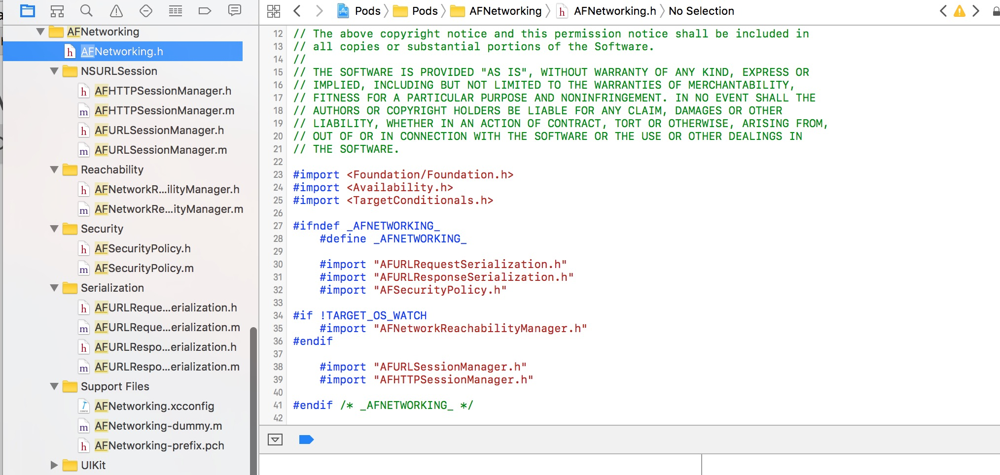
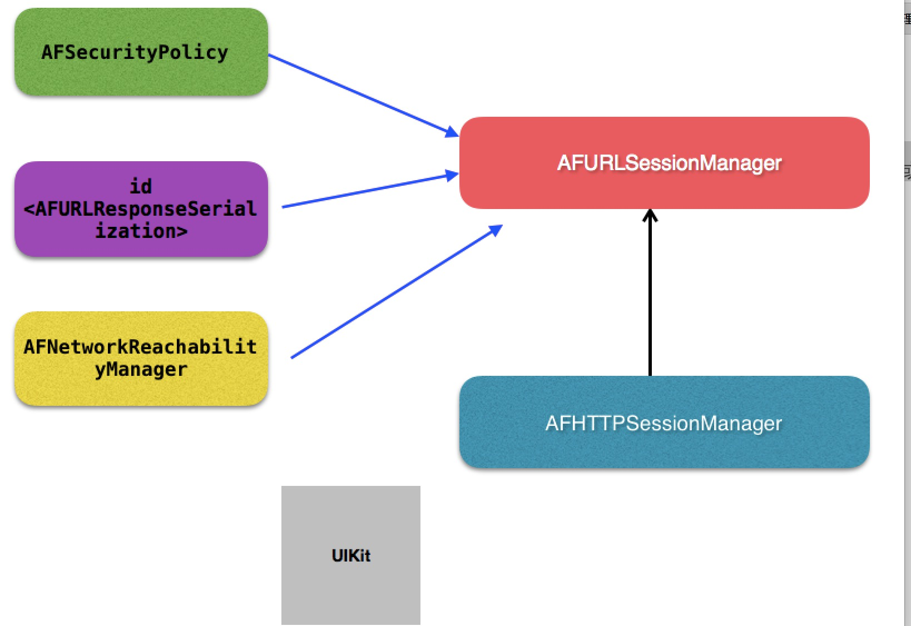
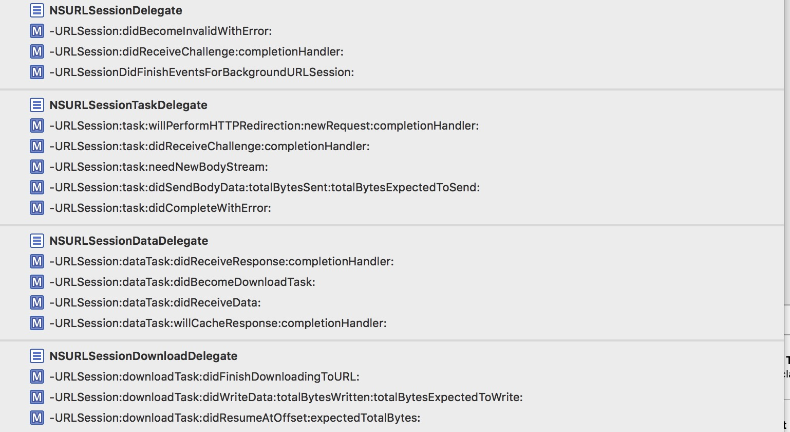
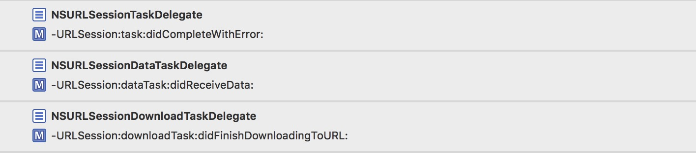
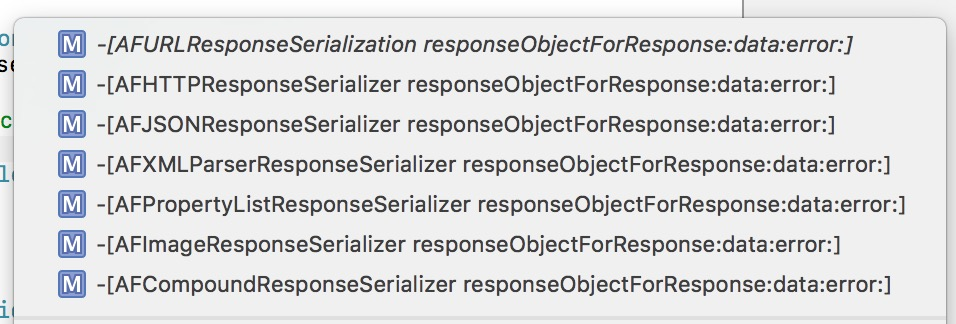

 
<!--BEGIN_DATA
{
    "create_date": "2016-12-28 15:51", 
    "modify_date": "2016-12-28 15:51", 
    "is_top": "0", 
    "summary": "AFNetworking到底做了什么？", 
    "tags": "iOS", 
    "file_name": "AFNetworking到底做了什么？.md"
}
END_DATA-->

####<p>原文出处：<a href='http://www.jianshu.com/p/856f0e26279d' target='blank'>AFNetworking到底做了什么？</a></p>

##AFNetworking到底做了什么？

  

#####写在开头：

  * 作为一个iOS开发，也许你不知道NSUrlRequest、不知道NSUrlConnection、也不知道NSURLSession...（说不下去了...怎么会什么都不知道...）但是你一定知道AFNetworking。
  * 大多数人习惯了只要是请求网络都用AF，但是你真的知道AF做了什么吗？为什么我们不用原生的NSURLSession而选择AFNetworking?
  * 本文将从源码的角度去分析AF的实际作用。  
**或许看完这篇文章，你心里会有一个答案。**

#####先从最新的AF3.x讲起吧：

  * 首先，我们就一起分析一下该框架的组成。  
将AF下载导入工程后，下面是其包结构，相对于2.x变得非常简单了：  

  

AF代码结构图.png

除去Support Files，可以看到AF分为如下5个功能模块：

  * 网络通信模块(AFURLSessionManager、AFHTTPSessionManger)
  * 网络状态监听模块(Reachability)
  * 网络通信安全策略模块(Security)
  * 网络通信信息序列化/反序列化模块(Serialization)
  * 对于iOS UIKit库的扩展(UIKit) 

#####其核心当然是网络通信模块AFURLSessionManager。大家都知道，AF3.x是基于NSURLSession来封装的。所以这个类围绕着NSURLSession做了一系列的封装。而其余的四个模块，均是为了配合网络通信或对已有UIKit的一个扩展工具包。

这五个模块所对应的类的结构关系图如下所示：

  

AF架构图.png

其中AFHTTPSessionManager是继承于AFURLSessionManager的，我们一般做网络请求都是用这个类，**但是它本身是没有做实事的，只是做了一些简单的封装，把请求逻辑分发给父类AFURLSessionManager或者其它类去做。**

#####首先我们简单的写个get请求：

    
    
    AFHTTPSessionManager *manager = [[AFHTTPSessionManager alloc]init];
    [manager GET:@"http://localhost" parameters:nil progress:nil success:^(NSURLSessionDataTask * _Nonnull task, id  _Nullable responseObject) {
    } failure:^(NSURLSessionDataTask * _Nullable task, NSError * _Nonnull error) {
    }];

首先我们我们调用了初始化方法生成了一个manager，我们点进去看看初始化做了什么:

    
    
    - (instancetype)init {
        return [self initWithBaseURL:nil];
    }
    - (instancetype)initWithBaseURL:(NSURL *)url {
        return [self initWithBaseURL:url sessionConfiguration:nil];
    }
    - (instancetype)initWithSessionConfiguration:(NSURLSessionConfiguration *)configuration {
        return [self initWithBaseURL:nil sessionConfiguration:configuration];
    }
    - (instancetype)initWithBaseURL:(NSURL *)url
               sessionConfiguration:(NSURLSessionConfiguration *)configuration
    {
        self = [super initWithSessionConfiguration:configuration];
        if (!self) {
            return nil;
        }
        //对传过来的BaseUrl进行处理，如果有值且最后不包含/，url加上"/"
      //--经一位热心读者更正...以后注释也一定要走心啊...不能误导大家...
        if ([[url path] length] > 0 && ![[url absoluteString] hasSuffix:@"/"]) {
            url = [url URLByAppendingPathComponent:@""];
        }
        self.baseURL = url;
        self.requestSerializer = [AFHTTPRequestSerializer serializer];
        self.responseSerializer = [AFJSONResponseSerializer serializer];
        return self;
    }

  * 初始化都调用到`\- (instancetype)initWithBaseURL:(NSURL *)url sessionConfiguration:(NSURLSessionConfiguration *)configuration`方法中来了。
  * **其实初始化方法都调用父类的初始化方法。**父类也就是AF3.x**最最核心的类AFURLSessionManager**。几乎所有的类都是围绕着这个类在处理业务逻辑。
  * 除此之外，方法中把baseURL存了起来，还生成了一个请求序列对象和一个响应序列对象。后面再细说这两个类是干什么用的。

直接来到父类AFURLSessionManager的初始化方法：

    
    
    - (instancetype)init {
        return [self initWithSessionConfiguration:nil];
    }
    - (instancetype)initWithSessionConfiguration:(NSURLSessionConfiguration *)configuration {
        self = [super init];
        if (!self) {
            return nil;
        }
        if (!configuration) {
            configuration = [NSURLSessionConfiguration defaultSessionConfiguration];
        }
        self.sessionConfiguration = configuration;
        self.operationQueue = [[NSOperationQueue alloc] init];
        //queue并发线程数设置为1
        self.operationQueue.maxConcurrentOperationCount = 1;
        //注意代理，代理的继承，实际上NSURLSession去判断了，你实现了哪个方法会去调用，包括子代理的方法！
        self.session = [NSURLSession sessionWithConfiguration:self.sessionConfiguration delegate:self delegateQueue:self.operationQueue];
        //各种响应转码
        self.responseSerializer = [AFJSONResponseSerializer serializer];
        //设置默认安全策略
        self.securityPolicy = [AFSecurityPolicy defaultPolicy];
    #if !TARGET_OS_WATCH
        self.reachabilityManager = [AFNetworkReachabilityManager sharedManager];
    #endif
        // 设置存储NSURL task与AFURLSessionManagerTaskDelegate的词典（重点，在AFNet中，每一个task都会被匹配一个AFURLSessionManagerTaskDelegate 来做task的delegate事件处理） ===============
        self.mutableTaskDelegatesKeyedByTaskIdentifier = [[NSMutableDictionary alloc] init];
        //  设置AFURLSessionManagerTaskDelegate 词典的锁，确保词典在多线程访问时的线程安全
        self.lock = [[NSLock alloc] init];
        self.lock.name = AFURLSessionManagerLockName;
        // 置空task关联的代理
        [self.session getTasksWithCompletionHandler:^(NSArray *dataTasks, NSArray *uploadTasks, NSArray *downloadTasks) {        
            for (NSURLSessionDataTask *task in dataTasks) {
                [self addDelegateForDataTask:task uploadProgress:nil downloadProgress:nil completionHandler:nil];
            }
            for (NSURLSessionUploadTask *uploadTask in uploadTasks) {
                [self addDelegateForUploadTask:uploadTask progress:nil completionHandler:nil];
            }
            for (NSURLSessionDownloadTask *downloadTask in downloadTasks) {
                [self addDelegateForDownloadTask:downloadTask progress:nil destination:nil completionHandler:nil];
            }
        }];
        return self;
    }

  * 这个就是最终的初始化方法了，注释应该写的很清楚，唯一需要说的就是三点：
    * `self.operationQueue.maxConcurrentOperationCount = 1;`**这个operationQueue就是我们代理回调的queue。这里把代理回调的线程并发数设置为1了。**至于这里为什么要这么做，我们先留一个坑，等我们讲完AF2.x之后再来分析这一块。
    * 第二就是我们初始化了一些属性，其中包括`self.mutableTaskDelegatesKeyedByTaskIdentifier`，这个是用来让每一个请求task和我们自定义的AF代理来建立映射用的，其实AF对task的代理进行了一个封装，并且转发代理到AF自定义的代理，这是AF比较重要的一部分，接下来我们会具体讲这一块。
    * 第三就是下面这个方法：
        
           	[self.session getTasksWithCompletionHandler:^(NSArray *dataTasks, NSArray *uploadTasks, NSArray *downloadTasks) { 
        	}];

首先说说这个方法是干什么用的：这个方法用来异步的获取当前session的所有未完成的task。其实讲道理来说在初始化中调用这个方法应该里面一个task都不会有。我们打断点去看，也确实如此，里面的数组都是空的。但是想想也知道，AF大神不会把一段没用的代码放在这吧。辗转多处，终于从AF的issue中找到了结论：[github](https://github.com/AFNetworking/AFNetworking/issues/3499)。

  * 原来这是为了从后台回来，重新初始化session，防止一些之前的后台请求任务，导致程序的crash。

初始化方法到这就全部完成了。

  

分割图.png

接着我们来看看网络请求:

    
    
    - (NSURLSessionDataTask *)GET:(NSString *)URLString
                       parameters:(id)parameters
                         progress:(void (^)(NSProgress * _Nonnull))downloadProgress
                          success:(void (^)(NSURLSessionDataTask * _Nonnull, id _Nullable))success
                          failure:(void (^)(NSURLSessionDataTask * _Nullable, NSError * _Nonnull))failure
    {
         //生成一个task
        NSURLSessionDataTask *dataTask = [self dataTaskWithHTTPMethod:@"GET"
                                                            URLString:URLString
                                                           parameters:parameters
                                                       uploadProgress:nil
                                                     downloadProgress:downloadProgress
                                                              success:success
                                                              failure:failure];
        //开始网络请求
        [dataTask resume];
        return dataTask;
    }

方法走到类AFHTTPSessionManager中来，调用父类，也就是我们整个AF3.x的核心类AFURLSessionManager的方法，生成了一个系
统的NSURLSessionDataTask实例，并且开始网络请求。  
我们继续往父类里看，看看这个方法到底做了什么：

    
    
    - (NSURLSessionDataTask *)dataTaskWithHTTPMethod:(NSString *)method
                                           URLString:(NSString *)URLString
                                          parameters:(id)parameters
                                      uploadProgress:(nullable void (^)(NSProgress *uploadProgress)) uploadProgress
                                    downloadProgress:(nullable void (^)(NSProgress *downloadProgress)) downloadProgress
                                             success:(void (^)(NSURLSessionDataTask *, id))success
                                             failure:(void (^)(NSURLSessionDataTask *, NSError *))failure
    {
        NSError *serializationError = nil;
        //把参数，还有各种东西转化为一个request
        NSMutableURLRequest *request = [self.requestSerializer requestWithMethod:method URLString:[[NSURL URLWithString:URLString relativeToURL:self.baseURL] absoluteString] parameters:parameters error:&serializationError];
        if (serializationError) {
            if (failure) {
    #pragma clang diagnostic push
    #pragma clang diagnostic ignored "-Wgnu"
                //如果解析错误，直接返回
                dispatch_async(self.completionQueue ?: dispatch_get_main_queue(), ^{
                    failure(nil, serializationError);
                });
    #pragma clang diagnostic pop
            }
            return nil;
        }
        __block NSURLSessionDataTask *dataTask = nil;
        dataTask = [self dataTaskWithRequest:request
                              uploadProgress:uploadProgress
                            downloadProgress:downloadProgress
                           completionHandler:^(NSURLResponse * __unused response, id responseObject, NSError *error) {
            if (error) {
                if (failure) {
                    failure(dataTask, error);
                }
            } else {
                if (success) {
                    success(dataTask, responseObject);
                }
            }
        }];
        return dataTask;
    }

  * 这个方法做了两件事：  
1.用self.requestSerializer和各种参数去获取了一个我们最终请求网络需要的NSMutableURLRequest实例。  
2.调用另外一个方法dataTaskWithRequest去拿到我们最终需要的NSURLSessionDataTask实例，并且在完成的回调里，调用我们传过
来的成功和失败的回调。

  * 注意下面这个方法，我们常用来 push pop搭配，来忽略一些编译器的警告：
    
        #pragma clang diagnostic push
	    #pragma clang diagnostic ignored "-Wgnu"
	    #pragma clang diagnostic pop

这里是用来忽略**：？**带来的警告，具体的各种编译器警告描述，可以参考这篇：[各种编译器的警告](http://fuckingclangwarnings.com/#semantic)。

  * 说到底这个方法还是没有做实事，我们继续到requestSerializer方法里去看，看看AF到底如何拼接成我们需要的request的：

接着我们跑到AFURLRequestSerialization类中：

    
    
    - (NSMutableURLRequest *)requestWithMethod:(NSString *)method
                                     URLString:(NSString *)URLString
                                    parameters:(id)parameters
                                         error:(NSError *__autoreleasing *)error
    {
        //断言，debug模式下，如果缺少改参数，crash
        NSParameterAssert(method);
        NSParameterAssert(URLString);
        NSURL *url = [NSURL URLWithString:URLString];
        NSParameterAssert(url);
        NSMutableURLRequest *mutableRequest = [[NSMutableURLRequest alloc] initWithURL:url];
        mutableRequest.HTTPMethod = method;
        //将request的各种属性循环遍历
        for (NSString *keyPath in AFHTTPRequestSerializerObservedKeyPaths()) {
            //如果自己观察到的发生变化的属性，在这些方法里
            if ([self.mutableObservedChangedKeyPaths containsObject:keyPath]) {
               //把给自己设置的属性给request设置
                [mutableRequest setValue:[self valueForKeyPath:keyPath] forKey:keyPath];
            }
        }
        //将传入的parameters进行编码，并添加到request中
        mutableRequest = [[self requestBySerializingRequest:mutableRequest withParameters:parameters error:error] mutableCopy];
        return mutableRequest;
    }

  * 讲一下这个方法，这个方法做了3件事：  
1）设置request的请求类型，get,post,put...等  
2）往request里添加一些参数设置，其中`AFHTTPRequestSerializerObservedKeyPaths()`是一个c函数，返回一个数组
，我们来看看这个函数:

    
        static NSArray * AFHTTPRequestSerializerObservedKeyPaths() {
	      static NSArray *_AFHTTPRequestSerializerObservedKeyPaths = nil;
	      static dispatch_once_t onceToken;
	      // 此处需要observer的keypath为allowsCellularAccess、cachePolicy、HTTPShouldHandleCookies
	      // HTTPShouldUsePipelining、networkServiceType、timeoutInterval
	      dispatch_once(&onceToken, ^{
	          _AFHTTPRequestSerializerObservedKeyPaths = @[NSStringFromSelector(@selector(allowsCellularAccess)), NSStringFromSelector(@selector(cachePolicy)), NSStringFromSelector(@selector(HTTPShouldHandleCookies)), NSStringFromSelector(@selector(HTTPShouldUsePipelining)), NSStringFromSelector(@selector(networkServiceType)), NSStringFromSelector(@selector(timeoutInterval))];
	      });
	      //就是一个数组里装了很多方法的名字,
	      return _AFHTTPRequestSerializerObservedKeyPaths;
	    }

其实这个函数就是封装了一些属性的名字，这些都是NSUrlRequest的属性。  
再来看看`self.mutableObservedChangedKeyPaths`,这个是当前类的一个属性：

    
        @property (readwrite, nonatomic, strong) NSMutableSet *mutableObservedChangedKeyPaths;

在-init方法对这个集合进行了初始化，**并且对当前类的和NSUrlRequest相关的那些属性添加了KVO监听**：

    
        //每次都会重置变化
      self.mutableObservedChangedKeyPaths = [NSMutableSet set];
      //给这自己些方法添加观察者为自己，就是request的各种属性，set方法
      for (NSString *keyPath in AFHTTPRequestSerializerObservedKeyPaths()) {
          if ([self respondsToSelector:NSSelectorFromString(keyPath)]) {
              [self addObserver:self forKeyPath:keyPath options:NSKeyValueObservingOptionNew context:AFHTTPRequestSerializerObserverContext];
          }
      }

KVO触发的方法：

    
        -(void)observeValueForKeyPath:(NSString *)keyPath
                        ofObject:(__unused id)object
                          change:(NSDictionary *)change
                         context:(void *)context
    {
      //当观察到这些set方法被调用了，而且不为Null就会添加到集合里，否则移除
      if (context == AFHTTPRequestSerializerObserverContext) {
          if ([change[NSKeyValueChangeNewKey] isEqual:[NSNull null]]) {
              [self.mutableObservedChangedKeyPaths removeObject:keyPath];
          } else {
              [self.mutableObservedChangedKeyPaths addObject:keyPath];
          }
      }
    }

至此我们知道`self.mutableObservedChangedKeyPaths`其实就是我们自己设置的request属性值的集合。  

接下来调用：

    
        [mutableRequest setValue:[self valueForKeyPath:keyPath] forKey:keyPath];

用KVC的方式，把属性值都设置到我们请求的request中去。

3）把需要传递的参数进行编码，并且设置到request中去：

    
    //将传入的parameters进行编码，并添加到request中
    mutableRequest = [[self requestBySerializingRequest:mutableRequest withParameters:parameters error:error] mutableCopy];
    
    - (NSURLRequest *)requestBySerializingRequest:(NSURLRequest *)request
                                 withParameters:(id)parameters
                                          error:(NSError *__autoreleasing *)error
    {
      NSParameterAssert(request);
      NSMutableURLRequest *mutableRequest = [request mutableCopy];
      //从自己的head里去遍历，如果有值则设置给request的head
      [self.HTTPRequestHeaders enumerateKeysAndObjectsUsingBlock:^(id field, id value, BOOL * __unused stop) {
          if (![request valueForHTTPHeaderField:field]) {
              [mutableRequest setValue:value forHTTPHeaderField:field];
          }
      }];
      //来把各种类型的参数，array dic set转化成字符串，给request
      NSString *query = nil;
      if (parameters) {
          //自定义的解析方式
          if (self.queryStringSerialization) {
              NSError *serializationError;
              query = self.queryStringSerialization(request, parameters, &serializationError);
              if (serializationError) {
                  if (error) {
                      *error = serializationError;
                  }
                  return nil;
              }
          } else {
              //默认解析方式
              switch (self.queryStringSerializationStyle) {
                  case AFHTTPRequestQueryStringDefaultStyle:
                      query = AFQueryStringFromParameters(parameters);
                      break;
              }
          }
      }
      //最后判断该request中是否包含了GET、HEAD、DELETE（都包含在HTTPMethodsEncodingParametersInURI）。因为这几个method的quey是拼接到url后面的。而POST、PUT是把query拼接到http body中的。
      if ([self.HTTPMethodsEncodingParametersInURI containsObject:[[request HTTPMethod] uppercaseString]]) {
          if (query && query.length > 0) {
              mutableRequest.URL = [NSURL URLWithString:[[mutableRequest.URL absoluteString] stringByAppendingFormat:mutableRequest.URL.query ? @"&%@" : @"?%@", query]];
          }
      } else {
          //post put请求
          // #2864: an empty string is a valid x-www-form-urlencoded payload
          if (!query) {
              query = @"";
          }
          if (![mutableRequest valueForHTTPHeaderField:@"Content-Type"]) {
              [mutableRequest setValue:@"application/x-www-form-urlencoded" forHTTPHeaderField:@"Content-Type"];
          }
          //设置请求体
          [mutableRequest setHTTPBody:[query dataUsingEncoding:self.stringEncoding]];
      }
      return mutableRequest;
    }

这个方法做了3件事：  
1.从`self.HTTPRequestHeaders`中拿到设置的参数，赋值要请求的request里去  
2.把请求网络的参数，从array dic set这些容器类型转换为字符串，具体转码方式，我们可以使用自定义的方式，也可以用AF默认的转码方式。自定义的方式没什么好说的，想怎么去解析由你自己来决定。我们可以来看看默认的方式：

```C
  NSString * AFQueryStringFromParameters(NSDictionary *parameters) {
  NSMutableArray *mutablePairs = [NSMutableArray array];
  //把参数给AFQueryStringPairsFromDictionary，拿到AF的一个类型的数据就一个key，value对象，在URLEncodedStringValue拼接keyValue，一个加到数组里
  for (AFQueryStringPair *pair in AFQueryStringPairsFromDictionary(parameters)) {
      [mutablePairs addObject:[pair URLEncodedStringValue]];
  }
  //拆分数组返回参数字符串
  return [mutablePairs componentsJoinedByString:@"&"];
}

NSArray * AFQueryStringPairsFromDictionary(NSDictionary *dictionary) {
  //往下调用
  return AFQueryStringPairsFromKeyAndValue(nil, dictionary);
}

NSArray * AFQueryStringPairsFromKeyAndValue(NSString *key, id value) {
  NSMutableArray *mutableQueryStringComponents = [NSMutableArray array];
  // 根据需要排列的对象的description来进行升序排列，并且selector使用的是compare:
  // 因为对象的description返回的是NSString，所以此处compare:使用的是NSString的compare函数
  // 即@[@"foo", @"bar", @"bae"] ----> @[@"bae", @"bar",@"foo"]
  NSSortDescriptor *sortDescriptor = [NSSortDescriptor sortDescriptorWithKey:@"description" ascending:YES selector:@selector(compare:)];
  //判断vaLue是什么类型的，然后去递归调用自己，直到解析的是除了array dic set以外的元素，然后把得到的参数数组返回。
  if ([value isKindOfClass:[NSDictionary class]]) {
      NSDictionary *dictionary = value;
      // Sort dictionary keys to ensure consistent ordering in query string, which is important when deserializing potentially ambiguous sequences, such as an array of dictionaries
      //拿到
      for (id nestedKey in [dictionary.allKeys sortedArrayUsingDescriptors:@[ sortDescriptor ]]) {
          id nestedValue = dictionary[nestedKey];
          if (nestedValue) {
              [mutableQueryStringComponents addObjectsFromArray:AFQueryStringPairsFromKeyAndValue((key ? [NSString stringWithFormat:@"%@[%@]", key, nestedKey] : nestedKey), nestedValue)];
          }
      }
  } else if ([value isKindOfClass:[NSArray class]]) {
      NSArray *array = value;
      for (id nestedValue in array) {
          [mutableQueryStringComponents addObjectsFromArray:AFQueryStringPairsFromKeyAndValue([NSString stringWithFormat:@"%@[]", key], nestedValue)];
      }
  } else if ([value isKindOfClass:[NSSet class]]) {
      NSSet *set = value;
      for (id obj in [set sortedArrayUsingDescriptors:@[ sortDescriptor ]]) {
          [mutableQueryStringComponents addObjectsFromArray:AFQueryStringPairsFromKeyAndValue(key, obj)];
      }
  } else {
      [mutableQueryStringComponents addObject:[[AFQueryStringPair alloc] initWithField:key value:value]];
  }
  return mutableQueryStringComponents;
}
```
* 转码主要是以上三个函数，配合着注释应该也很好理解：主要是在递归调用`AFQueryStringPairsFromKeyAndValue`。判断vaLue是什么类型的，然后去递归调用自己，直到解析的是除了array dic set以外的元素，然后把得到的参数数组返回。
* 其中有个`AFQueryStringPair`对象，其只有两个属性和两个方法：

```C
@property (readwrite, nonatomic, strong) id field;
@property (readwrite, nonatomic, strong) id value;

- (instancetype)initWithField:(id)field value:(id)value {
	self = [super init];
	if (!self) {
	    return nil;
	}
	self.field = field;
	self.value = value;
	return self;
}

- (NSString *)URLEncodedStringValue {
	if (!self.value || [self.value isEqual:[NSNull null]]) {
	    return AFPercentEscapedStringFromString([self.field description]);
	} else {
	    return [NSString stringWithFormat:@"%@=%@", AFPercentEscapedStringFromString([self.field description]), AFPercentEscapedStringFromString([self.value description])];
	}
}
```
方法很简单，现在我们也很容易理解这整个转码过程了，我们举个例子梳理下，就是以下这3步：

        
        @{ 
         @"name" : @"bang", 
         @"phone": @{@"mobile": @"xx", @"home": @"xx"}, 
         @"families": @[@"father", @"mother"], 
         @"nums": [NSSet setWithObjects:@"1", @"2", nil] 
        } 
        -> 
        @[ 
         field: @"name", value: @"bang", 
         field: @"phone[mobile]", value: @"xx", 
         field: @"phone[home]", value: @"xx", 
         field: @"families[]", value: @"father", 
         field: @"families[]", value: @"mother", 
         field: @"nums", value: @"1", 
         field: @"nums", value: @"2", 
        ] 
        -> 
        name=bang&phone[mobile]=xx&phone[home]=xx&families[]=father&families[]=mother&nums=1&num=2

至此，我们原来的容器类型的参数，就这样变成字符串类型了。

紧接着这个方法还根据该request中请求类型，来判断参数字符串应该如何设置到request中去。如果是GET、HEAD、DELETE，则把参数quey是拼
接到url后面的。而POST、PUT是把query拼接到http body中的:

    
    if ([self.HTTPMethodsEncodingParametersInURI containsObject:[[request HTTPMethod] uppercaseString]]) {
      if (query && query.length > 0) {
          mutableRequest.URL = [NSURL URLWithString:[[mutableRequest.URL absoluteString] stringByAppendingFormat:mutableRequest.URL.query ? @"&%@" : @"?%@", query]];
      }
    } else {
      //post put请求
      // #2864: an empty string is a valid x-www-form-urlencoded payload
      if (!query) {
          query = @"";
      }
      if (![mutableRequest valueForHTTPHeaderField:@"Content-Type"]) {
          [mutableRequest setValue:@"application/x-www-form-urlencoded" forHTTPHeaderField:@"Content-Type"];
      }
      //设置请求体
      [mutableRequest setHTTPBody:[query dataUsingEncoding:self.stringEncoding]];
    }

至此，我们生成了一个request。

  

分割图.png

#####我们再回到AFHTTPSessionManager类中来,回到这个方法：

    
    
    - (NSURLSessionDataTask *)dataTaskWithHTTPMethod:(NSString *)method
                                           URLString:(NSString *)URLString
                                          parameters:(id)parameters
                                      uploadProgress:(nullable void (^)(NSProgress *uploadProgress)) uploadProgress
                                    downloadProgress:(nullable void (^)(NSProgress *downloadProgress)) downloadProgress
                                             success:(void (^)(NSURLSessionDataTask *, id))success
                                             failure:(void (^)(NSURLSessionDataTask *, NSError *))failure
    {
        NSError *serializationError = nil;
        //把参数，还有各种东西转化为一个request
        NSMutableURLRequest *request = [self.requestSerializer requestWithMethod:method URLString:[[NSURL URLWithString:URLString relativeToURL:self.baseURL] absoluteString] parameters:parameters error:&serializationError];
        if (serializationError) {
            if (failure) {
    #pragma clang diagnostic push
    #pragma clang diagnostic ignored "-Wgnu"
                //如果解析错误，直接返回
                dispatch_async(self.completionQueue ?: dispatch_get_main_queue(), ^{
                    failure(nil, serializationError);
                });
    #pragma clang diagnostic pop
            }
            return nil;
        }
        __block NSURLSessionDataTask *dataTask = nil;
        dataTask = [self dataTaskWithRequest:request
                              uploadProgress:uploadProgress
                            downloadProgress:downloadProgress
                           completionHandler:^(NSURLResponse * __unused response, id responseObject, NSError *error) {
            if (error) {
                if (failure) {
                    failure(dataTask, error);
                }
            } else {
                if (success) {
                    success(dataTask, responseObject);
                }
            }
        }];
        return dataTask;
    }

绕了一圈我们又回来了。。

  * 我们继续往下看：当解析错误，我们直接调用传进来的fauler的Block失败返回了，这里有一个`self.completionQueue`,这个是我们自定义的，这个是一个GCD的Queue如果设置了那么从这个Queue中回调结果，否则从主队列回调。

  * 实际上这个Queue还是挺有用的，之前还用到过。我们公司有自己的一套数据加解密的解析模式，所以我们回调回来的数据并不想是主线程，我们可以设置这个Queue,在分线程进行解析数据，然后自己再调回到主线程去刷新UI。

言归正传，我们接着调用了父类的生成task的方法，并且执行了一个成功和失败的回调，我们接着去父类AFURLSessionManger里看（总算到我们的核心类
了..）：

    
    
    - (NSURLSessionDataTask *)dataTaskWithRequest:(NSURLRequest *)request
                                   uploadProgress:(nullable void (^)(NSProgress *uploadProgress)) uploadProgressBlock
                                 downloadProgress:(nullable void (^)(NSProgress *downloadProgress)) downloadProgressBlock
                                completionHandler:(nullable void (^)(NSURLResponse *response, id _Nullable responseObject,  NSError * _Nullable error))completionHandler {
        __block NSURLSessionDataTask *dataTask = nil;
        //第一件事，创建NSURLSessionDataTask，里面适配了Ios8以下taskIdentifiers，函数创建task对象。
        //其实现应该是因为iOS 8.0以下版本中会并发地创建多个task对象，而同步有没有做好，导致taskIdentifiers 不唯一…这边做了一个串行处理
        url_session_manager_create_task_safely(^{
            dataTask = [self.session dataTaskWithRequest:request];
        });
        [self addDelegateForDataTask:dataTask uploadProgress:uploadProgressBlock downloadProgress:downloadProgressBlock completionHandler:completionHandler];
        return dataTask;
    }

  * 我们注意到这个方法非常简单，就调用了一个`url_session_manager_create_task_safely()`函数，传了一个Block进去，Block里就是iOS原生生成dataTask的方法。此外，还调用了一个`addDelegateForDataTask`的方法。
  * 我们到这先到这个函数里去看看：
    
        static void url_session_manager_create_task_safely(dispatch_block_t block) {
	      if (NSFoundationVersionNumber < NSFoundationVersionNumber_With_Fixed_5871104061079552_bug) {
	          // Fix of bug
	          // Open Radar:http://openradar.appspot.com/radar?id=5871104061079552 (status: Fixed in iOS8)
	          // Issue about:https://github.com/AFNetworking/AFNetworking/issues/2093
	        //理解下，第一为什么用sync，因为是想要主线程等在这，等执行完，在返回，因为必须执行完dataTask才有数据，传值才有意义。
	        //第二，为什么要用串行队列，因为这块是为了防止ios8以下内部的dataTaskWithRequest是并发创建的，
	        //这样会导致taskIdentifiers这个属性值不唯一，因为后续要用taskIdentifiers来作为Key对应delegate。
	          dispatch_sync(url_session_manager_creation_queue(), block);
	      } else {
	          block();
	      }
	    }
	    static dispatch_queue_t url_session_manager_creation_queue() {
	      static dispatch_queue_t af_url_session_manager_creation_queue;
	      static dispatch_once_t onceToken;
	      //保证了即使是在多线程的环境下，也不会创建其他队列
	      dispatch_once(&onceToken, ^{
	          af_url_session_manager_creation_queue = dispatch_queue_create("com.alamofire.networking.session.manager.creation", DISPATCH_QUEUE_SERIAL);
	      });
	      return af_url_session_manager_creation_queue;
	    }

    * 方法非常简单，关键是理解这么做的目的：为什么我们不直接去调用  
`dataTask = [self.session dataTaskWithRequest:request];`  
非要绕这么一圈，我们点进去bug日志里看看，**原来这是为了适配iOS8的以下，创建session的时候，偶发的情况会出现session的属性taskIde
ntifier这个值不唯一**，而这个taskIdentifier是我们后面来映射delegate的key,所以它必须是唯一的。

    * **具体原因应该是NSURLSession内部去生成task的时候是用多线程并发去执行的。**想通了这一点，我们就很好解决了，我们只需要在iOS8以下**同步串行**的去生成task就可以防止这一问题发生（如果还是不理解同步串行的原因，可以看看注释）。
    * 题外话：很多同学都会抱怨为什么sync我从来用不到，看，有用到的地方了吧，**很多东西不是没用，而只是你想不到怎么用**。

我们接着看到：

    
    
    [self addDelegateForDataTask:dataTask uploadProgress:uploadProgressBlock downloadProgress:downloadProgressBlock completionHandler:completionHandler];

调用到：

    
    
    - (void)addDelegateForDataTask:(NSURLSessionDataTask *)dataTask
                    uploadProgress:(nullable void (^)(NSProgress *uploadProgress)) uploadProgressBlock
                  downloadProgress:(nullable void (^)(NSProgress *downloadProgress)) downloadProgressBlock
                 completionHandler:(void (^)(NSURLResponse *response, id responseObject, NSError *error))completionHandler
    {
        AFURLSessionManagerTaskDelegate *delegate = [[AFURLSessionManagerTaskDelegate alloc] init];
        // AFURLSessionManagerTaskDelegate与AFURLSessionManager建立相互关系
        delegate.manager = self;
        delegate.completionHandler = completionHandler;
        //这个taskDescriptionForSessionTasks用来发送开始和挂起通知的时候会用到,就是用这个值来Post通知，来两者对应
        dataTask.taskDescription = self.taskDescriptionForSessionTasks;
        // ***** 将AF delegate对象与 dataTask建立关系
        [self setDelegate:delegate forTask:dataTask];
        // 设置AF delegate的上传进度，下载进度块。
        delegate.uploadProgressBlock = uploadProgressBlock;
        delegate.downloadProgressBlock = downloadProgressBlock;
    }

  * 总结一下:  
1）这个方法，生成了一个`AFURLSessionManagerTaskDelegate`,这个其实就是AF的自定义代理。我们请求传来的参数，都赋值给这个AF的代理了。  
2）`delegate.manager = self;`代理把AFURLSessionManager这个类作为属性了,我们可以看到：

    
        @property (nonatomic, weak) AFURLSessionManager *manager;

这个属性是弱引用的，所以不会存在循环引用的问题。  
3）我们调用了`[self setDelegate:delegate forTask:dataTask];`

我们进去看看这个方法做了什么：

    
    
    - (void)setDelegate:(AFURLSessionManagerTaskDelegate *)delegate
                forTask:(NSURLSessionTask *)task
    {
        //断言，如果没有这个参数，debug下crash在这
        NSParameterAssert(task);
        NSParameterAssert(delegate);
        //加锁保证字典线程安全
        [self.lock lock];
        // 将AF delegate放入以taskIdentifier标记的词典中（同一个NSURLSession中的taskIdentifier是唯一的）
        self.mutableTaskDelegatesKeyedByTaskIdentifier[@(task.taskIdentifier)] = delegate;
        // 为AF delegate 设置task 的progress监听
        [delegate setupProgressForTask:task];
        //添加task开始和暂停的通知
        [self addNotificationObserverForTask:task];
        [self.lock unlock];
    }

  * 这个方法主要就是把AF代理和task建立映射，存在了一个我们事先声明好的字典里。
  * 而要加锁的原因是因为本身我们这个字典属性是mutable的，是线程不安全的。而我们对这些方法的调用，确实是会在复杂的多线程环境中，后面会仔细提到线程问题。
  * 还有个`[delegate setupProgressForTask:task];`我们到方法里去看看：
    
```C
- (void)setupProgressForTask:(NSURLSessionTask *)task {
    __weak __typeof__(task) weakTask = task;
    //拿到上传下载期望的数据大小
    self.uploadProgress.totalUnitCount = task.countOfBytesExpectedToSend;
    self.downloadProgress.totalUnitCount = task.countOfBytesExpectedToReceive;
    //将上传与下载进度和 任务绑定在一起，直接cancel suspend resume进度条，可以cancel...任务
    [self.uploadProgress setCancellable:YES];
    [self.uploadProgress setCancellationHandler:^{
        __typeof__(weakTask) strongTask = weakTask;
        [strongTask cancel];
    }];
    [self.uploadProgress setPausable:YES];
    [self.uploadProgress setPausingHandler:^{
        __typeof__(weakTask) strongTask = weakTask;
        [strongTask suspend];
    }];
    if ([self.uploadProgress respondsToSelector:@selector(setResumingHandler:)]) {
        [self.uploadProgress setResumingHandler:^{
            __typeof__(weakTask) strongTask = weakTask;
            [strongTask resume];
        }];
    }
    [self.downloadProgress setCancellable:YES];
    [self.downloadProgress setCancellationHandler:^{
        __typeof__(weakTask) strongTask = weakTask;
        [strongTask cancel];
    }];
    [self.downloadProgress setPausable:YES];
    [self.downloadProgress setPausingHandler:^{
        __typeof__(weakTask) strongTask = weakTask;
        [strongTask suspend];
    }];
    if ([self.downloadProgress respondsToSelector:@selector(setResumingHandler:)]) {
        [self.downloadProgress setResumingHandler:^{
            __typeof__(weakTask) strongTask = weakTask;
            [strongTask resume];
        }];
    }
    //观察task的这些属性
    [task addObserver:self
           forKeyPath:NSStringFromSelector(@selector(countOfBytesReceived))
              options:NSKeyValueObservingOptionNew
              context:NULL];
    [task addObserver:self
           forKeyPath:NSStringFromSelector(@selector(countOfBytesExpectedToReceive))
              options:NSKeyValueObservingOptionNew
              context:NULL];
    [task addObserver:self
           forKeyPath:NSStringFromSelector(@selector(countOfBytesSent))
              options:NSKeyValueObservingOptionNew
              context:NULL];
    [task addObserver:self
           forKeyPath:NSStringFromSelector(@selector(countOfBytesExpectedToSend))
              options:NSKeyValueObservingOptionNew
              context:NULL];
    //观察progress这两个属性
    [self.downloadProgress addObserver:self
                            forKeyPath:NSStringFromSelector(@selector(fractionCompleted))
                               options:NSKeyValueObservingOptionNew
                               context:NULL];
    [self.uploadProgress addObserver:self
                          forKeyPath:NSStringFromSelector(@selector(fractionCompleted))
                             options:NSKeyValueObservingOptionNew
                             context:NULL];
}
```

  * 这个方法也非常简单，主要做了以下几件事：  
1）设置 `downloadProgress`与`uploadProgress`的一些属性，并且把两者和task的任务状态绑定在了一起。注意这两者都是NSProgress的实例对象，（这里可能又一群小伙伴楞在这了，这是个什么...）简单来说，这就是iOS7引进的一个用来管理进度的类，可以开始，暂停，取消，完整的对应了task的各种状态，当progress进行各种操作的时候，task也会引发对应操作。  
2）给task和progress的各个属及添加KVO监听，至于监听了干什么用，我们接着往下看：

```C
- (void)observeValueForKeyPath:(NSString *)keyPath ofObject:(id)object change:(NSDictionary<NSString *,id> *)change context:(void *)context {
  //是task
  if ([object isKindOfClass:[NSURLSessionTask class]] || [object isKindOfClass:[NSURLSessionDownloadTask class]]) {
      //给进度条赋新值
      if ([keyPath isEqualToString:NSStringFromSelector(@selector(countOfBytesReceived))]) {
          self.downloadProgress.completedUnitCount = [change[NSKeyValueChangeNewKey] longLongValue];
      } else if ([keyPath isEqualToString:NSStringFromSelector(@selector(countOfBytesExpectedToReceive))]) {
          self.downloadProgress.totalUnitCount = [change[NSKeyValueChangeNewKey] longLongValue];
      } else if ([keyPath isEqualToString:NSStringFromSelector(@selector(countOfBytesSent))]) {
          self.uploadProgress.completedUnitCount = [change[NSKeyValueChangeNewKey] longLongValue];
      } else if ([keyPath isEqualToString:NSStringFromSelector(@selector(countOfBytesExpectedToSend))]) {
          self.uploadProgress.totalUnitCount = [change[NSKeyValueChangeNewKey] longLongValue];
      }
  }
  //上面的赋新值会触发这两个，调用block回调，用户拿到进度
  else if ([object isEqual:self.downloadProgress]) {
      if (self.downloadProgressBlock) {
          self.downloadProgressBlock(object);
      }
  }
  else if ([object isEqual:self.uploadProgress]) {
      if (self.uploadProgressBlock) {
          self.uploadProgressBlock(object);
      }
  }
}
```

* 方法非常简单直观，主要就是如果task触发KVO,则给progress进度赋值，应为赋值了，所以会触发progress的KVO，也会调用到这里，然后去执行我们传进来的`downloadProgressBlock`和`uploadProgressBlock`。主要的作用就是为了让进度实时的传递。
* 主要是观摩一下大神的写代码的结构，这个解耦的编程思想，不愧是大神...

* 还有一点需要注意：我们之前的setProgress和这个KVO监听，都是在我们AF自定义的delegate内的，是**有一个task就会有一个delegate的。所以说我们是每个task都会去监听这些属性，分别在各自的AF代理内。**看到这，可能有些小伙伴会有点乱，没关系。等整个讲完之后我们还会详细的去讲捋一捋manager、task、还有AF自定义代理三者之前的对应关系。

到这里我们整个对task的处理就完成了。

  

分割图.png

  
接着task就开始请求网络了，还记得我们初始化方法中：

    
    
    self.session = [NSURLSession sessionWithConfiguration:self.sessionConfiguration delegate:self delegateQueue:self.operationQueue];

我们把AFUrlSessionManager作为了所有的task的delegate。当我们请求网络的时候，这些代理开始调用了：

  

NSUrlSession的代理.png

  * AFUrlSessionManager一共实现了如上图所示这么一大堆NSUrlSession相关的代理。（小伙伴们的顺序可能不一样，楼主根据代理隶属重新排序了一下）

  * 而只转发了其中3条到AF自定义的delegate中：  

  

AF自定义delegate.png

这就是我们一开始说的，AFUrlSessionManager对这一大堆代理做了一些公共的处理，而转发到AF自定义代理的3条，则负责把每个task对应的数据回
调出去。

又有小伙伴问了，我们设置的这个代理不是`NSURLSessionDelegate`吗？怎么能响应NSUrlSession这么多代理呢？我们点到类的声明文件中
去看看：

    
    
    @protocol NSURLSessionDelegate <NSObject>
    @protocol NSURLSessionTaskDelegate <NSURLSessionDelegate>
    @protocol NSURLSessionDataDelegate <NSURLSessionTaskDelegate>
    @protocol NSURLSessionDownloadDelegate <NSURLSessionTaskDelegate>
    @protocol NSURLSessionStreamDelegate <NSURLSessionTaskDelegate>

  * 我们可以看到这些代理都是继承关系，而在`NSURLSession`实现中，只要设置了这个代理，它会去判断这些所有的代理，是否`respondsToSelector`这些代理中的方法，如果响应了就会去调用。
  * 而AF还重写了`respondsToSelector`方法:
    
        - (BOOL)respondsToSelector:(SEL)selector {
	      //复写了selector的方法，这几个方法是在本类有实现的，但是如果外面的Block没赋值的话，则返回NO，相当于没有实现！
	      if (selector == @selector(URLSession:task:willPerformHTTPRedirection:newRequest:completionHandler:)) {
	          return self.taskWillPerformHTTPRedirection != nil;
	      } else if (selector == @selector(URLSession:dataTask:didReceiveResponse:completionHandler:)) {
	          return self.dataTaskDidReceiveResponse != nil;
	      } else if (selector == @selector(URLSession:dataTask:willCacheResponse:completionHandler:)) {
	          return self.dataTaskWillCacheResponse != nil;
	      } else if (selector == @selector(URLSessionDidFinishEventsForBackgroundURLSession:)) {
	          return self.didFinishEventsForBackgroundURLSession != nil;
	      }
	      return [[self class] instancesRespondToSelector:selector];
	    }

这样如果没实现这些我们自定义的Block也不会去回调这些代理。因为本身某些代理，只执行了这些自定义的Block，如果Block都没有赋值，那我们调用代理也没
有任何意义。  

讲到这，我们顺便看看AFUrlSessionManager的一些自定义Block：

    
    @property (readwrite, nonatomic, copy) AFURLSessionDidBecomeInvalidBlock sessionDidBecomeInvalid;
    @property (readwrite, nonatomic, copy) AFURLSessionDidReceiveAuthenticationChallengeBlock sessionDidReceiveAuthenticationChallenge;
    @property (readwrite, nonatomic, copy) AFURLSessionDidFinishEventsForBackgroundURLSessionBlock didFinishEventsForBackgroundURLSession;
    @property (readwrite, nonatomic, copy) AFURLSessionTaskWillPerformHTTPRedirectionBlock taskWillPerformHTTPRedirection;
    @property (readwrite, nonatomic, copy) AFURLSessionTaskDidReceiveAuthenticationChallengeBlock taskDidReceiveAuthenticationChallenge;
    @property (readwrite, nonatomic, copy) AFURLSessionTaskNeedNewBodyStreamBlock taskNeedNewBodyStream;
    @property (readwrite, nonatomic, copy) AFURLSessionTaskDidSendBodyDataBlock taskDidSendBodyData;
    @property (readwrite, nonatomic, copy) AFURLSessionTaskDidCompleteBlock taskDidComplete;
    @property (readwrite, nonatomic, copy) AFURLSessionDataTaskDidReceiveResponseBlock dataTaskDidReceiveResponse;
    @property (readwrite, nonatomic, copy) AFURLSessionDataTaskDidBecomeDownloadTaskBlock dataTaskDidBecomeDownloadTask;
    @property (readwrite, nonatomic, copy) AFURLSessionDataTaskDidReceiveDataBlock dataTaskDidReceiveData;
    @property (readwrite, nonatomic, copy) AFURLSessionDataTaskWillCacheResponseBlock dataTaskWillCacheResponse;
    @property (readwrite, nonatomic, copy) AFURLSessionDownloadTaskDidFinishDownloadingBlock downloadTaskDidFinishDownloading;
    @property (readwrite, nonatomic, copy) AFURLSessionDownloadTaskDidWriteDataBlock downloadTaskDidWriteData;
    @property (readwrite, nonatomic, copy) AFURLSessionDownloadTaskDidResumeBlock downloadTaskDidResume;

各自对应的还有一堆这样的set方法：

    
    - (void)setSessionDidBecomeInvalidBlock:(void (^)(NSURLSession *session, NSError *error))block {
      self.sessionDidBecomeInvalid = block;
    }

方法都是一样的，就不重复粘贴占篇幅了。  
主要谈谈这个设计思路

* 作者用@property把这个些Block属性在.m文件中声明,然后复写了set方法。
* 然后在.h中去声明这些set方法：
        
        - (void)setSessionDidBecomeInvalidBlock:(nullable void (^)(NSURLSession *session, NSError *error))block;

为什么要绕这么一大圈呢？**原来这是为了我们这些用户使用起来方便，调用set方法去设置这些Block，能很清晰的看到Block的各个参数与返回值。**大神的
精髓的编程思想无处不体现...

接下来我们就讲讲这些代理方法做了什么（按照顺序来）：

#####NSURLSessionDelegate

#####代理1：

    
    
    //当前这个session已经失效时，该代理方法被调用。
    /*
     如果你使用finishTasksAndInvalidate函数使该session失效，
     那么session首先会先完成最后一个task，然后再调用URLSession:didBecomeInvalidWithError:代理方法，
     如果你调用invalidateAndCancel方法来使session失效，那么该session会立即调用上面的代理方法。
     */
    - (void)URLSession:(NSURLSession *)session
    didBecomeInvalidWithError:(NSError *)error
    {
        if (self.sessionDidBecomeInvalid) {
            self.sessionDidBecomeInvalid(session, error);
        }
        [[NSNotificationCenter defaultCenter] postNotificationName:AFURLSessionDidInvalidateNotification object:session];
    }

  * 方法调用时机注释写的很清楚，就调用了一下我们自定义的Block,还发了一个失效的通知，至于这个通知有什么用。很抱歉，AF没用它做任何事，只是发了...目的是用户自己可以利用这个通知做什么事吧。
  * 其实AF大部分通知都是如此。当然，还有一部分通知AF还是有自己用到的，包括配合对UIKit的一些扩展来使用，后面我们会有单独篇幅展开讲讲这些UIKit的扩展类的实现。

#####代理2：

    
    
    //2、https认证
    - (void)URLSession:(NSURLSession *)session
    didReceiveChallenge:(NSURLAuthenticationChallenge *)challenge
     completionHandler:(void (^)(NSURLSessionAuthChallengeDisposition disposition, NSURLCredential *credential))completionHandler
    {
        //挑战处理类型为 默认
        /*
         NSURLSessionAuthChallengePerformDefaultHandling：默认方式处理
         NSURLSessionAuthChallengeUseCredential：使用指定的证书
         NSURLSessionAuthChallengeCancelAuthenticationChallenge：取消挑战
         */
        NSURLSessionAuthChallengeDisposition disposition = NSURLSessionAuthChallengePerformDefaultHandling;
        __block NSURLCredential *credential = nil;
        // sessionDidReceiveAuthenticationChallenge是自定义方法，用来如何应对服务器端的认证挑战
        if (self.sessionDidReceiveAuthenticationChallenge) {
            disposition = self.sessionDidReceiveAuthenticationChallenge(session, challenge, &credential);
        } else {
            // 此处服务器要求客户端的接收认证挑战方法是NSURLAuthenticationMethodServerTrust
            // 也就是说服务器端需要客户端返回一个根据认证挑战的保护空间提供的信任（即challenge.protectionSpace.serverTrust）产生的挑战证书。
            // 而这个证书就需要使用credentialForTrust:来创建一个NSURLCredential对象
            if ([challenge.protectionSpace.authenticationMethod isEqualToString:NSURLAuthenticationMethodServerTrust]) {
                // 基于客户端的安全策略来决定是否信任该服务器，不信任的话，也就没必要响应挑战
                if ([self.securityPolicy evaluateServerTrust:challenge.protectionSpace.serverTrust forDomain:challenge.protectionSpace.host]) {
                    // 创建挑战证书（注：挑战方式为UseCredential和PerformDefaultHandling都需要新建挑战证书）
                    credential = [NSURLCredential credentialForTrust:challenge.protectionSpace.serverTrust];
                    // 确定挑战的方式
                    if (credential) {
                        //证书挑战
                        disposition = NSURLSessionAuthChallengeUseCredential;
                    } else {
                        //默认挑战  唯一区别，下面少了这一步！
                        disposition = NSURLSessionAuthChallengePerformDefaultHandling;
                    }
                } else {
                    //取消挑战
                    disposition = NSURLSessionAuthChallengeCancelAuthenticationChallenge;
                }
            } else {
                //默认挑战方式
                disposition = NSURLSessionAuthChallengePerformDefaultHandling;
            }
        }
        //完成挑战
        if (completionHandler) {
            completionHandler(disposition, credential);
        }
    }

>   * 函数作用：  
web服务器接收到客户端请求时，有时候需要先验证客户端是否为正常用户，再决定是够返回真实数据。这种情况称之为服务端要求客户端接收挑战（NSURLAuthenticationChallenge _challenge）。接收到挑战后，客户端要根据服务端传来的challenge来生成completionHandler所需的NSURLSessionAuthChallengeDisposition disposition和NSURLCredential _credential（disposition指定应对这个挑战的方法，而credential是客户端生成的挑战证书，注意只有challenge中认证方法为NSURLAuthenticationMethodServerTrust的时候，才需要生成挑战证书）。最后调用completionHandler回应服务器端的挑战。
>   * 函数讨论：  
该代理方法会在下面两种情况调用：
>     1. 当服务器端要求客户端提供证书时或者进行NTLM认证（Windows NT LAN
Manager，微软提出的WindowsNT挑战/响应验证机制）时，此方法允许你的app提供正确的挑战证书。
>     2. 当某个session使用SSL/TLS协议，第一次和服务器端建立连接的时候，服务器会发送给iOS客户端一个证书，此方法允许你的app验证服
务期端的证书链（certificate keychain）  
注：如果你没有实现该方法，该session会调用其NSURLSessionTaskDelegate的代理方法URLSession:task:didRecei
veChallenge:completionHandler: 。

这里，我把官方文档对这个方法的描述翻译了一下。  
总结一下，这个方法其实就是做https认证的。看看上面的注释，大概能看明白这个方法做认证的步骤，我们还是如果有自定义的做认证的Block，则调用我们自定义的，否则去执行默认的认证步骤，最后调用完成认证：

    
    
    //完成挑战 
    if (completionHandler) { 
          completionHandler(disposition, credential); 
    }

#####代理3：

    
    
    //3、 当session中所有已经入队的消息被发送出去后，会调用该代理方法。
    - (void)URLSessionDidFinishEventsForBackgroundURLSession:(NSURLSession *)session {
        if (self.didFinishEventsForBackgroundURLSession) {
            dispatch_async(dispatch_get_main_queue(), ^{
                self.didFinishEventsForBackgroundURLSession(session);
            });
        }
    }

官方文档翻译：

> 函数讨论：
>
>   * 在iOS中，当一个后台传输任务完成或者后台传输时需要证书，而此时你的app正在后台挂起，那么你的app在后台会自动重新启动运行，并且这个app的
UIApplicationDelegate会发送一个application:handleEventsForBackgroundURLSession:completionHandler:消息。该消息包含了对应后台的session的identifier，而且这个消息会导致你的app启动。你的app随后应该先存储completion handler，然后再使用相同的identifier创建一个background configuration，并根据这个background
configuration创建一个新的session。这个新创建的session会自动与后台任务重新关联在一起。
>   * 当你的app获取了一个URLSessionDidFinishEventsForBackgroundURLSession:消息，这就意味着之前这个session中已经入队的所有消息都转发出去了，这时候再调用先前存取的completionhandler是安全的，或者因为内部更新而导致调用completion handler也是安全的。

#####NSURLSessionTaskDelegate

#####代理4：

    
    
    //被服务器重定向的时候调用
    - (void)URLSession:(NSURLSession *)session
                  task:(NSURLSessionTask *)task
    willPerformHTTPRedirection:(NSHTTPURLResponse *)response
            newRequest:(NSURLRequest *)request
     completionHandler:(void (^)(NSURLRequest *))completionHandler
    {
        NSURLRequest *redirectRequest = request;
        // step1. 看是否有对应的user block 有的话转发出去，通过这4个参数，返回一个NSURLRequest类型参数，request转发、网络重定向.
        if (self.taskWillPerformHTTPRedirection) {
            //用自己自定义的一个重定向的block实现，返回一个新的request。
            redirectRequest = self.taskWillPerformHTTPRedirection(session, task, response, request);
        }
        if (completionHandler) {
            // step2. 用request重新请求
            completionHandler(redirectRequest);
        }
    }

  * 一开始我以为这个方法是类似`NSURLProtocol`，可以在请求时自己主动的去重定向request，后来发现不是，这个方法是在服务器去重定向的时候，才会被调用。为此我写了段简单的PHP测了测：
    
    
	    <?php
	    defined('BASEPATH') OR exit('No direct script access allowed');
	    class Welcome extends CI_Controller {
	        public function index()
	        {
	            header("location: http://www.huixionghome.cn/");
	        }
	    }

证实确实如此，当我们服务器重定向的时候，代理就被调用了，我们可以去重新定义这个重定向的request。

  * 关于这个代理还有一些需要注意的地方：

> 此方法只会在default session或者ephemeral session中调用，而在background session中，sessiontask会自动重定向。

这里指的模式是我们一开始Init的模式：

    
    
    if (!configuration) {
        configuration = [NSURLSessionConfiguration defaultSessionConfiguration];
    }
    self.sessionConfiguration = configuration;

这个模式总共分为3种：

> 对于NSURLSession对象的初始化需要使用NSURLSessionConfiguration，而NSURLSessionConfiguration
有三个类工厂方法：  
+defaultSessionConfiguration 返回一个标准的 configuration，这个配置实际上与 NSURLConnection的网络堆栈（networking stack）是一样的，具有相同的共享 NSHTTPCookieStorage，共享 NSURLCache和共享NSURLCredentialStorage。  
+ephemeralSessionConfiguration 返回一个预设配置，这个配置中不会对缓存，Cookie和证书进行持久性的存储。这对于实现像秘密浏览这种功能来说是很理想的。  
+backgroundSessionConfiguration:(NSString *)identifier 的独特之处在于，它会创建一个后台session。后台 session 不同于常规的，普通的 session，它甚至可以在应用程序挂起，退出或者崩溃的情况下运行上传和下载任务。初始化时指定的标识符，被用于向任何可能在进程外恢复后台传输的守护进程（daemon）提供上下文。

######代理5：

    
    
    //https认证
    - (void)URLSession:(NSURLSession *)session
                  task:(NSURLSessionTask *)task
    didReceiveChallenge:(NSURLAuthenticationChallenge *)challenge
     completionHandler:(void (^)(NSURLSessionAuthChallengeDisposition disposition, NSURLCredential *credential))completionHandler
    {
        NSURLSessionAuthChallengeDisposition disposition = NSURLSessionAuthChallengePerformDefaultHandling;
        __block NSURLCredential *credential = nil;
        if (self.taskDidReceiveAuthenticationChallenge) {
            disposition = self.taskDidReceiveAuthenticationChallenge(session, task, challenge, &credential);
        } else {
            if ([challenge.protectionSpace.authenticationMethod isEqualToString:NSURLAuthenticationMethodServerTrust]) {
                if ([self.securityPolicy evaluateServerTrust:challenge.protectionSpace.serverTrust forDomain:challenge.protectionSpace.host]) {
                    disposition = NSURLSessionAuthChallengeUseCredential;
                    credential = [NSURLCredential credentialForTrust:challenge.protectionSpace.serverTrust];
                } else {
                    disposition = NSURLSessionAuthChallengeCancelAuthenticationChallenge;
                }
            } else {
                disposition = NSURLSessionAuthChallengePerformDefaultHandling;
            }
        }
        if (completionHandler) {
            completionHandler(disposition, credential);
        }
    }

  * 鉴于篇幅，就不去贴官方文档的翻译了，大概总结一下：  
之前我们也有一个https认证，功能一样，执行的内容也完全一样。

  * 区别在于这个是non-session-level级别的认证，而之前的是session-level级别的。
  * 相对于它，多了一个参数task,然后调用我们自定义的Block会多回传这个task作为参数，这样我们就可以根据每个task去自定义我们需要的https认证方式。

#####代理6：

    
    
    //当一个session task需要发送一个新的request body stream到服务器端的时候，调用该代理方法。
    - (void)URLSession:(NSURLSession *)session
                  task:(NSURLSessionTask *)task
     needNewBodyStream:(void (^)(NSInputStream *bodyStream))completionHandler
    {
        NSInputStream *inputStream = nil;
        //有自定义的taskNeedNewBodyStream,用自定义的，不然用task里原始的stream
        if (self.taskNeedNewBodyStream) {
            inputStream = self.taskNeedNewBodyStream(session, task);
        } else if (task.originalRequest.HTTPBodyStream && [task.originalRequest.HTTPBodyStream conformsToProtocol:@protocol(NSCopying)]) {
            inputStream = [task.originalRequest.HTTPBodyStream copy];
        }
        if (completionHandler) {
            completionHandler(inputStream);
        }
    }

  * 该代理方法会在下面两种情况被调用：
    1. 如果task是由uploadTaskWithStreamedRequest:创建的，那么提供初始的request body stream时候会调用该代理方法。
    2. 因为认证挑战或者其他可恢复的服务器错误，而导致需要客户端重新发送一个含有body stream的request，这时候会调用该代理。

#####代理7：

    
    
    /*
     //周期性地通知代理发送到服务器端数据的进度。
     */
    - (void)URLSession:(NSURLSession *)session
                  task:(NSURLSessionTask *)task
       didSendBodyData:(int64_t)bytesSent
        totalBytesSent:(int64_t)totalBytesSent
    totalBytesExpectedToSend:(int64_t)totalBytesExpectedToSend
    {
         // 如果totalUnitCount获取失败，就使用HTTP header中的Content-Length作为totalUnitCount
        int64_t totalUnitCount = totalBytesExpectedToSend;
        if(totalUnitCount == NSURLSessionTransferSizeUnknown) {
            NSString *contentLength = [task.originalRequest valueForHTTPHeaderField:@"Content-Length"];
            if(contentLength) {
                totalUnitCount = (int64_t) [contentLength longLongValue];
            }
        }
        if (self.taskDidSendBodyData) {
            self.taskDidSendBodyData(session, task, bytesSent, totalBytesSent, totalUnitCount);
        }
    }

  * 就是每次发送数据给服务器，会回调这个方法，通知已经发送了多少，总共要发送多少。
  * 代理方法里也就是仅仅调用了我们自定义的Block而已。

#####未完总结：

  * 其实写了这么多，还没有讲到真正重要的地方，但是因为已经接近简书最大篇幅，所以只能先在这里结个尾了。
  * 如果能看到这里，说明你是个非常有耐心，非常好学，非常nice的iOS开发。楼主为你点个赞。那么相信你也不吝啬手指动一动，给本文点个喜欢...顺便关注一下楼主...毕竟写了这么多...也很辛苦...咳咳，我不小心说出心声了么？
  * 最后，万一如果本文有人转载，麻烦注明出处~谢谢！

后续文章:  
[AFNetworking到底做了什么（二）?](http://www.jianshu.com/p/f32bd79233da)  
[AFNetworking之于https认证](http://www.jianshu.com/p/a84237b07611)  
[AFNetworking之UIKit扩展与缓存实现](http://www.jianshu.com/p/4ffeb1ba3046)  
[AFNetworking到底做了什么？(终)](http://www.jianshu.com/p/7ed7c0be15b4)


<hr>


####<p>原文出处：<a href='http://www.jianshu.com/p/f32bd79233da' target='blank'>AFNetworking到底做了什么？(二)</a></p>
##AFNetworking到底做了什么？(二)

  

#####接着上一篇的内容往下讲，如果没看过上一篇内容可以点这：

[AFNetworking到底做了什么?](http://www.jianshu.com/p/856f0e26279d)

之前我们讲到NSUrlSession代理这一块:

#####代理8：

    
    
    /*
     task完成之后的回调，成功和失败都会回调这里
     函数讨论：
     注意这里的error不会报告服务期端的error，他表示的是客户端这边的eroor，比如无法解析hostname或者连不上host主机。
     */
    - (void)URLSession:(NSURLSession *)session
                  task:(NSURLSessionTask *)task
    didCompleteWithError:(NSError *)error
    {   
        //根据task去取我们一开始创建绑定的delegate
        AFURLSessionManagerTaskDelegate *delegate = [self delegateForTask:task];
        // delegate may be nil when completing a task in the background
        if (delegate) {
            //把代理转发给我们绑定的delegate
            [delegate URLSession:session task:task didCompleteWithError:error];
            //转发完移除delegate
            [self removeDelegateForTask:task];
        }
        //自定义Block回调
        if (self.taskDidComplete) {
            self.taskDidComplete(session, task, error);
        }  
    }

这个代理就是task完成了的回调，方法内做了下面这几件事：

  * 在这里我们拿到了之前和这个task对应绑定的AF的delegate:
    
        - (AFURLSessionManagerTaskDelegate *)delegateForTask:(NSURLSessionTask *)task {
	      NSParameterAssert(task);
	      AFURLSessionManagerTaskDelegate *delegate = nil;
	      [self.lock lock];
	      delegate = self.mutableTaskDelegatesKeyedByTaskIdentifier[@(task.taskIdentifier)];
	      [self.lock unlock];
	      return delegate;
	    }

  * 去转发了调用了AF代理的方法。这个等我们下面讲完NSUrlSession的代理之后会详细说。
  * 然后把这个AF的代理和task的绑定解除了，并且移除了相关的progress和通知：
    
        - (void)removeDelegateForTask:(NSURLSessionTask *)task {
	      NSParameterAssert(task);
	      //移除跟AF代理相关的东西
	      AFURLSessionManagerTaskDelegate *delegate = [self delegateForTask:task];
	      [self.lock lock];
	      [delegate cleanUpProgressForTask:task];
	      [self removeNotificationObserverForTask:task];
	      [self.mutableTaskDelegatesKeyedByTaskIdentifier removeObjectForKey:@(task.taskIdentifier)];
	      [self.lock unlock];
	    }

  * 调用了自定义的Blcok:`self.taskDidComplete(session, task, error);`  
代码还是很简单的，至于这个通知，我们等会再来补充吧。

#####NSURLSessionDataDelegate:

#####代理9：

    
    
    //收到服务器响应后调用
    - (void)URLSession:(NSURLSession *)session
              dataTask:(NSURLSessionDataTask *)dataTask
    didReceiveResponse:(NSURLResponse *)response
     completionHandler:(void (^)(NSURLSessionResponseDisposition disposition))completionHandler
    {
        //设置默认为继续进行
        NSURLSessionResponseDisposition disposition = NSURLSessionResponseAllow;
        //自定义去设置
        if (self.dataTaskDidReceiveResponse) {
            disposition = self.dataTaskDidReceiveResponse(session, dataTask, response);
        }
        if (completionHandler) {
            completionHandler(disposition);
        }
    }

官方文档翻译如下：

> 函数作用：  
告诉代理，该data task获取到了服务器端传回的最初始回复（response）。注意其中的completionHandler这个block，通过传入一个
类型为NSURLSessionResponseDisposition的变量来决定该传输任务接下来该做什么：  
NSURLSessionResponseAllow 该task正常进行  
NSURLSessionResponseCancel 该task会被取消  
NSURLSessionResponseBecomeDownload
会调用URLSession:dataTask:didBecomeDownloadTask:方法来新建一个download task以代替当前的data
task  
NSURLSessionResponseBecomeStream 转成一个StreamTask
>
> 函数讨论：  
该方法是可选的，除非你必须支持“multipart/x-mixed-replace”类型的content-type
。因为如果你的request中包含了这种类型的content-type，服务器会将数据分片传回来，而且每次传回来的数据会覆盖之前的数据。每次返回新的数据时，
session都会调用该函数，你应该在这个函数中合理地处理先前的数据，否则会被新数据覆盖。如果你没有提供该方法的实现，那么session将会继续任务，也就是
说会覆盖之前的数据。

总结一下：

  * 当你把添加`content-type`的类型为`multipart/x-mixed-replace`那么服务器的数据会分片的传回来。然后这个方法是每次接受到对应片响应的时候会调被调用。你可以去设置上述4种对这个task的处理。
  * 如果我们实现了自定义Block，则调用一下，不然就用默认的`NSURLSessionResponseAllow`方式。

#####代理10：

    
    
    //上面的代理如果设置为NSURLSessionResponseBecomeDownload，则会调用这个方法
    - (void)URLSession:(NSURLSession *)session
              dataTask:(NSURLSessionDataTask *)dataTask
    didBecomeDownloadTask:(NSURLSessionDownloadTask *)downloadTask
    {
        //因为转变了task，所以要对task做一个重新绑定
        AFURLSessionManagerTaskDelegate *delegate = [self delegateForTask:dataTask];
        if (delegate) {
            [self removeDelegateForTask:dataTask];
            [self setDelegate:delegate forTask:downloadTask];
        }
        //执行自定义Block
        if (self.dataTaskDidBecomeDownloadTask) {
            self.dataTaskDidBecomeDownloadTask(session, dataTask, downloadTask);
        }
    }

  * 这个代理方法是被上面的代理方法触发的，作用就是新建一个downloadTask，替换掉当前的dataTask。所以我们在这里做了AF自定义代理的重新绑定操作。
  * 调用自定义Block。

按照顺序来，其实还有个AF没有去实现的代理：

    
    
    //AF没实现的代理
    - (void)URLSession:(NSURLSession *)session dataTask:(NSURLSessionDataTask *)dataTask
    didBecomeStreamTask:(NSURLSessionStreamTask *)streamTask;

这个也是之前的那个代理，设置为`NSURLSessionResponseBecomeStream`则会调用到这个代理里来。会新生成一个`NSURLSessi
onStreamTask`来替换掉之前的dataTask。

#####代理11：

    
    
    //当我们获取到数据就会调用，会被反复调用，请求到的数据就在这被拼装完整
    - (void)URLSession:(NSURLSession *)session
              dataTask:(NSURLSessionDataTask *)dataTask
        didReceiveData:(NSData *)data
    {
        AFURLSessionManagerTaskDelegate *delegate = [self delegateForTask:dataTask];
        [delegate URLSession:session dataTask:dataTask didReceiveData:data];
        if (self.dataTaskDidReceiveData) {
            self.dataTaskDidReceiveData(session, dataTask, data);
        }
    }

  * 这个方法和上面`didCompleteWithError`算是NSUrlSession的代理中最重要的两个方法了。
  * 我们转发了这个方法到AF的代理中去，所以数据的拼接都是在AF的代理中进行的。这也是情理中的，毕竟每个响应数据都是对应各个task，各个AF代理的。在AFURLSessionManager都只是做一些公共的处理。

#####代理12：

    
    
    /*当task接收到所有期望的数据后，session会调用此代理方法。
    */
    - (void)URLSession:(NSURLSession *)session
              dataTask:(NSURLSessionDataTask *)dataTask
     willCacheResponse:(NSCachedURLResponse *)proposedResponse
     completionHandler:(void (^)(NSCachedURLResponse *cachedResponse))completionHandler
    {
        NSCachedURLResponse *cachedResponse = proposedResponse;
        if (self.dataTaskWillCacheResponse) {
            cachedResponse = self.dataTaskWillCacheResponse(session, dataTask, proposedResponse);
        }
        if (completionHandler) {
            completionHandler(cachedResponse);
        }
    }

官方文档翻译如下：

> 函数作用：  
询问data task或上传任务（upload task）是否缓存response。
>
> 函数讨论：  
当task接收到所有期望的数据后，session会调用此代理方法。如果你没有实现该方法，那么就会使用创建session时使用的configuration对象
决定缓存策略。这个代理方法最初的目的是为了阻止缓存特定的URLs或者修改NSCacheURLResponse对象相关的userInfo字典。  
该方法只会当request决定缓存response时候调用。作为准则，responses只会当以下条件都成立的时候返回缓存：  
该request是HTTP或HTTPS URL的请求（或者你自定义的网络协议，并且确保该协议支持缓存）  
确保request请求是成功的（返回的status code为200-299）  
返回的response是来自服务器端的，而非缓存中本身就有的  
提供的NSURLRequest对象的缓存策略要允许进行缓存  
服务器返回的response中与缓存相关的header要允许缓存  
该response的大小不能比提供的缓存空间大太多（比如你提供了一个磁盘缓存，那么response大小一定不能比磁盘缓存空间还要大5%）

  * 总结一下就是一个用来缓存response的方法，方法中调用了我们自定义的Block，自定义一个response用来缓存。

#####NSURLSessionDownloadDelegate

#####代理13：

    
    
    //下载完成的时候调用
    - (void)URLSession:(NSURLSession *)session
          downloadTask:(NSURLSessionDownloadTask *)downloadTask
    didFinishDownloadingToURL:(NSURL *)location
    {
        AFURLSessionManagerTaskDelegate *delegate = [self delegateForTask:downloadTask];
        //这个是session的，也就是全局的，后面的个人代理也会做同样的这件事
        if (self.downloadTaskDidFinishDownloading) {
            //调用自定义的block拿到文件存储的地址
            NSURL *fileURL = self.downloadTaskDidFinishDownloading(session, downloadTask, location);
            if (fileURL) {
                delegate.downloadFileURL = fileURL;
                NSError *error = nil;
                //从临时的下载路径移动至我们需要的路径
                [[NSFileManager defaultManager] moveItemAtURL:location toURL:fileURL error:&error];
                //如果移动出错
                if (error) {
                    [[NSNotificationCenter defaultCenter] postNotificationName:AFURLSessionDownloadTaskDidFailToMoveFileNotification object:downloadTask userInfo:error.userInfo];
                }
                return;
            }
        }
        //转发代理
        if (delegate) {
            [delegate URLSession:session downloadTask:downloadTask didFinishDownloadingToURL:location];
        }
    }

  * 这个方法和之前的两个方法：
    
        - (void)URLSession:(NSURLSession *)session task:(NSURLSessionTask *)taskdidCompleteWithError:(NSError *)error;
    - (void)URLSession:(NSURLSession *)session dataTask:(NSURLSessionDataTask *)dataTask didReceiveData:(NSData *)data;

总共就这3个方法，被转调到AF自定义delegate中。

  * 方法做了什么看注释应该很简单，就不赘述了。

#####代理14：

    
    
    //周期性地通知下载进度调用
    - (void)URLSession:(NSURLSession *)session
          downloadTask:(NSURLSessionDownloadTask *)downloadTask
          didWriteData:(int64_t)bytesWritten
     totalBytesWritten:(int64_t)totalBytesWritten
    totalBytesExpectedToWrite:(int64_t)totalBytesExpectedToWrite
    {
        if (self.downloadTaskDidWriteData) {
            self.downloadTaskDidWriteData(session, downloadTask, bytesWritten, totalBytesWritten, totalBytesExpectedToWrite);
        }
    }

简单说一下这几个参数:  
`bytesWritten` 表示自上次调用该方法后，接收到的数据字节数  
`totalBytesWritten`表示目前已经接收到的数据字节数  
`totalBytesExpectedToWrite` 表示期望收到的文件总字节数，是由Content-Length header提供。如果没有提供，默认是NSURLSessionTransferSizeUnknown。

#####代理15：

    
    
    //当下载被取消或者失败后重新恢复下载时调用
    - (void)URLSession:(NSURLSession *)session
          downloadTask:(NSURLSessionDownloadTask *)downloadTask
     didResumeAtOffset:(int64_t)fileOffset
    expectedTotalBytes:(int64_t)expectedTotalBytes
    {
        //交给自定义的Block去调用
        if (self.downloadTaskDidResume) {
            self.downloadTaskDidResume(session, downloadTask, fileOffset, expectedTotalBytes);
        }
    }

官方文档翻译：

> 函数作用：  
告诉代理，下载任务重新开始下载了。
>
> 函数讨论：  
如果一个正在下载任务被取消或者失败了，你可以请求一个resumeData对象（比如在userInfo字典中通过NSURLSessionDownloadTas
kResumeData这个键来获取到resumeData）并使用它来提供足够的信息以重新开始下载任务。  
随后，你可以使用resumeData作为downloadTaskWithResumeData:或downloadTaskWithResumeData:com
pletionHandler:的参数。当你调用这些方法时，你将开始一个新的下载任务。一旦你继续下载任务，session会调用它的代理方法URLSession
:downloadTask:didResumeAtOffset:expectedTotalBytes:其中的downloadTask参数表示的就是新的下载任
务，这也意味着下载重新开始了。

总结一下：

  * **其实这个就是用来做断点续传的代理方法。**可以在下载失败的时候，拿到我们失败的拼接的部分`resumeData`，然后用去调用`downloadTaskWithResumeData：`就会调用到这个代理方法来了。
  * 其中注意：`fileOffset`这个参数，如果文件缓存策略或者最后文件更新日期阻止重用已经存在的文件内容，那么该值为0。否则，该值表示当前已经下载data的偏移量。
  * 方法中仅仅调用了`downloadTaskDidResume`自定义Block。

至此NSUrlSesssion的delegate讲完了。大概总结下：

  * 每个代理方法对应一个我们自定义的Block,如果Block被赋值了，那么就调用它。
  * 在这些代理方法里，我们做的处理都是相对于这个sessionManager所有的request的。**是公用的处理。**
  * 转发了3个代理方法到AF的deleagate中去了，AF中的deleagate是需要对应每个task去**私有化处理的**。

  

分割图.png

  
接下来我们来看转发到AF的deleagate，一共3个方法：

#####AF代理1：

    
    
    //AF实现的代理！被从urlsession那转发到这
    - (void)URLSession:(__unused NSURLSession *)session
                  task:(NSURLSessionTask *)task
    didCompleteWithError:(NSError *)error
    {
    #pragma clang diagnostic push
    #pragma clang diagnostic ignored "-Wgnu"
        //1）强引用self.manager，防止被提前释放；因为self.manager声明为weak,类似Block
        __strong AFURLSessionManager *manager = self.manager;
        __block id responseObject = nil;
        //用来存储一些相关信息，来发送通知用的
        __block NSMutableDictionary *userInfo = [NSMutableDictionary dictionary];
        //存储responseSerializer响应解析对象
        userInfo[AFNetworkingTaskDidCompleteResponseSerializerKey] = manager.responseSerializer;
        //Performance Improvement from #2672
        //注意这行代码的用法，感觉写的很Nice...把请求到的数据data传出去，然后就不要这个值了释放内存
        NSData *data = nil;
        if (self.mutableData) {
            data = [self.mutableData copy];
            //We no longer need the reference, so nil it out to gain back some memory.
            self.mutableData = nil;
        }
        //继续给userinfo填数据
        if (self.downloadFileURL) {
            userInfo[AFNetworkingTaskDidCompleteAssetPathKey] = self.downloadFileURL;
        } else if (data) {
            userInfo[AFNetworkingTaskDidCompleteResponseDataKey] = data;
        }
        //错误处理
        if (error) {
            userInfo[AFNetworkingTaskDidCompleteErrorKey] = error;
            //可以自己自定义完成组 和自定义完成queue,完成回调
            dispatch_group_async(manager.completionGroup ?: url_session_manager_completion_group(), manager.completionQueue ?: dispatch_get_main_queue(), ^{
                if (self.completionHandler) {
                    self.completionHandler(task.response, responseObject, error);
                }
                //主线程中发送完成通知
                dispatch_async(dispatch_get_main_queue(), ^{
                    [[NSNotificationCenter defaultCenter] postNotificationName:AFNetworkingTaskDidCompleteNotification object:task userInfo:userInfo];
                });
            });
        } else {
            //url_session_manager_processing_queue AF的并行队列
            dispatch_async(url_session_manager_processing_queue(), ^{
                NSError *serializationError = nil;
                //解析数据
                responseObject = [manager.responseSerializer responseObjectForResponse:task.response data:data error:&serializationError];
                //如果是下载文件，那么responseObject为下载的路径
                if (self.downloadFileURL) {
                    responseObject = self.downloadFileURL;
                }
                //写入userInfo
                if (responseObject) {
                    userInfo[AFNetworkingTaskDidCompleteSerializedResponseKey] = responseObject;
                }
                //如果解析错误
                if (serializationError) {
                    userInfo[AFNetworkingTaskDidCompleteErrorKey] = serializationError;
                }
                //回调结果
                dispatch_group_async(manager.completionGroup ?: url_session_manager_completion_group(), manager.completionQueue ?: dispatch_get_main_queue(), ^{
                    if (self.completionHandler) {
                        self.completionHandler(task.response, responseObject, serializationError);
                    }
                    dispatch_async(dispatch_get_main_queue(), ^{
                        [[NSNotificationCenter defaultCenter] postNotificationName:AFNetworkingTaskDidCompleteNotification object:task userInfo:userInfo];
                    });
                });
            });
        }
    #pragma clang diagnostic pop
    }

这个方法是NSUrlSession任务完成的代理方法中，主动调用过来的。配合注释，应该代码很容易读，这个方法大概做了以下几件事：

  1. 生成了一个存储这个task相关信息的字典：`userInfo`，这个字典是用来作为发送任务完成的通知的参数。
  2. 判断了参数`error`的值，来区分请求成功还是失败。
  3. 如果成功则在一个AF的并行queue中，去做数据解析等后续操作：
    
        static dispatch_queue_t url_session_manager_processing_queue() {
	      static dispatch_queue_t af_url_session_manager_processing_queue;
	      static dispatch_once_t onceToken;
	      dispatch_once(&onceToken, ^{
	          af_url_session_manager_processing_queue = dispatch_queue_create("com.alamofire.networking.session.manager.processing", DISPATCH_QUEUE_CONCURRENT);
	      });
	      return af_url_session_manager_processing_queue;
	    }

注意AF的优化的点，虽然代理回调是串行的(不明白可以见本文最后)。但是数据解析这种费时操作，确是用并行线程来做的。

  4. 然后根据我们一开始设置的`responseSerializer`来解析data。如果解析成功，调用成功的回调，否则调用失败的回调。  
我们重点来看看返回数据解析这行：

    
        responseObject = [manager.responseSerializer responseObjectForResponse:task.response data:data error:&serializationError];

我们点进去看看：

    
	 @protocol AFURLResponseSerialization <NSObject, NSSecureCoding, NSCopying>
    - (nullable id)responseObjectForResponse:(nullable NSURLResponse *)response
                             data:(nullable NSData *)data
                            error:(NSError * _Nullable __autoreleasing *)error NS_SWIFT_NOTHROW;
    @end

原来就是这么一个协议方法，各种类型的responseSerializer类，都是遵守这个协议方法，实现了一个把我们请求到的data转换为我们需要的类型的数据的方法。至于各种类型的responseSerializer如何解析数据，我们到代理讲完再来补充。

  5. 这边还做了一个判断，如果自定义了GCD完成组`completionGroup`和完成队列的话`completionQueue`，会在加入这个组和在队列中回调Block。否则默认的是AF的创建的组：
    
        static dispatch_group_t url_session_manager_completion_group() {
	      static dispatch_group_t af_url_session_manager_completion_group;
	      static dispatch_once_t onceToken;
	      dispatch_once(&onceToken, ^{
	          af_url_session_manager_completion_group = dispatch_group_create();
	      });
	      return af_url_session_manager_completion_group;
	    }

和主队列回调。**AF没有用这个GCD组做任何处理，只是提供这个接口，让我们有需求的自行调用处理。**如果有对多个任务完成度的监听，可以自行处理。  
而队列的话，如果你不需要回调主线程，可以自己设置一个回调队列。

  6. 回到主线程，发送了任务完成的通知：
    
        dispatch_async(dispatch_get_main_queue(), ^{
                  [[NSNotificationCenter defaultCenter] postNotificationName:AFNetworkingTaskDidCompleteNotification object:task userInfo:userInfo];
              });

这个通知这回AF有用到了，在我们对UIKit的扩展中，用到了这个通知。

#####AF代理2：

    
    
    - (void)URLSession:(__unused NSURLSession *)session
              dataTask:(__unused NSURLSessionDataTask *)dataTask
        didReceiveData:(NSData *)data
    {
        //拼接数据
        [self.mutableData appendData:data];
    }

同样被NSUrlSession代理转发到这里，拼接了需要回调的数据。

#####AF代理3：

    
    
    - (void)URLSession:(NSURLSession *)session
          downloadTask:(NSURLSessionDownloadTask *)downloadTask
    didFinishDownloadingToURL:(NSURL *)location
    {
        NSError *fileManagerError = nil;
        self.downloadFileURL = nil;
        //AF代理的自定义Block
        if (self.downloadTaskDidFinishDownloading) {
            //得到自定义下载路径
            self.downloadFileURL = self.downloadTaskDidFinishDownloading(session, downloadTask, location);
            if (self.downloadFileURL) {
                //把下载路径移动到我们自定义的下载路径
                [[NSFileManager defaultManager] moveItemAtURL:location toURL:self.downloadFileURL error:&fileManagerError];
                //错误发通知
                if (fileManagerError) {
                    [[NSNotificationCenter defaultCenter] postNotificationName:AFURLSessionDownloadTaskDidFailToMoveFileNotification object:downloadTask userInfo:fileManagerError.userInfo];
                }
            }
        }
    }

下载成功了被NSUrlSession代理转发到这里，这里有个地方需要注意下：

  * 之前的NSUrlSession代理和这里都移动了文件到下载路径，而NSUrlSession代理的下载路径是所有request公用的下载路径，一旦设置，所有的request都会下载到之前那个路径。
  * 而这个是对应的每个task的，每个task可以设置各自下载路径,还记得AFHttpManager的download方法么
    
        [manager downloadTaskWithRequest:resquest progress:nil destination:^NSURL * _Nonnull(NSURL * _Nonnull targetPath, NSURLResponse * _Nonnull response) {
	      return path;
	    } completionHandler:^(NSURLResponse * _Nonnull response, NSURL * _Nullable filePath, NSError * _Nullable error) {
	    }];

这个地方return的path就是对应的这个代理方法里的path，我们调用最终会走到这么一个方法：

    
     - (void)addDelegateForDownloadTask:(NSURLSessionDownloadTask *)downloadTask
                            progress:(void (^)(NSProgress *downloadProgress)) downloadProgressBlock
                         destination:(NSURL * (^)(NSURL *targetPath, NSURLResponse *response))destination
                   completionHandler:(void (^)(NSURLResponse *response, NSURL *filePath, NSError *error))completionHandler
    {
      AFURLSessionManagerTaskDelegate *delegate = [[AFURLSessionManagerTaskDelegate alloc] init];
      delegate.manager = self;
      delegate.completionHandler = completionHandler;
      //返回地址的Block
      if (destination) {
          //有点绕，就是把一个block赋值给我们代理的downloadTaskDidFinishDownloading，这个Block里的内部返回也是调用Block去获取到的，这里面的参数都是AF代理传过去的。
          delegate.downloadTaskDidFinishDownloading = ^NSURL * (NSURLSession * __unused session, NSURLSessionDownloadTask *task, NSURL *location) {
              //把Block返回的地址返回
              return destination(location, task.response);
          };
      }
      downloadTask.taskDescription = self.taskDescriptionForSessionTasks;
      [self setDelegate:delegate forTask:downloadTask];
      delegate.downloadProgressBlock = downloadProgressBlock;
    }

清楚的可以看到地址被赋值给AF的Block了。

至此AF的代理也讲完了，**数据或错误信息随着AF代理成功失败回调，回到了用户的手中。**

  

分割图.png

接下来我们来补充之前`AFURLResponseSerialization`这一块是如何解析数据的：

  

AFURLResponseSerialization.png

如图所示，AF用来解析数据的一共上述这些方法。第一个实际是一个协议方法，协议方法如下：

    
    
    @protocol AFURLResponseSerialization <NSObject, NSSecureCoding, NSCopying>
    - (nullable id)responseObjectForResponse:(nullable NSURLResponse *)response
                               data:(nullable NSData *)data
                              error:(NSError * _Nullable __autoreleasing *)error;
    @end

而后面6个类都是遵守这个协议方法，去做数据解析。**这地方可以再次感受一下AF的设计模式...**接下来我们就来主要看看这些类对这个协议方法的实现：

#####AFHTTPResponseSerializer：

    
    
    - (id)responseObjectForResponse:(NSURLResponse *)response
                               data:(NSData *)data
                              error:(NSError *__autoreleasing *)error
    {
        [self validateResponse:(NSHTTPURLResponse *)response data:data error:error];
        return data;
    }

  * 方法调用了一个另外的方法之后，就把data返回来了，我们继续往里看这个方法：
    
```C
// 判断是不是可接受类型和可接受code，不是则填充error
- (BOOL)validateResponse:(NSHTTPURLResponse *)response
                    data:(NSData *)data
                   error:(NSError * __autoreleasing *)error
{
    //response是否合法标识
    BOOL responseIsValid = YES;
    //验证的error
    NSError *validationError = nil;
    //如果存在且是NSHTTPURLResponse
    if (response && [response isKindOfClass:[NSHTTPURLResponse class]]) {
        //主要判断自己能接受的数据类型和response的数据类型是否匹配，
        //如果有接受数据类型，如果不匹配response，而且响应类型不为空，数据长度不为0
        if (self.acceptableContentTypes && ![self.acceptableContentTypes containsObject:[response MIMEType]] &&
            !([response MIMEType] == nil && [data length] == 0)) {
            //进入If块说明解析数据肯定是失败的，这时候要把解析错误信息放到error里。
            //如果数据长度大于0，而且有响应url
            if ([data length] > 0 && [response URL]) {
                //错误信息字典，填充一些错误信息
                NSMutableDictionary *mutableUserInfo = [@{
                                                          NSLocalizedDescriptionKey: [NSString stringWithFormat:NSLocalizedStringFromTable(@"Request failed: unacceptable content-type: %@", @"AFNetworking", nil), [response MIMEType]],
                                                          NSURLErrorFailingURLErrorKey:[response URL],
                                                          AFNetworkingOperationFailingURLResponseErrorKey: response,
                                                        } mutableCopy];
                if (data) {
                    mutableUserInfo[AFNetworkingOperationFailingURLResponseDataErrorKey] = data;
                }
                //生成错误
                validationError = AFErrorWithUnderlyingError([NSError errorWithDomain:AFURLResponseSerializationErrorDomain code:NSURLErrorCannotDecodeContentData userInfo:mutableUserInfo], validationError);
            }
            //返回标识
            responseIsValid = NO;
        }
        //判断自己可接受的状态吗
        //如果和response的状态码不匹配，则进入if块
        if (self.acceptableStatusCodes && ![self.acceptableStatusCodes containsIndex:(NSUInteger)response.statusCode] && [response URL]) {
            //填写错误信息字典
            NSMutableDictionary *mutableUserInfo = [@{
                                               NSLocalizedDescriptionKey: [NSString stringWithFormat:NSLocalizedStringFromTable(@"Request failed: %@ (%ld)", @"AFNetworking", nil), [NSHTTPURLResponse localizedStringForStatusCode:response.statusCode], (long)response.statusCode],
                                               NSURLErrorFailingURLErrorKey:[response URL],
                                               AFNetworkingOperationFailingURLResponseErrorKey: response,
                                       } mutableCopy];
            if (data) {
                mutableUserInfo[AFNetworkingOperationFailingURLResponseDataErrorKey] = data;
            }
            //生成错误
            validationError = AFErrorWithUnderlyingError([NSError errorWithDomain:AFURLResponseSerializationErrorDomain code:NSURLErrorBadServerResponse userInfo:mutableUserInfo], validationError);
            //返回标识
            responseIsValid = NO;
        }
    }
    //给我们传过来的错误指针赋值
    if (error && !responseIsValid) {
        *error = validationError;
    }
    //返回是否错误标识
    return responseIsValid;
}
```
  * 看注释应该很容易明白这个方法有什么作用。简单来说，**这个方法就是来判断返回数据与咱们使用的解析器是否匹配，需要解析的状态码是否匹配。**如果错误，则填充错误信息，并且返回NO，否则返回YES，错误信息为nil。
  * 其中里面出现了两个属性值，一个`acceptableContentTypes`，一个`acceptableStatusCodes`，两者在初始化的时候有给默认值，我们也可以去自定义，但是如果给acceptableContentTypes定义了不匹配的类型，那么数据仍旧会解析错误。
  * 而AFHTTPResponseSerializer仅仅是调用验证方法，然后就返回了data。

#####AFJSONResponseSerializer：

    
    
    - (id)responseObjectForResponse:(NSURLResponse *)response
                               data:(NSData *)data
                              error:(NSError *__autoreleasing *)error
    {
        //先判断是不是可接受类型和可接受code
        if (![self validateResponse:(NSHTTPURLResponse *)response data:data error:error]) {
            //error为空，或者有错误，去函数里判断。
            if (!error || AFErrorOrUnderlyingErrorHasCodeInDomain(*error, NSURLErrorCannotDecodeContentData, AFURLResponseSerializationErrorDomain)) {
                //返回空
                return nil;
            }
        }
        id responseObject = nil;
        NSError *serializationError = nil;
        // Workaround for behavior of Rails to return a single space for `head :ok` (a workaround for a bug in Safari), which is not interpreted as valid input by NSJSONSerialization.
        // See https://github.com/rails/rails/issues/1742
        //如果数据为空
        BOOL isSpace = [data isEqualToData:[NSData dataWithBytes:" " length:1]];
        //不空则去json解析
        if (data.length > 0 && !isSpace) {
            responseObject = [NSJSONSerialization JSONObjectWithData:data options:self.readingOptions error:&serializationError];
        } else {
            return nil;
        }
        //判断是否需要移除Null值
        if (self.removesKeysWithNullValues && responseObject) {
            responseObject = AFJSONObjectByRemovingKeysWithNullValues(responseObject, self.readingOptions);
        }
        //拿着json解析的error去填充错误信息
        if (error) {
            *error = AFErrorWithUnderlyingError(serializationError, *error);
        }
        //返回解析结果
        return responseObject;
    }

注释写的很清楚，大概需要讲一下的是以下几个函数:

    
    
    //1
    AFErrorOrUnderlyingErrorHasCodeInDomain(*error, NSURLErrorCannotDecodeContentData, AFURLResponseSerializationErrorDomain))
    //2
    AFJSONObjectByRemovingKeysWithNullValues(responseObject, self.readingOptions);
    //3
    AFErrorWithUnderlyingError(serializationError, *error);

之前注释已经写清楚了这些函数的作用，首先来看第1个：

    
    
    //判断是不是我们自己之前生成的错误信息，是的话返回YES
    static BOOL AFErrorOrUnderlyingErrorHasCodeInDomain(NSError *error, NSInteger code, NSString *domain) {
        //判断错误域名和传过来的域名是否一致，错误code是否一致
        if ([error.domain isEqualToString:domain] && error.code == code) {
            return YES;
        }
        //如果userInfo的NSUnderlyingErrorKey有值，则在判断一次。
        else if (error.userInfo[NSUnderlyingErrorKey]) {
            return AFErrorOrUnderlyingErrorHasCodeInDomain(error.userInfo[NSUnderlyingErrorKey], code, domain);
        }
        return NO;
    }

这里可以注意，我们这里传过去的code和domain两个参数分别为`NSURLErrorCannotDecodeContentData`、`AFURLResponseSerializationErrorDomain`，这两个参数是我们之前判断response可接受类型和code时候自己去生成错误的时候填写的。

第二个：

    
    
    static id AFJSONObjectByRemovingKeysWithNullValues(id JSONObject, NSJSONReadingOptions readingOptions) {
        //分数组和字典
        if ([JSONObject isKindOfClass:[NSArray class]]) {
            //生成一个数组，只需要JSONObject.count个，感受到大神写代码的严谨态度了吗...
            NSMutableArray *mutableArray = [NSMutableArray arrayWithCapacity:[(NSArray *)JSONObject count]];
            for (id value in (NSArray *)JSONObject) {
                //调用自己
                [mutableArray addObject:AFJSONObjectByRemovingKeysWithNullValues(value, readingOptions)];
            }
            //看我们解析类型是mutable还是非muatable,返回mutableArray或者array
            return (readingOptions & NSJSONReadingMutableContainers) ? mutableArray : [NSArray arrayWithArray:mutableArray];
        } else if ([JSONObject isKindOfClass:[NSDictionary class]]) {
            NSMutableDictionary *mutableDictionary = [NSMutableDictionary dictionaryWithDictionary:JSONObject];
            for (id <NSCopying> key in [(NSDictionary *)JSONObject allKeys]) {
                id value = (NSDictionary *)JSONObject[key];
                //value空则移除
                if (!value || [value isEqual:[NSNull null]]) {
                    [mutableDictionary removeObjectForKey:key];
                } else if ([value isKindOfClass:[NSArray class]] || [value isKindOfClass:[NSDictionary class]]) {
                    //如果数组还是去调用自己
                    mutableDictionary[key] = AFJSONObjectByRemovingKeysWithNullValues(value, readingOptions);
                }
            }
            return (readingOptions & NSJSONReadingMutableContainers) ? mutableDictionary : [NSDictionary dictionaryWithDictionary:mutableDictionary];
        }
        return JSONObject;
    }

方法主要还是通过递归的形式实现。比较简单。

第三个：

    
    
    static NSError * AFErrorWithUnderlyingError(NSError *error, NSError *underlyingError) {
        if (!error) {
            return underlyingError;
        }
        if (!underlyingError || error.userInfo[NSUnderlyingErrorKey]) {
            return error;
        }
        NSMutableDictionary *mutableUserInfo = [error.userInfo mutableCopy];
        mutableUserInfo[NSUnderlyingErrorKey] = underlyingError;
        return [[NSError alloc] initWithDomain:error.domain code:error.code userInfo:mutableUserInfo];
    }

方法主要是把json解析的错误，赋值给我们需要返回给用户的`error`上。比较简单，小伙伴们自己看看就好。

至此，AFJSONResponseSerializer就讲完了。  
而我们ResponseSerialize还有一些其他的类型解析，大家可以自行去阅读，代码还是很容易读的，在这里就不浪费篇幅去讲了。  

  

分割图.png

在AFURLSessionManager中，有这么一个类：`_AFURLSessionTaskSwizzling`。这个类大概的作用就是替换掉`NSUrlS
ession`中的`resume`和`suspend`方法。正常处理原有逻辑的同时，多发送一个通知，以下是我们需要替换的新方法：

    
    
    //被替换掉的方法，只要有TASK开启或者暂停，都会执行
    - (void)af_resume {
        NSAssert([self respondsToSelector:@selector(state)], @"Does not respond to state");
        NSURLSessionTaskState state = [self state];
        [self af_resume];
        if (state != NSURLSessionTaskStateRunning) {
            [[NSNotificationCenter defaultCenter] postNotificationName:AFNSURLSessionTaskDidResumeNotification object:self];
        }
    }
    - (void)af_suspend {
        NSAssert([self respondsToSelector:@selector(state)], @"Does not respond to state");
        NSURLSessionTaskState state = [self state];
        [self af_suspend];
        if (state != NSURLSessionTaskStateSuspended) {
            [[NSNotificationCenter defaultCenter] postNotificationName:AFNSURLSessionTaskDidSuspendNotification object:self];
        }
    }

这块知识是关于OC的Runtime:`method swizzling`的，如果有不清楚的地方，可以看看这里[method swizzling--by冰霜](http://www.jianshu.com/p/db6dc23834e3)或者自行查阅。

    
    
    + (void)load {
        if (NSClassFromString(@"NSURLSessionTask")) {
            // 1) 首先构建一个NSURLSession对象session，再通过session构建出一个_NSCFLocalDataTask变量
            NSURLSessionConfiguration *configuration = [NSURLSessionConfiguration ephemeralSessionConfiguration];
            NSURLSession * session = [NSURLSession sessionWithConfiguration:configuration];
    #pragma GCC diagnostic push
    #pragma GCC diagnostic ignored "-Wnonnull"
            NSURLSessionDataTask *localDataTask = [session dataTaskWithURL:nil];
    #pragma clang diagnostic pop
            // 2) 获取到af_resume实现的指针
            IMP originalAFResumeIMP = method_getImplementation(class_getInstanceMethod([self class], @selector(af_resume)));
            Class currentClass = [localDataTask class];
            // 3) 检查当前class是否实现了resume。如果实现了，继续第4步。
            while (class_getInstanceMethod(currentClass, @selector(resume))) {
                // 4) 获取到当前class的父类（superClass）
                Class superClass = [currentClass superclass];
                // 5) 获取到当前class对于resume实现的指针
                IMP classResumeIMP = method_getImplementation(class_getInstanceMethod(currentClass, @selector(resume)));
                //  6) 获取到父类对于resume实现的指针
                IMP superclassResumeIMP = method_getImplementation(class_getInstanceMethod(superClass, @selector(resume)));
                   // 7) 如果当前class对于resume的实现和父类不一样（类似iOS7上的情况），并且当前class的resume实现和af_resume不一样，才进行method swizzling。
                if (classResumeIMP != superclassResumeIMP &&
                    originalAFResumeIMP != classResumeIMP) {
                    //执行交换的函数
                    [self swizzleResumeAndSuspendMethodForClass:currentClass];
                }
                // 8) 设置当前操作的class为其父类class，重复步骤3~8
                currentClass = [currentClass superclass];
            }
            [localDataTask cancel];
            [session finishTasksAndInvalidate];
        }
    }

原方法中有大量的英文注释，我把它翻译过来如下：

> iOS 7和iOS 8在NSURLSessionTask实现上有些许不同，这使得下面的代码实现略显trick关于这个问题，大家做了很多Unit Test，足以证明这个方法是可行的  
目前我们所知的：
>
>   * NSURLSessionTasks是一组class的统称，如果你仅仅使用提供的API来获取NSURLSessionTask的class，并不一定返回的是你想要的那个（获取NSURLSessionTask的class目的是为了获取其resume方法）
>   * 简单地使用[NSURLSessionTask class]并不起作用。你需要新建一个NSURLSession，并根据创建的session再构建出一个NSURLSessionTask对象才行。
>   * iOS 7上，localDataTask（下面代码构造出的NSURLSessionDataTask类型的变量，为了获取对应Class）的类型是 **NSCFLocalDataTask，**NSCFLocalDataTask继承自**NSCFLocalSessionTask，**NSCFLocalSessionTask继承自__NSCFURLSessionTask。
>   * iOS 8上，localDataTask的类型为**NSCFLocalDataTask，**NSCFLocalDataTask继承自**NSCFLocalSessionTask，**NSCFLocalSessionTask继承自NSURLSessionTask
>   * iOS 7上，**NSCFLocalSessionTask和**NSCFURLSessionTask是仅有的两个实现了resume和suspend方法的类，另外**NSCFLocalSessionTask中的resume和suspend并没有调用其父类（即**NSCFURLSessionTask）方法，这也意味着两个类的方法都需要进行method swizzling。
>   * iOS 8上，NSURLSessionTask是唯一实现了resume和suspend方法的类。这也意味着其是唯一需要进行method
swizzling的类
>   * 因为NSURLSessionTask并不是在每个iOS版本中都存在，所以把这些放在此处（即load函数中），比如给一个dummyclass添加swizzled方法都会变得很方便，管理起来也方便。
>
> 一些假设前提:
>
>   * 目前iOS中resume和suspend的方法实现中并没有调用对应的父类方法。如果日后iOS改变了这种做法，我们还需要重新处理。
>   * 没有哪个后台task会重写resume和suspend函数

其余的一部分翻译在注释中，对应那一行代码。大概总结下这个注释：

  * 其实这是被社区大量讨论的一个bug，之前AF因为这个替换方法，会导致偶发性的crash，如果不要这个swizzle则问题不会再出现，但是这样会导致AF中很多UIKit的扩展都不能正常使用。
  * **原来这是因为iOS7和iOS8的NSURLSessionTask的继承链不同导致的，**而且在iOS7继承链中会有两个类都实现了`resume`和`suspend`方法。而且子类没有调用父类的方法，我们则需要对着两个类都进行方法替换。而iOS8只需要对一个类进行替换。
  * 对着注释看，上述方法代码不难理解，用一个while循环，一级一级去获取父类，如果实现了`resume`方法，则进行替换。

但是有几个点大家可能会觉得疑惑的，我们先把这个方法调用的替换的函数一块贴出来。

    
    
    //其引用的交换的函数：
    + (void)swizzleResumeAndSuspendMethodForClass:(Class)theClass {
        Method afResumeMethod = class_getInstanceMethod(self, @selector(af_resume));
        Method afSuspendMethod = class_getInstanceMethod(self, @selector(af_suspend));
        if (af_addMethod(theClass, @selector(af_resume), afResumeMethod)) {
            af_swizzleSelector(theClass, @selector(resume), @selector(af_resume));
        }
        if (af_addMethod(theClass, @selector(af_suspend), afSuspendMethod)) {
            af_swizzleSelector(theClass, @selector(suspend), @selector(af_suspend));
        }
    }
    static inline void af_swizzleSelector(Class theClass, SEL originalSelector, SEL swizzledSelector) {
        Method originalMethod = class_getInstanceMethod(theClass, originalSelector);
        Method swizzledMethod = class_getInstanceMethod(theClass, swizzledSelector);
        method_exchangeImplementations(originalMethod, swizzledMethod);
    }
    static inline BOOL af_addMethod(Class theClass, SEL selector, Method method) {
        return class_addMethod(theClass, selector,  method_getImplementation(method),  method_getTypeEncoding(method));
    }

因为有小伙伴问到过，所以我们来分析分析大家可能会觉得疑惑的地方：

  1. 首先可以注意`class_getInstanceMethod`这个方法，它会获取到当前类继承链逐级往上，第一个实现的该方法。所以说它获取到的方法不能确定是当前类还是父类的。而且这里也没有用dispatch_once_t来保证一个方法只交换一次，那万一这是父类的方法，当前类换一次，父类又换一次，不是等于没交换么？...请注意这行判断：
    
        // 7) 如果当前class对于resume的实现和父类不一样（类似iOS7上的情况），并且当前class的resume实现和af_resume不一样，才进行method swizzling。
	    if (classResumeIMP != superclassResumeIMP && originalAFResumeIMP != classResumeIMP) { 
	          //执行交换的函数
	         [self swizzleResumeAndSuspendMethodForClass:currentClass]; 
	    }

这个条件就杜绝了这种情况的发生，只有当前类实现了这个方法，才可能进入这个if块。

2.那iOS7两个类都交换了`af_resume`，那岂不是父类换到子类方法了?...只能说又是没仔细看代码的...注意AF是去向当前类添加`af_resume`方法，然后去交换当前类的`af_resume`。所以说根本不会出现这种情况...

`AFUrlSessionManager` 基本上就这么多内容了。

  

分割图.png

  
现在我们回到一开始初始化的这行代码上:

    
    self.operationQueue.maxConcurrentOperationCount = 1;

1）首先我们要明确一个概念，这里的并发数仅仅是回调代理的线程并发数。而不是请求网络的线程并发数。请求网络是由NSUrlSession来做的，它内部维护了一个线程池，用来做网络请求。它调度线程,基于底层的CFSocket去发送请求和接收数据。这些**线程是并发的**。

2）明确了这个概念之后，我们来梳理一下AF3.x的整个流程和线程的关系：

  * 我们一开始初始化`sessionManager`的时候，一般都是在主线程，（当然不排除有些人喜欢在分线程初始化...）
  * 然后我们调用`get`或者`post`等去请求数据，接着会进行`request`拼接，AF代理的字典映射，`progress`的`KVO`添加等等，到`NSUrlSession`的`resume`之前这些准备工作，仍旧是在主线程中的。
  * 然后我们调用`NSUrlSession`的`resume`，接着就跑到`NSUrlSession`内部去对网络进行数据请求了,在它内部是多线程并发的去请求数据的。
  * 紧接着数据请求完成后，回调回来在我们一开始生成的并发数为1的`NSOperationQueue`中，这个时候会是多线程串行的回调回来的。（注：不明白的朋友可以看看雷纯峰大神这篇[iOS 并发编程之 Operation Queues](http://blog.leichunfeng.com/blog/2015/07/29/ios-concurrency-programming-operation-queues/)）
  * 然后我们到返回数据解析那一块，我们自己又创建了并发的多线程，去对这些数据进行了各种类型的解析。
  * 最后我们如果有自定义的`completionQueue`，则在自定义的`queue`中回调回来，也就是分线程回调回来，否则就是主队列，主线程中回调结束。

3）最后我们来解释解释为什么回调Queue要设置并发数为1：

  * 我认为AF这么做有以下两点原因：  
  
1）众所周知，AF2.x所有的回调是在一条线程，这条线程是AF的常驻线程，而这一条线程正是AF调度request的思想精髓所在，所以第一个目的就是为了和之前
版本保持一致。  
2）因为跟代理相关的一些操作AF都使用了NSLock。所以就算Queue的并发数设置为n，因为多线程回调，锁的等待，导致所提升的程序速度也并不明显。**反而多task回调导致的多线程并发，平白浪费了部分性能。**  
而设置Queue的并发数为1，（注：这里虽然回调Queue的并发数为1，仍然会有不止一条线程，但是因为是串行回调，所以同一时间，只会有一条线程在操作AFUrlSessionManager的那些方法。）至少回调的事件，是不需要多线程并发的。**回调没有了NSLock的等待时间，所以对时间并没有多大的影响。**（注：但是还是会有多线程的操作的，因为设置刚开始调起请求的时候，是在主线程的，而回调则是串行分线程。）

当然这仅仅是我个人的看法，如果有不同意见的欢迎交流~

至此我们AF3.X业务层的逻辑，基本上结束了。小伙伴们，看到这你明白了AF做了什么了吗？可能很多朋友要扔鸡蛋了...可能你还是没觉得AF到底有什么用，我用NSUrlSession不也一样，我干嘛要用AF，在这里，我暂时卖个关子，等我们下篇讲完`AFSecurityPolicy`和部分`UIKit`的扩展，以及A
F2.x的核心类源码实现之后，我们再好好总结。

#####后续文章：

[AFNetworking之于https认证](http://www.jianshu.com/p/a84237b07611)  
[AFNetworking之UIKit扩展与缓存实现](http://www.jianshu.com/p/4ffeb1ba3046)  
[AFNetworking到底做了什么？(终)](http://www.jianshu.com/p/7ed7c0be15b4)

