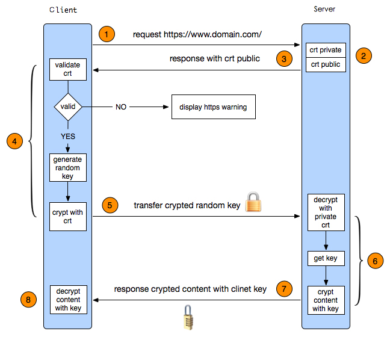
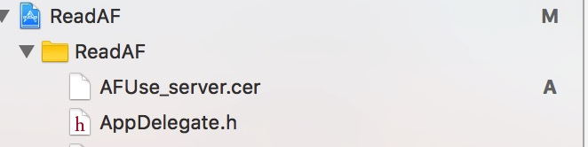
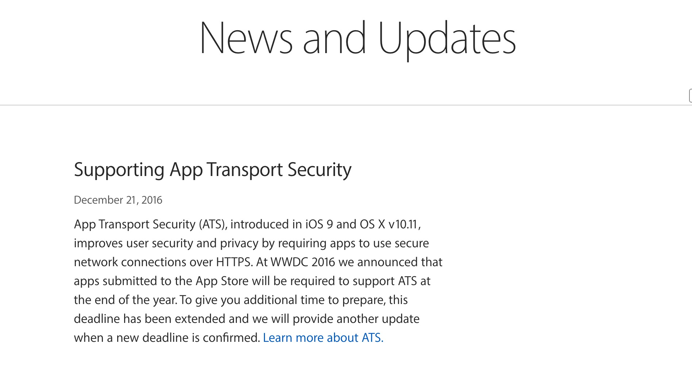
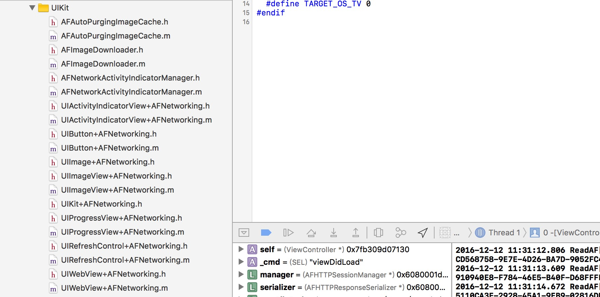

 
<!--BEGIN_DATA
{
    "create_date": "2016-12-28 16:17", 
    "modify_date": "2016-12-28 16:17", 
    "is_top": "0", 
    "summary": "AFNetworking到底做了什么？2", 
    "tags": "iOS", 
    "file_name": "AFNetworking到底做了什么？2.md"
}
END_DATA-->

####
原文出处：<a href='http://www.jianshu.com/p/a84237b07611' target='blank'>AFNetworking之于https认证</a>

##AFNetworking之于https认证

  

#####写在开头：

  * 本来这篇内容准备写在**AFNetworking到底做了什么?（三）**中的，但是因为我想在三中完结这个系列，碍于篇幅所限、并且这一块内容独立性比较强，所以单独拎出来，写成一篇。
  * 本文从源码的角度，去分析AFNetworking对https的认证过程。旨在让读者明白我们去做https请求：

    * 如果使用AF，需要做什么。
    * 不使用的话，直接用原生NSUrlSession，又需要做什么。
    * 当我们使用自签证书的https，又需要注意哪些问题。
  * **单独看并不影响阅读。**如果有需要了解更多AF相关内容，可以关注楼主的系列文章：  
[AFNetworking到底做了什么?](http://www.jianshu.com/p/856f0e26279d)  
[AFNetworking到底做了什么？（二）](http://www.jianshu.com/p/f32bd79233da)

#####那么正文开始了：

简单的理解下https：**https在http请求的基础上多加了一个证书认证的流程。**认证通过之后，数据传输都是加密进行的。  
关于https的更多概念，我就不赘述了，网上有大量的文章，小伙伴们可以自行查阅。在这里大概的讲讲https的认证过程吧，如下图所示：  

  

https单向认证过程.jpg

**1\. 客户端发起HTTPS请求**  
　　这个没什么好说的，就是用户在浏览器里输入一个https网址，然后连接到server的443端口。  
**2\. 服务端的配置**  
　　采用HTTPS协议的服务器必须要有一套数字证书，可以自己制作，也可以向组织申请。区别就是自己颁发的证书需要客户端验证通过，才可以继续访问，而使用受信任的
公司申请的证书则不会弹出提示页面。这套证书其实就是一对公钥和私钥。如果对公钥和私钥不太理解，可以想象成一把钥匙和一个锁头，只是全世界只有你一个人有这把钥匙，
你可以把锁头给别人，别人可以用这个锁把重要的东西锁起来，然后发给你，因为只有你一个人有这把钥匙，所以只有你才能看到被这把锁锁起来的东西。  
**3\. 传送证书**  
　　这个证书其实就是公钥，只是包含了很多信息，如证书的颁发机构，过期时间等等。  
**4\. 客户端解析证书**  
　　这部分工作是有客户端的TLS/SSL来完成的，首先会验证公钥是否有效，比如颁发机构，过期时间等等，如果发现异常，则会弹出一个警告框，提示证书存在问题。如
果证书没有问题，那么就生成一个随机值。然后用证书对该随机值进行加密。就好像上面说的，把随机值用锁头锁起来，这样除非有钥匙，不然看不到被锁住的内容。  
**5\. 传送加密信息**  
　　这部分传送的是用证书加密后的随机值，目的就是让服务端得到这个随机值，以后客户端和服务端的通信就可以通过这个随机值来进行加密解密了。  
**6\. 服务段解密信息**  
　　服务端用私钥解密后，得到了客户端传过来的随机值(私钥)，然后把内容通过该值进行对称加密。所谓对称加密就是，将信息和私钥通过某种算法混合在一起，这样除非知
道私钥，不然无法获取内容，而正好客户端和服务端都知道这个私钥，所以只要加密算法够彪悍，私钥够复杂，数据就够安全。  
**7\. 传输加密后的信息**  
　　这部分信息是服务段用私钥加密后的信息，可以在客户端被还原。  
**8\. 客户端解密信息**  
　　客户端用之前生成的私钥解密服务段传过来的信息，于是获取了解密后的内容。整个过程第三方即使监听到了数据，也束手无策。

这就是整个https验证的流程了。简单总结一下：

  * 就是用户发起请求，服务器响应后返回一个证书，证书中包含一些基本信息和公钥。
  * 用户拿到证书后，去验证这个证书是否合法，不合法，则请求终止。
  * 合法则生成一个随机数，作为对称加密的密钥，用服务器返回的公钥对这个随机数加密。然后返回给服务器。
  * 服务器拿到加密后的随机数，利用私钥解密，然后再用解密后的随机数（对称密钥），把需要返回的数据加密，加密完成后数据传输给用户。
  * 最后用户拿到加密的数据，用一开始的那个随机数（对称密钥），进行数据解密。整个过程完成。

当然这仅仅是一个单向认证，https还会有双向认证，相对于单向认证也很简单。仅仅多了服务端验证客户端这一步。感兴趣的可以看看这篇：[Https单向认证和双向
认证。](http://blog.csdn.net/duanbokan/article/details/50847612)

#####了解了https认证流程后，接下来我们来讲讲AFSecurityPolicy这个类，AF就是用这个类来满足我们各种https认证需求。

在这之前我们来看看AF用来做https认证的代理：

    
    
    - (void)URLSession:(NSURLSession *)session
    didReceiveChallenge:(NSURLAuthenticationChallenge *)challenge
     completionHandler:(void (^)(NSURLSessionAuthChallengeDisposition disposition, NSURLCredential *credential))completionHandler
    {
        //挑战处理类型为 默认
        /*
         NSURLSessionAuthChallengePerformDefaultHandling：默认方式处理
         NSURLSessionAuthChallengeUseCredential：使用指定的证书
         NSURLSessionAuthChallengeCancelAuthenticationChallenge：取消挑战
         */
        NSURLSessionAuthChallengeDisposition disposition = NSURLSessionAuthChallengePerformDefaultHandling;
        __block NSURLCredential *credential = nil;
        // sessionDidReceiveAuthenticationChallenge是自定义方法，用来如何应对服务器端的认证挑战
        if (self.sessionDidReceiveAuthenticationChallenge) {
            disposition = self.sessionDidReceiveAuthenticationChallenge(session, challenge, &credential);
        } else {
             // 此处服务器要求客户端的接收认证挑战方法是NSURLAuthenticationMethodServerTrust
            // 也就是说服务器端需要客户端返回一个根据认证挑战的保护空间提供的信任（即challenge.protectionSpace.serverTrust）产生的挑战证书。
            // 而这个证书就需要使用credentialForTrust:来创建一个NSURLCredential对象
            if ([challenge.protectionSpace.authenticationMethod isEqualToString:NSURLAuthenticationMethodServerTrust]) {
                // 基于客户端的安全策略来决定是否信任该服务器，不信任的话，也就没必要响应挑战
                if ([self.securityPolicy evaluateServerTrust:challenge.protectionSpace.serverTrust forDomain:challenge.protectionSpace.host]) {
                    // 创建挑战证书（注：挑战方式为UseCredential和PerformDefaultHandling都需要新建挑战证书）
                    credential = [NSURLCredential credentialForTrust:challenge.protectionSpace.serverTrust];
                    // 确定挑战的方式
                    if (credential) {
                        //证书挑战  设计policy,none，则跑到这里
                        disposition = NSURLSessionAuthChallengeUseCredential;
                    } else {
                        disposition = NSURLSessionAuthChallengePerformDefaultHandling;
                    }
                } else {
                    //取消挑战
                    disposition = NSURLSessionAuthChallengeCancelAuthenticationChallenge;
                }
            } else {
                //默认挑战方式
                disposition = NSURLSessionAuthChallengePerformDefaultHandling;
            }
        }
        //完成挑战
        if (completionHandler) {
            completionHandler(disposition, credential);
        }
    }

更多的这个方法的细节问题，可以看注释，或者查阅楼主之前的相关文章，都有去讲到这个代理方法。在这里我们大概的讲讲这个方法做了什么：  
1）首先指定了https为默认的认证方式。  
2）判断有没有自定义Block:`sessionDidReceiveAuthenticationChallenge`，有的话，使用我们自定义Block,生成一个认证方式，并且可以给`credential`赋值，即我们需要接受认证的证书。然后直接调用`completionHandler`，去根据这两个参数，执行系
统的认证。至于这个系统的认证到底做了什么，可以看文章最后，这里暂且略过。  
3）如果没有自定义Block，我们判断如果服务端的认证方法要求是`NSURLAuthenticationMethodServerTrust`,**则只需要验证服务端证书是否安全**（即https的单向认证，这是AF默认处理的认证方式，其他的认证方式，只能由我们自定义Block的实现）  
4）接着我们就执行了`AFSecurityPolicy`相关的一个方法，做了一个AF内部的一个https认证：

    
    
    [self.securityPolicy evaluateServerTrust:challenge.protectionSpace.serverTrust forDomain:challenge.protectionSpace.host])

AF默认的处理是，如果这行返回NO、说明AF内部认证失败，则取消https认证，即取消请求。返回YES则进入if块，用服务器返回的一个`serverTrust`去生成了一个认证证书。（注：这个`serverTrust`是服务器传过来的，里面包含了服务器的证书信息，是用来我们本地客户端去验证该证书是否合法用的，后面会更详细的去讲这个参数）然后如果有证书，则用证书认证方式，否则还是用默认的验证方式。最后调用`completionHandler`传递认证方式和要认证的证书，去做系统根证书验证。

  * 总结一下这里`securityPolicy`存在的作用就是，**使得在系统底层自己去验证之前，AF可以先去验证服务端的证书。**如果通不过，则直接越过系统的验证，取消https的网络请求。否则，继续去走系统根证书的验证。

#######接下来我们看看`AFSecurityPolicy`内部是如果做https认证的:

如下方式，我们可以创建一个`securityPolicy`：

    
    
    AFSecurityPolicy *policy = [AFSecurityPolicy defaultPolicy];

内部创建：

    
    
    + (instancetype)defaultPolicy {
        AFSecurityPolicy *securityPolicy = [[self alloc] init];
        securityPolicy.SSLPinningMode = AFSSLPinningModeNone;
        return securityPolicy;
    }

默认指定了一个`SSLPinningMode`模式为`AFSSLPinningModeNone`。  
对于AFSecurityPolicy，一共有4个重要的属性：

    
    
    //https验证模式
    @property (readonly, nonatomic, assign) AFSSLPinningMode SSLPinningMode;
    //可以去匹配服务端证书验证的证书
    @property (nonatomic, strong, nullable) NSSet <NSData *> *pinnedCertificates;
    //是否支持非法的证书（例如自签名证书）
    @property (nonatomic, assign) BOOL allowInvalidCertificates;
    //是否去验证证书域名是否匹配
    @property (nonatomic, assign) BOOL validatesDomainName;

它们的作用我添加在注释里了，第一条就是`AFSSLPinningMode`, 共提供了3种验证方式：

    
    
    typedef NS_ENUM(NSUInteger, AFSSLPinningMode) {
        //不验证
        AFSSLPinningModeNone,
        //只验证公钥
        AFSSLPinningModePublicKey,
        //验证证书
        AFSSLPinningModeCertificate,
    };

我们接着回到代理https认证的这行代码上：

    
    
    [self.securityPolicy evaluateServerTrust:challenge.protectionSpace.serverTrust forDomain:challenge.protectionSpace.host]

  * 我们传了两个参数进去，一个是`SecTrustRef`类型的serverTrust，这是什么呢？我们看到苹果的文档介绍如下：

> CFType used for performing X.509 certificate trust evaluations.

大概意思是用于执行X。509证书信任评估，再讲简单点，其实就是一个容器，装了服务器端需要验证的证书的基本信息、公钥等等，不仅如此，它还可以装一些评估策略，还有客户端的锚点证书，这个客户端的证书，可以用来和服务端的证书去匹配验证的。

  * 除此之外还把服务器域名传了过去。

我们来到这个方法，代码如下：

    
    
    //验证服务端是否值得信任
    - (BOOL)evaluateServerTrust:(SecTrustRef)serverTrust
                      forDomain:(NSString *)domain
    {
        //判断矛盾的条件
        //判断有域名，且允许自建证书，需要验证域名，
        //因为要验证域名，所以必须不能是后者两种：AFSSLPinningModeNone或者添加到项目里的证书为0个。
        if (domain && self.allowInvalidCertificates && self.validatesDomainName && (self.SSLPinningMode == AFSSLPinningModeNone || [self.pinnedCertificates count] == 0)) {
            // https://developer.apple.com/library/mac/documentation/NetworkingInternet/Conceptual/NetworkingTopics/Articles/OverridingSSLChainValidationCorrectly.html
            //  According to the docs, you should only trust your provided certs for evaluation.
            //  Pinned certificates are added to the trust. Without pinned certificates,
            //  there is nothing to evaluate against.
            //
            //  From Apple Docs:
            //          "Do not implicitly trust self-signed certificates as anchors (kSecTrustOptionImplicitAnchors).
            //           Instead, add your own (self-signed) CA certificate to the list of trusted anchors."
            NSLog(@"In order to validate a domain name for self signed certificates, you MUST use pinning.");
            //不受信任，返回
            return NO;
        }
        //用来装验证策略
        NSMutableArray *policies = [NSMutableArray array];
        //要验证域名
        if (self.validatesDomainName) {
            // 如果需要验证domain，那么就使用SecPolicyCreateSSL函数创建验证策略，其中第一个参数为true表示验证整个SSL证书链，第二个参数传入domain，用于判断整个证书链上叶子节点表示的那个domain是否和此处传入domain一致
            //添加验证策略
            [policies addObject:(__bridge_transfer id)SecPolicyCreateSSL(true, (__bridge CFStringRef)domain)];
        } else {
            // 如果不需要验证domain，就使用默认的BasicX509验证策略
            [policies addObject:(__bridge_transfer id)SecPolicyCreateBasicX509()];
        }
        //serverTrust：X。509服务器的证书信任。
        // 为serverTrust设置验证策略，即告诉客户端如何验证serverTrust
        SecTrustSetPolicies(serverTrust, (__bridge CFArrayRef)policies);
        //有验证策略了，可以去验证了。如果是AFSSLPinningModeNone，是自签名，直接返回可信任，否则不是自签名的就去系统根证书里去找是否有匹配的证书。
        if (self.SSLPinningMode == AFSSLPinningModeNone) {
            //如果支持自签名，直接返回YES,不允许才去判断第二个条件，判断serverTrust是否有效
            return self.allowInvalidCertificates || AFServerTrustIsValid(serverTrust);
        }
        //如果验证无效AFServerTrustIsValid，而且allowInvalidCertificates不允许自签，返回NO
        else if (!AFServerTrustIsValid(serverTrust) && !self.allowInvalidCertificates) {
            return NO;
        }
        //判断SSLPinningMode
        switch (self.SSLPinningMode) {
            // 理论上，上面那个部分已经解决了self.SSLPinningMode)为AFSSLPinningModeNone)等情况，所以此处再遇到，就直接返回NO
            case AFSSLPinningModeNone:
            default:
                return NO;
            //验证证书类型
            case AFSSLPinningModeCertificate: {
                NSMutableArray *pinnedCertificates = [NSMutableArray array];
                //把证书data，用系统api转成 SecCertificateRef 类型的数据,SecCertificateCreateWithData函数对原先的pinnedCertificates做一些处理，保证返回的证书都是DER编码的X.509证书
                for (NSData *certificateData in self.pinnedCertificates) {
                    [pinnedCertificates addObject:(__bridge_transfer id)SecCertificateCreateWithData(NULL, (__bridge CFDataRef)certificateData)];
                }
                // 将pinnedCertificates设置成需要参与验证的Anchor Certificate（锚点证书，通过SecTrustSetAnchorCertificates设置了参与校验锚点证书之后，假如验证的数字证书是这个锚点证书的子节点，即验证的数字证书是由锚点证书对应CA或子CA签发的，或是该证书本身，则信任该证书），具体就是调用SecTrustEvaluate来验证。
                //serverTrust是服务器来的验证，有需要被验证的证书。
                SecTrustSetAnchorCertificates(serverTrust, (__bridge CFArrayRef)pinnedCertificates);
                //自签在之前是验证通过不了的，在这一步，把我们自己设置的证书加进去之后，就能验证成功了。
                //再去调用之前的serverTrust去验证该证书是否有效，有可能：经过这个方法过滤后，serverTrust里面的pinnedCertificates被筛选到只有信任的那一个证书
                if (!AFServerTrustIsValid(serverTrust)) {
                    return NO;
                }
                // obtain the chain after being validated, which *should* contain the pinned certificate in the last position (if it's the Root CA)
                //注意，这个方法和我们之前的锚点证书没关系了，是去从我们需要被验证的服务端证书，去拿证书链。
                // 服务器端的证书链，注意此处返回的证书链顺序是从叶节点到根节点
                NSArray *serverCertificates = AFCertificateTrustChainForServerTrust(serverTrust);
                //reverseObjectEnumerator逆序
                for (NSData *trustChainCertificate in [serverCertificates reverseObjectEnumerator]) {
                    //如果我们的证书中，有一个和它证书链中的证书匹配的，就返回YES
                    if ([self.pinnedCertificates containsObject:trustChainCertificate]) {
                        return YES;
                    }
                }
                //没有匹配的
                return NO;
            }
                //公钥验证 AFSSLPinningModePublicKey模式同样是用证书绑定(SSL Pinning)方式验证，客户端要有服务端的证书拷贝，只是验证时只验证证书里的公钥，不验证证书的有效期等信息。只要公钥是正确的，就能保证通信不会被窃听，因为中间人没有私钥，无法解开通过公钥加密的数据。
            case AFSSLPinningModePublicKey: {
                NSUInteger trustedPublicKeyCount = 0;
                // 从serverTrust中取出服务器端传过来的所有可用的证书，并依次得到相应的公钥
                NSArray *publicKeys = AFPublicKeyTrustChainForServerTrust(serverTrust);
                //遍历服务端公钥
                for (id trustChainPublicKey in publicKeys) {
                    //遍历本地公钥
                    for (id pinnedPublicKey in self.pinnedPublicKeys) {
                        //判断如果相同 trustedPublicKeyCount+1
                        if (AFSecKeyIsEqualToKey((__bridge SecKeyRef)trustChainPublicKey, (__bridge SecKeyRef)pinnedPublicKey)) {
                            trustedPublicKeyCount += 1;
                        }
                    }
                }
                return trustedPublicKeyCount > 0;
            }
        }
        return NO;
    }

代码的注释很多，这一块确实比枯涩，大家可以参照着源码一起看，加深理解。

  * 这个方法是`AFSecurityPolicy`最核心的方法，其他的都是为了配合这个方法。这个方法完成了服务端的证书的信任评估。我们总结一下这个方法做了什么（细节可以看注释）：

    1. 根据模式，如果是`AFSSLPinningModeNone`，则肯定是返回YES，不论是自签还是公信机构的证书。
    2. 如果是`AFSSLPinningModeCertificate`，则从`serverTrust`中去获取证书链，然后和我们一开始初始化设置的证书集合`self.pinnedCertificates`去匹配，**如果有一对能匹配成功的，就返回YES，否则NO。**  
看到这可能有小伙伴要问了，什么是证书链？下面这段是我从百科上摘来的:

> 证书链由两个环节组成—信任锚（CA 证书）环节和已签名证书环节。自我签名的证书仅有一个环节的长度—信任锚环节就是已签名证书本身。

简单来说，证书链就是就是根证书，和根据根证书签名派发得到的证书。

   3. 如果是`AFSSLPinningModePublicKey`公钥验证，则和第二步一样还是从`serverTrust`，获取证书链每一个证书的公钥，放到数组中。和我们的`self.pinnedPublicKeys`，去配对，如果有一个相同的，就返回YES，否则NO。至于这个`self.pinnedPublicKeys`,初始化的地方如下：
        
                //设置证书数组
        - (void)setPinnedCertificates:(NSSet *)pinnedCertificates {
	        _pinnedCertificates = pinnedCertificates;
	        //获取对应公钥集合
	        if (self.pinnedCertificates) {
	           //创建公钥集合
	           NSMutableSet *mutablePinnedPublicKeys = [NSMutableSet setWithCapacity:[self.pinnedCertificates count]];
	           //从证书中拿到公钥。
	           for (NSData *certificate in self.pinnedCertificates) {
	               id publicKey = AFPublicKeyForCertificate(certificate);
	               if (!publicKey) {
	                   continue;
	               }
	               [mutablePinnedPublicKeys addObject:publicKey];
	           }
	           self.pinnedPublicKeys = [NSSet setWithSet:mutablePinnedPublicKeys];
	        } else {
	           self.pinnedPublicKeys = nil;
	        }
        }

AF复写了设置证书的set方法，并同时把证书中每个公钥放在了self.pinnedPublicKeys中。

这个方法中关联了一系列的函数，我在这边按照调用顺序一一列出来（有些是系统函数，不在这里列出，会在下文集体描述作用）：

#####函数一：AFServerTrustIsValid

    
    
    //判断serverTrust是否有效
    static BOOL AFServerTrustIsValid(SecTrustRef serverTrust) {
        //默认无效
        BOOL isValid = NO;
        //用来装验证结果，枚举
        SecTrustResultType result;  
        //__Require_noErr_Quiet 用来判断前者是0还是非0，如果0则表示没错，就跳到后面的表达式所在位置去执行，否则表示有错就继续往下执行。
        //SecTrustEvaluate系统评估证书的是否可信的函数，去系统根目录找，然后把结果赋值给result。评估结果匹配，返回0，否则出错返回非0
        //do while 0 ,只执行一次，为啥要这样写....
        __Require_noErr_Quiet(SecTrustEvaluate(serverTrust, &result), _out);
        //评估没出错走掉这，只有两种结果能设置为有效，isValid= 1
        //当result为kSecTrustResultUnspecified（此标志表示serverTrust评估成功，此证书也被暗中信任了，但是用户并没有显示地决定信任该证书）。
        //或者当result为kSecTrustResultProceed（此标志表示评估成功，和上面不同的是该评估得到了用户认可），这两者取其一就可以认为对serverTrust评估成功
        isValid = (result == kSecTrustResultUnspecified || result == kSecTrustResultProceed);
        //out函数块,如果为SecTrustEvaluate，返回非0，则评估出错，则isValid为NO
    _out:
        return isValid;
    }

  * 这个方法用来验证serverTrust是否有效，其中主要是交由系统API`SecTrustEvaluate`来验证的，它验证完之后会返回一个`SecTrustResultType`枚举类型的result，然后我们根据这个result去判断是否证书是否有效。
  * 其中比较有意思的是，它调用了一个系统定义的宏函数`__Require_noErr_Quiet`，函数定义如下：
    
        #ifndef __Require_noErr_Quiet
	      #define __Require_noErr_Quiet(errorCode, exceptionLabel)                      \
	        do                                                                          \
	        {                                                                           \
	            if ( __builtin_expect(0 != (errorCode), 0) )                            \
	            {                                                                       \
	                goto exceptionLabel;                                                \
	            }                                                                       \
	        } while ( 0 )
	    #endif

这个函数主要作用就是，判断errorCode是否为0，不为0则，程序用`goto`跳到`exceptionLabel`位置去执行。这个`exceptionL
abel`就是一个代码位置标识，类似上面的`_out`。  
说它有意思的地方是在于，它用了一个do...while(0)循环，循环条件为0，也就是只执行一次循环就结束。对这么做的原因，楼主百思不得其解...看来系统原生API更是高深莫测...经冰霜大神的提醒，这么做是为了适配早期的API??!

#####函数二、三（两个函数类似，所以放在一起）：获取serverTrust证书链证书，获取serverTrust证书链公钥

    
    
    //获取证书链
    static NSArray * AFCertificateTrustChainForServerTrust(SecTrustRef serverTrust) {
        //使用SecTrustGetCertificateCount函数获取到serverTrust中需要评估的证书链中的证书数目，并保存到certificateCount中
        CFIndex certificateCount = SecTrustGetCertificateCount(serverTrust);
        //创建数组
        NSMutableArray *trustChain = [NSMutableArray arrayWithCapacity:(NSUInteger)certificateCount];
        //// 使用SecTrustGetCertificateAtIndex函数获取到证书链中的每个证书，并添加到trustChain中，最后返回trustChain
        for (CFIndex i = 0; i < certificateCount; i++) {
            SecCertificateRef certificate = SecTrustGetCertificateAtIndex(serverTrust, i);
            [trustChain addObject:(__bridge_transfer NSData *)SecCertificateCopyData(certificate)];
        }
        return [NSArray arrayWithArray:trustChain];
    }
    
    
    // 从serverTrust中取出服务器端传过来的所有可用的证书，并依次得到相应的公钥
    static NSArray * AFPublicKeyTrustChainForServerTrust(SecTrustRef serverTrust) {
        // 接下来的一小段代码和上面AFCertificateTrustChainForServerTrust函数的作用基本一致，都是为了获取到serverTrust中证书链上的所有证书，并依次遍历，取出公钥。
        //安全策略
        SecPolicyRef policy = SecPolicyCreateBasicX509();
        CFIndex certificateCount = SecTrustGetCertificateCount(serverTrust);
        NSMutableArray *trustChain = [NSMutableArray arrayWithCapacity:(NSUInteger)certificateCount];
        //遍历serverTrust里证书的证书链。
        for (CFIndex i = 0; i < certificateCount; i++) {
            //从证书链取证书
            SecCertificateRef certificate = SecTrustGetCertificateAtIndex(serverTrust, i);
            //数组
            SecCertificateRef someCertificates[] = {certificate};
            //CF数组
            CFArrayRef certificates = CFArrayCreate(NULL, (const void **)someCertificates, 1, NULL);
            SecTrustRef trust;
            // 根据给定的certificates和policy来生成一个trust对象
            //不成功跳到 _out。
            __Require_noErr_Quiet(SecTrustCreateWithCertificates(certificates, policy, &trust), _out);
            SecTrustResultType result;
            // 使用SecTrustEvaluate来评估上面构建的trust
            //评估失败跳到 _out
            __Require_noErr_Quiet(SecTrustEvaluate(trust, &result), _out);
            // 如果该trust符合X.509证书格式，那么先使用SecTrustCopyPublicKey获取到trust的公钥，再将此公钥添加到trustChain中
            [trustChain addObject:(__bridge_transfer id)SecTrustCopyPublicKey(trust)];
        _out:
            //释放资源
            if (trust) {
                CFRelease(trust);
            }
            if (certificates) {
                CFRelease(certificates);
            }
            continue;
        }
        CFRelease(policy);
        // 返回对应的一组公钥
        return [NSArray arrayWithArray:trustChain];
    }

两个方法功能类似，都是调用了一些系统的API，利用For循环，获取证书链上每一个证书或者公钥。具体内容看源码很好理解。唯一需要注意的是，这个获取的证书排序，
是从证书链的叶节点，到根节点的。

#####函数四：判断公钥是否相同

    
    
    //判断两个公钥是否相同
    static BOOL AFSecKeyIsEqualToKey(SecKeyRef key1, SecKeyRef key2) {
    #if TARGET_OS_IOS || TARGET_OS_WATCH || TARGET_OS_TV
        //iOS 判断二者地址
        return [(__bridge id)key1 isEqual:(__bridge id)key2];
    #else
        return [AFSecKeyGetData(key1) isEqual:AFSecKeyGetData(key2)];
    #endif
    }

方法适配了各种运行环境，做了匹配的判断。

#####接下来列出验证过程中调用过得系统原生函数：

    
    
    //1.创建一个验证SSL的策略，两个参数，第一个参数true则表示验证整个证书链
    //第二个参数传入domain，用于判断整个证书链上叶子节点表示的那个domain是否和此处传入domain一致
    SecPolicyCreateSSL(<#Boolean server#>, <#CFStringRef  _Nullable hostname#>)
    SecPolicyCreateBasicX509();
    //2.默认的BasicX509验证策略,不验证域名。
    SecPolicyCreateBasicX509();
    //3.为serverTrust设置验证策略，即告诉客户端如何验证serverTrust
    SecTrustSetPolicies(<#SecTrustRef  _Nonnull trust#>, <#CFTypeRef  _Nonnull policies#>)
    //4.验证serverTrust,并且把验证结果返回给第二参数 result
    SecTrustEvaluate(<#SecTrustRef  _Nonnull trust#>, <#SecTrustResultType * _Nullable result#>)
    //5.判断前者errorCode是否为0，为0则跳到exceptionLabel处执行代码
    __Require_noErr(<#errorCode#>, <#exceptionLabel#>)
    //6.根据证书data,去创建SecCertificateRef类型的数据。
    SecCertificateCreateWithData(<#CFAllocatorRef  _Nullable allocator#>, <#CFDataRef  _Nonnull data#>)
    //7.给serverTrust设置锚点证书，即如果以后再次去验证serverTrust，会从锚点证书去找是否匹配。
    SecTrustSetAnchorCertificates(serverTrust, (__bridge CFArrayRef)pinnedCertificates);
    //8.拿到证书链中的证书个数
    CFIndex certificateCount = SecTrustGetCertificateCount(serverTrust);
    //9.去取得证书链中对应下标的证书。
    SecTrustGetCertificateAtIndex(serverTrust, i)
    //10.根据证书获取公钥。
    SecTrustCopyPublicKey(trust)

其功能如注释，大家可以对比着源码，去加以理解~

  

分割图.png

  
可能看到这，又有些小伙伴迷糊了，讲了这么多，**那如果做https请求，真正需要我们自己做的到底是什么呢？**这里来解答一下，分为以下两种情况：

  1. 如果你用的是付费的公信机构颁发的证书，标准的https，**那么无论你用的是AF还是NSUrlSession,什么都不用做，代理方法也不用实现。**你的网络请求就能正常完成。
  2. 如果你用的是自签名的证书:

    * 首先你需要在plist文件中，设置可以返回不安全的请求（关闭该域名的ATS）。
    * 其次，如果是`NSUrlSesion`，那么需要在代理方法实现如下：
        
            - (void)URLSession:(NSURLSession *)session didReceiveChallenge:(NSURLAuthenticationChallenge *)challenge completionHandler:(void (^)(NSURLSessionAuthChallengeDisposition disposition, NSURLCredential *credential))completionHandler
	        {
	             __block NSURLCredential *credential = nil;
	            credential = [NSURLCredential credentialForTrust:challenge.protectionSpace.serverTrust]; 
	           // 确定挑战的方式
	            if (credential) { 
	                //证书挑战 则跑到这里
	                disposition = NSURLSessionAuthChallengeUseCredential; 
	            }
	           //完成挑战
	            if (completionHandler) {
	                completionHandler(disposition, credential);
	            }
	        }

其实上述就是AF的相对于自签证书的实现的简化版。  
如果是AF，你则需要设置policy：

        
        //允许自签名证书，必须的
        policy.allowInvalidCertificates = YES;
        //是否验证域名的CN字段
        //不是必须的，但是如果写YES，则必须导入证书。
        policy.validatesDomainName = NO;

当然还可以根据需求，你可以去验证证书或者公钥，前提是，你把自签的服务端证书，或者自签的CA根证书导入到项目中：  

  

证书.png

  
并且如下设置证书：

        
    NSString *certFilePath = [[NSBundle mainBundle] pathForResource:@"AFUse_server.cer" ofType:nil];
    NSData *certData = [NSData dataWithContentsOfFile:certFilePath];
    NSSet *certSet = [NSSet setWithObjects:certData,certData, nil];    
    policy.pinnedCertificates = certSet;

这样你就可以使用AF的不同`AFSSLPinningMode`去验证了。

#######最后总结一下，AF之于https到底做了什么：

  * **AF可以让你在系统验证证书之前，就去自主验证。**然后如果自己验证不正确，直接取消网络请求。否则验证通过则继续进行系统验证。

  * 讲到这，顺便提一下，系统验证的流程：

    * 系统的验证，首先是去系统的根证书找，看是否有能匹配服务端的证书，如果匹配，则验证成功，返回https的安全数据。
    * 如果不匹配则去判断ATS是否关闭，如果关闭，则返回https不安全连接的数据。如果开启ATS，则拒绝这个请求，请求失败。

总之一句话：**AF的验证方式不是必须的，但是对有特殊验证需求的用户确是必要的**。

写在结尾：

  * 看完之后，有些小伙伴可能还是会比较迷惑，建议还是不清楚的小伙伴，可以自己生成一个自签名的证书或者用百度地址等做请求，然后设置`AFSecurityPolicy`不同参数，打断点，一步步的看AF是如何去调用函数作证书验证的。相信这样能加深你的理解。

  * 最后关于自签名证书的问题，等2017年1月1日，也没多久了...一个月不到。除非有特殊原因说明，否则已经无法审核通过了。详细的可以看看这篇文章：[iOS 10 适配 ATS（app支持https通过App Store审核）](http://www.jianshu.com/p/36ddc5b009a7)。

  * 最后的最后，希望大家能点个赞，关注一下~（楼主看到赞和关注会很开心...） 有什么不同意见或者建议可以评论或者简信我~万一有人转载，麻烦注明出处，谢谢~~

#####苹果官网最新消息：原定于2017.1.1强制的https被延期了，具体延期到什么时候不确定，得等官方通知：

  

苹果官方新闻.png

#####后续文章：

[AFNetworking之UIKit扩展与缓存实现](http://www.jianshu.com/p/4ffeb1ba3046)  
[AFNetworking到底做了什么？(终)](http://www.jianshu.com/p/7ed7c0be15b4)

####
原文出处：<a href='http://www.jianshu.com/p/4ffeb1ba3046' target='blank'>AFNetworking之UIKit扩展与缓存实现</a>

##AFNetworking之UIKit扩展与缓存实现

  

#####写在开头：

  * 大概回忆下，之前我们讲了`AFNetworking`整个网络请求的流程，包括`request`的拼接，`session`代理的转发，`response`的解析。以及对一些`bug`的适配，如果你还没有看过，可以点这里：  
[AFNetworking到底做了什么?](http://www.jianshu.com/p/856f0e26279d)  
[AFNetworking到底做了什么（二）?](http://www.jianshu.com/p/f32bd79233da)

  * 除此之外我们还单独的开了一篇讲了AF对`https`的处理：  
[AFNetworking之于https认证](http://www.jianshu.com/p/a84237b07611)

  * 本文将**涉及部分AF对UIKit的扩展与图片下载相关缓存的实现**，文章内容相对独立，如果没看过前文，也不影响阅读。

#####回到正文：

我们来看看AF对`UIkit`的扩展:

  

UIKit扩展.png

####一共如上这个多类，下面我们开始着重讲其中两个UIKit的扩展：

  * 一个是我们网络请求时状态栏的小菊花。
  * 一个是我们几乎都用到过请求网络图片的如下一行方法：
    
        - (void)setImageWithURL:(NSURL *)url ;

#####我们开始吧：

#####1.AFNetworkActivityIndicatorManager

这个类的作用相当简单，就是当网络请求的时候，状态栏上的小菊花就会开始转:  

  

小菊花.png

  
需要的代码也很简单，只需在你需要它的位置中（比如AppDelegate）导入类，并加一行代码即可：

    
    
    #import "AFNetworkActivityIndicatorManager.h"
    
    [[AFNetworkActivityIndicatorManager sharedManager] setEnabled:YES];

#######接下来我们来讲讲这个类的实现：

  * 这个类的实现也非常简单，还记得我们之前讲的AF对`NSURLSessionTask`中做了一个**Method Swizzling**吗？大意是把它的`resume`和`suspend`方法做了一个替换，在原有实现的基础上添加了一个通知的发送。

  * 这个类就是基于这两个通知和task完成的通知来实现的。

#####首先我们来看看它的初始化方法：

    
    
    + (instancetype)sharedManager {
        static AFNetworkActivityIndicatorManager *_sharedManager = nil;
        static dispatch_once_t oncePredicate;
        dispatch_once(&oncePredicate, ^{
            _sharedManager = [[self alloc] init];
        });
        return _sharedManager;
    }
    - (instancetype)init {
        self = [super init];
        if (!self) {
            return nil;
        }
        //设置状态为没有request活跃
        self.currentState = AFNetworkActivityManagerStateNotActive;
        //开始下载通知
        [[NSNotificationCenter defaultCenter] addObserver:self selector:@selector(networkRequestDidStart:) name:AFNetworkingTaskDidResumeNotification object:nil];
        //挂起通知
        [[NSNotificationCenter defaultCenter] addObserver:self selector:@selector(networkRequestDidFinish:) name:AFNetworkingTaskDidSuspendNotification object:nil];
        //完成通知
        [[NSNotificationCenter defaultCenter] addObserver:self selector:@selector(networkRequestDidFinish:) name:AFNetworkingTaskDidCompleteNotification object:nil];
        //开始延迟
        self.activationDelay = kDefaultAFNetworkActivityManagerActivationDelay;
        //结束延迟
        self.completionDelay = kDefaultAFNetworkActivityManagerCompletionDelay;
        return self;
    }

  * 初始化如上，设置了一个state，这个state是一个枚举：
    
        typedef NS_ENUM(NSInteger, AFNetworkActivityManagerState) {
	      //没有请求
	      AFNetworkActivityManagerStateNotActive,
	      //请求延迟开始
	      AFNetworkActivityManagerStateDelayingStart,
	      //请求进行中
	      AFNetworkActivityManagerStateActive,
	      //请求延迟结束
	      AFNetworkActivityManagerStateDelayingEnd
	    };

这个state一共如上4种状态，其中两种应该很好理解，而延迟开始和延迟结束怎么理解呢？

    * 原来这是AF对请求菊花显示做的一个优化处理，试问如果一个请求时间很短，那么菊花很可能闪一下就结束了。如果很多请求过来，那么菊花会不停的闪啊闪，这显然并不是我们想要的效果。
    * 所以多了这两个参数：  
1）在一个请求开始的时候，我延迟一会在去转菊花，如果在这延迟时间内，请求结束了，那么我就不需要去转菊花了。  
2）但是一旦转菊花开始，哪怕很短请求就结束了，我们还是会去转一个时间再去结束，这时间就是延迟结束的时间。

  * 紧接着我们监听了三个通知，用来监听当前正在进行的网络请求的状态。

  * 然后设置了我们前面提到的这个转菊花延迟开始和延迟结束的时间，这两个默认值如下：
    
        static NSTimeInterval const kDefaultAFNetworkActivityManagerActivationDelay = 1.0;
	    static NSTimeInterval const kDefaultAFNetworkActivityManagerCompletionDelay = 0.17;

接着我们来看看三个通知触发调用的方法：

    
    
    //请求开始
    - (void)networkRequestDidStart:(NSNotification *)notification {
        if ([AFNetworkRequestFromNotification(notification) URL]) {
            //增加请求活跃数
            [self incrementActivityCount];
        }
    }
    //请求结束
    - (void)networkRequestDidFinish:(NSNotification *)notification {
        //AFNetworkRequestFromNotification(notification)返回这个通知的request,用来判断request是否是有效的
        if ([AFNetworkRequestFromNotification(notification) URL]) {
            //减少请求活跃数
            [self decrementActivityCount];
        }
    }

方法很简单，就是开始的时候增加了请求活跃数，结束则减少。调用了如下两个方法进行加减：

    
    
    //增加请求活跃数
    - (void)incrementActivityCount {
        //活跃的网络数+1，并手动发送KVO
        [self willChangeValueForKey:@"activityCount"];
        @synchronized(self) {
            _activityCount++;
        }
        [self didChangeValueForKey:@"activityCount"];
        //主线程去做
        dispatch_async(dispatch_get_main_queue(), ^{
            [self updateCurrentStateForNetworkActivityChange];
        });
    }
    //减少请求活跃数
    - (void)decrementActivityCount {
        [self willChangeValueForKey:@"activityCount"];
        @synchronized(self) {
    #pragma clang diagnostic push
    #pragma clang diagnostic ignored "-Wgnu"
            _activityCount = MAX(_activityCount - 1, 0);
    #pragma clang diagnostic pop
        }
        [self didChangeValueForKey:@"activityCount"];
        dispatch_async(dispatch_get_main_queue(), ^{
            [self updateCurrentStateForNetworkActivityChange];
        });
    }

方法做了什么应该很容易看明白，这里需要注意的是，**task的几个状态的通知，是会在多线程的环境下发送过来的**。所以这里对活跃数的加减，都用了`@synchronized`这种方式的锁，进行了线程保护。然后回到主线程调用了`updateCurrentStateForNetworkActivityChange`

我们接着来看看这个方法：

    
    
    - (void)updateCurrentStateForNetworkActivityChange {
        //如果是允许小菊花
        if (self.enabled) {
            switch (self.currentState) {
                //不活跃
                case AFNetworkActivityManagerStateNotActive:
                    //判断活跃数，大于0为YES
                    if (self.isNetworkActivityOccurring) {
                        //设置状态为延迟开始
                        [self setCurrentState:AFNetworkActivityManagerStateDelayingStart];
                    }
                    break;
                case AFNetworkActivityManagerStateDelayingStart:
                    //No op. Let the delay timer finish out.
                    break;
                case AFNetworkActivityManagerStateActive:
                    if (!self.isNetworkActivityOccurring) {
                        [self setCurrentState:AFNetworkActivityManagerStateDelayingEnd];
                    }
                    break;
                case AFNetworkActivityManagerStateDelayingEnd:
                    if (self.isNetworkActivityOccurring) {
                        [self setCurrentState:AFNetworkActivityManagerStateActive];
                    }
                    break;
            }
        }
    }

  * 这个方法先是判断了我们一开始设置是否需要菊花的`self.enabled`，如果需要，才执行。
  * 这里主要是根据当前的状态，来判断下一个状态应该是什么。其中有这么一个属性`self.isNetworkActivityOccurring`:
    
        //判断是否活跃
	    - (BOOL)isNetworkActivityOccurring {
	      @synchronized(self) {
	          return self.activityCount > 0;
	      }
	    }

那么这个方法应该不难理解了。

这个类复写了currentState的set方法，每当我们改变这个state，就会触发set方法，而怎么该转菊花也在该方法中：

    
    
    //设置当前小菊花状态
    - (void)setCurrentState:(AFNetworkActivityManagerState)currentState {
        @synchronized(self) {
            if (_currentState != currentState) {
                //KVO
                [self willChangeValueForKey:@"currentState"];
                _currentState = currentState;
                switch (currentState) {
                    //如果为不活跃
                    case AFNetworkActivityManagerStateNotActive:
                        //取消两个延迟用的timer
                        [self cancelActivationDelayTimer];
                        [self cancelCompletionDelayTimer];
                        //设置小菊花不可见
                        [self setNetworkActivityIndicatorVisible:NO];
                        break;
                    case AFNetworkActivityManagerStateDelayingStart:
                        //开启一个定时器延迟去转菊花
                        [self startActivationDelayTimer];
                        break;
                        //如果是活跃状态
                    case AFNetworkActivityManagerStateActive:
                        //取消延迟完成的timer
                        [self cancelCompletionDelayTimer];
                        //开始转菊花
                        [self setNetworkActivityIndicatorVisible:YES];
                        break;
                        //延迟完成状态
                    case AFNetworkActivityManagerStateDelayingEnd:
                        //开启延迟完成timer
                        [self startCompletionDelayTimer];
                        break;
                }
            }
            [self didChangeValueForKey:@"currentState"];
        }
    }

这个set方法就是这个类最核心的方法了。它的作用如下：

  * 这里根据当前状态，是否需要开始执行一个延迟开始或者延迟完成，又或者是否需要取消这两个延迟。
  * 还判断了，是否需要去转状态栏的菊花，调用了`setNetworkActivityIndicatorVisible:`方法：
    
        - (void)setNetworkActivityIndicatorVisible:(BOOL)networkActivityIndicatorVisible {
	      if (_networkActivityIndicatorVisible != networkActivityIndicatorVisible) {
	          [self willChangeValueForKey:@"networkActivityIndicatorVisible"];
	          @synchronized(self) {
	               _networkActivityIndicatorVisible = networkActivityIndicatorVisible;
	          }
	          [self didChangeValueForKey:@"networkActivityIndicatorVisible"];
	          //支持自定义的Block，去自己控制小菊花
	          if (self.networkActivityActionBlock) {
	              self.networkActivityActionBlock(networkActivityIndicatorVisible);
	          } else {
	              //否则默认AF根据该Bool，去控制状态栏小菊花是否显示
	              [[UIApplication sharedApplication] setNetworkActivityIndicatorVisible:networkActivityIndicatorVisible];
	          }
	      }
	    }

    * 这个方法就是用来控制菊花是否转。并且支持一个自定义的Block,我们可以自己去拿到这个菊花是否应该转的状态值，去做一些自定义的处理。
    * 如果我们没有实现这个Block，则调用:
        
                [[UIApplication sharedApplication] setNetworkActivityIndicatorVisible:networkActivityIndicatorVisible];

去转菊花。

回到state的set方法中，我们除了控制菊花去转，还调用了以下4个方法：

    
    //开始任务到结束的时间，默认为1秒，如果1秒就结束，那么不转菊花，延迟去开始转
    - (void)startActivationDelayTimer {
        //只执行一次
        self.activationDelayTimer = [NSTimer
                                     timerWithTimeInterval:self.activationDelay target:self selector:@selector(activationDelayTimerFired) userInfo:nil repeats:NO];
        //添加到主线程runloop去触发
        [[NSRunLoop mainRunLoop] addTimer:self.activationDelayTimer forMode:NSRunLoopCommonModes];
    }
    //完成任务到下一个任务开始，默认为0.17秒，如果0.17秒就开始下一个，那么不停  延迟去结束菊花转
    - (void)startCompletionDelayTimer {
        //先取消之前的
        [self.completionDelayTimer invalidate];
        //延迟执行让菊花不在转
        self.completionDelayTimer = [NSTimer timerWithTimeInterval:self.completionDelay target:self selector:@selector(completionDelayTimerFired) userInfo:nil repeats:NO];
        [[NSRunLoop mainRunLoop] addTimer:self.completionDelayTimer forMode:NSRunLoopCommonModes];
    }
    - (void)cancelActivationDelayTimer {
        [self.activationDelayTimer invalidate];
    }
    - (void)cancelCompletionDelayTimer {
        [self.completionDelayTimer invalidate];
    }

这4个方法分别是开始延迟执行一个方法，和结束的时候延迟执行一个方法，和对应这两个方法的取消。其作用，注释应该很容易理解。  
我们继续往下看，这两个延迟调用的到底是什么：

    
    - (void)activationDelayTimerFired {
        //活跃状态，即活跃数大于1才转
        if (self.networkActivityOccurring) {
            [self setCurrentState:AFNetworkActivityManagerStateActive];
        } else {
            [self setCurrentState:AFNetworkActivityManagerStateNotActive];
        }
    }
    - (void)completionDelayTimerFired {
        [self setCurrentState:AFNetworkActivityManagerStateNotActive];
    }

一个开始，一个完成调用，都设置了不同的currentState的值，又回到之前`state`的`set`方法中了。

至此这个`AFNetworkActivityIndicatorManager`类就讲完了，代码还是相当简单明了的。

  

分割图.png

#####2.UIImageView+AFNetworking

接下来我们来讲一个我们经常用的方法，这个方法的实现类是：`UIImageView+AFNetworking.h`。  
这是个类目，并且给UIImageView扩展了4个方法：

    
    
    - (void)setImageWithURL:(NSURL *)url;
    - (void)setImageWithURL:(NSURL *)url
    placeholderImage:(nullable UIImage *)placeholderImage;
    - (void)setImageWithURLRequest:(NSURLRequest *)urlRequest
          placeholderImage:(nullable UIImage *)placeholderImage
                   success:(nullable void (^)(NSURLRequest *request, NSHTTPURLResponse * _Nullable response, UIImage *image))success
                   failure:(nullable void (^)(NSURLRequest *request, NSHTTPURLResponse * _Nullable response, NSError *error))failure;
    - (void)cancelImageDownloadTask;

  * 前两个想必不用我说了，没有谁没用过吧...就是给一个UIImageView去异步的请求一张图片，并且可以设置一张占位图。
  * 第3个方法设置一张图，并且可以拿到成功和失败的回调。
  * 第4个方法，可以取消当前的图片设置请求。

无论`SDWebImage`,还是`YYKit`,或者`AF`，都实现了这么个类目。  
AF关于这个类目`UIImageView+AFNetworking`的实现，**依赖于这么两个类：`AFImageDownloader`，`AFAutoPu
rgingImageCache`。**  
当然`AFImageDownloader`中，关于图片数据请求的部分，还是使用`AFURLSessionManager`来实现的。

#######接下来我们就来看看AFImageDownloader：

先看看初始化方法：

    
    
    //该类为单例
    + (instancetype)defaultInstance {
        static AFImageDownloader *sharedInstance = nil;
        static dispatch_once_t onceToken;
        dispatch_once(&onceToken, ^{
            sharedInstance = [[self alloc] init];
        });
        return sharedInstance;
    }
    - (instancetype)init {
        NSURLSessionConfiguration *defaultConfiguration = [self.class defaultURLSessionConfiguration];
        AFHTTPSessionManager *sessionManager = [[AFHTTPSessionManager alloc] initWithSessionConfiguration:defaultConfiguration];
        sessionManager.responseSerializer = [AFImageResponseSerializer serializer];
        return [self initWithSessionManager:sessionManager
                     downloadPrioritization:AFImageDownloadPrioritizationFIFO
                     maximumActiveDownloads:4
                                 imageCache:[[AFAutoPurgingImageCache alloc] init]];
    }
    + (NSURLSessionConfiguration *)defaultURLSessionConfiguration {
        NSURLSessionConfiguration *configuration = [NSURLSessionConfiguration defaultSessionConfiguration];
        //TODO set the default HTTP headers
        configuration.HTTPShouldSetCookies = YES;
        configuration.HTTPShouldUsePipelining = NO;
        configuration.requestCachePolicy = NSURLRequestUseProtocolCachePolicy;
        //是否允许蜂窝网络，手机网
        configuration.allowsCellularAccess = YES;
        //默认超时
        configuration.timeoutIntervalForRequest = 60.0;
        //设置的图片缓存对象
        configuration.URLCache = [AFImageDownloader defaultURLCache];
        return configuration;
    }

该类为单例，上述方法中，创建了一个`sessionManager`,这个`sessionManager`将用于我们之后的网络请求。从这里我们可以看到，这个类
的网络请求都是基于之前AF自己封装的`AFHTTPSessionManager`。

  * 在这里初始化了一系列的对象，需要讲一下的是`AFImageDownloadPrioritizationFIFO`，这个一个枚举值：
    
        typedef NS_ENUM(NSInteger, AFImageDownloadPrioritization) {
	      //先进先出
	      AFImageDownloadPrioritizationFIFO,
	      //后进先出
	      AFImageDownloadPrioritizationLIFO
	    };

这个枚举值代表着，一堆图片下载，执行任务的顺序。

  * 还有一个`AFAutoPurgingImageCache`的创建，这个类是AF做图片缓存用的。这里我们暂时就这么理解它，讲完当前类，我们再来补充它。

  * 除此之外，我们还看到一个cache:
    
        configuration.URLCache = [AFImageDownloader defaultURLCache];
    
        //设置一个系统缓存，内存缓存为20M，磁盘缓存为150M，
	    //这个是系统级别维护的缓存。
	    + (NSURLCache *)defaultURLCache {
	      return [[NSURLCache alloc] initWithMemoryCapacity:20 * 1024 * 1024
	                                           diskCapacity:150 * 1024 * 1024
	                                               diskPath:@"com.alamofire.imagedownloader"];
	    }

大家看到这可能迷惑了，怎么这么多cache，那AF做图片缓存到底用哪个呢？答案是AF自己控制的图片缓存用`AFAutoPurgingImageCache`，
而`NSUrlRequest`的缓存由它自己内部根据策略去控制，用的是`NSURLCache`，不归AF处理，只需在configuration中设置上即可。

    * 那么看到这有些小伙伴又要问了，为什么不直接用`NSURLCache`，还要自定义一个`AFAutoPurgingImageCache`呢？原来是因为`NSURLCache`的诸多限制，例如只支持get请求等等。而且因为是系统维护的，我们自己的可控度不强，并且如果需要做一些自定义的缓存处理，无法实现。
    * 更多关于`NSURLCache`的内容，大家可以自行查阅。

接着上面的方法调用到这个最终的初始化方法中：

    
    
    - (instancetype)initWithSessionManager:(AFHTTPSessionManager *)sessionManager
                    downloadPrioritization:(AFImageDownloadPrioritization)downloadPrioritization
                    maximumActiveDownloads:(NSInteger)maximumActiveDownloads
                                imageCache:(id <AFImageRequestCache>)imageCache {
        if (self = [super init]) {
            //持有
            self.sessionManager = sessionManager;
            //定义下载任务的顺序，默认FIFO，先进先出-队列模式，还有后进先出-栈模式
            self.downloadPrioritizaton = downloadPrioritization;
            //最大的下载数
            self.maximumActiveDownloads = maximumActiveDownloads;
            //自定义的cache
            self.imageCache = imageCache;
            //队列中的任务，待执行的
            self.queuedMergedTasks = [[NSMutableArray alloc] init];
            //合并的任务，所有任务的字典
            self.mergedTasks = [[NSMutableDictionary alloc] init];
            //活跃的request数
            self.activeRequestCount = 0;
            //用UUID来拼接名字
            NSString *name = [NSString stringWithFormat:@"com.alamofire.imagedownloader.synchronizationqueue-%@", [[NSUUID UUID] UUIDString]];
            //创建一个串行的queue
            self.synchronizationQueue = dispatch_queue_create([name cStringUsingEncoding:NSASCIIStringEncoding], DISPATCH_QUEUE_SERIAL);
            name = [NSString stringWithFormat:@"com.alamofire.imagedownloader.responsequeue-%@", [[NSUUID UUID] UUIDString]];
            //创建并行queue
            self.responseQueue = dispatch_queue_create([name cStringUsingEncoding:NSASCIIStringEncoding], DISPATCH_QUEUE_CONCURRENT);
        }
        return self;
    }

这边初始化了一些属性，这些属性跟着注释看应该很容易明白其作用。主要需要注意的就是，这里创建了两个queue：**一个串行的请求queue，和一个并行的响应q
ueue。**

  * 这个串行queue,是用来做内部生成task等等一系列业务逻辑的。它保证了我们在这些逻辑处理中的线程安全问题（迷惑的接着往下看）。
  * 这个并行queue，被用来做网络请求完成的数据回调。

接下来我们来看看它的创建请求task的方法：

    
    
    - (nullable AFImageDownloadReceipt *)downloadImageForURLRequest:(NSURLRequest *)request
                                                            success:(void (^)(NSURLRequest * _Nonnull, NSHTTPURLResponse * _Nullable, UIImage * _Nonnull))success
                                                            failure:(void (^)(NSURLRequest * _Nonnull, NSHTTPURLResponse * _Nullable, NSError * _Nonnull))failure {
        return [self downloadImageForURLRequest:request withReceiptID:[NSUUID UUID] success:success failure:failure];
    }
    - (nullable AFImageDownloadReceipt *)downloadImageForURLRequest:(NSURLRequest *)request
                                                      withReceiptID:(nonnull NSUUID *)receiptID
                                                            success:(nullable void (^)(NSURLRequest *request, NSHTTPURLResponse  * _Nullable response, UIImage *responseObject))success
                                                            failure:(nullable void (^)(NSURLRequest *request, NSHTTPURLResponse * _Nullable response, NSError *error))failure {
        //还是类似之前的，同步串行去做下载的事 生成一个task,这些事情都是在当前线程中串行同步做的，所以不用担心线程安全问题。
        __block NSURLSessionDataTask *task = nil;
        dispatch_sync(self.synchronizationQueue, ^{
            //url字符串
            NSString *URLIdentifier = request.URL.absoluteString;
            if (URLIdentifier == nil) {
                if (failure) {
                    //错误返回，没Url
                    NSError *error = [NSError errorWithDomain:NSURLErrorDomain code:NSURLErrorBadURL userInfo:nil];
                    dispatch_async(dispatch_get_main_queue(), ^{
                        failure(request, nil, error);
                    });
                }
                return;
            }
            //如果这个任务已经存在，则添加成功失败Block,然后直接返回，即一个url用一个request,可以响应好几个block
            //从自己task字典中根据Url去取AFImageDownloaderMergedTask，里面有task id url等等信息
            AFImageDownloaderMergedTask *existingMergedTask = self.mergedTasks[URLIdentifier];
            if (existingMergedTask != nil) {
                //里面包含成功和失败Block和UUid
                AFImageDownloaderResponseHandler *handler = [[AFImageDownloaderResponseHandler alloc] initWithUUID:receiptID success:success failure:failure];
                //添加handler
                [existingMergedTask addResponseHandler:handler];
                //给task赋值
                task = existingMergedTask.task;
                return;
            }
            //根据request的缓存策略，加载缓存
            switch (request.cachePolicy) {
                //这3种情况都会去加载缓存
                case NSURLRequestUseProtocolCachePolicy:
                case NSURLRequestReturnCacheDataElseLoad:
                case NSURLRequestReturnCacheDataDontLoad: {
                    //从cache中根据request拿数据
                    UIImage *cachedImage = [self.imageCache imageforRequest:request withAdditionalIdentifier:nil];
                    if (cachedImage != nil) {
                        if (success) {
                            dispatch_async(dispatch_get_main_queue(), ^{
                                success(request, nil, cachedImage);
                            });
                        }
                        return;
                    }
                    break;
                }
                default:
                    break;
            }
            //走到这说明即没有请求中的request,也没有cache,开始请求
            NSUUID *mergedTaskIdentifier = [NSUUID UUID];
            //task
            NSURLSessionDataTask *createdTask;
            __weak __typeof__(self) weakSelf = self;
            //用sessionManager的去请求，注意，只是创建task,还是挂起状态
            createdTask = [self.sessionManager
                           dataTaskWithRequest:request
                           completionHandler:^(NSURLResponse * _Nonnull response, id  _Nullable responseObject, NSError * _Nullable error) {
                               //在responseQueue中回调数据,初始化为并行queue
                               dispatch_async(self.responseQueue, ^{
                                   __strong __typeof__(weakSelf) strongSelf = weakSelf;
                                   //拿到当前的task
                                   AFImageDownloaderMergedTask *mergedTask = self.mergedTasks[URLIdentifier];
                                   //如果之前的task数组中，有这个请求的任务task，则从数组中移除
                                   if ([mergedTask.identifier isEqual:mergedTaskIdentifier]) {
                                       //安全的移除，并返回当前被移除的AF task
                                       mergedTask = [strongSelf safelyRemoveMergedTaskWithURLIdentifier:URLIdentifier];
                                       //请求错误
                                       if (error) {
                                           //去遍历task所有响应的处理
                                           for (AFImageDownloaderResponseHandler *handler in mergedTask.responseHandlers) {
                                               //主线程，调用失败的Block
                                               if (handler.failureBlock) {
                                                   dispatch_async(dispatch_get_main_queue(), ^{
                                                       handler.failureBlock(request, (NSHTTPURLResponse*)response, error);
                                                   });
                                               }
                                           }
                                       } else {
                                           //成功根据request,往cache里添加
                                           [strongSelf.imageCache addImage:responseObject forRequest:request withAdditionalIdentifier:nil];
                                           //调用成功Block
                                           for (AFImageDownloaderResponseHandler *handler in mergedTask.responseHandlers) {
                                               if (handler.successBlock) {
                                                   dispatch_async(dispatch_get_main_queue(), ^{
                                                       handler.successBlock(request, (NSHTTPURLResponse*)response, responseObject);
                                                   });
                                               }
                                           }
                                       }
                                   }
                                   //减少活跃的任务数
                                   [strongSelf safelyDecrementActiveTaskCount];
                                   [strongSelf safelyStartNextTaskIfNecessary];
                               });
                           }];
            // 4) Store the response handler for use when the request completes
            //创建handler
            AFImageDownloaderResponseHandler *handler = [[AFImageDownloaderResponseHandler alloc] initWithUUID:receiptID
                                                                                                       success:success
                                                                                                       failure:failure];
            //创建task
            AFImageDownloaderMergedTask *mergedTask = [[AFImageDownloaderMergedTask alloc]
                                                       initWithURLIdentifier:URLIdentifier
                                                       identifier:mergedTaskIdentifier
                                                       task:createdTask];
            //添加handler
            [mergedTask addResponseHandler:handler];
            //往当前任务字典里添加任务
            self.mergedTasks[URLIdentifier] = mergedTask;
            // 5) Either start the request or enqueue it depending on the current active request count
            //如果小于，则开始任务下载resume
            if ([self isActiveRequestCountBelowMaximumLimit]) {
                [self startMergedTask:mergedTask];
            } else {
                [self enqueueMergedTask:mergedTask];
            }
            //拿到最终生成的task
            task = mergedTask.task;
        });
        if (task) {
            //创建一个AFImageDownloadReceipt并返回，里面就多一个receiptID。
            return [[AFImageDownloadReceipt alloc] initWithReceiptID:receiptID task:task];
        } else {
            return nil;
        }
    }

就这么一个非常非常长的方法，这个方法执行的内容都是在我们之前创建的串行queue中，同步的执行的，这是因为这个方法绝大多数的操作都是需要线程安全的。可以对着
源码和注释来看，我们在这讲下它做了什么：

  1. 首先做了一个url的判断，如果为空则返回失败Block。
  2. 判断这个需要请求的url，是不是已经被生成的task中，如果是的话，则多添加一个回调处理就可以。回调处理对象为`AFImageDownloaderResponseHandler`。这个类非常简单，总共就如下3个属性：
    
        @interface AFImageDownloaderResponseHandler : NSObject
	    @property (nonatomic, strong) NSUUID *uuid;
	    @property (nonatomic, copy) void (^successBlock)(NSURLRequest*, NSHTTPURLResponse*, UIImage*);
	    @property (nonatomic, copy) void (^failureBlock)(NSURLRequest*, NSHTTPURLResponse*, NSError*);
	    @end
	    @implementation AFImageDownloaderResponseHandler
	    //初始化回调对象
	    - (instancetype)initWithUUID:(NSUUID *)uuid
	                      success:(nullable void (^)(NSURLRequest *request, NSHTTPURLResponse * _Nullable response, UIImage *responseObject))success
	                      failure:(nullable void (^)(NSURLRequest *request, NSHTTPURLResponse * _Nullable response, NSError *error))failure {
		     if (self = [self init]) {
		         self.uuid = uuid;
		         self.successBlock = success;
		         self.failureBlock = failure;
		     }
		     return self;
	    }

当这个task完成的时候，会调用我们添加的回调。

  3. 关于`AFImageDownloaderMergedTask`，我们在这里都用的是这种类型的task，其实这个task也很简单：
    
        @interface AFImageDownloaderMergedTask : NSObject
	    @property (nonatomic, strong) NSString *URLIdentifier;
	    @property (nonatomic, strong) NSUUID *identifier;
	    @property (nonatomic, strong) NSURLSessionDataTask *task;
	    @property (nonatomic, strong) NSMutableArray <AFImageDownloaderResponseHandler*> *responseHandlers;
	    @end
	    @implementation AFImageDownloaderMergedTask
	    - (instancetype)initWithURLIdentifier:(NSString *)URLIdentifier identifier:(NSUUID *)identifier task:(NSURLSessionDataTask *)task {
	     if (self = [self init]) {
	         self.URLIdentifier = URLIdentifier;
	         self.task = task;
	         self.identifier = identifier;
	         self.responseHandlers = [[NSMutableArray alloc] init];
	     }
	     return self;
	    }
	    //添加任务完成回调
	    - (void)addResponseHandler:(AFImageDownloaderResponseHandler*)handler {
	     [self.responseHandlers addObject:handler];
	    }
	    //移除任务完成回调
	    - (void)removeResponseHandler:(AFImageDownloaderResponseHandler*)handler {
	     [self.responseHandlers removeObject:handler];
	    }
	    @end

其实就是除了`NSURLSessionDataTask`，多加了几个参数，`URLIdentifier`和`identifier`都是用来标识这个task的，responseHandlers是用来存储task完成后的回调的，里面可以存一组，当任务完成时候，里面的回调都会被调用。

  4. 接着去根据缓存策略，去加载缓存，如果有缓存，从`self.imageCache`中返回缓存，否则继续往下走。
  5. 走到这说明没相同url的task，也没有cache，那么就开始一个新的task，调用的是`AFUrlSessionManager`里的请求方法生成了一个task（这里我们就不赘述了，可以看之前的楼主之前的文章）。然后做了请求完成的处理。注意，这里处理实在我们一开始初始化的并行queue:`self.responseQueue`中的，这里的响应处理是多线程并发进行的。  
1）完成，则调用如下方法把这个task从全局字典中移除：

    
        //移除task相关，用同步串行的形式，防止移除中出现重复移除一系列问题
	    -(AFImageDownloaderMergedTask*)safelyRemoveMergedTaskWithURLIdentifier:(NSString *)URLIdentifier {
	     __block AFImageDownloaderMergedTask *mergedTask = nil;
	     dispatch_sync(self.synchronizationQueue, ^{
	         mergedTask = [self removeMergedTaskWithURLIdentifier:URLIdentifier];
	     });
	     return mergedTask;
	    }

2）去循环这个task的`responseHandlers`，调用它的成功或者失败的回调。  
3）并且调用下面两个方法，去减少正在请求的任务数，和开启下一个任务：

    
        //减少活跃的任务数
    - (void)safelyDecrementActiveTaskCount {
     //回到串行queue去-
     dispatch_sync(self.synchronizationQueue, ^{
         if (self.activeRequestCount > 0) {
             self.activeRequestCount -= 1;
         }
     });
    }
    //如果可以，则开启下一个任务
    - (void)safelyStartNextTaskIfNecessary {
     //回到串行queue
     dispatch_sync(self.synchronizationQueue, ^{
         //先判断并行数限制
         if ([self isActiveRequestCountBelowMaximumLimit]) {
             while (self.queuedMergedTasks.count > 0) {
                 //获取数组中第一个task
                 AFImageDownloaderMergedTask *mergedTask = [self dequeueMergedTask];
                 //如果状态是挂起状态
                 if (mergedTask.task.state == NSURLSessionTaskStateSuspended) {
                     [self startMergedTask:mergedTask];
                     break;
                 }
             }
         }
     });
    }

这里需要注意的是，跟我们本类的一些数据相关的操作，**都是在我们一开始的串行queue中同步进行的。**  
4）除此之外，如果成功，还把成功请求到的数据，加到AF自定义的cache中：

    
        //成功根据request,往cache里添加
    [strongSelf.imageCache addImage:responseObject forRequest:request withAdditionalIdentifier:nil];

  6. 用`NSUUID`生成的唯一标识，去生成`AFImageDownloaderResponseHandler`，然后生成一个`AFImageDownloaderMergedTask`，把之前第5步生成的`createdTask`和回调都绑定给这个AF自定义可合并回调的task，然后这个task加到全局的task映射字典中，key为url:
    
        self.mergedTasks[URLIdentifier] = mergedTask;

  7. 判断当前正在下载的任务是否超过最大并行数，如果没有则开始下载，否则先加到等待的数组中去:
    
        //如果小于最大并行数，则开始任务下载resume
	    if ([self isActiveRequestCountBelowMaximumLimit]) {
	     [self startMergedTask:mergedTask];
	    } else {
	     [self enqueueMergedTask:mergedTask];
	    }
	    
	        //判断并行数限制
	    - (BOOL)isActiveRequestCountBelowMaximumLimit {
	     return self.activeRequestCount < self.maximumActiveDownloads;
	    }
	    
	        //开始下载
	    - (void)startMergedTask:(AFImageDownloaderMergedTask *)mergedTask {
	     [mergedTask.task resume];
	     //任务活跃数+1
	     ++self.activeRequestCount;
	    }
	    //把任务先加到数组里
	    - (void)enqueueMergedTask:(AFImageDownloaderMergedTask *)mergedTask {
	     switch (self.downloadPrioritizaton) {
	             //先进先出
	         case AFImageDownloadPrioritizationFIFO:
	             [self.queuedMergedTasks addObject:mergedTask];
	             break;
	             //后进先出
	         case AFImageDownloadPrioritizationLIFO:
	             [self.queuedMergedTasks insertObject:mergedTask atIndex:0];
	             break;
	     }
	    }

    * 先判断并行数限制，如果小于最大限制，则开始下载，把当前活跃的request数量+1。
    * 如果暂时不能下载，被加到等待下载的数组中去的话，会根据我们一开始设置的下载策略，是先进先出，还是后进先出，去插入这个下载任务。
  8. 最后判断这个mergeTask是否为空。不为空，我们生成了一个`AFImageDownloadReceipt`，绑定了一个UUID。否则为空返回nil：
    
        if (task) {
	     //创建一个AFImageDownloadReceipt并返回，里面就多一个receiptID。
	     return [[AFImageDownloadReceipt alloc] initWithReceiptID:receiptID task:task];
	    } else {
	     return nil;
	    }

这个`AFImageDownloadReceipt`仅仅是多封装了一个UUID:

    
    @interface AFImageDownloadReceipt : NSObject
    @property (nonatomic, strong) NSURLSessionDataTask *task;
    @property (nonatomic, strong) NSUUID *receiptID;
    @end
    @implementation AFImageDownloadReceipt
    - (instancetype)initWithReceiptID:(NSUUID *)receiptID task:(NSURLSessionDataTask *)task {
     if (self = [self init]) {
         self.receiptID = receiptID;
         self.task = task;
     }
     return self;
    }

这么封装是为了标识每一个task，我们后面可以根据这个`AFImageDownloadReceipt`来对task做取消操作。

这个`AFImageDownloader`中最核心的方法基本就讲完了，还剩下一些方法没讲，像前面讲到的task的取消的方法：

    
    
    //根据AFImageDownloadReceipt来取消任务，即对应一个响应回调。
    - (void)cancelTaskForImageDownloadReceipt:(AFImageDownloadReceipt *)imageDownloadReceipt {
        dispatch_sync(self.synchronizationQueue, ^{
            //拿到url
            NSString *URLIdentifier = imageDownloadReceipt.task.originalRequest.URL.absoluteString;
            //根据url拿到task
            AFImageDownloaderMergedTask *mergedTask = self.mergedTasks[URLIdentifier];
            //快速遍历查找某个下标，如果返回YES，则index为当前下标
            NSUInteger index = [mergedTask.responseHandlers indexOfObjectPassingTest:^BOOL(AFImageDownloaderResponseHandler * _Nonnull handler, __unused NSUInteger idx, __unused BOOL * _Nonnull stop) {
                return handler.uuid == imageDownloadReceipt.receiptID;
            }];
            if (index != NSNotFound) {
                //移除响应处理
                AFImageDownloaderResponseHandler *handler = mergedTask.responseHandlers[index];
                [mergedTask removeResponseHandler:handler];
                NSString *failureReason = [NSString stringWithFormat:@"ImageDownloader cancelled URL request: %@",imageDownloadReceipt.task.originalRequest.URL.absoluteString];
                NSDictionary *userInfo = @{NSLocalizedFailureReasonErrorKey:failureReason};
                NSError *error = [NSError errorWithDomain:NSURLErrorDomain code:NSURLErrorCancelled userInfo:userInfo];
                //并调用失败block，原因为取消
                if (handler.failureBlock) {
                    dispatch_async(dispatch_get_main_queue(), ^{
                        handler.failureBlock(imageDownloadReceipt.task.originalRequest, nil, error);
                    });
                }
            }
            //如果任务里的响应回调为空或者状态为挂起，则取消task,并且从字典中移除
            if (mergedTask.responseHandlers.count == 0 && mergedTask.task.state == NSURLSessionTaskStateSuspended) {
                [mergedTask.task cancel];
                [self removeMergedTaskWithURLIdentifier:URLIdentifier];
            }
        });
    }
    
    
    //根据URLIdentifier移除task
    - (AFImageDownloaderMergedTask *)removeMergedTaskWithURLIdentifier:(NSString *)URLIdentifier {
        AFImageDownloaderMergedTask *mergedTask = self.mergedTasks[URLIdentifier];
        [self.mergedTasks removeObjectForKey:URLIdentifier];
        return mergedTask;
    }

方法比较简单，大家自己看看就好。至此``AFImageDownloader`这个类讲完了。如果大家看的感觉比较绕，没关系，等到最后我们一起来总结一下，捋一捋
。

  

分割图.png

我们之前讲到`AFAutoPurgingImageCache`这个类略过去了，现在我们就来补充一下这个类的相关内容：  
首先来讲讲这个类的作用，它是AF自定义用来做图片缓存的。我们来看看它的初始化方法：

    
    
    - (instancetype)init {
        //默认为内存100M，后者为缓存溢出后保留的内存
        return [self initWithMemoryCapacity:100 * 1024 * 1024 preferredMemoryCapacity:60 * 1024 * 1024];
    }
    - (instancetype)initWithMemoryCapacity:(UInt64)memoryCapacity preferredMemoryCapacity:(UInt64)preferredMemoryCapacity {
        if (self = [super init]) {
            //内存大小
            self.memoryCapacity = memoryCapacity;
            self.preferredMemoryUsageAfterPurge = preferredMemoryCapacity;
            //cache的字典
            self.cachedImages = [[NSMutableDictionary alloc] init];
            NSString *queueName = [NSString stringWithFormat:@"com.alamofire.autopurgingimagecache-%@", [[NSUUID UUID] UUIDString]];
            //并行的queue
            self.synchronizationQueue = dispatch_queue_create([queueName cStringUsingEncoding:NSASCIIStringEncoding], DISPATCH_QUEUE_CONCURRENT);
            //添加通知，收到内存警告的通知
            [[NSNotificationCenter defaultCenter]
             addObserver:self
             selector:@selector(removeAllImages)
             name:UIApplicationDidReceiveMemoryWarningNotification
             object:nil];
        }
        return self;
    }

初始化方法很简单，总结一下：

  1. 声明了一个默认的内存缓存大小100M，还有一个意思是如果超出100M之后，我们去清除缓存，此时仍要保留的缓存大小60M。（如果还是不理解，可以看后文，源码中会讲到）
  2. 创建了一个并行queue，这个并行queue，**这个类除了初始化以外，所有的方法都是在这个并行queue中调用的。**
  3. 创建了一个cache字典，我们所有的缓存数据，都被保存在这个字典中，key为url，value为`AFCachedImage`。  
关于这个`AFCachedImage`，其实就是Image之外封装了几个关于这个缓存的参数，如下：

    
        @interface AFCachedImage : NSObject
	    @property (nonatomic, strong) UIImage *image;
	    @property (nonatomic, strong) NSString *identifier;  //url标识
	    @property (nonatomic, assign) UInt64 totalBytes;   //总大小
	    @property (nonatomic, strong) NSDate *lastAccessDate;  //上次获取时间
	    @property (nonatomic, assign) UInt64 currentMemoryUsage; //这个参数没被用到过
	    @end
	    @implementation AFCachedImage
	    //初始化
	    -(instancetype)initWithImage:(UIImage *)image identifier:(NSString *)identifier {
	     if (self = [self init]) {
	         self.image = image;
	         self.identifier = identifier;
	         CGSize imageSize = CGSizeMake(image.size.width * image.scale, image.size.height * image.scale);
	         CGFloat bytesPerPixel = 4.0;
	         CGFloat bytesPerSize = imageSize.width * imageSize.height;
	         self.totalBytes = (UInt64)bytesPerPixel * (UInt64)bytesPerSize;
	         self.lastAccessDate = [NSDate date];
	     }
	     return self;
	    }
	    //上次获取缓存的时间
	    - (UIImage*)accessImage {
	     self.lastAccessDate = [NSDate date];
	     return self.image;
	    }

  4. 添加了一个通知，监听内存警告，当发成内存警告，调用该方法，移除所有的缓存，并且把当前缓存数置为0：
    
        //移除所有图片
	    - (BOOL)removeAllImages {
	     __block BOOL removed = NO;
	     dispatch_barrier_sync(self.synchronizationQueue, ^{
	         if (self.cachedImages.count > 0) {
	             [self.cachedImages removeAllObjects];
	             self.currentMemoryUsage = 0;
	             removed = YES;
	         }
	     });
	     return removed;
	    }

注意这个类大量的使用了`dispatch_barrier_sync`与`dispatch_barrier_async`，小伙伴们如果对这两个方法有任何疑惑，
可以看看这篇文章：[dispatch_barrier_async与dispatch_barrier_sync异同](http://blog.csdn.net/u013046795/article/details/47057585)。  
1）这里我们可以看到使用了`dispatch_barrier_sync`，这里没有用锁，但是因为使用了`dispatch_barrier_sync`，不仅同步了`synchronizationQueue`队列，而且阻塞了当前线程，所以保证了里面执行代码的线程安全问题。  
2）在这里其实使用锁也可以，但是AF在这的处理却是使用同步的机制来保证线程安全，**或许这跟图片的加载缓存的使用场景，高频次有关系**，在这里使用sync，
并不需要在去开辟新的线程，浪费性能，只需要在原有线程，提交到`synchronizationQueue`队列中，阻塞的执行即可。这样省去大量的开辟线程与使用
锁带来的性能消耗。（当然这仅仅是我的一个猜测，有不同意见的朋友欢迎讨论~）

    * 在这里用了`dispatch_barrier_sync`，因为`synchronizationQueue`是个并行queue，所以在这里不会出现死锁的问题。 
    * 关于保证线程安全的同时，同步还是异步，与性能方面的考量，可以参考这篇文章：[Objc的底层并发API](http://www.cocoachina.com/industry/20130821/6842.html)。

接着我们来看看这个类最核心的一个方法：

    
    
    //添加image到cache里
    - (void)addImage:(UIImage *)image withIdentifier:(NSString *)identifier {
        //用dispatch_barrier_async，来同步这个并行队列
        dispatch_barrier_async(self.synchronizationQueue, ^{
            //生成cache对象
            AFCachedImage *cacheImage = [[AFCachedImage alloc] initWithImage:image identifier:identifier];
            //去之前cache的字典里取
            AFCachedImage *previousCachedImage = self.cachedImages[identifier];
            //如果有被缓存过
            if (previousCachedImage != nil) {
                //当前已经使用的内存大小减去图片的大小
                self.currentMemoryUsage -= previousCachedImage.totalBytes;
            }
            //把新cache的image加上去
            self.cachedImages[identifier] = cacheImage;
            //加上内存大小
            self.currentMemoryUsage += cacheImage.totalBytes;
        });
        //做缓存溢出的清除，清除的是早期的缓存
        dispatch_barrier_async(self.synchronizationQueue, ^{
            //如果使用的内存大于我们设置的内存容量
            if (self.currentMemoryUsage > self.memoryCapacity) {
                //拿到使用内存 - 被清空后首选内存 =  需要被清除的内存
                UInt64 bytesToPurge = self.currentMemoryUsage - self.preferredMemoryUsageAfterPurge;
                //拿到所有缓存的数据
                NSMutableArray <AFCachedImage*> *sortedImages = [NSMutableArray arrayWithArray:self.cachedImages.allValues];
                //根据lastAccessDate排序 升序，越晚的越后面
                NSSortDescriptor *sortDescriptor = [[NSSortDescriptor alloc] initWithKey:@"lastAccessDate"
                                                                               ascending:YES];
                [sortedImages sortUsingDescriptors:@[sortDescriptor]];
                UInt64 bytesPurged = 0;
                //移除早期的cache bytesToPurge大小
                for (AFCachedImage *cachedImage in sortedImages) {
                    [self.cachedImages removeObjectForKey:cachedImage.identifier];
                    bytesPurged += cachedImage.totalBytes;
                    if (bytesPurged >= bytesToPurge) {
                        break ;
                    }
                }
                //减去被清掉的内存
                self.currentMemoryUsage -= bytesPurged;
            }
        });
    }

看注释应该很容易明白，这个方法做了两件事：

  1. 设置缓存到字典里，并且把对应的缓存大小设置到当前已缓存的数量属性中。
  2. 判断是缓存超出了我们设置的最大缓存100M，如果是的话，则清除掉部分早时间的缓存，清除到缓存小于我们溢出后保留的内存60M以内。

当然在这里更需要说一说的是`dispatch_barrier_async`，这里整个类都没有使用`dispatch_async`，所以不存在是为了做一个栅栏
，来同步上下文的线程。其实它在本类中的作用很简单，就是一个串行执行。

  * 讲到这，小伙伴们又疑惑了，既然就是只是为了串行，那为什么我们不用一个串行queue就得了？非得用`dispatch_barrier_async`干嘛？其实小伙伴要是看的仔细，就明白了，上文我们说过，我们要用`dispatch_barrier_sync`来保证线程安全。**如果我们使用串行queue,那么线程是极其容易死锁的。**

还有剩下的几个方法：

    
    
    //根据id获取图片
    - (nullable UIImage *)imageWithIdentifier:(NSString *)identifier {
        __block UIImage *image = nil;
        //用同步的方式获取，防止线程安全问题
        dispatch_sync(self.synchronizationQueue, ^{
            AFCachedImage *cachedImage = self.cachedImages[identifier];
            //并且刷新获取的时间
            image = [cachedImage accessImage];
        });
        return image;
    }
    //根据request和additionalIdentifier添加cache
    - (void)addImage:(UIImage *)image forRequest:(NSURLRequest *)request withAdditionalIdentifier:(NSString *)identifier {
        [self addImage:image withIdentifier:[self imageCacheKeyFromURLRequest:request withAdditionalIdentifier:identifier]];
    }
    //根据request和additionalIdentifier移除图片
    - (BOOL)removeImageforRequest:(NSURLRequest *)request withAdditionalIdentifier:(NSString *)identifier {
        return [self removeImageWithIdentifier:[self imageCacheKeyFromURLRequest:request withAdditionalIdentifier:identifier]];
    }
    //根据request和additionalIdentifier获取图片
    - (nullable UIImage *)imageforRequest:(NSURLRequest *)request withAdditionalIdentifier:(NSString *)identifier {
        return [self imageWithIdentifier:[self imageCacheKeyFromURLRequest:request withAdditionalIdentifier:identifier]];
    }
    //生成id的方式为Url字符串+additionalIdentifier
    - (NSString *)imageCacheKeyFromURLRequest:(NSURLRequest *)request withAdditionalIdentifier:(NSString *)additionalIdentifier {
        NSString *key = request.URL.absoluteString;
        if (additionalIdentifier != nil) {
            key = [key stringByAppendingString:additionalIdentifier];
        }
        return key;
    }

这几个方法都很简单，大家自己看看就好了，就不赘述了。至此`AFAutoPurgingImageCache`也讲完了，我们还是等到最后再来总结。  

  

分割图.png

我们绕了一大圈，总算回到了`UIImageView+AFNetworking`这个类，现在图片下载的方法，和缓存的方法都有了，实现这个类也是水到渠成的事了。

我们来看下面我们绝大多数人很熟悉的方法，看看它的实现：

    
    
    - (void)setImageWithURL:(NSURL *)url {
        [self setImageWithURL:url placeholderImage:nil];
    }
    - (void)setImageWithURL:(NSURL *)url
           placeholderImage:(UIImage *)placeholderImage
    {
        //设置head，可接受类型为image
        NSMutableURLRequest *request = [NSMutableURLRequest requestWithURL:url];
        [request addValue:@"image/*" forHTTPHeaderField:@"Accept"];
        [self setImageWithURLRequest:request placeholderImage:placeholderImage success:nil failure:nil];
    }

上述方法按顺序往下调用，第二个方法给head的Accept类型设置为Image。接着调用到第三个方法，也是这个类目唯一一个重要的方法：

    
    
    - (void)setImageWithURLRequest:(NSURLRequest *)urlRequest
                  placeholderImage:(UIImage *)placeholderImage
                           success:(void (^)(NSURLRequest *request, NSHTTPURLResponse * _Nullable response, UIImage *image))success
                           failure:(void (^)(NSURLRequest *request, NSHTTPURLResponse * _Nullable response, NSError *error))failure
    {
        //url为空，则取消
        if ([urlRequest URL] == nil) {
            //取消task
            [self cancelImageDownloadTask];
            //设置为占位图
            self.image = placeholderImage;
            return;
        }
        //看看设置的当前的回调的request和需要请求的request是不是为同一个，是的话为重复调用，直接返回
        if ([self isActiveTaskURLEqualToURLRequest:urlRequest]){
            return;
        }
        //开始请求前，先取消之前的task,即解绑回调
        [self cancelImageDownloadTask];
        //拿到downloader
        AFImageDownloader *downloader = [[self class] sharedImageDownloader];
        //拿到cache
        id <AFImageRequestCache> imageCache = downloader.imageCache;
        //Use the image from the image cache if it exists
        UIImage *cachedImage = [imageCache imageforRequest:urlRequest withAdditionalIdentifier:nil];
        //去获取cachedImage
        if (cachedImage) {
            //有的话直接设置，并且置空回调
            if (success) {
                success(urlRequest, nil, cachedImage);
            } else {
                self.image = cachedImage;
            }
            [self clearActiveDownloadInformation];
        } else {
            //无缓存，如果有占位图，先设置
            if (placeholderImage) {
                self.image = placeholderImage;
            }
            __weak __typeof(self)weakSelf = self;
            NSUUID *downloadID = [NSUUID UUID];
            AFImageDownloadReceipt *receipt;
            //去下载，并得到一个receipt，可以用来取消回调
            receipt = [downloader
                       downloadImageForURLRequest:urlRequest
                       withReceiptID:downloadID
                       success:^(NSURLRequest * _Nonnull request, NSHTTPURLResponse * _Nullable response, UIImage * _Nonnull responseObject) {
                           __strong __typeof(weakSelf)strongSelf = weakSelf;
                           //判断receiptID和downloadID是否相同 成功回调，设置图片
                           if ([strongSelf.af_activeImageDownloadReceipt.receiptID isEqual:downloadID]) {
                               if (success) {
                                   success(request, response, responseObject);
                               } else if(responseObject) {
                                   strongSelf.image = responseObject;
                               }
                               //置空回调
                               [strongSelf clearActiveDownloadInformation];
                           }
                       }
                       failure:^(NSURLRequest * _Nonnull request, NSHTTPURLResponse * _Nullable response, NSError * _Nonnull error) {
                           __strong __typeof(weakSelf)strongSelf = weakSelf;
                           //失败有failuerBlock就回调，
                            if ([strongSelf.af_activeImageDownloadReceipt.receiptID isEqual:downloadID]) {
                                if (failure) {
                                    failure(request, response, error);
                                }
                                //置空回调对象
                                [strongSelf clearActiveDownloadInformation];
                            }
                       }];
            //赋值
            self.af_activeImageDownloadReceipt = receipt;
        }
    }

这个方法，细节的地方可以关注注释，这里总结一下做了什么：  
1）去判断url是否为空，如果为空则取消task,调用如下方法:

    
    
    //取消task
    - (void)cancelImageDownloadTask {
        if (self.af_activeImageDownloadReceipt != nil) {
            //取消事件回调响应
            [[self.class sharedImageDownloader] cancelTaskForImageDownloadReceipt:self.af_activeImageDownloadReceipt];
            //置空
            [self clearActiveDownloadInformation];
         }
    }
    //置空
    - (void)clearActiveDownloadInformation {
        self.af_activeImageDownloadReceipt = nil;
    }

  * 这里注意`cancelImageDownloadTask`中，调用了`self.af_activeImageDownloadReceipt`这么一个属性，看看定义的地方：
    
        @interface UIImageView (_AFNetworking)
	    @property (readwrite, nonatomic, strong, setter = af_setActiveImageDownloadReceipt:) AFImageDownloadReceipt *af_activeImageDownloadReceipt;
	    @end
	    @implementation UIImageView (_AFNetworking)
	    //绑定属性 AFImageDownloadReceipt，就是一个事件响应的接受对象，包含一个task，一个uuid
	    - (AFImageDownloadReceipt *)af_activeImageDownloadReceipt {
	      return (AFImageDownloadReceipt *)objc_getAssociatedObject(self, @selector(af_activeImageDownloadReceipt));
	    }
	    //set
	    - (void)af_setActiveImageDownloadReceipt:(AFImageDownloadReceipt *)imageDownloadReceipt {
	      objc_setAssociatedObject(self, @selector(af_activeImageDownloadReceipt), imageDownloadReceipt, OBJC_ASSOCIATION_RETAIN_NONATOMIC);
	    }
	    @end

我们现在是给`UIImageView`添加的一个类目，所以我们无法直接添加属性，而是使用的是runtime的方式来生成set和get方法生成了一个`AFImageDownloadReceipt`类型的属性。看过上文应该知道这个对象里面就一个task和一个UUID。这个属性就是我们这次下载任务相关联的信息。

2）然后做了一系列判断，见注释。  
3）然后生成了一个我们之前分析过得`AFImageDownloader`，然后去获取缓存，如果有缓存，则直接读缓存。还记得`AFImageDownloade
r`里也有一个读缓存的方法么？那个是和cachePolicy相关的，而这个是有缓存的话直接读取。不明白的可以回过头去看看。  
4）走到这说明没缓存了，然后就去用`AFImageDownloader`，我们之前讲过的方法，去请求图片。完成后，则调用成功或者失败的回调，并且置空属性`self.af_activeImageDownloadReceipt`，成功则设置图片。

除此之外还有一个取消这次任务的方法:

    
    
    //取消task
    - (void)cancelImageDownloadTask {
        if (self.af_activeImageDownloadReceipt != nil) {
            //取消事件回调响应
            [[self.class sharedImageDownloader] cancelTaskForImageDownloadReceipt:self.af_activeImageDownloadReceipt];
            //置空
            [self clearActiveDownloadInformation];
         }
    }

其实也是去调用我们之前讲过的`AFImageDownloader`的取消方法。

这个类总共就这么几行代码，就完成了我们几乎没有人不用的，设置ImageView图片的方法。当然真正的难点在于`AFImageDownloader`和`AFAutoPurgingImageCache`。

#####接下来我们来总结一下整个请求图片，缓存，然后设置图片的流程：

  * 调用`\- (void)setImageWithURL:(NSURL *)url;`时，我们生成  
`AFImageDownloader`单例，并替我们请求数据。

  * 而`AFImageDownloader`会生成一个`AFAutoPurgingImageCache`替我们缓存生成的数据。当然我们设置的时候，给`session`的`configuration`设置了一个系统级别的缓存`NSUrlCache`,这两者是互相独立工作的，互不影响的。
  * 然后`AFImageDownloader`，就实现下载和协调`AFAutoPurgingImageCache`去缓存，还有一些取消下载的方法。然后通过回调把数据给到我们的类目`UIImageView+AFNetworking`,如果成功获取数据，则由类目设置上图片，整个流程结束。

经过这三个文件：  
`UIImageView+AFNetworking`、`AFImageDownloader`、`AFAutoPurgingImageCache`，至此整个设置网络图片的方法结束了。

#####写在最后：

  * 对于UIKit的总结，我们就到此为止了，其它部分的扩展，小伙伴们可以自行阅读，都很简单，基本上每个类200行左右的代码。核心功能基本上都是围绕`AFURLSessionManager`实现的。

  * 本来想本篇放在三里面完结，想想还是觉得自己...too young too simple...  
但是下一篇应该是一个结束了，我们会讲讲AF2.x，然后详细总结一下AF存在的意义。大家任何有疑问或者不同意见的，欢迎评论，楼主会一一回复的。求关注，求赞👍
。感谢~~

