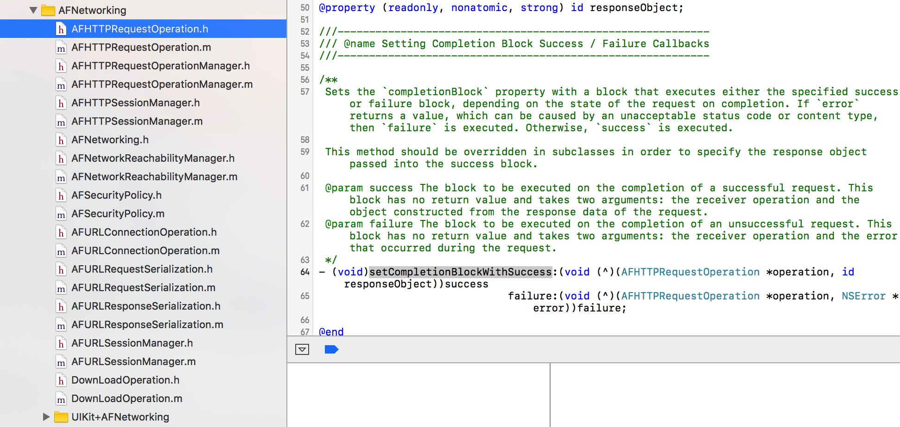
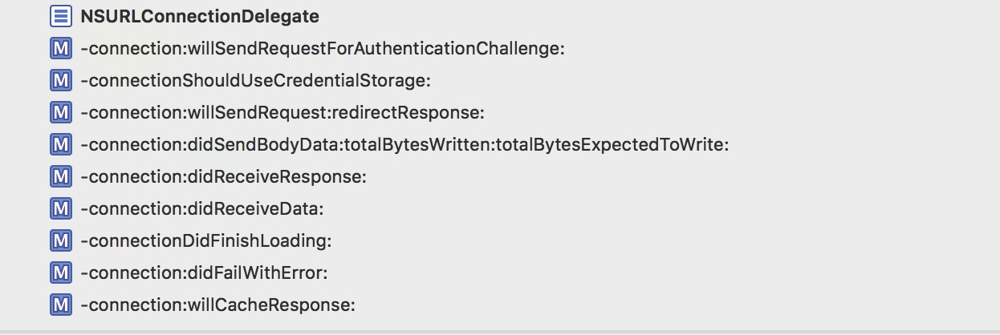
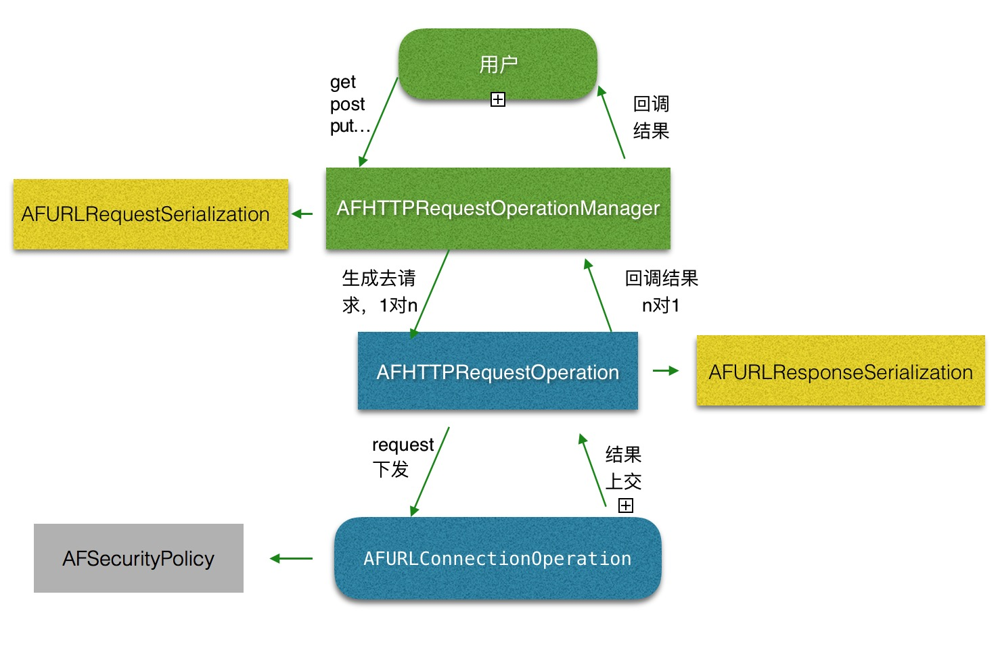

 
<!--BEGIN_DATA
{
    "create_date": "2016-12-28 16:48", 
    "modify_date": "2016-12-28 16:48", 
    "is_top": "0", 
    "summary": "AFNetworking到底做了什么？3", 
    "tags": "iOS", 
    "file_name": "AFNetworking到底做了什么？3.md"
}
END_DATA-->

####
原文出处：<a href='http://www.jianshu.com/p/7ed7c0be15b4' target='blank'>AFNetworking到底做了什么？(终)</a>

##AFNetworking到底做了什么？(终)

  

#####写在开头：

  * 大概回忆下，之前我们讲了`AFNetworking`整个网络请求的流程，包括`request`的拼接，`session`代理的转发，`response`的解析。以及对一些`bug`的适配，如果你还没有看过，可以点这里：  
[AFNetworking到底做了什么?](http://www.jianshu.com/p/856f0e26279d)  
[AFNetworking到底做了什么（二）?](http://www.jianshu.com/p/f32bd79233da)

  * 除此之外我们还单独的开了一篇讲了AF对`https`的处理：  
[AFNetworking之于https认证](http://www.jianshu.com/p/a84237b07611)

  * 还有一篇讲了讲AF对UIKit的扩展：  
[AFNetworking之UIKit扩展与缓存实现](http://www.jianshu.com/p/4ffeb1ba3046)

  * 本文将**涉及AF2.x的核心实现，与AF3.x最新版本之间的对比，以及本系列的一个最终总结：AFNetworking到底做了什么？**

#####开始正文

首先我们来看看AF2.x的项目目录:

  

AF2.X源码结构图.png

除了UIKit扩展外，大概就是上述这么多类，其中最重要的有3个类：

1)`AFURLConnectionOperation`  
2)`AFHTTPRequestOperation`  
3)`AFHTTPRequestOperationManager`

  * 大家都知道，AF2.x是基于`NSURLConnection`来封装的，而`NSURLConnection`的创建以及数据请求，就被封装在`AFURLConnectionOperation`这个类中。所以这个类基本上是AF2.x最底层也是最核心的类。
  * 而`AFHTTPRequestOperation`是继承自`AFURLConnectionOperation`，对它父类一些方法做了些封装。
  * `AFHTTPRequestOperationManager`则是一个管家，去管理这些这些`operation`。

#####我们接下来按照网络请求的流程去看看AF2.x的实现：

注：本文会涉及一些`NSOperationQueue`、`NSOperation`方面的知识，如果对这方面的内容不了解的话，可以先看看雷纯峰的这篇：  
[iOS 并发编程之 Operation Queues ](http://blog.leichunfeng.com/blog/2015/07/29/ios-concurrency-programming-operation-queues/)

#####首先，我们来写一个get或者post请求：

    
    
    AFHTTPRequestOperationManager *manager = [AFHTTPRequestOperationManager manager];
    [manager GET:url parameters:params
         success:^(AFHTTPRequestOperation *operation, id responseObject) {
         } failure:^(AFHTTPRequestOperation *operation, NSError *error) {
         }];

就这么简单的几行代码，完成了一个网络请求。

接着我们来看看`AFHTTPRequestOperationManager`的初始化方法：

    
    
    + (instancetype)manager {
        return [[self alloc] initWithBaseURL:nil];
    }
    - (instancetype)init {
        return [self initWithBaseURL:nil];    
    }
    - (instancetype)initWithBaseURL:(NSURL *)url {
        self = [super init];
        if (!self) {
            return nil;
        }
        // Ensure terminal slash for baseURL path, so that NSURL +URLWithString:relativeToURL: works as expected
        if ([[url path] length] > 0 && ![[url absoluteString] hasSuffix:@"/"]) {
            url = [url URLByAppendingPathComponent:@""];
        }
        self.baseURL = url;
        self.requestSerializer = [AFHTTPRequestSerializer serializer];
        self.responseSerializer = [AFJSONResponseSerializer serializer];
        self.securityPolicy = [AFSecurityPolicy defaultPolicy];
        self.reachabilityManager = [AFNetworkReachabilityManager sharedManager];
        //用来调度所有请求的queue
        self.operationQueue = [[NSOperationQueue alloc] init];
        //是否做证书验证
        self.shouldUseCredentialStorage = YES;
        return self;
    }

初始化方法很简单，基本和AF3.x类似，除了一下两点：  
1)设置了一个`operationQueue`，这个队列，用来调度里面所有的`operation`，在AF2.x中，每一个`operation`就是一个网络
请求。  
2)设置`shouldUseCredentialStorage`为YES，这个后面会传给`operation`，`operation`会根据这个值，去返回给
代理，系统是否做https的证书验证。

#####然后我们来看看get方法：

    
    
    - (AFHTTPRequestOperation *)GET:(NSString *)URLString
                         parameters:(id)parameters
                            success:(void (^)(AFHTTPRequestOperation *operation, id responseObject))success
                            failure:(void (^)(AFHTTPRequestOperation *operation, NSError *error))failure
    {
        //拿到request
        NSMutableURLRequest *request = [self.requestSerializer requestWithMethod:@"GET" URLString:[[NSURL URLWithString:URLString relativeToURL:self.baseURL] absoluteString] parameters:parameters error:nil];
        AFHTTPRequestOperation *operation = [self HTTPRequestOperationWithRequest:request success:success failure:failure];
        [self.operationQueue addOperation:operation];
        return operation;
    }

方法很简单，如下：  
1）用`self.requestSerializer`生成了一个request，至于如何生成，可以参考之前的文章，这里就不赘述了。  
2）生成了一个`AFHTTPRequestOperation`，然后把这个`operation`加到我们一开始创建的`queue`中。

其中创建`AFHTTPRequestOperation`方法如下：

    
    
    - (AFHTTPRequestOperation *)HTTPRequestOperationWithRequest:(NSURLRequest *)request
                                                        success:(void (^)(AFHTTPRequestOperation *operation, id responseObject))success
                                                        failure:(void (^)(AFHTTPRequestOperation *operation, NSError *error))failure
    {
        //创建自定义的AFHTTPRequestOperation
        AFHTTPRequestOperation *operation = [[AFHTTPRequestOperation alloc] initWithRequest:request];
        operation.responseSerializer = self.responseSerializer;
        operation.shouldUseCredentialStorage = self.shouldUseCredentialStorage;
        operation.credential = self.credential;
        //设置自定义的安全策略
        operation.securityPolicy = self.securityPolicy;
        [operation setCompletionBlockWithSuccess:success failure:failure];
        operation.completionQueue = self.completionQueue;
        operation.completionGroup = self.completionGroup;
        return operation;
    }

方法创建了一个`AFHTTPRequestOperation`，并把自己的一些参数交给了这个`operation`处理。

#####接着往里看：

    
    
    - (instancetype)initWithRequest:(NSURLRequest *)urlRequest {
        self = [super initWithRequest:urlRequest];
        if (!self) {
            return nil;
        }
        self.responseSerializer = [AFHTTPResponseSerializer serializer];
        return self;
    }

除了设置了一个`self.responseSerializer`，实际上是调用了父类，也是我们最核心的类`AFURLConnectionOperation`
的初始化方法，首先我们要明确**这个类是继承自NSOperation的**，然后我们接着往下看：

    
    
    //初始化
    - (instancetype)initWithRequest:(NSURLRequest *)urlRequest {
        NSParameterAssert(urlRequest);
        self = [super init];
        if (!self) {
            return nil;
        }
        //设置为ready
        _state = AFOperationReadyState;
        //递归锁
        self.lock = [[NSRecursiveLock alloc] init];
        self.lock.name = kAFNetworkingLockName;
        self.runLoopModes = [NSSet setWithObject:NSRunLoopCommonModes];
        self.request = urlRequest;
        //是否应该咨询证书存储连接
        self.shouldUseCredentialStorage = YES;
        //https认证策略
        self.securityPolicy = [AFSecurityPolicy defaultPolicy];
        return self;
    }

初始化方法中，初始化了一些属性，下面我们来简单的介绍一下这些属性：

  1. `_state`设置为`AFOperationReadyState` 准备就绪状态，这是个枚举：
    
        typedef NS_ENUM(NSInteger, AFOperationState) {
     AFOperationPausedState      = -1,  //停止
     AFOperationReadyState       = 1,   //准备就绪
     AFOperationExecutingState   = 2,  //正在进行中
     AFOperationFinishedState    = 3,  //完成
    };

这个`_state`标志着这个网络请求的状态，一共如上4种状态。这些状态其实对应着`operation`如下的状态：

    
        //映射这个operation的各个状态
    static inline NSString * AFKeyPathFromOperationState(AFOperationState state) {
     switch (state) {
         case AFOperationReadyState:
             return @"isReady";
         case AFOperationExecutingState:
             return @"isExecuting";
         case AFOperationFinishedState:
             return @"isFinished";
         case AFOperationPausedState:
             return @"isPaused";
         default: {
    #pragma clang diagnostic push
    #pragma clang diagnostic ignored "-Wunreachable-code"
             return @"state";
    #pragma clang diagnostic pop
         }
     }
    }

并且还复写了这些属性的get方法，用来和自定义的state一一对应：

    
    //复写这些方法，与自己的定义的state对应
    - (BOOL)isReady {
     return self.state == AFOperationReadyState && [super isReady];
    }
    - (BOOL)isExecuting {
     return self.state == AFOperationExecutingState;
    }
    - (BOOL)isFinished {
     return self.state == AFOperationFinishedState;
    }

  2. `self.lock`这个锁是用来提供给本类一些数据操作的线程安全，至于为什么要用递归锁，是因为有些方法可能会存在递归调用的情况，例如有些需要锁的方法可能会在一个大的操作环中，形成递归。**而AF使用了递归锁，避免了这种情况下死锁的发生**。
  3. 初始化了`self.runLoopModes`，默认为`NSRunLoopCommonModes`。
  4. 生成了一个默认的 `self.securityPolicy`,关于这个policy执行的https认证，可以见楼主之前的文章。

这个类为了自定义`operation`的各种状态，而且更好的掌控它的生命周期，复写了`operation`的`start`方法，当这个`operation`
在一个新线程被调度执行的时候，首先就调入这个`start`方法中，接下来我们它的实现看看：

    
    
    - (void)start {
        [self.lock lock];
        //如果被取消了就调用取消的方法
        if ([self isCancelled]) {
            //在AF常驻线程中去执行
            [self performSelector:@selector(cancelConnection) onThread:[[self class] networkRequestThread] withObject:nil waitUntilDone:NO modes:[self.runLoopModes allObjects]];
        }
        //准备好了，才开始
        else if ([self isReady]) {
            //改变状态，开始执行
            self.state = AFOperationExecutingState;
            [self performSelector:@selector(operationDidStart) onThread:[[self class] networkRequestThread] withObject:nil waitUntilDone:NO modes:[self.runLoopModes allObjects]];
        }
        //注意，发起请求和取消请求都是在同一个线程！！包括回调都是在一个线程
        [self.lock unlock];
    }

这个方法判断了当前的状态，是取消还是准备就绪，然后去调用了各自对应的方法。

  * 注意这些方法都是在另外一个线程中去调用的，我们来看看这个线程：
    
        + (void)networkRequestThreadEntryPoint:(id)__unused object {
	      @autoreleasepool {
	          [[NSThread currentThread] setName:@"AFNetworking"];
	          NSRunLoop *runLoop = [NSRunLoop currentRunLoop];
	          //添加端口，防止runloop直接退出
	          [runLoop addPort:[NSMachPort port] forMode:NSDefaultRunLoopMode];
	          [runLoop run];
	      }
	    }
	    + (NSThread *)networkRequestThread {
	      static NSThread *_networkRequestThread = nil;
	      static dispatch_once_t oncePredicate;
	      dispatch_once(&oncePredicate, ^{
	          _networkRequestThread = [[NSThread alloc] initWithTarget:self selector:@selector(networkRequestThreadEntryPoint:) object:nil];
	          [_networkRequestThread start];
	      });
	      return _networkRequestThread;
	    }

这两个方法基本上是被许多人举例用过无数次了...

  * 这是一个单例，用`NSThread`创建了一个线程，并且为这个线程添加了一个`runloop`，并且加了一个`NSMachPort`，来防止`runloop`直接退出。
  * **这条线程就是AF用来发起网络请求，并且接受网络请求回调的线程，仅仅就这一条线程**（到最后我们来讲为什么要这么做）。和我们之前讲的AF3.x发起请求，并且接受请求回调时的处理方式，遥相呼应。

我们接着来看如果准备就绪，start调用的方法：

    
    //改变状态，开始执行
    self.state = AFOperationExecutingState;
    [self performSelector:@selector(operationDidStart) onThread:[[self class] networkRequestThread] withObject:nil waitUntilDone:NO modes:[self.runLoopModes allObjects]];

接着在常驻线程中,并且不阻塞的方式，在我们`self.runLoopModes`的模式下调用：

    
    - (void)operationDidStart {
        [self.lock lock];
        //如果没取消
        if (![self isCancelled]) {
            //设置为startImmediately YES 请求发出，回调会加入到主线程的 Runloop 下，RunloopMode 会默认为 NSDefaultRunLoopMode
            self.connection = [[NSURLConnection alloc] initWithRequest:self.request delegate:self startImmediately:NO];
            NSRunLoop *runLoop = [NSRunLoop currentRunLoop];
            for (NSString *runLoopMode in self.runLoopModes) {
                //把connection和outputStream注册到当前线程runloop中去，只有这样，才能在这个线程中回调
                [self.connection scheduleInRunLoop:runLoop forMode:runLoopMode];
                [self.outputStream scheduleInRunLoop:runLoop forMode:runLoopMode];
            }
            //打开输出流
            [self.outputStream open];
            //开启请求
            [self.connection start];
        }
        [self.lock unlock];
        dispatch_async(dispatch_get_main_queue(), ^{
            [[NSNotificationCenter defaultCenter] postNotificationName:AFNetworkingOperationDidStartNotification object:self];
        });
    }

这个方法做了以下几件事：

  1. 首先这个方法创建了一个`NSURLConnection`，设置代理为自己，startImmediately为NO，至于这个参数干什么用的，我们来看看官方文档：

> startImmediately YES if the connection should begin loading data immediately, otherwise NO. If you pass NO, the connection is not scheduled with a run loop. You can then schedule the connection in the run loop and mode of your choice by calling scheduleInRunLoop:forMode: .

大意是，这个值默认为YES，而且任务完成的结果会在主线程的runloop中回调。如果我们设置为NO，则需要调用我们下面看到的：

    
        [self.connection scheduleInRunLoop:runLoop forMode:runLoopMode];

去注册一个runloop和mode，它会在我们指定的这个runloop所在的线程中回调结果。

  2. 值得一提的是这里调用了:
    
        [self.outputStream scheduleInRunLoop:runLoop forMode:runLoopMode];

这个`outputStream`在get方法中被初始化了：

    
        - (NSOutputStream *)outputStream {
     if (!_outputStream) {
         //一个写入到内存中的流，可以通过NSStreamDataWrittenToMemoryStreamKey拿到写入后的数据
         self.outputStream = [NSOutputStream outputStreamToMemory];
     }
     return _outputStream;
    }

这里数据请求和拼接并没有用`NSMutableData`，而是用了`outputStream`，而且把写入的数据，放到内存中。

    * 其实讲道理来说`outputStream`的优势在于下载大文件的时候，可以以流的形式，将文件直接保存到本地，**这样可以为我们节省很多的内存**，调用如下方法设置：
        
                [NSOutputStream outputStreamToFileAtPath:@"filePath" append:YES];

    * 但是这里是把流写入内存中，这样其实这个节省内存的意义已经不存在了。那为什么还要用呢？这里我猜测的是就是为了用它这个可以注册在某一个`runloop`的指定`mode`下。 虽然AF使用这个`outputStream`是肯定在这个常驻线程中的，不会有线程安全的问题。但是要注意它是被声明在.h中的：
        
                @property (nonatomic, strong) NSOutputStream *outputStream;

难保外部不会在其他线程对这个数据做什么操作，所以它相对于`NSMutableData`作用就体现出来了，就算我们在外部其它线程中去操作它，也不会有线程安全的
问题。

  3. 这个`connection`开始执行了。

  4. 到主线程发送一个任务开始执行的通知。

  

分割图.png

#####接下来网络请求开始执行了，就开始触发`connection`的代理方法了：

  

代理方法.png

  
AF2.x一共实现了如上这么多代理方法，这些代理方法，作用大部分和我们之前讲的`NSURLSession`的代理方法类似，我们只挑几个去讲，如果需要了解其他
的方法作用，可以参考楼主之前的文章。

#####重点讲下面这四个代理：

注意，有一点需要说明，我们之前是把connection注册在我们常驻线程的runloop中了，**所以以下所有的代理方法，都是在这仅有的一条常驻线程中回调。
**

#####第一个代理

    
    
    //收到响应，响应头类似相关数据
    - (void)connection:(NSURLConnection __unused *)connection
    didReceiveResponse:(NSURLResponse *)response
    {
        self.response = response;
    }

没什么好说的，就是收到响应后，把response赋给自己的属性。

#####第二个代理

    
    
    //拼接获取到的数据
    - (void)connection:(NSURLConnection __unused *)connection
        didReceiveData:(NSData *)data
    {
        NSUInteger length = [data length];
        while (YES) {
            NSInteger totalNumberOfBytesWritten = 0;
            //如果outputStream 还有空余空间
            if ([self.outputStream hasSpaceAvailable]) {
                //创建一个buffer流缓冲区，大小为data的字节数
                const uint8_t *dataBuffer = (uint8_t *)[data bytes];
                NSInteger numberOfBytesWritten = 0;
                //当写的长度小于数据的长度，在循环里
                while (totalNumberOfBytesWritten < (NSInteger)length) {
                    //往outputStream写数据，系统的方法，一次就写一部分，得循环写
                    numberOfBytesWritten = [self.outputStream write:&dataBuffer[(NSUInteger)totalNumberOfBytesWritten] maxLength:(length - (NSUInteger)totalNumberOfBytesWritten)];
                    //如果 numberOfBytesWritten写入失败了。跳出循环
                    if (numberOfBytesWritten == -1) {
                        break;
                    }
                    //加上每次写的长度
                    totalNumberOfBytesWritten += numberOfBytesWritten;
                }
                break;
            }
            //出错
            if (self.outputStream.streamError) {
                //取消connection
                [self.connection cancel];
                //调用失败的方法
                [self performSelector:@selector(connection:didFailWithError:) withObject:self.connection withObject:self.outputStream.streamError];
                return;
            }
        }
        //主线程回调下载数据大小
        dispatch_async(dispatch_get_main_queue(), ^{
            self.totalBytesRead += (long long)length;
            if (self.downloadProgress) {
                self.downloadProgress(length, self.totalBytesRead, self.response.expectedContentLength);
            }
        });
    }

这个方法看起来长，其实容易理解而且简单，它只做了3件事：

  1. 给`outputStream`拼接数据，具体如果拼接，大家可以读注释自行理解下。
  2. 如果出错则调用：`connection:didFailWithError:`也就是网络请求失败的代理，我们一会下面就会讲。
  3. 在主线程中回调下载进度。

#####第三个代理

    
    
    //完成了调用
    - (void)connectionDidFinishLoading:(NSURLConnection __unused *)connection {
        //从outputStream中拿到数据 NSStreamDataWrittenToMemoryStreamKey写入到内存中的流
        self.responseData = [self.outputStream propertyForKey:NSStreamDataWrittenToMemoryStreamKey];
        //关闭outputStream
        [self.outputStream close];
        //如果响应数据已经有了，则outputStream置为nil
        if (self.responseData) {
           self.outputStream = nil;
        }
        //清空connection
        self.connection = nil;
        [self finish];
    }

  * 这个代理是任务完成之后调用。我们从`outputStream`拿到了最后下载数据，然后关闭置空了`outputStream`。并且清空了`connection`。调用了`finish`:
    
        - (void)finish {
	      [self.lock lock];
	      //修改状态
	      self.state = AFOperationFinishedState;
	      [self.lock unlock];
	      //发送完成的通知
	      dispatch_async(dispatch_get_main_queue(), ^{
	          [[NSNotificationCenter defaultCenter] postNotificationName:AFNetworkingOperationDidFinishNotification object:self];
	      });
	    }

把当前任务状态改为已完成，并且到主线程发送任务完成的通知。，**这里我们设置状态为已完成。其实调用了我们本类复写的set的方法**（前面遗漏了，在这里补充）
：
    
        - (void)setState:(AFOperationState)state {
      //判断从当前状态到另一个状态是不是合理，在加上现在是否取消。。大神的框架就是屌啊，这判断严谨的。。一层层
      if (!AFStateTransitionIsValid(self.state, state, [self isCancelled])) {
          return;
      }
      [self.lock lock];
      //拿到对应的父类管理当前线程周期的key
      NSString *oldStateKey = AFKeyPathFromOperationState(self.state);
      NSString *newStateKey = AFKeyPathFromOperationState(state);
      //发出KVO
      [self willChangeValueForKey:newStateKey];
      [self willChangeValueForKey:oldStateKey];
      _state = state;
      [self didChangeValueForKey:oldStateKey];
      [self didChangeValueForKey:newStateKey];
      [self.lock unlock];
    }

这个方法改变`state`的时候，并且发送了`KVO`。大家了解`NSOperationQueue`就知道，如果对应的operation的属性`finnished`被设置为YES，则代表当前`operation`结束了，会把`operation`从队列中移除，并且调用`operation`的`completionBlock`。**这点很重要，因为我们请求到的数据就是从这个`completionBlock`中传递回去的**（下面接着讲这个完成Block，就能从这里对
接上了）。

#####第四个代理

    
    
    //请求失败的回调，在cancel connection的时候，自己也主动调用了
    - (void)connection:(NSURLConnection __unused *)connection
      didFailWithError:(NSError *)error
    {
        //拿到error
        self.error = error;
        //关闭outputStream
        [self.outputStream close];
        //如果响应数据已经有了，则outputStream置为nil
        if (self.responseData) {
            self.outputStream = nil;
        }
        self.connection = nil;
        [self finish];
    }

唯一需要说一下的就是这里给`self.error`赋值，之后完成Block会根据这个error，去判断这次请求是成功还是失败。

至此我们把`AFURLConnectionOperation`的业务主线讲完了。  

  

分割图.png

我们此时数据请求完了，数据在`self.responseData`中，接下来我们来看它是怎么回到我们手里的。  
我们回到`AFURLConnectionOperation`子类`AFHTTPRequestOperation`，有这么一个方法：

    
    
    - (void)setCompletionBlockWithSuccess:(void (^)(AFHTTPRequestOperation *operation, id responseObject))success
                                  failure:(void (^)(AFHTTPRequestOperation *operation, NSError *error))failure
    {
        // completionBlock is manually nilled out in AFURLConnectionOperation to break the retain cycle.
    #pragma clang diagnostic push
    #pragma clang diagnostic ignored "-Warc-retain-cycles"
    #pragma clang diagnostic ignored "-Wgnu"
        self.completionBlock = ^{
            if (self.completionGroup) {
                dispatch_group_enter(self.completionGroup);
            }
            dispatch_async(http_request_operation_processing_queue(), ^{
                if (self.error) {
                    if (failure) {
                        dispatch_group_async(self.completionGroup ?: http_request_operation_completion_group(), self.completionQueue ?: dispatch_get_main_queue(), ^{
                            failure(self, self.error);
                        });
                    }
                } else {
                    id responseObject = self.responseObject;
                    if (self.error) {
                        if (failure) {
                            dispatch_group_async(self.completionGroup ?: http_request_operation_completion_group(), self.completionQueue ?: dispatch_get_main_queue(), ^{
                                failure(self, self.error);
                            });
                        }
                    } else {
                        if (success) {
                            dispatch_group_async(self.completionGroup ?: http_request_operation_completion_group(), self.completionQueue ?: dispatch_get_main_queue(), ^{
                                success(self, responseObject);
                            });
                        }
                    }
                }
                if (self.completionGroup) {
                    dispatch_group_leave(self.completionGroup);
                }
            });
        };
    #pragma clang diagnostic pop
    }

一开始我们在`AFHTTPRequestOperationManager`中是调用过这个方法的：

    
    
    [operation setCompletionBlockWithSuccess:success failure:failure];

  * 我们在把成功和失败的Block传给了这个方法。
  * 这个方法也很好理解，就是设置我们之前提到过得`completionBlock`，**当自己数据请求完成，就会调用这个Block。然后我们在这个Block中调用传过来的成功或者失败的Block。**如果error为空，说明请求成功，把数据传出去，否则为失败，把error信息传出。
  * 这里也类似AF3.x，可以自定义一个完成组和完成队列。数据可以在我们自定义的完成组和队列中回调出去。
  * 除此之外，还有一个有意思的地方：
    
        #pragma clang diagnostic push
	    #pragma clang diagnostic ignored "-Warc-retain-cycles"
	    #pragma clang diagnostic ignored "-Wgnu"
	    #pragma clang diagnostic pop

之前我们说过，这是在忽略编译器的一些警告。

    * `-Wgnu`就不说了，是忽略？：。
    * 值得提下的是`-Warc-retain-cycles`，这里忽略了循环引用的警告。我们仔细看看就知道`self`持有了`completionBlock`，而`completionBlock`内部持有`self`。这里确实循环引用了。那么AF是如何解决这个循环引用的呢？

我们在回到`AFURLConnectionOperation`，还有一个方法我们之前没讲到，它复写了setCompletionBlock这个方法。

    
    
    //复写setCompletionBlock
    - (void)setCompletionBlock:(void (^)(void))block {
        [self.lock lock];
        if (!block) {
            [super setCompletionBlock:nil];
        } else {
            __weak __typeof(self)weakSelf = self;
            [super setCompletionBlock:^ {
                __strong __typeof(weakSelf)strongSelf = weakSelf;
    #pragma clang diagnostic push
    #pragma clang diagnostic ignored "-Wgnu"
                //看有没有自定义的完成组，否则用AF的组
                dispatch_group_t group = strongSelf.completionGroup ?: url_request_operation_completion_group();
                //看有没有自定义的完成queue，否则用主队列
                dispatch_queue_t queue = strongSelf.completionQueue ?: dispatch_get_main_queue();
    #pragma clang diagnostic pop
                //调用设置的Block,在这个组和队列中
                dispatch_group_async(group, queue, ^{
                    block();
                });
                //结束时候置nil，防止循环引用
                dispatch_group_notify(group, url_request_operation_completion_queue(), ^{
                    [strongSelf setCompletionBlock:nil];
                });
            }];
        }
        [self.lock unlock];
    }

注意，它在我们设置的block调用结束的时候，主动的调用:

    
    
    [strongSelf setCompletionBlock:nil];

把Block置空，这样循环引用不复存在了。

好像我们还遗漏了一个东西，就是返回的数据做类型的解析。其实还真不是楼主故意这样东一块西一块的，AF2.x有些代码确实是这样零散。。当然仅仅是相对3.x来说。
AFNetworking整体代码质量，以及架构思想已经强过绝大多数开源项目太多了。。这一点毋庸置疑。

#####我们来接着看看数据解析在什么地方被调用的把：

    
    
    - (id)responseObject {
        [self.lock lock];
        if (!_responseObject && [self isFinished] && !self.error) {
            NSError *error = nil;
            //做数据解析
            self.responseObject = [self.responseSerializer responseObjectForResponse:self.response data:self.responseData error:&error];
            if (error) {
                self.responseSerializationError = error;
            }
        }
        [self.lock unlock];
        return _responseObject;
    }

`AFHTTPRequestOperation` 复写了 `responseObject` 的get方法，  
并且把数据按照我们需要的类型（json、xml等等）进行解析。至于如何解析，可以参考楼主之前AF系列的文章，这里就不赘述了。

有些小伙伴可能会说，楼主你是不是把`AFSecurityPolicy`给忘了啊，其实并没有，它被在 `AFURLConnectionOperation`中https认证的代理中被调用，我们之前系列的文章已经讲的非常详细了，感兴趣的朋友可以翻到前面的文章去看看。

至此，AF2.x整个业务流程就结束了。

接下来，我们来总结总结AF2.x整个业务请求的流程：  

  

AF2.x请求流程图.png

PS.图片是用page画的，第一次用，画了半个小时有没有...有没有感受到楼主很走心...最近发现写文图太少了，以后会多配图的。来加深大家的理解...

#####如上图，我们来梳理一下整个流程：

  * 最上层的是`AFHTTPRequestOperationManager`,我们调用它进行get、post等等各种类型的网络请求
  * 然后它去调用`AFURLRequestSerialization`做request参数拼装。然后生成了一个`AFHTTPRequestOperation`实例，并把request交给它。然后把`AFHTTPRequestOperation`添加到一个`NSOperationQueue`中。
  * 接着`AFHTTPRequestOperation`拿到request后，会去调用它的父类`AFURLConnectionOperation`的初始化方法，并且把相关参数交给它，除此之外，当父类完成数据请求后，它调用了`AFURLResponseSerialization`把数据解析成我们需要的格式（json、XML等等）。
  * 最后就是我们AF最底层的类`AFURLConnectionOperation`，它去数据请求，并且如果是https请求，会在请求的相关代理中，调用`AFSecurityPolicy`做https认证。最后请求到的数据返回。

这就是AF2.x整个做网络请求的业务流程。

#####我们来解决解决之前遗留下来的问题：为什么AF2.x需要一条常驻线程？

首先如果我们用`NSURLConnection`，我们为了获取请求结果有以下三种选择：

  1. 在主线程调异步接口
  2. 每一个请求用一个线程，对应一个runloop，然后等待结果回调。
  3. 只用一条线程，一个runloop，所有结果回调在这个线程上。

很显然AF选择的是第3种方式，创建了一条常驻线程专门处理所有请求的回调事件，这个模型跟`nodejs`有点类似，我们来讨论讨论不选择另外两种方式的原因：

  1. 试想如果我们所有的请求都在主线程中异步调用，好像没什么不可以？那为什么AF不这么做呢...在这里有两点原因（楼主个人总结的，有不同意见，欢迎讨论）：

    * 第一是，如果我们放到主线程去做，势必要这么写：
        
			[[NSURLConnection alloc] initWithRequest:request delegate:self startImmediately:YES]

这样NSURLConnection的回调会被放在主线程中`NSDefaultRunLoopMode`中，这样我们在其它类似`UITrackingRunLoo
pMode`模式下，我们是得不到网络请求的结果的，这显然不是我们想要的，那么我们势必需要调用：

        
      [connection scheduleInRunLoop:[NSRunLoop currentRunLoop] forMode:NSRunLoopCommonModes];

把它加入``NSRunLoopCommonModes`中，试想如果有大量的网络请求，同时回调回来，就会影响我们的UI体验了。

* 另外一点原因是，如果我们请求数据返回，势必要进行数据解析，解析成我们需要的格式，那么这些解析都在主线程中做，给主线程增加额外的负担。  
又或者我们回调回来开辟一个新的线程去做数据解析，那么我们有n个请求回来开辟n条线程带来的性能损耗，以及线程间切换带来的损耗，是不是一笔更大的开销。

所以综述两点原因，我们并不适合在主线程中回调。

  2. 我们一开始就开辟n条线程去做请求，然后设置runloop保活住线程，等待结果回调。

    * 其实看到这，大家想想都觉得这个方法很傻，为了等待不确定的请求结果，阻塞住线程，白白浪费n条线程的开销。

综上所述，这就是**AF2.x需要一条常驻线程的原因了**。

#####至此我们把AF2.x核心流程分析完了。

  

分割图.png

接着到我们本系列一个最终总结了: **AFNetworking到底做了什么？**

  * 相信如果从头看到尾的小伙伴，心里都有了一个属于自己的答案。其实在楼主心里，实在不想去总结它，因为`AFNetworking`中凝聚了太多大牛的思想，根本不是你看完几遍源码所能去议论的。但是想想也知道，如果我说不总结，估计有些看到这的朋友杀人的心都有...
  * 所以我还是赶鸭子上架，来总结总结它。

#####AFNetworking的作用总结：

一. 首先我们需要明确一点的是：  
**相对于AFNetworking2.x，AFNetworking3.x确实没那么有用了。**AFNetworking之前的核心作用就是为了帮我们去调度所有的请求。但是最核心地方却被苹果的`NSURLSession`给借鉴过去了，嗯...是借鉴。这些请求的调度，现在完全由`NSURLSession`给做了，AFNetworking3.x的作用被大大的削弱了。  
二. 但是除此之外，其实它还是很有用的：

  1. **首先它帮我们做了各种请求方式request的拼接。**想想如果我们用`NSURLSession`，我们去做请求，是不是还得自己去考虑各种请求方式下，拼接参数的问题。

  2. **它还帮我们做了一些公用参数（session级别的），和一些私用参数（task级别的）的分离**。它用Block的形式，支持我们自定义一些代理方法，如果没有实现的话，AF还帮我们做了一些默认的处理。而如果我们用`NSURLSession`的话，还得参照AF这么一套代理转发的架构模式去封装。

  3. **它帮我们做了自定义的https认证处理**。看过楼主之前那篇[AFNetworking之于https认证](http://www.jianshu.com/p/a84237b07611)的朋友就知道，如果我们自己用`NSURLSession`实现那几种自定义认证，需要多写多少代码...

  4. **对于请求到的数据，AF帮我们做了各种格式的数据解析，并且支持我们设置自定义的code范围，自定义的数据方式**。如果不在这些范围中，则直接调用失败block。如果用`NSURLSession`呢？这些都自己去写吧...（你要是做过各种除json外其他的数据解析,就会知道这里面坑有多少...）

  5. **对于成功和失败的回调处理。**AF帮我们在数据请求到，到回调给用户之间，做了各种错误的判断，保证了成功和失败的回调，界限清晰。在这过程中，AF帮我们做了太多的容错处理，而`NSURLSession`呢？只给了一个完成的回调，我们得多做多少判断，才能拿到一个确定能正常显示的数据？
  6. ......
  7. ...

光是这些网络请求的业务逻辑，AF帮我们做的就太多太多，当然还远不仅于此。它用凝聚着许多大牛的经验方式，帮我在有些处理中做了最优的选择，比如我们之前说到的，回调线程数设置为1的问题...帮我们绕开了很多的坑，比如系统内部并行创建`task`导致id不唯一等等...

三. 而如果我们需要一些UIKit的扩展，AF则提供了最稳定，而且最优化实现方式：

  * 就比如之前说到过得那个状态栏小菊花，如果是我们自己去做，得多写多少代码，而且实现的还没有AF那样质量高。
  * 又或者`AFImageDownloader`，它对于组图片之间的下载协调，以及缓存使用的之间线程调度。对于线程，锁，以及性能各方面权衡，找出最优化的处理方式，试问小伙伴们自己基于`NSURLSession`去写，能到做几分...

所以最后的结论是：**AFNetworking虽然变弱了，但是它还是很有用的。**用它真的不仅仅是习惯，而是因为它确实帮我们做了太多。

#####写在最后：

  * 这个系列终于结束了，从想要开始写这个系列，到真正结束，花了大半个月的时间。其实3.x源码早在刚出来的时候就读过了，为了写它，又拿出来重新读了一遍。而且为了让大家更容易理解，楼主在大部分代码，几乎是一行一个注释的在标注，在这里浪费了大量的时间。  
然而看到大家的赞和评论，还有有些素昧平生的朋友的打赏。让我发自内心的开心。这一切都太值得...  
如果你能看到这里，除了感谢还是感谢~以后还会分享更多好的文章，谢谢~

  
