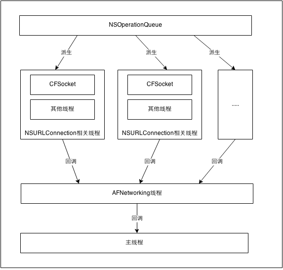
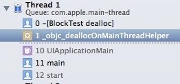
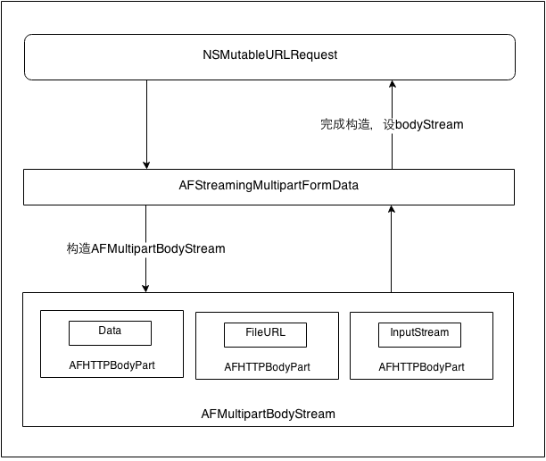
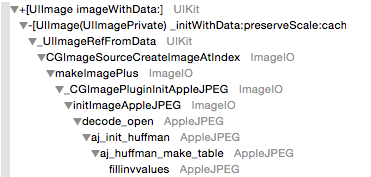

 
<!--BEGIN_DATA
{
    "create_date": "2016-09-12 15:44", 
    "modify_date": "2016-09-12 15:44", 
    "is_top": "0", 
    "summary": "AFNetworking源码解析", 
    "tags": "iOS", 
    "file_name": "AFNetworking源码解析.md"
}
END_DATA-->

####
原文出处：<a href='http://nshipster.cn/afnetworking-2/' target='blank'>AFNetworking 2.0</a>

[AFNetworking](http://afnetworking.com) 是当前 iOS 和 OS X 开发中最广泛使用的开源项目之一。它帮助了成千上万叫好又叫座的应用，也为其它出色的开源库提供了基础。这个项目是社区里最活跃、最有影响力的项目之一，拥有8700 个 star、2200 个 fork 和 130 名贡献者。

从各方面来看，AFNetworking 几乎已经成为主流。

_但你有没有听说过它的新版呢？_ [AFNetworking 2.0](https://github.com/AFNetworking/AFNetworking/)。

这一周的 NSHipster：独家揭晓 AFNetworking 的未来。

>声明：NSHipster 由 [AFNetworking 的作者](https://twitter.com/mattt) 撰写，所以这并不是对 AFNetworking 及它的优点的客观看法。你能看到的是个人关于 AFNetworking 目前及未来版本的真实看法。

###AFNetworking 的大体思路

始于 2011 年 5 月，AFNetworking 作为一个[已死的 LBS 项目](http://en.wikipedia.org/wiki/Gowalla)中对 [Apple 范例代码](https://developer.apple.com/library/ios/samplecode/mvcnetworking/Introduction/Intro.html)的延伸，它的成功更是由于时机。彼时 [ASIHTTPRequest](https://github.com/pokeb/asi-http-request)是网络方面的主流方案，AFNetworking 的核心思路使它正好成为开发者渴求的更现代的方案。

####NSURLConnection + NSOperation

`NSURLConnection` 是 Foundation URL 加载系统的基石。一个 `NSURLConnection` 异步地加载一个`NSURLRequest` 对象，调用 delegate 的 `NSURLResponse` / `NSHTTPURLResponse` 方法，其`NSData` 被发送到服务器或从服务器读取；delegate 还可用来处理`NSURLAuthenticationChallenge`、重定向响应、或是决定 `NSCachedURLResponse` 如何存储在共享的`NSURLCache` 上。

`[NSOperation`](http://nshipster.com/nsoperation)是抽象类，模拟单个计算单元，有状态、优先级、依赖等功能，可以取消。

AFNetworking 的第一个重大突破就是将两者结合。`AFURLConnectionOperation` 作为 `NSOperation`的子类，遵循 `NSURLConnectionDelegate` 的方法，可以从头到尾监视请求的状态，并储存请求、响应、响应数据等中间状态。

####Blocks

iOS 4 引入的 block 和 Grand Central Dispatch 从根本上改善了应用程序的开发过程。相比于在应用中用 delegate乱七八糟地实现逻辑，开发者们可以用 block 将相关的功能放在一起。GCD 能够轻易来回调度工作，不用面对乱七八糟的线程、调用和操作队列。

更重要的是，对于每个 request operation，可以通过 block 自定义 `NSURLConnectionDelegate`
的方法（比如，通过 `setWillSendRequestForAuthenticationChallengeBlock:` 可以覆盖默认的
`connection:willSendRequestForAuthenticationChallenge:` 方法）。

现在，我们可以创建 `AFURLConnectionOperation` 并把它安排进 `NSOperationQueue`，通过设置
`NSOperation` 的新属性 `completionBlock`，指定操作完成时如何处理 response 和 response
data（或是请求过程中遇到的错误）。

####序列化 & 验证

更深入一些，request operation 操作也可以负责验证 HTTP 状态码和服务器响应的内容类型，比如，对于 `application/json`MIME 类型的响应，可以将 NSData 序列化为 JSON 对象。

从服务器加载 JSON、XML、property list 或者图像可以抽象并类比成潜在的文件加载操作，这样开发者可以将这个过程想象成一个 promise而不是异步网络连接。

###介绍 AFNetworking 2.0

AFNetworking 胜在易于使用和可扩展之间取得的平衡，但也并不是没有提升的空间。

在第二个大版本中，AFNetworking 旨在消除原有设计的怪异之处，同时为下一代 iOS 和 OS X 应用程序增加一些强大的新架构。

####动机

  * **兼容 NSURLSession** \- `NSURLSession` 是 iOS 7 新引入的用于替代 `NSURLConnection` 的类。`NSURLConnection` 并没有被弃用，今后一段时间应该也不会，但是 `NSURLSession` 是 Foundation 中网络的未来，并且是一个美好的未来，因为它改进了之前的很多缺点。（参考 WWDC 2013 Session 705 “What’s New in Foundation Networking”，一个很好的概述）。起初有人推测，`NSURLSession` 的出现将使 AFNetworking 不再有用。但实际上，虽然它们有一些重叠，AFNetworking 还是可以提供更高层次的抽象。**AFNetworking 2.0 不仅做到了这一点，还借助并扩展 `NSURLSession` 来铺平道路上的坑洼，并最大程度扩展了它的实用性。**

  * **模块化** \- 对于 AFNetworking 的主要批评之一是笨重。虽然它的构架使在类的层面上是模块化的，但它的包装并不允许选择独立的一些功能。随着时间的推移，`AFHTTPClient` 尤其变得不堪重负（其任务包括创建请求、序列化 query string 参数、确定响应解析行为、生成和管理 operation、监视网络可达性）。 **在 AFNetworking 2.0 中，你可以挑选并通过 [CocoaPods subspecs](https://github.com/CocoaPods/CocoaPods/wiki/The-podspec-format#subspecs) 选择你所需要的组件。**

####演员阵容

#####`NSURLConnection` 组件 _(iOS 6 & 7)_

  * `AFURLConnectionOperation` \- `NSOperation` 的子类，负责管理 `NSURLConnection` 并且实现其 delegate 方法。
  * `AFHTTPRequestOperation` \- `AFURLConnectionOperation` 的子类，用于生成 HTTP 请求，可以区别可接受的和不可接受的状态码及内容类型。2.0 版本中的最大区别是，**你可以直接使用这个类，而不用继承它**，原因可以在“序列化”一节中找到。
  * `AFHTTPRequestOperationManager` \- 包装常见 HTTP web 服务操作的类，通过 `AFHTTPRequestOperation` 由 `NSURLConnection` 支持。

#####`NSURLSession` 组件 _(iOS 7)_

  * `AFURLSessionManager` \- 创建、管理基于 `NSURLSessionConfiguration` 对象的 `NSURLSession` 对象的类，也可以管理 session 的数据、下载/上传任务，实现 session 和其相关联的任务的 delegate 方法。因为 `NSURLSession` API 设计中奇怪的空缺，**任何和 `NSURLSession` 相关的代码都可以用 `AFURLSessionManager` 改善**。
  * `AFHTTPSessionManager` \- `AFURLSessionManager` 的子类，包装常见的 HTTP web 服务操作，通过 `AFURLSessionManager` 由 `NSURLSession` 支持。

* * *

>**总的来说**：为了支持新的 `NSURLSession` API 以及旧的未弃用且还有用的
`NSURLConnection`，AFNetworking 2.0 的核心组件分成了 request operation 和 session
任务。`AFHTTPRequestOperationManager` 和 `AFHTTPSessionManager` 提供类似的功能，在需要的时候（比如在
iOS 6 和 7 之间转换），它们的接口可以相对容易的互换。
>
>之前所有绑定在 `AFHTTPClient`的功能，比如序列化、安全性、可达性，被拆分成几个独立的模块，可被基于 `NSURLSession` 和
`NSURLConnection` 的 API 使用。

* * *

#####序列化

AFNetworking 2.0新构架的突破之一是使用序列化来创建请求、解析响应。可以通过序列化的灵活设计将更多业务逻辑转移到网络层，并更容易定制之前内置的默认行为。

  * `<AFURLRequestSerializer>` \- 符合这个协议的对象用于处理请求，它将请求参数转换为 query string 或是 entity body 的形式，并设置必要的 header。那些不喜欢 `AFHTTPClient` 使用 query string 编码参数的家伙，你们一定喜欢这个。

  * `<AFURLResponseSerializer>` \- 符合这个协议的对象用于验证、序列化响应及相关数据，转换为有用的形式，比如 JSON 对象、图像、甚至基于 [Mantle](https://github.com/blog/1299-mantle-a-model-framework-for-objective-c) 的模型对象。相比没完没了地继承 `AFHTTPClient`，现在 `AFHTTPRequestOperation` 有一个 `responseSerializer` 属性，用于设置合适的 handler。同样的，再也没有[没用的受 `NSURLProtocol` 启发的 request operation 类注册](http://cocoadocs.org/docsets/AFNetworking/1.3.1/Classes/AFHTTPClient.html#//api/name/registerHTTPOperationClass:)，取而代之的还是很棒的 `responseSerializer` 属性。谢天谢地。

#####安全性

感谢 [Dustin Barker](https://github.com/dstnbrkr)、[Oliver Letterer](https://github.com/OliverLetterer)、[KevinHarwood](https://github.com/kcharwood) 等人做出的贡献，AFNetworking 现在带有内置的 [SSLpinning](http://blog.lumberlabs.com/2012/04/why-app-developers-should-care-about.html) 支持，这对于处理敏感信息的应用是十分重要的。

  * `AFSecurityPolicy` \- 评估服务器对安全连接针对指定的固定证书或公共密钥的信任。tl;dr 将你的服务器证书添加到 app bundle，以帮助防止 [中间人攻击](http://en.wikipedia.org/wiki/Man-in-the-middle_attack)。

#####可达性

从 `AFHTTPClient` 解藕的另一个功能是网络可达性。现在你可以直接使用它，或者使用
`AFHTTPRequestOperationManager` / `AFHTTPSessionManager` 的属性。

  * `AFNetworkReachabilityManager` \- 这个类监控当前网络的可达性，提供回调 block 和 notificaiton，在可达性变化时调用。

#####实时性

  * `AFEventSource` \- `[EventSource` DOM API](http://en.wikipedia.org/wiki/Server-sent_events) 的 Objective-C 实现。建立一个到某主机的持久 HTTP 连接，可以将事件传输到事件源并派发到听众。传输到事件源的消息的格式为 [JSON Patch](http://tools.ietf.org/html/rfc6902) 文件，并被翻译成 `AFJSONPatchOperation` 对象的数组。可以将这些 patch operation 应用到之前从服务器获取的持久性数据集。 ~~~{objective-c} NSURL *URL = [NSURL URLWithString:@"[http://example.com"](http://example.com%22)]; AFHTTPSessionManager *manager = [[AFHTTPSessionManager alloc] initWithBaseURL:URL]; [manager GET:@"/resources" parameters:nil success:NSURLSessionDataTask *task, id responseObject { [resources addObjectsFromArray:responseObject[@"resources"]];

[manager SUBSCRIBE:@"/resources" usingBlock:NSArray *operations, NSError
*error { for (AFJSONPatchOperation *operation in operations) { switch
(operation.type) { case AFJSONAddOperationType: [resources
addObject:operation.value]; break; default: break; } } } error:nil]; }
failure:nil]; ~~~

#####UIKit 扩展

之前 AFNetworking 中的所有 UIKit category 都被保留并增强，还增加了一些新的 category。

  * `AFNetworkActivityIndicatorManager`：在请求操作开始、停止加载时，自动开始、停止状态栏上的网络活动指示图标。
  * `UIImageView+AFNetworking`：增加了 `imageResponseSerializer` 属性，可以轻松地让远程加载到 image view 上的图像自动调整大小或应用滤镜。比如，`[AFCoreImageSerializer`](https://github.com/AFNetworking/AFCoreImageSerializer) 可以在 response 的图像显示之前应用 Core Image filter。
  * `UIButton+AFNetworking` _(新)_：与 `UIImageView+AFNetworking` 类似，从远程资源加载 `image` 和 `backgroundImage`。
  * `UIActivityIndicatorView+AFNetworking` _(新)_：根据指定的请求操作和会话任务的状态自动开始、停止 `UIActivityIndicatorView`。
  * `UIProgressView+AFNetworking` _(新)_：自动跟踪某个请求或会话任务的上传/下载进度。
  * `UIWebView+AFNetworking` _(新)_: 为加载 URL 请求提供了更强大的API，支持进度回调和内容转换。

* * *

于是终于要结束 AFNetworking 旋风之旅了。为下一代应用设计的新功能，结合为已有功能设计的全新架构，有很多东西值得兴奋。

####旗开得胜

将下列代码加入 `[Podfile`](http://cocoapods.org) 就可以开始把玩 AFNetworking 2.0 了：

    
    
    platform :ios, '7.0'
    pod "AFNetworking", "2.0.0"
    

For anyone coming over to AFNetworking from the current 1.x release, you may
find [the AFNetworking 2.0 Migration Guide](https://github.com/AFNetworking/AFNetworking/wiki/AFNetworking-2.0-Migration-Guide) especially useful.

对于由 AFNetworking 1.x 版本转移到新版本的用户，你可以找到 [AFNetworking 2.0 迁移指南](https://github.com/AFNetworking/AFNetworking/wiki/AFNetworking-2.0-Migration-Guide)。

####
原文出处：<a href='http://blog.cnbang.net/tech/2320/' target='blank'>AFNetworking源码解析<一></a>

最近看AFNetworking2的源码，学习这个知名网络框架的实现，顺便梳理写下文章。AFNetworking2的大体架构和思路在[这篇文章](http://nshipster.cn/afnetworking-2/)已经说得挺清楚了，就不再赘述了，只说说实现的细节。AFNetworking的代码还在不断更新中，我看的是[AFNetworking2.3.1](https://github.com/AFNetworking/AFNetworking/tree/2.3.1)。

本篇先看看AFURLConnectionOperation，AFURLConnectionOperation继承自NSOperation，是一个封装好的任务单元，在这里构建了NSURLConnection，作为NSURLConnection的delegate处理请求回调，做好状态切换，线程管理，可以说是AFNetworking最核心的类，下面分几部分说下看源码时注意的点，最后放上代码的注释。  

##0.Tricks

AFNetworking代码中有一些常用技巧，先说明一下。

#####A.clang warning

    
    
    
    #pragma clang diagnostic push
    #pragma clang diagnostic ignored "-Wgnu"
    //code
    #pragma clang diagnostic pop
    

表示在这个区间里忽略一些特定的clang的编译警告，因为AFNetworking作为一个库被其他项目引用，所以不能全局忽略clang的一些警告，只能在有需要的时候局部这样做，作者喜欢用?:符号，所以经常见忽略-Wgnu警告的写法，[详见这里](http://nshipster.com/clang-diagnostics/)。

####B.dispatch_once

为保证线程安全，所有单例都用dispatch_once生成，保证只执行一次，这也是iOS开发常用的技巧。例如：

    
    
    
    static dispatch_queue_t url_request_operation_completion_queue() {
        static dispatch_queue_t af_url_request_operation_completion_queue;
        static dispatch_once_t onceToken;
        dispatch_once(&onceToken, ^{
            af_url_request_operation_completion_queue = dispatch_queue_create("com.alamofire.networking.operation.queue",   DISPATCH_QUEUE_CONCURRENT );
        });
        return af_url_request_operation_completion_queue;
    }
    

####C.weak & strong self

常看到一个block要使用self，会处理成在外部声明一个weak变量指向self，在block里又声明一个strong变量指向weakSelf：

    
    
    
    __weak __typeof(self)weakSelf = self;
    self.backgroundTaskIdentifier = [application beginBackgroundTaskWithExpirationHandler:^{
        __strong __typeof(weakSelf)strongSelf = weakSelf;
    }];
    

weakSelf是为了block不持有self，避免循环引用，而再声明一个strongSelf是因为一旦进入block执行，就不允许self在这个执行过程中释放。block执行完后这个strongSelf会自动释放，没有循环引用问题。

##1.线程

先来看看NSURLConnection发送请求时的线程情况，NSURLConnection是被设计成异步发送的，调用了start方法后，NSURLConnection会新建一些线程用底层的CFSocket去发送和接收请求，在发送和接收的一些事件发生后通知原来线程的Runloop去回调事件。

NSURLConnection的同步方法sendSynchronousRequest方法也是基于异步的，同样要在其他线程去处理请求的发送和接收，只是同步方法会手动block住线程，发送状态的通知也不是通过RunLoop进行。

使用NSURLConnection有几种选择：

####A.在主线程调异步接口

若直接在主线程调用异步接口，会有个Runloop相关的问题：

当在主线程调用[[NSURLConnection alloc] initWithRequest:request delegate:self startImmediately:YES]时，请求发出，侦听任务会加入到主线程的Runloop下，RunloopMode会默认为NSDefaultRunLoopMode。这表明只有当前线程的Runloop处于NSDefaultRunLoopMode时，这个任务才会被执行。但当用户滚动tableview或scrollview时，主线程的Runloop是处于NSEventTrackingRunLoopMode模式下的，不会执行NSDefaultRunLoopMode的任务，所以会出现一个问题，请求发出后，如果用户一直在操作UI上下滑动屏幕，那在滑动结束前是不会执行回调函数的，只有在滑动结束，RunloopMode切回NSDefaultRunLoopMode，才会执行回调函数。苹果一直把动画效果性能放在第一位，估计这也是苹果提升UI动画性能的手段之一。

所以若要在主线程使用NSURLConnection异步接口，需要手动把RunloopMode设为NSRunLoopCommonModes。这个mode意思是无论当前Runloop处于什么状态，都执行这个任务。

    
    
    
    NSURLConnection *connection = [[NSURLConnection alloc] initWithRequest:request delegate:self startImmediately:NO];
    [connection scheduleInRunLoop:[NSRunLoop currentRunLoop] forMode:NSRunLoopCommonModes];
    [connection start];
    

####B.在子线程调同步接口

若在子线程调用同步接口，一条线程只能处理一个请求，因为请求一发出去线程就阻塞住等待回调，需要给每个请求新建一个线程，这是很浪费的，这种方式唯一的好处应该是易于控制请求并发的数量。

####C.在子线程调异步接口

子线程调用异步接口，子线程需要有Runloop去接收异步回调事件，这里也可以每个请求都新建一条带有Runloop的线程去侦听回调，但这一点好处都没有，既然是异步回调，除了处理回调内容，其他时间线程都是空闲可利用的，所有请求共用一个响应的线程就够了。

AFNetworking用的就是第三种方式，创建了一条常驻线程专门处理所有请求的回调事件，这个模型跟nodejs有点类似。网络请求回调处理完，组装好数据后再给上层调用者回调，这时候回调是抛回主线程的，因为主线程是最安全的，使用者可能会在回调中更新UI，在子线程更新UI会导致各种问题，一般使用者也可以不需要关心线程问题。

以下是相关线程大致的关系，实际上多个NSURLConnection会共用一个NSURLConnectionLoader线程，这里就不细化了，除了处理socket的CFSocket线程，还有一些Javascript:Core的线程，目前不清楚作用，归为NSURLConnection里的其他线程。因为NSURLConnection是系统控件，每个iOS版本可能都有不一样，可以先把NSURLConnection当成一个黑盒，只管它的start和callback就行了。如果使用AFHttpRequestOperationManager的接口发送请求，这些请求会统一在一个NSOperationQueue里去发，所以多了上面NSOperationQueue的一个线程。

相关代码：-networkRequestThread:, -start:, -operationDidStart:。

##2.状态机

继承NSOperation有个很麻烦的东西要处理，就是改变状态时需要发KVO通知，否则这个类加入NSOperationQueue不可用了。NSOperationQueue是用KVO方式侦听NSOperation状态的改变，以判断这个任务当前是否已完成，完成的任务需要在队列中除去并释放。

AFURLConnectionOperation对此做了个状态机，统一搞定状态切换以及发KVO通知的问题，内部要改变状态时，就只需要类似self.state = AFOperationReadyState的调用而不需要做其他了，状态改变的KVO通知在setState里发出。

总的来说状态管理相关代码就三部分，一是限制一个状态可以切换到其他哪些状态，避免状态切换混乱，二是状态Enum值与NSOperation四个状态方法的对应，三是在setState时统一发KVO通知。详见代码注释。

相关代码：AFKeyPathFromOperationState, AFStateTransitionIsValid, -setState:,
-isPaused:, -isReady:, -isExecuting:, -isFinished:.

##3.NSURLConnectionDelegate

处理NSURLConnection Delegate的内容不多，代码也是按请求回调的顺序排列下去，十分易读，主要流程就是接收到响应的时候打开outputStream，接着有数据过来就往outputStream写，在上传/接收数据过程中会回调上层传进来的相应的callback，在请求完成回调到connectionDidFinishLoading时，关闭outputStream，用outputStream组装responseData作为接收到的数据，把NSOperation状态设为finished，表示任务完成，NSOperation会自动调用completeBlock，再回调到上层。

##4.setCompleteBlock

NSOperation在iOS4.0以后提供了个接口setCompletionBlock，可以传入一个block作为任务执行完成时（state状态机变为finished时）的回调，AFNetworking直接用了这个接口，并通过重写加了几个功能：

####A.消除循环引用

在NSOperation的实现里，completionBlock是NSOperation对象的一个成员，NSOperation对象持有着completionBlock，若传进来的block用到了NSOperation对象，或者block用到的对象持有了这个NSOperation对象，就会造成循环引用。这里执行完block后调用[strongSelf setCompletionBlock:nil]把completionBlock设成nil，手动释放self(NSOperation对象)持有的completionBlock对象，打破循环引用。

可以理解成对外保证传进来的block一定会被释放，解决外部使用使很容易出现的因对象关系复杂导致循环引用的问题，让使用者不知道循环引用这个概念都能正确使用。

####B.dispatch_group

这里允许用户让所有operation的completionBlock在一个group里执行，但我没看出这样做的作用，若想组装一组请求（见下面的batchOfRequestOperations）也不需要再让completionBlock在group里执行，求解。

####C."The Deallocation Problem"

作者在注释里说这里重写的setCompletionBlock方法解决了"[The Deallocation Problem](http://developer.apple.com/library/ios/#technotes/tn2109/)”，实际上并没有。"The Deallocation Problem”简单来说就是不要让UIKit的东西在子线程释放。

这里如果传进来的block持有了外部的UIViewController或其他UIKit对象（下面暂时称为A对象），并且在请求完成之前其他所有对这个A对象的引用都已经释放了，那么这个completionBlock就是最后一个持有这个A对象的，这个block释放时A对象也会释放。这个block在什么线程释放，A对象就会在什么线程释放。我们看到block释放的地方是url_request_operation_completion_queue()，这是AFNetworking特意生成的子线程，所以按理说A对象是会在子线程释放的，会导致UIKit对象在子线程释放，会有问题。

但AFNetworking实际用起来却没问题，想了很久不得其解，后来做了实验，发现iOS5以后苹果对UIKit对象的释放做了特殊处理，只要发现在子线程释放这些对象，就自动转到主线程去释放，断点出来是由一个叫_objc_deallocOnMainThreadHelper的方法做的。如果不是UIKit对象就不会跳到主线程释放。AFNetworking2.0只支持iOS6+，所以没问题。

##5.batchOfRequestOperations

这里额外提供了一个便捷接口，可以传入一组请求，在所有请求完成后回调complionBlock，在每一个请求完成时回调progressBlock通知外面有多少个请求已完成。详情参见代码注释，这里需要说明下dispatch_group_enter和dispatch_group_leave的使用，这两个方法用于把一个异步任务加入group里。

一般我们要把一个任务加入一个group里是这样：

    
    
    
    dispatch_group_async(group, queue, ^{
        block();
    });
    

这个写法等价于

    
    
    
    dispatch_async(queue, ^{
        dispatch_group_enter(group);
        block()
        dispatch_group_leave(group);
    });
    

如果要把一个异步任务加入group，这样就行不通了：

    
    
    
    dispatch_group_async(group, queue, ^{
        [self performBlock:^(){
            block();
        }];
        //未执行到block() group任务就已经完成了
    });
    

这时需要这样写：

    
    
    
    dispatch_group_enter(group);
    [self performBlock:^(){
        block();
        dispatch_group_leave(group);
    }];
    

异步任务回调后才算这个group任务完成。对batchOfRequest的实现来说就是请求完成并回调后，才算这个任务完成。

其实这跟retain/release差不多，都是计数，dispatch_group_enter时任务数+1，dispatch_group_leave时任务数-1，任务数为0时执行dispatch_group_notify的内容。

相关代码：-batchOfRequestOperations:progressBlock:completionBlock:

##6.其他

####A.锁

AFURLConnectionOperation有一把递归锁，在所有会访问/修改成员变量的对外接口都加了锁，因为这些对外的接口用户是可以在任意线程调用的，对于访问和修改成员变量的接口，必须用锁保证线程安全。

####B.序列化

AFNetworking的多数类都支持序列化，但实现的是NSSecureCoding的接口，而不是NSCoding，区别在于解数据时要指定Class，用-decodeObjectOfClass:forKey:方法代替了-decodeObjectForKey:。这样做更安全，因为序列化后的数据有可能被篡改，若不指定Class，-decode出来的对象可能不是原来的对象，有潜在风险。另外，NSSecureCoding是iOS6以上才有的。[详见这里](http://nshipster.com/nssecurecoding/)。

这里在序列化时保存了当前任务状态，接收的数据等，但回调block是保存不了的，需要在取出来发送时重新设置。可以像下面这样持久化保存和取出任务：

    
    
    
    AFHTTPRequestOperation *operation = [[AFHTTPRequestOperation alloc] initWithRequest:request];
    NSData *data = [NSKeyedArchiver archivedDataWithRootObject:operation];
    AFHTTPRequestOperation *operationFromDB = [NSKeyedUnarchiver unarchiveObjectWithData:data];
    [operationFromDB start];
    

####C.backgroundTask

这里提供了setShouldExecuteAsBackgroundTaskWithExpirationHandler接口，决定APP进入后台后是否继续发送接收请求，并在后台执行时间超时后取消所有请求。在dealloc里需要调用[application
endBackgroundTask:]，告诉系统这个后台任务已经完成，不然系统会一直让你的APP运行在后台，直到超时。

相关代码：-setShouldExecuteAsBackgroundTaskWithExpirationHandler:, -dealloc:

###7.AFHTTPRequestOperation

AFHTTPRequestOperation继承了AFURLConnectionOperation，把它放一起说是因为它没做多少事情，主要多了responseSerializer，暂停下载断点续传，以及提供接口请求成功失败的回调接口-
setCompletionBlockWithSuccess:failure:。详见源码注释。

####
原文出处：<a href='http://blog.cnbang.net/tech/2371/' target='blank'>AFNetworking2.0源码解析<二></a>

本篇我们继续来看看AFNetworking的下一个模块 — AFURLRequestSerialization。

AFURLRequestSerialization用于帮助构建NSURLRequest，主要做了两个事情：  
1.构建普通请求：格式化请求参数，生成HTTP Header。  
2.构建multipart请求。  
分别看看它在这两点具体做了什么，怎么做的。  

##1.构建普通请求

####A.格式化请求参数

一般我们请求都会按key=value的方式带上各种参数，GET方法参数直接加在URL上，POST方法放在body上，NSURLRequest没有封装好这个参数的解析，只能我们自己拼好字符串。AFNetworking提供了接口，让参数可以是NSDictionary, NSArray, NSSet这些类型，再由内部解析成字符串后赋给NSURLRequest。

转化过程大致是这样的：

    
    
    
    @{
         @"name" : @"bang",
         @"phone": @{@"mobile": @"xx", @"home": @"xx"},
         @"families": @[@"father", @"mother"],
         @"nums": [NSSet setWithObjects:@"1", @"2", nil]
    }
    ->
    @[
         field: @"name", value: @"bang",
         field: @"phone[mobile]", value: @"xx",
         field: @"phone[home]", value: @"xx",
         field: @"families[]", value: @"father",
         field: @"families[]", value: @"mother",
         field: @"nums", value: @"1",
         field: @"nums", value: @"2",
    ]
    ->
    name=bang&phone[mobile]=xx&phone[home]=xx&families[]=father&families[]=mother&nums=1&num=2
    

第一部分是用户传进来的数据，支持包含NSArray,NSDictionary,NSSet这三种数据结构。  
第二部分是转换成AFNetworking内自己的数据结构，每一个key-value对都用一个对象AFQueryStringPair表示，作用是最后可以根据不同的字符串编码生成各自的key=value字符串。主要函数是AFQueryStringPairsFromKeyAndValue，详见源码注释。  
第三部分是最后生成NSURLRequest可用的字符串数据，并且对参数进行url编码，在AFQueryStringFromParametersWithEncoding这个函数里。

最后在把数据赋给NSURLRequest时根据不同的HTTP方法分别处理，对于GET/HEAD/DELETE方法，把参数加到URL后面，对于其他如POST/PUT方法，把数据加到body上，并设好HTTP头，告诉服务端字符串的编码。

####B.HTTP Header

AFNetworking帮你组装好了一些HTTP请求头，包括语言Accept-Language，根据[NSLocale
preferredLanguages]方法读取本地语言，告诉服务端自己能接受的语言。还有构建User-Agent，以及提供BasicAuth认证接口，帮你把用户名密码做base64编码后放入HTTP请求头。详见源码注释。

####C.其他格式化方式

HTTP请求参数不一定是要key=value形式，可以是任何形式的数据，可以是json格式，苹果的[plist格式](https://developer.apple.com/library/mac/documentation/Cocoa/Conceptual/PropertyLists/AboutPropertyLists/AboutPropertyLists.html#//apple_ref/doc/uid/10000048i-CH3-54303)，二进制protobuf格式等，AFNetworking提供了方法可以很容易扩展支持这些格式，默认就实现了json和plist格式。详见源码的类AFJSONRequestSerializer和AFPropertyListRequestSerializer。

##2.构建multipart请求

构建Multipart请求是占篇幅很大的一个功能，AFURLRequestSerialization里2/3的代码都是在做这个事。

####A.Multipart协议介绍

Multipart是HTTP协议为web表单新增的上传文件的协议，协议文档是[rfc1867](https://www.ietf.org/rfc/rfc1867.txt)，它基于HTTP的POST方法，数据同样是放在body上，跟普通POST方法的区别是数据不是key=value形式，key=value形式难以表示文件实体，为此Multipart协议添加了分隔符，有自己的格式结构，大致如下：  

`  
—AaB03x  
content-disposition: form-data; name=“name"`

bang  
-AaB03x  
content-disposition: form-data; name="pic"; filename=“content.txt"  
Content-Type: text/plain

… contents of bang.txt …  
-AaB03x-

以上表示数据name=bang以及一个文件，content.txt是文件名，… contents of bang.txt
…是文件实体内容。分隔符—AaB03x是可以自定义的，写在HTTP头部里：  
`  
Content-type: multipart/form-data, boundary=AaB03x  
`  
每一个部分都有自己的头部，表明这部分的数据类型以及其他一些参数，例如文件名，普通字段的key。最后一个分隔符会多加两横，表示数据已经结束：—AaB03x—。

####B.实现

接下来说说怎样构造Multipart里的数据，最简单的方式就是直接拼数据，要发送一个文件，就直接把文件所有内容读取出来，再按上述协议加上头部和分隔符，拼接好数据后扔给NSURLRequest的body就可以发送了，很简单。但这样做是不可用的，因为文件可能很大，这样拼数据把整个文件读进内存，很可能把内存撑爆了。

第二种方法是不把文件读出来，不在内存拼，而是新建一个临时文件，在这个文件上拼接数据，再把文件地址扔给NSURLRequest的bodyStream，这样上传的时候是分片读取这个文件，不会撑爆内存，但这样每次上传都需要新建个临时文件，对这个临时文件的管理也挺麻烦的。

第三种方法是构建自己的数据结构，只保存要上传的文件地址，边上传边拼数据，上传是分片的，拼数据也是分片的，拼到文件实体部分时直接从原来的文件分片读取。这方法没上述两种的问题，只是实现起来也没上述两种简单，AFNetworking就是实现这第三种方法，而且还更进一步，除了文件，还可以添加多个其他不同类型的数据，包括NSData，和InputStream。

AFNetworking里multipart请求的使用方式是这样：

    
    
    
    AFHTTPRequestOperationManager *manager = [AFHTTPRequestOperationManager manager];
    NSDictionary *parameters = @{@"foo": @"bar"};
    NSURL *filePath = [NSURL fileURLWithPath:@"file://path/to/image.png"];
    [manager POST:@"http://example.com/resources.json" parameters:parameters constructingBodyWithBlock:^(id formData) {
        [formData appendPartWithFileURL:filePath name:@"image" error:nil];
    } success:^(AFHTTPRequestOperation *operation, id responseObject) {
        NSLog(@"Success: %@", responseObject);
    } failure:^(AFHTTPRequestOperation *operation, NSError *error) {
        NSLog(@"Error: %@", error);
    }];
    

这里通过constructingBodyWithBlock向使用者提供了一个AFStreamingMultipartFormData对象，调这个对象的几种append方法就可以添加不同类型的数据，包括FileURL/NSData/NSInputStream，AFStreamingMultipartFormData内部把这些append的数据转成不同类型的AFHTTPBodyPart，添加到自定义的AFMultipartBodyStream里。最后把AFMultipartBodyStream赋给原来NSMutableURLRequest的bodyStream。NSURLConnection发送请求时会读取这个bodyStream，在读取数据时会调用这个bodyStream的-read:maxLength:方法，AFMultipartBodyStream重写了这个方法，不断读取之前append进来的AFHTTPBodyPart数据直到读完。

AFHTTPBodyPart封装了各部分数据的组装和读取，一个AFHTTPBodyPart就是一个数据块。实际上三种类型(FileURL/NSData/NSInputStream)的数据在AFHTTPBodyPart都转成NSInputStream，读取数据时只需读这个inputStream。inputStream只保存了数据的实体，没有包括分隔符和头部，AFHTTPBodyPart是边读取变拼接数据，用一个状态机确定现在数据读取到哪一部份，以及保存这个状态下已被读取的字节数，以此定位要读的数据位置，详见AFHTTPBodyPart的-read:maxLength:方法。

AFMultipartBodyStream封装了整个multipart数据的读取，主要是根据读取的位置确定现在要读哪一个AFHTTPBodyPart。AFStreamingMultipartFormData对外提供友好的append接口，并把构造好的AFMultipartBodyStream赋回给NSMutableURLRequest，关系大致如下图：

####C.NSInputStream子类

NSURLRequest的setHTTPBodyStream接受的是一个NSInputStream*参数，那我们要自定义inputStream的话，创建一个NSInputStream的子类传给它是不是就可以了？实际上不行，这样做后用NSURLRequest发出请求会导致crash，提示[xx_scheduleInCFRunLoop:forMode:]: unrecognized selector。

这是因为NSURLRequest实际上接受的不是NSInputStream对象，而是CoreFoundation的CFReadStreamRef对象，因为CFReadStreamRef和NSInputStream是toll-free bridged，可以自由转换，但CFReadStreamRef会用到CFStreamScheduleWithRunLoop这个方法，当它调用到这个方法时，object-c的toll-free bridging机制会调用object-c对象NSInputStream的相应函数，这里就调用到了_scheduleInCFRunLoop:forMode:，若不实现这个方法就会crash。详见[这篇文章](http://blog.octiplex.com/2011/06/how-to-implement-a-corefoundation-toll-free-bridged-nsinputstream-subclass/)。

####
原文出处：<a href='http://blog.cnbang.net/tech/2416/' target='blank'>AFNetworking2.0源码解析<三></a>

续AFNetworking源码解析<[一>](http://blog.cnbang.net/tech/2320/)<[二>](http://blog.cnbang.net/tech/2371/)

本篇说说安全相关的AFSecurityPolicy模块，AFSecurityPolicy用于验证HTTPS请求的证书，先来看看HTTPS的原理和证书相关的几个问题。

##HTTPS

HTTPS连接建立过程大致是，客户端和服务端建立一个连接，服务端返回一个证书，客户端里存有各个受信任的证书机构根证书，用这些根证书对服务端返回的证书进行验证，经验证如果证书是可信任的，就生成一个pre-master secret，用这个证书的公钥加密后发送给服务端，服务端用私钥解密后得到pre-master
secret，再根据某种算法生成master secret，客户端也同样根据这种算法从pre-master secret生成master secret，随后双方的通信都用这个master secret对传输数据进行加密解密。  

以上是简单过程，中间还有很多细节，详细过程和原理已经有很多文章阐述得很好，就不再复述，推荐一些相关文章：  
关于非对称加密算法的原理：RSA算法原理<[一>](http://www.ruanyifeng.com/blog/2013/06/rsa_algorithm_part_one.html )<[二>](http://www.ruanyifeng.com/blog/2013/07/rsa_algorithm_part_two.html)  
关于整个流程：HTTPS那些事<[一>](http://www.guokr.com/post/114121/)
<[二>](http://www.guokr.com/post/116169/)
<[三>](http://www.guokr.com/blog/148613/)  
关于数字证书：[浅析数字证书]( http://www.cnblogs.com/hyddd/archive/2009/01/07/1371292.html)

这里说下一开始我比较费解的两个问题：

####1.证书是怎样验证的？怎样保证中间人不能伪造证书？

首先要知道非对称加密算法的特点，非对称加密有一对公钥私钥，用公钥加密的数据只能通过对应的私钥解密，用私钥加密的数据只能通过对应的公钥解密。

我们来看最简单的情况：一个证书颁发机构(CA)，颁发了一个证书A，服务器用这个证书建立https连接。客户端在信任列表里有这个CA机构的根证书。

首先CA机构颁发的证书A里包含有证书内容F，以及证书加密内容F1，加密内容F1就是用这个证书机构的私钥对内容F加密的结果。（这中间还有一次hash算法，略过。）

建立https连接时，服务端返回证书A给客户端，客户端的系统里的CA机构根证书有这个CA机构的公钥，用这个公钥对证书A的加密内容F1解密得到F2，跟证书A里内容F对比，若相等就通过验证。整个流程大致是：F->CA私钥加密->F1->客户端CA公钥解密->F。因为中间人不会有CA机构的私钥，客户端无法通过CA公钥解密，所以伪造的证书肯定无法通过验证。

####2.什么是SSL Pinning？

可以理解为证书绑定，是指客户端直接保存服务端的证书，建立https连接时直接对比服务端返回的和客户端保存的两个证书是否一样，一样就表明证书是真的，不再去系统的信任证书机构里寻找验证。这适用于非浏览器应用，因为浏览器跟很多未知服务端打交道，无法把每个服务端的证书都保存到本地，但CS架构的像手机APP事先已经知道要进行通信的服务端，可以直接在客户端保存这个服务端的证书用于校验。

为什么直接对比就能保证证书没问题？如果中间人从客户端取出证书，再伪装成服务端跟其他客户端通信，它发送给客户端的这个证书不就能通过验证吗？确实可以通过验证，但后续的流程走不下去，因为下一步客户端会用证书里的公钥加密，中间人没有这个证书的私钥就解不出内容，也就截获不到数据，这个证书的私钥只有真正的服务端有，中间人伪造证书主要伪造的是公钥。

为什么要用SSL Pinning？正常的验证方式不够吗？如果服务端的证书是从受信任的的CA机构颁发的，验证是没问题的，但CA机构颁发证书比较昂贵，小企业或个人用户可能会选择自己颁发证书，这样就无法通过系统受信任的CA机构列表验证这个证书的真伪了，所以需要SSL Pinning这样的方式去验证。

##AFSecurityPolicy

NSURLConnection已经封装了https连接的建立、数据的加密解密功能，我们直接使用NSURLConnection是可以访问https网站的，但NSURLConnection并没有验证证书是否合法，无法避免中间人攻击。要做到真正安全通讯，需要我们手动去验证服务端返回的证书，AFSecurityPolicy封装了证书验证的过程，让用户可以轻易使用，除了去系统信任CA机构列表验证，还支持SSL Pinning方式的验证。使用方法：

    
    
    
    //把服务端证书(需要转换成cer格式)放到APP项目资源里，AFSecurityPolicy会自动寻找根目录下所有cer文件
    AFSecurityPolicy *securityPolicy = [AFSecurityPolicy policyWithPinningMode:AFSSLPinningModePublicKey];
    securityPolicy.allowInvalidCertificates = YES;
    [AFHTTPRequestOperationManager manager].securityPolicy = securityPolicy;
    [manager GET:@"https://example.com/" parameters:nil success:^(AFHTTPRequestOperation *operation, id responseObject) {
    } failure:^(AFHTTPRequestOperation *operation, NSError *error) {
    }];
    

AFSecurityPolicy分三种验证模式：

####AFSSLPinningModeNone

这个模式表示不做SSLpinning，只跟浏览器一样在系统的信任机构列表里验证服务端返回的证书。若证书是信任机构签发的就会通过，若是自己服务器生成的证书，这里是不会通过的。

####AFSSLPinningModeCertificate

这个模式表示用证书绑定方式验证证书，需要客户端保存有服务端的证书拷贝，这里验证分两步，第一步验证证书的域名/有效期等信息，第二步是对比服务端返回的证书跟客户端返回的是否一致。

这里还没弄明白第一步的验证是怎么进行的，代码上跟去系统信任机构列表里验证一样调用了SecTrustEvaluate，只是这里的列表换成了客户端保存的那些证书列表。若要验证这个，是否应该把服务端证书的颁发机构根证书也放到客户端里？

####AFSSLPinningModePublicKey

这个模式同样是用证书绑定方式验证，客户端要有服务端的证书拷贝，只是验证时只验证证书里的公钥，不验证证书的有效期等信息。只要公钥是正确的，就能保证通信不会被窃听，因为中间人没有私钥，无法解开通过公钥加密的数据。

整个AFSecurityPolicy就是实现这这几种验证方式，剩下的就是实现细节了，详见源码。

####
原文出处：<a href='http://blog.cnbang.net/tech/2456/' target='blank'>AFNetworking2.0源码解析<四></a>

续AFNetworking2.0源码解析<[一>](http://blog.cnbang.net/tech/2320/)<[二>](http://blog.cnbang.net/tech/2371/)<[三>](http://blog.cnbang.net/tech/2416/)，本篇来看看AFURLResponseSerialization做的事情。

##结构

AFURLResponseSerialization负责解析网络返回数据，检查数据是否合法，把NSData数据转成相应的对象，内置的转换器有json,xml,plist,image，用户可以很方便地继承基类AFHTTPResponseSerializer去解析更多的数据格式，AFNetworking这一套响应解析机制结构很简单，主要就是两个方法：

####1.-validateResponse:data:error:

基类AFHTTPResponseSerializer的这个方法检测返回的HTTP状态码和数据类型是否合法，属性acceptableStatusCodes和acceptableContentTypes规定了合法的状态码和数据类型，例如JSONSerialization就把acceptableContentTypes设为@"application/json", @"text/json", @"text/javascript”，若不是这三者之一，就验证失败，返回相应的NSError对象。一般子类不需要重写这个方法，只需要设置好acceptableStatusCodes和acceptableContentTypes就行了。  

####2.-responseObjectForResponse:data:error:

这个方法解析数据，把NSData转成相应的对象，上层AFURLConnectionOperation会调用这个方法获取转换后的对象。

在解析数据之前会先调上述的validateResponse方法检测HTTP响应是否合法，要注意的是即使这里检测返回不合法，也会继续解析数据生成对象，因为有可能错误信息就在返回的数据里。

如果validateResponse返回error，这里的解析数据又出错，这时有两个error对象，怎样返回给上层？这里的处理是把解析数据的NSError对象保存到validateResponse NSError的userInfo里，作为UnderlyingError，NSError专门给了个NSUnderlyingErrorKey作为这种错误包含错误的键值。

剩下的就是NSecureCoding相关方法了，如果子类增加了property，需要加上相应的NSecureCoding方法。

##JSON解析

AFJSONResponseSerializer使用系统内置的NSJSONSerialization解析json，NSJSON只支持解析UTF8编码的数据（还有UTF-16LE之类的，都不常用），所以要先把返回的数据转成UTF8格式。这里会尝试用HTTP返回的编码类型和自己设置的stringEncoding去把数据解码转成字符串NSString，再把NSString用UTF8编码转成NSData，再用NSJSONSerialization解析成对象返回。

上述过程是NSData->NSString->NSData->NSObject，这里有个问题，如果你能确定服务端返回的是UTF8编码的json数据，那NSData->NSString->NSData这两步就是无意义的，而且这两步进行了两次编解码，很浪费性能，所以如果确定服务端返回utf8编码数据，就建议自己再写个JSONResponseSerializer，跳过这两个步骤。

此外AFJSONResponseSerializer专门写了个方法去除NSNull，直接把对象里值是NSNull的键去掉，还蛮贴心，若不去掉，上层很容易忽略了这个数据类型，判断了数据是否nil没判断是否NSNull，进行了错误的调用导致core。

##图片解压

当我们调用UIImage的方法imageWithData:方法把数据转成UIImage对象后，其实这时UIImage对象还没准备好需要渲染到屏幕的数据，现在的网络图像PNG和JPG都是压缩格式，需要把它们解压转成bitmap后才能渲染到屏幕上，如果不做任何处理，当你把UIImage赋给UIImageView，在渲染之前底层会判断到UIImage对象未解压，没有bitmap数据，这时会在主线程对图片进行解压操作，再渲染到屏幕上。这个解压操作是比较耗时的，如果任由它在主线程做，可能会导致速度慢UI卡顿的问题。

AFImageResponseSerializer除了把返回数据解析成UIImage外，还会把图像数据解压，这个处理是在子线程（AFNetworking专用的一条线程，详见AFURLConnectionOperation），处理后上层使用返回的UIImage在主线程渲染时就不需要做解压这步操作，主线程减轻了负担，减少了UI卡顿问题。

具体实现上在AFInflatedImageFromResponseWithDataAtScale里，创建一个画布，把UIImage画在画布上，再把这个画布保存成UIImage返回给上层。只有JPG和PNG才会尝试去做解压操作，期间如果解压失败，或者遇到CMKY颜色格式的jpg，或者图像太大(解压后的bitmap太占内存，一个像素3-4字节，搞不好内存就爆掉了)，就直接返回未解压的图像。

另外在代码里看到iOS才需要这样手动解压，MacOS上已经有封装好的对象NSBitmapImageRep可以做这个事。

关于图片解压，还有几个问题不清楚：

1.本来以为调用imageWithData方法只是持有了数据，没有做解压相关的事，后来看到调用堆栈发现已经做了一些解压操作，从调用名字看进行了huffman解码，不知还会继续做到解码jpg的哪一步。  

2.以上图片手动解压方式都是在CPU进行的，如果不进行手动解压，把图片放进layer里，让底层自动做这个事，是会用GPU进行的解压的。不知用GPU解压与用CPU解压速度会差多少，如果GPU速度很快，就算是在主线程做解压，也变得可以接受了，就不需要手动解压这样的优化了，不过目前没找到方法检测GPU解压的速度。

P.S. 关于图片解压，有篇挺挺不错的文章：[Avoiding Image Decompression
Sickness](http://www.cocoanetics.com/2011/10/avoiding-image-decompression-sickness/)

