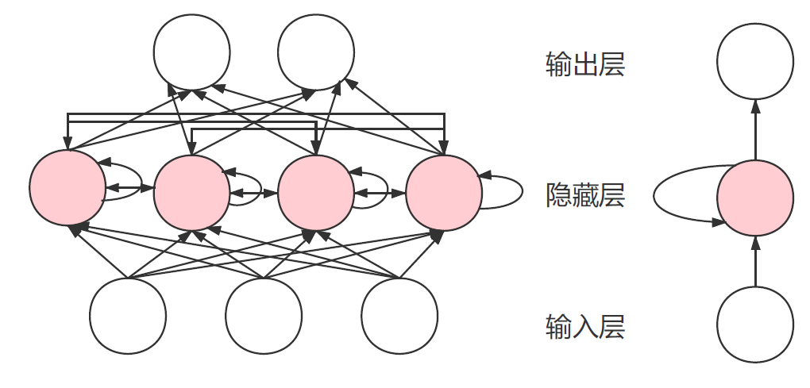
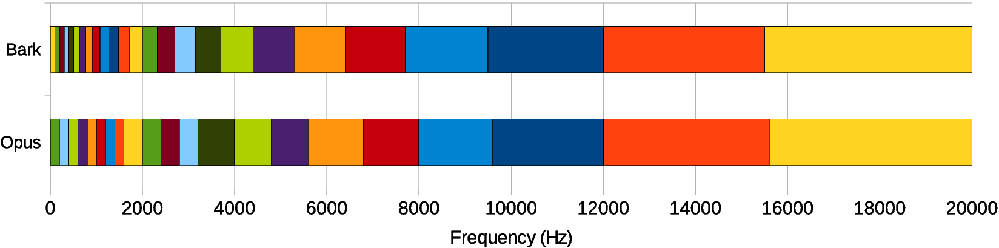
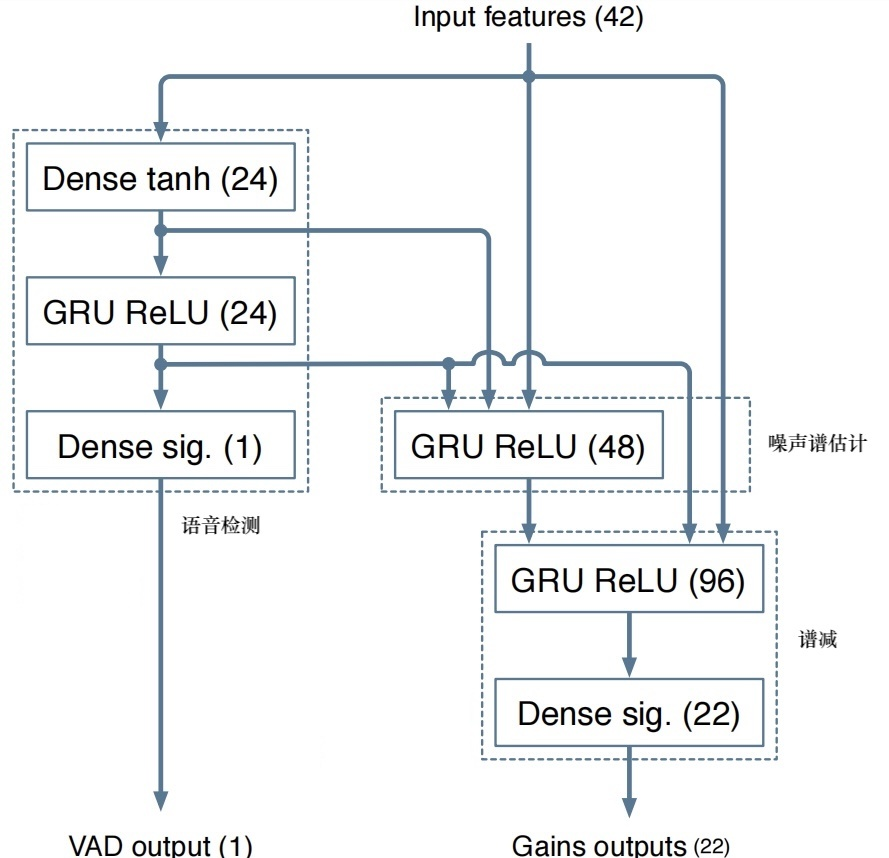
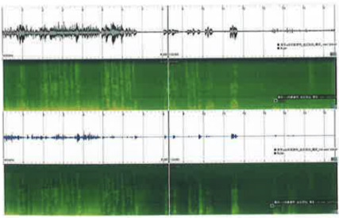
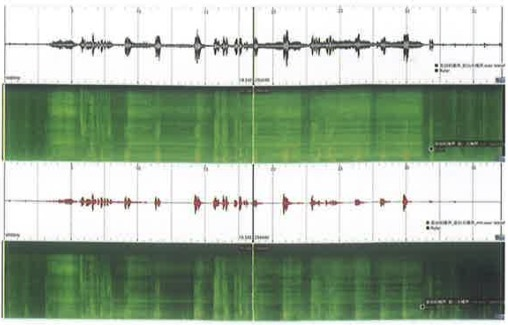
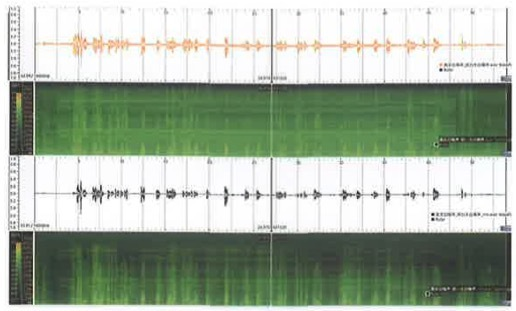

<!--BEGIN_DATA
{
    "create_date": "2022-03-28 14:50", 
    "modify_date": "2022-03-28 14:50", 
    "is_top": "0", 
    "summary": "AI降噪", 
    "tags": "音视频", 
    "file_name": "AI降噪.md"
}
END_DATA-->

#### <p>原文出处：<a href='https://km.woa.com/articles/show/547276?kmref=base_recommend' target='blank'>AI降噪</a></p>

传统算法通过统计的方法对噪声进行估计，并可以对稳态噪声起到比较好的降噪作用，但是在非稳态噪声和瞬态噪声等噪声类型下，传统降噪算法往往不能起到比较好的效果。

最近几年，随着 AI 技术的不断演进，在降噪等音频处理领域，都出现了很多基于 Artificail Intelligence（AI）或者说基于人工神经网络模型的降噪算法。这些 AI 算法在降噪能力上较传统算法都有很大的提升。但 AI 降噪算法和很多其它 AI 算法一样，在部署的时候也会受到诸如设备算力、存储体积等条件的限制。  

## 基础AI知识介绍

AI 模型也就是我们经常听到的深度学习模型、机器学习模型或人工神经网络模型。其实 AI 模型的定义更为广泛，后面的这几种说法都是从不同角度描述了目前常用AI 模型的特点。AI 模型的构建普遍采用大量数据训练的方式，来让模型学习到数据内隐含的信息，这就是所谓的机器学习。在降噪这个领域，模型的输入是带噪的语音信号，模型的输出是纯净的语音信号，我们通过大量的这样成对的带噪和纯净的语音数据，来训练 AI 模型，使其具有降噪的能力。下面我们来看看常见的 AI 降噪模型的结构。

常见模型结构：AI 模型常采用人工神经网络来模拟人脑神经的记忆和处理信号的能力。常见的人工神经网络类型有深度神经网络（Deep Neural Network，DNN）、卷积神经网络（Convolutional Neural Network，CNN）、循环神经网络（Recurrent Neural Network，RNN）等。

这里主要介绍一种将传统信号处理与深度学习结合的语音增强算法，基于Jean-Marc Valin 等发表的A Hybrid DSP/Deep Learning Approach to Real-Time Full-Band Speech Enhancement一文。

## 信号模型

提出了一种用于噪声抑制的快速算法，在降噪时需要精细调整的部分使用深度学习方法，而其他部分使用传统的DSP方法。使用的窗长为20ms，窗之间的overlap为10ms，语音帧的分析（analysis）与合成（synthesis）用到的窗函数为Vorbis Window。噪声抑制的主要部分是将RNN计算出的增益作用于分辨率较低的噪声频谱包络。后面还用pitch filter进行进一步地优化，循环神经网络（Recurrent Neural Network，RNN）在这里非常重要，因为它们使建模时间序列成为可能，而不仅仅是独立考虑输入和输出帧。这对于抑制噪声尤为重要，因为我们需要时间来很好地估计噪声。长期以来，RNN的能力受到严重限制，因为它们无法长时间保存信息，并且由于在时间上反向传播时涉及的梯度下降过程效率非常低（梯度消失问题）。门控单元的发明解决了这两个问题，它有许多变体, 例如长短期记忆（LSTM），门控循环单元（GRU）等。



图 1-1 RNN网络结构示意图

可以看到 RNN 网络中隐藏层的每个神经元（粉色圆圈），除了和输入层的信号相关，还和隐藏层本身的状态相关。这种自回归的结构是 RNN 的特点。  

一般情况用神经网络直接估计frequency bins需要的网络复杂度较高，从而计算量较大。为了避免此问题，可以假定频谱包络足够平坦，进而可以使用比较粗糙的分辨率。此外，并没有直接计算频谱幅度，而是对理想临界带增益（ideal critical band gains）进行估计。频带划分选择和Opus codec使用的Bark scale相同（实际上为了方便，直接使用了Opus的pitch计算代码），在低频区，每个频带最少有4个bins，并且使用的是三角频 带（滤波）而非矩形频带，每个三角的峰值和其相邻三角的边界点重合。最终band的数量为22，也即网络输出为22个[ 0 , 1 ] [0,1][0,1]的值。

该模型的输入特征没有直接选择 STFT 变换之后的复数频点，而是处理之后共 42 维特征以减小网络规模和计算量，特征中有 维和基频有关，另外36维由 22个 Bark 频带（实际是修正过的频带 如图1-2 所示的opus编码器频带）倒谱系数和其前 6个倒谱系数的一阶和二阶导数组成，官方公  

5的结果显示在汽车、街道等场景比 speex 降噪效果好。rnoise 网络的组成如图 1-1 所示，该网络逻辑划分上主要包括 VAD 检测、噪声谱估计以及谱减三个模块，这和传统的实现思路也是一致的。传统 VAD 使用混合高斯模型建模，模型参数从样本数据中获取，而这里的 VAD 使用神经网络实现，神经网络的参数也是从样本数据中获取，由于建模中使用了一些先验常识，因而需要的样本数据通常较少。该模型的计算量少、实时性好。因而WebRTC的第二代AGC 算法就集成了该模块。由 GRU 门控单元可知，当前时刻的判决结果与当前时刻的输入和上一时刻的状态有关，由级联特性可知当前判决结果与历史输入有关，这是符合物理模型的，语音段和非语音段在时间上是相关的。



图1-2 输入特征普

1. 神经网络的数据如下图所示，主要包括三个循环层，作用分别为VAD、噪声谱估计、噪声消除，实验表明，实验表明使用GRU网络的效果优于LSTM网络。



图1-2 网络结构  

## 基音(pitch)分析

### 结果

如图1-3 所示，该序列是采集风扇直吹，由远到近的噪声，从图可以看出它的效果不是很理想。



图 1-3 风扇由远到近噪声

如图 1-4 左所示，该序列是采集了发动机噪声，效果明显，对比webrtc是有明显优势的，如图 1-3 右是采集的白噪声序列，效果也是很好的。



图 1-4 左为发动机噪声，右为白噪声

### 分析

风扇由远到近的降噪效果不好是因为训练集中并没有这种场景的噪声，旦模型的泛化能力不够，如果针对噪声种类有限的场景，如以风噪、胎噪、发送机噪声为主的车载场景，可用该方法替代基手模型的传统降噪方法；在增加模型的泛化能力方面，可以通过增加训练样本种类以及选择不同的网络结构，如 Deep Attention、Attention、 Deep Cluster和 DCUNet, DCUNet 网络模型同时使用幅度和相位信息以增加网络的感知能力，其取得的效果比rnoise 网络更好，并且一些 DCUNet 改进型已经具备了商用价值。另外，这两种网络可以方便地移植到基于 深度学习的 AEC 应用上，思路上可将远端信号按照近端信号提取同样的特征，输入到网络中，将远端信号当成噪声一样从近端信号中消除，网络最终输出的同样可以是各个频点的抑制增益。

## 总结  

和传统降噪类似，基于频域掩码的 AI 降噪模型是目前最为常用的 AI 降噪设计。纯净语音频谱的获得，需要对幅度谱和相位谱都进行修正。但如果是在移动端部署AI 降噪模型，受算力影响，基于幅度谱的 AI 降噪模型可能是最好的选择。在实时音频信号系统中，降噪模型需要考虑到模型的因果性。在移动端部署时，由于算力和存储空间受到限制，我们需要通过对模型的输入进行降维、模型参数进行量化等操作来进行设备适配。当然我们也可以通过一些现成的工具来快速实现 AI 降噪模型的部署。在实践中，如果你要自己训练一个 AI 降噪模型，那么数据库（语音、噪声）是不可少的。正好在最近的[DNS challenge](https://github.com/microsoft/DNS-Challenge)的降噪比赛里，主办方为我们整理了不少语音、噪声等数据库，有兴趣可自行了解一下。  

## 源代码分析

```cpp
#define FRAME_SIZE_SHIFT 2
#define FRAME_SIZE (120<<FRAME_SIZE_SHIFT)      // FRAME_SIZE = 480
#define WINDOW_SIZE (2*FRAME_SIZE)              // WINDOW_SIZE = 960
#define FREQ_SIZE (FRAME_SIZE + 1)              // FREQ_SIZ = 481
#define PITCH_MIN_PERIOD 60
#define PITCH_MAX_PERIOD 768
#define PITCH_FRAME_SIZE 960
#define PITCH_BUF_SIZE (PITCH_MAX_PERIOD+PITCH_FRAME_SIZE)   // PITCH_BUF_SIZE = 1728
#define SQUARE(x) ((x)*(x))
#define NB_BANDS 22
#define CEPS_MEM 8
#define NB_DELTA_CEPS 6
#define NB_FEATURES (NB_BANDS+3*NB_DELTA_CEPS+2)       //NB_FEATURES = 42
#ifndef TRAINING
#define TRAINING 0
#endif

// 22个点，opus band相关，和频率有一定对应关系，用来进行三角滤波
static const opus_int16 eband5ms[] = {
/*0  200 400 600 800  1k 1.2 1.4 1.6  2k 2.4 2.8 3.2  4k 4.8 5.6 6.8  8k 9.6 12k 15.6 20k*/
        0,  1,  2,  3,  4,  5,  6,  7,  8, 10, 12, 14, 16, 20, 24, 28, 34, 40, 48, 60, 78, 100
};

typedef struct {
    int init;
    kiss_fft_state *kfft;
    float half_window[FRAME_SIZE];
    float dct_table[NB_BANDS*NB_BANDS];
} CommonState;

struct DenoiseState {
    float analysis_mem[FRAME_SIZE];
    float cepstral_mem[CEPS_MEM][NB_BANDS];     //[8][22]
    int memid;
    float synthesis_mem[FRAME_SIZE];
    float pitch_buf[PITCH_BUF_SIZE];        //[1728]
    float pitch_enh_buf[PITCH_BUF_SIZE];    //[1728]
    float last_gain;
    int last_period;
    float mem_hp_x[2];
    float lastg[NB_BANDS];
    RNNState rnn;
};

/* 
 * 计算每个band的能量
 * kiss_fft_cpx就是一个复数的结构体，包含r和i，数据类型是float，这里的参数实际上就是一个复数数组
 * bandE是储存每个band的能量的，有22个值
 */
void compute_band_energy(float *bandE, const kiss_fft_cpx *X) {
    int i;
    float sum[NB_BANDS] = {0};
    for (i=0;i<NB_BANDS-1;i++)        //对22个band进行操作
    {
        int j;
        int band_size;
        //band的点数为eband5ms每两个值之间的差乘以4
        band_size = (eband5ms[i+1]-eband5ms[i])<<FRAME_SIZE_SHIFT;    
        for (j=0;j<band_size;j++) {                                   // 每个band内部的计算
            float tmp;
            // frac实际上就是论文中的wb，将frac作用于X实际上就是将opusband作用于频谱
            float frac = (float)j/band_size;     
            tmp = SQUARE(X[(eband5ms[i]<<FRAME_SIZE_SHIFT) + j].r);   
            tmp += SQUARE(X[(eband5ms[i]<<FRAME_SIZE_SHIFT) + j].i);
            // 每两个三角窗都有一半区域是重叠的，因而对于某一段频点，其既被算入该频带，也被算入下一频带
            sum[i] += (1-frac)*tmp;
            sum[i+1] += frac*tmp;        
        }
    }
    sum[0] *= 2;             // 第一个band和最后一个band的窗只有一半因而能量乘以2
    sum[NB_BANDS-1] *= 2;
    for (i=0;i<NB_BANDS;i++)
    {
        bandE[i] = sum[i];
    }
}

/*
 * 计算band之间的相关度
 */
void compute_band_corr(float *bandE, const kiss_fft_cpx *X, const kiss_fft_cpx *P) {
    int i;
    float sum[NB_BANDS] = {0};
    for (i=0;i<NB_BANDS-1;i++)
    {
        int j;
        int band_size;
        band_size = (eband5ms[i+1]-eband5ms[i])<<FRAME_SIZE_SHIFT;
        for (j=0;j<band_size;j++) {
            float tmp;
            float frac = (float)j/band_size;        // 求解wb
            tmp = X[(eband5ms[i]<<FRAME_SIZE_SHIFT) + j].r * P[(eband5ms[i]<<FRAME_SIZE_SHIFT) + j].r;
            tmp += X[(eband5ms[i]<<FRAME_SIZE_SHIFT) + j].i * P[(eband5ms[i]<<FRAME_SIZE_SHIFT) + j].i;
            sum[i] += (1-frac)*tmp;
            sum[i+1] += frac*tmp;
        }
    }
    sum[0] *= 2;
    sum[NB_BANDS-1] *= 2;
    for (i=0;i<NB_BANDS;i++)
    {
        bandE[i] = sum[i];
    }
}

/*
 * 插值，即22点数据插值得到481点数据
 */
void interp_band_gain(float *g, const float *bandE) {
    // 省略
}

CommonState common;
static void check_init() { // 检查初始化状态，即要对fft运算分配内存空间，然后生成需要使用的dct table
    // 省略
}

// 对输入数据 in 做离散余弦变换
static void dct(float *out, const float *in) {       
    //省略
}

//对输入数据进行快速傅里叶变换，并将结果储存在out中，注意out的长度为481
static void forward_transform(kiss_fft_cpx *out, const float *in) {    // out = fft(in)
    int i;
    kiss_fft_cpx x[WINDOW_SIZE];
    kiss_fft_cpx y[WINDOW_SIZE];
    check_init();          // 生成fft的存储数据
    for (i=0;i<WINDOW_SIZE;i++) {        //将输入数据赋值给x
        x[i].r = in[i];
        x[i].i = 0;
    }
    opus_fft(common.kfft, x, y, 0);   // 对输入数据x进行fft，计算结果给y
    for (i=0;i<FREQ_SIZE;i++) {
        out[i] = y[i];                    // 储存计算结果
    }
}

// 对输入信号in做ifft
static void inverse_transform(float *out, const kiss_fft_cpx *in) {
   //省略
}

static void apply_window(float *x) {    //给输入数据x进行加窗
    //省略
}

// 获取denoise的大小（字节数）
int rnnoise_get_size() {     
    return sizeof(DenoiseState);
}

//获取帧长 480
int rnnoise_get_frame_size() {    
    return FRAME_SIZE;
}

// 对DenoiseState整个结构体进行初始化
int rnnoise_init(DenoiseState *st, RNNModel *model) {  
    //省略
}

// 创建一个Denoise实例并对其进行初始化
DenoiseState *rnnoise_create(RNNModel *model) { 
    //省略
}

//销毁数据
void rnnoise_destroy(DenoiseState *st) {    
    //省略
}

// 帧分析 ：in是长度为480的输入数据，对x做傅里叶变换得到X并求出X的频带能量Ex
static void frame_analysis(DenoiseState *st, kiss_fft_cpx *X, float *Ex, const float *in) {
    int i;
    float x[WINDOW_SIZE];
    // 从 analysis_mem拷贝FRAME_SIZE个数据赋给x的前半段，analysis_mem是上一次的输入
    RNN_COPY(x, st->analysis_mem, FRAME_SIZE);
    for (i=0;i<FRAME_SIZE;i++) x[FRAME_SIZE + i] = in[i];   // 将输入数据赋给x的后半段
    RNN_COPY(st->analysis_mem, in, FRAME_SIZE);    // 然后再将in拷贝给 analysis_mem
    apply_window(x);               // 对x进行加窗
    forward_transform(X, x);      // 对x进行fft并储存在X中
    compute_band_energy(Ex, X);      // 计算频带能量
}

/*
 * 计算42维特征
 */
static int compute_frame_features(DenoiseState *st, kiss_fft_cpx *X, kiss_fft_cpx *P,
                                  float *Ex, float *Ep, float *Exp, float *features, const float *in) {
    int i;
    float E = 0;
    float *ceps_0, *ceps_1, *ceps_2;
    float spec_variability = 0;
    float Ly[NB_BANDS];
    float p[WINDOW_SIZE];
    float pitch_buf[PITCH_BUF_SIZE>>1];
    int pitch_index;      // 这里设置的是整型，但下面的参数是其地址，则可改变原来的值
    float gain;
    float *(pre[1]);
    float tmp[NB_BANDS];
    float follow, logMax;
    frame_analysis(st, X, Ex, in);    // X是做完fft的数据， Ex储存频带能量

    // 也是从源src拷贝给dst n个字节数，不同的是，若src和dst内存有重叠，也能顺利拷贝
    // pitch_buffer长度是1728，这里的意思是将其后面(1728 - 480)个数据放到最前面
    RNN_MOVE(st->pitch_buf, &st->pitch_buf[FRAME_SIZE], PITCH_BUF_SIZE-FRAME_SIZE);
    // 对其后面的480个数据进行更新
    RNN_COPY(&st->pitch_buf[PITCH_BUF_SIZE-FRAME_SIZE], in, FRAME_SIZE);

    pre[0] = &st->pitch_buf[0];

    /*
     * 降采样，对pitch_buf平滑降采样，求自相关，利用自相关求lpc系数，然后进行lpc滤波，即得到lpc残差
     */
    pitch_downsample(pre, pitch_buf, PITCH_BUF_SIZE, 1);
    // 寻找基音周期   存入pitch_index   
    pitch_search(pitch_buf+(PITCH_MAX_PERIOD>>1), pitch_buf, PITCH_FRAME_SIZE,
                 PITCH_MAX_PERIOD-3*PITCH_MIN_PERIOD, &pitch_index);
    pitch_index = PITCH_MAX_PERIOD-pitch_index;
    // 去除高阶谐波影响
    gain = remove_doubling(pitch_buf, PITCH_MAX_PERIOD, PITCH_MIN_PERIOD,
                           PITCH_FRAME_SIZE, &pitch_index, st->last_period, st->last_gain);    

    st->last_period = pitch_index;
    st->last_gain = gain;

    // 根据index得到p[i]
    for (i=0;i<WINDOW_SIZE;i++)
        p[i] = st->pitch_buf[PITCH_BUF_SIZE-WINDOW_SIZE-pitch_index+i];

    apply_window(p);                          // pitch数据应用window
    forward_transform(P, p);                  // 对pitch数据进行傅里叶变换
    compute_band_energy(Ep, P);               // 计算pitch部分band能量
    compute_band_corr(Exp, X, P);             // 计算信号频域与pitch频域的相关band能量系数

    for (i=0;i<NB_BANDS;i++) Exp[i] = Exp[i]/sqrt(.001+Ex[i]*Ep[i]);     // Exp进行标准化

    dct(tmp, Exp);                          // 然后再做一次dct，实际上就是信号与pitch相关BFCC了

    for (i=0;i<NB_DELTA_CEPS;i++) features[NB_BANDS+2*NB_DELTA_CEPS+i] = tmp[i];

    features[NB_BANDS+2*NB_DELTA_CEPS] -= 1.3;
    features[NB_BANDS+2*NB_DELTA_CEPS+1] -= 0.9;
    features[NB_BANDS+3*NB_DELTA_CEPS] = .01*(pitch_index-300);

    //而feature的1-NB_BANDS（22）是由log10(Ex)再做一次DCT后填充的，代码如下
    logMax = -2;
    follow = -2;

    for (i=0;i<NB_BANDS;i++) {
        Ly[i] = log10(1e-2+Ex[i]);
        Ly[i] = MAX16(logMax-7, MAX16(follow-1.5, Ly[i]));
        logMax = MAX16(logMax, Ly[i]);
        follow = MAX16(follow-1.5, Ly[i]);
        E += Ex[i];
    }

    if (!TRAINING && E < 0.04) {
        /* If there's no audio, avoid messing up the state. */
        RNN_CLEAR(features, NB_FEATURES);
        return 1;
    }

    for (int j=0;j<22;j++) {  //求y的平方和
        //printf("%f----%d\n", Ly[j],j+1);
    }

    dct(features, Ly);

    //----
    /*
     * cepstral_mem是一个8*22的数组，每一次feature里的值填充到ceps_0,然后这个数组会往下再做一次。
     * ceps_0是float指针，它指向的是ceptral_mem第一个NB_BANDS数组，然后每次与相邻的band数组相见，做出一个delta差值。
     */
    features[0] -= 12;
    features[1] -= 4;
    ceps_0 = st->cepstral_mem[st->memid];
    ceps_1 = (st->memid < 1) ? st->cepstral_mem[CEPS_MEM+st->memid-1] : st->cepstral_mem[st->memid-1];
    ceps_2 = (st->memid < 2) ? st->cepstral_mem[CEPS_MEM+st->memid-2] : st->cepstral_mem[st->memid-2];

    for (i=0;i<NB_BANDS;i++) ceps_0[i] = features[i];

    st->memid++;

    for (i=0;i<NB_DELTA_CEPS;i++) {    //
        features[i] = ceps_0[i] + ceps_1[i] + ceps_2[i];
        features[NB_BANDS+i] = ceps_0[i] - ceps_2[i];
        features[NB_BANDS+NB_DELTA_CEPS+i] =  ceps_0[i] - 2*ceps_1[i] + ceps_2[i];
    }

    /* Spectral variability features. */
    if (st->memid == CEPS_MEM) st->memid = 0;

    //----
    // 最后一个特性值
    for (i=0;i<CEPS_MEM;i++)
    {
        int j;
        float mindist = 1e15f;
        for (j=0;j<CEPS_MEM;j++)
        {
            int k;
            float dist=0;
            for (k=0;k<NB_BANDS;k++)
            {
                float tmp;
                tmp = st->cepstral_mem[i][k] - st->cepstral_mem[j][k];
                dist += tmp*tmp;
            }
            if (j!=i)
                mindist = MIN32(mindist, dist);
        }
        spec_variability += mindist;
    }

    //应该是最后一个特征谱稳度
    features[NB_BANDS+3*NB_DELTA_CEPS+1] = spec_variability/CEPS_MEM-2.1;     
                // 返回值为判断是否有语音

    for(int u = 0; u < 42; u++){
        //printf("%f ", P[u].r);
    }

    return TRAINING && E < 0.1;
}

// 将处理好的频域数据处理得到时域数据
static void frame_synthesis(DenoiseState *st, float *out,  kiss_fft_cpx *y) {
    float x[WINDOW_SIZE];
    int i;

    inverse_transform(x, y);
    apply_window(x);
    for (i=0;i<FRAME_SIZE;i++) out[i] = x[i] + st->synthesis_mem[i];
    RNN_COPY(st->synthesis_mem, &x[FRAME_SIZE], FRAME_SIZE);
}

/*
 * biquad滤波，双二阶滤波器
 * y为输出信号
 * x为输入信号
 * a b 为滤波器系数
 * mem为调节参数，从训练模型中获取
 * N为信号长度
 */
static void biquad(float *y, float mem[2], const float *x, const float *b, const float *a, int N) {
	//略过
}

/*
 * 论文中的pitch filter部分，下面的r[i]实际上就是论文中的alpha
 */
void pitch_filter(kiss_fft_cpx *X, const kiss_fft_cpx *P, const float *Ex, const float *Ep,
                  const float *Exp, const float *g) {
  // 略过
}

//对每一帧及进行处理
float rnnoise_process_frame(DenoiseState *st, float *out, const float *in) {
    for (int j = 0; j < 2; j++) {
        //printf("%f---%d\n", st->mem_hp_x[j],j+1);
    }

    int i;
    kiss_fft_cpx X[FREQ_SIZE];
    kiss_fft_cpx P[WINDOW_SIZE];
    float x[FRAME_SIZE];
    float Ex[NB_BANDS], Ep[NB_BANDS];
    float Exp[NB_BANDS];
    float features[NB_FEATURES]；
    float g[NB_BANDS];
    float gf[FREQ_SIZE]={1};
    float vad_prob = 0;
    int silence;

    static const float a_hp[2] = {-1.99599, 0.99600};
    static const float b_hp[2] = {-2, 1};

    //先进行双二阶滤波
    biquad(x, st->mem_hp_x, in, b_hp, a_hp, FRAME_SIZE);
    // 求出特征值并计算返回vad（利用能量阈值判断）
    silence = compute_frame_features(st, X, P, Ex, Ep, Exp, features, x);

	//若为非静默，则进行处理
    if (!silence) {
        //用rnn网络得到增益
        compute_rnn(&st->rnn, g, &vad_prob, features);
        //pitch滤波
        pitch_filter(X, P, Ex, Ep, Exp, g);
        for (i=0;i<NB_BANDS;i++) {
            float alpha = .6f;
            g[i] = MAX16(g[i], alpha*st->lastg[i]);
            st->lastg[i] = g[i];
        }
        //对增益进行插值
        interp_band_gain(gf, g);
#if 1
        //频谱乘以增益
        for (i=0;i<FREQ_SIZE;i++) {
            X[i].r *= gf[i];
            X[i].i *= gf[i];
        }
#endif
    }

	//合成时域数据
    frame_synthesis(st, out, X);
    
    return vad_prob;
}
```

