 
<!--BEGIN_DATA
{
    "create_date": "2017-03-20 14:38", 
    "modify_date": "2017-03-20 14:38", 
    "is_top": "0", 
    "summary": "APP「登录注册模块」详解", 
    "tags": "iOS", 
    "file_name": "APP「登录注册模块」详解.md"
}
END_DATA-->

####
原文出处：<a href='http://www.jianshu.com/p/359e5dccbdd4' target='blank'>APP「登录注册模块」详解</a>

登录注册对于大部分app来说，都是最基础的模块。

看似简单，却与相当多的产品功能用户使用场景交织在一起，受到产品类型、用户定位、业务逻辑、使用场景、用户操作等不同因素影响。

设计一个好的登录注册系统并不是很轻松。

登录注册的方式都有哪些？登录注册的流程都是怎样的？登录过程中的异常状态怎么处理？怎样设计一个完整的登录注册流程等等，其间还要考虑大量的细节问题。

在此篇中对登录注册中涉及到的相关的内容做一个系统性的梳理。

####**一、注册方式**

**1、邮箱注册**

邮箱注册是pc端最常见的注册方式之一，沿用到移动端产品，大部分产品仍然提供“邮箱+密码”的登录方式。

邮箱覆盖面不如手机号，同时邮箱验证较手机验证较繁琐，大部分移动端产品不再提供邮箱注册的方式。而小部分产品同时提供邮箱+手机号注册两种方式。

国外的大部分产品中，仍然保留邮箱注册方式，同时也提供手机号注册方式，例如：Facebook、Instagram、Twitter等明星产品，可见邮箱在欧美用户群当中的使用率仍然很高。  

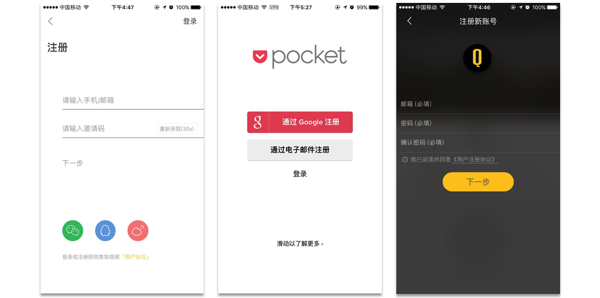  

注：梨视频 & pocket & 好奇心日报

**2、手机号注册**

PC时代，邮箱、用户名注册一直是产品的主要注册方式，而大部分人都没有邮箱也很少接触电脑，使用互联网服务的门槛较高。

随着移动互联网的兴起以及智能手机的普及，手机号注册逐渐成为移动端产品注册的主流方式，也极大的降低了互联网产品的使用门槛。

使用手机号注册有以下优点：

_手机号保有量大；用户ID唯一；移动验证更加方便；安全性高；便于运营；易导入社交链_

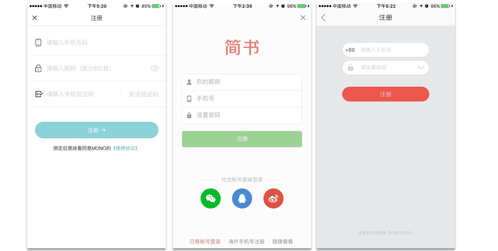  

注：MONO & 简书 & in

**3、用户名/xx号注册**

用户名注册也是以前PC端常见的几种常见注册方式之一，简单便捷，可以省去邮箱验证、手机号验证的步骤，但是通常会有密保问题更加繁琐的安全机制。

用户名注册通常存在一个问题，当用户注册完成使用完服务之后，很久没再使用网站/产品服务，再次登录时很容易忘记注册时的用户名，也就没办法继续使用产品，给用户和产品都造成损失，所以大部分产品会使用绑定邮箱/手机号的方式作为补救措施。

而在移动端，很少有产品会使用纯用户名注册的方式，通常是手机注册完成之后绑定一个用户名可用作登录ID。

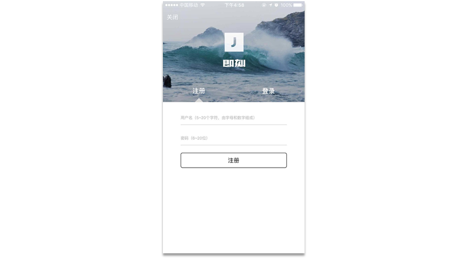  

注：即刻 - 注册，即刻只提供条用户注册以及第三方注册

**4、第三方注册**

第三方注册常见的是利用微信、QQ、微博等第三发平台进行授权登录。

第三方注册的**优点**是：操作简便，只需两步就可以继续使用产品；注册方便，省去填写大量数据的麻烦。

第三方注册的**缺点**是：容易造成一人多号的问题；只能获取到有限的用户信息，无法提供更加精准的运营活动。

所以很多app在用户首次利用第三方平台登录后，继续让用户绑定手机号或完善用户信息，以获取更加有效、真实的用户数据，也就是伪第三方注册。

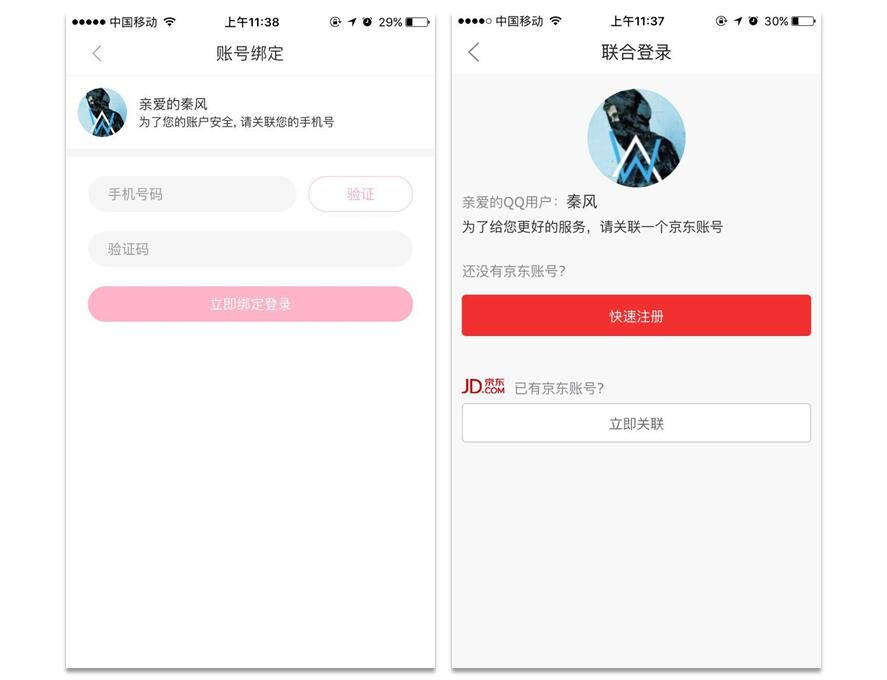  

注：京东 & 聚美优品

这种做法很伤害用户体验，会给用户造成极大的困扰。更加**合理**的做法是，在用户首次进行第三方登陆后，提醒用户绑定有效的身份信息，同时可以略过此步骤，在后续
产品使用过程中去引导用户去完善信息。

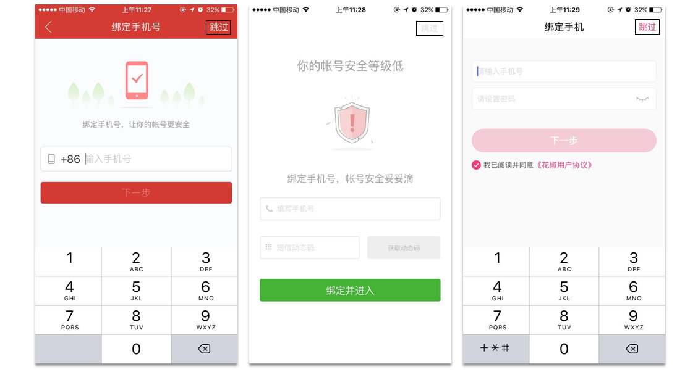  

注：网易云音乐 & 沪江开心词典 & 花椒直播

#####**二、登录的方式**

**1、账号（手机号/邮箱/用户名）密码登录**

一般的登录方式为账号密码登录，其中账号一般为前面注册方式中提到的：邮箱、手机号以及用户名。

大部分“邮箱+密码”登录方式都是沿用PC时代用户的账号体系，由pc端覆盖到移动端，并且在移动端只提供手机号注册方式。

“手机号+密码”是移动端最常用登录方式，用手机号做登录ID遗失的概率很小，有天然的优势。而且通过验证码能够快速的找回密码，方便处理异常情况，还可以扩展“手机
号+验证码”动态验证的登录方式。

“用户名+密码”登录方式大多是沿用PC端的账号体系以及登录习惯，大部分移动端产品不再设置用户名为登录ID。

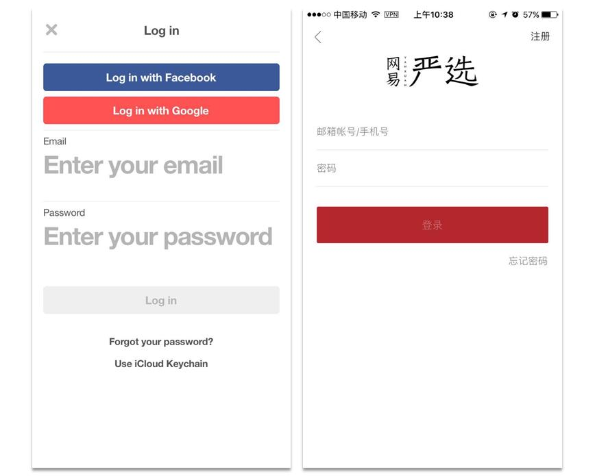  

注：Pinterest & 网易严选

**2、手机验证码快捷登录**

随着移动互联网的发展，O2O行业的火热，逐渐又发展出一种更加便捷的登录注册方式“手机号+验证码”方式。

如果用户首次登录，则默认进行注册；

非首次登录，则直接登录。

“手机号+验证码”登录方式解放了用户记住密码的负担，只要通过手机号就能够登录产品使用服务，这对于平时需要记住大量密码的用户来说极大地降低了使用产品服务的门槛。

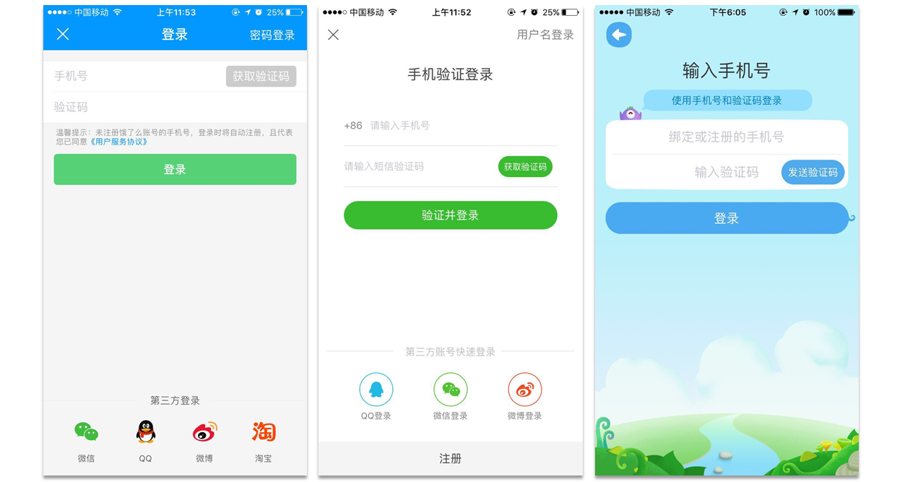  

注：饿了么 & 赶集网 & 一起做作业

**3、第三方登录**

利用第三方登录能够免去注册的麻烦，让用户快速通过登录门槛，进而使用产品提供的主要服务，降低因为登录注册带来的用户损耗，同时使用第三方账号登录有利于产品初期的宣传推广。

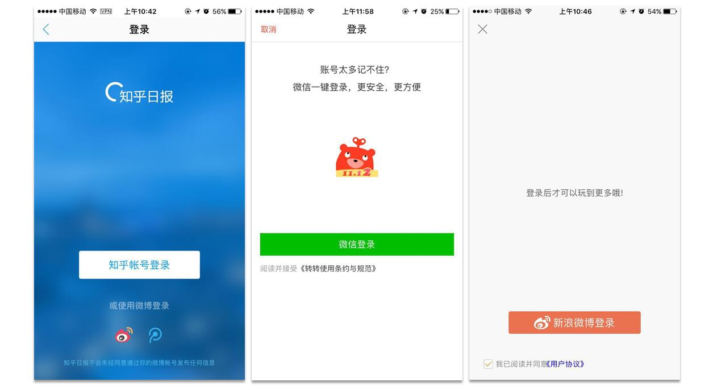  

注：知乎日报 & 转转 & 最美应用，都只能采用第三方平台账号登录

#######**三、关于登录流程**  

登录流程，即不同类型的产品甚至是同一产品所需的权限不同，导致不同的产品需要用户进行登录操作的节点不同，有些产品可能需要用户先进行登录然后才能使用产品使用的服务，而有些产品可以在未登录状态下使用部分功能，登录后使用全部的产品功能服务。

_可以先浏览再登录：京东、淘宝、美团、饿了么、美团外卖、携程、飞猪......_

_可以先使用部分功能，登录后使用更多的服务功能：知乎、简书......_

_必须先登录才能再使用服务：微信、一直播、小咖秀、探探、花椒、Facebook、Instagram、in、same、百度网盘、QQ邮箱、微云......_

**1、需要登录后才能继续使用产品功能服务**

例如：微信、一直播、花椒等社交类、百度网盘、微云等涉及个人信息的工具类产品等等。

**首先，**类似微信类熟人社交产品核心功能一般是围绕用户身份、用户关系进行，没有登录之前没有用户身份信息，也就无法向用户提供相关的产品服务，

**其次，**类似邮箱、网盘等个人信息工具类产品，涉及到的多为用户个人隐私信息以及围绕个人隐私信息展开的功能服务，在未获取到用户个人身份信息的情况下，无法为用户提供相关的功能服务

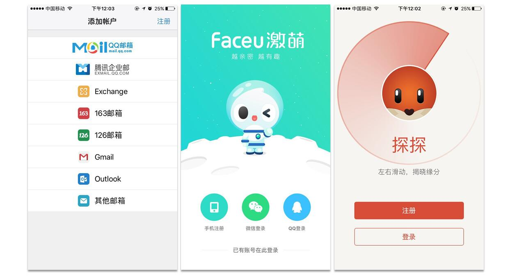  

注：QQ邮箱 & faceu & 探探

**2、不需要首先登录可以使用产品或者产品的部分功能**

例如：大部分电商类以及O2O类产品、知乎简书等社区型产品等等。

**首先，**电商类产品来说，最重要的就是最后的下单率，不管是京东淘宝的实体商品还是美团、糯米提供的虚拟团购服务或者是饿了么、美团外卖提供的外卖服务，最重要的就是最后的下单成功率，在这之前的尽量不要打断用户的使用流程，只是在最后的下单结算环节需要用户信息时才需要登录，确保用户流程的流畅性。

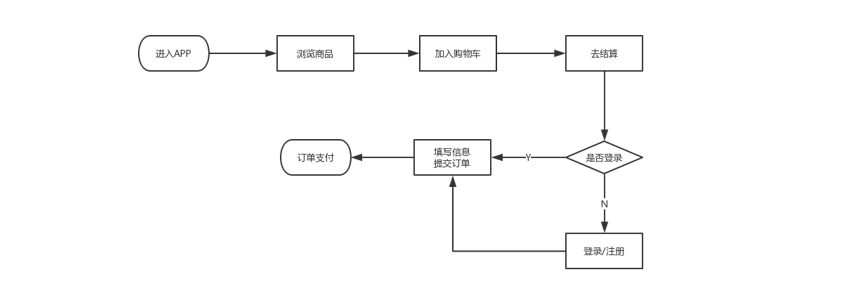  

注：电商 & O2O类产品一般下单流程

**其次，**社区类以及其他类型的产品， 不需要用户登录就可以使用部分产品功能，帮助用户对产品的功能服务有一个基础的了解，对产品有一个初步的印象，在用户需要更深一步的使用产品的时候，再去要求用户进行登录。此时，登录对用户来说不是一个门槛，而是想进一步了深入了解产品的通道。

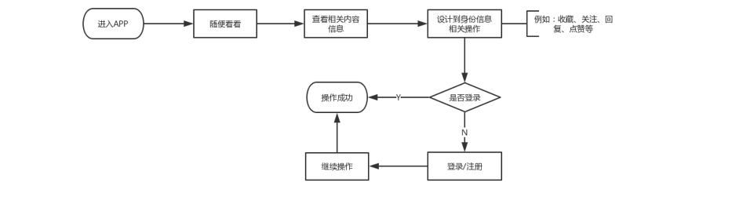  

注：类似简书 & 知乎 等内容型社区产品

#####**四、关于注册流程**

移动端注册大部分只提供手机号快捷注册，注册的流程又大概可以分为两种：同一页面内完成以及按步骤分页面完成注册。

**1、同一页面中完成注册**

较适合填写信息较少（往往不包含关于用户个人信息的设置），注册流程简洁的产品，这类产品的注册所需的信息往往只包含：手机号、验证码、密码等最简单的信息。

在同一页面中完成注册，能够能够让用户对整个注册流程有个心理预期，对填写的信息能够进行预判，整个注册过程给用户的操控感比较强。

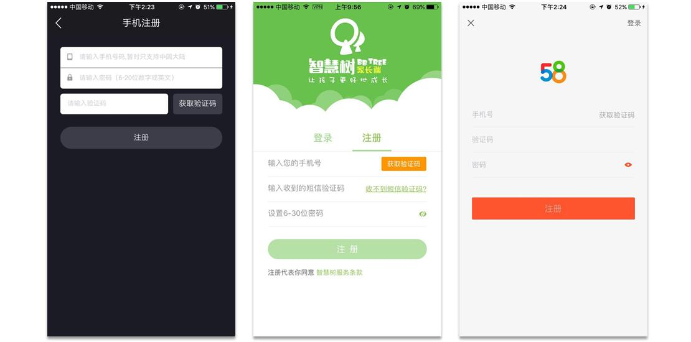  

注：小咖秀 & 智慧树 & 58同城 - 注册页面

在同一页面中完成注册，如果填写的信息过多，往往会给用户心理造成一定的填写负担，导致用户直接放弃注册。

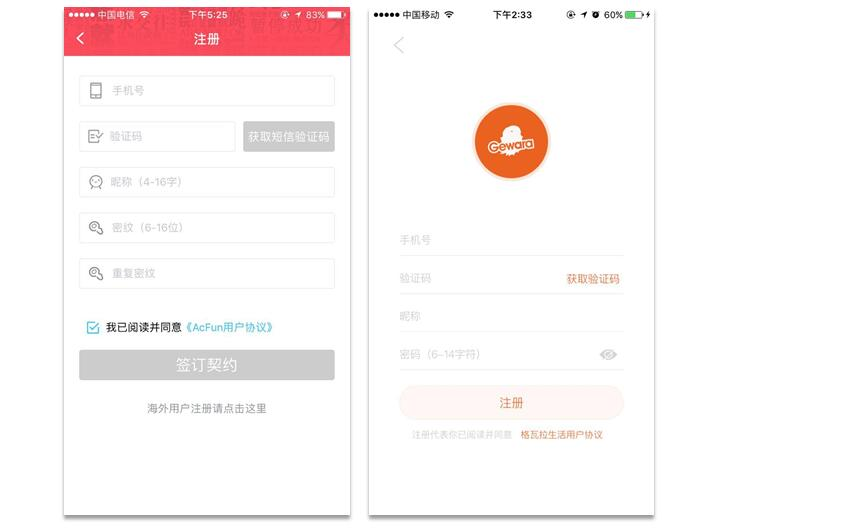  

注：AcFun & 格瓦拉生活 - 注册

**2、按步骤分页面完成注册**

按步骤分页面跳完成注册较适合填写信息较多、注册流程较复杂的产品，这类产品往往包含设置个人信息等其他需要填写的信息。

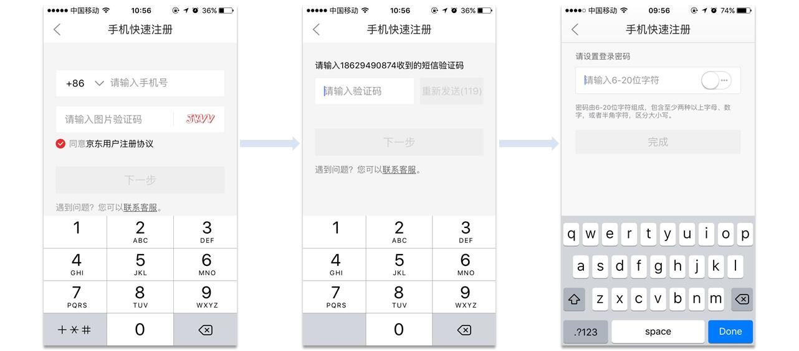  

注：京东商城-注册流程，按步骤分页面完成注册

按步骤分页面完成注册，将注册流程进行分解，引导用户一步一步完成注册，能够减少用户对于填写大量数据的抵触。随着注册流程的一步步深入，由于前面已经进行了大量操作，用户反而不会轻易放弃注册操作。

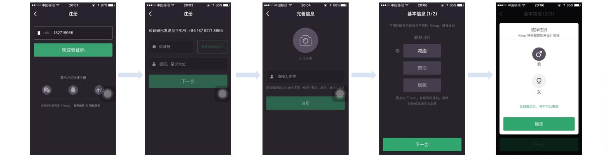  

注：keep-注册流程

#####**五、登录注册模块的相关细节**

**1、邮箱/手机号的占用判断**

注册时判断用户输入的邮箱地址或手机号是否已经注册，后续该如何引导用户登录

**2、邮箱/手机号的合法性判断**

如何判断用户注册时输入的邮箱格式或手机号码格式是否有误，及时给用户有效反馈

**3、登录密码的机制**

登录密码的机制是怎样的？密码的长度如何设定？是否区分大小写？是否包含特殊字符？密码输入为明文还是不可见。

**4、需不需要确认密码**

用户注册设置密码过程中是否需要重复确认密码？

**5、需不需要验证码**

邮箱/手机注册过程中需不需要进行验证。如何验证，是利用短信验证码还是免费热线？

验证码的字符是纯数字还是数字字母结合？

验证码的有效时长如何设定？是五分钟还是十分钟？

**6、验证码的重发机制**

如果用户未收到有效验证信息，多长时间后可以重新获取验证信息？是30s还是60s...

**7、登录注册过程中的异常状态**

用户登录过程中用户名密码错误，给用户反馈有效的信息。

用户忘记密码，如何找回密码？利用手机号验证、回答安全问题或其他方式？

**8、注册完/登录完一定要直接切回需要登录的流程节点中**

用户登录注册完成后，一定要直接切回到之前请求登录的节点中去。

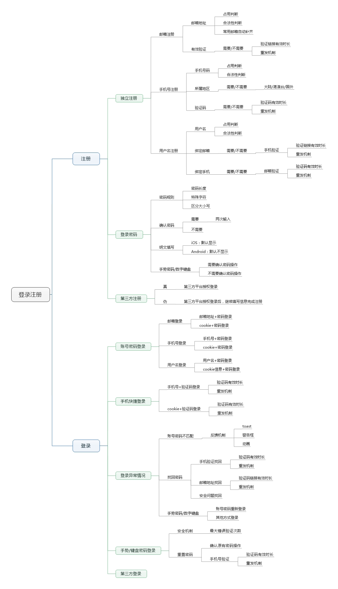  

注：登录注册功能细节

#####**六、如何考虑登录注册**

**1、产品类型**

不同的产品类型，对登录注册模块的需求不同。

比如，纯工具类产品：计算器、日历、相机、便签、安全工具等，不需要用户登录注册就可以使用产品的绝大部分甚至全部功能，此时就没有必要添加登录注册模块。

比如，电商、O2O类产品、金融类产品，设计到交易、用户信息等比较私密的信息，就必须单独添加登录注册模块，确保用户的个人信息的真实性以及安全性。

再比如，社交社区类产品，可以设置独立的登录注册模块；可以直接借助于第三方平台，这样反而更有利于产品的传播扩散；也可以两者皆有。

**2、目标用户**

确定了登录注册模块，面对的目标用户群不同，对应的登录注册的方式也有偏差。

如果你的目标用户群是相对来说商务领域的用户，可能采用邮箱注册的方式会更好，这样会自然过滤掉一部分用户。

如果你的目标用户群是大众，可能采用手机号码注册的方式会跟更加稳妥。

**3、业务逻辑**

考虑清楚是否需要登录注册功能，接下来就该考虑怎么设计登录注册模块。

不同的业务逻辑，需要的登录注册的方式、流程也不同；不同的功能模块，对登录节点的需求也不同。

**首先**，要考虑是一开始就需要登录注册，还是先可以使用产品的部分功能，等到需要登录的时候，再要求用户登录。

例如，电商类、O2O类产品，终极目标是促使用户下单，大概的流程为：用户浏览、挑选商品；加入购物车；去结算下单。在下单之前尽量不要打断用户流程，只在最后结算的时候，让用户进行登录以获取有效的配送信息。

再比如，对于部分社交类产品，围绕用户的关系链展开服务，这时候就需要一开始就要求进行登录注册。

**其次**，注册过程中需不需要填写额外的注册信息，像昵称、年龄等？其次如何设置填写信息的步骤，是放在最后填写还是一开始就填写？

例如，社交社区类产品一般都会要求用户填写昵称、性别等信息，金融类产品会要求用户进行实名认证，一般将填写个人信息等步骤放置于注册流程的最末会比较友好。

**4、功能细节**

在前面确定登录注册模块大框架的基础上，接着完善相关的细节问题。

如前面提到的验证码机制；密码的设置规则；第三方注册的真伪等等细节问题。确保整个登录注册模块逻辑的合理性以及流程的通畅性。

**5、如果我是新手**

作为新手考虑登录注册模块，完全没必要自己创造，可以借鉴市场上现有的产品或竞品的登录注册模块，那么该如何借鉴呢？

> （1）选取自己产品的直接竞品或者所属行业的相关产品，分析其登录注册模块的详细流程、逻辑，并做好记录；
>
> （2）梳理自己产品登录注册模块的相关功能逻辑、流程，作一个对比；
>
> （3）根据前面提到的，从产品类型、目标用户、业务逻辑结合自己产品的现状，以用户体验为中心去完善设计自己产品的登录注册模块。
