 
<!--BEGIN_DATA
{
    "create_date": "2019-11-20 15:38", 
    "modify_date": "2019-11-20 15:38", 
    "is_top": "0", 
    "summary": "iOS开发-APP启动main()调用之前的加载过程", 
    "tags": "iOS、C/C++", 
    "file_name": "APP启动main()调用之前的加载过程.md"
}
END_DATA-->

####
原文出处：<a href='https://www.jianshu.com/p/c603a1e69126' target='blank'>iOS开发-APP启动main()调用之前的加载过程</a>

###main()调用之前的加载过程

App开始启动后，系统首先加载可执行文件（自身App的所有.o文件的集合），然后加载动态链接库dyld。  
dyld是一个专门用来加载动态链接库的库。  
[dyld源码链接](https://github.com/opensource-apple/dyld)  
执行从dyld开始，dyld从可执行文件的依赖开始, 递归加载所有的依赖动态链接库。

动态链接库包括：  
iOS 中用到的所有系统 framework  
加载OC runtime方法的libobjc，  
系统级别的libSystem，例如libdispatch(GCD)和libsystem_blocks (Block)。

其实无论对于系统的动态链接库还是对于App本身的可执行文件而言，他们都算是image（镜像），而每个App都是以image(镜像)为单位进行加载的。

####什么是image（镜像）

1. executable可执行文件 比如.o文件。  
2. dylib 动态链接库 framework就是动态链接库和相应资源包含在一起的一个文件夹结构。  
3. bundle 资源文件 只能用dlopen加载，不推荐使用这种方式加载。

除了我们App本身的可行性文件，系统中所有的framework比如UIKit、Foundation等都是以动态链接库的方式集成进App中的。

####系统使用动态链接有几点好处：

代码共用：很多程序都动态链接了这些 lib，但它们在内存和磁盘中中只有一份。 易于维护：由于被依赖的 lib 是程序执行时才链接的，所以这些 lib很容易做更新，比如libSystem.dylib 是 libSystem.B.dylib 的替身，哪天想升级直接换成libSystem.C.dylib然后再替换替身就行了。 减少可执行文件体积：相比静态链接，动态链接在编译时不需要打进去，所以可执行文件的体积要小很多。  

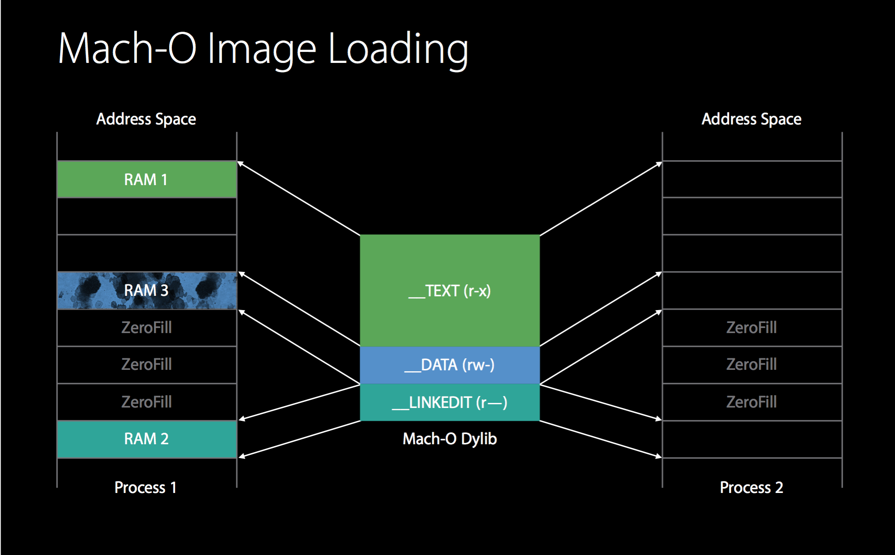

如上图所示，不同进程之间共用系统dylib的_TEXT区，但是各自维护对应的_DATA区。

所有动态链接库和我们App中的静态库.a和所有类文件编译后的.o文件最终都是由dyld(the dynamic link editor)，Apple的动态链接器来加载到内存中。每个image都是由一个叫做ImageLoader的类来负责加载（一一对应），那么ImageLoader又是什么呢？

####什么是ImageLoader

image 表示一个二进制文件(可执行文件或 so 文件)，里面是被编译过的符号、代码等，所以 ImageLoader 作用是将这些文件加载进内存，且每一个文件对应一个ImageLoader实例来负责加载。  
两步走： 在程序运行时它先将动态链接的 image 递归加载 (也就是上面测试栈中一串的递归调用的时刻)。 再从可执行文件 image 递归加载所有符号。

当然所有这些都发生在我们真正的main函数执行前。

####动态链接库加载的具体流程

#####动态链接库的加载步骤具体分为5步：

1. load dylibs image 读取库镜像文件  
2. Rebase image  
3. Bind image  
4. Objc setup  
5. initializers

#####1.load dylibs image

在每个动态库的加载过程中， dyld需要：  

1. 分析所依赖的动态库  
2. 找到动态库的mach-o文件  
3. 打开文件  
4. 验证文件  
5. 在系统核心注册文件签名  
6. 对动态库的每一个segment调用mmap()  

通常的，一个App需要加载100到400个dylibs， 但是其中的系统库被优化，可以很快的加载。

针对这一步骤的优化有：  

1. 减少非系统库的依赖  
2. 合并非系统库  
3. 使用静态资源，比如把代码加入主程序

#####2.rebase/bind

由于ASLR(address space layout randomization)的存在，可执行文件和动态链接库在虚拟内存中的加载地址每次启动都不固定，所以需要这2步来修复镜像中的资源指针，来指向正确的地址。

rebase修复的是指向当前镜像内部的资源指针；  
而bind指向的是镜像外部的资源指针。

rebase步骤先进行，需要把镜像读入内存，并以page为单位进行加密验证，保证不会被篡改，所以这一步的瓶颈在IO。  
bind在其后进行，由于要查询符号表，来指向跨镜像的资源，加上在rebase阶段，镜像已被读入和加密验证，所以这一步的瓶颈在于CPU计算。

    
    
    //通过命令行可以查看相关的资源指针:
    xcrun dyldinfo -rebase -bind -lazy_bind myApp.App/myApp

优化该阶段的关键在于减少__DATA segment中的指针数量。

可以优化的点有：

1. 减少Objc类数量， 减少selector数量  
2. 减少C++虚函数数量  
3. 转而使用swift stuct（其实本质上就是为了减少符号的数量）

#####3.Objc setup

这一步主要工作是: 
 
1. 注册Objc类 (class registration)  
2. 把category的定义插入方法列表 (category registration)  
3. 保证每一个selector唯一 (selctor uniquing)  
4. 由于之前2步骤的优化，这一步实际上没有什么可做的。

#####4.initializers

以上三步属于静态调整(fix-up)，都是在修改__DATA segment中的内容，而这里则开始动态调整，开始在堆和堆栈中写入内容。 在这里的工作有：

1. Objc的+load()函数  
2. C++的构造函数属性函数 形如attribute((constructor)) void DoSomeInitializationWork()  
3. 非基本类型的C++静态全局变量的创建(通常是类或结构体)(non-trivial initializer)比如一个全局静态结构体的构建，如果在构造函数中有繁重的工作，那么会拖慢启动速度  

Objc的load函数和C++的静态构造函数采用由底向上的方式执行，来保证每个执行的方法，都可以找到所依赖的动态库。

1. dyld 开始将程序二进制文件初始化  
2. 交由 ImageLoader 读取 image，其中包含了我们的类、方法等各种符号  
3. 由于 runtime 向 dyld 绑定了回调，当 image 加载到内存后，dyld 会通知 runtime 进行处理  
4. runtime 接手后调用 mapimages 做解析和处理，接下来 loadimages 中调用 callloadmethods 方法，遍历所有加载进来的 Class，按继承层级依次调用 Class 的 +load 方法和其 Category 的 +load 方法

**至此**   
至此，可执行文件中和动态库所有的符号(Class，Protocol，Selector，IMP，…)都已经按格式成功加载到内存中，被 runtime
所管理，再这之后，runtime 的那些方法(动态添加 Class、swizzle 等等才能生效)。

整个事件由 dyld 主导，完成运行环境的初始化后，配合 ImageLoader 将二进制文件按格式加载到内存， 动态链接依赖库，并由 runtime 负责加载成 objc 定义的结构，所有初始化工作结束后，dyld 调用真正的 main 函数。

####
原文出处：<a href='https://www.jianshu.com/p/5efe327ac7ea' target='blank'>iOS 程序 main 函数之前发生了什么</a>

####我是前言

一个 iOS App 的 `main` 函数位于 main.m 中，这是我们熟知的**程序入口**。但对 objc 了解更多之后发现，程序在进入我们的 main 函数前已经执行了很多代码，比如熟知的 `\+ load` 方法等。本文将跟随程序执行顺序，刨根问底，从 `dyld` 到 `runtime`，看看 main 函数之前都发生了什么。

####从dyld开始

#####动态链接库

iOS 中用到的所有系统 framework 都是动态链接的，类比成插头和插排，静态链接的代码在编译后的静态链接过程就将插头和插排一个个插好，运行时直接执行二进制文件；而动态链接需要在程序启动时去完成“插插销”的过程，所以在我们写的代码执行前，动态连接器需要完成准备工作。

这个是在 Xcode 中看到的 Link 列表：

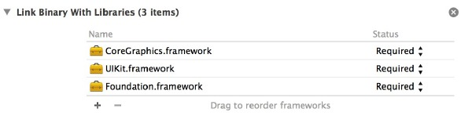

这些 framework 将会在动态链接过程中被加载，另外还有隐含 link 的 framework，可以测试出来：先找到可执行文件，我这里叫 TestMain 的工程，模拟器路径下找到 TestMain.app，可执行文件默认同名，再通过 `otool`命令：   
    
    $ otool -L TestMain
    

**-L** 参数打印出所有 link 的 framework（去掉了版本信息如下）
    
    
    TestMain:
        /System/Library/Frameworks/CoreGraphics.framework/CoreGraphics
        /System/Library/Frameworks/UIKit.framework/UIKit
        /System/Library/Frameworks/Foundation.framework/Foundation
        /System/Library/Frameworks/CoreFoundation.framework/CoreFoundation
        /usr/lib/libobjc.A.dylib
        /usr/lib/libSystem.dylib
    

除了多了的`CoreGraphics`（被 UIKit 依赖）外，有两个默认添加的 lib：**libobjc** 即 objc 和 runtime，**libSystem** 中包含了很多系统级别 lib，列几个熟知的：

  * libdispatch ( GCD )
  * libsystem_c ( C语言库 )
  * libsystem_blocks ( Block )
  * libcommonCrypto ( 加密库，比如常用的 md5 函数 )

这些 lib 都是`dylib`格式（如 windows 中的 dll ），系统使用动态链接有几点好处：

  * 代码共用：很多程序都动态链接了这些 lib，但它们在内存和磁盘中中只有一份
  * 易于维护：由于被依赖的 lib 是程序执行时才 link 的，所以这些 lib 很容易做更新，比如`libSystem.dylib` 是 `libSystem.B.dylib` 的替身，哪天想升级直接换成 `libSystem.C.dylib`然后再替换替身就行了
  * 减少可执行文件体积：相比静态链接，动态链接在编译时不需要打进去，所以可执行文件的体积要小很多

#####dyld

**dyld**（the dynamic link editor），Apple 的动态链接器，系统 kernel 做好启动程序的初始准备后，交给 dyld 负责，援引并翻译[《 Mike Ash 这篇 blog 》](https://www.mikeash.com/pyblog/friday-qa-2012-11-09-dyld-dynamic-linking-on-os-x.html)对 dyld 作用顺序的概括：

  1. 从 kernel 留下的原始调用栈引导和启动自己
  2. 将程序依赖的动态链接库**递归**加载进内存，当然这里有**缓存机制**
  3. non-lazy 符号立即 link 到可执行文件，lazy 的存表里
  4. Runs static initializers for the executable
  5. 找到可执行文件的 main 函数，准备参数并调用
  6. 程序执行中负责绑定 lazy 符号、提供 runtime dynamic loading services、提供调试器接口
  7. 程序main函数 return 后执行 static terminator
  8. 某些场景下 main 函数结束后调 libSystem 的 **_exit** 函数

得益于 dyld 是开源的，[github 地址](https://github.com/opensource-apple/dyld)，我们可以从源码一探究竟。

一切源于`dyldStartup.s`这个文件，其中用汇编实现了名为`__dyld_start`的方法，汇编太生涩，它主要干了两件事：

  1. 调用`dyldbootstrap::start()`方法（省去参数）
  2. 上个方法返回了 main 函数地址，填入参数并调用 main 函数

这个步骤随手就能验证出来，设置一个`符号断点`断在`_objc_init`：  
  
这个函数是`runtime`的初始化函数，后面会提到。程序运行在很早的时候断住，这时候看调用栈：  
  
看到了栈底的`dyldbootstrap::start()`方法，继而调用了`dyld::_main()`方法，其中完成了刚才说的递归加载动态库过程，由于`libSystem`默认引入，栈中出现了`libSystem_initializer`的初始化方法。

#####ImageLoader

当然这个 **image** 不是图片的意思，它大概表示一个二进制文件（可执行文件或 so 文件），里面是被编译过的符号、代码等，所以
ImageLoader 作用是将这些文件加载进内存，且**每一个文件对应一个ImageLoader实例来负责加载**。

两步走：

  1. 在程序运行时它先将动态链接的 image 递归加载 （也就是上面测试栈中一串的递归调用的时刻）
  2. 再从可执行文件 image 递归加载所有符号

当然所有这些都发生在我们真正的main函数执行前。

####runtime 与 +load

刚才讲到 `libSystem` 是若干个系统 lib 的集合，所以它只是一个容器 lib 而已，而且它也是开源的，里面实质上就一个文件，[init.c](
http://www.opensource.apple.com/source/Libsystem/Libsystem-169.3/init.c)，由 ß`libSystem_initializer` 逐步调用到了 `_objc_init`，这里就是 objc 和 runtime 的初始化入口。

除了 runtime 环境的初始化外，`_objc_init`中绑定了新 image 被加载后的 callback：

    
    
    dyld_register_image_state_change_handler(
    dyld_image_state_bound, 1, &map_images);
    dyld_register_image_state_change_handler(
    dyld_image_state_dependents_initialized, 0, &load_images);
    

可见 dyld 担当了 `runtime` 和 `ImageLoader` 中间的协调者，当新 image 加载进来后交由 runtime ß大厨去解析这个二进制文件的符号表和代码。继续上面的断点法，断住神秘的 `+load` 函数：

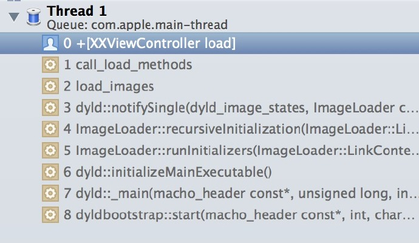

清楚的看到整个调用栈和顺序：

  1. dyld 开始将程序二进制文件初始化
  2. 交由 ImageLoader 读取 image，其中包含了我们的类、方法等各种符号
  3. 由于 runtime 向 dyld 绑定了回调，当 image 加载到内存后，dyld 会通知 runtime 进行处理
  4. runtime 接手后调用 map_images 做解析和处理，接下来 load_images 中调用 call_load_methods 方法，遍历所有加载进来的 Class，按继承层级依次调用 Class 的 +load 方法和其 Category 的 +load 方法

至此，可执行文件中和动态库所有的符号（Class，Protocol，Selector，IMP，…）都已经按格式成功加载到内存中，被 runtime
所管理，再这之后，runtime 的那些方法（动态添加 Class、swizzle 等等才能生效）

#####关于 +load 方法的几个 QA

Q: 重载自己 Class 的 +load 方法时需不需要调父类？  
A: runtime 负责按继承顺序递归调用，所以我们不能调 super

Q: 在自己 Class 的 +load 方法时能不能替换系统 framework（比如 UIKit）中的某个类的方法实现  
A: 可以，因为动态链接过程中，所有依赖库的类是先于自己的类加载的

Q: 重载 +load 时需要手动添加 @autoreleasepool 么？  
A: 不需要，在 runtime 调用 +load 方法前后是加了 `objc_autoreleasePoolPush()`
和`objc_autoreleasePoolPop()` 的。

Q: 想让一个类的 +load 方法被调用是否需要在某个地方 import 这个文件  
A: 不需要，只要这个类的符号被编译到最后的可执行文件中，+load 方法就会被调用（Reveal SDK 就是利用这一点，只要引入到工程中就能工作）

##简单总结

整个事件由 dyld 主导，完成运行环境的初始化后，配合 ImageLoader 将二进制文件按格式加载到内存，动态链接依赖库，并由 runtime 负责加载成 objc 定义的结构，所有初始化工作结束后，dyld 调用真正的 main 函数。  
值得说明的是，这个过程远比写出来的要复杂，这里只提到了 runtime 这个分支，还有像`GCD`、`XPC`等重头的系统库初始化分支没有提及（当然，有缓存机制在，它们也不会玩命初始化），总结起来就是 main 函数执行之前，系统做了茫茫多的加载和初始化工作，但都被很好的隐藏了，我们无需关心。

####孤独的 main 函数

当这一切都结束时，dyld 会清理现场，将调用栈回归，只剩下：  

孤独的 main 函数，看上去是程序的开始，确是一段精彩的终结

####
原文出处：<a href='https://www.jianshu.com/p/a51fcabc9c71' target='blank'>深入理解iOS App的启动过程.</a>

###前言

> 启动时间是衡量应用品质的重要指标。

本文首先会从原理上出发，讲解iOS系统是如何启动App的，然后从main函数之前和main函数之后两个角度去分析如何优化启动时间。

###准备知识

####Mach-O

哪些名词指的是Mach-o

  * Executable 可执行文件
  * Dylib 动态库
  * Bundle 无法被连接的动态库，只能通过dlopen()加载
  * Image 指的是Executable，Dylib或者Bundle的一种，文中会多次使用Image这个名词。
  * Framework 动态库(可以是静态库)和对应的头文件和资源文件的集合

Apple出品的操作系统的可执行文件格式几乎都是mach-o，iOS当然也不例外。  
mach-o可以大致的分为三部分：

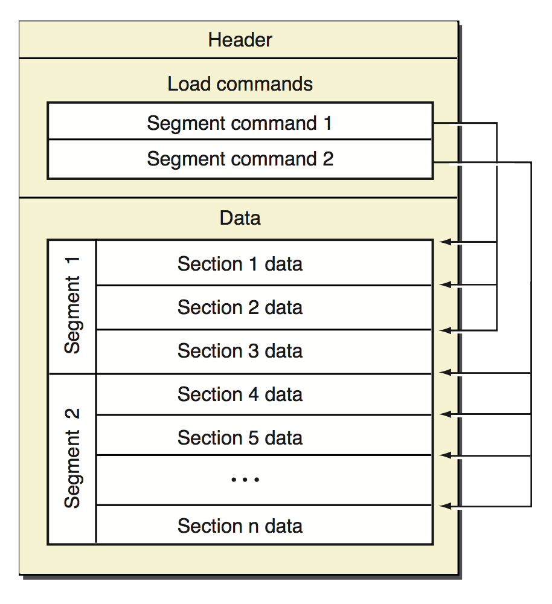

  * Header 头部，包含可以执行的CPU架构，比如x86,arm64
  * Load commands 加载命令，包含文件的组织架构和在虚拟内存中的布局方式
  * Data，数据，包含load commands中需要的各个段(segment)的数据，每一个Segment都得大小是Page的整数倍。

我们用**MachOView**打开Demo工程的可以执行文件，来验证下mach-o的文件布局：

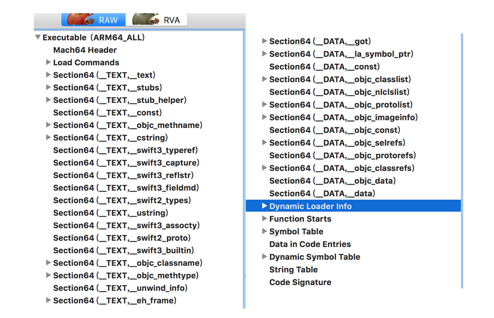

图中分析的mach-o文件来源于[PullToRefreshKit](https://github.com/LeoMobileDeveloper/PullToRefreshKit)，这是一个纯Swift的编写的工程。

那么Data部分又包含哪些segment呢？绝大多数mach-o包括以下三个段（支持用户自定义Segment，但是很少使用）

  * __TEXT 代码段，只读，包括函数，和只读的字符串，上图中类似`__TEXT,__text`的都是代码段
  * __DATA 数据段，读写，包括可读写的全局变量等，上图类似中的`__DATA,__data`都是数据段
  * __LINKEDIT `__LINKEDIT`包含了方法和变量的元数据（位置，偏移量），以及代码签名等信息。

关于mach-o更多细节，可以看看文档：《[Mac OS X ABI Mach-O File Format Reference](https://github.com/LeoMobileDeveloper/React-Native-Files/blob/master/Mac%20OS%20X%20ABI%20Mach-O%20File%20Format%20Reference.pdf)》。

####dyld

> dyld的全称是[dynamic loader](https://developer.apple.com/library/content/releasenotes/DeveloperTools/RN-dyld/)，它的作用是加载一个进程所需要的image，dyld是[开源的](https://opensource.apple.com/source/dyld/)。

####Virtual Memory

> 虚拟内存是在物理内存上建立的一个逻辑地址空间，它向上（应用）提供了一个连续的逻辑地址空间，向下隐藏了物理内存的细节。  
虚拟内存使得逻辑地址可以没有实际的物理地址，也可以让多个逻辑地址对应到一个物理地址。  
虚拟内存被划分为一个个大小相同的Page（64位系统上是16KB），提高管理和读写的效率。 Page又分为只读和读写的Page。

虚拟内存是建立在物理内存和进程之间的**中间层**。在iOS上，当内存不足的时候，会尝试释放那些只读的Page，因为只读的Page在下次被访问的时候，可以再从磁盘读取。如果没有可用内存，会通知在后台的App（也就是在这个时候收到了memory warning），如果在这之后仍然没有可用内存，则会杀死在后台的App。

####Page fault

> 在应用执行的时候，它被分配的逻辑地址空间都是可以访问的，当应用访问一个逻辑Page，而在对应的物理内存中并不存在的时候，这时候就发生了一次Page fault。当Page fault发生的时候，会中断当前的程序，在物理内存中寻找一个可用的Page，然后从磁盘中读取数据到物理内存，接着继续执行当前程序。

####Dirty Page & Clean Page

  * 如果一个Page可以从磁盘上重新生成，那么这个Page称为Clean Page
  * 如果一个Page包含了进程相关信息，那么这个Page称为Dirty Page

像代码段这种只读的Page就是Clean Page。而像数据段(`_DATA`)这种读写的Page，当写数据发生的时候，会触发COW(Copy on write)，也就是写时复制，Page会被标记成Dirty，同时会被复制。

想要了解更多细节，可以阅读文档：[Memory Usage Performance Guidelines](https://developer.apple.com/library/content/documentation/Performance/Conceptual/ManagingMemory/ManagingMemory.html#//apple_ref/doc/uid/10000160-SW1)

###启动过程

使用dyld2启动应用的过程如图：

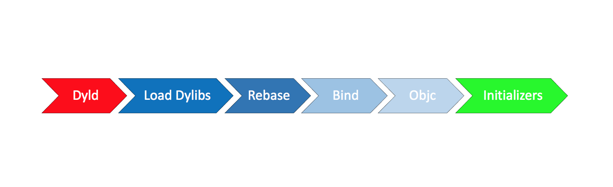

大致的过程如下：

> 加载dyld到App进程  
加载动态库（包括所依赖的所有动态库）  
Rebase  
Bind  
初始化Objective C Runtime  
其它的初始化代码

####加载动态库

> dyld会首先读取mach-o文件的Header和load commands。  
接着就知道了这个可执行文件依赖的动态库。例如加载动态库A到内存，接着检查A所依赖的动态库，就这样的递归加载，直到所有的动态库加载完毕。通常一个App所依赖的动态库在100-400个左右，其中大多数都是系统的动态库，它们会被缓存到dyld shared cache，这样读取的效率会很高。

查看mach-o文件所依赖的动态库，可以通过MachOView的图形化界面(展开Load Command就能看到)，也可以通过命令行otool。

    
    
    192:Desktop Leo$ otool -L demo 
    demo:
        @rpath/PullToRefreshKit.framework/PullToRefreshKit (compatibility version 1.0.0, current version 1.0.0)
        /System/Library/Frameworks/Foundation.framework/Foundation (compatibility version 300.0.0, current version 1444.12.0)
        /usr/lib/libobjc.A.dylib (compatibility version 1.0.0, current version 228.0.0)
        @rpath/libswiftCore.dylib (compatibility version 1.0.0, current version 900.0.65)
        @rpath/libswiftCoreAudio.dylib (compatibility version 1.0.0, current version 900.0.65)
        //...
    

####Rebase && Bind

这里先来讲讲为什么要Rebase？

有两种主要的技术来保证应用的安全：ASLR和Code Sign。

ASLR的全称是Address space layout randomization，翻译过来就是“地址空间布局随机化”。App被启动的时候，程序会被影射到逻辑的地址空间，这个逻辑的地址空间有一个起始地址，而ASLR技术使得这个起始地址是随机的。如果是固定的，那么黑客很容易就可以由起始地址+偏移量找到函数的地址。

Code Sign相信大多数开发者都知晓，这里要提一点的是，在进行Code
sign的时候，加密哈希不是针对于整个文件，而是针对于每一个Page的。这就保证了在dyld进行加载的时候，可以对每一个page进行独立的验证。

mach-o中有很多符号，有指向当前mach-o的，也有指向其他dylib的，比如`printf`。那么，在运行时，代码如何准确的找到`printf`的地址呢？

mach-o中采用了PIC技术，全称是Position Independ code。当你的程序要调用`printf`的时候，会先在`__DATA`段中建立一个指针指向printf，在通过这个指针实现间接调用。dyld这时候需要做一些fix-up工作，即帮助应用程序找到这些符号的实际地址。主要包括两部分

  * Rebase 修正内部(指向当前mach-o文件)的指针指向
  * Bind 修正外部指针指向

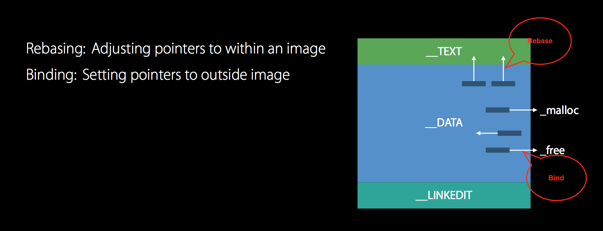

之所以需要Rebase，是因为刚刚提到的ASLR使得地址随机化，导致起始地址不固定，另外由于Code Sign，导致不能直接修改Image。Rebase的时候只需要增加对应的偏移量即可。待Rebase的数据都存放在`__LINKEDIT`中。  
可以通过MachOView查看：Dynamic Loader Info -> Rebase Info

也可以通过命令行：

    
    
    192:Desktop Leo$ xcrun dyldinfo -bind demo 
    bind information:
    segment section          address        type    addend dylib            symbol
    __DATA  __got            0x10003C038    pointer      0 PullToRefreshKit __T016PullToRefreshKit07DefaultC4LeftC9textLabelSo7UILabelCvWvd
    __DATA  __got            0x10003C040    pointer      0 PullToRefreshKit __T016PullToRefreshKit07DefaultC5RightC9textLabelSo7UILabelCvWvd
    __DATA  __got            0x10003C048    pointer      0 PullToRefreshKit __T016PullToRefreshKit07DefaultC6FooterC9textLabelSo7UILabelCvWvd
    __DATA  __got            0x10003C050    pointer      0 PullToRefreshKit __T016PullToRefreshKit07DefaultC6HeaderC7spinnerSo23UIActivityIndicatorViewCvWvd
    //...

Rebase解决了内部的符号引用问题，而外部的符号引用则是由Bind解决。在解决Bind的时候，是根据字符串匹配的方式查找符号表，所以这个过程相对于Rebase来说是略慢的。

同样，也可以通过xcrun dyldinfo来查看Bind的信息，比如我们查看bind信息中，包含UITableView的部分：

    
    
    192:Desktop Leo$ xcrun dyldinfo -bind demo | grep UITableView
    __DATA  __objc_classrefs 0x100041940    pointer      0 UIKit            _OBJC_CLASS_$_UITableView
    __DATA  __objc_classrefs 0x1000418B0    pointer      0 UIKit            _OBJC_CLASS_$_UITableViewCell
    __DATA  __objc_data      0x100041AC0    pointer      0 UIKit            _OBJC_CLASS_$_UITableViewController
    __DATA  __objc_data      0x100041BE8    pointer      0 UIKit            _OBJC_CLASS_$_UITableViewController
    __DATA  __objc_data      0x100042348    pointer      0 UIKit            _OBJC_CLASS_$_UITableViewController
    __DATA  __objc_data      0x100042718    pointer      0 UIKit            _OBJC_CLASS_$_UITableViewController
    __DATA  __data           0x100042998    pointer      0 UIKit            _OBJC_METACLASS_$_UITableViewController
    __DATA  __data           0x100042A28    pointer      0 UIKit            _OBJC_METACLASS_$_UITableViewController
    __DATA  __data           0x100042F10    pointer      0 UIKit            _OBJC_METACLASS_$_UITableViewController
    __DATA  __data           0x1000431A8    pointer      0 UIKit            _OBJC_METACLASS_$_UITableViewController
    

####Objective C

Objective C是动态语言，所以在执行main函数之前，需要把类的信息注册到一个全局的Table中。同时，Objective C支持Category，在初始化的时候，也会把Category中的方法注册到对应的类中，同时会唯一Selector，这也是为什么当你的Cagegory实现了类中同名的方法后，类中的方法会被覆盖。

另外，由于iOS开发时基于Cocoa Touch的，所以绝大多数的类起始都是系统类，所以大多数的Runtime初始化起始在Rebase和Bind中已经完成。

####Initializers

接下来就是必要的初始化部分了，主要包括几部分：

  * +load方法。
  * C／C++静态初始化对象和标记为`__attribute__(constructor)`的方法

这里要提一点的就是，+load方法已经被弃用了，如果你用Swift开发，你会发现根本无法去写这样一个方法，官方的建议是实用`initialize`。区别就是，load是在类装载的时候执行，而initialize是在类第一次收到message前调用。

###dyld3

上文的讲解是dyld2的加载方式。而最新的是dyld3加载方式略有不同：

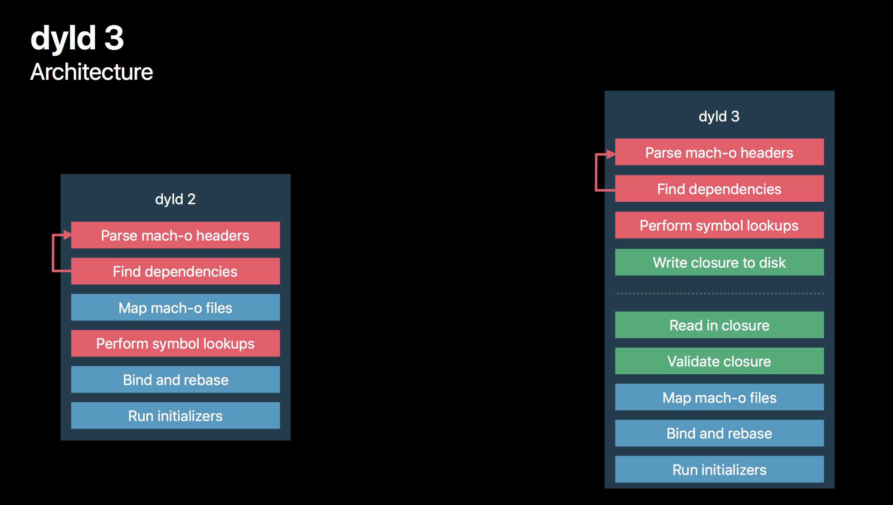

dyld2是纯粹的in-process，也就是在程序进程内执行的，也就意味着只有当应用程序被启动的时候，dyld2才能开始执行任务。

dyld3则是部分out-of-process，部分in-process。图中，虚线之上的部分是out-of-process的，在App下载安装和版本更新的时候会去执行，out-of-process会做如下事情：

  * 分析Mach-o Headers
  * 分析依赖的动态库
  * 查找需要Rebase & Bind之类的符号
  * 把上述结果写入缓存

这样，在应用启动的时候，就可以直接从缓存中读取数据，加快加载速度。

###启动时间

####冷启动 VS 热启动

> 如果你刚刚启动过App，这时候App的启动所需要的数据仍然在缓存中，再次启动的时候称为热启动。如果设备刚刚重启，然后启动App，这时候称为冷启动。

启动时间在小于400ms是最佳的，因为从点击图标到显示Launch Screen，到Launch Screen消失这段时间是400ms。启动时间不可以大于20s，否则会被系统杀掉。

在Xcode中，可以通过设置环境变量来查看App的启动时间，`DYLD_PRINT_STATISTICS`和`DYLD_PRINT_STATISTICS_DETAILS`。

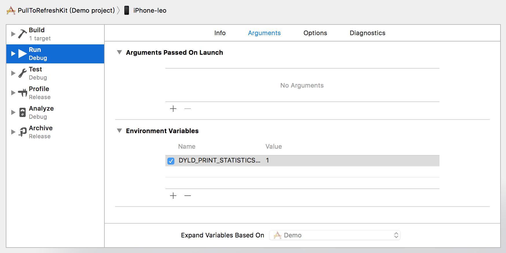

    
    
    Total pre-main time:  43.00 milliseconds (100.0%)
             dylib loading time:  19.01 milliseconds (44.2%)
            rebase/binding time:   1.77 milliseconds (4.1%)
                ObjC setup time:   3.98 milliseconds (9.2%)
               initializer time:  18.17 milliseconds (42.2%)
               slowest intializers :
                 libSystem.B.dylib :   2.56 milliseconds (5.9%)
       libBacktraceRecording.dylib :   3.00 milliseconds (6.9%)
        libMainThreadChecker.dylib :   8.26 milliseconds (19.2%)
                           ModelIO :   1.37 milliseconds (3.1%)
    
 

对于这个libMainThreadChecker.dylib估计很多同学会有点陌生，这是XCode 9新增的动态库，用来做主线成检查的。

###优化启动时间

启动时间这个名词，不同的人有不同的定义。在我看来，

> 启动时间是用户点击App图标，到第一个界面展示的时间。

以main函数作为分水岭，启动时间其实包括了两部分：main函数之前和main函数到第一个界面的`viewDidAppear:`。所以，优化也是从两个方面进行的，个人建议优先优化后者，因为绝大多数App的瓶颈在自己的代码里。

####Main函数之后

我们首先来分析下，从main函数开始执行，到你的第一个界面显示，这期间一般会做哪些事情。

  * 执行AppDelegate的代理方法，主要是`didFinishLaunchingWithOptions`
  * 初始化Window，初始化基础的ViewController结构(一般是`UINavigationController`+`UITabViewController`)
  * 获取数据(Local DB／Network)，展示给用户。

#####UIViewController

> 延迟初始化那些不必要的`UIViewController`。

比如网易新闻：

在启动的时候只需要初始化**首页**的**头条**页面即可。像“要闻”，“我的”等页面，则延迟加载，即启动的时候只是一个UIViewController作为占位符给TabController，等到用户点击了再去进行真正的数据和视图的初始化工作。

#####AppDelegate

通常我们会在AppDelegate的代理方法里进行初始化工作，主要包括了两个方法：

  * `didFinishLaunchingWithOptions`
  * `applicationDidBecomeActive`

优化这些初始化的核心思想就是：

> 能延迟初始化的尽量延迟初始化，不能延迟初始化的尽量放到后台初始化。

这些工作主要可以分为几类：

  * 三方SDK初始化，比如Crash统计; 像分享之类的，可以等到第一次调用再出初始化。
  * 初始化某些基础服务，比如WatchDog，远程参数。
  * 启动相关日志，日志往往涉及到DB操作，一定要放到后台去做
  * 业务方初始化，这个交由每个业务自己去控制初始化时间。

对于`didFinishLaunchingWithOptions`的代码，建议按照以下的方式进行划分：

    
    
    @interface AppDelegate ()
    //业务方需要的生命周期回调
    @property (strong, nonatomic) NSArray<id<UIApplicationDelegate>> * eventQueues;
    //主框架负责的生命周期回调
    @property (strong, nonatomic) id<UIApplicationDelegate> basicDelegate;
    @end
    

然后，你会得到一个**非常干净的AppDelegate**文件：

    
    
    - (BOOL)application:(UIApplication *)application didFinishLaunchingWithOptions:(NSDictionary *)launchOptions {
        for (id<UIApplicationDelegate> delegate in self.eventQueues) {
            [delegate application:application didFinishLaunchingWithOptions:launchOptions];
        }
        return [self.basicDelegate application:application didFinishLaunchingWithOptions:launchOptions];
    }
  

由于对这些初始化进行了分组，在开发期就可以很容易的控制每一个业务的初始化时间：
    
    CFTimeInterval startTime = CACurrentMediaTime();
    //执行方法
    CFTimeInterval endTime = CACurrentMediaTime();

#####用Time Profiler找到元凶

Time Profiler在分析时间占用上非常强大。实用的时候注意三点

  * 在打包模式下分析（一般是Release）,这样和线上环境一样。
  * 记得开启dsym，不然无法查看到具体的函数调用堆栈
  * 分析性能差的设备，对于支持iOS 8的，一般分析iphone 4s或者iphone 5。

一个典型的分析界面如下：

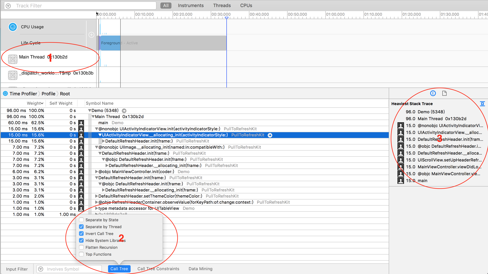

几点要注意：

  1. 分析启动时间，一般只关心主线程
  2. 选择Hide System Libraries和Invert Call Tree，这样我们能专注于自己的代码
  3. 右侧可以看到详细的调用堆栈信息

在某一行上双击，我们可以进入到代码预览界面，去看看实际每一行占用了多少时间：

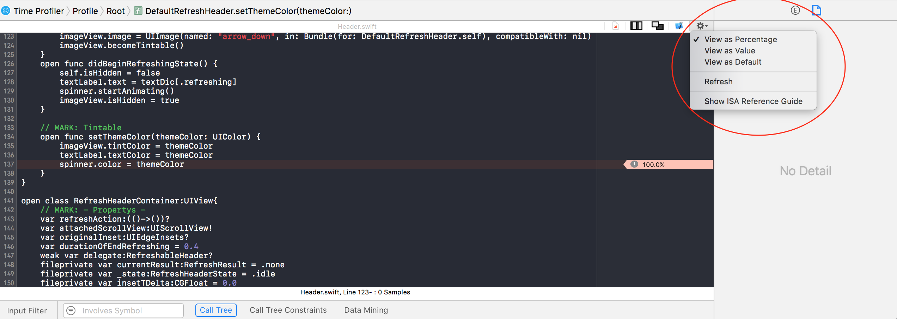

#####小结

不同的App在启动的时候做的事情往往不同，但是优化起来的核心思想无非就两个：

  * 能延迟执行的就延迟执行。比如SDK的初始化，界面的创建。
  * 不能延迟执行的，尽量放到后台执行。比如数据读取，原始JSON数据转对象，日志发送。

####Main函数之前

Main函数之前是iOS系统的工作，所以这部分的优化往往更具有通用性。

#####dylibs

启动的第一步是加载动态库，加载系统的动态库使很快的，因为可以缓存，而加载内嵌的动态库速度较慢。所以，提高这一步的效率的关键是：**减少动态库的数量**。

  * 合并动态库，比如公司内部由私有Pod建立了如下动态库：XXTableView, XXHUD, XXLabel，强烈建议合并成一个XXUIKit来提高加载速度。

#####Rebase & Bind & Objective C Runtime

Rebase和Bind都是为了解决指针引用的问题。对于Objective
C开发来说，主要的时间消耗在Class/Method的符号加载上，所以常见的优化方案是：

  * 减少`__DATA`段中的指针数量。
  * 合并Category和功能类似的类。比如：UIView+Frame,UIView+AutoLayout…合并为一个
  * 删除无用的方法和类。
  * 多用Swift Structs，因为Swfit Structs是静态分发的。感兴趣的同学可以看看我之前这篇文章：《[Swift进阶之内存模型和方法调度](http://blog.csdn.net/hello_hwc/article/details/53147910)》

#####Initializers

通常，我们会在`+load`方法中进行method-swizzling，这也是[Nshipster](http://nshipster.com/method-swizzling/)推荐的方式。

  * 用initialize替代load。不少同学喜欢用method-swizzling来实现AOP去做日志统计等内容，强烈建议改为在initialize进行初始化。
  * 减少`__atribute__((constructor))`的使用，而是在第一次访问的时候才用dispatch_once等方式初始化。
  * 不要创建线程
  * 使用Swfit重写代码。

