 
<!--BEGIN_DATA
{
    "create_date": "2021-07-01 12:30", 
    "modify_date": "2021-07-01 12:30", 
    "is_top": "0", 
    "summary": "编码篇之AV1 AV2 Video Codec - Early Performance Evaluation of the Research", 
    "tags": "音视频", 
    "file_name": "AV1、AV2.md"
}
END_DATA-->

#### 
原文出处：<a href='https://www.jianshu.com/p/bc1300f362e8' target='blank'>编码篇之AV1</a>

## 1. 编解码

### 1.1 AV1

涉及到AV1的有三篇演讲分别是Google工程师Debargha Mukherjee的《From VP9 to AV1 and beyond》、《A Technical Overview of the coding tools in AV1》和Intel工程师Faouzi Kossentini的《Accelerated Growth of the Visual Cloud Through Open Sourcing SVT-HEVC and SVT-AV1》。

我现场听了第一篇和第三篇，第二篇由于和第一篇是同一作者，且第二篇内容仅是第一篇的补充增强，故前两篇统一进行介绍。

#### (1) Alliance for Open Media and AV1

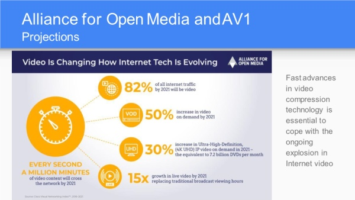

首先给出了一份数据：2021年每秒钟产生100万分钟的视频，这可以作为论述视频发展重要性观点的一项数据来源。

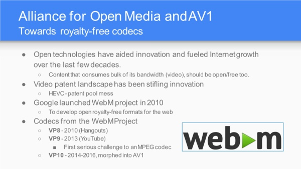

AV1的理念是OpenMedia，目标即免税编码，进而用来和ITU高专利费的HEVC、VCC对抗。

AOM成员主要是互联网公司(尤其是视频网站)和传统软件硬件企业，和以政府部门、电信企业为主导的ITU不太一样。

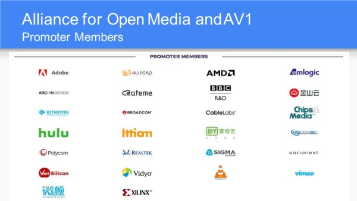

在这里可以看到国内的公司金山云和爱奇艺，金山云在HEVC的编码优化上做了很多底层的工作，在下一节中会单独分享。

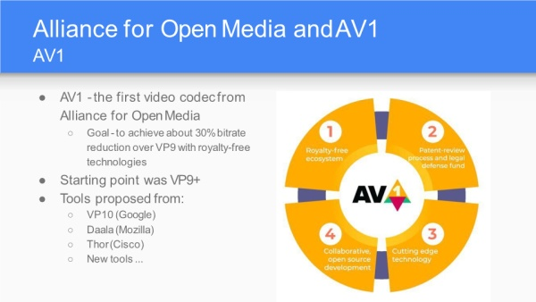

AV1采纳百家众长，以VP10为基础，算法和工具融合了Mozilla的Daala、Cisco的Thor，未来差异化的编码器可能会越来越少。性能指标目标是比VP9还能压缩30%的冗余。

AOM的四个工作组：编码工作组、硬件工作组(毕竟AV1算法复杂度特别高)、助教组和测试组。

#### (2) Coding Tools

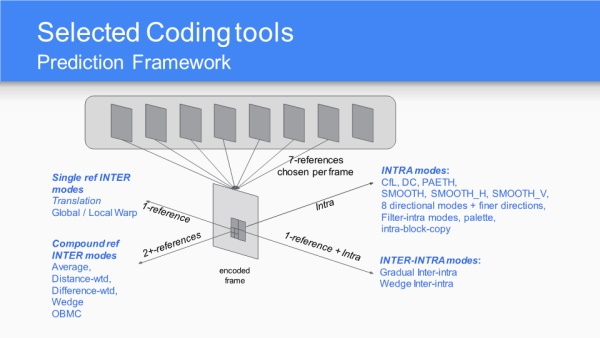

预测编码有四种模式：帧内模式、单帧帧间模式、复合帧间模式和帧内帧间模式，后三种都可以看成广义的帧间预测。

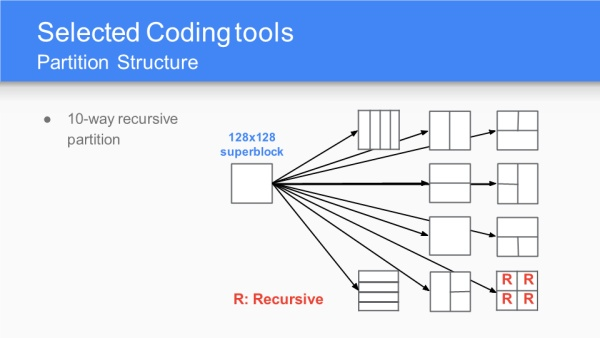

有10种递归的划分方式，从HEVC的CTU开始，宏块划分就以树形递归来实现了。

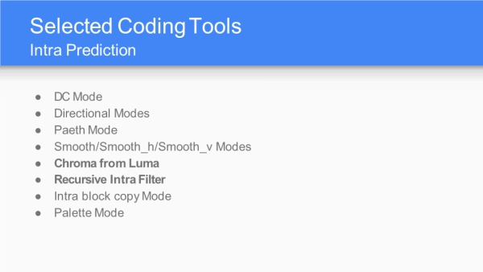

帧内预测的模式细分有8个子类。

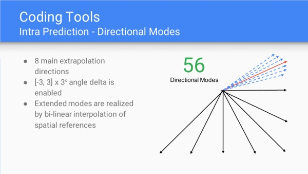

帧内预测方向预测子类上有56种。

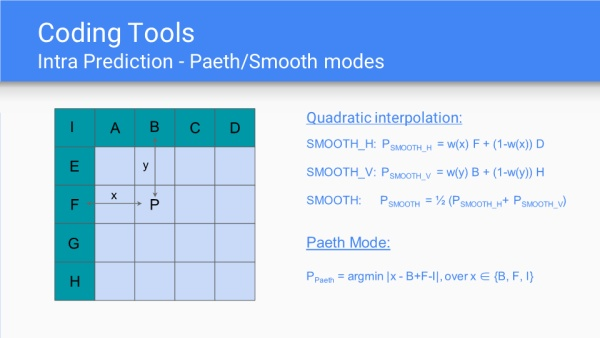

平滑模式进行四分之一内插和Paeth模式(该模式未展开介绍)。

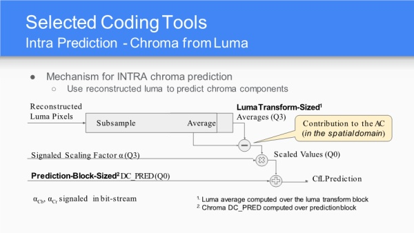

通过重构的亮度来对色差预测子模式进行选择，这类似于VVC的方法。

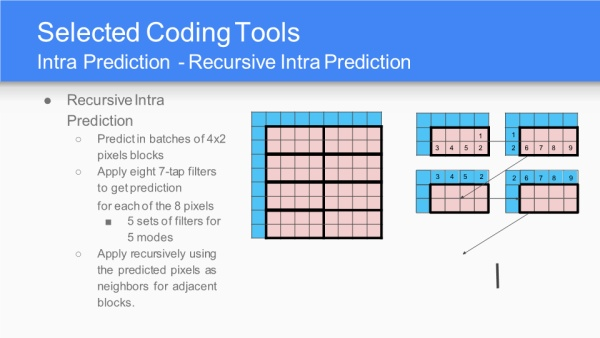

递归的帧内预测，以4x2为单位，用8个7抽头滤波器获取预测值。

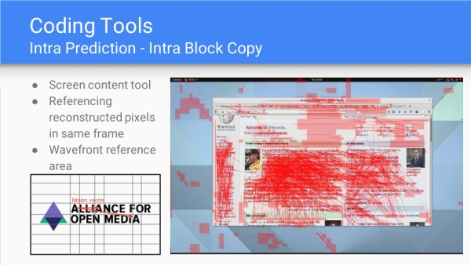

根据屏幕内容进行帧内块拷贝。

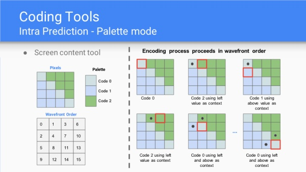

根据屏幕内容的调色板模式。

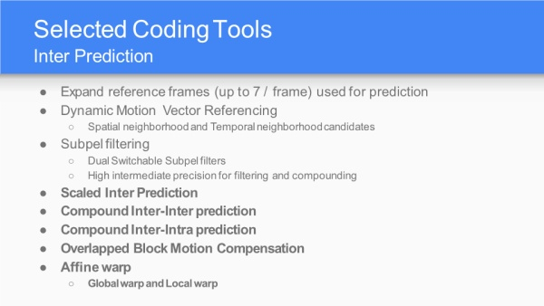

帧间预测，三大亮点：支持更多参考帧、动态运动矢量参考、亚像素滤波；三大帧间预测模式：单帧帧间模式、复合帧间模式和复合帧内帧间模式；OBMC运动补偿模式；仿射变换。

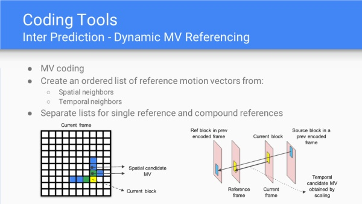

动态运动矢量参考，时域邻居和空域邻居中寻找参考列表。

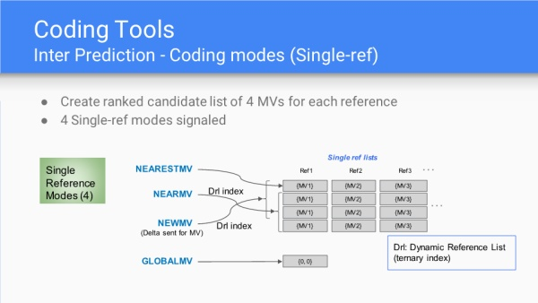

单帧帧间预测的场景，排序了4个MV组成的候选列表；同时有4种单帧模式下的MV，分别是最近MV、邻近MV、最新MV和全局MV。

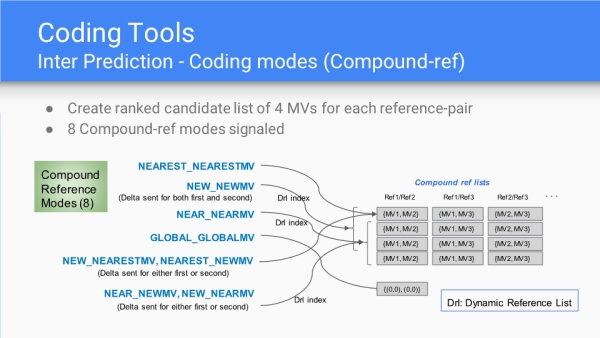

复合帧间预测的场景，排序了4个MV组成的候选列表；同时有8种复合模式下的MV，分别是最近MV、邻近MV、最新MV、全局MV、新的最近MV、最近新的MV、邻近的新MV和新的邻近MV。其中"最近"、"邻近"是空间域上的关系，"新"是时间域上的关系。

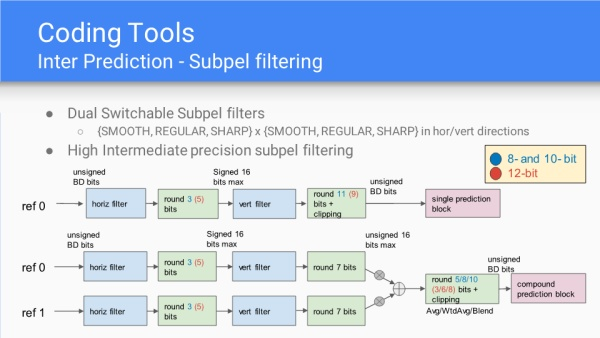

亚像素滤波，分为水平上平滑、常规、边缘以及垂直上平滑、常规、边缘的组合。

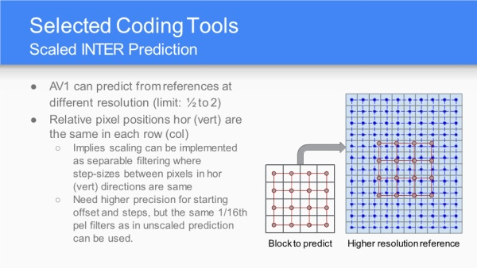

Scaled Inter Prediction就是等比例的帧帧预测，每次待预测块可以以1/2、1、2个像素进行水平或垂直方向的移动。

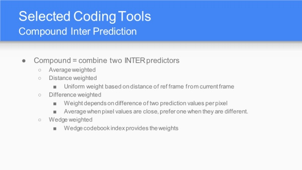

复合帧间预测是指将一下两种帧间预测进行组合，包括平均权重、距离权重、差异权重和楔形权重。

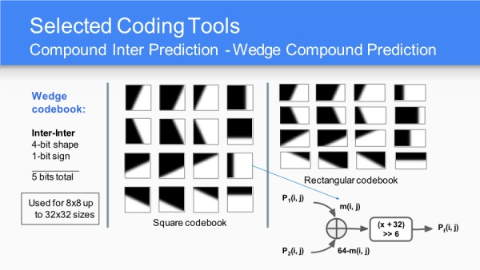

详细讲了一下楔形权重码书样式(无论是方形还是矩形，都有16个码本)，以及最终传输比特数(5bit，含4bit形状编号+1bit符号)。

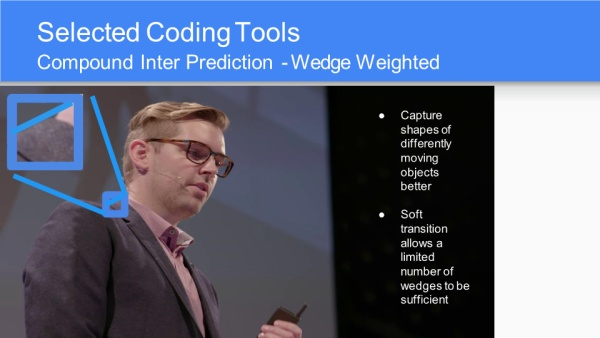

应用举例，衣领就是一个楔形，对应上一页的第三行第一列码本。

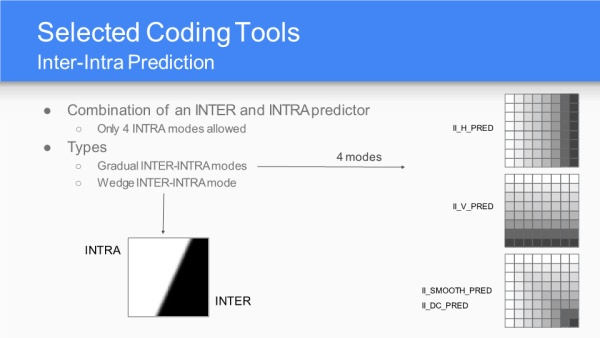

帧内帧间预测有两种模式：渐进模式和楔形模式，渐进模式用的就是帧内模式的4种情况。

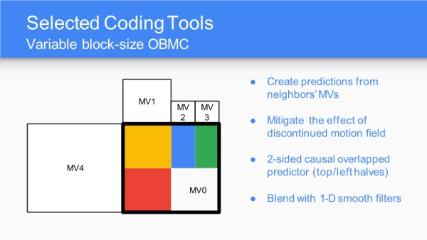

灵活宏块尺寸的帧间预测运动矢量补偿。

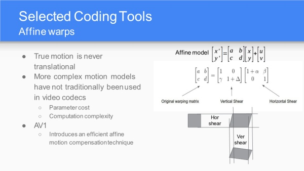

基于纯块划分的帧间预测面对平移的情况较为适用，但对于旋转和带有景深的移动则效果很差，需要通过仿射函数的变换来实现更准确的运动补偿。

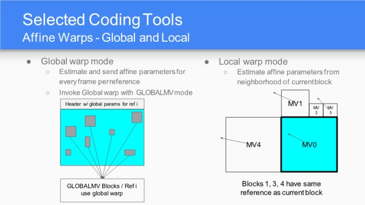

整体仿射变形模式和局部仿射变形模式。

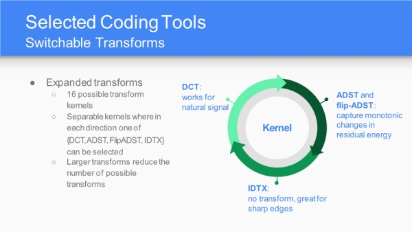

提供16种变换基，对于普通信号进行DCT变换，对于边缘不进行变换IDTX，对于残差能量单调变化进行ADST(非对称离散正弦变换)或flip-ADST(翻转非对称离散正弦变换)。

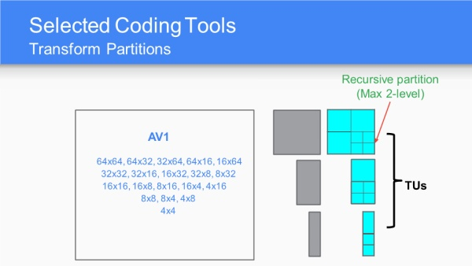

变换分割相比HEVC的TU有矩形情况。

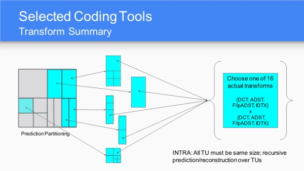

对于帧内预测帧，TU需要有相同尺寸；对于递归预测、重建一定要在TU之上进行；16个变换基是指水平方向和垂直方向DCT、IDX、ADST或flip-ADST的组合。

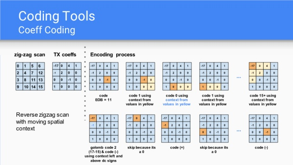

系数编码仍为Zig-zag但处理过程中会保留一些高频信号变换后所在的位置。

环路滤波和后处理滤波的整个流程，包括传统的环路滤波、方向限定增强滤波、上采样滤波、环路恢复滤波和胶片颗粒合成后处理滤波。

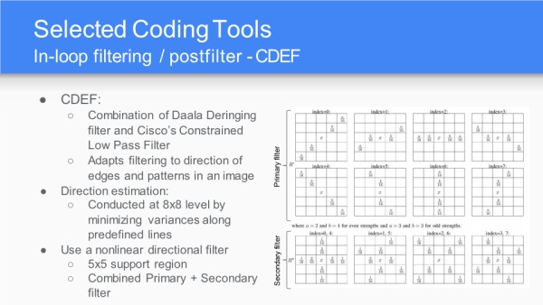

CDEF是一种针对边缘的滤波，由之前Daala和Thor的组合而成；而后进行方向估计与非线性滤波。

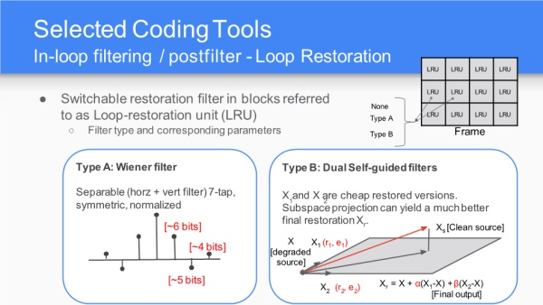

环路重建单元有两种类型，7抽头维纳滤波或双自引导滤波器，这一部分是之前任何编码算法中所没有的。

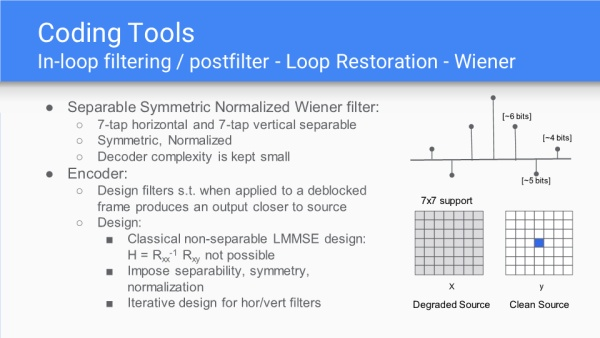

用离散对称正规化的维纳滤波器处理如上，在退化的x上去拟合y，用到了非离散线性贝叶斯估计量(LMMSE)。

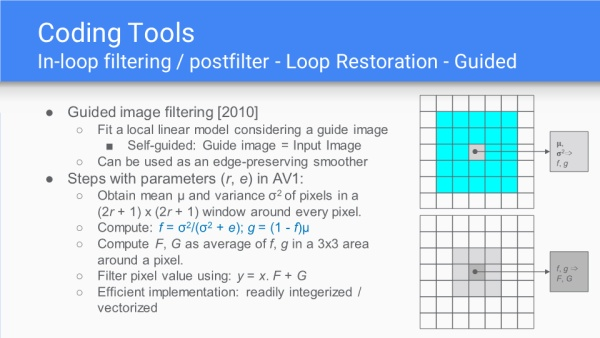

带有自引导的图像滤波器及过程参数。

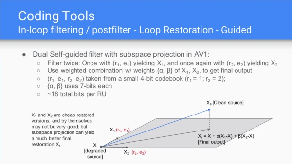

双自引导滤波器在子空间上的投影。

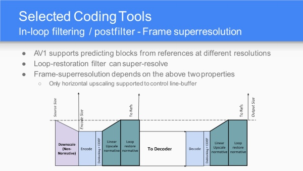

超分辨率可以通过环路重建和上采样来实现，表格上介绍的是可以将信源图像进行下采样再编码，重建与最后输出都能通过超分技术还原回同信源同尺寸的图像。

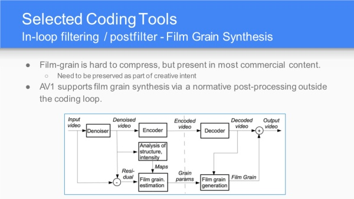

胶片颗粒(Film-grain)特别难以压缩([Film grain - Wikipedia](https://en.wikipedia.org/wiki/Film_grain)),AV1通过胶片颗粒合成方法在后处理过程中实现，这个后处理过程对于编码循环来说是带外流程。

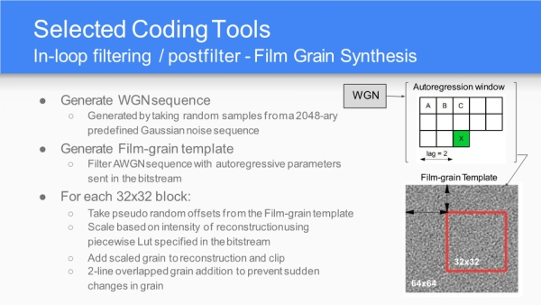

这一合成算法分为三个步骤，产生高斯白噪声、产生胶片颗粒模板、对每个32x32块进行伪随机偏移等操作。

#### (3). 最新编码结果

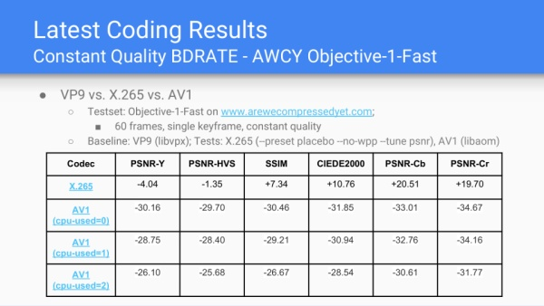

VP9(libvpx实现)、HEVC(X265实现)、AV1(libaom实现)的客观质量对比，baseline是VP9，AV1完胜HEVC，HEVC在色差峰值信噪比、结构相似度以及CIEDE2000(新色差公式)上要逊色于VP9。

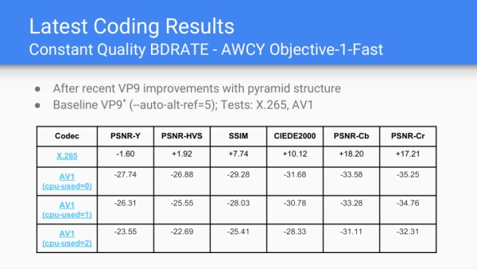

在VP9使用了金字塔型结构改进之后的客观质量对比，baseline仍是VP9，AV1仍完胜，HEVC在HVS峰值信噪比上逊色于改进后的VP9。

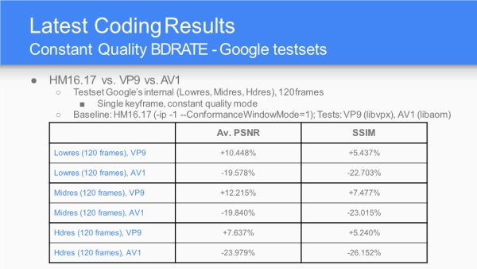

固定质量模式的测试，AV1优于HEVC(HM实现)，HEVC优于VP9。

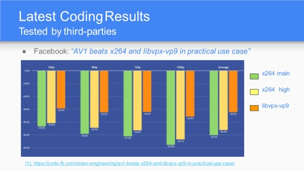

Facebook关于AV1和H264(X264实现)和VP9对比，原文见[地址](https://code.fb.com/video-engineering/av1-beats-x264-and-libvpx-vp9-in-practical-use-case/)。

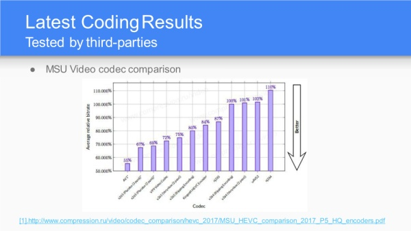

MSU关于AV1、HEVC(多种编码器、多种参数)、VP9、AVS2(uACS2)、H264(多种编码器)的对比，原文见[地址](http://www.compression.ru/video/codec_comparison/hevc_2017/MSU_HEVC_comparison_2017_P5_HQ_encoders.pdf)。

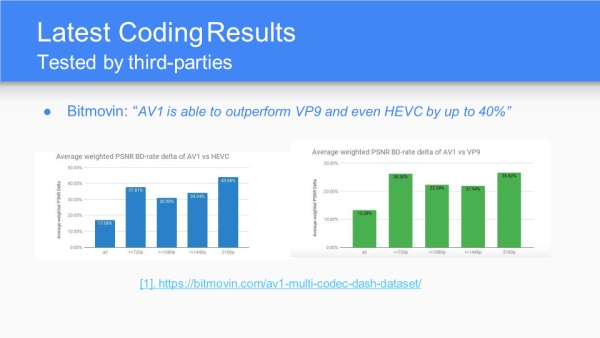

Bitmovin关于AV1、HEVC、VP9的对比，原文见[Multi-Codec DASH Dataset: An Evaluation of AV1, AVC, HEVC and VP9 - Bitmovin](https://bitmovin.com/av1-multi-codec-dash-dataset/)。

#### (4) AV1 Deployment

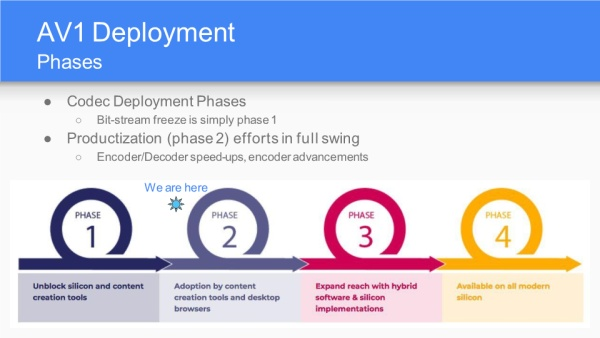

AV1的实施的四个阶段。第一阶段是创建工具，以及Bit-stream freeze(大概是码流格式定义)；目前处于第二阶段，工具集选择以及桌面浏览器实现(软编软解实现)；第三阶段是软硬混合(硬件加速)以及纯硬件实现；第四阶段是获得主流芯片的支持。

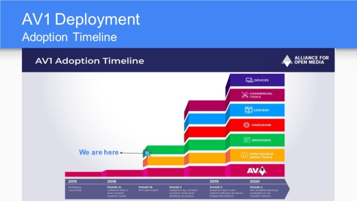

AV1计划时间线，目前处于浏览器支持阶段。

AV1在Google的推进计划，需要关注的是浏览器支持、WebRTC支持、Android支持、硬件实现的时间点。

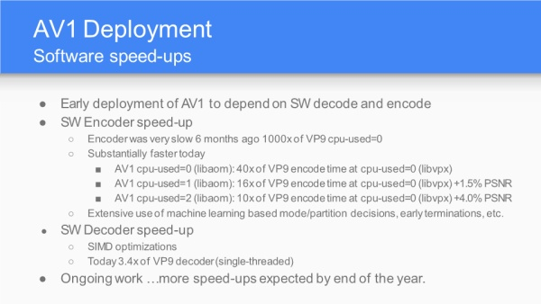

目前软编软解已经完成，编码上cpu实现，需要扩展实现基于机器学习的模式决策或宏块划分决策，解码端做的是SIMD的优化。

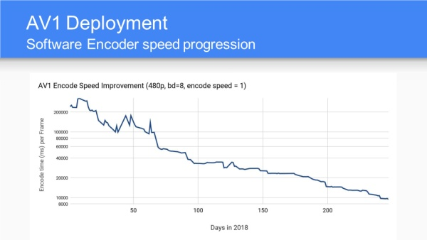

编码优化进展，横坐标2018年的日期，纵坐标编码480P每一帧的毫秒数，随着优化的进行，当前达到了8秒一帧的编码性能。

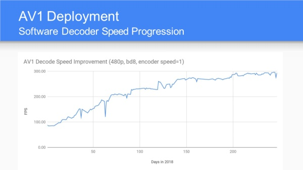

解码优化进展，横坐标2018年日期，纵坐标帧率，随着优化的进行达到每秒300帧的解码性能。

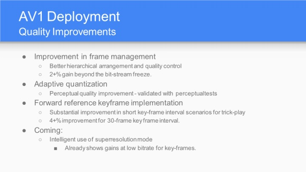

质量提升的四个方面：帧的层级排列与码控，基于感知的自适应量化、前向参考关键帧实现和智能超分辨率编码。

#### (5) Beyond AV1

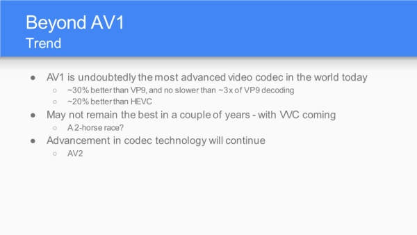

AV1是当下最好的编码器，比VP9压缩能力提升30%(达到了之前预设的目标)，比HEVC压缩能力提升20%；但面对即将到来的VVC是有一定挑战，AV2将会提
上日程。

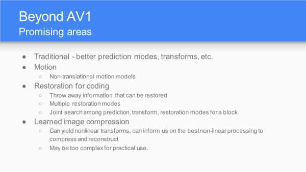

AV1优越的性能从传统角度来看得益于更好的预测模式、变换模式等；以及在运动上的非平移运动模式；编码恢复模式；学习图像压缩的非线性变换等等。

#### 
原文出处：<a href='https://ottverse.com/av2-video-codec-evaluation/' target='blank'>AV2 Video Codec - Early Performance Evaluation of the Research</a>

On 28 March 2018, after several years of development, the AV1 video codec standard was released by the Alliance for Open Media (AOM), a consortium founded by several technology companies to create novel royalty-free video coding technology for the internet.

While the adoption of the AV1 standard is still on the way – there are already several software implementations that show real-time performance, and hardware codecs are rolling out soon, and **exploration of the successor codec technology AV2 has already begun.**

The H.266 standard, a successor to H.265, was completed, and to be competitive, there is obviously a need for AOM to start working on another successor.

In a comparison report [11] between VVC, EVC, and AV1 relative to HEVC, [VVC](https://ottverse.com/affine-motion-estimation-compensation-in-vvc/)provides the best PSNR measures of compression efficiency significantly outperforming AV1: 42% for VVC vs only 18% for AV1.

Current research is underway at the exploration stage, intending to prove that there are still ways for better compression and visual quality. Several research anchors which contain new coding tools beyond the AV1 specification could be found in the `libaom` repository(<https://aomedia.googlesource.com/aom/>) - research `v1.0.0`, research `v1.0.1`, and the latest research `v2.0.0`.

**_Please note that these tools are at the early experimental stage and could be altered significantly in their final form or be discarded altogether. _**

In the article, we will try to evaluate the research anchor branch and find out if there is any quality improvement.

This paper is arranged as follows.

  * First, in Section 1 brief description of the current experiments is provided.
  * Section 2 contains a description of the test methodology, and the selected evaluation setup is described.
  * Section 3 contains the test execution process using the tools developed by ViCueSoft. 
  * And finally, the experimental results are presented in Section 4, followed by the conclusion.

Table of Contents

  * New Coding Tools Information
    * TMVP Improvements Compared to AV1
    * SMVP Improved Compared to AV1
  * Test Methodology and Evaluation Setup
    * Source video streams selection.
    * Quality metrics selection
    * Codec model and configuration
  * Codec Evaluation 
    * System configuration
    * Codec configuration
    * Streams configuration
    * Test Data Set Preparation
    * Quality Metrics Data Calculation
  * Metrics results interpretation
  * AV2 Research Experimental Results 
    * For AI scenario
    * For RA scenario
  * Conclusion
  * References 

## New Coding Tools Information

Experiments could be configured by editing`build/cmake/aom_config_defaults.cmake` file in “`#AV2 experiment flags`” section; some features look very VVC inspired.

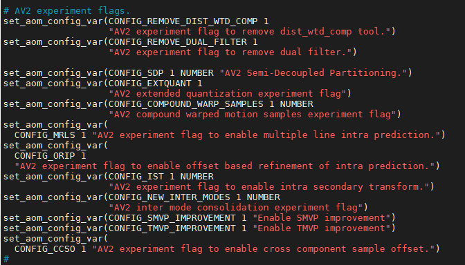

  * **DIST_WTD_COMP and DUAL_FILTER** – these AV1 coding tools were removed from AV2.
  * **SDP - Semi-Decoupled Partitioning** – is a new coding block partitioning method. Luma and Chroma share the same partitioning but only until specified partitioning depth. After this depth, partitioning patterns of luma and chroma can be optimized and signaled independently. A similar coding tool called Dual-Tree was earlier adopted into Versatile Video Coding (VVC). In both video standards, this method is only applied to key frames.
  * **EXTQUANT **– a new quantization design: 6 lookup tables for qstep are consolidated into a single one which also can be replaced with a clear exponential formula. Also, the max qstep value is increased to match HEVC in the minimum achievable bit rate.
  * **COMPOUND_WARP_SAMPLES. **AV1 introduced a Warped Motion mode, where model parameters are derived based on the motion vectors of neighboring blocks. These motion vectors are referred to as motion samples. AV1 considers only uni-predicted neighboring blocks which use precisely the same reference frame as the current block. This proposal for AV2 relaxes the motion sample selection strategy to consider compound predicted blocks as well.
  * **NEW_TX_PARTITION** – in addition to 4-way recursive partitioning, introduces new patterns:
    * 2-way horizontal
    * 2-way vertical
    * 4-way horizontal
    * 4-way vertical

As in HEVC, the same flexibility is now available for Intra coded blocks. In AV1 recursive transform split was allowed for Inter coded blocks only.

  * **MRLS - a Multiple Reference Line Selection for intra prediction** – is a method proposed for intra coded blocks, whereas farther reference lines (up to 4) above and left to current block can be used for intra prediction. MRLS is only applied to the luma component, since chroma texture is relatively smooth. For non-directional intra prediction modes, MRLS is disabled. Reference line selection is signaled into the bitstream. Similar coding tool Multiple Reference Line (MRL) was also adopted into VVC.
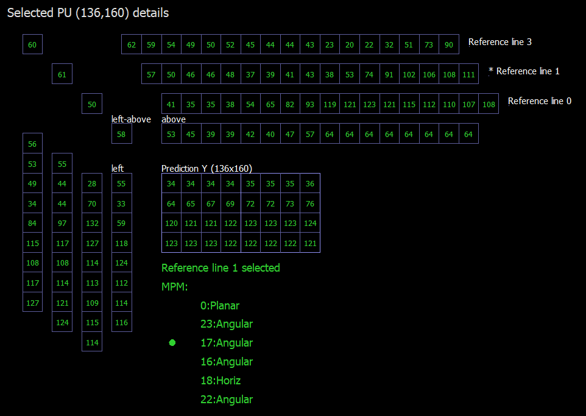

**Figure 1: Informative visualization of MRLS feature in VVC (from VQ Analyzer tool)**

  * **ORIP - offset-based intra prediction refinement** – in this method, after generating the intra prediction samples, the prediction samples are refined by adding an offset value generated using neighboring reference samples. The refinement is performed only on several lines of the predicted block's top and left boundary to reduce the discontinuity between the reference and predicted samples.   
  * **IST - Intra Secondary Transform.**
    * In AV1, separable transforms are applied to intra & inter residual samples for energy compactification and decorrelation. While non-separable transforms like the Karhunen–Loève transform (KLT) have much better decorrelation properties, they require much bigger computational resources. 
    * The idea of IST is to apply secondary non-separable transform only on the low-frequency coefficients of primary transform – we capture more directionality but maintaining low complexity.  There are 12 sets of secondary transforms, with three kernels in each set added with some restrictions based on primary transform type, block size, and it's Intra Luma only. 
    * A similar coding tool called Low-Frequency Non Separable Transform (LFNST) was earlier adopted into VVC. It is enabled for both Luma and Chroma, but only for Intra-coded blocks. 

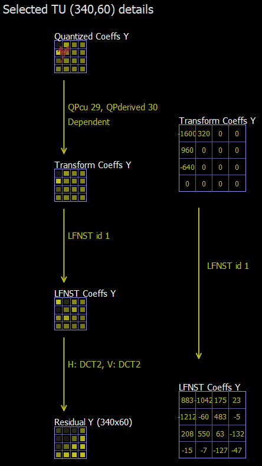

**Figure 2: Visualization of LFNST feature in VVC (from VQ Analyzer)**

  * **NEW_INTER_MODE – **harmonization and simplification of Inter modes and how they signaled into the bitstream. This contribution also changes the signaling of the DRL index to remove its dependency on motion vector parsing.
  * **SMVP & TMVP **- **Spatial and Temporal Motion Vector Prediction** – a series of improvements in the efficiency of motion vector prediction and coding.

### TMVP Improvements Compared to AV1

  * Blocks coded using a single prediction with backward reference mode can be used for generating TMVP motion field for future frames.
  * Reference frames scanning order for generating TMVP was re-designed to consider the temporal distance between reference and current frame.

### SMVP Improved Compared to AV1

  * Added temporal scaling for motion vectors of spatially neighboring blocks if they use a different reference frame than the current block.
  * A compound SMVP now can be composed of 2 difference neighboring blocks.
  * Reduced number of line buffers required for spatial neighbors scanning to simplify hardware implementations with minor effect on compression efficiency. Motion vector prediction still requires three 8×8 units’ columns from the left and only one 8×8 unit row from above (three as in AV1).
  * **CCSO – Cross Component Sample Offset** – Uses Luma channel after deblocking but before CDEF to compute an offset value. The computation involves simple filtering of Luma samples and a small lookup table. This offset value is applied on the Chroma channel after CDEF but before Loop Restoration. Several bytes are signaled at frame level to control offset computation: filter parameters, quantization step, a lookup table. At the CTU level, only one bit per 128×128 Chroma samples is signaled.

## Test Methodology and Evaluation Setup

First, we need to set up the common test conditions (CTC) – a well-defined environment and aligned test coding parameters between various encoder implementations to perform an adequate comparison. We will use the AOM CTC document with an extensive description of the best video codec performance evaluation practices to not invent the wheel.

While subjective video quality assessment is preferable, as its measurements directly anticipate the reactions of those who can view the systems being tested, it's a very complex and time-consuming process, so a more common approach is using objetive quality metrics. While it's just an approximation of the ground truth, it renders a uniform way to compare various encoders’ implementations against each other and helps to focus on creating new and better coding tools.

To prepare for our test, we need to:

  1. Select source video streams.
  2. Select quality metrics.
  3. Prepare a codec implementation model and configure its settings.

[Related:  I, P, and B-frames - Differences and Use Cases Made Easy](https://ottverse.com/i-p-b-frames-idr-keyframes-differences-usecases/)

### Source video streams selection.

Streams for CTC could be obtained here<https://media.xiph.org/video/av2ctc/test_set/>. Each video is segmented into one or another class. Those classes represent various scenarios for the codec: natural or synthetic video, screen content; high motion and static scenes; high detailed complex video, and simple plain videos.

Our article will use only SDR natural (A*) and synthetic (B1) classes of video streams. You could also find HDR and still images data sets there.

<table><tbody><tr><td><strong>Class</strong></td><td><strong>Description</strong></td></tr><tr><td>A1</td><td>4:2:0, 4K, 10 bit</td></tr><tr><td>A2</td><td>4:2:0, 1920x1080p, 8 and 10 bit</td></tr><tr><td>A3</td><td>4:2:0, 1280x720p</td></tr><tr><td>A4</td><td>4:2:0, 640x360p, 8 bit</td></tr><tr><td>A5</td><td>480x270p, 4:2:0</td></tr><tr><td>B1</td><td>Class B1, 4:2:0, various resolutions</td></tr></tbody></table>

### Quality metrics selection

We will use the following widespread objective full-reference video quality metrics: PSNR, SSIM, VMAF. Metrics implementations are provided by Netflix-developed libvmaf tool <https://github.com/Netflix/vmaf>, integrated into ViCueSoft video quality analysis tool VQProbe.

### Codec model and configuration

We will set AV1 model implementation as reference and compare it against AV2
research anchor branch. Used hash commits are provided below:

<table><tbody><tr><td><strong>Implementation name</strong></td><td><strong>Implementation hash commit</strong></td></tr><tr><td>libaom av1 master</td><td><code>48cd0c756fe7e3ffbff4f0ffc38b0ab449f44907</code></td></tr><tr><td>libaom av2 research branch&nbsp;&nbsp;</td><td><code>a1d994fb8daaf5cc9e546d668f0359809fc4aea1</code></td></tr></tbody></table>

Modern encoders have dozens of various settings, but in the real world, codecs are usually operated in several distinguished operational points, aka presets, which restricts possible settings configurations. In the article, we will evaluate the following scenarios:

  * **All Intra** (AI) – evaluation of only intra coding tools. Usual scenarios are still picture images and intermediate video storage in video editing software.
  * **Random Access** (RA) – inter coding tools and frames reordering are evaluated with intra-coding tools. The usual format for video-on-demand and video store. 

There are other scenarios that should be considered for a comprehensive evaluation, like live video streaming (usually called Low Delay), but they are outside the scope of this article.

Regarding other settings:

  * All encoding is done in fixed QP configuration mode; QP parameters are provided below. To get comparable results, we will use an approach called the Bjøntegaard metrics (see ITU VCEG-M33 and VCEG-L38). We need several operation points or quantization parameters to get several encoded streams and use them to plot the parameterized rate-distortion curve. 
  * The best quality mode – “_-CPU-used=0_” will be evaluated.
  * For A1 class tiling and threads are allowed – _“__-tile-columns=1 -threads=2 -row-mt=0__”_
  * All other settings are provided below.

<table><tbody><tr><td><strong>All Intra</strong></td></tr><tr><td>QP</td><td><em><code>--cq-level</code></em></td><td>15, 23, 31, 39, 47, 55</td></tr><tr><td>Fixed parameters</td><td><em><code>--cpu-used=0 --passes=1 --end-usage=q --kf-min-dist=0 --kf-max-dist=0 --use-fixed-qp-offsets=1 --deltaq-mode=0 --enable-tpl-model=0 --enable-keyframe-filtering=0 –obu –limit=30</code></em></td></tr><tr><td><strong>Random Access</strong></td></tr><tr><td>QP</td><td><em><code>--cq-level</code></em></td><td>23, 31, 39, 47, 55, 63</td></tr><tr><td>Fixed parameters</td><td><em><code>--cpu-used=0&nbsp; --passes=1 --lag-in-frames=19 --auto-alt-ref=1 --min-gf-interval=16 --max-gf-interval=16 --gf-min-pyr-height=4 --gf-max-pyr-height=4 --limit=130 --kf-min-dist=65 --kf-max-dist=65 --use-fixed-qp-offsets=1 --deltaq-mode=0 --enable-tpl-model=0 --end-usage=q&nbsp; --enable-keyframe-filtering=0 --obu</code></em></td></tr></tbody></table>

## Codec Evaluation

This section describes actual steps done for evaluation. It describes the environment and configuration of all tools.

### System configuration

  * Ubuntu 21.04
  * GCC 10.3.0
  * AMD Ryzen Threadripper 3960X   
  * DDR4 [[email protected]](/cdn-cgi/l/email-protection) 2667 MHz

### Codec configuration

Encoder preparation is pretty simple: for AV1, we checkout the "master" branch, and for AV2 research – research2 branch.

Building step is straightforward with CMake and make calls. See <https://aomedia.googlesource.com/aom> for details.

### Streams configuration

Streams are in *.y4m container that is natively supported by all tools, so there is no need for any other conversions.

### Test Data Set Preparation

Having all inputs prepared, it`s time to use Testbot-engine. Testbot is a video codecs' validation automation framework developed by our team at [ViCueSoft](https://vicuesoft.com/). It allows us to run outer software iterating over parameters and streams, monitor its execution, and control its output. More information about Framework configuration and its possibilities is [here](https://medium.com/vicuesoft-techblog/testbot-vicuesofts-video-codecs-validation-automation-framework-dc72f977f928).

We need to produce `N` set of streams for each scenario, where`N=<streams>*<qp values>` using settings from the previous section.

### Quality Metrics Data Calculation

To get Bjøntegaard metrics parameterized rate-distortion curve, we need to calculate a point for a 2-D plot. We have the actual bitrate on the X-axis and on Y-axis  -  the distortion (aka quality metric output).

Real bitrate is calculated using the formula:

    bitrate= <stream size>*<stream frame per second><number of frames in stream>

For metrics calculation, we will use VQProbe - a professional tool for video quality measurement that wraps `libvmaf` and thus supports the commonly used quality metrics, such as PSNR, SSIM, VMAF. You can get more information about VQProbe [here](https://vicuesoft.com/vq-probe/).

We use console interface of VQProbe that can be seamlessly integrated into automated test pipelines. Let’s configure VQProbe:

**Create a project for each stream:**

_`./VQProbeConsole --create {:stream.name}.{:qp}.{:codec}`_

**Add decoded streams:**

_`./VQProbeConsole -a {dec_dir}/{:stream.name}.{:qp}.{:codec}.y4m -p {:stream.name}.{:qp}.{:codec}.vqprb`_

**Add reference stream:**

_`./VQProbeConsole -t ref -a {media_root}/{:stream.path} -p {:stream.name}.{:qp}.{:codec}.vqprb`_

**Calculate quality metrics:**

_`./VQProbeConsole -d {metrics_dir} -p {:stream.name}.{:qp}.{:codec}.vqprb`_

VQProbe could generate metrics in *.json (better for automation) and *.csv (more readable) formats.

All metrics, average and per-frame can be easily visualized in VQ Probe:

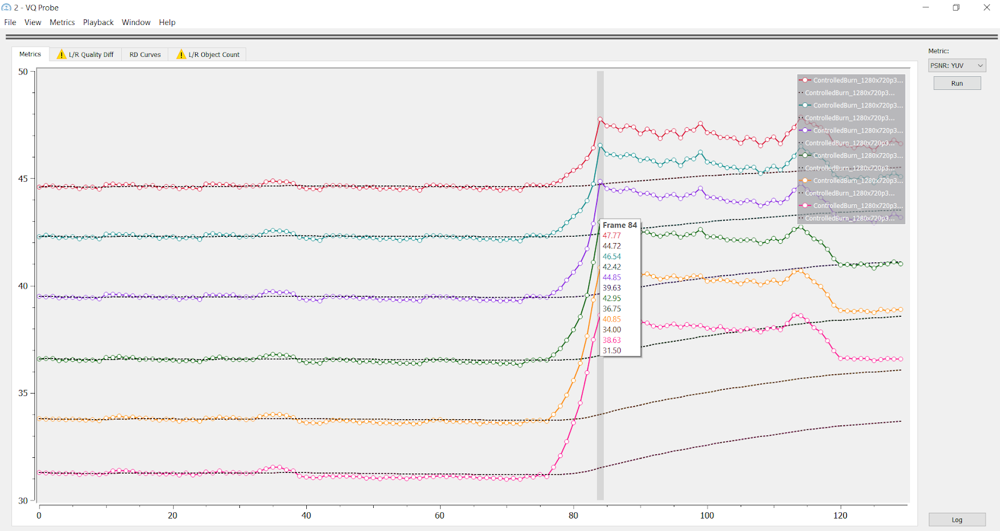

## Metrics results interpretation

The main idea now is to estimate the area between these two curves to compute an average bit rate savings for equal measured quality - the Bjøntegaard-delta rate (BD-rate). This is done with the help of a piecewise cubic fitting of the curves, where the bit rate is measured in the log domain, and integration determines the area between the two curves.

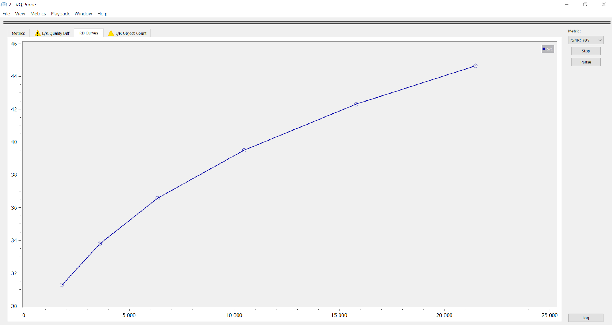

**Figure 3: Example of rate-distortion curve from VQ Probe**

## AV2 Research Experimental Results

Averaging BD-rate values across streams in each class, we get the following results:

**Reference: AV1 CPU usage 0.**

### For AI scenario

<table><tbody><tr><td>class</td><td><strong>PSNR</strong></td><td><strong>SSIM</strong></td><td><strong>VMAF</strong></td></tr><tr><td>A1</td><td>-6.07</td><td>-6.59</td><td>-6.49</td></tr><tr><td>A2</td><td>-6.74</td><td>-7.16</td><td>-8.35</td></tr><tr><td>A3</td><td>-6.64</td><td>-5.91</td><td>-7.33</td></tr><tr><td>A4</td><td>-8.28</td><td>-8.62</td><td>-10.18</td></tr><tr><td>A5</td><td>-6.06</td><td>-4.88</td><td>-4.73</td></tr><tr><td>B1</td><td>-7.52</td><td>-8.11</td><td>-7.24</td></tr><tr><td><strong>Average</strong></td><td><strong>-6.88</strong></td><td><strong>-6.88</strong></td><td><strong>-7.39</strong></td></tr></tbody></table>

#### For RA scenario

<table><tbody><tr><td>class</td><td><strong>PSNR</strong></td><td><strong>SSIM</strong></td><td><strong>VMAF</strong></td></tr><tr><td>A1</td><td>-5.27</td><td>-5.55</td><td>-5.97</td></tr><tr><td>A2</td><td>-4.22</td><td>-4.60</td><td>-4.17</td></tr><tr><td>A3</td><td>-4.7</td><td>-5.23</td><td>-5.29</td></tr><tr><td>A4</td><td>-5.08</td><td>-7.46</td><td>-7.66</td></tr><tr><td>A5</td><td>-3.73</td><td>-4.3</td><td>-3.5</td></tr><tr><td>B1</td><td>-1.12</td><td>-2.61</td><td>-1.69</td></tr><tr><td><strong>Average</strong></td><td>-4.02</td><td>-4.95833</td><td>-4.71333</td></tr></tbody></table>

## Conclusion

An extensive performance evaluation of the new coding tools candidates of AV2 research branch against libaom AV1 encoder is presented and discussed.

Evaluation was done in single pass fixed QP mode in random-access and all-intra scenarios. According to the experimental results, the coding efficiency, even in such an early stage, shows solid gain against libaom AV1.

Notably, for **Intra** tools, it offers average 7% bitrate savings in terms of VMAF metrics on a wide range of natural and synthetic video content, while in combination with inter coding tools – 4.7%.

Due to limited availability of computing resources, complexity evaluation wasn’t evaluated, but rough approximation shows only 1.2x times encoding compleixrt increase and 1.4x time decoding, which shows that the researches of the new standrat am very careful with the complexity of the new features.

New coding tools lie well in the classic hybrid video compression structure, enhancing inter, intra coding, transform, post-filtering, and so on. Several intersections with VVC coding tools have already proved their efficiency and allowed to reduce the tools' investigation time.  

**All evaluation was possible with the great help of ViCueSoft's VQ Probe and test automation frameworks. That flexibility allows seamless integration and building of automated test pipelines for a complex video codec quality evaluation. **

## References

  1. Xin Zhao, Zhijun (Ryan) Lei, Andrey Norkin, Thomas Daede, Alexis Tourapis  “AV2 Common Test Conditions v1.0”
  2. Alliance for Open Media, Press Release Online: <http://aomedia.org>
  3. ISO/IEC 23090-3:2021 Information technology — Coded representation of immersive media — Part 3: Versatile video coding
  4. Peter de Riva, Jack Haughton “AV1 Bitstream & Decoding Process Specification”
  5. G. Bjøntegaard, “Calculation of average PSNR differences between RD-Curves,” ITU-T SG16/Q6, Doc. VCEG-M33, Austin, Apr. 2001.
  6. ViCueSoft blog “Objective and Subjective video quality assessment” <https://vicuesoft.com/blog/titles/objective_subjective_vqa>
  7. ViCueSoft blog “Testbot — ViCueSoft’s video codecs validation automation framework” <https://vicuesoft.com/blog/titles/testbot/>
  8. Git repositories on aomedia, Online: <https://aomedia.googlesource.com/>
  9. Test sequences:  <https://media.xiph.org/video/av2ctc/test_set/>
  10. VQProbe: <https://vicuesoft.com/vq-probe>
  11. Michel Kerdranvat, Ya Chen, Rémi Jullian, Franck Galpin, Edouard François “The video codec landscape in 2020” InterDigital R&D

