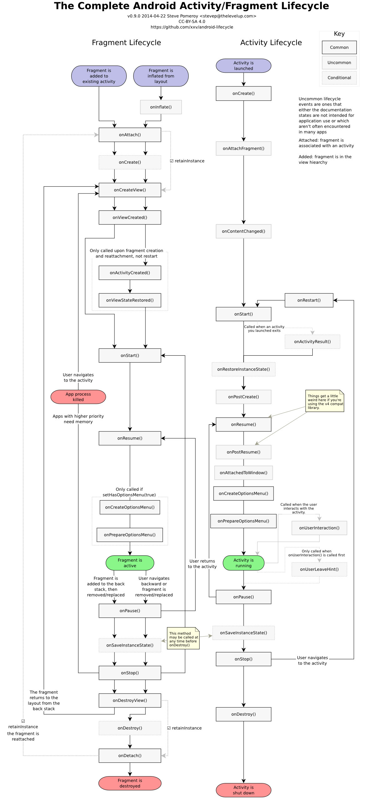
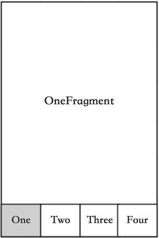
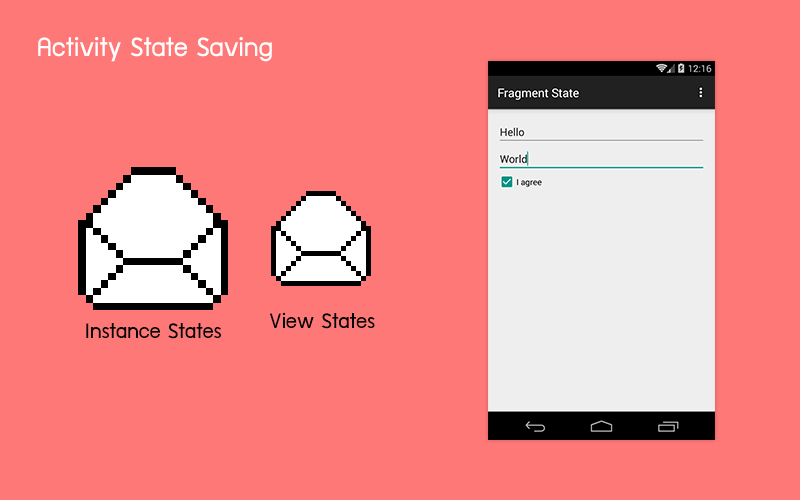
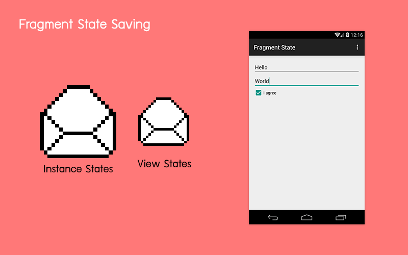
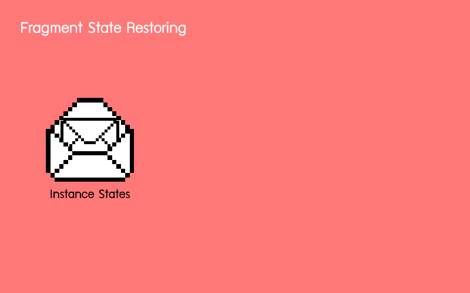
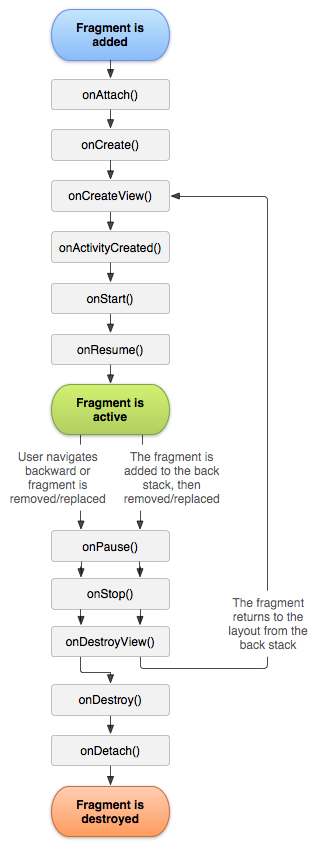
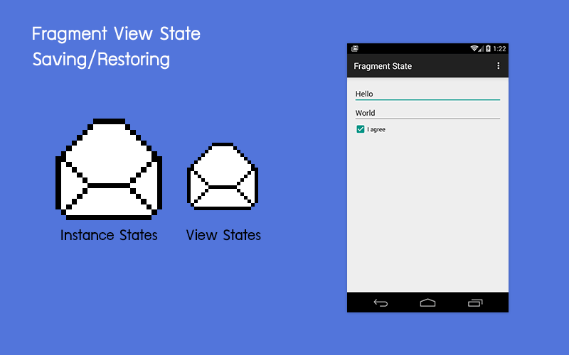
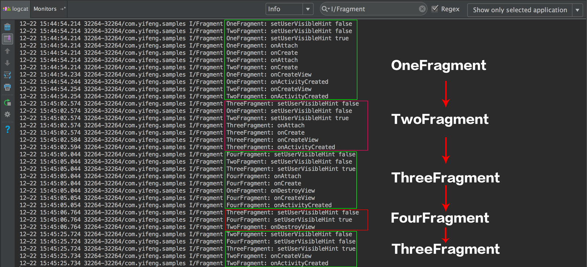
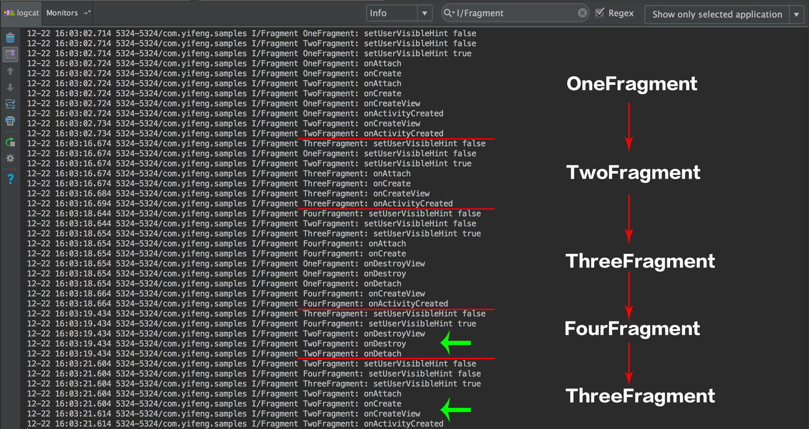

 
<!--BEGIN_DATA
{
    "create_date": "2017-01-10 13:21", 
    "modify_date": "2017-01-10 13:21", 
    "is_top": "0", 
    "summary": "Android Fragment 的使用", 
    "tags": "Android", 
    "file_name": "Android Fragment 的使用.md"
}
END_DATA-->

####
原文出处：<a href='http://yifeng.studio/2016/12/15/android-fragment-attentions/' target='blank'>Android Fragment 的使用，一些你不可不知的注意事项</a>

Fragment，俗称碎片，自 Android 3.0 开始被引进并大量使用。然而就是这样耳熟能详的一个东西，在开发中我们还是会遇见各种各样的问题，层出不穷。所以，是时候总结一波了。

##Fragment 简介

作为 Activity 界面的一部分，Fragment 的存在必须依附于 Activity，并且与 Activity 一样，拥有自己的生命周期，同时处理用户的交互动作。同一个 Activity 可以有一个或多个 Fragment 作为界面内容，并且可以动态添加、删除
Fragment，灵活控制 UI 内容，也可以用来解决部分屏幕适配问题。

另外，support v4 包中也提供了 Fragment，兼容 Android 3.0 之前的系统（当然，现在 3.0之前的系统在市场上已经很少见了，可以不予考虑），使用兼容包需要注意两点：

  * Activity 必须继承自 FragmentActivity；

  * 使用 getSupportFragmentManager() 方法获取 FragmentManager 对象；

##生命周期

作为宿主 Activity 的一部分，Activity 拥有的大部分生命周期函数在 Fragment 中同样存在，并与 Activity 保持同步。同时，作为一个特殊情况的存在，Fragment 也有一些自己的生命周期函数，如 onAttach()、onCreateView() 等。

至于 Activity 与 Fragment 之间生命周期函数的对应同步关系，来自 GitHub 的 [xxv/android-lifecycle](https://github.com/xxv/android-lifecycle) 项目用了一幅图完美地予以展示：

关于 Fragment 各个生命周期函数的意义，这里就不一一叙述，可以参考官网介绍：[Fragment Lifecycle](https://developer.android.com/reference/android/app/Fragment.html)。

##创建实例

像普通的类一样，Fragment 拥有自己的构造函数，于是我们可以像下面这样在 Activity 中创建 Fragment 实例：
    
    
    MainFragment mainFragment = new MainFragment();  
    

如果需要在创建 Fragment 实例时传递参数进行初始化的话，可以创建一个带参数的构造函数，并初始化 Fragment 成员变量等。这样做，看似没有问题，但在一些特殊状况下还是有问题的。

我们知道，Activity 在一些特殊状况下会发生 destroy 并重新 create 的情形，比如屏幕旋转、内存吃紧时；对应的，依附于 Activity 存在的 Fragment 也会发生类似的状况。而一旦重新 create 时，Fragment 便会调用默认的无参构造函数，导致无法执行有参构造函数进行初始化工作。

好在 Fragment 提供了相应的 API 帮助我们解决这个问题。利用 bundle 传递数据，参考代码如下：
    
    public static OneFragment newInstance(int args){  
        OneFragment oneFragment = new OneFragment();  
      
        Bundle bundle = new Bundle();  
        bundle.putInt("someArgs", args);  
      
        oneFragment.setArguments(bundle);  
        return oneFragment;  
    }  
      
    @Override  
    public void onCreate(@Nullable Bundle savedInstanceState) {  
        super.onCreate(savedInstanceState);  
      
        Bundle bundle = getArguments();  
        int args = bundle.getInt("someArgs");  
    }  
    

##嵌入方式

Activity 嵌入 Fragment 分为布局静态嵌入和代码动态嵌入两种。前者在 Activity 的 Layout 布局中使用`<fragment>` 标签嵌入指定 Fragment，如：
    
    <?xml version="1.0" encoding="utf-8"?>  
    <LinearLayout xmlns:android="http://schemas.android.com/apk/res/android"  
        android:layout_width="match_parent"  
        android:layout_height="match_parent"  
        android:orientation="vertical">  
      
        <fragment  
            android:layout_width="match_parent"  
            android:layout_height="match_parent"  
            class="com.yifeng.samples.OneFragment"/>  
      
    </LinearLayout>  
    

后者在 Activity 的 Java 代码中借助管理器类 FragmentManager 和 事务类 FragmentTransaction 提供的 replace() 方法替换 Activity 的 Layout 中的相应容器布局，如：

    
    FragmentManager fm = getFragmentManager();  
    FragmentTransaction ft = fm.beginTransaction();  
    ft.replace(R.id.fl_content, OneFragment.newInstance());  
    ft.commit();  
    

这两种嵌入方式对应的 Fragment 生命周期略有不同，从生命周期图中可以看出。相比布局静态嵌入方式，代码动态嵌入方式更为常用，毕竟后者能够实现灵活控制多个 Fragment，动态改变 Activity 中的内容。

##getChildFragmentManager()

像上面这样，在 Activity 嵌入 Fragment 时，需要使用 FragmentManager，通过 Activity 提供的 getFragmentManager() 方法即可获取，用于管理 Activity 里面嵌入的所有一级 Fragment。

然而有时候，我们会在 Fragment 里面继续嵌套二级甚至三级 Fragment，即 Activity 嵌套多级 Fragment。此时在 Fragment 里管理子 Fragment 时，也需要使用到 FragmentManager。但是一定要使用 getChildFragmentManager() 方法获取 FragmentManager 对象！

从官方文档注释上也可以看出这两个方法获取到的 FragmentManager 对象的区别：

Activity：getFragmentManager()

> Return the FragmentManager for interacting with fragments associated with this activity.

Fragment：getChildFragmentManager()

> Return a private FragmentManager for placing and managing Fragments inside of this Fragment.

##FragmentTransaction

Fragment 的动态添加、删除等操作都需要借助于 FragmentTransaction 类来完成，比如上面提到的 replace() 操作。FragmentTransaction 提供有很多方法供开发人员操作 Activity 里面的 Fragment，具体可以参考官网介绍：[FragmentTransaction Public methods](https://developer.android.com/reference/android/app/FragmentTransaction.html#pubmethods)，这里介绍几个常用的关键方法：

  * add() 系列：添加 Fragment 到 Activity 界面中；

  * remove()：移除 Activity 中的指定 Fragment；

  * replace() 系列：通过内部调用 remove() 和 add() 完成 Fragment 的修改； 

  * hide() 和 show()：隐藏和显示 Activity 中的 Fragment；

  * addToBackStack()：添加当前事务到回退栈中，即当按下返回键时，界面回归到当前事物状态；

  * commit()：提交事务，所有通过上述方法对 Fragment 的改动都必须通过调用 commit() 方法完成提交；

> 注意：动态切换显示 Activity 中的多个 Fragment 时，可以通过 replace() 实现，也可以 hide() 和 show() 方法实现。事实上，我们更倾向于使用后者，因为 replace() 方法不会保留 Fragment 的状态，也就是说诸如 EditText 内容输入等用户操作在 remove() 时会消失。当然，如果你不想保留用户操作的话，可以选择前者，视情况而定。

##BackStack（回退栈）

通过 addToBackStack() 保存当前事务，当用户按下返回键时，如果回退栈中保存有之前的事务，便会执行事务回退，而不是 finish 掉当前 Activity。

举个例子，比如 App 中有一个新用户注册功能，包括设置用户名、密码、手机号等等流程，设计师在 UI 设计上将每个流程单独设计成一个界面，引导用户一步步操作。作为开发人员，如果将每一个完善信息的流程单独设置成一个 Activity 的话操作起来就比较繁琐，并且也不易于应用里的逻辑处理，而如果使用 Fragment 并结合回退栈的话，就非常合适了。

将每一个设置的流程写成一个 Fragment，通过状态控制显示不同的 Fragment，并利用回退栈实现返回上一步操作的功能。比如从 FirstStepFragment 进入 SecondStepFragment 时，比如可以在 LoginActivity.java 中这样操作：
    
    FragmentManager fm = getSupportFragmentManager();  
    FragmentTransaction ft = fm.beginTransaction();  
    ft.hide(firstStepFragment);  
    if (secondStepFragment==null){  
        ft.add(R.id.fl_content, secondStepFragment);  
    }else {  
        ft.show(secondStepFragment);  
    }  
    ft.addToBackStack(null);  
    ft.commit();  
    

> 注意：这里使用了 hide() 方法，而不是 replace() 方法，因为我们当然希望用户返回上一步操作时，之前设置的内容不会消失。

##通信方式

通常，Fragment 与 Activity 通信存在三种情形：Activity 操作内嵌的 Fragment，Fragment 操作宿主 Activity，Fragment 操作同属 Activity中的其他 Fragment。

由于 Activity 持有所有内嵌的 Fragment 对象实例（创建实例时保存的 Fragment 对象，或者通过 FragmentManager 类提供的 findFragmentById() 和 findFragmentByTag() 方法也能获取到 Fragment 对象），所以可以直接操作
Fragment；Fragment 通过 `getActivity()` 方法可以获取到宿主 Activity 对象（强制转换类型即可），进而可以操作宿主 Activity；那么很自然的，获取到宿主 Activity 对象的 Fragment 便可以操作其他 Fragment 对象。

虽然上述操作已经能够解决 Activity 与 Fragment 的通信问题，但会造成代码逻辑紊乱的结果，极度不符合这一编程思想：高内聚，低耦合。Fragment 做好自己的事情即可，所有涉及到 Fragment 之间的控制显示等操作，都应交由宿主 Activity 来统一管理。

所以我们强烈推荐，使用对外开放接口的形式将 Fragment 的一些对外操作传递给宿主 Activity。具体实现方式如下：

      public class OneFragment extends Fragment implements View.OnClickListener{  
      
        public interface IOneFragmentClickListener{  
            void onOneFragmentClick();  
        }  
      
        @Nullable  
        @Override  
        public View onCreateView(LayoutInflater inflater, @Nullable ViewGroup container, @Nullable Bundle savedInstanceState) {  
            View contentView = inflater.inflate(R.layout.fragment_one, null);  
            contentView.findViewById(R.id.edt_one).setOnClickListener(this);  
            return contentView;  
        }  
      
        @Override  
        public void onClick(View v) {  
            if (getActivity() instanceof IOneFragmentClickListener){  
                 ((IOneFragmentClickListener) getActivity()).onOneFragmentClick();  
            }  
        }  
      
    }  
    

只要在宿主 Activity 实现 Fragment 定义的对外接口 IOneFragmentClickListener，便可以实现 Fragment 调用 Activity 的功能。

当然，你可以这样做:

       
    public class OneFragment extends Fragment implements View.OnClickListener{  
          
        private IOneFragmentClickListener clickListener;  
      
        public interface IOneFragmentClickListener{  
            void onOneFragmentClick();  
        }  
      
        public void setClickListener(IOneFragmentClickListener clickListener) {  
            this.clickListener = clickListener;  
        }  
      
        @Nullable  
        @Override  
        public View onCreateView(LayoutInflater inflater, @Nullable ViewGroup container, @Nullable Bundle savedInstanceState) {  
            View contentView = inflater.inflate(R.layout.fragment_one, null);  
            contentView.findViewById(R.id.edt_one).setOnClickListener(this);  
            return contentView;  
        }  
      
        @Override  
        public void onClick(View v) {  
            clickListener.onOneFragmentClick();  
        }  
      
    }  
    

原理是一样的，只是相比第一种方式，需要在宿主 Activity 中额外添加一步监听设置：
    
    oneFragment.setClickListener(this);  
    

##getActivity() 引用问题

使用中，经常会在 Fragment 中通过 `getActivity()` 获取到宿主 Activity 对象，但稍有不慎便会引发下面这两个问题：

第一个， Activity 的实例销毁问题。比如，Fragment 中存在类似网络请求之类的异步耗时任务，当该任务执行完毕回调 Fragment 的方法并用到宿主 Activity 对象时，很有可能宿主 Activity 对象已经销毁，从而引发 NullPointException
等异常，甚至造成程序崩溃。所以，异步回调时需要注意添加空值等判断（譬如：fragment.isAdd()，getActivity()!＝null等），或者在 Fragment 创建实例时就通过 `getActivity().getApplicationContext()`方法保存整个应用的上下文对象，再来使用；

第二个，内存泄漏问题。如果 Fragment 持有宿主 Activity 的引用，会导致宿主 Activity 无法回收，造成内存泄漏。所以，如果可以的话，尽量不要在 Fragment 中持有宿主 Activity 的引用。

为了解决 Context 上下文引用的问题，Fragment 提供了一个 onAttach(context) 方法，在此方法中我们可以获取到 Context 对象，如：

    @Override  
    public void onAttach(Context context) {  
        super.onAttach(context);  
        this.context = context;  
    }  
    

事实上，经网友提醒，Fragment 也提供了 `getContext()` 方法，返回一个 Context 上下文对象，如果不是一定要使用具体的宿主 Activity 对象的话，可以使用这个方法获取 Context 对象。

##Fragment 重叠问题

前面我们介绍 Fragment 初始化时提到 Activity 销毁重建的问题，试想一下，当 Activity 重新执行 onCreate() 方法时，是不是会再次执行 Fragment 的创建和显示等操作呢？而之前已经存在的 Fragment 实例也会销毁再次创建，这不就与 Activity 中 onCreate() 方法里面第二次创建的 Fragment 同时显示从而发生 UI 重叠的问题了吗？

根据经验，通常我们会在 AndroidManifest 里将 Activity 设置为横屏模式，所以不会由于屏幕旋转导致这种问题的出现。一种比较多的出现方式是，应用长时间处于后台，但由于设备内存吃紧，导致 Activity 被销毁，而当用户再次打开应用时便会发生 Fragment 重叠的问题。但是这种问题在开发阶段由于应用的频繁使用导致我们很难遇见，但确确实实存在着。所以开发过程中，一定要注意这类问题。

知道问题的根源所在之后，对应的解决方案也就有啦。就是在 Activity 中创建 Fragment 实例时，添加一个判断即可，处理方式有三种：

第一种方式，在 Activity 提供的 onAttachFragment() 方法中处理：

     
    @Override  
    public void onAttachFragment(Fragment fragment) {  
        super.onAttachFragment(fragment);  
        if (fragment instanceof  OneFragment){  
            oneFragment = (OneFragment) fragment;  
        }  
    }  
    

第二种方式，在创建 Fragment 前添加判断，判断是否已经存在：
    
    Fragment tempFragment = getSupportFragmentManager().findFragmentByTag("OneFragment");  
    if (tempFragment==null) {  
        oneFragment = OneFragment.newInstance();  
        ft.add(R.id.fl_content, oneFragment, "OneFragment");  
    }else {  
        oneFragment = (OneFragment) tempFragment;  
    }  
    

第三种方式，更为简单，直接利用 savedInstanceState 判断即可：
    
    
    if (savedInstanceState==null) {  
        oneFragment = OneFragment.newInstance();  
        ft.add(R.id.fl_content, oneFragment, "OneFragment");  
    }else {  
        oneFragment = (OneFragment) getSupportFragmentManager().findFragmentByTag("OneFragment");  
    }  
    

##onActivityResult()

Fragment 类提供有 startActivityForResult() 方法用于 Activity 间的页面跳转和数据回传，其实内部也是调用 Activity 的对应方法。但是在页面返回时需要注意 Fragment 没有提供 setResult() 方法，可以通过宿主 Activity 实现。

举个例子，在 ActivityA 中的 FragmentA 里面调用 startActivityForResult() 跳转至 ActivityB 中，并在 ActivityB 中的 FragmentB 里面返回到 ActivityA，返回代码如下：

    Intent intent = new Intent();  
    // putExtra  
    getActivity().setResult(Activity.RESULT_OK, intent);  
    getActivity().finish();  
    

在回调时，先会回调 ActivityA 中的 onActivityResult() 方法，然后再分发回调 FragmentA 中的 onActivityResult() 方法，从 FragmentActivity 类的源码中可以看出：
    
    /**  
    * Dispatch incoming result to the correct fragment.  
    */  
    @Override  
    protected void onActivityResult(int requestCode, int resultCode, Intent data) {  
        mFragments.noteStateNotSaved();  
        int requestIndex = requestCode>>16;  
        if (requestIndex != 0) {  
            requestIndex--;  
      
            String who = mPendingFragmentActivityResults.get(requestIndex);  
            mPendingFragmentActivityResults.remove(requestIndex);  
            if (who == null) {  
                Log.w(TAG, "Activity result delivered for unknown Fragment.");  
                return;  
            }  
            Fragment targetFragment = mFragments.findFragmentByWho(who);  
            if (targetFragment == null) {  
                Log.w(TAG, "Activity result no fragment exists for who: " + who);  
            } else {  
                targetFragment.onActivityResult(requestCode & 0xffff, resultCode, data);  
            }  
            return;  
        }  
      
        super.onActivityResult(requestCode, resultCode, data);  
    }  
    

再拓展一下，如果 FragmentA 中又嵌入一层 FragmentAA ，然后从 FragmentAA 中跳转至 ActivityB，那么在 FragmentAA 中的 onActivityResult() 方法中能收到回调吗？显然不能。从上述源码中可以看出 FragmentActivity 只进行到一级分发。所以，如果想实现多级分发，就得自己在各级 Fragment 中手动添加分发代码，至下一级 Fragment 中。

##状态变迁监听

Fragment 的 hide 和 show 等状态变迁操作都会反应在相应的回调函数中，我们可以利用这些监听函数做一些界面刷新等功能。较为常见的一个监听函数就是 onHiddenChanged() 方法，这个方法的变化直接影响着 isHidden() 方法的返回值。

除了 isHidden() 方法，还有一个 isVisible() 方法，也用于判断 Fragment 的状态，表明 Fragment 是否对用户可见，如果为 true，必须满足三点条件：1，Fragment 已经被 add 至 Activity 中；2，视图内容已经被关联到 window 上；3. 没有被隐藏，即 isHidden() 为 false。这三点，从 isVisible() 源码中可以看出：
    
    /**  
    * Return true if the fragment is currently visible to the user.  This means  
    * it: (1) has been added, (2) has its view attached to the window, and   
    * (3) is not hidden.  
    */  
    final public boolean isVisible() {  
        return isAdded() && !isHidden() && mView != null  
            && mView.getWindowToken() != null && mView.getVisibility() == View.VISIBLE;  
    }  
    

其中，尤其需要注意 `mView.getWindowToken() != null` 这个条件，有时候我们需要在 onCreate() 或者 onResume() 方法中使用 `isVisible()` 判断 Fragment 的状态，但是经常遇见 `isVisible()` 为 false 的情况，很大一个原因就是因为 mView.getWindowToken() 为 null 导致的！

> 注意：onHiddenChanged() 方法可以监听 hide() 和 show() 操作，与 setUserVisibleHint() 方法有所不同，后者常见的出现场景是在 ViewPager 和 Fragment 组合的 FragmentPagerAdapter 中使用。ViewPager 滑动时便是通过这个方法改变 Fragment 的状态，利用这个方法可以实现 Fragment 懒加载，后续文章中再详细描述实现方式。

下面举个常见的例子，如图：

这种 UI 结构想必大家都很熟悉，经常作为 App 的首页主界面布局，这里我们假设没有使用 ViewPager，而是普通操作 Fragment，通过 add()、show()、hide() 方法实现切换不同 Tab 控制 Activity 里面各个 Fragment 的显示和隐藏。并且这四个 Fragment 都需要通过加载网络数据显示内容，同时要求不同 Fragment 之间切换显示时都要重新请求服务器刷新当前界面的数据，这该怎么做呢？

这里有好几种情况要考虑：

第一种，在四个 Fragment 都已经显示过的情况下，不同 Tab 切换时，当前 Fragment 的 onResume() 方法不会被调用，需要在 onHiddenChanged() 方法中请求服务器；

第二种，从其他 Activity 返回这个 Activity 时，当前 Fragment 不会调用 onHiddenChanged() 方法，需要在 onResume() 方法中请求服务器；

第三种，类似第二种场景，不同的是其他 Activity 返回时，还指定切换至处于隐藏状态的另一个 Fragment，对于这个 Fragment 来说，onResume() 和 onHiddenChanged() 方法都会被调用；

综上所述，为了实现切换刷新操作，必须在 onResume() 和 onHiddenChanged()
方法中请求服务器。但是还得避免重复多次请求服务器操作，必须在两个方法中添加状态判断，只有对用户可见时，才刷新界面。示例代码如下：

    
    @Override  
    public void onResume() {  
        super.onResume();  
        if (isVisible()){  
            // 发起网络请求, 刷新界面数据  
            requestData();  
        }  
    }  
      
    @Override  
    public void onHiddenChanged(boolean hidden) {  
        super.onHiddenChanged(hidden);  
        // 这里的 isResumed() 判断就是为了避免与 onResume() 方法重复发起网络请求  
        if (isVisible() && isResumed()){  
            requestData();  
        }  
    }  
    

这种写法需要注意的是，第一个 Fragment，也就是图中的 OneFragment，必须在 create 时调用一次 requestData() 操作，如前面所说，此时 onResume() 方法中的 isVisible() 值为 false；其他 Fragment 则可以不用这么做，因为
isVisible() 值为 true。

最后，还有一种特殊情况需要处理，就是系统由于内存不足时杀掉 App 的情况。如果当前显示的不是第一个 Fragment，App 被杀掉再次重启时，显示这个 Fragment 时，isVisible() 的判断始终为 false，这种情况下刷新数据的操作，还要额外处理，比如引入这个判断：    
    
    @Override  
    public void onActivityCreated(@Nullable Bundle savedInstanceState) {  
        super.onActivityCreated(savedInstanceState);  
        if (savedInstanceState!=null){  
            requestData();  
        }  
    }  
    

当然，这只是一种处理方式，有其独特的适应场景。其他应用场景，有其他的对应解决方案。可以看出，Fragment 的使用一定要多加注意，三思而后行，稍有不慎，就写了个坑！

##模拟系统内存不足

现在市场上的安卓机内存越来越充足，系统由于内存不足而导致应用被杀掉的情况不是很常见，所以这种情景很难人工重现，但开发测试阶段又需要重现这种场景处理一些特殊情 况，怎么办呢？无意中从这篇文章 [Don’t Store Data in the Application Object](http://www.developerphil.com/dont-store-data-in-the-application-object/) 中找到一个解决方案，我们可以通过 adb shell 命令手动杀掉我们的应用，模拟这个场景。

首先，确保你的应用运行在模拟器或者 Root 过的真机设备上，并且是可调试的，然后按下 Home 键将应用退出到后台，打开终端，依次执行如下命令：

    
    ##find the process id  
    adb shell ps  
    ##then find the line with the package name of your app  
      
    ##Mac/Unix: save some time by using grep:  
    adb shell ps | grep your.app.package  
      
    ##The result should look like:  
    ##USER      PID   PPID  VSIZE  RSS     WCHAN    PC         NAME  
    ##u0_a198   21997 160   827940 22064 ffffffff 00000000 S your.app.package  
      
    ##Kill the app by PID  
    adb shell kill -9 21997  
      
    ##the app is now killed  
    

##参考链接

从上面这些介绍中可以看出，Fragment 虽然使用起来很方便，但却存在很多问题，用久了你就会发现，有踩不完的坑等着你。当然，每个坑都有对应的解决方案，Google
一下，遍地开花，总能找到你所需要的内容。譬如这些系列文章，满是干货：

  * [Android Fragment完全解析，关于碎片你所需知道的一切](http://blog.csdn.net/guolin_blog/article/details/8881711)

  * [Android Fragment 你应该知道的一切](http://blog.csdn.net/lmj623565791/article/details/42628537)

 ####
原文出处：<a href='http://yifeng.studio/2016/12/19/android-fragment-state-saving-best-practices/' target='blank'>［译］Android Activity 和 Fragment 状态保存与恢复的最佳实践</a>

>**译者亦枫注：**对于 Activity、Fragment 和 View 是如何保存与恢复状态的问题，相信很多开发人员都处于一知半解的状态。最近刚好在总结 [Fragment 的使用注意事项](http://yifeng.studio/2016/12/15/android-fragment-attentions/)，无意中从网上看到国外的一篇好文，对这个问题做了一个全面的解析。加之使用可视化的动画效果，使我们理解起来更加轻松。拜读过后，豁然开朗，同时不得不感慨，国外作者对于知识通透的理解能力和写作清晰的表达能力。然后，然后就一定要翻译过来，加以学习并保存记录之。
>
>**原文：**[The Real Best Practices to Save/Restore Activity’s and Fragment’s state. (StatedFragment is now deprecated)](https://inthecheesefactory.com/blog/fragment-state-saving-best-practices/en)
>
>**作者：**「nuuneoi」，一名拥有六年安卓应用程序开发经验和超过十二年手机端应用开发行业经验的全栈工程师。

 几个月前我发表了一篇有关 Fragment 状态保存和恢复的文章：[可能是目前为止保存和恢复 Fragment 状态的最佳方式](https://inthecheesefactory.com/blog/best-approach-to-keep-android-fragment-state/en)（亦枫注：该文章已被删除，但 GitHub 上依然保有代码实现，可参考 [StatedFragment](https://github.com/nuuneoi/StatedFragment)。另外，我发现中外作者在标题设定上怎么套路都是一致的^_^）。这篇文章收到了来自世界各地安卓开发人员的较有价值的反馈。非常感谢你们 =)

无论如何，`StatedFragment` 打破了常规设计模式，以一种不同的方式实现，就像 Android 设计 Fragment之初就假定能够让安卓开发人员更容易理解 Fragment 的状态保存和恢复，如同 Activity 的做法一样（View 状态与 Instance 状态同时变迁）。所以我做了一个实验，开发出 `StatedFragment` 并看看到底能发展成怎样。是否更容易理解？这种模式是否更加利于开发？

 **此刻，经历了两个月的实践，我想我已经得到了结果。尽管 `StatedFragment` 理解起来稍微容易一些，但还是遇到了一个大问题。`StatedFragment` 打破了 Android View 架构的设计模式，所以我想这会导致一个长久的负面问题。事实上，我已经开始感觉到我的代码有些怪怪的了……**

出于这个原因，**我决定从现在开始废弃 `StatedFragment`**。同时为了对这个错误的出现表示歉意，我写下这篇博文，向你们展示如何用 Android 的设计方式保存和恢复 Fragment 状态的最佳实践。

 ##理解 Activity 状态保存和恢复时发生了什么

 当 Activity 的 `onSaveInstanceState` 方法被调用时，Activity 会自动收集 View Hierachy（视图层次）中每一个 View 的状态。请注意，只有内部实现了 View 类状态保存和恢复方法的控件才能被收集状态数据。一旦
`onRestoreInstanceState` 方法被调用，Activity 将这些收集的数据回传给 View Hierachy 中的 View，而这种回传时数据与 View 一一对应关系的依据就是 View 提供之前保存数据时的相同 id，通常在布局中通过 `android:id`
属性定义的。

 让我们通过可视化动画效果看一下：

 

 

 这就是为什么输入在 EditText 中的文本内容在 Activity 已经被销毁同时我们不用做任何事情的情况下依然能够保存的原因。这没什么不可思议的。这些 View 的状态会自动被收集和恢复回来。

 同时这也是为什么那些没有定义 `android:id` 属性的 View 不能恢复状态的原因。

 虽然这些 View 的状态可以被自动保存，但是 Activity 成员变量却不行。他们将随着 Activity 一起被销毁。你不得不通过`onSaveInstanceState` 和 `onRestoreInstanceState` 方法手动保存和恢复这些成员变量。 
      
     public class MainActivity extends AppCompatActivity {  
       
         // These variable are destroyed along with Activity  
         private int someVarA;  
         private String someVarB;  
       
         ...  
       
         @Override  
         protected void onSaveInstanceState(Bundle outState) {  
             super.onSaveInstanceState(outState);  
             outState.putInt("someVarA", someVarA);  
             outState.putString("someVarB", someVarB);  
         }  
       
         @Override  
         protected void onRestoreInstanceState(Bundle savedInstanceState) {  
             super.onRestoreInstanceState(savedInstanceState);  
             someVarA = savedInstanceState.getInt("someVarA");  
             someVarB = savedInstanceState.getString("someVarB");  
         }  
       
     }  

 这就是恢复 Activity Instance 状态和 View 状态你所需要做的事情。

####Fragment 状态保存和恢复时发生了什么

 假设 Fragment 被系统销毁，就会像 Activity 那样发生所有事情：

 

 

 也意味着每一个成员变量也被销毁。你不得不通过 `onSaveInstanceState` 和 `onRestoreInstanceState`方法分别手动保存和恢复这些成员变量。但请注意，Fragment 类里面没有 `onRestoreInstanceState` 方法：

       
     public class MainFragment extends Fragment {  
       
         // These variable are destroyed along with Activity  
         private int someVarA;  
         private String someVarB;  
       
         ...  
       
         @Override  
         public void onSaveInstanceState(Bundle outState) {  
             super.onSaveInstanceState(outState);  
             outState.putInt("someVarA", someVarA);  
             outState.putString("someVarB", someVarB);  
         }  
       
         @Override  
         public void onActivityCreated(@Nullable Bundle savedInstanceState) {  
             super.onActivityCreated(savedInstanceState);  
             someVarA = savedInstanceState.getInt("someVarA");  
             someVarB = savedInstanceState.getString("someVarB");  
         }  
       
     }  

 对于 Fragment，我认为你需要知道一些与 Activity 不同的地方。**一旦 Fragment 从回退栈（BackStack）中返回时，View将会被销毁和重建。**

 

 **这种情况属于，Fragment 没有被销毁，但 Fragment 的 View 被销毁。**因此，没有发生 Instance 状态保存。那么那些通过 Fragment 生命周期重新创建的 View 发生了什么呢？

不是问题。Android 是这么设计的。在这种情况下，View 状态保存和恢复在 Fragment 内部被调用。因此，每一个内部实现 View类保存和恢复方法的 View，例如 `EditText` 或者 `TextView`，只要设置了`android:freezeText="true"`，都将被自动保存和恢复状态。数据和 View 的对应呈现关系和上面一样。

 

需要注意的是在这种情况下只有 View 被销毁和重建。Fragment 实例仍然在那儿，包括实例里的成员变量。所以你不需要对成员变量做任何事情。不需要额外添加任何代码：

     public class MainFragment extends Fragment {  
       
         // These variable still persist in this case  
         private int someVarA;  
         private String someVarB;  
       
         ...  
       
     }  

你可能已经注意到，如果 Fragment 中使用到的每一个 View 内部都实现了 View 类恢复和保存的方法，在这种情况下你就不需要做任何事情，因为 View 状态会自动恢复并且 Fragment 中的成员变量也仍然存在。

 所以，有关 Fragment 状态保存和恢复最佳实践的第一个条件是…

 ##你项目中用到的每一个 View 内部必须实现状态保存和恢复方法

 Android 提供了一个通过 `onSaveInstanceState` 和 `onRestoreInstanceState`方法用于 View 内部保存和恢复状态的机制。开发人员在自定义 View 时实现这两个方法即可：

     public class CustomView extends View {  
       
         ...  
       
         @Override  
         public Parcelable onSaveInstanceState() {  
             Bundle bundle = new Bundle();  
             // Save current View's state here  
             return bundle;  
         }  
       
         @Override  
         public void onRestoreInstanceState(Parcelable state) {  
             super.onRestoreInstanceState(state);  
             // Restore View's state here  
         }  
       
         ...  
       
     }  
     

 基本上每一个单独的标准的 View 控件，如 `EditText`、`TextView`、`Checkbox`等，都在内部实现了这些事情。而你所需要做的就是开启这个功能，比如你必须设置`TextView` 的 `android:freezeText` 属性值为
true 来使用这个功能。

 但是如果是来自网上的第三方库里面的自定义 View 呢？我不得不说他们中的很多都没有实现这部分代码而导致我们在实际使用过程中出现很大的问题。

 **如果你决定使用第三方自定义 View，你必须保证这些 View 内部已经实现 View 状态保存和恢复，否则你必须创建一个子类继承自这些 View 并且自己实现 `onSaveInstanceState` 和 `onRestoreInstanceState` 方法。**
         
     //  
     // Assumes that SomeSmartButton is a 3rd Party view that  
     // View State Saving/Restoring are not implemented internally  
     //  
     public class SomeBetterSmartButton extends SomeSmartButton {  
       
         ...  
       
         @Override  
         public Parcelable onSaveInstanceState() {  
             Bundle bundle = new Bundle();  
             // Save current View's state here  
             return bundle;  
         }  
       
         @Override  
         public void onRestoreInstanceState(Parcelable state) {  
             super.onRestoreInstanceState(state);  
             // Restore View's state here  
         }  
       
         ...  
       
     }  
     

 当然如果你创建了自己的自定义 View 或者自定义 ViewGroup ，不要忘了也要实现这两个方法。一定要记住项目中用到的每一种类型的 View都要实现这部分代码。

 同时也不要忘记分配 `android:id` 属性给 Layout 布局中你需要支持状态保存和恢复的每一个 View，否则这些 View 根本不会支持恢复状态。     
     
     <EditText  
         android:id="@+id/editText1"  
         android:layout_width="match_parent"  
         android:layout_height="wrap_content" />  
       
     <EditText  
         android:id="@+id/editText2"  
         android:layout_width="match_parent"  
         android:layout_height="wrap_content" />  
       
     <CheckBox  
         android:id="@+id/cbAgree"  
         android:text="I agree"  
         android:layout_width="wrap_content"  
         android:layout_height="wrap_content" />  
     

 到这里我们只进行到一半！

####明确区分 Fragment 状态和 View 状态

 为了使你的代码变得更加清晰和易于维护，你必须将 Fragment 状态和 View 状态区分开来。对于任何属于 View 的属性，在 View 内部实现状态保存和恢复。而对于那些属于 Fragment 的属性，就在 Fragment 内部实现即可。举个例子：

      public class MainFragment extends Fragment {  
       
         ...  
       
         private String dataGotFromServer;  
           
         @Override  
         public void onSaveInstanceState(Bundle outState) {  
             super.onSaveInstanceState(outState);  
             outState.putString("dataGotFromServer", dataGotFromServer);  
         }  
       
         @Override  
         public void onActivityCreated(Bundle savedInstanceState) {  
             super.onActivityCreated(savedInstanceState);  
             dataGotFromServer = savedInstanceState.getString("dataGotFromServer");  
         }  
       
         ...  
       
     }  
     

**我再重复一遍，不要在 Fragment 的 `onSaveInstanceState` 方法中保存 View 状态，反之亦然。**

####StatedFragment

 请按上面提及的方式保存和恢复 Activity、Fragment 和 View 的状态。现在让我将 `StatedFragment` 标记废除。

 然而 `StatedFragment` 在嵌套 Fragment 中获取 `onActivityResult`
的功能使用起来仍然不错。为了避免将来产生疑惑，我决定从 v0.10.0 版本开始将这个功能单独拆分到一个新的命名为`NestedActivityResultFragment` 的类中。

有关它的更多信息都在网址 <https://github.com/nuuneoi/StatedFragment>，请随时自由查阅。

 希望这篇博文中的可视化动画能够帮助你清晰地理解 Activity 、Fragment 和 View 恢复状态的方式。另外对于之前文章造成的困惑表示歉意。>_<

####
原文出处：<a href='http://yifeng.studio/2016/12/23/android-fragment-and-viewpager-attentions/' target='blank'>Android Fragment＋ViewPager 组合，一些你不可不知的注意事项</a>

前面两篇文章中，对 Fragment 的基本使用、常见问题和状态恢复做了详细的分析总结。除了在 Activity 中单独使用Fragment，Fragment + ViewPager 组合也是项目中使用非常频繁的方式，本文再来总结一下这种组合使用时的注意事项。在此之前，如果你对 Fragment 的认知和使用还有不清楚的地方，一定要先阅读前面两篇文章：

  * [Android Fragment 的使用，一些你不可不知的注意事项](http://yifeng.studio/2016/12/15/android-fragment-attentions/)

  * [Android Activity 和 Fragment 状态保存与恢复的最佳实践](http://yifeng.studio/2016/12/19/android-fragment-state-saving-best-practices/)

##基本使用

对于这种组合使用，ViewPager 提供了两种页面适配器来管理不同 Fragment 之间的滑动切换：`FragmentPagerAdapter` 和`FragmentStatePagerAdapter`。先来看一下他们的基本使用，稍后再分析二者之间的区别。    
    
    //    private class ContentPagerAdapter extends FragmentStatePagerAdapter{  
        private class ContentPagerAdapter extends FragmentPagerAdapter{  
      
            public ContentPagerAdapter(FragmentManager fm) {  
                super(fm);  
            }  
      
            @Override  
            public Fragment getItem(int position) {  
                return fragmentList.get(position);  
            }  
      
            @Override  
            public int getCount() {  
                return fragmentList.size();  
            }  
        }  
    

如上述代码所示，没有特别要求的话，无论是哪种适配器类，实现起来都比简单，不需要像普通的 ViewPager ＋ View 组合那样，还需处理视图的初始化工作（`instantiateItem`方法）和销毁（`destroyItem`方法）等。`FragmentPagerAdapter` 和`FragmentStatePagerAdapter` 在内部已经默认实现了这些功能。

##两种 PagerAdapter 区别

源码定义中已经很清楚地描述了 `FragmentPagerAdapter` 和 `FragmentStatePagerAdapter` 的区别：

**FragmentPagerAdapter**

> Implementation of PagerAdapter that represents each page as a Fragment that is persistently kept in the fragment manager as long as the user can return to the page.
>
> This version of the pager is best for use when there are a handful of typically more static fragments to be paged through, such as a set of tabs. 
> 
> The fragment of each page the user visits will be kept in memory, though its view hierarchy may be destroyed when not visible. This can result in using a significant amount of memory since fragment instances can hold on to an arbitrary amount of state. For larger sets of pages, consider FragmentStatePagerAdapter.

**FragmentStatePagerAdapter**

> Implementation of PagerAdapter that uses a Fragment to manage each page. This class also handles saving and restoring of fragment’s state.
>
> This version of the pager is more useful when there are a large number of pages, working more like a list view. When pages are not visible to the user, their entire fragment may be destroyed, only keeping the saved state of that fragment. This allows the pager to hold on to much less memory associated with
each visited page as compared to FragmentPagerAdapter at the cost of potentially more overhead when switching between pages.

总结归纳如下：

使用 `FragmentPagerAdapter` 时，ViewPager 中的所有 Fragment 实例常驻内存，当 Fragment 变得不可见时仅仅是视图结构的销毁，即调用了 `onDestroyView` 方法。由于 `FragmentPagerAdapter` 内存消耗较大，所以适合少量静态页面的场景。

使用 `FragmentStatePagerAdapter` 时，当 Fragment 变得不可见，不仅视图层次销毁，实例也被销毁，即调用了`onDestroyView` 和 `onDestroy` 方法，仅仅保存 Fragment 状态。相比而言，`FragmentStatePagerAdapter` 内存占用较小，所以适合大量动态页面，比如我们常见的新闻列表类应用。

“Talk is cheap, show me the code.” 如果这样表达还是不能理解二者之间的区别的话，最好的办法就是用代码来表达。

新建一个名为 BaseFragment 的基类，继承自 Fragment，重写`setUserVisibleHint` 和 各个生命周期函数，添加日志打印。然后新建四个子类，分别命名为OneFragment、TwoFragment、ThreeFragment 和
FourFragment，按照基本使用方法写好代码，运行并滑动页面，查看日志打印。

由于代码较为简单，考虑内容长度，这里就不贴相关代码，主要描述思想。对应日志截图如下：

使用 `FragmentPagerAdapter` 时：

使用 `FragmentStatePagerAdapter` 时：

图中做了相应标记说明，二者区别一目了然，无需过多解释。出现这样的区别，其实从源码中的 `instantiateItem` 和 `destroyItem`也能读出一二，感兴趣的话可以翻看一下。

##Fragment 懒加载

懒加载，顾名思义，是希望在展示相应 Fragment 页面时再动态加载页面数据，数据通常来自于网络或本地数据库。这种做法的合理性在于用户可能不会滑到一下页面，同时还能帮助减轻当前页面数据请求的带宽压力，如果是用户使用流量的话，还能避免无用的流量消耗。

从上面的截图中可以看出，ViewPager 在展示当前页面时，会同时预加载下一页面。事实上，可以通过 ViewPager 提供的`setOffscreenPageLimit(int limit)` 方法设置 ViewPager 预加载的页面数量，默认值为 1，并且这个参数的值不能小于
1。所以也就无法通过这个方法实现 ViewPager 中 Fragment 的懒加载，一定要改 ViewPager 的话只能通过自定义一个Viewpager 类来实现，这种做法就比较繁琐。其实可以从 Fragment 下手。

ViewPager 本质上是通过 Fragment 调用 `setUserVisibleHint` 方法实现 Fragment页面的展示与隐藏，这一点从`FragmentPagerAdapter` 和 `FragmentStatePagerAdapter`的源码和上面的截图中都可以看出。那么对应的解决方案就有了，自定义一个 LazyLoadFragment 基类，利用 `setUserVisibleHint`和 生命周期方法，通过对 Fragment 状态判断，进行数据加载，并将数据加载的接口提供开放出去，供子类使用。参考代码如下：

    public abstract class LazyLoadFragment extends BaseFragment {  
      
        protected boolean isViewInitiated;  
        protected boolean isDataLoaded;  
      
        @Override  
        public void onCreate(Bundle savedInstanceState) {  
            super.onCreate(savedInstanceState);  
        }  
      
        @Override  
        public void onActivityCreated(Bundle savedInstanceState) {  
            super.onActivityCreated(savedInstanceState);  
            isViewInitiated = true;  
            prepareRequestData();  
        }  
      
        @Override  
        public void setUserVisibleHint(boolean isVisibleToUser) {  
            super.setUserVisibleHint(isVisibleToUser);  
            prepareRequestData();  
        }  
      
        public abstract void requestData();  
      
        public boolean prepareRequestData() {  
            return prepareRequestData(false);  
        }  
      
        public boolean prepareRequestData(boolean forceUpdate) {  
            if (getUserVisibleHint() && isViewInitiated && (!isDataLoaded || forceUpdate)) {  
                requestData();  
                isDataLoaded = true;  
                return true;  
            }  
            return false;  
        }  
      
    }  
    

然后在子类 Fragment 中实现 requestData 方法即可。这里添加了一个 isDataLoaded变量，目的是避免重复加载数据。考虑到有时候需要刷新数据的问题，便提供了一个用于强制刷新的参数判断。这种思路来自于 [这篇文章](http://www.jianshu.com/p/c5d29a0c3f4c#)，在此基础上做了一些修改。实际上，在项目开发过程中，还需处理网络请求失败等特殊情况，我想，了解原理之后，这些问题都不再是问题。

##Fragment 状态恢复问题

前文描述`FragmentPagerAdapter` 与 `FragmentStatePagerAdapter` 的区别时有提到，这两种适配器类默认都会保存Fragment 状态，包括 View 状态和成员变量数据状态。需要注意的是，View 状态包括的内容很多，比如用户在 EditText
中输入的内容、ScrollView 滑动的位置纪录等。

有关 Fragment 的具体使用细节和注意事项可以参考这篇文章：[Android Activity 和 Fragment 状态保存与恢复的最佳实践](http://yifeng.studio/2016/12/19/android-fragment-state-saving-best-practices/)。这里我说说另外两种简单粗暴的做法。

一种是通过 `setOffscreenPageLimit` 方法设置保留视图结构的 Fragment 数量，比较简单，比如保留所有 Fragment 视图结构： mContentVp.getAdapter().getCount()-1；另一种就是重写适配器的 Fragment 相关方法，比如：
    
    //    private class ContentPagerAdapter extends FragmentStatePagerAdapter {  
        private class ContentPagerAdapter extends FragmentPagerAdapter {  
          
            private FragmentManager fragmentManager;  
      
            public ContentPagerAdapter(FragmentManager fm) {  
                super(fm);  
                this.fragmentManager = fm;  
            }  
      
            @Override  
            public Fragment getItem(int position) {  
                return fragmentList.get(position);  
            }  
      
            @Override  
            public int getCount() {  
                return fragmentList.size();  
            }  
      
            @Override  
            public Object instantiateItem(ViewGroup container, int position) {  
                Fragment fragment = (Fragment) super.instantiateItem(container, position);  
                this.fragmentManager.beginTransaction().show(fragment).commit();  
                return fragment;  
            }  
      
            @Override  
            public void destroyItem(ViewGroup container, int position, Object object) {   
                Fragment fragment = fragmentList.get(position);  
                fragmentManager.beginTransaction().hide(fragment).commit();  
            }  
      
        }  
    

这种处理下，也就不用区分使用的是哪种适配器类，通过重写 `instantiateItem` 和 `destroyItem` 方法，使用 show 和 hide 方法处理 Fragment 的展示与隐藏，这样，视图结构就不会销毁，换一种角度解决了 Fragment 状态保存与恢复的问题。

可以看出，使用这两种处理方式时，Fragment 实例均保存在内存中，具有一定内存消耗，适合于页面较少的情况。至于大量页面，还是推荐通过 Fragment 自带的状态保存与恢复方式处理。

