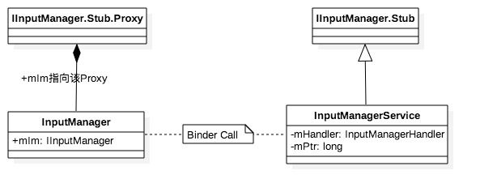
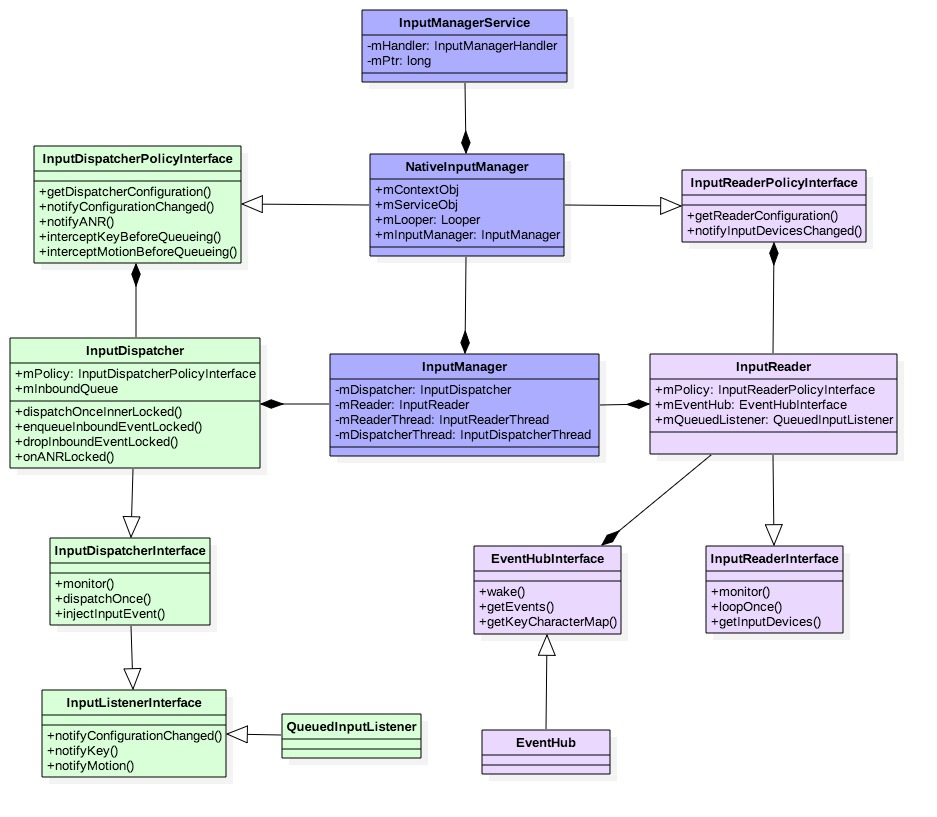
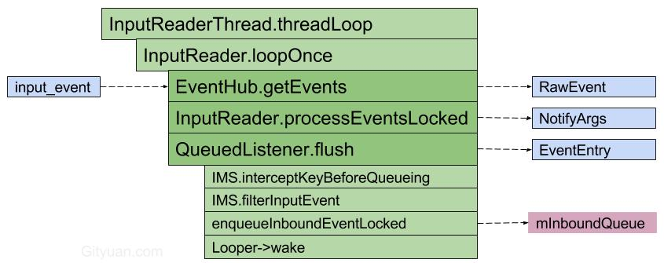
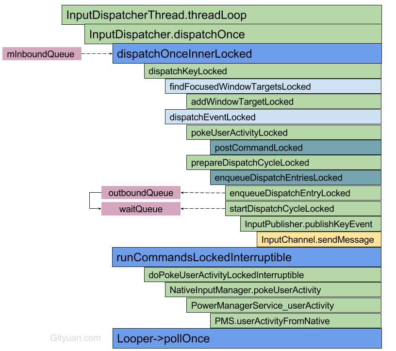
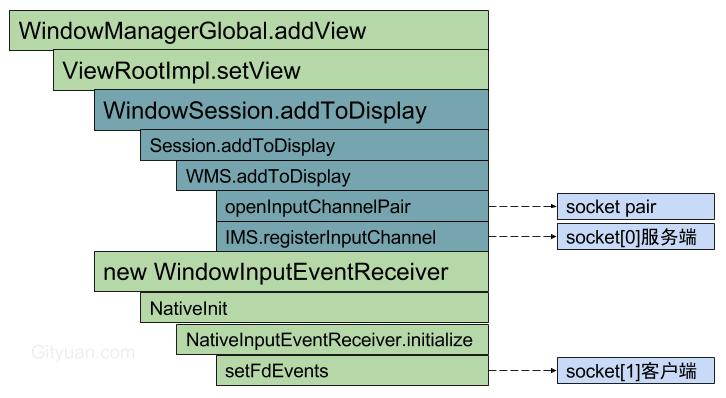
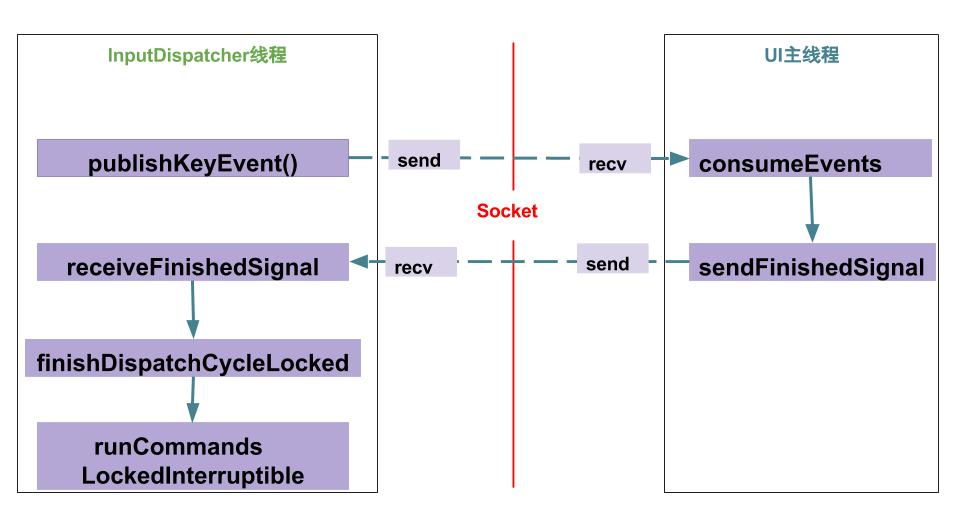
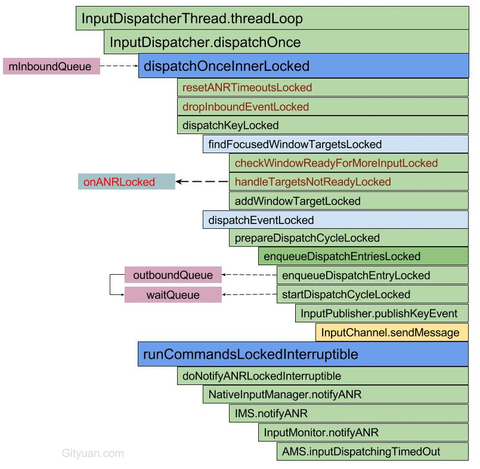

 
<!--BEGIN_DATA
{
    "create_date": "2017-01-12 14:03", 
    "modify_date": "2017-01-12 14:03", 
    "is_top": "0", 
    "summary": "Android-Input系统", 
    "tags": "Android", 
    "file_name": "Android-Input系统.md"
}
END_DATA-->

####
原文出处：<a href='http://gityuan.com/2016/12/10/input-manager/' target='blank'>Input系统—启动篇</a>

> 基于Android 6.0源码， 分析InputManagerService的启动过程

    
    
    frameworks/base/services/core/
      - java/com/android/server/input/InputManagerService.java
      - jni/com_android_server_input_InputManagerService.cpp
    frameworks/native/services/inputflinger/ （libinputflinger.so）
      - InputManager.cpp
      - InputDispatcher.cpp （内含InputDispatcherThread）
      - InputReader.cpp （内含InputReaderThread, InputMapper）
      - EventHub.cpp
      - InputListener.cpp
    frameworks/native/libs/input/ (libinput.so)
      - InputTransport.cpp
      - Input.cpp
      - InputDevice.cpp
      - Keyboard.cpp
      - KeyCharacterMap.cpp
      - KeyLayoutMap.cpp
      - VirtualKeyMap.cpp
      - IInputFlinger.cpp
      - VelocityControl.cpp
      - VelocityTracker.cpp
    frameworks/base/libs/input/ （libinputservice.so）
      - PointerController.cpp
      - SpriteController.cpp
    

###一. 概述

当用户触摸屏幕或者按键操作，首次触发的是硬件驱动，驱动收到事件后，将该相应事件写入到输入设备节点，这便产生了最原生态的内核事件。接着，输入系统取出原生态的事件，经过层层封装后成为KeyEvent或者MotionEvent；最后，交付给相应的目标窗口(Window)来消费该输入事件。可见，输入系统在整个过程起到承上启下的衔接作用。

Input模块的主要组成：

  * Native层的InputReader负责从EventHub取出事件并处理，再交给InputDispatcher；
  * Native层的InputDispatcher接收来自InputReader的输入事件，并记录WMS的窗口信息，用于派发事件到合适的窗口；
  * Java层的InputManagerService跟WMS交互，WMS记录所有窗口信息，并同步更新到IMS，为InputDispatcher正确派发事件到ViewRootImpl提供保障；

Input相关的动态库：

  * libinputflinger.so：frameworks/native/services/inputflinger/
  * libinputservice.so：frameworks/base/libs/input/
  * libinput.so： frameworks/native/libs/input/

####1.1 整体框架类图

InputManagerService作为system_server中的重要服务，继承于IInputManager.Stub，作为Binder服务端，那么Client位于InputManager的内部通过IInputManager.Stub.asInterface() 获取Binder代理端，C/S两端通信的协议是由IInputManager.aidl来定义的。

Input模块所涉及的重要类的关系如下：

图解:

  * InputManagerService位于Java层的InputManagerService.java文件； 
    * 其成员`mPtr`指向Native层的NativeInputManager对象；
  * NativeInputManager位于Native层的com_android_server_input_InputManagerService.cpp文件； 
    * 其成员`mServiceObj`指向Java层的IMS对象；
    * 其成员`mLooper`是指“android.display”线程的Looper;
  * InputManager位于libinputflinger中的InputManager.cpp文件； 
    * InputDispatcher和InputReader的成员变量`mPolicy`都是指NativeInputManager对象;
    * InputReader的成员`mQueuedListener`，数据类型为QueuedInputListener；通过其内部成员变量mInnerListener指向InputDispatcher对象； 这便是InputReader跟InputDispatcher交互的中间枢纽。

####1.2 启动调用栈

IMS服务是伴随着system_server进程的启动而启动，整个调用过程：

    
    
    InputManagerService(初始化)
        nativeInit
            NativeInputManager
                EventHub
                InputManager
                    InputDispatcher
                        Looper
                    InputReader
                        QueuedInputListener
                    InputReaderThread
                    InputDispatcherThread
    IMS.start(启动)
        nativeStart
            InputManager.start
                InputReaderThread->run
                InputDispatcherThread->run
    

整个过程首先创建如下对象：NativeInputManager，EventHub，InputManager，InputDispatcher，InputReader，InputReaderThread，InputDispatcherThread。接着便是启动两个工作线程`InputReader`,`InputDispatcher`。

###二. 启动过程

    
    
    private void startOtherServices() {
        //初始化IMS对象【见小节2.1】
        inputManager = new InputManagerService(context);
        ServiceManager.addService(Context.INPUT_SERVICE, inputManager);
        ...
        //将InputMonitor对象保持到IMS对象
        inputManager.setWindowManagerCallbacks(wm.getInputMonitor());
        //[见小节2.9]
        inputManager.start();
    }
    

####2.1 InputManagerService

[-> InputManagerService.java]

    
    
    public InputManagerService(Context context) {
         this.mContext = context;
         // 运行在线程"android.display"
         this.mHandler = new InputManagerHandler(DisplayThread.get().getLooper());
         ...
         //初始化native对象【见小节2.2】
         mPtr = nativeInit(this, mContext, mHandler.getLooper().getQueue());
         LocalServices.addService(InputManagerInternal.class, new LocalService());
     }
    

####2.2 nativeInit

[-> com_android_server_input_InputManagerService.cpp]

    
    
    static jlong nativeInit(JNIEnv* env, jclass /* clazz */,
            jobject serviceObj, jobject contextObj, jobject messageQueueObj) {
        //获取native消息队列
        sp<MessageQueue> messageQueue = android_os_MessageQueue_getMessageQueue(env, messageQueueObj);
        ...
        //创建Native的InputManager【见小节2.3】
        NativeInputManager* im = new NativeInputManager(contextObj, serviceObj,
                messageQueue->getLooper());
        im->incStrong(0);
        return reinterpret_cast<jlong>(im); //返回Native对象的指针
    }
    

####2.3 NativeInputManager

[-> com_android_server_input_InputManagerService.cpp]

    
    
    NativeInputManager::NativeInputManager(jobject contextObj,
            jobject serviceObj, const sp<Looper>& looper) :
            mLooper(looper), mInteractive(true) {
        JNIEnv* env = jniEnv();
        mContextObj = env->NewGlobalRef(contextObj); //上层IMS的context
        mServiceObj = env->NewGlobalRef(serviceObj); //上层IMS服务
        {
            AutoMutex _l(mLock);
            mLocked.systemUiVisibility = ASYSTEM_UI_VISIBILITY_STATUS_BAR_VISIBLE;
            mLocked.pointerSpeed = 0;
            mLocked.pointerGesturesEnabled = true;
            mLocked.showTouches = false;
        }
        mInteractive = true;
        // 创建EventHub对象【见小节2.4】
        sp<EventHub> eventHub = new EventHub();
        // 创建InputManager对象【见小节2.5】
        mInputManager = new InputManager(eventHub, this, this);
    }
    

此处的mLooper是指“android.display”线程的Looper;
libinputservice.so库中PointerController和SpriteController对象都继承于于MessageHandler，这两个Handler采用的便是该mLooper.

####2.4 EventHub

[-> EventHub.cpp]

    
    
    EventHub::EventHub(void) :
            mBuiltInKeyboardId(NO_BUILT_IN_KEYBOARD), mNextDeviceId(1), mControllerNumbers(),
            mOpeningDevices(0), mClosingDevices(0),
            mNeedToSendFinishedDeviceScan(false),
            mNeedToReopenDevices(false), mNeedToScanDevices(true),
            mPendingEventCount(0), mPendingEventIndex(0), mPendingINotify(false) {
        acquire_wake_lock(PARTIAL_WAKE_LOCK, WAKE_LOCK_ID);
        //创建epoll
        mEpollFd = epoll_create(EPOLL_SIZE_HINT);
        mINotifyFd = inotify_init();
        //此处DEVICE_PATH为"/dev/input"，监听该设备路径
        int result = inotify_add_watch(mINotifyFd, DEVICE_PATH, IN_DELETE | IN_CREATE);
        struct epoll_event eventItem;
        memset(&eventItem, 0, sizeof(eventItem));
        eventItem.events = EPOLLIN;
        eventItem.data.u32 = EPOLL_ID_INOTIFY;
        //添加INotify到epoll实例
        result = epoll_ctl(mEpollFd, EPOLL_CTL_ADD, mINotifyFd, &eventItem);
        int wakeFds[2];
        result = pipe(wakeFds); //创建管道
        mWakeReadPipeFd = wakeFds[0];
        mWakeWritePipeFd = wakeFds[1];
        //将pipe的读和写都设置为非阻塞方式
        result = fcntl(mWakeReadPipeFd, F_SETFL, O_NONBLOCK);
        result = fcntl(mWakeWritePipeFd, F_SETFL, O_NONBLOCK);
        eventItem.data.u32 = EPOLL_ID_WAKE;
        //添加管道的读端到epoll实例
        result = epoll_ctl(mEpollFd, EPOLL_CTL_ADD, mWakeReadPipeFd, &eventItem);
        ...
    }
    

该方法主要功能：

  * 初始化INotify（监听”/dev/input”），并添加到epoll实例
  * 创建非阻塞模式的管道，并添加到epoll;

####2.5 InputManager

[-> InputManager.cpp]

    
    
    InputManager::InputManager(
            const sp<EventHubInterface>& eventHub,
            const sp<InputReaderPolicyInterface>& readerPolicy,
            const sp<InputDispatcherPolicyInterface>& dispatcherPolicy) {
        //创建InputDispatcher对象【见小节2.6】
        mDispatcher = new InputDispatcher(dispatcherPolicy);
        //创建InputReader对象【见小节2.7】
        mReader = new InputReader(eventHub, readerPolicy, mDispatcher);
        initialize();//【见小节2.8】
    }
    

InputDispatcher和InputReader的mPolicy成员变量都是指NativeInputManager对象。

####2.6 InputDispatcher

[-> InputDispatcher.cpp]

    
    
    InputDispatcher::InputDispatcher(const sp<InputDispatcherPolicyInterface>& policy) :
        mPolicy(policy),
        mPendingEvent(NULL), mLastDropReason(DROP_REASON_NOT_DROPPED),
        mAppSwitchSawKeyDown(false), mAppSwitchDueTime(LONG_LONG_MAX),
        mNextUnblockedEvent(NULL),
        mDispatchEnabled(false), mDispatchFrozen(false), mInputFilterEnabled(false),
        mInputTargetWaitCause(INPUT_TARGET_WAIT_CAUSE_NONE) {
        //创建Looper对象
        mLooper = new Looper(false);
        mKeyRepeatState.lastKeyEntry = NULL;
        //获取分发超时参数
        policy->getDispatcherConfiguration(&mConfig);
    }
    

该方法主要工作：

  * 创建属于自己线程的Looper对象；
  * 超时参数来自于IMS，参数默认值keyRepeatTimeout = 500，keyRepeatDelay = 50。

####2.7 InputReader

[-> InputReader.cpp]

    
    
    InputReader::InputReader(const sp<EventHubInterface>& eventHub,
            const sp<InputReaderPolicyInterface>& policy,
            const sp<InputListenerInterface>& listener) :
            mContext(this), mEventHub(eventHub), mPolicy(policy),
            mGlobalMetaState(0), mGeneration(1),
            mDisableVirtualKeysTimeout(LLONG_MIN), mNextTimeout(LLONG_MAX),
            mConfigurationChangesToRefresh(0) {
        // 创建输入监听对象
        mQueuedListener = new QueuedInputListener(listener);
        {
            AutoMutex _l(mLock);
            refreshConfigurationLocked(0);
            updateGlobalMetaStateLocked();
        } 
    }
    

此处mQueuedListener的成员变量`mInnerListener`便是InputDispatcher对象。前面【小节2.5】InputManager创建完InputDispatcher和InputReader对象， 接下里便是调用initialize初始化。

####2.8 initialize

[-> InputManager.cpp]

    
    
    void InputManager::initialize() {
        //创建线程“InputReader”
        mReaderThread = new InputReaderThread(mReader);
        //创建线程”InputDispatcher“
        mDispatcherThread = new InputDispatcherThread(mDispatcher);
    }
    InputReaderThread::InputReaderThread(const sp<InputReaderInterface>& reader) :
            Thread(/*canCallJava*/ true), mReader(reader) {
    }
    InputDispatcherThread::InputDispatcherThread(const sp<InputDispatcherInterface>& dispatcher) :
            Thread(/*canCallJava*/ true), mDispatcher(dispatcher) {
    }
    

初始化的主要工作：创建线程“InputReader”和”InputDispatcher“都是能访问Java代码的native线程。
到此[2.1-2.8]整个的InputManagerService对象初始化过程并完成，接下来便是调用其start方法。

####2.9 IMS.start

[-> InputManagerService.java]

    
    
    public void start() {
        // 启动native对象[见小节2.10]
        nativeStart(mPtr);
        Watchdog.getInstance().addMonitor(this);
        //注册触摸点速度和是否显示功能的观察者
        registerPointerSpeedSettingObserver();
        registerShowTouchesSettingObserver();
        mContext.registerReceiver(new BroadcastReceiver() {
            @Override
            public void onReceive(Context context, Intent intent) {
                updatePointerSpeedFromSettings();
                updateShowTouchesFromSettings();
            }
        }, new IntentFilter(Intent.ACTION_USER_SWITCHED), null, mHandler);
        updatePointerSpeedFromSettings(); //更新触摸点的速度
        updateShowTouchesFromSettings(); //是否在屏幕上显示触摸点
    }
    

####2.10 nativeStart

[-> com_android_server_input_InputManagerService.cpp]

    
    
    static void nativeStart(JNIEnv* env, jclass /* clazz */, jlong ptr) {
        //此处ptr记录的便是NativeInputManager
        NativeInputManager* im = reinterpret_cast<NativeInputManager*>(ptr);
        // [见小节2.11]
        status_t result = im->getInputManager()->start();
        ...
    }
    

####2.11 InputManager.start

[InputManager.cpp]

    
    
    status_t InputManager::start() {
        status_t result = mDispatcherThread->run("InputDispatcher", PRIORITY_URGENT_DISPLAY);
        ...
        result = mReaderThread->run("InputReader", PRIORITY_URGENT_DISPLAY);
        ...
        return OK;
    }
    

启动两个线程,分别是”InputDispatcher”和”InputReader”

###三. 总结

**分层视角：**

  1. Java层InputManagerService：采用android.display线程处理Message.
  2. JNI的NativeInputManager：采用android.display线程处理Message,以及创建EventHub。
  3. Native的InputManager：创建InputReaderThread和InputDispatcherThread两个线程

**主要功能：**

  * IMS服务中的成员变量mPtr记录Native层的NativeInputManager对象；
  * IMS对象的初始化过程的重点在于native初始化，分别创建了以下对象： 
    * NativeInputManager；
    * EventHub, InputManager；
    * InputReader，InputDispatcher；
    * InputReaderThread，InputDispatcherThread
  * IMS启动过程的主要功能是启动以下两个线程： 
    * InputReader：从EventHub取出事件并处理，再交给InputDispatcher
    * InputDispatcher：接收来自InputReader的输入事件，并派发事件到合适的窗口。

从整个启动过程，可知有system_server进程中有3个线程跟Input输入系统息息相关，分别是`android.display`,
`InputReader`,`InputDispatcher`。

  * InputDispatcher线程：属于Looper线程，会创建属于自己的Looper，循环分发消息；
  * InputReader线程：通过getEvents()调用EventHub读取输入事件，循环读取消息；
  * android.display线程：属于Looper线程，用于处理Java层的IMS.InputManagerHandler和JNI层的NativeInputManager中指定的MessageHandler消息;

Input事件流程：Linux Kernel -> IMS(InputReader -> InputDispatcher) -> WMS ->
ViewRootImpl， 后续再进一步介绍。

###四. 附录

最后在列举整个input处理流程中常见的重要对象或结构体,后续input系列文章直接使用以上结构体，可回过来查看。

####4.1 InputReader.h

#####4.1.1 InputDevice

    
    
    class InputDevice {
      ...
      private:
          InputReaderContext* mContext;
          int32_t mId;
          int32_t mGeneration;
          int32_t mControllerNumber;
          InputDeviceIdentifier mIdentifier;
          String8 mAlias;
          uint32_t mClasses;
          Vector<InputMapper*> mMappers;
          uint32_t mSources;
          bool mIsExternal;
          bool mHasMic;
          bool mDropUntilNextSync;
          typedef int32_t (InputMapper::*GetStateFunc)(uint32_t sourceMask, int32_t code);
          int32_t getState(uint32_t sourceMask, int32_t code, GetStateFunc getStateFunc);
          PropertyMap mConfiguration;
    };
    

####4.2 InputDispatcher.h

#####4.2.1 DropReason

    
    
    enum DropReason {
       DROP_REASON_NOT_DROPPED = 0, //不丢弃
       DROP_REASON_POLICY = 1, //策略
       DROP_REASON_APP_SWITCH = 2, //应用切换
       DROP_REASON_DISABLED = 3, //disable
       DROP_REASON_BLOCKED = 4, //阻塞
       DROP_REASON_STALE = 5, //过时
    };
    enum InputTargetWaitCause {
        INPUT_TARGET_WAIT_CAUSE_NONE,
        INPUT_TARGET_WAIT_CAUSE_SYSTEM_NOT_READY, //系统没有准备就绪
        INPUT_TARGET_WAIT_CAUSE_APPLICATION_NOT_READY, //应用没有准备就绪
    };
    EventEntry* mPendingEvent;
    Queue<EventEntry> mInboundQueue; //需要InputDispatcher分发的事件队列
    Queue<EventEntry> mRecentQueue;
    Queue<CommandEntry> mCommandQueue;
    Vector<sp<InputWindowHandle> > mWindowHandles;
    sp<InputWindowHandle> mFocusedWindowHandle; //聚焦窗口
    sp<InputApplicationHandle> mFocusedApplicationHandle; //聚焦应用
    String8 mLastANRState; //上一次ANR时的分发状态
    InputTargetWaitCause mInputTargetWaitCause;
    nsecs_t mInputTargetWaitStartTime;
    nsecs_t mInputTargetWaitTimeoutTime;
    bool mInputTargetWaitTimeoutExpired;
    //目标等待的应用
    sp<InputApplicationHandle> mInputTargetWaitApplicationHandle;
    

#####4.2.2 Connection

    
    
    class Connection : public RefBase {
        enum Status {
            STATUS_NORMAL, //正常状态
            STATUS_BROKEN, //发生无法恢复的错误
            STATUS_ZOMBIE  //input channel被注销掉
        };
        Status status; //状态
        sp<InputChannel> inputChannel; //永不为空
        sp<InputWindowHandle> inputWindowHandle; //可能为空
        bool monitor;
        InputPublisher inputPublisher;
        InputState inputState;
        //当socket占满的同时，应用消费某些输入事件之前无法发布事件，则值为true.
        bool inputPublisherBlocked; 
        //需要被发布到connection的事件队列
        Queue<DispatchEntry> outboundQueue;
        //已发布到connection，但还没有收到来自应用的“finished”响应的事件队列
        Queue<DispatchEntry> waitQueue;
    }
    

#####4.2.3 EventEntry

    
    
    struct EventEntry : Link<EventEntry> {
         enum {
             TYPE_CONFIGURATION_CHANGED,
             TYPE_DEVICE_RESET,
             TYPE_KEY,
             TYPE_MOTION
         };
         mutable int32_t refCount;
         int32_t type;
         nsecs_t eventTime; //事件时间
         uint32_t policyFlags;
         InjectionState* injectionState;
         bool dispatchInProgress; //初始值为false, 分发过程则设置成true
     };
    

#####4.2.4 INPUT_EVENT_INJECTION

    
    
    enum {
        // 内部使用, 正在执行注入操作
        INPUT_EVENT_INJECTION_PENDING = -1,
        // 事件注入成功
        INPUT_EVENT_INJECTION_SUCCEEDED = 0,
        // 事件注入失败, 由于injector没有权限将聚焦的input事件注入到应用
        INPUT_EVENT_INJECTION_PERMISSION_DENIED = 1,
        // 事件注入失败, 由于没有可用的input target
        INPUT_EVENT_INJECTION_FAILED = 2,
        // 事件注入失败, 由于超时
        INPUT_EVENT_INJECTION_TIMED_OUT = 3
    };
    

####4.3 InputTransport.h

#####4.3.1 InputChannel

    
    
    class InputChannel : public RefBase {
        // 创建一对input channels
        static status_t openInputChannelPair(const String8& name,
                sp<InputChannel>& outServerChannel, sp<InputChannel>& outClientChannel);
        status_t sendMessage(const InputMessage* msg); //发送消息
        status_t receiveMessage(InputMessage* msg); //接收消息
        //获取InputChannel的fd的拷贝
        sp<InputChannel> dup() const;
    private:
        String8 mName;
        int mFd;
    };
    

sendMessage的返回值:

  * OK: 代表成功;
  * WOULD_BLOCK: 代表Channel已满;
  * DEAD_OBJECT: 代表Channel已关闭;

receiveMessage的返回值:

  * OK: 代表成功;
  * WOULD_BLOCK: 代表Channel为空;
  * DEAD_OBJECT: 代表Channel已关闭;

#####4.3.2 InputTarget

    
    
    struct InputTarget {
        enum {
            FLAG_FOREGROUND = 1 << 0, //事件分发到前台app
            FLAG_WINDOW_IS_OBSCURED = 1 << 1,
            FLAG_SPLIT = 1 << 2, //MotionEvent被拆分成多窗口
            FLAG_ZERO_COORDS = 1 << 3,
            FLAG_DISPATCH_AS_IS = 1 << 8, //
            FLAG_DISPATCH_AS_OUTSIDE = 1 << 9, //
            FLAG_DISPATCH_AS_HOVER_ENTER = 1 << 10, //
            FLAG_DISPATCH_AS_HOVER_EXIT = 1 << 11, //
            FLAG_DISPATCH_AS_SLIPPERY_EXIT = 1 << 12, //
            FLAG_DISPATCH_AS_SLIPPERY_ENTER = 1 << 13, //
            FLAG_WINDOW_IS_PARTIALLY_OBSCURED = 1 << 14,
            //所有分发模式的掩码
            FLAG_DISPATCH_MASK = FLAG_DISPATCH_AS_IS
                    | FLAG_DISPATCH_AS_OUTSIDE
                    | FLAG_DISPATCH_AS_HOVER_ENTER
                    | FLAG_DISPATCH_AS_HOVER_EXIT
                    | FLAG_DISPATCH_AS_SLIPPERY_EXIT
                    | FLAG_DISPATCH_AS_SLIPPERY_ENTER,
        };
        sp<InputChannel> inputChannel; //目标的inputChannel
        int32_t flags; 
        float xOffset, yOffset; //用于MotionEvent
        float scaleFactor; //用于MotionEvent
        BitSet32 pointerIds;
    };
    

#####4.3.3 InputPublisher

    
    
    class InputPublisher {
    public:
        //获取输入通道
        inline sp<InputChannel> getChannel() { return mChannel; }
        status_t publishKeyEvent(...); //将key event发送到input channel
        status_t publishMotionEvent(...); //将motion event发送到input channel
        //接收来自InputConsumer发送的完成信号
        status_t receiveFinishedSignal(uint32_t* outSeq, bool* outHandled);
    private:
        sp<InputChannel> mChannel;
    };
    

#####4.3.4 InputConsumer

    
    
    class InputConsumer {
    public:
        inline sp<InputChannel> getChannel() { return mChannel; }
        status_t consume(...); //消费input channel的事件
        //向InputPublisher发送完成信号
        status_t sendFinishedSignal(uint32_t seq, bool handled);
        bool hasDeferredEvent() const;
        bool hasPendingBatch() const;
    private:
        sp<InputChannel> mChannel;
        InputMessage mMsg; //当前input消息
        bool mMsgDeferred; 
        Vector<Batch> mBatches; //input批量消息
        Vector<TouchState> mTouchStates; 
        Vector<SeqChain> mSeqChains;
        status_t consumeBatch(...);
        status_t consumeSamples(...);
        static void initializeKeyEvent(KeyEvent* event, const InputMessage* msg);
        static void initializeMotionEvent(MotionEvent* event, const InputMessage* msg);
    }
    

####4.4 input.h

#####4.4.1 KeyEvent

    
    
    class KeyEvent : public InputEvent {
        ...
        protected:
            int32_t mAction;
            int32_t mFlags;
            int32_t mKeyCode;
            int32_t mScanCode;
            int32_t mMetaState;
            int32_t mRepeatCount;
            nsecs_t mDownTime; //专指按下时间
            nsecs_t mEventTime; //事件发生时间(包括down/up等事件)
    }
    

#####4.4.2 MotionEvent

    
    
    class MotionEvent : public InputEvent {
        ...
        protected:
            int32_t mAction;
            int32_t mActionButton;
            int32_t mFlags;
            int32_t mEdgeFlags;
            int32_t mMetaState;
            int32_t mButtonState;
            float mXOffset;
            float mYOffset;
            float mXPrecision;
            float mYPrecision;
            nsecs_t mDownTime; //按下时间
            Vector<PointerProperties> mPointerProperties;
            Vector<nsecs_t> mSampleEventTimes;
            Vector<PointerCoords> mSamplePointerCoords;
        };
    }
    

####4.5 InputListener.h

#####4.5.1 NotifyKeyArgs

    
    
    struct NotifyKeyArgs : public NotifyArgs {
        nsecs_t eventTime; //事件发生时间
        int32_t deviceId;
        uint32_t source;
        uint32_t policyFlags;
        int32_t action;
        int32_t flags;
        int32_t keyCode;
        int32_t scanCode;
        int32_t metaState;
        nsecs_t downTime; //按下时间
        ...
    };
    

####
原文出处：<a href='http://gityuan.com/2016/12/11/input-reader/' target='blank'>Input系统—InputReader线程</a>

> 基于Android 6.0源码， 分析InputManagerService的启动过程

    
    
    frameworks/base/services/core/java/com/android/server/input/InputManagerService.java
    frameworks/base/services/core/java/com/android/server/wm/InputMonitor.java
    frameworks/base/services/core/jni/com_android_server_input_InputManagerService.cpp
    frameworks/base/core/java/android/view/InputChannel.java
    frameworks/native/libs/input/KeyCharacterMap.cpp
    

###一. InputReader起点

上一篇文章[Input系统—启动篇](http://gityuan.com/2016/12/10/input-manager/)，介绍IMS服务的启动过程会创建两个native线程，分别是InputReader,InputDispatcher，并且是可以调用Java代码的native线程。

#####1.1 InputReader执行流

整体调用链：

    
    
    InputReaderThread.threadLoop
      InputReader.loopOnce
        EventHub.getEvents
        InputReader.processEventsLocked
        QueuedListener.flush
    

先来回顾一下InputReader对象的初始化过程:

    
    
    InputReader::InputReader(const sp<EventHubInterface>& eventHub,
            const sp<InputReaderPolicyInterface>& policy,
            const sp<InputListenerInterface>& listener) :
            mContext(this), mEventHub(eventHub), mPolicy(policy),
            mGlobalMetaState(0), mGeneration(1),
            mDisableVirtualKeysTimeout(LLONG_MIN), mNextTimeout(LLONG_MAX),
            mConfigurationChangesToRefresh(0) {
        //此处mQueuedListener的成员变量`mInnerListener`便是InputDispatcher对象
        mQueuedListener = new QueuedInputListener(listener);
        {
            AutoMutex _l(mLock);
            refreshConfigurationLocked(0);
            updateGlobalMetaStateLocked();
        } 
    }
    

接下来介绍InputReader线程的执行过程，从threadLoop为起点开始分析。

#####1.2 threadLoop

[-> InputReader.cpp]

    
    
    bool InputReaderThread::threadLoop() {
        mReader->loopOnce(); //【见小节1.3】
        return true;
    }
    

threadLoop返回值true代表的是会不断地循环调用loopOnce()。另外，如果当返回值为false则会退出循环。整个过程是不断循环的地调用InputReader的loopOnce()方法，先来回顾一下InputReader对象构造方法。

#####1.3 loopOnce

[-> InputReader.cpp]

    
    
    void InputReader::loopOnce() {
        ...
        {
            AutoMutex _l(mLock);
            uint32_t changes = mConfigurationChangesToRefresh;
            if (changes) {
                timeoutMillis = 0;
                ...
            } else if (mNextTimeout != LLONG_MAX) {
                nsecs_t now = systemTime(SYSTEM_TIME_MONOTONIC);
                timeoutMillis = toMillisecondTimeoutDelay(now, mNextTimeout);
            }
        }
        //从EventHub读取事件，其中EVENT_BUFFER_SIZE = 256【见小节2.1】
        size_t count = mEventHub->getEvents(timeoutMillis, mEventBuffer, EVENT_BUFFER_SIZE);
        { // acquire lock
            AutoMutex _l(mLock);
            if (count) { //处理事件【见小节3.1】
                processEventsLocked(mEventBuffer, count);
            }
            if (oldGeneration != mGeneration) {
                inputDevicesChanged = true;
                getInputDevicesLocked(inputDevices);
            }
            ...
        } // release lock
        if (inputDevicesChanged) { //输入设备发生改变
            mPolicy->notifyInputDevicesChanged(inputDevices);
        }
        //发送事件到nputDispatcher【见小节4.1】
        mQueuedListener->flush();
    }
    

该方法主要功能：

  1. 从EventHub读取事件; [见小节2.1]getEvents()
  2. 对事件进行加工； [见小节3.1]processEventsLocked()
  3. 将发送事件到InputDispatcher线程； [见小节4.1] QueuedListener->flush()

另外，整个过程还会检测配置是否改变，输出设备是否改变，如果改变则调用policy来通知。

###二. EventHub

#####2.1 getEvents

[-> EventHub.cpp]

    
    
    size_t EventHub::getEvents(int timeoutMillis, RawEvent* buffer, size_t bufferSize) {
        AutoMutex _l(mLock); //加锁
        struct input_event readBuffer[bufferSize];
        RawEvent* event = buffer; //原始事件
        size_t capacity = bufferSize; //容量大小为256
        bool awoken = false;
        for (;;) {
            nsecs_t now = systemTime(SYSTEM_TIME_MONOTONIC);
            ...
            while (mClosingDevices) {
                ...
            }
            if (mNeedToScanDevices) {
                mNeedToScanDevices = false;
                //扫描设备【见小节2.2】
                scanDevicesLocked();
                mNeedToSendFinishedDeviceScan = true;
            }
            while (mOpeningDevices != NULL) {
                Device* device = mOpeningDevices;
                mOpeningDevices = device->next;
                event->when = now;
                event->deviceId = device->id == mBuiltInKeyboardId ? 0 : device->id;
                event->type = DEVICE_ADDED; //添加设备的事件
                event += 1;
                mNeedToSendFinishedDeviceScan = true;
                if (--capacity == 0) {
                    break;
                }
            }
            ...
            bool deviceChanged = false;
            while (mPendingEventIndex < mPendingEventCount) {
                const struct epoll_event& eventItem = mPendingEventItems[mPendingEventIndex++];
                if (eventItem.data.u32 == EPOLL_ID_INOTIFY) {
                    ...
                    continue;
                }
                if (eventItem.data.u32 == EPOLL_ID_WAKE) {
                    ...
                    continue;
                }
                //获取设备ID所对应的device
                ssize_t deviceIndex = mDevices.indexOfKey(eventItem.data.u32);
                Device* device = mDevices.valueAt(deviceIndex);
                if (eventItem.events & EPOLLIN) {
                    //从设备不断读取事件，放入到readBuffer
                    int32_t readSize = read(device->fd, readBuffer,
                            sizeof(struct input_event) * capacity);
                    if (readSize == 0 || (readSize < 0 && errno == ENODEV)) {
                        deviceChanged = true; 
                        closeDeviceLocked(device);//设备已被移除则执行关闭操作
                    } else if (readSize < 0) {
                        ...
                    } else if ((readSize % sizeof(struct input_event)) != 0) {
                        ...
                    } else {
                        int32_t deviceId = device->id == mBuiltInKeyboardId ? 0 : device->id;
                        size_t count = size_t(readSize) / sizeof(struct input_event);
                        for (size_t i = 0; i < count; i++) {
                            struct input_event& iev = readBuffer[i];
                            ...
                            event->when = nsecs_t(iev.time.tv_sec) * 1000000000LL
                                    + nsecs_t(iev.time.tv_usec) * 1000LL;
                            event->deviceId = deviceId;
                            event->type = iev.type;
                            event->code = iev.code;
                            event->value = iev.value;
                            event += 1;
                            capacity -= 1;
                        }
                        if (capacity == 0) {
                            mPendingEventIndex -= 1;
                            break;
                        }
                    }
                }
                ...
            }
            ...
            //立刻报告设备增加或移除事件
            if (deviceChanged) {
                continue;
            }
            if (event != buffer || awoken) {
                break;
            }
            mPendingEventIndex = 0;
            mLock.unlock(); //poll之前先释放锁
            release_wake_lock(WAKE_LOCK_ID);
            //等待input事件的到来
            int pollResult = epoll_wait(mEpollFd, mPendingEventItems, EPOLL_MAX_EVENTS, timeoutMillis);
            acquire_wake_lock(PARTIAL_WAKE_LOCK, WAKE_LOCK_ID);
            mLock.lock(); //poll之后再次请求锁
            if (pollResult < 0) {
                //出现错误
                mPendingEventCount = 0;
                if (errno != EINTR) {
                    usleep(100000); //系统发生错误，则休眠1s
                }
            } else {
                mPendingEventCount = size_t(pollResult);
            }
        }
        //返回所读取的事件个数
        return event - buffer;
    }
    

EventHub采用INotify + epoll机制实现监听目录/dev/input下的设备节点，经过EventHub将input_event结构体 +
deviceId 转换成RawEvent结构体，如下：

    
    
    struct input_event {
     struct timeval time; //事件发生的时间点
     __u16 type;
     __u16 code;
     __s32 value;
    };
    struct RawEvent {
        nsecs_t when; //事件发生的时间店
        int32_t deviceId; //产生事件的设备Id
        int32_t type; // 事件类型
        int32_t code;
        int32_t value;
    };
    

此处事件类型有DEVICE_ADDED(添加)，DEVICE_REMOVED(删除)，FINISHED_DEVICE_SCAN(扫描完成)，以及(type<FIRST_SYNTHETIC_EVENT)其他事件。

#####2.2 scanDevicesLocked

    
    
    void EventHub::scanDevicesLocked() {
        //【见小节2.3】
        status_t res = scanDirLocked(DEVICE_PATH);
        ...
    }
    

此处DEVICE_PATH=”/dev/input”

#####2.3 scanDirLocked

    
    
    status_t EventHub::scanDirLocked(const char *dirname)
    {
        char devname[PATH_MAX];
        char *filename;
        DIR *dir;
        struct dirent *de;
        dir = opendir(dirname);
        strcpy(devname, dirname);
        filename = devname + strlen(devname);
        *filename++ = '/';
        //读取/dev/input/目录下所有的设备节点
        while((de = readdir(dir))) {
            if(de->d_name[0] == '.' &&
               (de->d_name[1] == '\0' ||
                (de->d_name[1] == '.' && de->d_name[2] == '\0')))
                continue;
            strcpy(filename, de->d_name);
            //打开相应的设备节点【2.4】
            openDeviceLocked(devname);
        }
        closedir(dir);
        return 0;
    }
    

#####2.4 openDeviceLocked

    
    
    status_t EventHub::openDeviceLocked(const char *devicePath) {
        char buffer[80];
        //打开设备文件
        int fd = open(devicePath, O_RDWR | O_CLOEXEC);
        InputDeviceIdentifier identifier;
        //获取设备名
        if(ioctl(fd, EVIOCGNAME(sizeof(buffer) - 1), &buffer) < 1){
        } else {
            buffer[sizeof(buffer) - 1] = '\0';
            identifier.name.setTo(buffer);
        }
        identifier.bus = inputId.bustype;
        identifier.product = inputId.product;
        identifier.vendor = inputId.vendor;
        identifier.version = inputId.version;
        //获取设备物理地址
        if(ioctl(fd, EVIOCGPHYS(sizeof(buffer) - 1), &buffer) < 1) {
        } else {
            buffer[sizeof(buffer) - 1] = '\0';
            identifier.location.setTo(buffer);
        }
        //获取设备唯一ID
        if(ioctl(fd, EVIOCGUNIQ(sizeof(buffer) - 1), &buffer) < 1) {
        } else {
            buffer[sizeof(buffer) - 1] = '\0';
            identifier.uniqueId.setTo(buffer);
        }
        //将identifier信息填充到fd
        assignDescriptorLocked(identifier);
        //设置fd为非阻塞方式
        fcntl(fd, F_SETFL, O_NONBLOCK);
        //获取设备ID，分配设备对象内存
        int32_t deviceId = mNextDeviceId++;
        Device* device = new Device(fd, deviceId, String8(devicePath), identifier);
        ...
        //注册epoll
        struct epoll_event eventItem;
        memset(&eventItem, 0, sizeof(eventItem));
        eventItem.events = EPOLLIN;
        if (mUsingEpollWakeup) {
            eventItem.events |= EPOLLWAKEUP;
        }
        eventItem.data.u32 = deviceId;
        if (epoll_ctl(mEpollFd, EPOLL_CTL_ADD, fd, &eventItem)) {
            delete device; //添加失败则删除该设备
            return -1;
        }
        ...
        //【见小节2.5】
        addDeviceLocked(device);
    }
    

#####2.5 addDeviceLocked

    
    
    void EventHub::addDeviceLocked(Device* device) {
        mDevices.add(device->id, device); //添加到mDevices队列
        device->next = mOpeningDevices;
        mOpeningDevices = device;
    }
    

介绍了EventHub从设备节点获取事件的流程，当收到事件后接下里便开始处理事件。

###三. InputReader

#####3.1 processEventsLocked

[-> InputReader.cpp]

    
    
    void InputReader::processEventsLocked(const RawEvent* rawEvents, size_t count) {
        for (const RawEvent* rawEvent = rawEvents; count;) {
            int32_t type = rawEvent->type;
            size_t batchSize = 1;
            if (type < EventHubInterface::FIRST_SYNTHETIC_EVENT) {
                int32_t deviceId = rawEvent->deviceId;
                while (batchSize < count) {
                    if (rawEvent[batchSize].type >= EventHubInterface::FIRST_SYNTHETIC_EVENT
                            || rawEvent[batchSize].deviceId != deviceId) {
                        break;
                    }
                    batchSize += 1; //同一设备的事件打包处理
                }
                //数据事件的处理【见小节3.4】
                processEventsForDeviceLocked(deviceId, rawEvent, batchSize);
            } else {
                switch (rawEvent->type) {
                case EventHubInterface::DEVICE_ADDED:
                    //设备添加【见小节3.2】
                    addDeviceLocked(rawEvent->when, rawEvent->deviceId);
                    break;
                case EventHubInterface::DEVICE_REMOVED:
                    //设备移除
                    removeDeviceLocked(rawEvent->when, rawEvent->deviceId);
                    break;
                case EventHubInterface::FINISHED_DEVICE_SCAN:
                    //设备扫描完成
                    handleConfigurationChangedLocked(rawEvent->when);
                    break;
                default:
                    ALOG_ASSERT(false);//不会发生
                    break;
                }
            }
            count -= batchSize;
            rawEvent += batchSize;
        }
    }
    

事件处理总共哟以下几类类型：

  * DEVICE_ADDED(设备增加), [见小节3.2]
  * DEVICE_REMOVED(设备移除)
  * FINISHED_DEVICE_SCAN(设备扫描完成)
  * 数据事件, [见小节3.4]

先来说说DEVICE_ADDED设备增加的过程。

#####3.2 addDeviceLocked

    
    
    void InputReader::addDeviceLocked(nsecs_t when, int32_t deviceId) {
        ssize_t deviceIndex = mDevices.indexOfKey(deviceId);
        if (deviceIndex >= 0) {
            return; //已添加的相同设备则不再添加
        }
        InputDeviceIdentifier identifier = mEventHub->getDeviceIdentifier(deviceId);
        uint32_t classes = mEventHub->getDeviceClasses(deviceId);
        int32_t controllerNumber = mEventHub->getDeviceControllerNumber(deviceId);
        //【见小节3.3】
        InputDevice* device = createDeviceLocked(deviceId, controllerNumber, identifier, classes);
        device->configure(when, &mConfig, 0);
        device->reset(when);
        mDevices.add(deviceId, device); //添加设备到mDevices
        ...
    }
    

#####3.3 createDeviceLocked

    
    
    InputDevice* InputReader::createDeviceLocked(int32_t deviceId, int32_t controllerNumber,
            const InputDeviceIdentifier& identifier, uint32_t classes) {
        //创建InputDevice对象
        InputDevice* device = new InputDevice(&mContext, deviceId, bumpGenerationLocked(),
                controllerNumber, identifier, classes);
        ...
        //获取键盘源类型
        uint32_t keyboardSource = 0;
        int32_t keyboardType = AINPUT_KEYBOARD_TYPE_NON_ALPHABETIC;
        if (classes & INPUT_DEVICE_CLASS_KEYBOARD) {
            keyboardSource |= AINPUT_SOURCE_KEYBOARD;
        }
        if (classes & INPUT_DEVICE_CLASS_ALPHAKEY) {
            keyboardType = AINPUT_KEYBOARD_TYPE_ALPHABETIC;
        }
        if (classes & INPUT_DEVICE_CLASS_DPAD) {
            keyboardSource |= AINPUT_SOURCE_DPAD;
        }
        if (classes & INPUT_DEVICE_CLASS_GAMEPAD) {
            keyboardSource |= AINPUT_SOURCE_GAMEPAD;
        }
        //添加键盘类设备InputMapper
        if (keyboardSource != 0) {
            device->addMapper(new KeyboardInputMapper(device, keyboardSource, keyboardType));
        }
        //添加鼠标类设备InputMapper
        if (classes & INPUT_DEVICE_CLASS_CURSOR) {
            device->addMapper(new CursorInputMapper(device));
        }
        //添加触摸屏设备InputMapper
        if (classes & INPUT_DEVICE_CLASS_TOUCH_MT) {
            device->addMapper(new MultiTouchInputMapper(device));
        } else if (classes & INPUT_DEVICE_CLASS_TOUCH) {
            device->addMapper(new SingleTouchInputMapper(device));
        }
        ...
        return device;
    }
    

该方法主要功能：

  * 创建InputDevice对象，将InputReader的mContext赋给InputDevice对象所对应的变量
  * 根据设备类型来创建并添加相对应的InputMapper，同时设置mContext.

input设备类型有很多种，以上代码只列举部分常见的设备以及相应的InputMapper：

  * 键盘类设备：KeyboardInputMapper
  * 触摸屏设备：MultiTouchInputMapper或SingleTouchInputMapper
  * 鼠标类设备：CursorInputMapper

介绍完设备增加过程，继续回到[小节3.1]除了设备的增删，更常见事件便是数据事件，那么接下来介绍数据事件的 处理过程。

#####3.4 processEventsForDeviceLocked

    
    
    void InputReader::processEventsForDeviceLocked(int32_t deviceId,
            const RawEvent* rawEvents, size_t count) {
        ssize_t deviceIndex = mDevices.indexOfKey(deviceId);
        ...
        InputDevice* device = mDevices.valueAt(deviceIndex);
        if (device->isIgnored()) {
            return; //可忽略则直接返回
        }
        //【见小节3.5】
        device->process(rawEvents, count);
    }
    

#####3.5 InputDevice.process

    
    
    void InputDevice::process(const RawEvent* rawEvents, size_t count) {
        size_t numMappers = mMappers.size();
        for (const RawEvent* rawEvent = rawEvents; count--; rawEvent++) {
            if (mDropUntilNextSync) {
                if (rawEvent->type == EV_SYN && rawEvent->code == SYN_REPORT) {
                    mDropUntilNextSync = false;
                } 
            } else if (rawEvent->type == EV_SYN && rawEvent->code == SYN_DROPPED) {
                mDropUntilNextSync = true; 
                reset(rawEvent->when);
            } else {
                for (size_t i = 0; i < numMappers; i++) {
                    InputMapper* mapper = mMappers[i];
                    //调用具体mapper来处理【见小节3.6】
                    mapper->process(rawEvent);
                }
            }
        }
    }
    

小节[3.3]createDeviceLocked创建设备并添加InputMapper，提到会有多种InputMapper。
这里以KeyboardInputMapper为例来展开说明

#####3.6 KeyboardInputMapper.process

[-> InputReader.cpp ::KeyboardInputMapper]

    
    
    void KeyboardInputMapper::process(const RawEvent* rawEvent) {
        switch (rawEvent->type) {
        case EV_KEY: {
            int32_t scanCode = rawEvent->code;
            int32_t usageCode = mCurrentHidUsage;
            mCurrentHidUsage = 0;
            if (isKeyboardOrGamepadKey(scanCode)) {
                int32_t keyCode;
                uint32_t flags;
                //获取所对应的KeyCode【见小节3.7】
                if (getEventHub()->mapKey(getDeviceId(), scanCode, usageCode, &keyCode, &flags)) {
                    keyCode = AKEYCODE_UNKNOWN;
                    flags = 0;
                }
                //【见小节3.9】
                processKey(rawEvent->when, rawEvent->value != 0, keyCode, scanCode, flags);
            }
            break;
        }
        case EV_MSC: ...
        case EV_SYN: ...
        }
    }
    

#####3.7 EventHub::mapKey

[-> EventHub.cpp]

    
    
    status_t EventHub::mapKey(int32_t deviceId,
            int32_t scanCode, int32_t usageCode, int32_t metaState,
            int32_t* outKeycode, int32_t* outMetaState, uint32_t* outFlags) const {
        AutoMutex _l(mLock);
        Device* device = getDeviceLocked(deviceId); //获取设备对象
        status_t status = NAME_NOT_FOUND;
        if (device) {
            sp<KeyCharacterMap> kcm = device->getKeyCharacterMap();
            if (kcm != NULL) {
                //根据scanCode找到keyCode【见小节3.8】
                if (!kcm->mapKey(scanCode, usageCode, outKeycode)) {
                    *outFlags = 0;
                    status = NO_ERROR;
                }
            }
            ...
        }
        ...
        return status;
    }
    

将事件的扫描码(scanCode)转换成键盘码(Keycode)

#####3.8 KeyCharacterMap::mapKey

[-> KeyCharacterMap.cpp]

    
    
    status_t KeyCharacterMap::mapKey(int32_t scanCode, int32_t usageCode, int32_t* outKeyCode) const {
        if (usageCode) { 
            ... // usageCode=0，此时不走该分支
        }
        if (scanCode) {
            ssize_t index = mKeysByScanCode.indexOfKey(scanCode);
            if (index >= 0) {
                //根据scanCode找到keyCode
                *outKeyCode = mKeysByScanCode.valueAt(index);
                return OK;
            }
        }
        *outKeyCode = AKEYCODE_UNKNOWN;
        return NAME_NOT_FOUND;
    }
    

#####3.9 InputMapper.processKey

[-> InputReader.cpp]

    
    
    void KeyboardInputMapper::processKey(nsecs_t when, bool down, int32_t keyCode,
            int32_t scanCode, uint32_t policyFlags) {
        if (down) {
            if (mParameters.orientationAware && mParameters.hasAssociatedDisplay) {
                keyCode = rotateKeyCode(keyCode, mOrientation);
            }
            ssize_t keyDownIndex = findKeyDown(scanCode);
            if (keyDownIndex >= 0) {
                //mKeyDowns记录着所有按下的键
                keyCode = mKeyDowns.itemAt(keyDownIndex).keyCode;
            } else {
                ...
                mKeyDowns.push(); //压入栈顶
                KeyDown& keyDown = mKeyDowns.editTop();
                keyDown.keyCode = keyCode;
                keyDown.scanCode = scanCode;
            }
            mDownTime = when; //记录按下时间点
        } else {
            ssize_t keyDownIndex = findKeyDown(scanCode);
            if (keyDownIndex >= 0) {
                //键抬起操作，则移除按下事件
                keyCode = mKeyDowns.itemAt(keyDownIndex).keyCode;
                mKeyDowns.removeAt(size_t(keyDownIndex));
            } else {
                return;  //键盘没有按下操作，则直接忽略抬起操作
            }
        }
        ...
        nsecs_t downTime = mDownTime;
        ...
        //创建NotifyKeyArgs对象, when记录eventTime, downTime记录按下时间；
        NotifyKeyArgs args(when, getDeviceId(), mSource, policyFlags,
                down ? AKEY_EVENT_ACTION_DOWN : AKEY_EVENT_ACTION_UP,
                AKEY_EVENT_FLAG_FROM_SYSTEM, keyCode, scanCode, newMetaState, downTime);
        //通知key事件【见小节3.10】
        getListener()->notifyKey(&args);
    }
    

其中：

  * mKeyDowns记录着所有按下的键
  * mDownTime记录按下时间点
  * 此处KeyboardInputMapper的mContext指向InputReader，getListener()获取的便是mQueuedListener。 接下来调用该对象的notifyKey.

#####3.10 notifyKey

[-> InputListener.cpp]

    
    
    void QueuedInputListener::notifyKey(const NotifyKeyArgs* args) {
        mArgsQueue.push(new NotifyKeyArgs(*args));
    }
    

mArgsQueued的数据类型为Vector<NotifyArgs*>，将该key事件压人该栈顶。 到此,整个事件加工完成, 再然后就是将事件发送给InputDispatcher线程.

###四. QueuedListener

####4.1 QueuedInputListener.flush

[-> InputListener.cpp]

    
    
    void QueuedInputListener::flush() {
        size_t count = mArgsQueue.size();
        for (size_t i = 0; i < count; i++) {
            NotifyArgs* args = mArgsQueue[i];
            //【见小节4.2】
            args->notify(mInnerListener);
            delete args;
        }
        mArgsQueue.clear();
    }
    

从InputManager对象初始化的过程可知，`mInnerListener`便是InputDispatcher对象。

####4.2 NotifyKeyArgs.notify

[-> InputListener.cpp]

    
    
    void NotifyKeyArgs::notify(const sp<InputListenerInterface>& listener) const {
        listener->notifyKey(this); // this是指NotifyKeyArgs【见小节4.3】
    }
    

####4.3 InputDispatcher.notifyKey

[-> InputDispatcher.cpp]

    
    
    void InputDispatcher::notifyKey(const NotifyKeyArgs* args) {
        if (!validateKeyEvent(args->action)) {
            return;
        }
        ...
        int32_t keyCode = args->keyCode;
        if (keyCode == AKEYCODE_HOME) {
            if (args->action == AKEY_EVENT_ACTION_DOWN) {
                property_set("sys.domekey.down", "1");
            } else if (args->action == AKEY_EVENT_ACTION_UP) {
                property_set("sys.domekey.down", "0");
            }
        }
        if (metaState & AMETA_META_ON && args->action == AKEY_EVENT_ACTION_DOWN) {
            int32_t newKeyCode = AKEYCODE_UNKNOWN;
            if (keyCode == AKEYCODE_DEL) {
                newKeyCode = AKEYCODE_BACK;
            } else if (keyCode == AKEYCODE_ENTER) {
                newKeyCode = AKEYCODE_HOME;
            }
            if (newKeyCode != AKEYCODE_UNKNOWN) {
                AutoMutex _l(mLock);
                struct KeyReplacement replacement = {keyCode, args->deviceId};
                mReplacedKeys.add(replacement, newKeyCode);
                keyCode = newKeyCode;
                metaState &= ~AMETA_META_ON;
            }
        } else if (args->action == AKEY_EVENT_ACTION_UP) {
            AutoMutex _l(mLock);
            struct KeyReplacement replacement = {keyCode, args->deviceId};
            ssize_t index = mReplacedKeys.indexOfKey(replacement);
            if (index >= 0) {
                keyCode = mReplacedKeys.valueAt(index);
                mReplacedKeys.removeItemsAt(index);
                metaState &= ~AMETA_META_ON;
            }
        }
        KeyEvent event;
        //初始化KeyEvent对象
        event.initialize(args->deviceId, args->source, args->action,
                flags, keyCode, args->scanCode, metaState, 0,
                args->downTime, args->eventTime);
        //mPolicy是指NativeInputManager对象。【小节4.3.1】
        mPolicy->interceptKeyBeforeQueueing(&event, /*byref*/ policyFlags);
        bool needWake;
        {
            mLock.lock();
            if (shouldSendKeyToInputFilterLocked(args)) {
                mLock.unlock();
                policyFlags |= POLICY_FLAG_FILTERED;
                //【见小节4.3.2】
                if (!mPolicy->filterInputEvent(&event, policyFlags)) {
                    return; //事件被filter所消费掉
                }
                mLock.lock();
            }
            int32_t repeatCount = 0;
            //创建KeyEntry对象
            KeyEntry* newEntry = new KeyEntry(args->eventTime,
                    args->deviceId, args->source, policyFlags,
                    args->action, flags, keyCode, args->scanCode,
                    metaState, repeatCount, args->downTime);
            //将KeyEntry放入队列【见小节4.3.3】
            needWake = enqueueInboundEventLocked(newEntry);
            mLock.unlock();
        }
        if (needWake) {
            //唤醒InputDispatcher线程【见小节4.3.5】
            mLooper->wake();
        }
    }
    

该方法的主要功能：

  1. 调用NativeInputManager.interceptKeyBeforeQueueing，加入队列前执行拦截动作，但并不改变流程，调用链： 
    * IMS.interceptKeyBeforeQueueing
    * InputMonitor.interceptKeyBeforeQueueing (继承IMS.WindowManagerCallbacks)
    * PhoneWindowManager.interceptKeyBeforeQueueing (继承WindowManagerPolicy)
  2. 当mInputFilterEnabled=true(该值默认为false,可通过setInputFilterEnabled设置),则调用NativeInputManager.filterInputEvent过滤输入事件； 
    * 当返回值为false则过滤该事件，不再往下分发；
  3. 生成KeyEvent，并调用enqueueInboundEventLocked，将该事件加入到mInboundQueue。

#####4.3.1 interceptKeyBeforeQueueing

    
    
    void NativeInputManager::interceptKeyBeforeQueueing(const KeyEvent* keyEvent,
            uint32_t& policyFlags) {
        ...
        if ((policyFlags & POLICY_FLAG_TRUSTED)) {
            nsecs_t when = keyEvent->getEventTime(); //时间
            JNIEnv* env = jniEnv();
            jobject keyEventObj = android_view_KeyEvent_fromNative(env, keyEvent);
            if (keyEventObj) {
                // 调用Java层的IMS.interceptKeyBeforeQueueing
                wmActions = env->CallIntMethod(mServiceObj,
                        gServiceClassInfo.interceptKeyBeforeQueueing,
                        keyEventObj, policyFlags);
                ...
            } else {
                ...
            }
            handleInterceptActions(wmActions, when, /*byref*/ policyFlags);
        } else {
            ...
        }
    }
    

该方法会调用Java层的InputManagerService的interceptKeyBeforeQueueing()方法。

#####4.3.2 filterInputEvent

    
    
    bool NativeInputManager::filterInputEvent(const InputEvent* inputEvent, uint32_t policyFlags) {
        jobject inputEventObj;
        JNIEnv* env = jniEnv();
        switch (inputEvent->getType()) {
        case AINPUT_EVENT_TYPE_KEY:
            inputEventObj = android_view_KeyEvent_fromNative(env,
                    static_cast<const KeyEvent*>(inputEvent));
            break;
        case AINPUT_EVENT_TYPE_MOTION:
            inputEventObj = android_view_MotionEvent_obtainAsCopy(env,
                    static_cast<const MotionEvent*>(inputEvent));
            break;
        default:
            return true; // 走事件正常的分发流程
        }
        if (!inputEventObj) {
            return true; // 走事件正常的分发流程
        }
        //调用Java层的IMS.filterInputEvent()
        jboolean pass = env->CallBooleanMethod(mServiceObj, gServiceClassInfo.filterInputEvent,
                inputEventObj, policyFlags);
        if (checkAndClearExceptionFromCallback(env, "filterInputEvent")) {
            pass = true; //出现Exception，则走事件正常的分发流程
        }
        env->DeleteLocalRef(inputEventObj);
        return pass;
    }
    

该方法会调用Java层的InputManagerService的filterInputEvent()方法。
再回到【小节4.3】可知，接下来执行enqueueInboundEventLocked。

#####4.3.3 enqueueInboundEventLocked

    
    
    bool InputDispatcher::enqueueInboundEventLocked(EventEntry* entry) {
        bool needWake = mInboundQueue.isEmpty();
        //将该事件放入mInboundQueue队列尾部
        mInboundQueue.enqueueAtTail(entry);
        traceInboundQueueLengthLocked();
        switch (entry->type) {
        case EventEntry::TYPE_KEY: {
            KeyEntry* keyEntry = static_cast<KeyEntry*>(entry);
            if (isAppSwitchKeyEventLocked(keyEntry)) {
                if (keyEntry->action == AKEY_EVENT_ACTION_DOWN) {
                    mAppSwitchSawKeyDown = true; //按下事件
                } else if (keyEntry->action == AKEY_EVENT_ACTION_UP) {
                    if (mAppSwitchSawKeyDown) {
                        //其中APP_SWITCH_TIMEOUT=500ms
                        mAppSwitchDueTime = keyEntry->eventTime + APP_SWITCH_TIMEOUT;
                        mAppSwitchSawKeyDown = false;
                        needWake = true;
                    }
                }
            }
            break;
        }
        case EventEntry::TYPE_MOTION: {
            //当前App无响应且用户希望切换到其他应用窗口，则drop该窗口事件，并处理其他窗口事件
            MotionEntry* motionEntry = static_cast<MotionEntry*>(entry);
            if (motionEntry->action == AMOTION_EVENT_ACTION_DOWN
                    && (motionEntry->source & AINPUT_SOURCE_CLASS_POINTER)
                    && mInputTargetWaitCause == INPUT_TARGET_WAIT_CAUSE_APPLICATION_NOT_READY
                    && mInputTargetWaitApplicationHandle != NULL) {
                int32_t displayId = motionEntry->displayId;
                int32_t x = int32_t(motionEntry->pointerCoords[0].
                        getAxisValue(AMOTION_EVENT_AXIS_X));
                int32_t y = int32_t(motionEntry->pointerCoords[0].
                        getAxisValue(AMOTION_EVENT_AXIS_Y));
                //查询可触摸的窗口【见小节4.3.4】
                sp<InputWindowHandle> touchedWindowHandle = findTouchedWindowAtLocked(displayId, x, y);
                if (touchedWindowHandle != NULL
                        && touchedWindowHandle->inputApplicationHandle
                                != mInputTargetWaitApplicationHandle) {
                    mNextUnblockedEvent = motionEntry;
                    needWake = true;
                }
            }
            break;
        }
        }
        return needWake;
    }
    

AppSwitchKeyEvent是指keyCode等于以下值：

  * AKEYCODE_HOME
  * AKEYCODE_ENDCALL
  * AKEYCODE_APP_SWITCH

#####4.3.4 findTouchedWindowAtLocked

[-> InputDispatcher.cpp]

    
    
    sp<InputWindowHandle> InputDispatcher::findTouchedWindowAtLocked(int32_t displayId,
            int32_t x, int32_t y) {
        //从前台到后台来遍历查询可触摸的窗口
        size_t numWindows = mWindowHandles.size();
        for (size_t i = 0; i < numWindows; i++) {
            sp<InputWindowHandle> windowHandle = mWindowHandles.itemAt(i);
            const InputWindowInfo* windowInfo = windowHandle->getInfo();
            if (windowInfo->displayId == displayId) {
                int32_t flags = windowInfo->layoutParamsFlags;
                if (windowInfo->visible) {
                    if (!(flags & InputWindowInfo::FLAG_NOT_TOUCHABLE)) {
                        bool isTouchModal = (flags & (InputWindowInfo::FLAG_NOT_FOCUSABLE
                                | InputWindowInfo::FLAG_NOT_TOUCH_MODAL)) == 0;
                        if (isTouchModal || windowInfo->touchableRegionContainsPoint(x, y)) {
                            return windowHandle; //找到目标窗口
                        }
                    }
                }
            }
        }
        return NULL;
    }
    

#####4.3.5 Looper.wake

[-> system/core/libutils/Looper.cpp]

    
    
    void Looper::wake() {
        uint64_t inc = 1;
        ssize_t nWrite = TEMP_FAILURE_RETRY(write(mWakeEventFd, &inc, sizeof(uint64_t)));
        if (nWrite != sizeof(uint64_t)) {
            if (errno != EAGAIN) {
                ALOGW("Could not write wake signal, errno=%d", errno);
            }
        }
    }
    

将数字1写入句柄mWakeEventFd，唤醒InputDispatcher线程

###五. 总结

用一张图来整体概况InputReader线程的主要工作：

小技巧IMS.filterInputEvent可以过滤无需上报的事件，当该方法返回值为false则代表是需要被过滤掉的事件，无机会交给InputDispatcher来分发。

InputReader的核心工作就是从EventHub获取数据后生成EventEntry事件，加入到InputDispatcher的mInboundQueue队列，再唤醒InputDispatcher线程。 EventHub采用INotify + epoll机制实现监听目录/dev/input下的设备节点，经过EventHub将input_event结构体 + deviceId 转换成RawEvent结构体。 对于/dev/input节点的event事件所对应的输入设备信息位于`/proc/bus/input/devices`，也可以通过`getevent`来获取事件. 不同的input事件所对应的物理input节点，比如常见的情形：

  * 屏幕触摸和(MENU,HOME,BACK)3按键：对应一个input设备节点；
  * power键和音量(下)键：对应一个input设备节点；
  * 音量(上)键：对应一个input设备节点；

InputReader整个过程涉及多次事件封装转换，如下：

  * getEvents：读取/dev/input节点，转换 input_event -> RawEvent
  * processEventsLocked: 转换RawEvent -> NotifyKeyArgs(NotifyArgs)
  * QueuedListener->flush：转换NotifyKeyArgs -> KeyEntry(EventEntry)

InputReader线程处理完生成的是EventEntry(比如KeyEntry, MotionEntry),
接下来的工作就交给InputDispatcher线程。

####
原文出处：<a href='http://gityuan.com/2016/12/17/input-dispatcher/' target='blank'>Input系统—InputDispatcher线程</a>

> 基于Android 6.0源码， 分析InputManagerService的启动过程

    
    
    frameworks/base/services/core/java/com/android/server/input/InputManagerService.java
    frameworks/base/services/core/jni/com_android_server_input_InputManagerService.cpp
    frameworks/native/services/inputflinger/InputDispatcher.cpp
    frameworks/native/include/android/input.h
    frameworks/native/include/input/InputTransport.h
    frameworks/native/libs/input/InputTransport.cpp
    

###一. InputDispatcher起点

上篇文章[输入系统之InputReader线程](http://gityuan.com/2016/12/11/input-reader/)，介绍InputReader利用EventHub获取数据后生成EventEntry事件，加入到InputDispatcher的mInboundQueue队列，再唤醒Input
Dispatcher线程。本文将介绍 InputDispatcher，同样从threadLoop为起点开始分析。

#####1.1 InputDispatcher执行流

整体调用链：

    
    
    InputDispatcherThread.threadLoop
      InputDispatcher.dispatchOnce
        InputDispatcher.dispatchOnceInnerLocked
          dispatchKeyLocked
        Looper->pollOnce
    

先来回顾一下InputDispatcher对象的初始化过程:

    
    
    InputDispatcher::InputDispatcher(const sp<InputDispatcherPolicyInterface>& policy) :
        mPolicy(policy),
        mPendingEvent(NULL), mLastDropReason(DROP_REASON_NOT_DROPPED),
        mAppSwitchSawKeyDown(false), mAppSwitchDueTime(LONG_LONG_MAX),
        mNextUnblockedEvent(NULL),
        mDispatchEnabled(false), mDispatchFrozen(false), mInputFilterEnabled(false),
        mInputTargetWaitCause(INPUT_TARGET_WAIT_CAUSE_NONE) {
        //创建Looper对象
        mLooper = new Looper(false);
        mKeyRepeatState.lastKeyEntry = NULL;
        //获取分发超时参数
        policy->getDispatcherConfiguration(&mConfig);
    }
    

该方法主要工作：

  * 创建属于自己线程的Looper对象；
  * 超时参数来自于IMS，参数默认值keyRepeatTimeout = 500，keyRepeatDelay = 50。

#####1.2 threadLoop

[-> InputDispatcher.cpp]

    
    
    bool InputDispatcherThread::threadLoop() {
        mDispatcher->dispatchOnce(); //【见小节1.3】
        return true;
    }
    

整个过程不断循环地调用InputDispatcher的dispatchOnce()来分发事件

#####1.3 dispatchOnce

[-> InputDispatcher.cpp]

    
    
    void InputDispatcher::dispatchOnce() {
        nsecs_t nextWakeupTime = LONG_LONG_MAX;
        {
            AutoMutex _l(mLock);
            //唤醒等待线程，monitor()用于监控dispatcher是否发生死锁
            mDispatcherIsAliveCondition.broadcast();
            if (!haveCommandsLocked()) {
                //当mCommandQueue不为空时处理【见小节2.1】
                dispatchOnceInnerLocked(&nextWakeupTime);
            }
            //【见小节3.1】
            if (runCommandsLockedInterruptible()) {
                nextWakeupTime = LONG_LONG_MIN;
            }
        }
        nsecs_t currentTime = now();
        int timeoutMillis = toMillisecondTimeoutDelay(currentTime, nextWakeupTime);
        mLooper->pollOnce(timeoutMillis); //进入epoll_wait
    }
    

线程执行Looper->pollOnce，进入epoll_wait等待状态，当发生以下任一情况则退出等待状态：

  1. callback：通过回调方法来唤醒；
  2. timeout：到达nextWakeupTime时间，超时唤醒；
  3. wake: 主动调用Looper的wake()方法；

###二. InputDispatcher

####2.1 dispatchOnceInnerLocked

    
    
    void InputDispatcher::dispatchOnceInnerLocked(nsecs_t* nextWakeupTime) {
        nsecs_t currentTime = now(); //当前时间
        if (!mDispatchEnabled) { //默认值为false
            resetKeyRepeatLocked(); //重置操作
        }
        if (mDispatchFrozen) { //默认值为false
            return; //当分发被冻结，则不再处理超时和分发事件的工作，直接返回
        }
        ...
        if (!mPendingEvent) {
            if (mInboundQueue.isEmpty()) {
                ...
                if (!mPendingEvent) {
                    return; //没有事件需要处理，则直接返回
                }
            } else {
                //从mInboundQueue取出头部的事件【重点】
                mPendingEvent = mInboundQueue.dequeueAtHead();
            }
            resetANRTimeoutsLocked(); //重置ANR信息
        }
        ...
        switch (mPendingEvent->type) {
          case EventEntry::TYPE_KEY: {
              KeyEntry* typedEntry = static_cast<KeyEntry*>(mPendingEvent);
              ...
              // 分发按键事件[见小节2.2]
              done = dispatchKeyLocked(currentTime, typedEntry, &dropReason, nextWakeupTime);
              break;
          }
          ...
        }
        if (done) { //分发操作完成，则进入该分支
            ...
            releasePendingEventLocked(); //释放pending事件
            *nextWakeupTime = LONG_LONG_MIN; //强制立刻执行轮询
        }
    }
    

该方法主要功能:

  * mDispatchFrozen: 决定是否冻结事件分发工作不再往下执行;
  * 当mDispatchFrozen == true，则不再分发；
  * mPendingEvent：决定是否需要再取一次事件，从mInboundQueue头部取出事件,放入mPendingEvent变量;并重置ANR时间;
  * 当mPendingEvent == false，则不再分发；
  * 根据EventEntry的type类型分别处理: 
    * TYPE_KEY: 则调用dispatchKeyLocked分发事件;
    * TYPE_MOTION: 则调用dispatchMotionLocked分发事件;

接下来以按键为例来展开说明, 则进入[小节2.2]dispatchKeyLocked。

####2.2 dispatchKeyLocked

    
    
    bool InputDispatcher::dispatchKeyLocked(nsecs_t currentTime, KeyEntry* entry,
            DropReason* dropReason, nsecs_t* nextWakeupTime) {
        ...
        if (entry->interceptKeyResult == KeyEntry::INTERCEPT_KEY_RESULT_UNKNOWN) {
            //让policy有机会执行拦截操作
            if (entry->policyFlags & POLICY_FLAG_PASS_TO_USER) {
                CommandEntry* commandEntry = postCommandLocked(
                        & InputDispatcher::doInterceptKeyBeforeDispatchingLockedInterruptible);
                if (mFocusedWindowHandle != NULL) {
                    commandEntry->inputWindowHandle = mFocusedWindowHandle;
                }
                commandEntry->keyEntry = entry;
                entry->refCount += 1;
                return false; //直接返回
            }
        }
        ...
        //获取目标聚焦窗口【见小节2.3】
        Vector<InputTarget> inputTargets;
        int32_t injectionResult = findFocusedWindowTargetsLocked(currentTime,
                entry, inputTargets, nextWakeupTime);
        ...
        //只有injectionResult成功，才有机会执行分发事件【见小节2.4】
        dispatchEventLocked(currentTime, entry, inputTargets);
        return true;
    }
    

先找到当前focused目标窗口，则将事件分发该目标窗口；

####2.3 findFocusedWindowTargetsLocked

    
    
    int32_t InputDispatcher::findFocusedWindowTargetsLocked(nsecs_t currentTime,
            const EventEntry* entry, Vector<InputTarget>& inputTargets, nsecs_t* nextWakeupTime) {
        ...
        //成功找到目标窗口，添加到目标窗口【见小节2.3.1】
        injectionResult = INPUT_EVENT_INJECTION_SUCCEEDED;
        addWindowTargetLocked(mFocusedWindowHandle,
                InputTarget::FLAG_FOREGROUND | InputTarget::FLAG_DISPATCH_AS_IS, BitSet32(0),
                inputTargets);
        ...
        return injectionResult;
    }
    

mFocusedWindowHandle是何处赋值呢？是在InputDispatcher.setInputWindows()方法，具体见下一篇文章[Inpu
t系统—UI线程]()

#####2.3.1 addWindowTargetLocked

    
    
    void InputDispatcher::addWindowTargetLocked(const sp<InputWindowHandle>& windowHandle,
            int32_t targetFlags, BitSet32 pointerIds, Vector<InputTarget>& inputTargets) {
        inputTargets.push();
        const InputWindowInfo* windowInfo = windowHandle->getInfo();
        InputTarget& target = inputTargets.editTop();
        target.inputChannel = windowInfo->inputChannel;
        target.flags = targetFlags;
        target.xOffset = - windowInfo->frameLeft;
        target.yOffset = - windowInfo->frameTop;
        target.scaleFactor = windowInfo->scaleFactor;
        target.pointerIds = pointerIds;
    }
    

将当前聚焦窗口mFocusedWindowHandle的inputChannel传递到inputTargets。

####2.4 dispatchEventLocked

    
    
    void InputDispatcher::dispatchEventLocked(nsecs_t currentTime,
            EventEntry* eventEntry, const Vector<InputTarget>& inputTargets) {
        //【见小节2.4.1】向mCommandQueue队列添加doPokeUserActivityLockedInterruptible命令
        pokeUserActivityLocked(eventEntry);
        for (size_t i = 0; i < inputTargets.size(); i++) {
            const InputTarget& inputTarget = inputTargets.itemAt(i);
            //[见小节2.4.3]
            ssize_t connectionIndex = getConnectionIndexLocked(inputTarget.inputChannel);
            if (connectionIndex >= 0) {
                sp<Connection> connection = mConnectionsByFd.valueAt(connectionIndex);
                //找到目标连接[见小节２.5]
                prepareDispatchCycleLocked(currentTime, connection, eventEntry, &inputTarget);
            }
        }
    }
    

该方法主要功能是将eventEntry发送到目标inputTargets．

其中pokeUserActivityLocked(eventEntry)方法最终会调用到Java层的PowerManagerService.java中的`userActivityFromNative()`方法． 这也是PMS中唯一的native call方法．

#####2.4.1 pokeUserActivityLocked

    
    
    void InputDispatcher::pokeUserActivityLocked(const EventEntry* eventEntry) {
        if (mFocusedWindowHandle != NULL) {
            const InputWindowInfo* info = mFocusedWindowHandle->getInfo();
            if (info->inputFeatures & InputWindowInfo::INPUT_FEATURE_DISABLE_USER_ACTIVITY) {
                return;
            }
        }
        ...
        //【见小节2.4.2】
        CommandEntry* commandEntry = postCommandLocked(
                & InputDispatcher::doPokeUserActivityLockedInterruptible);
        commandEntry->eventTime = eventEntry->eventTime;
        commandEntry->userActivityEventType = eventType;
    }
    

#####2.4.2 postCommandLocked

    
    
    InputDispatcher::CommandEntry* InputDispatcher::postCommandLocked(Command command) {
        CommandEntry* commandEntry = new CommandEntry(command);
        // 将命令加入mCommandQueue队尾
        mCommandQueue.enqueueAtTail(commandEntry);
        return commandEntry;
    }
    

#####2.4.3 getConnectionIndexLocked

    
    
    ssize_t InputDispatcher::getConnectionIndexLocked(const sp<InputChannel>& inputChannel) {
        ssize_t connectionIndex = mConnectionsByFd.indexOfKey(inputChannel->getFd());
        if (connectionIndex >= 0) {
            sp<Connection> connection = mConnectionsByFd.valueAt(connectionIndex);
            if (connection->inputChannel.get() == inputChannel.get()) {
                return connectionIndex;
            }
        }
        return -1;
    }
    

根据inputChannel的fd从`mConnectionsByFd`队列中查询目标connection.

####2.5 prepareDispatchCycleLocked

    
    
    void InputDispatcher::prepareDispatchCycleLocked(nsecs_t currentTime,
            const sp<Connection>& connection, EventEntry* eventEntry, const InputTarget* inputTarget) {
        if (connection->status != Connection::STATUS_NORMAL) {
            return;　//当连接已破坏,则直接返回
        }
        ...
        //[见小节2.6] 
        enqueueDispatchEntriesLocked(currentTime, connection, eventEntry, inputTarget);
    }
    

当connection状态不正确，则直接返回。

####2.6 enqueueDispatchEntriesLocked

    
    
    void InputDispatcher::enqueueDispatchEntriesLocked(nsecs_t currentTime,
            const sp<Connection>& connection, EventEntry* eventEntry, const InputTarget* inputTarget) {
        bool wasEmpty = connection->outboundQueue.isEmpty();
        //[见小节2.7]
        enqueueDispatchEntryLocked(connection, eventEntry, inputTarget,
                InputTarget::FLAG_DISPATCH_AS_HOVER_EXIT);
        enqueueDispatchEntryLocked(connection, eventEntry, inputTarget,
                InputTarget::FLAG_DISPATCH_AS_OUTSIDE);
        enqueueDispatchEntryLocked(connection, eventEntry, inputTarget,
                InputTarget::FLAG_DISPATCH_AS_HOVER_ENTER);
        enqueueDispatchEntryLocked(connection, eventEntry, inputTarget,
                InputTarget::FLAG_DISPATCH_AS_IS);
        enqueueDispatchEntryLocked(connection, eventEntry, inputTarget,
                InputTarget::FLAG_DISPATCH_AS_SLIPPERY_EXIT);
        enqueueDispatchEntryLocked(connection, eventEntry, inputTarget,
                InputTarget::FLAG_DISPATCH_AS_SLIPPERY_ENTER);
        if (wasEmpty && !connection->outboundQueue.isEmpty()) {
            //当原先的outbound队列为空, 且当前outbound不为空的情况执行.[见小节2.8]
            startDispatchCycleLocked(currentTime, connection);
        }
    }
    

该方法主要功能：

  * 根据dispatchMode来分别执行DispatchEntry事件加入队列的操作。
  * 当起初connection.outboundQueue等于空, 经enqueueDispatchEntryLocked处理后, outboundQueue不等于空情况下, 则执行startDispatchCycleLocked()方法.

####2.7 enqueueDispatchEntryLocked

    
    
    void InputDispatcher::enqueueDispatchEntryLocked(
            const sp<Connection>& connection, EventEntry* eventEntry, const InputTarget* inputTarget,
            int32_t dispatchMode) {
        int32_t inputTargetFlags = inputTarget->flags;
        if (!(inputTargetFlags & dispatchMode)) {
            return; //分发模式不匹配,则直接返回
        }
        inputTargetFlags = (inputTargetFlags & ~InputTarget::FLAG_DISPATCH_MASK) | dispatchMode;
        //生成新的事件, 加入connection的outbound队列
        DispatchEntry* dispatchEntry = new DispatchEntry(eventEntry, 
                inputTargetFlags, inputTarget->xOffset, inputTarget->yOffset,
                inputTarget->scaleFactor);
        switch (eventEntry->type) {
            case EventEntry::TYPE_KEY: {
                KeyEntry* keyEntry = static_cast<KeyEntry*>(eventEntry);
                dispatchEntry->resolvedAction = keyEntry->action;
                dispatchEntry->resolvedFlags = keyEntry->flags;
                if (!connection->inputState.trackKey(keyEntry,
                        dispatchEntry->resolvedAction, dispatchEntry->resolvedFlags)) {
                    delete dispatchEntry;
                    return; //忽略不连续的事件
                }
                break;
            }
            ...
        }
        ...
        //添加到outboundQueue队尾
        connection->outboundQueue.enqueueAtTail(dispatchEntry);
    }
    

该方法主要功能:

  * 根据dispatchMode来决定是否需要加入outboundQueue队列;
  * 根据EventEntry,来生成DispatchEntry事件;
  * 将dispatchEntry加入到connection的outbound队列.

执行到这里,其实等于由做了一次搬运的工作,将InputDispatcher中mInboundQueue中的事件取出后, 找到目标window后,封装dispatchEntry加入到connection的outbound队列.

####2.8 startDispatchCycleLocked

    
    
    void InputDispatcher::startDispatchCycleLocked(nsecs_t currentTime,
            const sp<Connection>& connection) {
        //当Connection状态正常,且outboundQueue不为空
        while (connection->status == Connection::STATUS_NORMAL
                && !connection->outboundQueue.isEmpty()) {
            DispatchEntry* dispatchEntry = connection->outboundQueue.head;
            dispatchEntry->deliveryTime = currentTime; //设置deliveryTime时间
            status_t status;
            EventEntry* eventEntry = dispatchEntry->eventEntry;
            switch (eventEntry->type) {
              case EventEntry::TYPE_KEY: {
                  KeyEntry* keyEntry = static_cast<KeyEntry*>(eventEntry);
                  //发布Key事件 [见小节2.10]
                  status = connection->inputPublisher.publishKeyEvent(dispatchEntry->seq,
                          keyEntry->deviceId, keyEntry->source,
                          dispatchEntry->resolvedAction, dispatchEntry->resolvedFlags,
                          keyEntry->keyCode, keyEntry->scanCode,
                          keyEntry->metaState, keyEntry->repeatCount, keyEntry->downTime,
                          keyEntry->eventTime);
                  break;
              }
              ...
            }
            if (status) { //发布结果分析
                if (status == WOULD_BLOCK) {
                    if (connection->waitQueue.isEmpty()) {
                        //pipe已满,但waitQueue为空. 不正常的行为
                        abortBrokenDispatchCycleLocked(currentTime, connection, true /*notify*/);
                    } else {
                        // 处于阻塞状态
                        connection->inputPublisherBlocked = true;
                    }
                } else {
                    //不不正常的行为
                    abortBrokenDispatchCycleLocked(currentTime, connection, true /*notify*/);
                }
                return;
            }
            //从outboundQueue中取出事件,重新放入waitQueue队列
            connection->outboundQueue.dequeue(dispatchEntry);
            connection->waitQueue.enqueueAtTail(dispatchEntry);
        }
    }
    

  * startDispatchCycleLocked触发时机：当起初connection.outboundQueue等于空, 经enqueueDispatchEntryLocked处理后, outboundQueue不等于空。
  * startDispatchCycleLocked主要功能: 从outboundQueue中取出事件,重新放入waitQueue队列
  * publishKeyEvent执行结果status不等于OK的情况下： 
    * WOULD_BLOCK，且waitQueue等于空，则调用abortBrokenDispatchCycleLocked()，该方法最终会调用到Java层的IMS.notifyInputChannelBroken().
    * WOULD_BLOCK，且waitQueue不等于空，则处于阻塞状态，即inputPublisherBlocked=true
    * 其他情况，则调用abortBrokenDispatchCycleLocked

####2.10 inputPublisher.publishKeyEvent

[-> InputTransport.cpp]

    
    
    status_t InputPublisher::publishKeyEvent(...) {
        if (!seq) {
            return BAD_VALUE;
        }
        InputMessage msg;
        msg.header.type = InputMessage::TYPE_KEY;
        msg.body.key.seq = seq;
        msg.body.key.deviceId = deviceId;
        msg.body.key.source = source;
        msg.body.key.action = action;
        msg.body.key.flags = flags;
        msg.body.key.keyCode = keyCode;
        msg.body.key.scanCode = scanCode;
        msg.body.key.metaState = metaState;
        msg.body.key.repeatCount = repeatCount;
        msg.body.key.downTime = downTime;
        msg.body.key.eventTime = eventTime;
        //通过InputChannel来发送消息
        return mChannel->sendMessage(&msg);
    }
    

InputChannel通过socket向远端的socket发送消息。socket通道是如何建立的呢？
InputDispatcher又是如何与前台的window通信的呢？ 见下一篇文章]()

###三. 处理Comand

####3.1 runCommandsLockedInterruptible

    
    
    bool InputDispatcher::runCommandsLockedInterruptible() {
        if (mCommandQueue.isEmpty()) {
            return false;
        }
        do {
            //从mCommandQueue队列的头部取出第一个元素
            CommandEntry* commandEntry = mCommandQueue.dequeueAtHead();
            Command command = commandEntry->command;
            //此处调用的命令隐式地包含'LockedInterruptible' 
            (this->*command)(commandEntry); 
            commandEntry->connection.clear();
            delete commandEntry;
        } while (! mCommandQueue.isEmpty());
        return true;
    }
    

通过循环方式处理完mCommandQueue队列的所有命令，处理过程从mCommandQueue中取出CommandEntry.

    
    
    typedef void (InputDispatcher::*Command)(CommandEntry* commandEntry);
    struct CommandEntry : Link<CommandEntry> {
        CommandEntry(Command command);
        Command command;
        sp<Connection> connection;
        nsecs_t eventTime;
        KeyEntry* keyEntry;
        sp<InputApplicationHandle> inputApplicationHandle;
        sp<InputWindowHandle> inputWindowHandle;
        String8 reason;
        int32_t userActivityEventType;
        uint32_t seq;
        bool handled;
    };
    

前面小节【2.4.1】添加的doPokeUserActivityLockedInterruptible命令. 接下来进入该方法：

####3.2 doPokeUserActivityLockedInterruptible

[-> InputDispatcher]

    
    
    void InputDispatcher::doPokeUserActivityLockedInterruptible(CommandEntry* commandEntry) {
        mLock.unlock();
        //【见小节4.3】
        mPolicy->pokeUserActivity(commandEntry->eventTime, commandEntry->userActivityEventType);
        mLock.lock();
    }
    

####3.3 pokeUserActivity

[-> com_android_server_input_InputManagerService.cpp]

    
    
    void NativeInputManager::pokeUserActivity(nsecs_t eventTime, int32_t eventType) {
        //[见小节4.4]
        android_server_PowerManagerService_userActivity(eventTime, eventType);
    }
    

####3.4 android_server_PowerManagerService_userActivity

[-> com_android_server_power_PowerManagerService.cpp]

    
    
    void android_server_PowerManagerService_userActivity(nsecs_t eventTime, int32_t eventType) {
        // Tell the power HAL when user activity occurs.
        if (gPowerModule && gPowerModule->powerHint) {
            gPowerModule->powerHint(gPowerModule, POWER_HINT_INTERACTION, NULL);
        }
        if (gPowerManagerServiceObj) {
            ...
            //[见小节4.5]
            env->CallVoidMethod(gPowerManagerServiceObj,
                    gPowerManagerServiceClassInfo.userActivityFromNative,
                    nanoseconds_to_milliseconds(eventTime), eventType, 0);
        }
    }
    

####3.5 PMS.userActivityFromNative

[-> PowerManagerService.java]

    
    
    private void userActivityFromNative(long eventTime, int event, int flags) {
        userActivityInternal(eventTime, event, flags, Process.SYSTEM_UID);
    }
    private void userActivityInternal(long eventTime, int event, int flags, int uid) {
        synchronized (mLock) {
            if (userActivityNoUpdateLocked(eventTime, event, flags, uid)) {
                updatePowerStateLocked();
            }
        }
    }
    

runCommandsLockedInterruptible是不断地从mCommandQueue队列取出命令，然后执行直到全部执行完成。
除了doPokeUserActivityLockedInterruptible，还有其他如下命令：

  * doNotifyANRLockedInterruptible
  * doInterceptKeyBeforeDispatchingLockedInterruptible
  * doDispatchCycleFinishedLockedInterruptible
  * doNotifyInputChannelBrokenLockedInterruptible
  * doNotifyConfigurationChangedInterruptible

###四. 总结

用一张图来整体概况InputDispatcher线程的主要工作：

  1. dispatchOnceInnerLocked(): 从InputDispatcher的`mInboundQueue`队列，取出事件EventEntry。另外该方法开始执行的时间点(currentTime)便是后续事件dispatchEntry的分发时间(deliveryTime）
  2. dispatchKeyLocked()：满足一定条件时会添加命令doInterceptKeyBeforeDispatchingLockedInterruptible；
  3. enqueueDispatchEntryLocked()：生成事件DispatchEntry并加入connection的`outbound`队列
  4. startDispatchCycleLocked()：从outboundQueue中取出事件DispatchEntry, 重新放入connection的`waitQueue`队列；
  5. InputChannel.sendMessage通过socket方式将消息发送给远程进程；
  6. runCommandsLockedInterruptible()：通过循环遍历地方式，依次处理mCommandQueue队列中的所有命令。而mCommandQueue队列中的命令是通过postCommandLocked()方式向该队列添加的。

####
原文出处：<a href='http://gityuan.com/2016/12/24/input-ui/' target='blank'>Input系统—UI线程</a>

###一. 概述

前面文章都是介绍了两个线程InputReader和InputDispatcher的工作过程。在InputDispatcher的过程讲到调用InputChanel通过socket与远程进程通信，本文便展开讲解这个socket是如何建立的。

对于InputReader和InputDispatcher都是运行在system_server进程；
用户点击的界面往往可能是某一个app，而每个app一般地都运行在自己的进程，这里就涉及到跨进程通信，app进程是如何与system进程建立通信。

要解答这些问题，从Activity最基本的创建过程开始说起。我们都知道一般地Activity对应一个应用窗口,每一个窗口对应一个ViewRootImpl。窗口是如何添加到Activity的，从Activity.onCreate()为起点讲解。

###二. UI线程

总所周知，Activity的生命周期的回调方法都是运行在主线程，也称之为UI线程，所有UI相关的操作都需要运行在该线程。本文虽然是UI线程，但并非只介绍所有运行在UI线程的流程，文中还涉及binder thread。

####2.1 onCreate

[-> Activity.java]

    
    
    protected void onCreate(Bundle savedInstanceState) {
        super.onCreate(savedInstanceState);
        setContentView(R.layout.activity_account_bind);
        ...
    }
    

Activity启动是由system进程控制：

  1. handleLaunchActivity()：会调用Activity.onCreate(), 该方法内再调用setContentView(),经过AMS与WMS的各种交互,层层调用后,进入step2
  2. handleResumeActivity()：会调用Activity.makeVisible(),该方法继续调用便会执行到WindowManagerImpl.addView(), 该方法内部再调用WindowManagerGlobal.addView(),

####2.2 addView

[-> WindowManagerGlobal.java]

    
    
    public void addView(View view, ViewGroup.LayoutParams params,
            Display display, Window parentWindow) {
        ...
        //[见小节2.3]
        ViewRootImpl root = new ViewRootImpl(view.getContext(), display);
        //[见小节2.3.3]
        root.setView(view, wparams, panelParentView);
        ...
    }
    

####2.3 ViewRootImpl

[-> ViewRootImpl.java]

    
    
    public ViewRootImpl(Context context, Display display) {
        mContext = context;
        //获取IWindowSession的代理类【见小节2.3.1】
        mWindowSession = WindowManagerGlobal.getWindowSession();
        mDisplay = display;
        mThread = Thread.currentThread(); //主线程
        mWindow = new W(this);
        mChoreographer = Choreographer.getInstance();
        ...
    }
    

#####2.3.1 getWindowSession

[-> WindowManagerGlobal.java]

    
    
    public static IWindowSession getWindowSession() {
        synchronized (WindowManagerGlobal.class) {
            if (sWindowSession == null) {
                try {
                    //获取IMS的代理类
                    InputMethodManager imm = InputMethodManager.getInstance();
                    //获取WMS的代理类
                    IWindowManager windowManager = getWindowManagerService();
                    //经过Binder调用，最终调用WMS[见小节2.3.2]
                    sWindowSession = windowManager.openSession(
                            new IWindowSessionCallback.Stub() {...},
                            imm.getClient(), imm.getInputContext());
                } catch (RemoteException e) {
                    ...
                }
            }
            return sWindowSession
        }
    }
    

#####2.3.2 WMS.openSession

    
    
    public IWindowSession openSession(IWindowSessionCallback callback, IInputMethodClient client,
            IInputContext inputContext) {
        //创建Session对象
        Session session = new Session(this, callback, client, inputContext);
        return session;
    }
    

再次经过Binder将数据写回app进程，则获取的便是Session的代理对象。

#####2.3.3 setView

[-> ViewRootImpl.java]

    
    
    public void setView(View view, WindowManager.LayoutParams attrs, View panelParentView) {
        synchronized (this) {
          ...
          if ((mWindowAttributes.inputFeatures
              & WindowManager.LayoutParams.INPUT_FEATURE_NO_INPUT_CHANNEL) == 0) {
              mInputChannel = new InputChannel(); //创建InputChannel对象
          }
          //通过Binder调用，进入system进程的Session[见小节2.4]
          res = mWindowSession.addToDisplay(mWindow, mSeq, mWindowAttributes,
                      getHostVisibility(), mDisplay.getDisplayId(),
                      mAttachInfo.mContentInsets, mAttachInfo.mStableInsets,
                      mAttachInfo.mOutsets, mInputChannel);
          ...
          if (mInputChannel != null) {
              if (mInputQueueCallback != null) {
                  mInputQueue = new InputQueue();
                  mInputQueueCallback.onInputQueueCreated(mInputQueue);
              }
              //创建WindowInputEventReceiver对象[见3.1]
              mInputEventReceiver = new WindowInputEventReceiver(mInputChannel,
                      Looper.myLooper());
          }
        }
    }
    

该方法主要功能:

  1. 创建Java层的InputChannel对象mInputChannel
  2. 向WMS注册InputChannel信息，通过InputChannel.openInputChannelPair创建的socket pair，将其中的客户端赋值给mInputChannel.
  3. 创建WindowInputEventReceiver对象

跨进程调用，进入binder thread执行如下方法：

####2.4 Session.addToDisplay

[-> Session.java]

    
    
    final class Session extends IWindowSession.Stub implements IBinder.DeathRecipient {
        public int add(IWindow window, int seq, WindowManager.LayoutParams attrs,
                int viewVisibility, Rect outContentInsets, Rect outStableInsets,
                InputChannel outInputChannel) {
            //[见小节2.5]
            return addToDisplay(window, seq, attrs, viewVisibility, Display.DEFAULT_DISPLAY,
                    outContentInsets, outStableInsets, null /* outOutsets */, outInputChannel);
        }
    }
    

####2.5 WMS.addToDisplay

[-> WindowManagerService.java]

    
    
    public int addWindow(Session session, IWindow client, int seq,
               WindowManager.LayoutParams attrs, int viewVisibility, int displayId,
               Rect outContentInsets, Rect outStableInsets, Rect outOutsets,
               InputChannel outInputChannel) {
        ...
        //创建WindowState【见小节2.5.1】
        WindowState win = new WindowState(this, session, client, token,
                    attachedWindow, appOp[0], seq, attrs, viewVisibility, displayContent);
        if (outInputChannel != null && (attrs.inputFeatures
                & WindowManager.LayoutParams.INPUT_FEATURE_NO_INPUT_CHANNEL) == 0) {
             //根据WindowState的HashCode以及title来生成InputChannel名称
            String name = win.makeInputChannelName();
            //创建一对InputChannel[见小节2.6]
            InputChannel[] inputChannels = InputChannel.openInputChannelPair(name);
            //将socket服务端保存到WindowState的mInputChannel
            win.setInputChannel(inputChannels[0]);
            //socket客户端传递给outInputChannel [见小节2.7]
            inputChannels[1].transferTo(outInputChannel);
            //利用socket服务端作为参数[见小节2.8]
            mInputManager.registerInputChannel(win.mInputChannel, win.mInputWindowHandle);
        }
        ...
        boolean focusChanged = false;
        if (win.canReceiveKeys()) {
            //新添加window能接收按下操作，则更新聚焦窗口。
            focusChanged = updateFocusedWindowLocked(UPDATE_FOCUS_WILL_ASSIGN_LAYERS,
                    false /*updateInputWindows*/);
        }
        ...
        if (focusChanged) {
            mInputMonitor.setInputFocusLw(mCurrentFocus, false /*updateInputWindows*/);
        }
        //设置当前聚焦窗口【见小节2.5.2】
        mInputMonitor.updateInputWindowsLw(false /*force*/);
    }
    

inputChannels数组：

  * inputChannels[0]所对应的InputChannel名称的后缀为`(server)`;
  * inputChannels[1]所对应的InputChannel名称的后缀为`(client)`；

其中：

  * 服务端inputChannels[0]保存到WindowState的mInputChannel；
  * 客户端inputChannels[1]传递给outInputChannel，最终传递给ViewRootImpl的mInputChannel；

#####2.5.1 WindowState初始化

[-> WindowState.java]

    
    
    WindowState(WindowManagerService service, Session s, IWindow c, WindowToken token,
           WindowState attachedWindow, int appOp, int seq, WindowManager.LayoutParams a,
           int viewVisibility, final DisplayContent displayContent) {
        ...
        WindowState appWin = this;
        while (appWin.mAttachedWindow != null) {
           appWin = appWin.mAttachedWindow;
        }
        WindowToken appToken = appWin.mToken;
        while (appToken.appWindowToken == null) {
           WindowToken parent = mService.mTokenMap.get(appToken.token);
           if (parent == null || appToken == parent) {
               break;
           }
           appToken = parent;
        }
        mAppToken = appToken.appWindowToken;
        //创建InputWindowHandle对象
        mInputWindowHandle = new InputWindowHandle(
                mAppToken != null ? mAppToken.mInputApplicationHandle : null, this,
                displayContent.getDisplayId());
    }
    

#####2.5.2 updateInputWindowsLw

[-> InputMonitor.java]

    
    
    public void updateInputWindowsLw(boolean force) {
        ...
        final InputWindowHandle dragWindowHandle = mService.mDragState.mDragWindowHandle;
        if (dragWindowHandle != null) {
            //将dragWindowHandle赋值给mInputWindowHandles
            addInputWindowHandleLw(dragWindowHandle);
        } 
        ...
        //将当前mInputWindowHandles传递到native【】
        mService.mInputManager.setInputWindows(mInputWindowHandles);
        ...
    }
    

setInputWindows的调用链：(最终设置mFocusedWindowHandle值)

    
    
    -> IMS.setInputWindows 
      -> NativeInputManager::setInputWindows
        -> InputDispatcher::setInputWindows
    

dragWindowHandle的初始化过程：

    
    
    View.startDrag
        Session.prepareDrag
          WMS.prepareDragSurface
            mDragState = new DragState(...);
        Session.performDrag   
          DragState.register
            mDragWindowHandle = new InputWindowHandle(...);   
    

####2.6 openInputChannelPair

[-> InputChannel.java]

    
    
    public static InputChannel[] openInputChannelPair(String name) {
        return nativeOpenInputChannelPair(name);
    }
    

这个过程的主要功能

  1. 创建两个socket通道(非阻塞, buffer上限32KB)
  2. 创建两个InputChannel对象;
  3. 创建两个NativeInputChannel对象;
  4. 将nativeInputChannel保存到Java层的InputChannel的成员变量mPtr

#####2.6.1 nativeOpenInputChannelPair

[-> android_view_InputChannel.cpp]

    
    
    static jobjectArray android_view_InputChannel_nativeOpenInputChannelPair(JNIEnv* env,
            jclass clazz, jstring nameObj) {
        const char* nameChars = env->GetStringUTFChars(nameObj, NULL);
        String8 name(nameChars);
        env->ReleaseStringUTFChars(nameObj, nameChars);
        sp<InputChannel> serverChannel;
        sp<InputChannel> clientChannel;
        //创建一对socket[见小节2.6.2]
        status_t result = InputChannel::openInputChannelPair(name, serverChannel, clientChannel);
        //创建Java数组
        jobjectArray channelPair = env->NewObjectArray(2, gInputChannelClassInfo.clazz, NULL);
        ...
        //创建NativeInputChannel对象[见小节2.6.3]
        jobject serverChannelObj = android_view_InputChannel_createInputChannel(env,
                new NativeInputChannel(serverChannel));
        ...
        //创建NativeInputChannel对象[见小节2.6.3]
        jobject clientChannelObj = android_view_InputChannel_createInputChannel(env,
                new NativeInputChannel(clientChannel));
        ...
        //将client和server 两个插入到channelPair
        env->SetObjectArrayElement(channelPair, 0, serverChannelObj);
        env->SetObjectArrayElement(channelPair, 1, clientChannelObj);
        return channelPair;
    }
    

#####2.6.2 openInputChannelPair

[-> InputTransport.cpp]

    
    
    status_t InputChannel::openInputChannelPair(const String8& name,
            sp<InputChannel>& outServerChannel, sp<InputChannel>& outClientChannel) {
        int sockets[2];
        //真正创建socket对的地方【核心】
        if (socketpair(AF_UNIX, SOCK_SEQPACKET, 0, sockets)) {
            ...
            return result;
        }
        int bufferSize = SOCKET_BUFFER_SIZE; //32k
        setsockopt(sockets[0], SOL_SOCKET, SO_SNDBUF, &bufferSize, sizeof(bufferSize));
        setsockopt(sockets[0], SOL_SOCKET, SO_RCVBUF, &bufferSize, sizeof(bufferSize));
        setsockopt(sockets[1], SOL_SOCKET, SO_SNDBUF, &bufferSize, sizeof(bufferSize));
        setsockopt(sockets[1], SOL_SOCKET, SO_RCVBUF, &bufferSize, sizeof(bufferSize));
        String8 serverChannelName = name;
        serverChannelName.append(" (server)");
        //创建InputChannel对象
        outServerChannel = new InputChannel(serverChannelName, sockets[0]);
        String8 clientChannelName = name;
        clientChannelName.append(" (client)");
        //创建InputChannel对象
        outClientChannel = new InputChannel(clientChannelName, sockets[1]);
        return OK;
    }
    

该方法主要功能:

  1. 创建socket pair; (`非阻塞式`的socket)
  2. 设置两个socket的接收和发送的buffer`上限为32KB`;
  3. 创建client和server的Native层InputChannel对象; 
    * sockets[0]所对应的InputChannel名称的后缀为`(server)`;
    * sockets[1]所对应的InputChannel名称的后缀为`(client)`

创建InputChannel对象位于文件InputTransport.cpp，如下：

    
    
    InputChannel::InputChannel(const String8& name, int fd) :
            mName(name), mFd(fd) {
        //将socket设置成非阻塞方式
        int result = fcntl(mFd, F_SETFL, O_NONBLOCK);
    }
    

另外，创建NativeInputChannel对象位于文件android_view_InputChannel.cpp，如下：

    
    
    NativeInputChannel::NativeInputChannel(const sp<InputChannel>& inputChannel) :
      mInputChannel(inputChannel), mDisposeCallback(NULL) {
    }
    

#####2.6.3 android_view_InputChannel_createInputChannel

[-> android_view_InputChannel.cpp]

    
    
    static jobject android_view_InputChannel_createInputChannel(JNIEnv* env,
            NativeInputChannel* nativeInputChannel) {
        //创建Java的InputChannel
        jobject inputChannelObj = env->NewObject(gInputChannelClassInfo.clazz,
                gInputChannelClassInfo.ctor);
        if (inputChannelObj) {
            //将nativeInputChannel保存到Java层的InputChannel的成员变量mPtr
            android_view_InputChannel_setNativeInputChannel(env, inputChannelObj, nativeInputChannel);
        }
        return inputChannelObj;
    }
    static void android_view_InputChannel_setNativeInputChannel(JNIEnv* env, jobject inputChannelObj,
            NativeInputChannel* nativeInputChannel) {
        env->SetLongField(inputChannelObj, gInputChannelClassInfo.mPtr,
                 reinterpret_cast<jlong>(nativeInputChannel));
    }
    

此处:

  * gInputChannelClassInfo.clazz是指Java层的InputChannel类
  * gInputChannelClassInfo.ctor是指Java层的InputChannel构造方法;
  * gInputChannelClassInfo.mPtr是指Java层的InputChannel的成员变量mPtr;

####2.7 transferTo

[-> InputChannel.java]

    
    
    public void transferTo(InputChannel outParameter) {    
        nativeTransferTo(outParameter);
    }
    

#####2.7.1 nativeTransferTo

[-> android_view_InputChannel.cpp]

    
    
    static void android_view_InputChannel_nativeTransferTo(JNIEnv* env, jobject obj,
            jobject otherObj) {
        if (android_view_InputChannel_getNativeInputChannel(env, otherObj) != NULL) {
            return; //当Java层的InputChannel.mPtr不为空,则返回
        }
        //将当前inputChannels[1]的mPtr赋值给nativeInputChannel
        NativeInputChannel* nativeInputChannel =
                android_view_InputChannel_getNativeInputChannel(env, obj);
        // 将该nativeInputChannel保存到outInputChannel的参数
        android_view_InputChannel_setNativeInputChannel(env, otherObj, nativeInputChannel);
        android_view_InputChannel_setNativeInputChannel(env, obj, NULL);
    }
    

inputChannels[1].transferTo(outInputChannel)主要功能:

  1. 当outInputChannel.mPtr不为空,则直接返回;否则进入step2;
  2. 将inputChannels[1].mPtr的值赋给outInputChannel.mPtr;
  3. 清空inputChannels[1].mPtr值;

也就是将socket客户端inputChannels[1]传递给outInputChannel；

####2.8 IMS.registerInputChannel

[-> InputManagerService.java]

    
    
    public void registerInputChannel(InputChannel inputChannel,
            InputWindowHandle inputWindowHandle) {
        nativeRegisterInputChannel(mPtr, inputChannel, inputWindowHandle, false);
    }
    

  * inputChannel是指inputChannels[0],即socket服务端；
  * inputWindowHandle是指WindowState.mInputWindowHandle;

#####2.8.1 nativeRegisterInputChannel

[-> com_android_server_input_InputManagerService.cpp]

    
    
    static void nativeRegisterInputChannel(JNIEnv* env, jclass /* clazz */,
            jlong ptr, jobject inputChannelObj, jobject inputWindowHandleObj, jboolean monitor) {
        NativeInputManager* im = reinterpret_cast<NativeInputManager*>(ptr);
        sp<InputChannel> inputChannel = android_view_InputChannel_getInputChannel(env,
                inputChannelObj);
        sp<InputWindowHandle> inputWindowHandle =
                android_server_InputWindowHandle_getHandle(env, inputWindowHandleObj);
        //[见小节2.8.2]
        status_t status = im->registerInputChannel(
                env, inputChannel, inputWindowHandle, monitor);
        ...
        if (! monitor) {
            android_view_InputChannel_setDisposeCallback(env, inputChannelObj,
                    handleInputChannelDisposed, im);
        }
    }
    

#####2.8.2 registerInputChannel

[-> com_android_server_input_InputManagerService.cpp]

    
    
    status_t NativeInputManager::registerInputChannel(JNIEnv* /* env */,
            const sp<InputChannel>& inputChannel,
            const sp<InputWindowHandle>& inputWindowHandle, bool monitor) {
        //[见小节2.8.3]
        return mInputManager->getDispatcher()->registerInputChannel(
                inputChannel, inputWindowHandle, monitor);
    }
    

mInputManager是指[NativeInputManager](http://gityuan.com/2016/12/10/input-manager/)初始化过程创建的InputManager对象(C++).

#####2.8.3 registerInputChannel

[-> InputDispatcher.cpp]

    
    
    status_t InputDispatcher::registerInputChannel(const sp<InputChannel>& inputChannel,
            const sp<InputWindowHandle>& inputWindowHandle, bool monitor) {
        { 
            AutoMutex _l(mLock);
            ...
            //创建Connection[见小节2.8.4]
            sp<Connection> connection = new Connection(inputChannel, inputWindowHandle, monitor);
            int fd = inputChannel->getFd();
            mConnectionsByFd.add(fd, connection);
            ...
            //将该fd添加到Looper监听[见小节2.8.5]
            mLooper->addFd(fd, 0, ALOOPER_EVENT_INPUT, handleReceiveCallback, this);
        }
        mLooper->wake(); //connection改变, 则唤醒looper
        return OK;
    }
    

将新创建的connection保存到mConnectionsByFd成员变量，“InputDispatcher”线程的Looper添加对socket服务端的监听功能； 当该socket有消息时便会唤醒该线程工作。

#####2.8.4 初始化Connection

[-> InputDispatcher.cpp]

    
    
    InputDispatcher::Connection::Connection(const sp<InputChannel>& inputChannel,
            const sp<InputWindowHandle>& inputWindowHandle, bool monitor) :
            status(STATUS_NORMAL), inputChannel(inputChannel), inputWindowHandle(inputWindowHandle),
            monitor(monitor),
            inputPublisher(inputChannel), inputPublisherBlocked(false) {
    }
    

其中InputPublisher初始化位于文件InputTransport.cpp

    
    
    InputPublisher:: InputPublisher(const sp<InputChannel>& channel) :
            mChannel(channel) {
    }
    

此处inputChannel是指前面openInputChannelPair创建的socket服务端，将其同时保存到Connection.inputChannel和InputPublisher.mChannel。

#####2.8.5 Looper.addFd

[-> system/core/libutils/Looper.cpp]

    
    
    int Looper::addFd(int fd, int ident, int events, Looper_callbackFunc callback, void* data) {
        // 此处的callback为handleReceiveCallback 
        return addFd(fd, ident, events, callback ? new SimpleLooperCallback(callback) : NULL, data);
    }
    int Looper::addFd(int fd, int ident, int events, const sp<LooperCallback>& callback, void* data) {
        {
            AutoMutex _l(mLock);
            Request request;
            request.fd = fd;
            request.ident = ident;
            request.events = events;
            request.seq = mNextRequestSeq++;
            request.callback = callback; //是指SimpleLooperCallback
            request.data = data;
            if (mNextRequestSeq == -1) mNextRequestSeq = 0;
            struct epoll_event eventItem;
            request.initEventItem(&eventItem);
            ssize_t requestIndex = mRequests.indexOfKey(fd);
            if (requestIndex < 0) {
                //通过epoll监听fd
                int epollResult = epoll_ctl(mEpollFd, EPOLL_CTL_ADD, fd, & eventItem);
                ...
                mRequests.add(fd, request); //该fd的request加入到mRequests队列
            } else {
                int epollResult = epoll_ctl(mEpollFd, EPOLL_CTL_MOD, fd, & eventItem);
                ...
                mRequests.replaceValueAt(requestIndex, request);
            }
        } 
        return 1;
    }
    

此处Loop便是“InputDispatcher”线程的Looper，将socket服务端的fd采用epoll机制注册监听.

####小节

虽然本文介绍的UI线程的工作，

  * [小节2.1 ~ 2.3]： 运行在UI线程；
  * [小节2.4 ~ 2.8]：通过IWindowSession的Binder IPC调用，运行在system_server的binder thread;

ViewRootImpl的setView()过程:

  * 创建socket pair，作为InputChannel: 
    * socket服务端保存到system_server中的WindowState的mInputChannel；
    * socket客户端通过binder传回到远程进程的UI主线程ViewRootImpl的mInputChannel；
  * IMS.registerInputChannel()注册InputChannel，监听socket服务端： 
    * Loop便是“InputDispatcher”线程的Looper;
    * 回调方法handleReceiveCallback。

###三. WindowInputEventReceiver

接下来，看看【小节2.3.3】创建WindowInputEventReceiver对象

####3.1 WindowInputEventReceiver初始化

[-> ViewRootImpl.java]

    
    
    final class WindowInputEventReceiver extends InputEventReceiver {
        //inputChannel是指socket客户端，Looper是指UI线程的Looper
        public WindowInputEventReceiver(InputChannel inputChannel, Looper looper) {
            super(inputChannel, looper); //【见小节3.2】
        }
        ...
    }
    

####3.2 InputEventReceiver

[-> InputEventReceiver.java]

    
    
    public InputEventReceiver(InputChannel inputChannel, Looper looper) {
         ...
         mInputChannel = inputChannel;
         mMessageQueue = looper.getQueue(); //UI线程消息队列
         //【加小节3.3】
         mReceiverPtr = nativeInit(new WeakReference<InputEventReceiver>(this),
                 inputChannel, mMessageQueue);
     }
    

####3.3 nativeInit

[-> android_view_InputEventReceiver.cpp]

    
    
    static jlong nativeInit(JNIEnv* env, jclass clazz, jobject receiverWeak,
            jobject inputChannelObj, jobject messageQueueObj) {
        sp<InputChannel> inputChannel = android_view_InputChannel_getInputChannel(env,
                inputChannelObj);
        //获取UI主线程的消息队列
        sp<MessageQueue> messageQueue = android_os_MessageQueue_getMessageQueue(env, messageQueueObj);
        //创建NativeInputEventReceiver对象【见小节3.4】
        sp<NativeInputEventReceiver> receiver = new NativeInputEventReceiver(env,
                receiverWeak, inputChannel, messageQueue);
        //【见小节3.5】
        status_t status = receiver->initialize();
        ...
        receiver->incStrong(gInputEventReceiverClassInfo.clazz); 
        return reinterpret_cast<jlong>(receiver.get());
    }
    

####3.4 NativeInputEventReceiver

[-> android_view_InputEventReceiver.cpp]

    
    
    class NativeInputEventReceiver : public LooperCallback {
        InputConsumer mInputConsumer;
        sp<MessageQueue> mMessageQueue;
        int mFdEvents;
        bool mBatchedInputEventPending;
        ...
        NativeInputEventReceiver::NativeInputEventReceiver(JNIEnv* env,
                jobject receiverWeak, const sp<InputChannel>& inputChannel,
                const sp<MessageQueue>& messageQueue) :
                mReceiverWeakGlobal(env->NewGlobalRef(receiverWeak)),
                //【见3.4.1】
                mInputConsumer(inputChannel), mMessageQueue(messageQueue),
                mBatchedInputEventPending(false), mFdEvents(0) {
        }
    }
    

#####3.4.1 InputConsumer

[-> InputTransport.cpp]

    
    
    InputConsumer::InputConsumer(const sp<InputChannel>& channel) :
            mResampleTouch(isTouchResamplingEnabled()),
            mChannel(channel), mMsgDeferred(false) {
    }
    

此处inputChannel是指socket客户端。

####3.5 initialize

[-> android_view_InputEventReceiver.cpp]

    
    
    status_t NativeInputEventReceiver::initialize() {
        setFdEvents(ALOOPER_EVENT_INPUT);  //【见小节3.6】
        return OK;
    }
    

####3.6 setFdEvents

[-> android_view_InputEventReceiver.cpp]

    
    
    void NativeInputEventReceiver::setFdEvents(int events) {
      if (mFdEvents != events) {
          mFdEvents = events;
          int fd = mInputConsumer.getChannel()->getFd();
          if (events) {
              //将socket客户端的fd添加到主线程的消息池【见小节3.6.1】
              mMessageQueue->getLooper()->addFd(fd, 0, events, this, NULL);
          } else {
              mMessageQueue->getLooper()->removeFd(fd);
          }
      }
    }    
    

#####3.6.1 Looper.addFd

[-> system/core/libutils/Looper.cpp]

    
    
    int Looper::addFd(int fd, int ident, int events, const sp<LooperCallback>& callback, void* data) {
        {
            AutoMutex _l(mLock);
            Request request;
            request.fd = fd;
            request.ident = ident;
            request.events = events;
            request.seq = mNextRequestSeq++;
            request.callback = callback; //是指ativeInputEventReceiver
            request.data = data;
            if (mNextRequestSeq == -1) mNextRequestSeq = 0;
            struct epoll_event eventItem;
            request.initEventItem(&eventItem);
            ssize_t requestIndex = mRequests.indexOfKey(fd);
            if (requestIndex < 0) {
                //通过epoll监听fd
                int epollResult = epoll_ctl(mEpollFd, EPOLL_CTL_ADD, fd, & eventItem);
                ...
                mRequests.add(fd, request); //该fd的request加入到mRequests队列
            } else {
                int epollResult = epoll_ctl(mEpollFd, EPOLL_CTL_MOD, fd, & eventItem);
                ...
                mRequests.replaceValueAt(requestIndex, request);
            }
        } 
        return 1;
    }
    

此处的Looper便是UI主线程的Looper，将socket客户端的fd添加到UI线程的Looper来监听，回调方法为NativeInputEventReceiver。

###四. 总结

首先，通过openInputChannelPair来创建socket pair，作为InputChannel:

  * socket服务端保存到system_server中的WindowState的mInputChannel；
  * socket客户端通过binder传回到远程进程的UI主线程ViewRootImpl的mInputChannel；

紧接着，完成了两个线程的epoll监听工作：

  * [小节2.8]IMS.registerInputChannel(): “InputDispatcher”线程监听socket服务端，收到消息后回调InputDispatcher.handleReceiveCallback()；
  * [小节3.6]setFdEvents(): UI主线程监听socket客户端，收到消息后回调NNativeInputEventReceiver.handleEvent().

有了这些“InputDispatcher”和“UI”主线程便可以进行跨进程通信与交互。

 
####
原文出处：<a href='http://gityuan.com/2016/12/31/input-ipc/' target='blank'>Input系统—进程交互</a>

> 基于Android 6.0源码， 分析Input系统的进程交互过程分析InputManagerService的启动过程.

###一. 概述

先简单总结和回顾以下前几篇文章的内容：

  * [Input系统—InputReader线程](http://gityuan.com/2016/12/11/input-reader/)：通过EventHub从/dev/input节点获取事件，转换成EventEntry事件加入到InputDispatcher的mInboundQueue。
  * [Input系统—InputDispatcher线程](http://gityuan.com/2016/12/17/input-dispatcher/)：从mInboundQueue队列取出事件，转换成DispatchEntry事件加入到connection的outboundQueue队列。再然后开始处理分发事件，取出outbound队列，放入waitQueue.
  * [Input系统—UI线程](http://gityuan.com/2016/12/24/input-ui/)：创建socket pair，分别位于”InputDispatcher”线程和focused窗口所在进程的UI主线程，可相互通信。 
    * UI主线程：通过setFdEvents()， 监听socket客户端，收到消息后回调NativeInputEventReceiver();【见小节2.1】
    * “InputDispatcher”线程： 通过IMS.registerInputChannel()，监听socket服务端，收到消息后回调handleReceiveCallback；【见小节3.1】

接下来，以按键事件为例，说一说一次事件处理过程是如何完成。按键事件经过InputReader，再到InputDispatcher的startDispatchCycleLocked()过程会调用publishKeyEvent()，从该方法说起。

###二. InputDispatcher线程

####2.1 InputPublisher.publishKeyEvent

[-> InputTransport.cpp]

    
    
    status_t InputPublisher::publishKeyEvent(...) {
        if (!seq) {
            return BAD_VALUE;
        }
        InputMessage msg;
        msg.header.type = InputMessage::TYPE_KEY;
        msg.body.key.seq = seq;
        msg.body.key.deviceId = deviceId;
        msg.body.key.source = source;
        msg.body.key.action = action;
        msg.body.key.flags = flags;
        msg.body.key.keyCode = keyCode;
        msg.body.key.scanCode = scanCode;
        msg.body.key.metaState = metaState;
        msg.body.key.repeatCount = repeatCount;
        msg.body.key.downTime = downTime;
        msg.body.key.eventTime = eventTime;
        //通过InputChannel来发送消息
        return mChannel->sendMessage(&msg);
    }
    

####2.2 InputChannel.sendMessage

[-> InputTransport.cpp]

    
    
    status_t InputChannel::sendMessage(const InputMessage* msg) {
        size_t msgLength = msg->size();
        ssize_t nWrite;
        do {
            //向目标mFd写入消息，采用异步非阻塞方式
            nWrite = ::send(mFd, msg, msgLength, MSG_DONTWAIT | MSG_NOSIGNAL);
        } while (nWrite == -1 && errno == EINTR);
        if (nWrite < 0) {
            int error = errno;
            if (error == EAGAIN || error == EWOULDBLOCK) {
                return WOULD_BLOCK;
            }
            if (error == EPIPE || error == ENOTCONN || error == ECONNREFUSED || error == ECONNRESET) {
                return DEAD_OBJECT;
            }
            return -error;
        }
        if (size_t(nWrite) != msgLength) {
            return DEAD_OBJECT;
        }
        return OK;
    }
    

[Input系统—UI线程](http://gityuan.com/2016/12/24/input-ui/)讲解了会创建socketpair，用于两个进程的线程间相互通信。当mFd写入消息后，此时会唤醒处于epoll_wait状态的应用进程的UI线程，见下文。

另外，当写入失败，则返回值为WOULD_BLOCK或者DEAD_OBJECT。

###三. UI主线程

当收到消息的处理过程，[Android消息机制](http://gityuan.com/2015/12/27/handler-message-native/)在获取下一条消息的时候,会调用lnativePollOnce(),最终进入到Looper::pollInner()过程，如下：

####3.1 Looper::pollInner

    
    
    int Looper::pollInner(int timeoutMillis) {
        ...
        int result = POLL_WAKE;
        mResponses.clear();
        mResponseIndex = 0;
        mPolling = true; //即将处于idle状态
        struct epoll_event eventItems[EPOLL_MAX_EVENTS]; //fd最大个数为16
        //等待事件发生或者超时，在nativeWake()方法，向管道写端写入字符;
        int eventCount = epoll_wait(mEpollFd, eventItems, EPOLL_MAX_EVENTS, timeoutMillis);
        mPolling = false; //不再处于idle状态
        mLock.lock();  //请求锁
        ...
        //循环遍历，处理所有的事件
        for (int i = 0; i < eventCount; i++) {
            int fd = eventItems[i].data.fd;
            uint32_t epollEvents = eventItems[i].events;
            if (fd == mWakeEventFd) {
                if (epollEvents & EPOLLIN) {
                    awoken(); //已唤醒则读取并清空管道数据
                }
            } else {
                ssize_t requestIndex = mRequests.indexOfKey(fd);
                if (requestIndex >= 0) {
                    int events = 0;
                    if (epollEvents & EPOLLIN) events |= EVENT_INPUT;
                    if (epollEvents & EPOLLOUT) events |= EVENT_OUTPUT;
                    if (epollEvents & EPOLLERR) events |= EVENT_ERROR;
                    if (epollEvents & EPOLLHUP) events |= EVENT_HANGUP;
                    //处理request，生成对应的reponse对象，push到mResponses数组
                    pushResponse(events, mRequests.valueAt(requestIndex));
                }
            }
        }
    Done: ;
        //再处理Native的Message，调用相应回调方法
        while (mMessageEnvelopes.size() != 0) {
            nsecs_t now = systemTime(SYSTEM_TIME_MONOTONIC);
            //取出消息
            const MessageEnvelope& messageEnvelope = mMessageEnvelopes.itemAt(0);
            if (messageEnvelope.uptime <= now) {
                sp<MessageHandler> handler = messageEnvelope.handler;
                Message message = messageEnvelope.message; 
                mMessageEnvelopes.removeAt(0); //移除该消息
                mLock.unlock();
                handler->handleMessage(message);  // 处理消息事件
            }
            mLock.lock();
            ...
        }
        mLock.unlock(); //释放锁
        //处理带有Callback()方法的Response事件，执行Reponse相应的回调方法
        for (size_t i = 0; i < mResponses.size(); i++) {
            Response& response = mResponses.editItemAt(i);
            if (response.request.ident == POLL_CALLBACK) {
                int fd = response.request.fd;
                int events = response.events;
                void* data = response.request.data;
                // 处理请求的回调方法【见小节3.2】
                int callbackResult = response.request.callback->handleEvent(fd, events, data);
                if (callbackResult == 0) {
                    removeFd(fd, response.request.seq); //移除fd
                }
                response.request.callback.clear(); //清除reponse引用的回调方法
                result = POLL_CALLBACK;  // 发生回调
            }
        }
        return result;
    }
    

此处response.request.callback是指NativeInputEventReceiver，接下来便是执行NativeInputEventReceiver.handleEvent();

####3.2 handleEvent

[-> android_view_InputEventReceiver.cpp]

    
    
    int NativeInputEventReceiver::handleEvent(int receiveFd, int events, void* data) {
        if (events & (ALOOPER_EVENT_ERROR | ALOOPER_EVENT_HANGUP)) {
            return 0;  //移除窗口或者IME对话框， 则移除该事件
        }
        if (events & ALOOPER_EVENT_INPUT) {
            JNIEnv* env = AndroidRuntime::getJNIEnv();
            //【见小节3.3】
            status_t status = consumeEvents(env, false /*consumeBatches*/, -1, NULL);
            mMessageQueue->raiseAndClearException(env, "handleReceiveCallback");
            return status == OK || status == NO_MEMORY ? 1 : 0;
        }
        if (events & ALOOPER_EVENT_OUTPUT) {
            for (size_t i = 0; i < mFinishQueue.size(); i++) {
                const Finish& finish = mFinishQueue.itemAt(i);
                //【见小节3.4】
                status_t status = mInputConsumer.sendFinishedSignal(finish.seq, finish.handled);
                if (status) {
                    mFinishQueue.removeItemsAt(0, i);
                    if (status == WOULD_BLOCK) {
                        return 1; //保留callback，稍后重试
                    }
                    if (status != DEAD_OBJECT) {
                        JNIEnv* env = AndroidRuntime::getJNIEnv();
                        String8 message;
                        message.appendFormat("Failed to finish input event.  status=%d", status);
                        jniThrowRuntimeException(env, message.string());
                        mMessageQueue->raiseAndClearException(env, "finishInputEvent");
                    }
                    return 0; //移除callback
                }
            }
            mFinishQueue.clear();
            setFdEvents(ALOOPER_EVENT_INPUT);
            return 1;
        }
        return 1;
    }
    

UI线程收到Key事件后，开始处理该事件。

####3.3 NativeInputEventReceiver.consumeEvents

[-> android_view_InputEventReceiver.cpp]

    
    
    status_t NativeInputEventReceiver::consumeEvents(JNIEnv* env,
            bool consumeBatches, nsecs_t frameTime, bool* outConsumedBatch) {
        ...
        ScopedLocalRef<jobject> receiverObj(env, NULL);
        bool skipCallbacks = false;
        for (;;) {
            uint32_t seq;
            InputEvent* inputEvent;
            //【见小节3.3.1】
            status_t status = mInputConsumer.consume(&mInputEventFactory,
                    consumeBatches, frameTime, &seq, &inputEvent);
            if (status) {
                if (status == WOULD_BLOCK) {
                    ...
                    return OK; //消费完成
                }
                return status; //消失失败
            }
            if (!skipCallbacks) {
                if (!receiverObj.get()) {
                    receiverObj.reset(jniGetReferent(env, mReceiverWeakGlobal));
                    if (!receiverObj.get()) {
                        return DEAD_OBJECT;
                    }
                }
                jobject inputEventObj;
                switch (inputEvent->getType()) {
                    case AINPUT_EVENT_TYPE_KEY:
                        //由Native的inputEvent来生成Java层的事件
                        inputEventObj = android_view_KeyEvent_fromNative(env,
                                static_cast<KeyEvent*>(inputEvent));
                        break;
                    ...
                }
                if (inputEventObj) {
                    //执行Java层的InputEventReceiver.dispachInputEvent【见小节3.3.3】
                    env->CallVoidMethod(receiverObj.get(),
                            gInputEventReceiverClassInfo.dispatchInputEvent, seq, inputEventObj);
                    if (env->ExceptionCheck()) {
                        skipCallbacks = true; //分发过程发生异常
                    }
                    env->DeleteLocalRef(inputEventObj);
                } else {
                    skipCallbacks = true;
                }
            }
            if (skipCallbacks) {
                //发生异常，则直接向InputDispatcher线程发送完成信号。
                mInputConsumer.sendFinishedSignal(seq, false);
            }
        }
    }
    

#####3.3.1 InputConsumer.consume

[->InputTransport.cpp ::InputConsumer]

    
    
    status_t InputConsumer::consume(InputEventFactoryInterface* factory,
            bool consumeBatches, nsecs_t frameTime, uint32_t* outSeq, InputEvent** outEvent) {
        *outSeq = 0;
        *outEvent = NULL;
        //循环遍历所有的Event
        while (!*outEvent) {
            if (mMsgDeferred) {
                mMsgDeferred = false; //上一次没有处理的消息
            } else {
                //收到新消息【见小节3.3.2】
                status_t result = mChannel->receiveMessage(&mMsg);
                if (result) {
                    if (consumeBatches || result != WOULD_BLOCK) {
                        result = consumeBatch(factory, frameTime, outSeq, outEvent);
                        if (*outEvent) {
                            break;
                        }
                    }
                    return result;
                }
            }
            switch (mMsg.header.type) {
              case InputMessage::TYPE_KEY: {
                  //从mKeyEventPool池中取出KeyEvent
                  KeyEvent* keyEvent = factory->createKeyEvent();
                  if (!keyEvent) return NO_MEMORY;
                  //将msg封装成KeyEvent
                  initializeKeyEvent(keyEvent, &mMsg);
                  *outSeq = mMsg.body.key.seq;
                  *outEvent = keyEvent;
                  break;
              }
              ...
            }
        }
        return OK;
    }
    

#####3.3.2 InputChannel.receiveMessage

[-> InputTransport.cpp]

    
    
    status_t InputChannel::receiveMessage(InputMessage* msg) {
        ssize_t nRead;
        do {
            //读取InputDispatcher发送过来的消息
            nRead = ::recv(mFd, msg, sizeof(InputMessage), MSG_DONTWAIT);
        } while (nRead == -1 && errno == EINTR);
        if (nRead < 0) {
            int error = errno;
            if (error == EAGAIN || error == EWOULDBLOCK) {
                return WOULD_BLOCK;
            }
            if (error == EPIPE || error == ENOTCONN || error == ECONNREFUSED) {
                return DEAD_OBJECT;
            }
            return -error;
        }
        if (nRead == 0) {
            return DEAD_OBJECT;
        }
        if (!msg->isValid(nRead)) {
            return BAD_VALUE;
        }
        return OK;
    }
    

#####3.3.3 InputEventReceiver.dispachInputEvent

[-> InputEventReceiver.java]

    
    
    private void dispatchInputEvent(int seq, InputEvent event) {
        mSeqMap.put(event.getSequenceNumber(), seq);
        onInputEvent(event); //[见小节3.3.4]
    }
    

#####3.3.4 onInputEvent

[-> ViewRootImpl.java ::WindowInputEventReceiver]

    
    
    final class WindowInputEventReceiver extends InputEventReceiver {
        public void onInputEvent(InputEvent event) {
           enqueueInputEvent(event, this, 0, true); //【见小节3.3.5】
        }
        ...
    }
    

#####3.3.5 enqueueInputEvent

[-> ViewRootImpl.java]

    
    
    void enqueueInputEvent(InputEvent event,
            InputEventReceiver receiver, int flags, boolean processImmediately) {
        adjustInputEventForCompatibility(event);
        QueuedInputEvent q = obtainQueuedInputEvent(event, receiver, flags);
        QueuedInputEvent last = mPendingInputEventTail;
        if (last == null) {
            mPendingInputEventHead = q;
            mPendingInputEventTail = q;
        } else {
            last.mNext = q;
            mPendingInputEventTail = q;
        }
        mPendingInputEventCount += 1;
        if (processImmediately) {
            doProcessInputEvents(); //【见小节3.3.6】
        } else {
            scheduleProcessInputEvents();
        }
    }
    

#####3.3.6 doProcessInputEvents

[-> ViewRootImpl.java]

    
    
    void doProcessInputEvents() {
        while (mPendingInputEventHead != null) {
            QueuedInputEvent q = mPendingInputEventHead;
            mPendingInputEventHead = q.mNext;
            if (mPendingInputEventHead == null) {
                mPendingInputEventTail = null;
            }
            q.mNext = null;
            mPendingInputEventCount -= 1;
            long eventTime = q.mEvent.getEventTimeNano();
            long oldestEventTime = eventTime;
            ...
            mChoreographer.mFrameInfo.updateInputEventTime(eventTime, oldestEventTime);
            //[见小节3.3.7]
            deliverInputEvent(q);
        }
        if (mProcessInputEventsScheduled) {
            mProcessInputEventsScheduled = false;
            mHandler.removeMessages(MSG_PROCESS_INPUT_EVENTS);
        }
    }
    

#####3.3.7 deliverInputEvent

[-> ViewRootImpl.java]

    
    
    private void deliverInputEvent(QueuedInputEvent q) {
         if (mInputEventConsistencyVerifier != null) {
             mInputEventConsistencyVerifier.onInputEvent(q.mEvent, 0);
         }
         InputStage stage;
         if (q.shouldSendToSynthesizer()) {
             stage = mSyntheticInputStage;
         } else {
             stage = q.shouldSkipIme() ? mFirstPostImeInputStage : mFirstInputStage;
         }
         if (stage != null) {
             stage.deliver(q); 
         } else {
             finishInputEvent(q); //[见小节3.3.8]
         }
     }
    

经过一系列的InputStage调用

#####3.3.8 finishInputEvent

[-> ViewRootImpl.java]

    
    
     private void finishInputEvent(QueuedInputEvent q) {
        if (q.mReceiver != null) {
            boolean handled = (q.mFlags & QueuedInputEvent.FLAG_FINISHED_HANDLED) != 0;
            //[见小节3.3.9]
            q.mReceiver.finishInputEvent(q.mEvent, handled);
        } else {
            q.mEvent.recycleIfNeededAfterDispatch();
        }
        recycleQueuedInputEvent(q);
    }
    

#####3.3.9 mReceiver.finishInputEvent

    
    
    public final void finishInputEvent(InputEvent event, boolean handled) {
        if (mReceiverPtr == 0) {
            ...
        } else {
            int index = mSeqMap.indexOfKey(event.getSequenceNumber());
            if (index < 0) {
                ...
            } else {
                int seq = mSeqMap.valueAt(index);
                mSeqMap.removeAt(index);
                //该方法，经过层层调用，进入[小节3.4]
                nativeFinishInputEvent(mReceiverPtr, seq, handled);
            }
        }
        event.recycleIfNeededAfterDispatch();
    }
    

####3.4 sendFinishedSignal

[-> InputTransport.cpp ::InputConsumer]

    
    
    status_t InputConsumer::sendFinishedSignal(uint32_t seq, bool handled) {
        ...
        size_t seqChainCount = mSeqChains.size();
        if (seqChainCount) {
            uint32_t currentSeq = seq;
            uint32_t chainSeqs[seqChainCount];
            size_t chainIndex = 0;
            for (size_t i = seqChainCount; i-- > 0; ) {
                 const SeqChain& seqChain = mSeqChains.itemAt(i);
                 if (seqChain.seq == currentSeq) {
                     currentSeq = seqChain.chain;
                     chainSeqs[chainIndex++] = currentSeq;
                     mSeqChains.removeAt(i);
                 }
            }
            status_t status = OK;
            while (!status && chainIndex-- > 0) {
                //[见小节3.4.1]
                status = sendUnchainedFinishedSignal(chainSeqs[chainIndex], handled);
            }
            if (status) {
                // An error occurred so at least one signal was not sent, reconstruct the chain.
                do {
                    SeqChain seqChain;
                    seqChain.seq = chainIndex != 0 ? chainSeqs[chainIndex - 1] : seq;
                    seqChain.chain = chainSeqs[chainIndex];
                    mSeqChains.push(seqChain);
                } while (chainIndex-- > 0);
                return status;
            }
        }
        return sendUnchainedFinishedSignal(seq, handled);
    }
    

#####3.4.1 sendUnchainedFinishedSignal

[-> InputTransport.cpp ::InputConsumer]

    
    
    status_t InputConsumer::sendUnchainedFinishedSignal(uint32_t seq, bool handled) {
        InputMessage msg;
        msg.header.type = InputMessage::TYPE_FINISHED;
        msg.body.finished.seq = seq;
        msg.body.finished.handled = handled;
        return mChannel->sendMessage(&msg);
    }
    

通过InputChannel->sendMessage，将TYPE_FINISHED类型的消息，发送回InputDispatcher线程。

###四. InputDispatcher线程

： ####4.1 Looper::pollInner

    
    
    int Looper::pollInner(int timeoutMillis) {
        int eventCount = epoll_wait(mEpollFd, eventItems, EPOLL_MAX_EVENTS, timeoutMillis);
        ...
    Done:
        ...
        for (size_t i = 0; i < mResponses.size(); i++) {
            Response& response = mResponses.editItemAt(i);
            if (response.request.ident == POLL_CALLBACK) {
                int fd = response.request.fd;
                int events = response.events;
                void* data = response.request.data;
                // 处理请求的回调方法【见小节4.2】
                int callbackResult = response.request.callback->handleEvent(fd, events, data);
                ...
            }
        }
        return result;
    }
    

此处response.request.callback是指SimpleLooperCallback。接下来调用SimpleLooperCallback.handleEvent(). 执行后的返回值callbackResult=0则移除该fd，否则稍后重新尝试。

####4.2 handleEvent

[-> Looper.cpp ::SimpleLooperCallback]

    
    
    SimpleLooperCallback::SimpleLooperCallback(Looper_callbackFunc callback) :
            mCallback(callback) {
    }
    int SimpleLooperCallback::handleEvent(int fd, int events, void* data) {
        //handleReceiveCallback()【见小节4.3】
        return mCallback(fd, events, data); 
    }
    

IMS.registerInputChannel()过程，会调用Looper.addFd()完成的赋值操作，mCallback等于handleReceiveCallback()方法。

####4.3 handleReceiveCallback

[-> InputDispatcher]

    
    
    int InputDispatcher::handleReceiveCallback(int fd, int events, void* data) {
        InputDispatcher* d = static_cast<InputDispatcher*>(data);
        { 
            AutoMutex _l(d->mLock);
            ssize_t connectionIndex = d->mConnectionsByFd.indexOfKey(fd);
            bool notify;
            sp<Connection> connection = d->mConnectionsByFd.valueAt(connectionIndex);
            if (!(events & (ALOOPER_EVENT_ERROR | ALOOPER_EVENT_HANGUP))) {
                ...
                nsecs_t currentTime = now();
                bool gotOne = false;
                status_t status;
                for (;;) {
                    uint32_t seq;
                    bool handled;
                    //【见小节4.4】
                    status = connection->inputPublisher.receiveFinishedSignal(&seq, &handled);
                    if (status) {
                        break;
                    }
                    //【见小节4.5】
                    d->finishDispatchCycleLocked(currentTime, connection, seq, handled);
                    gotOne = true;
                }
                if (gotOne) {
                    d->runCommandsLockedInterruptible(); //执行命令【见小节4.6】
                    if (status == WOULD_BLOCK) {
                        return 1;
                    }
                }
                notify = status != DEAD_OBJECT || !connection->monitor;
            } else {
                ...
                 //input channel被关闭或者发生错误
            }
            //取消注册channel
            d->unregisterInputChannelLocked(connection->inputChannel, notify);
            return 0; 
        }
    }
    

####4.4 InputPublisher.receiveFinishedSignal

[-> InputTransport.cpp]

    
    
    status_t InputPublisher::receiveFinishedSignal(uint32_t* outSeq, bool* outHandled) {
        InputMessage msg;
        //接收消息
        status_t result = mChannel->receiveMessage(&msg);
        if (result) {
            *outSeq = 0;
            *outHandled = false;
            return result;
        }
        if (msg.header.type != InputMessage::TYPE_FINISHED) {
            return UNKNOWN_ERROR; //发生错误
        }
        *outSeq = msg.body.finished.seq;
        *outHandled = msg.body.finished.handled;
        return OK;
    }
    

####4.5 finishDispatchCycleLocked

[-> InputDispatcher.cpp]

    
    
    void InputDispatcher::finishDispatchCycleLocked(nsecs_t currentTime,
            const sp<Connection>& connection, uint32_t seq, bool handled) {
        connection->inputPublisherBlocked = false;
        if (connection->status == Connection::STATUS_BROKEN
                || connection->status == Connection::STATUS_ZOMBIE) {
            return;
        }
        //通知系统准备启动下一次分发流程【见小节4.5.1】
        onDispatchCycleFinishedLocked(currentTime, connection, seq, handled);
    }
    

#####4.5.1 onDispatchCycleFinishedLocked

[-> InputDispatcher.cpp]

    
    
    void InputDispatcher::onDispatchCycleFinishedLocked(
            nsecs_t currentTime, const sp<Connection>& connection, uint32_t seq, bool handled) {
        //向mCommandQueue添加命令
        CommandEntry* commandEntry = postCommandLocked(
                & InputDispatcher::doDispatchCycleFinishedLockedInterruptible);
        commandEntry->connection = connection;
        commandEntry->eventTime = currentTime;
        commandEntry->seq = seq;
        commandEntry->handled = handled;
    }
    

####4.6 runCommandsLockedInterruptible

[-> InputDispatcher.cpp]

    
    
    bool InputDispatcher::runCommandsLockedInterruptible() {
        if (mCommandQueue.isEmpty()) {
            return false;
        }
        do {
            //从mCommandQueue队列的头部取出第一个元素【见小节4.6.1】
            CommandEntry* commandEntry = mCommandQueue.dequeueAtHead();
            Command command = commandEntry->command;
            //此处调用的命令隐式地包含'LockedInterruptible' 
            (this->*command)(commandEntry); 
            commandEntry->connection.clear();
            delete commandEntry;
        } while (! mCommandQueue.isEmpty());
        return true;
    }
    

由【小节4.5】，可以队列中的元素至少有doDispatchCycleFinishedLockedInterruptible。

#####4.6.1 doDispatchCycleFinishedLockedInterruptible

[-> InputDispatcher.cpp]

    
    
    void InputDispatcher::doDispatchCycleFinishedLockedInterruptible(
            CommandEntry* commandEntry) {
        sp<Connection> connection = commandEntry->connection;
        nsecs_t finishTime = commandEntry->eventTime;
        uint32_t seq = commandEntry->seq;
        bool handled = commandEntry->handled;
        //获取分发事件
        DispatchEntry* dispatchEntry = connection->findWaitQueueEntry(seq);
        if (dispatchEntry) {
            nsecs_t eventDuration = finishTime - dispatchEntry->deliveryTime;
            //打印出所有分发时间超过2s的事件
            if (eventDuration > SLOW_EVENT_PROCESSING_WARNING_TIMEOUT) {
                String8 msg;
                msg.appendFormat("Window '%s' spent %0.1fms processing the last input event: ",
                        connection->getWindowName(), eventDuration * 0.000001f);
                dispatchEntry->eventEntry->appendDescription(msg);
                ALOGI("%s", msg.string());
            }
            bool restartEvent;
            if (dispatchEntry->eventEntry->type == EventEntry::TYPE_KEY) {
                KeyEntry* keyEntry = static_cast<KeyEntry*>(dispatchEntry->eventEntry);
                restartEvent = afterKeyEventLockedInterruptible(connection,
                        dispatchEntry, keyEntry, handled);
            } else if (dispatchEntry->eventEntry->type == EventEntry::TYPE_MOTION) {
                ...
            } else {
                ...
            }
            if (dispatchEntry == connection->findWaitQueueEntry(seq)) {
                //将dispatchEntry事件从等待队列(waitQueue)中移除
                connection->waitQueue.dequeue(dispatchEntry);
                if (restartEvent && connection->status == Connection::STATUS_NORMAL) {
                    connection->outboundQueue.enqueueAtHead(dispatchEntry);
                } else {
                    releaseDispatchEntryLocked(dispatchEntry);
                }
            }
            //启动下一个事件处理循环。
            startDispatchCycleLocked(now(), connection);
        }
    }
    

该方法主要功能：

  * 打印出所有分发时间超过2s的事件；
  * 将dispatchEntry事件从等待队列(waitQueue)中移除；
  * 启动下一个事件处理循环。

###五. 总结

用一张图来总结交互过程，主要是通过socket方式来通信。

 ####
原文出处：<a href='http://gityuan.com/2017/01/01/input-anr/' target='blank'>Input系统—ANR原理分析</a>

> 基于Android 6.0源码， 分析Input事件发生ANR的原理

###一. ANR概述

当input事件处理得慢就会触发ANR，那ANR内部原理是什么，哪些场景会产生ANR呢。 “工欲善其事必先利其器”，为了理解input ANR原理，前面几篇文章疏通了整个input框架的处理流程，都是为了这篇文章而做铺垫。在正式开始分析ANR触发原理以及触发场景之前，先来回顾一下input流程。

  * [Input系统—启动篇](http://gityuan.com/2016/12/10/input-manager/)：Input系统也是伴随着system_server进程启动过程而启动。
  * [Input系统—InputReader线程](http://gityuan.com/2016/12/11/input-reader/)：通过EventHub从/dev/input节点获取事件，转换成EventEntry事件加入到InputDispatcher的mInboundQueue。
  * [Input系统—InputDispatcher线程](http://gityuan.com/2016/12/17/input-dispatcher/)：从mInboundQueue队列取出事件，转换成DispatchEntry事件加入到connection的outboundQueue队列。再然后开始处理分发事件，取出outbound队列，放入waitQueue.
  * [Input系统—UI线程](http://gityuan.com/2016/12/24/input-ui/)：Activity的onResume执行完便会向WMS注册窗口信息，并建立socket pair用于跨进程通信；
  * [Input系统—进程交互](http://gityuan.com/2016/12/31/input-ipc/)：系统进程的”InputDispatcher”线程和应用进程的UI主线程通过socket pair进行交互；

有了以上基础，再来从ANR视角看看Input系统。

#####1.1 InputReader

InputReader的主要工作分两部分：

  1. 调用EventHub的getEvents()读取节点/dev/input的input_event结构体转换成RawEvent结构体，RawEvent根据不同InputMapper来转换成相应的EventEntry,比如按键事件则对应KeyEntry,触摸事件则对应MotionEntry。 
    * 转换结果：inut_event -> EventEntry;
  2. 将事件添加到mInboundQueue队列尾部，加入该队列前有以下两个过滤： 
    * IMS.interceptKeyBeforeQueueing：事件分发前可增加业务逻辑；
    * IMS.filterInputEvent：可拦截事件，当返回值为false的事件都直接拦截，没有机会加入mInboundQueue队列，不会再往下分发；否则进入下一步;
    * enqueueInboundEventLocked：该事件放入mInboundQueue队列尾部;
    * mLooper->wake:并根据情况来唤醒InputDispatcher线程.

#####1.2 InputDispatcher

  1. dispatchOnceInnerLocked(): 从InputDispatcher的`mInboundQueue`队列，取出事件EventEntry。另外该方法开始执行的时间点(currentTime)便是后续事件dispatchEntry的分发时间(deliveryTime）
  2. dispatchKeyLocked()：满足一定条件时会添加命令doInterceptKeyBeforeDispatchingLockedInterruptible；
  3. enqueueDispatchEntryLocked()：生成事件DispatchEntry并加入connection的`outbound`队列
  4. startDispatchCycleLocked()：从outboundQueue中取出事件DispatchEntry, 重新放入connection的`waitQueue`队列；
  5. runCommandsLockedInterruptible()：通过循环遍历地方式，依次处理mCommandQueue队列中的所有命令。而mCommandQueue队列中的命令是通过postCommandLocked()方式向该队列添加的。ANR回调命令便是在这个时机执行。
  6. handleTargetsNotReadyLocked(): 该过程会判断是否等待超过5s来决定是否调用onANRLocked().

#####1.3 UI线程

  * “InputDispatcher”线程监听socket服务端，收到消息后回调InputDispatcher.handleReceiveCallback()；
  * UI主线程监听socket客户端，收到消息后回调NativeInputEventReceiver.handleEvent().

对于ANR的触发主要是在InputDispatcher过程，下面再从ANR的角度来说一说ANR触发过程。

###二. ANR触发机制

####2.1 dispatchOnceInnerLocked

    
    
    void InputDispatcher::dispatchOnceInnerLocked(nsecs_t* nextWakeupTime) {
        nsecs_t currentTime = now(); //当前时间
        if (!mDispatchEnabled) { //默认值为false
            resetKeyRepeatLocked(); //重置操作
        }
        if (mDispatchFrozen) { //默认值为false
            return; //当分发被冻结，则不再处理超时和分发事件的工作，直接返回
        }
        //优化app切换延迟，当切换超时，则抢占分发，丢弃其他所有即将要处理的事件。
        bool isAppSwitchDue = mAppSwitchDueTime <= currentTime;
        ...
        if (!mPendingEvent) {
            if (mInboundQueue.isEmpty()) {
                if (!mPendingEvent) {
                    return; //没有事件需要处理，则直接返回
                }
            } else {
                //从mInboundQueue取出头部的事件
                mPendingEvent = mInboundQueue.dequeueAtHead();
            }
            ...
            resetANRTimeoutsLocked(); //重置ANR信息[见小节2.1.1]
        }
        bool done = false;
        DropReason dropReason = DROP_REASON_NOT_DROPPED;
        if (!(mPendingEvent->policyFlags & POLICY_FLAG_PASS_TO_USER)) {
            dropReason = DROP_REASON_POLICY;
        } else if (!mDispatchEnabled) {
            dropReason = DROP_REASON_DISABLED;
        }
        ...
        switch (mPendingEvent->type) {
          case EventEntry::TYPE_KEY: {
              KeyEntry* typedEntry = static_cast<KeyEntry*>(mPendingEvent);
              if (isAppSwitchDue) {
                  if (isAppSwitchKeyEventLocked(typedEntry)) {
                      resetPendingAppSwitchLocked(true);
                      isAppSwitchDue = false;
                  } else if (dropReason == DROP_REASON_NOT_DROPPED) {
                      dropReason = DROP_REASON_APP_SWITCH;
                  }
              }
              if (dropReason == DROP_REASON_NOT_DROPPED
                      && isStaleEventLocked(currentTime, typedEntry)) {
                  dropReason = DROP_REASON_STALE;
              }
              if (dropReason == DROP_REASON_NOT_DROPPED && mNextUnblockedEvent) {
                  dropReason = DROP_REASON_BLOCKED;
              }
              // 分发按键事件[见小节2.2]
              done = dispatchKeyLocked(currentTime, typedEntry, &dropReason, nextWakeupTime);
              break;
          }
          ...
        }
        ...
        //分发操作完成，则进入该分支
        if (done) {
            if (dropReason != DROP_REASON_NOT_DROPPED) {
                //[见小节2.1.2]
                dropInboundEventLocked(mPendingEvent, dropReason);
            }
            mLastDropReason = dropReason;
            releasePendingEventLocked(); //释放pending事件
            *nextWakeupTime = LONG_LONG_MIN; //强制立刻执行轮询
        }
    }
    

在enqueueInboundEventLocked()的过程中已设置mAppSwitchDueTime等于eventTime加上500ms:

    
    
    mAppSwitchDueTime = keyEntry->eventTime + APP_SWITCH_TIMEOUT;
    

该方法主要功能:

  1. mDispatchFrozen用于决定是否冻结事件分发工作不再往下执行;
  2. 当事件分发的时间点距离该事件加入mInboundQueue的时间超过500ms,则认为app切换过期,即isAppSwitchDue=true;
  3. mInboundQueue不为空,则取出头部的事件,放入mPendingEvent变量;并重置ANR时间;
  4. 根据情况设置dropReason;
  5. 根据EventEntry的type类型分别处理，比如按键调用dispatchKeyLocked分发事件;
  6. 执行完成后，根据dropReason来决定是否丢失事件，以及释放当前事件；

接下来以按键为例来展开说明, 则进入[小节2.2] dispatchKeyLocked

#####2.1.1 resetANRTimeoutsLocked

    
    
    void InputDispatcher::resetANRTimeoutsLocked() {
        // 重置等待超时cause和handle
        mInputTargetWaitCause = INPUT_TARGET_WAIT_CAUSE_NONE;
        mInputTargetWaitApplicationHandle.clear();
    }
    

#####2.1.2 dropInboundEventLocked

    
    
    void InputDispatcher::dropInboundEventLocked(EventEntry* entry, DropReason dropReason) {
        const char* reason;
        switch (dropReason) {
        case DROP_REASON_POLICY:
            reason = "inbound event was dropped because the policy consumed it";
            break;
        case DROP_REASON_DISABLED:
            if (mLastDropReason != DROP_REASON_DISABLED) {
                ALOGI("Dropped event because input dispatch is disabled.");
            }
            reason = "inbound event was dropped because input dispatch is disabled";
            break;
        case DROP_REASON_APP_SWITCH:
            ALOGI("Dropped event because of pending overdue app switch.");
            reason = "inbound event was dropped because of pending overdue app switch";
            break;
        case DROP_REASON_BLOCKED:
            ALOGI("Dropped event because the current application is not responding and the user "
                    "has started interacting with a different application.");
            reason = "inbound event was dropped because the current application is not responding "
                    "and the user has started interacting with a different application";
            break;
        case DROP_REASON_STALE:
            ALOGI("Dropped event because it is stale.");
            reason = "inbound event was dropped because it is stale";
            break;
        default:
            return;
        }
        switch (entry->type) {
        case EventEntry::TYPE_KEY: {
            CancelationOptions options(CancelationOptions::CANCEL_NON_POINTER_EVENTS, reason);
            synthesizeCancelationEventsForAllConnectionsLocked(options);
            break;
        }
        ...
        }
    }
    

####2.2 dispatchKeyLocked

    
    
    bool InputDispatcher::dispatchKeyLocked(nsecs_t currentTime, KeyEntry* entry,
            DropReason* dropReason, nsecs_t* nextWakeupTime) {
        ...
        if (entry->interceptKeyResult ==    KeyEntry::INTERCEPT_KEY_RESULT_TRY_AGAIN_LATER) {
            //当前时间小于唤醒时间，则进入等待状态。
            if (currentTime < entry->interceptKeyWakeupTime) {
                if (entry->interceptKeyWakeupTime < *nextWakeupTime) {
                    *nextWakeupTime = entry->interceptKeyWakeupTime;
                }
                return false; //直接返回
            }
            entry->interceptKeyResult = KeyEntry::INTERCEPT_KEY_RESULT_UNKNOWN;
            entry->interceptKeyWakeupTime = 0;
        }
        if (entry->interceptKeyResult == KeyEntry::INTERCEPT_KEY_RESULT_UNKNOWN) {
            //让policy有机会执行拦截操作
            if (entry->policyFlags & POLICY_FLAG_PASS_TO_USER) {
                CommandEntry* commandEntry = postCommandLocked(
                        & InputDispatcher::doInterceptKeyBeforeDispatchingLockedInterruptible);
                if (mFocusedWindowHandle != NULL) {
                    commandEntry->inputWindowHandle = mFocusedWindowHandle;
                }
                commandEntry->keyEntry = entry;
                entry->refCount += 1;
                return false; //直接返回
            } else {
                entry->interceptKeyResult = KeyEntry::INTERCEPT_KEY_RESULT_CONTINUE;
            }
        } else if (entry->interceptKeyResult == KeyEntry::INTERCEPT_KEY_RESULT_SKIP) {
            if (*dropReason == DROP_REASON_NOT_DROPPED) {
                *dropReason = DROP_REASON_POLICY;
            }
        }
        //如果需要丢弃该事件，则执行清理操作
        if (*dropReason != DROP_REASON_NOT_DROPPED) {
            setInjectionResultLocked(entry, *dropReason == DROP_REASON_POLICY
                    ? INPUT_EVENT_INJECTION_SUCCEEDED : INPUT_EVENT_INJECTION_FAILED);
            return true; //直接返回
        }
        Vector<InputTarget> inputTargets;
        // 【见小节2.3】
        int32_t injectionResult = findFocusedWindowTargetsLocked(currentTime,
                entry, inputTargets, nextWakeupTime);
        if (injectionResult == INPUT_EVENT_INJECTION_PENDING) {
            return false; //直接返回
        }
        setInjectionResultLocked(entry, injectionResult);
        if (injectionResult != INPUT_EVENT_INJECTION_SUCCEEDED) {
            return true; //直接返回
        }
        addMonitoringTargetsLocked(inputTargets);
        //只有injectionResult是成功，才有机会执行分发事件【见小节2.5】
        dispatchEventLocked(currentTime, entry, inputTargets);
        return true;
    }
    

在以下场景下，有可能无法分发事件：

  * 当前时间小于唤醒时间(nextWakeupTime)的情况；
  * policy需要提前拦截事件的情况；
  * 需要drop事件的情况；
  * 寻找聚焦窗口失败的情况；

如果成功跳过以上所有情况，则会进入执行事件分发的过程。

####2.3 findFocusedWindowTargetsLocked

    
    
    int32_t InputDispatcher::findFocusedWindowTargetsLocked(nsecs_t currentTime,
            const EventEntry* entry, Vector<InputTarget>& inputTargets, nsecs_t* nextWakeupTime) {
        int32_t injectionResult;
        String8 reason;
        if (mFocusedWindowHandle == NULL) {
            if (mFocusedApplicationHandle != NULL) {
                //【见小节2.3.2】
                injectionResult = handleTargetsNotReadyLocked(currentTime, entry,
                        mFocusedApplicationHandle, NULL, nextWakeupTime,
                        "Waiting because no window has focus but there is a "
                        "focused application that may eventually add a window "
                        "when it finishes starting up.");
                goto Unresponsive;
            }
            ALOGI("Dropping event because there is no focused window or focused application.");
            injectionResult = INPUT_EVENT_INJECTION_FAILED;
            goto Failed;
        }
        //权限检查
        if (! checkInjectionPermission(mFocusedWindowHandle, entry->injectionState)) {
            injectionResult = INPUT_EVENT_INJECTION_PERMISSION_DENIED;
            goto Failed;
        }
        //检测窗口是否为更多的输入操作而准备就绪【见小节2.3.1】
        reason = checkWindowReadyForMoreInputLocked(currentTime,
                mFocusedWindowHandle, entry, "focused");
        if (!reason.isEmpty()) {
            //【见小节2.3.2】
            injectionResult = handleTargetsNotReadyLocked(currentTime, entry,
                    mFocusedApplicationHandle, mFocusedWindowHandle, nextWakeupTime, reason.string());
            goto Unresponsive;
        }
        injectionResult = INPUT_EVENT_INJECTION_SUCCEEDED;
        //成功找到目标窗口，添加到目标窗口
        addWindowTargetLocked(mFocusedWindowHandle,
                InputTarget::FLAG_FOREGROUND | InputTarget::FLAG_DISPATCH_AS_IS, BitSet32(0),
                inputTargets);
    Failed:
    Unresponsive:
        //TODO: 统计等待时长信息，目前没有实现，这个方法还是很值得去改造
        nsecs_t timeSpentWaitingForApplication = getTimeSpentWaitingForApplicationLocked(currentTime);
        updateDispatchStatisticsLocked(currentTime, entry,
              injectionResult, timeSpentWaitingForApplication);
        return injectionResult;
    }
    

寻找聚焦窗口失败的情况：

  * 无窗口，无应用：Dropping event because there is no focused window or focused application.(这并不导致ANR的情况，因为没有机会调用handleTargetsNotReadyLocked)
  * 无窗口, 有应用：Waiting because no window has focus but there is a focused application that may eventually add a window when it finishes starting up.

另外，还有更多多的失败场景见checkWindowReadyForMoreInputLocked的过程，如下：

#####2.3.1 checkWindowReadyForMoreInputLocked

    
    
    String8 InputDispatcher::checkWindowReadyForMoreInputLocked(nsecs_t currentTime,
            const sp<InputWindowHandle>& windowHandle, const EventEntry* eventEntry,
            const char* targetType) {
        //当窗口暂停的情况，则保持等待
        if (windowHandle->getInfo()->paused) {
            return String8::format("Waiting because the %s window is paused.", targetType);
        }
        //当窗口连接未注册，则保持等待
        ssize_t connectionIndex = getConnectionIndexLocked(windowHandle->getInputChannel());
        if (connectionIndex < 0) {
            return String8::format("Waiting because the %s window's input channel is not "
                    "registered with the input dispatcher.  The window may be in the process "
                    "of being removed.", targetType);
        }
        //当窗口连接已死亡，则保持等待
        sp<Connection> connection = mConnectionsByFd.valueAt(connectionIndex);
        if (connection->status != Connection::STATUS_NORMAL) {
            return String8::format("Waiting because the %s window's input connection is %s."
                    "The window may be in the process of being removed.", targetType,
                    connection->getStatusLabel());
        }
        // 当窗口连接已满，则保持等待
        if (connection->inputPublisherBlocked) {
            return String8::format("Waiting because the %s window's input channel is full.  "
                    "Outbound queue length: %d.  Wait queue length: %d.",
                    targetType, connection->outboundQueue.count(), connection->waitQueue.count());
        }
        //确保分发队列，并没有存储过多事件
        if (eventEntry->type == EventEntry::TYPE_KEY) {
            if (!connection->outboundQueue.isEmpty() || !connection->waitQueue.isEmpty()) {
                return String8::format("Waiting to send key event because the %s window has not "
                        "finished processing all of the input events that were previously "
                        "delivered to it.  Outbound queue length: %d.  Wait queue length: %d.",
                        targetType, connection->outboundQueue.count(), connection->waitQueue.count());
            }
        } else {
            if (!connection->waitQueue.isEmpty()
                    && currentTime >= connection->waitQueue.head->deliveryTime
                            + STREAM_AHEAD_EVENT_TIMEOUT) {
                return String8::format("Waiting to send non-key event because the %s window has not "
                        "finished processing certain input events that were delivered to it over "
                        "%0.1fms ago.  Wait queue length: %d.  Wait queue head age: %0.1fms.",
                        targetType, STREAM_AHEAD_EVENT_TIMEOUT * 0.000001f,
                        connection->waitQueue.count(),
                        (currentTime - connection->waitQueue.head->deliveryTime) * 0.000001f);
            }
        }
        return String8::empty();
    }
    

#####2.3.2 handleTargetsNotReadyLocked

    
    
    int32_t InputDispatcher::handleTargetsNotReadyLocked(nsecs_t currentTime,
        const EventEntry* entry,
        const sp<InputApplicationHandle>& applicationHandle,
        const sp<InputWindowHandle>& windowHandle,
        nsecs_t* nextWakeupTime, const char* reason) {
        if (applicationHandle == NULL && windowHandle == NULL) {
            if (mInputTargetWaitCause != INPUT_TARGET_WAIT_CAUSE_SYSTEM_NOT_READY) {
                mInputTargetWaitCause = INPUT_TARGET_WAIT_CAUSE_SYSTEM_NOT_READY;
                mInputTargetWaitStartTime = currentTime; //当前时间
                mInputTargetWaitTimeoutTime = LONG_LONG_MAX;
                mInputTargetWaitTimeoutExpired = false;
                mInputTargetWaitApplicationHandle.clear();
            }
        } else {
            if (mInputTargetWaitCause != INPUT_TARGET_WAIT_CAUSE_APPLICATION_NOT_READY) {
                nsecs_t timeout;
                if (windowHandle != NULL) {
                    timeout = windowHandle->getDispatchingTimeout(DEFAULT_INPUT_DISPATCHING_TIMEOUT);
                } else if (applicationHandle != NULL) {
                    timeout = applicationHandle->getDispatchingTimeout(DEFAULT_INPUT_DISPATCHING_TIMEOUT);
                } else {
                    timeout = DEFAULT_INPUT_DISPATCHING_TIMEOUT; // 5s
                }
                mInputTargetWaitCause = INPUT_TARGET_WAIT_CAUSE_APPLICATION_NOT_READY;
                mInputTargetWaitStartTime = currentTime; //当前时间
                mInputTargetWaitTimeoutTime = currentTime + timeout;
                mInputTargetWaitTimeoutExpired = false;
                mInputTargetWaitApplicationHandle.clear();
                if (windowHandle != NULL) {
                    mInputTargetWaitApplicationHandle = windowHandle->inputApplicationHandle;
                }
                if (mInputTargetWaitApplicationHandle == NULL && applicationHandle != NULL) {
                    mInputTargetWaitApplicationHandle = applicationHandle;
                }
            }
        }
        if (mInputTargetWaitTimeoutExpired) {
            return INPUT_EVENT_INJECTION_TIMED_OUT; //等待超时已过期,则直接返回
        }
        //当超时5s则进入ANR流程
        if (currentTime >= mInputTargetWaitTimeoutTime) {
            onANRLocked(currentTime, applicationHandle, windowHandle,
                    entry->eventTime, mInputTargetWaitStartTime, reason);
            *nextWakeupTime = LONG_LONG_MIN; //强制立刻执行轮询来执行ANR策略
            return INPUT_EVENT_INJECTION_PENDING;
        } else {
            if (mInputTargetWaitTimeoutTime < *nextWakeupTime) {
                *nextWakeupTime = mInputTargetWaitTimeoutTime; //当触发超时则强制执行轮询
            }
            return INPUT_EVENT_INJECTION_PENDING;
        }
    }
    

  * 当applicationHandle和windowHandle同时为空, 且system准备就绪的情况下 
    * 设置等待理由 INPUT_TARGET_WAIT_CAUSE_SYSTEM_NOT_READY;
    * 设置超时等待时长为无限大;
    * 设置TimeoutExpired= false
    * 清空等待队列;
  * 当applicationHandle和windowHandle至少一个不为空, 且application准备就绪的情况下: 
    * 设置等待理由 INPUT_TARGET_WAIT_CAUSE_APPLICATION_NOT_READY;
    * 设置超时等待时长为5s;
    * 设置TimeoutExpired= false
    * 清空等待队列;

继续回到[小节2.3]findFocusedWindowTargetsLocked，如果没有发生ANR，则addWindowTargetLocked()将该
事件添加到inputTargets。

####2.4 dispatchEventLocked

    
    
    void InputDispatcher::dispatchEventLocked(nsecs_t currentTime,
            EventEntry* eventEntry, const Vector<InputTarget>& inputTargets) {
        //向mCommandQueue队列添加doPokeUserActivityLockedInterruptible命令
        pokeUserActivityLocked(eventEntry);
        for (size_t i = 0; i < inputTargets.size(); i++) {
            const InputTarget& inputTarget = inputTargets.itemAt(i);
            ssize_t connectionIndex = getConnectionIndexLocked(inputTarget.inputChannel);
            if (connectionIndex >= 0) {
                sp<Connection> connection = mConnectionsByFd.valueAt(connectionIndex);
                //找到目标连接[见小节２.5]
                prepareDispatchCycleLocked(currentTime, connection, eventEntry, &inputTarget);
            }
        }
    }
    

该方法主要功能是将eventEntry发送到目标inputTargets．

####2.5 prepareDispatchCycleLocked

    
    
    void InputDispatcher::prepareDispatchCycleLocked(nsecs_t currentTime,
            const sp<Connection>& connection, EventEntry* eventEntry, const InputTarget* inputTarget) {
        if (connection->status != Connection::STATUS_NORMAL) {
            return;　//当连接已破坏,则直接返回
        }
        ...
        //[见小节2.6]
        enqueueDispatchEntriesLocked(currentTime, connection, eventEntry, inputTarget);
    }
    

####2.6 enqueueDispatchEntriesLocked

    
    
    void InputDispatcher::enqueueDispatchEntriesLocked(nsecs_t currentTime,
            const sp<Connection>& connection, EventEntry* eventEntry, const InputTarget* inputTarget) {
        bool wasEmpty = connection->outboundQueue.isEmpty();
        //[见小节2.7]
        enqueueDispatchEntryLocked(connection, eventEntry, inputTarget,
                InputTarget::FLAG_DISPATCH_AS_HOVER_EXIT);
        ...
        if (wasEmpty && !connection->outboundQueue.isEmpty()) {
            //当原先的outbound队列为空, 且当前outbound不为空的情况执行.[见小节2.8]
            startDispatchCycleLocked(currentTime, connection);
        }
    }
    

####2.7 enqueueDispatchEntryLocked

    
    
    void InputDispatcher::enqueueDispatchEntryLocked(
            const sp<Connection>& connection, EventEntry* eventEntry, const InputTarget* inputTarget,
            int32_t dispatchMode) {
        int32_t inputTargetFlags = inputTarget->flags;
        if (!(inputTargetFlags & dispatchMode)) {
            return; //分发模式不匹配,则直接返回
        }
        inputTargetFlags = (inputTargetFlags & ~InputTarget::FLAG_DISPATCH_MASK) | dispatchMode;
        //生成新的事件, 加入connection的outbound队列
        DispatchEntry* dispatchEntry = new DispatchEntry(eventEntry, 
                inputTargetFlags, inputTarget->xOffset, inputTarget->yOffset,
                inputTarget->scaleFactor);
        ...
        //添加到outboundQueue队尾
        connection->outboundQueue.enqueueAtTail(dispatchEntry);
    }
    

该方法主要功能:

  * 根据dispatchMode来决定是否需要加入outboundQueue队列;
  * 根据EventEntry,来生成DispatchEntry事件;
  * 将dispatchEntry加入到connection的outbound队列.

执行到这里,其实等于由做了一次搬运的工作,将InputDispatcher中mInboundQueue中的事件取出后,
找到目标window后,封装dispatchEntry加入到connection的outbound队列.

如果当connection原先的outbound队列为空, 经过enqueueDispatchEntryLocked处理后,
该outbound不为空的情况下, 则执行startDispatchCycleLocked()方法.

####2.8 startDispatchCycleLocked

    
    
    void InputDispatcher::startDispatchCycleLocked(nsecs_t currentTime,
            const sp<Connection>& connection) {
        //当Connection状态正常,且outboundQueue不为空
        while (connection->status == Connection::STATUS_NORMAL
                && !connection->outboundQueue.isEmpty()) {
            DispatchEntry* dispatchEntry = connection->outboundQueue.head;
            dispatchEntry->deliveryTime = currentTime; //设置deliveryTime时间
            status_t status;
            EventEntry* eventEntry = dispatchEntry->eventEntry;
            switch (eventEntry->type) {
            case EventEntry::TYPE_KEY: {
                KeyEntry* keyEntry = static_cast<KeyEntry*>(eventEntry);
                //发布按键时间 [见小节2.9]
                status = connection->inputPublisher.publishKeyEvent(dispatchEntry->seq,
                        keyEntry->deviceId, keyEntry->source,
                        dispatchEntry->resolvedAction, dispatchEntry->resolvedFlags,
                        keyEntry->keyCode, keyEntry->scanCode,
                        keyEntry->metaState, keyEntry->repeatCount, keyEntry->downTime,
                        keyEntry->eventTime);
                break;
            }
            ...
            }
            //发布结果分析
            if (status) {
                if (status == WOULD_BLOCK) {
                    if (connection->waitQueue.isEmpty()) {
                        //pipe已满,但waitQueue为空. 不正常的行为
                        abortBrokenDispatchCycleLocked(currentTime, connection, true /*notify*/);
                    } else {
                        // 处于阻塞状态
                        connection->inputPublisherBlocked = true;
                    }
                } else {
                    //不不正常的行为
                    abortBrokenDispatchCycleLocked(currentTime, connection, true /*notify*/);
                }
                return;
            }
            //从outboundQueue中取出事件,重新放入waitQueue队列
            connection->outboundQueue.dequeue(dispatchEntry);
            connection->waitQueue.enqueueAtTail(dispatchEntry);
        }
    }
    

startDispatchCycleLocked的主要功能: 从outboundQueue中取出事件,重新放入waitQueue队列

  * abortBrokenDispatchCycleLocked()方法最终会调用到Java层的IMS.notifyInputChannelBroken().

####2.9 inputPublisher.publishKeyEvent

[-> InputTransport.cpp]

    
    
    status_t InputPublisher::publishKeyEvent(...) {
        if (!seq) {
            return BAD_VALUE;
        }
        InputMessage msg;
        msg.header.type = InputMessage::TYPE_KEY;
        msg.body.key.seq = seq;
        msg.body.key.deviceId = deviceId;
        msg.body.key.source = source;
        msg.body.key.action = action;
        msg.body.key.flags = flags;
        msg.body.key.keyCode = keyCode;
        msg.body.key.scanCode = scanCode;
        msg.body.key.metaState = metaState;
        msg.body.key.repeatCount = repeatCount;
        msg.body.key.downTime = downTime;
        msg.body.key.eventTime = eventTime;
        return mChannel->sendMessage(&msg);
    }
    

####2.10 下一步

经过[Input系统—进程交互](http://gityuan.com/2016/12/31/input-
ipc/)几经周折，runCommandsLockedInterruptible过程处理的便是如下命令：

    
    
    void InputDispatcher::doDispatchCycleFinishedLockedInterruptible(
            CommandEntry* commandEntry) {
        sp<Connection> connection = commandEntry->connection;
        nsecs_t finishTime = commandEntry->eventTime;
        uint32_t seq = commandEntry->seq;
        bool handled = commandEntry->handled;
        //获取分发事件
        DispatchEntry* dispatchEntry = connection->findWaitQueueEntry(seq);
        if (dispatchEntry) {
            nsecs_t eventDuration = finishTime - dispatchEntry->deliveryTime;
            //打印出所有分发时间超过2s的事件
            if (eventDuration > SLOW_EVENT_PROCESSING_WARNING_TIMEOUT) {
                String8 msg;
                msg.appendFormat("Window '%s' spent %0.1fms processing the last input event: ",
                        connection->getWindowName(), eventDuration * 0.000001f);
                dispatchEntry->eventEntry->appendDescription(msg);
                ALOGI("%s", msg.string());
            }
            bool restartEvent;
            if (dispatchEntry->eventEntry->type == EventEntry::TYPE_KEY) {
                KeyEntry* keyEntry = static_cast<KeyEntry*>(dispatchEntry->eventEntry);
                restartEvent = afterKeyEventLockedInterruptible(connection,
                        dispatchEntry, keyEntry, handled);
            } 
            ...
            if (dispatchEntry == connection->findWaitQueueEntry(seq)) {
                //将dispatchEntry事件从等待队列(waitQueue)中移除
                connection->waitQueue.dequeue(dispatchEntry);
                if (restartEvent && connection->status == Connection::STATUS_NORMAL) {
                    connection->outboundQueue.enqueueAtHead(dispatchEntry);
                } else {
                    releaseDispatchEntryLocked(dispatchEntry);
                }
            }
            //启动下一个事件处理循环。
            startDispatchCycleLocked(now(), connection);
        }
    }
    

只有收到该命令，才完成dispatchEntry事件从等待队列(`waitQueue`)中移除操作。 这便是完整的一次input事件处理过程。

###三. command

当执行findFocusedWindowTargetsLocked()过程调用到handleTargetsNotReadyLocked，且满足超时5s的情况
则会调用onANRLocked().

####3.1 onANRLocked

[-> InputDispatcher.cpp]

    
    
    void InputDispatcher::onANRLocked(
            nsecs_t currentTime, const sp<InputApplicationHandle>& applicationHandle,
            const sp<InputWindowHandle>& windowHandle,
            nsecs_t eventTime, nsecs_t waitStartTime, const char* reason) {
        float dispatchLatency = (currentTime - eventTime) * 0.000001f;
        float waitDuration = (currentTime - waitStartTime) * 0.000001f;
        ALOGI("Application is not responding: %s.  "
                "It has been %0.1fms since event, %0.1fms since wait started.  Reason: %s",
                getApplicationWindowLabelLocked(applicationHandle, windowHandle).string(),
                dispatchLatency, waitDuration, reason);
        //捕获ANR的现场信息
        time_t t = time(NULL);
        struct tm tm;
        localtime_r(&t, &tm);
        char timestr[64];
        strftime(timestr, sizeof(timestr), "%F %T", &tm);
        mLastANRState.clear();
        mLastANRState.append(INDENT "ANR:\n");
        mLastANRState.appendFormat(INDENT2 "Time: %s\n", timestr);
        mLastANRState.appendFormat(INDENT2 "Window: %s\n",
                getApplicationWindowLabelLocked(applicationHandle, windowHandle).string());
        mLastANRState.appendFormat(INDENT2 "DispatchLatency: %0.1fms\n", dispatchLatency);
        mLastANRState.appendFormat(INDENT2 "WaitDuration: %0.1fms\n", waitDuration);
        mLastANRState.appendFormat(INDENT2 "Reason: %s\n", reason);
        dumpDispatchStateLocked(mLastANRState);
        //将ANR命令加入mCommandQueue
        CommandEntry* commandEntry = postCommandLocked(
                & InputDispatcher::doNotifyANRLockedInterruptible);
        commandEntry->inputApplicationHandle = applicationHandle;
        commandEntry->inputWindowHandle = windowHandle;
        commandEntry->reason = reason;
    }
    

发生ANR调用onANRLocked()的过程会将doNotifyANRLockedInterruptible加入mCommandQueue。
在下一轮InputDispatcher.dispatchOnce的过程中会先执行runCommandsLockedInterruptible()方法，取出
mCommandQueue队列的所有命令逐一执行。那么ANR所对应的命令doNotifyANRLockedInterruptible，接下来看该方法。

####3.2 doNotifyANRLockedInterruptible

[-> InputDispatcher.cpp]

    
    
    void InputDispatcher::doNotifyANRLockedInterruptible(
            CommandEntry* commandEntry) {
        mLock.unlock();
        //[见小节3.3]
        nsecs_t newTimeout = mPolicy->notifyANR(
                commandEntry->inputApplicationHandle, commandEntry->inputWindowHandle,
                commandEntry->reason);
        mLock.lock();
        //newTimeout =5s [见小节3.8]
        resumeAfterTargetsNotReadyTimeoutLocked(newTimeout,
                commandEntry->inputWindowHandle != NULL
                        ? commandEntry->inputWindowHandle->getInputChannel() : NULL);
    }
    

mPolicy是指NativeInputManager

####3.3 NativeInputManager.notifyANR

[-> com_android_server_input_InputManagerService.cpp]

    
    
    nsecs_t NativeInputManager::notifyANR(const sp<InputApplicationHandle>& inputApplicationHandle,
            const sp<InputWindowHandle>& inputWindowHandle, const String8& reason) {
        JNIEnv* env = jniEnv();
        jobject inputApplicationHandleObj =
                getInputApplicationHandleObjLocalRef(env, inputApplicationHandle);
        jobject inputWindowHandleObj =
                getInputWindowHandleObjLocalRef(env, inputWindowHandle);
        jstring reasonObj = env->NewStringUTF(reason.string());
        //调用Java方法[见小节3.4]
        jlong newTimeout = env->CallLongMethod(mServiceObj,
                    gServiceClassInfo.notifyANR, inputApplicationHandleObj, inputWindowHandleObj,
                    reasonObj);
        if (checkAndClearExceptionFromCallback(env, "notifyANR")) {
            newTimeout = 0; //抛出异常,则清理并重置timeout
        }
        ...
        return newTimeout;
    }
    

先看看register_android_server_InputManager过程：

    
    
    int register_android_server_InputManager(JNIEnv* env) {
        int res = jniRegisterNativeMethods(env, "com/android/server/input/InputManagerService",
                gInputManagerMethods, NELEM(gInputManagerMethods));
        jclass clazz;
        FIND_CLASS(clazz, "com/android/server/input/InputManagerService");
        ...
        GET_METHOD_ID(gServiceClassInfo.notifyANR, clazz,
                "notifyANR",
                "(Lcom/android/server/input/InputApplicationHandle;Lcom/android/server/input/InputWindowHandle;Ljava/lang/String;)J");
        ...
    }
    

可知gServiceClassInfo.notifyANR是指IMS.notifyANR

####3.4 IMS.notifyANR

[-> InputManagerService.java]

    
    
    private long notifyANR(InputApplicationHandle inputApplicationHandle,
            InputWindowHandle inputWindowHandle, String reason) {
        //[见小节3.5]
        return mWindowManagerCallbacks.notifyANR(
                inputApplicationHandle, inputWindowHandle, reason);
    }
    

此处mWindowManagerCallbacks是指InputMonitor对象。

####3.5 InputMonitor.notifyANR

[-> InputMonitor.java]

    
    
    public long notifyANR(InputApplicationHandle inputApplicationHandle,
            InputWindowHandle inputWindowHandle, String reason) {
        AppWindowToken appWindowToken = null;
        WindowState windowState = null;
        boolean aboveSystem = false;
        synchronized (mService.mWindowMap) {
            if (inputWindowHandle != null) {
                windowState = (WindowState) inputWindowHandle.windowState;
                if (windowState != null) {
                    appWindowToken = windowState.mAppToken;
                }
            }
            if (appWindowToken == null && inputApplicationHandle != null) {
                appWindowToken = (AppWindowToken)inputApplicationHandle.appWindowToken;
            }
            //输出input事件分发超时log
            if (windowState != null) {
                Slog.i(WindowManagerService.TAG, "Input event dispatching timed out "
                        + "sending to " + windowState.mAttrs.getTitle()
                        + ".  Reason: " + reason);
                int systemAlertLayer = mService.mPolicy.windowTypeToLayerLw(
                        WindowManager.LayoutParams.TYPE_SYSTEM_ALERT);
                aboveSystem = windowState.mBaseLayer > systemAlertLayer;
            } else if (appWindowToken != null) {
                Slog.i(WindowManagerService.TAG, "Input event dispatching timed out "
                        + "sending to application " + appWindowToken.stringName
                        + ".  Reason: " + reason);
            } else {
                Slog.i(WindowManagerService.TAG, "Input event dispatching timed out "
                        + ".  Reason: " + reason);
            }
            mService.saveANRStateLocked(appWindowToken, windowState, reason);
        }
        if (appWindowToken != null && appWindowToken.appToken != null) {
            //【见小节3.6.1】
            boolean abort = appWindowToken.appToken.keyDispatchingTimedOut(reason);
            if (! abort) {
                return appWindowToken.inputDispatchingTimeoutNanos; //5s
            }
        } else if (windowState != null) {
            //【见小节3.6.2】
            long timeout = ActivityManagerNative.getDefault().inputDispatchingTimedOut(
                    windowState.mSession.mPid, aboveSystem, reason);
            if (timeout >= 0) {
                return timeout * 1000000L; //5s
            }
        }
        return 0;
    }
    

发生input相关的ANR时在system log输出ANR信息。

####3.6 DispatchingTimedOut

#####3.6.1 Token.keyDispatchingTimedOut

[-> ActivityRecord.java :: Token]

    
    
    final class ActivityRecord {
        static class Token extends IApplicationToken.Stub {
            public boolean keyDispatchingTimedOut(String reason) {
                ActivityRecord r;
                ActivityRecord anrActivity;
                ProcessRecord anrApp;
                synchronized (mService) {
                    r = tokenToActivityRecordLocked(this);
                    if (r == null) {
                        return false;
                    }
                    anrActivity = r.getWaitingHistoryRecordLocked();
                    anrApp = r != null ? r.app : null;
                }
                //[见小节3.7]
                return mService.inputDispatchingTimedOut(anrApp, anrActivity, r, false, reason);
            }
            ...
        }
    }
    

#####3.6.2 AMS.inputDispatchingTimedOut

    
    
    public long inputDispatchingTimedOut(int pid, final boolean aboveSystem, String reason) {
        ...
        ProcessRecord proc;
        long timeout;
        synchronized (this) {
            synchronized (mPidsSelfLocked) {
                proc = mPidsSelfLocked.get(pid); //根据pid查看进程record
            }
            timeout = getInputDispatchingTimeoutLocked(proc);
        }
        //【见小节3.7】
        if (!inputDispatchingTimedOut(proc, null, null, aboveSystem, reason)) {
            return -1;
        }
        return timeout;
    }
    

inputDispatching的超时为`KEY_DISPATCHING_TIMEOUT`，即timeout = 5s。

####3.7 AMS.inputDispatchingTimedOut

    
    
    public boolean inputDispatchingTimedOut(final ProcessRecord proc,
            final ActivityRecord activity, final ActivityRecord parent,
            final boolean aboveSystem, String reason) {
        ...
        final String annotation;
        if (reason == null) {
            annotation = "Input dispatching timed out";
        } else {
            annotation = "Input dispatching timed out (" + reason + ")";
        }
        if (proc != null) {
            ...
            //通过handler机制，交由“ActivityManager”线程执行ANR处理过程。
            mHandler.post(new Runnable() {
                public void run() {
                    appNotResponding(proc, activity, parent, aboveSystem, annotation);
                }
            });
        }
        return true;
    }
    

[appNotResponding](http://gityuan.com/2016/12/02/app-not-
response/)会输出现场的重要进程的trace等信息。
再回到【小节3.2】处理完ANR后再调用resumeAfterTargetsNotReadyTimeoutLocked。

####3.8 resumeAfterTargetsNotReadyTimeoutLocked

[-> InputDispatcher.cpp]

    
    
    void InputDispatcher::resumeAfterTargetsNotReadyTimeoutLocked(nsecs_t newTimeout,
            const sp<InputChannel>& inputChannel) {
        if (newTimeout > 0) {
            //超时时间增加5s
            mInputTargetWaitTimeoutTime = now() + newTimeout;
        } else {
            // Give up.
            mInputTargetWaitTimeoutExpired = true;
            // Input state will not be realistic.  Mark it out of sync.
            if (inputChannel.get()) {
                ssize_t connectionIndex = getConnectionIndexLocked(inputChannel);
                if (connectionIndex >= 0) {
                    sp<Connection> connection = mConnectionsByFd.valueAt(connectionIndex);
                    sp<InputWindowHandle> windowHandle = connection->inputWindowHandle;
                    if (windowHandle != NULL) {
                        const InputWindowInfo* info = windowHandle->getInfo();
                        if (info) {
                            ssize_t stateIndex = mTouchStatesByDisplay.indexOfKey(info->displayId);
                            if (stateIndex >= 0) {
                                mTouchStatesByDisplay.editValueAt(stateIndex).removeWindow(
                                        windowHandle);
                            }
                        }
                    }
                    if (connection->status == Connection::STATUS_NORMAL) {
                        CancelationOptions options(CancelationOptions::CANCEL_ALL_EVENTS,
                                "application not responding");
                        synthesizeCancelationEventsForConnectionLocked(connection, options);
                    }
                }
            }
        }
    }
    

###四. 总结

####4.1 dispatching超时类型

由小节[3.5] InputMonitor.notifyANR完成, 当发生ANR时system log中会出现以下信息：

  * 窗口：Input event dispatching timed out sending to `windowState.mAttrs.getTitle()`. Reason: + `reason`
  * 应用：Input event dispatching timed out sending to application `appWindowToken.stringName`. Reason: + `reason`
  * 其他：Input event dispatching timed out. Reason: + `reason`

####4.2 reason类型

由小节[2.3.1]checkWindowReadyForMoreInputLocked完成， ANR reason主要有以下几类：

  1. **无窗口, 有应用**：Waiting because no window has focus but there is a focused application that may eventually add a window when it finishes starting up.
  2. **窗口连接已死亡**：Waiting because the [targetType] window’s input connection is [Connection.Status]. The window may be in the process of being removed.
  3. **窗口连接已满**：Waiting because the [targetType] window’s input channel is full. Outbound queue length: [outboundQueue长度]. Wait queue length: [waitQueue长度].
  4. **按键事件，输出队列或事件等待队列不为空**：Waiting to send key event because the [targetType] window has not finished processing all of the input events that were previously delivered to it. Outbound queue length: [outboundQueue长度]. Wait queue length: [waitQueue长度].
  5. **非按键事件，事件等待队列不为空且头事件分发超时500ms**：Waiting to send non-key event because the [targetType] window has not finished processing certain input events that were delivered to it over 500ms ago. Wait queue length: [waitQueue长度]. Wait queue head age: [等待时长].

其中

  * targetType的取值为”focused”或者”touched”
  * Connection.Status的取值为”NORMAL”，”BROKEN”，”ZOMBIE”

####4.3 dropReason类型

由小节[2.1.2] dropInboundEventLocked完成，输出事件丢弃的原因：

  1. DROP_REASON_POLICY: “inbound event was dropped because the policy consumed it”;
  2. DROP_REASON_DISABLED: “inbound event was dropped because input dispatch is disabled”;
  3. DROP_REASON_APP_SWITCH: “inbound event was dropped because of pending overdue app switch”;
  4. DROP_REASON_BLOCKED: “inbound event was dropped because the current application is not responding and the user has started interacting with a different application””;
  5. DROP_REASON_STALE: “inbound event was dropped because it is stale”;

