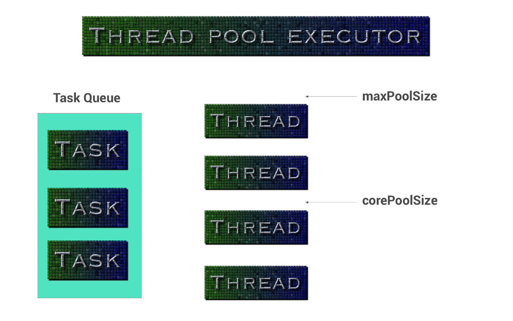

 
<!--BEGIN_DATA
{
    "create_date": "2016-12-07 11:20", 
    "modify_date": "2016-12-07 11:20", 
    "is_top": "0", 
    "summary": "Android中的线程池使用", 
    "tags": "Android", 
    "file_name": "Android中的线程池使用.md"
}
END_DATA-->

####<p>原文出处：<a href='https://ghui.me/post/2016/11/thread-pool-in-android/' target='blank'>Android中的线程池使用</a></p>

##【译】Android中的线程池使用


这篇文章将会覆盖到_线程池_、_线程池Executor_，以及它们在Android中的使用。通过大量的示例我们将完全覆盖这些主题。

> 本文是 [Using ThreadPoolExecutor in Android](https://medium.freecodecamp.com/threadpoolexecutor-in-android-8e9d22330ee3#.hedsyejm6) 的翻译,
限于个人能力有限如有疑问请查看原文或留言.



###线程池

一个线程池管理一池子的工作线程（工作线程的数量依赖于具体的线程池实现）。

一个任务队列容纳等待被线程池中的空闲线程执行的任务。任务被“生产者”添加到队列中，与之对应的工作线程作为消费者的角色消费任务队列中的任务，只要线程池中有空闲的线程等待去执行后台任务。

###线程池Executor

线程池executor执行一个线程池中给定的任务。

    
    ThreadPoolExecutor threadPoolExecutor = new ThreadPoolExecutor(  
        int corePoolSize,  
        int maximumPoolSize,  
        long keepAliveTime,  
        TimeUnit unit,  
        BlockingQueue<Runnable> workQueue  
    );  
    

这些参数都是什么含义？

  1. **corePoolSize:** 线程池中保留的线程的最小数量。

初始情况下线程池中的线程数量为0。但是随着任务被加到队列中，新的线程会被创建。如果在线程池中存在空闲的线程—但是线程的数量小于**corePoolSize*
*—那么新的线程会被继续创建。

  2. **maximumPoolSize:** 线程池中所能容纳的最大线程数量。如果它的数量大于**corePoolSize**—并且当前的线程数量>= **corePoolSize**—那么新的工作线程会被继续创建只要任务队列中的任务足够多。

  3. **keepAliveTime:** 当线程的数量大于**corePoolSize**，非核心的线程（额外的空闲线程）将会等待新的任务，如果它们在这个参数定义的时间内没有等到一个新的任务，这些线程会被终结。

  4. **unit:** 参数**keepAliveTime**的单位

  5. **workQueue:** 任务队列，它只接收runnable任务。它必须是一个[BlockingQueue](http://developer.android.com/reference/java/util/concurrent/BlockingQueue.html).

###为何要使用线程池在Android或Java程序中

  1. 它是一个强大的任务处理框架，因为它支持额外的任务保存在队列中，支持任务取消，以及设置任务的优先级。
  2. 它减小了所需要创建的线程的最大数量，因为它维护了指定数量的线程在它的池子中。

###在Android中使用ThreadPoolExecutor

首先，创建一个**PriorityThreadFactory:**
    
    
    public class PriorityThreadFactory implements ThreadFactory {  
      
        private final int mThreadPriority;  
      
        public PriorityThreadFactory(int threadPriority) {  
            mThreadPriority = threadPriority;  
        }  
      
        @Override  
        public Thread newThread(final Runnable runnable) {  
            Runnable wrapperRunnable = new Runnable() {  
                @Override  
                public void run() {  
                    try {  
                        Process.setThreadPriority(mThreadPriority);  
                    } catch (Throwable t) {  
      
                    }  
                    runnable.run();  
                }  
            };  
            return new Thread(wrapperRunnable);  
        }  
      
    }  
    

> [PriorityThreadFactory.java](https://gist.github.com/amitshekhariitbhu/9bc3f
1e384b6a437051708d8e12e214e#file-prioritythreadfactory-java) hosted with ❤ by
[GitHub](https://github.com/)

创建一个**MainThreadExecutor:**

    
    public class MainThreadExecutor implements Executor {  
      
        private final Handler handler = new Handler(Looper.getMainLooper());  
      
        @Override  
        public void execute(Runnable runnable) {  
            handler.post(runnable);  
        }  
    }  
    

> [MainThreadExecutor.java](https://gist.github.com/amitshekhariitbhu/75034e3a
69fdb835fa29bc63ae8a2d33#file-mainthreadexecutor-java) hosted with ❤ by
[GitHub](https://github.com/)

创建一个**DefaultExecutorSupplier:**
    

    /*  
    * Singleton class for default executor supplier  
    */  
    public class DefaultExecutorSupplier{  
        /*  
        * Number of cores to decide the number of threads  
        */  
        public static final int NUMBER_OF_CORES = Runtime.getRuntime().availableProcessors();  
          
        /*  
        * thread pool executor for background tasks  
        */  
        private final ThreadPoolExecutor mForBackgroundTasks;  
        /*  
        * thread pool executor for light weight background tasks  
        */  
        private final ThreadPoolExecutor mForLightWeightBackgroundTasks;  
        /*  
        * thread pool executor for main thread tasks  
        */  
        private final Executor mMainThreadExecutor;  
        /*  
        * an instance of DefaultExecutorSupplier  
        */  
        private static DefaultExecutorSupplier sInstance;  
      
        /*  
        * returns the instance of DefaultExecutorSupplier  
        */  
        public static DefaultExecutorSupplier getInstance() {  
           if (sInstance == null) {  
             synchronized(DefaultExecutorSupplier.class){                                                                    
                 sInstance = new DefaultExecutorSupplier();        
            }  
            return sInstance;  
        }  
      
        /*  
        * constructor for  DefaultExecutorSupplier  
        */   
        private DefaultExecutorSupplier() {  
              
            // setting the thread factory  
            ThreadFactory backgroundPriorityThreadFactory = new   
                    PriorityThreadFactory(Process.THREAD_PRIORITY_BACKGROUND);  
              
            // setting the thread pool executor for mForBackgroundTasks;  
            mForBackgroundTasks = new ThreadPoolExecutor(  
                    NUMBER_OF_CORES * 2,  
                    NUMBER_OF_CORES * 2,  
                    60L,  
                    TimeUnit.SECONDS,  
                    new LinkedBlockingQueue<Runnable>(),  
                    backgroundPriorityThreadFactory  
            );  
              
            // setting the thread pool executor for mForLightWeightBackgroundTasks;  
            mForLightWeightBackgroundTasks = new ThreadPoolExecutor(  
                    NUMBER_OF_CORES * 2,  
                    NUMBER_OF_CORES * 2,  
                    60L,  
                    TimeUnit.SECONDS,  
                    new LinkedBlockingQueue<Runnable>(),  
                    backgroundPriorityThreadFactory  
            );  
              
            // setting the thread pool executor for mMainThreadExecutor;  
            mMainThreadExecutor = new MainThreadExecutor();  
        }  
      
        /*  
        * returns the thread pool executor for background task  
        */  
        public ThreadPoolExecutor forBackgroundTasks() {  
            return mForBackgroundTasks;  
        }  
      
        /*  
        * returns the thread pool executor for light weight background task  
        */  
        public ThreadPoolExecutor forLightWeightBackgroundTasks() {  
            return mForLightWeightBackgroundTasks;  
        }  
      
        /*  
        * returns the thread pool executor for main thread task  
        */  
        public Executor forMainThreadTasks() {  
            return mMainThreadExecutor;  
        }  
    }  
    

> [DefaultExecutorSupplier.java](https://gist.github.com/amitshekhariitbhu/c90
e5a5b07f7a18a9b1bc2f8fd0b265b#file-defaultexecutorsupplier-java) hosted with ❤
by [GitHub](https://github.com/)

**注意：不同的线程池可以维护不同数量的线程，就看你的实际需要了**

现在可以像下面这样在你的代码中使用它们：
    
    
    /*  
    * Using it for Background Tasks  
    */  
    public void doSomeBackgroundWork(){  
      DefaultExecutorSupplier.getInstance().forBackgroundTasks()  
        .execute(new Runnable() {  
        @Override  
        public void run() {  
           // do some background work here.  
        }  
      });  
    }  
      
    /*  
    * Using it for Light-Weight Background Tasks  
    */  
    public void doSomeLightWeightBackgroundWork(){  
      DefaultExecutorSupplier.getInstance().forLightWeightBackgroundTasks()  
        .execute(new Runnable() {  
        @Override  
        public void run() {  
           // do some light-weight background work here.  
        }  
      });  
    }  
      
    /*  
    * Using it for MainThread Tasks  
    */  
    public void doSomeMainThreadWork(){  
      DefaultExecutorSupplier.getInstance().forMainThreadTasks()  
        .execute(new Runnable() {  
        @Override  
        public void run() {  
           // do some Main Thread work here.  
        }  
      });  
    }  
    

> [UsingThreadPool.java](https://gist.github.com/amitshekhariitbhu/bacc9dcb936
e5f14327ec4f3a8e16302#file-usingthreadpool-java) hosted with ❤ by
[GitHub](https://github.com/)

通过这种方式，我们能创建不同的线程池为网络任务，I/O任务，很重的后台任务，以及其它的任务。

###如何取消一个任务

要取消一个任务，你需要得到那个任务的**future**。所以你需要用**submit**方法而不是**execute**，它可以返回一
个future对象。你就可以通过这个future对象来取消那个任务。
    
    
    /*  
    * Get the future of the task by submitting it to the pool  
    */  
    Future future = DefaultExecutorSupplier.getInstance().forBackgroundTasks()  
        .submit(new Runnable() {  
        @Override  
        public void run() {  
          // do some background work here.  
        }  
    });  
      
    /*  
    * cancelling the task  
    */  
    future.cancel(true);  
    

> [CancelTask.java](https://gist.github.com/amitshekhariitbhu/a7973c61122f65c3
4dfda419a1f132cf#file-canceltask-java) hosted with ❤ by
[GitHub](https://github.com/)

###如何设置任务的优先级

我们假设在一个队列中有20个任务，但是线程池中只有4个线程。我们依据它们的优先级来执行，因为线程池只能同时执行4个任务。

但是假设我们需要让最后一个进入队列中的任务先执行。我们需要给这个任务设置**IMMEDIATE**优先级，这样就可以让线程取任务时优先取这个任务去执行（因为
它的优先级最高）。

要设置任务的优先级，我们需要创建一个线程池executor。

创建一个优先级枚举：

    
    /**  
     * Priority levels  
     */  
    public enum Priority {  
        /**  
         * NOTE: DO NOT CHANGE ORDERING OF THOSE CONSTANTS UNDER ANY CIRCUMSTANCES.  
         * Doing so will make ordering incorrect.  
         */  
      
        /**  
         * Lowest priority level. Used for prefetches of data.  
         */  
        LOW,  
      
        /**  
         * Medium priority level. Used for warming of data that might soon get visible.  
         */  
        MEDIUM,  
      
        /**  
         * Highest priority level. Used for data that are currently visible on screen.  
         */  
        HIGH,  
      
        /**  
         * Highest priority level. Used for data that are required instantly(mainly for emergency).  
         */  
        IMMEDIATE;  
      
    }  
    

> [Priority.java](https://gist.github.com/amitshekhariitbhu/b902649f2bdddb2b99
799bdf313caad3#file-priority-java) hosted with ❤ by
[GitHub](https://github.com/)

创建一个PriorityRunnable:

    
    
    public class PriorityRunnable implements Runnable {  
      
        private final Priority priority;  
      
        public PriorityRunnable(Priority priority) {  
            this.priority = priority;  
        }  
      
        @Override  
        public void run() {  
          // nothing to do here.  
        }  
      
        public Priority getPriority() {  
            return priority;  
        }  
      
    }  
    

> [PriorityRunnable.java](https://gist.github.com/amitshekhariitbhu/a717dc44dd
6afbf80aeec61c2ae299c3#file-priorityrunnable-java) hosted with ❤ by
[GitHub](https://github.com/)

创建一个PriorityThreadPoolExecutor，它继承自ThreadPoolExecutor。我们还需要创建一个PriorityFutureT
ask，它实现了Comparable

    
    
    public class PriorityThreadPoolExecutor extends ThreadPoolExecutor {  
      
       public PriorityThreadPoolExecutor(int corePoolSize, int maximumPoolSize, long keepAliveTime,  
             TimeUnit unit, ThreadFactory threadFactory) {  
            super(corePoolSize, maximumPoolSize, keepAliveTime, unit,new PriorityBlockingQueue<Runnable>(), threadFactory);  
        }  
      
        @Override  
        public Future<?> submit(Runnable task) {  
            PriorityFutureTask futureTask = new PriorityFutureTask((PriorityRunnable) task);  
            execute(futureTask);  
            return futureTask;  
        }  
      
        private static final class PriorityFutureTask extends FutureTask<PriorityRunnable>  
                implements Comparable<PriorityFutureTask> {  
            private final PriorityRunnable priorityRunnable;  
      
            public PriorityFutureTask(PriorityRunnable priorityRunnable) {  
                super(priorityRunnable, null);  
                this.priorityRunnable = priorityRunnable;  
            }  
              
            /*  
             * compareTo() method is defined in interface java.lang.Comparable and it is used  
             * to implement natural sorting on java classes. natural sorting means the the sort   
             * order which naturally applies on object e.g. lexical order for String, numeric   
             * order for Integer or Sorting employee by there ID etc. most of the java core   
             * classes including String and Integer implements CompareTo() method and provide  
             * natural sorting.  
             */  
            @Override  
            public int compareTo(PriorityFutureTask other) {  
                Priority p1 = priorityRunnable.getPriority();  
                Priority p2 = other.priorityRunnable.getPriority();  
                return p2.ordinal() - p1.ordinal();  
            }  
        }  
    }  
    

> [PriorityThreadPoolExecutor.java](https://gist.github.com/amitshekhariitbhu/
518a1d484f412225104e2a76e559e465#file-prioritythreadpoolexecutor-java) hosted
with ❤ by [GitHub](https://github.com/)

首先，在DefaultExecutorSupplier中，我们需要用PriorityThreadPoolExecutor代替ThreadPoolExecut
or像下面这个：
    
    
    public class DefaultExecutorSupplier{  
      
    private final PriorityThreadPoolExecutor mForBackgroundTasks;  
      
    private DefaultExecutorSupplier() {  
        
            mForBackgroundTasks = new PriorityThreadPoolExecutor(  
                    NUMBER_OF_CORES * 2,  
                    NUMBER_OF_CORES * 2,  
                    60L,  
                    TimeUnit.SECONDS,  
                    backgroundPriorityThreadFactory  
            );  
      
        }  
    }  
    

> [DefaultExecutorSupplierP.java](https://gist.github.com/amitshekhariitbhu/00
5fef58cfe6a169b312eef8ce95c96c#file-defaultexecutorsupplierp-java) hosted with
❤ by [GitHub](https://github.com/)

下面是一个例子展示了如果给一个任务设置**HIGH**优先级：
    
    
    /*  
    * do some task at high priority  
    */  
    public void doSomeTaskAtHighPriority(){  
      DefaultExecutorSupplier.getInstance().forBackgroundTasks()  
        .submit(new PriorityRunnable(Priority.HIGH) {  
        @Override  
        public void run() {  
          // do some background work here at high priority.  
        }  
    });  
    }  
    

> [PriorityTask.java](https://gist.github.com/amitshekhariitbhu/52dcd765016869
759cec4a72f603247f#file-prioritytask-java) hosted with ❤ by
[GitHub](https://github.com/)

通过这种方式，一个任务就可以被设置执行地优先级。

上面的实现也适用于任何**JAVA**程序。

我用了这个线程池实现在**[Android Networking Library**](https://github.com/amitshekhariitbhu/Android-Networking).

想要了解更多实现细节，你可以把 **[Android Networking here**](https://github.com/amitshekhariitbhu/Android-Networking)项目中的DefaultExecutorSupplier.java检出看看。

我希望这些讲解能够帮到你。

谢谢阅读这个文章。如果你喜欢这篇文章，那就在下面点一下❤推荐一下吧。

想了解更多的编程知识，你可以关注我，这样我写了新文章时你会得到通知。

来[这里](https://medium.com/@amitshekhar)看我所有的文章。

谢谢！

**[Amit Shekhar**](https://medium.com/@amitshekhar)

你也可以在 **[Twitter**](https://twitter.com/amitiitbhu),
**[Linkedin**](https://in.linkedin.com/in/amit-shekhar-3b556499),
**[Github**](https://github.com/amitshekhariitbhu) and
**[Facebook**](https://www.facebook.com/amit.shekhar.iitbhu)找到我。


<hr>


####<p>原文出处：<a href='http://blog.csdn.net/lpjishu/article/details/53366175' target='blank'> Android程序员必须掌握的知识点-多进程和多线程</a></p>

当某个应用组件启动且该应用没有运行其他任何组件时，Android 系统会使用单个执行线程为应用启动新的 Linux进程。默认情况下，同一应用的所有组件在相同的进程和线程（称为“主”线程）中运行。
如果某个应用组件启动且该应用已存在进程（因为存在该应用的其他组件），则该组件会在此进程内启动并使用相同的执行线程。
但是，您可以安排应用中的其他组件在单独的进程中运行，并为任何进程创建额外的线程。

本文介绍进程和线程在 Android 应用中的工作方式。

##进程

默认情况下，同一应用的所有组件均在相同的进程中运行，且大多数应用都不会改变这一点。 但是，如果您发现需要控制某个组件所属的进程，则可在清单文件中执行此操作。

各类组件元素的清单文件条目—activity、service、receiver 和 provider—均支持 android:process属性，此属性可以指定该组件应在哪个进程运行。您可以设置此属性，使每个组件均在各自的进程中运行，或者使一些组件共享一个进程，而其他组件则不共享。
此外，您还可以设置 android:process，使不同应用的组件在相同的进程中运行，但前提是这些应用共享相同的 Linux 用户 ID 并使用相同的证书进行签署。

此外，application 元素还支持 android:process 属性，以设置适用于所有组件的默认值。

如果内存不足，而其他为用户提供更紧急服务的进程又需要内存时，Android 可能会决定在某一时刻关闭某一进程。在被终止进程中运行的应用组件也会随之销毁。
当这些组件需要再次运行时，系统将为它们重启进程。

决定终止哪个进程时，Android 系统将权衡它们对用户的相对重要程度。例如，相对于托管可见 Activity的进程而言，它更有可能关闭托管屏幕上不再可见的 Activity 的进程。 因此，是否终止某个进程的决定取决于该进程中所运行组件的状态。
下面，我们介绍决定终止进程所用的规则。

##进程生命周期

Android 系统将尽量长时间地保持应用进程，但为了新建进程或运行更重要的进程，最终需要移除旧进程来回收内存。
为了确定保留或终止哪些进程，系统会根据进程中正在运行的组件以及这些组件的状态，将每个进程放入“重要性层次结构”中。
必要时，系统会首先消除重要性最低的进程，然后是重要性略逊的进程，依此类推，以回收系统资源。

##重要性层次结构一共有 5 级。

以下列表按照重要程度列出了各类进程（第一个进程最重要，将是最后一个被终止的进程）：

##前台进程

用户当前操作所必需的进程。如果一个进程满足以下任一条件，即视为前台进程：  
托管用户正在交互的 Activity（已调用 Activity 的 onResume() 方法）  
托管某个 Service，后者绑定到用户正在交互的 Activity  
托管正在“前台”运行的 Service（服务已调用 startForeground()）  
托管正执行一个生命周期回调的 Service（onCreate()、onStart() 或 onDestroy()）  
托管正执行其 onReceive() 方法的 BroadcastReceiver  
通常，在任意给定时间前台进程都为数不多。只有在内存不足以支持它们同时继续运行这一万不得已的情况下，系统才会终止它们。
此时，设备往往已达到内存分页状态，因此需要终止一些前台进程来确保用户界面正常响应。

##可见进程

没有任何前台组件、但仍会影响用户在屏幕上所见内容的进程。 如果一个进程满足以下任一条件，即视为可见进程：  
托管不在前台、但仍对用户可见的 Activity（已调用其 onPause() 方法）。例如，如果前台 Activity
启动了一个对话框，允许在其后显示上一 Activity，则有可能会发生这种情况。  
托管绑定到可见（或前台）Activity 的 Service。  
可见进程被视为是极其重要的进程，除非为了维持所有前台进程同时运行而必须终止，否则系统不会终止这些进程。

##服务进程

正在运行已使用 startService() 方法启动的服务且不属于上述两个更高类别进程的进程。尽管服务进程与用户所见内容没有直接关联，但是它们通常在执行一些用户关心的操作（例如，在后台播放音乐或从网络下载数据）。因此，除非内存不足以维持所有前台进程和可见进程同时运行，否则系统会让服务进程保持运行状态。

##后台进程

包含目前对用户不可见的 Activity 的进程（已调用 Activity 的 onStop()
方法）。这些进程对用户体验没有直接影响，系统可能随时终止它们，以回收内存供前台进程、可见进程或服务进程使用。 通常会有很多后台进程在运行，因此它们会保存在
LRU （最近最少使用）列表中，以确保包含用户最近查看的 Activity 的进程最后一个被终止。如果某个 Activity 正确实现了生命周期方法，并保存了其当前状态，则终止其进程不会对用户体验产生明显影响，因为当用户导航回该 Activity 时，Activity 会恢复其所有可见状态。 有关保存和恢复状态的信息，请参阅 Activity文档。

##空进程

不含任何活动应用组件的进程。保留这种进程的的唯一目的是用作缓存，以缩短下次在其中运行组件所需的启动时间。
为使总体系统资源在进程缓存和底层内核缓存之间保持平衡，系统往往会终止这些进程。  
根据进程中当前活动组件的重要程度，Android 会将进程评定为它可能达到的最高级别。例如，如果某进程托管着服务和可见Activity，则会将此进程评定为可见进程，而不是服务进程。

此外，一个进程的级别可能会因其他进程对它的依赖而有所提高，即服务于另一进程的进程其级别永远不会低于其所服务的进程。 例如，如果进程 A 中的内容提供程序为进程 B 中的客户端提供服务，或者如果进程 A 中的服务绑定到进程 B 中的组件，则进程 A 始终被视为至少与进程 B 同样重要。

由于运行服务的进程其级别高于托管后台 Activity 的进程，因此启动长时间运行操作的 Activity 最好为该操作启动服务，而不是简单地创建工作线程，当操作有可能比 Activity 更加持久时尤要如此。例如，正在将图片上传到网站的 Activity
应该启动服务来执行上传，这样一来，即使用户退出 Activity，仍可在后台继续执行上传操作。使用服务可以保证，无论 Activity 发生什么情况，该操作至少具备“服务进程”优先级。 同理，广播接收器也应使用服务，而不是简单地将耗时冗长的操作放入线程中。

##线程

应用启动时，系统会为应用创建一个名为“主线程”的执行线程。 此线程非常重要，因为它负责将事件分派给相应的用户界面小部件，其中包括绘图事件。
此外，它也是应用与 Android UI 工具包组件（来自 android.widget 和 android.view软件包的组件）进行交互的线程。因此，主线程有时也称为 UI 线程。

系统不会为每个组件实例创建单独的线程。运行于同一进程的所有组件均在 UI 线程中实例化，并且对每个组件的系统调用均由该线程进行分派。
因此，响应系统回调的方法（例如，报告用户操作的 onKeyDown() 或生命周期回调方法）始终在进程的 UI 线程中运行。

例如，当用户触摸屏幕上的按钮时，应用的 UI 线程会将触摸事件分派给小部件，而小部件反过来又设置其按下状态，并将失效请求发布到事件队列中。 UI线程从队列中取消该请求并通知小部件应该重绘自身。

在应用执行繁重的任务以响应用户交互时，除非正确实现应用，否则这种单线程模式可能会导致性能低下。 具体地讲，如果 UI 线程需要处理所有任务，则执行耗时很长的操作（例如，网络访问或数据库查询）将会阻塞整个 UI。 一旦线程被阻塞，将无法分派任何事件，包括绘图事件。
从用户的角度来看，应用显示为挂起。 更糟糕的是，如果 UI 线程被阻塞超过几秒钟时间（目前大约是 5 秒钟），用户就会看到一个让人厌烦的“应用无响应”(ANR) 对话框。如果引起用户不满，他们可能就会决定退出并卸载此应用。

此外，Android UI 工具包并非线程安全工具包。因此，您不得通过工作线程操纵 UI，而只能通过 UI 线程操纵用户界面。 因此，Android 的单线程模式必须遵守两条规则：

##不要阻塞 UI 线程

不要在 UI 线程之外访问 Android UI 工具包

##工作线程

根据上述单线程模式，要保证应用 UI 的响应能力，关键是不能阻塞 UI 线程。
如果执行的操作不能很快完成，则应确保它们在单独的线程（“后台”或“工作”线程）中运行。

例如，以下代码演示了一个点击侦听器从单独的线程下载图像并将其显示在 ImageView 中：

    
    
    public void onClick(View v) {
        new Thread(new Runnable() {
            public void run() {
                Bitmap b = loadImageFromNetwork("http://example.com/image.png");
                mImageView.setImageBitmap(b);
            }
        }).start();
    }

乍看起来，这段代码似乎运行良好，因为它创建了一个新线程来处理网络操作。 但是，它违反了单线程模式的第二条规则：不要在 UI 线程之外访问 Android
UI 工具包 — 此示例从工作线程（而不是 UI 线程）修改了 ImageView。 这可能导致出现不明确、不可预见的行为，但要跟踪此行为困难而又费时。

为解决此问题，Android 提供了几种途径来从其他线程访问 UI 线程。

##以下列出了几种有用的方法：

Activity.runOnUiThread(Runnable)  
View.post(Runnable)  
View.postDelayed(Runnable, long)

    
    
    例如，您可以通过使用 View.post(Runnable) 方法修复上述代码：
    public void onClick(View v) {
        new Thread(new Runnable() {
            public void run() {
                final Bitmap bitmap =
                        loadImageFromNetwork("http://example.com/image.png");
                mImageView.post(new Runnable() {
                    public void run() {
                        mImageView.setImageBitmap(bitmap);
                    }
                });
            }
        }).start();
    }

现在，上述实现属于线程安全型：在单独的线程中完成网络操作，而在 UI 线程中操纵 ImageView。

但是，随着操作日趋复杂，这类代码也会变得复杂且难以维护。 要通过工作线程处理更复杂的交互，可以考虑在工作线程中使用 Handler 处理来自 UI 线程的消息。当然，最好的解决方案或许是扩展 AsyncTask 类，此类简化了与 UI 进行交互所需执行的工作线程任务。

##使用 AsyncTask

AsyncTask 允许对用户界面执行异步操作。 它会先阻塞工作线程中的操作，然后在 UI 线程中发布结果，而无需您亲自处理线程和/或处理程序。

要使用它，必须创建 AsyncTask 的子类并实现 doInBackground() 回调方法，该方法将在后台线程池中运行。 要更新 UI，应该实现 onPostExecute() 以传递 doInBackground() 返回的结果并在 UI 线程中运行，以便您安全地更新 UI。 稍后，您可以通过从UI 线程调用 execute() 来运行任务。

例如，您可以通过以下方式使用 AsyncTask 来实现上述示例：

    
    
    public void onClick(View v) {
        new DownloadImageTask().execute("http://example.com/image.png");
    }
    private class DownloadImageTask extends AsyncTask<String, Void, Bitmap> {
        /** The system calls this to perform work in a worker thread and
          * delivers it the parameters given to AsyncTask.execute() */
        protected Bitmap doInBackground(String... urls) {
            return loadImageFromNetwork(urls[0]);
        }
        /** The system calls this to perform work in the UI thread and delivers
          * the result from doInBackground() */
        protected void onPostExecute(Bitmap result) {
            mImageView.setImageBitmap(result);
        }
    }

现在 UI 是安全的，代码也得到简化，因为任务分解成了两部分：一部分应在工作线程内完成，另一部分应在 UI 线程内完成。

下面简要概述了 AsyncTask 的工作方法，但要全面了解如何使用此类，您应阅读 AsyncTask 参考文档：

可以使用泛型指定参数类型、进度值和任务最终值方法 doInBackground() 会在工作线程上自动执行  onPreExecute()、onPostExecute() 和 onProgressUpdate() 均在 UI 线程中调用doInBackground() 返回的值将发送到 onPostExecute() 您可以随时在 doInBackground() 中调用publishProgress()，以在 UI 线程中执行 onProgressUpdate() 您可以随时取消任何线程中的任务  

注意：使用工作线程时可能会遇到另一个问题，即：运行时配置变更（例如，用户更改了屏幕方向）导致 Activity 意外重启，这可能会销毁工作线程。

要了解如何在这种重启情况下坚持执行任务，以及如何在 Activity 被销毁时正确地取消任务，请参阅书架示例应用的源代码。

##线程安全方法

在某些情况下，您实现的方法可能会从多个线程调用，因此编写这些方法时必须确保其满足线程安全的要求。

这一点主要适用于可以远程调用的方法，如绑定服务中的方法。如果对 IBinder 中所实现方法的调用源自运行 IBinder的同一进程，则该方法在调用方的线程中执行。但是，如果调用源自其他进程，则该方法将在从线程池选择的某个线程中执行（而不是在进程的 UI 线程中执行），线程池由系统在与 IBinder 相同的进程中维护。 例如，即使服务的 onBind() 方法将从服务进程的 UI 线程调用，在 onBind() 返回的对象中实现的方法（例如，实现 RPC 方法的子类）仍会从线程池中的线程调用。
由于一个服务可以有多个客户端，因此可能会有多个池线程在同一时间使用同一 IBinder 方法。因此，IBinder 方法必须实现为线程安全方法。

同样，内容提供程序也可接收来自其他进程的数据请求。尽管 ContentResolver 和 ContentProvider类隐藏了如何管理进程间通信的细节，但响应这些请求的 ContentProvider方法（query()、insert()、delete()、update() 和 getType()方法）将从内容提供程序所在进程的线程池中调用，而不是从进程的 UI 线程调用。

由于这些方法可能会同时从任意数量的线程调用，因此它们也必须实现为线程安全方法。

##进程间通信

Android 利用远程过程调用 (RPC) 提供了一种进程间通信 (IPC) 机制，通过这种机制，由 Activity 或其他应用组件调用的方法将（在其他进程中）远程执行，而所有结果将返回给调用方。
这就要求把方法调用及其数据分解至操作系统可以识别的程度，并将其从本地进程和地址空间传输至远程进程和地址空间，然后在远程进程中重新组装并执行该调用。
然后，返回值将沿相反方向传输回来。 Android 提供了执行这些 IPC 事务所需的全部代码，因此您只需集中精力定义和实现 RPC 编程接口即可。

要执行 IPC，必须使用 bindService() 将应用绑定到服务上。


<hr>

####<p>原文出处：<a href='http://blog.sina.com.cn/s/blog_74e9d98d0101g9iw.html' target='blank'>Android中的几种多线程实现 </a></p>

###有以下几种方式：

1. Activity.runOnUiThread(Runnable)

2. View.post(Runnable) ;View.postDelay(Runnable , long)

3. Handler

4. AsyncTask

Android是单线程模型，这意味着Android UI操作并不是线程安全的并且这些操作必须在UI线程中执行，所以你单纯的new一个Thread并且start()是不行的，因为这违背了Android的单线程模型。那么如何用好多线程呢？总结一下：

事件处理的原则：所有可能耗时的操作都放到其他线程去处理。

　　Android中的Main线程的事件处理不能太耗时，否则后续的事件无法在5秒内得到响应，就会弹出ANR对话框。那么哪些方法会在 Main线程执行呢？

* 1 Activity的生命周期方法，例如：onCreate（）、onStart（）、onResume（）等

* 2 事件处理方法，例如onClick（）、onItemClick()等

　　通常Android基类中以on开头的方法是在Main线程被回调的。

　　提高应用的响应性，可以从这两方面入手。

　　一般来说，Activity的onCreate（）、onStart（）、onResume（）方法的执行时间决定了你的应用首页打开的时间，这里要尽量把不必要的操作放到其他线程去处理，如果仍然很耗时，可以使用SplashScreen。使用SplashScreen最好用动态的，这样用户知道你的应用没有死掉。

　当用户与你的应用交互时，事件处理方法的执行快慢决定了应用的响应性是否良好，一般分为同步和异步两种情况：

　　1） 同步，需要等待返回结果。例如用户点击了注册按钮，需要等待服务端返回结果，那么需要有一个进度条来提示用户你的程序正在运行没有死掉。一般与服务端交互的
都要有进度条，例如系统自带的浏览器，URL跳转时会有进度条。

　　2） 异步，不需要等待返回结果。例如微博中的收藏功能，点击完收藏按钮后是否成功执行完成后告诉我就行了，我不想等它，这里最好实现为异步的。

　　无论同步异步，事件处理都可能比较耗时，那么需要放到其他线程中处理，等处理完成后，再通知界面刷新。

　　这里有一点要注意，不是所有的界面刷新行为都需要放到Main线程处理，例如TextView的setText（）方法需要在Main线程中，否则会抛出CalledFromWrongThreadException，而ProgressBar的setProgress（）方法则不需要在Main线程中处理。

　　当然你也可以把所有UI组件相关行为都放到Main线程中处理，没有问题。可以减轻你的思考负担，但你最好了解他们之间的差别，掌握事物之间细微差别的是专家。把事件处理代码放到其他线程中处理，如果处理的结果需要刷新界面，那么需要线程间通讯的方法来实现在其他线程中发消息给Main线程处理。

###如何实现线程间通讯

　　在Android中有多种方法可以实现其他线程与Main线程通讯，我们这里介绍常见的两种。

####1） 使用AsyncTask

　　AsyncTask是Android框架提供的异步处理的辅助类，它可以实现耗时操作在其他线程执行，而处理结果在Main线程执行，对于开发者而言，它屏蔽掉了多线程和后面要讲的Handler的概念。你不了解怎么处理线程间通讯也没有关系，AsyncTask体贴的帮你做好了。使用他你会发现你的代码很容易被理解，因为他们都有一些具有特定职责的方法，尤其是AsyncTask，有预处理的方法onPreExecute，有后台执行任务的方
法doInBackground，有更新进度的方法publishProgress，有返回结果的方法onPostExecute等等，这就不像post这些方法，把所有的操作都写在一个Runnable里。不过封装越好越高级的API，对初级程序员反而越不利，就是你不了解它的原理。当你需要面对更加复杂的情况，而高级API无法完成得很好时，你就杯具了。所以，我们也要掌握功能更强大，更自由的与Main线程通讯的方法：Handler的使用。

####2） 使用Handler

　　这里需要了解Android SDK提供的几个线程间通讯的类。

#####2.1 Handler

　　Handler在android里负责发送和处理消息，通过它可以实现其他线程与Main线程之间的消息通讯。

#####2.2 Looper

　　Looper负责管理线程的消息队列和消息循环

#####2.3 Message

　　Message是线程间通讯的消息载体。两个码头之间运输货物，Message充当集装箱的功能，里面可以存放任何你想要传递的消息。

#####2.4 MessageQueue

　　MessageQueue是消息队列，先进先出，它的作用是保存有待线程处理的消息。

　　它们四者之间的关系是，在其他线程中调用Handler.sendMsg（）方法（参数是Message对象），将需要Main线程处理的事件添加到Main线程的MessageQueue中，Main线程通过MainLooper从消息队列中取出Handler发过来的这个消息时，会回调
Handler的handlerMessage（）方法。

　　除了以上两种常用方法之外，还有几种比较简单的方法

####3） Activity.runOnUiThread（Runnable）

####4） View.post（Runnable）

　　View.postDelayed（Runnable， long）

####5） Handler.post

　　Handler.postDelayed（Runnable， long）

利用线程池提高性能

　　这里我们建议使用线程池来管理临时的Thread对象，从而达到提高应用程序性能的目的。

　　线程池是资源池在线程应用中的一个实例。了解线程池之前我们首先要了解一下资源池的概念。在JAVA中，创建和销毁对象是比较消耗资源的。我们如果在应用中需要频繁创建销毁某个类型的对象实例，这样会产生很多临时对象，当失去引用的临时对象较多时，虚拟机会进行垃圾回收（GC），CPU在进行GC时会导致应用程序的运行得不到相应，从而导致应用的响应性降低。

　　资源池就是用来解决这个问题，当你需要使用对象时，从资源池来获取，资源池负责维护对象的生命周期。

　　了解了资源池，就很好理解线程池了，线程池就是存放对象类型都是线程的资源池。

　　我增加了如何在其他线程中创建Handler的例子作为选学，前面都掌握好了的同学可以看一下，如果你需要实现一个跟Main线程类似的消息处理机制，需要其他线程可以跟你的线程通讯，可以通过这种方法实现。

####1、问题提出  
  
1）为何需要多线程？  
  
2）多线程如何实现？  
  
3）多线程机制的核心是啥？  
  
4）到底有多少种实现方式？

####2、问题分析  
  
1）究其为啥需要多线程的本质就是异步处理，直观一点说就是不要让用户感觉到“很卡”。  
  
eg:你点击按钮下载一首歌，接着该按钮一直处于按下状态，那么用户体验就很差。

2）多线程实现方式implements Runnable 或 extends Thread

3）多线程核心机制是Handler

4）提供如下几种实现方式  
  
####Handler  
  
————————————说明1  
  
创建一个Handler时一定要关联一个Looper实例，默认构造方法Handler()，它是关联当前Thread的Looper。  
  
eg:  
  
我们在UI Thread中创建一个Handler,那么此时就关联了UI Thread的Looper！  
  
这一点从源码中可以看出！  
  
精简代码如下：  

```java  
public Handler() {  
  
	mLooper = Looper.myLooper();  
	  
	//当前线程的Looper，在Activity创建时，UI线程已经创建了Looper对象  
	//在Handler中机制中Looper是最为核心的，它一直处于循环读MessageQueue，有   
	//要处理的Message就将Message发送给当前的Handler实例来处理

    
    if (mLooper == null) {  
        throw new RuntimeException(  
            "Can’t create handler inside thread that has not called Looper.prepare()"); 
    }  
    
	//从以上可以看出，一个Handler实例必须关联一个Looper对象，否则出错
 
    mQueue = mLooper.mQueue;  
    
//Handler的MessageQueue，它是FIFO的吗？不是！我感觉应该是按时间先后排列    
//的！Message与MessageQueue到底是啥关系？感兴趣可以研究一下源码！

     mCallback = null;  
}  
```    

在创建一个Handler的时候也可以指定Looper，此时的Looper对象，可以是当前线程的也可以是其它线程的！  
  
Handler只是处理它所关联的Looper中的MessageQueue中的Message，至于它哪个线程的Looper，Handler并不是很关心！  
  
eg:  
  
我们在UI线程中创建了Handler实例，此时传进Worker线程的Looper，此时依然可以进行业务操作！  
  
eg:  
  
\--------------------创建工作者线程
    
    private static final class Worker implements Runnable  
     {  
      private static final Object mLock = new Object() ;  
      private Looper mLooper ;  
      public Worker(String name)  
      {  
       final Thread thread = new Thread(null,this,name) ;  
       thread.setPriority(Thread.MIN_PRIORITY) ;  
       thread.start() ;  
       synchronized(mLock)  
       {  
        while(mLooper == null)  
        {  
         try   
         {  
          mLock.wait() ;  
         }   
         catch (InterruptedException e)   
         {  
          e.printStackTrace();  
         }  
        }  
       }  
      }  
      @Override  
      public void run() {  
       synchronized(mLock)  
       {      
        //该方法只能执行一次,一个Thread只能关联一个Looper  
           Looper.prepare() ;  
           mLooper = Looper.myLooper() ;  
           mLock.notifyAll() ;  
        }  
         Looper.loop() ;  
      }  
      public Looper getLooper()  
      {  
       return mLooper ;  
      }  
      public void quit()  
      {  
         mLooper.quit() ;  
      }  
     }  
    

我们可以在UI线程中创建一个Handler同时传入Worker的Looper  
  
eg:  
  
\----------------定义自己的Handler

    private final class MyHandler extends Handler  
     {  
      private long id ;  
      public MyHandler(Looper looper)  
      {  
       super(looper) ;  
      }  
      @Override  
      public void handleMessage(Message msg) {  
       switch(msg.what)  
       {  
       case 100 :  
        mTv.setText("" + id) ;  
        break ;  
       }  
      }  
     }  
    ---------在Activity中创建Handler  
    this.mWorker = new Worker("workerThread") ;  
    this.mMyHandler = new MyHandler(this.mWorker.getLooper()) ;  
    ---------创建Message  
    final Message msg = this.mMyHandler.obtainMessage(100);  
    msg.put("test" , "test") ;  
    msg.sendToTarget() ;  
    

需要注意的是，每一个Message都必须要有自己的Target即Handler实例！  
  
源码如下：


    
    public final Message obtainMessage(int what)  
        {  
            return Message.obtain(this, what);  
        }  
    public static Message obtain(Handler h, int what) {  
            Message m = obtain();  
            m.target = h;//可以看出message关联了当前的Handler  
            m.what = what;  
            return m;  
        }  
    

以上只是作了一点原理性的说明！

    
    我们平时使用Handler主要是用来处理多线程的异步交互问题！  
    由于Android规定只有UI线程才能更新用户界面和接受用户的按钮及触摸事件！  
    

那么就必须保证UI线程不可以被阻塞，从而耗时操作必须要开启一个新的线程来处理！  
  
那么问题就来了，等耗时操作结束以后，如何把最新的数据反馈给用户呢？而我们目前工作Worker线程中，从而不可以进行UI更新。  
  
那么怎么办呢？必须要把最新的数据传给UI线程能处理的地方！现在就派到Handler出场了！可Handler到底干了啥呢？简要说明如下：  
  
Activity所在的UI线程在创建的时候，就关联了Looper和MessageQueue，那么我们又在UI线程里创建了自己的Handler，那么Handler是属于UI线程的，从而它是可以和UI线程交互的！  
UI线程的Looper一直在进行Loop操作MessageQueue读取符合要求的Message给属于它的target即Handler来处理！所以啊，我们只要在Worker线程中将最新的数据放到Handler所关联的Looper的MessageQueue中，然而Looper一直在loop操作，一旦有符合要求的Message，就第一时间将Message交给该Message的target即Handler来处理！所以啊，我们在创建Message的时候就应该指定它的target即Handler！  
但我们也可以，new Message() -- > mHandler.sendMessage(msg);这是特例！  
  
如果我们通过obtainMessage()方法获取Message对象，此时Handler就会自动设置Message的target。可以看源码！

简单一点说就是：  
  
UI线程或Worker线程提供MessageQueue，Handler向其中填Message，Looper从其中读Message，然后交由Message自己的target即Handler来处理！！最终被从属于UI线程的Handler的handlMessag(Message msg)方法被调用！！

这就是Android多线程异步处理最为核心的地方！！  
  
有点罗嗦啊！！


在UI线程中创建Handler[一般继承HandleMessage(Message msg)]  
  
|  
  
|  
  
Looper可以属于UI线程或Worker线程  
  
|  
  
|  
  
从属于Looper的MessgeQueue，Looper一直在loop()操作,在loop()中执行msg.target.dispatchMessage(msg);调用Handler的handleMessage(Message msg)  
|  
  
|  
  
在 Worker线程中获取Message，然后通过Handler传入MessageQueue


\-----------------在创建一个Looper时，就创建了从属于该Looper的MessageQueue  
  
```
private Looper() {  
	mQueue = new MessageQueue();  
	mRun = true;  
	mThread = Thread.currentThread();  
}
```

\----2-----View  
  
	post(Runnable action)  
	postDelay(Runnable action , long miliseconds)

\-----3-----Activity  
  
	runOnUiThread(Runnable action)  
  
该方法实现很简单：  

```
public final void runOnUiThread(Runnable action) {  
	if (Thread.currentThread() != mUiThread) {  
	//如果当前线程不是UI线程  
	mHandler.post(action);  
	} else {  
		action.run();  
	}  
}
```

其中：  

	mUiThread = Thread.currentThread() ;  
	mHandler = new Handler()	

\-----4-----AsyncTask  
  
Params,Progress,Result都是数据类型，  
  
Params要处理的数据的类型  
  
Progress处理进度的类型  
  
Result处理后返回的结果

它是一个异步处理的简单方法！  
  
方法的执行顺序：  
  
1）  
  
onPreExecute() --在UI线程中执行，作一些初始化操作

2）  
  
doInBackground(Params... params)
\--在Worker线程中执行，进行耗时的后台处理，在该方法中可以调用publishProgress(Progress progress) 进行进度处理

3）  
  
onProgressUpdate(Progress progress) --在UI线程中执行，进行进度实时处理

4）onPostExecute(Result result) --在UI线程中执行， 在doInBackground(Params ...params)返回后调用

5）  
  
onCancelled() \--在UI线程中执行，在AsyncTask实例调用cancle(true)方法后执行，作一些清理操作

几点注意：  
  
AsyncTask必须在UI线程中创建，  
  
asyncTask.execute(Params... params) ;在UI线程中执行，且只能执行一次  
  
要想再次调用execute(Params... params)，必须重新创建AsyncTask对象

后3种方法本质上都是利用Handler来实现的！


<hr>


####<p>原文出处：<a href='http://blog.csdn.net/ada_dengpan/article/details/51108700' target='blank'> Android最佳实践之性能 - 多线程</a></p>

##**在单独线程运行代码**

参考地址：<http://developer.android.com/training/multiple-threads/define-runnable.html>  
**Runnable**对象，是一个接口，里面只有一个run方法，它**只是**表示一段可以运行的代码。**说这句话，是说明它并不一定要运行在子线程中，它也可以运行在UI线程**。如果它用来执行一段代码，通常被称为一个任务（Task）。   
Thread类和 Runnable类，是很强大的基础类，它们是强大的Android基础类**HandlerThread**, **AsyncTask**和**IntentService**的基础，也是**ThreadPoolExecutor**的基础。这个类自动管理线程和任务队列，甚至可以并行多个异步任务。

###**定义一个Runnable**
 
    
    public class PhotoDecodeRunnable implements Runnable {
        ...
        @Override
        public void run() {
            /*
             * Code you want to run on the thread goes here
             */
            ...
        }
        ...
    }

###**实现run()方法**

在设计上，Runnable对象一般设计在子线程中运行，比如new Thread（new Runnable{}）中。  
下面的示例中，一开始调用**Process.setThreadPriority()**方法，传入**THREAD_PRIORITY_BACKGROUND**，这样可以减少Runnable对象所在线程和UI线程的资源竞争。  
你也应该调用**Thread.currentThread()**，保存一个引用，指向Runnable所在的线程。

    
    
    class PhotoDecodeRunnable implements Runnable {
    ...
        /*
         * Defines the code to run for this task.
         */
        @Override
        public void run() {
            // Moves the current Thread into the background
            android.os.Process.setThreadPriority(android.os.Process.THREAD_PRIORITY_BACKGROUND);
            ...
            /*
             * Stores the current Thread in the PhotoTask instance,
             * so that the instance
             * can interrupt the Thread.
             */
            mPhotoTask.setImageDecodeThread(Thread.currentThread());
            ...
        }
    ...
    }

##**管理多线程**

参考地址：<http://developer.android.com/training/multiple-threads/create-threadpool.html>  
如果你只运行task（Runnable）一次，那么上一篇的内容足以；如果你要在不同的数据集中重复运行一个task，但一次也只能运行一个task，Intent Service满足你的需求；为了自动将资源运用最大化、或同时运行多个task，你需要一个多线程管理对象。使用ThreadPoolExecutor，它使用闲置的线程执行队列中的task，你需要做的事就是向队列中添加任务。  

一个线程池可以并行执行多个task，所以你要确保你的代码是线程安全的

###**定义一个线程池（Thread Pool）对象**

####对线程池使用静态变量

在app中，线程池可能需要单例的：

    
    
    public class PhotoManager {
        ...
        static  {
            ...
            // Creates a single static instance of PhotoManager
            sInstance = new PhotoManager();
        }
        ...

####使用private的构造方法

将构造方法私有化，则不用**synchronized**块来闭包构造方法：

    
    
    public class PhotoManager {
        ...
        /**
         * Constructs the work queues and thread pools used to download
         * and decode images. Because the constructor is marked private,
         * it's unavailable to other classes, even in the same package.
         */
        private PhotoManager() {
        ...
        }

####使用线程池类中的方法来执行task

在线程池类中添加一个task给任务队列：

    
    
    public class PhotoManager {
        ...
        // Called by the PhotoView to get a photo
        static public PhotoTask startDownload(
            PhotoView imageView,
            boolean cacheFlag) {
            ...
            // Adds a download task to the thread pool for execution
            sInstance.
                    mDownloadThreadPool.
                    execute(downloadTask.getHTTPDownloadRunnable());
            ...
        }

####在UI线程初始化一个Handler

    
    
     private PhotoManager() {
        ...
            // Defines a Handler object that's attached to the UI thread
            mHandler = new Handler(Looper.getMainLooper()) {
                /*
                 * handleMessage() defines the operations to perform when
                 * the Handler receives a new Message to process.
                 */
                @Override
                public void handleMessage(Message inputMessage) {
                    ...
                }
            ...
            }
        }

###**确定线程池参数**

初始化一个**ThreadPoolExecutor**对象，需要下面这些参数：  
**1、池的初始化size和最大的池size**   

在线程池中可以使用的线程的数量主要取决于你的设备可用CPU内核的数量:

    
    
    public class PhotoManager {
    ...
        /*
         * Gets the number of available cores
         * (not always the same as the maximum number of cores)
         */
        private static int NUMBER_OF_CORES =
                Runtime.getRuntime().availableProcessors();
    }

这个数字可能不反映设备物理CPU内核的数量。一些设备根据系统负载已经关闭一个或多个内核的cpu，对于这些设备，availableProcessors()返回的是可用的内核数，这个数字一般小于内核总数。

**2、活跃时间和时间单位**   
活跃时间指一个线程在关闭之前保持空闲的时间。这个时间的单位由**TimeUnit**中的常量决定。

**3、任务队列**   
**ThreadPoolExecutor**持有的任务队列里面是**Runnable**对象。初始化ThreadPoolExecutor时要传入一个实现了**BlockingQueue**接口的队列。为满足app需求，你可以选择已有的实现了这个接口的类，下面是**LinkedBlockingQueue**的例子：
    
    
    public class PhotoManager {
        ...
        private PhotoManager() {
            ...
            // A queue of Runnables
            private final BlockingQueue<Runnable> mDecodeWorkQueue;
            ...
            // Instantiates the queue of Runnables as a LinkedBlockingQueue
            mDecodeWorkQueue = new LinkedBlockingQueue<Runnable>();
            ...
        }
        ...
    }

###**创建一个线程池**

调用ThreadPoolExecutor的构造方法ThreadPoolExecutor()来创建一个线程池：

    
    
      private PhotoManager() {
            ...
            // Sets the amount of time an idle thread waits before terminating
            private static final int KEEP_ALIVE_TIME = 1;
            // Sets the Time Unit to seconds
            private static final TimeUnit KEEP_ALIVE_TIME_UNIT = TimeUnit.SECONDS;
            // Creates a thread pool manager
            mDecodeThreadPool = new ThreadPoolExecutor(
                    NUMBER_OF_CORES,       // Initial pool size
                    NUMBER_OF_CORES,       // Max pool size
                    KEEP_ALIVE_TIME,
                    KEEP_ALIVE_TIME_UNIT,
                    mDecodeWorkQueue);
        }

完整代码下载[ThreadSample.zip](http://download.csdn.net/detail/ada_dengpan/9410373)

##**在线程池的一个线程上运行代码**

参考地址：<http://developer.android.com/training/multiple-threads/run-code.html#StopThread>  
你添加了一个task到任务队列中，当线程池中有线程空闲时，则会执行队列中的task。为节省CPU资源，也可以中断正在执行的线程。

###在池里一个线程中运行代码

传一个**Runnable**到**ThreadPoolExecutor.execute()**方法中，可开始执行一个任务。这个方法将task添加到这个线程池的工作队列中，当有空闲的线程时，就会取出队列中的任务进行执行：

    
    
    public class PhotoManager {
        public void handleState(PhotoTask photoTask, int state) {
            switch (state) {
                // The task finished downloading the image
                case DOWNLOAD_COMPLETE:
                // Decodes the image
                    mDecodeThreadPool.execute(
                            photoTask.getPhotoDecodeRunnable());
                ...
            }
            ...
        }
        ...
    }

###**中断（Interrupt）运行代码**

要结束一个task，你需要中断这个task所在的线程。为了能这样做，在创建task的时候你要保存task所在线程的句柄：

    
    
    class PhotoDecodeRunnable implements Runnable {
        // Defines the code to run for this task
        public void run() {
            /*
             * Stores the current Thread in the
             * object that contains PhotoDecodeRunnable
             */
            mPhotoTask.setImageDecodeThread(Thread.currentThread());
            ...
        }
        ...
    }

调用**Thread.interrupt()**来中断一个线程。注意，Thread对象是由系统控制的，可以在app进程之外来修改它们。因此，你需要在中断它之前锁住线程中的访问，在访问的地方加synchronized代码块。例如：

    
    
    public class PhotoManager {
        public static void cancelAll() {
            /*
             * Creates an array of Runnables that's the same size as the
             * thread pool work queue
             */
            Runnable[] runnableArray = new Runnable[mDecodeWorkQueue.size()];
            // Populates the array with the Runnables in the queue
            mDecodeWorkQueue.toArray(runnableArray);
            // Stores the array length in order to iterate over the array
            int len = runnableArray.length;
            /*
             * Iterates over the array of Runnables and interrupts each one's Thread.
             */
            synchronized (sInstance) {
                // Iterates over the array of tasks
                for (int runnableIndex = 0; runnableIndex < len; runnableIndex++) {
                    // Gets the current thread
                    Thread thread = runnableArray[taskArrayIndex].mThread;
                    // if the Thread exists, post an interrupt to it
                    if (null != thread) {
                        thread.interrupt();
                    }
                }
            }
        }
        ...
    }

大多数情况下，Thread.interrupt()会直接停止线程。然而，它仅仅会停止waiting的线程，而不会中断正使用CPU和网络任务的线程。为了防止拖慢或锁定系统，你应该在执行某个操作前判断是否中断了：

    
    
    /*
     * Before continuing, checks to see that the Thread hasn't
     * been interrupted
     */
    if (Thread.interrupted()) {
        return;
    }
    ...
    // Decodes a byte array into a Bitmap (CPU-intensive)
    BitmapFactory.decodeByteArray(
            imageBuffer, 0, imageBuffer.length, bitmapOptions);
    ...

完整代码下载[ThreadSample.zip](http://download.csdn.net/detail/ada_dengpan/9410373)

##**UI线程的交互**

参考地址：<http://developer.android.com/training/multiple-threads/communicate-ui.html>  
在Android中一般使用**Handler**，在子线程中将结果发送到UI线程，然后在UI线程操作UI。

###**在UI线程上定义一个Handler**

Handler是Android Framework中管理线程的一部分。一个Handler对象接收消息然后运行一些代码处理这些消息。一般，在一个新线程中创建一个Handler，你也可以在一个已有的线程中创建Handler。当在UI线程创建Handler，那么 它处理的代码也运行在UI线程。  
Looper类也是Android系统管理线程的一部分，在Handler的构造方法中传入这个Looper对象，这个Handler将运行在Looper所在的线程。

    
    
    private PhotoManager() {
    ...
        // Defines a Handler object that's attached to the UI thread
        mHandler = new Handler(Looper.getMainLooper()) {
        ...

覆写handleMessage()方法，来处理handler从一个线程中发送的消息。

    
    
            /*
             * handleMessage() defines the operations to perform when
             * the Handler receives a new Message to process.
             */
            @Override
            public void handleMessage(Message inputMessage) {
                // Gets the image task from the incoming Message object.
                PhotoTask photoTask = (PhotoTask) inputMessage.obj;
                ...
            }
        ...
        }
    }
    The next section shows how to tell the Handler to move data.

###**将数据从Task移动到UI线程**

为了将数据从运行在后台线程的task中移动到UI线程，一开始我们要在task类中存数据和UI对象的引用。然后，将task对象和状态码传给被Handler实例化的对象中。然后发送一个包含task和状态码的Message给handler。因为Handler运行在UI线程，所以它可以将数据送到UI对象中。

    
    
    // A class that decodes photo files into Bitmaps
    class PhotoDecodeRunnable implements Runnable {
        ...
        PhotoDecodeRunnable(PhotoTask downloadTask) {
            mPhotoTask = downloadTask;
        }
        ...
        // Gets the downloaded byte array
        byte[] imageBuffer = mPhotoTask.getByteBuffer();
        ...
        // Runs the code for this task
        public void run() {
            ...
            // Tries to decode the image buffer
            returnBitmap = BitmapFactory.decodeByteArray(
                    imageBuffer,
                    0,
                    imageBuffer.length,
                    bitmapOptions
            );
            ...
            // Sets the ImageView Bitmap
            mPhotoTask.setImage(returnBitmap);
            // Reports a status of "completed"
            mPhotoTask.handleDecodeState(DECODE_STATE_COMPLETED);
            ...
        }
        ...
    }
    ...

**PhotoTask**中也有ImageView和Bitmap的句柄。尽管它们在同一个对象中，也不能将Bitmap给到ImageView显示，因为它们不在UI线程。
    
    
    public class PhotoTask {
        ...
        // Gets a handle to the object that creates the thread pools
        sPhotoManager = PhotoManager.getInstance();
        ...
        public void handleDecodeState(int state) {
            int outState;
            // Converts the decode state to the overall state.
            switch(state) {
                case PhotoDecodeRunnable.DECODE_STATE_COMPLETED:
                    outState = PhotoManager.TASK_COMPLETE;
                    break;
                ...
            }
            ...
            // Calls the generalized state method
            handleState(outState);
        }
        ...
        // Passes the state to PhotoManager
        void handleState(int state) {
            /*
             * Passes a handle to this task and the
             * current state to the class that created
             * the thread pools
             */
            sPhotoManager.handleState(this, state);
        }
        ...
    }

**PhotoManager**接收一个状态码和一个PhotoTask对象的句柄，因为状态是**TASK_COMPLETE**，创建一个包含状态和Task对象的Message然后发给Handler：
    
    
    public class PhotoManager {
        ...
        // Handle status messages from tasks
        public void handleState(PhotoTask photoTask, int state) {
            switch (state) {
                ...
                // The task finished downloading and decoding the image
                case TASK_COMPLETE:
                    /*
                     * Creates a message for the Handler
                     * with the state and the task object
                     */
                    Message completeMessage =
                            mHandler.obtainMessage(state, photoTask);
                    completeMessage.sendToTarget();
                    break;
                ...
            }
            ...
        }
    

最后，在**Handler.handleMessage()**中检测Message中的状态，如果状态是**TASK_COMPLETE**，则表示task已完成，**PhotoTask**中的ImageView需要显示其中的Bitmap对象。因为**Handler.handleMessage()**运行在UI线程，现在ImageView显示bitmap是允许的。

