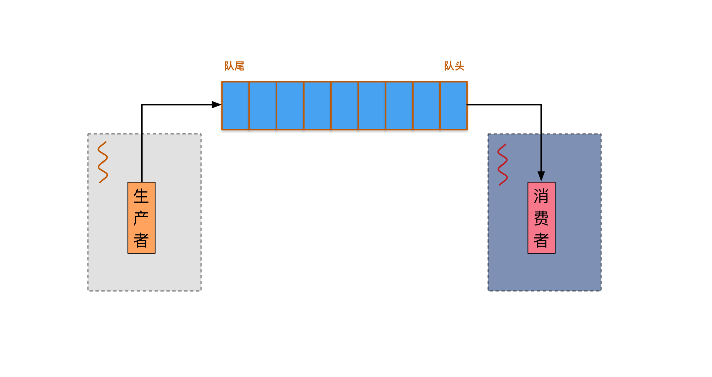
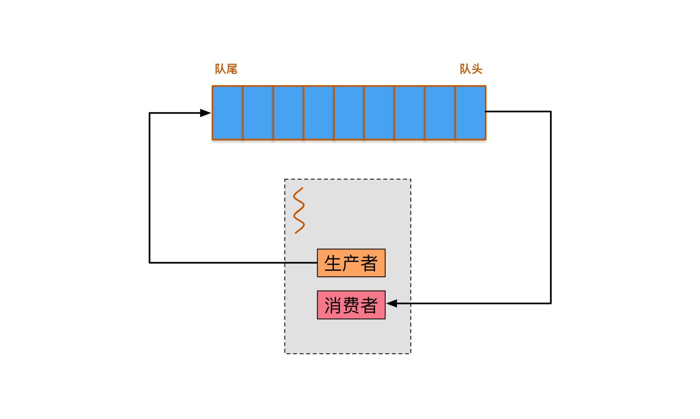

 
<!--BEGIN_DATA
{
    "create_date": "2016-09-05 09:50", 
    "modify_date": "2016-09-05 09:50", 
    "is_top": "0", 
    "summary": "Android和iOS开发中的异步处理", 
    "tags": "iOS、Android", 
    "file_name": "Android和iOS开发中的异步处理.md"
}
END_DATA-->

####
原文出处：<a href='http://zhangtielei.com/posts/blog-series-async-task-1.html' target='blank'>Android和iOS开发中的异步处理（一）——开篇</a>

本文是我打算完成的一个系列《Android和iOS开发中的异步处理》的开篇。

从2012年开始开发[微爱](http://welove520.com)App的第一个iOS版本计算，我和整个团队接触iOS和Android开发已经有4年时间了。现在回过头来总结，iOS和Android开发与其它领域的开发相比，有什么独特的特征呢？一个合格的iOS或Android开发人员，应该具备哪些技能呢？

如果仔细分辨，iOS和Android客户端的开发工作仍然可以分为“前端”和“后端”两大部分（就如同服务器的开发可以分为“前端”和“后端”一样）。

所谓“前端”工作，就是与UI界面更相关的部分，比如组装页面、实现交互、播放动画、开发自定义控件等等。显然，为了能游刃有余地完成这部分工作，开发人员需要深入了解跟系统有关的“前端”技术，主要包含三大部分：

  * 渲染绘制（解决显示内容的问题）
  * layout（解决显示大小和位置的问题）
  * 事件处理（解决交互的问题）

而“后端”工作，则是隐藏在UI界面背后的东西。比如，操纵和组织数据、缓存机制、发送队列、生命周期设计和管理、网络编程、推送和监听，等等。这部分工作，归根结底，是在处理“逻辑”层面的问题，它们并不是iOS或Android系统所特有的东西。然而，有一大类问题，在“后端”编程中占据了极大的比重，这就是如何对“异步任务”进行“异步处理”。

尤其值得指出的是，大部分客户端开发人员，他们所经历的培训、学习经历和开发经历，似乎都更偏重“前端”部分，而在“后端”编程的部分存在一定的空白。因此，本文会尝试把与“后端”编程紧密相关的“异步处理”问题进行总结概括。

本文是系列文章《Android和iOS开发中的异步处理》的第一篇，表面上看起来话题不算太大，却至关重要。当然，如果我打算强调它在客户端编程中的重要性，我也可以说：纵观整个客户端编程的过程，无非就是在对各种“异步任务”进行“异步处理”而已——至少，对于与系统特性无关的那部分来说，我这么讲是没有什么大的问题的。

那么，这里的“异步处理”，到底指的是什么呢？

我们在编程当中，经常需要执行一些异步任务。这些任务在启动后，调用者不用等待任务执行完毕即可接着去做其它事情，而任务什么时候执行完是不确定的，不可预期的。本文要讨论的就是​在处理这些异步任务过程中所可能涉及到的方方面面。

为了让所要讨论的内容更清楚，先列一个提纲如下：

  * （一）概述——​介绍常见的异步任务，以及为什么这个话题如此重要。

  * （二）​[异步任务的回调](/posts/blog-series-async-task-2.html)——讨论跟回调接口有关的一系列话题，比如错误处理、线程模型、透传参数、回调顺序等。

  * （三）[执行多个异步任务](/posts/blog-series-async-task-3.html)​

  * （四）[异步任务和队列](/posts/blog-series-async-task-4.html)​

  * （五）异步任务的取消和暂停，以及start ID​——Cancel掉正在执行的异步任务，实际上非常困难。

  * （六）关于封屏与不封屏

  * （七）Android Service实例分析——Android Service提供了一个执行异步任务的严密框架 （后面也许会再多提供一些其它的实例分析，加入到这个系列中来）。

显然，本篇文章要讨论的是提纲的第（一）部分。

为了描述清楚，这个系列文章中出现的代码已经整理到GitHub上（持续更新），代码库地址为：

  * <https://github.com/tielei/AsyncProgrammingDemos>

其中，当前这篇文章中出现的Java代码，位于com.zhangtielei.demos.async.programming.introduction这个pa
ckage中；而iOS的代码位于iOSDemos单独的目录中。

下面，我们先从一个具体的小例子开始：Android中的Service Binding。

    
    
    public class ServiceBindingDemoActivity extends Activity {
        private ServiceConnection serviceConnection = new ServiceConnection() {
            @Override
            public void onServiceDisconnected(ComponentName name) {
                //解除Activity与Service的引用和监听关系
                ...
            }
            @Override
            public void onServiceConnected(ComponentName name, IBinder service) {
                //建立Activity与Service的引用和监听关系
                ...
            }
        };
        @Override
        public void onResume() {
            super.onResume();
            Intent intent = new Intent(this, SomeService.class);
            bindService(intent, serviceConnection, Context.BIND_AUTO_CREATE);
        }
        @Override
        public void onPause() {
            super.onPause();
            //解除Activity与Service的引用和监听关系
            ...
            unbindService(serviceConnection);
        }
    }
    

上面的例子展示了Activity和Service之间进行交互的一个典型用法。Activity在onResume的时候与Service绑定，在onPause的时候与Service解除绑定。在绑定成功后，onServiceConnected被调用，这时Activity拿到传进来的IBinder的实例（service参数），便可以通过方法调用的方式与Service进行通信（进程内或跨进程）。比如，这时在onServiceConnected中经常要进行的操作可能包括：将IBinder记录下来存入Activity的成员变量，以备后续调用；调用IBinder获取Service的当前状态；设置回调方法，以监听Service后续的事件变化；等等，诸如此类。

这个过程表面看上去无懈可击。但是，如果考虑到bindService是一个“异步”调用，上面的代码就会出现一个逻辑上的漏洞。也就是说，bindService被调用只是相当于启动了绑定过程，它并不会等绑定过程结束才返回。而绑定过程何时结束（也即onServiceConnected被调用），是无法预期的，这取决于绑定
过程的快慢。而按照Activity的生命周期，在onResume之后，onPause也随时会被执行。这样看来，在bindService执行完后，可能onServiceConnected会先于onPause执行，也可能onPause会先于onServiceConnected执行。

当然，在一般情况下，onPause不会那么快执行，因此onServiceConnected一般都会赶在onPause之前执行。但是，从“逻辑”的角度，我们却不能完全忽视另外一种可能性。实际上它真的有可能发生，比如刚打开页面就立即退到后台，这种可能性便能以极小的概率发生。一旦发生，最后执行的onServiceConnected会建立起Activity与Service的引用和监听关系。这时应用很可能是在后台，而Activity和IBinder却可能仍互相引用着对方。这可能造成Java对象长时间释放不掉，以及其它一些诡异的问题。

这里还有一个细节，最终的表现其实还取决于系统的unbindService的内部实现。当onPause先于onServiceConnected执行的时候，onPause先调用了unbindService。如果unbindService在调用后能够严格保证ServiceConnection的回调不再发生，那么最终就不会造成前面说的Activity和IBinder相互引用的情况出现。但是，unbindService似乎没有这样的对外保证，而且根据个人经验，在Android系统的不同版本中，unbindService在这一点上的行为还不太一样。

像上面的分析一样，我们只要了解了异步任务bindService所能引发的所有可能情况，那就不难想出类似如下的应对措施。

    
    
    public class ServiceBindingDemoActivity extends Activity {
        /**
         * 指示本Activity是否处于running状态：执行过onResume就变为running状态。
         */
        private boolean running;
        private ServiceConnection serviceConnection = new ServiceConnection() {
            @Override
            ​public void onServiceDisconnected(ComponentName name) {
                //解除Activity与Service的引用和监听关系
                ...
            }
            @Override
            public void onServiceConnected(ComponentName name, IBinder service) {
                if (running) {
                    //建立Activity与Service的引用和监听关系
                    ...                
                }
            }​​
        };
        @Override
        public void onResume() {
            super.onResume();
            running = true;
            Intent intent = new Intent(this, SomeService.class);
            bindService(intent, serviceConnection, Context.BIND_AUTO_CREATE);
        }
        @Override
        public void onPause() {
            super.onPause();
            running = false;
            //解除Activity与Service的引用和监听关系
            ...
            unbindService(serviceConnection);
        }
    }
    

下面我们再来看一个iOS的小例子。

现在假设我们要维护一个客户端到服务器的TCP长连接。这个连接在网络状态发生变化时能够自动进行重连。首先，我们需要一个能监听网络状态变化的类，这个类叫做Reachability，它的代码如下：

    
    
    //
    //  Reachability.h
    //
    #import <Foundation/Foundation.h>
    #import <SystemConfiguration/SystemConfiguration.h>
    
    extern NSString *const networkStatusNotificationInfoKey;
    extern NSString *const kReachabilityChangedNotification;
    typedef NS_ENUM(uint32_t, NetworkStatus) {
        NotReachable = 0,
        ReachableViaWiFi = 1,
        ReachableViaWWAN = 2
    };
    @interface Reachability : NSObject {
    @private
        SCNetworkReachabilityRef reachabilityRef;
    }
    /**
     * 开始网络状态监听
     */
    - (BOOL)startNetworkMonitoring;
    /**
     * 结束网络状态监听
     */
    - (BOOL)stopNetworkMonitoring;
    /**
     * 同步获取当前网络状态
     */
    - (NetworkStatus) currentNetworkStatus;
    @end
    //
    //  Reachability.m
    //
    #import "Reachability.h"
    #import <sys/socket.h>
    #import <netinet/in.h>
    
    NSString *const networkStatusNotificationInfoKey = @"networkStatus";
    NSString *const kReachabilityChangedNotification = @"NetworkReachabilityChangedNotification";
    @implementation Reachability
    - (instancetype)init {
        self = [super init];
        if (self) {
            struct sockaddr_in zeroAddress;
            memset(&zeroAddress, 0, sizeof(zeroAddress));
            zeroAddress.sin_len = sizeof(zeroAddress);
            zeroAddress.sin_family = AF_INET;
            reachabilityRef = SCNetworkReachabilityCreateWithAddress(kCFAllocatorDefault, (const struct sockaddr*)&zeroAddress);
        }
        return self;
    }
    - (void)dealloc {
        if (reachabilityRef) {
            CFRelease(reachabilityRef);
        }
    }
    static void ReachabilityCallback(SCNetworkReachabilityRef target, SCNetworkReachabilityFlags flags, void* info) {
        Reachability *reachability = (__bridge Reachability *) info;
        @autoreleasepool {
            NetworkStatus networkStatus = [reachability currentNetworkStatus];
            [[NSNotificationCenter defaultCenter] postNotificationName:kReachabilityChangedNotification object:reachability userInfo:@{networkStatusNotificationInfoKey : @(networkStatus)}];
        }
    }
    - (BOOL)startNetworkMonitoring {
        SCNetworkReachabilityContext context = {0, (__bridge void * _Nullable)(self), NULL, NULL, NULL};
        if(SCNetworkReachabilitySetCallback(reachabilityRef, ReachabilityCallback, &context)) {
            if(SCNetworkReachabilityScheduleWithRunLoop(reachabilityRef, CFRunLoopGetCurrent(), kCFRunLoopDefaultMode)) {
                return YES;
            }
        }
        return NO;
    }
    - (BOOL)stopNetworkMonitoring {
        return SCNetworkReachabilityUnscheduleFromRunLoop(reachabilityRef, CFRunLoopGetCurrent(), kCFRunLoopDefaultMode);
    }
    - (NetworkStatus) currentNetworkStatus {
        //此处代码忽略...
    }
    @end
    

上述代码封装了Reachability类的接口。当调用者想开始网络状态监听时，就调用startNetworkMonitoring；监听完毕就调用stopNetworkMonitoring。我们设想中的长连接正好需要创建和调用Reachability对象来处理网络状态变化。它的代码的相关部分可能会如下所示（类名ServerConnection；头文件代码忽略）：

    
    
    //
    //  ServerConnection.m
    //
    #import "ServerConnection.h"
    #import "Reachability.h"
    
    @interface ServerConnection() {
        //用户执行socket操作的GCD queue
        dispatch_queue_t socketQueue;
        Reachability *reachability;
    }
    @end
    @implementation ServerConnection
    - (instancetype)init {
        self = [super init];
        if (self) {
            socketQueue = dispatch_queue_create("SocketQueue", NULL);
            reachability = [[Reachability alloc] init];
            [[NSNotificationCenter defaultCenter] addObserver:self selector:@selector(networkStateChanged:) name:kReachabilityChangedNotification object:reachability];
            [reachability startNetworkMonitoring];
        }
        return self;
    }
    - (void)dealloc {
        [reachability stopNetworkMonitoring];
        [[NSNotificationCenter defaultCenter] removeObserver:self];
    }
    - (void)networkStateChanged:(NSNotification *)notification {
        NetworkStatus networkStatus = [notification.userInfo[networkStatusNotificationInfoKey] unsignedIntValue];
        if (networkStatus != NotReachable) {
            //网络变化，重连
            dispatch_async(socketQueue, ^{
                [self reconnect];
            });
        }
    }
    - (void)reconnect {
        //此处代码忽略...
    }
    @end
    

长连接ServerConnection在初始化时创建了Reachability实例，并启动监听（调用startNetworkMonitoring），通过系统广播设置监听方法（networkStateChanged:）；当长连接ServerConnection销毁的时候（dealloc）停止监听（调用stopNetworkMonitoring）。

当网络状态发生变化时，networkStateChanged:会被调用，并且当前网络状态会被传入。如果发现网络变得可用了（非NotReachable状态），那么就异步执行重连操作。

这个过程看上去合情合理。但是这里面却隐藏了一个致命的问题。

在进行重连操作时，我们使用dispatch_async启动了一个异步任务。这个异步任务在启动后什么时候执行完，是不可预期的，这取决于reconnect操作执行的快慢。假设reconnect执行比较慢（对于涉及网络的操作，这是很有可能的），那么可能会发生这样一种情况：reconnect还在运行中，但ServerConnection即将销毁。也就是说，整个系统中所有其它对象对于ServerConnection的引用都已经释放了，只留下了dispatch_async调度时block对于self的一个引用。

这会导致什么后果呢？

这会导致：当reconnect执行完的时候，ServerConnection真正被释放，它的dealloc方法不在主线程执行！而是在socketQueue上执行。

而这接下来又会怎么样呢？这取决于Reachability的实现。

我们来重新分析一下Reachability的代码来得到这件事发生的最终影响。这个情况发生时，Reachability的stopNetworkMonitoring在非主线程被调用了。而当初startNetworkMonitoring被调用时却是在主线程的。现在我们看到了，startNetworkMonitoring和stopNetworkMonitoring如果前后不在同一个线程上执行，那么在它们的实现中的CFRunLoopGetCurrent()就不是指的同一个Run Loop。这已经在逻辑上发生“错误”了。在这个“错误”发生之后，stopNetworkMonitoring中的SCNetworkReachabilityUnscheduleFromRunLoop就没有能够把Reachability实例从原来在主线程上调度的那个Run Loop上卸下来。也就是说，此后如果网络状态再次发生变化，那么ReachabilityCallback仍然会执行，但这时原来的Reachability实例已经被销毁过了（由ServerConnection的销毁而销毁）。按上述代码的目前的实现，这时ReachabilityCallback中的info参数指向了一个已经被释放的Reachability对象，那么接下来发生崩溃也就不足为奇了。

有人可能会说，dispatch_async执行的block中不应该直接引用self，而应该使用weak-strong dance.
也就是把dispatch_async那段代码改成下面的形式：

    
    
    __weak ServerConnection *wself = self;
    dispatch_async(socketQueue, ^{
        __strong ServerConnection *sself = wself;
        [sself reconnect];
    });
    

这样改有没有效果呢？根据我们上面的分析，显然没有。ServerConnection的dealloc仍然在非主线程上执行，上面的问题也依然存在。weak-strong dance被设计用来解决循环引用的问题，但不能解决我们这里碰到的异步任务延迟的问题。

实际上，即使把它改成下面的形式，仍然没有效果。

    
    
    __weak ServerConnection *wself = self;
    dispatch_async(socketQueue, ^{
        [wself reconnect];
    });
    

即使拿weak引用（wself）来调用reconnect方法，它一旦执行，也会造成ServerConnection的引用计数增加。结果仍然是dealloc在非主线程上执行。

那既然dealloc在非主线程上执行会造成问题，那我们强制把dealloc里面的代码调度到主线程执行好了，如下：

    
    
    - (void)dealloc {
        dispatch_async(dispatch_get_main_queue(), ^{
            [reachability stopNetworkMonitoring];
        });
        [[NSNotificationCenter defaultCenter] removeObserver:self];
    }
    

显然，在dealloc再调用dispatch_async的这种方法也是行不通的。因为在dealloc执行过之后，ServerConnection实例已经被销毁了，那么当block执行时，reachability就依赖了一个已经被销毁的ServerConnection实例。结果还是崩溃。

那不用dispatch_async好了，改用dispatch_sync好了。仔细修改后的代码如下：

    
    
    - (void)dealloc {
        if (![NSThread isMainThread]) {
            dispatch_sync(dispatch_get_main_queue(), ^{
                [reachability stopNetworkMonitoring];
            });
        }
        else {
            [reachability stopNetworkMonitoring];
        }
        [[NSNotificationCenter defaultCenter] removeObserver:self];
    }
    

经过“前后左右”打补丁，我们现在总算得到了一段可以基本能正常执行的代码了。然而，在dealloc里执行dispatch_sync这种可能耗时的“同步”操作，总不免令人胆战心惊。

那到底怎样做更好呢？

个人认为：**并不是所有的销毁工作都适合写在dealloc里**。

dealloc最擅长的事，自然还是释放内存，比如调用各个成员变量的release（在ARC中这个release也省了）。但是，如果要依赖dealloc来维护一些作用域更广（超出当前对象的生命周期）的变量或过程，则不是一个好的做法。原因至少有两点：

  * dealloc的执行可能会被延迟，无法确保精确的执行时间；
  * 无法控制dealloc是否会在主线程被调用。

比如上面的ServerConnection的例子，业务逻辑自己肯定知道应该在什么时机去停止监听网络状态，而不应该依赖dealloc来完成它。

另外，对于dealloc可能会在异步线程执行的问题，我们应该特别关注它。对于不同类型的对象，我们应该采取不同的态度。比如，对于起到View角色的对象，我们的正确态度是：**不应该允许dealloc在异步线程执行的情况出现**。为了避免出现这种情况，我们应该竭力避免在View里面直接启动异步任务，或者避免在生命周
期更长的异步任务中对View产生强引用。

在上面两个例子中，问题出现的根源在于异步任务。我们仔细思考后会发现，在讨论异步任务的时候，我们必须关注一个至关重要的问题，即**条件失效问题**。当然，这也是一个显而易见的问题：当一个异步任务真正执行的时候（或者一个异步事件真正发生的时候），境况很可能已与当初调度它时不同，或者说，它当初赖以执行或发生的条件可能已经失效。

在第一个Service Binding的例子中，异步绑定过程开始调度的时候（bindService被调用的时候），Activity还处于Running状态（在执行onResume）；而绑定过程结束的时候（onServiceConnected被调用的时候），Activity却已经从Running状态中退出（执行过了onPause，已经又解除绑定了）。

在第二个网络监听的例子中，当异步重连任务结束的时候，外部对于ServerConnection实例的引用已经不复存在，实例马上就要进行销毁过程了。继而造成停止监听时的Run Loop也不再是原来那一个了。

在开始下一节有关异步任务的正式讨论之前，我们有必要对iOS和Android中经常碰到的异步任务做一个总结。

  1. 网络请求​。由于网络请求耗时较长，通常网络请求接口都是异步的（例如iOS的NSURLConnection，或Android的Volley）。一般情况下，我们在主线程启动一个网络请求，然后被动地等待请求成功或者失败的回调发生（意味着这个异步任务的结束），最后根据回调结果更新UI。从启动网络请求，到获知明确的请求结果（成功或失败），时间是不确定的。

  2. 通过线程池机制主动创建的异步任务。对于那些需要较长时间同步执行的任务（比如读取磁盘文件这种延迟高的操作，或者执行大计算量的任务），我们通常依靠系统提供的线程池机制把这些任务调度到异步线程去执行，以节约主线程宝贵的计算时间。关于这些线程池机制，在iOS中，我们有GCD（dispatch_async）、NSOperationQueue；在Android上，我们有JDK提供的传统的ExecutorService，也有Android SDK提供的AsyncTask​。不管是哪种实现形式，我们都为自己创造了大量的异步任务。

  3. Run Loop调度任务。在iOS上，我们可以调用NSObject的若干个performSelectorXXX方法将任务调度到目标线程的Run Loop上去异步执行（performSelectorInBackground:withObject:除外）。类似地，在Android上，我们可以调用Handler的post/sendMessage方法或者View的post方法将任务异步调度到对应的Run Loop上去。实际上，不管是iOS还是Android系统，一般客户端的基础架构中都会为主线程创建一个Run Loop（当然，非主线程也可以创建Run Loop）。它可以让长时间存活的线程周期性地处理短任务，而在没有任务可执行的时候进入睡眠，既能高效及时地响应事件处理，又不会耗费多余的CPU时间。同时，更重要的一点是，Run Loop模式让客户端的多线程编程逻辑变得简单。客户端编程比服务器编程的多线程模型要简单，很大程度上要归功于Run Loop的存在。在客户端编程中，当我们想执行一个长的同步任务时，一般先通过前面（2）中提及的线程池机制将它调度到异步线程，在任务执行完后，再通过本节提到的Run Loop调度方法或者GCD等机制重新调度回主线程的Run Loop上。这种“**主线程->异步线程->主线程**”的模式，基本成为了客户端多线程编程的基本模式。这种模式规避了多个线程之间可能存在的复杂的同步操作，使处理变得简单。在后面第（三）部分——执行多个异步任务，我们还有机会继续探讨这个话题。

  4. 延迟调度任务。这一类任务在指定的某个时间段之后，或者在指定的某个时间点开始执行，可以用于实现类似重试队列之类的结构。延迟调度任务有多种实现方式。​在iOS中，NSObject的performSelector:withObject:afterDelay:，GCD的dispatch_after或dispatch_time，另外，还有NSTimer；在Android中，Handler的postDelayed和postAtTime，View的postDelayed，还有老式的java.util.Timer，此外，安卓中还有一个比较重的调度器——能在任务调度执行时自动唤醒程序的AlarmService。

  5. 跟系统实现相关的异步行为。这类行为种类繁多，这里举几个例子。比如：安卓中的startActivity是一个异步操作，从调用后到Activity被创建和显示，仍有一小段时间。再如：Activity和Fragment的生命周期是异步的，即使Activity的生命周期已经到了onResume，你还是不知道它所包含的Fragment的生命周期走到哪一步了（以及它的view层次有没有被创建出来）。再比如，在iOS和Android系统上都有监听网络状态变化的机制（本文前面的第二个代码例子中就有涉及），网络状态变化回调何时执行就是一个异步事件。这些异步行为同样需要统一完整的异步处理。

本文在最后还需要澄清一个关于题目的问题。​这个系列虽命名为《Android和iOS开发中的异步处理》，但是对于异步任务的处理这个话题，实际中并不局限于“iOS或Android开发”中，比如在服务器的开发中也是有可能遇到的。在这个系列中我所要表达的，更多的是一个抽象的逻辑，并不局限于iOS或Android某种具体的技术。只是，在iOS和Android的前端开发中，异步任务被应用得如此广泛，以至于我们应该把它当做一个更普遍的问题来对待了。

（完）

####
原文出处：<a href='http://zhangtielei.com/posts/blog-series-async-task-2.html' target='blank'>Android和iOS开发中的异步处理（二）——异步任务的回调</a>

本文是系列文章《[Android和iOS开发中的异步处理](/posts/blog-series-async-
task-1.html)》的第二篇。在本篇文章中，我们主要讨论跟异步任务的回调有关的诸多问题。

在iOS中，回调通常表现为delegate的形式；而在Android中，回调通常以listener的形式存在。但不管表现形式如何，回调都是接口设计不可分割的一部分。回调接口设计的好坏，直接影响整个接口设计的成功与否。

那么在回调接口的设计和实现中，我们需要考虑哪些方面呢？现在我们先把本文要讨论的子话题列出如下，然后再逐个讨论：

  * 必须产生结果回调
  * 重视失败回调 & 错误码应该尽量详细
  * 调用接口和回调接口应该有清晰的对应关系
  * 成功结果回调和失败结果回调应该彼此互斥
  * 回调的线程模型
  * 回调的context参数（透传参数）
  * 回调顺序
  * 闭包形式的回调和Callback Hell

注：本系列文章中出现的代码已经整理到GitHub上（持续更新），代码库地址为：

  * <https://github.com/tielei/AsyncProgrammingDemos>

其中，当前这篇文章中出现的Java代码，位于com.zhangtielei.demos.async.programming.callback这个packag
e中。

* * *

#####必须产生结果回调

当接口设计成异步的形式时，接口的最终执行结果就通过回调来返回给调用者。

但回调接口并不总是传递最终结果。实际上我们可以将回调分成两类：

  * 中间回调
  * 结果回调

而结果回调又包含成功结果回调和失败结果回调。

中间回调可能在异步任务开始执行时，执行进度有更新时，或者其它重要的中间事件发生时被调用；而结果回调要等异步任务执行到最后，有了一个明确的结果（成功了或失败了
），才被调用。结果回调的发生意味着此次异步接口的执行结束。

“必须产生结果回调”，这条规则并不像想象的那样容易遵守。它要求在异步接口的实现中无论发生什么异常状况，都要在有限的时间内产生结果回调。比如，接收到非法的输入
参数，程序的运行时异常，任务中途被取消，任务超时，以及种种意想不到的错误，这些都是发生异常状况的例子。

这里的难度就在于，接口的实现要慎重对待所有可能的错误情况，不管哪种情况出现，都必须产生结果回调。否则，可能会导致调用方整个执行流程的中断。

#####重视失败回调 & 错误码应该尽量详细

先看一段代码例子：

    
    
    public interface Downloader {
        /**
         * 设置监听器.
         * @param listener
         */
        void setListener(DownloadListener listener);
        /**
         * 启动资源的下载.
         * @param url 要下载的资源地址.
         * @param localPath 资源下载后要存储的本地位置.
         */
        void startDownload(String url, String localPath);
    }
    public interface DownloadListener {
        /**
         * 下载结束回调.
         * @param result 下载结果. true表示下载成功, false表示下载失败.
         * @param url 资源地址
         * @param localPath 下载后的资源存储位置. 只有result=true时才有效.
         */
        void downloadFinished(boolean result, String url, String localPath);
        /**
         * 下载进度回调.
         * @param url 资源地址
         * @param downloadedSize 已下载大小.
         * @param totalSize 资源总大小.
         */
        void downloadProgress(String url, long downloadedSize, long totalSize);
    }
    

这段代码定义了一个下载器接口，用于从指定的URL下载资源。这是一个异步接口，调用者通过调用startDownload启动下载任务，然后等着回调。当downloadFinished回调发生时，表示下载任务结束了。如果返回result=true，则说明下载成功，否则说明下载失败。

这个接口定义基本上算是比较完备了，能够完成下载资源的基本流程：我们能通过这个接口启动一个下载任务，在下载过程中获得下载进度（中间回调），在下载成功时能够取得结果，在下载失败时也能得到通知（成功和失败都属于结果回调）。但是，如果在下载失败时我们想获知更详细的失败原因，那么现在这个接口就做不到了。

具体的失败原因，上层调用者可能需要处理，也可能不需要处理。在下载失败后，上层的展示层可能只是会为下载失败的资源做一个标记，而不区分是如何失败的。当然也有可能展示层会提示用户具体的失败原因，让用户接下来知道需要做哪些操作来恢复错误，比如，由于“网络不可用”而造成的下载失败，可以提示用户切换到更好的网络；而由于“存储空间不足”而造成的下载失败，则可以提示用户清理存储空间。总之，应该由上层调用者来决定是否显示具体错误原因，以及如何显示，而不是在定义底层回调接口时就决定。

因此，结果回调中的失败回调，应该返回尽可能详细的错误码，让调用者在发生错误时有更多的选择。这一规则，对于library的开发者来说，似乎毋庸置疑。但是，对于上层应用的开发者来说，往往得不到足够的重视。返回详尽的错误码，意味着在失败处理上花费更多的工夫。为了“节省时间”和“实用主义”，人们往往对于错误情况采取“简单处理”，但却给日后的扩展带来了隐患。

对于上面下载器接口的代码例子，为了能返回更详尽的错误码，其中DownloadListener的代码修改如下：

    
    
    public interface DownloadListener {
        /**
         * 错误码定义
         */
        public static final int SUCCESS = 0;//成功
        public static final int INVALID_PARAMS = 1;//输入参数有误
        public static final int NETWORK_UNAVAILABLE = 2;//网络不可用
        public static final int UNKNOWN_HOST = 3;//域名解析失败
        public static final int CONNECT_TIMEOUT = 4;//连接超时
        public static final int HTTP_STATUS_NOT_OK = 5;//下载请求返回非200
        public static final int SDCARD_NOT_EXISTS = 6;//SD卡不存在(下载的资源没地方存)
        public static final int SD_CARD_NO_SPACE_LEFT = 7;//SD卡空间不足(下载的资源没地方存)
        public static final int READ_ONLY_FILE_SYSTEM = 8;//文件系统只读(下载的资源没地方存)
        public static final int LOCAL_IO_ERROR = 9;//本地SD存取有关的错误
        public static final int UNKNOWN_FAILED = 10;//其它未知错误
        /**
         * 下载成功回调.
         * @param url 资源地址
         * @param localPath 下载后的资源存储位置.
         */
        void downloadSuccess(String url, String localPath);
        /**
         * 下载失败回调.
         * @param url 资源地址
         * @param errorCode 错误码.
         * @param errorMessage 错误信息简短描述. 供调用者理解错误原因.
         */
        void downloadFailed(String url, int errorCode, String errorMessage);
        /**
         * 下载进度回调.
         * @param url 资源地址
         * @param downloadedSize 已下载大小.
         * @param totalSize 资源总大小.
         */
        void downloadProgress(String url, long downloadedSize, long totalSize);
    }
    

在iOS中，Foundation Framework对于程序错误有一个系统的封装：NSError。它能以非常通用的方式来封装错误码，而且能将错误分成不同的domain。NSError就很适合用在这种失败回调接口的定义中。

#####调用接口和回调接口应该有清晰的对应关系

我们通过一个真实的接口定义的例子来分析这个问题。

下面是来自国内某广告平台的视频广告积分墙的接口定义代码（为展示清楚，省略了一些无关的代码）。

    
    
    @class IndependentVideoManager;
    @protocol IndependentVideoManagerDelegate <NSObject>
    @optional
    #pragma mark - independent video present callback 视频广告展现回调
    
    ...
    #pragma mark - point manage callback 积分管理
    
    ...
    #pragma mark - independent video status callback 积分墙状态
    /**
     *  视频广告墙是否可用。
     *  Called after get independent video enable status.
     *
     *  @param IndependentVideoManager
     *  @param enable
     */
    - (void)ivManager:(IndependentVideoManager *)manager
    didCheckEnableStatus:(BOOL)enable;
    /**
     *  是否有视频广告可以播放。
     *  Called after check independent video available.
     *
     *  @param IndependentVideoManager
     *  @param available
     */
    - (void)ivManager:(IndependentVideoManager *)manager
    isIndependentVideoAvailable:(BOOL)available;
    @end
    @interface IndependentVideoManager : NSObject {
    }
    @property(nonatomic,assign)id<IndependentVideoManagerDelegate>delegate;
    ...
    #pragma mark - init 初始化相关方法
    
    ...
    #pragma mark - independent video present 积分墙展现相关方法
    /**
     *  使用App的rootViewController来弹出并显示列表积分墙。
     *  Present independent video in ModelView way with App's rootViewController.
     *
     *  @param type 积分墙类型
     */
    - (void)presentIndependentVideo;
    ...
    #pragma mark - independent video status 检查视频积分墙是否可用
    /**
     *  是否有视频广告可以播放
     *  check independent video available.
     */
    - (void)checkVideoAvailable;
    #pragma mark - point manage 积分管理相关广告
    /**
     *  检查已经得到的积分，成功或失败都会回调代理中的相应方法。
     *
     */
    - (void)checkOwnedPoint;
    /**
     *  消费指定的积分数目，成功或失败都会回调代理中的相应方法（请特别注意参数类型为unsigned int，需要消费的积分为非负值）。
     *
     *  @param point 要消费积分的数目
     */
    - (void)consumeWithPointNumber:(NSUInteger)point;
    @end
    

我们来分析一下在这段接口定义中调用接口和回调接口之间的对应关系。

使用IndependentVideoManager可以调用的接口，除了初始化的接口之外，主要有这几个：

  * 弹出并显示视频 (presentIndependentVideo)
  * 检查是否有视频广告可以播放 (checkVideoAvailable)
  * 积分管理 (checkOwnedPoint和consumeWithPointNumber:)

而回调接口 (IndependentVideoManagerDelegate) 可以分为下面几类：

  * 视频广告展现回调类
  * 积分墙状态类 (ivManager:didCheckEnableStatus:和ivManager:isIndependentVideoAvailable:)
  * 积分管理类

总体来说，这里的对应关系还是比较清楚的，这三类回调接口基本上与前面的三部分调用接口能够一一对应上。

不过，积分墙状态类的回调接口还是有一点让人迷惑的细节：看起来调用者在调用checkVideoAvailable后，会收到积分墙状态类的两个回调 (ivManager:didCheckEnableStatus:和ivManager:isIndependentVideoAvailable:)；但是，从接口名称所能表达的含义来看，调用checkVideoAvailable是为了检查是否有视频广告可以播放，那么单单是ivManager:isIndependentVideo Available:这一个回调接口就能返回所需要的结果了，似乎不太需要ivManager:didCheckEnableStatus:。而从ivManager:didCheckEnableStatus所表达的含义（视频广告墙是否可用）上来看，它似乎在任何调用接口被调用时都可能会执行，而不应该只对应checkVideoAvailable。这里的回调接口设计，在与调用接口的对应关系上，是令人困惑的。

此外，IndependentVideoManager的接口在上下文参数的设计上也有一些问题，本文后面会再次提到。

#####成功结果回调和失败结果回调应该彼此互斥

当一个异步任务结束时，它或者调用成功结果回调，或者调用失败结果回调。两者只能调用其一。这是显而易见的要求，但若在实现时不加注意，却也可能无法遵守这一要求。

假设我们前面提到的Downloader接口在最终产生结果回调的时候代码如下：

    
    
    int errorCode = parseDownloadResult(result);
    if (errorCode == SUCCESS) {
        listener.downloadSuccess(url, localPath)
    }
    else {
        listener.downloadFailed(url, errorCode, getErrorMessage(errorCode));
    }
    

进而我们发现，为了能够达到“必须产生结果回调”的目标，我们应该考虑parseDownloadResult这个方法抛异常的可能。于是，我们修改代码如下：

    
    
    try {
        int errorCode = parseDownloadResult(result);
        if (errorCode == SUCCESS) {
            listener.downloadSuccess(url, localPath)
        }
        else {
            listener.downloadFailed(url, errorCode, getErrorMessage(errorCode));
        }
    }
    catch (Exception e) {
        listener.downloadFailed(url, UNKNOWN_FAILED, getErrorMessage(UNKNOWN_FAILED));
    }
    

代码改成这样，已经能保证即使出现了意想不到的情况，也能对调用者产生一个失败回调。

但是，这也带来另一个问题：如果在调用listener.downloadSuccess或listener.downloadFailed的时候，回调接口的实现代码抛了异常呢？那会造成再多调用一次listener.downloadFailed。于是，成功结果回调和失败结果回调不再彼此互斥地被调用了：或者成功和失败回调都发生了，或者连续两次失败回调。

回调接口的实现是归调用者负责的部分，难道调用者犯的错误也需要我们来考虑？首先，这主要还是应该由上层调用者来负责处理，回调接口的实现方（调用者）实在不应该在异常发生时再把异常抛回来。但是，底层接口的设计者也应当尽力而为。作为接口的设计者，通常不能预期调用者会怎么表现，如果在异常发生时，我们能保证当前错误不至于让整个流程中断和卡死，岂不是更好呢？于是，我们可以尝试把代码改成如下这样：

    
    
    int errorCode;
    try {
        errorCode = parseDownloadResult(result);
    }
    catch (Exception e) {
        errorCode = UNKNOWN_FAILED;
    }
    if (errorCode == SUCCESS) {
        try {
            listener.downloadSuccess(url, localPath)
        }
        catch (Throwable e) {
            e.printStackTrace();
        }
    }
    else {
        try {
            listener.downloadFailed(url, errorCode, getErrorMessage(errorCode));
        }
        catch (Throwable e) {
            e.printStackTrace();
        }
    }
    

回调代码复杂了一些，但也更安全了。

#####回调的线程模型

异步接口能够得以实现的技术基础，主要有两个：

  * 多线程（接口的实现代码在与调用线程不同的异步线程中执行）
  * 异步IO（比如异步网络请求。在这种情况下，即使整个程序只有一个线程，也能实现出异步接口）

不管是哪种情况，我们都需要对回调发生的线程环境有清晰的定义。

通常来讲，定义结果回调的执行线程环境主要有三种模式：

  1. 在哪个线程上调用接口，就在哪个线程上发生结果回调。
  2. 不管在哪个线程上调用接口，都在主线程上发生结果回调（例如Android的AsyncTask）。
  3. 调用者可以自定义回调接口在哪个线程上发生。（例如iOS的NSURLConnection，通过scheduleInRunLoop:forMode:来设置回调发生的Run Loop）

显然第3种模式最为灵活，因为它包含了前两种。

为了能把执行代码调度到其它线程，我们需要使用在上一篇[Android和iOS开发中的异步处理（一）——概述](/posts/blog-series-async-task-1.html)最后提到的一些技术，比如iOS中的GCD、NSOperationQueue、performSelectorXXX方法，Android中的ExecutorService、AsyncTask、Handler，等等（注意：ExecutorService不能用于调度到主线程，只能用于调度到异步线程）。我们有必要对线程调度的实质加以理解：能把一段代码调度到某一个线程去执行，前提条件是那个线程有一个Event Loop。这个Loop顾名思义，就是一个循环，它不停地从消息队列里取出消息，然后处理。我们做线程调度的时候，相当于向这个队列里发送消息。这个队列本身在系统实现里已经保证是线程安全的（Th
read SafeQueue），因此调用者就规避了线程安全问题。在客户端开发中，系统都会为主线程创建一个Loop，但非主线程则需要开发者自己来使用适当的技术进行创建。

在客户端编程的大多数情况下，我们一般会希望结果回调发生在主线程上，因为我们一般会在这个时机更新UI。而中间回调在哪个线程上执行，则取决于具体应用场景。在前面Downloader的例子中，中间回调downloadProgress是为了回传下载进度，下载进度一般也是为了在UI上展示，因此downloadProgress也是调度到主线程上执行更好一些。

#####回调的context参数（透传参数）

在调用一个异步接口的时候，我们经常需要临时保存一份跟该次调用相关的上下文数据，等到异步任务执行完回调发生的时候，我们能重新拿到这份上下文数据。

我们还是以前面的下载器为例。为了能清晰地讨论各种情况，我们这里假设一个稍微复杂一点的例子。假设我们要下载若干个表情包，每个表情包包含多个表情图片文件，下载完全部表情图片之后，我们需要把表情包安装到本地（可能是修改本地数据库的操作），以便用户能够在输入面板中使用它们。

假设表情包的数据结构定义如下：

    
    
    public class EmojiPackage {
        /**
         * 表情包ID
         */
        public long emojiId;
        /**
         * 表情包图片列表
         */
        public List<String> emojiUrls;
    }
    

在下载过程中，我们需要保存一个如下的上下文结构：

    
    
    public class EmojiDownloadContext {
        /**
         * 当前在下载的表情包
         */
        public EmojiPackage emojiPackage;
        /**
         * 已经下载完的表情图片计数
         */
        public int downloadedEmoji;
        /**
         * 下载到的表情包本地地址
         */
        public List<String> localPathList = new ArrayList<String>();
    }
    

再假设我们要实现的表情包下载器遵守下面的接口定义：

    
    
    public interface EmojiDownloader {
        /**
         * 开始下载指定的表情包
         * @param emojiPackage
         */
        void startDownloadEmoji(EmojiPackage emojiPackage);
        /**
         * 这里定义回调相关的接口, 忽略. 不是我们要讨论的重点.
         */
        //TODO: 回调接口相关定义
    }
    

如果利用前面已有的Downloader接口来完成表情包下载器的实现，那么根据传递上下文的方式不同，我们可能会产生三种不同的做法：

（1）全局保存一份上下文。

注意：这里所说的“全局”，是针对一个表情包下载器内部而言的。代码如下：

    
    
    public class MyEmojiDownloader implements EmojiDownloader, DownloadListener {
        /**
         * 全局保存一份的表情包下载上下文.
         */
        private EmojiDownloadContext downloadContext;
        private Downloader downloader;
        public MyEmojiDownloader() {
            //实例化有一个下载器. MyDownloader是Downloader接口的一个实现。
            downloader = new MyDownloader();
            downloader.setListener(this);
        }
        @Override
        public void startDownloadEmoji(EmojiPackage emojiPackage) {
            if (downloadContext == null) {
                //创建下载上下文数据
                downloadContext = new EmojiDownloadContext();
                downloadContext.emojiPackage = emojiPackage;
                //启动第0个表情图片文件的下载
                downloader.startDownload(emojiPackage.emojiUrls.get(0),
                        getLocalPathForEmoji(emojiPackage, 0));
            }
        }
        @Override
        public void downloadSuccess(String url, String localPath) {
            downloadContext.localPathList.add(localPath);
            downloadContext.downloadedEmoji++;
            EmojiPackage emojiPackage = downloadContext.emojiPackage;
            if (downloadContext.downloadedEmoji < emojiPackage.emojiUrls.size()) {
                //还没下载完, 继续下载下一个表情图片
                String nextUrl = emojiPackage.emojiUrls.get(downloadContext.downloadedEmoji);
                downloader.startDownload(nextUrl,
                        getLocalPathForEmoji(emojiPackage, downloadContext.downloadedEmoji));
            }
            else {
                //已经下载完
                installEmojiPackageLocally(emojiPackage, downloadContext.localPathList);
                downloadContext = null;
            }
        }
        @Override
        public void downloadFailed(String url, int errorCode, String errorMessage) {
            ...
        }
        @Override
        public void downloadProgress(String url, long downloadedSize, long totalSize) {
            ...
        }
        /**
         * 计算表情包中第i个表情图片文件的下载地址.
         */
        private String getLocalPathForEmoji(EmojiPackage emojiPackage, int i) {
            ...
        }
        /**
         * 把表情包安装到本地
         */
        private void installEmojiPackageLocally(EmojiPackage emojiPackage, List<String> localPathList) {
            ...
        }
    }
    

这种做法的缺点是：同时只能有一个表情包在下载。必须要等到前一个表情包下载完毕之后才能开始下载新的一个表情包。

虽然这种“全局保存一份上下文”的做法有这样明显的缺点，但是在某些情况下，我们却只能采取这种方式。这个后面会再提到。

（2）用映射关系来保存上下文。

在现有Downloader接口的定义下，我们只能用URL来作为这份映射关系的索引。由于一个表情包包含多个URL，因此我们必须为每一个URL都索引一份上下文。
代码如下：

    
    
    public class MyEmojiDownloader implements EmojiDownloader, DownloadListener {
        /**
         * 保存上下文的映射关系.
         * URL -> EmojiDownloadContext
         */
        private Map<String, EmojiDownloadContext> downloadContextMap;
        private Downloader downloader;
        public MyEmojiDownloader() {
            downloadContextMap = new HashMap<String, EmojiDownloadContext>();
            //实例化有一个下载器. MyDownloader是Downloader接口的一个实现。
            downloader = new MyDownloader();
            downloader.setListener(this);
        }
        @Override
        public void startDownloadEmoji(EmojiPackage emojiPackage) {
            //创建下载上下文数据
            EmojiDownloadContext downloadContext = new EmojiDownloadContext();
            downloadContext.emojiPackage = emojiPackage;
            //为每一个URL创建映射关系
            for (String emojiUrl : emojiPackage.emojiUrls) {
                downloadContextMap.put(emojiUrl, downloadContext);
            }
            //启动第0个表情图片文件的下载
            downloader.startDownload(emojiPackage.emojiUrls.get(0),
                    getLocalPathForEmoji(emojiPackage, 0));
        }
        @Override
        public void downloadSuccess(String url, String localPath) {
            EmojiDownloadContext downloadContext = downloadContextMap.get(url);
            downloadContext.localPathList.add(localPath);
            downloadContext.downloadedEmoji++;
            EmojiPackage emojiPackage = downloadContext.emojiPackage;
            if (downloadContext.downloadedEmoji < emojiPackage.emojiUrls.size()) {
                //还没下载完, 继续下载下一个表情图片
                String nextUrl = emojiPackage.emojiUrls.get(downloadContext.downloadedEmoji);
                downloader.startDownload(nextUrl,
                        getLocalPathForEmoji(emojiPackage, downloadContext.downloadedEmoji));
            }
            else {
                //已经下载完
                installEmojiPackageLocally(emojiPackage, downloadContext.localPathList);
                //为每一个URL删除映射关系
                for (String emojiUrl : emojiPackage.emojiUrls) {
                    downloadContextMap.remove(emojiUrl);
                }
            }
        }
        @Override
        public void downloadFailed(String url, int errorCode, String errorMessage) {
            ...
        }
        @Override
        public void downloadProgress(String url, long downloadedSize, long totalSize) {
            ...
        }
        /**
         * 计算表情包中第i个表情图片文件的下载地址.
         */
        private String getLocalPathForEmoji(EmojiPackage emojiPackage, int i) {
            ...
        }
        /**
         * 把表情包安装到本地
         */
        private void installEmojiPackageLocally(EmojiPackage emojiPackage, List<String> localPathList) {
            ...
        }
    }
    

这种做法也有它的缺点：并不能每次都能找到恰当的能唯一索引上下文数据的变量。在这个表情包下载器的例子中，能唯一标识下载的变量本来应该是emojiId，但在Downloader的回调接口中却无法取到这个值，因此只能改用每个URL都建立一份到上下文数据的索引。这样带来的结果就是：如果两个不同表情包包含了某个相同的URL，就可能出现冲突。另外，这种做法的实现比较复杂。

（3）为每一个异步任务创建一个接口实例。

通常来讲，按照我们的设计初衷，我们希望只实例化一个接口实例（即一个Downloader实例），然后用这一个实例来启动多个异步任务。但是，如果我们每次启动新的异步任务都是新创建一个接口实例，那么异步任务就和接口实例个数一一对应了，这样就能将异步任务的上下文数据存到这个接口实例中。代码如下：

    
    
    public class MyEmojiDownloader implements EmojiDownloader {
        @Override
        public void startDownloadEmoji(EmojiPackage emojiPackage) {
            //创建下载上下文数据
            EmojiDownloadContext downloadContext = new EmojiDownloadContext();
            downloadContext.emojiPackage = emojiPackage;
            //为每一次下载创建一个新的Downloader
            final EmojiUrlDownloader downloader = new EmojiUrlDownloader();
            //将上下文数据存到downloader实例中
            downloader.downloadContext = downloadContext;
            downloader.setListener(new DownloadListener() {
                @Override
                public void downloadSuccess(String url, String localPath) {
                    EmojiDownloadContext downloadContext = downloader.downloadContext;
                    downloadContext.localPathList.add(localPath);
                    downloadContext.downloadedEmoji++;
                    EmojiPackage emojiPackage = downloadContext.emojiPackage;
                    if (downloadContext.downloadedEmoji < emojiPackage.emojiUrls.size()) {
                        //还没下载完, 继续下载下一个表情图片
                        String nextUrl = emojiPackage.emojiUrls.get(downloadContext.downloadedEmoji);
                        downloader.startDownload(nextUrl,
                                getLocalPathForEmoji(emojiPackage, downloadContext.downloadedEmoji));
                    }
                    else {
                        //已经下载完
                        installEmojiPackageLocally(emojiPackage, downloadContext.localPathList);
                    }
                }
                @Override
                public void downloadFailed(String url, int errorCode, String errorMessage) {
                    //TODO:
                }
                @Override
                public void downloadProgress(String url, long downloadedSize, long totalSize) {
                    //TODO:
                }
            });
            //启动第0个表情图片文件的下载
            downloader.startDownload(emojiPackage.emojiUrls.get(0),
                    getLocalPathForEmoji(emojiPackage, 0));
        }
        private static class EmojiUrlDownloader extends MyDownloader {
            public EmojiDownloadContext downloadContext;
        }
        /**
         * 计算表情包中第i个表情图片文件的下载地址.
         */
        private String getLocalPathForEmoji(EmojiPackage emojiPackage, int i) {
            ...
        }
        /**
         * 把表情包安装到本地
         */
        private void installEmojiPackageLocally(EmojiPackage emojiPackage, List<String> localPathList) {
            ...
        }
    }
    

这样做自然缺点也很明显：为每一个下载任务都创建一个下载器实例，这有违我们对于Downloader接口的设计初衷。这会创建大量多余的实例。特别是，当接口实例是个很重的大对象时，这样做会带来大量的开销。

上面三种做法，每一种都不是很理想。根源在于：底层的异步接口Downloader不能支持上下文（context）传递（注意，它跟Android系统中的Context没有什么关系）。这样的上下文参数不同的人有不同的叫法：

  * context（上下文）
  * 透传参数
  * callbackData
  * cookie
  * userInfo

不管这个参数叫什么名字，它的作用都是一样的：在调用异步接口的时候传递进去，当回调接口发生时它还能传回来。这个上下文参数由上层调用者定义，底层接口的实现并不用理解它的含义，而只是负责透传。

支持了上下文参数的Downloader接口改动如下：

    
    
    public interface Downloader {
        /**
         * 设置回调监听器.
         * @param listener
         */
        void setListener(DownloadListener listener);
        /**
         * 启动资源的下载.
         * @param url 要下载的资源地址.
         * @param localPath 资源下载后要存储的本地位置.
         * @param contextData 上下文数据, 在回调接口中会透传回去.可以是任何类型.
         */
        void startDownload(String url, String localPath, Object contextData);
    }
    public interface DownloadListener {
        /**
         * 错误码定义
         */
        public static final int SUCCESS = 0;//成功
        public static final int INVALID_PARAMS = 1;//输入参数有误
        public static final int NETWORK_UNAVAILABLE = 2;//网络不可用
        public static final int UNKNOWN_HOST = 3;//域名解析失败
        public static final int CONNECT_TIMEOUT = 4;//连接超时
        public static final int HTTP_STATUS_NOT_OK = 5;//下载请求返回非200
        public static final int SDCARD_NOT_EXISTS = 6;//SD卡不存在(下载的资源没地方存)
        public static final int SD_CARD_NO_SPACE_LEFT = 7;//SD卡空间不足(下载的资源没地方存)
        public static final int READ_ONLY_FILE_SYSTEM = 8;//文件系统只读(下载的资源没地方存)
        public static final int LOCAL_IO_ERROR = 9;//本地SD存取有关的错误
        public static final int UNKNOWN_FAILED = 10;//其它未知错误
        /**
         * 下载成功回调.
         * @param url 资源地址
         * @param localPath 下载后的资源存储位置.
         * @param contextData 上下文数据.
         */
        void downloadSuccess(String url, String localPath, Object contextData);
        /**
         * 下载失败回调.
         * @param url 资源地址
         * @param errorCode 错误码.
         * @param errorMessage 错误信息简短描述. 供调用者理解错误原因.
         * @param contextData 上下文数据.
         */
        void downloadFailed(String url, int errorCode, String errorMessage, Object contextData);
        /**
         * 下载进度回调.
         * @param url 资源地址
         * @param downloadedSize 已下载大小.
         * @param totalSize 资源总大小.
         * @param contextData 上下文数据.
         */
        void downloadProgress(String url, long downloadedSize, long totalSize, Object contextData);
    }
    

利用这个最新的Downloader接口，前面的表情包下载器就有了第4种实现方式。

（4）利用支持上下文传递的异步接口。

代码如下：

    
    
    public class MyEmojiDownloader implements EmojiDownloader, DownloadListener {
        private Downloader downloader;
        public MyEmojiDownloader() {
            //实例化有一个下载器. MyDownloader是Downloader接口的一个实现。
            downloader = new MyDownloader();
            downloader.setListener(this);
        }
        @Override
        public void startDownloadEmoji(EmojiPackage emojiPackage) {
            //创建下载上下文数据
            EmojiDownloadContext downloadContext = new EmojiDownloadContext();
            downloadContext.emojiPackage = emojiPackage;
            //启动第0个表情图片文件的下载, 上下文参数传递进去
            downloader.startDownload(emojiPackage.emojiUrls.get(0),
                    getLocalPathForEmoji(emojiPackage, 0),
                    downloadContext);
        }
        @Override
        public void downloadSuccess(String url, String localPath, Object contextData) {
            //通过回调接口的contextData参数做Down-casting获得上下文参数
            EmojiDownloadContext downloadContext = (EmojiDownloadContext) contextData;
            downloadContext.localPathList.add(localPath);
            downloadContext.downloadedEmoji++;
            EmojiPackage emojiPackage = downloadContext.emojiPackage;
            if (downloadContext.downloadedEmoji < emojiPackage.emojiUrls.size()) {
                //还没下载完, 继续下载下一个表情图片
                String nextUrl = emojiPackage.emojiUrls.get(downloadContext.downloadedEmoji);
                downloader.startDownload(nextUrl,
                        getLocalPathForEmoji(emojiPackage, downloadContext.downloadedEmoji),
                        downloadContext);
            }
            else {
                //已经下载完
                installEmojiPackageLocally(emojiPackage, downloadContext.localPathList);
            }
        }
        @Override
        public void downloadFailed(String url, int errorCode, String errorMessage, Object contextData) {
            ...
        }
        @Override
        public void downloadProgress(String url, long downloadedSize, long totalSize, Object contextData) {
            ...
        }
        /**
         * 计算表情包中第i个表情图片文件的下载地址.
         */
        private String getLocalPathForEmoji(EmojiPackage emojiPackage, int i) {
            ...
        }
        /**
         * 把表情包安装到本地
         */
        private void installEmojiPackageLocally(EmojiPackage emojiPackage, List<String> localPathList) {
            ...
        }
    }
    

显然，最后第4种实现方法更合理一些，代码更紧凑，也没有前面3种的缺点。但是，它要求我们调用的底层异步接口对上下文传递有完善的支持。在实际情况中，我们需要调用的接口大都是既定的，无法修改的。如果我们碰到的接口对上下文参数传递支持得不好，我们就别无选择，只能采取前面3种做法中的一种。总之，我们在这里讨论前3种做法并非自寻烦恼，而是为了应对那些对回调上下文支持不够的接口，而这些接口的设计者通常是无意中给我们出了这样的难题。

一个典型的情况是：提供给我们的接口不支持自定义的上下文数据传递，而且我们也找不到恰当的能唯一索引上下文数据的变量，从而逼迫我们只能使用前面第1种“全局保存一份上下文”的做法。

现在，我们可以很容易得出结论：**一个好的回调接口定义，应该具有传递自定义上下文数据的能力**。

我们再从上下文传递能力的角度来重新审视一下一些系统的回调接口定义。比如说iOS中UIAlertViewDelegate的alertView:clickedButtonAtIndex:，或者UITableViewDataSource的tableView:cellForRowAtIndexPath:，这些回调接口的第一个参数都会回传那个UIView本身的实例（其实UIKit中大多数回调接口都以类似的方式定义）。这起到了一定的上下文传递的作用，它可以用来区分不同的UIView实例，但不能用来区分同一个UIView实例内的不同回调。如果同一个页面内需要先后多次弹出UIAlertView框，那么我们每次都需要新创建一个UIAlertView实例，然后在回调中就能根据传回的UIAlertView实例来区分是哪一次弹框。这类似于前面讨论过的第3种做法。UIView本身还预定义了一个用
于传递整型上下文的tag参数，但如果我们想传递更多的其它类型的上下文，那么我们就只能像前述第3种做法一样，继承一个UIView的自己的子类出来，在里面放置上下文参数。

UIView每次新的展示都创建一个实例，这本身并不能被视为过多的开销。毕竟，UIView的典型用法就是为了一个个创建出来并添加到View层次中加以展示的。但是，我们在前面提到的IndependentVideoManager的例子就不同了。它的回调接口被设计成第一个参数回传IndependentVideoManager实例，比如ivManager:isIndependentVideoAvailable:，可以猜测这样的回调接口定义必定是参考了UIKit。但IndependentVideoManager的情况明显不同，它一般只需要创建一个实例，然后通过在同一个实例上多次调用接口来多次播放广告。这里更需要区分的是同一个实例上多次不同的回调，每次回调携带了哪些上下文参数。这里真正需要的上下文传递能力，跟我们上面讨论的第4种做法类似，而像UIKit那样的接口定义方式提供的上下文传递能力是不够的。

在回调接口的设计中，上下文传递能力，关键的一点在于：**它能否区分单一接口实例的多次回调**。

再来看一下Android上的例子。Android上的回调接口以listener的形式呈现，典型的代码如下：

    
    
    Button button = (Button) findViewById(...);
    button.setOnClickListener(new View.OnClickListener() {
        @Override
        public void onClick(View v) {
            ...
        }
    });
    

这段代码中一个Button实例，可以对应多次回调（多次点击事件），但我们不能通过这段代码在这些不同的回调之间进行区分处理。所幸的是，我们实际上也不需要。

通过以上讨论，我们发现，与View层面有关的偏“前端”的开发，通常不太需要区分单个接口实例的多次回调，因此不太需要复杂的上下文传递机制。而偏“后端”开发的异步任务，特别是生命周期长的异步任务，却需要更强大的上下文传递能力。所以，本系列文章的上一篇才会把“异步处理”问题列为与“后端”编程紧密相关的工作。

关于上下文参数的话题，还有一些小问题也值得注意：比如在iOS上，context参数在异步任务执行期间是保持strong还是weak的引用？如果是强引用，那么如果调用者传进来的context参数是View Controller这样的大对象，那么就会造成循环引用，有可能导致内存泄漏；而如果是弱引用，那么如果调用者传进来的context参数是临时创建的对象，那么就会造成临时对象刚创建就销毁，根本透传不过去。这本质上是引用计数的内存管理机制带来的两难问题。这就要看我们预期的是什么场景，我们这里讨论的context参数能够用于区分单个接口实例的多次回调，所以传进来的context参数不太可能是生命周期长的大对象，而应该是生命周期与一个异步任务基本相同的小对象，它在每次接口调用开始时创建，在单次异步任务结束（结果回调发生）的时候释放。因此，在这种预期的场景下，我们应该为context参数传进来的对象保持强引用。

#####回调顺序

还是以前面的下载器接口为例，假如我们连续调用两次startDownload，启动了两个异步下载任务。那么，两个下载任务哪一个先执行完，是不太确定的。那就意味着可能先启动的下载任务，反而先执行了结果回调（downloadSuccess或downloadFailed）。这种回调顺序与初始接口调用顺序不一致的情况（可以称为回调乱序），是否会造成问题，取决于调用方的应用场景和具体实现逻辑。但是，从两个方面来考虑，我们必须注意到：

  * 作为接口调用方，我们必须弄清楚我们正在使用的接口是否会发生“回调乱序”。如果会，那么我们在处理接口回调的时候就要时刻注意，保证它不会带来恶性后果。
  * 作为接口实现方，我们在实现接口的时候就要明确是否为回调顺序提供强的保证：保证不会发生回调乱序。如果需要提供这种保证，那么就会增加接口实现的复杂度。

从异步接口的实现方来讲，引发回调乱序的因素可能有：

  * 提前的失败结果回调。实际上，这种情况很容易发生，但却很难让人意识到这会导致回调乱序。一个典型的例子是，一个异步任务的实现通常要调度到另一个异步线程去执行，但在调度到异步线程之前，就检查到了某种严重的错误（比如传入参数无效导致的错误）从而结束了整个任务，并触发了失败结果回调。这样，后启动但提前失败的异步任务，可能会比先启动但正常运行的任务更早一步回调。
  * 提前的成功结果回调。与“提前的失败结果回调”情况类似。一个典型的例子是多级缓存的提前命中。比如Memory缓存一般都是同步地去查，如果先查Memory缓存的时候命中了，这样就有可能在当前主线程直接发生成功结果回调了，而省去了调度到另一个异步线程再回调的步骤。
  * 异步任务的并发执行。异步接口背后的实现可能对应一个并发的线程池，这样并发执行的各个异步任务的完成顺序就是随机的。
  * 底层依赖的其它异步任务是回调乱序的。

不管回调乱序是以上那种情况，如果我们想要保证回调顺序与初始接口调用顺序保持一致，也还是有办法的。我们可以为此创建一个队列，当每次调用接口启动异步任务的时候，我们可以把调用参数和其它一些上下文参数进队列，而回调则保证按照出队列顺序进行。

也许在很多时候，接口调用方并没有那么苛刻，偶尔的回调乱序并不会带来灾难性的后果。当然前提是接口调用方对此有清醒的认识。这样我们在接口实现上保证回调不发生乱序的做法就没有那么大的必要了。当然，具体怎么选择，还是要看具体应用场景的要求和接口实现者的个人喜好。

#####闭包形式的回调和Callback Hell

当异步接口的方法数量较少，且回调接口比较简单的时候（回调接口只有一个方法），有时候我们可以用闭包的形式来定义回调接口。在iOS上，可以利用block；在Android上，可以利用内部匿名类（对应Java 8以上的lambda表达式）。

假如之前的DownloadListener简化为只有一个回调方法，如下：

    
    
    public interface DownloadListener {
        /**
         * 错误码定义
         */
        public static final int SUCCESS = 0;//成功
        //... 其它错误码定义（忽略）
        /**
         * 下载结束回调.
         * @param errorCode 错误码. SUCCESS表示下载成功, 其它错误码表示下载失败.
         * @param url 资源地址.
         * @param localPath 下载后的资源存储位置.
         * @param contextData 上下文数据.
         */
        void downloadFinished(int errorCode, String url, String localPath, Object contextData);
    }
    

那么，Downloader接口也能够简化，不再需要一个单独的setListener接口，而是直接在下载接口中接受回调接口。如下：

    
    
    public interface Downloader {
        /**
         * 启动资源的下载.
         * @param url 要下载的资源地址.
         * @param localPath 资源下载后要存储的本地位置.
         * @param contextData 上下文数据, 在回调接口中会透传回去.可以是任何类型.
         * @param listener 回调接口实例.
         */
        void startDownload(String url, String localPath, Object contextData, DownloadListener listener);
    }
    

这样定义的异步接口，好处是调用起来代码比较简洁，回调接口参数(listener)可以传入闭包的形式。但如果嵌套层数过深的话，就会造成CallbackHell ( <http://callbackhell.com> )。试想利用上述Downloader接口来连续下载三个文件，闭包会有三层嵌套，如下：

    
    
        final Downloader downloader = new MyDownloader();
        downloader.startDownload(url1, localPathForUrl(url1), null, new DownloadListener() {
            @Override
            public void downloadFinished(int errorCode, String url, String localPath, Object contextData) {
                if (errorCode != DownloadListener.SUCCESS) {
                    //...错误处理
                }
                else {
                    //下载第二个URL
                    downloader.startDownload(url2, localPathForUrl(url2), null, new DownloadListener() {
                        @Override
                        public void downloadFinished(int errorCode, String url, String localPath, Object contextData) {
                            if (errorCode != DownloadListener.SUCCESS) {
                                //...错误处理
                            }
                            else {
                                //下载第三个URL
                                downloader.startDownload(url3, localPathForUrl(url3), null, new DownloadListener(
                                ) {
                                    @Override
                                    public void downloadFinished(int errorCode, String url, String localPath, Object contextData) {
                                        //...最终结果处理
                                    }
                                });
                            }
                        }
                    });
                }
            }
        });
    

对于Callback Hell，这篇文章 <http://callbackhell.com> 给出了一些实用的建议，比如，Keep your code shallow和Modularize。另外，有一些基于Reactive Programming的方案，比如ReactiveX（在Android上RxJava已经应用很广泛），经过适当的封装，对于解决Callback
Hell有很好的效果。

然而，针对异步任务处理的整个异步编程的问题，ReactiveX之类的方案并不是适用于所有的情况。而且，在大多数情况下，不管是我们读到的别人的代码，还是我们自己产生的代码，面临的都是一些基本的异步编程的场景。需要我们仔细想清楚的主要是逻辑问题，而不是套用某个框架就自然能解决所有问题。

* * *

大家已经看到，本文用了大部分篇幅在说明一些看起来似乎显而易见的东西，可能略显啰嗦。但如果仔细审查，我们会发现，我们平常所接触到的很多异步接口，都不是我们最想要的理想的形式。我们需要清楚地认识到它们的不足，才能更好地利用它们。因此，我们值得花一些精力对各种情况进行总结和重新审视。

毕竟，定义好的接口需要深厚的功力，工作多年的人也鲜有人做到。而本文也并未教授具体怎样做才能定义出好的接口和回调接口。实际上，没有一种选择是完美无瑕的，我们需要的是取舍。

最后，我们可以试着总结一下评判接口好坏的标准（一个并不严格的标准），我想到了以下几条：

  * 逻辑完备（各个接口逻辑不重叠且无遗漏）
  * 能自圆其说
  * 背后有一个符合常理的抽象模型
  * 最重要的：让调用者舒适且能满足需求

（完）

 

####
原文出处：<a href='http://zhangtielei.com/posts/blog-series-async-task-3.html' target='blank'>Android和iOS开发中的异步处理（三）——执行多个异步任务</a>

本文是系列文章《[Android和iOS开发中的异步处理](/posts/blog-series-async-task-1.html)》的第三篇。在本篇文章中，我们主要讨论在执行多个异步任务的时候可能碰到的相关问题。

通常我们都需要执行多个异步任务，使它们相互协作来完成需求。本文结合典型的应用场景，讲解异步任务的三种协作关系：

  * 先后接续执行
  * 并发执行，全部完成
  * 并发执行，优先完成

以上三种协作关系，本文分别以三种应用场景为例展开讨论。这三种应用场景分别是：

  * 多级缓存
  * 并发网络请求
  * 页面缓存

最后，本文还会尝试给出一个使用RxJava这样的框架来实现“并发网络请求”的案例，并进行相关的探讨。

注：本系列文章中出现的代码已经整理到GitHub上（持续更新），代码库地址为：

  * <https://github.com/tielei/AsyncProgrammingDemos>

其中，当前这篇文章中出现的Java代码，位com.zhangtielei.demos.async.programming.multitask这个package中。

* * *

#####多个异步任务先后接续执行

“先后接续执行”指的是一个异步任务先启动执行，待执行完成结果回调发生后，再启动下一个异步任务。这是多个异步任务最简单的一种协作方式。

一个典型的例子是静态资源的多级缓存，其中最为大家所喜闻乐见的例子就是静态图片的多级缓存。通常在客户端加载一个静态图片，都会至少有两级缓存：第一级Memory Cache和第二级Disk Cache。整个加载流程如下：

  1. 先查找Memory Cache，如果命中，则直接返回；否则，执行下一步
  2. 再查找Disk Cache，如果命中，则直接返回；否则，执行下一步
  3. 发起网络请求，下载和解码图片文件。

通常，第1步查找Memory Cache是一个同步任务。而第2步和第3步都是异步任务，对于同一个图片加载任务来说，这两步之间便是“先后接续执行”的关系：“查找Disk Cache”的异步任务完成后（发生结果回调），根据缓存命中的结果再决定要不要启动“发起网络请求” 的异步任务。

下面我们就用代码展示一下“查找Disk Cache”和“发起网络请求”这两个异步任务的启动和执行情况。

首先，我们需要先定义好“Disk Cache”和“网络请求”这两个异步任务的接口。

    
    
    public interface ImageDiskCache {
        /**
         * 异步获取缓存的Bitmap对象.
         * @param key
         * @param callback 用于返回缓存的Bitmap对象
         */
        void getImage(String key, AsyncCallback<Bitmap> callback);
        /**
         * 保存Bitmap对象到缓存中.
         * @param key
         * @param bitmap 要保存的Bitmap对象
         * @param callback 用于返回当前保存操作的结果是成功还是失败.
         */
        void putImage(String key, Bitmap bitmap, AsyncCallback<Boolean> callback);
    }
    

ImageDiskCache接口用于存取图片的Disk Cache，其中参数中的AsyncCallback，是一个通用的异步回调接口的定义。其定义代码如下（本文后面还会用到）：

    
    
    /**
     * 一个通用的回调接口定义. 用于返回一个参数.
     * @param <D> 异步接口返回的参数数据类型.
     */
    public interface AsyncCallback <D> {
        void onResult(D data);
    }
    

而发起网络请求下载图片文件，我们直接调用上一篇文章《[Android和iOS开发中的异步处理（二）——异步任务的回调](/posts/blog-series-async-task-2.html)》中介绍的Downloader接口（注：采用最后带有contextData参数的那一版本的Dowanloder接口）。

这样，“查找Disk Cache”和“发起网络下载请求”的代码示例如下：

    
    
    //检查二级缓存: disk cache
    imageDiskCache.getImage(url, new AsyncCallback<Bitmap>() {
        @Override
        public void onResult(Bitmap bitmap) {
            if (bitmap != null) {
                //disk cache命中, 加载任务提前结束.
                imageMemCache.putImage(url, bitmap);
                successCallback(url, bitmap, contextData);
            }
            else {
                //两级缓存都没有命中, 调用下载器去下载
                downloader.startDownload(url, getLocalPath(url), contextData);
            }
        }
    });
    

Downloader的成功结果回调的实现代码示例如下：

    
    
    @Override
    public void downloadSuccess(final String url, final String localPath, final Object contextData) {
        //解码图片, 是个耗时操作, 异步来做
        imageDecodingExecutor.execute(new Runnable() {
            @Override
            public void run() {
                final Bitmap bitmap = decodeBitmap(new File(localPath));
                //重新调度回主线程
                mainHandler.post(new Runnable() {
                    @Override
                    public void run() {
                        if (bitmap != null) {
                            imageMemCache.putImage(url, bitmap);
                            imageDiskCache.putImage(url, bitmap, null);
                            successCallback(url, bitmap, contextData);
                        }
                        else {
                            //解码失败
                            failureCallback(url, ImageLoaderListener.BITMAP_DECODE_FAILED, contextData);
                        }
                    }
                });
            }
        });
    }
    

#####多个异步任务并发执行，全部完成

“并发执行，全部完成”，指的是同时启动多个异步任务，它们同时并发地执行，等到它们全部执行完成的时候，再收集所有执行结果一起做后续处理。

一个典型的例子是，同时发起多个网络请求（即远程API接口），等获得所有请求的返回数据之后，再将数据一并处理，更新UI。这样的做法通过并发网络请求缩短了总的请求时间。

我们根据最简单的两个并发网络请求的情况来给出示例代码。

首先，还是要先定义好需要的异步接口，即远程API接口的定义。

    
    
    /**
     * Http服务请求接口.
     */
    public interface HttpService {
        /**
         * 发起HTTP请求.
         * @param apiUrl 请求URL
         * @param request 请求参数(用Java Bean表示)
         * @param listener 回调监听器
         * @param contextData 透传参数
         * @param <T> 请求Model类型
         * @param <R> 响应Model类型
         */
        <T, R> void doRequest(String apiUrl, T request, HttpListener<? super T, R> listener, Object contextData);
    }
    /**
     * 监听Http服务的监听器接口.
     *
     * @param <T> 请求Model类型
     * @param <R> 响应Model类型
     */
    public interface HttpListener <T, R> {
        /**
         * 产生请求结果(成功或失败)时的回调接口.
         * @param apiUrl 请求URL
         * @param request 请求Model
         * @param result 请求结果(包括响应或者错误原因)
         * @param contextData 透传参数
         */
        void onResult(String apiUrl, T request, HttpResult<R> result, Object contextData);
    }
    

需要注意的是： 在HttpService这个接口定义中，请求参数request使用Generic类型T来定义。如果这个接口有一个实现，那么在实现代码中应该会根据实际传入的request的类型（它可以是任意JavaBean），利用反射机制将其变换成Http请求参数。当然，我们在这里只讨论接口，具体实现不是这里要讨论的重点。

而返回结果参数result，是HttpResult类型，这是为了让它既能表达成功的响应结果，也能表达失败的响应结果。HttpResult的定义代码如下：

    
    
    /**
     * HttpResult封装Http请求的结果.
     *
     * 当服务器成功响应的时候, errorCode = SUCCESS, 且服务器的响应转换成response;
     * 当服务器未能成功响应的时候, errorCode != SUCCESS, 且response的值无效.
     *
     * @param <R> 响应Model类型
     */
    public class HttpResult <R> {
        /**
         * 错误码定义
         */
        public static final int SUCCESS = 0;//成功
        public static final int REQUEST_ENCODING_ERROR = 1;//对请求进行编码发生错误
        public static final int RESPONSE_DECODING_ERROR = 2;//对响应进行解码发生错误
        public static final int NETWORK_UNAVAILABLE = 3;//网络不可用
        public static final int UNKNOWN_HOST = 4;//域名解析失败
        public static final int CONNECT_TIMEOUT = 5;//连接超时
        public static final int HTTP_STATUS_NOT_OK = 6;//下载请求返回非200
        public static final int UNKNOWN_FAILED = 7;//其它未知错误
        private int errorCode;
        private String errorMessage;
        /**
         * response是服务器返回的响应.
         * 只有当errorCode = SUCCESS, response的值才有效.
         */
        private R response;
        public int getErrorCode() {
            return errorCode;
        }
        public void setErrorCode(int errorCode) {
            this.errorCode = errorCode;
        }
        public String getErrorMessage() {
            return errorMessage;
        }
        public void setErrorMessage(String errorMessage) {
            this.errorMessage = errorMessage;
        }
        public R getResponse() {
            return response;
        }
        public void setResponse(R response) {
            this.response = response;
        }
    }
    

HttpResult也包含一个Generic类型R，它就是请求成功时返回的响应参数类型。同样，在HttpService可能的实现中，应该会再次利用反射机制将请求返回的响应内容（可能是个Json串）变换成类型R（它可以是任意Java Bean）。

好了，现在有了HttpService接口，我们便能演示如何同时发送两个网络请求了。

    
    
    public class MultiRequestsDemoActivity extends AppCompatActivity {
        private HttpService httpService = new MockHttpService();
        /**
         * 缓存各个请求结果的Map
         */
        private Map<String, Object> httpResults = new HashMap<String, Object>();
        @Override
        protected void onCreate(Bundle savedInstanceState) {
            super.onCreate(savedInstanceState);
            setContentView(R.layout.activity_multi_requests_demo);
            //同时发起两个异步请求
            httpService.doRequest("http://...", new HttpRequest1(),
                    new HttpListener<HttpRequest1, HttpResponse1>() {
                        @Override
                        public void onResult(String apiUrl,
                                             HttpRequest1 request,
                                             HttpResult<HttpResponse1> result,
                                             Object contextData) {
                            //将请求结果缓存下来
                            httpResults.put("request-1", result);
                            if (checkAllHttpResultsReady()) {
                                //两个请求都已经结束
                                HttpResult<HttpResponse1> result1 = result;
                                HttpResult<HttpResponse2> result2 = (HttpResult<HttpResponse2>) httpResults.get("request-2");
                                if (checkAllHttpResultsSuccess()) {
                                    //两个请求都成功了
                                    processData(result1.getResponse(), result2.getResponse());
                                }
                                else {
                                    //两个请求并未完全成功, 按失败处理
                                    processError(result1.getErrorCode(), result2.getErrorCode());
                                }
                            }
                        }
                    },
                    null);
            httpService.doRequest("http://...", new HttpRequest2(),
                    new HttpListener<HttpRequest2, HttpResponse2>() {
                        @Override
                        public void onResult(String apiUrl,
                                             HttpRequest2 request,
                                             HttpResult<HttpResponse2> result,
                                             Object contextData) {
                            //将请求结果缓存下来
                            httpResults.put("request-2", result);
                            if (checkAllHttpResultsReady()) {
                                //两个请求都已经结束
                                HttpResult<HttpResponse1> result1 = (HttpResult<HttpResponse1>) httpResults.get("request-1");
                                HttpResult<HttpResponse2> result2 = result;
                                if (checkAllHttpResultsSuccess()) {
                                    //两个请求都成功了
                                    processData(result1.getResponse(), result2.getResponse());
                                }
                                else {
                                    //两个请求并未完全成功, 按失败处理
                                    processError(result1.getErrorCode(), result2.getErrorCode());
                                }
                            }
                        }
                    },
                    null);
        }
        /**
         * 检查是否所有请求都有结果了
         * @return
         */
        private boolean checkAllHttpResultsReady() {
            int requestsCount = 2;
            for (int i = 1; i <= requestsCount; i++) {
                if (httpResults.get("request-" + i) == null) {
                    return false;
                }
            }
            return true;
        }
        /**
         * 检查是否所有请求都成功了
         * @return
         */
        private boolean checkAllHttpResultsSuccess() {
            int requestsCount = 2;
            for (int i = 1; i <= requestsCount; i++) {
                HttpResult<?> result = (HttpResult<?>) httpResults.get("request-" + i);
                if (result == null || result.getErrorCode() != HttpResult.SUCCESS) {
                    return false;
                }
            }
            return true;
        }
        private void processData(HttpResponse1 data1, HttpResponse2 data2) {
            //TODO: 更新UI, 展示请求结果. 省略此处代码
        }
        private void processError(int errorCode1, int errorCode2) {
            //TODO: 更新UI,展示错误. 省略此处代码
        }
    }
    

为了判断两个异步请求是否“全部完成”了，我们需要在任一个请求回调时都去判断所有请求是否已经返回。这里需要注意的是，之所以我们能采取这样的判断方法，有一个很重要的前提：HttpService的onResult已经调度到主线程执行。我们在上一篇文章《[Android和iOS开发中的异步处理（二）——异步任务的回调](/posts/blog-series-async-task-2.html)》中“回调的线程模型”一节，对回调发生的线程环境已经进行过讨论。在onResult已经调度到主线程执行的前提下，两个请求的onResult回调顺序只能有两种情况：先执行第一个请求的onResult再执行第二个请求的onResult；或者先执行第二个请求的onResult再执行第一个请求的onResult。不管是哪种顺序，上面代码中onResult内部的判断都是有效的。

然而，如果HttpService的onResult在不同的线程上执行，那么两个请求的onResult回调就可能交叉执行，那么里面的各种判断也会有同步问题。

相比前面讲过的“先后接续执行”，这里的并发执行显然带来了不小的复杂度。如果不是对并发带来的性能提升有特别强烈的需求，也许我们更愿意选择“先后接续执行”的协作关系，让代码逻辑保持简单易懂。

#####多个异步任务并发执行，优先完成

“并发执行，优先完成”，指的是同时启动多个异步任务，它们同时并发地执行，但不同的任务却有不同的优先级，任务执行结束时，优先采用高优先级的任务返回的结果。如果高优先级的任务先执行结束了，那么后执行完的低优先级任务就被忽略；如果低优先级的任务先执行结束了，那么后执行完的高优先级任务的返回结果就覆盖之前低优先级任务的返回结果。

一个典型的例子是页面缓存。比如，一个页面要显示一份动态的列表数据。如果每次页面打开时都是只从服务器取列表数据，那么碰到没有网络或者网络比较慢的情况，页面会长时间空白。这时通常显示一份旧的数据，比什么都不显示要好。因此，我们可能会考虑给这份列表数据增加一个本地持久化的缓存。

本地缓存也是一个异步任务，接口代码定义如下：

    
    
    public interface LocalDataCache {
        /**
         * 异步获取本地缓存的HttpResponse对象.
         * @param key
         * @param callback 用于返回缓存对象
         */
        void getCachingData(String key, AsyncCallback<HttpResponse> callback);
        /**
         * 保存HttpResponse对象到缓存中.
         * @param key
         * @param data 要保存的HttpResponse对象
         * @param callback 用于返回当前保存操作的结果是成功还是失败.
         */
        void putCachingData(String key, HttpResponse data, AsyncCallback<Boolean> callback);
    }
    

这个本地缓存所缓存的数据对象，就是之前从服务器取到的一个HttpResponse对象。异步回调接口AsyncCallback，我们在前面已经讲过。

这样，当页面打开时，我们可以同时启动本地缓存读取任务和远程API请求的任务。其中后者比前者的优先级高。

    
    
    public class PageCachingDemoActivity extends AppCompatActivity {
        private HttpService httpService = new MockHttpService();
        private LocalDataCache localDataCache = new MockLocalDataCache();
        /**
         * 从Http请求到的数据是否已经返回
         */
        private boolean dataFromHttpReady;
        @Override
        protected void onCreate(Bundle savedInstanceState) {
            super.onCreate(savedInstanceState);
            setContentView(R.layout.activity_page_caching_demo);
            //同时发起本地数据请求和远程Http请求
            final String userId = "xxx";
            localDataCache.getCachingData(userId, new AsyncCallback<HttpResponse>() {
                @Override
                public void onResult(HttpResponse data) {
                    if (data != null && !dataFromHttpReady) {
                        //缓存有旧数据 & 远程Http请求还没返回,先显示旧数据
                        processData(data);
                    }
                }
            });
            httpService.doRequest("http://...", new HttpRequest(),
                    new HttpListener<HttpRequest, HttpResponse>() {
                        @Override
                        public void onResult(String apiUrl,
                                             HttpRequest request,
                                             HttpResult<HttpResponse> result,
                                             Object contextData) {
                            if (result.getErrorCode() == HttpResult.SUCCESS) {
                                dataFromHttpReady = true;
                                processData(result.getResponse());
                                //从Http拉到最新数据, 更新本地缓存
                                localDataCache.putCachingData(userId, result.getResponse(), null);
                            }
                            else {
                                processError(result.getErrorCode());
                            }
                        }
                    },
                    null);
        }
        private void processData(HttpResponse data) {
            //TODO: 更新UI, 展示数据. 省略此处代码
        }
        private void processError(int errorCode) {
            //TODO: 更新UI,展示错误. 省略此处代码
        }
    }
    

虽然读取本地缓存数据通常来说比从网络获取数据要快得多，但既然都是异步接口，就存在一种逻辑上的可能性：网络获取数据先于本地缓存数据发生回调。而且，我们在上一篇文章《[Android和iOS开发中的异步处理（二）——异步任务的回调](/posts/blog-series-async-task-2.html)》中“回调顺序”一节提到的“提前的失败结果回调”和“提前的成功结果回调”，为这种情况的发生提供了更为现实的依据。

在上面的代码中，如果网络获取数据先于本地缓存数据回调了，那么我们会记录一个布尔型的标记dataFromHttpReady。等到获取本地缓存数据的任务完成时，我们判断这个标记，从而忽略缓存数据。

单独对于页面缓存这个例子，由于通常来说读取本地缓存数据和从网络获取数据所需要的执行时间相差悬殊，所以这里的“并发执行，优先完成”的做法对性能提升并不明显。这意味着，如果我们把页面缓存的这个例子改为“先后接续执行”的实现方式，可能会在没有损失太多性能的前提下，获得代码逻辑的简单易懂。

当然，如果你决意要采用本节的“并发执行，优先完成”的异步任务协作关系，那么一定要记得考虑到异步任务回调的所有可能的执行顺序。

#####使用RxJava merge来实现并发网络请求

到目前为止，为了对付多个异步任务在执行时的各种协作关系，我们没有采用任何工具，可以说是属于“徒手搏斗”的情形。本节接下来就要引入一个“重型武器”——RxJava，看一看它在Android上能否会让异步问题的复杂度有所改观。

我们以前面讲的第二种场景“并发网络请求”为例。

在RxJava中，有一个建立在lift操作之上的merge操作，它可以把多个Observable合并为一个Observable，合并后的Observable要等各个源Observable都结束的时候（发生了onCompleted）才会结束。这正是“并发网络请求”这一场景所需要的特性。

Observable的merge操作一般使用方式如下：

    
    
    Observable.merge(observable1, observable2)
            .subscribe(new Subscriber<Object>() {
                @Override
                public void onNext(Object response) {
                    //在这里接收原来observable1, observable2中的各个数据
                }
                @Override
                public void onCompleted() {
                    //observable1, observable2全部结束后，会执行到这里
                }
                @Override
                public void onError(Throwable e) {
                    //observable1, observable2任一个出现错误，会执行到这里
                }
            });
    

根据上面的代码，如果把两个并发的网络请求看成observable1和observable2，那么我们只需要在merge后的onCompleted里等着它们分别执行完就好了。这看起来简化了很多。不过，这里我们首先要解决另一个问题：把HttpService代表的异步网络请求接口封装成Observable。

通常来说，把一个同步任务封装成Observable比较简单，而把一个现成的异步任务封装成Observable就不是那么直观了，我们需要用到AsyncOnSubscribe。

    
    
    public class MultiRequestsDemoActivity extends AppCompatActivity {
        private HttpService httpService = new MockHttpService();
        private TextView apiResultDisplayTextView;
        @Override
        protected void onCreate(Bundle savedInstanceState) {
            super.onCreate(savedInstanceState);
            setContentView(R.layout.activity_multi_requests_demo);
            apiResultDisplayTextView = (TextView) findViewById(R.id.api_result_display);
            /**
             * 先根据AsyncOnSubscribe机制将两次请求封装成两个Observable
             */
            Observable<HttpResponse1> request1 = Observable.create(new AsyncOnSubscribe<Integer, HttpResponse1>() {
                @Override
                protected Integer generateState() {
                    return 0;
                }
                @Override
                protected Integer next(Integer state, long requested, Observer<Observable<? extends HttpResponse1>> observer) {
                    final Observable<HttpResponse1> asyncObservable = Observable.create(new Observable.OnSubscribe<HttpResponse1>() {
                        @Override
                        public void call(final Subscriber<? super HttpResponse1> subscriber) {
                            //启动第一个异步请求
                            httpService.doRequest("http://...", new HttpRequest1(),
                                    new HttpListener<HttpRequest1, HttpResponse1>() {
                                        @Override
                                        public void onResult(String apiUrl, HttpRequest1 request, HttpResult<HttpResponse1> result, Object contextData) {
                                            //第一个异步请求结束, 向asyncObservable中发送结果
                                            if (result.getErrorCode() == HttpResult.SUCCESS) {
                                                subscriber.onNext(result.getResponse());
                                                subscriber.onCompleted();
                                            }
                                            else {
                                                subscriber.onError(new Exception("request1 failed"));
                                            }
                                        }
                                    },
                                    null);
                        }
                    });
                    observer.onNext(asyncObservable);
                    observer.onCompleted();
                    return 1;
                }
            });
            Observable<HttpResponse2> request2 = Observable.create(new AsyncOnSubscribe<Integer, HttpResponse2>() {
                @Override
                protected Integer generateState() {
                    return 0;
                }
                @Override
                protected Integer next(Integer state, long requested, Observer<Observable<? extends HttpResponse2>> observer) {
                    final Observable<HttpResponse2> asyncObservable = Observable.create(new Observable.OnSubscribe<HttpResponse2>() {
                        @Override
                        public void call(final Subscriber<? super HttpResponse2> subscriber) {
                            //启动第二个异步请求
                            httpService.doRequest("http://...", new HttpRequest2(),
                                    new HttpListener<HttpRequest2, HttpResponse2>() {
                                        @Override
                                        public void onResult(String apiUrl, HttpRequest2 request, HttpResult<HttpResponse2> result, Object contextData) {
                                            //第二个异步请求结束, 向asyncObservable中发送结果
                                            if (result.getErrorCode() == HttpResult.SUCCESS) {
                                                subscriber.onNext(result.getResponse());
                                                subscriber.onCompleted();
                                            }
                                            else {
                                                subscriber.onError(new Exception("reques2 failed"));
                                            }
                                        }
                                    },
                                    null);
                        }
                    });
                    observer.onNext(asyncObservable);
                    observer.onCompleted();
                    return 1;
                }
            });
            //把两个Observable表示的request用merge连接起来
            Observable.merge(request1, request2)
                    .subscribe(new Subscriber<Object>() {
                        private HttpResponse1 response1;
                        private HttpResponse2 response2;
                        @Override
                        public void onNext(Object response) {
                            if (response instanceof HttpResponse1) {
                                response1 = (HttpResponse1) response;
                            }
                            else if (response instanceof HttpResponse2) {
                                response2 = (HttpResponse2) response;
                            }
                        }
                        @Override
                        public void onCompleted() {
                            processData(response1, response2);
                        }
                        @Override
                        public void onError(Throwable e) {
                            processError(e);
                        }
                    });
        }
        private void processData(HttpResponse1 data1, HttpResponse2 data2) {
            //TODO: 更新UI, 展示数据. 省略此处代码
        }
        private void processError(Throwable e) {
            //TODO: 更新UI,展示错误. 省略此处代码
        }
    

通过引入RxJava，我们简化了异步任务执行结束时的判断逻辑，但把大部分精力花在了“将HttpService封装成Observable”上面了。我们说过，RxJava是一件“重型武器”，它所能完成的事情远远大于这里所需要的。把RxJava用在这里，不免给人“杀鸡用牛刀”的感觉。

对于另外两种异步任务的协作关系：“先后接续执行”和“并发执行，优先完成”，如果想应用RxJava来解决，那么同样首先需要先成为RxJava的专家，这样才有可能很好地完成这件事。

而对于“先后接续执行”的情况，它本身已经足够简单了，不引入别的框架反而更简单。有时候，我们也许更希望处理逻辑简单，那么把多个异步任务的执行，都按照“先后接续执行”的方式来处理，也是一种解决思路。虽然这会损害一些性能。

* * *

本文先后讨论了三种多异步任务的协作关系，最后并不想得到这样一个结论：把多个异步任务的执行都改成“先后接续执行”以简化处理逻辑。取舍仍然在于开发者自己。

而且，一个不容忽视的问题是，在很多情况下，选择权不在我们手里，我们拿到的代码架构也许已经造成了各种各样的异步任务协作关系。我们需要做的，就是在这种情况出现时，能够总是保持头脑的冷静，从纷繁复杂的代码逻辑中识别和认清当前所处的局面到底属于哪一种。

（完）

####
原文出处：<a href='http://zhangtielei.com/posts/blog-series-async-task-4.html' target='blank'>Android和iOS开发中的异步处理（四）——异步任务和队列</a>

本文是系列文章《[Android和iOS开发中的异步处理](/posts/blog-series-async-task-1.html)》的第四篇。在本篇文章中，我们主要讨论在客户端编程中经常使用的队列结构，它的异步编程方式以及相关的接口设计问题。

前几天，有位同事跑过来一起讨论一个技术问题。情况是这样的，他最近在开发一款手游，用户在客户端上的每次操作都需要向服务器同步数据。本来按照传统的网络请求处理方式，用户发起操作后，需要等待操作完成，这时界面要显示一个请求等待的过程（比如转菊花）。当请求完成了，客户端显示层才更新，用户也才能发起下一个操作。但是，这个游戏要求用户能在短时间内连续做很多操作。如果每个操作都要经历一个请求等待的过程，无疑体验是很糟糕的。

其实呢，这里就需要一个操作任务队列。用户不用等待一个操作完成，而是只要把操作放入队列里，就可以继续进行下一步操作了。只是，当队列中有操作出错时，需要进入一个统一的错误处理流程。当然，服务器也要配合进行一些处理，比如要更加慎重地对待操作去重问题。

本文要讨论的就是跟队列的设计和实现有关的那些问题。

注：本系列文章中出现的代码已经整理到GitHub上（持续更新），代码库地址为：

  * <https://github.com/tielei/AsyncProgrammingDemos>

其中，当前这篇文章中出现的Java代码，位com.zhangtielei.demos.async.programming.queueing这个package中。

####概述

在客户端编程中，使用队列的场景其实是很多的。这里我们列举其中几个。

  * 发送聊天消息。现在一般的聊天软件都允许用户连续输入多条聊天消息，也就是说，用户不用等待前一条消息发送成功了，再键入第二条消息。系统会保证用户的消息有序，而且由于网络状况不好而发送失败的消息会经历若干次重试，从而保证消息尽力送达。这其实背后有一个消息发送队列，它对消息进行排队处理，并且在错误发生时进行有限的重试。
  * 一次上传多张照片。如果用户能够一次性选中多张照片进行上传操作，这个上传过程时间会比较长，一般需要一个或多个队列。队列的重试功能还能够允许文件的断点续传（当然这要求服务端要有相应的支持）。
  * 将关键的高频操作异步化，提升体验。比如前面提到的那个游戏连续操作的例子，再比如在微信朋友圈发照片或者评论别人，都不需要等待本次网络请求结束，就可以进行后续操作。这背后也隐藏着一个队列机制。

为了讨论方便，我们把这种对一系列操作进行排队，并具备一定失败重试能力的队列称为“任务队列”。

下面本文分三个章节来讨论异步任务和任务队列的相关话题。

  1. 介绍传统的线程安全队列TSQ（Thread-Safe Queue）。
  2. 适合客户端编程环境的无锁队列。这一部分遵循异步任务的经典回调方式（Callback）来设计接口。关于异步任务的回调相关的详细讨论，请参见这个系列的[第二篇](/posts/blog-series-async-task-2.html)。
  3. 基于RxJava响应式编程的思想实现的队列。在这一部分，我们会看到RxJava对于异步任务的接口设计会产生怎样的影响。

####Thread-Safe Queue

在多线程的环境下，提到队列就不能不提TSQ。它是一个很经典的工具，在不同的线程之间提供了一条有序传输数据的通道。它的结构图如下所示。

消费者和生产者分属不同的线程，这样消费者和生产者才能解耦，生产不至于被消费所阻塞。如果把TSQ用于任务队列，那么生产相当于用户的操作产生了任务，消费相当于任务的启动和执行。

消费者线程运行在一个循环当中，它不停地尝试从队列里取数据，如果没有数据，则阻塞在队列头上。这种阻塞操作需要依赖操作系统的一些原语。

利用队列进行解耦，是一个很重要的思想。说远一点，TSQ的思想推广到进程之间，就相当于在分布式系统里经常使用的MessageQueue。它对于异构服务之间的解耦，以及屏蔽不同服务之间的性能差异，可以起到关键作用。

而TSQ在客户端编程中比较少见，原因包括：

  * 它需要额外启动一个单独的线程作为消费者。
  * 更适合客户端环境的“**主线程->异步线程->主线程**”的编程模式（参见这个系列的[第一篇](/posts/blog-series-async-task-1.html)中Run Loop那一章节的相关描述），使得生产者和消费者可以都运行在主线程中，这样就不需要一个Thread-Safe的队列，而是只需要一个普通队列就行了（下一章要讲到）。

我们在这里提到TSQ，主要是因为它比较经典，也能够和其它方式做一个对比。我们在这里就不给出它的源码演示了，想了解细节的同学可以参见GitHub。GitHub上的演示代码使用了JDK中现成的TSQ的实现：LinkedBlockingQueue。

####基于Callback的任务队列

如上图所示，生产者和消费者都运行在一个线程，即主线程。按照这种思路来实现任务队列，我们需要执行的任务本身必须是异步的，否则整个队列的任务就没法异步化。

我们定义要执行的异步任务的接口如下：

    
    
    public interface Task {
        /**
         * 唯一标识当前任务的ID
         * @return
         */
        String getTaskId();
        /**
         * 由于任务是异步任务, 那么start方法被调用只是启动任务;
         * 任务完成后会回调TaskListener.
         *
         * 注: start方法需在主线程上执行.
         */
        void start();
        /**
         * 设置回调监听.
         * @param listener
         */
        void setListener(TaskListener listener);
        /**
         * 异步任务回调接口.
         */
        interface TaskListener {
            /**
             * 当前任务完成的回调.
             * @param task
             */
            void taskComplete(Task task);
            /**
             * 当前任务执行失败的回调.
             * @param task
             * @param cause 失败原因
             */
            void taskFailed(Task task, Throwable cause);
        }
    }
    

由于`Task`是一个异步任务，所以我们为它定义了一个回调接口`TaskListener`。

`getTaskId`是为了得到一个能唯一标识当前任务的ID，便于对不同任务进行精确区分。

另外，为了更通用的表达失败原因，我们这里选用一个Throwable对象来表达（注：在实际编程中这未必是一个值得效仿的做法，具体情况请具体分析）。

有人可能会说：这里把`Task`接口定义成异步的，那如果想执行一个同步的任务该怎么办？这其实很好办。把同步任务改造成异步任务是很简单的，有很多种方法（反过来却很难）。

任务队列的接口，定义如下：

    
    
    public interface TaskQueue {
        /**
         * 向队列中添加一个任务.
         * @param task
         */
        void addTask(Task task);
        /**
         * 设置监听器.
         * @param listener
         */
        void setListener(TaskQueueListener listener);
        /**
         * 销毁队列.
         * 注: 队列在最后不用的时候, 应该主动销毁它.
         */
        void destroy();
        /**
         * 任务队列对外监听接口.
         */
        interface TaskQueueListener {
            /**
             * 任务完成的回调.
             * @param task
             */
            void taskComplete(Task task);
            /**
             * 任务最终失败的回调.
             * @param task
             * @param cause 失败原因
             */
            void taskFailed(Task task, Throwable cause);
        }
    }
    

任务队列`TaskQueue`本身的操作也是异步的，`addTask`只是将任务放入队列，至于它什么时候完成（或失败），调用者需要监听`TaskQueueListener`接口。

需要注意的一点是，`TaskQueueListener`的`taskFailed`，与前面`TaskListener`的`taskFailed`不同，它表示任务在经过一定次数的失败后，最终放弃重试从而最终失败。而后者只表示那个任务一次执行失败。

我们重点讨论`TaskQueue`的实现，而`Task`的实现我们这里不关心，我们只关心它的接口。`TaskQueue`的实现代码如下：

    
    
    public class CallbackBasedTaskQueue implements TaskQueue, Task.TaskListener {
        private static final String TAG = "TaskQueue";
        /**
         * Task排队的队列. 不需要thread-safe
         */
        private Queue<Task> taskQueue = new LinkedList<Task>();
        private TaskQueueListener listener;
        private boolean stopped;
        /**
         * 一个任务最多重试次数.
         * 重试次数超过MAX_RETRIES, 任务则最终失败.
         */
        private static final int MAX_RETRIES = 3;
        /**
         * 当前任务的执行次数记录(当尝试超过MAX_RETRIES时就最终失败)
         */
        private int runCount;
        @Override
        public void addTask(Task task) {
            //新任务加入队列
            taskQueue.offer(task);
            task.setListener(this);
            if (taskQueue.size() == 1 && !stopped) {
                //当前是第一个排队任务, 立即执行它
                launchNextTask();
            }
        }
        @Override
        public void setListener(TaskQueueListener listener) {
            this.listener = listener;
        }
        @Override
        public void destroy() {
            stopped = true;
        }
        private void launchNextTask() {
            //取当前队列头的任务, 但不出队列
            Task task = taskQueue.peek();
            if (task == null) {
                //impossible case
                Log.e(TAG, "impossible: NO task in queue, unexpected!");
                return;
            }
            Log.d(TAG, "start task (" + task.getTaskId() + ")");
            task.start();
            runCount = 1;
        }
        @Override
        public void taskComplete(Task task) {
            Log.d(TAG, "task (" + task.getTaskId() + ") complete");
            finishTask(task, null);
        }
        @Override
        public void taskFailed(Task task, Throwable error) {
            if (runCount < MAX_RETRIES && !stopped) {
                //可以继续尝试
                Log.d(TAG, "task (" + task.getTaskId() + ") failed, try again. runCount: " + runCount);
                task.start();
                runCount++;
            }
            else {
                //最终失败
                Log.d(TAG, "task (" + task.getTaskId() + ") failed, final failed! runCount: " + runCount);
                finishTask(task, error);
            }
        }
        /**
         * 一个任务最终结束(成功或最终失败)后的处理
         * @param task
         * @param error
         */
        private void finishTask(Task task, Throwable error) {
            //回调
            if (listener != null && !stopped) {
                try {
                    if (error == null) {
                        listener.taskComplete(task);
                    }
                    else {
                        listener.taskFailed(task, error);
                    }
                }
                catch (Throwable e) {
                    Log.e(TAG, "", e);
                }
            }
            task.setListener(null);
            //出队列
            taskQueue.poll();
            //启动队列下一个任务
            if (taskQueue.size() > 0 && !stopped) {
                launchNextTask();
            }
        }
    }
    

在这个实现中，我们需要注意的几点是：

  * 进出队列的所有操作（`offer`, `peek`, `take`）都运行在主线程，所以队列数据结构不再需要线程安全。我们选择了LinkedList的实现。
  * 任务的启动执行，依赖两个机会： 
    * 任务进队列`addTask`的时候，如果原来队列为空（当前任务是第一个任务），那么启动它；
    * 一个任务执行完成（成功了，或者最终失败了）后，如果队列里有排队的其它任务，那么取下一个任务启动执行。
  * 任务一次执行失败，并不算失败，还要经过若干次重试。如果重试次数超过`MAX_RETRIES`，才算最终失败。`runCount`记录了当前任务的累计执行次数。

`CallbackBasedTaskQueue`的代码揭示了任务队列的基本实现模式。

任务队列对于失败任务的重试策略，大大提高了最终成功的概率。在GitHub上的演示程序中，我把`Task`的失败概率设置得很高（高达80%），在重试3次的配置下，当任务执行的时候仍然有比较大的概率能最终执行成功。

####基于RxJava的任务队列

关于RxJava到底有什么用？网上有很多讨论。

有人说，RxJava就是为了异步。这个当然没错，但说得不具体。

也有人说，RxJava的真正好处就是它提供的各种lift变换。还有人说，RxJava最大的用处是它的Schedulers机制，能够方便地切换线程。其实这些都不是革命性的关键因素。

那关键的是什么呢？我个人认为，是它**对于回调接口设计产生的根本性的影响：它消除了为每个异步接口单独定义回调接口的必要性**。

这里马上就有一个例子。我们使用RxJava对`TaskQueue`接口重新进行改写。

    
    
    public interface TaskQueue {
        /**
         * 向队列中添加一个任务.
         *
         * @param task
         * @param <R> 异步任务执行完要返回的数据类型.
         * @return 一个Observable. 调用者通过这个Observable获取异步任务执行结果.
         */
        <R> Observable<R> addTask(Task<R> task);
        /**
         * 销毁队列.
         * 注: 队列在最后不用的时候, 应该主动销毁它.
         */
        void destroy();
    }
    

我们仔细看一看这个修改后的`TaskQueue`接口定义。

  * 原来的回调接口`TaskQueueListener`没有了。
  * 异步接口`addTask`原来没有返回值，现在返回了一个Observable。调用者拿到这个Observable，然后去订阅它（subscribe），就能获得任务执行结果（成功或失败）。**这里的改动很关键**。本来`addTask`什么也不返回，要想获得结果必须监听一个回调接口，这是典型的异步任务的运作方式。但这里返回一个Observable之后，让它感觉上非常类似一个同步接口了。说得再抽象一点，这个Observable是我们站在当下对于未来的一个指代，本来还没有运行的、发生在未来的虚无缥缈的任务，这时候有一个实实在在的东西被我们抓在手里了。而且我们还能对它在当下就进行很多操作，并可以和其它Observable结合。这是这一思想真正的强大之处。

相应地，`Task`接口本来也是一个异步接口，自然也可以用这种方式进行修改：

    
    
    /**
     * 异步任务接口定义.
     *
     * 不再使用TaskListener传递回调, 而是使用Observable.
     *
     * @param <R> 异步任务执行完要返回的数据类型.
     */
    public interface Task <R> {
        /**
         * 唯一标识当前任务的ID
         * @return
         */
        String getTaskId();
        /**
         *
         * 启动任务.
         *
         * 注: start方法需在主线程上执行.
         *
         * @return 一个Observable. 调用者通过这个Observable获取异步任务执行结果.
         */
        Observable<R> start();
    }
    

这里把改为RxJava的接口讨论清楚了，具体的队列实现反而不重要了。具体实现代码就不在这里讨论了，想了解详情的同学还是参见GitHub。注意GitHub的实现中用到了一个小技巧：把一个异步的任务封装成Observable，我们可以使用AsyncOnSubscribe。

####总结

#####再说一下TSQ

我们在文章开头讲述了TSQ，并指出它在客户端编程中很少被使用。但并不是说在客户端环境中TSQ就没有存在的意义。

实际上，客户端的RunLoop（即Android的Looper）本身就是一个TSQ，要不然它也没法在不同线程之间安全地传递消息和调度任务。正是因为客户端有了一个RunLoop，我们才有可能使用无锁的方式来实现任务队列。所以说，我们在客户端的编程，总是与TSQ有着千丝万缕的联系。

顺便说一句，Android中的android.os.Looper，最终会依赖Linux内核中大名鼎鼎的[epoll](http://www.devshed.com/c/a/BrainDump/Linux-Files-and-the-Event-Poll-Interface/)事件机制。

#####本文的任务队列设计中所忽略的

本文的核心任务是要讲解任务队列的异步编程方式，所以忽略了一些设计细节。如果你要实现一个生产环境能使用的任务队列，可能还需要考虑以下这些点：

  * 本文只设计了任务的成功和失败回调，没有执行进度回调。
  * 本文没有涉及到任务取消和暂停的问题（我们下一篇文章会涉及这个话题）。
  * 任务队列的一些细节参数应该是可以由使用者设置的，比如最大重试次数。
  * 长生命周期的队列和短生命周期的页面之间的交互，本文没有考虑。在GitHub实现的演示代码中，为了简单起见，演示页面关闭后，任务队列也销毁了。但实际中不应该是这样的。关于“长短生命周期的交互”，我后来发现也是一个比较重要的问题，也许后面我们有机会再讨论。
  * 在Android中，类似任务队列这种可能长时间后台运行的组件，一般外层会使用Service进行封装。
  * 任务队列对于失败重试的处理，要求服务器慎重地对待去重问题。
  * 监听到任务队列失败发生之后，错误处理变得复杂。

#####RxJava的优缺点

本文最后运用了RxJava对任务队列进行了重写。我们确实将接口简化了许多，省去了回调接口的设计，也让调用者能用统一的方式来处理异步任务。

但是，我们也需要注意到RxJava带来的一些问题：

  * RxJava是个比较重的框架，它非常抽象，难以理解。它对于接口的调用者简单，而对于接口的实现者来说，是个难题。在实现一个异步接口的时候，如何返回一个恰当的Observable实例，有时候并不是那么显而易见。
  * Observable依赖subscribe去驱动它的上游开始运行。也就是说，你如果只是添加一个任务，但不去观察它，它就不会执行！如果你只是想运行一个任务，但并不关心结果，那么，这办不到。举个不恰当的例子，这有点像量子力学，观察对结果造成影响……
  * 受前一点影响，在本文给出的GitHub代码的实现中，第一个任务的真正启动运行，并不是在`addTask`中，而是有所延迟，延迟到调用者的subscribe开始执行后。而且其执行线程环境有可能受到调用者对于Schedulers的设置的影响（比如通过subscribeOn），有不在主线程执行的风险。
  * RxJava在调试时会出现奇怪的、让人难以理解的调用栈。

考虑到RxJava带来的这些问题，如果我要实现一个完整功能的任务队列或者其它复杂的异步任务，特别是要把它开源出来的的时候，我有可能不会让它对RxJava产生绝对的依赖。而是有可能像[Retrofit](https://github.com/square/retrofit)那样，同时支持自己的轻量的异步机制和RxJava。

* * *

在本文结束之前，我再提出一个有趣的开放性问题。本文GitHub上给出的代码大量使用了匿名类（相当于Java 8的lambda表达式），这会导致对象之间的引用关系变得复杂。那么，对于这些对象的引用关系的分析，会是一个很有趣的话题。比如，这些引用关系开始是如何随着程序执行建立起来的，最终销毁的时候又是如何解除的？有没有内存泄露呢？欢迎留言讨论。

在下一篇，我们将讨论有关异步任务更复杂的一个问题：异步任务的取消。

（完）

