 
<!--BEGIN_DATA
{
    "create_date": "2017-01-12 20:18", 
    "modify_date": "2017-01-12 20:18", 
    "is_top": "0", 
    "summary": "Android性能优化典范之多线程篇", 
    "tags": "Android", 
    "file_name": "Android性能优化典范之多线程篇.md"
}
END_DATA-->

####
原文出处：<a href='http://bugly.qq.com/bbs/forum.php?mod=viewthread&tid=1022&extra=page%3D1' target='blank'>Android性能优化典范之多线程篇 </a>

>本文涉及的内容有：多线程并发的性能问题，介绍了 AsyncTask，HandlerThread，IntentService 与 ThreadPool 分别适合的使用场景以及各自的使用注意事项，这是一篇了解 Android 多线程编程不可多得的基础文章，清楚的了解这些 Android 系统提供的多线程基础组件之间的差异以及优缺点，才能够在项目实战中做出最恰当的选择。
>

**1\. Threading Performance**

在程序开发的实践当中，为了让程序表现得更加流畅，我们肯定会需要使用到多线程来提升程序的并发执行性能。但是编写多线程并发的代码一直以来都是一个相对棘手的问题，所以想要获得更佳的程序性能，我们非常有必要掌握多线程并发编程的基础技能。

众所周知，Android 程序的大多数代码操作都必须执行在主线程，例如系统事件(例如设备屏幕发生旋转)，输入事件(例如用户点击滑动等)，程序回调服务，UI绘制以及闹钟事件等等。那么我们在上述事件或者方法中插入的代码也将执行在主线程。 

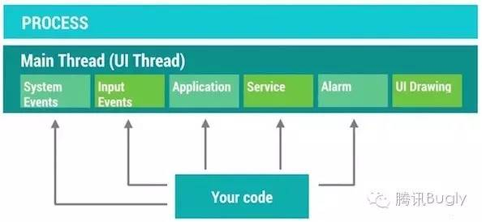

一旦我们在主线程里面添加了操作复杂的代码，这些代码就很可能阻碍主线程去响应点击/滑动事件，阻碍主线程的 UI 绘制等等。我们知道，为了让屏幕的刷新帧率达到60fps，我们需要确保 16ms 内完成单次刷新的操作。一旦我们在主线程里面执行的任务过于繁重就可能导致接收到刷新信号的时候因为资源被占用而无法完成这次刷新操作，这样就会产生掉帧的现象，刷新帧率自然也就跟着下降了(一旦刷新帧率降到 20fps 左右，用户就可以明显感知到卡顿不流畅了)。

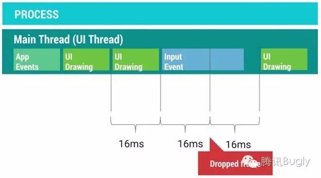

为了避免上面提到的掉帧问题，我们需要使用多线程的技术方案，把那些操作复杂的任务移动到其他线程当中执行，这样就不容易阻塞主线程的操作，也就减小了出现掉帧的可能性。

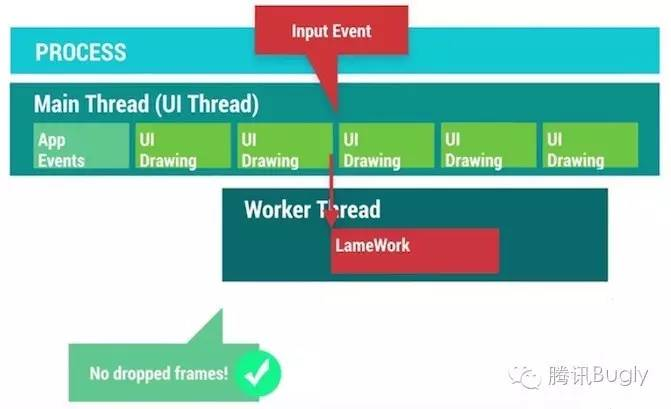 

那么问题来了，为主线程减轻负的多线程方案有哪些呢？这些方案分别适合在什么场景下使用？Android 系统为我们提供了若干组工具类来帮助解决这个问题。

  * **AsyncTask:** 为 UI 线程与工作线程之间进行快速的切换提供一种简单便捷的机制。适用于当下立即需要启动，但是异步执行的生命周期短暂的使用场景。
  * **HandlerThread:** 为某些回调方法或者等待某些任务的执行设置一个专属的线程，并提供线程任务的调度机制。
  * **ThreadPool:** 把任务分解成不同的单元，分发到各个不同的线程上，进行同时并发处理。
  * **IntentService:** 适合于执行由 UI 触发的后台 Service 任务，并可以把后台任务执行的情况通过一定的机制反馈给 UI。

了解这些系统提供的多线程工具类分别适合在什么场景下，可以帮助我们选择合适的解决方案，避免出现不可预期的麻烦。虽然使用多线程可以提高程序的并发量，但是我们需要特别注意因为引入多线程而可能伴随而来的内存问题。举个例子，在 Activity 内部定义的一个 AsyncTask，它属于一个内部类，该类本身和外面的Activity 是有引用关系的，如果 Activity 要销毁的时候，AsyncTask 还仍然在运行，这会导致 Activity 没有办法完全释放，从而引发内存泄漏。所以说，多线程是提升程序性能的有效手段之一，但是使用多线程却需要十分谨慎小心，如果不了解背后的执行机制以及使用的注意事项，很可能引起严重的问题。

**2. Understanding Android Threading**

通常来说，一个线程需要经历三个生命阶段：开始，执行，结束。线程会在任务执行完毕之后结束，那么为了确保线程的存活，我们会在执行阶段给线程赋予不同的任务，然后在里面添加退出的条件从而确保任务能够执行完毕后退出。

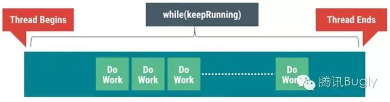

在很多时候，线程不仅仅是线性执行一系列的任务就结束那么简单的，我们会需要增加一个任务队列，让线程不断的从任务队列中获取任务去进行执行，另外我们还可能在线程执行的任务过程中与其他的线程进行协作。如果这些细节都交给我们自己来处理，这将会是件极其繁琐又容易出错的事情。

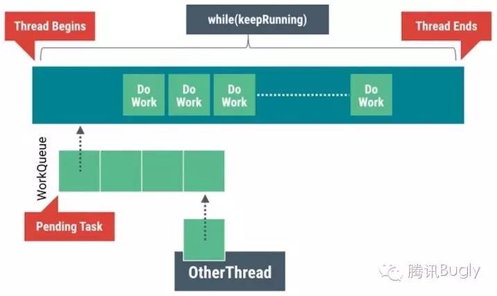

所幸的是，Android 系统为我们提供了 Looper，Handler，MessageQueue 来帮助实现上面的线程任务模型：

**Looper:** 能够确保线程持续存活并且可以不断的从任务队列中获取任务并进行执行。

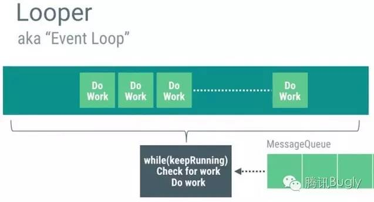

**Handler:** 能够帮助实现队列任务的管理，不仅仅能够把任务插入到队列的头部，尾部，还可以按照一定的时间延迟来确保任务从队列中能够来得及被取消掉。

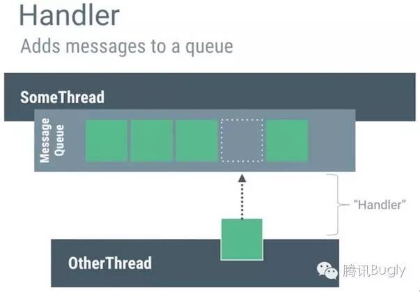

**MessageQueue:** 使用 Intent，Message，Runnable 作为任务的载体在不同的线程之间进行传递。

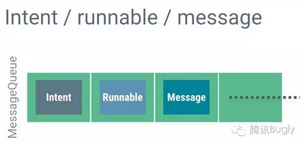

把上面三个组件打包到一起进行协作，这就是 HandlerThread

我们知道，当程序被启动，系统会帮忙创建进程以及相应的主线程，而这个主线程其实就是一个 HandlerThread。这个主线程会需要处理系统事件，输入事件，系统回调的任务，UI绘制等等任务，为了避免主线程任务过重，我们就会需要不断的开启新的工作线程来处理那些子任务。

  

**3. Memory & Threading**

增加并发的线程数会导致内存消耗的增加，平衡好这两者的关系是非常重要的。我们知道，多线程并发访问同一块内存区域有可能带来很多问题，例如读写的权限争夺问题，ABA 问题等等。为了解决这些问题，我们会需要引入锁的概念。

在 Android 系统中也无法避免因为多线程的引入而导致出现诸如上文提到的种种问题。Android UI对象的创建，更新，销毁等等操作都默认是执行在主线程，但是如果我们在非主线程对UI对象进行操作，程序将可能出现异常甚至是崩溃。

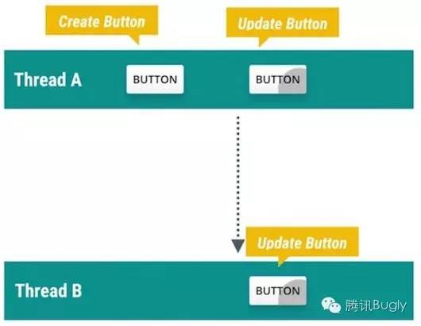

另外，在非 UI 线程中直接持有 UI 对象的引用也很可能出现问题。例如Work线程中持有某个 UI 对象的引用，在 Work 线程执行完毕之前，UI对象在主线程中被从 ViewHierarchy 中移除了，这个时候 UI 对象的任何属性都已经不再可用了，另外对这个 UI 对象的更新操作也都没有任何意义了，因为它已经从 ViewHierarchy 中被移除，不再绘制到画面上了。

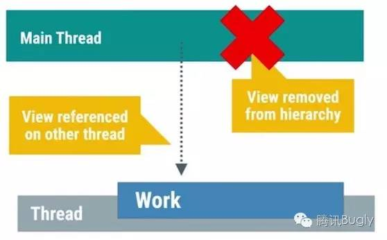

不仅如此，View 对象本身对所属的 Activity 是有引用关系的，如果工作线程持续保有 View 的引用，这就可能导致 Activity 无法完全释放。除了直接显式的引用关系可能导致内存泄露之外，我们还需要特别留意隐式的引用关系也可能导致泄露。例如通常我们会看到在 Activity 里面定义的一个 AsyncTask，这种类型的 AsyncTask 与外部的 Activity 是存在隐式引用关系的，只要 Task 没有结束，引用关系就会一直存在，这很容易导致 Activity 的泄漏。更糟糕的情况是，它不仅仅发生了内存泄漏，还可能导致程序异常或者崩溃。 

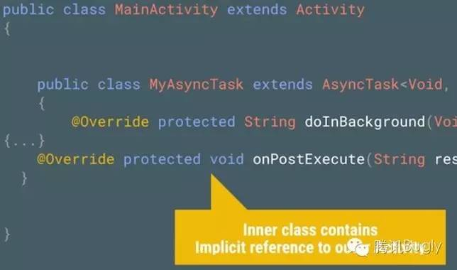 

为了解决上面的问题，我们需要谨记的原则就是：不要在任何非 UI 线程里面去持有 UI 对象的引用。系统为了确保所有的 UI 对象都只会被 UI 线程所进行创建，更新，销毁的操作，特地设计了对应的工作机制(当 Activity 被销毁的时候，由该 Activity 所触发的非 UI 线程都将无法对UI对象进行操作，否者就会抛出程序执行异常的错误)来防止 UI 对象被错误的使用。

**4\. Good AsyncTask Hunting**

AsyncTask 是一个让人既爱又恨的组件，它提供了一种简便的异步处理机制，但是它又同时引入了一些令人厌恶的麻烦。一旦对 AsyncTask 使用不当，很可能对程序的性能带来负面影响，同时还可能导致内存泄露。

举个例子，常遇到的一个典型的使用场景：用户切换到某个界面，触发了界面上的图片的加载操作，因为图片的加载相对来说耗时比较长，我们需要在子线程中处理图片的加载， 当图片在子线程中处理完成之后，再把处理好的图片返回给主线程，交给 UI 更新到画面上。

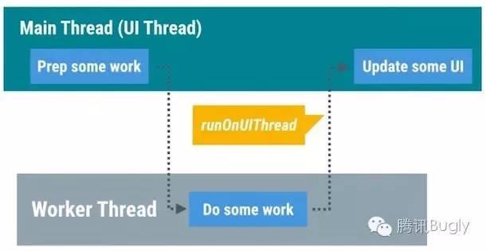 

AsyncTask 的出现就是为了快速的实现上面的使用场景，AsyncTask 把在主线程里面的准备工作放到 onPreExecute()方法里面进行执行，doInBackground()方法执行在工作线程中，用来处理那些繁重的任务，一旦任务执行完毕，就会调用
onPostExecute()方法返回到主线程。

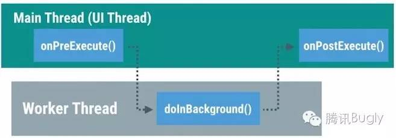

使用 AsyncTask 需要注意的问题有哪些呢？请关注以下几点：

首先，默认情况下，所有的 AsyncTask 任务都是被线性调度执行的，他们处在同一个任务队列当中，按顺序逐个执行。假设你按照顺序启动20个AsyncTask，一旦其中的某个 AsyncTask 执行时间过长，队列中的其他剩余 AsyncTask都处于阻塞状态，必须等到该任务执行完毕之后才能够有机会执行下一个任务。情况如下图所示：

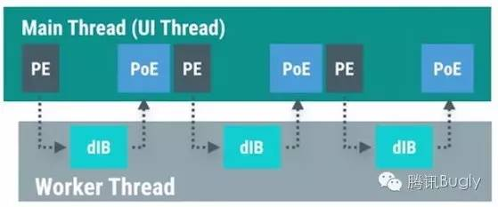

为了解决上面提到的线性队列等待的问题，我们可以使用 AsyncTask.executeOnExecutor()强制指定 AsyncTask使用线程池并发调度任务。

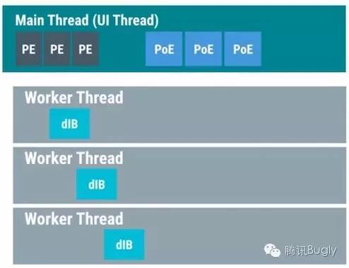 

其次，如何才能够真正的取消一个 AsyncTask 的执行呢？我们知道 AsyncTaks 有提供cancel()的方法，但是这个方法实际上做了什么事情呢？线程本身并不具备中止正在执行的代码的能力，为了能够让一个线程更早的被销毁，我们需要在
doInBackground()的代码中不断的添加程序是否被中止的判断逻辑，如下图所示：  

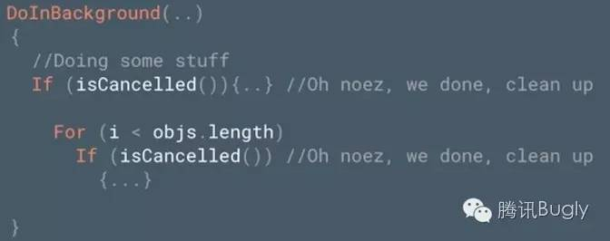  

一旦任务被成功中止，AsyncTask 就不会继续调用 onPostExecute()，而是通过调用onCancelled()的回调方法反馈任务执行取消的结果。我们可以根据任务回调到哪个方法（是 onPostExecute 还是onCancelled）来决定是对 UI 进行正常的更新还是把对应的任务所占用的内存进行销毁等。

最后，使用 AsyncTask 很容易导致内存泄漏，一旦把 AsyncTask 写成 Activity 的内部类的形式就很容易因为 AsyncTask生命周期的不确定而导致 Activity 发生泄漏。

综上所述，AsyncTask 虽然提供了一种简单便捷的异步机制，但是我们还是很有必要特别关注到他的缺点，避免出现因为使用错误而导致的严重系统性能问题。 

**5. Getting a HandlerThread**

大多数情况下，AsyncTask 都能够满足多线程并发的场景需要（在工作线程执行任务并返回结果到主线程），但是它并不是万能的。例如打开相机之后的预览帧数据是通过
onPreviewFrame()的方法进行回调的，onPreviewFrame()和 open()相机的方法是执行在同一个线程的。

如果这个回调方法执行在 UI 线程，那么在onPreviewFrame()里面将要执行的数据转换操作将和主线程的界面绘制，事件传递等操作争抢系统资源，这就有可能影响到主界面的表现性能。 

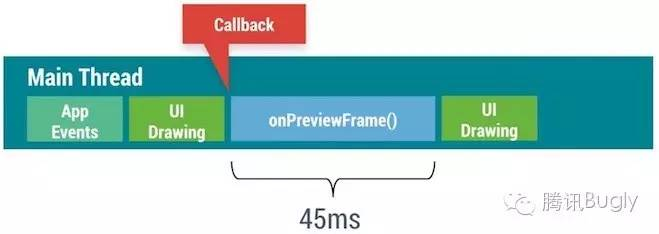

我们需要确保 onPreviewFrame()执行在工作线程。如果使用 AsyncTask，会因为 AsyncTask 默认的线性执行的特性(即使换成并发执行)会导致因为无法把任务及时传递给工作线程而导致任务在主线程中被延迟，直到工作线程空闲，才可以把任务切换到工作线程中进行执行。

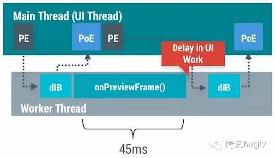

所以我们需要的是一个执行在工作线程，同时又能够处理队列中的复杂任务的功能，而 HandlerThread 的出现就是为了实现这个功能的，它组合了 Handler，MessageQueue，Looper 实现了一个长时间运行的线程，不断的从队列中获取任务进行执行的功能。

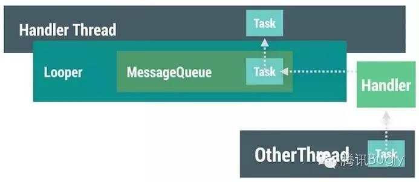

回到刚才的处理相机回调数据的例子，使用 HandlerThread 我们可以把 open()操作与 onPreviewFrame()的操作执行在同一个线程，同时还避免了 AsyncTask 的弊端。如果需要在 onPreviewFrame()里面更新UI，只需要调用 runOnUiThread()方法把任务回调给主线程就够了。

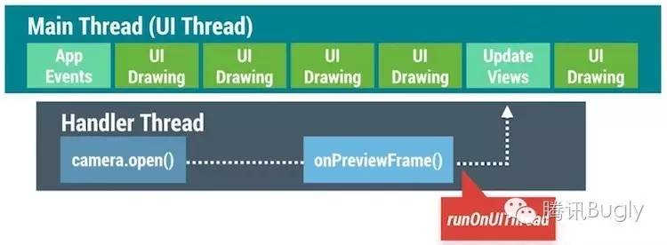

HandlerThread 比较合适处理那些在工作线程执行，需要花费时间偏长的任务。我们只需要把任务发送给HandlerThread，然后就只需要等待任务执行结束的时候通知返回到主线程就好了。

另外很重要的一点是，一旦我们使用了 HandlerThread，需要特别注意给 HandlerThread 设置不同的线程优先级，CPU会根据设置的不同线程优先级对所有的线程进行调度优化。

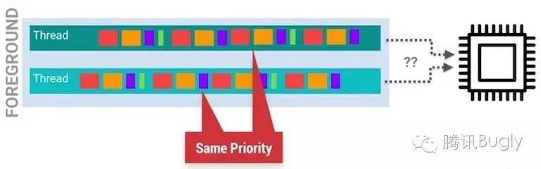

掌握 HandlerThread 与 AsyncTask 之间的优缺点，可以帮助我们选择合适的方案。

**6. Swimming in Threadpools**

线程池适合用在把任务进行分解，并发进行执行的场景。通常来说，系统里面会针对不同的任务设置一个单独的守护线程用来专门处理这项任务。例如使用
Networking Thread 用来专门处理网络请求的操作，使用 IO Thread 用来专门处理系统的 I\O 操作。针对那些场景，这样设计是没有问题的，因为对应的任务单次执行的时间并不长而且可以是顺序执行的。但是这种专属的单线程并不能满足所有的情况，例如我们需要一次性 decode 40张图片，每个线程需要执行 4ms 的时间，如果我们使用专属单线程的方案，所有图片执行完毕会需要花费160ms(40*4)，但是如果我们创建10个线程，每个线程执行4个任务，那么我们就只需要16ms就能够把所有的图片处理完毕。

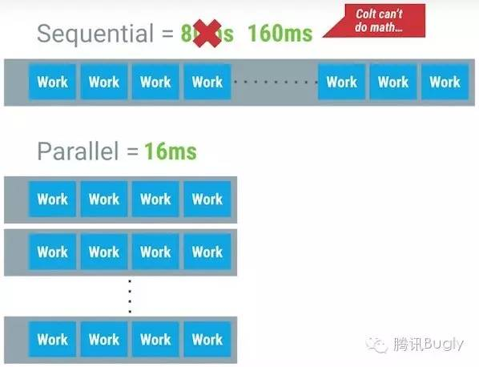

为了能够实现上面的线程池模型，系统为我们提供了 ThreadPoolExecutor 帮助类来简化实现，剩下需要做的就只是对任务进行分解就好了。 

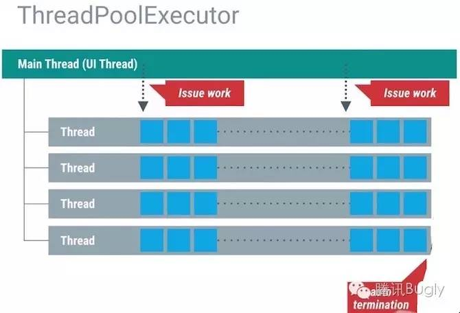

使用线程池需要特别注意同时并发线程数量的控制，理论上来说，我们可以设置任意你想要的并发数量，但是这样做非常的不好。因为 CPU只能同时执行固定数量的线程数，一旦同时并发的线程数量超过 CPU 能够同时执行的阈值，CPU就需要花费精力来判断到底哪些线程的优先级比较高，需要在不同的线程之间进行调度切换。

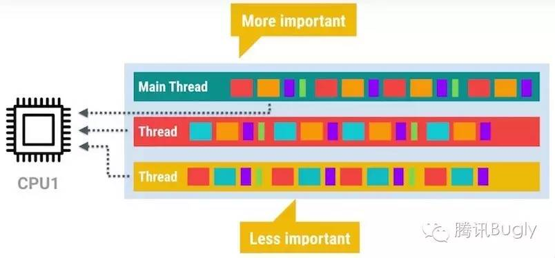

一旦同时并发的线程数量达到一定的量级，这个时候 CPU 在不同线程之间进行调度的时间就可能过长，反而导致性能严重下降。另外需要关注的一点是，每开一个新的线程，都会耗费至少 64K+ 的内存。为了能够方便的对线程数量进行控制，ThreadPoolExecutor 为我们提供了初始化的并发线程数量，以及最大的并发数量进行设置。 

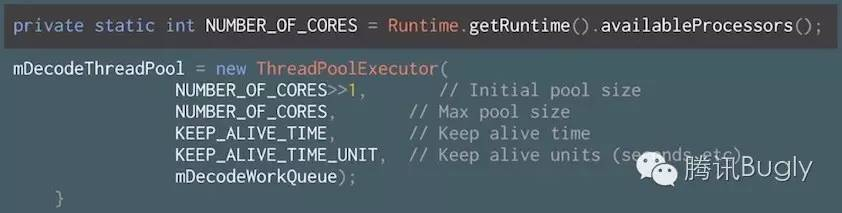

另外需要关注的一个问题是：Runtime.getRuntime().availableProcesser()方法并不可靠，他返回的值并不是真实的 CPU核心数，因为 CPU 会在某些情况下选择对部分核心进行睡眠处理，在这种情况下，返回的数量就只能是激活的 CPU 核心数。

**7\. The Zen of IntentService**

默认的 Service 是执行在主线程的，可是通常情况下，这很容易影响到程序的绘制性能(抢占了主线程的资源)。除了前面介绍过的 AsyncTask 与 HandlerThread，我们还可以选择使用 IntentService 来实现异步操作。IntentService 继承自普通 Service 同时又在内部创建了一个 HandlerThread，在 onHandlerIntent()的回调里面处理扔到 IntentService 的任务。所以IntentService 就不仅仅具备了异步线程的特性，还同时保留了 Service 不受主页面生命周期影响的特点。

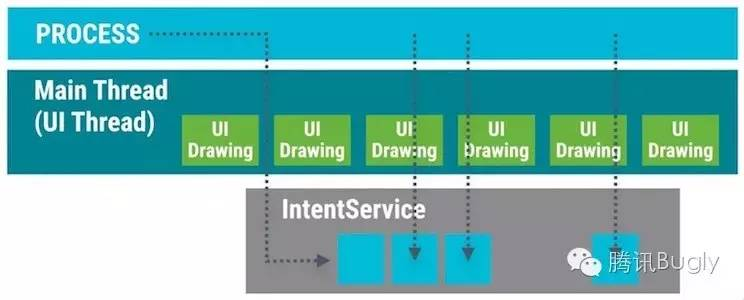

如此一来，我们可以在 IntentService 里面通过设置闹钟间隔性的触发异步任务，例如刷新数据，更新缓存的图片或者是分析用户操作行为等等，当然处理这些任务需要小心谨慎。

使用 IntentService 需要特别留意以下几点：

  * 首先，因为 IntentService 内置的是 HandlerThread 作为异步线程，所以每一个交给 IntentService 的任务都将以队列的方式逐个被执行到，一旦队列中有某个任务执行时间过长，那么就会导致后续的任务都会被延迟处理。

  * 其次，通常使用到 IntentService 的时候，我们会结合使用 BroadcastReceiver 把工作线程的任务执行结果返回给主 UI 线程。使用广播容易引起性能问题，我们可以使用 LocalBroadcastManager 来发送只在程序内部传递的广播，从而提升广播的性能。我们也可以使用 runOnUiThread() 快速回调到主 UI 线程。

  * 最后，包含正在运行的 IntentService 的程序相比起纯粹的后台程序更不容易被系统杀死，该程序的优先级是介于前台程序与纯后台程序之间的。

  
  
**8. Threading and Loaders**

当启动工作线程的 Activity 被销毁的时候，我们应该做点什么呢？为了方便的控制工作线程的启动与结束，Android 为我们引入了 Loader 来解决这个问题。我们知道 Activity 有可能因为用户的主动切换而频繁的被创建与销毁，也有可能是因为类似屏幕发生旋转等被动原因而销毁再重建。在 Activity 不停的创建与销毁的过程当中，很有可能因为工作线程持有 Activity 的 View 而导致内存泄漏(因为工作线程很可能持有 View的强引用，另外工作线程的生命周期还无法保证和 Activity 的生命周期一致，这样就容易发生内存泄漏了)。除了可能引起内存泄漏之外，在 Activity
被销毁之后，工作线程还继续更新视图是没有意义的，因为此时视图已经不在界面上显示了。

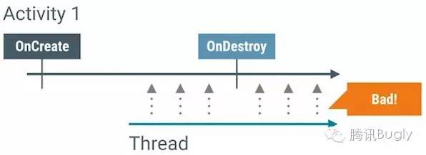

Loader 的出现就是为了确保工作线程能够和 Activity 的生命周期保持一致，同时避免出现前面提到的问题。

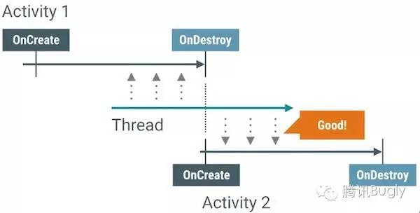

LoaderManager 会对查询的操作进行缓存，只要对应 Cursor 上的数据源没有发生变化，在配置信息发生改变的时候(例如屏幕的旋转)，Loader可以直接把缓存的数据回调到 onLoadFinished()，从而避免重新查询数据。另外系统会在 Loader 不再需要使用到的时候(例如使用 Back 按钮退出当前页面)回调 onLoaderReset()方法，我们可以在这里做数据的清除等等操作。

在 Activity 或者 Fragment 中使用 Loader 可以方便的实现异步加载的框架，Loader 有诸多优点。但是实现 Loader 的这套代码还是稍微有点点复杂，Android 官方为我们提供了使用 Loader 的示例代码进行参考学习。

**9. The Importance of Thread Priority**

理论上来说，我们的程序可以创建出非常多的子线程一起并发执行的，可是基于 CPU 时间片轮转调度的机制，不可能所有的线程都可以同时被调度执行，CPU 需要根据线程的优先级赋予不同的时间片。
 
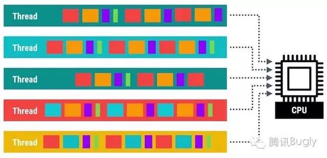

Android 系统会根据当前运行的可见的程序和不可见的后台程序对线程进行归类，划分为 forground 的那部分线程会大致占用掉 CPU 的90%左右的时间片，background 的那部分线程就总共只能分享到5%-10%左右的时间片。之所以设计成这样是因为 forground 的程序本身的优先级就更高，理应得到更多的执行时间。

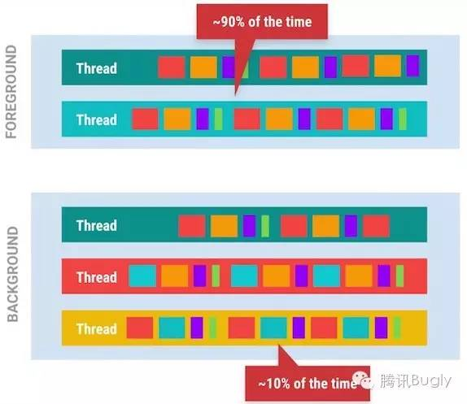 

默认情况下，新创建的线程的优先级默认和创建它的母线程保持一致。如果主 UI
线程创建出了几十个工作线程，这些工作线程的优先级就默认和主线程保持一致了，为了不让新创建的工作线程和主线程抢占 CPU资源，需要把这些线程的优先级进行降低处理，这样才能给帮组 CPU 识别主次，提高主线程所能得到的系统资源。

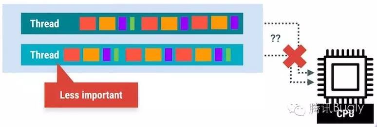

在 Android 系统里面，我们可以通过android.os.Process.setThreadPriority(int) 设置线程的优先级，参数范围从-20到19，数值越小优先级越高。Android系统还为我们提供了以下的一些预设值，我们可以通过给不同的工作线程设置不同数值的优先级来达到更细粒度的控制。

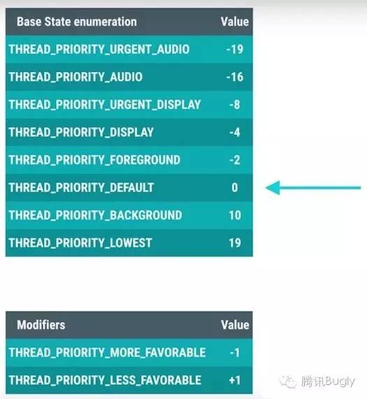

大多数情况下，新创建的线程优先级会被设置为默认的0，主线程设置为0的时候，新创建的线程还可以利用THREAD_PRIORITY_LESS_FAVORABLE 或者 THREAD_PRIORITY_MORE_FAVORABLE 来控制线程的优先级。

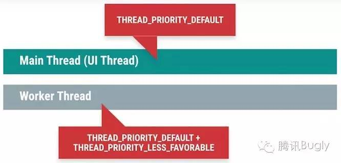

Android 系统里面的 AsyncTask 与 IntentService已经默认帮助我们设置线程的优先级，但是对于那些非官方提供的多线程工具类，我们需要特别留意根据需要自己手动来设置线程的优先级。

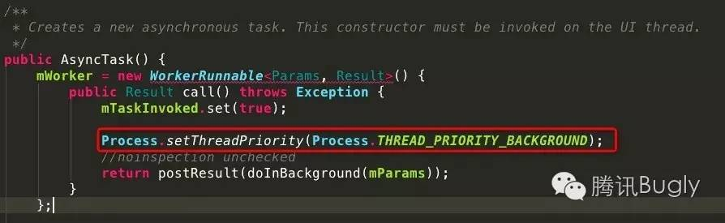  

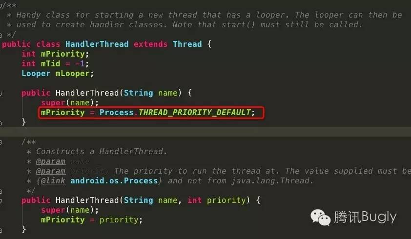

**10. Profile GPU Rendering : M Update**

从 Android M 系统开始，系统更新了 GPU Profiling 的工具来帮助我们定位 UI 的渲染性能问题。早期的 CPU Profiling 工具只能粗略的显示出 Process，Execute，Update 三大步骤的时间耗费情况。 

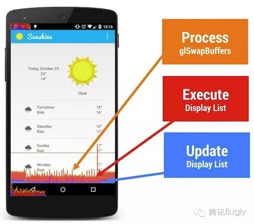 

但是仅仅显示三大步骤的时间耗费情况，还是不太能够清晰帮助我们定位具体的程序代码问题，所以在 Android M 版本开始，GPU Profiling工具把渲染操作拆解成如下8个详细的步骤进行显示。

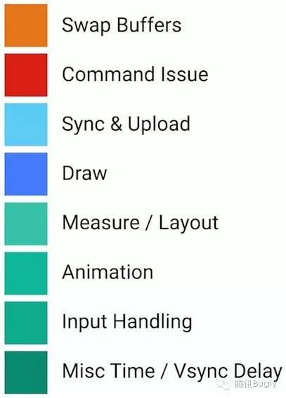

旧版本中提到的 Proces，Execute，Update 还是继续得到了保留，他们的对应关系如下： 

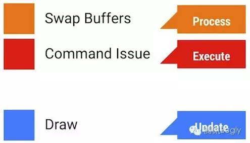

接下去我们看下其他五个步骤分别代表了什么含义：

**Sync & Upload**：通常表示的是准备当前界面上有待绘制的图片所耗费的时间，为了减少该段区域的执行时间，我们可以减少屏幕上的图片数量或者是缩小图片本身的大小。

**Measure & Layout**：这里表示的是布局的 onMeasure 与 onLayout 所花费的时间，一旦时间过长，就需要仔细检查自己的布局是不是存在严重的性能问题。

**Animation**：表示的是计算执行动画所需要花费的时间，包含的动画有 ObjectAnimator，ViewPropertyAnimator，Transition 等等。一旦这里的执行时间过长，就需要检查是不是使用了非官方的动画工具或者是检查动画执行的过程中是不是触发了读写操作等等。

**Input Handling**：表示的是系统处理输入事件所耗费的时间，粗略等于对于的事件处理方法所执行的时间。一旦执行时间过长，意味着在处理用户的输入事件的地方执行了复杂的操作。

**Misc/Vsync Delay**：如果稍加注意，我们可以在开发应用的 Log 日志里面看到这样一行提示：I/Choreographer(691): Skipped XXX frames! The application may be doing too much work on its main thread。这意味着我们在主线程执行了太多的任务，导致 UI 渲染跟不上 vSync 的信号而出现掉帧的情况。

上面八种不同的颜色区分了不同的操作所耗费的时间，为了便于我们迅速找出那些有问题的步骤，GPU Profiling 工具会显示 16ms的阈值线，这样就很容易找出那些不合理的性能问题，再仔细看对应具体哪个步骤相对来说耗费时间比例更大，结合上面介绍的细化步骤，从而快速定位问题，修复问题。

