 
<!--BEGIN_DATA
{
    "create_date": "2017-05-11 14:24", 
    "modify_date": "2017-05-11 14:24", 
    "is_top": "0", 
    "summary": "App模块化实战经验总结", 
    "tags": "iOS、Android", 
    "file_name": "App模块化实战经验总结.md"
}
END_DATA-->

####
原文出处：<a href='https://youzanmobile.github.io/2017/04/14/youzan-app-modularization/' target='blank'>有赞 App模块化实战经验总结</a>

随着有赞电商业务的不断发展壮大，App 端所承担的功能也越来越重，特别是代码几易其主之后开始变得杂乱无章，牵一发而动全局的事情时常发生。为了应对团队壮大之后
的开发模式，我们必须要对业务进行隔离，同时沉淀出通用组件，完善移动开发的基础设施。

随着有赞电商业务的不断发展壮大，App 端所承担的功能也越来越重，特别是代码几易其主之后开始变得杂乱无章，牵一发而动全局的事情时常发生。为了应对团队壮大之后
的开发模式，我们必须要对业务进行隔离，同时沉淀出通用组件，完善移动开发的基础设施。

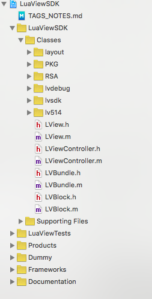

###1\. 痛点

模块化之前，我们主要面临以下痛点：

  * 业务边界不清晰
  * 通用代码与业务代码耦合
  * 代码、资源文件大量重复
  * 常量满天飞
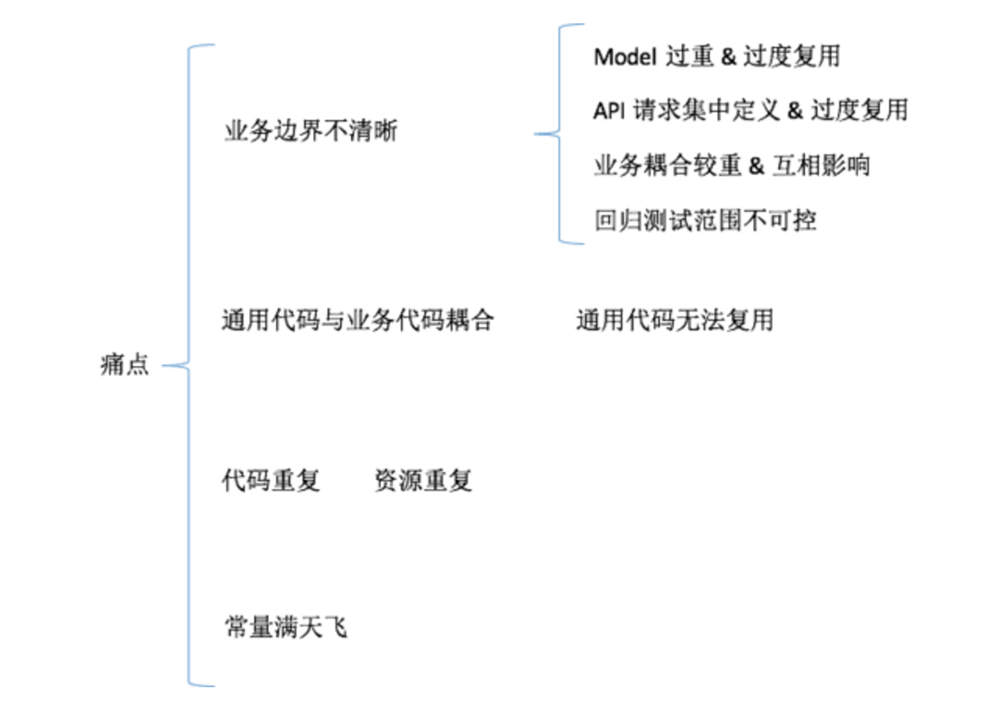

其中**业务边界不清晰**是最大的痛点，最直接的表现就是处处有雷，经常会引入新的 Bug，而且很多 Bug 往往不能从根本上解决，代码维护成本居高不下。

###2\. 重构原则

模块化并不能一蹴而就，我们在重构的同时也在做新需求，每次看到那一坨旧代码心中就会有无数只”草泥马”奔腾而过，干脆重写的无奈之情难以抑制，结果在红牛的日夜陪伴下写出来的新代码虽然看上去“漂亮”，但是实际上问题更多，得不偿失。吃过几次苦头之后，我们总结出了重构的三项基本原则：

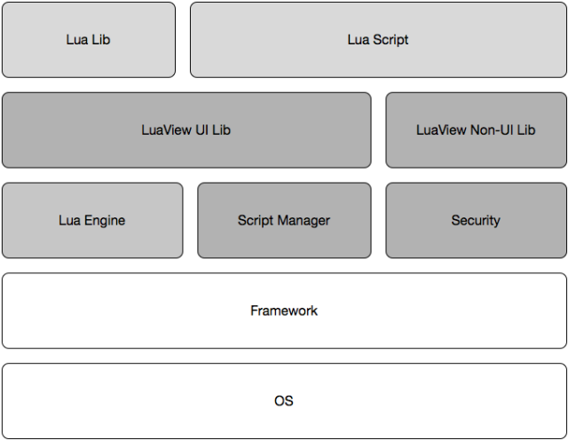

####2.1 渐进式重构

如果一段代码已经比较稳定，可以从中抽取一部分功能重写，不要一上来就全部推翻重写，可以慢慢淘汰掉老代码。

####2.2 iOS / Android 互相参考

业务代码总是惊人的相似，两端互相参考的过程中，不但可以 Review 代码，还能加深对业务的理解，可谓一举两得。  
实践证明，如果人手紧张，项目早期可以只让一端的开发人员跟需求，另一端直接“翻译代码”，甚至一个人写两端代码。

####2.3 理清业务再动手

App 作为业务链的末端，由于角色所限，开发人员对业务的理解比后端要浅，所谓欲速则不达，重构不能急，理清楚业务逻辑之后再动手。（可以找熟悉业务的同学聊一下
— PD、后端、测试）

###3 模块化过程

所谓模块化，是一个分而治之的过程，概念类似于 SOA，首先进行垂直拆分，过程中必然会催生出业务共享的 Common 模块，而 Common 又可以继续水平拆分，逐渐变薄，直到 Common 消失。

刚开始不需要完美的目标，简单粗暴一点，后续再逐渐改善。

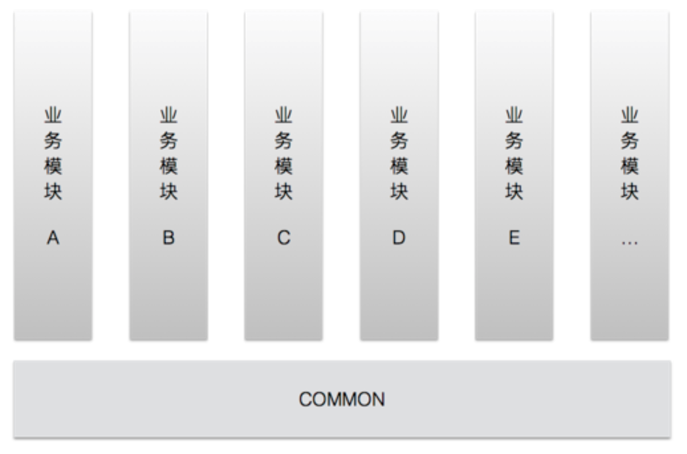

####3.1 抽取 Common

Common 层服务于所有的上层业务，是通用层，不允许引用业务层代码。

  1. 首先把 Common 层用到的 Business 层代码下放到各个业务
  2. 然后把多个 Business 之间共用的代码提取到 Common 层
  3. 资源文件的处理方式与代码一致
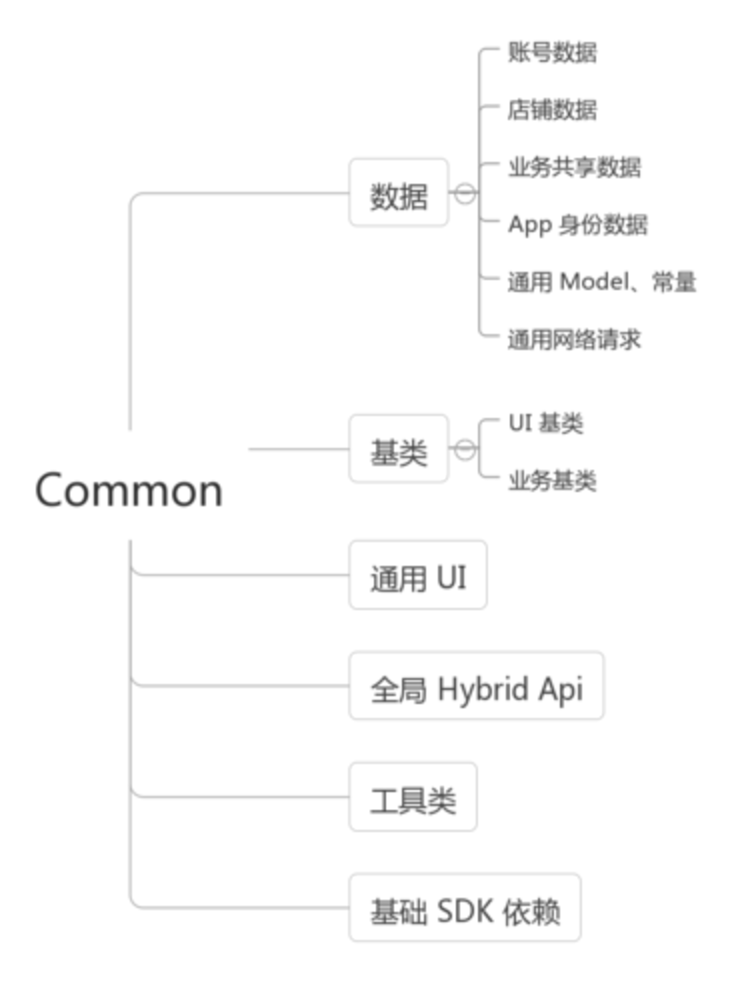

Common 层作为权宜之计，它的命运是向死而生，最终会诞生出许多功能独立的基础模块。而这个过程是漫长的，我们只能在业务隔离的同时，不断丰富 Common 模块，然后在某个节点将其再拆分成一个一个独立模块。

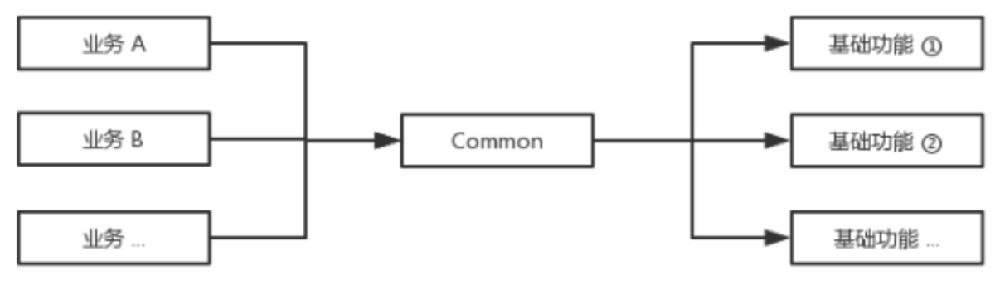

代码也逃不出分久必合、合久必分的的宿命。

####3.2 业务隔离

业务模块之间不能互相依赖，只能单向依赖 common。

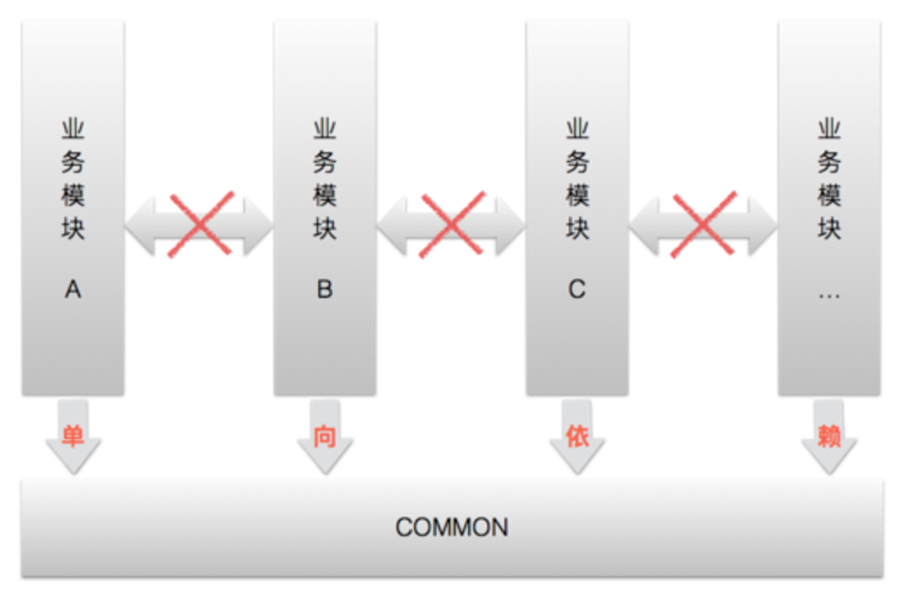

业务之间存在两种耦合关系：

  * 页面耦合
  * 功能耦合

要做到彻底隔离就必须打破这两种耦合关系：

  * 页面解耦 - 跳转协议
  * 功能解耦 - 模块间 RPC

#####3.2.1 统一跳转协议

页面解耦可以借鉴 Web 的设计原理，给业务模块中对外的页面定义一个 URI，然后页面之间通过 URI 跳转。

举个栗子，A、B 两个页面分属于不同的业务模块，在页面未解耦之前，A 如果要跳转到 B，必须要依赖 B 的模块，那么跳转代码会写成如下形式：

_Android_  

    
    Intent intent = new Intent(getContext(), BbbActivity.class);
    
    intent.putParcelable(BbbActivity.EXTRA_MESSAGE, message);
    
    startActivity(intent);

_iOS_  

    
    BbbViewController *bbbVC = [[BbbViewController alloc] init];
    
    bbbVC.messageModel = messageModel;
    
    [self.navigationController pushViewController:bbbVC animated:YES];

如果 A、B 之间还需要传递数据，就要共享常量、Model，耦合继续加重。

如果我们为 B 页面定义一个 URI - `wsc://home/bbb`，然后把共享的 `messageModel` 拍平序列化成 Json 串，那么 A
只需要拼装一个符合 B 页面 scheme 的跳转协议就可以了。

    
    wsc://home/bbb?message={ "name":"John", "age":31, "city":"New York" }

`URL Router` 有很多种实现方式，网上资料也是多如牛毛，这里只提供一种思路。

**Android 实现方式**

  1. 在 AndroidManifest.xml 文件中定义 URI
    
   
    
        <activity android:name=".ui.BbbActivity"
	    
	    <intent-filter>
    
        <category android:name="android.intent.category.DEFAULT" />
    
        <action android:name="android.intent.action.VIEW" />
    
        <data
    
            android:host="bbb"
    
            android:path="/home"
    
            android:scheme="wsc" />
    
	    </intent-filter>
	    
	    </activity>

  2. 封装跳转 `Intent`

    
        final Uri uri = new Uri.Builder().authority("wsc").path("home/bbb")
                         .appendQueryParameter("message", new Gson().toJson(messageModel)).build();
    
	    final Intent intent = new Intent(Intent.ACTION_VIEW);
	    
	    intent.setData(uri);
	    
	    startActivity(intent);

  3. 步骤 2 代码进一步封装

    
        ZanURLRouter.from(getContext())   
        .withAction(Intent.ACTION_VIEW)   
        .withUri("wsc://home/bbb")    
        .withParcelableExtra("message", messageModel) 
        .navigate();

**iOS实现方式**

  1. 通过 plist 文件保存 URI 到 Controller class 的映射 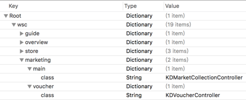
  2. 封装一个根据 URI 跳转到 Controller 的 SDK
  3. 页面跳转 
    
    
        [ZanURLRouter routeURL:@"wsc://home/bbb"];

**注意事项**

>   * 两端协议要保持一致

>   * 需要通过工程手段保证页面 URI 唯一

#####3.2.2 模块间 RPC

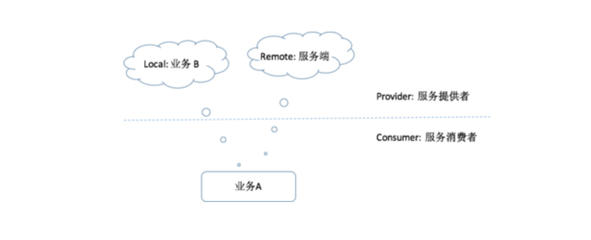

「业务 A 」与「Remote: 服务端」之间通过 HTTP 或者其他协议进行远程调用，「Remote: 服务端」是服务提供者，「业务 A 」是服务消费者。

对于「业务 A 」来说，「Local: 业务 B」也是服务提供者，但是两者不存在依赖关系，所以只能通过**协议**来通信。

  * iOS 通过 `protocol` 提供服务，利用 [BeeHive](https://github.com/alibaba/BeeHive) 做“服务治理”。

  * Android 通过 `interface` 提供服务，然后我们模仿 Retrofit 做了一个“服务治理”框架 - ServiceRouter，它的优势在于可以只在业务提供方的 module 中定义 `interface`，解耦更彻底。

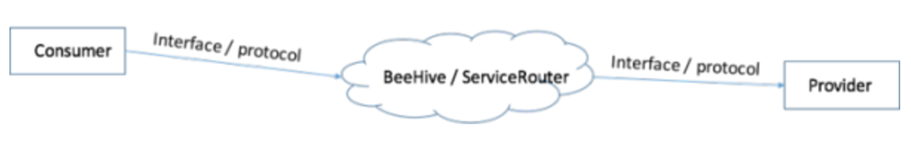

###4 代码管理

如果被隔离的业务模块仍然在一个 Project 中，就无法从“物理”上彻底隔绝代码间的相互引用，我们需要从工程上保证业务之间互相独立。

####4.1 代码结构

Android (Module) iOS (Project)

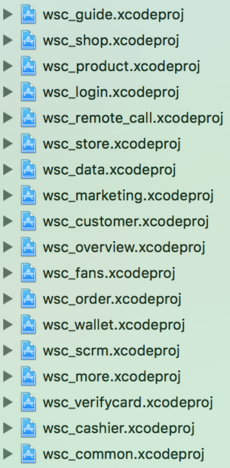

####4.2 独立发版

每一个 subproject 可以独立发版，然后通过坐标依赖组装成 App，以 Android 为例：

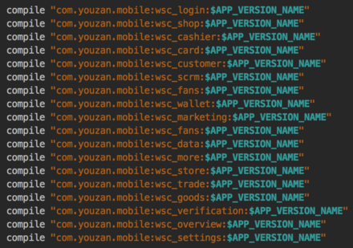

####4.3 独立 Repo

现在还没有找到一个很好的代码组织形式，所以我们的观点是：

在团队规模不大的时候，一个人要 Cover 多个子工程，所以没有必要独立 Repo，当一个 Repo 需要多个人 Cover 时可以考虑独立 Repo。

规模 是否独立 Repo

Developer 1 : N projects

否

Project 1 : N developers

是

当解耦方案确定之后，模块化其实就是一个体力活，返工重做便成了家常便饭，所以我们觉得比较好的方式应该是**专人负责、一气呵成**。

###5 诗和远方

  * 通过[移动配置中心](https://youzanmobile.github.io/2017/04/10/app-config/)动态下发跳转协议
  * 抽取移动端业务通用 UI 组件库
  * 主工程可选择性依赖业务模块

####
原文出处：<a href='http://www.jianshu.com/p/60c1b9ddd8ab' target='blank'>App组件化与业务拆分那些事</a>

  

###前言

最近事情比较多，2个月没写文章了。看笔者圣诞节还在写技术文章，就知道程序猿的生活有多惨淡。

上几篇单元测试的文章，笔者已经把大部分思路讲给大家听了，如果在开发中有新的思路和技巧，以后给大家分享。

接下来，想给大家讲讲App项目的组件化与业务拆分。

如果上Google搜“App模块化”、“App组件化”，可以出现一堆文章教你“如何组件化”、“组件化用到什么技术”，笔者经常搞不清他们说的“组件”、"模块"、“业务”到底怎么划分，很多作者对这几个概念都有不同的理解。这导致笔者当初在搜集这方面资料，非常尴尬，每看一篇文章都有地方跟之前的文章冲突，也不知道谁对谁错。

本文会从业务的角度，给大家讲讲为什么要拆分App业务，如何拆分，以及优点等等。

###为什么要组件化、模块化

####项目存在问题

>   * 代码量大，耦合严重
>   * 编译慢，效率低
>   * 业务开发分工不明确，开发人员要关心非业务的代码
>   * 改代码时，可能会影响其他业务，牵一发动全身

####优点

>   * 架构更清晰，解耦
>   * 加快编译速度
>   * 业务分工明确，开发人员仅专注与自己的业务
>   * 提高开发效率
>   * 组件、业务独立更新版本，可回滚，持续集成

###组件化与模块化

**组件、模块**，中文字面意思相近，在英文上都可以翻译为**"Module"**，加上Android Studio上，library被称为"Module"，这就不难解释为什么我们谈到“组件化”、“模块化”，两者之间的区别相当的模糊。

####组件

App工程上所说的 **组件**，应该翻译为**“Component”**，意思是组件、部件、元件。**在电子电路中，电子元件是电子电路中的基本元素。**在App工程上，**组件是构成业务或者功能模块的基本单位**。原则上，组件与组件之间互不依赖。

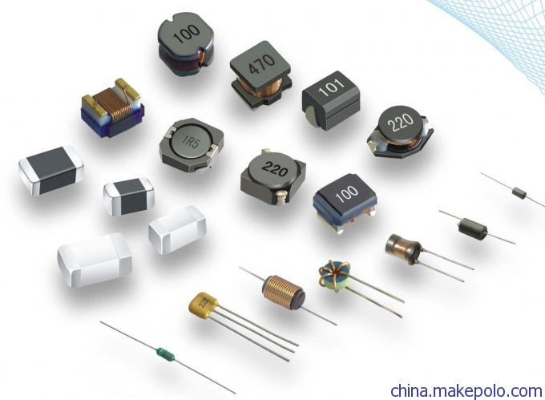  

组件，components

例如，图片上传功能，应该叫**“图片上传组件”**，而不是“图片上传模块”。因为图片上传从功能、业务上，已经不能往下拆了。图片上传可能使用**七牛sdk**，或者**又拍云sdk**。无论图片上传组件用七牛sdk，还是又拍云sdk，都不会影响这个组件的功能，因此组件具有**可替换性**；同时，图片上传组件可以**被多个业务使用**，因此组件具有**可复用性**。由于sdk只是技术细节，它跟业务并没有关系。在业务架构图上，也不会出现**“xxsdk”**，因此我们说**图片上传组件不能拆分了**。

同理，日志功能，叫**“日志组件”**，不叫“日志模块”。

####模块

**模块**翻译为**“Module”**，字面意思。模块由多个组件构成，它可以实现一个独立的功能，甚至业务。

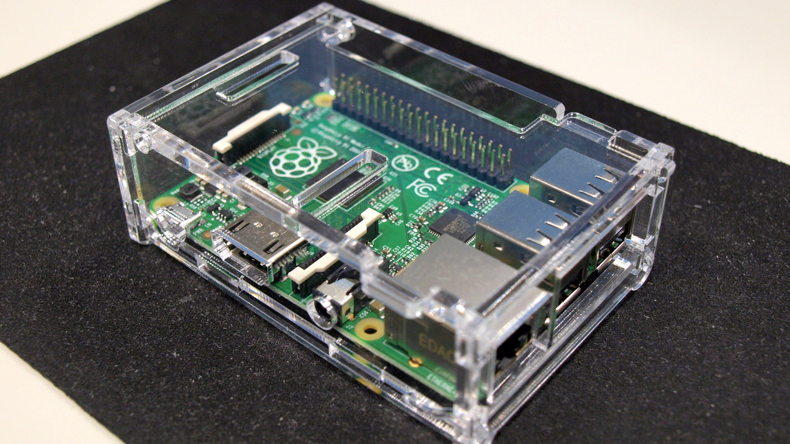  

模块，module

例如，大众点评的美食功能，是一个业务，可以叫**“美食模块”**，习惯上叫**“美食业务”**。它可以拆分更小的模块：**搜索、签到、评论**等。

####两者关系

从上面的阐述可以得出，一个工程，由多个模块组成，每个模块由多个组件构成。但很多时候，两者界限还是相当模糊。例如**“日志组件”**称为**“日志模块”**，
也没有违和感。

>   * 组件从业务角度上不能继续拆分，**可替换，可复用**；
>   * 模块的定义比较笼统，可以是一个Business业务，可以是技术架构中一个业务，也可以是几个组件构成的小功能。

无论是**组件化**还是**模块化**，目标都是把臃肿的工程，拆分为更小的部分，解耦各种复杂的逻辑，便于代码管理。

###业务划分

一个产品的业务，其实是在规划产品功能，或者做产品原型时，已经定好了（如果连产品或者老板都没这概念的话，我们还是算了）；如果后端牛逼的话，他们也会做业务划分，**每个业务部署到独立的容器、虚拟机、服务器**。所以，我们做业务划分时，可以咨询后端，也可以咨询产品经理。

例如，大众点评，首页已经展示了好多个业务：**美食、电影、酒店、休闲娱乐、外卖、机票/火车票.....**这种多业务APP，通常会把业务尽量展示在首页，这种APP大的业务很好划分。**美食、电影**这类看起来完全不同的业务，笔者称为**Business业务**。

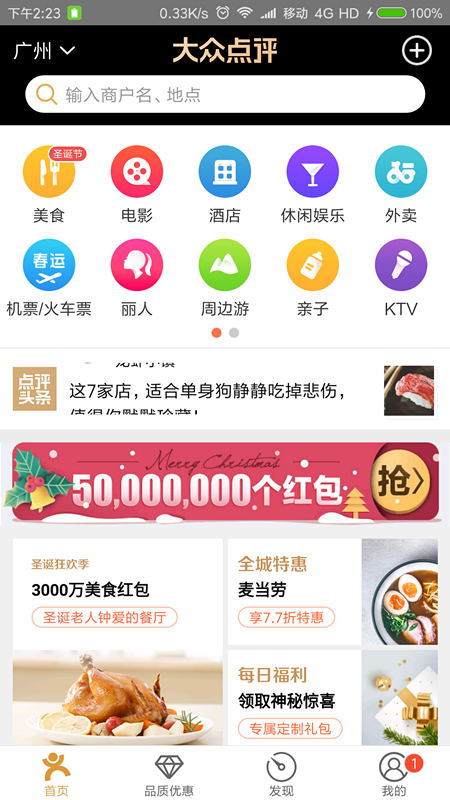  

大众点评-首页

但并不是这样划分就OK了，好像大众点评这种超级APP，**每个Business业务都能分成很多基础业务**。例如，美食业务，可以**搜索商铺、预约、使用优惠券、点评、签到等**；同时，电影业务也有**搜索、优惠券、点评等**。所以，**搜索商铺、优惠券、点评**这种基础业务，可以独立出来，**被多个Busine
ss业务使用**。

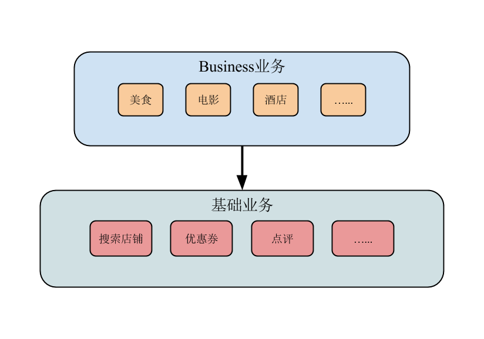  

业务架构

###组件与业务

上文提过，多个组件构成一个模块，当模块相当于业务时，就是说该业务由多个组件组合而成。

还是拿大众点评做例子，**点评基础业务，发布点评**需要**上传图片、网络提交、记录本地日志等**，那么需要调用**上传图片组件、网络组件、日志组件等**。

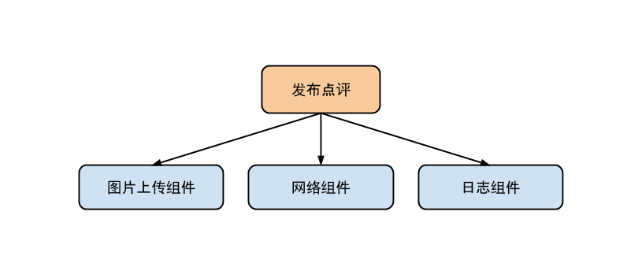  

点评业务-组件

不仅仅点评业务调用，所有业务都会调用这些组件。于是，业务架构如下：

> Business业务 -> 基础业务 -> 各种组件

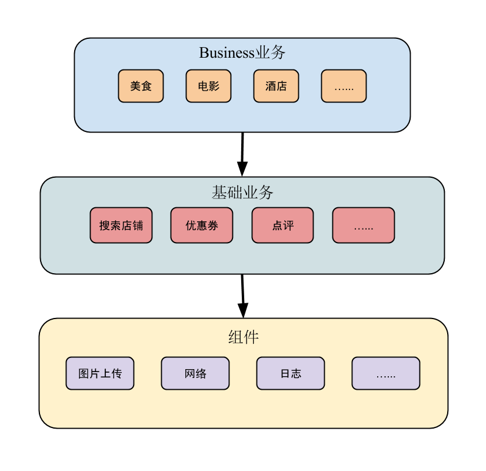  

业务-组件架构

###业务与业务

####情景

> 场景：在大众点评**订了酒店**，入住之后，打开该酒店详情页，大众在“推荐列表”给你推荐若干**大保健**......  
（不要问笔者大保健是什么，笔者什么都不知道）

#####情况1：

> 前端H（负责**酒店业务H**）：后端D，麻烦给酒店业务单独做个推荐大保健的api。  
后端D（负责**大保健业务D**）：**大保健业务**有`api D`，你调用`api D`吧
>
> 前端在**酒店业务Module**，写了调用`api D`，功能上线。
>
> =============================================================  
过了一段时间，大保健业务做了调整，数据变动、改域名等。
>
> 后端D：前端H，api调整了，麻烦调用`api D`改为调用`api D1`。  
前端H：现在好忙，我加班搞吧。
>
> 于是前端H加班改代码，还要做单元测试等一系列工作。
>
> =============================================================  
又过了一段时间，大保健业务再次数据变动。
>
> 后端D：前端H，`api D1`改成`api D2`。  
前端H：怎么又改.....

本来前端H是做酒店业务的，为了大保健的推荐列表，不得不因为大保健业务调整，而加班加点。再延伸一下，如果酒店业务H还需要调用**电影院列表、美食列表.....**每个业务的改动，前端H就呵呵了。

#####情景2：

当然了，要前端不改动，后端保持原来`api D`也可以的。只不过，会引发下面对话：

> 前端H：后端D，不过你一直提供`api D`给其他业务使用，当数据调整时，`api D`做好兼容我们就不用改了。  
后端D：你傻逼啊，兼容多麻烦，我们很忙的，你们不就改一点代码吗？我们还要#&^@&#$"@*#......

维护**兼容/对外开放接口**确实是一种解决方法，只不过会加重后端开发、运维的工作量，长期来看并不科学。

#####情景3：

如果在前端业务与业务在独立的情况下，也可以相互调用，那就简单多了：

> 前端H：前端D，麻烦写一个接口，让其他前端业务可以请求大保健推荐列表。  
前端D（负责**大保健业务D**），没问题，你调用`D类getHealthCare()`，就会请求大保健推荐列表，并返回你要的数据了。
>
> =============================================================  
过了段时间，大保健数据变动。前端D在前端大保健业务D做了`api D`->`api
D1`改动，并对`D类getHealthCare()`做了数据兼容，前端H不需要额外改代码。

从上面3个情景看，**情景3**是最优的做法，**前端H**并不需要跟**后端D**对接，大保健业务D改动，后端D不需要通知前端H，只需要跟**前端D**对接即可。而前端的兼容工作，比后端兼容工作要简单得多。

####业务之间跳转

业务之间跳转，这个话题老生常谈了。无论是Android、iOS，都是URL Scheme跳转这种解决方案。原因是url不需要任何依赖，而且可传递参数。

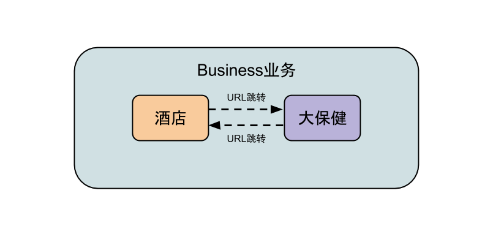  

####业务数据交互

无论前端、后端，业务之间数据交互，都是很重要的环节，选用何种合适的方案，就考验架构师的水平了。

未做业务拆分时，直接调用其他业务的代码即可：

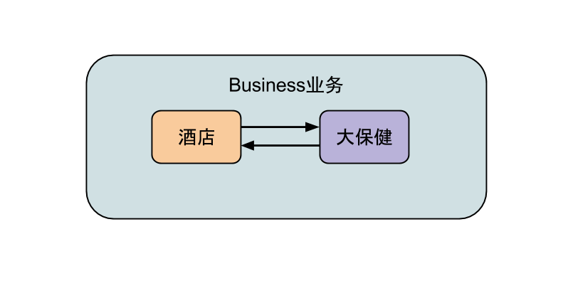  

数据直接交互，强耦合

但业务拆分后，就不能直接调用代码了。两个业务相互独立，代码互不依赖，必须用某种协议（常用json）用数据。

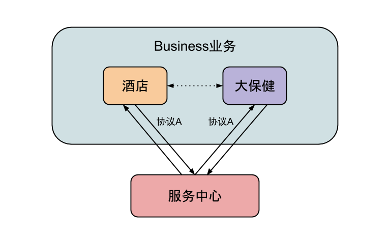  

间接交互，服务中心做数据中转

如果其他业务需要获取大保健数据，首先大保健业务要**注册大保健服务到服务中心**，其他业务才可以通过协议调用这个服务。

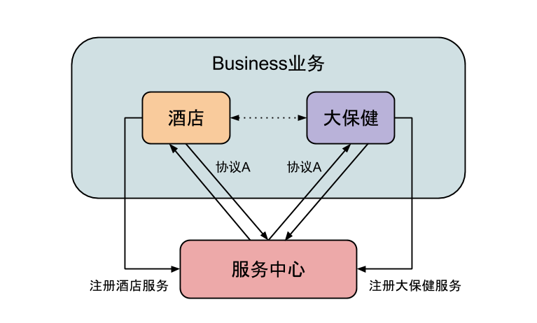  

业务相互调用-服务中心

如何注册服务，Android和iOS都有不同的做法，而且方法不止一种。本文仅提供思路，技术细节，会在之后的文章阐述。

其实**组件与组件之间**，也存在相互调用的情况，可参考这种做法。

P.S.大众点评没有“大保健”业务，只有“足疗按摩”业务。笔者为渲染气氛虚拟一个大保健出来，希望大众的朋友谅解。

###小结

组件化、拆分业务后：

>   * 单一职责：开发人员专注于自己的业务
>   * 依赖倒置：上层业务依赖下层业务，业务依赖组件，业务之间、组件之间不相互依赖
>   * 接口隔离：业务之间调用数据，通过统一的协议与服务中心交互，不调用业务实际代码

代码质量与规范程度明显提高，高内聚、低耦合。业务职责分明，**单元测试**也更好写。如果业务拆分做得好，可以一个业务一个单独工程编译，不仅大幅提高编译速度，
而且业务代码还可以回滚、版本发布等。

一切为了更清晰的架构、更干净的代码^_^。

> 实战经验：[《悦跑圈Android单业务开发，提高编译效率15倍》](http://www.jianshu.com/p/452367cbb7be)
