 
<!--BEGIN_DATA
{
    "create_date": "2017-02-24 22:53", 
    "modify_date": "2017-02-24 22:53", 
    "is_top": "0", 
    "summary": "Baymax：网易iOS App运行时Crash自动防护实践", 
    "tags": "iOS", 
    "file_name": "Baymax：网易iOS App运行时Crash自动防护实践.md"
}
END_DATA-->

####
原文出处：<a href='http://mp.weixin.qq.com/s/GFt7uqrKw7m3R3KrV43zIQ' target='blank'>Baymax：网易iOS App运行时Crash自动防护实践</a>

#####版权声明

本文转自 **网易杭州前端技术部** 公众号，由作者授权发布。

###前言  

大白（Baymax），迪士尼动画《超能陆战队》中的健康机器人，是一个体型胖胖的充气机器人，因呆萌的外表和善良的本质获得大家的喜爱，被称为“萌神”。

Baymax项目是为了减少开发人员在开发中一些不规范的代码编写造成的内存泄露，界面卡顿，耗电等问题而来的一个监控系统。

现在Baymax迎来了它新的功能：APP运行时Crash自动防护功能，为app的流程顺利运行保驾护航！

下面将详细介绍一下APP运行时Crash自动修复系统开发的目的，设计的原理以及使用的方法。

###Chapter 1 - 开发目的

是否存在这样的夜晚，当刚刚躺下准备美美的睡一觉的时候， 突然来一记夺命电话Call，一接起来发现是你老板！！！“小王啊，刚刚上线的X.X.X版本出问题了啊，
怎么样操作会crash啊，导致新功能都无法使用了，快定位一下是什么原因，抓紧hotpatch修复一下啊！”。心里一万头草泥马呼啸而过，瞬间已经满头大汗的你却还要故作镇静地回答：“嗯，老板我马上去看看，一定努力解决问题！” 急忙打开电脑的你，知道今夜注定无眠了。

是否又存在这样的情形，你老板把大家都聚起来开了一个年初KPI目标制定会议，说到：“作为一个资深的技术团队，app性能是我们技术团队首抓的目标，其中很最要的一
项就是app的崩溃率，去年我们app统计出来的崩溃率是千分之五，而我们的竞争对手的崩溃率只有万分之五，相差了10倍！今年我们要赶超他们，最起码也要和他们持平。” 你甚是赞同，但是你心里却又有点怀疑，对方的开发资源是我们的好几倍而且个个都是资深老司机，我们团队里却大多都是应届生小鲜肉，这KPI能完成么？

大白健康系统--APP运行时Crash自动修复系统正是为了应对这些状况，解决问题而诞生的。

APP运行时Crash自动修复+捕获系统的设计初衷，就是为了降低app的crash率。利用Objective-C语言的动态特性，采用AOP(Aspect Oriented Programming) 面向切面编程的设计思想，做到无痕植入。能够自动在app运行时实时捕获导致app崩溃的破环因子，然后通过特定的技术手段去化解这些破坏因子，使app免于崩溃，照样可以继续正常运行，为app的持续运转保驾护航。

###Chapter 2 - 功能简介

APP运行时Crash自动修复系统 的主要功能，可以用一句话来简单的概括：对业务代码的零侵入性地将原本会导致app崩溃的crash抓取住，消灭掉，保证app
继续正常地运行，再将crash的具体信息提取出来，实时返回给用户。

通过下面的一个小例子就可以很直观的体现出来系统的作用：

调用以下的一段代码

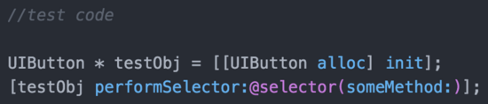

结果肯定会导致app的崩溃，因为testObj是一个UIButton对象，而UIButton并没有实现 someMethod：
这个方法，所以向testObj发送someMethod：这个方法的时候，将会导致该方法无法在相关的方法列表里找到，最终导致app的crash。

但是通过我们的crash防护系统，调用这段代码时app并不会崩溃，同时XCode的Console如下：

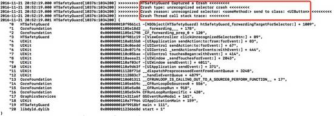

可见对应的crash的信息（crash类型，原因，调用栈信息）均可以完整的打印在XCode的Console中。

说明我们的大白系统已经捕捉到了这个crash，将该crash消灭掉并且吐出来该crash的完整信息。

当然目前系统的功能并没有强大到可以把所有的crash都处理掉，不过一些常见的高频次发生的crash，系统均会针对他们一一处理。目前可以处理掉的crash类型
具体有以下几种：

  * unrecognized selector crash

  * KVO crash

  * NSNotification crash

  * NSTimer crash

  * Container crash（数组越界，插nil等）

  * NSString crash （字符串操作的crash）

  * Bad Access crash （野指针）

  * UI not on Main Thread Crash (非主线程刷UI(机制待改善))

对于每种类型的crash，安全系统都采取不同的方式，进行了对应的处理。

###Chapter 3 - 实现原理

前面已经提过，目前的安全防护系统可以覆盖到8中类型的Crash，接下来将一一详细介绍这8种类型的Crash的防护的实现的具体原理：

####3.1 Unrecognized Selector类型crash防护

#####3.1.1 crash产生原因

unrecognized
selector类型的crash在app众多的crash类型中占着比较大的成分，通常是因为一个对象调用了一个不属于它方法的方法导致的。

例如调用以下一段代码就会产生crash

具体crash时的表现见下图：

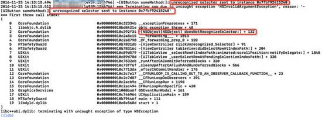

要解决这中类型的crash，我们需要先了解清楚它产生的具体原因和流程。

#####3.1.2 方法调用流程

让我们看一下方法调用在运行时的过程。

runtime中具体的方法调用流程大致如下：

  1. 首先，在相应操作的对象中的缓存方法列表中找调用的方法，如果找到，转向相应实现并执行。

  2. 如果没找到，在相应操作的对象中的方法列表中找调用的方法，如果找到，转向相应实现执行

  3. 如果没找到，去父类指针所指向的对象中执行1，2.

  4. 以此类推，如果一直到根类还没找到，转向拦截调用，走消息转发机制。

  5. 如果没有重写拦截调用的方法，程序报错。

#####3.1.3 拦截调用

在方法调用中说到了，如果没有找到方法就会转向拦截调用。

那么什么是拦截调用呢？

拦截调用就是，在找不到调用的方法程序崩溃之前，你有机会通过重写NSObject的四个方法来处理:

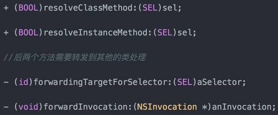

拦截调用的整个流程即Objective-C的消息转发机制。其具体流程如下图：

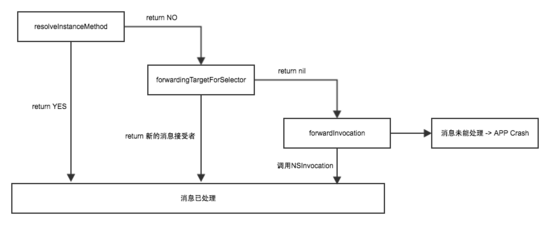

由上图可见，在一个函数找不到时，runtime提供了三种方式去补救：

  1. 调用resolveInstanceMethod给个机会让类添加这个实现这个函数

  2. 调用forwardingTargetForSelector让别的对象去执行这个函数

  3. 调用forwardInvocation（函数执行器）灵活的将目标函数以其他形式执行。

如果都不中，调用 `doesNotRecognizeSelector` 抛出异常。

#####3.1.4 unrecognized selector crash 防护方案

既然可以补救，我们完全也可以利用消息转发机制来做文章。那么问题来了，在这三个步骤里面，选择哪一步去改造比较合适呢。

这里我们选择了第二步forwardingTargetForSelector来做文章。原因如下：

  1. resolveInstanceMethod需要在类的本身上动态添加它本身不存在的方法，这些方法对于该类本身来说冗余的

  2. forwardInvocation可以通过NSInvocation的形式将消息转发给多个对象，但是其开销较大，需要创建新的NSInvocation对象，并且forwardInvocation的函数经常被使用者调用，来做多层消息转发选择机制，不适合多次重写

  3. forwardingTargetForSelector可以将消息转发给一个对象，开销较小，并且被重写的概率较低，适合重写

选择了forwardingTargetForSelector之后，可以将NSObject的该方法重写，做以下几步的处理：

  1. 动态创建一个桩类

  2. 动态为桩类添加对应的Selector，用一个通用的返回0的函数来实现该SEL的IMP

  3. 将消息直接转发到这个桩类对象上。

流程图如下：

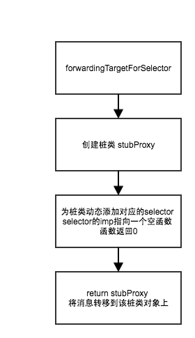

注意如果对象的类本事如果重写了forwardInvocation方法的话，就不应该对forwardingTargetForSelector进行重写了，否则会影响到该类型的对象原本的消息转发流程。

通过重写NSObject的forwardingTargetForSelector方法，我们就可以将无法识别的方法进行拦截并且将消息转发到安全的桩类对象中，从而可以使app继续正常运行。

####3.2 KVO类型crash防护

#####3.2.1 KVO crash 产生原因

KVO,即：Key-Value Observing，它提供一种机制，当指定的对象的属性被修改后，则对象就会接受收到通知。简单的说就是每次指定的被观察的对象的
属性被修改后，KVO就会自动通知相应的观察者了。

KVO机制在iOS的很多开发场景中都会被使用到。不过如果一不小心使用不当的话，会导致大量的crash问题。所以如果能找到一种方法能够自动抓取这些由于开发者粗
心所导致的KVO Crash问题的话，是有一定的价值的。

首先我们来看看通过会导致KVO Crash的两种情形：

KVO的被观察者dealloc时仍然注册着KVO导致的crash，见下图

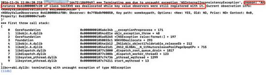

添加KVO重复添加观察者或重复移除观察者（KVO注册观察者与移除观察者不匹配）导致的crash，见下图

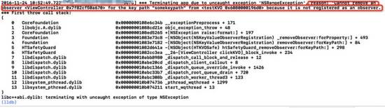

#####3.2.2 KVO crash 防护方案

通常一个对象的KVO关系图如下：

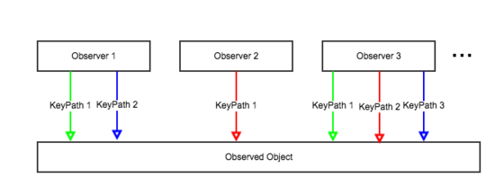

一个被观察的对象(Observed Object)上有若干个观察者(Observer),每个观察者又观察若干条KeyPath。

如果观察者和keypath的数量一多，很容易理不清楚被观察对象整个KVO关系，导致被观察者在dealloc的时候，还残存着一些关系没有被注销。同时还会导致KVO注册观察者与移除观察者不匹配的情况发生。

笔者曾经还遇到过在多线程的情况下，导致KVO重复添加观察者或移除观察者的情况。这类问题通常多数发生的比较隐蔽，不容易从代码的层面去排查。

由上可见多数由于KVO而导致的crash原因是由于被观察对象的KVO关系图混乱导致。那么如何来管理混乱的KVO关系呢。可以让被观察对象持有一个KVO的delegate，所有和KVO相关的操作均通过delegate来进行管理，delegate通过建立一张map来维护KVO整个关系。如下图：

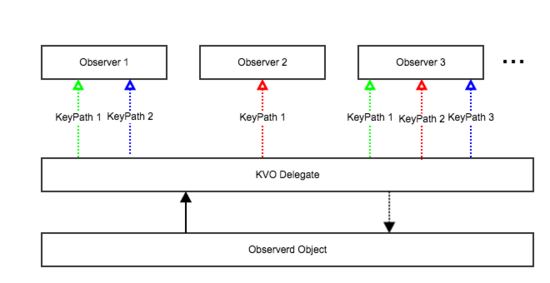

这样做的好处有两个：

  1. 如果出现KVO重复添加观察者或重复移除观察者（KVO注册观察者与移除观察者不匹配）的情况，delegate可以直接阻止这些非正常的操作。

  2. 被观察对象dealloc之前，可以通过delegate自动将与自己有关的KVO关系都注销掉，避免了KVO的被观察者dealloc时仍然注册着KVO导致的crash。

被swizzle的方法分别是：

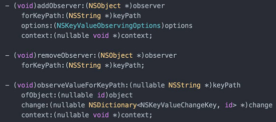

关于

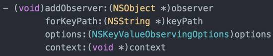

方法改造流程如下图：

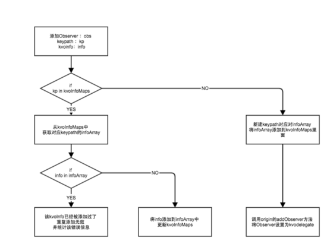

通过上面的流程，将observerd对象的所有kvo相关的observer信息全部转移到KVOdelegate上，并且避免了相同kvoinfo被重复添加多次的可能性。

关于

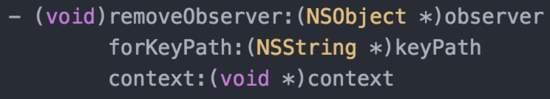

方法改造流程如下图：

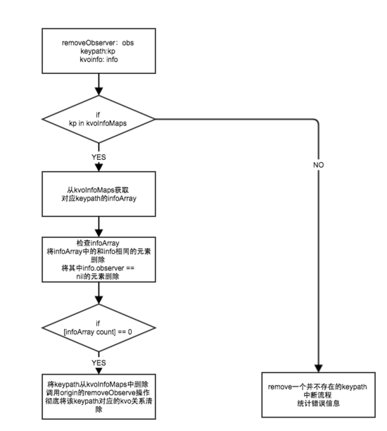

移除一个keypath的Observer时，当delegate的kvoInfoMap中找不到key为该keypath的时候，说明此时delegate并没有持有对应keypath的observer，即说明移除了一个不匹配的观察者，此时如果再继续操作会导致app崩溃，所以应该及时中断流程，然后统计异常信息。

当keypath对应的KVOInfo列表（infoArray）为空的时候，说明此时delegate已经不再持有任何和keypath相关的observer了。
这时应该调用原有removeObserver的方法将delegate对应的观察者移除。

注意到在检查遍历infoArray的时侯，除了要删除对应的info信息，还多了一步检查info.observer == nil的过程，是因为如果observer为nil，那么此时如果keypath对应的值变化的话，也会因为找不到observer而崩溃，所以需要做这一步来阻止该种情况的发生。

关于

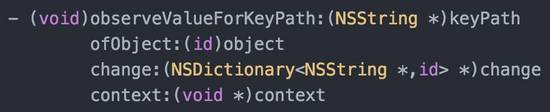

方法改造流程如下图：

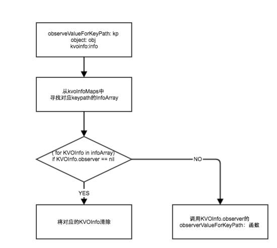

delegate对于observeValueForKeyPath方法的修改最主要的地方是，在于将对应的响应方法转移给真正的KVO Observer，通过keyInfoMap找到keypath对应的KVOInfo里面预先存储好的observer，然后调用observer原本的响应方法。

同时在遍历InfoArray的时候，发现info.observerw == nil的时候，需要及时将其清除掉，避免KVO的观察者observer被释放后value变化导致的crash.

最后，针对 KVO的被观察者dealloc时仍然注册着KVO导致的crash 的情况，可以将NSObject的dealloc swizzle，在object dealloc的时候自动将其对应的kvodelegate所有和kvo相关的数据清空，然后将kvodelegate也置空。避免出现KVO的被观察者dealloc时仍然注册着KVO而产生的crash.

####3.3 NSNotification类型crash防护

#####3.3.1 crash 产生原因

当一个对象添加了notification之后，如果dealloc的时候，仍然持有notification，就会出现NSNotification类型的crash。

NSNotification类型的crash多产生于程序员写代码时候犯疏忽，在NSNotificationCenter添加一个对象为observer之后，忘记了在对象dealloc的时候移除它。

所幸的是，苹果在iOS9之后专门针对于这种情况做了处理，所以在iOS9之后，即使开发者没有移除observer，Notification crash也不会再产生了。

不过针对于iOS9之前的用户，我们还是有必要做一下NSNotification Crash的防护的。

#####3.3.2 NSNotification crash 防护方案

NSNotification Crash的防护原理很简单， 利用method swizzling hook
NSObject的dealloc函数，再对象真正dealloc之前先调用一下 [[NSNotificationCenter defaultCenter] removeObserver:self] 即可。

注意到并不是所有的对象都需要做以上的操作，如果一个对象从来没有被NSNotificationCenter添加为observer的话，在其dealloc之前调用removeObserver完全是多此一举。所以我们hook了NSNotificationCenter的

addObserver:(id)observer selector:(SEL)aSelector name:(NSString *)aName object:(id)anObject

函数，在其添加observer的时候，对observer动态添加标记flag。这样在observer dealloc的时候，就可以通过flag标记来判断其是否有必要调用removeObserver函数了。

####3.4 NSTimer类型crash防护

#####3.4.1 NSTimer crash 产生原因

在程序开发过程中，大家会经常使用定时任务，但使用NSTimer的
`scheduledTimerWithTimeInterval:target:selector:userInfo:repeats:` 接口做重复性的定时任务时存在一个问题：NSTimer会强引用target实例，所以需要在合适的时机invalidate定时器，否则就会由于定时器timer强引用target的关系
导致target不能被释放，造成内存泄露，甚至在定时任务触发时导致crash。 crash的展现形式和具体的target执行的selector有关。

与此同时，如果NSTimer是无限重复的执行一个任务的话，也有可能导致target的selector一直被重复调用且处于无效状态，对app的CPU，内存等性能方面均是没有必要的浪费。

所以，很有必要设计出一种方案，可以有效的防护NSTimer的滥用问题。

#####3.4.2 NSTimer crash 防护方案

上面的分析可见，NSTimer所产生的问题的主要原因是因为其没有再一个合适的时机invalidate，同时还有NSTimer对target的强引用导致的内存泄漏问题。

那么解决NSTimer的问题的关键点在于以下两点：

  1. NSTimer对其target是否可以不强引用

  2. 是否找到一个合适的时机，在确定NSTimer已经失效的情况下，让NSTimer自动invalidate

关于第一个问题，target的强引用问题。 可以用如下图的方案来解决：

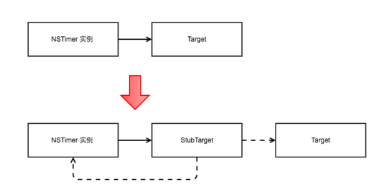

在NSTimer和target之间加入一层stubTarget，stubTarget主要做为一个桥接层，负责NSTimer和target之间的通信。

同时NSTimer强引用stubTarget，而stubTarget弱引用target，这样target和NSTimer之间的关系也就是弱引用了，意味着target可以自由的释放，从而解决了循环引用的问题。

上文提到了stubTarget负责NSTimer和target的通信，其具体的实现过程又细分为两大步：

Step 1. swizzle NSTimer中
`scheduledTimerWithTimeInterval:target:selector:userInfo:repeats:` 相关的方法，在新方法中动态创建stubTarget对象，stubTarget对象弱引用持有原有的target，selector，timer，targetClass等properties。然后将原target分发stubTarget上，selector回调函数为stubTarget的fireProxyTimer，流程如下图：

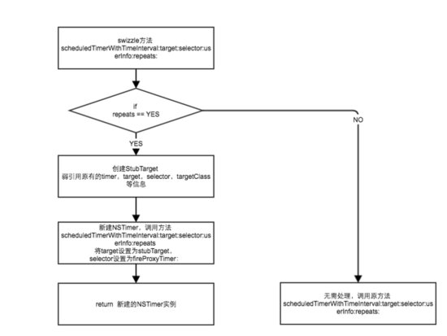

Step 2. 通过stubTarget的fireProxyTimer：来具体处理回调函数selector的处理和分发，流程如下图：

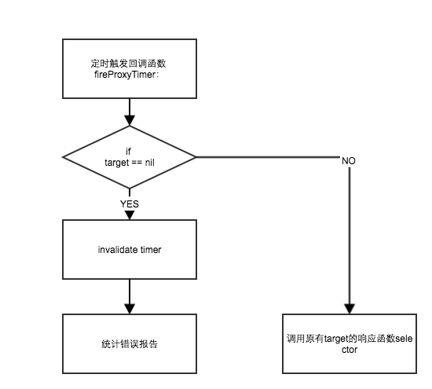

因为stubTarget的介入，原有的target已经可以不受NSTimer强引用的牵制，而自由的释放。

由上图流程可知，当NSTimer的回调函数 `fireProxyTimer:` 被执行的时候，会自动判断原target是否已经被释放，如果释放了，意味着NSTimer已经无效，此时如果还继续调用原有target的selector很有可能会导致crash，而且是没有必要的。所以此时需要将NSTimerinvalidate，然后统计上报错误数据。如此一来就做到了NSTimer在合适的时机自动invalidate。

####3.5 Container类型crash防护

#####3.5.1 Container crash 产生原因

Container 类型的crash 指的是容器类的crash，常见的有NSArray／NSMutableArray／NSDictionary／NSMutableDictionary／NSCache的crash。 一些常见的越界、插入nil等错误操作均会导致此类crash发生。
由于产生的原因比较简单，就不展开来描述了。

该类crash虽然比较容易排查，但是其在app crash概率总比还是挺高，所以有必要对其进行防护。

#####3.5.2 Container crash 防护方案

Container crash 类型的防护方案也比较简单，针对于NSArray／NSMutableArray／NSDictionary／NSMutableDictionary／NSCache的一些常用的会导致崩溃的API进行methodswizzling，然后在swizzle的新方法中加入一些条件限制和判断，从而让这些API变的安全，这里就不展开来具体描述了。

####3.6 NSString类型crash防护

NSString／NSMutableString 类型的crash的产生原因和防护方案与Container crash很相像，这里也不展开来描述了。

####3.7 野指针类型crash防护

#####3.7.1 野指针crash 产生原因

在App的所有Crash中，访问野指针导致的Crash占了很大一部分，野指针类型crash的表现为：Exception Type:SIGSEGV，Exception Codes: SEGV_ACCERR 或者 如下图：

解决野指针导致的crash往往是一件棘手的事情，一来产生crash 的场景不好复现，二来crash之后console的信息提供的帮助有限。 XCode本身为了便于开放调试时发现野指针问题，提供了Zombie机制，能够在发生野指针时提示出现野指针的类，从而解决了开发阶段出现野指针的问题。然而针对于线上产生的野指针问题，依旧没有一个比较好的办法来定位问题。

所以，因为野指针出现概率高而且难定位问题，非常有必要针对于野指针专门做一层防护措施。

#####3.7.2 野指针crash 防护方案

野指针问题的解决思路方向其实很容易确定，XCode提供了Zombie的机制来排查野指针的问题，那么我们这边可以实现一个类似于Zombie的机制，加上对zombie实例的全部方法拦截机制 和 消息转发机制，那么就可以做到在野指针访问时不Crash而只是crash时相关的信息。

同时还需要注意一点：因为zombie的机制需要在对象释放时保留其指针和相关内存占用，随着app的进行，越来越多的对象被创建和释放，这会导致内存占用越来越大，
这样显然对于一个正常运行的app的性能有影响。所以需要一个合适的zombie对象释放机制，确定zombie机制对内存的影响是有限度的。

improve版的zombie机制的实现主要分为以下四个环节：

step 1. method swizzling替换NSObject的allocWithZone方法，在新的方法中判断该类型对象是否需要加入野指针防护，如果需要，则通过objc_setAssociatedObject为该对象设置flag标记，被标记的对象后续会进入zombie流程

流程图如下：

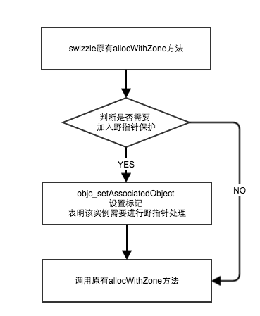

做flag标记是因为很多系统类，比如NSString，UIView等创建，释放非常频繁，而这些实例发生野指针概率非常低。基本都是我们自己写的类才会有野指针的相关问题，所以通过在创建时 设置一个标记用来过滤不必要做野指针防护的实例，提高方案的效率。

同时做判断是否要加入标记的条件里面，我们加入了黑名单机制，是因为一些特定的类是不适用于添加到zombie机制的，会发生崩溃（例如：NSBundle），而且所以和zombie机制相关的类也不能加入标记，否则会在释放过程中循环引用和调用，导致内存泄漏甚至栈溢出。

step 2. method swizzling替换NSObject的dealloc方法，对flag标记的对象实例调用objc_destructInstance，释放该实例引用的相关属性，然后将实例的isa修改为HTZombieObject。通过objc_setAssociatedObject
保存将原始类名保存在该实例中。

流程图如下：

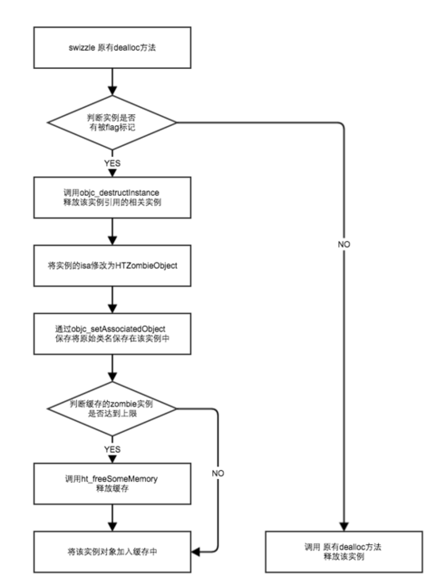

调用objc_destructInstance的原因：

这里参考了系统在Object-C Runtime 中NSZombies实现，dealloc最后会调到objectdispose函数，在这个函数里面其实也做了三件事情，

  1. 调用objc_destructInstance释放该实例引用的相关实例

  2. 将该实例的isa修改为stubClass，接受任意方法调用

  3. 释放该内存

官方文档对objc_destructInstance的解释为：

Destroys an instance of a class without freeing memory and removes any associated references this instance might have had.

说明objc_destructInstance会释放与实例相关联的引用，但是并不释放该实例等内存。

Step 3. 在HTZombieObject 通过消息转发机制forwardingTargetForSelector处理所有拦截的方法，根据selector动态添加能够处理方法的响应者HTStubObject 实例，然后通过objc_getAssociatedObject
获取之前保存该实例对应的原始类名，统计错误数据。

流程图如下：

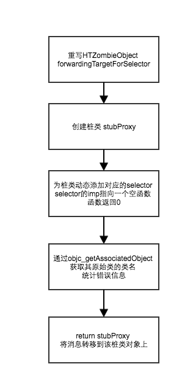

HTZombieObject的处理和unrecognized selector crash的处理是一样，主要的目的就是拦截所有传给HTZombieObject的函数，用一个返回为空的函数来替换，从而达到程序不崩溃的目的。

Step 4. 当退到后台或者达到未释放实例的上限时，则在ht_freeSomeMemory方法中调用原有dealloc方法释放所有被zombie化的实例

综上所述，可以用下图总结一下bad access类型crash的防护流程：

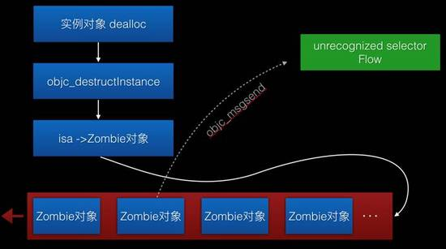

#####3.7.3 相关的风险

  1. 做了野指针防护，通过动态插入一个空实现的方法来防止出现Crash，但是业务层面的表现难以确定，可能会进入业务异常的状态。需要拟定一下如何展现该问题给用户的方案。

  2. 由于做了延时释放若干实例，对系统总内存会产生一定影响，目前将内存的缓冲区开到2M左右，所以应该没有很大的影响，但还是可能潜在一些风险。

  3. 延时释放实例是根据相关功能代码会聚焦在某一个时间段调用的假设前提下，所以野指针的zombie保护机制只能在其实例对象仍然缓存在zombie的缓存机制时才有效，若在实例真正释放之后，再调用野指针还是会出现Crash。

####3.8 非主线程刷UI类型crash防护（UI not on Main Thread）

在非主线程刷UI将会导致app运行crash，有必要对其进行处理。

目前初步的处理方案是swizzle UIView类的以下三个方法：

    
    
    - (void)setNeedsLayout;
    - (void)setNeedsDisplay;
    - (void)setNeedsDisplayInRect:(CGRect)rect;

在这三个方法调用的时候判断一下当前的线程，如果不是主线程的话，直接利用 `dispatch_async(dispatch_get_main_queue(),
^{ //调用原本方法 });`

来将对应的刷UI的操作转移到主线程上，同时统计错误信息。

但是真正实施了之后，发现这三个方法并不能完全覆盖UIView相关的所有刷UI到操作，但是如果要将全部到UIView的刷UI的方法统计起来并且swizzle，感觉略笨拙而且不高效。

所以作者依旧在寻找，看是否有更好的方案来解决该问题。

###Chapter 4 - 使用手册

目前sdk实现了以下的功能和配置：

#####1\. 配置需要防护的crash类型

可以根据自身需要，选择一定的crash防护配置，通过以下的接口进行配置：

    
    
    - (void)configSafetyGuardService:(HTSafetyGuardType)SafetyGuardType;

其中可以配置的SafetyGuardType有：

  * HTSafetyGuardType_None

  * HTSafetyGuardType_All

  * HTSafetyGuardType_UnrecognizedSelector

  * HTSafetyGuardType_KVO

  * HTSafetyGuardType_BadAccess

  * HTSafetyGuardType_Notification

  * HTSafetyGuardType_Timer

  * HTSafetyGuardType_Container

  * HTSafetyGuardType_String

  * HTSafetyGuardType_UI

可以根据自己项目的需求自行选择需要防护的类型。

#####2\. 实时 开启／暂停 安全防护功能

配置完毕之后，需要调用- (void)start;来开启防护，防护的开关是实时的（无需重启app），可以在任意的时刻选择 开启／关闭 防护功能。

通过 `\- (BOOL)isWorking` 接口可以获取当前防护功能的状态。

通过 `\- (void)start` 接口实时开启防护功能

通过 `\- (void)stop` 接口实时关闭防护功能

#####3\. 配置白名单和黑名单，指定对应的想 加上／去掉 安全防护功能的类和对象

由于不同类实现的特殊性，考虑到可能某些类并不需要开启防护功能。 所以提供了黑名单的功能。 在黑名单里面的类本身以及其子类，都不会进入防护的范围。

白名单的出现是因为作者在开发的时候发现一些系统自带的类是没有必要进入防护范围的，所以将整体防护的范围调整到所有用户自定义的类里面。 但是之后又发现绝大多数的
crash和一些常用的系统的类（例如NSString，NSDictionary，UIView等等）有很强的联系，针对于这些常用的系统类还是很有必要开启防护的
。所以针对这些需要防护的系统类，专门提供了白名单的功能。

注意：野指针类型的防护，由于其特殊性，不适用于这套白名单和黑名单。 其自身会维护一套新的黑白名单，详见：3.7 野指针类型Crash防护

#####4\. 设置异常处理handler，指定出现crash被抓取情况之后，用户想自定义的操作

出现了crash，并且被我们的系统捕捉到加以处理之后，用户可能还需要进一步的处理，例如上传埋点等。这时可以通过设置一个handler来实现，
HTExceptionHandler会将crash的信息通过HTCrashInfo的形式来返回。

HTCrashInfo内包含了:

  * 导致crash的类型：crashType

  * crash线程的调用栈：callStackSymbols

  * crash的具体描述信息：crashDescription

  * 扩展信息：userinfo

以上接口具体详细的信息均可以在（HTSafetyGuardService.h）中找到。(注意HTSafetyGuardService是单例)

由于目前sdk还未经过完整的功能测试和性能测试，故暂不开放对应的sdk。等作者觉得项目质量达到了一定的标准之后，会将项目sdk开放出来。如果对该项目感兴趣，
可以联系 taozeyu890217@126.com ，欢迎一起研究。

