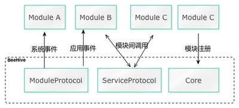
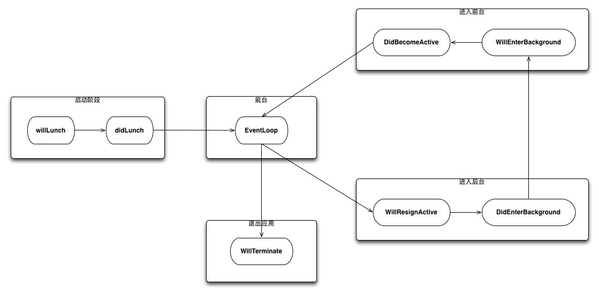
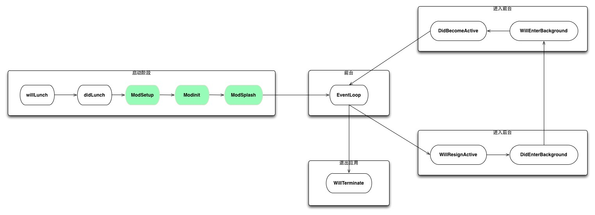
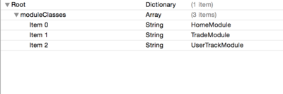

 
<!--BEGIN_DATA
{
    "create_date": "2016-08-26 19:23", 
    "modify_date": "2016-08-26 19:23", 
    "is_top": "0", 
    "summary": "BeeHive_wiki", 
    "tags": "iOS", 
    "file_name": "BeeHive_wiki.md"
}
END_DATA-->

####<p>原文出处：<a href='https://github.com/alibaba/BeeHive/wiki' target='blank'>BeeHive_wiki</a></p>

[BeeHive Github](https://github.com/alibaba/BeeHive)

<!-- START doctoc generated TOC please keep comment here to allow auto update -->
<!-- DON'T EDIT THIS SECTION, INSTEAD RE-RUN doctoc TO UPDATE -->


- [概述](#%E6%A6%82%E8%BF%B0)
- [生命周期的变化](#%E7%94%9F%E5%91%BD%E5%91%A8%E6%9C%9F%E7%9A%84%E5%8F%98%E5%8C%96)
    - [事件](#%E4%BA%8B%E4%BB%B6)
        - [系统事件](#%E7%B3%BB%E7%BB%9F%E4%BA%8B%E4%BB%B6)
        - [通用事件](#%E9%80%9A%E7%94%A8%E4%BA%8B%E4%BB%B6)
        - [业务自定义事件](#%E4%B8%9A%E5%8A%A1%E8%87%AA%E5%AE%9A%E4%B9%89%E4%BA%8B%E4%BB%B6)
    - [注册](#%E6%B3%A8%E5%86%8C)
        - [静态注册](#%E9%9D%99%E6%80%81%E6%B3%A8%E5%86%8C)
        - [动态注册](#%E5%8A%A8%E6%80%81%E6%B3%A8%E5%86%8C)
        - [异步加载](#%E5%BC%82%E6%AD%A5%E5%8A%A0%E8%BD%BD)
- [编程开发](#%E7%BC%96%E7%A8%8B%E5%BC%80%E5%8F%91)
    - [设置环境变量](#%E8%AE%BE%E7%BD%AE%E7%8E%AF%E5%A2%83%E5%8F%98%E9%87%8F)
    - [模块初始化](#%E6%A8%A1%E5%9D%97%E5%88%9D%E5%A7%8B%E5%8C%96)
    - [处理系统事件](#%E5%A4%84%E7%90%86%E7%B3%BB%E7%BB%9F%E4%BA%8B%E4%BB%B6)
    - [模间调用](#%E6%A8%A1%E9%97%B4%E8%B0%83%E7%94%A8)
        - [注册并提供`Servcie`](#%E6%B3%A8%E5%86%8C%E5%B9%B6%E6%8F%90%E4%BE%9Bservcie%08)
            - [定义`HomeServiceProtocol`暴露模块对外访问的接口](#%E5%AE%9A%E4%B9%89homeserviceprotocol%E6%9A%B4%E9%9C%B2%E6%A8%A1%E5%9D%97%E5%AF%B9%E5%A4%96%E8%AE%BF%E9%97%AE%E7%9A%84%E6%8E%A5%E5%8F%A3)
            - [注册`Service`有三种方式](#%E6%B3%A8%E5%86%8Cservice%E6%9C%89%E4%B8%89%E7%A7%8D%E6%96%B9%E5%BC%8F)
                - [声明式注册](#%E5%A3%B0%E6%98%8E%E5%BC%8F%E6%B3%A8%E5%86%8C)
                - [`API`注册](#api%E6%B3%A8%E5%86%8C)
                - [`BHService.plist`注册](#bhserviceplist%E6%B3%A8%E5%86%8C)
        - [调用`Service`](#%E8%B0%83%E7%94%A8service)
        - [单例与多例](#%E5%8D%95%E4%BE%8B%E4%B8%8E%E5%A4%9A%E4%BE%8B)
    - [上下文环境Context](#%E4%B8%8A%E4%B8%8B%E6%96%87%E7%8E%AF%E5%A2%83context)
- [集成方式](#%E9%9B%86%E6%88%90%E6%96%B9%E5%BC%8F)
    - [`cocoapods`](#cocoapods)
- [作者](#%E4%BD%9C%E8%80%85)
- [证书](#%E8%AF%81%E4%B9%A6)

<!-- END doctoc generated TOC please keep comment here to allow auto update -->

# 概述

`BeeHive`是用于`iOS`的`App`模块化编程的框架实现方案，吸收了`Spring`框架`Service`的理念来实现模块间的`API`耦合。

基本原理如下:



实现以下特性：

* 插件化的模块开发运行框架
* 模块具体实现与接口调用分离
* 模块生命周期管理，扩展了应用的系统事件

因为基于`Spring`的`Service`理念，虽然可以使模块间的具体实现与接口解耦，但无法避免对接口类的依赖关系。

为什么不使用`invoke`以及动态链接库技术实现对接口实现的解耦，类似`Apache`的`DSO`的方式。

主要是考虑学习成本难度以及动态调用实现无法在编译检查阶段检测接口参数变更等问题，动态技术需要更高的编程门槛要求。

`BeeHive`灵感来源于蜂窝。蜂窝是世界上高度模块化的工程结构，六边形的设计能带来无限扩张的可能。所以我们用了`BeeHive`来做为这个项目的命名。

# 生命周期的变化

## 事件

`BeeHive`会给每个模块提供生命周期事件，用于与`BeeHive`宿主环境进行必要信息交互。

事件分为三种类型：

* 系统事件
* 通用事件
* 业务自定义事件

### 系统事件

系统事件通常是`Application`生命周期事件，例如`DidBecomeActive`、`WillEnterBackground`等。

系统事件基本工作流如下：



### 通用事件

在系统事件的基础之上，扩展了应用的通用事件，例如`modSetup`、`modInit`等，可以用于编码实现各插件模块的设置与初始化。

扩展的通用事件如下：



### 业务自定义事件

如果觉得系统事件、通用事件不足以满足需要，我们还将事件封装简化成`BHAppdelgate`，你可以通过继承 `BHAppdelegate`来扩展自己的事件。

## 注册

模块注册的方式有静态注册与动态注册两种。

### 静态注册

通过在`BeeHive.plist`文件中注册符合`BHModuleProtocol`协议模块类:



### 动态注册

```objc
@implementation HomeModule

BH_EXPORT_MODULE()  // 声明该类为模块入口

@end
```

在模块入口类实现中 使用`BH_EXPORT_MODULE()`宏声明该类为模块入口实现类。

### 异步加载

如果设置模块导出为`BH_EXPORT_MODULE(YES)`，则会在启动之后第一屏内容展现之前异步执行模块的初始化，可以优化启动时时间消耗。

# 编程开发

`BHModuleProtocol`为各个模块提供了每个模块可以`Hook`的函数，用于实现插件逻辑以及代码实现。

## 设置环境变量

通过`context.env`可以判断我们的应用环境状态来决定我们如何配置我们的应用。

```objc
-(void)modSetup:(BHContext *)context
{
    switch (context.env) {
        case BHEnvironmentDev:
        //....初始化开发环境
        break;
        case BHEnvironmentProd:
        //....初始化生产环境
        default:
        break;
    }
}
```

## 模块初始化

如果模块有需要启动时初始化的逻辑，可以在`modInit`里编写，例如模块注册一个外部模块可以访问的`Service`接口

```objc
-(void)modInit:(BHContext *)context
{
    //注册模块的接口服务
    [[BeeHive shareInstance] registerService:@protocol(UserTrackServiceProtocol) service:[BHUserTrackViewController class]];
}

```

## 处理系统事件

系统的事件会被传递给每个模块，让每个模块自己决定编写业务处理逻辑，比如`3D-Touch`功能

```objc
-(void)modQuickAction:(BHContext *)context
{
    [self process:context.shortcutItem handler:context.scompletionHandler];
}
```

## 模间调用

通过处理`Event`编写各个业务模块可以实现插件化编程，各业务模块之间没有任何依赖，`core`与`module`之间通过`event`交互，实现了插件隔离。但有时候我们需要模块间的相互调用某些功能来协同完成功能。

通常会有三种形式的接口访问形式：

* 基于接口的实现`Service`访问方式（`Java spring`框架实现）
* 基于函数调用约定实现的`Export Method`(`PHP`的`extension`，`ReactNatve`的扩展机制)
* 基于跨应用实现的`URL Route`模式(`iPhone` `App`之间的互访)

我们目前实现了第一种方式，后续会逐步实现后两种方式。

### 注册并提供`Servcie`

`Service`访问的优点是可以编译时检查发现接口的变更，从而及时修正接口问题。缺点是需要依赖接口定义的头文件，通过模块增加得越多，维护接口定义的也有一定工作量。以为`HomeServiceProtocol`为例。

#### 定义`HomeServiceProtocol`暴露模块对外访问的接口

```
@protocol HomeServiceProtocol <NSObject, BHServiceProtocol>

- (void)registerViewController:(UIViewController *)vc title:(NSString *)title iconName:(NSString *)iconName;

@end
```

#### 注册`Service`有三种方式

##### 声明式注册

```objc
@implementation HomeService

BH_EXPORT_SERVICE()

@end
```
##### `API`注册

```objc
[[BeeHive shareInstance] registerService:@protocol(HomeServiceProtocol) service:[BHViewController class]];
```

##### `BHService.plist`注册

```xml
<?xml version="1.0" encoding="UTF-8"?>
<!DOCTYPE plist PUBLIC "-//Apple//DTD PLIST 1.0//EN" "http://www.apple.com/DTDs/PropertyList-1.0.dtd">
<plist version="1.0">
    <dict>
        <key>HomeServiceProtocol</key>
        <string>BHViewController</string>
    </dict>
</plist>

```

### 调用`Service`

```objc
#import "BHService.h"

id< HomeServiceProtocol > homeVc = [[BeeHive shareInstance] createService:@protocol(HomeServiceProtocol)];
```

###  单例与多例

对于有些场景下，我们访问每个声明`Service`的对象，希望对象能保留一些状态，那我们需要声明这个`Service`对象是一个单例对象。

我们只需要在`Service`对象中实现事件函数

声明

```objc
-(BOOL) singleton
{
    return YES;
}

```

通过`createService`获取的对象则为单例对象，如果实现上面函数返回的是`NO`，则`createService`返回的是多例。

```objc
id< HomeServiceProtocol > homeVc = [[BeeHive shareInstance] createService:@protocol(HomeServiceProtocol)];
```

## 上下文环境Context

* 初始化设置应用的项目信息，并在各模块间共享整个应用程序的信息

```objc
- (BOOL)application:(UIApplication *)application didFinishLaunchingWithOptions:(NSDictionary *)launchOptions
{
    [BHContext shareInstance].env ＝ BHEnvironmentDev; //定义应用的运行开发环境
    [BHContext shareInstance].application = application;
    [BHContext shareInstance].launchOptions = launchOptions;
    [BHContext shareInstance].moduleConfigName = @"BeeHive.bundle/CustomModulePlist";//可选，默认为BeeHive.bundle/BeeHive.plist
    [BHContext shareInstance].serviceConfigName =  @"BeeHive.bundle/CustomServicePlist";//可选，默认为BeeHive.bundle/BHService.plist
    [[BeeHive shareInstance] setContext:[BHContext shareInstance]];

    [super application:application didFinishLaunchingWithOptions:launchOptions];

    id<HomeServiceProtocol> homeVc = [[BeeHive shareInstance] createService:@protocol(HomeServiceProtocol)];

    if ([homeVc isKindOfClass:[UIViewController class]]) {
        UINavigationController *navCtrl = [[UINavigationController alloc] initWithRootViewController:(UIViewController*)homeVc];

        self.window = [[UIWindow alloc] initWithFrame:[UIScreen mainScreen].bounds];
        self.window.rootViewController = navCtrl;
        [self.window makeKeyAndVisible];
    }

    return YES;
}
```

更多细节可以参考Example用例。

# 集成方式

## `cocoapods`

```sh
pod "BeeHive", '1.0.0'
```

# 作者

- 一渡, shijie.qinsj@alibaba-inc.com
- 达兹, dazi.dp@alibaba-inc.com

# 证书

BeeHive is available under the GPL license. See the LICENSE file for more info.
