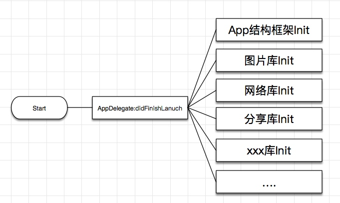
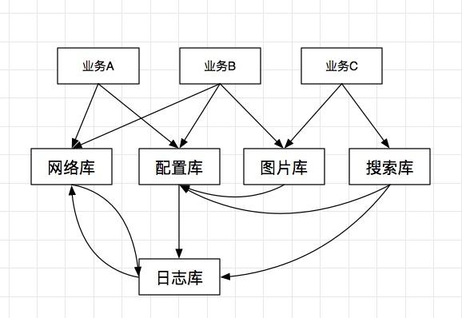
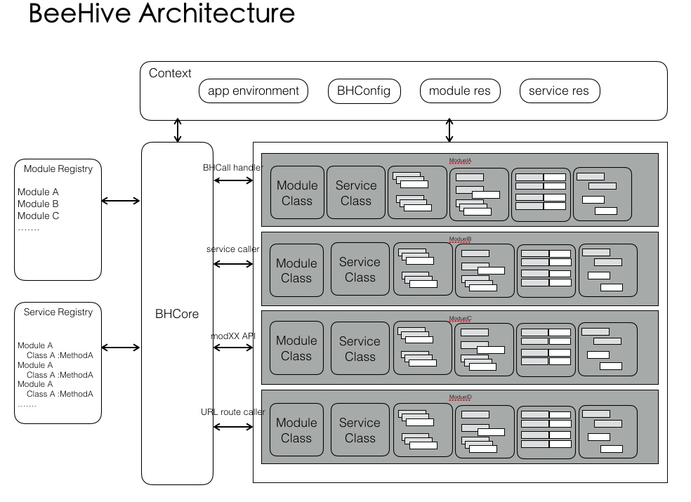
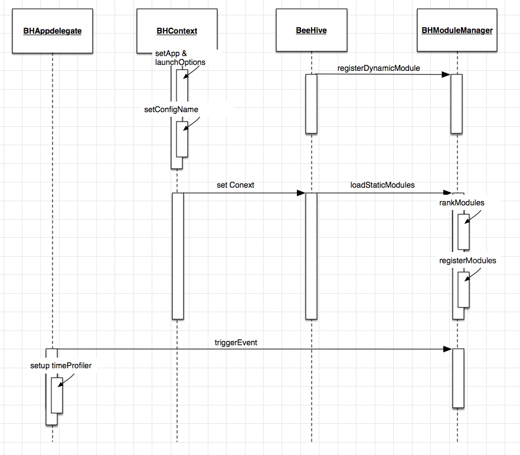
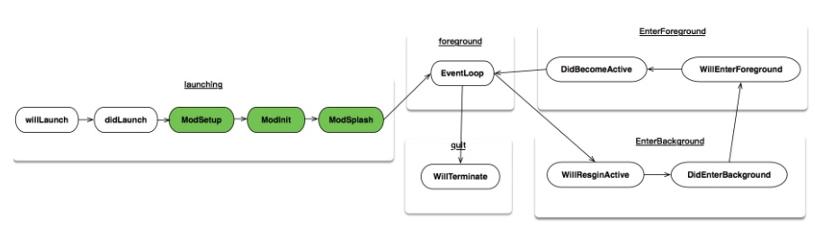
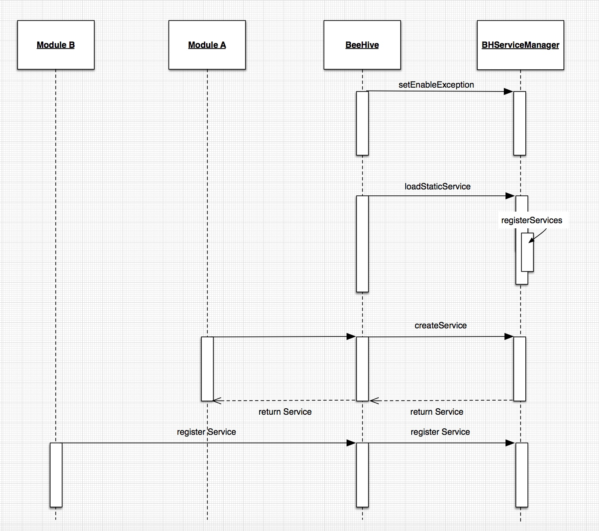

 
<!--BEGIN_DATA
{
    "create_date": "2017-02-23 13:49", 
    "modify_date": "2017-02-23 13:49", 
    "is_top": "0", 
    "summary": "BeeHive，一次iOS模块化解耦实践", 
    "tags": "iOS、架构", 
    "file_name": "BeeHive，一次iOS模块化解耦实践.md"
}
END_DATA-->

####
原文出处：<a href='http://www.infoq.com/cn/articles/beehive-a-ios-modular-decoupling-practice' target='blank'>BeeHive，一次iOS模块化解耦实践</a>

去年GMTC大会天猫无线专家高嘉峻分享了天猫iOS是如何做解耦的，并提到了其中的模块化方案BeeHive，后来他将其整理成文章，推荐阅读：

[手机天猫解耦之路](http://www.infoq.com/cn/articles/the-road-of-mobile-tmall-decoupling)

在本文，天猫的戴鹏继续分享了BeeHive的目的，举例说明最佳实践，并且剖析其结构和原理。

###1.为什么需要BeeHive？

相关厂商内容

在天猫App的快速发展过程中，人员不断壮大，业务不断复杂，代码量随之增多，带来的是协作开发中遇到各种各样的问题。

你是否曾在这样的环境下艰难开发？畏手畏脚地边做需求边改BUG。

同时iOS的工程代码的耦合可能是这样的：

AppDelegate中包含大量库的init以及其他操作，少则几百行，多则上千行，无关代码堆积在其中，维护成本极高，不同库的调用逻辑互相交错，如下图所示：

面条式的耦合，导致上层业务受限于底层基础库的依赖影响，BUG排查缓慢、新功能增加效率随代码量递增而不断递减。

####1.1 开发中主要问题

开发过程中总结了以下App开发中遇到的问题：

  * 功能代码之间的依赖复杂，可维护性差

  * 协同开发过程中，并行开发存在block情况

  * 功能界限不清晰，基础功能模块变动，会导致上层业务受到影响

  * 各团队负责功能模块，在主工程中有耦合代码

  * 上层业务会出现反向提供功能给底层情况

  * 性能分析优化，随代码增加变得困难

####1.2 App和开发人员的诉求

一个App应该有如下特性：

  * 功能可维护性

  * 功能可用性

  * 功能具有良好性能

  * 功能可分析，可量化

  * 功能可单元测试

开发人员希望协同开发中能够做到以下几点：

  * 不希望被别人block住开发

  * 依赖库版本、约定的接口要稳定

  * 以最少侵入式代码来接入某个功能

代码隔离开发问题，通过Cocoapods得到解决，代码层面达到了分割，但逻辑功能上的耦合问题还是无法解决。开发人员希望在扩展业务的同时做到快速稳定，因此需要有一种App模块解耦方式来让开发人员中免受依赖关系的痛苦，于是让开发人员产生了打造一个[BeeHive](https://github.com/alibaba/BeeHive)全局基础框架的想法。

###2. BeeHive的最佳实践

BeeHive的使用方法可以参考BeeHive的[README](https://github.com/alibaba/BeeHive)。这里举一个实际开发
中的例子。

####2.1 3D-Touch例子

###2.1.1 场景1:搭建3DTouch场景

iPhone 6s及以上的设备支持3D-Touch后，几乎所有应用都在适配其特性，按照惯例，在AppDelegate中包含如下代码：

    
    
    
    -(void)application:(UIApplication *)application performActionForShortcutItem:(UIApplicationShortcutItem *)shortcutItem completionHandler:(void (^)(BOOL))completionHandler
    {
     ....
    }

这意味着AppDelegate要增长代码行数，实则QuickAction的功能没有必要写在AppDelegate中。利用BeeHive框架特性，创建3DTouch Pod，独立3DTouch相关业务功能。

    
    
    
    -(void)modQuickAction:(BHContext *)context
    {
      ....
      //process context.shortcutItem 
    }

###2.1.2 场景2:3DTouch需要动态化，可量化

一个动态配置quickAction需求的到来，以往的做法需要引入配置Module，创建对应一系列调用流程，这时只需要调用配置Service即可，而且希望更早的更新quickActionItem，于是可以调用modInit来实现。

    
    
    
    -(void)modQuickAction:(BHContext *)context
    {
      ....
      //update config by configCenter Service 
    }

产品方还希望知道用户都用了哪些QuickAction，这时调用UserTrackService即可，诸如此类的一个上层业务，开发人员要调用Log，Cache等等服务，采用BeeHive Service形式后只需一行调用即可。

###2.1.3 场景3:3DTouch需要做到个性化

在没有服务端的情况下，如何做到QuickAction个性化，注册并提供了3DTouchBHService，给其他业务调用比如某个功能页面

    
    
    
    -(void)updateAccessTimesWithActionURL:(NSURL *)actionURL
    {
      ....
      // save view controller access times by cache service
      // update local quickAction Items by access times and any other element
    }

上面三个典型场景主要涉及的到BeeHive几大功能点：

  * Module的创建，感知App生命周期

  * 对内引入、调用Service

  * 对外提供Service

  * 功能移植，无需copy，podfile中增加pod源

整个3DTouch开发过程中不涉及其他其他功能的具体实现，面向切片编程过程中，只要关心自己模块对应的需求即可。

###3. BeeHive结构与原理解析

BeeHive借鉴了Spring Service、Apache DSO的架构理念，采用AOP+扩展App生命周期API形式，将业务功能、基础功能模块以模块方式以解决大型应用中的复杂问题，并让模块之间以Service形式调用，将复杂问题切分，以AOP方式模块化服务，举例来说日志、埋点模块采用AOP方式后，业务方不需要考虑日志、埋点的相关代码，只要以createService去声明调用Service即可。

相应的BeeHive架构如下：

Core + plugin的形式可以让一个应用主流程部分得到集中管理，不同模块以plugin形式存在，便于横向的扩展和移植。

图中的BHContext，是BeeHive的配置文件，提供全局统一上下文信息。

图中的BHCore即BeeHive提供注册、创建Module、Service逻辑，Module、Service注册和调用逻辑只和核心模块相关，Module之间没有直接的关联关系。

BeeHive核心思想涉及两个部分：

  1. 各个模块间调用从直接调用对应模块，变成调用Service的形式，避免了直接依赖。

  2. App生命周期的分发，将耦合在AppDelegate中逻辑拆分，每个模块以微应用的形式独立存在。

BeeHive提供了三种不同的调用形式，静态plist，动态注册，annotation。Module、Service之间没有关联，每个业务模块可以单独实现Module或者Service的功能。

####3.1 Module

(点击放大图像)

图中包含了主要的BeeHive启动过程以及Module的时序逻辑。Module的事件分发源于BHAppDelegate中的triggerEvent，对应GlobalContext也在回调中提供给业务方。

BHAppDelegate中除了回调系统的事件，还将App生命周期进行扩展，增加ModuleSetup，ModuleInit，ModuleSplash，此外开发人员还可以自行扩展。

(点击放大图像)

扩展周期过程中，同时加入Module分析量化功能，每个模块Init的耗时均可计算出来，为性能优化做到数据上的支持。一个App的业务增多过程中，通过分析定位Module的Init耗时可以确定需要优化的Module。

Module遵循BHModuleProtocol后，能够捕获App状态的回调，并拥有App生命周期内的全局上下文，通过context可获取配置参数，模块资源以及服务资源。

以BeeHive作为底层框架的App，除了解耦带来的便利，开发人员在开发新App过程中涉及相同功能的Module，无需重复造轮子，直接移植Module，开发一个App如同拼装积木，能组合需要的功能业务。

####3.2 Service

(点击放大图像)

上述图中包含Service相关的逻辑，业务A可以通过createService直接调用服务，Module根据需求动态注册某个服务。Service的调用和实现，核心是BHServiceManager。可以单独创建Services interface Pod，统一放置要用的Services，这样的业务依赖就从网状式变成中心式，业务方只需依赖Services一个。

Service可以动态共享对象，按需加载，BeeHive逻辑是将基础服务注册在plist中，业务型服务允许Service不先注册，直到业务需要时才被动态注册。

Service支持两种不同模式：

  * 单例： 对于全局统一且无状态服务，建议使用这种创建形式，这样有利于Service的统一管理以及减少不必要内存消耗。
  * 多实例： 每次调用服务都重新创建新的服务，对于涉及状态以及状态变化的服务最适合使用多实例方式。

在多线程环境下遇到了Service读写问题，已通过Lock来已避免Array crash问题。

不过Service还存在如下问题：

  * Service依赖关系,导致底层依赖的Service没有被创建时就被调用。
  * 规划Service、Module创建顺序，使得App达到秒开，优化性能体验。

前者依赖问题计划通过调度机制来解决，后者还需要将AppDelegate更多业务剥离以及实践才可，这里不细谈。

###4. BeeHive背后的思考

BeeHive以一个分发App状态和统一Service Interface的架构形式解决了多团队多开发人员协同开发中的耦合问题。对于实践过程中的开发成本，适应需要一定过程，但逻辑理顺后，应用起来不成问题。就收益而言，BeeHive更适合大型的多人项目以及快速移植的项目，小项目使用起来较复杂，有些得不偿失。

至此，BeeHive中主体已分析到位，BeeHive是一个正在成长的iOS框架，目前Star已1500+，希望大家可以集思广益，多提issue、Pull Request，这样BeeHive也能让更多人受用。想象一下像蜜蜂一样优雅地搭建每个蜂窝模块。

###5. 参考

  1. [Spring相关资料](https://www.ibm.com/developerworks/cn/java/wa-spring1/)
  2. [Apache DSO参考链接](http://httpd.apache.org/docs/current/dso.html)
  3. [Cocoapods资料](https://cocoapods.org/)

