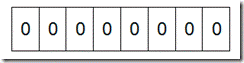
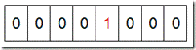
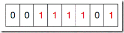

<!--BEGIN_DATA
{
    "create_date": "2016-06-15 19:23", 
    "modify_date": "2016-06-15 19:23", 
    "is_top": "0", 
    "summary": "Bit-map算法", 
    "tags": "数据结构", 
    "file_name": "Bit-map算法.md"
}
END_DATA-->


**【什么是****Bit-map****】**

所谓的Bit-map就是用一个bit位来标记某个元素对应的Value，
而Key即是该元素。由于采用了Bit为单位来存储数据，因此在存储空间方面，可以大大节省。

如果说了这么多还没明白什么是Bit-map，那么我们来看一个具体的例子，假设我们要对0-7内的5个元素(4,7,2,5,3)排序（这里假设这些元素没有重复
）。那么我们就可以采用Bit-map的方法来达到排序的目的。要表示8个数，我们就只需要8个Bit（1Bytes），首先我们开辟1Byte
的空间，将这些空间的所有Bit位都置为0(如下图：)



然后遍历这5个元素，首先第一个元素是4，那么就把4对应的位置为1（可以这样操作 p+(i/8)|(0x01<<(i%8)) 当然了这里的操作涉及到Big-
ending和Little-ending的情况，这里默认为Big-ending）,因为是从零开始的，所以要把第五位置为一（如下图）：



然后再处理第二个元素7，将第八位置为1,，接着再处理第三个元素，一直到最后处理完所有的元素，将相应的位置为1，这时候的内存的Bit位的状态如下：



然后我们现在遍历一遍Bit区域，将该位是一的位的编号输出（2，3，4，5，7），这样就达到了排序的目的。

**【****Bit-map排序实例****】**

下面的代码给出了一个BitMap的用法：排序。

//定义每个Byte中有8个Bit位  

```
#include ＜memory.h＞  
#define BYTESIZE 8  

void SetBit(char *p, int posi)  
{  
	for(int i=0; i ＜ (posi/BYTESIZE); i++) {  
		p++;  
	}  
	*p = *p|(0x01＜＜(posi%BYTESIZE));// 将该Bit位赋值1，1左移posi%BYTESIZE位，即标识上这一位。  
	return;  
}  

void BitMapSortDemo()  
{  
	//为了简单起见，我们不考虑负数  
	int num[] = {3,5,2,10,6,12,8,14,9};  
	//BufferLen这个值是根据待排序的数据中最大值确定的  
	//待排序中的最大值是14，因此只需要2个Bytes(16个Bit)  
	//就可以了。  
	const int BufferLen = 2;  
	char *pBuffer = new char[BufferLen];  
	//要将所有的Bit位置为0，否则结果不可预知。  
	memset(pBuffer,0,BufferLen);  
	for(int i=0;i＜9;i++) {  
		//首先将相应Bit位上置为1  
		SetBit(pBuffer,num[i]);  
	}  
	//输出排序结果  
	for(int i=0;i＜BufferLen;i++) {//每次处理一个字节(Byte)    
		for(int j=0;j＜BYTESIZE;j++) {//处理该字节中的每个Bit位  
			//判断该位上是否是1，进行输出，这里的判断比较笨。  
			//首先得到该第j位的掩码（0x01＜＜j），将内存区中的  
			//位和此掩码作与操作。最后判断掩码是否和处理后的  
			//结果相同  
			if((*pBuffer&(0x01＜＜j)) == (0x01＜＜j)) {  
				printf("%d ",i*BYTESIZE + j);  
			}  
		} 
		pBuffer++;  
	}  
}  

int _tmain(int argc, _TCHAR* argv[])  
{  
	BitMapSortDemo();  
	return 0;  
}
```

**【****Bit-map实用代码****】**

Bit-map基本的代码可以整理如下：

```
#define BITMAP_SET(map, p)    ((void)(((char*)(map))[(p)/CHAR_BIT] |= 1<<(p)%CHAR_BIT))  
#define BITMAP_CLEAR(map, p)    ((void)(((char*)(map))[(p)/CHAR_BIT] &= ~(1<<(p)%CHAR_BIT)))  
#define BITMAP_FLIP(map, p)    ((void)(((char*)(map))[(p)/CHAR_BIT] ^= 1<<(p)%CHAR_BIT))  
#define BITMAP_TEST(map, p)    (((char*)(map))[(p)/CHAR_BIT] & (1<<(p)%CHAR_BIT))
```

**【适用范围】**

可进行数据的快速查找，判重，删除，一般来说数据范围是int的10倍以下

**【基本原理及要点】**

使用bit数组来表示某些元素是否存在，比如8位电话号码

**【扩展】**

Bloom filter可以看做是对bit-map的扩展

**【问题实例】**

**1)****已知某个文件内包含一些电话号码，每个号码为****8****位数字，统计不同号码的个数。**

8位最多99 999 999，大概需要99m个bit，大概10几m字节的内存即可。 （可以理解为从0-99 999
999的数字，每个数字对应一个Bit位，所以只需要99M个Bit==1.2MBytes，这样，就用了小小的1.2M左右的内存表示了所有的8位数的电话）

**2)2.5****亿个整数中找出不重复的整数的个数，内存空间不足以容纳这****2.5****亿个整数。**

将bit-map扩展一下，用2bit表示一个数即可，0表示未出现，1表示出现一次，2表示出现2次及以上，在遍历这些数的时候，如果对应位置的值是0，则将其置为
1；如果是1，将其置为2；如果是2，则保持不变。或者我们不用2bit来进行表示，我们用两个bit-map即可模拟实现这个 2bit-map，都是一样的道理。


<br>


<p>原文出处：<a href="http://www.cnblogs.com/foreach-break/p/external_sort.html" target="blank">5亿整数的大文件，怎么排？</a></p>


给你1个文件`bigdata`，大小4663M，5亿个数，文件中的数据随机,如下一行一个整数：
    
    6196302
    3557681
    6121580
    2039345
    2095006
    1746773
    7934312
    2016371
    7123302
    8790171
    2966901
    ...
    7005375

现在要对这个文件进行排序，怎么搞？

* * *

####**内部排序**

先尝试内排，选2种排序方式：

* * *

#####_3路快排：_

    
	private final int cutoff = 8;
	public <T> void perform(Comparable<T>[] a) {
	        perform(a,0,a.length - 1);
	    }
	    private <T> int median3(Comparable<T>[] a,int x,int y,int z) {
	        if(lessThan(a[x],a[y])) {
	            if(lessThan(a[y],a[z])) {
	                return y;
	            }
	            else if(lessThan(a[x],a[z])) {
	                return z;
	            }else {
	                return x;
	            }
	        }else {
	            if(lessThan(a[z],a[y])){
	                return y;
	            }else if(lessThan(a[z],a[x])) {
	                return z;
	            }else {
	                return x;
	            }
	        }
	    }
	    private <T> void perform(Comparable<T>[] a,int low,int high) {
	        int n = high - low + 1;
	        //当序列非常小，用插入排序
	        if(n <= cutoff) {
	            InsertionSort insertionSort = SortFactory.createInsertionSort();
	            insertionSort.perform(a,low,high);
	            //当序列中小时，使用median3
	        }else if(n <= 100) {
	            int m = median3(a,low,low + (n >>> 1),high);
	            exchange(a,m,low);
	            //当序列比较大时，使用ninther
	        }else {
	            int gap = n >>> 3;
	            int m = low + (n >>> 1);
	            int m1 = median3(a,low,low + gap,low + (gap << 1));
	            int m2 = median3(a,m - gap,m,m + gap);
	            int m3 = median3(a,high - (gap << 1),high - gap,high);
	            int ninther = median3(a,m1,m2,m3);
	            exchange(a,ninther,low);
	        }
	        if(high <= low)
	            return;
	        //lessThan
	        int lt = low;
	        //greaterThan
	        int gt = high;
	        //中心点
	        Comparable<T> pivot =  a[low];
	        int i = low + 1;
	        /*
	        * 不变式：
	        *   a[low..lt-1] 小于pivot -> 前部(first)
	        *   a[lt..i-1] 等于 pivot -> 中部(middle)
	        *   a[gt+1..n-1] 大于 pivot -> 后部(final)
	        *
	        *   a[i..gt] 待考察区域
	        */
	        while (i <= gt) {
	            if(lessThan(a[i],pivot)) {
	                //i-> ,lt ->
	                exchange(a,lt++,i++);
	            }else if(lessThan(pivot,a[i])) {
	                exchange(a,i,gt--);
	            }else{
	                i++;
	            }
	        }
	        // a[low..lt-1] < v = a[lt..gt] < a[gt+1..high].
	        perform(a,low,lt - 1);
	        perform(a,gt + 1,high);
	    }

* * *

#####_归并排序：_
    
    /**
     * 小于等于这个值的时候，交给插入排序
     */
    private final int cutoff = 8;
    /**
     * 对给定的元素序列进行排序
     *
     * @param a 给定元素序列
     */
    @Override
    public <T> void perform(Comparable<T>[] a) {
        Comparable<T>[] b = a.clone();
        perform(b, a, 0, a.length - 1);
    }
    private <T> void perform(Comparable<T>[] src,Comparable<T>[] dest,int low,int high) {
        if(low >= high)
            return;
        //小于等于cutoff的时候,交给插入排序
        if(high - low <= cutoff) {
            SortFactory.createInsertionSort().perform(dest,low,high);
            return;
        }
        int mid = low + ((high - low) >>> 1);
        perform(dest,src,low,mid);
        perform(dest,src,mid + 1,high);
        //考虑局部有序 src[mid] <= src[mid+1]
        if(lessThanOrEqual(src[mid],src[mid+1])) {
            System.arraycopy(src,low,dest,low,high - low + 1);
        }
        //src[low .. mid] + src[mid+1 .. high] -> dest[low .. high]
        merge(src,dest,low,mid,high);
    }
    private <T> void merge(Comparable<T>[] src,Comparable<T>[] dest,int low,int mid,int high) {
        for(int i = low,v = low,w = mid + 1; i <= high; i++) {
            if(w > high || v <= mid && lessThanOrEqual(src[v],src[w])) {
                dest[i] = src[v++];
            }else {
                dest[i] = src[w++];
            }
        }
    }

数据太多，递归太深 ->栈溢出？加大Xss？  
数据太多，数组太长 -> OOM？加大Xmx?

耐心不足，没跑出来.而且要将这么大的文件读入内存，在堆中维护这么大个数据量，还有内排中不断的拷贝，对栈和堆都是很大的压力，不具备通用性。

* * *

####**sort命令来跑**

    
    
    sort -n bigdata -o bigdata.sorted

跑了多久呢？**24分钟.**

为什么这么慢？

> 粗略的看下我们的资源：

>

>   1. 内存  
jvm-heap/stack，native-heap/stack,page-cache，block-buffer

>   2. 外存  
swap + 磁盘

>

> 数据量很大，函数调用很多，系统调用很多，内核/用户缓冲区拷贝很多，脏页回写很多，io-
wait很高，io很繁忙，堆栈数据不断交换至swap，线程切换很多，每个环节的锁也很多.

> 总之，内存吃紧，问磁盘要空间，脏数据持久化过多导致cache频繁失效，引发大量回写，回写线程高，导致cpu大量时间用于上下文切换，一切，都很糟糕，所以2
4分钟不细看了，无法忍受.

* * *

####**位图法**

    
    
    private BitSet bits;
    public void perform(
            String largeFileName,
            int total,
            String destLargeFileName,
            Castor<Integer> castor,
            int readerBufferSize,
            int writerBufferSize,
            boolean asc) throws IOException {
        System.out.println("BitmapSort Started.");
        long start = System.currentTimeMillis();
        bits = new BitSet(total);
        InputPart<Integer> largeIn = PartFactory.createCharBufferedInputPart(largeFileName, readerBufferSize);
        OutputPart<Integer> largeOut = PartFactory.createCharBufferedOutputPart(destLargeFileName, writerBufferSize);
        largeOut.delete();
        Integer data;
        int off = 0;
        try {
            while (true) {
                data = largeIn.read();
                if (data == null)
                    break;
                int v = data;
                set(v);
                off++;
            }
            largeIn.close();
            int size = bits.size();
            System.out.println(String.format("lines : %d ,bits : %d", off, size));
            if(asc) {
                for (int i = 0; i < size; i++) {
                    if (get(i)) {
                        largeOut.write(i);
                    }
                }
            }else {
                for (int i = size - 1; i >= 0; i--) {
                    if (get(i)) {
                        largeOut.write(i);
                    }
                }
            }
            largeOut.close();
            long stop = System.currentTimeMillis();
            long elapsed = stop - start;
            System.out.println(String.format("BitmapSort Completed.elapsed : %dms",elapsed));
        }finally {
            largeIn.close();
            largeOut.close();
        }
    }
    private void set(int i) {
        bits.set(i);
    }
    private boolean get(int v) {
        return bits.get(v);
    }

nice!跑了190秒，3分来钟.  
以核心内存`4663M/32`大小的空间跑出这么个结果，而且大量时间在用于I/O，不错.

问题是，如果这个时候突然内存条坏了1、2根，或者只有极少的内存空间怎么搞？

* * *

####**外部排序**

该外部排序上场了.  
外部排序干嘛的？

>   1. 内存极少的情况下，利用分治策略，利用外存保存中间结果，再用多路归并来排序;

  1. map-reduce的嫡系.

  


#####1.分

内存中维护一个极小的核心缓冲区`memBuffer`，将大文件`bigdata`按行读入，搜集到`memBuffer`满或者大文件读完时，对`memBuff
er`中的数据调用内排进行排序，排序后将**有序结果**写入磁盘文件`bigdata.xxx.part.sorted`.  
循环利用`memBuffer`直到大文件处理完毕，得到n个有序的磁盘文件：


#####2.合

现在有了n个有序的小文件，怎么合并成1个有序的大文件？  
把所有小文件读入内存，然后内排？  
(⊙o⊙)…  
no!

利用如下原理进行归并排序：  
  
我们举个简单的例子：

> 文件1：**3**,6,9  
文件2：**2**,4,8  
文件3：**1**,5,7

>

> 第一回合：  
文件1的最小值：3 , 排在文件1的第1行  
文件2的最小值：2，排在文件2的第1行  
文件3的最小值：1，排在文件3的第1行  
那么，这3个文件中的最小值是：min(1,2,3) = 1  
也就是说，最终大文件的当前最小值，是文件1、2、3的当前最小值的最小值，绕么？  
上面拿出了最小值1，写入大文件.

> 第二回合：  
文件1的最小值：3 , 排在文件1的第1行  
文件2的最小值：2，排在文件2的第1行  
文件3的最小值：5，排在文件3的第2行  
那么，这3个文件中的最小值是：min(5,2,3) = 2  
将2写入大文件.

>

> **_也就是说，最小值属于哪个文件，那么就从哪个文件当中取下一行数据._**（因为小文件内部有序，下一行数据代表了它当前的最小值）

最终的时间，跑了771秒，13分钟左右.
    
    less bigdata.sorted.text

