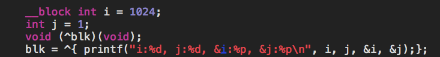
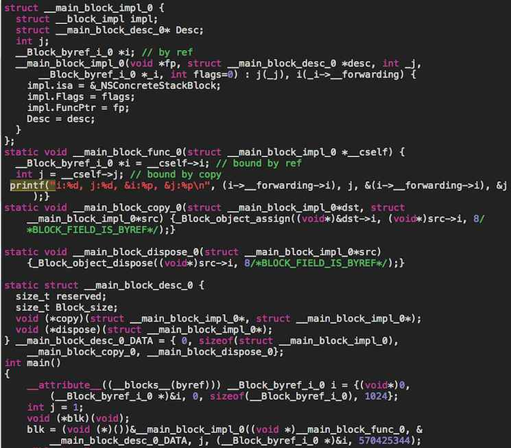

<!--BEGIN_DATA
{
    "create_date": "2016-06-14 10:35", 
    "modify_date": "2016-06-14 10:35", 
    "is_top": "0", 
    "summary": "Block教程系列", 
    "tags": "iOS", 
    "file_name": "Block教程系列.md"
}
END_DATA-->

####
原文出处：<a href='http://www.dreamingwish.com/article/block%E6%95%99%E7%A8%8B%E7%B3%BB%E5%88%97.html' target='blank'>Block教程系列</a>

#Block介绍（一）基础

###一、概述

Block是C级别的语法和运行时特性。Block比较类似C函数，但是Block比之C函数，其灵活性体现在栈内存、堆内存的引用，我们甚至可以将一个Block作
为参数传给其他的函数或者Block。

###二、热身

先看一个比较简单的Block例子：

    
    
    int multiplier = 7;
    int (^myBlock)(int) = ^(int num) {
        return num * multiplier;
    };

在这个例子中，myBlock是一个Block变量，它接受一个int类型的参数，返回一个int类型的值。是不是很像C函数？

来，让我们typedef一下

    
    
    typedef void (^BoolBlock)(BOOL);//一个只接受一个BOOL参数，没有返回值的block
    typedef int (^IntBlock)(void);//一个没有参数，返回int的block
    typedef BoolBlock (^HugeBlock)(IntBlock);//看看，这个HugeBlock的参数和返回值都是block
    
    
     

###三、更详细的例子

> 注意，上面的typedef都还有效~

#####主动调用一下：

    
    
    - (void)someMethod
    {
        BoolBlock ablock = ^(BOOL bValue) {
            NSLog(@"Bool block!");
        };
        ablock(true);
    }

#####作为参数返回：

    
    
    typedef void (^BoolBlock)(BOOL);
    - (BoolBlock)foo()
    {
        BoolBlock ablock = ^(BOOL bValue) {
            NSLog(@"Bool block!");
        };
        return [[ablock copy] autorelease];//一定要copy，将其复制到堆上，更详细的原理，将在后续章节讲解
    }

#####类的一个成员：

    
    
    @interface OBJ1 : NSObject
    @property (nonatomic, copy)BoolBlock block;//理由同上啊，同学们
    @end
    OBJ1 *obj1 = ...
    obj1.block = ^(BOOL bValue) {
            NSLog(@"Bool block!");
        };

#####其他函数的参数：

    
    
    - (void)foo(BoolBlock block)
    {
        if (block) {
            block();
        }
    }

#####甚至其他block的参数：

    
    
    BoolBlock bBlock = ^(BOOL bV){if(Bv){/*do some thing*/}};
    HugeBlock hBlock = ^(BoolBlock bB) {bB();};
    hBolck(bBlock);

#####啊，全局变量！：

    
    
    static int(^maxIntBlock)(int, int) = ^(int a, int b){return a>b?a:b;};
    int main()
    {
        printf("%d\n", maxIntBlock(2,10));  
        return 0;
    }

好了，你知道block大概能怎么用了。

###四，特殊的标记，__block

如果要在block内修改block外声明的栈变量，那么一定要对该变量加__block标记：

    
    
    int main()
    {
        __block int i = 1024;
        BoolBlock bBlock = ^(BOOL bV) {
            if (bV) {
                i++;//如果没有__block标记，是无法通过编译的。
            }
        };
    }

好了，基础很快，更详细的内容将用来介绍深入的东西。

#Block介绍（二）内存管理与其他特性

> 我们在前一章介绍了block的用法，而正确使用block必须要求正确理解block的内存管理问题。

>

> 这一章，我们只陈述结果而不追寻原因，我们将在下一章深入其原因。

###一、block放在哪里

我们针对不同情况来讨论block的存放位置：

####1.栈和堆

以下情况中的block位于堆中：

    
    
    void foo()
    {
        __block int i = 1024;
        int j = 1;
        void (^blk)(void);
        void (^blkInHeap)(void);
        blk = ^{ printf("%d, %d\n", i, j);};//blk在栈里
        blkInHeap = Block_copy(blk);//blkInHeap在堆里
    }
    - (void)fooBar
    {
        _oi = 1;
        OBJ1* oj = self;
        void (^oblk)(void) = ^{ printf("%d\n", oj.oi);};
        void (^oblkInHeap)(void) = [oblk copy];//oblkInHeap在堆中
    }

####2.全局区

以下情况中的block位于全局区：

    
    
    static int(^maxIntBlock)(int, int) = ^(int a, int b){return a>b?a:b;};
    - (void)fooBar
    {
         int(^maxIntBlockCopied)(int, int) =[maxIntBlock copy];
    }
    void foo()
    {
         int(^maxIntBlockCopied)(int, int) = Block_copy(maxIntBlock);
    }

> 需要注意的是，这里复制过后的block依旧位于全局区，实际上，复制操作是直接返回了原block对象。

###二、block引用的变量在哪里

#### 1.全局区

全局区的变量存储位置与block无关：

    
    
    static int gVar = 0;
    //__block static int gMVar = 1;
    void foo()
    {
        static int stackVar = 0;
    //    __block static int stackMVar = 0;
    }

> 注意，static变量是不允许添加__block标记的

####2.堆栈

    
    
    void foo()
    {
        __block int i = 1024;//此时i在栈上
        int j = 1;//此时j在栈上
        void (^blk)(void);
        blk = ^{printf("%d, %d\n", i, j); };//此时，blk已经初始化，它会拷贝没有__block标记的常规变量自己所持有的一块内存区，这块内存区现在位于栈上，而对于具有__block标记的变量，其地址会被拷贝置前述的内存区中
        blk();//1024, 1
        void(^blkInHeap)(void) = Block_copy(blk);//复制block后，block所持有的内存区会被拷贝至堆上，此时，我们可以说，这个block现在位于堆上
        blkInHeap();//1024,1
        i++;
        j++;
        blk();//1025,1
        blkInHeap();//1025,1
    }

让我们一步步剖析：

首先，我们在栈上创建了变量ij，并赋予初始值，然后创建一个block变量名为blk，但未赋值。

然后我们初始化这个blk，赋值为一个只有一句printf的block，值得注意的是，一个block一旦创建，其引用到的常规变量会进行如下操作：

没有__block标记的变量，其值会被复制一份到block私有内存区

有__block标记的变量，其地址会被记录在block私有内存区

然后调用blk，打印1024, 1很好理解

接下来复制blk到堆，名曰blkInHeap，调用之，打印1024, 1也很好理解

接下来我们为ij增值，使其变为1025和2，此时再调用blk或者blkInHeap，会发现结果为1025, 1，这是因为变量j早已在创建原始的block时，
被赋值进block的私有内存区，后续对i的操作并非操作的私有内存区的复制品，当调用blk或者blkInHeap时，其打印使用的是私有内存区的复制品，故而打印
结果依旧为1；而变量j的修改会实时生效，因为block记录的是它的地址，通过地址来访问其值，使得外部对j的修改在block中得以生效。对于变量i来讲，可算是
物是人非吧？

> 因此，无论j++这一句放到blk()这句之前或者之后，只要它位于block初始化之后，这段代码执行的控制台打印结果都会是：1024,
1。而不是1024, 2（假设不调用i++）

###三、其他特性

####1.复制的行为

 对block调用复制，有以下几种情况：

1.对全局区的block调用copy，会返回原指针，并且这期间不处理任何东西（至少目前的内部实现是这样）；

2.对栈上的block调用copy，每次会返回新复制到堆上的block的指针，同时，所有__block变量都会被复制至堆一份(多次拷贝，只会生成一份)。

3.对已经位于heap上的block，再次调用copy，只会增加block的引用计数。

> 为什么我们不讨论retian的行为？原因是并没有Block_retain()这样的函数，而且objc里面的retain消息发送给block对象后，其内部
实现是几乎什么都不做(会增加objective-c引用计数)。

####2.objc类中的block复制

 objc类实例方法中的block如果被复制至heap，那么当前实例会被增加引用计数，当这个block被释放时，此实例会被减少引用计数。

但如果这个block没有使用当前实例的任何成员，那么当前实例不会被增加引用计数。这也是很自然的道理，我既然没有用到这个instance的任何东西，那么我干嘛
要retian它？

> 我们要注意的一点是，我看到网上有很多人说block引起了实例与block之间的循环引用（retain-
cycle），并且给出解决方案：不直接使用self而先将self赋值给一个临时变量，然后再使用这个临时变量。

>

> 但是，大家注意，我们一定要为这个临时变量增加__block标记（多谢第三篇文章回帖网友的提醒）。

这一章我们以结果导向的方式来说明了各种情况下，block的内存问题，下一章，我将剖析运行时库的源码，从根源阐述block的行为。也就是过程导向的方式了。

#block介绍（三）揭开神秘面纱（上）

上一篇我们总结了各个情况下，block及其引用到的内存位置情况。

接下来几篇，我们将剖析编译器转码以及运行时库源码来一探block的究竟。

##

###block到底是什么

> 我们使用clang的rewrite-objc命令来获取转码后的代码。

###

####1、block的底层实现

我们来看看最简单的一个block：

 

 这个block仅仅打印栈变量i和j的值，其被clang转码为：

**首先**是一个结构体__main_block_impl_0（从图二中的最后一行可以看到，block是一个指向__main_block_impl_0的指针，初始化后被类型强转为函数指针），其中包含的__block_impl是一个公共实现（学过c语言的同学都知道，__main_block_impl_0的这种写法表示其可以被类型强转为__block_impl类型）：
    
    
    struct __block_impl {
      void *isa;
      int Flags;
      int Reserved;
      void *FuncPtr;
    };

 isa指针说明block可以成为一个objc 对象。

> __main_block_impl_0的意思是main函数中的第0个block的implementation，这就是这个block的主体了。

 这个结构体的构造函数的参数：

  1. block实际执行代码所在的函数的指针，当block真正被执行时，实际上是调用了这个函数，其命名也是类似的方式。
  2. block的描述结构体，注意这个结构体声明结束时就创建了一个唯一的desc，这个desc包含了block的大小，以及复制和析构block时需要额外调用的函数。
  3. 接下来是block所引用到的变量们
  4. 最后是一个标记值，内部实现需要用到的。（我用计算器看了一下，570425344这个值等于1<<29，即BLOCK_HAS_DESCRIPTOR这个枚举值）

所以，我们可以看到：

  1. 为什么上一篇我们说j已经不是原来的j了，因为j是作为参数传入了block的构造函数，进行了值复制。
  2. 带有__block标记的变量会被取地址来传入构造函数，为修改其值奠定了基础

**接下来**是block执行函数__main_block_func_0:

其唯一的参数是__main_block_impl_0的指针，我们看到printf语句的数据来源都取自__cself这个指针，比较有意思的是i的取值方式（带有
__block标记的变量i被转码为一个结构体），先取__forward指针，再取i，这为将i复制到堆中奠定了基础。

**再下来**是预定义好的两个复制/释放辅助函数，其作用后面会讲到。 

**最后**是block的描述信息结构体 __main_block_desc_0，其包含block的内存占用长度，已经复制/释放辅助函数的指针，其声明结束时，就创建了一个名为__main_block_desc_0_DATA的结构体，我们看它构造时传入的值，这个DATA结构体的作用就一目了然了：

长度用sizeof计算，辅助函数的指针分别为上面预定义的两个辅助函数。

> 注意，如果这个block没有使用到需要在block复制时进行copy/retian的变量，那么desc中不会有辅助函数

**至此，一个block所有的部件我们都看齐全了，一个主体，一个真正的执行代码函数，一个描述信息(可能包含两个辅助函数)。**

####2、构造一个block

我们进入main函数：

图一中的第三行（block的声明），在图二中，转化为一个函数指针的声明，并且都没有被赋予初始值。

而图一中的最后一行（创建一个block），在图二中，成为了对__main_block_impl_0的构造函数的调用，传入的参数的意义上面我们已经讲过了。

所以构造一个block就是创建了__main_block_impl_0 这个c++类的实例。

####3、调用一个block

调用一个block的写法很简单，与调用c语言函数的语法一样：

    
    
    blk();

其转码后的语句：

    
    
    ((void (*)(__block_impl *))((__block_impl *)blk)->FuncPtr)((__block_impl *)blk);

将blk这个函数指针类型强转为__block_impl类型，然后取其执行函数指针，然后将此指针类型强转为返回void*并接收一个__block_impl*的
函数指针，最后调用这个函数，传入强转为__block_impl*类型的blk，

即调用了前述的函数__main_block_func_0

####4、objective-c类成员函数中的block

源码如下：

    
    
    - (void)of1
    {
        OBJ1* oj = self;
        void (^oblk)(void) = ^{ printf("%d\n", oj.oi);};
        Block_copy(oblk);
    }

这里我故意将self赋值给oj这个变量，是为了验证前一章提出的一个结论：无法通过简单的间接引用self来防止retain循环，要避免循环，我们需要__blo
ck标记（多谢楼下网友的提醒）

转码如下：

    
    
    struct __OBJ1__of1_block_impl_0 {
      struct __block_impl impl;
      struct __OBJ1__of1_block_desc_0* Desc;
      OBJ1 *oj;
      __OBJ1__of1_block_impl_0(void *fp, struct __OBJ1__of1_block_desc_0 *desc, OBJ1 *_oj, int flags=0) : oj(_oj) {
        impl.isa = &_NSConcreteStackBlock;
        impl.Flags = flags;
        impl.FuncPtr = fp;
        Desc = desc;
      }
    };
    static void __OBJ1__of1_block_func_0(struct __OBJ1__of1_block_impl_0 *__cself) {
      OBJ1 *oj = __cself->oj; // bound by copy
     printf("%d\n", ((int (*)(id, SEL))(void *)objc_msgSend)((id)oj, sel_registerName("oi")));}

objc方法中的block与c中的block并无太多差别，只是一些标记值可能不同，为了标记其是objc方法中的blcok。

注意其构造函数的参数:OBJ1 *_oj

这个_oj在block复制到heap时，会被retain，而_oj与self根本就是相等的，所以，最终retain的就是self，所以如果当前实例持有了这个
block，retain循环就形成了。

而一旦为其增加了__block标记：

    
    
    - (void)of1
    {
        __block OBJ1 *bSelf = self;
        ^{ printf("%d", bSelf.oi); };
    }

其转码则变为：

    
    
    //增加了如下行
    struct __Block_byref_bSelf_0 {
      void *__isa;
    __Block_byref_bSelf_0 *__forwarding;
     int __flags;
     int __size;
     void (*__Block_byref_id_object_copy)(void*, void*);
     void (*__Block_byref_id_object_dispose)(void*);
     OBJ1 *bSelf;
    };
    static void __Block_byref_id_object_copy_131(void *dst, void *src) {
     _Block_object_assign((char*)dst + 40, *(void * *) ((char*)src + 40), 131);
    }
    static void __Block_byref_id_object_dispose_131(void *src) {
     _Block_object_dispose(*(void * *) ((char*)src + 40), 131);
    }
    //声明处变为
        __block __Block_byref_bSelf_0 bSelf = {(void*)0,(__Block_byref_bSelf_0 *)&bSelf, 33554432, sizeof(__Block_byref_bSelf_0), __Block_byref_id_object_copy_131, __Block_byref_id_object_dispose_131, self};
    

clang为我们的bSelf结构体创建了自己的copy/dispose辅助函数，33554432（即1<<25
BLOCK_HAS_COPY_DISPOSE）这个值告诉系统，我们的bSelf结构体具有copy/dispose辅助函数。

而131这个参数（二进制1000 0011，即BLOCK_FIELD_IS_OBJECT (3) |BLOCK_BYREF_CALLER（128））

中的BLOCK_BYREF_CALLER在内部实现中告诉系统不要进行retain或者copy，

也就是说，在 __block bSelf 被复制至heap上时，系统会发现有辅助函数，而辅助函数调用后，并不retain或者copy
其结构体内的bSelf。

这样就避免了循环retain。

####小结：

当我们创建一个block，并调用之，编译器为我们做的事情如下：

1.创建block所有的部件代码：一个主体，一个真正的执行代码函数，一个描述信息（可能包含两个辅助函数）。

2.将我们的创建代码转码为block_impl的构造语句。

3.将我们的执行语句转码为对block的执行函数的调用。

下一篇我们将剖析runtime.c的源码，并理解block的堆栈转换。

#block介绍（四）揭开神秘面纱（下）

终于有空开始这系列最后一篇的编写。

这一篇，我们将看到block的内存管理的内部实现，通过剖析runtime库源码，我们可以更深刻的理解block的内存运作体系。

> 看此篇时，请大家同时打开两个网址（或者下载它们到本地然后打开）：

>

> <http://llvm.org/svn/llvm-project/compiler-
rt/trunk/lib/BlocksRuntime/runtime.c>

>

> <http://llvm.org/svn/llvm-project/compiler-
rt/trunk/lib/BlocksRuntime/Block_private.h>

###内存管理的真面目

####objc层面如何区分不同内存区的block

Block_private.h中有这样一组值：

    
    
    /* the raw data space for runtime classes for blocks */
    /* class+meta used for stack, malloc, and collectable based blocks */
    BLOCK_EXPORT void * _NSConcreteStackBlock[32];
    BLOCK_EXPORT void * _NSConcreteMallocBlock[32];
    BLOCK_EXPORT void * _NSConcreteAutoBlock[32];
    BLOCK_EXPORT void * _NSConcreteFinalizingBlock[32];
    BLOCK_EXPORT void * _NSConcreteGlobalBlock[32];
    BLOCK_EXPORT void * _NSConcreteWeakBlockVariable[32];

其用于对block的isa指针赋值

**1.栈**
    
    
    struct __OBJ1__of2_block_impl_0 {
      struct __block_impl impl;
      struct __OBJ1__of2_block_desc_0* Desc;
      OBJ1 *self;
      __OBJ1__of2_block_impl_0(void *fp, struct __OBJ1__of2_block_desc_0 *desc, OBJ1 *_self, int flags=0) : self(_self) {
        impl.isa = &_NSConcreteStackBlock;
        impl.Flags = flags;
        impl.FuncPtr = fp;
        Desc = desc;
      }
    };

在栈上创建的block，其isa指针是_NSConcreteStackBlock。

**2.全局区**

在全局区创建的block，其比较类似，其构造函数会将isa指针赋值为_NSConcreteGlobalBlock。

**3.堆**

我们无法直接创建堆上的block，堆上的block需要从stack
block拷贝得来，在runtime.c中的_Block_copy_internal函数中，有这样几行：

    
    
        // Its a stack block.  Make a copy.
        if (!isGC) {
            struct Block_layout *result = malloc(aBlock->descriptor->size);
            ...
            result->isa = _NSConcreteMallocBlock;
            ...
            return result;
        }

可以看到，栈block复制得来的新block，其isa指针会被赋值为_NSConcreteMallocBlock

**4.其余的isa类型**
    
    
    BLOCK_EXPORT void * _NSConcreteAutoBlock[32];
    BLOCK_EXPORT void * _NSConcreteFinalizingBlock[32];
    BLOCK_EXPORT void * _NSConcreteWeakBlockVariable[32];

其他三种类型是用于gc和arc，我们暂不讨论

####复制block

 对block调用Block_copy方法，或者向其发送objc
copy消息，最终都会调用runtime.c中的_Block_copy_internal函数，其内部实现会检查block的flag，从而进行不同的操作：

    
    
    static void *_Block_copy_internal(const void *arg, const int flags) {
        ...
        aBlock = (struct Block_layout *)arg;
        ...
    }

1.栈block的复制

    
    
            // reset refcount
            result->flags &= ~(BLOCK_REFCOUNT_MASK);    // XXX not needed
            result->flags |= BLOCK_NEEDS_FREE | 1;
            result->isa = _NSConcreteMallocBlock;
            if (result->flags & BLOCK_HAS_COPY_DISPOSE) {
                //printf("calling block copy helper %p(%p, %p)...\n", aBlock->descriptor->copy, result, aBlock);
                (*aBlock->descriptor->copy)(result, aBlock); // do fixup
            }

 除了修改isa指针的值之外，拷贝过程中，还会将BLOCK_NEEDS_FREE置入，大家记住这个值，后面会用到。

最后，如果block有辅助copy/dispose函数，那么辅助的copy函数会被调用。

2.全局block的复制

    
    
        else if (aBlock->flags & BLOCK_IS_GLOBAL) {
            return aBlock;
        }

全局block进行copy是直接返回了原block，没有任何的其他操作。

3.堆block的复制

    
    
        if (aBlock->flags & BLOCK_NEEDS_FREE) {
            // latches on high
            latching_incr_int(&aBlock->flags);
            return aBlock;
        }

栈block复制时，置入的BLOCK_NEEDS_FREE标记此时起作用，_Block_copy_internal函数识别当前block是一个堆block，
则仅仅增加引用计数，然后返回原block。

####辅助copy/dispose函数

**1.普通变量的复制**

辅助copy函数用于拷贝block所引用的可修改变量，我们这里以 __block int i = 1024为例：

先看看Block_private.h中的定义：

    
    
    struct Block_byref {
        void *isa;
        struct Block_byref *forwarding;
        int flags; /* refcount; */
        int size;
        void (*byref_keep)(struct Block_byref *dst, struct Block_byref *src);
        void (*byref_destroy)(struct Block_byref *);
        /* long shared[0]; */
    };

而我们的__block int i = 1024的转码：

    
    
    struct __Block_byref_i_0 {
      void *__isa;
    __Block_byref_i_0 *__forwarding;
     int __flags;
     int __size;
     int i;
    };//所以我们知道，当此结构体被类型强转为Block_byref时，前四个成员是一致的，访问flags就相当于访问__flags，而内部实现就是这样使用的
    ...
    __attribute__((__blocks__(byref))) __Block_byref_i_0 i = {(void*)0,(__Block_byref_i_0 *)&i, 0, sizeof(__Block_byref_i_0), 1024};//i初始化时__flags为0
    
    
    static void __main_block_copy_0(struct __main_block_impl_0*dst, struct __main_block_impl_0*src) {_Block_object_assign((void*)&dst->i, (void*)src->i, 8/*BLOCK_FIELD_IS_BYREF*/);}

此时，复制时调用的辅助函数：

    
    
    void _Block_object_assign(void *destAddr, const void *object, const int flags) {//此处flags为8，即BLOCK_FIELD_IS_BYREF
        ...
        if ((flags & BLOCK_FIELD_IS_BYREF) == BLOCK_FIELD_IS_BYREF)  {
            // copying a __block reference from the stack Block to the heap
            // flags will indicate if it holds a __weak reference and needs a special isa
            _Block_byref_assign_copy(destAddr, object, flags);
        }
        ...
    }
    static void _Block_byref_assign_copy(void *dest, const void *arg, const int flags) {//此处flags为8，即BLOCK_FIELD_IS_BYREF
        struct Block_byref **destp = (struct Block_byref **)dest;
        struct Block_byref *src = (struct Block_byref *)arg;
        ...
        else if ((src->forwarding->flags & BLOCK_REFCOUNT_MASK) == 0) {//当初次拷贝i时，flags为0，进入此分支会进行复制操作并改变flags值，置入BLOCK_NEEDS_FREE和初始的引用计数
           ...
        }
        // already copied to heap
        else if ((src->forwarding->flags & BLOCK_NEEDS_FREE) == BLOCK_NEEDS_FREE) {//当再次拷贝i时，则仅仅增加其引用计数
            latching_incr_int(&src->forwarding->flags);
        }
        // assign byref data block pointer into new Block
        _Block_assign(src->forwarding, (void **)destp);//这句仅仅是直接赋值，其函数实现只有一行赋值语句，查阅runtime.c可知
    }

所以，我们知道，当我们多次copy一个block时，其引用的__block变量只会被拷贝一次。

**2.objc变量的复制 **

当objc变量没有__block修饰时：

    
    
    static void __OBJ1__of2_block_copy_0(struct __OBJ1__of2_block_impl_0*dst, struct __OBJ1__of2_block_impl_0*src) {_Block_object_assign((void*)&dst->self, (void*)src->self, 3/*BLOCK_FIELD_IS_OBJECT*/);}
    
    
    void _Block_object_assign(void *destAddr, const void *object, const int flags) {
        ...
        else if ((flags & BLOCK_FIELD_IS_OBJECT) == BLOCK_FIELD_IS_OBJECT) {
            //printf("retaining object at %p\n", object);
            _Block_retain_object(object);//当我们没有开启arc时，这个函数会retian此object
            //printf("done retaining object at %p\n", object);
            _Block_assign((void *)object, destAddr);
        }
        ....
    }

当objc变量有__block修饰时：

    
    
    struct __Block_byref_bSelf_0 {
      void *__isa;
    __Block_byref_bSelf_0 *__forwarding;
     int __flags;
     int __size;
     void (*__Block_byref_id_object_copy)(void*, void*);
     void (*__Block_byref_id_object_dispose)(void*);
     OBJ1 *bSelf;
    };
    static void __Block_byref_id_object_copy_131(void *dst, void *src) {
     _Block_object_assign((char*)dst + 40, *(void * *) ((char*)src + 40), 131);//131即为BLOCK_FIELD_IS_OBJECT|BLOCK_BYREF_CALLER
    }
    static void __Block_byref_id_object_dispose_131(void *src) {
     _Block_object_dispose(*(void * *) ((char*)src + 40), 131);
    }
    ... //33554432即为BLOCK_HAS_COPY_DISPOSE
        __block __Block_byref_bSelf_0 bSelf = {(void*)0,(__Block_byref_bSelf_0 *)&bSelf, 33554432, sizeof(__Block_byref_bSelf_0), __Block_byref_id_object_copy_131, __Block_byref_id_object_dispose_131, self};

BLOCK_HAS_COPY_DISPOSE告诉内部实现，这个变量结构体具有自己的copy/dispose辅助函数，而此时我们的内部实现不会进行默认的复制操
作：

    
    
    void _Block_object_assign(void *destAddr, const void *object, const int flags) {
        //printf("_Block_object_assign(*%p, %p, %x)\n", destAddr, object, flags);
        if ((flags & BLOCK_BYREF_CALLER) == BLOCK_BYREF_CALLER) {
            if ((flags & BLOCK_FIELD_IS_WEAK) == BLOCK_FIELD_IS_WEAK) {
                _Block_assign_weak(object, destAddr);
            }
            else {
                // do *not* retain or *copy* __block variables whatever they are
                _Block_assign((void *)object, destAddr);
            }
        }

当我们没有开启arc，且flags中具有BLOCK_BYREF_CALLER时，会进入_Block_assign函数，而此函数仅仅是赋值

所以，如果要避免objc实例中的block引起的循环引用，我们需要让block间接使用self：

__block bSelf = self;

####其他

对于dipose辅助函数，其行为与copy是类似的，我们不再重复同样的东西，如果大家要了解，自行查阅runtime.c和Block_private.h即可。

我们已经理解了非arc非gc情况下的block的内存管理内部实现，对arc和gc的情况，其行为也是类似的，只是一些函数的指针指向的真正函数会改变，比如_Bl
ock_use_GC函数，会将一些函数指向其他的实现，使其适用于gc开启的情况。

####小结

block实际上是一些执行语句和语句需要的上下文的组合，而runtime给予的内部实现决定了它不会浪费一比特的内存。

> 我们知道cocoa中的容器类class有mutable和immutable之分，实际上我们可以将block看做一个immutable的容器，其盛放的是执
行的代码和执行此代码需要的变量，而一个immutable变量的无法改变的特质，也决定了block在复制时，的确没有必要不断分配新的内存。故而其复制的行为会是
增加引用计数。

最后，参考资料列表如下

http://thirdcog.eu/pwcblocks/#cblocks-memory

http://blog.csdn.net/jasonblog/article/details/7756763

http://clang.llvm.org/docs/Block-ABI-Apple.html

http://www.tanhao.me/pieces/310.html 

http://llvm.org/svn/llvm-project/compiler-rt/trunk/BlocksRuntime/runtime.c 

http://llvm.org/svn/llvm-project/compiler-rt/trunk/BlocksRuntime/Block_private.h

