 
<!--BEGIN_DATA
{
    "create_date": "2017-11-28 11:34", 
    "modify_date": "2017-11-28 11:34", 
    "is_top": "0", 
    "summary": "Build your own Command Line with ANSI escape codes", 
    "tags": "工具、其它", 
    "file_name": "Build your own Command Line with ANSI escape codes.md"
}
END_DATA-->

####
原文出处：<a href='http://www.lihaoyi.com/post/BuildyourownCommandLinewithANSIescapecodes.html' target='blank'>Build your own Command Line with ANSI escape codes</a>

Everyone is used to programs printing out output in a terminal that scrolls as new text appears, but that's not all your can do: your program can color your text, move the cursor up, down, left or right, or clear portions of the screen if you are going to re-print them later. This is what lets programs like
[Git](https://en.wikipedia.org/wiki/Git_\(software\)) implement its dynamic progress indicators, and
[Vim](https://en.wikipedia.org/wiki/Vim_\(text_editor\)) or [Bash](https://en.wikipedia.org/wiki/Bash_\(Unix_shell\)) implement their editors that let you modify already-displayed text without scrolling the terminal.

There are libraries like
[Readline](https://en.wikipedia.org/wiki/GNU_Readline),
[JLine](https://github.com/jline/jline2), or the [Python Prompt Toolkit](https://github.com/jonathanslenders/python-prompt-toolkit) that help
you do this in various programming languages, but you can also do it yourself.
This post will explore the basics of how you can control the terminal from any command-line program, with examples in Python, and how your own code can
directly make use of all the special features the terminal has to offer.

The way that most programs interact with the Unix terminal is through [ANSI escape codes](https://en.wikipedia.org/wiki/ANSI_escape_code). These are
special codes that your program can print in order to give the terminal instructions. Various terminals support different subsets of these codes, and it's difficult to find a "authoritative" list of what every code does. 
Wikipedia has a [reasonable listing](https://en.wikipedia.org/wiki/ANSI_escape_code#CSI_codes) of them, as do many other sites.

Nevertheless, it's possible to write programs that make use of ANSI escape codes, and at least will work on common Unix systems like Ubuntu or OS-X (though not Windows, which I won't cover here and is its own adventure!). This post will explore the basics of what ./image escape codes exist, and demonstrate how to use them to write your own interactive command-line from first principles:

  * Rich Text
    * Colors
      * 8 Colors
      * 16 Colors
      * 256 Colors
    * Background Colors
    * Decorations
  * Cursor Navigation
    * Progress Indicator
    * ASCII Progress bar
  * Writing a Command Line
    * User Input
    * A Basic Command Line
    * Cursor Navigation
    * Deletion
    * Completeness?
  * Customizing your Command Line
  * Conclusion

To begin with, let's start off with a plain-old vanilla Python prompt:

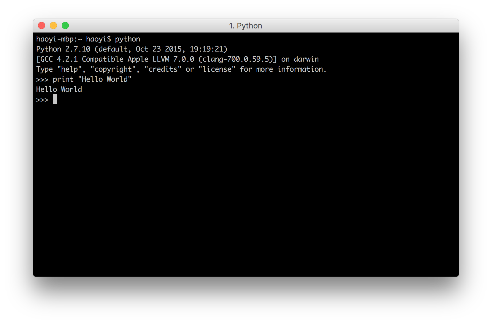

And get started!

###Rich Text__

The most basic ./image escape codes are those involved in rendering text.
These let you add decorations like Colors, Background Colors or other 
Decorations to your printed text, but don't do anything fancy. The text you print will still end up at the bottom of the terminal, and still make your terminal scroll, just now it will be colored text instead of the default black/white color scheme your terminal has.

####Colors__

The most basic thing you can do to your text is to color it. The ./image
colors all look like

  * **Red**: `\u001b[31m`
  * **Reset**: `\u001b[0m`

This `\u001b` character is the special character that starts off most ./image escapes; most languages allow this syntax for representing special characters, e.g. Java, Python and Javascript all allow the `\u001b` syntax.

For example here is printing the string `"Hello World"`, but red:

    
    
    print u"\u001b[31mHelloWorld"
    

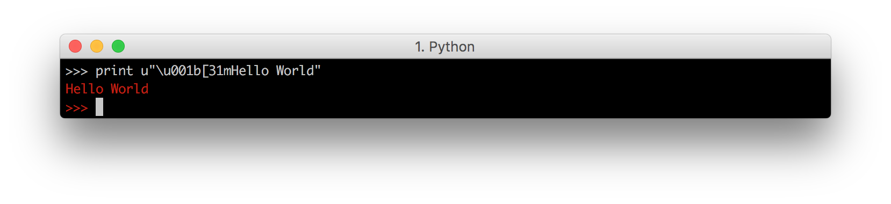

Note how we need to prefix the string with `u` i.e. `u"..."` in order for this to work in Python 2.7.10. This is not necessary in Python 3 or in other languages.

See how the red color, starting from the printed `Hello World`, ends up spilling into the `>>>` prompt. In fact, any code we type into this prompt will also be colored red, as will any subsequent output! That is how ./image colors work: once you print out the special code enabling a color, the color persists forever until someone else prints out the code for a different color,
or prints out the **Reset** code to disable it.

We can disable it by printing the **Reset** code above:

    
    
    print u"\u001b[0m"
    

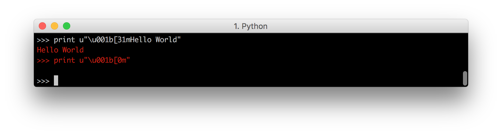

And we can see the prompt turns back white. In general, you should always remember to end any colored string you're printing with a **Reset**, to make sure you don't accidentally

To avoid this, we need to make sure we end our colored-string with the **Reset** code:

    
    
    print u"\u001b[31mHelloWorld\u001b[0m"
    

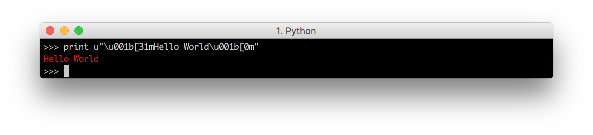

Which propertly resets the color after the string has been printed. You can also **Reset** halfway through the string to make the second-half un-colored:

    
    
    print u"\u001b[31mHello\u001b[0mWorld"
    

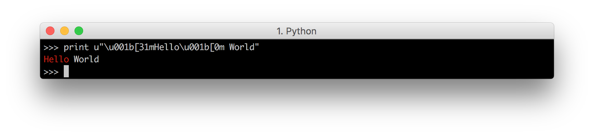

#####8 Colors__

We have seen how **Red** and **Reset** work. The most basic terminals have a set of 8 different colors:

  * **Black**: `\u001b[30m`
  * **Red**: `\u001b[31m`
  * **Green**: `\u001b[32m`
  * **Yellow**: `\u001b[33m`
  * **Blue**: `\u001b[34m`
  * **Magenta**: `\u001b[35m`
  * **Cyan**: `\u001b[36m`
  * **White**: `\u001b[37m`
  * **Reset**: `\u001b[0m`

Which we can demonstrate by printing one letter of each color, followed by a
**Reset**:

    
    
    print u"\u001b[30m A \u001b[31m B \u001b[32m C \u001b[33m D \u001b[0m"
    print u"\u001b[34m E \u001b[35m F \u001b[36m G \u001b[37m H \u001b[0m"
    

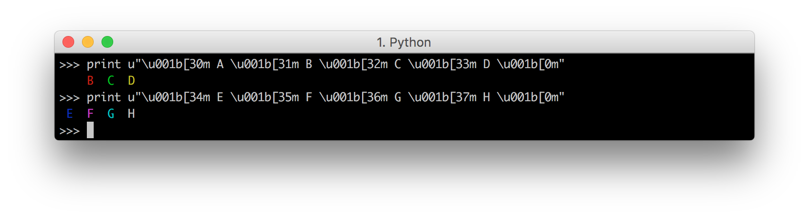

Note how the black `A` is totally invisible on the black terminal, while the white `H` looks the same as normal text. If we chose a different color-scheme for our terminal, it would be the opposite:

    
    
    print u"\u001b[30;1m A \u001b[31;1m B \u001b[32;1m C \u001b[33;1m D \u001b[0m"
    print u"\u001b[34;1m E \u001b[35;1m F \u001b[36;1m G \u001b[37;1m H \u001b[0m"
    

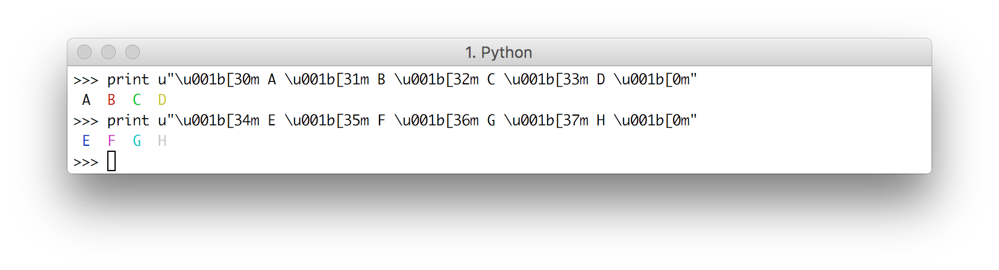

With the black `A` being obvious and the white `H` being hard to make out.

#####16 Colors__

Most terminals, apart from the basic set of 8 colors, also support the "bright" or "bold" colors. These have their own set of codes, mirroring the normal colors, but with an additional `;1` in their codes:

  * **Bright Black**: `\u001b[30;1m`
  * **Bright Red**: `\u001b[31;1m`
  * **Bright Green**: `\u001b[32;1m`
  * **Bright Yellow**: `\u001b[33;1m`
  * **Bright Blue**: `\u001b[34;1m`
  * **Bright Magenta**: `\u001b[35;1m`
  * **Bright Cyan**: `\u001b[36;1m`
  * **Bright White**: `\u001b[37;1m`
  * **Reset**: `\u001b[0m`

Note that **Reset** is the same: this is the reset code that resets _all_ colors and text effects.

We can print out these bright colors and see their effects:

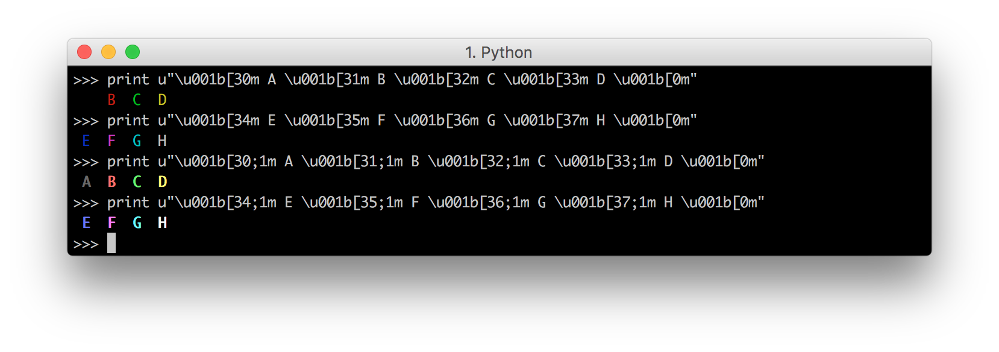

And see that they are, indeed, much brighter than the basic set of 8 colors.
Even the black `A` is now bright enough to be a visible gray on the black background, and the white `H` is now even brighter than the default text color.

#####256 Colors__

Lastly, after the 16 colors, some terminals support a 256-color extended color set.

These are of the form

  * `\u001b[38;5;${ID}m`
    
    
    import sys
    for i in range(0, 16):
        for j in range(0, 16):
            code = str(i * 16 + j)
            sys.stdout.write(u"\u001b[38;5;" + code + "m " + code.ljust(4))
        print u"\u001b[0m"
    

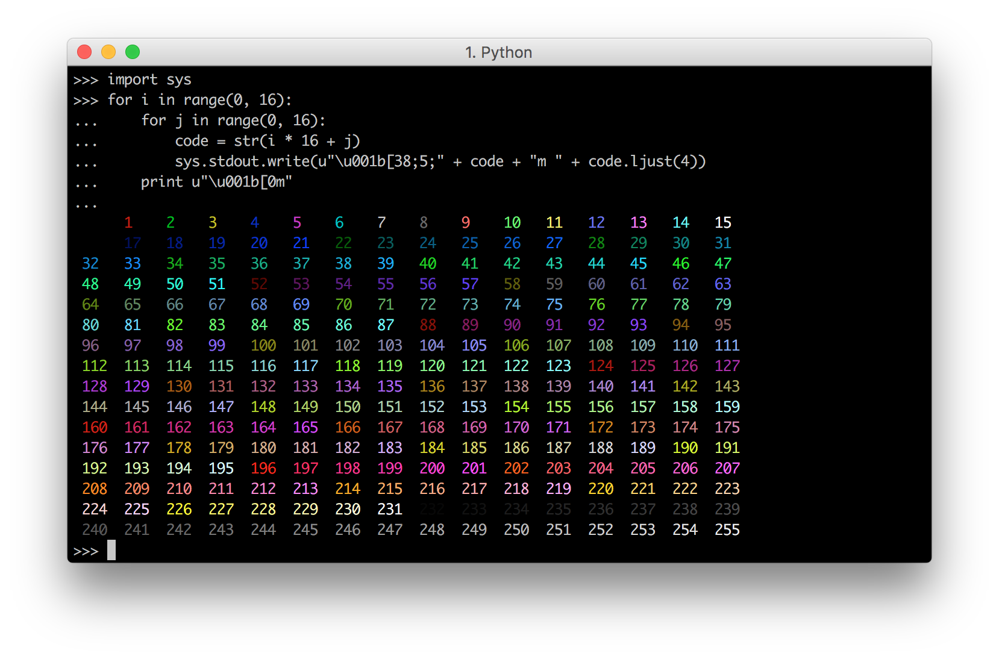

Here we use `sys.stdout.write` instead of `print` so we can print multiple items on the same line, but otherwise it's pretty self-explanatory. Each code
from 0 to 255 corresponds to a particular color.

####Background Colors__

The ./image escape codes let you set the color of the text-background the same way it lets you set the color of the foregrond. For example, the 8 background
colors correspond to the codes:

  * **Background Black**: `\u001b[40m`
  * **Background Red**: `\u001b[41m`
  * **Background Green**: `\u001b[42m`
  * **Background Yellow**: `\u001b[43m`
  * **Background Blue**: `\u001b[44m`
  * **Background Magenta**: `\u001b[45m`
  * **Background Cyan**: `\u001b[46m`
  * **Background White**: `\u001b[47m`

With the bright versions being:

  * **Background Bright Black**: `\u001b[40;1m`
  * **Background Bright Red**: `\u001b[41;1m`
  * **Background Bright Green**: `\u001b[42;1m`
  * **Background Bright Yellow**: `\u001b[43;1m`
  * **Background Bright Blue**: `\u001b[44;1m`
  * **Background Bright Magenta**: `\u001b[45;1m`
  * **Background Bright Cyan**: `\u001b[46;1m`
  * **Background Bright White**: `\u001b[47;1m`

And reset is the same:

  * **Reset**: `\u001b[0m`

We can print them out and see them work

    
    
    print u"\u001b[40m A \u001b[41m B \u001b[42m C \u001b[43m D \u001b[0m"
    print u"\u001b[44m A \u001b[45m B \u001b[46m C \u001b[47m D \u001b[0m"
    print u"\u001b[40;1m A \u001b[41;1m B \u001b[42;1m C \u001b[43;1m D \u001b[0m"
    print u"\u001b[44;1m A \u001b[45;1m B \u001b[46;1m C \u001b[47;1m D \u001b[0m"
    

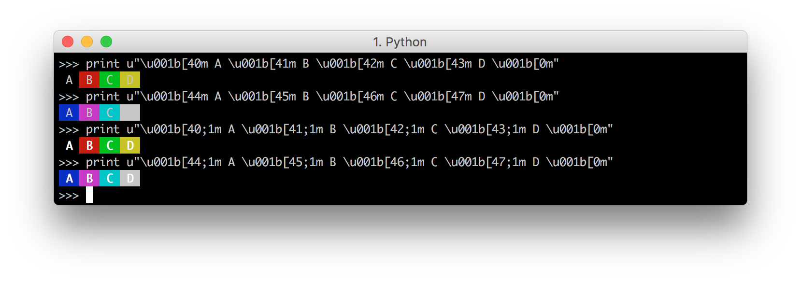

Note that the bright versions of the background colors do not change the background, but rather make the _foreground_ text brighter. This is unintuitive but that's just the way it works.

256-colored backgrounds work too:

    
    
    import sys
    for i in range(0, 16):
        for j in range(0, 16):
            code = str(i * 16 + j)
            sys.stdout.write(u"\u001b[48;5;" + code + "m " + code.ljust(4))
        print u"\u001b[0m"
    

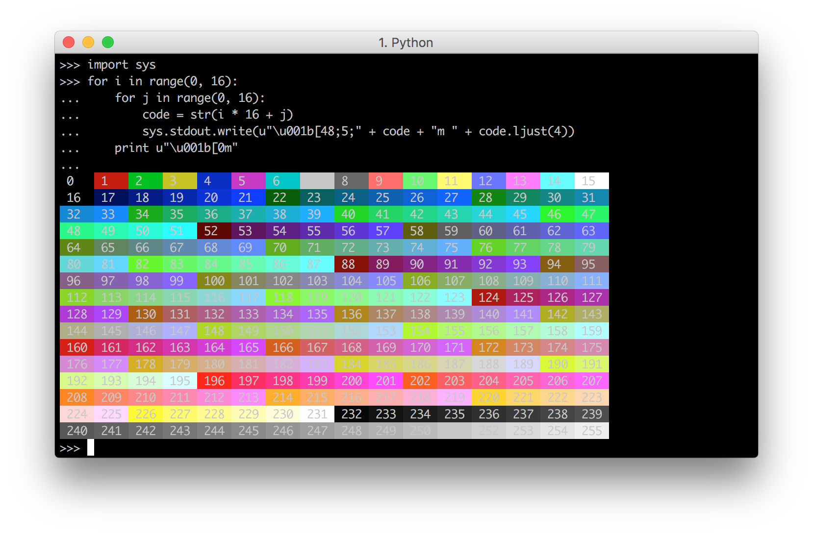

####Decorations__

Apart from colors, and background-colors, ./image escape codes also allow decorations on the text:

  * **Bold**: `\u001b[1m`
  * **Underline**: `\u001b[4m`
  * **Reversed**: `\u001b[7m`

Which can be used individually:

    
    
    print u"\u001b[1m BOLD \u001b[0m\u001b[4m Underline \u001b[0m\u001b[7m Reversed \u001b[0m"
    

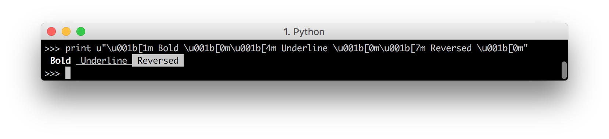

Or together

    
    
    print u"\u001b[1m\u001b[4m\u001b[7m BOLD Underline Reversed \u001b[0m"
    

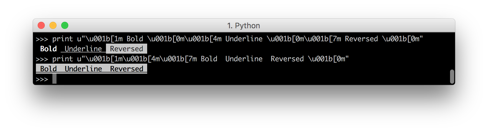

And can be used together with foreground and background colors:

    
    
    print u"\u001b[1m\u001b[31m Red Bold \u001b[0m"
    print u"\u001b[4m\u001b[44m Blue Background Underline \u001b[0m"
    

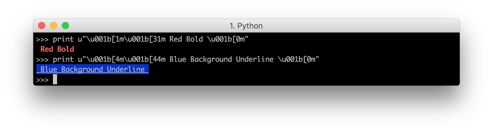

###Cursor Navigation__

The next set of ./image escape codes are more complex: they allow you to move the cursor around the terminal window, or erase parts of it. These are the ./image escape codes that programs like Bash use to let you move your cursor left and right across your input command in response to arrow-keys.

The most basic of these moves your cursor up, down, left or right:

  * **Up**: `\u001b[{n}A`
  * **Down**: `\u001b[{n}B`
  * **Right**: `\u001b[{n}C`
  * **Left**: `\u001b[{n}D`

To make use of these, first let's establish a baseline of what the "normal" Python prompt does.

Here, we add a `time.sleep(10)` just so we can see it in action. We can see that if we print something, first it prints the output and moves our cursor onto the next line:

    
    
    import time
    print "Hello I Am A Cow"; time.sleep(10)
    

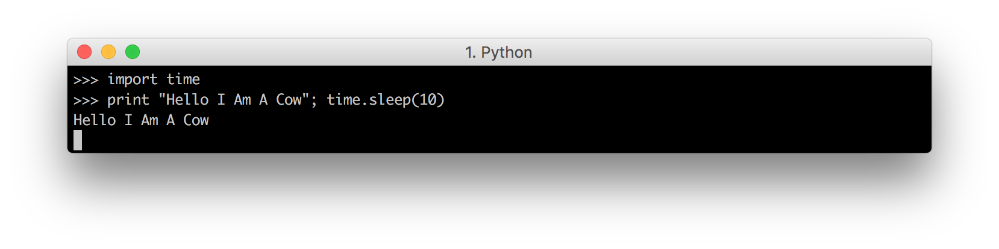

Then it prints the next prompt and moves our cursor to the right of it.

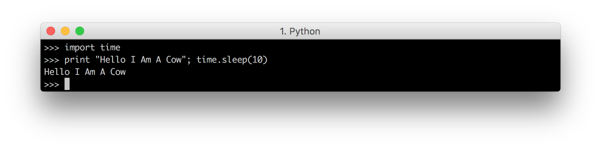

So that's the baseline of where the cursor already goes. What can we do with this?

#####Progress Indicator__

The easiest thing we can do with our cursor-navigation ./image escape codes is to make a loading prompt:

    
    
    import time, sys
    def loading():
        print "Loading..."
        for i in range(0, 100):
            time.sleep(0.1)
            sys.stdout.write(u"\u001b[1000D" + str(i + 1) + "%")
            sys.stdout.flush()
        print
    loading()
    

This prints the text from `1%` to `100%`, all on the same line since it uses `stdout.write` rather than `print`. However, before printing each percentage
it first prints `\u001b[1000D`, which means "move cursor left by 1000 characters). This should move it all the way to the left of the screen, thus
letting the new percentage that gets printed over-write the old one. Hence we see the loading percentage seamlessly changing from `1%` to `100%` before the
function returns:

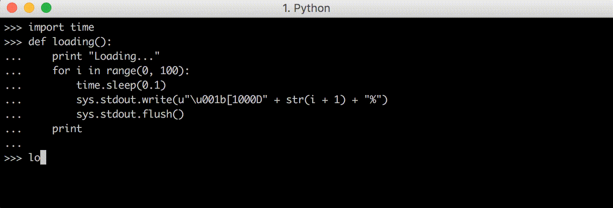

It might be a bit hard to visualize in your head where the cursor is moving, but we can easily slow it down and add more `sleep`s to make the code show us:

    
    
    import time, sys
    def loading():
        print "Loading..."
        for i in range(0, 100):
            time.sleep(1)
            sys.stdout.write(u"\u001b[1000D")
            sys.stdout.flush()
            time.sleep(1)
            sys.stdout.write(str(i + 1) + "%")
            sys.stdout.flush()
        print
    loading()
    

Here, we split up the `write` that writes the "move left" escape code, from the write that writes the percentage progress indicator. We also added a 1
second sleep between them, to give us a chance to see the cursors "in between" states rather than just the end result:

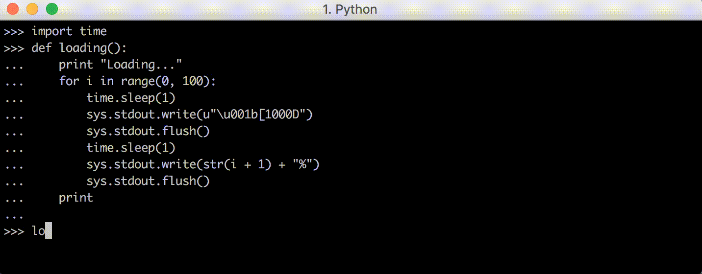

Now, we can see the cursor moving left to the edge of the screen, before the new printed percentage over-writes the old one.

#####ASCII Progress Bar__

Now that we know how to make a self-updating progress bar using ./image escape codes to control the terminal, it becomes relatively easy to modify it to be fancier, e.g. having a ASCII bar that goes across the screen:

    
    
    import time, sys
    def loading():
        print "Loading..."
        for i in range(0, 100):
            time.sleep(0.1)
            width = (i + 1) / 4
            bar = "[" + "#" * width + " " * (25 - width) + "]"
            sys.stdout.write(u"\u001b[1000D" +  bar)
            sys.stdout.flush()
        print
    loading()
    

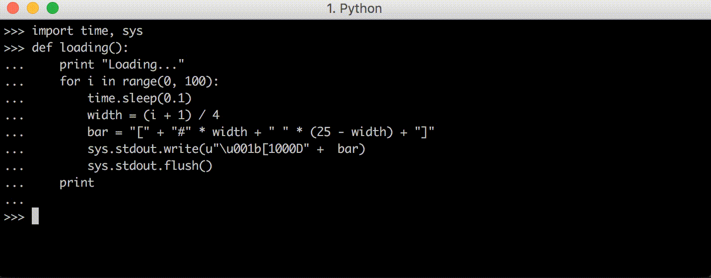

This works as you would expect: every iteration of the loop, the entire row is erased and a new version of the ASCII bar is drawn.

We could even use the **Up** and **Down** cursor movements to let us draw multiple progress bars at once:

    
    
    import time, sys, random
    def loading(count):
        all_progress = [0] * count
        sys.stdout.write("\n" * count) ##Make sure we have space to draw the bars
        while any(x < 100 for x in all_progress):
            time.sleep(0.01)
            ##Randomly increment one of our progress values
            unfinished = [(i, v) for (i, v) in enumerate(all_progress) if v < 100]
            index, _ = random.choice(unfinished)
            all_progress[index] += 1
            ##Draw the progress bars
            sys.stdout.write(u"\u001b[1000D") ##Move left
            sys.stdout.write(u"\u001b[" + str(count) + "A") ##Move up
            for progress in all_progress: 
                width = progress / 4
                print "[" + "#" * width + " " * (25 - width) + "]"
    loading()
    

In this snippet, we have to do several things we did not do earlier:

  * Make sure we have enough space to draw the progress bars! This is done by writing `"\n" * count` when the function starts. This creates a series of newlines that makes the terminal scroll, ensuring that there are exactly `count` blank lines at the bottom of the terminal for the progress bars to be rendered on

  * Simulated multiple things in progress with the `all_progress` array, and having the various slots in that array fill up randomly

  * Used the **Up** ansi code to move the cursor `count` lines up each time, so we can then print the `count` progress bars one per linee

And it works!

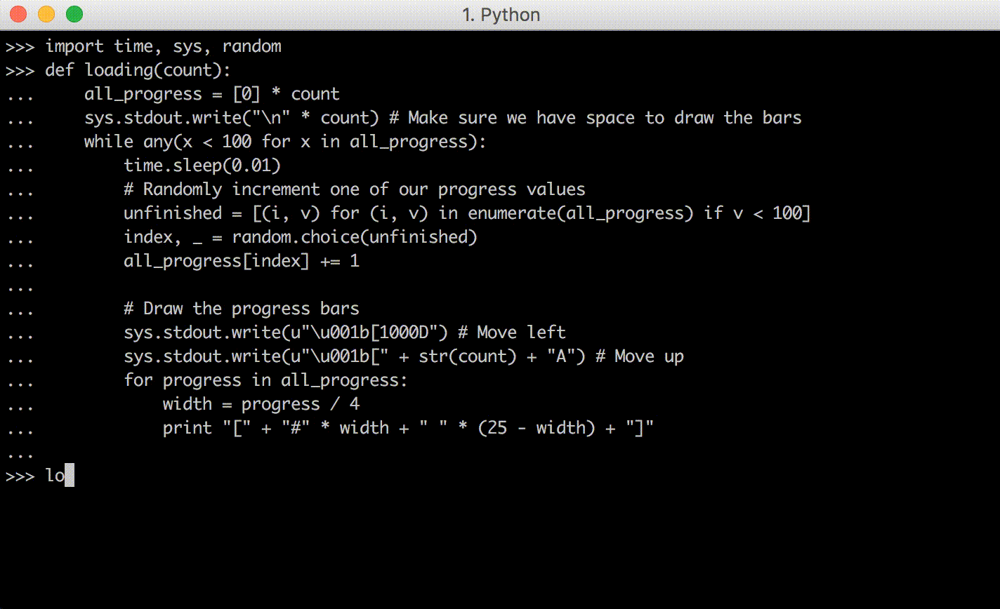

Perhaps next time you are writing a command line application that's downloading lots of files in parallel, or doing some similar kind of parallel
task, you could write a similar ./image-escape-code-based progress bar so the user can see how their command is progressing.

Of course, all these progress prompts so far are fake: they're not really monitoring the progress of any task. Nevertheless, they demonstrate how you can use ./image escape codes to put a dynamic progress indicator in any
command-line program you write, so when you _do_ have something whose progress you can monitor, you now have the ability to put fancy live-updating progress bars on it.

###Writing a Command Line__

One of the more fancy things you might do with ./image escape codes is to implement a command-line. Bash, Python, Ruby, all have their own in-built command line that lets you type out a command and edit its text before submitting it for execution. While it may seem special, in reality this command line is just another program that interacts with the terminal via ./image escape codes! Since we know how to use ./image escape codes, we can do it too and write our own command line.

####User Input__

The first thing we have to do with a command-line, which we haven't done so far, is to take user input. This can be done with the following code:

    
    
    import sys, tty
    def command_line():
        tty.setraw(sys.stdin)
        while True:
            char = sys.stdin.read(1)
            if ord(char) == 3: ##CTRL-C
                break;
            print ord(char)
            sys.stdout.write(u"\u001b[1000D") ##Move all the way left
    

In effect, we use `setraw` to make sure our raw character input goes straight into our process (without echoing or buffering or anything), and then reading
and echoing the character-codes we see until `3` appears (which is `CTRL-C`, the common command for existing a REPL). Since we've turned on `tty.setraw`
`print` doesn't reset the cursor to the left anymore, so we need to manually move left with `\u001b[1000D` after each `print`.

If you run this in the Python prompt (`CTRL-C` to exit) and try hitting some characters, you will see that:

  * `A` to `Z` are `65` to `90`, `a` to `z` are `97` to `122`
  * In fact, every character from `32` to `126` represents a [Printable Character](https://en.wikipedia.org/wiki/ASCII#Printable_characters)
  * (Left, Right, Up, Down) are (`27 91 68`, `27 91 67`, `27 91 65`, `27 91 66`). This might vary based on your terminal and operating system.
  * Enter is `13` or `10` (it varies between computers), Backspace is `127`

Thus, we can try making our first primitive command line that simply echoes whatever the user typed:

  * When the user presses a printable character, print it
  * When the user presses Enter, print out the user input at that point, a new line, and start a new empty input.
  * When a user presses Backspace, delete one character where-ever the cursor is
  * When the user presses an arrow key, move the cursor **Left** or **Right** using the ./image escape codes we saw above

This is obviously greatly simplified; we haven't even covered all the different kinds of [ASCII characters](https://en.wikipedia.org/wiki/ASCII)
that exist, nevermind all the
[Unicode](https://en.wikipedia.org/wiki/List_of_Unicode_characters) stuff!
Nevertheless it will be sufficient for a simple proof-of-concept.

####A Basic Command Line__

To begin with, let's first implement the first two features:

  * When the user presses a printable character, print it
  * When the user presses Enter, print out the user input at that point, a new line, and start a new empty input.

No Backspace, no keyboard navigation, none of that. That can come later.

The code for that comes out looking something like this:

    
    
    import sys, tty
    def command_line():
        tty.setraw(sys.stdin)
        while True: ##loop for each line
        ##Define data-model for an input-string with a cursor
            input = ""
            while True: ##loop for each character
                char = ord(sys.stdin.read(1)) ##read one char and get char code
                ##Manage internal data-model
                if char == 3: ##CTRL-C
                    return
                elif 32 <= char <= 126:
                    input = input + chr(char)
                elif char in {10, 13}:
                    sys.stdout.write(u"\u001b[1000D")
                    print "\nechoing... ", input
                    input = ""
                ##Print current input-string
                sys.stdout.write(u"\u001b[1000D")  ##Move all the way left
                sys.stdout.write(input)
                sys.stdout.flush()
    

Note how we

And you can see it working:

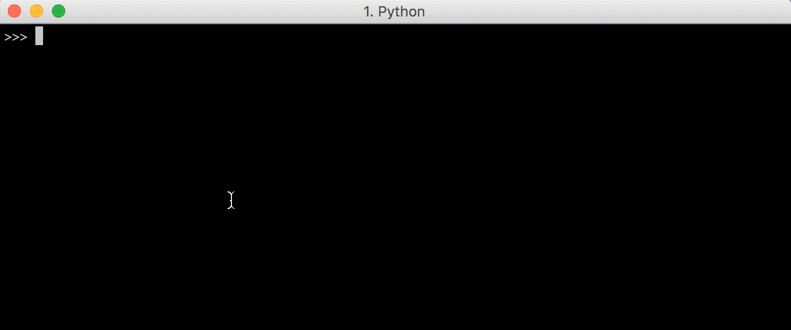

As we'd expect, arrow keys don't work and result in odd `[D [A [C [B` characters being printed, which correspond to the arrow key codes we saw above. We will get that working next. Nevertheless, we can enter text and then submit it with Enter.

Paste this into your own Python prompt to try it out!

####Cursor Navigation__

The next step would be to let the user move the cursor around using arrow-keys. This is provided by default for Bash, Python, and other command-lines, but as we are implementing our own command line here we have to do it ourselves. We know that the arrow keys **Left** and **Right** correspond to the sequences of character-codes `27 91 68`, `27 91 67`, so we can put in code
to check for those and appropiately move the cursor `index` variable

    
    
    import sys, tty
    def command_line():
        tty.setraw(sys.stdin)
        while True: ##loop for each line
        ##Define data-model for an input-string with a cursor
            input = ""
            index = 0
            while True: ##loop for each character
                char = ord(sys.stdin.read(1)) ##read one char and get char code
                ##Manage internal data-model
                if char == 3: ##CTRL-C
                    return
                elif 32 <= char <= 126:
                    input = input[:index] + chr(char) + input[index:]
                    index += 1
                elif char in {10, 13}:
                    sys.stdout.write(u"\u001b[1000D")
                    print "\nechoing... ", input
                    input = ""
                    index = 0
                elif char == 27:
                    next1, next2 = ord(sys.stdin.read(1)), ord(sys.stdin.read(1))
                    if next1 == 91:
                        if next2 == 68: ##Left
                            index = max(0, index - 1)
                        elif next2 == 67: ##Right
                            index = min(len(input), index + 1)
                ##Print current input-string
                sys.stdout.write(u"\u001b[1000D") ##Move all the way left
                sys.stdout.write(input)
                sys.stdout.write(u"\u001b[1000D") ##Move all the way left again
                if index > 0:
                    sys.stdout.write(u"\u001b[" + str(index) + "C") ##Move cursor too index
                sys.stdout.flush()
    

The three main changes are:

  * We now maintain an `index` variable. Previously, the cursor was always at the right-end of the `input`, since you couldn't use arrow keys to move it left, and new input was always appended at the right-end. Now, we need to keep a separate `index` which is not necessarily at the end of the `input`, and when a user enters a character we splice it into the `input` in the correct location.

  * We check for `char == 27`, and then also check for the next two characters to identify the **Left** and **Right* arrow keys, and increment/decrement the `index` of our cursor (making sure to keep it within the `input` string.

  * After writing the `input`, we now have to manually move the cursor all the way to the left and move it rightward the correct number of characters corresponding to our cursor `index`. Previously the cursor was always at the right-most point of our `input` because arrow keys didn't work, but now the cursor could be anywhere.

As you can see, it works:

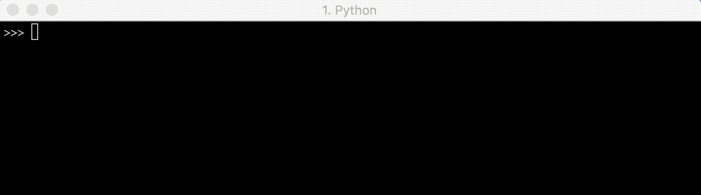

It would take more effort to make **Home** and **End** (or **Fn-Left** and **Fn-Right**) work, as well as Bash-like shortcuts like **Esc-f** and **Esc-B**, but there's nothing in principle difficult about those: you just need to write down the code-sequences they produce the same way we did at the start of this section, and make them change our cursor `index` appropriately.

####Deletion__

The last thing on our feature list to implement is deletion: using **Backspace** should cause one character before the cursor to disappear, and move the cursor left by 1. This can be done naively by inserting an

    
    
    + elif char == 127:
    +     input = input[:index-1] + input[index:]
    +     index -= 1
    

Into our conditional. This works, somewhat, but not entirely as expected:

As you can see, the deletion works, in that after I delete the characters, they are no longer echoed back at me when I press **Enter** to submit.
However, the characters are still sitting their _on screen_ even as I delete them! At least until they are over-written with _new_ characters, as can be seen in the third line in the above example.

The problem is that so far, we have never actually cleared the entire line:
we've always just written the new characters over the old characters, assuming that the string of new characters would be longer and over-write them. This is
no longer true once we can delete characters.

A fix is to use the **Clear Line** ./image escape code `\u001b[0K`, one of a set of ./image escape codes which lets you clear various portions of the terminal:

  * **Clear Screen**: `\u001b[{n}J` clears the screen 
    * `n=0` clears from cursor until end of screen,
    * `n=1` clears from cursor to beginning of screen
    * `n=2` clears entire screen
  * **Clear Line**: `\u001b[{n}K` clears the current line 
    * `n=0` clears from cursor to end of line
    * `n=1` clears from cursor to start of line
    * `n=2` clears entire line

This particular code:

    
    
    + sys.stdout.write(u"\u001b[0K")
    

Clears all characters from the cursor to the end of the line. That lets us make sure that when we delete and re-print a shorter input after that, any "leftover" text that we're not over-writing still gets properly cleared from the screen.

The final code looks like:

    
    
    import sys, tty
    def command_line():
        tty.setraw(sys.stdin)
        while True: ##loop for each line
        ##Define data-model for an input-string with a cursor
            input = ""
            index = 0
            while True: ##loop for each character
                char = ord(sys.stdin.read(1)) ##read one char and get char code
                ##Manage internal data-model
                if char == 3: ##CTRL-C
                    return
                elif 32 <= char <= 126:
                    input = input[:index] + chr(char) + input[index:]
                    index += 1
                elif char in {10, 13}:
                    sys.stdout.write(u"\u001b[1000D")
                    print "\nechoing... ", input
                    input = ""
                    index = 0
                elif char == 27:
                    next1, next2 = ord(sys.stdin.read(1)), ord(sys.stdin.read(1))
                    if next1 == 91:
                        if next2 == 68: ##Left
                            index = max(0, index - 1)
                        elif next2 == 67: ##Right
                            index = min(len(input), index + 1)
                elif char == 127:
                    input = input[:index-1] + input[index:]
                    index -= 1
                ##Print current input-string
                sys.stdout.write(u"\u001b[1000D") ##Move all the way left
                sys.stdout.write(u"\u001b[0K")    ##Clear the line
                sys.stdout.write(input)
                sys.stdout.write(u"\u001b[1000D") ##Move all the way left again
                if index > 0:
                    sys.stdout.write(u"\u001b[" + str(index) + "C") ##Move cursor too index
                sys.stdout.flush()
    

And i you paste this into the command-line, it works!

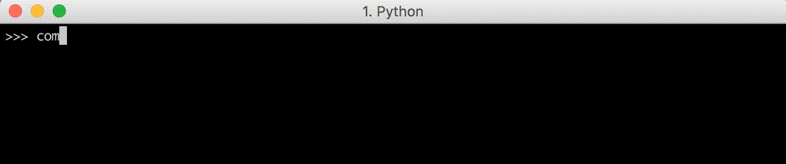

At this point, it's worth putting some `sys.stdout.flush(); time.sleep(0.2);`s
into the code, after every `sys.stdout.write`, just to see it working. If you do that, you will see something like this:

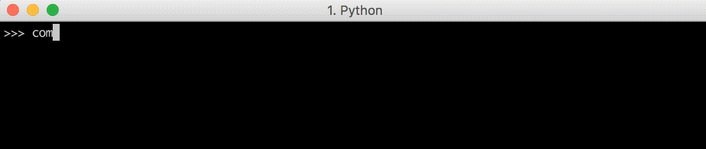

Where it is plainly obvious each time you enter a character,

  * The cursor moves to the start of the line `sys.stdout.write(u"\u001b[1000D")`
  * The line is cleared `sys.stdout.write(u"\u001b[0K")`
  * The current input is written `sys.stdout.write(input)`
  * The cursor is moved again to the start of the line `sys.stdout.write(u"\u001b[1000D")`
  * The cursor is moved to the correct index `sys.stdout.write(u"\u001b[" \+ str(index) + "C")`

Normally, when you are using this code, it all happens instantly when `.flush()` is called. However, it is still valuable to see what is actually going on, so that you can understand it when it works and debug it when it misbehaves!

####Completeness?__

We now have a minimal command-line, implemented ourselves using `sys.stdin.read` and `sys.stdout.write`, using ANSI escape codes to control
the terminal. It is missing out a lot of functionality and hotkeys that "standard" command-lines provide, things like:

  * `Alt-f` to move one word right
  * `Alt-b` to move one word left
  * `Alt-Backspace` to delete one word on the left
  * ...many other command command-line hotkeys, some of which are listed [here](http://www.bigsmoke.us/readline/shortcuts)

And currently isn't robust enough to work with e.g. multi-line input strings, single-line input strings that are long enough to wrap, or display a
customizable prompt to the user.

Nevertheless, implementing support for those hotkeys and robustness for various edge-case inputs is just more of the same: picking a use case that doesn't work, and figuring out the right combination of internal logic and ANSI escape codes to make the terminal behave as we'd expect.

There are other terminal commands that would come in useful; Wikipedia's
[table of escape codes](https://en.wikipedia.org/wiki/ANSI_escape_code#CSI_codes) is a good listing (the _CSI_ in that table corresponds to the `\u001b` in our code) but here are some useful ones:

  * **Up**: `\u001b[{n}A` moves cursor up by `n`
  * **Down**: `\u001b[{n}B` moves cursor down by `n`
  * **Right**: `\u001b[{n}C` moves cursor right by `n`
  * **Left**: `\u001b[{n}D` moves cursor left by `n`

* * *

  * **Next Line**: `\u001b[{n}E` moves cursor to beginning of line `n` lines down
  * **Prev Line**: `\u001b[{n}F` moves cursor to beginning of line `n` lines down

* * *

  * **Set Column**: `\u001b[{n}G` moves cursor to column `n`
  * **Set Position**: `\u001b[{n};{m}H` moves cursor to row `n` column `m`

* * *

  * **Clear Screen**: `\u001b[{n}J` clears the screen 
    * `n=0` clears from cursor until end of screen,
    * `n=1` clears from cursor to beginning of screen
    * `n=2` clears entire screen
  * **Clear Line**: `\u001b[{n}K` clears the current line 
    * `n=0` clears from cursor to end of line
    * `n=1` clears from cursor to start of line
    * `n=2` clears entire line

* * *

  * **Save Position**: `\u001b[{s}` saves the current cursor position
  * **Save Position**: `\u001b[{u}` restores the cursor to the last saved position

* * *

These are some of the tools you have available when trying to control the cursor and terminal, and can be used for all sorts of things: implementing terminal games, command-lines, text-editors like Vim or Emacs, and other things. Although it is sometimes confusing what exactly the control codes are doing, adding `time.sleep`s after each control code. So for now, let's call this "done"...

###Customizing your Command Line__

If you've reached this far, you've worked through colorizing your output, writing various dynamic progress indicators, and finally writing a small,
bare-bones command line using ./image escape codes that echoes user input back at them. You may think these three tasks are in descending order of usefulness: colored input is cool, but who needs to implement their own command-line when every programming language already has one? And there are plenty of libraries like
[Readline](https://en.wikipedia.org/wiki/GNU_Readline) or [JLine](https://github.com/jline/jline2) that do it for you?

It turns out, that in 2016, there still are valid use cases for re-implementing your own command-line. Many of the existing command-line libraries aren't very flexible, and can't support basic use cases like syntax-highlighting your input. If you want interfaces common in web/desktop programs, like drop-down menus or `Shift-Left` and `Shift-Right` to highlight
and select parts of your input, most existing implementations will leave you out of luck.

However, now that we have our own from-scratch implementation, syntax highlighting is as simple as calling a `syntax_highlight` function on our
`input` string to add the necessary color-codes before printing it::

    
    
    +            sys.stdout.write(syntax_highlight(input))
    -            sys.stdout.write(input)
    

To demonstrate I'm just going to use a dummy syntax highlighter that
highlights trailing whitespace; something many programmers hate.

That's as simple as:

    
    
    def syntax_highlight(input):
       stripped = input.rstrip()
       return stripped + u"\u001b[41m" + " " *  (len(input) - len(stripped)) + u"\u001b[0m" 
    

And there you have it!

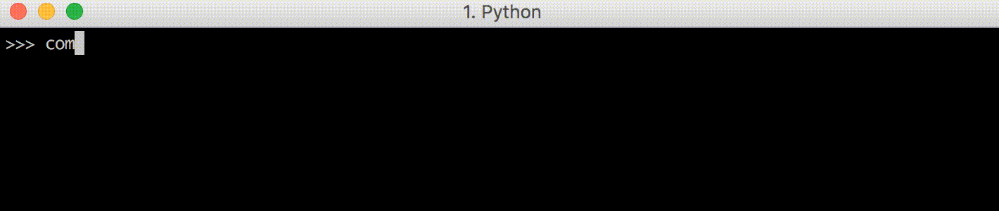

Again, this is a minimal example, but you could imagine swapping out this `syntax_highlight` implementation for something like [Pygments](http://pygments.org/), which can perform real syntax highlighting on almost any programming language you will be writing a command-line for.
Just like that, we've added customizable syntax highlighting in just a few lines of Python code. Not bad!

The complete code below, if you want to copy-paste it to try it out yourself:

    
    
    import sys, tty
    def syntax_highlight(input):
        stripped = input.rstrip()
        return stripped + u"\u001b[41m" + " " *  (len(input) - len(stripped)) + u"\u001b[0m"
    def command_line():
        tty.setraw(sys.stdin)
        while True: ##loop for each line
            ##Define data-model for an input-string with a cursor
            input = ""
            index = 0
            while True: ##loop for each character
                char = ord(sys.stdin.read(1)) ##read one char and get char code
                ##Manage internal data-model
                if char == 3: ##CTRL-C
                    return
                elif 32 <= char <= 126:
                    input = input[:index] + chr(char) + input[index:]
                    index += 1
                elif char in {10, 13}:
                    sys.stdout.write(u"\u001b[1000D")
                    print "\nechoing... ", input
                    input = ""
                    index = 0
                elif char == 27:
                    next1, next2 = ord(sys.stdin.read(1)), ord(sys.stdin.read(1))
                    if next1 == 91:
                        if next2 == 68: ##Left
                            index = max(0, index - 1)
                        elif next2 == 67: ##Right
                            index = min(len(input), index + 1)
                elif char == 127:
                    input = input[:index-1] + input[index:]
                    index -= 1
                ##Print current input-string
                sys.stdout.write(u"\u001b[1000D")
                sys.stdout.write(u"\u001b[0K")
                sys.stdout.write(syntax_highlight(input))
                sys.stdout.write(u"\u001b[1000D")
                if index > 0:
                    sys.stdout.write(u"\u001b[" + str(index) + "C")
                sys.stdout.flush()
    

Apart from syntax-highlighting, now that we have our own relatively-simple DIY-command-line, a whole space of possibilities opens up: creating drop-down
menus is just a matter of navigating the cursor into the right place and printing the right things. Implementing`Shift-Left` and `Shift-Right` to
highlight and select text is just a matter of recognizing the correct input codes (`27 91 49 59 50 68` and `27 91 49 59 50 67` on Mac-OSX/iTerm) and
applying some background color or reversing the colors for that snippet before printing.

It may be tedious to implement, but it's all straightforward: once you're familiar with the basic ./image codes you can use to interact with the terminal, any feature you want is just a matter of writing the code to make it happen.

###Conclusion__

This sort of "rich" interaction to your command-line programs is something that most traditional command-line programs and libraries lack. Adding syntax
highlighting to [Readline](https://en.wikipedia.org/wiki/GNU_Readline) would definitely take more than four lines of code! But with your own implementation, everything is possible.

More recently, there are a new wave of command-line libraries like the [Python Prompt Toolkit](https://github.com/jonathanslenders/python-prompt-toolkit),
the [Fish Shell](https://fishshell.com/) and the [Ammonite Scala REPL](http://www.lihaoyi.com/Ammonite/) (My own project) that provide a richer
command-line experience than traditional [Readline](https://en.wikipedia.org/wiki/GNU_Readline)/[JLine](https://github.com/jline/jline2) based command-lines, with features like syntax-highlighted input and multi-line editing:

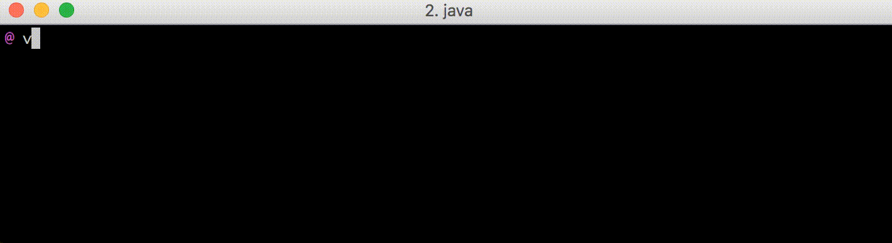

And desktop-style `Shift-Left`/`Shift-Right` selection, and IDE-style block-indenting or de-denting with `Tab` and `Shift-Tab`:

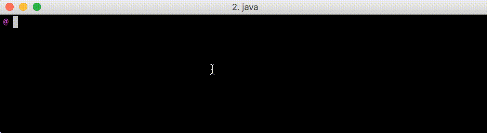

To build tools like that, you yourself need to understand the various ways you can directly interface with the terminal. While the minimal command-line we
implemented above is obviously incomplete and not robust, it is straightforward (if tedious) to flesh out the few-dozen features most people expect a command-line to have. After that, you're on par with what's out
there, and you are free to implement more features and rich interactions beyond what existing libraries like [Readline](https://en.wikipedia.org/wiki/GNU_Readline)/[Jline](https://github.com/jline/jline2) provide.

Perhaps you want to implement a new
[REPL](https://en.wikipedia.org/wiki/Read%E2%80%93eval%E2%80%93print_loop) for a language that doesn't have one? Perhaps you want to write a better REPL to replace an existing one, with richer features and interactions? Perhaps you like what the [Python Prompt Toolkit](https://github.com/jonathanslenders/python-prompt-toolkit) provides for writing rich command-lines in Python, and want the same functionality in Javascript? Or perhaps you've decided to implement your own command-line text editor like
[Vim](https://en.wikipedia.org/wiki/Vim_\(text_editor\)) or
[Emacs](https://en.wikipedia.org/wiki/Emacs), but better?

It turns out, learning enough about ./image escape codes to implement your own rich terminal interface is not nearly as hard as it may seem initially. With a
relatively small number of control commands, you can implement your own rich command-line interfaces, and bring progress to what has been a relatively
backward field in the world of software engineering.

Have you ever found yourself needing to use these ./image escape codes as part of your command-line programs? What for? Let us know in the comments below!

* * *

**About the Author:**_ Haoyi is a software engineer, an early contributor to [Scala.js](http://www.scala-js.org/), and the author of many open-source Scala tools such as the [Ammonite REPL](lihaoyi.com/Ammonite) and [FastParse](https://github.com/lihaoyi/fastparse). _

_If you've enjoyed this blog, or enjoyed using Haoyi's other open source
libraries, please chip in (or get your Company to chip in!) via
[Patreon](https://www.patreon.com/lihaoyi) so he can continue his open-source
work_

* * *

__[ Strategic Scala Style: Designing
Datatypes](StrategicScalaStyleDesigningDatatypes.html)[Scala Scripting and the
15 Minute Blog Engine __](ScalaScriptingandthe15MinuteBlogEngine.html)

* * *

_Updated [2016-07-02 ](https://github.com/lihaoyi/blog/commit/84608ca37be4f563
726cb18b0494bd26d1359823)[2016-07-02 ](https://github.com/lihaoyi/blog/commit/
0ed800ba3f0c8648429628e142eeb1f9f391df3d)_

