 
<!--BEGIN_DATA
{
    "create_date": "2023-12-25 20:00", 
    "modify_date": "2023-12-25 20:00", 
    "is_top": "0", 
    "summary": "C++ folly库解读（一） Fbstring —— 一个完美替代std::string的库(上)<br/>C++ folly库解读（一） Fbstring —— 一个完美替代std::string的库(下)", 
    "tags": "C/C++", 
    "file_name": "C++ folly库解读01.md"
}
END_DATA-->

#### <p>原文出处：<a href='https://mp.weixin.qq.com/s/tR9G_mpZTBlas_-ZL03nHA' target='blank'>C++ folly库解读（一） Fbstring —— 一个完美替代std::string的库(上)</a></p>

  * string 常见的三种实现方式

    * eager copy
    * COW
    * SSO
    * 
  * Fbstring 介绍

    * Storage strategies
    * Implementation highlights
    * Benchmark
  
  * 主要类

  * 字符串存储数据结构

    * small strings
    * medium strings
    * large strings

  * 如何区分字符串类型 category

    * 小端
    * 大端
    * small strings
    * medium strings
    * large strings
    * category()
    * capacity()
    * size()
  
  * 字符串初始化

    * initSmall
    * initMedium
    * initLarge
    * 特殊的构造函数 —— 不拷贝用户传入的字符串

在引入fbstring[1]之前，我们首先再回顾一下 string 常见的三种实现方式。

## string 常见的三种实现方式

string 中比较重要的 3 个字段：

  * `char *data`. 指向存放字符串的首地址（在 SSO 的某些实现方案中可能没有此字段）。
  * `size_t size`. 字符串长度。
  * `size_t capacity`. 字符串容量。capacity >= size. 在字符串相加、reserve 等场景下会用到此字段。

### eager copy

这个是最简单、最好理解的一种，在每次拷贝时将原 string 对应的内存以及所持有的动态资源完整地复制一份，即没有任何特殊处理。

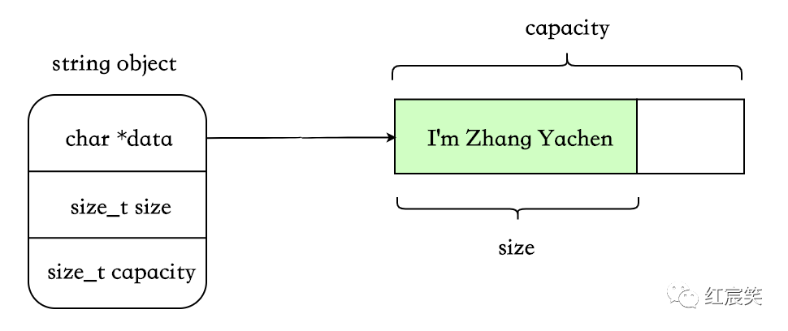

优点：

  * 实现简单。
  * 每个对象互相独立，不用考虑那么多乱七八糟的场景。

缺点：

  * 字符串较大时，拷贝浪费空间。

### COW

这个也算是计算机里的基本思想了。不同于 eager copy 的每次拷贝都会复制，此种实现方式为写时复制，即 copy-on-write。只有在某个 string 要对共享对象进行修改时，才会真正执行拷贝。

由于存在共享机制，所以需要一个`std::atomic<size_t>`，代表被多少对象共享。

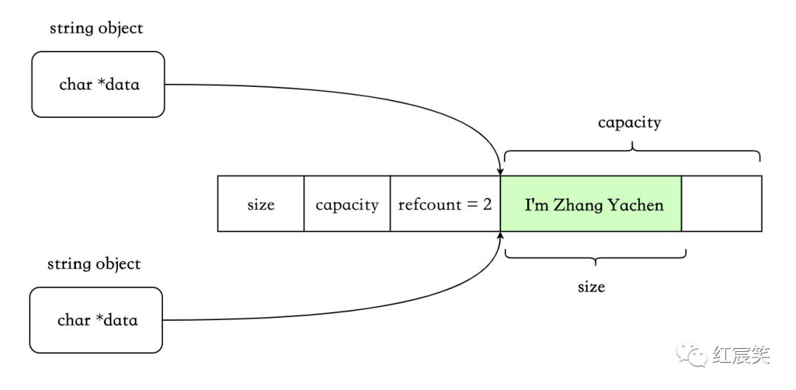

写时复制：

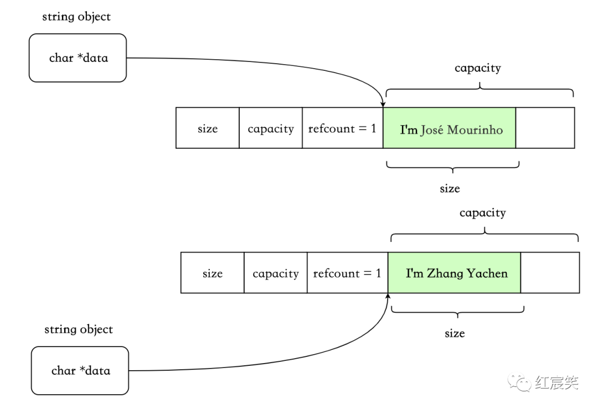

优点：

  * 字符串空间较大时，减少了分配、复制字符串的时间。

缺点：

  * refcount 需要原子操作，性能有损耗。
  * 某些情况下会带来意外的开销。比如非 const 成员使用`[]`，这会触发 COW，因为无法知晓应用程序是否会对返回的字符做修改。典型的如Legality of COW std::string implementation in C++11[2]中举的例子：

```cpp
std::string s("str");  
const char* p = s.data();  
{  
    std::string s2(s);  
    (void) s[0];         // 触发COW  
}  
std::cout << *p << '\n';      // p指向的原有空间已经无效  
```

  * 其他更细节的缺点可以参考：std::string 的 Copy-on-Write：不如想象中美好[3]

### SSO

Small String Optimization. **基于字符串大多数比较短的特点**，利用 string 对象本身的栈空间来存储短字符串。而当字符串长度大于某个临界值时，则使用 eager copy 的方式。

SSO 下，string 的数据结构会稍微复杂点，使用 union 来区分短字符串和长字符串的场景：

```cpp
class string {  
  char *start;  
  size_t size;  
  static const int kLocalSize = 15;  
  union{  
    char buffer[kLocalSize+1];      // 满足条件时，用来存放短字符串  
    size_t capacity;  
  }data;  
};  
```

短字符串，SSO：

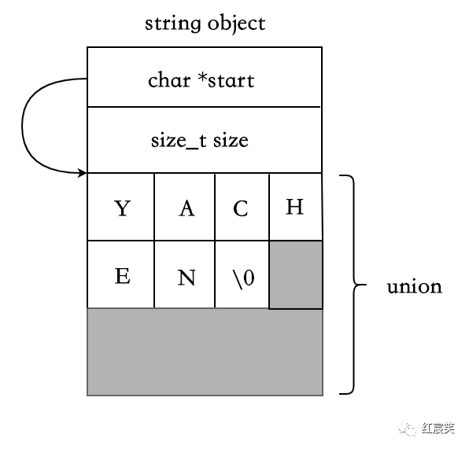

长字符串，eager copy：

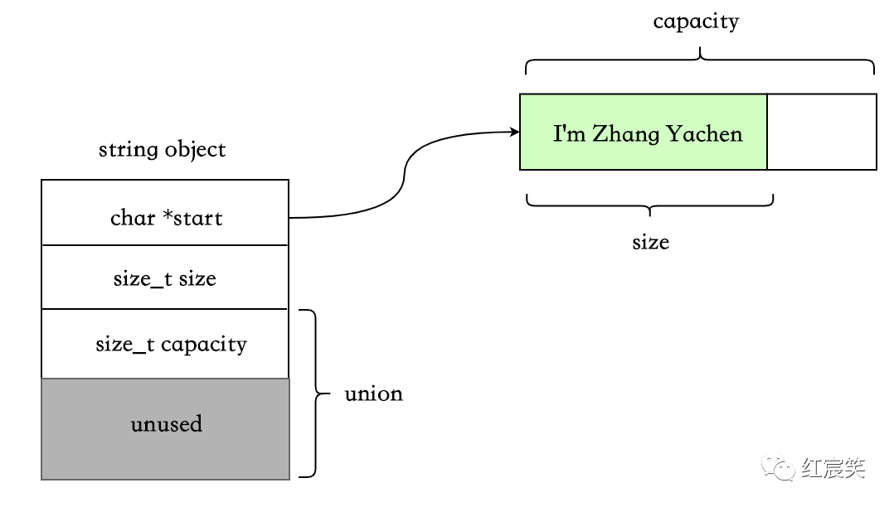

这种数据结构的实现下，SSO 的阈值一般是 15 字节。folly 的 fbstring 在 SSO 场景下，数据结构做了一些优化，可以存储 23 个字节，后面会提到。

优点：

  * 短字符串时，无动态内存分配。

缺点：

  * string 对象占用空间比 eager copy 和 cow 要大。

## Fbstring 介绍

fbstring 可以 100%兼容 std::string。配合三种存储策略和jemalloc[4]，可以显著的提高 string 的性能。

fbstring 支持 32-bit、64-bit、little-endian、big-endian.

### Storage strategies

  * Small Strings (<= 23 chars) ，使用 SSO.
  * Medium strings (24 - 255 chars)，使用 eager copy.
  * Large strings (> 255 chars)，使用 COW.

### Implementation highlights

  * 与 std::string 100%兼容。
  * COW 存储时对于引用计数线程安全。
  * 对 Jemalloc 友好。如果检测到使用 jemalloc，那么将使用 jemalloc 的一些非标准扩展接口来提高性能。
  * `find()`使用简化版的Boyer-Moore algorithm[5]。在查找成功的情况下，相对于`string::find()`有 30 倍的性能提升。在查找失败的情况下也有 1.5 倍的性能提升。
  * 可以与 std::string 互相转换。

### Benchmark

在FBStringBenchmark.cpp[6]中。

## 主要类

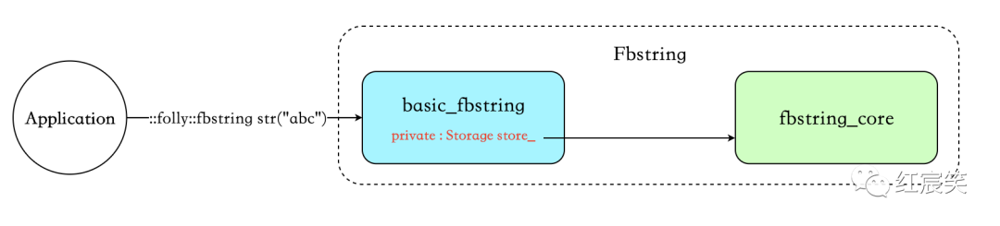

  * `::folly::fbstring str("abc")`中的 fbstring 为 basic_fbstring的别名 ：`typedef basic_fbstring<char> fbstring;`
  * `basic_fbstring` 在 `fbstring_core` 提供的接口之上，实现了 std::string 定义的所有接口。里面有一个私有变量 `store_`，默认值即为 `fbstring_core``。basic_fbstring` 的定义如下，比 `std::basic_string` 只多了一个默认的模板参数 Storage：

```cpp
template <  
    typename E,  
    class T = std::char_traits<E>,  
    class A = std::allocator<E>,  
    class Storage = fbstring_core<E>>  
class basic_fbstring;  
```

  * `fbstring_core` 负责字符串的存储及字符串相关的操作，例如 init、copy、reserve、shrink 等等。

## 字符串存储数据结构

最重要的 3 个数据结构 `union{Char small*, MediumLarge ml*}`、MediumLarge、RefCounted，定义在`fbstring_core` 中，基本上所有的字符串操作都离不开这三个数据结构。

```cpp
struct RefCounted {  
    std::atomic<size_t> refCount_;  
    Char data_[1];  
    static RefCounted * create(size_t * size);       // 创建一个RefCounted  
    static RefCounted * create(const Char * data, size_t * size);     // ditto  
    static void incrementRefs(Char * p);     // 增加一个引用  
    static void decrementRefs(Char * p);    // 减少一个引用  
    // 其他函数定义  
}
;  
struct MediumLarge {  
  Char* data_;  
  size_t size_;  
  size_t capacity_;  

  size_t capacity() const {  
    return kIsLittleEndian ? capacity_ & capacityExtractMask : capacity_ >> 2;  
  } 

  void setCapacity(size_t cap, Category cat) {  
    capacity_ = kIsLittleEndian  
        ? cap | (static_cast<size_t>(cat) << kCategoryShift)  
        : (cap << 2) | static_cast<size_t>(cat);  
  }  
};  

union {  
    uint8_t bytes_[sizeof(MediumLarge)];          // For accessing the last byte.  
    Char small_[sizeof(MediumLarge) / sizeof(Char)];  
    MediumLarge ml_;  
};  
```

  * small strings（SSO）时，使用 union 中的 `Char small_`存储字符串，即对象本身的栈空间。
  * medium strings（eager copy）时，使用 union 中的`MediumLarge ml_`
    * `Char* data_` ：指向分配在堆上的字符串。
    * `size_t size_`：字符串长度。
    * `size_t capacity_` ：字符串容量。
  * large strings（cow）时， 使用`MediumLarge ml_`和 `RefCounted`：
    * `RefCounted.refCount_ `：共享字符串的引用计数。
    * `RefCounted.data_[1]` : **flexible array.** 存放字符串。
    * `ml*.data_`指向 `RefCounted.data_`，`ml*.size_`与 ml_.capacity_的含义不变。

但是这里有一个问题是：SSO 情况下的 size 和 capacity 存在哪里了？

  * capacity : 首先 SSO 的场景并不需要 capacity，因为此时利用的是栈空间，或者理解此种情况下的 capacity=maxSmallSize.
  * size : 利用 small_的一个字节来存储 size，**而且具体存储的不是 size，而是`maxSmallSize - s`**（maxSmallSize=23，再转成 char 类型），因为这样可以 SSO 多存储一个字节，具体原因后面详细讲。

### small strings :

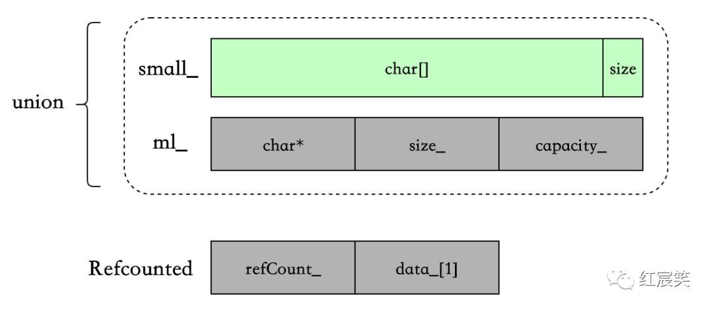

### medium strings :

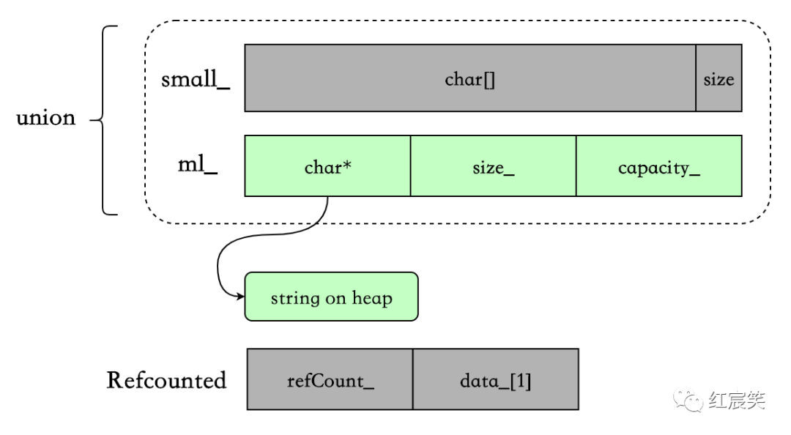

### large strings :

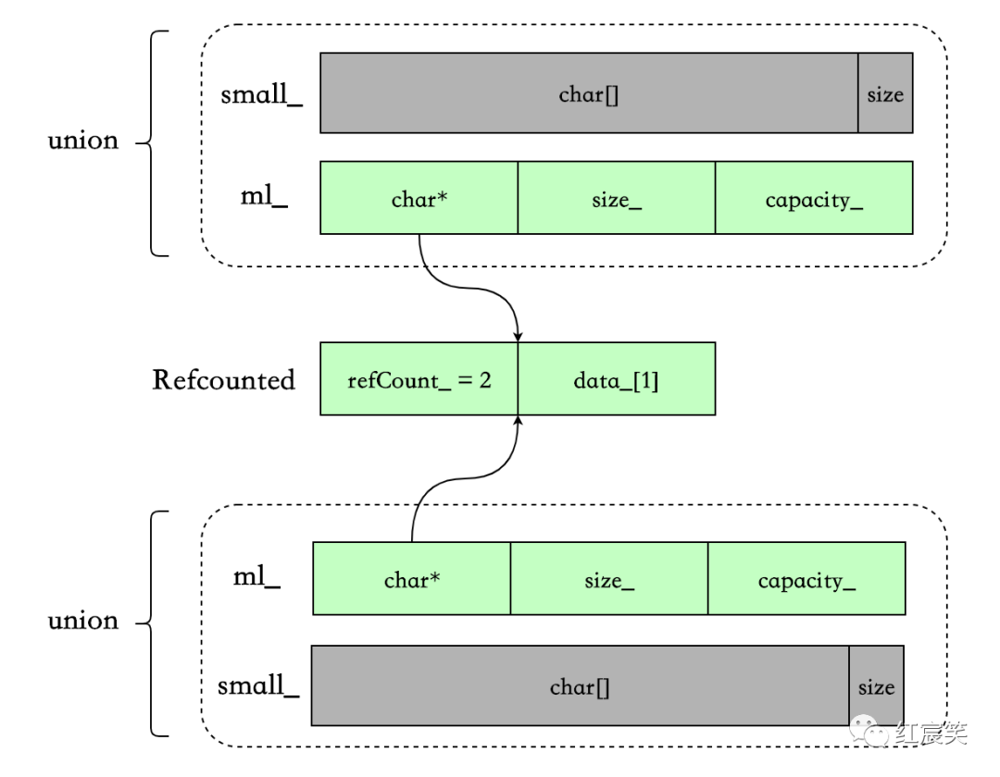

## 如何区分字符串类型 category

字符串的 small/medium/large 类型对外部透明，而且针对字符串的各种操作例如 copy、shrink、reserve、赋值等等，三种类型的处理方式都不一样，**所以，我们需要在上面的数据结构中做些“手脚”，来区分不同的字符串类型。**

因为只有三种类型，所以只需要 2 个 bit 就能够区分。相关的数据结构为：

```cpp
typedef uint8_t category_type;  
enum class Category : category_type {  
    isSmall = 0,  
    isMedium = kIsLittleEndian ? 0x80 : 0x2,       //  10000000 , 00000010  
    isLarge = kIsLittleEndian ? 0x40 : 0x1,        //  01000000 , 00000001  
};  
```

kIsLittleEndian 为判断当前平台的大小端，大端和小端的存储方式不同。

### small strings

category 与 size 共同存放在 small_的最后一个字节中（size 最大为 23，所以可以存下），考虑到大小端，所以有移位操作，这主要是为了让 category()的判断更简单，后面再详细分析。具体代码在 setSmallSize 中：

```cpp
void setSmallSize(size_t s) {  
  ......  
  constexpr auto shift = kIsLittleEndian ? 0 : 2;  
  small_[maxSmallSize] = char((maxSmallSize - s) << shift);  
  ......  
}  
```

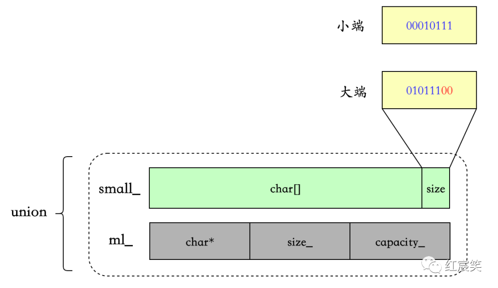

### medium strings

可能有人注意到了，在 MediumLarge 结构体中定义了两个方法，`capacity()`和`setCapacity(size_t cap,
Category cat)`，其中 setCapacity 即同时设置 capacity 和 category :

```cpp
constexpr static size_t kCategoryShift = (sizeof(size_t) - 1) * 8;  
void setCapacity(size_t cap, Category cat) {  
    capacity_ = kIsLittleEndian  
        ? cap | (static_cast<size_t>(cat) << kCategoryShift)  
        : (cap << 2) | static_cast<size_t>(cat);  
}  
```

  * 小端时，将 category = isMedium = 0x80 向左移动`(sizeof(size_t) - 1) * 8`位，即移到最高位的字节中，再与 capacity 做或运算。
  * 大端时，将 category = isMedium = 0x2 与 cap << 2 做或运算即可，左移 2 位的目的是给 category 留空间。

举个例子，假设 64 位机器，capacity = 100 :

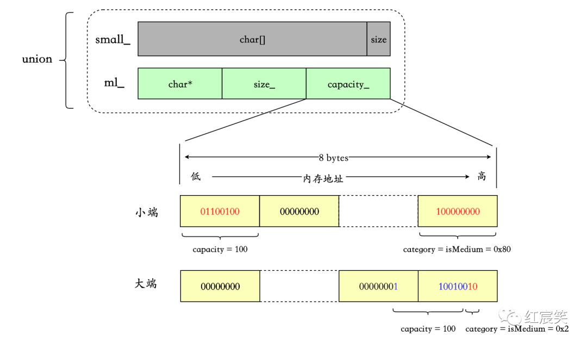

### large strings

同样使用 MediumLarge 的 setCapacity，算法相同，只是 category 的值不同。

假设 64 位机器，capacity = 1000 ：

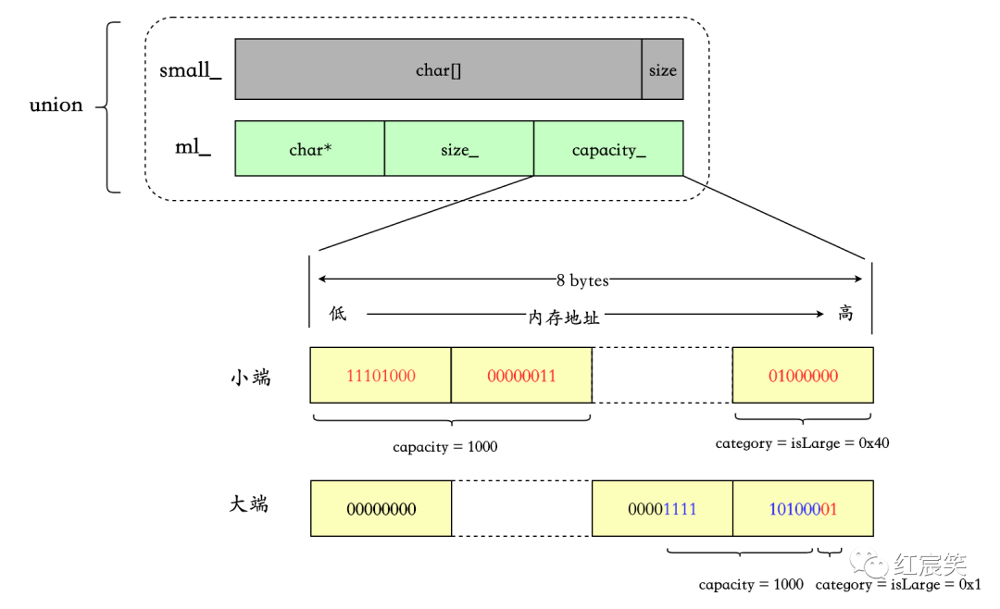

### category()

`category()`为最重要的函数之一，作用是获取字符串的类型：

```cpp
constexpr static uint8_t categoryExtractMask = kIsLittleEndian ? 0xC0 : 0x3;    // 11000000 , 00000011  
constexpr static size_t lastChar = sizeof(MediumLarge) - 1;  

union {  
    uint8_t bytes_[sizeof(MediumLarge)];          // For accessing the last byte.  
    Char small_[sizeof(MediumLarge) / sizeof(Char)];  
    MediumLarge ml_;  
};  

Category category() const {  
  // works for both big-endian and little-endian  
  return static_cast<Category>(bytes_[lastChar] & categoryExtractMask);  
}  
```

bytes_定义在 union 中，从注释可以看出来，是为了配合 lastChar 更加方便的取该结构最后一个字节。

配合上面三种类型字符串的存储，可以很容易理解这一行代码。

#### 小端

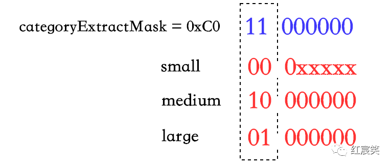

#### 大端

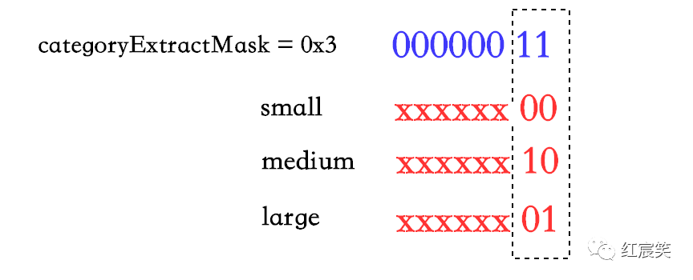

### capacity()

获取字符串的 capaticy，因为 capacity 与 category 存储都在一起，所以一起看比较好。

同样分三种情况。

```cpp
size_t capacity() const {  
  switch (category()) {  
    case Category::isSmall:  
      return maxSmallSize;  
    case Category::isLarge:  
      // For large-sized strings, a multi-referenced chunk has no  
      // available capacity. This is because any attempt to append  
      // data would trigger a new allocation.  
      if (RefCounted::refs(ml_.data_) > 1) {  
        return ml_.size_;  
      }  
      break;  
    case Category::isMedium:  
    default:  
      break;  
  }  
  return ml_.capacity();  
}  
```

  * small strings : 直接返回 maxSmallSize，前面有分析过。
  * medium strings : 返回 `ml_.capacity()`。
  * large strings :
    * 当字符串引用大于 1 时，直接返回 size。因为此时的 capacity 是没有意义的，任何 append data 操作都会触发一次 cow
    * 否则，返回 `ml_.capacity()`。

看下 ml.capacity() :

```cpp
constexpr static uint8_t categoryExtractMask = kIsLittleEndian ? 0xC0 : 0x3;  
constexpr static size_t kCategoryShift = (sizeof(size_t) - 1) * 8; 

constexpr static size_t capacityExtractMask = kIsLittleEndian  
      ? ~(size_t(categoryExtractMask) << kCategoryShift)  
      : 0x0 /* unused */;  

size_t capacity() const {  
      return kIsLittleEndian ? capacity_ & capacityExtractMask : capacity_ >> 2;  
}  
```

categoryExtractMask 和 kCategoryShift 之前遇到过，分别用来计算 category 和小端情况下将 category 左移
kCategoryShift 位。capacityExtractMask 的目的就是消掉 category，让 `capacity_`中只有 capacity。

对着上面的每种情况下字符串的存储的图，应该很好理解，这里不细说了。

### size()

```cpp
size_t size() const {  
  size_t ret = ml_.size_;

  if /* constexpr */ (kIsLittleEndian) {  
    // We can save a couple instructions, because the category is  
    // small iff the last char, as unsigned, is <= maxSmallSize.  
    typedef typename std::make_unsigned<Char>::type UChar;  

    auto maybeSmallSize = size_t(maxSmallSize) -  
        size_t(static_cast<UChar>(small_[maxSmallSize]));  

    // With this syntax, GCC and Clang generate a CMOV instead of a branch.  
    ret = (static_cast<ssize_t>(maybeSmallSize) >= 0) ? maybeSmallSize : ret;  
  } else {  
    ret = (category() == Category::isSmall) ? smallSize() : ret;  
  }  

  return ret;  
}  
```

小端的情况下，medium strings 和 large strings 对应的 ml_的高字节存储的是 category（0x80、0x40），而 small strings 存储的是 size，所以正如注释说的，可以先判断 kIsLittleEndian && maybeSmall，会快一些，不需要调用 smallSize()。而且现在绝大多数平台都是小端。

如果是大端，那么如果是 small，调用 smallSize()，否则返回 `ml.size_`;

```cpp
size_t smallSize() const {  
  assert(category() == Category::isSmall);  
  constexpr auto shift = kIsLittleEndian ? 0 : 2;  
  auto smallShifted = static_cast<size_t>(small_[maxSmallSize]) >> shift;  
  assert(static_cast<size_t>(maxSmallSize) >= smallShifted);  
  return static_cast<size_t>(maxSmallSize) - smallShifted;  
}  
```

比较简单，不说了。

## 字符串初始化

首先 `fbstring_core` 的构造函数中，根据字符串的长度，调用 3 种不同类型的初始化函数：

```cpp
fbstring_core(  
    const Char* const data,  
    const size_t size,  
    bool disableSSO = FBSTRING_DISABLE_SSO) {  
  if (!disableSSO && size <= maxSmallSize) {  
    initSmall(data, size);  
  } else if (size <= maxMediumSize) {  
    initMedium(data, size);  
  } else {  
    initLarge(data, size);  
  }  
}  
```

### initSmall

```cpp
template <class Char>  
inline void fbstring_core<Char>::initSmall(  
    const Char* const data,  
    const size_t size) { 

// If data is aligned, use fast word-wise copying. Otherwise,  
// use conservative memcpy.  
// The word-wise path reads bytes which are outside the range of  
// the string, and makes ASan unhappy, so we disable it when  
// compiling with ASan.  
#ifndef FOLLY_SANITIZE_ADDRESS  
  if ((reinterpret_cast<size_t>(data) & (sizeof(size_t) - 1)) == 0) {  
    const size_t byteSize = size * sizeof(Char);  
    constexpr size_t wordWidth = sizeof(size_t);  

    switch ((byteSize + wordWidth - 1) / wordWidth) { // Number of words.  
      case 3:  
        ml_.capacity_ = reinterpret_cast<const size_t*>(data)[2];  
        FOLLY_FALLTHROUGH;  
      case 2:  
        ml_.size_ = reinterpret_cast<const size_t*>(data)[1];  
        FOLLY_FALLTHROUGH;  
      case 1:  
        ml_.data_ = *reinterpret_cast<Char**>(const_cast<Char*>(data));  
        FOLLY_FALLTHROUGH;  
      case 0:  
        break;  
    }  
  } else  
#endif  
  {  
    if (size != 0) {  
      fbstring_detail::podCopy(data, data + size, small_);  
    }  
  }  
  setSmallSize(size);  
}  
```

  * 首先，如果传入的字符串地址是内存对齐的，**则配合 reinterpret_cast 进行 word-wise copy，提高效率。**
  * 否则，调用 podCopy 进行 memcpy。
  * 最后，通过 setSmallSize 设置 small string 的 size。

setSmallSize :

```cpp
void setSmallSize(size_t s) {  
  // Warning: this should work with uninitialized strings too,  
  // so don't assume anything about the previous value of  
  // small_[maxSmallSize].  
  assert(s <= maxSmallSize);  
  constexpr auto shift = kIsLittleEndian ? 0 : 2;  
  small_[maxSmallSize] = char((maxSmallSize - s) << shift);  
  small_[s] = '\0';  
  assert(category() == Category::isSmall && size() == s);  
}  
```

之前提到过，small strings 存放的 size 不是真正的 size，是`maxSmallSize - size`，这样做的原因是可以 small strings 可以多存储一个字节 。**因为假如存储 size 的话，`small_`中最后两个字节就得是`\0` 和 `size`，但是存储`maxSmallSize - size`，当 `size == maxSmallSize` 时，`small_`的最后一个字节恰好也是`\0`。**

### initMedium

```cpp
template <class Char>  
FOLLY_NOINLINE inline void fbstring_core<Char>::initMedium(  
    const Char* const data,  
    const size_t size) {  
  // Medium strings are allocated normally. Don't forget to  
  // allocate one extra Char for the terminating null.  
  auto const allocSize = goodMallocSize((1 + size) * sizeof(Char));  

  ml_.data_ = static_cast<Char*>(checkedMalloc(allocSize));  
  if (FOLLY_LIKELY(size > 0)) {  
    fbstring_detail::podCopy(data, data + size, ml_.data_);  
  }  

  ml_.size_ = size;  
  ml_.setCapacity(allocSize / sizeof(Char) - 1, Category::isMedium);  
  ml_.data_[size] = '\0';  
}  
```

folly 会通过 canNallocx 函数检测是否使用 jemalloc，如果是，会使用 jemalloc 来提高内存分配的性能。关于 jemalloc 我也不是很熟悉，感兴趣的可以查查，有很多资料。

  * 所有的动态内存分配都会调用 goodMallocSize，获取一个对 jemalloc 友好的值。
  * 再通过 checkedMalloc 真正申请内存，存放字符串。
  * 调用 podCopy 进行 memcpy，与 initSmall 的 podCopy 一样。
  * 最后再设置 size、capacity、category 和\0。

### initLarge

```cpp
template <class Char>  
FOLLY_NOINLINE inline void fbstring_core<Char>::initLarge(  
    const Char* const data,  
    const size_t size) {  
  // Large strings are allocated differently  
  size_t effectiveCapacity = size;  
  
  auto const newRC = RefCounted::create(data, &effectiveCapacity);  
  ml_.data_ = newRC->data_;  
  ml_.size_ = size;  
  ml_.setCapacity(effectiveCapacity, Category::isLarge);  
  ml_.data_[size] = '\0';  
}  
```

与 medium strings 最大的不同是会通过 RefCounted::create 创建 RefCounted 用于共享字符串：

```cpp
struct RefCounted {  
    std::atomic<size_t> refCount_;  
    Char data_[1];  

    constexpr static size_t getDataOffset() {  
      return offsetof(RefCounted, data_);  
    }  

    static RefCounted* create(size_t* size) {  
      const size_t allocSize =  
          goodMallocSize(getDataOffset() + (*size + 1) * sizeof(Char));  
      auto result = static_cast<RefCounted*>(checkedMalloc(allocSize));  
      result->refCount_.store(1, std::memory_order_release);  
      *size = (allocSize - getDataOffset()) / sizeof(Char) - 1;  
      return result;  
    } 

    static RefCounted* create(const Char* data, size_t* size) {  
      const size_t effectiveSize = *size;  
      auto result = create(size);  
      if (FOLLY_LIKELY(effectiveSize > 0)) {  
        fbstring_detail::podCopy(data, data + effectiveSize, result->data_);  
      }  
      return result;  
    }  
};  
```

需要注意的是：

  * `ml*.data*`指向的是 `RefCounted.data_`.
  * getDataOffset()用 offsetof 函数获取 `data*` 在 RefCounted 结构体内的偏移，`Char data*[1]`为 flexible array，存放字符串。
  * 注意对`std::atomic<size_t> refCount_`进行原子操作的 c++ memory model :
    * store，设置引用数为 1 : `std::memory_order_release`
    * load，获取当前共享字符串的引用数: `std::memory_order_acquire`
    * add/sub。增加/减少一个引用 : `std::memory_order_acq_rel`

c++ memory model 是另外一个比较大的话题，可以参考：

  * Memory model synchronization modes[7]
  * [一文带你看懂 C++11 的内存模型](https://mp.weixin.qq.com/s?__biz=MzAxNDI5NzEzNg==&mid=2651159677&idx=1&sn=f246d11601ed006b592f813e27f6a4fc&scene=21#wechat_redirect)
  * C++11 中的内存模型下篇 - C++11 支持的几种内存模型[8]

### 特殊的构造函数 —— 不拷贝用户传入的字符串

上面的三种构造，都是将应用程序传入的字符串，不管使用 word-wise copy 还是 memcpy，拷贝到 `fbstring_core` 中，且在 medium 和 large 的情况下，需要动态分配内存。

fbstring 提供了一个特殊的构造函数，让 `fbstring_core` 接管应用程序自己分配的内存。

`basic_fbstring` 的构造函数，并调用 `fbstring_core` 相应的构造函数。**注意这里 AcquireMallocatedString 为 enum class，比使用 int 和 bool 更可读。**

```cpp
/**  
  * Defines a special acquisition method for constructing fbstring  
  * objects. AcquireMallocatedString means that the user passes a  
  * pointer to a malloc-allocated string that the fbstring object will  
  * take into custody.  
  */  
enum class AcquireMallocatedString {};  

// Nonstandard constructor  
basic_fbstring(value_type *s, size_type n, size_type c,  
                  AcquireMallocatedString a)  
      : store_(s, n, c, a) {  
}  
```

`basic_fbstring` 调用相应的 `fbstring_core` 构造函数：

```cpp
// Snatches a previously mallocated string. The parameter "size"  
// is the size of the string, and the parameter "allocatedSize"  
// is the size of the mallocated block.  The string must be  
// \0-terminated, so allocatedSize >= size + 1 and data[size] == '\0'.  
//  
// So if you want a 2-character string, pass malloc(3) as "data",  
// pass 2 as "size", and pass 3 as "allocatedSize".  
fbstring_core(Char * const data,  
              const size_t size,  
              const size_t allocatedSize,  
              AcquireMallocatedString) {  
  if (size > 0) {  
    FBSTRING_ASSERT(allocatedSize >= size + 1);  
    FBSTRING_ASSERT(data[size] == '\0');  

    // Use the medium string storage  
    ml_.data_ = data;  
    ml_.size_ = size;  

    // Don't forget about null terminator  
    ml_.setCapacity(allocatedSize - 1, Category::isMedium);  
  } else {  
    // No need for the memory  
    free(data);  
    reset();  
  }  
}  
```

可以看出这里没有拷贝字符串的过程，而是直接接管了上游传递过来的指针指向的内存。但是，正如注释说的，这里直接使用了 medium strings 的存储方式。

比如 folly/io/IOBuf.cpp 中的调用：

```cpp
// Ensure NUL terminated  
*writableTail() = 0;  
fbstring str(  
      reinterpret_cast<char*>(writableData()),  
      length(),  
      capacity(),  
      AcquireMallocatedString());  
```

## 参考资料

* [1] [fbstring](https://github.com/facebook/folly/blob/master/folly/docs/FBString.md)
* [2] [Legality of COW std::string implementation in C++11](https://stackoverflow.com/questions/12199710/legality-of-cow-stdstring-implementation-in-c11)
* [3] [std::string 的 Copy-on-Write：不如想象中美好](https://www.cnblogs.com/promise6522/archive/2012/03/22/2412686.html)
* [4] [jemalloc](http://jemalloc.net/)
* [5] [Boyer-Moore algorithm](https://en.wikipedia.org/wiki/Boyer%E2%80%93Moore_string-search_algorithm)
* [6] [FBStringBenchmark.cpp](https://github.com/facebook/folly/blob/master/folly/test/FBStringBenchmark.cpp)
* [7] [Memory model synchronization modes](https://gcc.gnu.org/wiki/Atomic/GCCMM/AtomicSync)
* [8] [C++11 中的内存模型下篇 - C++11 支持的几种内存模型](https://www.codedump.info/post/20191214-cxx11-memory-model-2/)

<hr>

 
<!--BEGIN_DATA
{
    "create_date": "2023-12-25 21:00", 
    "modify_date": "2023-12-25 21:00", 
    "is_top": "0", 
    "summary": "", 
    "tags": "", 
    "file_name": ""
}
END_DATA-->

#### <p>原文出处：<a href='https://mp.weixin.qq.com/s/4eZC9ArwSe6T4aSv0lXdjg' target='blank'>C++ folly库解读（一） Fbstring —— 一个完美替代std::string的库(下)</a></p>

  * 字符串拷贝
    * copySmall
    * copyMedium
    * copyLarge
  * 析构
  * COW
    * non-const operator
    * non-const 与 const
  * Realloc
  * 其他
    * __builtin_expect
    * CMOV 指令
    * builtin_unreachable && assume(0)
    * jemalloc
    * find 算法
    * 判断大小端

## 字符串拷贝

同初始化，也是根据不同的字符串类型，调用不同的函数：

```cpp
fbstring_core(const fbstring_core& rhs) {  
  assert(&rhs != this);  
  switch (rhs.category()) {  
    case Category::isSmall:  
      copySmall(rhs);  
      break;  
    case Category::isMedium:  
      copyMedium(rhs);  
      break;  
    case Category::isLarge:  
      copyLarge(rhs);  
      break;  
    default:  
      folly::assume_unreachable();  
  }  
}  
```

### copySmall

```cpp
template <class Char>  
inline void fbstring_core<Char>::copySmall(const fbstring_core& rhs) {  
  // Just write the whole thing, don't look at details. In  
  // particular we need to copy capacity anyway because we want  
  // to set the size (don't forget that the last character,  
  // which stores a short string's length, is shared with the  
  // ml_.capacity field).  
  ml_ = rhs.ml_;  
}  
```

正如注释中所说，虽然 small strings 的情况下，字符串存储在 `small_` 中，但是我们只需要把 `ml_` 直接赋值即可，因为在一个 union 中。

### copyMedium

```cpp
template <class Char>  
FOLLY_NOINLINE inline void fbstring_core<Char>::copyMedium(  
    const fbstring_core& rhs) {  
  // Medium strings are copied eagerly. Don't forget to allocate  
  // one extra Char for the null terminator.  
  auto const allocSize = goodMallocSize((1 + rhs.ml_.size_) * sizeof(Char));  
  ml_.data_ = static_cast<Char*>(checkedMalloc(allocSize));  
  // Also copies terminator.  
  fbstring_detail::podCopy(  
      rhs.ml_.data_, rhs.ml_.data_ + rhs.ml_.size_ + 1, ml_.data_);  
  ml_.size_ = rhs.ml_.size_;  
  ml_.setCapacity(allocSize / sizeof(Char) - 1, Category::isMedium);  
}  
```

medium strings 是 eager copy，所以就是"深拷贝"：

  * 为字符串分配空间、拷贝
  * 赋值 size、capacity、category.

### copyLarge

```cpp
template <class Char>  
FOLLY_NOINLINE inline void fbstring_core<Char>::copyLarge(  
    const fbstring_core& rhs) {  
  // Large strings are just refcounted  
  ml_ = rhs.ml_;  
  RefCounted::incrementRefs(ml_.data_);  
}  
```

large strings 的 copy 过程很直观，因为是 COW 方式：

  * 直接赋值 ml，内含指向共享字符串的指针。
  * 共享字符串的引用计数加 1。

incrementRefs 和内部调用 fromData 这两个个函数值得看一下：

```cpp
static RefCounted* fromData(Char* p) {  
      return static_cast<RefCounted*>(static_cast<void*>(  
          static_cast<unsigned char*>(static_cast<void*>(p)) -  
          getDataOffset()));  
}  

static void incrementRefs(Char* p) {  
  fromData(p)->refCount_.fetch_add(1, std::memory_order_acq_rel);  
}  
```

因为 `ml_`中指向的是 RefCounted 的 `data_[1]`，所以我们需要通过 fromData 来找到 `data_` 所属的 RefCounted 的地址。我把 fromData 函数内的运算拆开：

```cpp
static RefCounted * fromData(Char * p) {  
      // 转换data_[1]的地址  
      void* voidDataAddr = static_cast<void*>(p);  
      unsigned char* unsignedDataAddr = static_cast<unsigned char*>(voidDataAddr);  
      // 获取data_[1]在结构体的偏移量再相减，得到的就是所属RefCounted的地址  
      unsigned char* unsignedRefAddr = unsignedDataAddr - getDataOffset();  
      void* voidRefAddr = static_cast<void*>(unsignedRefAddr);  
      RefCounted* refCountAddr = static_cast<RefCounted*>(voidRefAddr);  
      return refCountAddr;  
}  
```

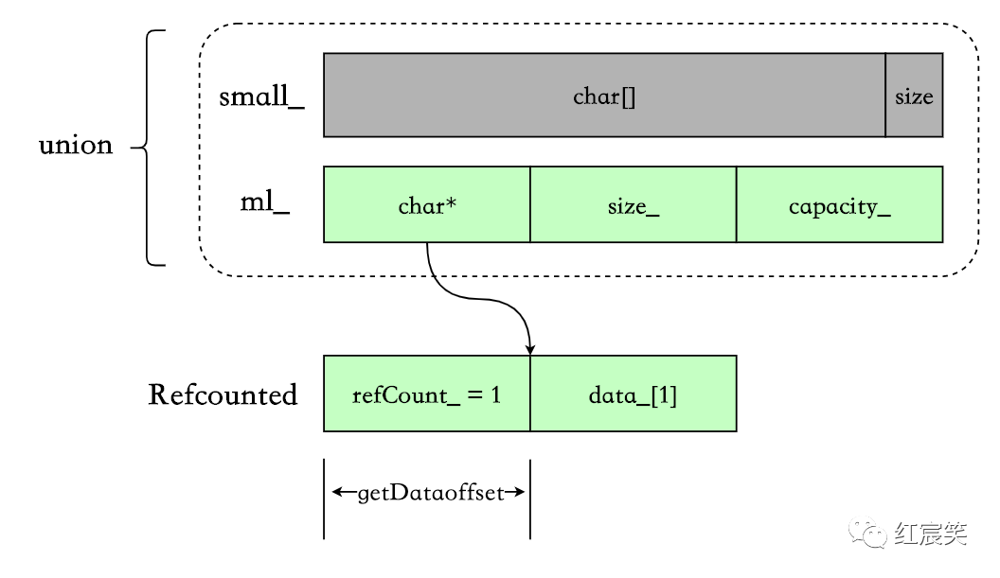

**值得关注的是如何转换不同类型结构体的指针并做运算，这里的做法是** ：`Char* -> void* -> unsigned char* -> 与size_t做减法 -> void * -> RefCounted*`

## 析构

```cpp
~fbstring_core() noexcept {  
    if (category() == Category::isSmall) {  
      return;  
    }  
    destroyMediumLarge();  
}  
```

  * 如果是 small 类型，直接返回，因为利用的是栈空间。
  * 否则，针对 medium 和 large，调用 destroyMediumLarge。

```cpp
FOLLY_MALLOC_NOINLINE void destroyMediumLarge() noexcept {  
  auto const c = category();  
  FBSTRING_ASSERT(c != Category::isSmall);  
  if (c == Category::isMedium) {  
    free(ml_.data_);  
  } else {  
    RefCounted::decrementRefs(ml_.data_);  
  }  
}  
```

  * medium ：free 动态分配的字符串内存即可。
  * large : 调用 decrementRefs，针对共享字符串进行操作。

```cpp
static void decrementRefs(Char * p) {  
  auto const dis = fromData(p);  
  size_t oldcnt = dis->refCount_.fetch_sub(1, std::memory_order_acq_rel);  
  FBSTRING_ASSERT(oldcnt > 0);  
  if (oldcnt == 1) {  
    free(dis);  
  }  
}  
```

逻辑也很清晰：先对引用计数减 1，如果本身就只有 1 个引用，那么直接 free 掉整个 RefCounted。

## COW

最重要的一点，也是 large strings 独有的，就是 COW. 任何针对字符串写的操作，都会触发 COW，包括前面举过的[]操作，例如：

  * **non-const** at(size_n)
  * **non-const** operator[](size_type pos "")
  * operator+
  * append
  * ......

我们举个例子，比如**non-const** operator[](size_type pos "")

### non-const operator[](size_type pos "")

```cpp
reference operator[](size_type pos "") {  
    return *(begin() + pos);  
}  

iterator begin() {  
    return store_.mutableData();  
}  
```

来重点看下 mutableData() :

```cpp
Char* mutableData() {  
  switch (category()) {  
  case Category::isSmall:  
    return small_;  
  case Category::isMedium:  
    return ml_.data_;  
  case Category::isLarge:  
    return mutableDataLarge();  
  }  
  fbstring_detail::assume_unreachable();  
}  

template <class Char>  
inline Char* fbstring_core<Char>::mutableDataLarge() {  
  FBSTRING_ASSERT(category() == Category::isLarge);  
  if (RefCounted::refs(ml_.data_) > 1) { // Ensure unique.  
    unshare();  
  }  
  return ml_.data_;  
}  
```

同样是分三种情况。small 和 medium 直接返回字符串的地址，large 会调用 mutableDataLarge()，**可以看出，如果引用数大于 1，会进行 unshare 操作 ：**

```cpp
void unshare(size_t minCapacity = 0);  

template <class Char>  
FOLLY_MALLOC_NOINLINE inline void fbstring_core<Char>::unshare(  
    size_t minCapacity) {  
  FBSTRING_ASSERT(category() == Category::isLarge);  
  size_t effectiveCapacity = std::max(minCapacity, ml_.capacity());  
  auto const newRC = RefCounted::create(&effectiveCapacity);  

  // If this fails, someone placed the wrong capacity in an  
  // fbstring.  
  FBSTRING_ASSERT(effectiveCapacity >= ml_.capacity());  

  // Also copies terminator.  
  fbstring_detail::podCopy(ml_.data_, ml_.data_ + ml_.size_ + 1, newRC->data_);  

  RefCounted::decrementRefs(ml_.data_);  
  ml_.data_ = newRC->data_;  
  ml_.setCapacity(effectiveCapacity, Category::isLarge);  
  // size_ remains unchanged.  
}  
```

基本思路：

  * 创建新的 RefCounted。
  * 拷贝字符串。
  * 对原有的共享字符串减少一个引用 decrementRefs，这个函数在上面的析构小节里分析过。
  * 设置 `ml_` 的 data、capacity、category.
  * **注意此时还不会设置 size，因为还不知道应用程序对字符串进行什么修改。**

### non-const 与 const

大家可能注意到了，上面的 at 和[]强调了 non-const，这是因为 const-qualifer 针对这两个调用不会触发 COW ，还以[]为例：

```cpp
// C++11 21.4.5 element access:  
const_reference operator[](size_type pos "") const {  
    return *(begin() + pos);  
}  

const_iterator begin() const {  
    return store_.data();  
}  

// In C++11 data() and c_str() are 100% equivalent.  
const Char* data() const { return c_str(); }  

const Char* c_str() const {  
    const Char* ptr = ml_.data_;  
    // With this syntax, GCC and Clang generate a CMOV instead of a branch.  
    ptr = (category() == Category::isSmall) ? small_ : ptr;  
    return ptr;  
}  
```

可以看出区别，non-const 版本的 begin()中调用的是 mutableData()，而 const-qualifer 版本调用的是 `data()-> c_str()`，而 `c_str()` 直接返回的字符串地址。

所以，当字符串用到[]、at 且不需要写操作时，最好用 const-qualifer.

我们拿 folly 自带的benchmark 工具[1]测试一下：

```cpp
#include "folly/Benchmark.h"  
#include "folly/FBString.h"  
#include "folly/container/Foreach.h"  

using namespace std;  
using namespace folly;  

BENCHMARK(nonConstFbstringAt, n) {  
  ::folly::fbstring str(  
      "fbstring is a drop-in replacement for std::string. The main benefit of fbstring is significantly increased "  
      "performance on virtually all important primitives. This is achieved by using a three-tiered storage strategy "  
      "and by cooperating with the memory allocator. In particular, fbstring is designed to detect use of jemalloc and "  
      "cooperate with it to achieve significant improvements in speed and memory usage.");  
  FOR_EACH_RANGE(i, 0, n) {  
    char &s = str[2];  
    doNotOptimizeAway(s);  
  }  
}  

BENCHMARK_DRAW_LINE();  

BENCHMARK_RELATIVE(constFbstringAt, n) {  
  const ::folly::fbstring str(  
      "fbstring is a drop-in replacement for std::string. The main benefit of fbstring is significantly increased "  
      "performance on virtually all important primitives. This is achieved by using a three-tiered storage strategy "  
      "and by cooperating with the memory allocator. In particular, fbstring is designed to detect use of jemalloc and "  
      "cooperate with it to achieve significant improvements in speed and memory usage.");  
  FOR_EACH_RANGE(i, 0, n) {  
    const char &s = str[2];  
    doNotOptimizeAway(s);  
  }  
}  

int main() { runBenchmarks(); }  
```

结果是 constFbstringAt 比 nonConstFbstringAt 快了 175%

```cpp
============================================================================  
delve_folly/main.cc                             relative  time/iter  iters/s  
============================================================================  
nonConstFbstringAt                                          39.85ns   25.10M  
----------------------------------------------------------------------------  
constFbstringAt                                  175.57%    22.70ns   44.06M  
============================================================================  
```

## Realloc

reserve、operator+等操作，可能会涉及到内存重新分配，最终调用的都是 memory/Malloc.h 中的 smartRealloc：

```cpp
inline void* checkedRealloc(void* ptr, size_t size) {  
  void* p = realloc(ptr, size);  
  if (!p) {  
    throw_exception<std::bad_alloc>();  
  }  
  return p;  
}  

/**  
  * This function tries to reallocate a buffer of which only the first  
  * currentSize bytes are used. The problem with using realloc is that  
  * if currentSize is relatively small _and_ if realloc decides it  
  * needs to move the memory chunk to a new buffer, then realloc ends  
  * up copying data that is not used. It's generally not a win to try  
  * to hook in to realloc() behavior to avoid copies - at least in  
  * jemalloc, realloc() almost always ends up doing a copy, because  
  * there is little fragmentation / slack space to take advantage of.  
  */  
FOLLY_MALLOC_CHECKED_MALLOC FOLLY_NOINLINE inline void* smartRealloc(  
    void* p,  
    const size_t currentSize,  
    const size_t currentCapacity,  
    const size_t newCapacity) {  
  assert(p);  
  assert(currentSize <= currentCapacity &&  
          currentCapacity < newCapacity);  

  auto const slack = currentCapacity - currentSize; 

  if (slack * 2 > currentSize) {  
    // Too much slack, malloc-copy-free cycle:  
    auto const result = checkedMalloc(newCapacity);  
    std::memcpy(result, p, currentSize);  
    free(p);  

    return result;  
  }  
  
  // If there's not too much slack, we realloc in hope of coalescing  
  return checkedRealloc(p, newCapacity);  
}  
```

从注释和代码看为什么函数起名叫**smart**Realloc :

  * 如果`(the currentCapacity - currentSize) _ 2 > currentSize`，即 `currentSize < 2/3 _ capacity`，说明当前分配的内存利用率较低，此时认为如果使用 realloc 并且 realloc 决定拷贝当前内存到新内存，成本会高于直接 `malloc(newCapacity) + memcpy + free(old_memory)`。
  * 否则直接 `realloc`.

## 其他

### __builtin_expect

给编译器提供分支预测信息。原型为：

```cpp
long __builtin_expect (long exp, long c)  
```

**表达式的返回值为 exp 的值，跟 c 无关。** 我们预期 exp 的值是 c。例如下面的例子，我们预期 x 的值是 0，所以这里提示编译器，只有很小的几率会调用到 foo()

```cpp
if (__builtin_expect (x, 0))  
  foo ();  
```

再比如判断指针是否为空：

```cpp
if (__builtin_expect (ptr != NULL, 1))  
  foo (*ptr);  
```

在 fbstring 中也用到了`builtin_expect`，例如创建 RefCounted 的函数 (`FOLLY_LIKELY` 包装了一下`builtin_expect`)：

```cpp
#if __GNUC__  
#define FOLLY_DETAIL_BUILTIN_EXPECT(b, t) (__builtin_expect(b, t))  
#else  
#define FOLLY_DETAIL_BUILTIN_EXPECT(b, t) b  
#endif  

//  Likeliness annotations  
//  
//  Useful when the author has better knowledge than the compiler of whether  
//  the branch condition is overwhelmingly likely to take a specific value.  
//  
//  Useful when the author has better knowledge than the compiler of which code  
//  paths are designed as the fast path and which are designed as the slow path,  
//  and to force the compiler to optimize for the fast path, even when it is not  
//  overwhelmingly likely.  
#define FOLLY_LIKELY(x) FOLLY_DETAIL_BUILTIN_EXPECT((x), 1)  
#define FOLLY_UNLIKELY(x) FOLLY_DETAIL_BUILTIN_EXPECT((x), 0)  

static RefCounted* create(const Char* data, size_t* size) {  
  const size_t effectiveSize = *size;  
  auto result = create(size);  
  if (FOLLY_LIKELY(effectiveSize > 0)) {       // __builtin_expect  
    fbstring_detail::podCopy(data, data + effectiveSize, result->data_);  
  }  
  return result;  
}  
```

从汇编角度来说，会将可能性更大的汇编紧跟着前面的汇编，防止无效指令的加载。可以参考：

  * likely() and unlikely()[2]
  * What is the advantage of GCC's \\_\\_builtin_expect in if else statements?[3]

### CMOV 指令

conditional move，条件传送。类似于 MOV 指令，但是依赖于 RFLAGS 寄存器内的状态。如果条件没有满足，该指令不会有任何效果。

**CMOV 的优点是可以避免分支预测，避免分支预测错误对 CPU 流水线的影响**。详细可以看这篇文档：amd-cmovcc.pdf[4]

fbstring 在一些场景会提示编译器生成 CMOV 指令，例如：

```cpp
const Char* c_str() const {  
  const Char* ptr = ml_.data_;  
  // With this syntax, GCC and Clang generate a CMOV instead of a branch.  
  ptr = (category() == Category::isSmall) ? small_ : ptr;  
  return ptr;  
}  
```

### builtin_unreachable && assume(0)

如果程序执行到了`builtin_unreachable` 和`assume(0)`，那么会出现未定义的行为。例如`builtin_unreachable`出现在一个不会返回的函数后面，而且这个函数没有声明为`attribute\\_\\_((noreturn))`。例如6.59 Other Built-in Functions Provided by GCC给出的例子 :

```cpp
void function_that_never_returns (void);  
int g (int c)  
{  
  if (c)  
    {  
      return 1;  
    }  
  else  
    {  
      function_that_never_returns ();  
      __builtin_unreachable ();  
    }  
}  
```

如果不加`__builtin_unreachable ();`，会报`error: control reaches end of non-void function [-Werror=return-type]`

folly 将 **builtin_unreachable 和**assume(0) 封装成了`assume_unreachable`：

```cpp
[[noreturn]] FOLLY_ALWAYS_INLINE void assume_unreachable() {  
  assume(false);  
  // Do a bit more to get the compiler to understand  
  // that this function really will never return.  
#if defined(__GNUC__)  
  __builtin_unreachable();  
#elif defined(_MSC_VER)  
  __assume(0);  
#else  
  // Well, it's better than nothing.  
  std::abort();  
#endif  
}  
```

在 fbstring 的一些特性场景，比如 switch 判断 category 中用到。这是上面提到过的 mutableData() :

```cpp
Char* mutableData() {  
  switch (category()) {  
    case Category::isSmall:  
      return small_;  
    case Category::isMedium:  
      return ml_.data_;  
    case Category::isLarge:  
      return mutableDataLarge();  
  }  
  folly::assume_unreachable();  
}  
```

### jemalloc

  * 官网 [5]
  * API 文档[6]
  * 大致的算法和原理可以参考 facebook 的这篇博客 ：Scalable memory allocation using jemalloc[7]

### find 算法

使用的简化的 Boyer-Moore 算法，文档说明是在查找成功的情况下比 std::string 的 find 快 30 倍。benchmark代码在FBStringBenchmark.cpp[8]

我自己测试的情况貌似是搜索长字符串的情况会更好些。

### 判断大小端

```cpp
// It's MSVC, so we just have to guess ... and allow an override  
#ifdef _MSC_VER  
# ifdef FOLLY_ENDIAN_BE  
  static constexpr auto kIsLittleEndian = false;  
# else  
  static constexpr auto kIsLittleEndian = true;  
# endif  
#else  
  static constexpr auto kIsLittleEndian =  
  __BYTE_ORDER__ == __ORDER_LITTLE_ENDIAN__;  
#endif  
```

`__BYTE_ORDER__` 为预定义宏：[9]，值是**`ORDER_LITTLE_ENDIAN`**、**`ORDER_BIG_ENDIAN`**、**`ORDER_PDP_ENDIAN`**中的一个。

一般会这么使用：

```cpp
/* Test for a little-endian machine */  
#if __BYTE_ORDER__ == __ORDER_LITTLE_ENDIAN__  
```

**c++20 引入了std::endian[10]，判断会更加方便。**

（完）

## 参考资料

* [1] [benchmark 工具](https://github.com/facebook/folly/blob/master/folly/docs/Benchmark.md)
* [2] [likely() and unlikely()](https://kernelnewbies.org/FAQ/LikelyUnlikely)
* [3] [What is the advantage of GCC's __builtin_expect in if else statements?](https://stackoverflow.com/questions/7346929what-is-the-advantage-of-gccs-builtin-expect-in-if-else-statements)
* [4] [amd-cmovcc.pdf](https://www.cs.tufts.edu/comp/40-2011f/readings/amd-cmovcc.pdf)
* [5] [Jemalloc官网](http://jemalloc.net/)
* [6] [API 文档](http://jemalloc.net/jemalloc.3.html)
* [7] [Scalable memory allocation using jemalloc](https://engineering.fb.com/2011/01/03/core-data/scalable-memory-allocation-using-jemalloc/)
* [8] [FBStringBenchmark.cpp](https://github.com/facebook/folly/blob/master/folly/test/FBStringTestBenchmarks.cpp.h#L120)
* [9] [BYTE_ORDER为预定义宏](https://gcc.gnu.org/onlinedocs/cpp/Common-Predefined-Macros.html)
* [10] [std::endian](https://en.cppreference.com/w/cpp/types/endian)
