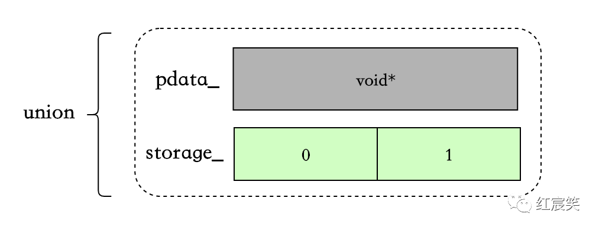
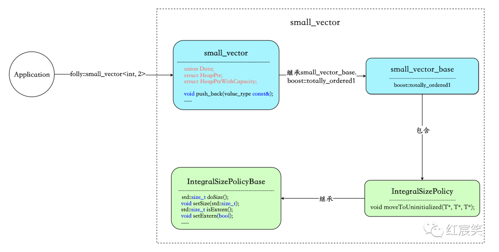
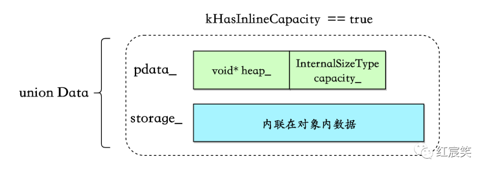
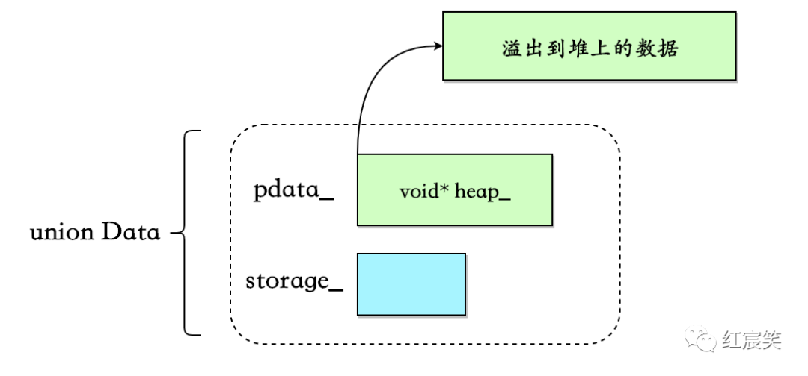
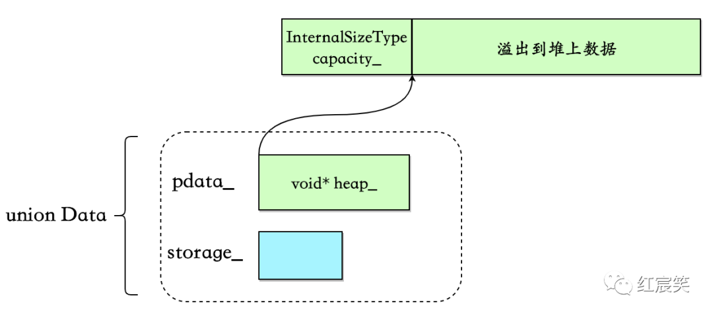
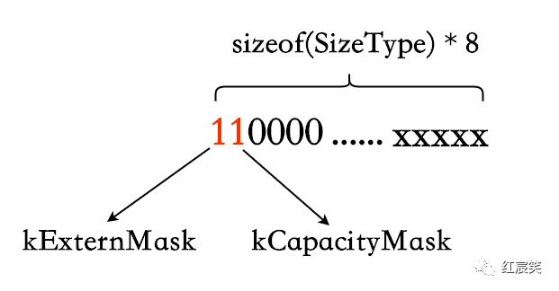
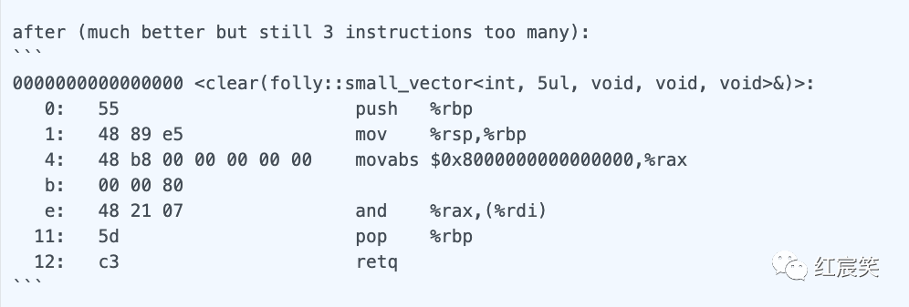
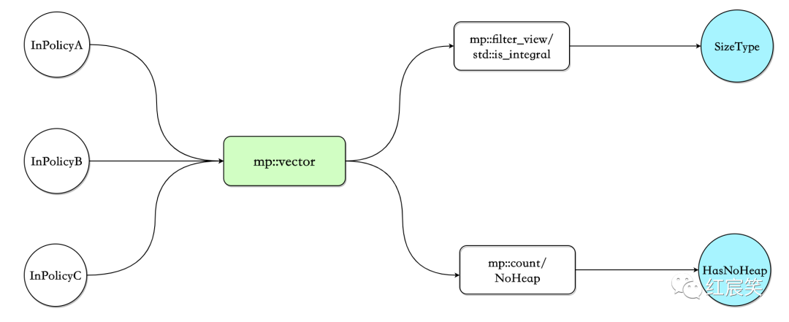

 
<!--BEGIN_DATA
{
    "create_date": "2023-12-25 22:00", 
    "modify_date": "2023-12-25 22:00", 
    "is_top": "0", 
    "summary": "C++ folly库解读（二） small_vector —— 小数据集下的std::vector替代方案<br/>C++ folly库解读（三）Synchronized —— 比标准库更易用、功能更强大的同步机制", 
    "tags": "C/C++", 
    "file_name": "C++ folly库解读02.md"
}
END_DATA-->

#### <p>原文出处：<a href='https://mp.weixin.qq.com/s/kPwiBuUcn8Y8NGzdshwY1g' target='blank'>C++ folly库解读（二） small_vector —— 小数据集下的std::vector替代方案</a></p>

## 目录

  * 使用场景
  * 为什么不是 std::array
  * 其他用法
  * 其他类似库
  * small_vector
  * small_vector_base
  * InlineStorageType
  * capacity
    * capacity 内联在对象中
    * 通过 malloc_usable_size 获取 capacity
    * 将 capacity 放到堆上
  * size()相关
  * capacity()函数
    * 数据内联在对象中
    * 为 capacity 分配了内存
    * 不为 capacity 分配空间
  * 先迁移原有数据还是先放入新数据
  * makeGuard
  * clear 优化
  * `__attribute__((__pack__))/pragma(pack(push, x))`
  * boost::mpl 元编程库
  * boost/operators
    * c++20 的<=> (three-way comparison)

## 介绍

  * folly/small_vector.h[1]
  * folly/small_vector.md[2]

行为与 std::vector 类似，但是使用了 small buffer optimization（类似于 fbstring 中的 SSO[3]），将指定个数的数据内联在对象中，而不是像 std::vector 直接将对象分配在堆上，避免了 malloc/free 的开销。

`small_vector` 基本兼容 std::vector 的接口。

```cpp
small_vector<int,2> vec;  
vec.push_back(0);     // Stored in-place on stack  
vec.push_back(1);     // Still on the stack  
vec.push_back(2);    // Switches to heap buffer.  
```

`small_vector<int,2> vec`指定可以内联在对象中 2 个数据：



当超过 2 个后，后续添加的数据会被分配到堆上，之前的 2 个数据也会被一起 move 到堆上：


### 使用场景

根据官方文档的介绍[4]，small_vector 在下面 3 种场景中很有用：

  * 需要使用的 vector 的生命周期很短（比如在函数中使用），并且存放的数据占用空间较小，那么此时节省一次 malloc 是值得的。
  * 如果 vector 大小固定且需要频繁查询，那么在绝大多数情况下会减少一次 cpu cache miss，因为数据是内联在对象中的。
  * 如果需要创建上亿个 vector，而且不想在记录 capacity 上浪费对象空间（一般的 vector 对象内会有三个字段：`pointer _Myfirst`、`pointer _Mylast`、`pointer _Myend`）。`small_vector` 允许让 malloc 来追踪`allocation capacity`（这会显著的降低 `insertion/reallocation` 效率，如果对这两个操作的效率比较在意，你应该使用`FBVector[5]`，FBVector 在官方描述中可以完全代替 `std::vector`）

比如在io/async/AsyncSocket.h[6]中，根据条件的不同使用 `small_vector` 或者 `std::vector`：

```cpp
  // Lifecycle observers.  
  //  
  // Use small_vector to avoid heap allocation for up to two observers, unless  
  // mobile, in which case we fallback to std::vector to prioritize code size.  
using LifecycleObserverVecImpl = conditional_t<  
      !kIsMobile,  
      folly::small_vector<AsyncTransport::LifecycleObserver*, 2>,  
      std::vector<AsyncTransport::LifecycleObserver*>>;  

LifecycleObserverVecImpl lifecycleObservers_;  

// push_back  
void AsyncSocket::addLifecycleObserver(  
    AsyncTransport::LifecycleObserver* observer) {  
  lifecycleObservers_.push_back(observer);  
}  

// for loop  
for (const auto& cb : lifecycleObservers_) {  
    cb->connect(this);  
}  

// iterator / erase  
  const auto eraseIt = std::remove(  
      lifecycleObservers_.begin(), lifecycleObservers_.end(), observer);  
  if (eraseIt == lifecycleObservers_.end()) {  
    return false;  
}  
```

### 为什么不是 std::array

下面两种情况，`small_vector` 比 std::array 更合适：

  * 需要空间后续动态增长，不仅仅是编译期的固定 size。
  * 像上面的例子，根据不同条件使用 `std::vector/small_vector`，且使用的 API 接口是统一的。

### 其他用法

  * `NoHeap` : 当 vector 中数据个数超过指定个数时，不会再使用堆。**如果个数超过指定个数，会抛出`std::length_error`异常。**
  * `<Any integral type>` : 指定 `small_vector` 中 size 和 capacity 的数据类型。

```cpp
// With space for 32 in situ unique pointers, and only using a 4-byte size_type.  
small_vector<std::unique_ptr<int>, 32, uint32_t> v;  

// A inline vector of up to 256 ints which will not use the heap.  
small_vector<int, 256, NoHeap> v;  

// Same as the above, but making the size_type smaller too.  
small_vector<int, 256, NoHeap, uint16_t> v;  
```

**其中，依赖 boost::mpl 元编程库，可以让后两个模板变量任意排序。**

### 其他类似库

  * SmallVec from LLVM[7]
  * boost::container::small_vector[8]
  * fixed_vector from EASTL[9]

## Benchmark

没有找到官方的 benchmark，自己简单的写了一个，不测试数据溢出到堆上的情况。

插入 4 个 int，std::vector 使用 reserve(4)预留空间。

```cpp
BENCHMARK(stdVector, n) {  
  FOR_EACH_RANGE(i, 0, n) {  
    std::vector<int> vec;  
    vec.reserve(4);  
    for (int i = 0; i < 4; i++) {  
      vec.push_back(1);  
    }  
    doNotOptimizeAway(vec);  
  }  
}  

BENCHMARK_DRAW_LINE();  

BENCHMARK_RELATIVE(smallVector, n) {  
  FOR_EACH_RANGE(i, 0, n) {  
    small_vector<int, 4> vec;  
    for (int i = 0; i < 4; i++) {  
      vec.push_back(1);  
    }  
    doNotOptimizeAway(vec);  
  }  
}  
```

结果是：small_vector 比 std::vector 快了 40%：

```
============================================================================  
delve_folly/benchmark.cc                        relative  time/iter  iters/s  
============================================================================  
stdVector                                                  440.79ns    2.27M  
----------------------------------------------------------------------------  
smallVector                                      140.48%   313.77ns    3.19M  
============================================================================  
```

如果把 stdVector 中的`vec.reserve(4);`去掉，那么 `small_vector` 速度比 std::vector 快了 3 倍。在我的环境上，std::vector 的扩容因子为 2，如果不加 reserve，那么 std::vector 会有 2 次扩容的过程（貌似很多人不习惯加 reserve，是有什么特别的原因吗 : ）)：

```cpp
============================================================================  
delve_folly/benchmark.cc                        relative  time/iter  iters/s  
============================================================================  
stdVector                                                    1.26us  795.06K  
----------------------------------------------------------------------------  
smallVector                                      417.25%   301.44ns    3.32M  
============================================================================  
```

## 代码关注点

`small_vector` 代码比较少，大概 1300 多行。主要关注以下几个方面：

  * 主要类。
  * 数据存储结构，capacity 的存储会复杂一些。
  * 扩容过程，包括数据从对象中迁移到堆上。
  * 常用的函数，例如 push_back、reserve、resize。
  * 使用 makeGuard 代替了原版的 try-catch。
  * 通过 boost::mpl 支持模板参数任意排序。
  * 通过 boost-operators 简化 operator 以及 C++20 的<=>。

## 主要类



  * `small_vector` : 包含的核心字段为`union Data`、`struct HeapPtr`、`struct HeapPtrWithCapacity`，这三个字段负责数据的存储。此外 `small_vector` 对外暴露 API 接口，例如 `push_back`、`reserve`、`resize` 等。
  * `small_vector_base` : **没有对外提供任何函数接口，类内做的就是配合 boost::mpl 元编程库在编译期解析模板参数**，同时生成 `boost::totally_ordered1` 供 `small_vector` 继承，精简 `operator` 代码。
  * `IntegralSizePolicyBase`：负责 `size/extern/heapifiedCapacity` 相关的操作。
  * `IntegralSizePolicy` : 负责内联数据溢出到堆的过程。

### small_vector

声明：

```cpp
template <  
    class Value,  
    std::size_t RequestedMaxInline = 1,  
    class PolicyA = void,  
    class PolicyB = void,  
    class PolicyC = void>  
class small_vector : public detail::small_vector_base<  
                          Value,  
                          RequestedMaxInline,  
                          PolicyA,  
                          PolicyB,  
                          PolicyC>::type  
```

声明中有三个策略模板参数是因为在一次提交中删除了一个无用的策略，`OneBitMutex：Delete small_vector's OneBitMutex policy[10]`。

### small_vector_base

```cpp
template <  
    class Value,  
    std::size_t RequestedMaxInline,  
    class InPolicyA,  
    class InPolicyB,  
    class InPolicyC>  
struct small_vector_base;  
```

boost::mpl 放到最后说吧 ：）

## 数据结构

`small_vector` 花了一些心思在 capacity 的设计上，尽可能减小对象内存，降低内联数据带来的影响。

`union Data`负责存储数据：

```c
union Data{  
    PointerType pdata_;          // 溢出到堆后的数据  
    InlineStorageType storage_;  // 内联数据  
}u;  
```

### InlineStorageType

使用`std::aligned_storage[11]`进行初始化，占用空间是`sizeof(value_type) *MaxInline`，对齐要求为`alignof(value_type)`[12]：

```c
typedef typename std::aligned_storage<sizeof(value_type) * MaxInline, alignof(value_type)>::type InlineStorageType;  
```

### capacity

与 std::vector 用结构体字段表示 capacity 不同，`small_vector` 的 capacity 存放分为三种情况。

#### capacity 内联在对象中

这是最简单的一种情况：



条件为`sizeof(HeapPtrWithCapacity) < sizeof(InlineStorageType)`
（这里我不明白为什么等于的情况不算在内）：

```cpp
static bool constexpr kHasInlineCapacity = sizeof(HeapPtrWithCapacity) < sizeof(InlineStorageType);  

typedef typename std::conditional<kHasInlineCapacity, HeapPtrWithCapacity, HeapPtr>::type PointerType;  

struct HeapPtrWithCapacity {  
  value_type* heap_;  
  InternalSizeType capacity_;  
}; 

union Data{  
    PointerType pdata_;           // 溢出到堆后的数据  
    InlineStorageType storage_;   // 内联数据  
}u;  
```

#### 通过 malloc_usable_size 获取 capacity

假如上述`kHasInlineCapacity == false`，即`sizeof(InlineStorageType) <= sizeof(HeapPtrWithCapacity)`时，考虑到节省对象空间，capacity 不会内联在对象中，此时 PointerType 的类型为 HeapPtr，内部只保留一个指针：

```cpp
struct HeapPtr {  
  value_type* heap_;  
} ;  

union Data{  
    PointerType pdata_;           // 溢出到堆后的数据  
    InlineStorageType storage_;   // 内联数据  
}u;  
```

那么此时 capacity 存放在哪里了呢？这里又分了两种情况，第一种就是这里要说明的：直接通过`malloc_usable_size`[13]获取从堆上分配的内存区域的可用数据大小，这个结果就被当做 `small_vector` 当前的 capacity：

```c
malloc_usable_size(heap_) / sizeof(value_type);    // heap_指向堆上的数据  
```



但是有一个问题，由于内存分配存在 alignment 和 minimum size constraints 的情况，`malloc_usable_size` 返回的大小可能会大于申请时指定的大小，但是 folly 会利用这部分多余的空间来存放数据（如果能放的下）。

**比如在不使用 jemalloc 的情况下**，在扩容的函数内，将向系统申请的字节数、`malloc_usable_size` 返回的可用空间、`small_vector` 的 capacity 打印出来：

```cpp
folly::small_vector<uint32_t, 2> vec;     // uint32_t => four bytes  
for (int i = 0; i < 200; i++) {  
    vec.push_back(1);  
    std::cout << vec.capacity() << std::endl;  
}  

// 代码进行了简化  
template <typename EmplaceFunc>  
  void makeSizeInternal(size_type newSize, bool insert, EmplaceFunc&& emplaceFunc, size_type pos) {  
    const auto needBytes = newSize * sizeof(value_type);  
    const size_t goodAllocationSizeBytes = goodMallocSize(needBytes);  
    const size_t newCapacity = goodAllocationSizeBytes / sizeof(value_type);  
    const size_t sizeBytes = newCapacity * sizeof(value_type);  
    void* newh = checkedMalloc(sizeBytes);  
    std::cout << "sizeBytes:" << sizeBytes << " malloc_usable_size:" << malloc_usable_size(newh) << " "  
              << kMustTrackHeapifiedCapacity << std::endl;  
    // move元素等操作，略过....  
}

// output :  
2  
2  
sizeBytes:16 malloc_usable_size:24 0  
6  
6  
6  
6  
sizeBytes:40 malloc_usable_size:40 0  
10  
10  
10  
10  
sizeBytes:64 malloc_usable_size:72 0  
18  
18  
18  
18  
18  
18  
18  
18  
......  
......  
```

**可以看出，扩容时即使向系统申请 16 字节的空间，`malloc_usable_size` 返回的是 24 字节，而 `small_vector` 此时的 capacity 也是 24，即会利用多余的 8 个字节额外写入 2 个数据。**

**如果使用了 jemalloc **,那么会根据size classes[14]分配空间。

这种方式也是有使用条件的，即`needbytes >= kHeapifyCapacityThreshold`, `kHeapifyCapacityThreshold` 的定义为：

```cpp
// This value should we multiple of word size.  
static size_t constexpr kHeapifyCapacitySize = sizeof(typename std::aligned_storage<sizeof(InternalSizeType), alignof(value_type)>::type);  

// Threshold to control capacity heapifying.  
static size_t constexpr kHeapifyCapacityThreshold = 100 * kHeapifyCapacitySize;  
```

我没想明白这个 100 是怎么定下来的 :(

#### 将 capacity 放到堆上

当需要申请的内存`needbytes >= kHeapifyCapacityThreshold`时，就会直接将 capacity 放到堆上进行管理：



此时需要多申请 sizeof(InternalSizeType)字节来存放 capacity，并且需要对内存分配接口返回的指针加上 sizeof(InternalSizeType)从而指向真正的数据:

```cpp
inline void* shiftPointer(void* p, size_t sizeBytes) {  
    return static_cast<char*>(p) + sizeBytes;  
} 

template <typename EmplaceFunc>  
void makeSizeInternal(size_type newSize, bool insert, EmplaceFunc&& emplaceFunc, size_type pos) {  
    ....  
    const bool heapifyCapacity = !kHasInlineCapacity && needBytes >= kHeapifyCapacityThreshold;  
    // 申请内存  
    void* newh = checkedMalloc(sizeBytes);  
    value_type* newp =  
        static_cast<value_type*>(heapifyCapacity ? detail::shiftPointer(newh, kHeapifyCapacitySize) : newh);  
    // move元素等操作，略过....  
    u.pdata_.heap_ = newp;  
    // ....  
}  
```

### size()相关

那么如何区分数据是内联在对象中还是溢出到堆上，如何区分上面三种 capacity 存储策略呢？

采取的做法是向 size 借用两位来区分：



  * kExternMask : 数据是否溢出到堆上，相关函数为 isExtern/setExtern.
  * kCapacityMask : capacity 是否在堆上额外分配了内存来管理。相关函数为 isHeapifiedCapacity/setHeapifiedCapacity.

```cpp
template <class SizeType, bool ShouldUseHeap>
struct IntegralSizePolicyBase {
  IntegralSizePolicyBase() : size_(0) {}
 protected:
  static constexpr std::size_t policyMaxSize() { return SizeType(~kClearMask); }

  std::size_t doSize() const { return size_ & ~kClearMask; }

  std::size_t isExtern() const { return kExternMask & size_; }

  void setExtern(bool b) {
    if (b) {
      size_ |= kExternMask;
    } else {
      size_ &= ~kExternMask;
    }
  }

  std::size_t isHeapifiedCapacity() const { return kCapacityMask & size_; }

  void setHeapifiedCapacity(bool b) {
    if (b) {
      size_ |= kCapacityMask;
    } else {
      size_ &= ~kCapacityMask;
    }
  }
  void setSize(std::size_t sz) {
    assert(sz <= policyMaxSize());
    size_ = (kClearMask & size_) | SizeType(sz);
  }

 private:
  // We reserve two most significant bits of size_.
  static SizeType constexpr kExternMask =
      kShouldUseHeap ? SizeType(1) << (sizeof(SizeType) * 8 - 1) : 0;

  static SizeType constexpr kCapacityMask =
      kShouldUseHeap ? SizeType(1) << (sizeof(SizeType) * 8 - 2) : 0;

  SizeType size_;
};
```

都是很简单的位运算。只需要注意下 policyMaxSize 函数，因为向 size 借了 2 位，所以最大的 size 不是 SizeType 类型的最大值，需要有额外的判断。

### capacity()函数

因为 capacity 有三种存储方式，所以需要根据各自情况去获取：

```cpp
size_type capacity() const {  
  if (this->isExtern()) {  
    if (hasCapacity()) {       // 为capacity分配内存的情况  
      return u.getCapacity();  
    }  
    return AllocationSize{}(u.pdata_.heap_) / sizeof(value_type);   // 不为capacity分配空间的情况  
  }  
  return MaxInline;    // 数据内联的情况  
}  
```

#### 数据内联在对象中

这是最简单的情况，根据上面说过的 isExtern()判断数据是否内联，是的话直接返回 MaxInline。

这里的 MaxInline 还不是上游传过来的 RequestedMaxInline。因为不管是什么 capacity 存储策略，union Data 必然会有一个有指针，最小也是`sizeof(void*)`，假如用户传的是 `small_vector<uint8_t, 1>`，会替用户修改 MaxInine = 8，最大限度利用对象空间:

```cpp
/*  
  * Figure out the max number of elements we should inline.  (If  
  * the user asks for less inlined elements than we can fit unioned  
  * into our value_type*, we will inline more than they asked.)  
  */  
static constexpr std::size_t MaxInline{  
    constexpr_max(sizeof(Value*) / sizeof(Value), RequestedMaxInline)};  
```

#### 为 capacity 分配了内存

这里包括 capacity 分配的内存在堆上或者内联在对象中。通过 hasCapacity()判断，isHeapifiedCapacity 上面说过：

```cpp
bool hasCapacity() const {  
  return kHasInlineCapacity || this->isHeapifiedCapacity();  
}  
```

如果 hasCapacity()为 true，则调用 u.getCapacity()，可以猜到这个方法调用 PointerType(HeapPtr/HeapPtrWithCapacity)对应的 getCapacity()方法。

```cpp
union Data {  
    PointerType pdata_;  
    InlineStorageType storage_;  
    InternalSizeType getCapacity() const { return pdata_.getCapacity(); }  
  } u;  
};  

inline void* unshiftPointer(void* p, size_t sizeBytes) {  
  return static_cast<char*>(p) - sizeBytes;  
}  

struct HeapPtr {  
  // heap[-kHeapifyCapacitySize] contains capacity  
  value_type* heap_;  
  InternalSizeType getCapacity() const {  
    return *static_cast<InternalSizeType*>(  
        detail::unshiftPointer(heap_, kHeapifyCapacitySize));  
  }  
};  

struct HeapPtrWithCapacity {  
  value_type* heap_;  
  InternalSizeType capacity_;  
  InternalSizeType getCapacity() const { return capacity_; }  
};  
```

注意 unshiftPointer 是 shiftPointer 的反过程，将指针从指向真正的数据回退到指向 capacity。

#### 不为 capacity 分配空间

即通过 `malloc *usable_size` 获取 `capacity`。`AllocationSize{}(u.pdata*.heap*)/sizeof(value_type);`直接理解为`malloc_usable_size(u.pdata*.heap\\_)/sizeof(value_type)`即可，加 AllocationSize 是为了解决一个`Android not having malloc_usable_size below API17`[15]，不是重点。

```cpp
size_type capacity() const {  
  if (this->isExtern()) {  
    if (hasCapacity()) {  
      return u.getCapacity();  
    }  
    return AllocationSize{}(u.pdata_.heap_) / sizeof(value_type);   // 此种场景  
  }  
  return MaxInline;  
}  
```

## 扩容

与 std::vector 扩容的不同点：

  * `small_vector` 根据模板参数是否满足`is_trivially_copyable`[16]进行了不同的实现：
    * `is_trivially_copyable`：调用[std::memmove](https://en.cppreference.com/w/cpp/string/byte/memmove)迁移数据，std::vector 没有这个逻辑。
    * 否则，循环迁移元素。
  * std::vector 迁移元素时，会根据是否有`noexcept move constructor`来决定调用`move constructor`还是`copy constructor`（之前这篇文章提到过：c++ 从 vector 扩容看 noexcept 应用场景[17]）。但 `small_vector` 没有这个过程，有`move constructor`就直接调用，不判断是否有 noexcept。**所以，当调用`move constructor`有异常时，原有内存区域的数据会被破坏**
  * 扩容因子不同。std::vector 一般为 2 或者 1.5，不同平台不一样。`small_vector` 的 capacity 上面已经提到过。

最终扩容流程都会走到 moveToUninitialized 函数。

```cpp
/*  
  * Move a range to a range of uninitialized memory.  Assumes the  
  * ranges don't overlap.  
  */  
template <class T>  
typename std::enable_if<!folly::is_trivially_copyable<T>::value>::type moveToUninitialized(T* first, T* last, T* out) {  
  std::size_t idx = 0;  
  {  
    auto rollback = makeGuard([&] {  
      for (std::size_t i = 0; i < idx; ++i) {  
        out[i].~T();  
      }  
    });  
    for (; first != last; ++first, ++idx) {  
      new (&out[idx]) T(std::move(*first));  
    }  
    rollback.dismiss();  
  }  
}  

// Specialization for trivially copyable types.  
template <class T>  
typename std::enable_if<folly::is_trivially_copyable<T>::value>::type moveToUninitialized(T* first, T* last, T* out) {  
  std::memmove(static_cast<void*>(out), static_cast<void const*>(first), (last - first) * sizeof *first);  
}  
```

**这里我不太理解的一点是，既然注释中提到假设前后内存没有 overlap,那么在 `is_trivially_copyable` 的版本中为什么不用 std::memcpy 呢？效率还能高一点。**

### 先迁移原有数据还是先放入新数据

在之前的版本中，流程是申请新内存、**迁移原有数据、放入新数据：**

```cpp
template<class ...Args>  
void emplaceBack(Args&&... args) {  
  makeSize(size() + 1);        // 申请新内存 + 迁移原有数据，内部会调用上面的moveToUninitialized  
  new (end()) value_type(std::forward<Args>(args)...);    //放入新数据  
  this->setSize(size() + 1);  
}  
```

在`small_vector improvements`[18]提交中，**改为了申请新内存、放入新数据、迁移原有数据。理由是有可能 `emplace_back` 的数据是 `small_vector` 中的某一个数据的引用**, 比如这次提交中加 ForwardingEmplaceInsideVector test[19]，不过这属于 corner case。

### makeGuard

在Support -fno-exceptions in folly/small_vector.h[20]提交里，使用 makeGuard 代替了原有的try-catch。makeGuard 定义在folly/ScopeGuard.h[21]中。

之前 try-catch 版本：

```cpp
template <class T>  
typename std::enable_if<!folly::is_trivially_copyable<T>::value>::type  
moveToUninitialized(T* first, T* last, T* out) {  
  std::size_t idx = 0;  
  try {  
    for (; first != last; ++first, ++idx) {  
      new (&out[idx]) T(std::move(*first));  
    }  
  } catch (...) {  
    for (std::size_t i = 0; i < idx; ++i) {  
      out[i].~T();  
    }  
    throw;  
  }  
}  
```

可以对比上面的 makeGuard 版本，逻辑没有变化。

Andrei Alexandrescu 和 Petru Marginean 在 2000 年写的Generic: Change the Way You Write Exception-Safe Code — Forever[22]中，介绍了编写 Exception-Safe Code 常见的方法并提出了 ScopeGuard 的概念:

  * 什么都不加，战略上藐视敌人，战术上也藐视敌人。
  * try-catch : 最常见，缺点是：异常路径性能损失较大（stack-unwinding）、编译后的二进制文件体积膨胀等。
  * RAII : 需要针对每一种异常写一个小类去处理，繁琐。
  * scopeGuard : 上面提到的用法，也是利用了 RAII 的思想，但是更加通用。应用程序只需要定义 rollback，并在成功后调用 dismiss 即可。

## 其他

### clear 优化

在optimize small_vector::clear[23]提交中，利用了 Clang/GCC 对 clear 函数进行了优化，生成更少的汇编指令（这都是怎么发现的？？？）：

```cpp
// 优化前  
void clear() {  
  erase(begin(), end());  
}  

// 优化后  
void clear() {  
  // Equivalent to erase(begin(), end()), but neither Clang or GCC are able to optimize away the abstraction.  
    for (auto it = begin(); it != end(); ++it) {  
      it->~value_type();  
    }  
    this->setSize(0);  
}  
```



### `__attribute__((__pack__))/pragma(pack(push, x))`

folly 中包装了编译器对齐系数，相关参数介绍 : C/C++内存对齐详解[24]

```cpp
// packing is very ugly in msvc  
#ifdef _MSC_VER  
#define FOLLY_PACK_ATTR /**/  
#define FOLLY_PACK_PUSH __pragma(pack(push, 1))  
#define FOLLY_PACK_POP __pragma(pack(pop))  
#elif defined(__GNUC__)  
#define FOLLY_PACK_ATTR __attribute__((__packed__))  
#define FOLLY_PACK_PUSH /**/  
#define FOLLY_PACK_POP /**/  
#else  
#define FOLLY_PACK_ATTR /**/  
#define FOLLY_PACK_PUSH /**/  
#define FOLLY_PACK_POP /**/  
#endif  
```

在`Fix alignment issues in small_vector`[25]提交中，`small_vector` 改为了只在 64 位平台使用对齐系数（不知道为什么，哭。。。）：

```cpp
#if (FOLLY_X64 || FOLLY_PPC64)  
#define FOLLY_SV_PACK_ATTR FOLLY_PACK_ATTR  
#define FOLLY_SV_PACK_PUSH FOLLY_PACK_PUSH  
#define FOLLY_SV_PACK_POP FOLLY_PACK_POP  
#else  
#define FOLLY_SV_PACK_ATTR  
#define FOLLY_SV_PACK_PUSH  
#define FOLLY_SV_PACK_POP  
#endif  
```

### boost::mpl 元编程库

boost mpl 文档[26]

`small_vector_base` 的代码很少，关注下 boost::mpl 的使用：

```cpp
namespace mpl = boost::mpl;  

template <  
    class Value,  
    std::size_t RequestedMaxInline,  
    class InPolicyA,  
    class InPolicyB,  
    class InPolicyC>  
struct small_vector_base {  

  typedef mpl::vector<InPolicyA, InPolicyB, InPolicyC> PolicyList;  

  /*  
    * Determine the size type  
    */  
  typedef typename mpl::filter_view<  
      PolicyList,  
      std::is_integral<mpl::placeholders::_1>>::type Integrals; 

  typedef typename mpl::eval_if<  
      mpl::empty<Integrals>,  
      mpl::identity<std::size_t>,  
      mpl::front<Integrals>>::type SizeType; 

  /*  
    * Determine whether we should allow spilling to the heap or not.  
    */  
  typedef typename mpl::count<PolicyList, small_vector_policy::NoHeap>::type  
      HasNoHeap; 

  /*  
    * Make the real policy base classes.  
    */  
  typedef IntegralSizePolicy<SizeType, !HasNoHeap::value> ActualSizePolicy;  

  /*  
    * Now inherit from them all.  This is done in such a convoluted  
    * way to make sure we get the empty base optimizaton on all these  
    * types to keep sizeof(small_vector<>) minimal.  
    */  
  typedef boost::totally_ordered1<  
      small_vector<Value, RequestedMaxInline, InPolicyA, InPolicyB, InPolicyC>,  
      ActualSizePolicy>  
      type;  
};  
```

解析模板参数的思路为：

  * `typedef mpl::vector<InPolicyA, InPolicyB, InPolicyC> PolicyList;` : 将策略放入到 mpl::vector 中，例如 Noheap、指定 size 的数据类型（`uint32_t`、`uint16_t` 等）

接下来可以分为两块，获取 SizeType 和获取 HasNoHeap：

获取 SizeType：

  * `typedef typename mpl::filter_view<PolicyList, std::is_integral<mpl::placeholders::_1>>::type Integrals;` : 将符合`std::is_integral`条件的筛选出来，比如 `uint8_t`。
    * `mpl::filter_view`被定义为`template< typename Sequence, typename Pred>`，其中，Pred 需要是`Unary Lambda Expression`，即为编译期可调用的 entity，分为`Metafunction Class`和`Placeholder Expression`，上面的`std::is_integral<mpl::placeholders::_1>`即为`Placeholder Expression`。
  * `typedef typename mpl::eval_if<mpl::empty<Integrals>, mpl::identity<std::size_t>, mpl::front<Integrals>>::type SizeType;`不用知道每个函数的意思，**从字面也能看出来：假如应用层传入的模板参数没有 `std::is_integral`，那么 SizeType，即 size 的类型，就是 `size_t`，否则就是应用传入的类型，比如 `uint8_t`.**

获取 HasNoHeap：

  * `typedef typename mpl::count<PolicyList, small_vector_policy::NoHeap>::type HasNoHeap;`，这个也能猜出来：应用层是否指定了 NoHeap.



**可以看出，解析模板参数并没有依赖参数的特定顺序。**

### boost/operators

boost/operators 文档参考 ：Header[27]

`small_vector_base` 的最后两行代码，与 boost/operators 有关 :

```cpp
typedef IntegralSizePolicy<SizeType, !HasNoHeap::value> ActualSizePolicy;  

typedef boost::totally_ordered1<  
    small_vector<Value, RequestedMaxInline, InPolicyA, InPolicyB, InPolicyC>,  
    ActualSizePolicy>  
    type;  
```

`boost/operators` 为精简 operator 代码而设计，比如我们想要支持 `x < y`，那么 `x > y`、`x >= y`、和 `x <= y` 同样也需要。但是理想情况下，我们只需要重载`operator<`就行了，后面三个操作可以根据 `x<y` 推导出来，`boost/operators` 可以为我们生成类似下面的代码：

```cpp
bool operator>(const T& x, const T& y)  { return y < x; }  
bool operator<=(const T& x, const T& y) { return !static_cast<bool>(y < x); }  
bool operator>=(const T& x, const T& y) { return !static_cast<bool>(x < y); }  
```

`boost::totally_ordered1` 被 `small_vector` 继承。**按照 `boost::totally_ordered1`
的定义，只要实现`operator<`和`operator=`，那么除了这两个操作，boost/operators
也会自动生成`operator>`、`operator<=`、`operator>=`、`operator!=`**

```cpp
// class small_vector  
bool operator==(small_vector const& o) const {  
    return size() == o.size() && std::equal(begin(), end(), o.begin());  
}  

bool operator<(small_vector const& o) const {  
    return std::lexicographical_compare(begin(), end(), o.begin(), o.end());  
}  
```

对比 std::vector，在 c++20 之前，std::vector 实现了所有的`operator==`、`operator!=`、`operator<`、`operator<=`、`operator>`、`operator>=`，比较繁琐。

#### c++20 的<=> (three-way comparison)

c++20 提供了一个新特性，three-way comparison，可以提供上面 boost/operators 的功能。可以参考：

  * Default comparisons (since C++20)[28]
  * operator<=> for C++20 入门篇[29]

比如，std::vector 在 c++20 后，就废弃了`<、<=、 >=、!= operators` (下面引用来自于operator==,!=,<,<=,>,>=,<=>(std::vector))：

> The <, <=, >, >=, and != operators are synthesized from operator<=> and operator== respectively. (since C++20)

（完）

## 参考资料

1. [folly/small_vector.h](https://github.com/facebook/folly/blob/master/folly/small_vector.h)
2. [folly/small_vector.md:https://github.com/facebook/folly/blob/master/folly/docs/small_vector.md)
3. [类似于 fbstring 中的 SSO](https://zhuanlan.zhihu.com/p/348614098)
4. [官方文档的介绍](https://github.com/facebook/folly/blob/master/folly/docs/small_vector.md)
5. [FBVector](https://github.com/facebook/folly/blob/master/folly/docs/FBVector.md)
6. [io/async/AsyncSocket.h](https://github.com/facebook/folly/blob/master/folly/io/async/AsyncSocket.h)
7. [SmallVec from LLVM](https://llvm.org/docs/ProgrammersManual.html#llvm-adt-smallvector-h)
8. [boost::container::small_vector](http://www.boost.org/doc/libs/1_60_0/doc/html/boost/container/small_vector.html)
9. [fixed_vector from EASTL](https://github.com/paulhodge/EASTL/blob/community/include/EASTL/fixed_vector.h)
10. [Delete small_vector's OneBitMutex policy](https://github.com/facebook/folly/commit/714d6c807fe6602745495f11e206e472db69a955)
11. [std::aligned_storage](https://en.cppreference.com/w/cpp/types/aligned_storage)
12. [alignof(value_type)](https://en.cppreference.com/w/cpp/language/alignof)
13. [malloc_usable_size](https://man7.org/linux/man-pages/man3/malloc_usable_size.3.html)
14. [size classes](http://jemalloc.net/jemalloc.3.html#size_classes)
15. [Android not having malloc_usable_size below API17](https://github.com/facebook/folly/commit/5ead4c5ea445b6f8d527ce4c9c1356cf9d5a5a7e)
16. [is_trivially_copyable](https://en.cppreference.com/w/cpp/types/is_trivially_copyable)
17. [c++ 从 vector 扩容看 noexcept 应用场景](https://github.com/zhangyachen/zhangyachen.github.io/issues/149)
18. [small_vector improvements](https://github.com/facebook/folly/commit/0ef8ce0d60996be2467fd4ccff324d4786243f27)
19. [ForwardingEmplaceInsideVector test](https://github.com/facebook/folly/commit/0ef8ce0d60996be2467fd4ccff324d4786243f27#diff-eead6036f601356b787ecefde5df2ebde862c1e3a98ae12abb45989ef0b188f7R760)
20. [Support -fno-exceptions in folly/small_vector.h](https://github.com/facebook/folly/commit/948bc7b65950d2bfda9e33c98b1c7bef66411f41)
21. [folly/ScopeGuard.h](https://github.com/facebook/folly/blob/master/folly/ScopeGuard.h)
22. [Generic: Change the Way You Write Exception-Safe Code — Forever](https://www.drdobbs.com/cpp/generic-change-the-way-you-write-excepti/184403758?pgno=1)
23. [optimize small_vector::clear](https://github.com/facebook/folly/commit/476964303e6da6913caf1a498e228bf79a748aca)
24. [C/C++内存对齐详解](https://zhuanlan.zhihu.com/p/30007037)
. [25. [Fix alignment issues in small_vector](https://github.com/facebook/folly/commit/b25dd31ace56f935f7dddf21bc40489816017287#diff-4be96d9ae195087e2e0df410df4cbc93612974cf94fde9b7bab105812349bcc0)
26. [boost mpl 文档](https://www.boost.org/doc/libs/1_63_0/libs/mpl/doc/tutorial/reference-manual.html)
27. [Header <boost/operators.hpp>](https://www.boost.org/doc/libs/1_65_0/libs/utility/operators.htm)
28. [Default comparisons (since C++20)](https://en.cppreference.com/w/cpp/language/default_comparisons)
29. [operator<=> for C++20 入门篇](https://zhuanlan.zhihu.com/p/101004501?utm_source=com.evernote)

<hr/>


#### <p>原文出处：<a href='https://mp.weixin.qq.com/s/hwsEOPbSdGKP-Tc2ICUURQ' target='blank'>C++ folly库解读（三）Synchronized —— 比标准库更易用、功能更强大的同步机制</a></p>

## 目录

  * 传统同步方案的缺点
  * folly/Synchronized.h 简单使用
  * Synchronized的模板参数
  * withLock()/withRLock()/withWLock() —— 更易用的加锁方式
  * 升级锁
  * ulock()和 withULockPtr()
  * Timed Locking
  * Synchronized 与 std::condition_variable
  * acquireLocked() —— 同时锁多个数据
  * 使用一把锁，锁多个数据
  * struct
  * std::tuple
  * Benchmark

folly/Synchronized.h 提供了一种更简单、更不容易出错的同步机制，可以用来替代传统 C++标准库中使用较复杂、较容易出错的同步机制。

## 传统同步方案的缺点

一般是将需要同步的数据和锁**一一配对**，即 —— associate mutexes with data, not code :

```cpp
class RequestHandler {  
  ...  
  std::mutex requestMutex_;  
  RequestQueue requestQueue_;  
  processRequest(const Request& request);  
};  
void RequestHandler::processRequest(const Request& request) {  
  std::lock_guard<std::mutex> lg(requestMutex_);  
  requestQueue_.push_back(request);  
}  
```

然而，操作这些数据成员，开发人员必须注意，**正确的获取锁、获取正确的锁。**

一些常见的错误包括：

  * 操作数据之前没有获取锁。
  * 获取了不配对的锁，这个锁不是用来锁这个数据的。
  * 获取了读锁，但是试图去修改数据。
  * 获取了写锁，但是对数据只有 const access.

**一般在使用时，需要提醒开发人员：“别忘了 xxxx”，那一般都会出错，比如 new 的对象别忘了 delete : )**

## folly/Synchronized.h 简单使用

上面的代码可以用 folly/Synchronized.h 重写为：

```cpp
class RequestHandler {  
  folly::Synchronized<RequestQueue> requestQueue_;  
  processRequest(const Request& request);  
};  

void RequestHandler::processRequest(const Request& request) {  
  requestQueue_.wlock()->push_back(request);  
}  
```

为什么 folly/Synchronized.h 更加有效呢？

  * 与传统使用方式不同，这里锁和数据是结合成了一个对象 —— `requestQueue_`。传统方案中，需要寻找锁和数据的配对关系。
  * 几乎不可能在不获取锁的情况下，去操作数据，还是因为它们被封装成了一个对象。传统方案加不加锁全靠自觉。
  * 在 `push_back` 后，锁立即被释放。

如果在临界区有多个操作，那么可以使用如下方法：

```cpp
{  
      auto lockedQueue = requestQueue_.wlock();  
      lockedQueue->push_back(request1);  
      lockedQueue->push_back(request2);  
}  
```

wlock 返回一个 LockedPtr 对象，这个对象可以被理解为指向数据成员的指针。只有这个对象存在，那么锁就会被锁住，所以最好为这个对象显示定义一个 scope.

**更好的方式，是使用 lambdas :**

```cpp
void RequestHandler::processRequest(const Request& request) {  
      requestQueue_.withWLock([&](auto& queue "&") {  
        // withWLock() automatically holds the lock for the  
        // duration of this lambda function  
        queue.push_back(request);  
      });  
}  
```

使用 withWLock 配合 lambdas 强制定义了一个 scope，更清晰。

## Synchronized的模板参数

Synchronized 有两个模板参数，数据类型和锁类型：

```cpp
template <class T, class Mutex = SharedMutex>  
```

如果不指定第二个模板参数，默认是 `folly::SharedMutex`。只要被 `folly::LockTraits` 支持的都可以使用，比如 `std::mutex`、`std::recursive_mutex`、`std::timed_mutex`、`std::recursive_timed_mutex`、`folly::SharedMutex`、`folly::RWSpinLock`、`folly::SpinLock`.

根据锁类型的不同，Synchronized 会提供不同的 API：

  * 共享锁和升级锁：如果存在 `lock_shared()`成员函数，Synchronized 会提供 wlock()，rlock()，ulock()三个方法来获取不同的锁类型。其中，rlock()只提供对数据成员 const access.
  * 排他锁：lock()

### withLock()/withRLock()/withWLock() —— 更易用的加锁方式

withLock()在上面提到过了，可以用来替代 lock()。在持有锁的期间，执行一个 lambda 或者 function.withRLock()/withWLock()同理可以替代 rlock()/wlock().

我们再详细说一下这种方式的好处。下面的函数将 vector 里的所有元素都 double：

```cpp
auto locked = vec.lock();  
for (int& n : *locked) {  
    n *= 2;  
}  
```

**使用 lock()/wlock()/rlock()的一个重要注意事项：一个指向数据的指针或者引用，它的生命周期一定不要比 LockedPtr 对象长（lock()/wlock()/rlock()的返回值类型）。**如果我们将上面的例子这样写就会出问题：

```c
// No. NO. NO!  
for (int& n : *vec.wlock()) {  
      n *= 2;  
}  
```

vec.wlock()返回的 LockPtr 对象在 range iterators 建立后就销毁了（详细解释见 Range-based for loop Temporary range expression 小节），range iterators 指向了 vector data，但此时锁已经被释放。想想如果要 debug 这种问题，会用多少时间 :)

这时 withLock()/withRLock()/withWLock()的好处就体现出来了，锁会在 for loop 期间一直持有：

```c
vec.withLock([](auto& data "") {  
    for (int& n : data) {  
        n *= 2;  
    }  
});  
```

withLock 定义为(withRLock/withWLock 类似)：

```cpp
/**  
  * Invoke a function while holding the lock.  
  *  
  * A reference to the datum will be passed into the function as its only  
  * argument.  
  *  
  * This can be used with a lambda argument for easily defining small critical  
  * sections in the code.  For example:  
  *  
  *   auto value = obj.withLock([](auto& data "") {  
  *     data.doStuff();  
  *     return data.getValue();  
  *   });  
  */  
template <class Function>  
auto withLock(Function&& function) {  
  return function(*lock());  
}  

template <class Function>  
auto withLock(Function&& function) const {  
  return function(*lock());  
}  
```

### 升级锁

#### ulock()和 withULockPtr()

Synchronized 还支持升级锁。升级锁与共享锁可以共存，但是与排它锁互斥。

```cpp
/**  
  * An enum to describe the "level" of a mutex.  The supported levels are  
  *  Unique - a normal mutex that supports only exclusive locking  
  *  Shared - a shared mutex which has shared locking and unlocking functions;  
  *  Upgrade - a mutex that has all the methods of the two above along with  
  *            support for upgradable locking  
  */  
enum class MutexLevel { UNIQUE, SHARED, UPGRADE };  
```

**升级锁解决的问题是：先对数据进行读操作，然后根据一定的条件会进行写操作。**

升级锁可以通过 uclock()或者 withULockPtr()获得:

```cpp
{  
    // only const access allowed to the underlying object when an upgrade lock  
    // is acquired  
    auto ulock = vec.ulock();  
    auto newSize = ulock->size();  
}  

auto newSize = vec.withULockPtr([](auto ulock "") {  
    // only const access allowed to the underlying object when an upgrade lock  
    // is acquired  
    return ulock->size();  
});  
```

通过下面的函数可以进行升级或者降级:

  * moveFromUpgradeToWrite()
  * moveFromWriteToUpgrade()
  * moveFromWriteToRead() // withWLockPtr()获得的 wlock 可以调用此函数降级为 rlock
  * moveFromUpgradeToRead()

调用这些函数的 LockedPtr 会被设置为 invalid null state，并返回另一个锁住特定锁的LockedPtr。**这些操作都是原子性的，中间不会出现 unlocked 状态。**

比如现在有一个 cache，数据结构为 unordered_map，需求是先检查对应的 key 是否在 unordered_map 中，如果在则返回对应的 value，不在则初始化 value 为 0：

```cpp
folly::Synchronized<std::unordered_map<int64_t, int64_t>> cache;  

int64_t res = cache.withULockPtr([key,value](auto ulock "key,value") {  
    int64_t cache_value;  
    auto iter = ulock->find(key);  
    if (iter != ulock->end()) {  
        cache_value = iter->second;  
    } else {  
        cache_value = 0;  
        // ulock is now null  
        auto wlock = ulock.moveFromUpgradeToWrite();  
        (*wlock)[key] = cache_value;  
    }  
    return cache_value;  
});  
```

### Timed Locking

如果初始化 Synchronized 的锁类型支持时间，lock()/wlock()/rlock()可以传入一个类型为 std::chrono::duration 的参数：

```cpp
void fun(Synchronized<vector<string>>& vec) {  
      {  
        auto locked = vec.lock(10ms);  
        if (!locked) {  
          throw std::runtime_error("failed to acquire lock");  
        }  
        locked->push_back("hello");  
        locked->push_back("world");  
      }  
      LOG(INFO) << "successfully added greeting";  
}  
```

### Synchronized 与 std::condition_variable

如果 Synchronized 的锁类型是 `std::mutex`，那么可以和 `std::condition_variable` 配合使用。

```cpp
Synchronized<vector<string>, std::mutex> vec;  
std::condition_variable emptySignal; 

// Assuming some other thread will put data on vec and signal  
// emptySignal, we can then wait on it as follows:  
auto locked = vec.lock();  
emptySignal.wait(locked.getUniqueLock(),  
                    [&] { return !locked->empty(); });  
```

getUniqueLock()返回一个 `std::unique_lock` `std::mutex`的引用。但是不推荐这么使用，因为这绕过了
Synchronized 的 API，可以直接操作对应的锁：

```cpp
/**  
  * Get a reference to the std::unique_lock.  
  *  
  * This is provided so that callers can use Synchronized<T, std::mutex>  
  * with a std::condition_variable.  
  *  
  * While this API could be used to bypass the normal Synchronized APIs and  
  * manually interact with the underlying unique_lock, this is strongly  
  * discouraged.  
  */  
std::unique_lock<std::mutex>& getUniqueLock() { return lock_; }  
```

### acquireLocked() —— 同时锁多个数据

假如需要将一个 vector 的数据拷贝到另一个 vector，wlock()可能会实现需求：

```cpp
void fun(Synchronized<vector<int>>& a, Synchronized<vector<int>>& b) {  
    auto lockedA = a.wlock();  
    auto lockedB = b.wlock();  
    ... use lockedA and lockedB ...  
}  
```

但是如果一个线程调用 fun(x,y)，另一个线程调用func(y,x)，就很有可能出现死锁。**经典的解决方式是，所有的线程以同样的顺序获取锁。许多库的实现是通过比较锁地址的大小来决定加锁顺序：**

```cpp
void fun(Synchronized<vector<int>>& a, Synchronized<vector<int>>& b) {  
    auto ret = folly::acquireLocked(a, b);  
    auto& lockedA = std::get<0>(ret);  
    auto& lockedB = std::get<1>(ret);  
    ... use lockedA and lockedB ...  
}  
// 实现：通过比较锁地址的大小  
/**  
  * Acquire locks for multiple Synchronized<T> objects, in a deadlock-safe  
  * manner.  
  *  
  * The locks are acquired in order from lowest address to highest address.  
  * (Note that this is not necessarily the same algorithm used by std::lock().)  
  * For parameters that are const and support shared locks, a read lock is  
  * acquired.  Otherwise an exclusive lock is acquired.  
  *  
  * use lock() with folly::wlock(), folly::rlock() and folly::ulock() for  
  * arbitrary locking without causing a deadlock (as much as possible), with the  
  * same effects as std::lock()  
  */  
template <class Sync1, class Sync2>  
std::tuple<detail::LockedPtrType<Sync1>, detail::LockedPtrType<Sync2>>  
acquireLocked(Sync1& l1, Sync2& l2) {  
  if (static_cast<const void*>(&l1) < static_cast<const void*>(&l2)) {  
    auto p1 = l1.contextualLock();  
    auto p2 = l2.contextualLock();  
    return std::make_tuple(std::move(p1), std::move(p2));  
  } else {  
    auto p2 = l2.contextualLock();  
    auto p1 = l1.contextualLock();  
    return std::make_tuple(std::move(p1), std::move(p2));  
  }  
}  
```

C++17 引入了 structured binding syntax，可以使代码更简单：

```cpp
void fun(Synchronized<vector<int>>& a, Synchronized<vector<int>>& b) {  
      auto [lockedA, lockedB] = folly::acquireLocked(a, b);  
      ... use lockedA and lockedB ...  
}  
```

acquireLockedPair()返回 std::pair，在不支持 C++17 的编译器情况下，使用也很方便。

### 使用一把锁，锁多个数据

比如一个 bidirectional map，需要同时操作。一般有两个方案：

#### Struct

```cpp
class Server {  
    struct BiMap {  
      map<int, string> direct;  
      map<string, int> inverse;  
    }; 

    Synchronized<BiMap> bimap_;  
    ...  
}; 

...  

bimap_.withLock([](auto& locked "") {  
    locked.direct[0] = "zero";  
    locked.inverse["zero"] = 0;  
});  
```

#### std::tuple

```cpp
class Server {  
    Synchronized<tuple<map<int, string>, map<string, int>>> bimap_;  
    ...  
}; 

...  

bimap_.withLock([](auto& locked "") {  
    get<0>(locked)[0] = "zero";  
    get<1>(locked)["zero"] = 0;  
});  
```

### Benchmark

SynchronizedBenchmark.cpp (https://github.com/facebook/folly/blob/master/folly/test/SynchronizedBenchmark.cpp)


下篇文章写一下 Synchronized 的基本实现 ：)  

## 参考资料

* [Synchronized.md](https://github.com/facebook/folly/blob/master/folly/docs/Synchronized.md)

