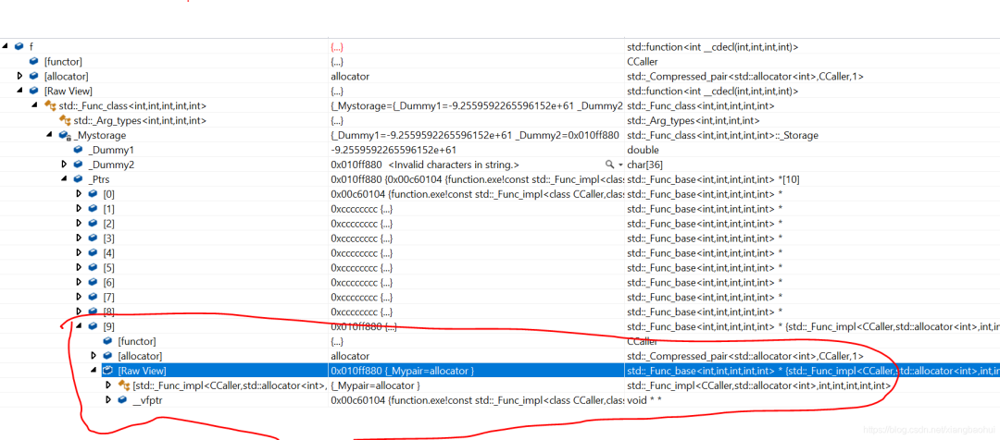
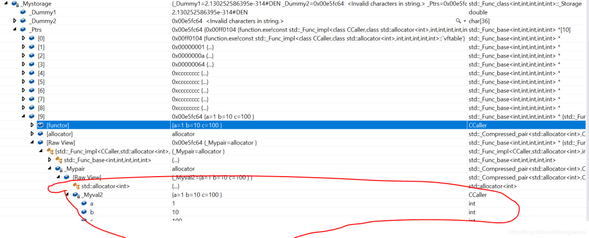

 
<!--BEGIN_DATA
{
    "create_date": "2021-07-06 23:20", 
    "modify_date": "2021-07-06 23:20", 
    "is_top": "0", 
    "summary": "C++ std::function 技术浅谈", 
    "tags": "C/C++", 
    "file_name": "C++ function技术浅谈.md"
}
END_DATA-->

#### <p>原文出处：<a href='https://mp.weixin.qq.com/s/PsPsYQevHftzu8-MCP3Njg' target='blank'>C++ std::function 技术浅谈</a></p>

std::function是一个函数对象的包装器，std::function的实例可以存储，复制和调用任何可调用的目标，包括：

  * 函数。
  * lamada表达式。
  * 绑定表达式或其他函数对象。
  * 指向成员函数和指向数据成员的指针。

当std::function对象没有初始化任何实际的可调用元素，调用std::function对象将抛出std::bad_function_call异常。

本文我们来谈一下std::function的实现原理。

## 1. std::function简介

在讨论其原理的时候，我们来熟悉一下这个东西是怎么使用的，C++标准库详细说明了这个的基本使用`http://www.cplusplus.com/reference/functional/function/`.

这里我们大概总结一下。

### 1.1 Member types

<table><thead><tr style="border-width: 1px 0px 0px;border-right-style: initial;border-bottom-style: initial;border-left-style: initial;border-right-color: initial;border-bottom-color: initial;border-left-color: initial;border-top-style: solid;border-top-color: rgb(204, 204, 204);background-color: white;"><th style="border-top-width: 1px;border-color: rgb(204, 204, 204);background-color: rgb(240, 240, 240);min-width: 85px;text-align: center;">成员类型</th><th style="border-top-width: 1px;border-color: rgb(204, 204, 204);background-color: rgb(240, 240, 240);min-width: 85px;text-align: center;">说明</th></tr></thead><tbody style="border-width: 0px;border-style: initial;border-color: initial;"><tr style="border-width: 1px 0px 0px;border-right-style: initial;border-bottom-style: initial;border-left-style: initial;border-right-color: initial;border-bottom-color: initial;border-left-color: initial;border-top-style: solid;border-top-color: rgb(204, 204, 204);background-color: white;"><td style="border-color: rgb(204, 204, 204);min-width: 85px;text-align: center;">result_type</td><td style="border-color: rgb(204, 204, 204);min-width: 85px;text-align: center;">返回类型</td></tr><tr style="border-width: 1px 0px 0px;border-right-style: initial;border-bottom-style: initial;border-left-style: initial;border-right-color: initial;border-bottom-color: initial;border-left-color: initial;border-top-style: solid;border-top-color: rgb(204, 204, 204);background-color: rgb(248, 248, 248);"><td style="border-color: rgb(204, 204, 204);min-width: 85px;text-align: center;">argument_type</td><td style="border-color: rgb(204, 204, 204);min-width: 85px;text-align: center;">如果函数对象只有一个参数，那么这个代表参数类型。</td></tr><tr style="border-width: 1px 0px 0px;border-right-style: initial;border-bottom-style: initial;border-left-style: initial;border-right-color: initial;border-bottom-color: initial;border-left-color: initial;border-top-style: solid;border-top-color: rgb(204, 204, 204);background-color: white;"><td style="border-color: rgb(204, 204, 204);min-width: 85px;text-align: center;">first_argument_type</td><td style="border-color: rgb(204, 204, 204);min-width: 85px;text-align: center;">如果函数对象有两个个参数，那么这个代表第一个参数类型。</td></tr><tr style="border-width: 1px 0px 0px;border-right-style: initial;border-bottom-style: initial;border-left-style: initial;border-right-color: initial;border-bottom-color: initial;border-left-color: initial;border-top-style: solid;border-top-color: rgb(204, 204, 204);background-color: rgb(248, 248, 248);"><td style="border-color: rgb(204, 204, 204);min-width: 85px;text-align: center;">second_argument_type</td><td style="border-color: rgb(204, 204, 204);min-width: 85px;text-align: center;">如果函数对象有两个个参数，那么这个代表第二个参数类型。</td></tr></tbody></table>

#### 1.2 Member functions

<table><thead><tr style="border-width: 1px 0px 0px;border-right-style: initial;border-bottom-style: initial;border-left-style: initial;border-right-color: initial;border-bottom-color: initial;border-left-color: initial;border-top-style: solid;border-top-color: rgb(204, 204, 204);background-color: white;"><th style="border-top-width: 1px;border-color: rgb(204, 204, 204);background-color: rgb(240, 240, 240);min-width: 85px;text-align: center;">成员函数声明</th><th style="border-top-width: 1px;border-color: rgb(204, 204, 204);background-color: rgb(240, 240, 240);min-width: 85px;text-align: center;">说明</th></tr></thead><tbody style="border-width: 0px;border-style: initial;border-color: initial;"><tr style="border-width: 1px 0px 0px;border-right-style: initial;border-bottom-style: initial;border-left-style: initial;border-right-color: initial;border-bottom-color: initial;border-left-color: initial;border-top-style: solid;border-top-color: rgb(204, 204, 204);background-color: white;"><td style="border-color: rgb(204, 204, 204);min-width: 85px;text-align: center;">constructor</td><td style="border-color: rgb(204, 204, 204);min-width: 85px;text-align: center;">构造函数：constructs a new std::function instance</td></tr><tr style="border-width: 1px 0px 0px;border-right-style: initial;border-bottom-style: initial;border-left-style: initial;border-right-color: initial;border-bottom-color: initial;border-left-color: initial;border-top-style: solid;border-top-color: rgb(204, 204, 204);background-color: rgb(248, 248, 248);"><td style="border-color: rgb(204, 204, 204);min-width: 85px;text-align: center;">destructor</td><td style="border-color: rgb(204, 204, 204);min-width: 85px;text-align: center;">析构函数：destroys a std::function instance</td></tr><tr style="border-width: 1px 0px 0px;border-right-style: initial;border-bottom-style: initial;border-left-style: initial;border-right-color: initial;border-bottom-color: initial;border-left-color: initial;border-top-style: solid;border-top-color: rgb(204, 204, 204);background-color: white;"><td style="border-color: rgb(204, 204, 204);min-width: 85px;text-align: center;">operator=</td><td style="border-color: rgb(204, 204, 204);min-width: 85px;text-align: center;">给定义的function对象赋值</td></tr><tr style="border-width: 1px 0px 0px;border-right-style: initial;border-bottom-style: initial;border-left-style: initial;border-right-color: initial;border-bottom-color: initial;border-left-color: initial;border-top-style: solid;border-top-color: rgb(204, 204, 204);background-color: rgb(248, 248, 248);"><td style="border-color: rgb(204, 204, 204);min-width: 85px;text-align: center;">operator bool</td><td style="border-color: rgb(204, 204, 204);min-width: 85px;text-align: center;">检查定义的function对象是否包含一个有效的对象</td></tr><tr style="border-width: 1px 0px 0px;border-right-style: initial;border-bottom-style: initial;border-left-style: initial;border-right-color: initial;border-bottom-color: initial;border-left-color: initial;border-top-style: solid;border-top-color: rgb(204, 204, 204);background-color: white;"><td style="border-color: rgb(204, 204, 204);min-width: 85px;text-align: center;">operator()</td><td style="border-color: rgb(204, 204, 204);min-width: 85px;text-align: center;">调用一个对象</td></tr></tbody></table>

#### 1.3 基本使用

```cpp
#include <iostream>  
#include <functional>  
    
int fun(int a, int b, int c, int d)  
{  
    std::cout << a << std::endl;  
    std::cout << b << std::endl;  
    std::cout << c << std::endl;  
    std::cout << d << std::endl;  
    return 0;  
}  
    
class CCaller  
{  
public:  
    int operator()(int a, int b, int c, int d)  
    {  
    std::cout << a << std::endl;  
    std::cout << b << std::endl;  
    std::cout << c << std::endl;  
    std::cout << d << std::endl;  
    return 0;  
    }  
};

int main()  
{  
    CCaller Caller;  
    std::function<int(int, int, int, int)> f;  
    
    f = [](int a, int b, int c, int d) -> int  
    {  
    std::cout << a << std::endl;  
    std::cout << b << std::endl;  
    std::cout << c << std::endl;  
    std::cout << d << std::endl;  
    return 0;  
    };  
    f(1, 2, 3, 4);  
    
    f = Caller;  
    f(10, 20, 30, 40);  
    
    f = fun;  
    f(100, 200, 300, 400);  
    
    return 0;  
}  
```    

从上面我们可以发现，std::function可以表示函数，lamada，可调用类对象。

## 2. std::function实现

在标准库中STL设计为如下：

```cpp  
template<class... _Types>  
    struct _Arg_types  
    { // provide argument_type, etc. (sometimes)  
    };  
    
template<class _Ty1>  
    struct _Arg_types<_Ty1>  
    { // provide argument_type, etc. (sometimes)  
    typedef _Ty1 argument_type;  
    };  
    
template<class _Ty1,  
    class _Ty2>  
    struct _Arg_types<_Ty1, _Ty2>  
    { // provide argument_type, etc. (sometimes)  
    typedef _Ty1 first_argument_type;  
    typedef _Ty2 second_argument_type;  
    };  
    
template<class _Ret,  
    class... _Types>  
    class _Func_class  
    : public _Arg_types<_Types...>  
    { // implement function template  
public:  
    typedef _Ret result_type;  
    
    typedef _Func_class<_Ret, _Types...> _Myt;  
    typedef _Func_base<_Ret, _Types...> _Ptrt;  
        
private:  
    bool _Local() const _NOEXCEPT  
    { // test for locally stored copy of object  
    return (_Getimpl() == _Getspace());  
    }  
    
    union _Storage  
    { // storage for small objects (basic_string is small)  
    max_align_t _Dummy1; // for maximum alignment  
    char _Dummy2[_Space_size]; // to permit aliasing  
    _Ptrt *_Ptrs[_Num_ptrs]; // _Ptrs[_Num_ptrs - 1] is reserved  
    };  
        _Storage _Mystorage;  
        };  
    
template<class _Ret, \  
    class... _Types> \  
    struct _Get_function_impl<_Ret CALL_OPT (_Types...)> \  
    { /* determine type from argument list */ \  
    typedef _Func_class<_Ret, _Types...> type; \  
    };  
    
template<class _Fty>  
    class function  
    : public _Get_function_impl<_Fty>::type  
    { // wrapper for callable objects  
public:  
    typedef function<_Fty> _Myt;  
    };  
```

上面的std::function继承关系比较简单，主要使用

```cpp
union _Storage  
{  
    // storage for small objects (basic_string is small)  
    max_align_t _Dummy1; // for maximum alignment  
    char _Dummy2[_Space_size]; // to permit aliasing  
    _Ptrt *_Ptrs[_Num_ptrs]; // _Ptrs[_Num_ptrs - 1] is reserved  
};  
```

这个来存储我们设置的可调用对象，我们从std::function的使用过程看一下整个原理。

### 2.1 函数对象赋值

我们使用的时候一般使用f = Caller;来设置函数对象，我们看下这个的实现过程。

```cpp  
template<class _Fx>  
    _Myt& operator=(reference_wrapper<_Fx> _Func) _NOEXCEPT  
{  
    // assign wrapper holding reference_wrapper to function object  
    this->_Tidy();  
    this->_Reset(_Func);  
    return (*this);  
}  
```

我们看`this->_Reset(_Func)`这个函数，因为这个才是设置函数可调用对象的东西。

```cpp
void _Set(_Ptrt *_Ptr) _NOEXCEPT  
{ // store pointer to object  
    _Mystorage._Ptrs[_Num_ptrs - 1] = _Ptr;  
}  
    
void _Reset_impl(_Fx&& _Val, const _Alloc& _Ax,  
    _Myimpl *, _Alimpl& _Al, false_type)  
{ // store copy of _Val with allocator, small (locally stored)  
    _Myimpl *_Ptr = static_cast<_Myimpl *>(_Getspace());  
    _Al.construct(_Ptr, _STD forward<_Fx>(_Val), _Ax);  
    _Set(_Ptr);  
}  
    
template<class _Fx,  
class _Alloc>  
    void _Reset_alloc(_Fx&& _Val, const _Alloc& _Ax)  
{ // store copy of _Val with allocator  
    if (!_Test_callable(_Val))  
    { // null member pointer/function pointer/std::function  
    return; // already empty  
    }  
    
    typedef typename decay<_Fx>::type _Decayed;  
    typedef _Func_impl<_Decayed, _Alloc, _Ret, _Types...> _Myimpl;  
    _Myimpl *_Ptr = 0;  
    
    typedef _Wrap_alloc<_Alloc> _Alimpl0;  
    typedef typename _Alimpl0::template rebind<_Myimpl>::other _Alimpl;  
    _Alimpl _Al(_Ax);  
    
    _Reset_impl(_STD forward<_Fx>(_Val), _Ax,  
    _Ptr, _Al, _Is_large<_Myimpl>());  
}  
    
template<class _Fx>  
    void _Reset(_Fx&& _Val)  
{  
    // store copy of _Val  
    _Reset_alloc(_STD forward<_Fx>(_Val), allocator<int>());  
}  
```

这个代码的主要意思就是创建一个`_Func_impl<_Decayed, _Alloc, _Ret, _Types...>`指针，然后赋值`_Mystorage._Ptrs[_Num_ptrs - 1] = _Ptr;`。

设置之后，我们看下调用操作怎么完成。

### 2.2 operator() 的实现

调用操作主要是通过operator()来实现的，我们看下这个的实现过程。

```cpp    
_Ptrt *_Getimpl() const _NOEXCEPT  
{ // get pointer to object  
    return (_Mystorage._Ptrs[_Num_ptrs - 1]);  
}  
    
_Ret operator()(_Types... _Args) const  
{ // call through stored object  
    if (_Empty())  
    _Xbad_function_call();  
    return (_Getimpl()->_Do_call(_STD forward<_Types>(_Args)...));  
}  
```

因此，我们是通过`_Func_impl<_Decayed, _Alloc, _Ret, _Types...>`转发了调用操作`_Do_call`

### 2.3 _Func_impl的实现

```cpp  
class _Func_impl  
    : public _Func_base<_Rx, _Types...>  
{ // derived class for specific implementation types  
public:  
    typedef _Func_impl<_Callable, _Alloc, _Rx, _Types...> _Myt;  
    typedef _Func_base<_Rx, _Types...> _Mybase;  
    typedef _Wrap_alloc<_Alloc> _Myalty0;  
    typedef typename _Myalty0::template rebind<_Myt>::other _Myalty;  
    typedef is_nothrow_move_constructible<_Callable> _Nothrow_move;  
    
    
    virtual _Rx _Do_call(_Types&&... _Args)  
    { // call wrapped function  
    return (_Invoke_ret(_Forced<_Rx>(), _Callee(),  
    _STD forward<_Types>(_Args)...));  
    }  
    
    _Compressed_pair<_Alloc, _Callable> _Mypair;  
};  
```

`_Func_impl`这个类通过`_Do_call`来转发函数对象的调用操作。

## 3. 总结

这里我们看下std::function的结构信息，如下：



从这里我们发现`_Storage`大小为：

```cpp    
const int _Num_ptrs = 6 + 16 / sizeof (void *);  
const size_t _Space_size = (_Num_ptrs - 1) * sizeof (void *);  
```

`_Num_ptrs`值为10。

如果我们赋值的对象有成员变量会是什么情况呢？例如如下：

```cpp 
class CCaller  
{  
public:  
    int operator()(int a, int b, int c, int d)  
    {  
    std::cout << a << std::endl;  
    std::cout << b << std::endl;  
    std::cout << c << std::endl;  
    std::cout << d << std::endl;  
    return 0;  
    }  
    
    int a = 1;  
    int b = 10;  
    int c = 100;  
}; 

int main()  
{  
    CCaller Caller;  
    std::function<int(int, int, int, int)> f;  
    
    f = Caller;  
    f(10, 20, 30, 40);  
    return 0;  
}  
```

内存结构如下：



由此我们可以发现`std::function`是利用一个`_Compressed_pair<_Alloc, _Callable> _Mypair;`拷贝了元素的数据信息。

主要的初始化过程为：

```cpp    
emplate<class _Fx,  
class _Alloc>  
    void _Reset_alloc(_Fx&& _Val, const _Alloc& _Ax)  
{ // store copy of _Val with allocator  
    if (!_Test_callable(_Val))  
    { // null member pointer/function pointer/std::function  
    return; // already empty  
    }  
    
    typedef typename decay<_Fx>::type _Decayed;  
    typedef _Func_impl<_Decayed, _Alloc, _Ret, _Types...> _Myimpl;  
    _Myimpl *_Ptr = 0;  
    
    typedef _Wrap_alloc<_Alloc> _Alimpl0;  
    typedef typename _Alimpl0::template rebind<_Myimpl>::other _Alimpl;  
    _Alimpl _Al(_Ax);  
    
    _Reset_impl(_STD forward<_Fx>(_Val), _Ax,  
    _Ptr, _Al, _Is_large<_Myimpl>());  
}  
```

其中`decay<_Fx>::type`定义了`_Compressed_pair<_Alloc, _Callable> _Mypair;`中`_Callable`的类型，这个声明如下（也就是去掉引用和其他属性信息）：

```cpp
template<class _Ty>  
struct decay  
{ // determines decayed version of _Ty  
    typedef typename remove_reference<_Ty>::type _Ty1;  
    
    typedef typename _If<is_array<_Ty1>::value,  
    typename remove_extent<_Ty1>::type *,  
    typename _If<is_function<_Ty1>::value,  
    typename add_pointer<_Ty1>::type,  
    typename remove_cv<_Ty1>::type>::type>::type type;  
};  
```

至此，我们大致上完成了std::function的原理分析了，希望在后续的使用中，我们能够知道std::function在什么情况下可以使用，以及背后完成的事情。
