 
<!--BEGIN_DATA
{
    "create_date": "2020-06-05 23:57", 
    "modify_date": "2020-06-05 23:57", 
    "is_top": "0", 
    "summary": "内存模型基础 C++11支持的几种内存模型", 
    "tags": "C/C++、数据结构、算法", 
    "file_name": "C++11中的内存模型.md"
}
END_DATA-->

####
原文出处：<a href='https://www.codedump.info/post/20191214-cxx11-memory-model-1/' target='blank'>C++11中的内存模型上篇 - 内存模型基础</a>

前段时间花了些精力研究C++11引入的内存模型相关的操作，于是把相关的知识都学习了一下，将这个学习过程整理为两篇文档，这是第一篇，主要分析内存模型的一些基础概念，第二篇展开讨论C++11相关的操作。

###CPU架构的演进

早期的CPU，CPU之间能共享访问的只有内存，此时的结构大体如图：

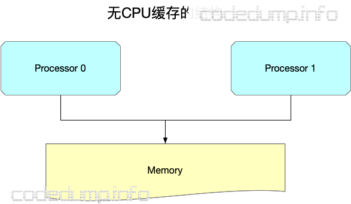

随着硬件技术的发展，内存的访问已经跟不上CPU的执行速度，此时内存反而变成了瓶颈。为了加速读写速度，每个CPU也都有自己内部才能访问的缓存，结构变成了这样：

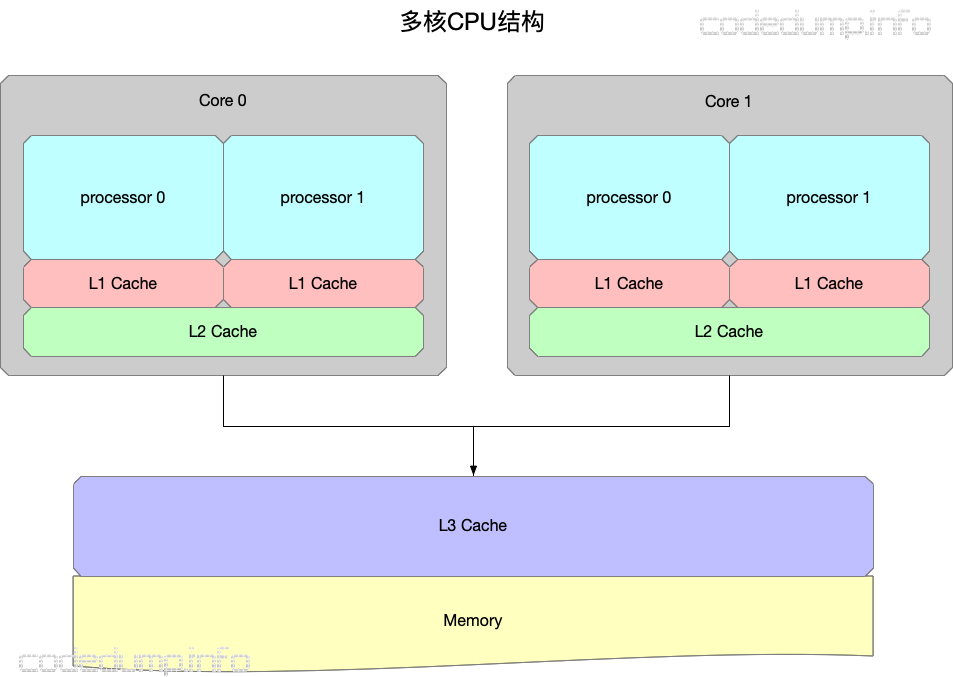

其中：

  * 有多个CPU处理器，每个CPU处理器内部又有多个核心。
  * 存在只能被一个CPU核心访问的L1 cache。
  * 存在只能被一个CPU处理器的多个核心访问的L2 cache。
  * 存在能被所有CPU处理器都能访问到的L3 cache以及内存。
  * L1 cache、L2 cache、L3 cache的容量空间依次变大，但是访问速度依次变慢。

当CPU结构发生变化，增加了只能由内部才能访问的缓存之后，一些在旧架构上不会出现的问题，在新的架构上就会出现。而本篇的主角内存模型（memory model），其作用就是规定了各种不同的访问共享内存的方式，不同的内存模型，既需要编译器的支持，也需要硬件CPU的支持。

我们从一个最简单的多线程访问变量问题谈起。

###简单的多线程访问数据问题

假设在程序执行之前，A=B=0，有两个线程同时分别执行如下的代码：

<table>
<thead>
<tr>
<th>线程1</th>
<th>线程2</th>
</tr>
</thead>

<tbody>
<tr>
<td>1. A=1</td>
<td>3. B=2</td>
</tr>

<tr>
<td>2. print(B)</td>
<td>4. print(A)</td>
</tr>
</tbody>
</table>

问上述程序的执行结果如何？

这个问题是一个简单的排列组合问题，其结果有：

> 2（先选择A或B输出）* 2（输出修改前还是之后的结果）* 1（前面第一步选择了一个变量之后，现在只能选剩下的变量）* 2（输出修改前还是之后的结果）= 8

其可能的结果包括：(0,0)、(1,0)、(0,2)、(1,2)、(0,1)、(2,0)、(2,1)。（这里只有7个结果，是因为有两个(0,0)，所以少了一个）。

由于多个线程交替执行，可能有以下几种结果，下面来分别解析。

####两个线程依次执行

最简单的情况，就是这两个线程依次执行，即一个线程执行完毕之后再执行另一个线程的指令，这种情况下有两种可能：

  * 1->2->3->4

这种情况先执行完毕线程1，再执行线程2，最后输出的结果是(0,1)。

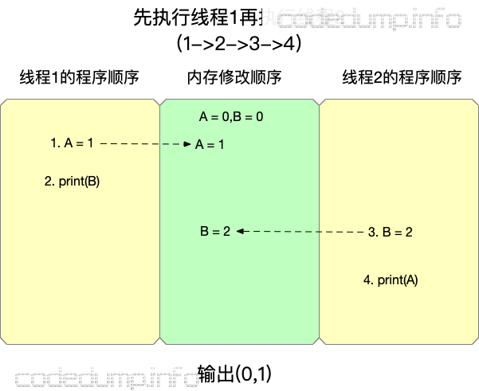

  * 3->4->1->2

这种情况先执行完毕线程2，再执行线程1，最后输出的结果是(0,2)。

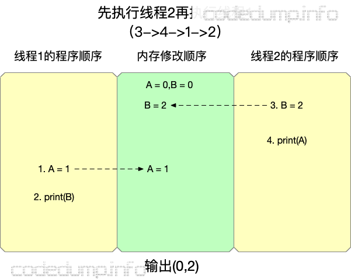

####两个线程交替执行

这样情况下，先执行的可能是线程1或者线程2，来看线程1先执行的情况。

  * 1->3->2->4

这种情况下的输出是（2,1）。

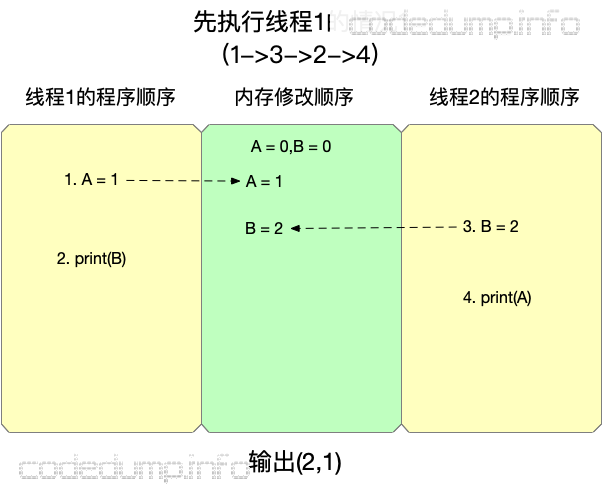

  * 1->3->4->2

这种情况下的输出是（1,2）。

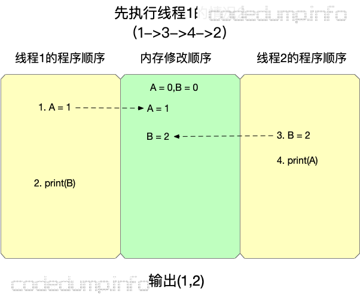

以上是第一条指令先执行线程1执行的情况，同样地也有先执行线程2指令的情况（3-1->4->2和3->1->2-4），这里不再列出，有兴趣的读者可以自行画图理解。

####不可能出现的情况

除了以上的情况之外，还有一种可能是输出(0,0)，但是这种输出在一般情况下不可能出现（我们接下来会解释什么情况下可能出现），下面来做解释。

首先先来理解一个概念“happen-before（先于）”，比如对于变量A而言，其初始值是0，有如下两个操作：

    
    
    A = 1
    print(A)
    

那么要对操作print(A)输出结果0，就要保证"print(A)"这个操作“happen-before（先于）”操作"A=1"。

有了happen-before这个概念的初步印象，就可以进一步解释为什么在SC的要求之下，程序不可能输出(0,0)，在下面的讲解中，用箭头来表示两个操作之间的happen-before关系。

由前面的分析可知，要求对变量A输出0，那么意味着"print(A)"操作happen-before修改变量A的赋值操作"A=1"。同样的，要求针对变量B的输出为0，那么意味着"print(B)"操作happen-before修改变量B的赋值操作"B=2"。

用图来表示就是：

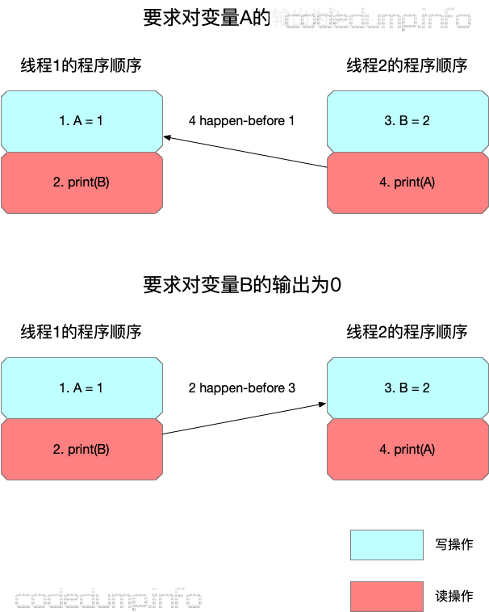

由于输出结果(0,0)要求同时满足前面的两个分别针对变量A和B的happen-before关系，同时又不能违背程序顺序，因此出错了，见下图：

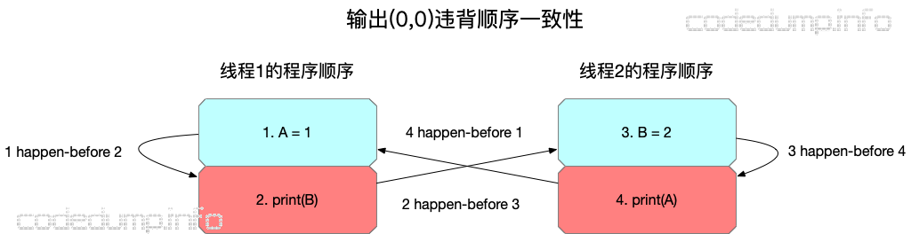

首先，根据前面分析的输出关系，必须保证“4 happen-before 1”以及“2 happen-before 3”。同时，一个处理器内的执行顺序必须按照程序顺序（program order），因此也必须保证“1 happen before 2”以及“2 happen before 3”。

当前面几个happen before关系合在一起，这个执行过程出现了死循环，不知道在哪里终止了。

###Sequential Consistency (顺序一致性）

这里就可以引入最直白、简单的一种内存模型：顺序一致性内存模型（Sequential Consistency）了。

Sequential Consistency（以下简称SC）由Lamport提出，其严格定义是：

> “… the result of any execution is the same as if the operations of all the processors were executed in some sequential order, and the operations of each individual processor appear in this sequence in the order specified by its program.”

这句话看起来很拗口，它对程序的执行结果有两个要求：

  * 每个处理器的执行顺序和代码中的顺序（program order）一样。
  * 所有处理器都只能看到一个单一的操作执行顺序。

在要求满足SC内存模型的情况下，上面多线程执行中（0,0）是不可能输出的。

我们以IM中的群聊消息作为例子说明顺序一致性的这两个要求。在这个例子中，群聊中的每个成员，相当于多核编程中的一个处理器，那么对照顺序一致性的两个要求就是：

  * 每个人自己发出去的消息，必然是和ta说话的顺序一致的。即用户A在群聊中依次说了消息1和消息2，在群聊天的时候也必然是先看到消息1然后再看到消息2，这就是前面顺序一致性的第一个要求。
  * 群聊中有多个用户参与聊天（多处理器），如果所有人看到的消息顺序都一样，那么就满足了前面顺序一致性的第二个要求了，但是这个顺序首先不能违背前面的第一个要求。

####顺序一致性的缺点

从以上的分析可以看到，顺序一致性实际上是一种强一致性，可以想象成整个程序过程中由一个开关来选择执行的线程，这样才能同时保证顺序一致性的两个条件。

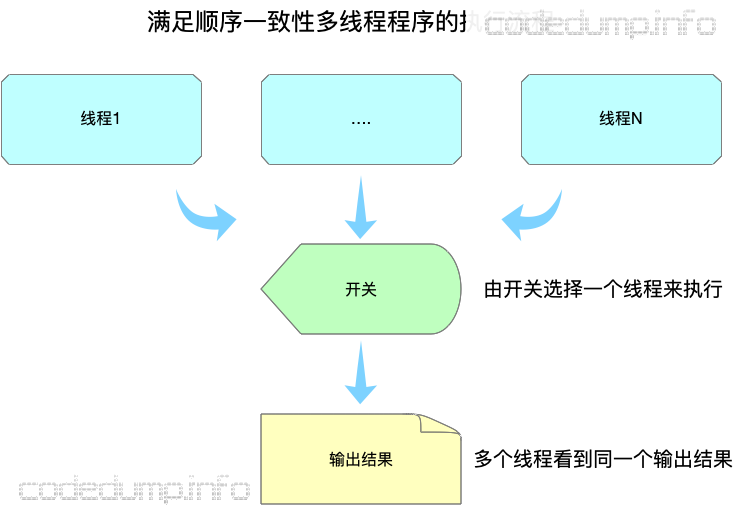

可以看到，这样实际上还是相当于同一时间只有一个线程在工作，这种保证导致了程序是低效的，无法充分利用上多核的优点。

###全存储排序（Total Store Ordering, 简称TSO）

有一些CPU架构，在处理核心中增加写缓存，一个写操作只要写入到本核心的写缓存中就可以返回，此时的CPU结构如图所示（图中并没有画出三级cache）：

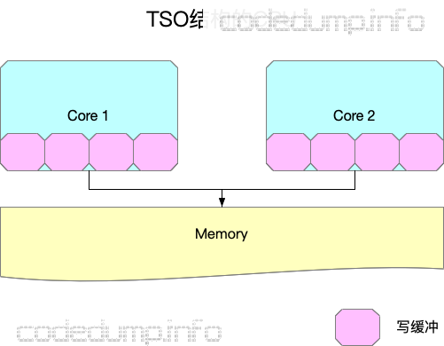

在这种结构下，SC所不允许的一些操作可能会出现。

还是以前面分析SC的程序例子来说明：

<table>
<thead>
<tr>
<th>线程1</th>
<th>线程2</th>
</tr>
</thead>

<tbody>
<tr>
<td>1. A=1</td>
<td>3. B=2</td>
</tr>

<tr>
<td>2. print(B)</td>
<td>4. print(A)</td>
</tr>
</tbody>
</table>

在新的CPU架构下，写一个值可能值写到本核心的缓冲区中就返回了，接着执行下面的一条指令，因此可能出现以下的情况：

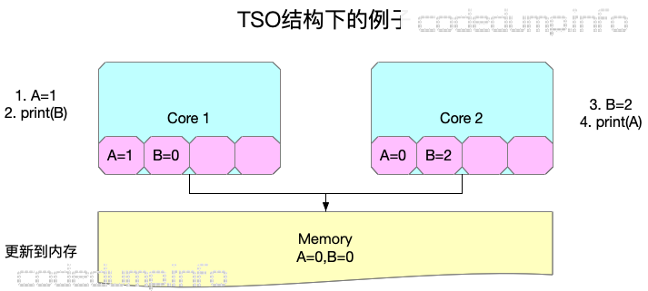

  * 执行操作1，core 1写入A的新值1到core 1的缓冲区中之后就马上返回了，还并没有更新到所有CPU都能访问到的内存中。
  * 执行操作3，core 2写入B的新值2到core 2的缓冲区中之后就马上返回了，还并没有更新到所有CPU都能访问到的内存中。
  * 执行操作2，由于操作2访问到本core缓冲区中存储的B值还是原来的0，因此输出0。
  * 执行操作4，由于操作4访问到本core缓冲区中存储的A值还是原来的0，因此输出0。

可以看到，在引入了只能由每个core才能访问到的写缓冲区之后，之前SC中不可能出现的输出(0,0)的情况在这样的条件下可能出现了。

###松弛型内存模型（Relaxed memory models）

以上已经介绍了两种内存模型，SC是最简单直白的内存模型，TSO在SC的基础上，加入了写缓存，写缓存的加入导致了一些在SC条件下不可能出现的情况也成为了可能。

然而，即便如此，以上两种内存模型都没有改变单线程执行一个程序时的执行顺序。在这里要讲的松弛型内存模型，则改变了程序的执行顺序。

在松散型的内存模型中，编译器可以在满足程序单线程执行结果的情况下进行重排序（reorder），来看下面的程序：

    
    
    int A, B;
    void foo() {
      A = B + 1;
      B = 0;
    }
    int main() {
      foo();
      return 0;
    }
    

如果在不使用优化的情况下编译，gcc foo.c -S，foo函数中针对A和B操作的汇编代码如下：

    
    
    	movl	B(%rip), %eax
    	addl	$1, %eax
    	movl	%eax, A(%rip)
    	movl	$0, B(%rip)
    

即先把变量B的值赋给寄存器eax，将寄存器eax加一的结果赋值给变量A，最后再将变量B置为0。

而如果使用O2优化编译，gcc foo.c -S -O2 则得到下面的汇编代码：

    
    
    	movl	B(%rip), %eax
    	movl	$0, B(%rip)
    	addl	$1, %eax
    	movl	%eax, A(%rip)
    

即先把变量B的值赋给寄存器eax，然后变量B置零，再将寄存器eax加一的结果赋值给变量A。

其原因在于，foo函数中，只要将变量B的值暂存下来，那么对变量B的赋值操作可以被打乱而并不影响程序的执行结果，这就是编译器可以做的重排序优化。

回到前面的例子中，在松弛型内存模型中，程序的执行顺序就不见得和代码中编写的一样了，这是这种内存模型和SC、TSO模型最大的差异。

仍然以IM群聊消息为例子说明这个问题。假设有多人在群里聊天，如果A说的消息1与B说的消息2之间，没用明确的先后顺序，比如消息1是回复或者引用了消息2的话，那么其实在整个群聊视图里面，两者的先后顺序如何是无关紧要的。即参与群聊的两个用户，其中一个用户可能看到消息1在消息2之前，另一个用户看到的顺序相反，这都是无关大局的，因为两个消息之间没有关系。

####内存栅栏（memory barrier）

讲完了三种内存模型，这里还需要了解一下内存栅栏的概念。

由于有了缓冲区的出现，导致一些操作不用到内存就可以返回继续执行后面的操作，为了保证某些操作必须是写入到内存之后才执行，就引入了内存栅栏（memory barrier，又称为memory fence）操作。内存栅栏指令保证了，在这条指令之前所有的内存操作的结果，都在这个指令之后的内存操作指令被执行之前，写入到内存中。也可以换另外的角度来理解内存栅栏指令的作用：显式的在程序的某些执行点上保证SC。

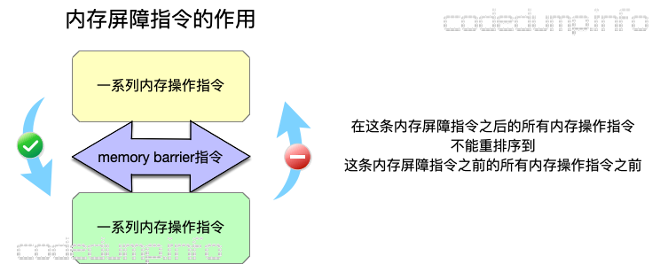

再次以前面的例子来说明这个指令，在X64下面，内存屏障指令使用汇编指令`asm volatile ("pause" ::: "memory");`来实现，如果将这个指令放到两个赋值语句之间：

    
    
    int A, B;
    void foo()
    {
        A = B + 1;
        asm volatile ("pause" ::: "memory");
        B = 0;
    }
    int main() {
      foo();
      return 0;
    }
    

那么再次使用O2编译出来的汇编代码就变成了：

    
    
    .LFB1:
      .cfi_startproc
      movl  B(%rip), %eax
      addl  $1, %eax
      movl  %eax, A(%rip)
    #APP
    ##6 "foo.c" 1
      pause
    ##0 "" 2
    #NO_APP
      movl  $0, B(%rip)
    

可以看到，插入内存屏障指令之后，生成的汇编代码顺序就不会乱序了。

###小结

以上，从引入一个多线程读写多个变量的例子出发，依次讲解了SC、TSO、Relaxed
model三种内存模型，这三种内存模型其一致性要求依次减弱，其总结如下图：

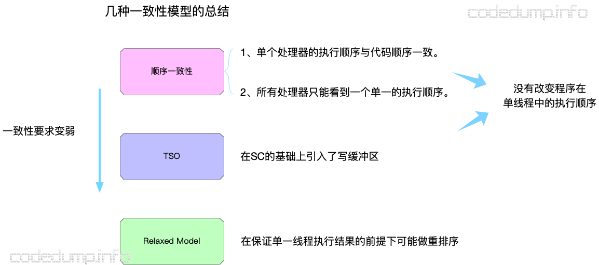

有了上面的介绍，下一篇介绍C++11之后引入的几种内存模型操作。

###参考资料

  * 《A Primer on Memory Consistency and Cache Coherence》
  * [《为什么程序员需要关心顺序一致性（Sequential Consistency）而不是Cache一致性（Cache Coherence？）》](http://www.parallellabs.com/2010/03/06/why-should-programmer-care-about-sequential-consistency-rather-than-cache-coherence/)
  * [《Memory Consistency Models: A Tutorial》](https://www.cs.utexas.edu/~bornholt/post/memory-models.html)
  * [《Memory Ordering at Compile Time》](https://preshing.com/20120625/memory-ordering-at-compile-time/)

####
原文出处：<a href='https://www.codedump.info/post/20191214-cxx11-memory-model-2/' target='blank'>C++11中的内存模型下篇 - C++11支持的几种内存模型</a>

在本系列的上篇，介绍了内存模型的基本概念，接下来看C++11中支持的几种内存模型。

###几种关系术语

在接着继续解释之前，先了解一下几种关系术语。

####sequenced-before

sequenced-before用于表示**单线程**之间，两个操作上的先后顺序，这个顺序是非对称、可以进行传递的关系。

它不仅仅表示两个操作之间的先后顺序，还表示了操作结果之间的可见性关系。两个操作A和操作B，如果有A sequenced-before B，除了表示操作A的顺序在B之前，还表示了操作A的结果操作B可见。

####happens-before

与sequenced-before不同的是，happens-before关系表示的**不同线程**之间的操作先后顺序，同样的也是非对称、可传递的关系。

如果A happens-before B，则A的内存状态将在B操作执行之前就可见。在上一篇文章中，某些情况下一个写操作只是简单的写入内存就返回了，其他核心上的操作不一定能马上见到操作的结果，这样的关系是不满足happens-before的。

####synchronizes-with

synchronizes-with关系强调的是变量被修改之后的传播关系（propagate），即如果一个线程修改某变量的之后的结果能被其它线程可见，那么就是满足synchronizes-with关系的。

显然，满足synchronizes-with关系的操作一定满足happens-before关系了。

###C++11中支持的内存模型

从C++11开始，就支持以下几种内存模型：

    
    
    enum memory_order {
        memory_order_relaxed,
        memory_order_consume,
        memory_order_acquire,
        memory_order_release,
        memory_order_acq_rel,
        memory_order_seq_cst
    };
    

与内存模型相关的枚举类型有以上六种，但是其实分为四类，如下图所示，其中对一致性的要求逐渐减弱，以下来分别讲解。

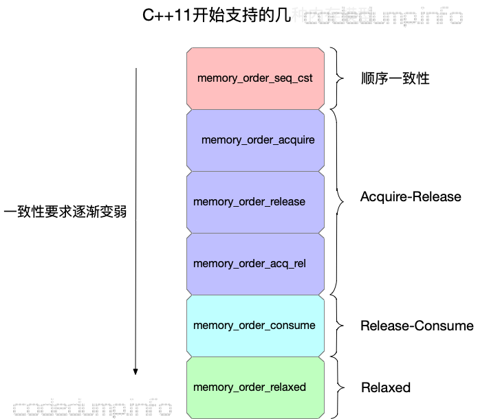

###`memory_order_seq_cst`

这是默认的内存模型，即上篇文章中分析过的顺序一致性内存模型，由于在上篇中的相关概念已经做过详细的介绍，这里就不再阐述了。仅列出引用自《C++ Concurrency In Action》的示例代码。

    
    
    #include <atomic>
    #include <thread>
    #include <assert.h>

    std::atomic<bool> x,y;
    std::atomic<int> z;

    void write_x()
    {
        x.store(true,std::memory_order_seq_cst);
    }

    void write_y()
    {
        y.store(true,std::memory_order_seq_cst);
    }

    void read_x_then_y()
    {
        while(!x.load(std::memory_order_seq_cst));
        if(y.load(std::memory_order_seq_cst))
            ++z;
    }

    void read_y_then_x()
    {
        while(!y.load(std::memory_order_seq_cst));
        if(x.load(std::memory_order_seq_cst))
            ++z;
    }

    int main()
    {
        x=false;
        y=false;
        z=0;
        std::thread a(write_x);
        std::thread b(write_y);
        std::thread c(read_x_then_y);
        std::thread d(read_y_then_x);
        a.join();
        b.join();
        c.join();
        d.join();
        assert(z.load()!=0);
    }
    

由于采用了顺序一致性模型，因此最后的断言不可能发生，即在程序结束时不可能出现z为0的情况。

###`memory_order_relaxed`

这种类型对应的松散内存模型，这种内存模型的特点是：

  * 针对一个变量的读写操作是原子操作；
  * 不同线程之间针对该变量的访问操作先后顺序不能得到保证，即有可能乱序。

来看示例代码：

    
    
    #include <atomic>
    #include <thread>
    #include <assert.h>

    std::atomic<bool> x,y;
    std::atomic<int> z;

    void write_x_then_y()
    {
        x.store(true,std::memory_order_relaxed);
        y.store(true,std::memory_order_relaxed);
    }

    void read_y_then_x()
    {
        while(!y.load(std::memory_order_relaxed));
        if(x.load(std::memory_order_relaxed))
            ++z;
    }

    int main()
    {
        x=false;
        y=false;
        z=0;
        std::thread a(write_x_then_y);
        std::thread b(read_y_then_x);
        a.join();
        b.join();
        assert(z.load()!=0);
    }
    

在上面的代码中，对原子变量的访问都使用`memory_order_relaxed`模型，导致了最后的断言可能失败，即在程序结束时z可能为0。

###Acquire-Release

  * `memory_order_acquire`：用来修饰一个读操作，表示在本线程中，所有后续的关于此变量的内存操作都必须在本条原子操作完成后执行。

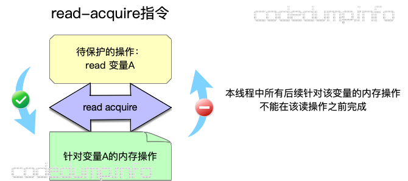

  * memory_order_release：用来修饰一个写操作，表示在本线程中，所有之前的针对该变量的内存操作完成后才能执行本条原子操作。

  * `memory_order_acq_rel`：同时包含`memory_order_acquire`和`memory_order_release`标志。

来看示例代码：

    
    
    // 5.7.cpp
    #include <atomic>
    #include <thread>
    #include <assert.h>

    std::atomic<bool> x,y;
    std::atomic<int> z;

    void write_x()
    {
        x.store(true,std::memory_order_release);
    }

    void write_y()
    {
        y.store(true,std::memory_order_release);
    }

    void read_x_then_y()
    {
        while(!x.load(std::memory_order_acquire));
        if(y.load(std::memory_order_acquire))
            ++z;
    }

    void read_y_then_x()
    {
        while(!y.load(std::memory_order_acquire));
        if(x.load(std::memory_order_acquire))
            ++z;
    }

    int main()
    {
        x=false;
        y=false;
        z=0;
        std::thread a(write_x);
        std::thread b(write_y);
        std::thread c(read_x_then_y);
        std::thread d(read_y_then_x);
        a.join();
        b.join();
        c.join();
        d.join();
        assert(z.load()!=0);
    }
    

上面这个例子中，并不能保证程序最后的断言即z!=0为真，其原因在于：在不同的线程中分别针对x、y两个变量进行了同步操作并不能保证x、y变量的读取操作。

线程`write_x`针对变量x使用了`write-release`模型，这样保证了`read_x_then_y`函数中，在load变量y之前x为true；同理线程`write_y`针对变量y使用了write-release模型，这样保证了`read_y_then_x`函数中，在load变量x之前y为true。

然而即便是这样，仍然可能出现以下类似的情况：

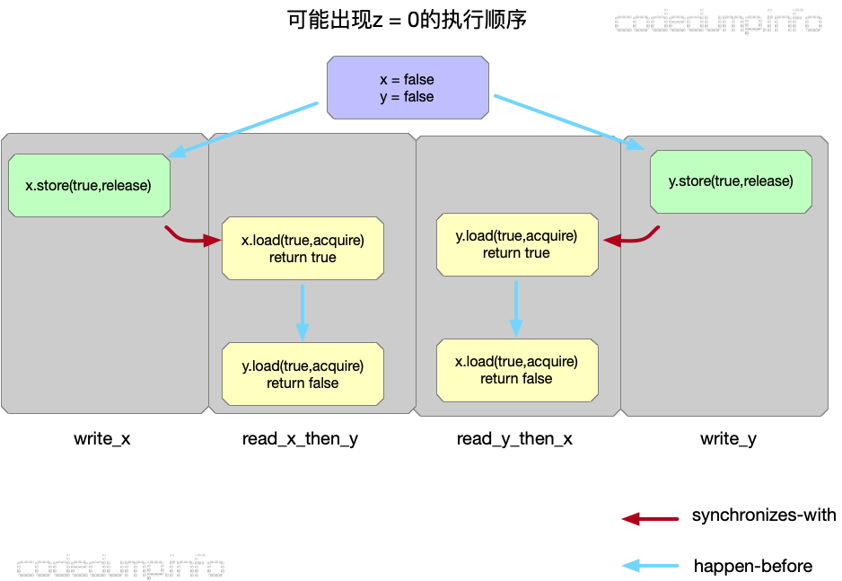

如上图所示：

  * 初始条件为x = y = false。
  * 由于在`read_x_and_y`线程中，对x的load操作使用了acquire模型，因此保证了是先执行`write_x`函数才到这一步的；同理先执行`write_y`才到`read_y_and_x`中针对y的load操作。
  * 然而即便如此，也可能出现在`read_x_then_y`中针对y的load操作在y的store操作之前完成，因为y.store操作与此之间没有先后顺序关系；同理也不能保证x一定读到true值，因此到程序结束是就出现了z = 0的情况。

从上面的分析可以看到，即便在这里使用了release-acquire模型，仍然没有保证z=0，其原因在于：最开始针对x、y两个变量的写操作是分别在`write_x`和`write_y`线程中进行的，不能保证两者执行的顺序导致。因此修改如下：

    
    
    // 5.8.cpp
    #include <atomic>
    #include <thread>
    #include <assert.h>

    std::atomic<bool> x,y;
    std::atomic<int> z;
    
    void write_x_then_y()
    {
        x.store(true,std::memory_order_relaxed);
        y.store(true,std::memory_order_release);
    }
    
    void read_y_then_x()
    {
        while(!y.load(std::memory_order_acquire));
        if(x.load(std::memory_order_relaxed))
            ++z;
    }
    
    int main()
    {
        x=false;
        y=false;
        z=0;
        std::thread a(write_x_then_y);
        std::thread b(read_y_then_x);
        a.join();
        b.join();
        assert(z.load()!=0);
    }
    

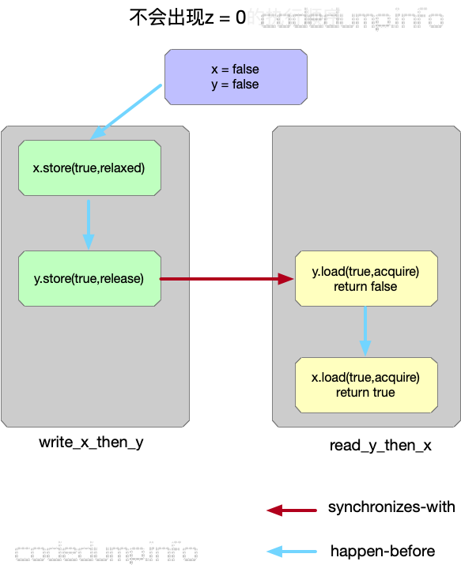

如上图所示：

  * 初始条件为x = y = false。
  * 在`write_x_then_y`线程中，先执行对x的写操作，再执行对y的写操作，由于两者在同一个线程中，所以即便针对x的修改操作使用relaxed模型，修改x也一定在修改y之前执行。
  * 在`write_x_then_y`线程中，对y的load操作使用了acquire模型，而在线程`write_x_then_y`中针对变量y的读操作使用release模型，因此保证了是先执行`write_x_then_y`函数才到`read_y_then_x`的针对变量y的load操作。
  * 因此最终的执行顺序如上图所示，此时不可能出现z=0的情况。

从以上的分析可以看出，针对同一个变量的release-acquire操作，更多时候扮演了一种“线程间使用某一变量的同步”作用，由于有了这个语义的保证，做到了线程间操作的先后顺序保证（inter-thread happens-before）。

###Release-Consume

从上面对Acquire-Release模型的分析可以知道，虽然可以使用这个模型做到两个线程之间某些操作的synchronizes-with关系，然后这个粒度有些过于大了。

在很多时候，线程间只想针对有依赖关系的操作进行同步，除此之外线程中的其他操作顺序如何无所谓。比如下面的代码中：

    
    
    b = *a;
    c = *b;
    

其中第二行代码的执行结果依赖于第一行代码的执行结果，此时称这两行代码之间的关系为“carry-a-dependency”。C++中引入的`memory_order_consume`内存模型就针对这类代码间有明确的依赖关系的语句限制其先后顺序。

来看下面的示例代码：

    
    
    // 5.10
    #include <string>
    #include <thread>
    #include <atomic>
    #include <assert.h>

    struct X
    {
        int i;
        std::string s;
    };

    std::atomic<X*> p;
    std::atomic<int> a;

    void create_x()
    {
        X* x=new X;
        x->i=42;
        x->s="hello";
        a.store(99,std::memory_order_relaxed);
        p.store(x,std::memory_order_release);
    }

    void use_x()
    {
        X* x;
        while(!(x=p.load(std::memory_order_consume)))
            std::this_thread::sleep_for(std::chrono::microseconds(1));
        assert(x->i==42);
        assert(x->s=="hello");
        assert(a.load(std::memory_order_relaxed)==99);
    }

    int main()
    {
        std::thread t1(create_x);
        std::thread t2(use_x);
        t1.join();
        t2.join();
    }
    

以上的代码中：

  * create_x线程中的store(x)操作使用`memory_order_release`，而在`use_x`线程中，有针对x的使用`memory_order_consume`内存模型的load操作，两者之间由于有carry-a-dependency关系，因此能保证两者的先后执行顺序。所以，x->i == 42以及x->s=="hello"这两个断言都不会失败。
  * 然而，`create_x`中针对变量a的使用relax内存模型的store操作，`use_x`线程中也有针对变量a的使用relax内存模型的load操作。这两者的先后执行顺序，并不受前面的`memory_order_consume`内存模型影响，所以并不能保证前后顺序，因此断言`a.load(std::memory_order_relaxed)==99`真假都有可能。

以上可以对比Acquire-Release以及Release-Consume两个内存模型，可以知道：

  * Acquire-Release能保证不同线程之间的Synchronizes-With关系，这同时也约束到同一个线程中前后语句的执行顺序。
  * 而Release-Consume只约束有明确的carry-a-dependency关系的语句的执行顺序，同一个线程中的其他语句的执行先后顺序并不受这个内存模型的影响。

###参考资料

  * 《C++ Concurrency In Action》
  * [《The Purpose of memory_order_consume in C++11》](https://preshing.com/20140709/the-purpose-of-memory_order_consume-in-cpp11/)
  * [《The Synchronizes-With Relation》](https://preshing.com/20130823/the-synchronizes-with-relation/)
