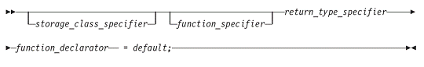
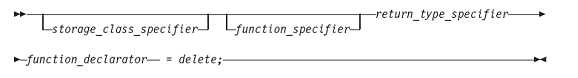

 
<!--BEGIN_DATA
{
    "create_date": "2018-06-04 15:04", 
    "modify_date": "2018-06-04 15:04", 
    "is_top": "0", 
    "summary": "C++11标准新特性Defaulted和Deleted函数", 
    "tags": "C/C++", 
    "file_name": "C++11标准新特性Defaulted和Deleted函数.md"
}
END_DATA-->

####
原文出处：<a href='https://www.ibm.com/developerworks/cn/aix/library/1212_lufang_c11new/' target='blank'>C++11标准新特性Defaulted和Deleted函数</a>

###Defaulted 函数

####背景问题

C++的类有四类特殊成员函数，它们分别是：默认构造函数、析构函数、拷贝构造函数以及拷贝赋值运算符。这些类的特殊成员函数负责创建、初始化、销毁，或者拷贝类的对象。如果程序员没有显式地为一个类定义某个特殊成员函数，而又需要用到该特殊成员函数时，则编译器会隐式的为这个类生成一个默认的特殊成员函数。例如：

######清单 1
	    
	 class X{ 
	 private: 
	  int a; 
	 }; 
	 
	 X x;

在清单 1 中，程序员并没有定义类 `X` 的默认构造函数，但是在创建类 `X` 的对象 `x` 的时候，又需要用到类 `X` 的默认构造函数，此时，编译器会隐式的为类 `X` 生成一个默认构造函数。该自动生成的默认构造函数没有参数，包含一个空的函数体，即 `X::X（）{}`。虽然自动生成的默认构造函数仅有一个空函数体，但是它仍可用来成功创建类 `X` 的对象 `x`，清单 1 也可以编译通过。

但是，如果程序员为类 X 显式的自定义了非默认构造函数，却没有定义默认构造函数的时候，清单 2 将会出现编译错误：

######清单 2
    
    
     class X{ 
     public: 
      X(int i){ 
        a = i; 
      }  
         
     private: 
      int a; 
     }; 
     
     X x;  // 错误 , 默认构造函数 X::X() 不存在

清单 2 编译出错的原因在于类 `X` 已经有了用户自定义的构造函数，所以编译器将不再会为它隐式的生成默认构造函数。如果需要用到默认构造函数来创建类的对象时，程序员必须自己显式的定义默认构造函数。例如：

######清单 3
    
     class X{ 
     public: 
      X(){};  // 手动定义默认构造函数
      X(int i){ 
        a = i; 
      }     
      
     private: 
      int a; 
     }; 
     
     X x;   // 正确，默认构造函数 X::X() 存在

从清单 3 可以看出，原本期望编译器自动生成的默认构造函数需要程序员手动编写了，即程序员的工作量加大了。此外，手动编写的默认构造函数的代码执行效率比编译器自动生成的默认构造函数低。类的其它几类特殊成员函数也和默认构造函数一样，当存在用户自定义的特殊成员函数时，编译器将不会隐式的自动生成默认特殊成员函数，而需要程序员手动编写，加大了程序员的工作量。类似的，手动编写的特殊成员函数的代码执行效率比编译器自动生成的特殊成员函数低。

####Defaulted 函数的提出

为了解决如清单 3 所示的两个问题：1. 减轻程序员的编程工作量；2. 获得编译器自动生成的默认特殊成员函数的高的代码执行效率，C++11 标准引入了一个新特性：defaulted 函数。程序员只需在函数声明后加上“`=default;`”，就可将该函数声明为 defaulted 函数，编译器将为显式声明的 defaulted 函数自动生成函数体。例如：

######清单 4
    
     class X{ 
     public: 
      X()= default; 
      X(int i){ 
        a = i; 
      }     
     private: 
      int a; 
     }; 
     
     X x;

在清单 4 中，编译器会自动生成默认构造函数 `X::X(){}`，该函数可以比用户自己定义的默认构造函数获得更高的代码效率。

####Defaulted 函数定义语法

Defaulted 函数是 C++11 标准引入的函数定义新语法，defaulted 函数定义的语法如图 1 所示：

######图 1. Defaulted 函数定义语法图

####Defaulted 函数的用法及示例

Defaulted 函数特性仅适用于类的特殊成员函数，且该特殊成员函数没有默认参数。例如：

######清单 5
    
     class X { 
     public: 
      int f() = default;      // 错误 , 函数 f() 非类 X 的特殊成员函数
      X(int) = default;       // 错误 , 构造函数 X(int, int) 非 X 的特殊成员函数
      X(int = 1) = default;   // 错误 , 默认构造函数 X(int=1) 含有默认参数
     };

Defaulted 函数既可以在类体里（inline）定义，也可以在类体外（out-of-line）定义。例如：

######清单 6

    
     class X{ 
     public:  
       X() = default; //Inline defaulted 默认构造函数
       X(const X&); 
       X& operator = (const X&); 
       ~X() = default;  //Inline defaulted 析构函数
     }; 
     
     X::X(const X&) = default;  //Out-of-line defaulted 拷贝构造函数
     X& X::operator = (const X&) = default;     //Out-of-line defaulted  
         // 拷贝赋值操作符

在 C++ 代码编译过程中，如果程序员没有为类 `X` 定义析构函数，但是在销毁类 `X` 对象的时候又需要调用类 `X` 的析构函数时，编译器会自动隐式的为该类生成一个析构函数。该自动生成的析构函数没有参数，包含一个空的函数体，即 `X::~X（）{ }`。例如：

######清单 7
    
     class X { 
     private: 
      int x; 
     }; 
     
     class Y: public X { 
     private: 
      int y; 
     }; 
     
     int main(){ 
      X* x = new Y; 
      delete x; 
     }

在清单 7 中，程序员没有为基类 X 和派生类 Y 定义析构函数，当在主函数内 delete 基类指针 x 的时候，需要调用基类的析构函数。于是，编译器会隐式自动的为类 X 生成一个析构函数，从而可以成功的销毁 x 指向的派生类对象中的基类子对象（即 int 型成员变量 x）。

但是，这段代码存在内存泄露的问题，当利用 `delete` 语句删除指向派生类对象的指针 `x` 时，系统调用的是基类的析构函数，而非派生类 `Y` 类的析构函数，因此，编译器无法析构派生类的 `int` 型成员变量 y。

因此，一般情况下我们需要将基类的析构函数定义为虚函数，当利用 delete
语句删除指向派生类对象的基类指针时，系统会调用相应的派生类的析构函数（实现多态性），从而避免内存泄露。但是编译器隐式自动生成的析构函数都是非虚函数，这就需要由程序员手动的为基类
`X` 定义虚析构函数，例如：

######清单 8
    
     class X { 
     public: 
      virtual ~X(){};     // 手动定义虚析构函数
     private: 
      int x; 
     }; 
     
     class Y: public X { 
     private: 
      int y; 
     }; 
     
     int main(){ 
      X* x = new Y; 
      delete x; 
     }

在清单 8 中，由于程序员手动为基类 `X` 定义了虚析构函数，当利用 `delete` 语句删除指向派生类对象的基类指针 `x` 时，系统会调用相应的派生类 `Y` 的析构函数（由编译器隐式自动生成）以及基类 `X` 的析构函数，从而将派生类对象完整的销毁，可以避免内存泄露。

但是，在清单 8 中，程序员需要手动的编写基类的虚构函数的定义（哪怕函数体是空的），增加了程序员的编程工作量。更值得一提的是，手动定义的析构函数的代码执行效率要低于编译器自动生成的析构函数。

为了解决上述问题，我们可以将基类的虚析构函数声明为 defaulted 函数，这样就可以显式的指定编译器为该函数自动生成函数体。例如：

######清单 9
    
     class X { 
     public: 
      virtual ~X()= defaulted; // 编译器自动生成 defaulted 函数定义体
     private: 
      int x; 
     };
      
     class Y: public X { 
     private: 
      int y; 
     }; 
     
     int main(){ 
      X* x = new Y; 
      delete x;
	 }

在清单 9 中，编译器会自动生成虚析构函数 `virtual X::X(){}`，该函数比用户自己定义的虚析构函数具有更高的代码执行效率。

###Deleted 函数

####背景问题

对于 C++ 的类，如果程序员没有为其定义特殊成员函数，那么在需要用到某个特殊成员函数的时候，编译器会隐式的自动生成一个默认的特殊成员函数，比如拷贝构造函数，或者拷贝赋值操作符。例如：

######清单 10
    
     class X{ 
     public: 
      X(); 
     }; 
     
     int main(){ 
      X x1; 
      X x2=x1;   // 正确，调用编译器隐式生成的默认拷贝构造函数
      X x3; 
      x3=x1;     // 正确，调用编译器隐式生成的默认拷贝赋值操作符
     }

在清单 10 中，程序员不需要自己手动编写拷贝构造函数以及拷贝赋值操作符，依靠编译器自动生成的默认拷贝构造函数以及拷贝赋值操作符就可以实现类对象的拷贝和赋值。这在某些情况下是非常方便省事的，但是在某些情况下，假设我们不允许发生类对象之间的拷贝和赋值，可是又无法阻止编译器隐式自动生成默认的拷贝构造函数以及拷贝赋值操作符，那这就成为一个问题了。

####Deleted 函数的提出

为了能够让程序员显式的禁用某个函数，C++11 标准引入了一个新特性：deleted 函数。程序员只需在函数声明后加上“`=delete;`”，就可将该函数禁用。例如，我们可以将类 `X` 的拷贝构造函数以及拷贝赋值操作符声明为
deleted 函数，就可以禁止类 `X` 对象之间的拷贝和赋值。

######清单 11

    
    class X{			
         public: 
           X(); 
           X(const X&) = delete;  // 声明拷贝构造函数为 deleted 函数
           X& operator = (const X &) = delete; // 声明拷贝赋值操作符为 deleted 函数
     }; 
         
     int main(){ 
      X x1; 
      X x2=x1;   // 错误，拷贝构造函数被禁用
      X x3; 
      x3=x1;     // 错误，拷贝赋值操作符被禁用
     }

在清单 11 中，虽然只显式的禁用了一个拷贝构造函数和一个拷贝赋值操作符，但是由于编译器检测到类 `X` 存在用户自定义的拷贝构造函数和拷贝赋值操作符的声明，所以不会再隐式的生成其它参数类型的拷贝构造函数或拷贝赋值操作符，也就相当于类 `X` 没有任何拷贝构造函数和拷贝赋值操作符，所以对象间的拷贝和赋值被完全禁止了。

####Deleted 函数定义语法

Deleted 函数是 C++11 标准引入的函数定义新语法，deleted 函数定义的语法如图 2 所示：

######图 2. Deleted 函数定义语法图

####Deleted 函数的用法及示例

Deleted 函数特性还可用于禁用类的某些转换构造函数，从而避免不期望的类型转换。在清单 12 中，假设类 `X` 只支持参数为双精度浮点数 double 类型的转换构造函数，而不支持参数为整数 int 类型的转换构造函数，则可以将参数为 int 类型的转换构造函数声明为 deleted 函数。

######清单 12

    
    
     class X{ 
     public: 
      X(double);              
      X(int) = delete;     
     }; 
     int main(){ 
      X x1(1.2);        
      X x2(2); // 错误，参数为整数 int 类型的转换构造函数被禁用          
     }

Deleted 函数特性还可以用来禁用某些用户自定义的类的 `new` 操作符，从而避免在自由存储区创建类的对象。例如：

######清单 13
    
    
     #include <cstddef> 
     using namespace std; 
     class X{ 
     public: 
      void *operator new(size_t) = delete; 
      void *operator new = delete; 
     }; 
     int main(){ 
      X *pa = new X;  // 错误，new 操作符被禁用
      X *pb = new X[10];  // 错误，new[] 操作符被禁用
     }

必须在函数第一次声明的时候将其声明为 deleted 函数，否则编译器会报错。即对于类的成员函数而言，deleted函数必须在类体里（inline）定义，而不能在类体外（out-of-line）定义。例如：

######清单 14
    
    
     class X { 
     public:  
      X(const X&); 
     }; 
     X::X(const X&) = delete;   // 错误，deleted 函数必须在函数第一次声明处声明

虽然 defaulted 函数特性规定了只有类的特殊成员函数才能被声明为 defaulted 函数，但是 deleted 函数特性并没有此限制。非类的成员函数，即普通函数也可以被声明为 deleted 函数。例如：

######清单 15

    
    int add (int,int)=delete; 
    int main(){ 
        int a, b; 
        add(a,b); // 错误，函数 add(int, int) 被禁用
         }

值得一提的是，在清单 15 中，虽然 `add(int, int)`函数被禁用了，但是禁用的仅是函数的定义，即该函数不能被调用。但是函数标示符 `add` 仍是有效的，在名字查找和函数重载解析时仍会查找到该函数标示符。如果编译器在解析重载函数时，解析结果为 deleted 函数，则会出现编译错误。例如：

######清单 16

   
     #include <iostream>  
     using namespace std;  
     int add(int,int) = delete;    
      double add(double a,double b){ 
      return a+b; 
     }  
     int main(){  
      cout << add(1,3) << endl;    // 错误，调用了 deleted 函数 add(int, int) 
      cout << add(1.2,1.3) << endl; 
      return 0; 
     }

###结束语

本文详细介绍了 C++11 新特性 defaulted 和 deleted 函数。该特性巧妙地对 C++ 已有的关键字 default 和 delete 的语法进行了扩充，引入了两种新的函数定义方式：在函数声明后加 =default 和 =delete。通过将类的特殊成员函数声明为 defaulted 函数，可以显式指定编译器为该函数自动生成默认函数体。通过将函数声明为 deleted 函数，可以禁用某些不期望的转换或者操作符。Defaulted 和 deleted 函数特性语法简单，功能实用，是对 C++ 标准的一个非常有价值的扩充。

#####相关主题

  * 查看文章“ [N2346: Defaulted and Deleted Functions”](http://www.open-std.org/jtc1/sc22/wg21/docs/papers/2007/n2346.htm)，了解该特性更多背景知识和设计细节。 
  * [AIX and UNIX 专区](http://www.ibm.com/developerworks/cn/aix/)：developerWorks 的“AIX and UNIX 专区”提供了大量与 AIX 系统管理的所有方面相关的信息，您可以利用它们来扩展自己的 UNIX 技能。
  * [AIX and UNIX 专题汇总](http://www.ibm.com/developerworks/cn/aix/lpsummary.html)：AIX and UNIX 专区已经为您推出了很多的技术专题，为您总结了很多热门的知识点。我们在后面还会继续推出很多相关的热门专题给您，为了方便您的访问，我们在这里为您把本专区的所有专题进行汇总，让您更方便的找到您需要的内容。
  * [AIX and UNIX 下载中心](http://www.ibm.com/developerworks/cn/aix/downloads/)：在这里你可以下载到可以运行在 AIX 或者是 UNIX 系统上的 IBM 服务器软件以及工具，让您可以提前免费试用他们的强大功能。
  * [IBM Systems Magazine for AIX 中文版](http://www.ibm.com/developerworks/cn/aix/systemmaga/index.html)：本杂志的内容更加关注于趋势和企业级架构应用方面的内容，同时对于新兴的技术、产品、应用方式等也有很深入的探讨。IBM Systems Magazine 的内容都是由十分资深的业内人士撰写的，包括 IBM 的合作伙伴、IBM 的主机工程师以及高级管理人员。所以，从这些内容中，您可以了解到更高层次的应用理念，让您在选择和应用 IBM 系统时有一个更好的认识。

