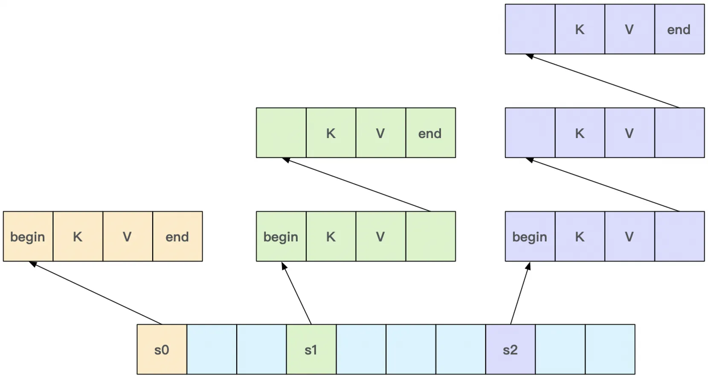
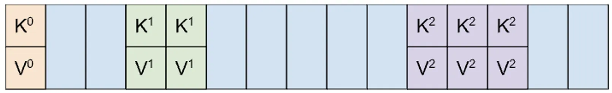
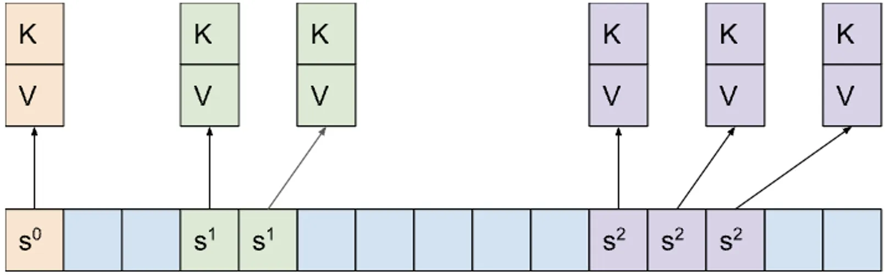
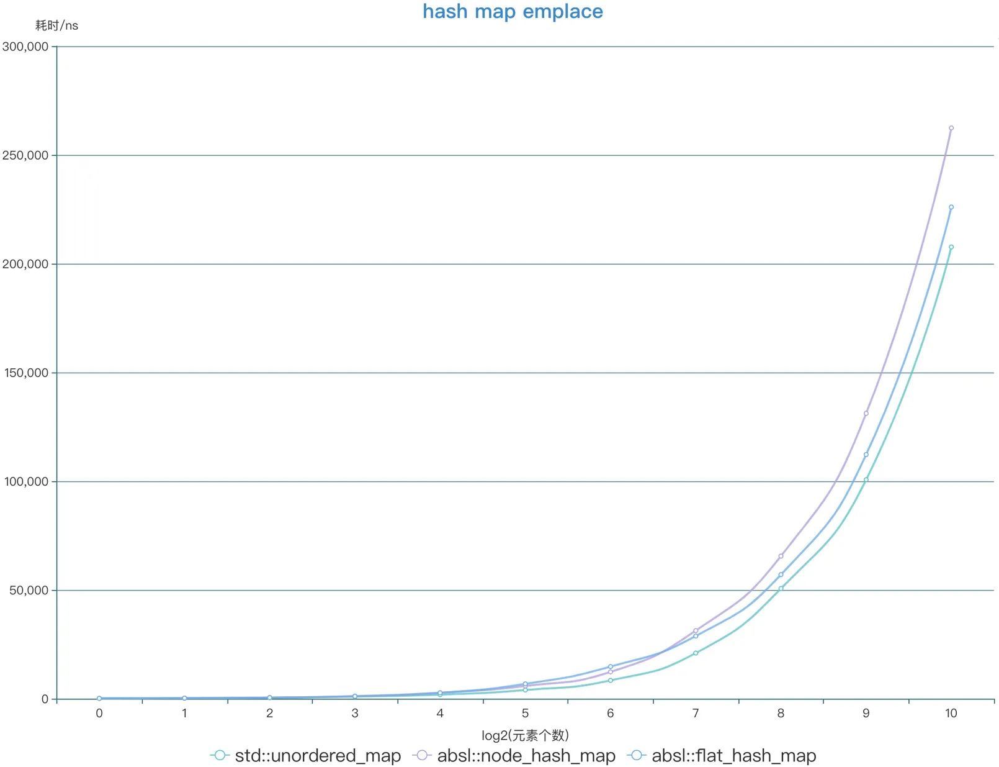
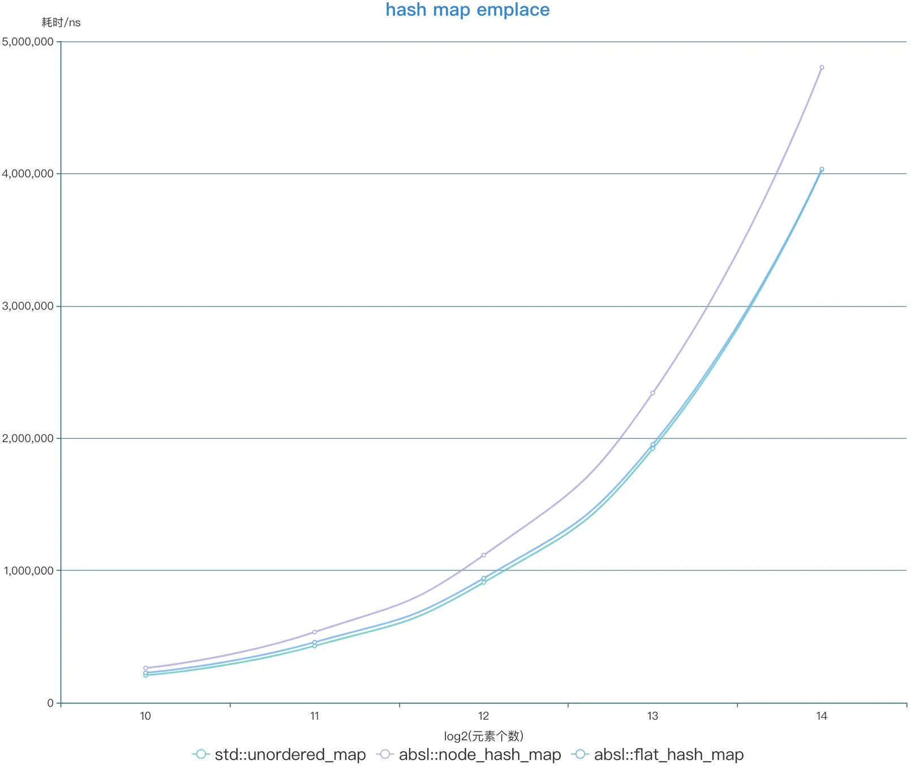

 
<!--BEGIN_DATA
{
    "create_date": "2022-10-25 22:30", 
    "modify_date": "2022-10-25 22:30", 
    "is_top": "0", 
    "summary": "C++中的HashTable", 
    "tags": "C/C++", 
    "file_name": "C++中的HashTable.md"
}
END_DATA-->

#### <p>原文出处：<a href='https://km.woa.com/group/51889/articles/show/532558' target='blank'>C++中的HashTable</a></p>

> HashTable是开发中常用的数据结构。本文从C++ STL中的HashTable讲起，分析其存在的性能问题，以业界改进的实现为对比。通过基准测试对比其实际性能表现，总结更优的实现版本。

## STL HashTable的问题

STL中的HashTable实现为`std::unordered_map`，采用[链接法](https://en.wikipedia.org/wiki/Hash_table#Separate_chaining)(chaining)解决hash碰撞，hash值相同的多个pair组织为链表，如图1所示。



图1 `std::unordered_map`内存布局

查找key值时，需要遍历对应的链表，寻找值相同的key。链表中节点**内存分布不连续**，相邻节点处于同一cache line的概率很小，因此会产生较多的cpu cache miss，**降低查询效率**。

## 改进版HashTable

google `absl::flat_hash_map`采用[开放寻址法](https://en.wikipedia.org/wiki/Hash_table#Open_addressing)(open addressing)解决hash碰撞，并使用二次探测(quadratic probing)方式。`absl::flat_hash_map`改进了内存布局，将所有pair放在一段连续内存中，将hash值相同的多个pair放在相邻位置，如图2所示。



图2 `absl::flat_hash_map`内存布局

查找key时，以二次探测方式遍历hash值相等的pair，寻找值相等的key。hash值相同的pair存储在相邻内存位置处，**内存局部性好**，对cpu cache友好，可**提高查询效率**。

在内存用量方面，`absl::flat_hash_map`空间复杂度为 `O((sizeof(std::pair<const K, V>) + 1) * bucket_count())`。最大负载因子被设计为0.875，超过该值后，表大小会增加一倍。因此absl::flat_hash_map的size()通常介于 `0.4375 * bucket_count()` 和 `0.875 * bucket_count()` 之间。


需要注意，`absl::flat_hash_map`在rehash时，会对pair进行move，因此pair的指针会失效，类似下述用法会访问非法内存地址。

```cpp
absl::flat_hash_map<std::string, Foo> map;
// ...  init map
Foo& foo1 = map["f1"];
Foo* foo2 = &(map["f2"]);
// ... rehash map
foo1.DoSomething(); // 非法访问，foo1引用的对象已被move
foo2->DoSomething(); // 非法访问，foo2指向的对象已被move
```

为了解决上述pair指针失效问题，google `absl::node_hash_map`将pair存储在单独分配的节点中，在连续内存中存放指向这些节点的指针，其他设计与`flat_hash_map`相同，如图3所示。



图3 `absl::node_hash_map`内存布局

`absl::node_hash_map`在rehash时，pair本身无需移动，只需将指针拷贝至新的地址。可保证pair的指针稳定性。

## 源码探究

下面对absl两种HashTable的核心逻辑源码进行探索（省略不相关部分的代码）：

### 1.分配内存

```cpp
// flat_hash_map和node_hash_map均以raw_hash_set为父类实现，区别在于policy不同
template <class K, class V,
          class Hash = absl::container_internal::hash_default_hash<K>,
          class Eq = absl::container_internal::hash_default_eq<K>,
          class Allocator = std::allocator<std::pair<const K, V>>>
class flat_hash_map : public absl::container_internal::raw_hash_map<
                          absl::container_internal::FlatHashMapPolicy<K, V>,
                          Hash, Eq, Allocator> {};
template <class Key, class Value,
          class Hash = absl::container_internal::hash_default_hash<Key>,
          class Eq = absl::container_internal::hash_default_eq<Key>,
          class Alloc = std::allocator<std::pair<const Key, Value>>>
class node_hash_map
    : public absl::container_internal::raw_hash_map<
          absl::container_internal::NodeHashMapPolicy<Key, Value>, Hash, Eq,
          Alloc> {};

template <class Policy, class Hash, class Eq, class Alloc>
class raw_hash_map : public raw_hash_set<Policy, Hash, Eq, Alloc>{};

// raw_hash_set分配连续内存的大小取决于 capacity_ 和 slot_type
template <class Policy, class Hash, class Eq, class Alloc>
class raw_hash_set {

  using slot_type = typename Policy::slot_type;

  void initialize_slots() {
    // 分配连续内存的大小为 capacity_ * slot_size 并对齐 slot_align
    char* mem = static_cast<char*>(Allocate<alignof(slot_type)>(
        &alloc_ref(),
        AllocSize(capacity_, sizeof(slot_type), alignof(slot_type))));
    ctrl_ = reinterpret_cast<ctrl_t*>(mem);
    slots_ = reinterpret_cast<slot_type*>(
        mem + SlotOffset(capacity_, alignof(slot_type)));
    ResetCtrl(capacity_, ctrl_, slots_, sizeof(slot_type));
    reset_growth_left();
    infoz().RecordStorageChanged(size_, capacity_);
  }
  
  inline size_t AllocSize(size_t capacity, size_t slot_size, size_t slot_align) {
    return SlotOffset(capacity, slot_align) + capacity * slot_size;
  }
};

// flat_hash_map的slot包含pair
template <class K, class V>
struct FlatHashMapPolicy {
  using slot_type = typename map_slot_type<K, V>;
};
template <class K, class V>
union map_slot_type {
  using value_type = std::pair<const K, V>;
  using mutable_value_type =
      std::pair<absl::remove_const_t<K>, absl::remove_const_t<V>>;

  value_type value;
  mutable_value_type mutable_value;
  absl::remove_const_t<K> key;
};
// node_hash_map的slot为指向pair的指针
template <class Key, class Value>
class NodeHashMapPolicy
    : public absl::container_internal::node_slot_policy<
          std::pair<const Key, Value>&, NodeHashMapPolicy<Key, Value>>{};
template <class Reference, class Policy>
struct node_slot_policy {
  using slot_type = typename std::remove_cv<
      typename std::remove_reference<Reference>::type>::type*;  // slot为指向pair的指针
};
```

### 2.添加元素

```cpp
template <class Policy, class Hash, class Eq, class Alloc>
class raw_hash_set {

  // 查找
  // Attempts to find `key` in the table; if it isn't found, returns a slot that
  // the value can be inserted into, with the control byte already set to
  // `key`'s H2.
  template <class K>
  std::pair<size_t, bool> find_or_prepare_insert(const K& key) {
    prefetch_heap_block();
    auto hash = hash_ref()(key);
  // 在相同hash值的桶中查找
    auto seq = probe(ctrl_, hash, capacity_);
    while (true) {
      Group g{ctrl_ + seq.offset()};
      for (uint32_t i : g.Match(H2(hash))) {
    // 如果key相等，则找到了目标元素
        if (ABSL_PREDICT_TRUE(PolicyTraits::apply(
                EqualElement<K>{key, eq_ref()},
                PolicyTraits::element(slots_ + seq.offset(i)))))
          return {seq.offset(i), false};
      }
      if (ABSL_PREDICT_TRUE(g.MaskEmpty())) break;
      seq.next();
      assert(seq.index() <= capacity_ && "full table!");
    }
  // 如果没有相等的key，则插入元素
    return {prepare_insert(hash), true};
  }

  // 找到下一个可用的slot
  // Given the hash of a value not currently in the table, finds the next
  // viable slot index to insert it at.
  size_t prepare_insert(size_t hash) ABSL_ATTRIBUTE_NOINLINE {
    auto target = find_first_non_full(ctrl_, hash, capacity_);
    if (ABSL_PREDICT_FALSE(growth_left() == 0 &&
                           !IsDeleted(ctrl_[target.offset]))) {
      rehash_and_grow_if_necessary();
      target = find_first_non_full(ctrl_, hash, capacity_);
    }
    ++size_;
    growth_left() -= IsEmpty(ctrl_[target.offset]);
    SetCtrl(target.offset, H2(hash), capacity_, ctrl_, slots_,
            sizeof(slot_type));
    infoz().RecordInsert(hash, target.probe_length);
    return target.offset;
  }
  
  // 在找到的slot处构造元素
  template <class K = key_type, class F>
  iterator lazy_emplace(const key_arg<K>& key, F&& f) {
    auto res = find_or_prepare_insert(key);
    if (res.second) {
      slot_type* slot = slots_ + res.first;
      std::forward<F>(f)((&alloc_ref(), &slot));
      assert(!slot);
    }
    return iterator_at(res.first);
  }

};
```

### 3.rehash

```cpp
template <class Policy, class Hash, class Eq, class Alloc>
class raw_hash_set {  

  // Called whenever the table *might* need to conditionally grow.
  void rehash_and_grow_if_necessary() {
    if (capacity_ == 0) {
      resize(1);
    } else if (capacity_ > Group::kWidth &&
               size() * uint64_t{32} <= capacity_ * uint64_t{25}) {
      drop_deletes_without_resize();
    } else {
      // Otherwise grow the container.
      resize(capacity_ * 2 + 1);
    }
  }

  void resize(size_t new_capacity) {
    assert(IsValidCapacity(new_capacity));
    auto* old_ctrl = ctrl_;
    auto* old_slots = slots_;
    const size_t old_capacity = capacity_;
    capacity_ = new_capacity;
    initialize_slots();

    size_t total_probe_length = 0;
    for (size_t i = 0; i != old_capacity; ++i) {
      if (IsFull(old_ctrl[i])) {
        size_t hash = PolicyTraits::apply(HashElement{hash_ref()},
                                          PolicyTraits::element(old_slots + i));
        auto target = find_first_non_full(ctrl_, hash, capacity_);
        size_t new_i = target.offset;
        total_probe_length += target.probe_length;
        SetCtrl(new_i, H2(hash), capacity_, ctrl_, slots_, sizeof(slot_type));
    // 调用 policy transfer 在新地址处构造元素
        PolicyTraits::transfer(&alloc_ref(), slots_ + new_i, old_slots + i);
      }
    }
    if (old_capacity) {
      SanitizerUnpoisonMemoryRegion(old_slots,
                                    sizeof(slot_type) * old_capacity);
      Deallocate<alignof(slot_type)>(
          &alloc_ref(), old_ctrl,
          AllocSize(old_capacity, sizeof(slot_type), alignof(slot_type)));
    }
    infoz().RecordRehash(total_probe_length);
  }
};

// flat_hash_map在rehash时，将元素移动至新地址处
template <class K, class V>
struct map_slot_policy {

  template <class Allocator>
  static void transfer(Allocator* alloc, slot_type* new_slot,
                       slot_type* old_slot) {
    emplace(new_slot);

  // 将元素 move 至新地址处
    if (kMutableKeys::value) {
      absl::allocator_traits<Allocator>::construct(
          *alloc, &new_slot->mutable_value, std::move(old_slot->mutable_value));
    } else {
      absl::allocator_traits<Allocator>::construct(*alloc, &new_slot->value,
                                                   std::move(old_slot->value));
    }
    destroy(alloc, old_slot);
  }
};
// node_hash_map在rehash时，将指向元素的指针拷贝至新地址处
template <class Reference, class Policy>
struct node_slot_policy {
  template <class Alloc>
  static void transfer(Alloc*, slot_type* new_slot, slot_type* old_slot) {
  // 将“指向元素的地址” copy 至新地址处
    *new_slot = *old_slot;
  }
};
```

## 基准测试

基准测试场景如下：

  * k、v均为std::string
  * k长度约20字节
  * v长度约40字节
  * 写操作：向空map中，emplace N个k值不同的pair
  * 读操作：从包含N个pair的map中，find N次随机k值（提前生成好的随机序列）

各容器读操作的cache miss情况如下：

```cpp
# std::unordered_map
[root@VM-239-185-centos tools]# perf stat -e cpu-clock,cycles,instructions,L1-dcache-load-misses,L1-dcache-loads  -p 2864179   
^C
 Performance counter stats for process id '2864179':

         18,447.43 msec cpu-clock                 #    1.000 CPUs utilized          
    56,278,197,029      cycles                    #    3.051 GHz                    
    25,374,763,394      instructions              #    0.45  insn per cycle         
       265,164,336      L1-dcache-load-misses     #    3.17% of all L1-dcache hits  
     8,377,925,973      L1-dcache-loads           #  454.151 M/sec

      18.453787989 seconds time elapsed

# absl::node_hash_map
[root@VM-239-185-centos tools]# perf stat -e cpu-clock,cycles,instructions,L1-dcache-load-misses,L1-dcache-loads  -p 2873181   
^C
 Performance counter stats for process id '2873181':

         42,683.27 msec cpu-clock                 #    1.000 CPUs utilized          
   130,088,665,294      cycles                    #    3.048 GHz                    
   134,531,389,793      instructions              #    1.03  insn per cycle         
       334,111,936      L1-dcache-load-misses     #    0.74% of all L1-dcache hits  
    44,998,374,652      L1-dcache-loads           # 1054.239 M/sec

      42.685607230 seconds time elapsed

# absl::flat_hash_map
[root@VM-239-185-centos tools]# perf stat -e cpu-clock,cycles,instructions,L1-dcache-load-misses,L1-dcache-loads  -p 2867048  
^C
 Performance counter stats for process id '2867048':

         27,379.72 msec cpu-clock                 #    1.000 CPUs utilized          
    83,562,709,268      cycles                    #    3.052 GHz                    
    82,589,606,600      instructions              #    0.99  insn per cycle         
       188,364,766      L1-dcache-load-misses     #    0.68% of all L1-dcache hits  
    27,605,138,227      L1-dcache-loads           # 1008.233 M/sec

      27.388859157 seconds time elapsed
```

可以看到`std::unordered_map` L1-dcache miss率为3.17%，`absl::node_hash_map`为0.74%，`absl::flat_hash_map`为0.68%，验证了上述关于不同内存模型下cpu cache性能表现的推论。

基准测试结果如下（为了显示更清晰，将元素个数小于1024的和大于1024的分开展示）：



图4 写操作，元素个数小于等于1024



图5 写操作，元素个数大于等于1024


图6 读操作，元素个数小于等于1024


图7 读操作，元素个数大于等于1024

从测试结果可以看出，写操作耗时：`std::unordered_map < absl::flat_hash_map < absl::node_hash_map`，`absl::flat_hash_map`比`std::unordered_map`耗时平均增加9%；读操作耗时：`absl::flat_hash_map <absl::node_hash_map <std::unordered_map`，`absl::flat_hash_map`比`std::unordered_map`耗时平均降低20%。

## 总结

三种HashTable对比如下：

<table style="width:898px;"><tbody><tr><td colspan="1" rowspan="1" style="width:169px;">
<p><span style="font-size:14px;"><strong>HashTable类型</strong></span></p>
</td>
<td colspan="1" rowspan="1" style="width:232px;">
<p><span style="font-size:14px;"><strong>内存模型</strong></span></p>
</td>
<td colspan="1" rowspan="1" style="width:274px;">
<p><span style="font-size:14px;"><strong>性能表现</strong></span></p>
</td>
<td colspan="1" rowspan="1" style="width:111px;">
<p><span style="font-size:14px;"><strong>推荐使用场景</strong></span></p>
</td>
</tr><tr><td colspan="1" rowspan="1" style="width:169px;">
<p><span style="font-size:14px;">std::unordered_map</span></p>
</td>
<td colspan="1" rowspan="1" style="width:232px;">
<p><span style="font-size:14px;">以链表存储hash值相同的元素</span></p>
</td>
<td colspan="1" rowspan="1" style="width:274px;">
<p><span style="font-size:14px;">写操作：rehash友好，性能最好；</span></p>
<p><span style="font-size:14px;">读操作：内存不连续，cpu cache命中率较低，性能最差</span></p>
</td>
<td colspan="1" rowspan="1" style="width:111px;">
<p><span style="font-size:14px;">写多读少</span></p>
</td>
</tr><tr><td colspan="1" rowspan="1" style="width:169px;">
<p><span style="font-size:14px;">absl::node_hash_map</span></p>
</td>
<td colspan="1" rowspan="1" style="width:232px;">
<p><span style="font-size:14px;">在连续内存中存储hash值相同的元素的指针</span></p>
</td>
<td colspan="1" rowspan="1" style="width:274px;">
<p><span style="font-size:14px;">写操作：性能最差；</span></p>
<p><span style="font-size:14px;">读操作：性能略差于absl::flat_hash_map；</span></p>
</td>
<td colspan="1" rowspan="1" style="width:111px;">
<p><span style="font-size:14px;">读多写少，且需要保证pair的指针稳定性</span></p>
</td>
</tr><tr><td colspan="1" rowspan="1" style="width:169px;">
<p><span style="font-size:14px;">absl::flat_hash_map</span></p>
</td>
<td colspan="1" rowspan="1" style="width:232px;">
<p><span style="font-size:14px;">在连续内存中存储hash值相同的元素</span></p>
</td>
<td colspan="1" rowspan="1" style="width:274px;">
<p><span style="font-size:14px;">写操作：性能略差于std::unordered_map；</span></p>
<p><span style="font-size:14px;">读操作：内存连续，cpu cache命中率较高，性能最好</span></p>
</td>
<td colspan="1" rowspan="1" style="width:111px;">
<p><span style="font-size:14px;">读多写少</span></p>
</td>
</tr></tbody></table>

在读多写少的场景使用HashTable，可以用`absl::flat_hash_map`替代`std::unordered_map`，获得更好的查询性能。但需注意`absl::flat_hash_map`在rehash时会将pair move到新的内存地址，导致访问原始地址非法。

`absl::flat_hash_map`的接口类似于`std::unordered_map`，详细介绍可参阅absl官方介绍：<https://abseil.io/docs/cpp/guides/container#hash-tables>

## 扩展阅读

  * `absl::flat_hash_map`源码：[abseil-cpp/flat_hash_map.h at master · abseil/abseil-cpp · GitHub](https://github.com/abseil/abseil-cpp/blob/master/absl/container/flat_hash_map.h)
  * `std::unordered_map`源码：[gcc/unordered_map.h at master · gcc-mirror/gcc · GitHub](https://github.com/gcc-mirror/gcc/blob/master/libstdc%2B%2B-v3/include/bits/unordered_map.h)
  * folly 14-way hash table：[folly/F14.md at main · facebook/folly · GitHub](https://github.com/facebook/folly/blob/main/folly/container/F14.md)
  * robin_hood hash table：[GitHub - martinus/robin-hood-hashing: faster and more memory efficient hashtable based on robin hood hashing for C++11/14/17/20](https://github.com/martinus/robin-hood-hashing)
