 
<!--BEGIN_DATA
{
    "create_date": "2021-01-16 19:50", 
    "modify_date": "2021-01-16 19:50", 
    "is_top": "0", 
    "summary": "C++内存管理全景指南", 
    "tags": "C/C++", 
    "file_name": "C++内存管理全景指南"
}
END_DATA-->

#### <p>原文出处：<a href='https://mp.weixin.qq.com/s/YPIe4Nz_QASSiXqOgnFqnQ' target='blank'>C++内存管理全景指南</a></p>

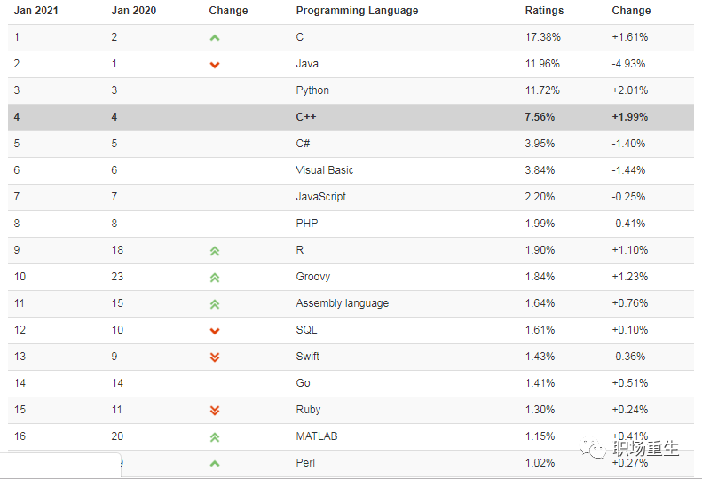

在各个大厂情况，C++也是很多大厂主力编程语言，国外google和微软大部分核心产品都是基于C++开发的；鹅厂编程语言TOP5，C++排第一：

C++的高抽象层次，又兼具高性能，是其他语言所无法替代的，C++标准保持稳定发展，更加现代化，更加强大，更加易用，熟练的 C++ 工程师自然也获得了“高水平、高薪资”的名声，但在各种活跃编程语言中，C++门槛依然很高，尤其C++的内存问题（内存泄露，内存溢出，内存宕机，堆栈破坏等问题），需要理解C++标准对象模型，C++标准库，标准C库，操作系统等内存设计，才能更加深入理解C++内存管理，这是跨越C++三座大山之一，我们必须拿下它。

### Content

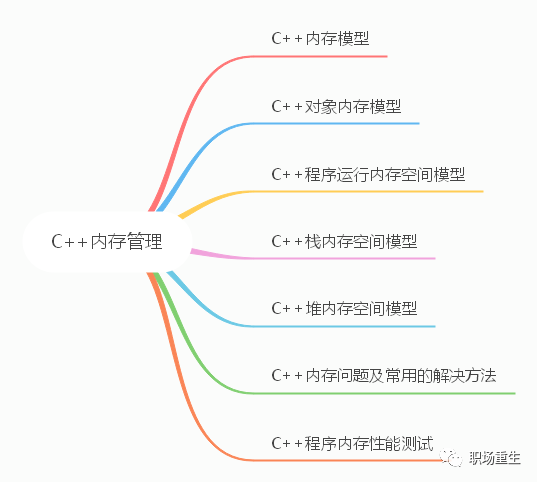
  

环境：

```cpp
uname -a
Linux alexfeng 3.19.0-15-generic #15-Ubuntu SMP Thu Apr 16 23:32:37 UTC 2015 x86_64 x86_64 x86_64 GNU/Linux
cat /proc/cpuinfo
bugs            :
bogomips        : 4800.52
clflush size    : 64
cache_alignment : 64
address sizes   : 36 bits physical, 48 bits virtual
cat /proc/meminfo
MemTotal:        4041548 kB(4G)
MemFree:          216304 kB
MemAvailable:    2870340 kB
Buffers:          983360 kB
Cached:          1184008 kB
SwapCached:        54528 kB
GNU gdb (Ubuntu 7.9-1ubuntu1) 7.9
g++ (Ubuntu 4.9.2-10ubuntu13) 4.9.2
```

### 一  C++内存模型

C++11在标准库中引入了memory model，这应该是C++11最重要的特性之一了。C++11引入memory model的意义在于我们可以在high level language层面实现对在多处理器中多线程共享内存交互的控制。我们可以在语言层面忽略compiler，CPU arch的不同对多线程编程的影响了。我们的多线程可以跨平台。

#### 内存模型

为 C++ 定义计算机内存存储的语义。可用于 C++ 程序的内存是一或多个相接的字节序列。内存中的每个字节拥有唯一的地址。

#### 字节

字节是最小的可寻址内存单元。它被定义为相接的位序列，大到足以保有任何 `UTF-8` 编码单元（ 256 个相异值）和 (C++14起)基本执行字符集（要求为单字节的 96 个字符）的任何成员。类似 C ， C++ 支持 8 位或更大的字节。char 、 unsigned char 和 signed char 类型把一个字节用于存储和值表示。字节中的位数可作为 CHAR_BIT 或 std::numeric_limits<unsigned char>::digits 访问。

#### 内存位置

内存位置是

  * 一个标量类型（算术类型、指针类型、枚举类型或 std::nullptr_t ）对象
  * 或非零长位域的最大相接序列

注意：各种语言特性，例如引用和虚函数，可能涉及到程序不可访问，但为实现所管理的额外内存位置。

#### 线程与数据竞争

  * 执行线程是程序中的控制流，它始于 std::thread::thread 、 std::async 或以其他方式所做的顶层函数调用。
  * 任何线程都能潜在地访问程序中的任何对象（拥有自动或线程局域存储期的对象仍可为另一线程通过指针或引用访问）。
  * 始终允许不同的执行线程同时访问（读和写）不同的内存位置，而无冲突或同步要求。

一个表达式的求值写入内存位置，而另一求值读或写同一内存位置时，称这些表达式冲突。拥有二个冲突求值的程序有数据竞争，除非

  * 两个求值都在同一线程上，或同一信号处理函数中执行，或
  * 两个冲突求值都是原子操作（见 std::atomic ），或
  * 一个冲突求值先发生于（ happens-before ）另一个（见内存顺序--std::memory_order ）

若出现数据竞争，则程序的行为未定义。

#### 内存顺序(std::memory_order)

如果不使用任何同步机制（例如 mutex 或 atomic），在多线程中读写同一个变量，那么程序的结果是难以预料的。简单来说，编译器以及 CPU 的一些行为，会影响到C++程序的执行结果

  * 即使是简单的语句，C++ 也不保证是原子操作。
  * CPU 可能会调整指令的执行顺序。
  * 在 CPU cache 的影响下，一个 CPU 执行了某个指令，不会立即被其它 CPU 看见。
  * Intel x86, x86-64等属于强排序CPU，x86-64的强内存模型总能保证按顺序执行，遵从数据依赖顺序，但PowerPC和ARM是弱排序CPU，有时需要依赖内存栅栏指令。

多线程读写同一变量需要使用同步机制，最常见的同步机制就是`std::mutex`和`std::atomic`。然而从性能角度看，通常使用`std::atomic`会获得更好的性能.

C++11 提供6 种可以应用于原子变量的内存次序:

  * momory_order_relaxed,
  * memory_order_consume,
  * memory_order_acquire,
  * memory_order_release,
  * memory_order_acq_rel,
  * memory_order_seq_cst

虽然共有 6 个选项,但它们表示的是四种内存模型:

  * Relaxed ordering
  * Release-Acquire ordering
  * Release-Consume ordering
  * Sequentially-consistent ordering

**顺序一致次序(sequential consisten ordering)**

对应memory_order_seq_cst. SC作为默认的内存序，是因为它意味着将程序看做是一个简单的序列。如果对于一个原子变量的操作都是顺序一致的，那么多线程程序的行为就像是这些操作都以一种特定顺序被单线程程序执行。从同的角度来看，一个顺序一致的 store 操作 synchroniezd-with 一个顺序一致的需要读取相同的变量的 load 操作。除此以外，顺序模型还保证了在 load 之后执行的顺序一致原子操作都得表现得在 store 之后完成。非顺序一致内存次序(non-sequentially consistency memory ordering)强调对同一事件（代码），不同线程可以以不同顺序去执行，不仅是因为编译器可以进行指令重排,也因为不同的 CPU cache 及内部缓存的状态可以影响这些指令的执行。但所有线程仍需要对某个变量的连续修改达成顺序一致。

**松弛次序(relaxed ordering)**

在这种模型下，`std::atomic`的`load()`和`store()`都要带上`memory_order_relaxed`参数。Relaxed ordering 仅仅保证`load()`和`store()`是原子操作，除此之外，不提供任何跨线程的同步。

**获取-释放次序(acquire-release ordering)**

在这种模型下，store()使用`memory_order_release`，而load()使用memory_order_acquire。这种模型有两种效果，第一种是可以限制 CPU 指令的重排：

  * 在`store()`之前的所有读写操作，不允许被移动到这个`store()`的后面。
  * 在`load()`之后的所有读写操作，不允许被移动到这个`load()`的前面。

**数据依赖（Release-Consume ordering）**

`memory_order_consume` 是 acquire-release 顺序模型中的一种，但它比较特殊，它为 inter-thread happens-before 引入了数据依赖关系：dependency-ordered-before
，一个使用memory_order_consume的操作具有消费语义（consume semantics）。我们称这个操作为消费操作（consume operations），对于`memory_order_consume`最的价值的观察结果就是总是可以安全的将它替换成`memory_order_acquire`，消费和获取都为了同一个目的：帮助非原子信息在线程间安全的传递。就像获取操作一样，消费操作必须与另一个线程的释放操作一起使用。它们之间主要的区别在于消费操作可以正确起作用的案例更少。相对于它的使用不便，反过来也就意味着消费操作在某些平台使用更有效。

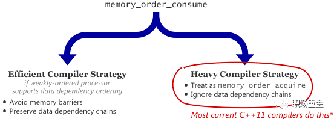

默认情况下，`std::atomic`使用的是 Sequentially-consistent ordering。但在某些场景下，合理使用其它三种ordering，可以让编译器优化生成的代码，从而提高性能。

思考问题：

1. C++正常程序可以访问到哪些内存和不能访问到哪些内存（这些内存属于该程序）？
2. 内存对程序并发执行有什么影响？
3. std::memory_order 的作用是什么？

### 二  C++对象内存模型

#### 1 空类对象（一般作为模板的tag来使用）

class A { };

sizeof（A) = 1

C++标准要求C++的对象大小不能为0，C++对象必须在内存里面有唯一的地址，

但又不想浪费太多内存空间，所以标准规定为1byte，

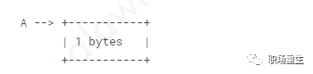

#### 2 非空类

```cpp
class A
{
public：
   int a;
};

sizeof（A ) = 8  ,align=8
```

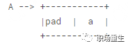

#### 3 非空虚基类

```cpp
class A
{
public：
   int a;
   virtual void v();
};

sizeof（A ) = 16  ,align=8
```

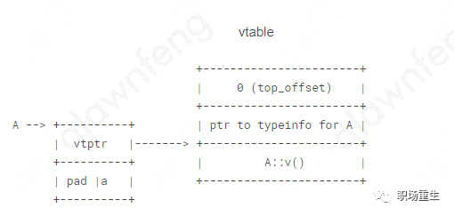

#### 4 单继承

```cpp
class A {
public:
  int a;
  virtual void v();
};

class B : public A {
public:
  int b;
};

sizeof（B） = 16, align = 8
```

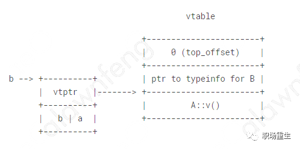

#### 5 简单多继承

```cpp
class A {
public:
  int a;
  virtual void v();
};

class B {
public:
  int b;
  virtual void w();
};

class C : public A, public B {
public:
  int c;
};

sizeof（C) = 32 ,align = 8
```

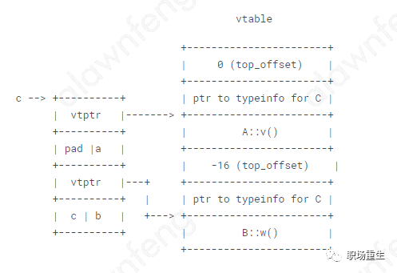

    
#### 6 简单多继承-2

```cpp
class A {
public:
  int a;
  virtual void v();
};

class B {
public:
  int b;
  virtual void w();
};

class C : public A, public B {
public:
  int c;
  void w();
};

sizeof（C) = 32 ,align = 8
```

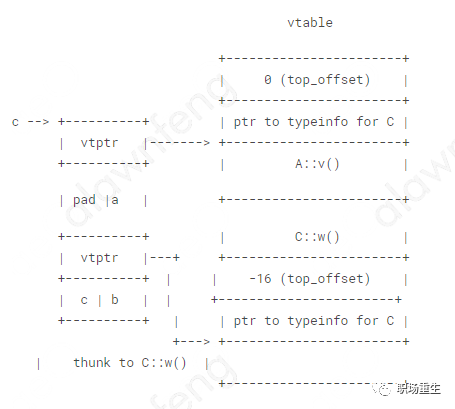

#### 7 The Diamond: 多重继承 (没有虚继承)

```cpp
class A {
public:
  int a;
  virtual void v();
};

class B : public A {
public:
  int b;
  virtual void w();
};

class C : public A {
public:
  int c;
  virtual void x();
};

class D : public B, public C {
public:
  int d;
  virtual void y();
};

sizeof（D)  = 40 align = 8
```

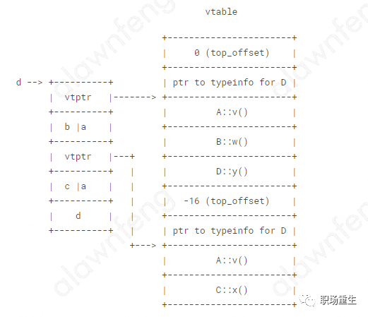

注意点：此种继承存在两份基类成员，使用时候需要指定路径，不方便，易出错。

#### 8 The Diamond: 钻石类虚继承

解决上面的问题，让基类只有存在一份，共享基类；

```
class A {
public:
  int a;
  virtual void v();
};

class B : public virtual A {
public:
  int b;
  virtual void w();
};

class C : public virtual A {
public:
  int c;
  virtual void x();
};

class D : public B, public C {
public:
  int d;
  virtual void y();
};

sizeof(D) = 48,align = 8
```

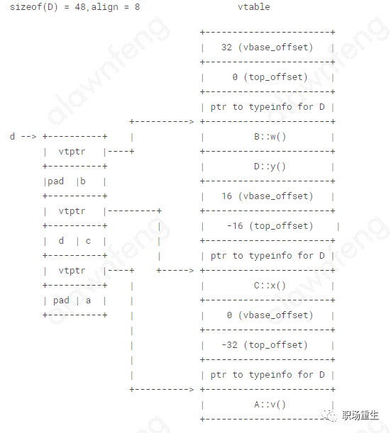    

**注意点：**

1. `top_offset`表示this指针对子类的偏移，用于子类和继承类之间`dynamic_cast`转换（还需要typeinfo数据），实现多态，

`vbase_offset`表示this指针对基类的偏移，用于共享基类；

2. gcc为了每一个类生成一个vtable虚函数表，放在程序的.rodata段，其他编译器（平台）比如vs，实现不太一样.

3. gcc还有VTT表，里面存放了各个基类之间虚函数表的关系，最大化利用基类的虚函数表，专门用来为构建最终类vtable；

4. 在构造函数里面设置对象的vtptr指针。

5. 虚函数表地址的前面设置了一个指向`type_info`的指针，RTTI（Run Time Type Identification）运行时类型识别是有编译器在编译器生成的特殊类型信息，包括对象继承关系，对象本身的描述，RTTI是为多态而生成的信息，所以只有具有虚函数的对象在会生成。

6. 在C++类中有两种成员数据：static、nonstatic；三种成员函数：static、nonstatic、virtual。

C++成员非静态数据需要占用动态内存，栈或者堆中，其他static数据存在全局变量区（数据段）,编译时候确定。虚函数会增加用虚函数表大小，也是存储在数据区的.rodada段，编译时确定，其他函数不占空间。

7. G++选项 -fdump-class-hierarchy 可以生成C++类层结构，虚函数表结构，VTT表结构。

8. GDB调试选项：  

set p obj <on/off> ：在C++中，如果一个对象指针指向其派生类， 如果打开这个选项，GDB会现在类对象结构的规则显示输出。  

set p pertty <on/off>:   按照层次打印结构体。

题：

**1. Why don't we have virtual constructors?**

> From Bjarne Stroustrup's C++ Style and Technique FAQ
>
> A virtual call is a mechanism to get work done given partial information. In particular, "virtual" allows us to call a function knowing only any interfaces and not the exact type of the object. To create an object you need complete information. In particular, you need to know the exact type of what you want to create. Consequently, a "call to a constructor" cannot be virtual.

**2. 为什么不要在构造函数或者析构函数中调用虚函数？**

> 对于构造函数：此时子类的对象还没有完全构造，编译器会去虚函数化，只会用当前类的函数， 如果是纯虚函数，就会调用到纯虚函数，会导致构造函数抛异常：pure virtual method calle；对于析构函数：同样，由于对象不完整，编译器会去虚函数化，函数调用本类的虚函数，如果本类虚函数是纯虚函数，就会到账析构函数抛出异常：pure virtual method called；

**3. C++对象构造顺序？**

1．构造子类构造函数的参数
2．子类调用基类构造函数
3．基类设置vptr
4．基类初始化列表内容进行构造
5.  基类函数体调用
6.  子类设置vptr
7.  子类初始化列表内容进行构造
8.  子类构造函数体调用

**4. 为什么虚函数会降低效率？**

是因为虚函数调用执行过程中会跳转两次，首先找到虚函数表，然后再查找对应函数地址，这样CPU指令就会跳转两次，而普通函数指跳转一次，CPU每跳转一次，预取指令都可能作废，这会导致分支预测失败，流水线排空，所以效率会变低。设想一下，如果说不是虚函数，那么在编译时期，其相对地址是确定的，编译器可以直接生成jmp/invoke指令；如果是虚函数，多出来的一次查找vtable所带来的开销，倒是次要的，关键在于，这个函数地址是动态的，譬如 取到的地址在eax里，则在call eax之后的那些已经被预取进入流水线的所有指令都将失效。流水线越长，一次分支预测失败的代价也就越大。

### 三 C++程序运行内存空间模型

#### 1. C++程序大致运行内存空间：

32位：

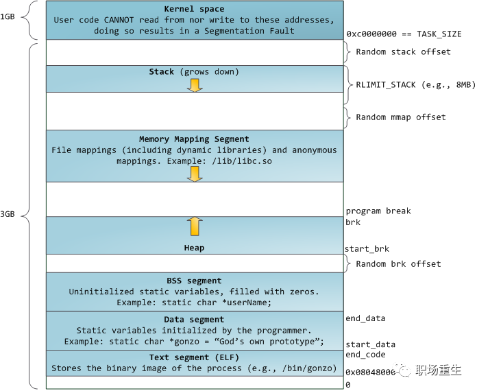

64位：

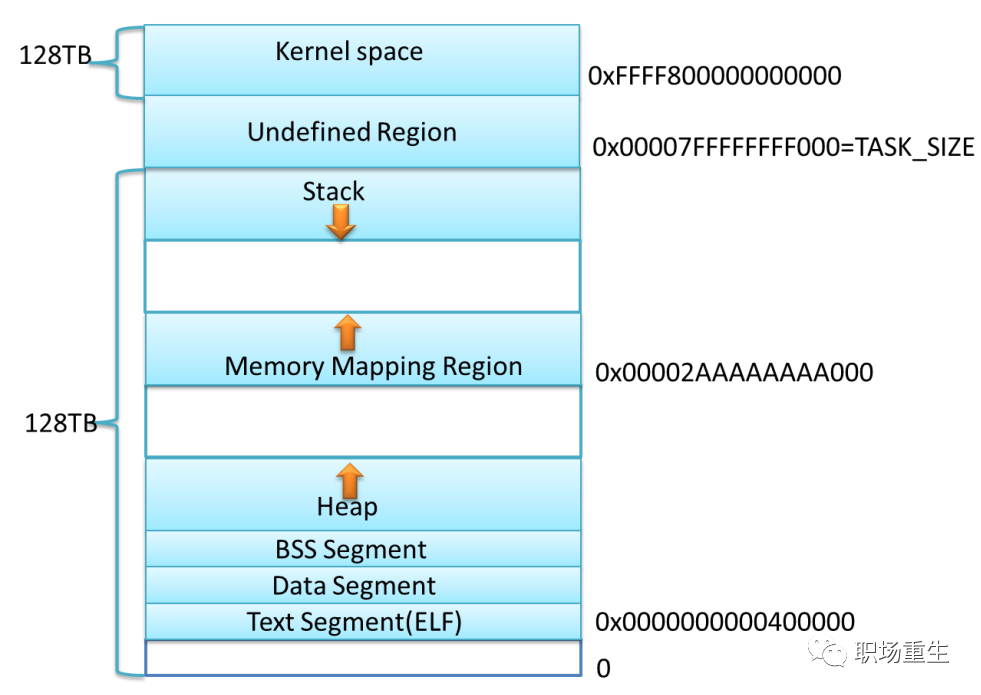

#### 2 Linux虚拟内存内部实*

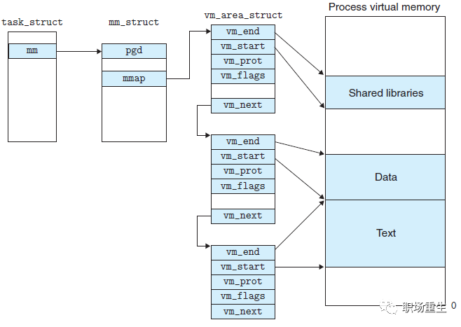

**关键点：**

1 各个分区的意义

内核空间：在32位系统中，Linux会留1G空间给内核，用户进程是无法访问的，用来存放进程相关数据和内存数据，内核代码等；在64位系统里面，Linux会采用最低48位来表示虚拟内存，这可通过 /proc/cpuinfo 来查看address sizes :

address sizes   : 36 bits physical, 48 bits virtual，总的虚拟地址空间为256TB( 2^48)，在这256TB的虚拟内存空间中, 0000000000000000 - 00007fffffffffff(128TB)为用户空间，ffff800000000000 - ffffffffffffffff(128TB)为内核空间。目前常用的分配设计：

```  
Virtual memory map with 4 level page tables:  
0000000000000000 - 00007fffffffffff (=47 bits) user space, different per mm  
hole caused by [47:63] sign extension  
ffff800000000000 - ffff87ffffffffff (=43 bits) guard hole, reserved for hypervisor  
ffff880000000000 - ffffc7ffffffffff (=64 TB) direct mapping of all phys. memory  
ffffc80000000000 - ffffc8ffffffffff (=40 bits) hole  
ffffc90000000000 - ffffe8ffffffffff (=45 bits) vmalloc/ioremap space  
ffffe90000000000 - ffffe9ffffffffff (=40 bits) hole  
ffffea0000000000 - ffffeaffffffffff (=40 bits) virtual memory map (1TB)  
... unused hole ...  
ffffec0000000000 - fffffbffffffffff (=44 bits) kasan shadow memory (16TB)  
... unused hole ...  
            vaddr_end for KASLR  
fffffe0000000000 - fffffe7fffffffff (=39 bits) cpu_entry_area mapping  
fffffe8000000000 - fffffeffffffffff (=39 bits) LDT remap for PTI  
ffffff0000000000 - ffffff7fffffffff (=39 bits) %esp fixup stacks  
... unused hole ...  
ffffffef00000000 - fffffffeffffffff (=64 GB) EFI region mapping space  
... unused hole ...  
ffffffff80000000 - ffffffff9fffffff (=512 MB)  kernel text mapping, from phys 0  
ffffffffa0000000 - fffffffffeffffff (1520 MB) module mapping space  
[fixmap start]   - ffffffffff5fffff kernel-internal fixmap range  
ffffffffff600000 - ffffffffff600fff (=4 kB) legacy vsyscall ABI  
ffffffffffe00000 - ffffffffffffffff (=2 MB) unused hole
``` 
    
http://www.kernel.org/doc/Documentation/x86/x86_64/mm.txt
    
剩下的是用户内存空间：

  * stack栈区：专门用来实现函数调用-栈结构的内存块。相对空间下（可以设置大小，Linux 一般默认是8M，可通过 ulimit –s 查看），系统自动管理，从高地址往低地址，向下生长。
  * 内存映射区：包括文件映射和匿名内存映射， 应用程序的所依赖的动态库，会在程序执行时候，加载到内存这个区域，一般包括数据（data）和代码（text）;通过mmap系统调用，可以把特定的文件映射到内存中，然后在相应的内存区域中操作字节来访问文件内容，实现更高效的IO操作；匿名映射，在glibc中malloc分配大内存的时候会用到匿名映射。这里所谓的“大”表示是超过了`MMAP_THRESHOLD` 设置的字节数，它的缺省值是 128 kB，可以通过 `mallopt()` 去调整这个设置值。还可以用于进程间通信IPC（共享内存）。
  * heap堆区：主要用于用户动态内存分配，空间大，使用灵活，但需要用户自己管理，通过brk系统调用控制堆的生长，向高地址生长。
  * BBS段和DATA段：用于存放程序全局数据和静态数据，一般未初始化的放在BSS段（统一初始化为0，不占程序文件的空间），初始化的放在data段，只读数据放在rodata段（常量存储区）。
  * text段：主要存放程序二进制代码。

2  为了防止内存被攻击，比如栈溢出攻击和堆溢出攻击等，Linux在特定段之间使用随机偏移，使段的起始地址是随机值, Linux 系统上的ASLR等级可以通过文件 /proc/sys/kernel/randomize_va_space 来进行设置，它支持以下取值：

  * 0 - 关闭的随机化。一切都是静止的。
  * 1 - 保守的随机化。共享库、栈、mmap()、VDSO以及堆将被随机化。
  * 2 - 完全的随机化。除了上面列举的要素外，通过 brk() 分配得到的内存空间也将被随机化。

3  每个段都有特定的安全控制（权限）：

`vm_flags`

第三列，如r-xp

此段虚拟地址空间的属性。每种属性用一个字段表示，r表示可读，w表示可写，x表示可执行，p和s共用一个字段，互斥关系，p表示私有段，s表示共享段，如果没有相应权限，则用’-’代替  

4 Linux虚拟内存是按页分配，每页大小为4KB或者2M，1G等（大页内存）, 默认是4K；

5 例子-通过pmap 查看程序内存布局(综合proc/x/maps与proc/x/smaps数据）：

```cpp
#include<iostream>
#include <unistd.h>
using namespace std;

//long  a[1024*1024] = {0};
int main()
{
    void *heap;
    int *x = new int[1024]();
    cout << hex <<"x: " << x <<endl;
    heap = sbrk(0);
    //cout << hex << "a:" << (long) &a <<endl;
    cout << hex << "heap: " << (long) heap <<endl;
    cout << hex << "heap: " << (long)heap - (long)x <<endl;
    while(1);
    return 0;
 }
```

```
 g++  -g  -std=c++11 -o main  mem.cpp
./main
```

关闭内存地址随机化

```
pmap -X 8117
8117:   ./main
          Address Perm   Offset Device    Inode  Size  Rss Pss Referenced Anonymous Swap Locked Mapping
     00400000 r-xp 00000000  08:11 43014235     4    4   4          4         0    0      0 main
     00601000 r--p 00001000  08:11 43014235     4    4   4          4         4    0      0 main
     00602000 rw-p 00002000  08:11 43014235     4    4   4          4         4    0      0 main
    //程序的text段，只读数据段，和全局/静态数据段;

    00603000 rw-p 00000000  00:00        0   136    8   8          8         8    0      0 [heap]
     //程序的堆内存段；

     7ffff71e2000 r-xp 00000000  08:11   266401    88   88  18         88         0    0      0 libgcc_s.so.1
     7ffff71f8000 ---p 00016000  08:11   266401  2044    0   0          0         0    0      0 libgcc_s.so.1
     7ffff73f7000 rw-p 00015000  08:11   266401     4    4   4          4         4    0      0 libgcc_s.so.1
     7ffff73f8000 r-xp 00000000  08:11   266431  1052  224   3        224         0    0      0 libm-2.21.so
     7ffff74ff000 ---p 00107000  08:11   266431  2044    0   0          0         0    0      0 libm-2.21.so
     7ffff76fe000 r--p 00106000  08:11   266431     4    4   4          4         4    0      0 libm-2.21.so
     7ffff76ff000 rw-p 00107000  08:11   266431     4    4   4          4         4    0      0 libm-2.21.so
     7ffff7700000 r-xp 00000000  08:11   266372  1792 1152   8       1152         0    0      0 libc-2.21.so
     7ffff78c0000 ---p 001c0000  08:11   266372  2048    0   0          0         0    0      0 libc-2.21.so
     7ffff7ac0000 r--p 001c0000  08:11   266372    16   16  16         16        16    0      0 libc-2.21.so
     7ffff7ac4000 rw-p 001c4000  08:11   266372     8    8   8          8         8    0      0 libc-2.21.so
     7ffff7ac6000 rw-p 00000000  00:00        0    16   12  12         12        12    0      0
     7ffff7aca000 r-xp 00000000  08:11 46146360   960  856 283        856         0    0      0 libstdc++.so.6.0.20
     7ffff7bba000 ---p 000f0000  08:11 46146360  2048    0   0          0         0    0      0 libstdc++.so.6.0.20
     7ffff7dba000 r--p 000f0000  08:11 46146360    32   32  32         32        32    0      0 libstdc++.so.6.0.20
     7ffff7dc2000 rw-p 000f8000  08:11 46146360     8    8   8          8         8    0      0 libstdc++.so.6.0.20
     7ffff7dc4000 rw-p 00000000  00:00        0    84   16  16         16        16    0      0
     7ffff7dd9000 r-xp 00000000  08:11   266344   144  144   1        144         0    0      0 ld-2.21.so
//程序的内存映射区，主要是动态库加载到该内存区，包括动态库的text代码段和数据data段。
//中间没有名字的，属于程序的匿名映射段，主要提供大内存分配。
     7ffff7fd4000 rw-p 00000000  00:00        0    20   20  20         20        20    0      0
     7ffff7ff5000 rw-p 00000000  00:00        0    12   12  12         12        12    0      0
     7ffff7ff8000 r--p 00000000  00:00        0     8    0   0          0         0    0      0 [vvar]
     7ffff7ffa000 r-xp 00000000  00:00        0     8    4   0          4         0    0      0 [vdso]
//vvar page，kernel的一些系统调用的数据会映射到这个页面，用户可以直接在用户空间访问；
//vDSO -virtual dynamic shared object,is a small shared library exported by the kernel to accelerate the execution 
//of certain system calls that do not necessarily have to run in kernel space, 
//就是内核实现了glibc的一些系统调用，然后可以直接在用户空间执行,提高系统调用效率和减少与glibc的耦合。
7ffff7ffc000 r--p 00023000  08:11   266344     4    4   4          4         4    0      0 ld-2.21.so
7ffff7ffd000 rw-p 00024000  08:11   266344     4    4   4          4         4    0      0 ld-2.21.so
7ffff7ffe000 rw-p 00000000  00:00        0     4    4   4          4         4    0      0
7ffffffde000 rw-p 00000000  00:00        0   136    8   8          8         8    0      0 [stack]
//此段为程序的栈区

ffffffffff600000 r-xp 00000000  00:00        0     4    0   0          0         0    0      0 [vsyscall]
//此段是Linux实现vsyscall系统调用vsyscall库代码段
 ===== ==== === ========== ========= ==== ======
```

思考问题：

1  栈为什么要由高地址向低地址扩展，堆为什么由低地址向高地址扩展？

* 历史原因：在没有MMU的时代，为了最大的利用内存空间，堆和栈被设计为从两端相向生长。那么哪一个向上，哪一个向下呢？人们对数据访问是习惯于向上的，比如你在堆中new一个数组，是习惯于把低元素放到低地址，把高位放到高地址，所以堆 向上生长比较符合习惯,  而栈则对方向不敏感，一般对栈的操作只有PUSH和pop，无所谓向上向下，所以就把堆放在了低端，把栈放在了高端. 但现在已经习惯这样了。这个和处理器设计有关系，目前大多数主流处理器都是这样设计，但ARM 同时支持这两种增长方式。

2  如何查看进程虚拟地址空间的使用情况？

3  对比堆和栈优缺点？

### 四  C++栈内存空间模型

#### 1. C++程序运行调用栈示意图：

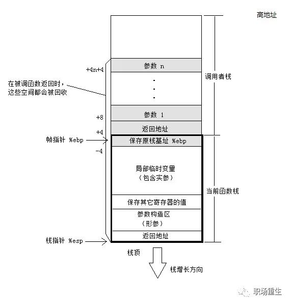

函数调用过程中，栈（有俗称堆栈）的变化：

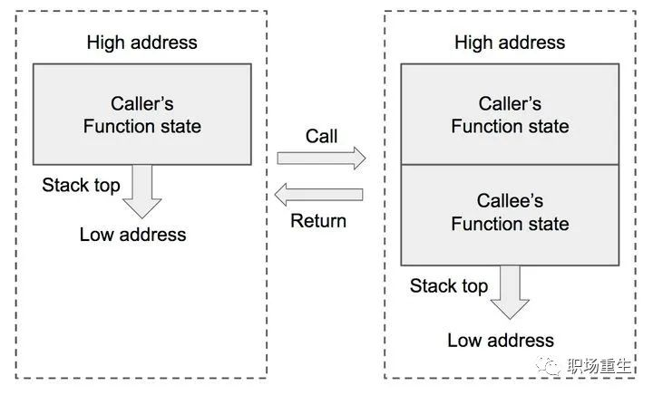

from  https://zhuanlan.zhihu.com/p/25816426

1. 当主函数调用子函数的时候：

* 在主函数中，将子函数的参数按照一定调用约定(参考调用约定），一般是从右向左把参数push到栈中；
* 然后把下一条指令地址，即返回地址（return address）push入栈（隐藏在call指令中）；
* 然后跳转到子函数地址处执行：call 子函数；此时

#### 2. 子函数执行：

* push  %rbp  :  把当前rbp的值保持在栈中；
* mov %rsp， %rbp：把rbp移到最新栈顶位置，即开启子函数的新帧；
* **[可选]**sub $xxx, %esp**:  **在栈上分配XXX字节的临时空间。（抬高栈顶）(编译器根据函数中的局部变量的总大小确定临时空间的大小);
* **[可选]**push XXX:    保存（push）一些寄存器的值;

#### 3.子函数调用返回：

* 保持返回值：一般将函数函数值保持在eax寄存器中；
* [可选]恢复（pop）一些寄存器的值；
* mov %rbp,%rsp: 收回栈空间，恢复主函数的栈顶；
* pop %rbp；恢复主函数的栈底；

  在AT&T中：

  以上两条指令可以被leave指令取代

* leave
* ret；从栈顶获取之前保持的返回地址（return address），并跳转到此位置执行；  


#### 栈攻击

由上面栈内存布局可以看出，栈很容易被破坏和攻击，通过栈缓冲器溢出攻击，用攻击代码首地址来替换函数帧的返回地址，当子函数返回时，便跳转到攻击代码处执行,获取系统的控制权，所以操作系统和编译器采用了一些常用的防攻击的方法：

* ASLR(地址空间布局随机化)：操作系统可以将函数调用栈的起始地址设为随机化（这种技术被称为内存布局随机化，即Address Space Layout Randomization (ASLR) ），加大了查找函数地址及返回地址的难度。

* Cannary 

gcc关于栈溢出检测的几个参数：

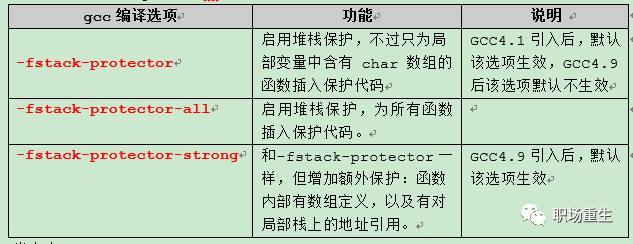

开启Canary之后，函数开始时在ebp和临时变量之间插入一个随机值，函数结束时验证这个值。如果不相等（也就是这个值被其他值覆盖了），就会调用 _stackchk_fail函数，终止进程。对应GCC编译选项`-fno-stack-protector`解除该保护。

* NX.  

开启NX保护之后，程序的堆栈将会不可执行。对应GCC编译选项`-z execstack`解除该保护。

**栈异常处理**

  * 一个函数（或方法）抛出异常，那么它首先将当前栈上的变量全部清空(unwinding)，如果变量是类对象的话，将调用其析构函数，接着，异常来到call stack的上一层，做相同操作，直到遇到catch语句。
  * 指针是一个普通的变量，不是类对象，所以在清空call stack时，指针指向资源的析构函数将不会调用。

思考问题：

1. 递归调用函数怎么从20层直接返回到17层，程序可以正常运行？

参考上面栈帧的结构，中心思想是当递归函数执行到第20层的时候，把当前栈帧的rbp值替换为17层的rbp的值，  怎么得到17层rbp的值，就是通过反复取rbp的值（rbp保持了上一帧的rbp），核心代码如下：

```cpp
/*change stack*/
int ret_stack(int layer)
{
     unsigned long rbp = 0;
     unsigned long layer_rbp = 0;
     int depth = 0;
 
     /* 1.得到首层函数的栈基址 */
     __asm__ volatile(
              "movq %%rbp, %0 \n\t"
             :"=r"(rbp)
             :
             :"memory");
    layer_rbp = rbp;
    cout << hex<< rbp <<endl;
     /* 2.逐层回溯栈基址 */
     for(; (depth < layer) && (0 != layer_rbp) && (0 != *(unsigned long *)layer_rbp) && (layer_rbp != *(unsigned long *)layer_rbp); ++depth) {
          cout << hex<< layer_rbp <<endl;
          layer_rbp = *(unsigned long *)layer_rbp;
     }
     cout << hex<< layer_rbp <<endl;
    //change current rbp to target layer rbp
      unsigned long *x = (unsigned long *)rbp;
     *x = layer_rbp;
     cout << hex<< x << " v:" << *x <<endl;
     return depth;
 }
```

2  调用约定有哪些？

我们最常用是以下几种约定  

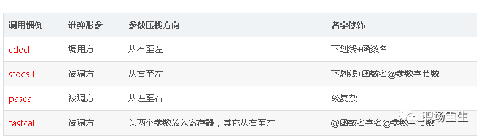  
  
1. cdec  

‍是c/c++默认的调用约定  

2. stdcall

它是微软Win32 API的一准标准，我们常用的回调函数就是通过这种调用方式

3. thiscall

thiscall 是c++中非静态类成员函数的默认调用约定

### 五 C++堆内存空间模型

#### 1. C++ 程序动态申请内存new/delete：

**new/delete 操作符,C++内置操作符**

1. new操作符做两件事，分配内存+调用构造函数初始化。你不能改变它的行为；
2. delete操作符同样做两件事，调用析构函数+释放内存。你不能改变它的行为；

**operator new/delete 函数**

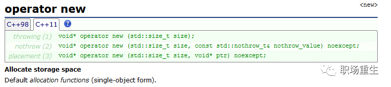

**operator new ：**

> The default _allocation and deallocation functions_ are special components of the standard library; They have the following unique properties:

  * **Global:** All three versions of `operator new` are declared in the global namespace, not within thestdnamespace.
  * **Implicit:** The allocating versions (_(1)_ and _(2)_) are _implicitly declared_ in every translation unit of a C++ program, no matter whether header `<new>` is included or not.
  * **Replaceable**: The allocating versions (_(1)_ and _(2)_) are also _replaceable_: A program may provide its own definition that replaces the one provided by default to produce the result described above, or can overload it for specific types.

> If set_new_handler has been used to define anew_handler function, this _new-handler_ function is called by the default definitions of the allocating versions (_(1)_ and _(2)_) if they fail to allocate the requested storage.  
  
`operator new` can be called explicitly as a regular function, but in C++, `new` is an operator with a very specific behavior: An expression with the
`new` operator, first calls function `operator new` (i.e., this function) with the size of its type specifier as first argument, and if this is successful, it then automatically initializes or constructs the object (if needed). Finally, the expression evaluates as a pointer to the appropriate type.

from http://www.cplusplus.com/reference/new/operator%20new/

1. 是用来专门分配内存的函数，为new操作符调用，你能增加额外的参数重载函数operator new（有限制）:

>         限制1：第一个参数类型必须是size_t；
>
>         限制2：函数必须返回void*；

2. operator new 底层一般调用malloc函数（gcc+glibc）分配内存；

3. operator new 分配失败会抛异常（默认），通过传递参数也可以不抛异常，返回空指针；

**operator delete :**

1. 是用来专门分配内存的函数，为delete操作符调用，你能增加额外的参数重载函数operator delete（有限制）:

>        限制1：第一个参数类型必须是void*；
>
>        限制2：函数必须返回void；

2. operator delete底层一般调用free函数（gcc+glibc）释放内存；

3. operator delete分配失败会抛异常（默认），通过传递参数也可以不抛异常，返回空指针；

** placement new/delete 函数**

1. placement new 其实就是new的一种重载，placement new是一种特殊的operator new，作用于一块已分配但未处理或未初始化的raw内存，就是用一块已经分配好的内存上重建对象（调用构造函数）；

2. 它是C++库标准的一部分；

3. placement delete 什么都不做；

4. 数组分配 new[]/delete[] 表达式

  * 对应会调用operator new[]/delete[]函数;
  * 按对象的个数，分别调用构造函数和析构函数；

http://www.cplusplus.com/reference/new/operator%20new[]/

**class-specific allocation functions(成员函数）**

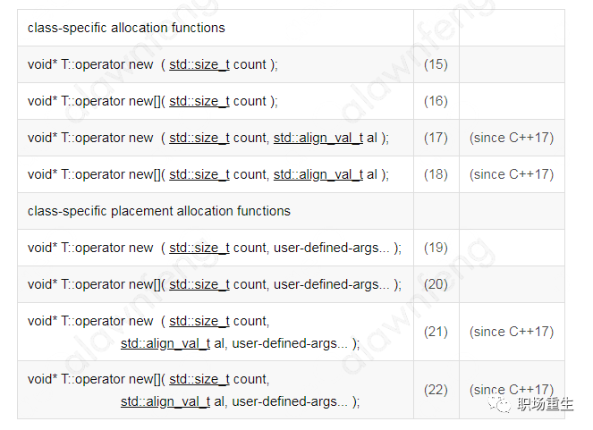

http://en.cppreference.com/w/cpp/memory/new/operator_new

**定制对象特殊new/delete函数；**

实现一般是使用全局：

::operator new

::operator delete

关键点：

  * `你想在堆上建立一个对象，应该用new操作符。它既分配内存又为对象调用构造函数。`
  * `如果你仅仅想分配内存，就应该调用operator new函数；它不会调用构造函数。`
  * `如果你想定制自己的在堆对象被建立时的内存分配过程，你应该写你自己的operator new函数，然后使用new操作符，new操作符会调用你定制的operator new。`
  * `如果你想在一块已经获得指针的内存里建立一个对象，应该用placement new。`
  * `C++可以为分配失败设置自己的异常处理函数：`

>   If set_new_handler  has been used to define a new_handler function, this _new-handler_ function is called by the default definitions of the allocating versions (_(1)_ and _(2)_) if they fail to allocate the requested storage.

  * `如果在构造函数时候抛出异常，new表达式后面会调用对应operator delete函数释放内存：`

> The other signatures (_(2)_ and _(3)_) are **never** called by a _delete-expression_ (the `delete` operator always calls the ordinary version of this function, and exactly once for each of its arguments). These other signatures are only called automatically by a _new-expression_ when their object construction fails (e.g., if the constructor of an object throws while being constructed by a _new-expression_withnothrow, the matchingoperator deletefunction accepting anothrowargument is called).

思考问题：

1. malloc和free是怎么实现的？
2. malloc 分配多大的内存，就占用多大的物理内存空间吗？
3. free 的内存真的释放了吗（还给 OS ） ?
4. 既然堆内内存不能直接释放，为什么不全部使用 mmap 来分配？
5. 如何查看堆内内存的碎片情况？
6. 除了 glibc 的 malloc/free ，还有其他第三方实现吗？

**2. C++11的智能指针与垃圾回收**

  * `C++智能指针出现是为了解决由于支持动态内存分配而导致的一些C++内存问题，比如内存泄漏，对象生命周期的管理，悬挂指针（dangling pointer）/空指针等问题；`
  * `C++智能指针通过RAII设计模式去管理对象生命周期（动态内存管理），提供带少量异常类似普通指针的操作接口，在对象构造的时候分配内存，在对象作用域之外释放内存，帮助程序员管理动态内存；`
  * `老的智能指针auto_ptr由于设计语义不好而导致很多不合理问题：不支持复制（拷贝构造函数）和赋值（operator =），但复制或赋值的时候不会提示出错。因为不能被复制，所以不能被放入容器中。而被C++11弃用（deprecated）;`

**新的智能指针：**

1. shared_ptr

 * `shared_ptr是引用计数型（reference counting）智能指针, shared_ptr包含两个成员，一个是指向真正数据的指针，另一个是引用计数ref_count模块指针,对比GCC实现，大致原理如下，`

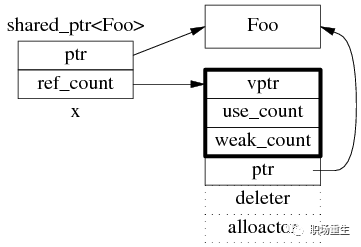

`共享对象（数据）（赋值拷贝），引用计数加1，指针消亡，引用计数减1，当引用计数为0，自动``析构所指的对象，引用计数是线程安全的（原子操作）。`

**`shared_ptr关键点：`**

  * `用shared_ptr就不要new，保证内存管理的一致性;`
  * `使用weak_ptr来打破循环引用;`
  * `用make_shared来生成shared_ptr，提高效率，内存分配一次搞定，防止异常导致内存泄漏，参考https://herbsutter.com/gotw/_102/；`
  * `大量的shared_ptr会导致程序性能下降（相对其他指针），需要等到所有的weak引用为0时才能最终释放内存（delete）；  
  * `用enable_shared_from_this来使一个类能获取自身的shared_ptr;`
  * `不能在对象的构造函数中使用shared_from_this()函数，因为对象还没有构造完毕，share_ptr还没有初始化构造完全；构造顺序：先需要调用enable_shared_from_this类的构造函数，接着调用对象的构造函数，最后需要调用shared_ptr类的构造函数初始化enable_shared_from_this的成员变量weak_this_。然后才能使用shared_from_this()函数；  `             

**2. unique_ptr**

独占指针，不共享,不能赋值拷贝;

unique_ptr关键点：

1. 如果对象不需要共享，一般最好都用unique_ptr，性能好，更安全；
2. 可以通过move语义传递对象的生命周期控制权；
3. 函数可以返回unique_ptr对象,为什么？ 

> ** RVO和NRVO**
>
> 当函数返回一个对象时，理论上会产生临时变量，那必然是会导致新对象的构造和旧对象的析构，这对效率是有影响的。C++编译针对这种情况允许进行优化，哪怕是构造函数有副作用，这叫做返回值优化（RVO),返回有名字的对象叫做具名返回值优化(NRVO)，就那RVO来说吧，本来是在返回时要生成临时对象的，现在构造返回对象时直接在接受返回对象的空间中构造了。假设不进行返回值优化，那么上面返回unique_ptr会不会有问题呢？也不会。因为标准允许编译器这么做：
>
> 1.如果支持move构造，那么调用move构造。
>
> 2.如果不支持move，那就调用copy构造。
>
> 3.如果不支持copy，那就报错吧。
>
> 显然的，unique_ptr是支持move构造的，unique_ptr对象可以被函数返回。

**3. weak_ptr**

  * 引用对象，不增加引用计数，对象生命周期，无法干预；
  * 配合shared_ptr解决shared_ptr循环引用问题；
  * 可以影响到对象内存最终释放的时间；

更详细参考：

http://en.cppreference.com/w/cpp/memory/shared_ptr  

**`思考问题：`**

1. C++的赋值和Java的有什么区别？

` C++的赋值可以是对象拷贝也可以对象引用，java的赋值是对象引用；`

2. smart_ptr有哪些坑可以仍然导致内存泄漏？

2.1. shared_ptr初始化构造函数指针，一般是可以动态管理的内存地址，如果不是就可能导致内存泄漏；

2.2.shared_ptr要求内部new和delete实现必须是成对，一致性，如果不是就可能导致内存泄漏；

2.3. shared_ptr对象和其他大多数STL容器一样，本身不是线程安全的，需要用户去保证；

3. unique_ptr有哪些限制？

  * 只能移动赋值转移数据，不能拷贝；
  * 不支持类型转换（cast）；

4. 智能指针是异常安全的吗？

所谓异常安全是指,当异常抛出时，带有异常安全的函数会:

  * 不泄露任何资源
  * 不允许数据被破坏

智能指针就是采用RAII技术，即以对象管理资源来防止资源泄漏。

> ##### Exception Safety
>
> Several functions in these smart pointer classes are specified as having "no effect" or "no effect except such-and-such" if an exception is thrown. This means that when an exception is thrown by an object of one of these classes, the entire program state remains the same as it was prior to the function call which resulted in the exception being thrown. This amounts to a guarantee that there are no detectable side effects. Other functions never throw exceptions.
> The only exception ever thrown by functions which do throw (assuming **T** meets the  common requirements) is **std::bad_alloc**, and that is thrown only by functions which are explicitly documented as possibly throwing

**std::bad_alloc**.

`https://www.boost.org/doc/libs/1_61_0/libs/smart_ptr/smart_ptr.htm`

5. 智能指针是线程安全的吗？

`智能指针对象的引用计数模块是线程安全的，因为 shared_ptr有两个数据成员，读写操作不能原子化，所以对象本身不是线程安全的，需要用户去保证线程安全。`

> Thread Safety
>
> `shared_ptr` objects offer the same level of thread safety as built-in types. A `shared_ptr` instance can be "read" (accessed using only const operations) simultaneously by multiple threads. Different `shared_ptr` instances can be "written to" (accessed using mutable operations such as `operator=` or `reset`) simultaneously by multiple threads (even when these instances are copies, and share the same reference count underneath.)
>
> Any other simultaneous accesses result in undefined behavior.

https://www.boost.org/doc/libs/1_67_0/libs/smart_ptr/doc/html/smart_ptr.html#shared_ptr_thread_safety

**C++标准垃圾回收**

C++11 提供最小垃圾支持

* declare_reachable  
* undeclare_reachable  
* declare_no_pointers  
* undeclare_no_pointers  
* pointer_safety  
* get_pointer_safety

由于很多场景受限，当前几乎没有人使用；  

感兴趣可以参考：

http://www.stroustrup.com/C++11FAQ.html#gc-abi

http://www.openstd.org/jtc1/sc22/wg21/docs/papers/2008/n2585.pdf

思考问题：

1. C++可以通过哪些技术来支持“垃圾回收”？

    smart_ptr，RAII， move语义等；

2.  RAII是指什么？

> RAII是指**R**esource **A**cquisition **I**s **I**nitialization的设计模式，
>
> RAII要求，资源的有效期与持有资源的对象的生命期严格绑定，即由对象的构造函数完成资源的分配(获取)，同时由析构函数完成资源的释放。在这种要求下，只要对象能正确地析构，就不会出现资源泄露问题。)
>
> 当一个函数需要通过多个局部变量来管理资源时，RAII就显得非常好用。因为只有被构造成功(构造函数没有抛出异常)的对象才会在返回时调用析构函数，同时析构函数的调用顺序恰好是它们构造顺序的反序，这样既可以保证多个资源(对象)的正确释放，又能满足多个资源之间的依赖关系。
>
> 由于RAII可以极大地简化资源管理，并有效地保证程序的正确和代码的简洁，所以通常会强烈建议在C++中使用它。

from https://zh.wikipedia.org/wiki/RAII
  
**3.  C++ STL 内存模型**

STL（C++标准模板库）引入的一个Allocator概念。整个STL所有组件的内存均从allocator分配。也就是说，STL并不推荐使用new/delete 进行内存管理，而是推荐使用allocator。

**SGI STL allocator总体设计**：

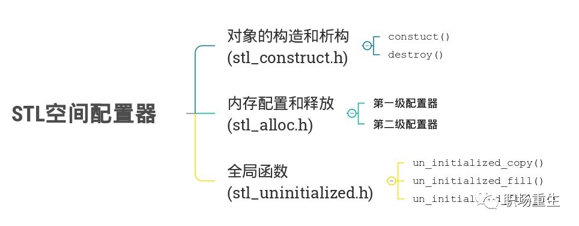

**对象的构造和析构采用placement new函数：**

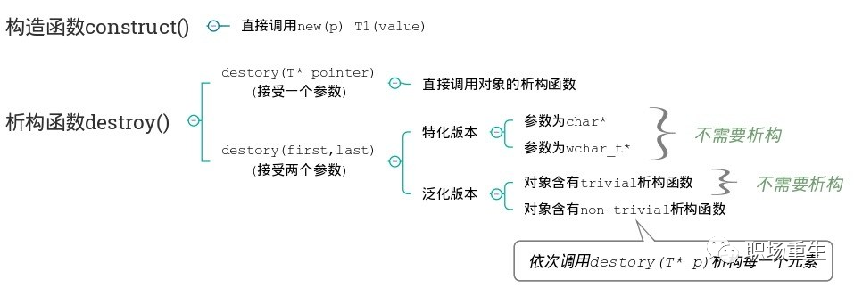

**内存配置：**

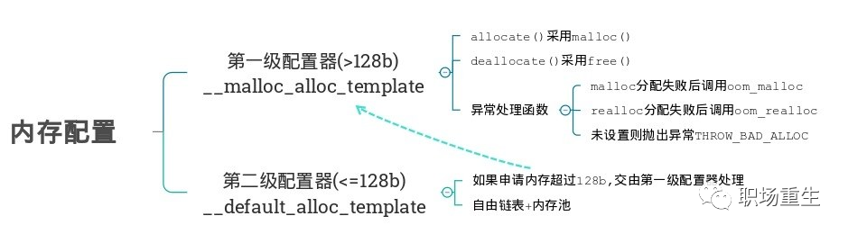

**分配算法：**

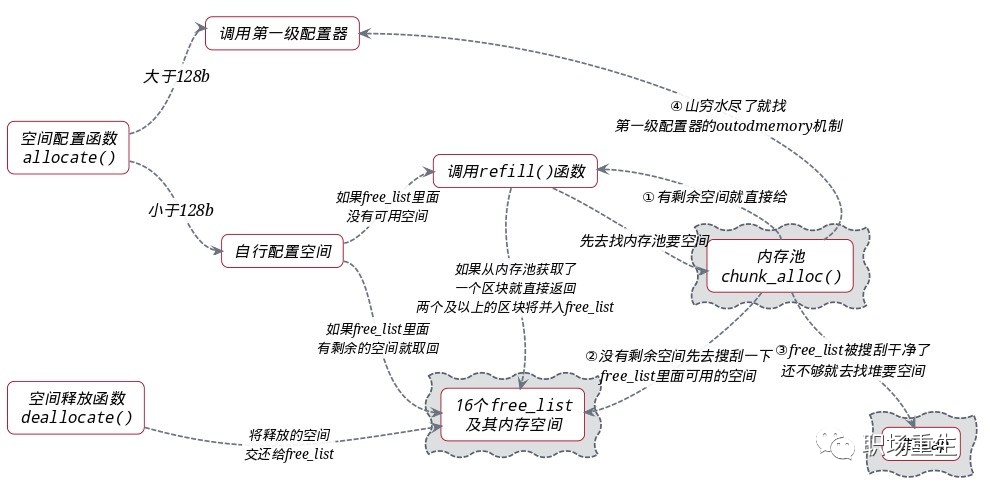

思考问题：

1. vector内存设计和array的区别和适用的场景？
2. 遍历map与遍历vector哪个更快，为什么？
3. STL的map和unordered_map内存设计各有什么不同？

### 六  C++内存问题及常用的解决方法

#### 1. 内存管理功能问题

由于C++语言对内存有主动控制权，内存使用灵活和效率高，但代价是不小心使用就会导致以下内存错误：

• memory overrun：写内存越界  
• double free：同一块内存释放两次  
• use after free：内存释放后使用  
• wild free：释放内存的参数为非法值  
• access uninitialized memory：访问未初始化内存  
• read invalid memory：读取非法内存，本质上也属于内存越界  
• memory leak：内存泄露  
• use after return：caller访问一个指针，该指针指向callee的栈内内存  
• stack overflow：栈溢出

常用的解决内存错误的方法

* **代码静态检测**

静态代码检测是指无需运行被测代码，通过词法分析、语法分析、控制流、数据流分析等技术对程序代码进行扫描，找出代码隐藏的错误和缺陷，如参数不匹配，有歧义的嵌套语句，错误的递归，非法计算，可能出现的空指针引用等等。统计证明，在整个软件开发生命周期中，30%至70%的代码逻辑设计和编码缺陷是可以通过静态代码分析来发现和修复的。在C++项目开发过程中，因为其为编译执行语言，语言规则要求较高，开发团队往往要花费大量的时间和精力发现并修改代码缺陷。所以C++静态代码分析工具能够帮助开发人员快速、有效的定位代码缺陷并及时纠正这些问题，从而极大地提高软件可靠性并节省开发成本。

**静态代码分析工具的优势：**

1、自动执行静态代码分析，快速定位代码隐藏错误和缺陷。
2、帮助代码设计人员更专注于分析和解决代码设计缺陷。
3、减少在代码人工检查上花费的时间，提高软件可靠性并节省开发成本。

一些主流的静态代码检测工具，免费的cppcheck，clang static analyzer；

商用的coverity，pclint等

各个工具性能对比：

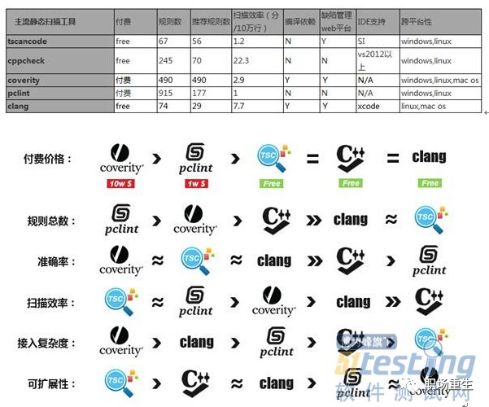

http://www.51testing.com/html/19/n-3709719.html

* **代码动态检测**

所谓的代码动态检测，就是需要再程序运行情况下，通过插入特殊指令，进行动态检测和收集运行数据信息，然后分析给出报告。  

1. 为了检测内存非法使用，需要hook内存分配和操作函数。hook的方法可以是用C-preprocessor，也可以是在链接库中直接定义（因为Glibc中的malloc/free等函数都是weak symbol），或是用LD_PRELOAD。另外，通过hook strcpy(),memmove()等函数可以检测它们是否引起buffer overflow。

2. 为了检查内存的非法访问，需要对程序的内存进行bookkeeping，然后截获每次访存操作并检测是否合法。bookkeeping的方法大同小异，主要思想是用shadow memory来验证某块内存的合法性。至于instrumentation的方法各种各样。有run-time的，比如通过把程序运行在虚拟机中或是通过binary translator来运行；或是compile-time的，在编译时就在访存指令时就加入检查操作。另外也可以通过在分配内存前后加设为不可访问的guard page，这样可以利用硬件(MMU)来触发SIGSEGV，从而提高速度。

3. 为了检测栈的问题，一般在stack上设置canary，即在函数调用时在栈上写magic number或是随机值，然后在函数返回时检查是否被改写。另外可以通过mprotect()在stack的顶端设置guard page，这样栈溢出会导致SIGSEGV而不至于破坏数据。

#### 工具总结对比，常用valgrind（检测内存泄露），gperftools（统计内存消耗）等：

<table height="1480"><thead><tr style="height: 56px;"><th style="width: 22px;height: 56px;" width="82">&nbsp;</th><th style="width: 98px;height: 56px;" width="40"><span style="font-size: 12px;">AddressSanitize</span></th><th style="width: 101px;height: 56px;text-align: left;"><span style="font-size: 12px;">Valgrind/Memcheck</span></th><th style="width: 60px;height: 56px;"><span style="font-size: 12px;">Dr. Memory</span></th><th style="width: 42px;height: 56px;text-align: left;"><span style="font-size: 12px;">Mudflap</span></th><th style="width: 59px;height: 56px;text-align: left;" width="38"><span style="font-size: 12px;">Guard Page</span></th><th style="width: 56px;height: 56px;text-align: left;" width="100"><span style="font-size: 12px;">gperftools</span></th><th style="width: 56px;height: 56px;text-align: left;word-break: break-all;" width="5"><br></th></tr></thead><tbody><tr style="height: 56px;"><td width="113" height="56"><span style="font-size: 12px;">technology</span></td><td width="40" height="56"><span style="font-size: 12px;">CTI</span></td><td width="101" height="56"><span style="font-size: 12px;">DBI</span></td><td width="60" height="56"><span style="font-size: 12px;">DBI</span></td><td width="42" height="56"><span style="font-size: 12px;">CTI</span></td><td width="38" height="56"><span style="font-size: 12px;">Library</span></td><td width="117" height="56"><span style="font-size: 12px;">Library</span></td><td width="5" height="56"><br></td></tr><tr style="height: 54px;"><td width="113" height="54"><span style="font-size: 12px;">ARCH</span></td><td width="40" height="54"><span style="font-size: 12px;">x86, ARM, PPC</span></td><td width="101" height="54"><span style="font-size: 12px;">x86, ARM, PPC, MIPS, S390X, TILEGX</span></td><td width="60" height="54"><span style="font-size: 12px;">x86</span></td><td width="42" height="54"><span style="font-size: 12px;">all(?)</span></td><td width="38" height="54"><span style="font-size: 12px;">all(?)</span></td><td width="117" height="54"><span style="font-size: 12px;">all(?)</span></td><td width="5" height="54"><br></td></tr><tr style="height: 112px;"><td width="113" height="112"><span style="font-size: 12px;">OS</span></td><td width="40" height="112"><span style="font-size: 12px;">Linux, OS X, Windows, FreeBSD, Android, iOS Simulator</span></td><td width="101" height="112"><span style="font-size: 12px;">Linux, OS X, Solaris, Android</span></td><td width="60" height="112"><span style="font-size: 12px;">Windows, Linux</span></td><td width="42" height="112"><span style="font-size: 12px;">Linux, Mac(?)</span></td><td width="38" height="112"><span style="font-size: 12px;">All (1)</span></td><td width="117" height="112"><span style="font-size: 12px;">Linux, Windows</span></td><td width="5" height="112"><br></td></tr><tr style="height: 28px;"><td width="113" height="28"><span style="font-size: 12px;">Slowdown</span></td><td width="40" height="28"><span style="font-size: 12px;"><strong>2x</strong></span></td><td width="101" height="28"><span style="font-size: 12px;">20x</span></td><td width="60" height="28"><span style="font-size: 12px;">10x</span></td><td width="42" height="28"><span style="font-size: 12px;">2x-40x</span></td><td width="38" height="28"><span style="font-size: 12px;">?</span></td><td width="117" height="28"><span style="font-size: 12px;">？</span></td><td width="5" height="28"><br></td></tr><tr style="height: 28px;"><td width="113" height="28"><span style="font-size: 12px;">Detects:</span></td><td width="40" height="28"><br></td><td width="101" height="28"><br></td><td width="60" height="28"><br></td><td width="42" height="28"><br></td><td width="38" height="28"><br></td><td width="117" height="28"><br></td><td width="5" height="28"><br></td></tr><tr style="height: 28px;"><td width="113" height="28">Heap OOB</td><td width="40" height="28"><span style="font-size: 12px;"><strong>yes</strong></span></td><td width="101" height="28"><span style="font-size: 12px;">yes</span></td><td width="60" height="28"><span style="font-size: 12px;">yes</span></td><td width="42" height="28"><span style="font-size: 12px;">yes</span></td><td width="38" height="28"><span style="font-size: 12px;">some</span></td><td width="117" height="28"><span style="font-size: 12px;">some</span></td><td width="5" height="28"><br></td></tr><tr style="height: 28px;"><td width="113" height="28">Stack OOB</td><td width="40" height="28"><span style="font-size: 12px;"><strong>yes</strong></span></td><td width="101" height="28"><span style="font-size: 12px;">no</span></td><td width="60" height="28"><span style="font-size: 12px;">no</span></td><td width="42" height="28"><span style="font-size: 12px;">some</span></td><td width="38" height="28"><span style="font-size: 12px;">no</span></td><td width="117" height="28"><span style="font-size: 12px;">no　　</span></td><td width="5" height="28"><br></td></tr><tr style="height: 56px;"><td width="113" height="56">Global OOB</td><td width="40" height="56"><span style="font-size: 12px;"><strong>yes</strong></span></td><td width="101" height="56"><span style="font-size: 12px;">no</span></td><td width="60" height="56"><span style="font-size: 12px;">no</span></td><td width="42" height="56"><span style="font-size: 12px;">?</span></td><td width="38" height="56"><span style="font-size: 12px;">no</span></td><td width="117" height="56"><span style="font-size: 12px;">no</span></td><td width="5" height="56"><br></td></tr><tr style="height: 28px;"><td width="113" height="28">UAF</td><td width="40" height="28"><span style="font-size: 12px;"><strong>yes</strong></span></td><td width="101" height="28"><span style="font-size: 12px;">yes</span></td><td width="60" height="28"><span style="font-size: 12px;">yes</span></td><td width="42" height="28"><span style="font-size: 12px;">yes</span></td><td width="38" height="28"><span style="font-size: 12px;">yes</span></td><td width="117" height="28"><span style="font-size: 12px;">yes</span></td><td width="5" height="28"><br></td></tr><tr style="height: 84px;"><td width="113" height="84">UAR</td><td width="40" height="84"><span style="font-size: 12px;"><strong>yes</strong>&nbsp;(see&nbsp;</span>AddressSanitizerUseAfterReturn<span style="font-size: 12px;">)</span></td><td width="101" height="84"><span style="font-size: 12px;">no</span></td><td width="60" height="84"><span style="font-size: 12px;">no</span></td><td width="42" height="84"><span style="font-size: 12px;">no</span></td><td width="38" height="84"><span style="font-size: 12px;">no</span></td><td width="117" height="84"><span style="font-size: 12px;">no</span></td><td width="5" height="84"><br></td></tr><tr style="height: 56px;"><td width="113" height="56"><span style="font-size: 12px;">UMR</span></td><td width="40" height="56"><span style="font-size: 12px;">no (see MemorySanitizer)</span></td><td width="101" height="56"><span style="font-size: 12px;">yes</span></td><td width="60" height="56"><span style="font-size: 12px;">yes</span></td><td width="42" height="56"><span style="font-size: 12px;">?</span></td><td width="38" height="56"><span style="font-size: 12px;">no</span></td><td width="117" height="56"><span style="font-size: 12px;">no</span></td><td width="5" height="56"><br></td></tr><tr style="height: 56px;"><td width="113" height="56"><span style="font-size: 12px;">Leaks</span></td><td width="40" height="56"><span style="font-size: 12px;"><strong>yes</strong>&nbsp;(see LeakSanitizer)</span></td><td width="101" height="56"><span style="font-size: 12px;">yes</span></td><td width="60" height="56"><span style="font-size: 12px;">yes</span></td><td width="42" height="56"><span style="font-size: 12px;">?</span></td><td width="38" height="56"><span style="font-size: 12px;">no</span></td><td width="117" height="56"><span style="font-size: 12px;">yes</span></td><td width="5" height="56"><br></td></tr></tbody></table>

**BI**: dynamic binary instrumentation  
**CTI**: compile-time instrumentation  
**UMR**: uninitialized memory reads  
**UAF**: use-after-free (aka dangling pointer)  
**UAR**: use-after-return  
**OOB**: out-of-bounds  
**x86**: includes 32- and 64-bit.  
**mudflap** was removed in GCC 4.9, as it has been superseded by AddressSanitizer.  
**Guard Page**: a family of memory error detectors (Electric fence or DUMA on Linux, Page Heap on Windows, libgmalloc on OS X)  
**gperftools**: various performance tools/error detectors bundled with TCMalloc. Heap checker (leak detector) is only available on Linux. Debug allocator provides both guard pages and canaryonly detectors. values for more precise detection of OOB writes, so it's better than guard page.

https://github.com/google/sanitizers/wiki/AddressSanitizerComparisonOfMemoryTools

#### 2. C++内存管理效率问题

1. 内存管理可以分为三个层次

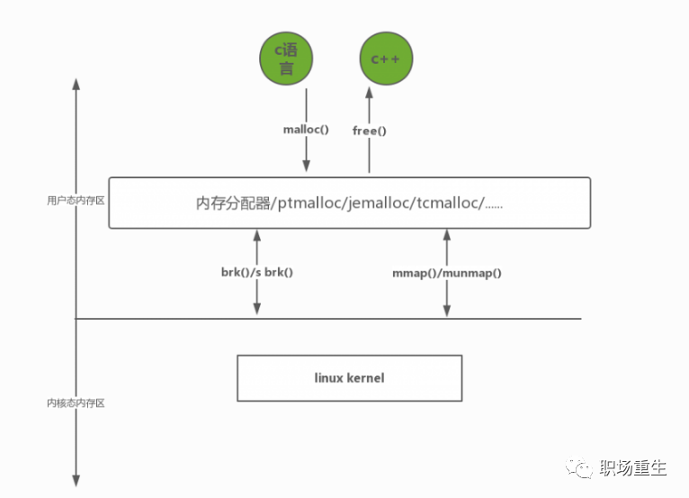

自底向上分别是：

  * 第一层：操作系统内核的内存管理-虚拟内存管理
  * 第二层：glibc层维护的内存管理算法
  * 第三层：应用程序从glibc动态分配内存后，根据应用程序本身的程序特性进行优化， 比如SGI STL allocator，使用引用计数std::shared_ptr，RAII，实现应用的内存池等等。

当然应用程序也可以直接使用系统调用从内核分配内存，自己根据程序特性来维护内存，但是会大大增加开发成本。

2.  C++内存管理问题

  * 频繁的new/delete势必会造成内存碎片化，使内存再分配和回收的效率下降；
  * new/delete分配内存在linux下默认是通过调用glibc的api-malloc/free来实现的，而这些api是通过调用到linux的系统调用:

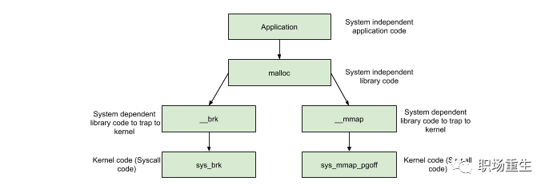

>     brk()/sbrk() // 通过移动Heap堆顶指针brk，达到增加内存目的  
>     mmap()/munmap() // 通过文件影射的方式，把文件映射到mmap区
>
>   * 分配内存 < `DEFAULT_MMAP_THRESHOLD`，走brk，从内存池获取，失败的话走brk系统调用
>
>   * 分配内存 > `DEFAULT_MMAP_THRESHOLD`，走mmap，直接调用mmap系统调用
>
> 其中，`DEFAULT_MMAP_THRESHOLD`默认为128k，可通过`mallopt`进行设置。

sbrk/brk系统调用的实现：分配内存是通过调节堆顶的位置来实现， 堆顶的位置是通过函数 brk 和 sbrk 进行动态调整，参考例子：

(1) 初始状态：如图 (1) 所示，系统已分配 ABCD 四块内存，其中 ABD 在堆内分配， C 使用 mmap 分配。为简单起见，图中忽略了如共享库等文件映射区域的地址空间。

(2) E=malloc(100k) ：分配 100k 内存，小于 128k ，从堆内分配，堆内剩余空间不足，扩展堆顶 (brk) 指针。

(3) free(A) ：释放 A 的内存，在 glibc 中，仅仅是标记为可用，形成一个内存空洞 ( 碎片 )，并没有真正释放。如果此时需要分配 40k以内的空间，可重用此空间，剩余空间形成新的小碎片。

(4) free(C) ：C 空间大于 128K ，使用 mmap 分配，如果释放 C ，会调用 munmap 系统调用来释放，并会真正释放该空间，还给 OS ，如图 (4) 所示。

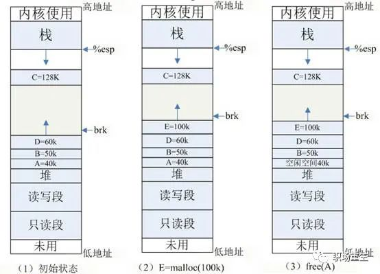

所以free的内存不一定真正的归还给OS，随着系统频繁地 malloc 和 free，尤其对于小块内存，堆内将产生越来越多不可用的碎片，导致“内存泄露”。而这种“泄露”现象使用 valgrind 是无法检测出来的。

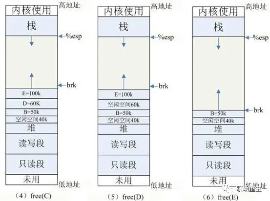

  * 综上，频繁内存分配释放还会导致大量系统调用开销，影响效率，降低整体性能；

3. 常用解决上述问题的方案

**内存池技术**

内存池方案通常一次从系统申请一大块内存块，然后基于在这块内存块可以进行不同内存策略实现，可以比较好得解决上面提到的问题，一般采用内存池有以下好处：

1.少量系统申请次数，非常少(几没有) 堆碎片。  
2.由于没有系统调用等，比通常的内存申请/释放(比如通过malloc, new等)的方式快。  
3.可以检查应用的任何一块内存是否在内存池里。  
4.写一个”堆转储(Heap-Dump)”到你的硬盘(对事后的调试非常有用)。  
5.可以更方便实现某种内存泄漏检测(memory-leak detection)。
6.减少额外系统内存管理开销，可以节约内存；

**内存管理方案实现的指标：**  

  * 额外的空间损耗尽量少
  * 分配速度尽可能快
  * 尽量避免内存碎片
  * 多线程性能好
  * 缓存本地化友好
  * 通用性，兼容性，可移植性，易调试等

各个内存分配器的实现都是在以上的各种指标中进行权衡选择.

4. 一些业界主流的内存管理方案

**SGI STL allocator**

是比较优秀的 C++库内存分配器(细节参考上面描述）

**ptmalloc **

是glibc的内存分配管理模块, 主要核心技术点：

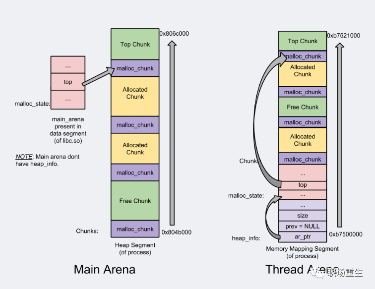

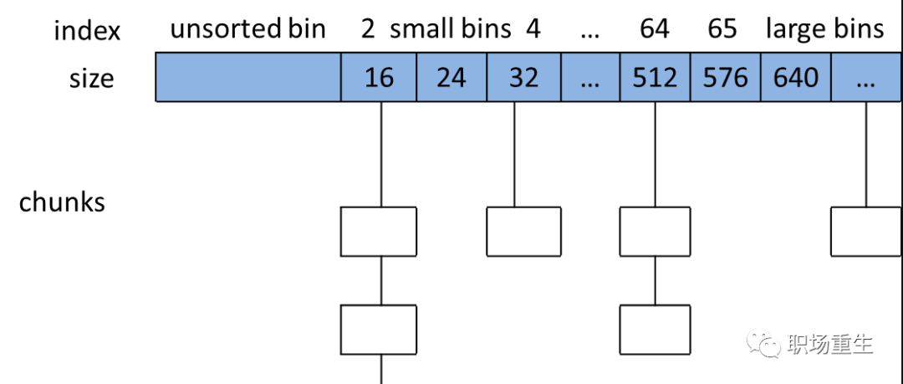

  1. Arena-main /thread；支持多线程
  2. Heap segments；for thread arena via by mmap call ；提高管理
  3. chunk/Top chunk/Last Remainder chunk；提高内存分配的局部性
  4. bins/fast bin/unsorted bin/small bin/large bin;提高分配效率

**ptmalloc的缺陷**

  * 后分配的内存先释放,因为 ptmalloc 收缩内存是从 top chunk 开始,如果与 top chunk 相邻的 chunk 不能释放, top chunk 以下的 chunk 都无法释放。
  * 多线程锁开销大， 需要避免多线程频繁分配释放。
  * 内存从thread的areana中分配， 内存不能从一个arena移动到另一个arena， 就是说如果多线程使用内存不均衡，容易导致内存的浪费。比如说线程1使用了300M内存，完成任务后glibc没有释放给操作系统，线程2开始创建了一个新的arena， 但是线程1的300M却不能用了。
  * 每个chunk至少8字节的开销很大
  * 不定期分配长生命周期的内存容易造成内存碎片，不利于回收。64位系统最好分配32M以上内存，这是使用mmap的阈值。

**tcmalloc **

google的gperftools内存分配管理模块, 主要核心技术点：

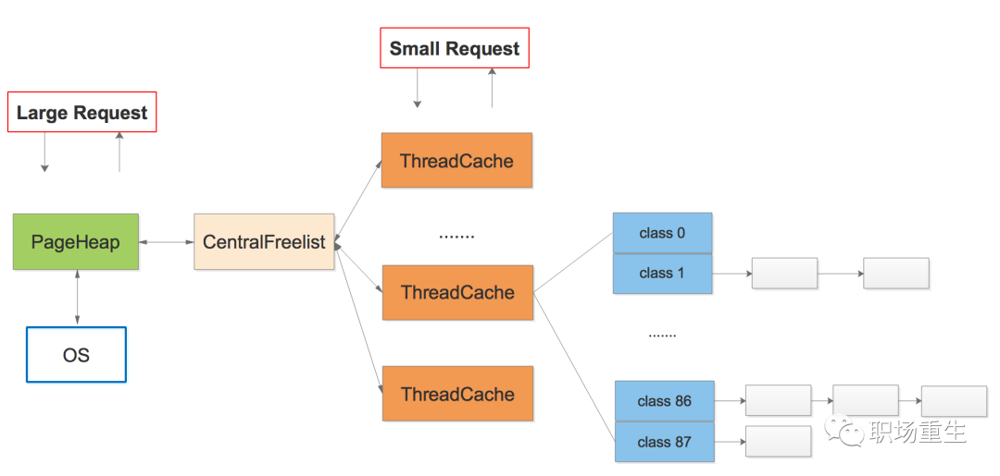

1. thread-localcache/periodic garbagecollections/CentralFreeList；提高多线程性能,提高cache利用率

TCMalloc给每个线程分配了一个线程局部缓存。小分配可以直接由线程局部缓存来满足。需要的话，会将对象从中央数据结构移动到线程局部缓存中，同时定期的垃圾收集将用于把内存从线程局部缓存迁移回中央数据结构中：

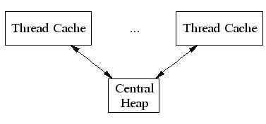

2. Thread Specific Free List/size-classes [8,16,32,…32k]: 更好小对象内存分配;

每个小对象的大小都会被映射到170个可分配的尺寸类别中的一个。例如，在分配961到1024字节时，都会归整为1024字节。尺寸类别这样隔开：较小的尺寸相差8字节，较大的尺寸相差16字节，再大一点的尺寸差32字节，如此类推。最大的间隔（对于尺寸 >=~2K的）是256字节。一个线程缓存对每个尺寸类都包含了一个自由对象的单向链表

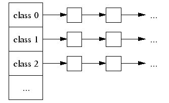

3. The central page heap：更好的大对象内存分配，一个大对象的尺寸(> 32K)会被除以一个页面尺寸（4K）并取整（大于结果的最小整数），同时是由中央页面堆来处理   的。中央页面堆又是一个自由列表的阵列。对于`i < 256`而言，第`k`个条目是一个由`k`个页面组成的自由列表。第`256`个条目则是一个包含了长度`>= 256`个页面的自由列表：

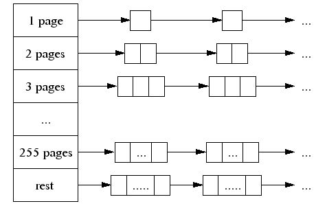

4. Spans:

TCMalloc管理的堆由一系列页面组成。连续的页面由一个“跨度”（`Span`）对象来表示。一个跨度可以是_已被分配_或者是_自由_的。如果是自由的，跨度则会是一个页面堆链表中的一个条目。如果已被分配，它会是一个已经被传递给应用程序的大对象，或者是一个已经被分割成一系列小对象的一个页面。如果是被分割成小对象的，对象的尺寸类别会被记录在跨度中。

由页面号索引的中央数组可以用于找到某个页面所属的跨度。例如，下面的跨度_a_占据了2个页面，跨度_b_占据了1个页面，跨度_c_占据了5个页面最后跨度_d_占据了3个页面。

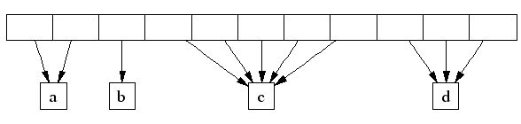

 **tcmalloc的改进 **

  * ThreadCache会阶段性的回收内存到CentralCache里。解决了ptmalloc2中arena之间不能迁移的问题。
  * Tcmalloc占用更少的额外空间。例如，分配N个8字节对象可能要使用大约8N * 1.01字节的空间。即，多用百分之一的空间。Ptmalloc2使用最少8字节描述一个chunk。
  * 更快。小对象几乎无锁， >32KB的对象从CentralCache中分配使用自旋锁。并且>32KB对象都是页面对齐分配，多线程的时候应尽量避免频繁分配，否则也会造成自旋锁的竞争和页面对齐造成的浪费。

**jemalloc**

FreeBSD的提供的内存分配管理模块, 主要核心技术点：

1. 与tcmalloc类似，每个线程同样在<32KB的时候无锁使用线程本地cache;
2. Jemalloc在64bits系统上使用下面的size-class分类：  

Small: [8], [16, 32, 48, …, 128], [192, 256, 320, …, 512], [768, 1024, 1280,…, 3840]  
Large: [4 KiB, 8 KiB, 12 KiB, …, 4072 KiB]  
Huge: [4 MiB, 8 MiB, 12 MiB, …]

3. small/large对象查找metadata需要常量时间， huge对象通过全局红黑树在对数时间内查找

4. 虚拟内存被逻辑上分割成chunks（默认是4MB，1024个4k页），应用线程通过round-robin算法在第一次malloc的时候分配arena， 每个arena都是相互独立的，维护自己的chunks，chunk切割pages到small/large对象。free()的内存总是返回到所属的arena中，而不管是哪个线程调用free().

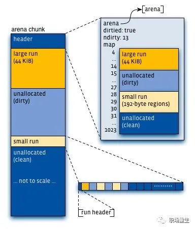

上图可以看到每个arena管理的arena chunk结构， 开始的header主要是维护了一个page map（1024个页面关联的对象状态），header下方就是它的页面空间。Small对象被分到一起， metadata信息存放在起始位置。large chunk相互独立，它的metadata信息存放在chunk header map中。

5. 通过arena分配的时候需要对arena bin（每个small size-class一个，细粒度）加锁，或arena本身加锁。并且线程cache对象也会通过垃圾回收指数退让算法返回到arena中。

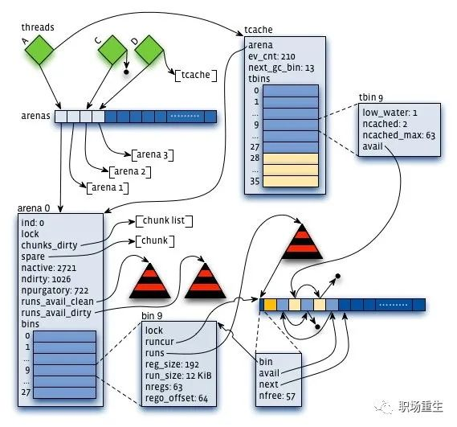

**jemalloc的优化 **

  * Jmalloc小对象也根据size-class，但是它使用了低地址优先的策略，来降低内存碎片化。
  * Jemalloc大概需要2%的额外开销。（tcmalloc 1%， ptmalloc最少8B）.
  * Jemalloc和tcmalloc类似的线程本地缓存，避免锁的竞争 .
  * 相对未使用的页面，优先使用dirty page，提升缓存命中。

**性能比较**

测试环境：2x Intel E5/2.2Ghz with 8 real cores per socket，16 real cores， 开启hyper-threading， 总共32个vcpu。16个table，每个5M row。OLTP_RO测试包含5个select查询：select_ranges, select_order_ranges, select_distinct_ranges, select_sum_ranges：

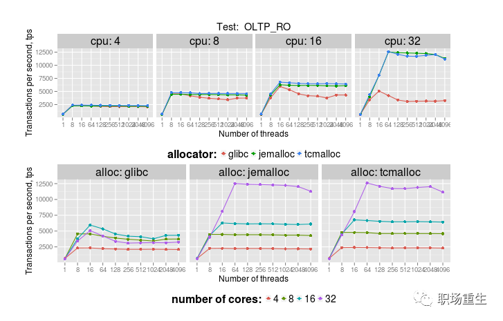

facebook的测试结果:

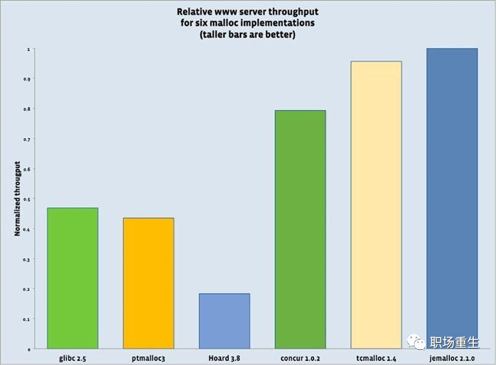

服务器吞吐量分别用6个malloc实现的对比数据，可以看到tcmalloc和jemalloc最好(tcmalloc这里版本较旧)。

详细参考：

https://www.facebook.com/notes/facebook-engineering/scalable-memory-allocation-using-jemalloc/480222803919

 **总结 **

可以看出tcmalloc和jemalloc性能接近，比ptmalloc性能要好，在多线程环境使用tcmalloc和jemalloc效果非常明显。一般支持多核多线程扩展情况下可以使用jemalloc；反之使用tcmalloc可能是更好的选择。

可以参考:

https://sploitfun.wordpress.com/2015/02/10/understanding-glibc-malloc/comment-page-1/

http://goog-perftools.sourceforge.net/doc/tcmalloc.html

https://www.facebook.com/notes/facebook-engineering/scalable-memory-allocation-using-jemalloc/480222803919

https://blog.csdn.net/junlon2006/article/details/77854898


思考问题：

1  jemalloc和tcmalloc最佳实践是什么？

2  内存池的设计有哪些套路？为什么？

### 七  C++程序内存性能测试

#### 1.用系统工具抓取性能数据

* pmap

通过读取/proc/$PID/maps 和 smaps 的数据，解析数据，生成进程的虚列内存映像和一些内存统计：

```
pmap -X -p 31931
31931:   ./bug_tc
Address Perm   Offset Device    Inode  Size   Rss   Pss Referenced Anonymous Swap Locked Mapping
  …
7f37e4c36000 rw-p 00000000  00:00        0    132     88     88         80        88     44      0 [heap]
7fffff85c000 rw-p 00000000  00:00        0  7824  7820  7820       7820      7820    0      0 [stack]
  … 

  ===== ===== ===== ========== ========= ==== ======
                                               71396 16540 13902      16540     13048    0      0 KB

```

里面可以查看程序堆和栈内存大小区间，程序所占内存大小，主要是关注PSS

以下内存统计名称解释：

VSS：Virtual Set Size，虚拟内存耗用内存，包括共享库的内存；

RSS：Resident Set Size，实际使用物理内存，包括共享库；

PSS：Proportional Set Size，实际使用的物理内存，共享库按比例分配；

USS：Unique Set Size，进程独占的物理内存，不计算共享库，也可以理解为将进程杀 死能释放出的内存；

一般VSS >= RSS >= PSS >= USS， 一般统计程序的内存占用，PSS是最好的选择，比较合理。

* top

实时显示内存当前使用情况和各个进程使用内存信息

* free 

查看系统可用内存和占用情况

* /proc/meminfo

查看机器使用内存使用统计和内存硬件基本信息。

* vmstat

监控内存变化

详细请参考man手册：

http://linuxtools-rst.readthedocs.io/zh_CN/latest/tool/

思考问题:

1  各个工具优缺点和使用场景？

2   linux内存统计里面，划分了哪些统计？

* valgrind  massif

堆栈分析器，指示程序中使用了多少堆内存等信息，可以帮助你减少程序内存使用量，因为更小程序更能多占cache，减少分页，加速程序；对于需要大量内存的程序，可以让程序能够减少交换分区使用，加速程序。

valgrind massif 采集完数据生成数据文件，数据文件会显示每一帧的程序使用的堆内存大小，

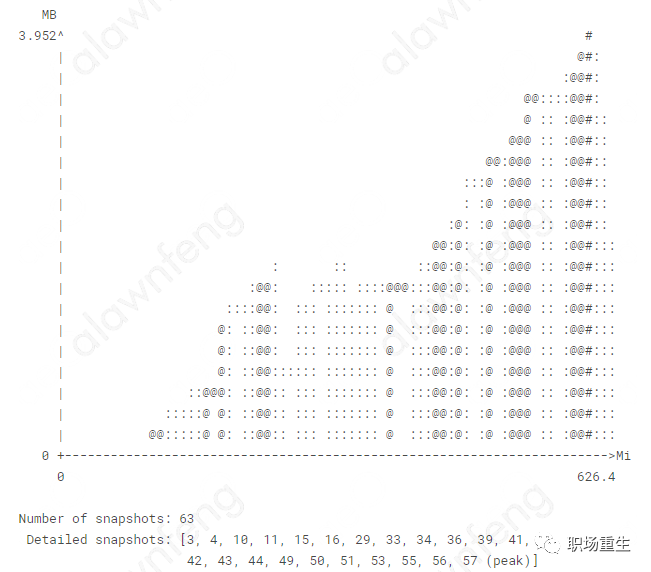

The Snapshot Details 显示更多细节：

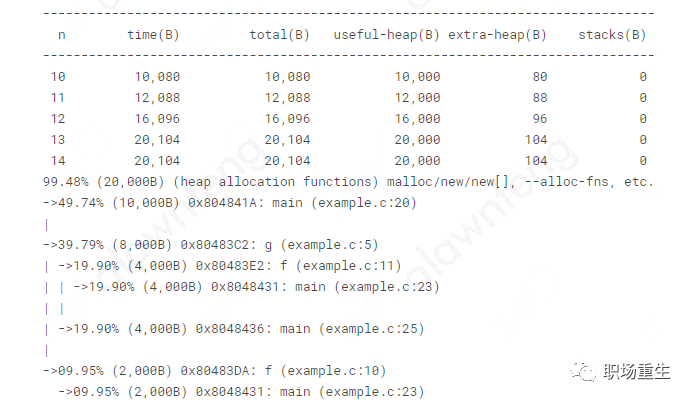

更多细节参考：

http://valgrind.org/docs/manual/ms-manual.html

* gperftools--heap profile

gperftools工具里面的内存监控器，统计监控程序使用内存的多少，可以查看内存使用热点，默认是100ms一次采样。

text模式：% pprof --text test_tc  test.prof

```
Total: 38 samples  
       7  18.4%  18.4%        7  18.4% operator delete[] (inline)  
       3   7.9%  26.3%        3   7.9% PackedCache::TryGet (inline)  
       3   7.9%  34.2%       37  97.4% main::{lambda#1}::operator  
       3   7.9%  42.1%        5  13.2% operator new (inline)  
       3   7.9%  50.0%        4  10.5% tcmalloc::CentralFreeList::ReleaseToSpans  
       2   5.3%  55.3%        2   5.3% SpinLock::SpinLoop  
       2   5.3%  60.5%        2   5.3% _init  
       2   5.3%  65.8%        2   5.3% tcmalloc::CentralFreeList::FetchFromOneSpans  
       2   5.3%  71.1%        2   5.3% tcmalloc::ThreadCache::GetThreadHeap (inline)  
       2   5.3%  76.3%        2   5.3% tcmalloc::ThreadCache::ReleaseToCentralCache (inline)  
       1   2.6%  78.9%        1   2.6% ProfileData::FlushTable  
       1   2.6%  81.6%        4  10.5% SpinLock::Lock (inline)  
       1   2.6%  84.2%        1   2.6% TCMalloc_PageMap2::get (inline)  
       1   2.6%  86.8%        5  13.2% tcmalloc::CentralFreeList::ReleaseListToSpans  
       1   2.6%  89.5%        6  15.8% tcmalloc::CentralFreeList::RemoveRange  
       1   2.6%  92.1%        1   2.6% tcmalloc::SizeMap::GetSizeClass (inline)
```

  * 第一列代表这个函数调用本身直接使用了多少内存，
  * 第二列表示第一列的百分比，
  * 第三列是从第一行到当前行的所有第二列之和，
  * 第四列表示这个函数调用自己直接使用加上所有子调用使用的内存总和，
  * 第五列是第四列的百分比。

基本上只要知道这些，就能很好的掌握每一时刻程序运行内存使用情况了，并且对比不同时段的不同profile数据，可以分析出内存走向，进而定位热点和泄漏。

pdf模式：可以把采样的结果转换为图模式,这样查看更为直观：

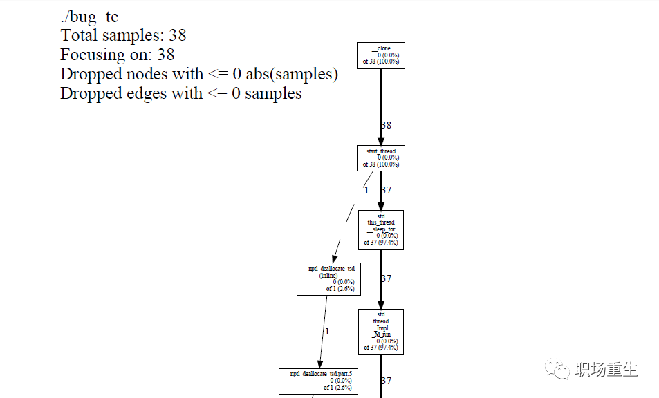  

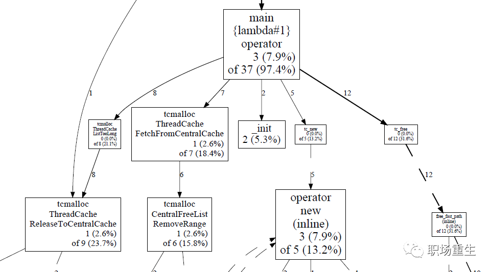

Kcachegrind模式：利用pprof生成callgrind格式的文件即可,KCachegrind的GUI工具，用于分析`callgrind`：

  * 图形化地浏览源码和执行次数，并使用各种排序来搜索可优化的东西。
  * 分析不同的图表，来可视化地观察什么占据了大多数时间，以及它调用了什么。
  * 查看真实的汇编机器码输出，使你能够看到实际的指令，给你更多的线索。
  * 可视化地显示源码中的循环和分支的跳跃方式，便于你更容易地找到优化代码的方法。

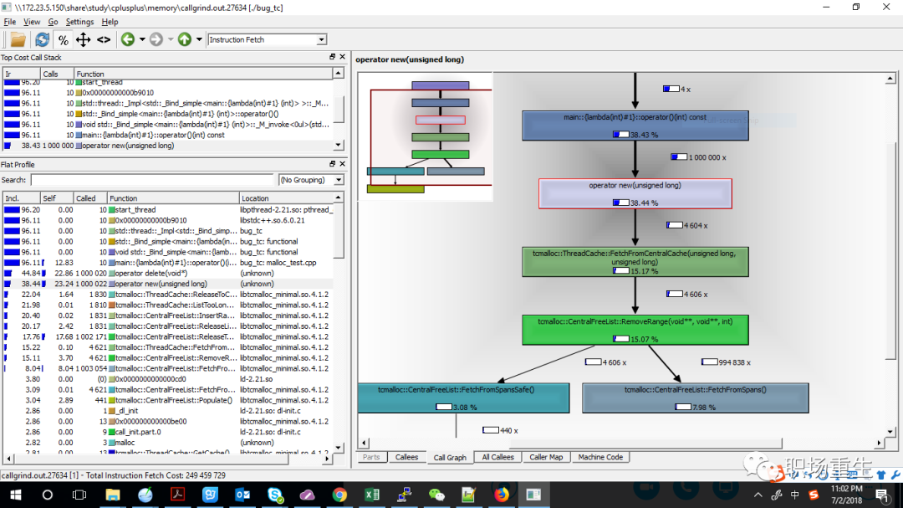

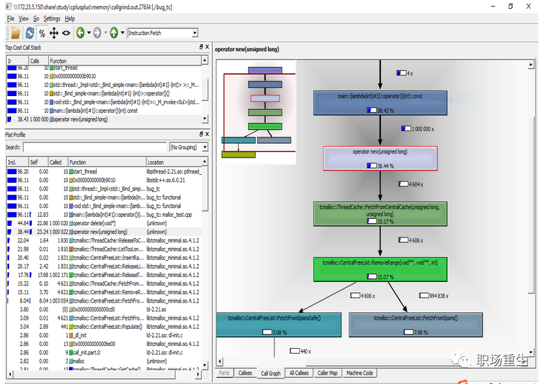

更多细节参考  

https://github.com/gperftools/gperftools/blob/master/docs/heapprofile.html

windows 版本：

https://sourceforge.net/projects/precompiledbin/files/latest/download?source=files

思考问题:

1  说一说内存对设备（手机，PC，嵌入式设备）性能影响？

### 参考

https://blog.csdn.net/yang_yulei/article/details/45795591

https://blog.csdn.net/buxizhizhou530/article/details/46695999

http://www.cnblogs.com/heleifz/p/shared-principle-application.html

https://herbsutter.com/gotw/_102/

https://lanzkron.wordpress.com/2012/04/22/make_shared-almost-a-silver-bullet/

http://en.cppreference.com/w/cpp/memory/shared_ptr/make_shared

  
