 
<!--BEGIN_DATA
{
    "create_date": "2021-11-20 15:20", 
    "modify_date": "2021-11-20 15:20", 
    "is_top": "0", 
    "summary": "微信终端自研C++协程框架的设计与实现<br/>", 
    "tags": "C/C++", 
    "file_name": "C++协程框架owl.md"
}
END_DATA-->

#### <p>原文出处：<a href='https://mp.weixin.qq.com/s/c17DaD7JbKlDFT6J8haEFw' target='blank'>微信终端自研C++协程框架的设计与实现</a></p>

## 背景

基于跨平台考虑，微信终端很多基础组件使用 C++ 编写，随着业务越来越复杂，传统异步编程模型已经无法满足业务需要。Modern C++ 虽然一直在改进，但一直没有统一编程模型，为了提升开发效率，改善代码质量，我们自研了一套 `C++ 协程框架 owl`，用于为所有基础组件提供统一的编程模型。

owl 协程框架目前主要应用于 `C++ 跨平台微信客户端内核（Alita）`，Alita的业务逻辑部分全部用协程实现，相比传统异步编程模型，**至少减少了 50% 代码量**。Alita 目前已经应用于儿童手表微信、Linux车机微信、Android 车机微信等多个业务，其中 **Linux 车机微信的所有 UI 逻辑也全部用协程实现**。

## 为什么要造轮子？

那么问题来了，既然 C++20 已经支持了协程，业界也有不少开源方案（如 libco、libgo 等），为什么不直接使用？

原因：

  * owl 基础库需要支持尽量多的操作系统和架构，操作系统包括：Android、iOS、macOS、Windows、Linux、`RTOS`；架构包括：x86、x86_64、arm、arm64、`loongarch64`，目前并没有任何一个方案能直接支持。
  * owl 协程自 2019 年初就推出了，而当时 C++20 还未成熟，实际上到目前为止 C++20 普及程度依然不高，公司内部和外部合作伙伴的编译器版本普遍较低，导致目前 owl 最多只能用到 C++14 的特性
  * 业界已有方案有不少缺点：
    1. 大多为后台开发设计，不适用终端开发场景
    2. 基本只支持 Linux 系统和 x86/x86_64 架构
    3. 封装层次较低，大多是玩具或 API 级别，并没有达到框架级别
    4. 在 C++ 终端开发没有看到大规模应用案例

## Show me the code

那么协程比传统异步编程到底好在哪里？下面我们结合代码来展示一下协程的优势，同时也回顾一下异步编程模型的演化过程：

假设有一个异步方法 `AsyncAddOne`，用于将一个 int 值加 1，为了简单起见，这里直接开一个线程 sleep 100ms 后再回调新的值：

    
```cpp
void AsyncAddOne(int value, std::function<void (int)> callback) {  
    std::thread t([value, callback = std::move(callback)] {  
        std::this_thread::sleep_for(100ms);  
        callback(value + 1);  
    });  
    t.detach();  
}  
```  

要调用 `AsyncAddOne` 将一个 int 值加 3，有三种主流写法：

### 1、Callback

传统回调方式，代码写起来是这样：
    
```cpp
AsyncAddOne(100, [] (int result) {  
    AsyncAddOne(result, [] (int result) {  
        AsyncAddOne(result, [] (int result) {  
            printf("result %d\n", result);  
        });  
    });  
});  
```  

回调有一些众所周知的痛点，如回调地狱、信任问题、错误处理困难、生命周期管理困难等，在此不再赘述。

### 2、Promise

Promise 解决了 Callback 的痛点，使用 owl::promise 库的代码写起来是这样：
    
```cpp
// 将回调风格的 AsyncAddOne 转成 Promise 风格  
owl::promise AsyncAddOnePromise(int value) {  
    return owl::make_promise([=] (auto d) {  
        AsyncAddOne(value, [=] (int result) {  
            d.resolve(result);  
        });  
    });  
}  
  
// Promise 方式  
AsyncAddOnePromise(100)  
.then([] (int result) {  
    return AsyncAddOnePromise(result);  
})  
.then([] (int result) {  
    return AsyncAddOnePromise(result);  
})  
.then([] (int result) {  
    printf("result %d\n", result);  
});  
```

很显然，由于消除了回调地狱，代码漂亮多了。实际上 owl::promise 解决了 Callback 的所有痛点，通过使用模版元编程和类型擦除技术，甚至连语法都接近 JavaScript Promise。

但实践发现，Promise 只适合线性异步逻辑，复杂一点的异步逻辑用 Promise 写起来也很乱（如循环调用某个异步接口），因此我们废弃了owl::promise，最终将方案转向了协程。

### 3、Coroutine

使用 owl 协程写起来是这样：

```cpp
// 将回调风格的 AsyncAddOne 转成 Promise 风格  
// 注：  
// owl::promise 擦除了类型，owl::promise2 是类型安全版本  
// owl 协程需要配合 owl::promise2 使用  
owl::promise2<int> AsyncAddOnePromise2(int value) {  
    return owl::make_promise2<int>([=] (auto d) {  
        AsyncAddOne(value, [=] (int result) {  
            d.resolve(result);  
        });  
    });  
}  
  
// Coroutine 方式  
// 使用 co_launch 启动一个协程  
// 在协程中即可使用 co_await 将异步调用转成同步方式  
owl::co_launch([] {  
    auto value = 100;  
    for (auto i = 0; i < 3; i++) {  
        value = co_await AsyncAddOnePromise2(value);  
    }  
    printf("result %d\n", value);  
});  
```  

使用协程可以用同步方式写异步代码，大大减轻了异步编程的心智负担。`co_await` 语法糖让 owl 协程写起来跟很多语言内置的协程并无差别。

## 回调转协程

要在实际业务中使用协程，必须通过某种方式让回调代码转换为协程支持的形式。通过上面的例子可以看出，回调风格接口要支持在协程中同步调用非常简单，只需短短几行代码将回调接口先转成 Promise 接口，在协程中即可直接通过 `co_await` 调用：

```cpp
// 回调接口  
void AsyncAddOne(int value, std::function<void (int)> callback);  
  
// Promise 接口  
owl::promise2<int> AsyncAddOnePromise2(int value);  
  
// 协程中调用  
auto value = co_await AsyncAddOnePromise2(100);  
```

实际项目中通常会省略掉上述中间步骤，直接一步到位：

```cpp
// 在协程中可以像调用普通函数一样调用此函数  
int AsyncAddOneCoroutine(int value) {  
    return co_await owl::make_promise2<int>([=] (auto d) {  
        AsyncAddOne(value, [=] (int result) {  
            d.resolve(result);  
        });  
    });  
}  
```  

> 后台开发使用协程，通常会 hook socket 相关的 I/O API，而终端开发很少需要在协程中使用底层 I/O 能力，通常已经封装好了高层次的异步 I/O 接口，因此 owl 协程并没有 hook I/O API，而是提供一种方便的将回调转协程的方式。

## 一个完整的例子

上述代码片段很难体现出协程的实际用法，这个例子使用协程实现了一个 tcp-echo-server，只有 40 多行代码：

```cpp
int main(int argc, char* argv[]) {  
    // 使用 co_thread_scope() 创建一个协程作用域，并启动一个线程作为协程调度器  
    co_thread_scope() {  
        owl::tcp_server server;  
        int error = server.listen(3090);  
        if (error < 0) {  
            zerror("tcp server listen failed!");  
            return;  
        }  
        zinfo("tcp server listen OK, local %_", server.local_address());  
  
        while (true) {  
            auto client = server.accept();  
            if (!client) {  
                zerror("tcp server accept failed!");  
                break;  
            }  
  
            zinfo("accept OK, local %_, peer %_", client->local_address(), client->peer_address());  
  
            // 当有新 client 连接时，使用 co_launch 启动一个协程专门处理  
            owl::co_launch([client] {  
                char buf[1024] = { 0 };  
                while (true) {  
                    auto num_recv = client->recv_some(buf, sizeof(buf), 0);  
                    if (num_recv <= 0) {  
                        break;  
                    }  
                    buf[num_recv] = '\0';  
                    zinfo("[fd=%_] RECV %_ bytes: %_", client->fd(), num_recv, buf);  
  
                    if (strcmp(buf, "exit") == 0) {  
                        break;  
                    }  
                    auto num_send = client->send(buf, num_recv, 0);  
                    if (num_send < 0) {  
                        break;  
                    }  
                    zinfo("[fd=%_] SENT %_ bytes back", client->fd(), num_send);  
                }  
            });  
        }  
    };  
    return 0;  
}  
```

## 框架分层


为了便于扩展和复用，owl 协程采用分层设计，开发者可以直接使用最上层的 API，也可以基于 Context API 或 Core API 搭建自己的协程框架。

## 协程设计

### 协程栈

协程按有无调用栈分为两类：

  * **有栈协程**（stackful）：每个协程都有自己的调用栈，类似于线程的调用栈
  * **无栈协程**（stackless）：协程没有调用栈，协程的状态通过状态机或闭包来实现

很显然，无栈协程比有栈协程占用更少的内存，但无栈协程通常需要手动管理状态，如果自研协程采用无栈方式会非常难用。因此语言级别的协程通常使用无栈协程，将复杂的状态管理交给编译器处理；自研方案通常使用有栈协程，**owl 也不例外是有栈协程**。

有栈协程按栈的管理方式又可以分为两类：

  * **独立栈**：每个协程都有独立的调用栈
  * **共享栈**：每个协程都有独立的状态栈，一个线程中的多个协程共享一个调用栈。由于这些协程中同时只会有一个协程处于活跃状态，当前活跃的协程可以临时使用调用栈。当此协程被挂起时，将调用栈中的状态保存到自身的状态栈；当协程恢复运行时，将状态栈再拷贝到调用栈。实践中通常设置较大的调用栈和较小的状态栈，来达到节省内存的目的。

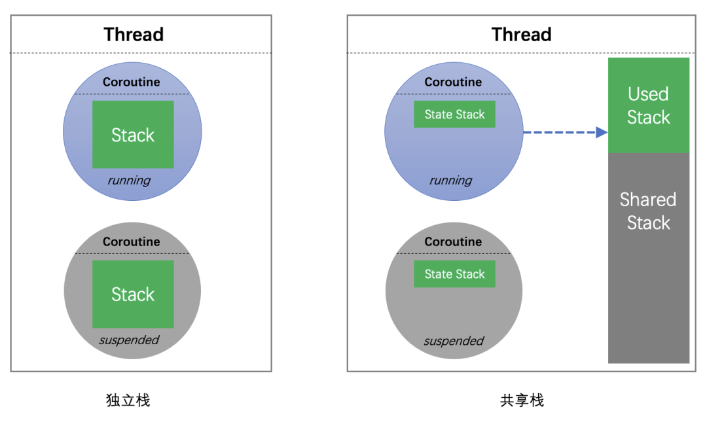

共享栈本质上是一种时间换空间的做法，但共享栈有一个比较明显的缺点，看代码：

```cpp
owl::co_launch("co1", [] {  
    char buf[1024] = { 0 };  
    auto job = owl::co_launch("co2", [&buf] {  
        // oops!!!  
        buf[0] = 'a';  
    });  
    job->join();  
});  
```

上面的代码在共享栈模式下会出问题，协程 `co1` 在栈上分配的 `buf`，在协程 `co2`访问的时候已经失效了。要规避共享栈的这个缺点，可能需要对协程的使用做一些限制或检查，无疑会加重使用者的负担。

对于终端开发，由于同时运行的协程数量并不多，性能问题并不明显，为了使用上的便捷性，**owl 协程使用独立栈**。

选择独立栈之后，协程栈应该如何分配又是另外的问题，有如下几种方案：

  * **Split Stacks**：简单来说是一个支持自动增长的非连续栈，由于只有 gcc 支持且有兼容性问题，实践中比较少用
  * **malloc/mmap**：直接使用 malloc 或 mmap 分配内存，业界主流方案
  * **Thread Stack**：在线程中预先分配一大段栈内存作为协程栈，业界比较少用

> 后两种方案通常还会采用内存池来优化性能，采用 `mprotect` 来进行栈保护

owl 协程同时使用了后两种方案，那么什么场景下会使用到 `Thread Stack` 方案呢？因为 `Android JNI` 和部分 `RTOS系统调用` 会检查 `sp` 寄存器是否在线程栈空间内，如果不在则认为栈被破坏，程序会直接挂掉。独立栈协程在执行时 `sp` 寄存器会被修改为指向协程栈，而通过 `malloc/mmap` 分配的协程栈空间不属于任何线程栈，一定无法通过 `sp` 检查。为了解决这个问题，我们在 `Android` 和部分 `RTOS` 上默认使用 `Thread Stack`。

### 协程调度

协程按控制传递机制分为两类：

  * **对称协程**（Symmetric Coroutine）：和线程类似，协程之间是对等关系，多个协程之间可以任意跳转
  * **非对称协程**（Asymmetric Coroutine）：协程之间存在调用和被调用关系，如协程 A 调用/恢复协程 B，协程 B 挂起/返回时只能回到协程 A

非对称协程与函数调用类似，比较容易理解，主流编程语言对协程的支持大都是非对称协程。从实现的角度，非对称协程的实现也比较简单，实际上我们很容易用非对称协程实现对称协程。**owl 协程使用非对称协程**。

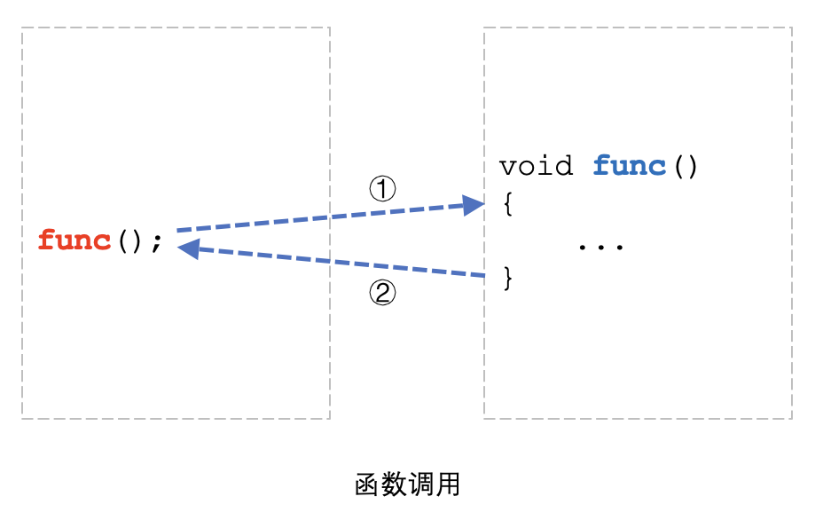

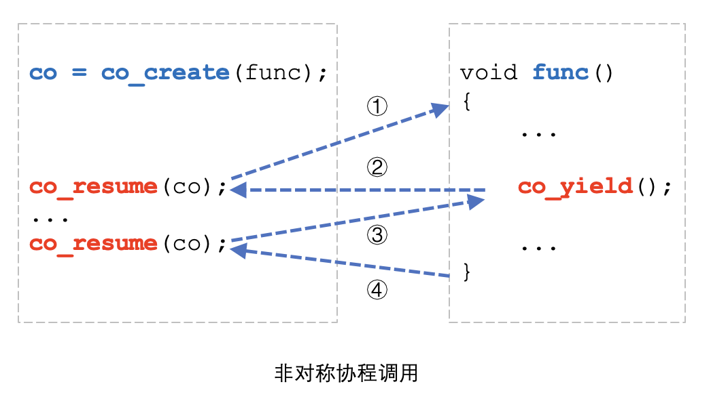

上图展示了非对称协程调用和函数调用的相似性，详细的时序如下：  

  0. 调用者调用 `co_create()` 创建协程，这一步会分配一个单独的协程栈，并为 `func` 设置好执行环境
  1. 调用者调用 `co_resume()` 启动协程，`func` 函数开始运行
  2. 协程运行到 `co_yield()`，协程挂起自己并返回到调用者
  3. 调用者调用 `co_resume()` 恢复协程，协程从 `co_yield()` 后续代码继续执行
  4. 协程执行完毕，返回到调用者

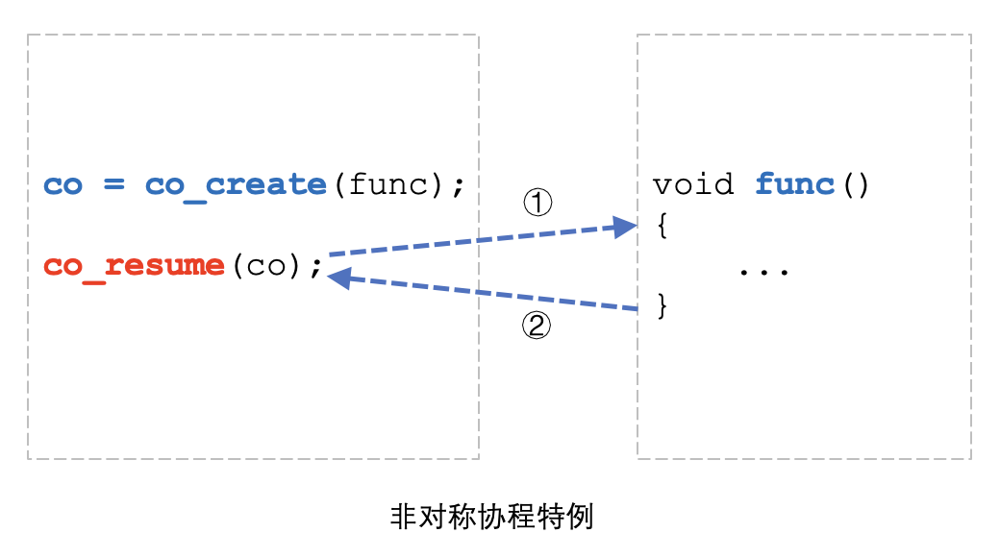

如上图所示，有意思的是，如果一个协程没用调用`co_yield()`，这个协程的调用流程其实跟函数一模一样，因此我们经常会说：**函数就是协程的一种特例**。

### 单线程调度器

协程和线程很像，不同的是线程多是抢占式调度，而协程多是协作式调度。多个线程之间共享资源时通常需要锁和信号量等同步原语，而协程可以不需要。

通过上面的示例可以看出，使用 `co_create()` 创建协程后，可以通过不断调用 `co_resume()` 来驱动协程的运行，而协程函数可以随时调用`co_yield()` 来挂起自己并将控制权转移给调用者。

很显然，当协程数量较多时，通过手工调用 `co_resume()` 来驱动协程不太现实，因此需要实现协程调度器。

协程调度器分为两类：

  * **1:N 调度**（单线程调度）：使用 1 个线程调度 N 个协程，由于多个协程都在同一个线程中运行，因此协程之间访问共享资源无需加锁
  * **M:N 调度**（多线程调度）：使用 M 个线程调度 N 个协程，由于多个协程可能不在同一个线程运行，甚至同一个协程每次调度都有可能运行在不同线程，因此协程之间访问共享资源需要加锁，且协程中使用 TLS（Thread Local Storage） 会有问题

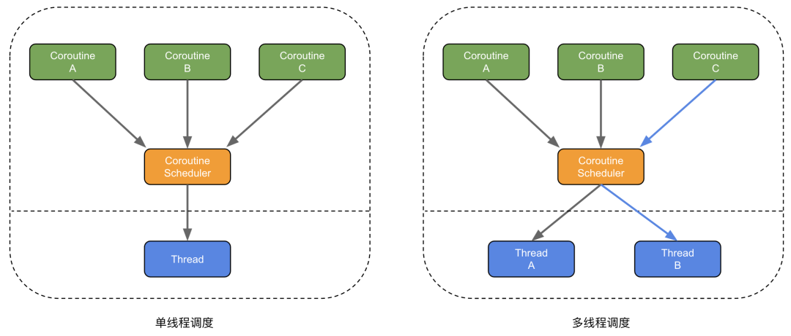

单线程调度通常使用 `RunLoop` 之类的消息循环来作为调度器，虽然调度性能低于多线程调度，但单线程调度器可以免加锁的特性，能极大降低编码复杂度，因此**owl 协程使用单线程调度**。

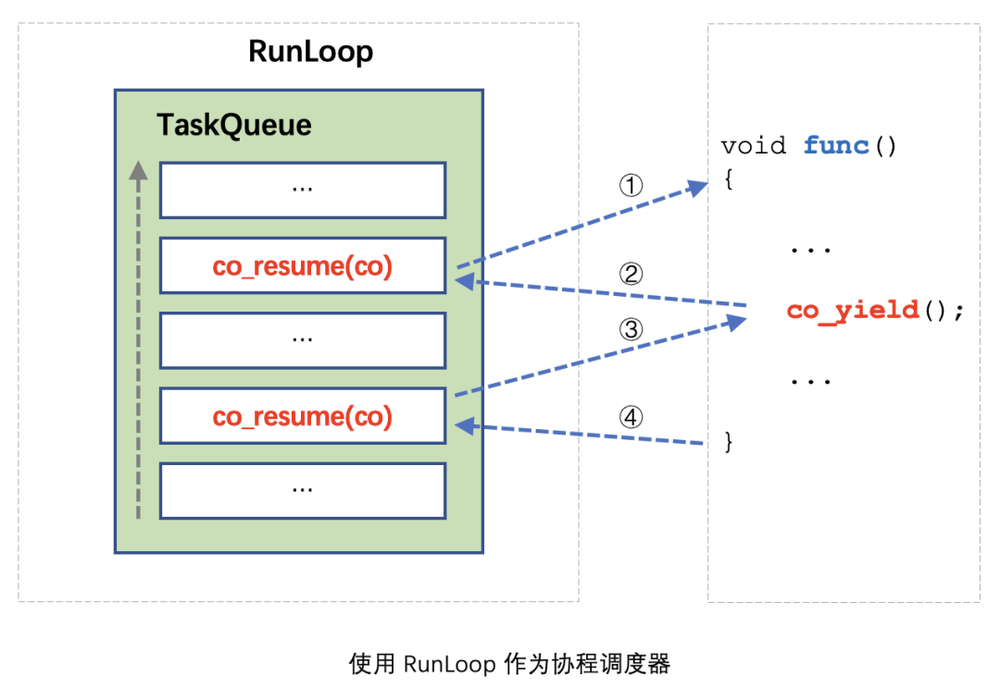

使用 `RunLoop` 作为调度器的原理其实很简单，将所有 `co_resume()` 调用都 Post 到 `RunLoop`中执行即可。原理如图所示，要想象一个协程是如何在 `RunLoop` 中执行的，大概可以认为是：**协程函数中的代码被 `co_yield()` 分隔成多个部分，每一部分代码都被 Post 到 RunLoop 中执行**。

使用 `RunLoop` 作为调度器除了协程不用加锁，还有一些额外的好处：

  * 协程中的代码可以和 `RunLoop` 中的传统异步代码和谐共处
  * 若使用 UI 框架的 `RunLoop` 作为调度器，从协程中可以直接访问 UI

为了方便扩展，owl 协程将调度器抽象成一个单独的接口类，开发者可以很容易实现自己的调度器，或和项目已有的 `RunLoop` 机制结合：

```cpp
class executor {  
public:  
    virtual ~executor() {}  
    virtual uint64_t post(std::function<void ()> closure) = 0;  
    virtual uint64_t post_delayed(unsigned delay, std::function<void ()> closure) = 0;  
    virtual void cancel(uint64_t id) {}  
};  
```

在 Linux 车机微信客户端，我们通过实现自定义调度器让协程运行在 UI 框架的消息循环中，得以方便地在协程中访问 UI。

### 协程间通信

通过使用单线程调度器，多个协程之间访问共享资源不再需要多线程的锁机制了。

那么用协程写代码是否就完全不需要加锁呢？看代码：

```cpp
static int value = 0;  
for (auto i = 0; i < 4; ++i) {  
    owl::co_launch([] {  
        value++;  
        owl::co_delay(1000);  
        value--;  
        printf("value %d\n", value);  
    });  
}  
```

假设协程中要先将 `value++`，做完一些事情，再将 `value--`，我们期望最终 4 个协程的输出都是 0。但由于`owl::co_delay(1000)` 这一行导致了协程调度，最终输出结果必然不符合预期。

一些协程库为了解决这种问题，提供了和多线程锁类似的协程锁机制。好不容易避免了线程锁，又要引入协程锁，难道没有更好的办法了吗？

实际上目前主流的并发模型除了共享内存模型，还有 Actor 模型与 CSP（Communicating Sequential Processes）模型，对比如下：

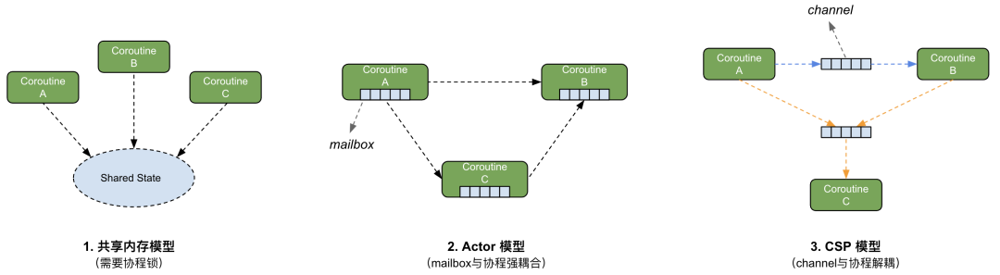

> Do not communicate by sharing memory; instead, share memory by communicating. 不要通过共享内存来通信，而应该通过通信来共享内存

相信这句 Go 语言的哲学大家已经不陌生了，如何理解这句话？本质上看，多个线程或协程之间同步信息最终都是通过`共享内存`来进行的，因为无论是用哪种通信模型， 最终都是从内存中获取数据，因此这句话我们可以理解为 `尽量使用消息来通信，而不要直接共享内存`。

Actor 模型和 CSP 模型采用的都是消息机制，区别在于 Actor 模型里协程与消息队列（mailbox）是绑定关系；而 CSP 模型里协程与消息队列（channel）是独立的。从耦合性的角度，CSP 模型比 Actor 模型更松耦合，因此 **owl 协程使用 channel 作为协程间通信机制**。

由于我们在实际业务开发中并没有遇到一定需要协程锁的场景，因此 owl 协程暂没有提供协程锁机制。

### 结构化并发

想象这样一个场景：我们写一个 UI 界面，在这个界面会启动若干协程通过网络去拉取和更新数据，当用户退出 UI 时，为了不泄露资源，我们希望协程以及协程发起的异步操作都能取消。当然，我们可以通过手动保存每一个协程的句柄，在 UI 退出时通知每一个协程退出，并等待所有协程都结束后再退出 UI。然而，手动进行上述操作非常繁琐，而且很难保证正确性。

不止是使用协程才会遇到上述问题，把协程换成线程，问题依然存在。传统并发主要有两类问题：

  * **生命周期问题**：如何保证协程引用的资源不被突然释放？
  * **协程取消问题**：1）如何打断正在挂起的协程？2）结束协程时，如何同时结束协程中创建的子协程？3）如何等待所有子协程都结束后再结束父协程？

这里的主要矛盾在于：**协程是独立的，但业务是结构化的**。

为了解决这个问题，owl 协程引入了**结构化并发**：

结构化并发的概念是：

  * 作用域中的并发操作，必须在作用域退出前结束
  * 作用域可以嵌套

作用域是一个抽象概念，有明确生命周期的实体都是作用域，如：

  * 一个代码块
  * 一个对象
  * 一个 UI 页面

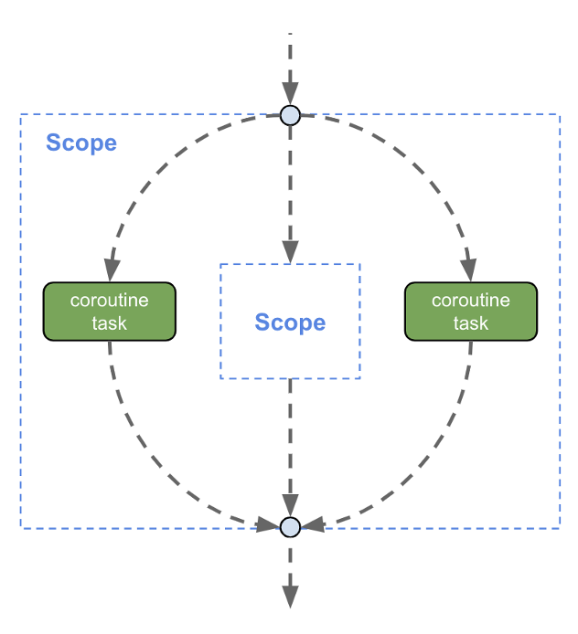

如上图所示，代码由上而下执行，在进入外部 scope 后，从 scope 中启动了两个协程，并进入了内部 scope，当执行流最终从外部 scope 出来时，结构化并发机制必须保证这两个协程已经结束。同样的，若内部 scope 中启动了协程，执行流从内部 scope 出来时，也必须保证其中的协程全部结束。

结构化并发在 owl 协程的实现其实并不复杂，本质上是一个树形结构：

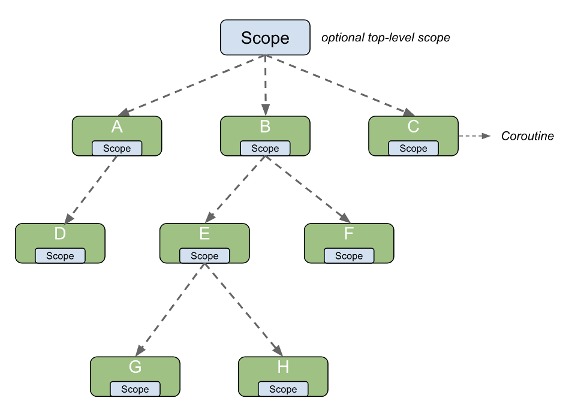

核心理念是：

  * 协程也是一个作用域
  * 协程有父子关系
  * 父协程取消，子协程也自动取消
  * 父协程结束前，必须等待子协程结束

光说概念有点抽象，最后来看一个 owl 协程结构化并发的例子：

```cpp
class SimpleActivity {  
public:  
    SimpleActivity() {  
        // 为 scope_ 设置调度器，后续通过 scope_ 启动的协程  
        // 默认使用 UI 的消息循环作为调度器  
        scope_.set_exec(GetUiExecutor());  
    }  
  
    ~SimpleActivity() {  
        // UI 销毁的时候取消所有子协程  
        scope_.cancel();  
        // scope_ 析构时会等待所有子协程结束  
    }  
  
    void OnButtonClicked() {  
        // 在 UI 事件中通过 scope_ 启动协程  
        scope_.co_launch([=] {  
            // 启动子协程下载图片  
            auto p1 = owl::co_async([] { return DownloadImage(...); });  
            auto p2 = owl::co_async([] { return DownloadImage(...); });  
  
            // 等待图片下载完毕  
            auto image1 = co_await p1;  
            auto image2 = co_await p2;  
  
            // 合并图片  
            auto new_image = co_await AsyncCombineImage(image1, image2);  
  
            // 更新图片，由于协程运行在消息循环中，可以直接访问 UI  
            image_->SetImage(new_image);  
        });  
  
        // 可以通过 scope_ 启动任意多个协程  
        scope_.co_launch([=] {  
            ...  
        });  
    }  
  
private:  
    owl::co_scope scope_;  
    ImageLabel* image_;  
};  
```

### 性能测试


说明：

  * 上下文切换：使用 Context API 进行上下文切换的性能，耗时在 `20~30ns` 级别
  * 协程切换：使用单线程调度器进行协程切换的性能，耗时在 `0.5~3us` 级别
  * 线程切换：pthread 线程切换的性能，耗时在 `2~8us` 级别

owl 协程受限于单线程调度器性能，切换速度和上下文切换比并不算快，但在终端使用也足够了。

## 总结

总的来说，自 owl 协程在实际项目中应用以来，开发效率和代码质量都有很大提升。owl 协程虽然已经得到广泛应用，但还存在很多不完善的地方，未来会继续迭代打磨。owl 现阶段在腾讯内部开源，待框架更完善且 API 稳定后，再进行对外开源。

<hr>

</a></p>

## 简介

在上一篇文章 **《微信终端自研C++协程框架的设计与实现》** 中，我们介绍了异步编程的演化过程和 **owl 协程**的整体设计思路，因篇幅所限，上文中并没有深入到协程的具体实现细节。用 C++ 实现有栈协程，核心在于实现协程上下文切换，在 owl 协程的整体架构中，**owl.context** 位于最底层，所有上层 API 全部基于这一层来实现：

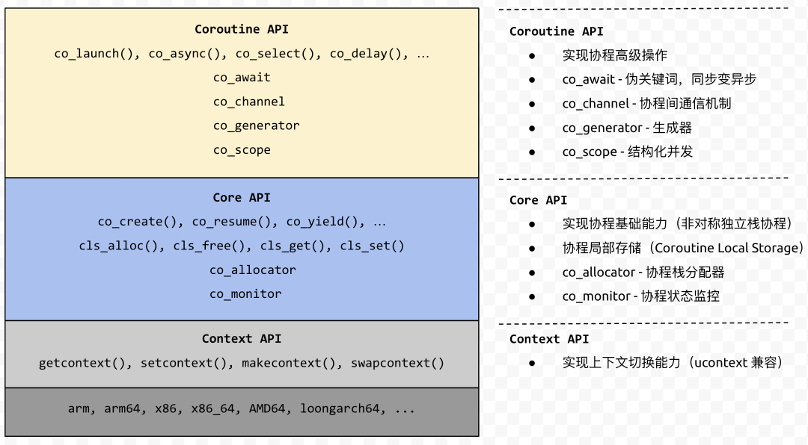

本文将详细讲解 C++ 协程上下文切换的底层原理，手把手教你从零开始实现 C++ 协程。

## owl.context 接口设计

业界比较有名的上下文切换库有 ucontext 和 boost.context，其中 ucontext 的接口文档齐全且语义清晰，而 boost.context 的接口略显晦涩。为了代码便于理解，一开始 owl.context 打算直接兼容 ucontext 接口，仔细研究后发现 ucontext 的一些设计在如今看来并不合理，严格遵循 ucontext 的接口会导致不必要的实现复杂度。因此最终的接口整体保留了 ucontext 的语义，但在细节上做了一些优化。

owl.context 一共有 4 个 API，先看一下接口定义，后面会依次讲解每一个 API 的具体实现：

```cpp
typedef struct {  
    void* base;  
    size_t size;  
} co_stack_t;  
  
typedef struct co_context {  
    co_reg_t regs[32];  
    co_stack_t stack;  
    struct co_context* link;  
} co_context_t;  
  
// 获取当前 context  
// 返回值 0 表示正常返回  
// 返回值 1 表示调用 co_setcontext 导致函数返回  
int co_getcontext(co_context_t* ctx);  
  
// 跳转到指定 context 执行  
void co_setcontext(const co_context_t* ctx);  
  
// 先获取当前 context，再跳转到指定 context 执行  
void co_swapcontext(co_context_t* octx, const co_context_t* ctx);  
  
// 创建新 context，在指定的栈上为 fn 设置好执行环境  
// 跳转到此 context 等价于调用 fn(arg)  
void co_makecontext(co_context_t* ctx, void (*fn)(uintptr_t), uintptr_t arg);  
```  

## 上下文切换示例

在讲解上述 API 的具体实现之前，我们先通过一个示例了解上下文切换的基本概念：

```cpp
void test() {  
    printf("start\n");  
    volatile int n = 3;  
    co_context_t ctx;  
    int ret = co_getcontext(&ctx);  
    if (n > 0) {  
        printf("ret = %d, n = %d\n", ret, n);  
        sleep(1);  
        --n;  
        co_setcontext(&ctx);  
    }  
    printf("end\n");  
}  
```

运行结果：

```cpp 
start  
ret = 0, n = 3  
ret = 1, n = 2  
ret = 1, n = 1  
end  
```

从运行结果可以看出，co_getcontext、co_setcontext 本质上相当于一个增强版 `goto`，可以控制执行流在同一个栈的栈帧之间跳转。第**5** 行先调用 `co_getcontext()` 将当前上下文保存到 **ctx** 变量，代码执行到 `co_setcontext(&ctx)` 时，执行流跳回到 `co_getcontext()` 这行继续执行，从 C/C++ 语言的角度看起来的效果是：**`co_getcontext()` 函数再次返回，只不过返回值变为 1 了**。

## 上下文切换原理

要实现上下文切换，必须先了解线程上下文的概念，对于一个正在运行的线程，其上下文由两部分组成：

  * CPU 寄存器的值
  * 线程的私有数据

其中 `线程的私有数据` 只有极少数平台（如 win32）才有，对于绝大部分主流操作系统，线程的上下文主要由 `CPU 寄存器的值` 组成。因此，要实现上下文切换，只需要实现寄存器的保存/恢复即可。

那么哪些寄存器需要保存/恢复呢？这就需要了解寄存器使用约定，以 32 位 ARM 架构为例，其调用约定在 **AAPCS**（Procedure Call Standard for the ARM Architecture）官方文档中有详细描述，**AAPCS** 规定：

  1. 一共有 16 个整数寄存器 r0-r15，32 个浮点寄存器 s0-s31
  2. r0-r3 用作参数，r0-r1 用作返回值
  3. r4-r8、r10、r11、s16-s31 为 **callee saved registers**
  4. r9 由平台自定义如何使用
  5. r11-r15 为特殊寄存器，分别对应（r11 = FP、r12 = IP、r13 = SP、r14 = LR、r15 = PC）

**对于 callee saved registers，若函数中要用这些寄存器，必须先将这些寄存器的值压栈保存，用完这些寄存器后，在函数返回前从栈中恢复这些寄存器的值。也就是说，若函数 foo 调用函数 bar，当 bar 返回后这些寄存器的值一定不会被改变。**

**对于非 callee saved registers（如 r0-r3），函数中可以随意使用这些寄存器。也就是说，若函数 foo 调用函数 bar，当 bar 返回后这些寄存器的值可能会被改变。**

在上面的示例中，test() 调用了 co_getcontext()，按照寄存器使用约定可知，当 `co_getcontext()` 返回后（无论是正常返回还是因 `co_setcontext()` 跳转返回），必须保证 **callee saved registers** 的值不变，因此 `co_getcontext` 需要保存如下寄存器的值：

  * callee saved registers
  * r9 由平台自定义，有可能被当做 callee saved registers 使用，必须保存
  * SP 为 stack pointer，表示栈指针，必须保存
  * LR 为 link register，表示当前函数的返回地址，必须保存

相应的，`co_setcontext` 需要恢复上述寄存器的值。

> 由于每一种 CPU 架构都有自己的指令集和函数调用约定，甚至同一种 CPU 架构下不同操作系统也会有不同的调用约定。为了方便讲解，本文涉及到的所有 API 实现均基于 32 位 ARM 架构。

## co_getcontext 实现

有了上面的分析，实现 `co_getcontext` 就比较简单了，只用把寄存器 **r4-r11、SP、LR、s16-s31** 的值保存到 **ctx->regs** 中即可，汇编代码：

```cpp
/* int co_getcontext(co_context_t* ctx); */  
.globl co_getcontext  
co_getcontext:  
    /* save r4-r11, lr, sp to regs[0-9] */  
    mov r1, sp  
    stmia r0!, { r4-r11, lr }  
    stmia r0!, { r1 }  
  
    /* save s16-s31 to regs[16-31] */  
    add r0, r0, #24  
    vstmia r0, { s16-s31 }  
  
    /* return 0 */  
    mov r0, #0  
    mov pc, lr  
```

为了便于理解，附上 **ctx->regs** 内存布局：

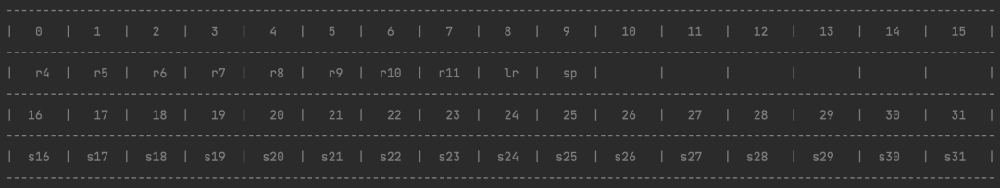

## co_setcontext 实现

`co_setcontext` 的功能几乎与 `co_getcontext` 对称，反向操作即可：

```cpp
/* void co_setcontext(co_context_t* ctx); */  
.globl co_setcontext  
co_setcontext:  
    /* load r4-r11, lr, sp from regs[0-9] */  
    ldmia r0!, { r4-r11, lr }  
    ldmia r0!, { r1 }  
    mov sp, r1  
  
    /* load s16-s31 from regs[16-31] */  
    add r0, r0, #24  
    vldmia r0, { s16-s31 }  
  
    /* make co_getcontext() return 1 */  
    mov r0, #1  
    mov pc, lr  
```

有一个比较微妙的点是，正常调用 `co_getcontext()` 返回值是 **0**，而最后两行汇编会让 `co_getcontext()` 再次返回且返回值是**1**。

## co_swapcontext 实现

`co_swapcontext()` 本质上是先调用 `co_getcontext()` 再调用 `co_setcontext()`，因此可以用 C 语言实现：

```cpp
void co_swapcontext(co_context_t* octx, const co_context_t* ctx) {  
    if (co_getcontext(octx) == 0) {  
        co_setcontext(ctx);  
    }  
}  
```

> 注：在 ucontext 的 glibc 实现中，swapcontext() 并没有采用上述取巧的方式，而是用汇编重新实现了一遍保存和恢复上下文的逻辑，实际上并不是很必要。owl.context 直接复用`co_getcontext`、`co_setcontext`，大大减少了汇编代码量。

## co_makecontext 示例

使用 `co_getcontext`、`co_setcontext` 只能在同一个调用栈中跳转，并不具备实用价值。要实现有栈协程，每个协程必须有独立的调用栈，使用 `co_makecontext` 可以在指定的栈上创建一个新的执行环境，看一个稍微复杂点的例子：

```cpp
co_context_t ctx0;  
co_context_t ctx1;  
  
void co_hello(uintptr_t arg) {  
    printf("co_hello() Enter arg = %lu\n", arg);  
    co_swapcontext(&ctx1, &ctx0);  
    printf("co_hello() Exit\n");  
}  
  
void test_make_context() {  
    printf("main start\n");  
    char stack[4096];  
    // 1.设置栈  
    ctx1.stack.base = stack;  
    ctx1.stack.size = sizeof(stack);  
    // 2.设置 co_hello 返回后需要跳转的上下文  
    ctx1.link = &ctx0;  
    // 3.为 co_hello 创建执行环境  
    co_makecontext(&ctx1, &co_hello, 100);  
    printf("main start co_hello\n");  
    co_swapcontext(&ctx0, &ctx1);  
    printf("main resume co_hello\n");  
    co_swapcontext(&ctx0, &ctx1);  
    printf("main end\n");  
}  
```

运行结果：

```cpp 
main start  
main start co_hello  
co_hello() Enter arg = 100  
main resume co_hello  
co_hello() Exit  
main end  
```

`co_makecontext` 能够通过栈地址、栈大小、入口函数和函数参数创建一个执行环境，这一点与 `pthread_create` 很像，区别在于 `pthread_create` 会创建一个新线程，而 `co_makecontext` 只是创建一个独立的调用栈。

假设 `test_make_context()` 在主线程运行，则 `co_hello()` 也在主线程运行，区别是前者使用的是主线程栈，后者使用的是 `co_makecontext` 时设置的栈，由于两个函数在不同的栈中运行，来回跳转交叉执行栈上的状态也能够得以保留。两个函数之间的切换时序如下：

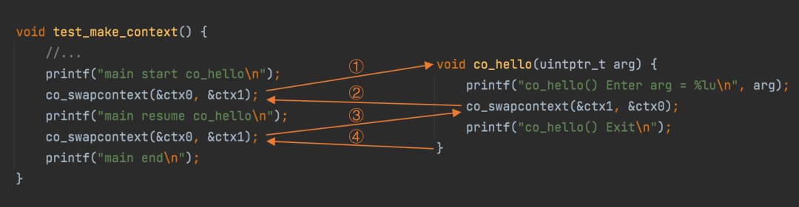

## co_makecontext 实现

要实现 `co_makecontext`，需要了解 **AAPCS** 函数调用约定，调用约定规定了**调用方**（caller）和**被调方**（callee）的职责，要创建调用栈只需了解**调用方**的职责即可，在调用一个函数前**调用方**需要：

  * 设置好函数调用参数：若参数个数 <= 4 依次使用 r0-r3 传递；若参数个数 > 4，前 4 个参数用 r0-r3 传递，剩余参数按照从右向左的顺序压栈
  * 确保栈对齐：参数全部入栈后 SP % 8 == 0（即按照 8 字节对齐）

为方便理解，看一个例子：

```cpp
int hello(int a, int b, int c, int d,  
          int e, int f) {  
    //...  
}  
  
void test() {  
    hello(0, 1, 2, 3, 4, 5);  
    //...  
}  
```  

test() 调用 hello() 之前，需要为 hello() 设置好参数，hello() 有 6 个参数，按照调用约定，前 4 个参数 **（0，1，2，3）** 依次放入 **（r0，r1，r2，r3）**，后 2 个参数 **（4，5）** 压栈，此时寄存器和调用栈的状态如下：

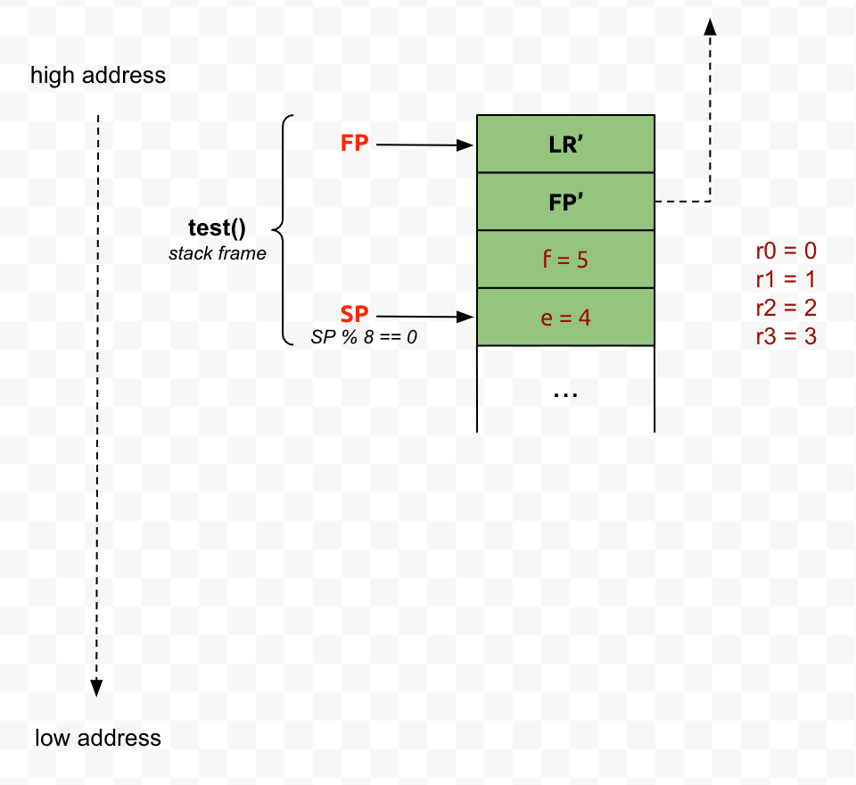

当代码运行到 `hello()` 中时，通过 **（r0，r1，r2，r3）** 可以访问前 4 个参数，通过 `FP` 寄存器加偏移可以访问后 2 个参数，此时寄存器和调用栈的状态如下：

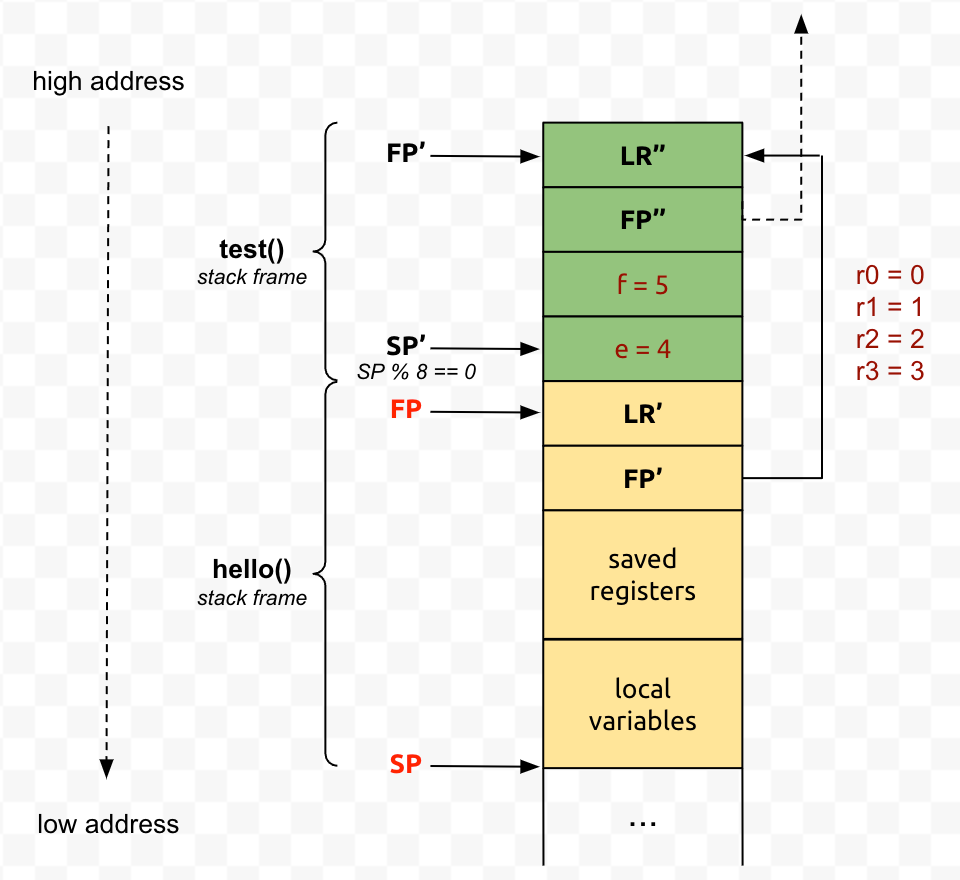

到此实现 `co_makecontext` 就比较容易了，主要做的事情是：

  * 为入口函数设置好参数：

入口函数的函数原型为 `void (uintptr_t)`，只有一个参数，直接将此参数保存到 `r0` 即可

> 注：ucontext 中 makecontext 的函数原型为：
>
> `void makecontext(ucontext_t *ucp, void (*func)(), int argc, ...);`
>
> 由于其入口函数可以支持多个 int 参数，参数个数大于 4 时需要进行压栈，因此 ucontext 中实现 makecontext 会比较复杂。不只是 32 位 ARM，大部分架构的调用约定中都有前 N 个参数直接使用寄存器，超过 N 个参数需要压栈的约定。owl.context 将参数个数限制为一个，避免了繁琐的压栈操作，大大降低了实现复杂度。

  * 保证栈按照 **8** 字节对齐

  * 确保入口函数执行完毕后能跳转到 **link** 所指的上下文继续运行：

ARM 架构中，函数返回地址保存在 **lr** 寄存器，我们可以将 **lr** 寄存器的值改为某个 **stub** 函数地址，这样函数执行完毕后将会执行 **stub** 函数，在 **stub** 中跳转到 **link** 执行即可。

`co_makecontext` 的实现代码如下：

```cpp    
#define R4 0  
#define LR 8  
#define SP 9  
#define FN 10  
#define ARG 11  
  
void co_makecontext(co_context_t* ctx,  
                    void (*fn)(uintptr_t),  
                    uintptr_t arg) {  
    uintptr_t stack_top =  
        (uintptr_t)ctx->stack.base +  
        ctx->stack.size;  
  
    /* ensure the stack 8 byte aligned */  
    uintptr_t* sp = (uintptr_t*)(stack_top & -8L);  
  
    ctx->regs[R4] = (uintptr_t)ctx->link;  
    ctx->regs[LR] = (uintptr_t)&co_jump_to_link;  
    ctx->regs[SP] = (uintptr_t)sp;  
    ctx->regs[FN] = (uintptr_t)fn;  
    ctx->regs[ARG] = arg;  
}  
```

其中 `co_jump_to_link` 则是上面提到的 **stub** 函数，需要用汇编实现：

```cpp
/* void co_jump_to_link(); */  
.globl co_jump_to_link  
co_jump_to_link:  
    /* when fn(arg) return call co_setcontext(link) */  
    movs r0, r4  
    bne co_setcontext  
    b exit  
```  

最新 **ctx->regs** 的内存布局如下（与之前版本相比，新增了 **fn** 和 **arg** 字段）：

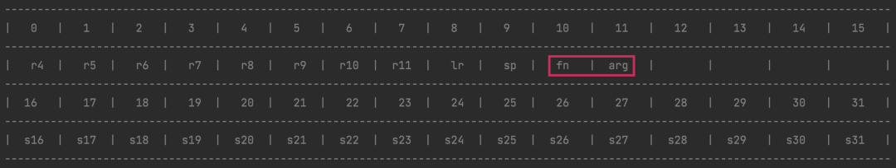

`co_makecontext` 的实现其实很简单，只需要设置 **（r4、lr、sp、fn、arg）** 即可，其中 **r4** 用于存放 **link**。因为是全新的调用栈 **（r5-r11、s16-s31）** 的值并不重要。

还记得之前 `co_setcontext`、`co_setcontext` 的实现吗？之前的版本并没有处理 `co_makecontext` 的情况，因此需要稍做修改：

  * 对于 `co_getcontext`，需要将 **fn、arg** 赋空值
  * 对于 `co_setcontext`，需要判断 **fn** 的值，若不为空则调用 **fn(arg)**，否则走之前的逻辑直接返回

最终的实现代码：

```cpp
/* int co_getcontext(co_context_t* ctx); */  
.globl co_getcontext  
co_getcontext:  
    /* r1 = sp, r2 = fn, r3 = arg */  
    mov r1, sp  
    mov r2, #0  
    mov r3, #0  
    /* save r4-r11, lr, sp to regs[0-9] */  
    stmia r0!, { r4-r11, lr }  
    stmia r0!, { r1-r3 }  
  
    /* save s16-s31 to regs[16-31] */  
    add r0, r0, #16  
    vstmia r0, { s16-s31 }  
  
    /* return 0 */  
    mov r0, #0  
    mov pc, lr  
  
/* void co_setcontext(co_context_t* ctx); */  
.globl co_setcontext  
co_setcontext:  
    /* r1 = sp, r2 = fn, r3 = arg */  
    /* load r4-r11, lr, sp from regs[0-9] */  
    ldmia r0!, { r4-r11, lr }  
    ldmia r0!, { r1-r3 }  
    mov sp, r1  
  
    /* load s16-s31 from regs[16-31] */  
    add r0, r0, #16  
    vldmia r0, { s16-s31 }  
  
    /* call fn(arg) if fn != 0 */  
    cmp r2, #0  
    bne .cofunc  
  
    /* make co_getcontext() return 1 */  
    mov r0, #1  
    mov pc, lr  
  
.cofunc:  
    /* call fn(arg) */  
    mov r0, r3  
    mov pc, r2  
```

## 总结

理解了 owl.context 在 32 位 ARM 架构下的实现原理，要支持其它架构也就不难了，套路都类似，只需要熟悉每一种 CPU 架构的常用指令集和调用约定，最终就能实现一个支持全平台全架构的 owl.context 库。当然，在具体实现过程中会有很多坑，如：

  * win32 中如何在协程中支持 C++ 异常
  * Windows 中对 FS/GS 寄存器的特殊处理
  * x64 和 AMD64 调用约定的区别
  * ARM/THUMB 模式的兼容
  * watchOS 中对 arm64_32 的特殊处理

由于篇幅原因，就此打住，以后再找机会分享。

  

  

