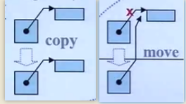
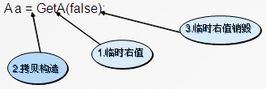
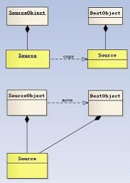

 
<!--BEGIN_DATA
{
    "create_date": "2020-12-23 13:55", 
    "modify_date": "2020-12-23 13:55", 
    "is_top": "0", 
    "summary": "[c++11]我理解的右值引用、移动语义和完美转发<br/>从4行代码看右值引用", 
    "tags": "C/C++", 
    "file_name": "C++右值引用、移动语义和完美转发.md"
}
END_DATA-->

#### <p>原文出处：<a href='https://www.jianshu.com/p/d19fc8447eaa' target='blank'>[c++11]我理解的右值引用、移动语义和完美转发</a></p>

c++中引入了右值引用和移动语义，可以避免无谓的复制，提高程序性能。有点难理解，于是花时间整理一下自己的理解。

### 左值、右值

C++中所有的值都必然属于左值、右值二者之一。左值是指表达式结束后依然存在的持久化对象，右值是指表达式结束时就不再存在的临时对象。所有的具名变量或者对象都是左值，而右值不具名。很难得到左值和右值的真正定义，但是有一个可以区分左值和右值的便捷方法：**看能不能对表达式取地址，如果能，则为左值，否则为右值**。

看见书上又将右值分为将亡值和纯右值。纯右值就是c++98标准中右值的概念，如非引用返回的函数返回的临时变量值；一些运算表达式，如1+2产生的临时变量；不跟对象关联的字面量值，如2，'c'，true，"hello"；这些值都不能够被取地址。

而将亡值则是c++11新增的和右值引用相关的表达式，这样的表达式通常时将要移动的对象、T&&函数返回值、std::move()函数的返回值等，

不懂将亡值和纯右值的区别其实没关系，统一看作右值即可，不影响使用。

示例：

```cpp
int i=0;// i是左值， 0是右值

class A {
  public:
    int a;
};
A getTemp()
{
    return A();
}
A a = getTemp();   // a是左值  getTemp()的返回值是右值（临时变量）
```

### 左值引用、右值引用

`c++98`中的引用很常见了，就是给变量取了个别名，在`c++11`中，因为增加了**右值引用(rvalue reference)**的概念，所以`c++98`中的引用都称为了**左值引用(lvalue reference)**。

```cpp
int a = 10; 
int& refA = a; // refA是a的别名， 修改refA就是修改a, a是左值，左移是左值引用
int& b = 1; //编译错误! 1是右值，不能够使用左值引用
```

`c++11`中的右值引用使用的符号是`&&`，如

```cpp 
int&& a = 1; //实质上就是将不具名(匿名)变量取了个别名
int b = 1;
int && c = b; //编译错误！ 不能将一个左值复制给一个右值引用

class A {
    public:
    int a;
};

A getTemp()
{
    return A();
}

A && a = getTemp();   //getTemp()的返回值是右值（临时变量）
```

`getTemp()`返回的右值本来在表达式语句结束后，其生命也就该终结了（因为是临时变量），而通过右值引用，该右值又重获新生，其生命期将与右值引用类型变量`a`的生命期一样，只要`a`还活着，该右值临时变量将会一直存活下去。实际上就是给那个临时变量取了个名字。

**注意**：这里`a`的**类型**是右值引用类型(`int &&`)，但是如果从左值和右值的角度区分它，它实际上是个**左值**。因为可以对它取地址，而且它还有名字，是一个已经命名的右值。

所以，左值引用只能绑定左值，右值引用只能绑定右值，如果绑定的不对，编译就会失败。但是，**常量左值引用**却是个奇葩，它可以算是一个“万能”的引用类型，它可以绑定非常量左值、常量左值、右值，而且在绑定右值的时候，常量左值引用还可以像右值引用一样将右值的生命期延长，缺点是，只能读不能改。

```cpp
const int & a = 1; //常量左值引用绑定 右值， 不会报错

class A {
    public:
    int a;
};

A getTemp()
{
    return A();
}

const A & a = getTemp();   //不会报错 而 A& a 会报错
```

事实上，很多情况下我们用来常量左值引用的这个功能却没有意识到，如下面的例子：

```cpp 
#include <iostream>
using namespace std;

class Copyable {
public:
    Copyable(){}
    Copyable(const Copyable &o) {
        cout << "Copied" << endl;
    }
};

Copyable ReturnRvalue() {
    return Copyable(); //返回一个临时对象
}

void AcceptVal(Copyable a) {
}

void AcceptRef(const Copyable& a) {
}

int main() {
    cout << "pass by value: " << endl;
    AcceptVal(ReturnRvalue()); // 应该调用两次拷贝构造函数
    cout << "pass by reference: " << endl;
    AcceptRef(ReturnRvalue()); //应该只调用一次拷贝构造函数
}
```

当我敲完上面的例子并运行后，发现结果和我想象的完全不一样！**期望**中`AcceptVal(ReturnRvalue())`需要调用两次拷贝构造函数，一次在`ReturnRvalue()`函数中，构造好了`Copyable`对象，返回的时候会调用拷贝构造函数生成一个临时对象，在调用`AcceptVal()`时，又会将这个对象拷贝给函数的局部变量`a`，一共调用了两次拷贝构造函数。而`AcceptRef()`的不同在于形参是常量左值引用，它能够接收一个右值，而且不需要拷贝。

而实际的结果是，不管哪种方式，一次拷贝构造函数都没有调用！

这是由于编译器默认开启了返回值优化(RVO/NRVO, RVO, Return Value Optimization 返回值优化，或者NRVO， Named Return Value Optimization)。编译器很聪明，发现在`ReturnRvalue`内部生成了一个对象，返回之后还需要生成一个临时对象调用拷贝构造函数，很麻烦，所以直接优化成了1个对象对象，避免拷贝，而这个临时变量又被赋值给了函数的形参，还是没必要，所以最后这三个变量都用一个变量替代了，不需要调用拷贝构造函数。

虽然各大厂家的编译器都已经都有了这个优化，但是这并不是`c++`标准规定的，而且不是所有的返回值都能够被优化，而这篇文章的主要讲的**右值引用**，**移动语义**可以解决编译器无法解决的问题。

为了更好的观察结果，可以在编译的时候加上`-fno-elide-constructors`选项(关闭返回值优化)。

```cpp
// g++ test.cpp -o test -fno-elide-constructors
pass by value: 
Copied
Copied //可以看到确实调用了两次拷贝构造函数
pass by reference: 
Copied
```

上面这个例子本意是想说明常量左值引用能够绑定一个右值，可以减少一次拷贝（使用非常量的左值引用会编译失败），但是顺便讲到了编译器的返回值优化。。编译器还是干了很多事情的，很有用，但不能过于依赖，因为你也不确定它什么时候优化了什么时候没优化。

总结一下，其中`T`是一个具体类型：

  1. 左值引用， 使用 `T&`, 只能绑定**左值**
  2. 右值引用， 使用 `T&&`， 只能绑定**右值**
  3. 常量左值， 使用 `const T&`, 既可以绑定**左值**又可以绑定**右值**
  4. 已命名的**右值引用**，编译器会认为是个**左值**
  5. 编译器有返回值优化，但不要过于依赖

### 移动构造和移动赋值

回顾一下如何用c++实现一个字符串类`MyString`，`MyString`内部管理一个C语言的`char *`数组，这个时候一般都需要实现拷贝构造函数和拷贝赋值函数，因为默认的拷贝是浅拷贝，而指针这种资源不能共享，不然一个析构了，另一个也就完蛋了。

具体代码如下：

```cpp
#include <iostream>
#include <cstring>
#include <vector>
using namespace std;

class MyString
{
public:
    static size_t CCtor; //统计调用拷贝构造函数的次数
//    static size_t CCtor; //统计调用拷贝构造函数的次数
public:
    // 构造函数
    MyString(const char* cstr=0){
        if (cstr) {
            m_data = new char[strlen(cstr)+1];
            strcpy(m_data, cstr);
        }
        else {
            m_data = new char[1];
            *m_data = '\0';
        }
    }
    // 拷贝构造函数
    MyString(const MyString& str) {
        CCtor ++;
        m_data = new char[ strlen(str.m_data) + 1 ];
        strcpy(m_data, str.m_data);
    }
    // 拷贝赋值函数 =号重载
    MyString& operator=(const MyString& str){
        if (this == &str) // 避免自我赋值!!
            return *this;
        delete[] m_data;
        m_data = new char[ strlen(str.m_data) + 1 ];
        strcpy(m_data, str.m_data);
        return *this;
    }
    ~MyString() {
        delete[] m_data;
    }
    char* get_c_str() const { return m_data; }
private:
    char* m_data;
};

size_t MyString::CCtor = 0;

int main()
{
    vector<MyString> vecStr;
    vecStr.reserve(1000); //先分配好1000个空间，不这么做，调用的次数可能远大于1000
    for(int i=0;i<1000;i++){
        vecStr.push_back(MyString("hello"));
    }
    cout << MyString::CCtor << endl;
}
```

代码看起来挺不错，却发现执行了`1000`次拷贝构造函数，如果`MyString("hello")`构造出来的字符串本来就很长，构造一遍就很耗时了，最后却还要拷贝一遍，而`MyString("hello")`只是临时对象，拷贝完就没什么用了，这就造成了没有意义的资源申请和释放操作，如果能够直接使用临时对象已经申请的资源，既能节省资源，又能节省资源申请和释放的时间。而`C++11`新增加的**移动语义**就能够做到这一点。

要实现移动语义就必须增加两个函数：移动构造函数和移动赋值构造函数。

```cpp
#include <iostream>
#include <cstring>
#include <vector>
using namespace std;

class MyString
{
public:
    static size_t CCtor; //统计调用拷贝构造函数的次数
    static size_t MCtor; //统计调用移动构造函数的次数
    static size_t CAsgn; //统计调用拷贝赋值函数的次数
    static size_t MAsgn; //统计调用移动赋值函数的次数
public:
    // 构造函数
    MyString(const char* cstr=0){
        if (cstr) {
            m_data = new char[strlen(cstr)+1];
            strcpy(m_data, cstr);
        }
        else {
            m_data = new char[1];
            *m_data = '\0';
        }
    }
    // 拷贝构造函数
    MyString(const MyString& str) {
        CCtor ++;
        m_data = new char[ strlen(str.m_data) + 1 ];
        strcpy(m_data, str.m_data);
    }
    // 移动构造函数
    MyString(MyString&& str) noexcept
        :m_data(str.m_data) {
        MCtor ++;
        str.m_data = nullptr; //不再指向之前的资源了
    }
    // 拷贝赋值函数 =号重载
    MyString& operator=(const MyString& str){
        CAsgn ++;
        if (this == &str) // 避免自我赋值!!
            return *this;
        delete[] m_data;
        m_data = new char[ strlen(str.m_data) + 1 ];
        strcpy(m_data, str.m_data);
        return *this;
    }
    // 移动赋值函数 =号重载
    MyString& operator=(MyString&& str) noexcept{
        MAsgn ++;
        if (this == &str) // 避免自我赋值!!
            return *this;
        delete[] m_data;
        m_data = str.m_data;
        str.m_data = nullptr; //不再指向之前的资源了
        return *this;
    }
    ~MyString() {
        delete[] m_data;
    }
    char* get_c_str() const { return m_data; }
private:
    char* m_data;
};

size_t MyString::CCtor = 0;
size_t MyString::MCtor = 0;
size_t MyString::CAsgn = 0;
size_t MyString::MAsgn = 0;

int main()
{
    vector<MyString> vecStr;
    vecStr.reserve(1000); //先分配好1000个空间
    for(int i=0;i<1000;i++){
        vecStr.push_back(MyString("hello"));
    }
    cout << "CCtor = " << MyString::CCtor << endl;
    cout << "MCtor = " << MyString::MCtor << endl;
    cout << "CAsgn = " << MyString::CAsgn << endl;
    cout << "MAsgn = " << MyString::MAsgn << endl;
}

/* 结果
CCtor = 0
MCtor = 1000
CAsgn = 0
MAsgn = 0
*/
```

可以看到，移动构造函数与拷贝构造函数的区别是，拷贝构造的参数是`const MyString& str`，是_常量左值引用_，而移动构造的参数是`MyString&& str`，是_右值引用_，而`MyString("hello")`是个临时对象，是个右值，优先进入**移动构造函数**而不是拷贝构造函数。而移动构造函数与拷贝构造不同，它并不是重新分配一块新的空间，将要拷贝的对象复制过来，而是"偷"了过来，将自己的指针指向别人的资源，然后将别人的指针修改为`nullptr`，这一步很重要，如果不将别人的指针修改为空，那么临时对象析构的时候就会释放掉这个资源，"偷"也白偷了。下面这张图可以解释copy和move的区别。



不用奇怪为什么可以抢别人的资源，临时对象的资源不好好利用也是浪费，因为生命周期本来就是很短，在你执行完这个表达式之后，它就毁灭了，充分利用资源，才能很高效。

对于一个左值，肯定是调用拷贝构造函数了，但是有些左值是局部变量，生命周期也很短，能不能也移动而不是拷贝呢？`C++11`为了解决这个问题，提供了`std::move()`方法来将左值转换为右值，从而方便应用移动语义。我觉得它其实就是告诉编译器，虽然我是一个左值，但是不要对我用拷贝构造函数，而是用移动构造函数吧。。。

```cpp
int main()
{
    vector<MyString> vecStr;
    vecStr.reserve(1000); //先分配好1000个空间
    for(int i=0;i<1000;i++){
        MyString tmp("hello");
        vecStr.push_back(tmp); //调用的是拷贝构造函数
    }
    cout << "CCtor = " << MyString::CCtor << endl;
    cout << "MCtor = " << MyString::MCtor << endl;
    cout << "CAsgn = " << MyString::CAsgn << endl;
    cout << "MAsgn = " << MyString::MAsgn << endl;
    cout << endl;
    MyString::CCtor = 0;
    MyString::MCtor = 0;
    MyString::CAsgn = 0;
    MyString::MAsgn = 0;
    vector<MyString> vecStr2;
    vecStr2.reserve(1000); //先分配好1000个空间
    for(int i=0;i<1000;i++){
        MyString tmp("hello");
        vecStr2.push_back(std::move(tmp)); //调用的是移动构造函数
    }
    cout << "CCtor = " << MyString::CCtor << endl;
    cout << "MCtor = " << MyString::MCtor << endl;
    cout << "CAsgn = " << MyString::CAsgn << endl;
    cout << "MAsgn = " << MyString::MAsgn << endl;
}

/* 运行结果
CCtor = 1000
MCtor = 0
CAsgn = 0
MAsgn = 0
CCtor = 0
MCtor = 1000
CAsgn = 0
MAsgn = 0
*/
```    

下面再举几个例子：

```cpp
MyString str1("hello"); //调用构造函数
MyString str2("world"); //调用构造函数
MyString str3(str1); //调用拷贝构造函数
MyString str4(std::move(str1)); // 调用移动构造函数、
//    cout << str1.get_c_str() << endl; // 此时str1的内部指针已经失效了！不要使用
//注意：虽然str1中的m_dat已经称为了空，但是str1这个对象还活着，知道出了它的作用域才会析构！而不是move完了立刻析构
MyString str5;
str5 = str2; //调用拷贝赋值函数
MyString str6;
str6 = std::move(str2); // str2的内容也失效了，不要再使用
```

需要注意一下几点：

  1. `str6 = std::move(str2)`，虽然将`str2`的资源给了`str6`，但是`str2`并没有立刻析构，只有在`str2`离开了自己的作用域的时候才会析构，所以，如果继续使用`str2`的`m_data`变量，可能会发生意想不到的错误。
  2. 如果我们没有提供移动构造函数，只提供了拷贝构造函数，`std::move()`会失效但是不会发生错误，因为编译器找不到移动构造函数就去寻找拷贝构造函数，也这是拷贝构造函数的参数是`const T&`常量左值引用的原因！
  3. `c++11中`的所有容器都实现了`move`语义，`move`只是转移了资源的控制权，本质上是将左值强制转化为右值使用，以用于移动拷贝或赋值，避免对**含有资源的对象**发生无谓的拷贝。`move`对于拥有如内存、文件句柄等资源的成员的对象有效，如果是一些基本类型，如int和char[10]数组等，如果使用move，仍会发生拷贝（因为没有对应的移动构造函数），所以说`move`对含有资源的对象说更有意义。

### universal references(通用引用)

当右值引用和模板结合的时候，就复杂了。`T&&`并不一定表示右值引用，它可能是个左值引用又可能是个右值引用。例如：

```cpp    
template<typename T>
void f( T&& param){
}
f(10);  //10是右值
int x = 10; //
f(x); //x是左值
```    

如果上面的函数模板表示的是右值引用的话，肯定是不能传递左值的，但是事实却是可以。这里的`&&`是一个未定义的引用类型，称为`universal references`，它必须被初始化，它是左值引用还是右值引用却决于它的初始化，如果它被一个左值初始化，它就是一个左值引用；如果被一个右值初始化，它就是一个右值引用。

**注意**：只有当**发生自动类型推断**时（如函数模板的类型自动推导，或auto关键字），`&&`才是一个`universal references`。

例如：

```cpp
template<typename T>
void f( T&& param); //这里T的类型需要推导，所以&&是一个 universal references

template<typename T>
class Test {
    Test(Test&& rhs); //Test是一个特定的类型，不需要类型推导，所以&&表示右值引用  
};

void f(Test&& param); //右值引用

//复杂一点
template<typename T>
void f(std::vector<T>&& param); //在调用这个函数之前，这个vector<T>中的推断类型

//已经确定了，所以调用f函数的时候没有类型推断了，所以是 右值引用
template<typename T>
void f(const T&& param); //右值引用
// universal references仅仅发生在 T&& 下面，任何一点附加条件都会使之失效
```

所以最终还是要看`T`被推导成什么类型，如果`T`被推导成了`string`，那么`T&&`就是`string&&`，是个右值引用，如果`T`被推导为`string&`，就会发生类似`string& &&`的情况，对于这种情况，`c++11`增加了引用折叠的规则，总结如下：

  1. 所有的右值引用叠加到右值引用上仍然使一个右值引用。
  2. 所有的其他引用类型之间的叠加都将变成左值引用。

如上面的`T& &&`其实就被折叠成了个`string &`，是一个左值引用。

```cpp    
#include <iostream>
#include <type_traits>
#include <string>
using namespace std;

template<typename T>
void f(T&& param){
    if (std::is_same<string, T>::value)
        std::cout << "string" << std::endl;
    else if (std::is_same<string&, T>::value)
        std::cout << "string&" << std::endl;
    else if (std::is_same<string&&, T>::value)
        std::cout << "string&&" << std::endl;
    else if (std::is_same<int, T>::value)
        std::cout << "int" << std::endl;
    else if (std::is_same<int&, T>::value)
        std::cout << "int&" << std::endl;
    else if (std::is_same<int&&, T>::value)
        std::cout << "int&&" << std::endl;
    else
        std::cout << "unkown" << std::endl;
}

int main()
{
    int x = 1;
    f(1); // 参数是右值 T推导成了int, 所以是int&& param, 右值引用
    f(x); // 参数是左值 T推导成了int&, 所以是int&&& param, 折叠成 int&,左值引用
    int && a = 2;
    f(a); //虽然a是右值引用，但它还是一个左值， T推导成了int&
    string str = "hello";
    f(str); //参数是左值 T推导成了string&
    f(string("hello")); //参数是右值， T推导成了string
    f(std::move(str));//参数是右值， T推导成了string
}
```

所以，归纳一下， 传递左值进去，就是左值引用，传递右值进去，就是右值引用。如它的名字，这种类型确实很"通用"，下面要讲的完美转发，就利用了这个特性。

### 完美转发

所谓转发，就是通过一个函数将参数继续转交给另一个函数进行处理，原参数可能是右值，可能是左值，如果还能继续保持参数的原有特征，那么它就是完美的。

```cpp 
void process(int& i){
    cout << "process(int&):" << i << endl;
}

void process(int&& i){
    cout << "process(int&&):" << i << endl;
}

void myforward(int&& i){
    cout << "myforward(int&&):" << i << endl;
    process(i);
}

int main()
{
    int a = 0;
    process(a); //a被视为左值 process(int&):0
    process(1); //1被视为右值 process(int&&):1
    process(move(a)); //强制将a由左值改为右值 process(int&&):0
    myforward(2);  //右值经过forward函数转交给process函数，却称为了一个左值，
    //原因是该右值有了名字  所以是 process(int&):2
    myforward(move(a));  // 同上，在转发的时候右值变成了左值  process(int&):0
    // forward(a) // 错误用法，右值引用不接受左值
}
```

上面的例子就是不完美转发，而c++中提供了一个`std::forward()`模板函数解决这个问题。将上面的`myforward()`函数简单改写一下：

```cpp 
void myforward(int&& i){
    cout << "myforward(int&&):" << i << endl;
    process(std::forward<int>(i));
}

myforward(2); // process(int&&):2
```

上面修改过后还是不完美转发，`myforward()`函数能够将右值转发过去，但是并不能够转发左值，解决办法就是借助`universal references`通用引用类型和`std::forward()`模板函数共同实现完美转发。例子如下：

```cpp
#include <iostream>
#include <cstring>
#include <vector>
using namespace std;

void RunCode(int &&m) {
    cout << "rvalue ref" << endl;
}

void RunCode(int &m) {
    cout << "lvalue ref" << endl;
}

void RunCode(const int &&m) {
    cout << "const rvalue ref" << endl;
}

void RunCode(const int &m) {
    cout << "const lvalue ref" << endl;
}

// 这里利用了universal references，如果写T&,就不支持传入右值，而写T&&，既能支持左值，又能支持右值
template<typename T>
void perfectForward(T && t) {
    RunCode(forward<T> (t));
}

template<typename T>
void notPerfectForward(T && t) {
    RunCode(t);
}

int main()
{
    int a = 0;
    int b = 0;
    const int c = 0;
    const int d = 0;
    notPerfectForward(a); // lvalue ref
    notPerfectForward(move(b)); // lvalue ref
    notPerfectForward(c); // const lvalue ref
    notPerfectForward(move(d)); // const lvalue ref
    cout << endl;
    perfectForward(a); // lvalue ref
    perfectForward(move(b)); // rvalue ref
    perfectForward(c); // const lvalue ref
    perfectForward(move(d)); // const rvalue ref
}
```

上面的代码测试结果表明，在`universal references`和`std::forward`的合作下，能够完美的转发这4种类型。

### emplace_back减少内存拷贝和移动

我们之前使用`vector`一般都喜欢用`push_back()`，由上文可知容易发生无谓的拷贝，解决办法是为自己的类增加移动拷贝和赋值函数，但其实还有更简单的办法！就是使用`emplace_back()`替换`push_back()`，如下面的例子：

```cpp
#include <iostream>
#include <cstring>
#include <vector>
using namespace std;

class A {
public:
    A(int i){
//        cout << "A()" << endl;
        str = to_string(i);
    }
    ~A(){}
    A(const A& other): str(other.str){
        cout << "A&" << endl;
    }
public:
    string str;
};

int main()
{
    vector<A> vec;
    vec.reserve(10);
    for(int i=0;i<10;i++){
        vec.push_back(A(i)); //调用了10次拷贝构造函数
//        vec.emplace_back(i);  //一次拷贝构造函数都没有调用过
    }
    for(int i=0;i<10;i++)
        cout << vec[i].str << endl;
}
```

可以看到效果是明显的，虽然没有测试时间，但是确实可以减少拷贝。`emplace_back()`可以直接通过构造函数的参数构造对象，但前提是**要有对应的构造函数**。

对于`map`和`set`，可以使用`emplace()`。基本上`emplace_back()`对应`push_bakc()`,`emplce()`对应`insert()`。

移动语义对`swap()`函数的影响也很大，之前实现swap可能需要三次内存拷贝，而有了移动语义后，就可以实现高性能的交换函数了。

```cpp
template <typename T>
void swap(T& a, T& b)
{
    T tmp(std::move(a));
    a = std::move(b);
    b = std::move(tmp);
}
```

如果T是可移动的，那么整个操作会很高效，如果不可移动，那么就和普通的交换函数是一样的，不会发生什么错误，很安全。

### 总结

  * 由两种值类型，左值和右值。
  * 有三种引用类型，左值引用、右值引用和通用引用。左值引用只能绑定左值，右值引用只能绑定右值，通用引用由初始化时绑定的值的类型确定。
  * 左值和右值是独立于他们的类型的，右值引用可能是左值可能是右值，如果这个右值引用已经被命名了，他就是左值。
  * 引用折叠规则：所有的右值引用叠加到右值引用上仍然是一个右值引用，其他引用折叠都为左值引用。当`T&&`为模板参数时，输入左值，它将变成左值引用，输入右值则变成具名的右值应用。
  * 移动语义可以减少无谓的内存拷贝，要想实现移动语义，需要实现移动构造函数和移动赋值函数。
  * `std::move()`将一个左值转换成一个右值，强制使用移动拷贝和赋值函数，这个函数本身并没有对这个左值什么特殊操作。
  * `std::forward()`和`universal references`通用引用共同实现完美转发。
  * 用`empalce_back()`替换`push_back()`增加性能。

### TODO

  * 对模板类型自动推导还不太熟悉，继续学习[Effective Modern C++](https://book.douban.com/subject/25923597/)。
  * `std::move()和std::forward()`好像实现的并不复杂，有机会弄明白实现原理。

<hr>

#### <p>原文出处：<a href='https://www.cnblogs.com/likaiming/p/9029908.html' target='blank'>从4行代码看右值引用</a></p>

### 概述

右值引用的概念有些读者可能会感到陌生，其实他和C++98/03中的左值引用有些类似，例如，c++98/03中的左值引用是这样的：

```cpp    
int i = 0;
int& j = i;
```

这里的int&是对左值进行绑定（但是int&却不能绑定右值），相应的，对右值进行绑定的引用就是右值引用，他的语法是这样的A&&，通过双引号来表示绑定类型为A的右值。通过&&我们就可以很方便的绑定右值了，比如我们可以这样绑定一个右值：

```cpp
int&& i = 0;
```

这里我们绑定了一个右值0，关于右值的概念会在后面介绍。右值引用是C++11中新增加的一个很重要的特性，他主是要用来解决C++98/03中遇到的两个问题，第一个问题就是临时对象非必要的昂贵的拷贝操作，第二个问题是在模板函数中如何按照参数的实际类型进行转发。通过引入右值引用，很好的解决了这两个问题，改进了程序性能，后面将会详细介绍右值引用是如何解决这两个问题的。

和右值引用相关的概念比较多，比如：右值、纯右值、将亡值、universal references、引用折叠、移动语义、move语义和完美转发等等。很多都是新概念，对于刚学习C++11右值引用的初学者来说，可能会觉得右值引用过于复杂，概念之间的关系难以理清。

右值引用实际上并没有那么复杂，其实是关于4行代码的故事，通过简单的4行代码我们就能清晰的理解右值引用相关的概念了。本文希望带领读者通过4行代码来理解右值引用相关的概念，理清他们之间的关系，并最终能透彻地掌握C++11的新特性--右值引用。

### 四行代码的故事

#### 第1行代码的故事

```cpp
int i = getVar();
```

上面的这行代码很简单，从getVar()函数获取一个整形值，然而，这行代码会产生几种类型的值呢？答案是会产生两种类型的值，一种是左值i，一种是函数getVar()返回的临时值，这个临时值在表达式结束后就销毁了，而左值i在表达式结束后仍然存在，这个临时值就是右值，具体来说是一个纯右值，右值是不具名的。区分左值和右值的一个简单办法是：看能不能对表达式取地址，如果能，则为左值，否则为右值。

所有的具名变量或对象都是左值，而匿名变量则是右值，比如，简单的赋值语句：

```cpp    
int i = 0;
```

在这条语句中，i 是左值，0 是字面量，就是右值。在上面的代码中，i 可以被引用，0 就不可以了。具体来说上面的表达式中等号右边的0是纯右值（prvalue），在C++11中所有的值必属于左值、将亡值、纯右值三者之一。比如，非引用返回的临时变量、运算表达式产生的临时变量、原始字面量和lambda表达式等都是纯右值。而将亡值是C++11新增的、与右值引用相关的表达式，比如，将要被移动的对象、T&&函数返回值、std::move返回值和转换为T&&的类型的转换函数的返回值等。关于将亡值我们会在后面介绍，先看下面的代码：

```cpp
int j = 5;
auto f = []{return 5;};
```

上面的代码中5是一个原始字面量， []{return 5;}是一个lambda表达式，都是属于纯右值，他们的特点是在表达式结束之后就销毁了。

通过地行代码我们对右值有了一个初步的认识，知道了什么是右值，接下来再来看看第二行代码。

#### 第2行代码的故事

```cpp    
T&& k = getVar();
```

第二行代码和第一行代码很像，只是相比第一行代码多了“&&”，他就是右值引用，我们知道左值引用是对左值的引用，那么，对应的，对右值的引用就是右值引用，而且右值是匿名变量，我们也只能通过引用的方式来获取右值。虽然第二行代码和第一行代码看起来差别不大，但是实际上语义的差别很大，这里，getVar()产生的临时值不会像第一行代码那样，在表达式结束之后就销毁了，而是会被“续命”，他的生命周期将会通过右值引用得以延续，和变量k的声明周期一样长。

##### 右值引用的第一个特点

通过右值引用的声明，右值又“重获新生”，其生命周期与右值引用类型变量的生命周期一样长，只要该变量还活着，该右值临时量将会一直存活下去。让我们通过一个简单的例子来看看右值的生命周期。如代码清单1-1所示。

代码清单1-1

```cpp
#include <iostream>
using namespace std;

int g_constructCount=0;
int g_copyConstructCount=0;
int g_destructCount=0;

struct A
{
    A(){
        cout<<"construct: "<<++g_constructCount<<endl;    
    }
    A(const A& a)
    {
        cout<<"copy construct: "<<++g_copyConstructCount <<endl;
    }
    ~A()
    {
        cout<<"destruct: "<<++g_destructCount<<endl;
    }
};

A GetA()
{
    return A();
}

int main() {
    A a = GetA();
    return 0;
}
```

为了清楚的观察临时值，在编译时设置编译选项-fno-elide-constructors用来关闭返回值优化效果。

输出结果：

```cpp    
construct: 1
copy construct: 1
destruct: 1
copy construct: 2
destruct: 2
destruct: 3
```

从上面的例子中可以看到，在没有返回值优化的情况下，拷贝构造函数调用了两次，一次是GetA()函数内部创建的对象返回出来构造一个临时对象产生的，另一次是在main函数中构造a对象产生的。第二次的destruct是因为临时对象在构造a对象之后就销毁了。如果开启返回值优化的话，输出结果将是：

```cpp
construct: 1

destruct: 1
```

可以看到返回值优化将会把临时对象优化掉，但这不是c++标准，是各编译器的优化规则。我们在回到之前提到的可以通过右值引用来延长临时右值的生命周期，如果上面的代码中我们通过右值引用来绑定函数返回值的话，结果又会是什么样的呢？在编译时设置编译选项-fno-elide-constructors。

```cpp    
int main() {
    A&& a = GetA();
    return 0;
}
```

输出结果：

```cpp
construct: 1
copy construct: 1
destruct: 1
destruct: 2
```

通过右值引用，比之前少了一次拷贝构造和一次析构，原因在于右值引用绑定了右值，让临时右值的生命周期延长了。我们可以利用这个特点做一些性能优化，即避免临时对象的拷贝构造和析构，事实上，在c++98/03中，通过常量左值引用也经常用来做性能优化。上面的代码改成：

```cpp
const A& a = GetA();
```

输出的结果和右值引用一样，因为常量左值引用是一个“万能”的引用类型，可以接受左值、右值、常量左值和常量右值。需要注意的是普通的左值引用不能接受右值，比如这样的写法是不对的：

```cpp
A& a = GetA();
```

上面的代码会报一个编译错误，因为非常量左值引用只能接受左值。

##### 右值引用的第二个特点

右值引用独立于左值和右值。意思是右值引用类型的变量可能是左值也可能是右值。比如下面的例子：

```cpp    
int&& var1 = 1; 
```

var1类型为右值引用，但var1本身是左值，因为具名变量都是左值。

关于右值引用一个有意思的问题是：T&&是什么，一定是右值吗？让我们来看看下面的例子：

```cpp    
template<typename T>
void f(T&& t){}
f(10); //t是右值
int x = 10;
f(x); //t是左值
```

从上面的代码中可以看到，T&&表示的值类型不确定，可能是左值又可能是右值，这一点看起来有点奇怪，这就是右值引用的一个特点。

##### 右值引用的第三个特点

T&& t在发生自动类型推断的时候，它是未定的引用类型（universal references），如果被一个左值初始化，它就是一个左值；如果它被一个右值初始化，它就是一个右值，它是左值还是右值取决于它的初始化。

我们再回过头看上面的代码，对于函数template<typename T>void f(T&& t)，当参数为右值10的时候，根据universal references的特点，t被一个右值初始化，那么t就是右值；当参数为左值x时，t被一个左值引用初始化，那么t就是一个左值。需要注意的是，仅仅是当发生自动类型推导（如函数模板的类型自动推导，或auto关键字）的时候，T&&才是universal references。再看看下面的例子：

```cpp    
    template<typename T>
    void f(T&& param); 

    template<typename T>
    class Test {
        Test(Test&& rhs); 
    };
```

上面的例子中，param是universal reference，rhs是Test&&右值引用，因为模版函数f发生了类型推断，而Test&&并没有发生类型推导，因为Test&&是确定的类型了。

正是因为右值引用可能是左值也可能是右值，依赖于初始化，并不是一下子就确定的特点，我们可以利用这一点做很多文章，比如后面要介绍的移动语义和完美转发。

这里再提一下引用折叠，正是因为引入了右值引用，所以可能存在左值引用与右值引用和右值引用与右值引用的折叠，C++11确定了引用折叠的规则，规则是这样的：

  * 所有的右值引用叠加到右值引用上仍然还是一个右值引用；
  * 所有的其他引用类型之间的叠加都将变成左值引用。

#### 第3行代码的故事

```cpp   
T(T&& a) : m_val(val){ a.m_val=nullptr; }
```

这行代码实际上来自于一个类的构造函数，构造函数的一个参数是一个右值引用，为什么将右值引用作为构造函数的参数呢？在解答这个问题之前我们先看一个例子。如代码清单1-2所示。

代码清单1-2
    
```cpp
class A
{
public:
    A():m_ptr(new int(0)){cout << "construct" << endl;}
    A(const A& a):m_ptr(new int(*a.m_ptr)) //深拷贝的拷贝构造函数
    {
        cout << "copy construct" << endl;
    }
    ~A(){ delete m_ptr;}
private:
    int* m_ptr;
};

int main() {
    A a = GetA();
    return 0;
}
```

输出：

```cpp
construct
copy construct
copy construct
```

这个例子很简单，一个带有堆内存的类，必须提供一个深拷贝拷贝构造函数，因为默认的拷贝构造函数是浅拷贝，会发生“指针悬挂”的问题。如果不提供深拷贝的拷贝构造函数，上面的测试代码将会发生错误（编译选项-fno-elide-constructors），内部的m_ptr将会被删除两次，一次是临时右值析构的时候删除一次，第二次外面构造的a对象释放时删除一次，而这两个对象的m_ptr是同一个指针，这就是所谓的指针悬挂问题。提供深拷贝的拷贝构造函数虽然可以保证正确，但是在有些时候会造成额外的性能损耗，因为有时候这种深拷贝是不必要的。比如下面的代码：



上面代码中的GetA函数会返回临时变量，然后通过这个临时变量拷贝构造了一个新的对象a，临时变量在拷贝构造完成之后就销毁了，如果堆内存很大的话，那么，这个拷贝构造的代价会很大，带来了额外的性能损失。每次都会产生临时变量并造成额外的性能损失，有没有办法避免临时变量造成的性能损失呢？答案是肯定的，C++11已经有了解决方法，看看下面的代码。如代码清单1-3所示。

代码清单1-3

```cpp
class A
{
public:
    A() :m_ptr(new int(0)){}
    A(const A& a):m_ptr(new int(*a.m_ptr)) //深拷贝的拷贝构造函数
    {
        cout << "copy construct" << endl;
    }
    A(A&& a) :m_ptr(a.m_ptr)
    {
        a.m_ptr = nullptr;
        cout << "move construct" << endl;
    }
    ~A(){ delete m_ptr;}
private:
    int* m_ptr;
};

int main(){
    A a = Get(false); 
} 
```

输出：

```cpp
construct
move construct
move construct
```

代码清单1-3和1-2相比只多了一个构造函数，输出结果表明，并没有调用拷贝构造函数，只调用了move construct函数，让我们来看看这个move construct函数：

```cpp
A(A&& a) :m_ptr(a.m_ptr)
{
    a.m_ptr = nullptr;
    cout << "move construct" << endl;
}
```

这个构造函数并没有做深拷贝，仅仅是将指针的所有者转移到了另外一个对象，同时，将参数对象a的指针置为空，这里仅仅是做了浅拷贝，因此，这个构造函数避免了临时变量的深拷贝问题。

上面这个函数其实就是移动构造函数，他的参数是一个右值引用类型，这里的A&&表示右值，为什么？前面已经提到，这里没有发生类型推断，是确定的右值引用类型。为什么会匹配到这个构造函数？因为这个构造函数只能接受右值参数，而函数返回值是右值，所以就会匹配到这个构造函数。这里的A&&可以看作是临时值的标识，对于临时值我们仅仅需要做浅拷贝即可，无需再做深拷贝，从而解决了前面提到的临时变量拷贝构造产生的性能损失的问题。这就是所谓的移动语义，右值引用的一个重要作用是用来支持移动语义的。

需要注意的一个细节是，我们提供移动构造函数的同时也会提供一个拷贝构造函数，以防止移动不成功的时候还能拷贝构造，使我们的代码更安全。

我们知道移动语义是通过右值引用来匹配临时值的，那么，普通的左值是否也能借助移动语义来优化性能呢，那该怎么做呢？事实上C++11为了解决这个问题，提供了std::move方法来将左值转换为右值，从而方便应用移动语义。move是将对象资源的所有权从一个对象转移到另一个对象，只是转移，没有内存的拷贝，这就是所谓的move语义。如图1-1所示是深拷贝和move的区别。



图1-1 深拷贝和move的区别

再看看下面的例子：

```cpp
{
    std::list< std::string> tokens;
    //省略初始化...
    std::list< std::string> t = tokens; //这里存在拷贝 
}
std::list< std::string> tokens;
std::list< std::string> t = std::move(tokens);  //这里没有拷贝 
```

如果不用std::move，拷贝的代价很大，性能较低。使用move几乎没有任何代价，只是转换了资源的所有权。他实际上将左值变成右值引用，然后应用移动语义，调用移动构造函数，就避免了拷贝，提高了程序性能。如果一个对象内部有较大的对内存或者动态数组时，很有必要写move语义的拷贝构造函数和赋值函数，避免无谓的深拷贝，以提高性能。事实上，C++11中所有的容器都实现了移动语义，方便我们做性能优化。

这里也要注意对move语义的误解，move实际上它并不能移动任何东西，它唯一的功能是将一个左值强制转换为一个右值引用。如果是一些基本类型比如int和char[10]定长数组等类型，使用move的话仍然会发生拷贝（因为没有对应的移动构造函数）。所以，move对于含资源（堆内存或句柄）的对象来说更有意义。

#### 第4行代码故事

```cpp
template <typename T>void f(T&& val){ foo(std::forward<T>(val)); }
```

C++11之前调用模板函数时，存在一个比较头疼的问题，如何正确的传递参数。比如：

```cpp    
template <typename T>
void forwardValue(T& val)
{
    processValue(val); //右值参数会变成左值 
}

template <typename T>
void forwardValue(const T& val)
{
    processValue(val); //参数都变成常量左值引用了 
}
```

都不能按照参数的本来的类型进行转发。

C++11引入了完美转发：在函数模板中，完全依照模板的参数的类型（即保持参数的左值、右值特征），将参数传递给函数模板中调用的另外一个函数。C++11中的std::forward正是做这个事情的，他会按照参数的实际类型进行转发。看下面的例子：

```cpp
void processValue(int& a){ cout << "lvalue" << endl; }
void processValue(int&& a){ cout << "rvalue" << endl; }

template <typename T>
void forwardValue(T&& val)
{
    processValue(std::forward<T>(val)); //照参数本来的类型进行转发。
}

void Testdelcl()
{
    int i = 0;
    forwardValue(i); //传入左值 
    forwardValue(0);//传入右值 
}
```

输出：

```cpp
lvaue 
rvalue
```

右值引用T&&是一个universal references，可以接受左值或者右值，正是这个特性让他适合作为一个参数的路由，然后再通过std::forward按照参数的实际类型去匹配对应的重载函数，最终实现完美转发。

我们可以结合完美转发和移动语义来实现一个泛型的工厂函数，这个工厂函数可以创建所有类型的对象。具体实现如下：

```cpp    
template<typename…  Args>
T* Instance(Args&&… args)
{
    return new T(std::forward<Args >(args)…);
}
```

这个工厂函数的参数是右值引用类型，内部使用std::forward按照参数的实际类型进行转发，如果参数的实际类型是右值，那么创建的时候会自动匹配移动构造，如果是左值则会匹配拷贝构造。

### 总结

通过4行代码我们知道了什么是右值和右值引用，以及右值引用的一些特点，利用这些特点我们才方便实现移动语义和完美转发。C++11正是通过引入右值引用来优化性能，具体来说是通过移动语义来避免无谓拷贝的问题，通过move语义来将临时生成的左值中的资源无代价的转移到另外一个对象中去，通过完美转发来解决不能按照参数实际类型来转发的问题（同时，完美转发获得的一个好处是可以实现移动语义）。
