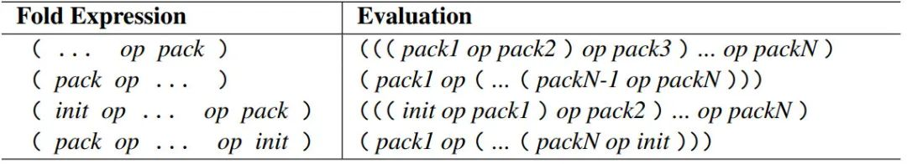
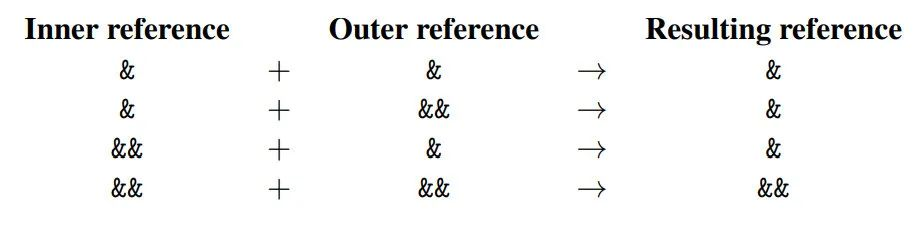
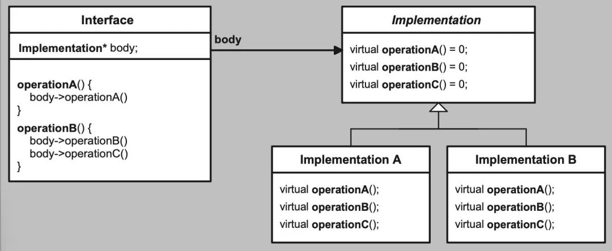
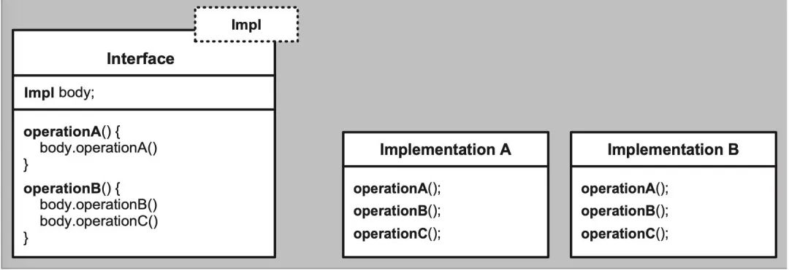
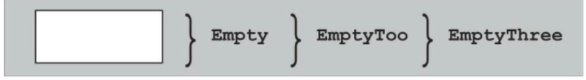

 
<!--BEGIN_DATA
{
    "create_date": "2022-01-28 22:22", 
    "modify_date": "2022-01-28 22:22", 
    "is_top": "0", 
    "summary": "C++学习笔记", 
    "tags": "C/C++", 
    "file_name": "C++学习笔记.md"
}
END_DATA-->

#### <p>原文出处：<a href='https://mp.weixin.qq.com/s/Q3ILLSKj2kLIcDgEoIE71g' target='blank'>C++学习笔记</a></p>

作者：readywang(王玉龙)  

> template 是 c++ 相当重要的组成部分，堪称 c++语言的一大利器。在大大小小的 c++ 程序中，模板无处不在。c++ templates 作为模板学习的经典书籍，历来被无数 c++学习者所推崇。第二版书籍覆盖了 c++ 11 14 和 17 标准，值得程序猿们精读学习，特此整理学习笔记，将每一部分自认为较为重要的部分逐条陈列，并对少数错误代码进行修改

## 一、函数模板

### 1.1 函数模板初探

1. 模板实例化时，模板实参必须**支持模板中类型对应的所有运算符操作**。

    
```cpp
template <typename T>  
T max(const T &amp;a, const T &amp;b) {  
    return a > b? a : b;  
}  
  
class NdGreater {  
};  
  
int main() {  
    NdGreater n1, n2;  
    ::max(n1, n2); // 不支持 > 编译报错  
}  
```

2. 模板编译时会进行**两阶段检查**

a.模板定义时，进行和类型参数无关的检查，如未定义的符号等。

b.模板实例化时，进行类型参数相关的检查。

```cpp
template<typename T>  
void foo(T t) {  
    undeclared(); // 如果 undeclared()未定义，第一阶段就会报错，因为与模板参数无关  
    static_assert(sizeof(T) > 10, "T too small"); //与模板参数有关，只会在第二阶段报错  
}  
```

3. 根据两阶段检查，**模板在实例化时要看到完整定义，最简单的方法是将实现放在头文件中**。

### 1.2 模板参数推断

1. 函数模板的模板参数可以通过传递的函数参数进行推断。

2. 函数推断时会用到参数类型转换，规则如下：

a.如果函数参数是**按引用传递的，任何类型转换都不被允许**。**(此处有疑问，const 转换还是可以的）**

b.如果函数参数是**按值传递的，可以进行退化（decay)转换：const（指针或者引用只有顶层 const 可以被忽略） 和 volatile
被忽略；引用变为非引用；数组和函数变为对应指针类型**。

```cpp
template <typename T>  
void RefFunc(const T &amp;a, const T &amp;b){};  
  
template <typename T>  
void NoRefFunc(T a, T b){};  
  
int main() {  
    int *const ic = nullptr;  
    const int *ci = nullptr;  
    int *p = nullptr;  
    RefFunc(p, ic);  // ok 顶层const可以被忽略 T 为 int *  
    RefFunc(p, ci);  // error 底层const不可以忽略  
    NoRefFunc(p, ci); // error 底层const不可以忽略  
  
    int i = 0;  
    int &amp;ri = i;  
    NoRefFunc(i, ri); // ok ri从int &amp;转换为int  
  
    int arr[4];  
    NoRefFunc(p, arr);  // ok arr 被推断为int *  
  
    NoRefFunc(4, 5.0);  // error T 可以推断为int或double  
}  
```

3. 上文的最后一句调用，类型推断具有二义性，无法正确实例化。可以通过以下方式解决

a.类型转换：

b.显式指定模板实参：

```cpp
NoRefFunc(static_cast<double>(4), 5.0);  // ok 类型转换  
NoRefFunc<int>(4, 5.0);  // 显式指定  
```

4. **函数模板无法通过默认参数推断模板参数**。如果函数模板只有一个函数参数，且函数参数提供了默认值的情况，**应该为模板类型参数 T 也提供和函数参数默认值匹配的默认类型**。

```cpp
template <typename T>  
void Default(T t = 0){};  
  
Default(); // error 无法推断为int  
  
template <typename T = int>  
void Default(T t = 0){};  
  
Default(); // ok 默认类型为int  
```

### 1.3 多模板参数

1. 当函数返回类型不能或不便由函数参数类型直接推断时，可以在函数模版中新增模板参赛指定返回类型。

2. c++11 之后，可以通过 auto + decltype +尾后返回类型推断函数模板返回类型。当函数参数为引用类型时，返回类型应该为非引用。而**decltype 会保留引用，因此还需通过 decay 进行类型退化**。

3. c++14 之后，可以通过 auto 直接推断函数模板返回类型，前提是**函数内部的多个返回语句推断出的返回类型要一致**。**auto 会自动对类型进行 decay。**

4. c++11 之后，可以通过 common_type 返回多个模版类型参赛的公共类型，**common_type 返回的类型也是 decay 的**。

```cpp
#include<type_traits>  
// 单独通过RT指定返回类型  
template <typename RT, typename T1, typename T2>  
RT max1(const T1&amp; a, const T2&amp; b) { return a > b ? a : b; }  
  
// auto c++11支持 通过decay 进行类型退化 typename 用于声明嵌套从属名称 type 为类型而不是成员  
template <typename T1, typename T2>  
auto max2(const T1&amp; a, const T2&amp; b) -> typename std::decay<decltype(a > b ? a : b)>::type { return a > b ? a : b; }  
  
// auto c++14支持  
template <typename T1, typename T2>  
auto max3(const T1&amp; a, const T2&amp; b) { return a > b ? a : b; }  
  
// common_type c++11支持 max4(5, 7.3) max4(7.4, 5) 的返回类型均被推断为double  
template <typename T1, typename T2>  
typename std::common_type<T1, T2>::type max4(const T1&amp; a, const T2&amp; b) { return a > b ? a : b; }  
```

### 1.4 默认模板参数

1. 可以给模板参数指定默认值。

```cpp
// 默认模板参赛 因为RT需要T1 T2推断，所以放在最后  
template <typename T1, typename T2, typename RT = typename std::common_type<T1, T2>::type>  
RT max5(const T1&amp; a, const T2&amp; b) { return a > b ? a : b; }  
```

### 1.5 函数模板重载

1. **一个非模板函数可以和同名的函数模板共存，并且函数模板可实例化为和非模板函数具有相同类型参数的函数。函数调用时，若匹配度相同，将优先调用非模板函数**。**但若显式指定模板列表，则优先调用函数模板**。

2. 函数模板不可以进行类型自动转换，非模板函数可以。

```cpp
#pragma once  
  
template <typename T>  
T max(T a, T b) {  
    return a > b ? a : b;  
}  
  
template <typename RT, typename T1, typename T2>  
RT max(T1 a, T2 b) {  
    return a > b ? a : b;  
}  
int max(int a, int b) {  
    return a > b ? a : b;  
}  
  
int main() {  
    ::max(6, 8);  // 调用非模板函数  
    ::max<>(6, 8); // 调用函数模板 max<int>  
    ::max('a', 'b'); // 调用函数模板 max<char>  
    ::max(4, 4.0); // 通过类型转换调用非模板函数  
    ::max<double>(4, 4.0); //指定了返回类型 调用max<double,int,double>  
}  
```

3. 调用函数模板时，必须保证函数模板已经定义。

```cpp
int max(int a, int b) {  
    return a > b ? a : b;  
}  
  
template <typename T>  
T max(T a, T b, T c) {  
    return max(max(a,b),c);  //T为int时，并不会调用max<int> 而是调用非模板函数  
}  
  
template <typename T>  
T max(T a, T b) {  
    return a > b ? a : b;  
}  
  
max(1, 2, 3);  // 最终调用非模板函数比较  
max("sjx", "wyl", "shh"); // error 找不到二元的max<const char *>  
```

## 二、类模板

### 2.1 stack 类模板实现

1. 类模板**不可以定义在函数作用域或者块作用域内部**，通常定义在 global/namespace/类作用域。

```cpp
#include<vector>  
#include<iostream>  
  
template <typename T>  
class Stack  
{  
public:  
    void push(const T&amp; value);  
    void pop();  
    T top();  
    int size() const { elem_.size(); };  
    bool empty() const { return elem_.empty(); };  
  
    void print(std::ostream &amp; out) const;  
protected:  
    std::vector<T> elem_;  
};  
  
template <typename T>  
void Stack<T>::push(const T &amp;value)  
{  
    elem_.push_back(value);  
}  
  
template <typename T>  
void Stack<T>::pop()  
{  
    elem_.pop_back();  
}  
  
template <typename T>  
T Stack<T>::top()  
{  
    return elem_.back();  
}  
  
template <typename T>  
void Stack<T>::print(std::ostream &amp;out) const  
{  
    for (auto e : elem_)  
    {  
        out << e << std::endl;  
    }  
}  
```

### 2.2 stack 类模板使用

1. 直到 c++17，使用类模板都需要显式指定模板参数。

2. **类模板的成员函数只有在调用的时候才会实例化**。

### 2.3 部分使用类模板

1. 类模板实例化时，**模板实参只需要支持被实例化部分所有用到的操作**。

```cpp
int main()  
{  
    // 只会实例化类模板中的push 和 print函数  
    Stack<int> s;  
    s.push(3);  
    s.print(std::cout);  
  
    // Stack<int>未重载<<运算符，实例化print函数时失败  
    Stack<Stack<int>> ss;  
    ss.push(s);  
    ss.print(std::cout);  
    return 0;  
}  
```

2. c++11 开始，可以通过 static_assert 和 type_traits 做一些简单的类型检查

```cpp
template <typename T>  
class C  
{  
    static_assert(std::is_default_constructible<T>::value, "class C requires default contructible");  
};  
```

### 2.4 友元

### 2.5 模板特化

1. 可以对类模板的一个参数进行特化，**类模板特化的同时需要特化所有的成员函数，非特化的函数在特化后的模板中属于未定义函数，无法使用。**

```cpp
// stringle类型特化  
template <>  
class Stack<std::string>  
{  
public:  
    void push(const std::string&amp; value);  
    /* 特化其他成员函数*/  
};  
```

### 2.6 模板偏特化

1. 类模板特化时，可以只特化部分参数，或者对参数进行部分特化。

```cpp
// 指针类型特化  
template <typename T>  
class Stack<T *>  
{  
    public:  
    void push(T *value);  
    void pop();  
    T* top();  
    int size() const { elem_.size(); };  
    bool empty() const { return elem_.empty(); };  
protected:  
    std::vector<T *> elem_;  
};  
  
template <typename T>  
void Stack<T*>::push(T *value)  
{  
    elem_.push_back(value);  
}  
  
template <typename T>  
void Stack<T*>::pop()  
{  
    elem_.pop_back();  
}  
  
template <typename T>  
T* Stack<T*>::top()  
{  
    return elem_.back();  
}  
```

### 2.7 默认类模板参数

1. 类模板也可以指定默认模板参数。

```cpp
template <typename T, typename COND = std::vector<T> >  
class Stack  
{  
public:  
    void push(const T&amp; value);  
    void pop();  
    T top();  
    int size() const { elem_.size(); };  
    bool empty() const { return elem_.empty(); };  
protected:  
    COND elem_;  
};  
  
template <typename T, typename COND>  
void Stack<T, COND>::push(const T &amp;value)  
{  
    printf("template 1\n");  
    elem_.push_back(value);  
}  
  
template <typename T, typename COND>  
void Stack<T, COND>::pop()  
{  
    elem_.pop_back();  
}  
  
template <typename T, typename COND>  
T Stack<T, COND>::top()  
{  
    return elem_.back();  
}  
```

### 2.8 类型别名

1. 为了便于使用，可以给类模板定义别名。

```cpp
typedef Stack<int> IntStack;  
using DoubleStack = Stack<double>;  
```

2. c++11 开始可以定义别名模板，为一组类型取一个方便的名字。

```cpp
template <typename T>  
using DequeStack = Stack<T, std::deque<T>>;  
```

3. c++14 开始，标准库使用别名模板技术，为所有返回一个类型的 `type_trait` 定义了快捷的使用方式。

```cpp
// stl库定义  
namespace std  
{  
    template <typename T>  
    using add_const_t = typename add_const<T>::type;  
}  
  
typename add_const<T>::type;  //c++ 11 使用  
std::add_const_t<T>; //c++14使用  
```

### 2.9 类模板类型推导

1. ++17 开始，如果构造函数能够推断出所有模板参数的类型，那么不需要指定参数类型了。

```cpp
template <typename T>  
class Stack  
{  
public:  
    Stack() = default;  
    Stack(T e): elem_({e}){};  
protected:  
    std::vector<T> elem_;  
};  
  
Stack intStack = 0; //通过构造函数推断为int  
```

2. 类型推导时，构造函数参数应该按照值传递，而非按引用。**引用传递会导致类型推断时无法进行 decay 转化**。

```cpp
Stack strStack = "sjx";  
//若构造函数参数为值传递，则T为const char *,引用传递时则为const char[4]  
``` 

3. c++ 17 支持提供推断指引来提供额外的推断规则，推断指引一般紧跟类模板定义之后。

```cpp
// 推断指引，传递字符串常量时会被推断为string  
Stack<const char *> -> Stack<std::string>  
```

### 2.10 聚合类的模板化

1. **聚合类：没有显式定义或继承来的构造函数，没有非 public 的非静态成员，没有虚函数，没有 virtual，private, protected 继承**。聚合类也可以是模板。

```cpp
template <typename T>  
struct ValueWithComment  
{  
    T val;  
    std::string comment;  
};  
  
ValueWithComment<int> vc;  
vc.val = 42;  
vc.comment = "sjx";  
```

## 三、非类型模板参数

### 3.1 类模板的非类型模板参数

1. 模板参数不一定是类型，可以是数值，如可以给 Stack 指定最大容量，避免使用过程元素增删时的内存调整。

```cpp
template <typename T, int MAXSIZE>  
class Stack  
{  
public:  
    Stack():num_(0){};  
    void push(const T&amp; value);  
    void pop();  
    T top();  
    int size() const { return num_; };  
    bool empty() const { return num_ == 0; };  
protected:  
    T elem_[MAXSIZE];  
    int num_;  
};  
  
template <typename T, int MAXSIZE>  
void Stack<T, MAXSIZE>::push(const T &amp;value)  
{  
    printf("template 1\n");  
    assert(num_ < MAXSIZE);  
    elem_[num_++] = value;  
}  
  
template <typename T, int MAXSIZE>  
void Stack<T, MAXSIZE>::pop()  
{  
    assert(num_ > 0);  
    --num_;  
}  
  
template <typename T, int MAXSIZE>  
T Stack<T, MAXSIZE>::top()  
{  
    assert(num_ > 0);  
    return elem_[0];  
}  
```

### 3.2 函数模板的非类型模板参数

1. 函数模板也可以指定非类型模板参数。

```cpp
template<typename T, int VAL>  
T addval(const T &amp;num)  
{  
    return num + VAL;  
}  
  
int main()  
{  
    std::vector<int> nums = {1, 2, 3, 4, 5};  
    std::vector<int>nums2(nums.size(),0);  
    std::transform(nums.begin(),nums.end(),nums2.begin(),addval<int,5>);  
    for(auto num : nums2)  
    {  
        printf("%d\n",num);  
    }  
}  
```

### 3.3 非类型模板参数限制

1. 非类型模板参数只能是**整形常量（包含枚举），指向 objects/functions/members 的指针，objects 或者 functions 的左值引用，或者是 `std::nullptr_t`（类型是 nullptr），浮点数和类对象不能作为非类型模板参数**。

2. 当传递对象的指针或者引用作为模板参数时，**对象不能是字符串常量，临时变量或者数据成员以及其它子对象**。

3. 对于非类型模板参数是 `const char*` 的情况，不同 c++版本有不同限制

a.C++11 中，字符串常量对象必须要有外部链接

b.C++14 中，字符串常量对象必须要有外部链接或内部链接

c.C++17 中, 无链接属性也可

4. 内部链接:如果一个名称对编译单元(.cpp)来说是局部的，在链接的时候其他的编译单元无法链接到它且不会与其它编译单元(.cpp)中的同样的名称相冲突。例如 static 函数，inline 函数等。

5. 如果一个名称对编译单元(.cpp)来说不是局部的，而在链接的时候其他的编译单元可以访问它，也就是说它可以和别的编译单元交互。

6. 非类型模板参数的实参可以是任何编译器表达式，不过如果在表达式中使用了 `operator >`，就必须将相应表达式放在括号里面，否则>会被作为模板参数列表末尾的 `>`，从而截断了参数列表。

```cpp
#include<string>  
  
template < double VAL > // error 浮点数不能作为非类型模板参数  
double process(double v)  
{  
    return v * VAL;  
}  
  
template < std::string name > // error class对象不能作为非类型模板参数  
class MyClass {  
};  
  
template < const char * name >  
class Test{  
};  
  
extern const char s01[] = "sjx"; // 外部链接  
const char s02[] = "sjx"; // 内部链接  
  
template<int I, bool B>  
class C{};  
int main()  
{  
    Test<"sjx"> t0; // error before c++17  
    Test<s01> t1; // ok  
    Test<s02> t2; // since c++14  
    static const char s03[] = "sjx"; // 无链接  
    Test<s03> t3; // since c++17  
  
    C<42, sizeof(int)> 4 > c; //error 第一个>被认为模板参数列表已经结束  
    C<42, (sizeof(int)> 4) > c; // ok  
}
```

### 3.4 用 auto 作为非模板类型参数的类

1. 从 C++17 开始，可以不指定非类型模板参数的具体类型（代之以 auto），从而使其可以用于任意有效的非类型模板参数的类型。

```cpp
template <typename T, auto MAXSIZE>  
class Stack  
{  
public:  
    using size_type = decltype(MAXSIZE); // 根据MAXSIZE推断类型  
public:  
    Stack():num_(0){};  
    void push(const T&amp; value);  
    void pop();  
    T top();  
    size_type size() const { num_; };  
    bool empty() const { num_ == 0; };  
protected:  
    T elem_[MAXSIZE];  
    size_type num_;  
};  
  
template <typename T, int MAXSIZE>  
void Stack<T, MAXSIZE>::push(const T &amp;value)  
{  
    printf("template 1\n");  
    assert(num_ < MAXSIZE);  
    elem_[num_++] = value;  
}  
  
template <typename T, int MAXSIZE>  
void Stack<T, MAXSIZE>::pop()  
{  
    assert(num_ > 0);  
    --num_;  
}  
  
template <typename T, int MAXSIZE>  
T Stack<T, MAXSIZE>::top()  
{  
    assert(num_ > 0);  
    return elem_[0];  
}  
  
int main()  
{  
    Stack<int,20u> s1; // size_type为unsigned int  
    Stack<double,40> s2; // size_type为int  
}  
```

## 四、可变参数模板

### 4.1 可变参数模板

1. c++11 开始，模板可以接收一组数量可变的参数。

```cpp
#include <iostream>  
void print(){};  // 递归基  
template<typename T, typename ...Types>  
void print(T firstArg, Types ... args)  
{  
    std::cout << firstArg << std::endl;  
    print(args...);  
}  
  
int main(){  
    print(7.5, "hello", 10); // 调用三次模板函数后再调用普通函数  
}  
```

2. 当两个函数模板的区别只在于**尾部的参数包的时候，会优先选择没有尾部参数包的函数模板**。
    
```cpp
// 使用模板函数的递归基，最后只剩一个参数时会优先使用本模板  
template<typename T>  
void print(T arg)  
{  
    std::cout << arg << std::endl;  
}  
```

3. c++11 提供了**`sizeof...`运算符来统计可变参数包中的参数数目**

```cpp
template<typename T, typename ...Types>  
void print(T firstArg, Types ... args)  
{  
    std::cout << sizeof...(Types) << std::endl;  
    std::cout << sizeof...(args) << std::endl;  
    std::cout << firstArg << std::endl;  
    print(args...);  
}  
```

4. **函数模板实例化时会将可能调用的函数都实例化**。

```cpp
#include <iostream>  
template<typename T, typename ...Types>  
void print(T firstArg, Types ... args)  
{  
    std::cout << firstArg << std::endl;  
    if(sizeof...(args) > 0)  
        print(args...); // error 缺少递归基。即使只在参数包数目>0时调用，args为0个参数时的print函数  
}  
int main(){  
    print(7.5, "hello", 10); // 调用三次模板函数后再调用普通函数  
}  
```

### 4.2 折叠表达式

1. C++17 提供了一种可以用来计算参数包（可以有初始值）中所有参数运算结果的二元运算符 **...**


    
```cpp
template<typename ...T>  
auto sum(T ...s)  
{  
    return (... + s); // ((s1+s2)+s3)...  
}  
```

### 4.3 可变参数模板的使用

### 4.4 变参类模板和变参表达式

1. 可变参数包可以出现在数学表达式中，用于表达式运算。
    
```cpp
template<typename ...T>  
void PrintDouble(const T &amp;... args)  
{  
    print(args + args...); // 将args翻倍传给print  
}  
  
template<typename ...T>  
void addOne(const T &amp; ...args)  
{  
    print(args + 1 ...); // 1和...中间要有空格  
}  
int main(){  
    PrintDouble(7.5, std::string("hello"), 10); // 等价调用print(7.5 + 7.5, std::string("hello") + std::string("hello"), 10 + 10);  
    addOne(1, 2, 3); // 输出 2 3 4  
}  
```

2. 可变参数包可以出现在下标中，用于访问指定下标的元素。

3. 可变参数包可以为非类型模板参数。
    
```cpp
template<typename C, typename ...Index>  
void printElems(const C &amp;coll, Index ...idx)  
{  
    print(coll[idx]...);  
}

template<typename C, std::size_t ...Idx> // 参数包为非类型模板参数  
void printIndex(const C &amp;coll)  
{  
    print(coll[Idx]...);  
}

int main(){  
    std::vector<std::string> coll = {"wyl", "sjx", "love"};  
    printElems(coll, 2, 0, 1); //相当于调用print(coll[2], coll[0], coll[1]);  
    printIndex<std::vector<std::string>, 2, 0, 1>(coll); // 等同于以上调用  
}  
```

4. 可变参数包也可以作为类模板参数，用于表示数据成员的类型，或对象可能的类型等含义。
    
```cpp
template <typename... T>  
class Tuple;  
Tuple<int, char> t; // 可以表示数据成员的类型  
  
template <typename... T>  
class Variant;  
Variant<int, double, bool, float> v; // 可以表示对象可能的类型  
```

5. 推断指引也可以是可变参数的。

```cpp
namespace std {  
    // std::array a{42,43,44} 会被推断为 std::array<int,3> a{42,43,44}  
    template<typename T, typename… U> array(T, U…) -> array<enable_if_t<(is_same_v<T, U> &amp;&amp; …), T>, (1 + sizeof…(U))>;  
}  
```

## 五、基础技巧

### 5.1 typename 关键字

1. **c++规定模板中通过域作用符访问的嵌套从属名称不是类型名称，为了表明该名称是类型，需要加上 typename 关键字**。

```cpp
template<typename T>  
class MyClass  
{  
public:  
    void foo()  
    {  
        /* 若无typename SubType会被当做T中的一个static成员或枚举值  
        下方的表达式被理解为SubType 和 ptr的乘积 */  
        typename T::SubType *ptr;  
        //...  
    }  
};  
```

### 5.2 零初始化

1. c++中对于未定义默认构造函数的类型对象，定义时一般不会进行默认初始化，这时候对象的值将是未定义的。

2. 在模板中定义对象时，为了避免产生未定义的行为，可以进行零初始化。

```cpp
template<typename T>  
void foo()  
{  
    T x = T(); // 对x提供默认值  
}  
```

### 5.3 使用 this ->

1. **若类模板的基类也是类模板，这时在类模板中不能直接通过名称调用从基类继承的成员，而应该通过 `this->` 或 `Base::`**。

```cpp
template<typename T>  
class Base  
{  
public:  
    void bar(){};  
};  
  
template<typename T>  
class Derived:public Base<T>  
{  
public:  
    void foo(){  
        bar(); //ERROR 无法访问基类bar成员，若global存在bar函数，则会访问全局bar函数  
        this->bar(); // ok  
        Base<T>::bar(); // ok  
    }  
};  
```

### 5.4 使用裸数组或字符串常量的模板

1. 当向模板传递裸数组或字符串常量时，如果是引用传递，则类型不会 decay;如果是值传递，则会 decay。

2. 也可以通过将数组或字符串长度作为非类型模板参数，定义可以适配不同长度的裸数组或字符串常量的模板。

```cpp
template <typename T>  
void foo(T t){};  
  
template <typename T>  
void RefFoo(const T &amp;t){};  
  
template<typename T, int N, int M>  
bool less (T(&amp;a)[N], T(&amp;b)[M])  
{  
    for (int i = 0; i<N &amp;&amp; i<M; ++i)  
    {  
    if (a[i]<b[i]) return true; if (b[i]<a[i]) return false;  
    }  
    return N < M;  
}  
  
int main(){  
    foo("hello"); // T 为const char *  
    RefFoo("hello"); // T 为const char[6]  
    less("sjx", "wyl"); // T 为const char, N,M为3  
}  
```

### 5.5 成员模板

1. 不管类是普通类还是类模板，类中的成员函数都可以定义为模板。

2. **若是将构造函数或者赋值运算符定义为模板函数，此时定义的模板函数不会取代默认的的构造函数和赋值运算符**。下面定义的 `operater =` 只能用于不同类型的 stack 之间的赋值，若是相同类型，仍然采用默认的赋值运算符。

```cpp
#include<deque>  
  
template <typename T, typename COND = std::deque<T> >  
class Stack  
{  
public:  
    void push(const T&amp; value);  
    void pop();  
    T top();  
    int size() const { elem_.size(); };  
    bool empty() const { return elem_.empty(); };  
    //实现不同类型的stack之间的相互赋值  
    template <typename T2>  
    Stack<T,COND> &amp; operator = (const Stack<T2>&amp; s);  
protected:  
    COND elem_;  
};  
  
template <typename T, typename COND>  
template <typename T2>  
Stack<T,COND> &amp; Stack<T,COND>::operator = (const Stack<T2>&amp; s)  
{  
    if((void *)this == (void *)&amp;s)  
    {  
        return *this;  
    }  
    Stack<T2> tmp(s);  
    elem_.clear();  
    while(!tmp.empty())  
    {  
        elem_.push_front(tmp.top());  
        tmp.pop();  
    }  
    return *this;  
}  
```

2. 成员函数模板也可以被偏特化或者全特化。

```cpp
#include<string>  
  
class BoolString {  
private:  
    std::string value;  
public:  
    BoolString (std::string const&amp; s): value(s) {}  
    template<typename T = std::string>  
    T get() const {  
        return value;  
    }  
};  
  
// 进行全特化， 全特化版本的成员函数相当于普通函数，  
// 放在头文件中会导致重复定义，因此必须加inline  
template<>  
inline bool BoolString::get<bool>() const  
{  
    return value == "true" || value == "1";  
}  
  
int main()  
{  
    BoolString s1("hello");  
    s1.get();  // "hello"  
    s1.get<bool>(); // false  
}  
```

3. **当通过依赖于模板参数的对象通过.调用函数模板时，需要通过 template 关键字提示<是成员函数模板参数列表的开始，而非<运算符**。

```cpp
#include<bitset>  
#include<iostream>  
  
template<unsigned int N>  
void printBitSet(const std::bitset<N> &amp;bs)  
{  
    // bs依赖于模板参数N 此时为了表明to_string后是模板参数，需要加template  
    std::cout << bs.template to_string<char,std::char_traits<char>,std::allocator<char> >() << std::endl;  
}  
```

4. **c++14 引入的泛型 lambda 是对成员函数模板的简化**。

```cpp
[](auto x, auto y)  
{  
    return x + y;  
}  
  
// 编译将以上lamba转化为下方类  
class SomeCompilerSpecificName {  
public:  
    SomeCompilerSpecificName();  
    template<typename T1, typename T2>  
    auto operator() (T1 x, T2 y) const {  
        return x + y;  
    }  
};  
```

### 5.6 变量模板

1. c++14 开始，可以通过变量模板对变量进行参数化。

2. 变量模板的常见应用场景是定义代表类模板成员的变量模板。

3. c++17 开始，标准库用变量模板为其用来产生一个值（布尔型）的类型萃取定义了简化方式。

```cpp
#include<iostream>  
  
template <typename T = double>  
constexpr T pi{3.1415926};  
  
std::cout<< pi<> <<std::endl; // <>不可少，输出3.1415926  
std::cout<< pi<int> <<std::endl; // 输出3  
  
template<typename T>  
class MyClass {  
public:  
    static constexpr int max = 1000; // 类静态成员  
};  
  
// 定义变量模板表示类静态成员  
template <typename T>  
int myMax = MyClass<T>::max;  
  
// 使用更方便  
auto i = myMax<int>; // 相当于auto i = MyClass<int>::max;  
  
// 萃取简化方式，since c++17  
namespace std {  
    template<typename T>  
    constexpr bool is_const_v = is_const<T>::value;  
}  
```

### 5.7 模板模板参数

1. 当非类型模板参数是一个模板时，我们称它为模板模板参数。

2. 实例化时，模板模板参数和实参的模板参数必须完全匹配。

```cpp
#include <deque>  
#include <vector>  
  
// 错误定义 deque 中的模板参数有两个：类型和默认参数allocator  
// 而模板模板参数Cont的参数只有类型Elem  
template<typename T,  
template<typename Elem> class Cont = std::deque>  
class Stack {  
private:  
    Cont<T> elems; // elements  
public:  
    void push(T const&amp;); // push element  
    void pop(); // pop element  
    T const&amp; top() const; // return top element  
    bool empty() const { // return whether the stack is empty  
        return elems.empty();  
    }  
};  
  
// 正确定义  
template<typename T, template<typename Elem, typename =  
std::allocator<Elem>> class Cont = std::deque>  
class Stack {  
private:  
    Cont<T> elems; // elements  
public:  
    void push(T const&amp;); // push element  
    void pop(); // pop element  
    T const&amp; top() const; // return top element  
    bool empty() const { // return whether the stack is empty  
        return elems.empty();  
    }  
};  
  
// 使用  
Stack<int> iStack;  
Stack<double,std::vector> dStack;  
```

## 六、移动语义和 enable_if<>

### 6.1 完美转发

1. c++11 引入了引用折叠：创建一个引用的引用，引用就会折叠。**除了右值引用的右值引用折叠之后还是右值引用之外，其它的引用全部折叠成左值引用**。

2. 基于引用折叠和 std::forward，可以实现**完美转发：将传入将被参数的基本特性(是否 const，左值、右值引用)转发出去**。

```cpp
#include <utility>  
#include <iostream>  

class X {  
};  

void g (X&amp;) {  
    std::cout << "g() for variable\n";  
}

void g (X const&amp;) {  
    std::cout << "g() for constant\n";  
}

void g (X&amp;&amp;) {  
    std::cout << "g() for movable object\n";  
}  
  
template<typename T>  
void f (T&amp;&amp; val) {  
    g(std::forward<T>(val));  
}

int main()  
{  
    X v; // create variable  
    X const c; // create constant  
    f(v); // f() for variable calls f(X&amp;) => calls g(X&amp;)  
    f(c); // f() for constant calls f(X const&amp;) => calls g(X const&amp;)  
    f(X()); // f() for temporary calls f(X&amp;&amp;) => calls g(X&amp;&amp;)  
    f(std::move(v)); // f() for move-enabled variable calls f(X&amp;&amp;)=>calls g(X&amp;&amp;)  
}  
```

### 6.2 特殊成员函数模板

1. 当类中定义了模板构造函数时：

a.**定义的模板构造函数不会屏蔽默认构造函数**。

b.优先选用匹配程度高的构造函数

c.**匹配程度相同时，优先选用非模板构造函数**

```cpp
#include <utility>  
#include <string>  
#include <iostream>  

class Person  
{  
private:  
    std::string name;  
public:  
    // generic constructor for passed initial name:  
    template<typename STR>  
    explicit Person(STR&amp;&amp; n) : name(std::forward<STR>(n)) {  
        std::cout << "TMPL-CONSTR for ’" << name <<std::endl;  
    }  
    // copy and move constructor:  
    Person (Person const&amp; p) : name(p.name) {  
        std::cout << "COPY-CONSTR Person ’" << name << "’\n";  
    }  
    Person (Person&amp;&amp; p) : name(std::move(p.name)) {  
        std::cout << "MOVE-CONSTR Person ’" << name << "’\n";  
    }  
};  
  
int main()  
{  
    Person p1("tmp"); // ok 调用模板函数n 被推断为const char [4]类型,可以赋值给string  
    Person p2(p1); // error 模板函数相比Person (Person const&amp; p)构造函数更匹配，n 被推断为Person &amp;类型，最终将Person对象赋值给string  
    Person p3(std::move(p1)); // ok 同等匹配程度时，优先调用Person (Person&amp;&amp; p)  
}  
```

### 6.3 通过 std::enable_if 禁用模板

1. c++11 提供了辅助模板 `std::enable_if`，使用规则如下：

a.第一个参数是布尔表达式，第二个参数为类型。**若表达式结果为 true，则 type 成员返回类型参数，此时若未提供第二参数，默认返回 void**。

b.**若表达式结果为 false，根据替换失败并非错误的原则，包含 `std::enable_if` 的模板将会被忽略**。

2. **c++14 提供了别名模板技术(见 2.8 节)，可以用 `std::enable_if_t<>` 代替 `std::enable_if<>::type`**.

3. 若不想在声明中使用 `std::enable_if`，可以提供一个额外的、有默认值的模板参数。

```cpp
#include <type_traits>  

template<typename T>  
typename std::enable_if<(sizeof(T) > 4)>::type  
foo1(){}  
  
// std::enable_if为true时等同下方函数，未提供第二参数默认返回void; false时函数模板被忽略  
// void foo1(){};  
template<typename T>  
typename std::enable_if<(sizeof(T) > 4), bool>::type  
foo2(){}  
  
// std::enable_if为true时等同下方函数，false时函数模板被忽略  
// bool foo2(){};  
  
// 提供额外默认参数进行类型检查  
template<typename T, typename = typename std::enable_if<(sizeof(T) > 4)>::type>  
  
void foo3(){}  
  
// std::enable_if为true时等同下方函数模板，false时函数模板被忽略  
// template<typename T, typename = void>  
// void foo3(){};  
```

### 6.4 使用 std::enable_if

1. 通过 `std::enable_if` 和标准库的类型萃取 `std::is_convertiable<FROM, TO>`可以解决 6.2 节构造函数模板的问题。

```cpp
class Person  
{  
private:  
    std::string name;  
public:  
    // 只有STR可以转换为string时才有效  
    template<typename STR, typename = typename std::enable_if<std::is_convertible<STR, std::string>::value>::type>  
    explicit Person(STR&amp;&amp; n) : name(std::forward<STR>(n)) {  
        std::cout << "TMPL-CONSTR for ’" << name <<std::endl;  
    }  
    // copy and move constructor:  
    Person (Person const&amp; p) : name(p.name) {  
        std::cout << "COPY-CONSTR Person ’" << name << "’\n";  
    }  
    Person (Person&amp;&amp; p) : name(std::move(p.name)) {  
        std::cout << "MOVE-CONSTR Person ’" << name << "’\n";  
    }  
};  
```

### 6.5 使用 concept 简化 enable_if<>表达式

1. c++20 提出了 concept 模板可以进行编译期条件检查，大大简化了 `enable_if`

```cpp
template <typename T>  
concept convert_to_string = std::is_convertible<STR, std::string>::value;  
  
class Person  
{  
private:  
    std::string name;  
public:  
    // 只有STR可以转换为string时才有效  
    template<convert_to_string STR>  
    explicit Person(STR&amp;&amp; n) : name(std::forward<STR>(n)) {  
        std::cout << "TMPL-CONSTR for ’" << name <<std::endl;  
    }  
    // copy and move constructor:  
    Person (Person const&amp; p) : name(p.name) {  
        std::cout << "COPY-CONSTR Person ’" << name << "’\n";  
    }  
    Person (Person&amp;&amp; p) : name(std::move(p.name)) {  
        std::cout << "MOVE-CONSTR Person ’" << name << "’\n";  
    }  
};  
```

## 七、按值传递还是按引用传递

### 7.1 按值传递

1. 当函数参数按值传递时，原则上所有参数都会被拷贝。

2. **当传递的参数是纯右值时，编译器会优化，避免拷贝产生；从 c++17 开始，要求此项优化必须执行**。

3. **按值传递时，参数会发生 decay，如裸数组退化为指针，const、volatile 等限制符会被删除**。

```cpp
#include <string>  

template <typename T>  
void foo(T t){};  
  
int main(){  
    std::string s("Sjx");  
    foo(s); // 进行拷贝  
    foo(std::string("sjx")); // 避免拷贝  
    foo("sjx"); // T decay为const char *  
}  
```

### 7.2 按引用传递

1. 当函数参数按照引用传递时，不会被拷贝，并且不会 decay。

2. 当函数参数按照引用传递时，**一般是定义为 const 引用，此时推断出的类型 T 中无 const**。

3. 当参数定义为非常量引用时，说明函数内部可以修改传入参数，此时**不允许将临时变量传给左值引用。此时若传入参数是 const 的，则类型 T 被推断为const，此时函数内部的参数修改将报错**.

```cpp
template <typename T>  
void print(const T &amp;t){};  
  
template <typename T>  
void out(T &amp;t){};  
  
template <typename T>  
void modify(T &amp;t)  
{  
    t = T();  
};  
int main(){  
    print("sjx"); // arg为const char[3], T 为char[3]  
    std::string s("Sjx");  
    out(s); // ok  
    out(std::string("sjx")); // error 不能将临时变量传给左值引用  
    const std::string name = "sjx";  
    modify(name); //error T 被推断为 const std::string, 此时modify不能修改传入参数  
}  
```

4. 对于给非 const 引用参数传递 const 对象导致编译失败的情形，可以通过 `static_assert std::enable_if` 或者 concept 等方式进行检查。

```cpp
// static_assert 触发编译期错误  
template <typename T>  
void modify(T &amp;t)  
{  
    static_assert(!std::is_const<T>::value, "param is const");  
    t = T();  
};  
  
// std::enable_if禁用模板  
template <typename T, typename = typename std::enable_if<!std::is_const<T>::value> >  
void modify(T &amp;t)  
{  
    t = T();  
};  
  
// concept禁用模板  
template <typename T>  
concept is_not_const = !std::is_const<T>::value;  
  
template <is_not_const T>  
void modify(T &amp;t)  
{  
    t = T();  
};  
```

5. 当完美转发时，会将函数参数定义为右值引用。**此时若在函数内部用 T 定义未初始化的变量，会编译失败**。

```cpp
template<typename T>  
void passR(T &amp;&amp;t)  
{  
    T x;  
}  
  
std::string s("Sjx");  
passR(s); // error T 推断为string &amp;，初始化时必须绑定到对象  
```

### 7.3 使用 std::ref()和 std::cref()

1. c++11 开始，若模板参数定义为按值传递时，**调用者可以通过 std::cref 或 std::ref 将参数按照引用传递进去**。

2. **std::cref 或 std::ref**创建了一个 `std::reference_wrapper<>`的对象，该对象引用了原始参数，并被按值传递给了函数模板。std::reference_wrapper<>对象只支持一个操作：**向原始对象的隐式类型转换**。

```cpp
template<typename T>  
void foo(T arg)  
{  
    T x;  
}  
  
int main(){  
    std::string s = "hello";  
    foo(s); // T 为std::string  
    foo(std::cref(s)); // error T 为std::reference_wrapper<std::string> 只支持向std::string的类型转换  
}  
```

### 7.4 处理字符串常量和裸数组

1. 字符串常量或裸数组传递给模板时，如果是按值传递，则会 decay;如果是按照引用传递，则不会 decay。实际应用时，可以根据函数作用加以选择，若要比较大小，一般是按照引用传递；若是比较参数类型是否相同，则可以是按值传递。

### 7.5 处理返回值

1. 函数返回值也可以是按值返回或按引用返回。若返回类型为非常量引用，则表示可以修改返回对象引用的对象。

2. **模板中即使使用 T 作为返回类型，也不一定能保证是按值返回**。

```cpp
template<typename T>  
T retR(T &amp;&amp;p)  
{  
    return T();  
}  
  
template<typename T>  
T retV(T t)  
{  
    return T();  
}  
  
int main()  
{  
    int x;  
    retR(x); // error T 被推断为int &amp;  
    retV<int &amp;>(x); // error T推断为int &amp;  
}  
```

3. 为保证按值返回，可以使用 `std::remove_reference<>`或 `std::decay<>`。

### 7.6 关于模板参数声明的推荐方法

1. 一般通常按值传递，如有特殊需要，可以结合实际按引用传递。

2. 定义的函数模板要明确使用范围，不要过分泛化。

## 八、编译期编程

### 8.1 模板元编程

1. 模板元编程：在编译期通过模板实例化的过程计算程序结果。

```cpp
/* 定义用于编译期判断素数的模板 */  
template<unsigned p ,unsigned d>  
struct DoIsPrime  
{  
    // 从p%d !=0 开始依次判断 p%(d-1)!=0，p%(d-2)!=0，...  
    static constexpr bool value = (p % d != 0) &amp;&amp; DoIsPrime<p, d-1>::value;  
};  
  
// 递归基  
template<unsigned p>  
struct DoIsPrime<p ,2>  
{  
    static constexpr bool value = (p % 2 != 0);  
};  
  
// 提供给用户调用的模板  
template<unsigned p>  
struct IsPrime  
{  
    static constexpr bool value = DoIsPrime<p, p / 2>::value;  
};  
  
// 对于p/2<2的情形进行特化  
template<>  
struct IsPrime<0> {  
    static constexpr bool value = false;  
};  
  
template<>  
struct IsPrime<1> {  
    static constexpr bool value = false;  
};  
  
template<>  
struct IsPrime<2> {  
    static constexpr bool value = false;  
};  
  
template<>  
struct IsPrime<3> {  
    static constexpr bool value = false;  
};  
  

int main(){  
    IsPrime<9>::value; // 编译期通过层层递归实例化最后得到结果为false  
}  
```

### 8.2 通过 constexpr 进行计算

1. c++11 提出了 constexpr 关键字可以用于修饰函数返回值，此时该函数为**常量表达式函数，编译器可以在编译期完成该函数的计算**。

2. c++11 中规定**常量表达式函数在使用前必须要知道完整定义，不能仅仅是声明，同时函数内部只能有一条返回语句**。

3. **c++14 中移除了常量表达式函数只能有一条返回语句的限制**。

4. 编译器可以在编译期完成该函数计算，但是是否进行还取决于上下文环境及编译器。

```cpp
// constexpr函数只能有一个return语句  
constexpr bool doIsPrime(unsigned p, unsigned d)  
{  
    return d != 2 ? (p % d != 0) &amp;&amp; doIsPrime(p, d - 1) : (p % 2 != 0);  
}  
  
constexpr bool isPrime(unsigned p)  
{  
    return p < 4 ? !(p < 2) : doIsPrime(p, p / 2);  
}

int main(){  
    constexpr bool ret = isPrime(9);     // constexpr 限定必须在编译期得到结果  
}  
```

### 8.3 通过模板偏特化进行路径选择

1. 可以通过模板偏特化在不同的实现方案之间做选择。
    
```cpp
// 根据是否是素数判断是否喜欢  
template <unsigned int SZ, bool = isPrime(SZ)>  
struct IsLove;  
  
// 特化两个版本处理  
template< unsigned int SZ>  
struct IsLove<SZ, false>  
{  
    static constexpr bool isLove = false;  
};  
  
template< unsigned int SZ>  
struct IsLove<SZ, true>  
{  
    static constexpr bool isLove = true;  
}; 

int main()  
{  
    IsLove<520>::isLove; // 编译期就知道了520不是喜欢  
}  
```

### 8.4 SFINAE（替换失败不是错误）

1. SFINAE:当函数调用的备选方案中出现函数模板时，**编译器根据函数参数确定(替换）函数模板的参数类型及返回类型**，最后评估替换后函数的匹配程度。替换过程中可能失败，此时编译器会忽略掉这一替换结果。

2. 替换和实例化不同，替换只涉及函数**函数模板的参数类型及返回类型，最后编译器选择匹配程度最高的函数模板进行实例化。**
    
```cpp
#include<vector>  
#include<iostream>  
  
// 返回裸数组长度的模板，只有用裸数组替换时才能成功  
template<typename T, unsigned N>  
std::size_t len (T(&amp;)[N])  
{  
    return N;  
}  
  
// 只有含有T::size_type的类型才能替换成功  
template<typename T>  
typename T::size_type len (T const&amp; t)  
{  
    return t.size();  
}  
  
// ... 表示为可变参数，匹配所有类型, 但匹配程度最差  
std::size_t len(...)  
{  
    return 0;  
}  
  
int main()  
{  
    int a[10];  
    std::cout << len(a) <<std::endl; // 匹配裸数组  
    std::cout << len("sjx") <<std::endl; // 匹配裸数组  
    std::vector<int> v;  
    std::cout << len(v) <<std::endl; // T::size_type  
    int *p;  
    std::cout << len(p) <<std::endl; // 函数模板均不匹配，最后调用变参函数  
    std::allocator<int> x;  
  
    /* std::allocator 定义了size_type，所以匹配T::size_type和变参函数，  
    前者匹配程度更高，因此选择该模板。但在实例化时会发现allocator不存在size成员 */  
    std::cout << len(x) <<std::endl; //error  
}  
```

3. 我们可以通过 SFINAE 原理在一些情形下忽略掉该模板。一种简单用法是 6.3 6.4 中的 `std::enable_if`；对于上例，则可以采用 auto + 尾后返回的方式，使得在替换时就知道 T 中必须含有 size 成员的限制。
    
```cpp
/* decltype中采用逗号表达式，只有若T中不存在size成员，则替换失败。  
替换成功时，才会将逗号表达式最后一句作为返回类型 */  
template<typename T>  
auto len (T const&amp; t) -> decltype((void)(t.size()) , T::size_type)  
{  
    return t.size();  
}  
```

### 8.5 编译期 if

1. 除了前面介绍的忽略模板的方法，c++17 还提供了**编译期的条件判断语法 if constexpr(...)**。
    
```cpp
// 修改4.1中的print函数  
template<typename T, typename… Types>  
void print (T const&amp; firstArg, Types const&amp;… args)  
{  
    std::cout << firstArg << std::endl; // print只有一个参数时，只会编译这一部分  
    if constexpr(sizeof…(args) > 0) {  
        print(args…); // 只有args不为空的时候才会继续递归实例化  
        C++17)  
    }  
}  
```

## 九、实践中使用模板

### 9.1 包含模式

1. 模板在编译期会进行实例化，实例化时需要提供模板的定义，所以对于模板相关代码，正确用法是将**声明和定义均置于头文件中。**

### 9.2 模板和 inline

1. 函数模板全特化后和普通函数相同，但函数模板一般定义在头文件中，**为了避免在多个模块 include 时出现重复定义的错误，一般将全特化后的函数模板定义为 inline**。
    
```cpp
template<typename T>  
void foo(const T&amp; t){};  
  
// 全特化函数  
template<>  
inline void foo<int>(const int&amp; i){};  
```

### 9.3 预编译头文件

1. 预编译头文件不在 c++标准要求中，具体由编译器实现。

2. 预编译头文件：如果多个代码文件的前 n 行均相同，编译器就可以先对前 n 行进行编译，再依次对每个文件从 n+1 行进行编译。

3. 为了充分利用预编译头文件功能，实践中**建议文件中`#include`的顺序尽量相同**。

### 9.4 破译大篇幅的错误信息

1. 预编译头文件不在 c++标

## 十、模板基本术语

### 10.1 “类模板”还是“模板类”

### 10.2 替换，实例化和特例化

1. 替换：在用模板实参去查找匹配的模板时，会尝试用实参去替换模板参数，见 8.4 节。

2. 实例化：查找到最匹配的模板后，根据实参从模板创建出常规类或函数的过程。

3. 特例化：对模板中的部分或全部参数进行特化，定义新模板的过程。

### 10.3 声明和定义

1. 声明：将一个名称引入 c++作用域内，并不需要知道名称的相关细节。

2. 定义：如果在声明时提供了细节，声明就变成了定义。
    
```cpp
// 声明  
class A;  
extern int v;  
void f();  
  
// 定义  
class A{};  
int v = 1;  
void f(){};  
```

### 10.4 唯一定义法则

1. 唯一定义法制（ODR)

a.常规(比如非模板)非 inline 函数和成员函数，以及非 inline 的全局变量和静态数据成员，在整个程序中只能被定义一次.

b. Class 类型(包含 struct 和 union)，模板(包含部分特例化，但不能是全特例化)，以及 inline 函数和变量，在一个编译单元中只能被定义一次，而且不同编译单元间的定义 应该相同.

### 10.5 模板参数和模板实参

1. 模板参数：模板定义中模板参数列表中的参数。

2. 模板实参：实例化模板参数时传入的参数。

## 十一、泛型库

### 11.1 可调用对象

1. c++可调用对象类型

a.函数指针

b.仿函数

c.存在一个函数指针或者函数引用的转换函数的 class 类型

```cpp
#include <iostream>  
#include <vector>  
  
template<typename Iter, typename Callable>  
void foreach (Iter current, Iter end, Callable op)  
{  
    while (current != end) { //as long as not reached the end  
        op(*current); // call passed operator for current element  
        ++current; // and move iterator to next element  
    }  
}  
  
// a function to call:  
void func(int i)  
{  
    std::cout << "func() called for: " << i << std::endl;  
}  
// a function object type (for objects that can be used as functions):  
class FuncObj {  
    public:  
    void operator() (int i) const { //Note: const member function  
        std::cout << "FuncObj::op() called for: " << i << std::endl;  
    }  
}; 

int main()  
{  
    std::vector<int> primes = {2, 3, 5, 7, 11, 13, 17, 19};  
    foreach (primes.begin(), primes.end(), func); // function as callable (decays to pointer)  
    foreach(primes.begin(), primes.end(), &amp;func); // function pointer as callable  
    foreach(primes.begin(), primes.end(), FuncObj()); // function object as callable  
    foreach(primes.begin(), primes.end(), [] (int i) { //lambda as callable  
    std::cout << "lambda called for: " << i << std::endl;});  
}  
```

### 11.2 其它实现泛型库的工具

1. 标准库中提供了丰富多样的 type traits 工具，使用时一定要注意类型萃取的精确定义。
    
```cpp
#include <type_traits>  
template<typename T>  
class C  
{  
    // ensure that T is not void (ignoring const or volatile):  
    static_assert(!std::is_same_v<std::remove_cv_t<T>,void>,  
        "invalid instantiation of class C for void type");  
public:  
    template<typename V>  
    void f(V&amp;&amp; v) {  
        if constexpr(std::is_reference_v<T>) { … // special code if T is a reference type  
        }  
        if constexpr(std::is_convertible_v<std::decay_t<V>,T>) { … // special code if V is convertible to T  
        }  
        if constexpr(std::has_virtual_destructor_v<V>) { … // special code if V has virtual destructor  
        }  
    }  
};  
```

2. `std::addressof<>()`会返回一个对象或者函数的准确地址，即使一个对象重载了取地址运算符&也是这样。

3. 函数模板`std::declval()`可以被用作某一类型的对象的引用的占位符。
    
```cpp
// 避免在调用运算符?:的时候不得不去调用 T1 和 T2 的（默认）构造函数，这里使用了std::declval  
#include <utility>  
template<typename T1, typename T2,  
typename RT = typename std::decay_t< decltype(true ? std::declval<T1>() : std::declval<T2>())> >  
RT max (T1 a, T2 b)  
{  
    return b < a ? a : b;  
}  
```

### 11.3 完美转发临时变量

1. **使用`auto &&`可以创建一个可以被转发的临时变量**。
    
```cpp
template<typename T>  
void foo(T x)  
{  
    auto&amp;&amp; val = get(x);  
    // perfectly forward the return value of get() to set():  
    set(std::forward<decltype(val)>(val));  
}  
```

### 11.4 其它实现泛型库的工具

1. **模板参数 T 的类型可能被推断为引用类型，此时可能会引起意料之外的错误**。
    
```cpp
template<typename T, T Z = T{}>  
class RefMem {  
private:  
    T zero;  
public:  
    RefMem() : zero{Z} {}  
};  
  
int null = 0;  
  
int main()  
{  
    RefMem<int> rm1, rm2;  
    rm1 = rm2; // OK  
    RefMem<int&amp;> rm3; // ERROR: 无法用int &amp; 对Z进行默认初始化  
    RefMem<int&amp;, 0> rm4; // ERROR: 不能用0 初始化int &amp; 对象zero  
    RefMem<int&amp;,null> rm5, rm6;  
    rm5 = rm6; // ERROR: 具有非static引用成员的类，默认赋值运算符会被删掉  
}  
```

2. **如果需要禁止引用类型进行实例化，可以使用 `std::is_reference` 进行判断**。

### 11.5 推迟计算

1. 可以通过模板来延迟表达式的计算，这样模板可以用于不完整类型。
    
```cpp
template<typename T>  
class Cont {  
private:  
    T* elems;  
public:  
};  
  
struct Node  
{  
    std::string value;  
    Cont<Node> next; // only possible if Cont accepts incomplete types  
};  
```

## 十二、深入模板基础

### 12.1 参数化声明

1. C++ 目前支持四种基本类型的模板：类模板、函数模板、变量模板和别名模板。这些模板均可定义在全局作用域或者类作用域中。
    
```cpp
template<typename T> // a namespace scope class template  
class Data {  
public:  
    static constexpr bool copyable = true;  
};  
  
template<typename T> // a namespace scope function template  
void log (T x) {  
}  
  
template<typename T> // a namespace scope variable template (since C++14)  
T zero = 0;  
  
template<typename T> // a namespace scope variable template (since C++14)  
bool dataCopyable = Data<T>::copyable;  
  
template<typename T> // a namespace scope alias template  
using DataList = Data<T*>;  
  
class Collection {  
public:  
    template<typename T> // an in-class member class template definition  
    class Node {  
    };  
  
    template<typename T> // an in-class (and therefore implicitly inline)  
    T* alloc() { // member function template definition  
    }  
  
    template<typename T> // a member variable template (since C++14)  
    static T zero = 0;  
  
    template<typename T> // a member alias template  
    using NodePtr = Node<T>*;  
};  
```

2. 除了类模板，也可以定义 union 模板
    
```cpp
template<typename T>  
union AllocChunk {  
    T object;  
    unsigned char bytes[sizeof(T)];  
};  
```

3. 在类模板内，也可以定义和模板参数无关的非模板成员。

4. **类内的模板函数不能是虚函数，普通函数可以是虚函数**。

```cpp
template<int I>  
class CupBoard  
{  
public:  
    class Shelf; // ordinary class in class template  
    void open(); // ordinary function in class template  
    enum Wood{}; // ordinary enumeration type in class template  
    static double totalWeight; // ordinary static data member in class template  
    virtual void fun(){}; // 普通函数可以是虚函数  
    virtual ~CupBoard(){}; // 析构函数也可以是虚函数  
    template <typename U>  
    virtual void foo(const U &amp;u){}; // error 模板函数不能是虚函数  
};  
```

5. **每一个模板名称需要在所在作用域内独一无二**。

6. 函数模板可以有 c++链接，但不能有 C 链接。

7. **函数模板一般具有外部链接，除非是 static 或定义在未命名的命名空间中**。

```cpp
int X;  
  
template <typename T>  
class X; // error 模板名称必须独一无二  
  
extern "C++" template<typename T>  
void normal(); // ok  
extern "C" template <typename T>  
void invalid(); // error 模板函数不能有C链接  
  
template<typename T>  
void external(); // 指向另一文件中定义的external函数模板  
  
template<typename T>  
static void internal(); // 并未指向另一文件中定义的internal函数模板，需要在本文件内提供定义  
static void internal();  
namespace {  
    template<typename>  
    void otherInternal(); // 并未指向另一文件中定义的otherInternal函数模板  
}  
  
namespace {  
    template<typename>  
    void otherInternal(); // 并未指向另一文件中定义的otherInternal函数模板  
}  
```

### 12.2 模板参数

1. 模板参数分为三种：类型模板参数，非类型模板参数和模板模板参数。

2. 非类型模板参数可以是以下形式：

a.整型或枚举类型

b.指针类型

c.指向类成员的指针

d.左值引用

e.`std::nullptr_t`

f.含有 auto 或者 decltype(auto)的类型(since c++17）

3. **模版模板参数的关键字只能是 class 不能是 struct 或 union**

4. c++11 开始，可以通过...定义模板参数包，匹配任意类型和数目的参数。

5. 也可以定义指定类型的非模板参数包，匹配指定类型任意数目的参数。

6. 模板可以提供模板参数的默认值，一旦为一个参数提供默认值，其后的参数都必须已经定义默认值。**

7. 若一个模板存在多处声明或声明和定义同时存在，那么可以在这些地方定义模板参数的默认值，不能为一个参数重复定义默认值。

```cpp
template<template<typename X> class C> // ok  
void f(C<int>* p);  
template<template<typename X> struct C> // error  
void f(C<int>* p);  
template<template<typename X> union C> // error  
void f(C<int>* p);  
template<template<typename X> typename C> // ok since c++17  
void f(C<int>* p);  
  
template<template<typename T, T*> class Buf> // OK  
class Lexer  
{  
static T* storage; // 模板模板参数的参数不能在声明之外使用  
};  
  
template<typename ...Types> // 模板参数包可以匹配任意参数  
class Tuple{};  
  
Tuple<int> t1; // 匹配int  
Tuple<int, char> t2; // 匹配int char  
  
template<typename T, unsigned... Dimensions> // 非类型模板参数包匹配任意数目的unsigned参数  
class MultiArray {};  
MultiArray<double, 3, 3> matrix; // 定义矩阵  
  
template<typename T1 = int, typename T2> // error T2未定义默认值  
class Test;  
  
template<typename T1, typename T2 = double> // ok  
class Quintuple;  
template<typename T1 = int, typename T2> // ok T2默认值前面已经定义  
class Quintuple;  
template<typename T1 = int> // error 不能重复定义默认值  
class Quintuple;  
```

### 12.3 模板实参

1. 函数模板一般可以通过模板实参来推断模板参数，但也存在无法推断的情形。

2. 模板模板参数的实参必须完全匹配模板模板参数。
    
```cpp
#include <vector>

template<typename DstT, typename SrcT>  
 DstT implicit_cast (SrcT const&amp; x) // SrcT can be deduced, but DstT cannot  
{  
return x;  
}  
  
implicit_cast<double> (0); // 需要指定返回类型，若DstT和SrcT顺序调换，使用时需要指定两个类型  
  
template<typename ... Ts, int N>  
void f(double (&amp;)[N+1], Ts ... ps); // useless declaration because N cannot be specified or deduced  
  
template<typename T, template<typename U> class Cond>  
class MyCond;  
  
MyCond<int,std::vector> c; // error std::vector 为template<class _Tp, class _Alloc>，虽然_Alloc为默认参数，但仍然不匹配&nbsp;  
```

### 12.4 可变参数模板

### 12.5 友元

1. **将类模板作为友元时，必须保证友元定义位置已经知道类模板的声明**。

2. **也可以将类型模板参数定义为友元** 。

3. **可以将函数模板定义为友元，此时若模板参数可推导，在友元声明时可以省略**。
    
```cpp
template<typename T>  
class Tree {  
friend class Factory; // OK even if first declaration of Factory  
friend class MyNode<T>; // error MyNode未找到声明  
};  
  
template<typename T>  
class Stack {  
public:  
    // assign stack of elements of type T2  
    template<typename T2>  
    Stack<T>&amp; operator= (Stack<T2> const&amp;);  
    // to get access to private members of Stack<T2> for any type T2: template<typename> friend class Stack;  
};  
template<typename T>  
class Test  
{  
    friend T; // 可以将类型模板参数定义为友元  
};  
  
template<typename T1, typename T2>  
   void combine(T1, T2);  
class Mixer {  
    friend void combine<>(int&amp;, int&amp;); //OK:T1 = int&amp;,T2 = int&amp;  
    friend void combine<int, int>(int, int);//OK:T1 = int,T2 = int  
    friend void combine<char>(char, int);//OK:T1 = charT2 = int  
    friend void combine<char>(char&amp;, int);// ERROR: doesn’t match combine() template  
    friend void combine<>(long, long) {  } // ERROR: definition not allowed!  
};  
```

## 十三、模板中的名称

### 13.1 名称分类

1. 名称分为受限名称和非受限名称，**受限名称前面有显式的出现 `->`, `::`, `.` 这三个限定符**

### 13.2 名称查找

1. c++名称的普通查找规则为从名称所在的 scope 从内向外依次查找。

2. ADL( Argument-Dependent Lookup)查找为依赖于参数的查找，是用于函数调用表达式中查找非限定函数名称的规则。当在使用函数的上下文中找不到函数定义，我们可以在其参数的关联类和关联名字空间中查找该函数的定义。

3. ADL 生效条件：a.使用此规则的函数必须要有参数 b. 使用此规则的函数名称必须为非受限名称

4. ADL 查找范围：

（1）对于基本类型(int, char 等)， 该集合为空集

（2）对于指针和数组类型，该集合是所引用类型的关联类和关联名字空间

（3）对于枚举类型，名字空间是名字空间是枚举声明所在的名字空间，对于类成员，关联类是枚举所在的类

（4）对于 class(包含联合类型)，关联类包括该类本身，他的外围类，直接基类，间接基类。关联名字空间包括每个关联类所在的名字空间。

（5）对于函数类型， 该集合包含所有参数类型和返回类型的关联类和关联名字空间

（6）对于类 X 的成员指针类型，除了包括成员相关的关联名字空间，关联类，该集合还包括与 X 相关的关联名字空间和关联类

```cpp
#include <iostream>  
namespace X {  
    template<typename T> void f(T);  
}  
namespace N {  
    using namespace X;  
    enum E { e1 };  
    void f(E) {  
        std::cout << "N::f(N::E) called\n";  
    }  
}  
void f(int)  
{  
    std::cout << "::f(int) called\n";  
}  
int main()  
{  
    ::f(N::e1); // qualified function name: no ADL  
    f(N::e1); // ordinary lookup finds ::f() and ADL finds N::f(),the latter is preferred  
}  
```

5. c++ 类中声明的友元函数在类外是不可见的，若未在类外提供定义，要想查找到该函数，只能通过 ADL.
    
```cpp
template<typename T>  
class C {  
    friend void f();  
    friend void f(C<T> const&amp;);  
};  
void g (C<int>* p)  
{  
    f(); // error 类内声明的友元类外不可见，普通查找无法找到  
    f(*p); // ok 虽然不可见，但是可以通过ADL找到  
}  
```

6. 类名注入：在类作用域中，当前类的名字被当做它如同是一个公开成员名一样；这被称为注入类名（injected-class-name）。
    
```cpp
int X;  
struct X {  
    void f() {  
        X* p; // OK：X 指代注入类名  
        ::X* q; // 错误：名称查找找到变量名，它隐藏 struct 名  
    }  
};  
```

7. 对于类模板，除了注入类名，还可以注入实例化的类名。
    
```cpp
template<typename T> class C {  
    using Type = T;  
    struct J {  
        C* c; // C refers to a current instantiation  
        C<Type>* c2; // C<Type> refers to a current instantiation  
        I* i; // I refers to an unknown specialization,  
        // because I does not enclose J  
        J* j; // J refers to a current instantiation  
    };  
    struct I {  
        C* c; // C refers to a current instantiation  
        C<Type>* c2; // C<Type> refers to a current instantiation  
        I* i; // I refers to a current instantiation  
    };  
};  
```

### 13.3 模板解析

1. 大多数编程语言的编译器的两个基本活动是标记化和解析。

2. `X<1>(0)` ；被解析时，若 X 是一个类型，`<1>`则被认为是模板实参；若 X 不是类型，则被认为是 x<1 比较后的结果再和>0 比较。在处理模板时，一定要避免大于符号>被当做模板参数终止符。

```cpp
template<bool B>  
class Invert {  
    public:  
    static bool const result = !B;  
};  
void g()  
{  
    bool test = Invert<1>0>::result; // error 模板参数被提前结束  
    bool test = Invert<(1>0)>::result; // ok  
}  
```

3. 类型名称具有以下性质时，就需要在其前面添加 typename

a. 名称出现在一个模板中

b. 名称是受限的

c. 名称不是用于基类的派生列表或构造函数的初始化列表中

d. 名称依赖于模板参数

4. ADL 用于模板函数时，可能会产生错误。
    
```cpp
namespace N {  
    class X {  
  
    };  
    template<int I> void select(X*);  
}  

void g (N::X* xp)  
{  
    select<3>(xp); // ERROR 编译无法知道<3>是模板参数，进而无法判断select是函数调用  
}  
```

### 13.4 派生和类模板

1. 大多数情况中类模板派生和普通类派生无太大区别。

2. 非依赖型基类：无需知道模板名称就可以完全确定类型的基类。

3. **非依赖型基类的派生类中查找一个非受限名称时，会先从非依赖型基类中查找，然后才是模板参数列表**。

```cpp
template<typename X>  
class Base {  
public:  
    int basefield;  
    using T = int;  
};  
  
class D1: public Base<Base<void>> { // 实际上不是模板  
public:  
    void f() { basefield = 3; } // 继承成员普通访问  
}; 

template<typename T>  
class D2 : public Base<double> { // 继承自非依赖型基类  
public:  
    void f() { basefield = 7; } // 继承成员普通访问  
    T strange; // T 是 Base<double>::T 类型，也就是int, 而不是模板参数T!  
};  
```

## 十四、实例化

### 14.1 On-Demand 实例化

1. 模板被实例化时，编译器需要知道实例化部分的完整定义。

### 14.2 延迟实例化

1. 模板实例化存在延迟现象，编译器只会实例化需要的部分。如类模板会只实例化用到的部分成员函数，函数模板如果提供了默认参数，也只会在这个参数会用到的时候实例化它。

### 14.3 c++实例化模型

1. 两阶段查找：编译器在模板解析阶段会检测不依赖于模板参数的非依懒型名称，在模板实例化阶段再检查依懒型名称。

2. Points of Instantiation: 编译器会在需要实例化模板的地方插入实例化点（POI）

### 14.4 几种实现方案

### 14.5 显式实例化

## 十五、模板实参推导

### 15.1 推导的过程

1. **函数模板实例化过程中，编译器会根据实参的类型和模板参数 T 定义的形式，推导出函数的各个参数的类型，如果最后推导的结论矛盾，则推导失败**。

```cpp
template<typename T>  
T max (T a, T b)  
{  
    return b < a ? a : b;  
}  
auto g = max(1, 1.0); // error 根据1推导T为int 根据1.0推导T为double  
  
template<typename T> void f(T);  
template<typename T> void g(T&amp;);  
double arr[20];  
int const seven = 7;  
f(arr); // T 被decay为double*  
g(arr); //T 推断为 double[20]  
f(seven); // T 被decay为int  
g(seven); // T 推断为 int const  
```

### 15.2 推导的上下文

### 15.3 特殊的推导情况

1. 函数模板被取地址赋予函数指针时，也会产生实参推导。

2. 类中定义了类型转换的模板函数时，在类型转换时可以产生实参推导。

```cpp
template<typename T>  
void f(T, T);  
void (*pf)(char, char) = &amp;f;  // T 被推断为char  
  
class S {  
public:  
    template<typename T> operator T&amp;();  
};  
  
void f(int (&amp;)[20]);  
void g(S s)  
{  
    f(s); // 类型转换时T被推导为int[20]  
}  
```

### 15.4 初始化列表

1. 模板实参如果是初始化列表时，无法直接完成模板参数类型 T 的推导。若函数参数通过 `std::initializer_list` 定义，则实参类型需要一致。

```cpp
template<typename T> void g(T p);  
template<typename T> void f(std::initializer_list<T>);  
  
int main() {  
    g({’a’, ’e’, ’i’, ’o’, ’u’, 42}); // ERROR: T deduced to both char and int  
    f({1, 2, 3}); // ERROR: cannot deduce T from a braced list  
    f({2, 3, 5, 7, 9}); // OK: T is deduced to int  
}  
```

### 15.5 参数包

### 15.6 右值引用

1. 引用折叠：只有两个右值引用会被折叠为右值引用，其它情形都是左值引用



```cpp
using RCI = int const&amp;;  
RCI volatile&amp;&amp; r = 42; // OK: r has type int const&amp;  
using RRI = int&amp;&amp;;  
RRI const&amp;&amp; rr = 42; // OK: rr has type int&amp;&amp;  
```

### 15.7 SFINAE

1. 根据 SFINAE 原理，编译器在用实参推导模板参数失败时，会将该模板忽略。

```cpp
template<typename T, unsigned N>  
T* begin(T (&amp;array)[N])  
{  
    return array;  
}

template<typename Container>  
typename Container::iterator begin(Container&amp; c)  
{  
    return c.begin();  
}

int main()  
{  
    std::vector<int> v;  
    int a[10];  
    ::begin(v); // OK: only container begin() matches, because the first deduction fails  
    ::begin(a); // OK: only array begin() matches, because the second substitution fails  
}  
```

## 十六、特化和重载

### 16.1 当泛型代码不再适用的时候

### 16.2 重载函数模板

1. 函数模板和普通函数一样，是可以被重载的。

```cpp
#include<iostream>  
  
template<typename T>  
int f(T)  
{  
    return 1;  
}  
template<typename T>  
int f(T*)  
{  
    return 2;  
}  
  
int main()  
{  
    std::cout << f<int*>((int*)0) << std::endl; // 更匹配第一个函数calls f<T>(T)  
    std::cout << f<int>((int*)0) << std::endl; // 只匹配第二个函数 calls f<T>(T*)  
    std::cout << f((int*)0) << std::endl; // 都匹配，但第二个更特殊，优先选用 calls f<T>(T*)  
}  
```

2. 如上所示，**main 中实例化后的前两个函数完全相同，但是可以同时存在，原因是它们具有不同的签名**。

3. 函数签名由以下部分构成：

a. 非受限函数名称

b. 名称所属的类作用域

c. 函数的 const volatile 限定符

d. 函数参数的类型

e. **如果是函数模板，还包括返回类型、模板参数和模板实参**。

```cpp
// 以下模板的实例化函数可以同时存在  
template<typename T1, typename T2>  
void f1(T1, T2);  
template<typename T1, typename T2>  
void f1(T2, T1);  
template<typename T>  
long f2(T);  
template<typename T>  
char f2(T);  
```

3. c++最开始例子中最后一个函数实例化时和两个模板均匹配，此时将选用**更特殊的函数模板**。

4. 普通函数和模板函数也可以同时重载，此时在**匹配程度相同时，优先调用普通函数**。
    
```cpp
template<typename T>  
std::string f(T)  
{  
    return "Template";  
}  

std::string f(int&amp;)  
{  
    return "Nontemplate";  
}

int main()  
{  
    int x = 7;  
    std::cout << f(x) << std::endl; // 调用非模板函数  
}  
```

### 16.3 显式特化

1. 重载只适用于函数模板，对于类模板，可以使用特化的方式使得编译器进行更优的选择。

2. **类模板若提供了默认参数，特化后的模板可以不加**。
    
```cpp
template<typename T>  
class Types {  
public:  
    using I = int;  
};  

template<typename T, typename U = typename Types<T>::I>  
class S; // 模板1声明  

template<>  
class S<void> { // 特化后的模板2定义，可以不用默认参数  
public:  
    void f();  
};  

template<> class S<char, char>; // 特化后的模板3声明  
template<> class S<char, 0>; // error 特化失败，0不能当类型  

int main()  
{  
    S<int>* pi; // OK: 使用模板1且不需定义  
    S<int> e1; // ERROR: 使用模板1且需要定义  
    S<void>* pv; // OK:  使用模板2且不需定义  
    S<void,int> sv; // OK: 使用模板2且不需定义  
    S<void,char> e2; // ERROR: 使用模板1且需要定义  
    S<char,char> e3; // ERROR: 使用模板3且需要定义  
}  
  
template<>  
class S<char, char> { // 特化后的模板3定义，此处定义对main中的实例化调用是不可见的  
};  
```

3. **模板全特化之后的类和由相同的特化参数实例化后的类是相同的，不能同时存在**。
    
```cpp
template<typename T,typename U>  
class Invalid {  
}; 

Invalid<double, int> x1; // 实例化一个类模板  

template<typename T>  
class Invalid<T,double>; // ok, 部分偏特化可以和实体化实体同时存在  
  
template<>  
class Invalid<double,int>; // ERROR: 全特化后的模板不能和实例化实体同时存在  
```

4. **类模板全特化后，若在类外定义函数，则不能在前面加 `template<>`**
    
```cpp
template<typename T>  
class S;  

template<> class S<char**> {  
public:  
    void print() const;  
};  
  
// 不能出现template<>  
void S<char**>::print() const  
{  
    std::cout << "pointer to pointer to char\n";  
}  
```

5. **函数模板全特化时，不能含有默认参数值，但可以直接使用**。
    
```cpp
template<typename T>  
int f(T) // #1  
{  
    return 1;  
}  
template<typename T>  
int f(T*) // #2  
{  
    return 2;  
}  
template<> int f(int) // OK: specialization of #1  
{  
    return 3;  
}  
template<> int f(int*) // OK: specialization of #2  
{  
    return 4;  
}  
  
template<typename T>  
int f(T, T x = 42)  
{  
    return x;  
}  
template<> int f(int, int = 35) // 特化时不能指定默认参数  
{  
    return 0;  
}  
  
template<typename T>  
int g(T, T x = 42)  
{  
    return x;  
}  
template<> int g(int, int y)  
{  
    return y/2; // 返回21  
}  
```

6. 变量模板也可以进行全特化。
    
```cpp
template<typename T> constexpr std::size_t SZ = sizeof(T);  
template<> constexpr std::size_t SZ<void> = 0;  
```

7. 除了对类模板进行全特化以外，也可以单独为类模板中的某个成员进行全特化。
    
```cpp
template<typename T>  
class Outer {  
public:  
    static int code;  
    void print() const {  
        std::cout << "generic";  
    }  
  
    void test(){};  
};  
  
template<typename T>  
int Outer<T>::code = 6; // 类外定义  
  
// 对于Outer<void>类型，code和print将采用特化版本，其余采用普通版本  
template<>  
int Outer<void>::code = 12; // 特化静态成员  
template<>  
void Outer<void>::print() const // 特化类模板  
{  
    std::cout << "Outer<void>";  
}  
```

### 16.4 类模板偏特化

1. 对于类模板，可以进行偏特化，偏特化也不能提供默认参数，但可以直接使用。
    
```cpp
template<typename T, int I = 3>  
class S; // primary template  
template<typename T>  
class S<int, T>; // ERROR: 参数类型不匹配  
template<typename T = int>  
class S<T, 10>; // ERROR: 不能有默认参数  
template<int I>  
class S<int, I*2>; // ERROR:不能有非类型表达式  
template<typename U, int K>  
class S<U, K>; // ERROR:特化模板和基本模板无区别  
```

### 16.5 变量模板偏特化

1. 对于变量模板，也可以偏特化。
    
```cpp
template<typename T> constexpr std::size_t SZ = sizeof(T);  
template<typename T> constexpr std::size_t SZ<T&amp;> = sizeof(void*);  
```

## 十七、未来的方向

## 十八、模板的多态性

### 18.1 动态多态

1. 动态多态：通过继承和虚函数实现，在运行期根据指针或引用的具体类型决定具体调用那一个虚函数。

### 18.2 静态多态

1. 静态多态：通过模板实现，在编译期基于类型调用不同模板。

### 18.3 动态多态 vs 静态多态

### 18.4 使用 concepts

1. 使用静态多态时可以采用 6.5 中介绍的 concept 对可传入模板的类型做以限制。

### 18.5 新形式的设计模式

1. 对于桥接模式，若具体实现的类型在编译期间可以确定，则可以使用模板代替传统的桥接模式实现。





### 18.6 泛型编程

## 十九、萃取实现

### 19.1 序列求和示例

1. 简单的求和模板函数的定义及使用如下：
    
```cpp
template<typename T>  
T accum (T const* beg, T const* end)  
{  
    T total{}; // 初始化为零值  
    while (beg != end) {  
        total += *beg;  
        ++beg;  
    }  
    return total;  
}  
  
int main() {  
    int num[] = { 1, 2, 3, 4, 5 };  
    std::cout << "the average value of the integer values is "  
            << accum(num, num+5) / 5;  // 输出3  
    char name[] = "templates";  
    int length = sizeof(name)-1;  
    std::cout << "the average value of the characters in \""  
                << name << "\" is "  
                << accum(name, name+length) / length;  
                // 输出-5 因为字符转为对应的八位ASCII编码数字进行累加，累计超过了char表示的最大数字  
}  
```

2. 为了避免求和溢出，可以通过下面简单萃取的方式重新定义求和函数。
    
```cpp
template<typename T>  
struct AccumulationTraits; 

template<>  
struct AccumulationTraits<char> {  
    using AccT = int;  
};  

template<>  
struct AccumulationTraits<short> {  
    using AccT = int;  
};  

template<>  
struct AccumulationTraits<int> {  
    using AccT = long;  
}; 

template<>  
struct AccumulationTraits<unsigned int> {  
    using AccT = unsigned long;  
};  

template<>  
struct AccumulationTraits<float> {  
    using AccT = double;  
};  
  
template<typename T>  
auto accum (T const* beg, T const* end)  
{  
    using AccT = typename AccumulationTraits<T>::AccT;  
    AccT total{}; // assume this actually creates a zero value  
    while (beg != end) {  
        total += *beg;  
        ++beg;  
        }  
    return total;  
}  
```

3. 上面例子还可能出现问题，就是初始化 total 时，有些类型可能会并不支持默认初始化。为了兼容这种情形，可采用值萃取的形式提供默认初始值。
    
```cpp
template<>  
struct AccumulationTraits<char> {  
    using AccT = int;  
    static AccT const zero = 0;  
};  

template<>  
struct AccumulationTraits<short> {  
    using AccT = int;  
    static AccT const zero = 0;  
};  

template<>  
struct AccumulationTraits<int> {  
    using AccT = long;  
    static AccT const zero = 0;  
};  

template<typename T>  
auto accum (T const* beg, T const* end)  
{  
    using AccT = typename AccumulationTraits<T>::AccT;  
    AccT total = AccumulationTraits<T>::zero;  
    while (beg != end) {  
        total += *beg;  
        ++beg;  
    }  
    return total;  
}  
```

4. 上面类内初始化静态数据成员的方式只对整型有效，对于 float 和字面值常量，可以通过 constexpr 定义进行类类初始化，对于非字面值的类型，则可以通过 inline 成员函数提供类内定义。
    
```cpp
template<>  
struct AccumulationTraits<char> {  
    using AccT = int;  
    static constexpr AccT zero() { // 通过内联函数定义初始值  
    return 0;  
    }  
};  
```

5. 也可以将上述的萃取形式参数化，便于特殊情形下指定不同的萃取形式。
    
```cpp
template<typename T, typename AT = AccumulationTraits<T>>  
  auto accum (T const* beg, T const* end)  
  {  
      typename AT::AccT total = AT::zero();  
      while (beg != end) {  
          total += *beg;  
          ++beg; }  
      return total;  
  }  
```

### 19.2 萃取 vs 策略或策略类

1. 对于 19.1 中的 accum 函数，可以指定不同策略，不止用来求和，可以求乘。
    
```cpp
// 求和策略  
class SumPolicy {  
    public:  
      template<typename T1, typename T2>  
      static void accumulate (T1&amp; total, T2 const&amp; value) {  
          total += value;  
      }  
};  
  
// 求乘积策略  
class MultPolicy {  
    public:  
      template<typename T1, typename T2>  
      static void accumulate (T1&amp; total, T2 const&amp; value) {  
          total *= value;  
      }  
};  
  
template<typename T,  
        typename Policy = SumPolicy,  
        typename Traits = AccumulationTraits<T>>  
auto accum (T const* beg, T const* end)  
{  
    using AccT = typename Traits::AccT;  
    AccT total = Traits::zero();  
    while (beg != end) {  
        Policy::accumulate(total, *beg);  
    ++beg; }  
    return total;  
}  
```

2. 萃取偏向于模板参数本质的特性，策略偏向于泛型可配置的行为。

### 19.3 类型函数

1. **类型函数：接收一些类型作为参数，返回类型或常量值为结果**。
    
```cpp
#include<vector>  
#include<list>  
#include<iostream>  
#include<typeinfo>  

template<typename T>  
struct ElementT; // primary template  

template<typename T>  
struct ElementT<std::vector<T>> { // partial specialization for std::vector  
    using Type = T;  
};  

template<typename T>  
struct ElementT<std::list<T>> {  
    using Type = T;  
};  
  
// partial specialization for std::list  
template<typename T, std::size_t N>  
struct ElementT<T[N]> {  
    using Type = T;  
};  
template<typename T>  
struct ElementT<T[]> {  
    using Type = T;  
};  
  
// 类型函数，打印容器类型T中元素的类型  
template<typename T>  
void printElementType (T const&amp; c)  
{  
    std::cout << "Container of "  
            << typeid(typename ElementT<T>::Type).name()  
            << " elements.\n";  
}  
  
int main() {  
      std::vector<bool> s;  
      printElementType(s); // print b  
      int arr[42];  
      printElementType(arr); // print i  
}  
```

2. **萃取还可以用来为类型添加或移除引用,const,volatile 等限定符**。

```cpp
// 移除引用  
template<typename T>  
struct RemoveReferenceT {  
    using Type = T;  
}; 

template<typename T>  
struct RemoveReferenceT<T&amp;> {  
    using Type = T;  
}; 

template<typename T>  
struct RemoveReferenceT<T&amp;&amp;> {  
    using Type = T;  
};  
  
// 添加引用  
template<typename T>  
struct AddLValueReferenceT {  
    using Type = T&amp;;  
};  
  
template<typename T>  
struct AddRValueReferenceT {  
    using Type = T&amp;&amp;;  
};  
```

3. 除了对单个类型进行萃取，也可以通过萃取对多个类型进行预测。
    
```cpp
// 判断两个类型是否相同  
template<typename T1, typename T2>  
struct IsSameT {  
    static constexpr bool value = false;  
}; 

template<typename T>  
struct IsSameT<T, T> {  
    static constexpr bool value = true;  
};  
```

4. **对 3 中的 same 判断可以进一步优化，以实现编译期多态**。
    
```cpp
#include <iostream>  
  
// 定义bool模板类型  
template<bool val>  
struct BoolConstant {  
    using Type = BoolConstant<val>;  
    static constexpr bool value = val;  
};  
  
// 定义两个实例化类型表示true 和 false  
using TrueType  = BoolConstant<true>;  
using FalseType = BoolConstant<false>;  
  
// 普通IsSameT模板继承FalseType  
template<typename T1, typename T2>  
struct IsSameT : FalseType  
{  
};  
  
// 特化的相同类型IsSameT模板继承TrueType  
template<typename T>  
struct IsSameT<T, T> : TrueType  
{  
};  
  
// 根据fool的结果调用不同的foolImpl  
template<typename T>  
void foolImpl(T, TrueType)  
{  
    std::cout<<"true"<<std::endl;  
}  
  
template<typename T>  
void foolImpl(T, FalseType)  
{  
    std::cout<<"false"<<std::endl;  
}  
  
template<typename T>  
void fool(T t)  
{  
    foolImpl(t, IsSameT<T,int>{}); // IsSameT<T,int>{} 类型可能为TrueType或FalseType  
}  
  
int main()  
{  
    fool(5); // print true  
    fool(5.0); // print false  
}  
```

### 19.4 基于 SFINAE 的萃取

1. **可以基于 SFINAE 原理排除某些重载的函数模板。**
    
```cpp
// 实现一个能判断T是否具有默认构造函数的模板  
template<typename T>  
struct IsDefaultConstructibleT {  
private:  
    // 定义两个重载的函数模板，返回类型不同，用于传入IsSameT进行判断  
    template<typename U, typename = decltype(U())> // decltype(U()) 中U若不可以默认初始化，则替换失败，这个函数模板被淘汰，注意此处不能为T，否则会编译失败  
    static char test(void*);  
    template<typename>  
    static long test(...); // ...参数可以匹配任意实参  
public:  
    // 将T传入test，如可以默认构造，则匹配第一个test，test返回类型为char，IsSameT 结果为true，否则为false  
    static constexpr bool value = IsSameT<decltype(test<T>(nullptr)), char>::value;  
};  
  
IsDefaultConstructibleT<int>::value //结果为 true  
  
struct S {  
    S() = delete;  
};  
IsDefaultConstructibleT<S>::value // 结果为false  
```

2. **可以基于 SFINAE 原理排除某些重载的类模板。**
    
```cpp
// helper to ignore any number of template parameters:  
template<typename...> using VoidT = void;  
// primary template:  
template<typename, typename = VoidT<>>  
struct IsDefaultConstructibleT : std::false_type  
{  
};  
// partial specialization (may be SFINAE’d away):  
template<typename T>  
struct IsDefaultConstructibleT<T, VoidT<decltype(T())>> : std::true_type  
{  
};  
```

### 19.5 IsConvertibleT

### 19.6 探测成员

1. **可以基于 SFINAE 原理探测类型 T 中是否含有名为 X 的成员。**

```cpp
// helper to ignore any number of template parameters:  
template<typename...> using VoidT = void;  

// primary template:  
template<typename, typename = VoidT<>>  
struct HasSizeTypeT : std::false_type  
{  
};  

// 只有含有size_type时才会替换成功，其余情况偏特化的模板被忽略  
template<typename T>  
struct HasSizeTypeT<T, VoidT<typename T::size_type>> : std::true_type  
{  
};  
  
std::cout << HasSizeTypeT<int>::value; // false  
struct CX {  
    using size_type = std::size_t;  
};  
std::cout << HasSizeType<CX>::value; // true  
```

2. 对于 13.2 中的介绍的注入的类名词，上述检查结果为 true。

```cpp
struct size_type { };  
struct Sizeable : size_type { };  
std::cout << HasSizeTypeT<Sizeable>::value; //ture  
```

3. 可以将萃取的类型名称参数化，通过宏定义适用于任何类型参数的萃取
    
```cpp
#define DEFINE_HAS_TYPE(MemType) \  
template<typename, typename = std::void_t<>> \  
struct HasTypeT_##MemType \  
: std::false_type { \  
}; \  
template<typename T> \  
struct HasTypeT_##MemType<T, std::void_t<typename T::MemType>> \ : std::true_type { }  
  
// 定义两种类型萃取  
DEFINE_HAS_TYPE(value_type);  
DEFINE_HAS_TYPE(size_type);  
```

4. 除了探测类型成员，也可以探测非类型成员
    
```cpp
#define DEFINE_HAS_MEMBER(Member) \  
template<typename, typename = std::void_t<>> \  
struct HasMemberT_##Member \ : std::false_type { }; \  
template<typename T> \  
struct HasMemberT_##Member<T, std::void_t<decltype(&amp;T::Member)>> \  
: std::true_type { }  
```

### 19.7 其他的萃取技术

1. **if-then-else：接收一个条件参数，根据条件从两个类型参数中做选择。**

```cpp
template<bool COND, typename TrueType, typename FalseType>  
struct IfThenElseT {  
    using Type = TrueType;  
};  
// 模板偏特化  
template<typename TrueType, typename FalseType> struct IfThenElseT<false, TrueType, FalseType> {  
    using Type = FalseType;  
};  
template<bool COND, typename TrueType, typename FalseType>  
using IfThenElse = typename IfThenElseT<COND, TrueType, FalseType>::Type;  
```

### 19.8 类型分类

### 19.9 策略萃取

### 19.10 在标准库中的情形

## 二十、基于类型属性的重载

### 20.1 算法特化

1. 可以通过给函数模版提供不同形式的参数实现算法特化。
    
```cpp
template<typename T> void swap(T&amp; x, T&amp; y)  
{  
    T tmp(x);  
    x = y;  
    y = tmp;  
}  
  
// Array<T> 参数将优先匹配下面的版本  
template<typename T>  
void swap(Array<T>&amp; x, Array<T>&amp; y) {  
    swap(x.ptr, y.ptr);  
    swap(x.len, y.len);  
}  
```

### 20.2 标记派发

1. stl 中根据迭代器类型调用不同接口实现 itr+n

### 20.3 enable\disable 函数模板

## 二十一、模板和继承

### 21.1 空基类优化

1. c++中对于空类，为保证类对象有唯一地址，会为其插入一子节的内存。

2. 空基类优化：在空类作为基类时，如果为它不分配内存不会导致它存储到其他同类型对象或者子类型对象的相同地址上，则可以不分配。
    
```cpp
class Empty {  
    using Int = int;// type alias members don’t make a class nonempty  
};  
class EmptyToo : public Empty { };  
class EmptyThree : public EmptyToo { }; 

int main()  
{  
    // 输出的三个类大小相同  
    std::cout << "sizeof(Empty): " << sizeof(Empty) << ’\n’;  
    std::cout << "sizeof(EmptyToo): " << sizeof(EmptyToo) << ’\n’;  
    std::cout << "sizeof(EmptyThree): " << sizeof(EmptyThree) << ’\n’;  
}  
```



### 21.2 CRTP

1. **crtp:将派生类类型作为模板参数传递给基类**。
    
```cpp
// 两种crtp形式  
template<typename Derived> class CuriousBase {  
};  

class Curious : public CuriousBase<Curious> {  
};  
  
template<typename Derived> class CuriousBase {  
}; 

template<typename T>  
class CuriousTemplate : public CuriousBase<CuriousTemplate<T>> {  
};  
```

### 21.3 混入

### 21.4 命名的模板参数

## 二十二、桥接静态多条和动态多态

### 22.1 函数对象，指针及 std::function<>

1. 与 C++函数指针相比，std::functional<>还可以被用来存储 lambda，以及其它任意 实现了合适的 operator()的函数对象。

## 二十三、模板元编程

### 22.1 c++元编程现状

1. 值元编程：在编译期通过模板基于输入参数计算得到结果值。

```cpp
// 计算平方根的模板  
template<typename T>  
constexpr T sqrt(T x)  
{  
    if (x <= 1) {  
        return x;  
    }  
    T lo = 0, hi = x;  
    for (;;)  
    {  
        auto mid = (hi+lo)/2, midSquared = mid*mid;  
        if (lo+1 >= hi || midSquared == x) {  
            return mid;  
        }  
        if (midSquared < x) { lo = mid;  
        } else {  
            hi = mid;  
        }  
    }  
}  
  
sqrt(9); // 编译期计算结果  
```

2. 类型元编程：在编译期通过模板基于输入类型得到输出类型。

```cpp
// primary template: in general we yield the given type:  
template<typename T> struct RemoveAllExtentsT {  
    using Type = T;  
};  
// partial specializations for array types (with and without bounds):  
template<typename T, std::size_t SZ>  
struct RemoveAllExtentsT<T[SZ]> {  
    using Type = typename RemoveAllExtentsT<T>::Type;  
};  
template<typename T>  
struct RemoveAllExtentsT<T[]> {  
    using Type = typename RemoveAllExtentsT<T>::Type;  
};  
template<typename T>  
using RemoveAllExtents = typename RemoveAllExtentsT<T>::Type;  
```

3. 混合元编程：混合值和类型元编程。
    
```cpp
// 计算向量的点乘  
template<typename T, std::size_t N>  
struct DotProductT {  
    static inline T result(T* a, T* b)  
    {  
        return *a * *b + DotProduct<T, N-1>::result(a+1,b+1);  
    }  
};  
  
template<typename T>  
struct DotProductT<T, 0> {  
    static inline T result(T*, T*) {  
        return T{};  
    }  
};  
  
template<typename T, std::size_t N>  
auto dotProduct(std::array<T, N> const&amp; x, std::array<T, N> const&amp; y)  
{  
    return DotProductT<T, N>::result(x.begin(), y.begin());  
}  
```

## 参考资料：

1. c++ templates 第二版

2. [c++ templates 第二版翻译.知乎](https://zhuanlan.zhihu.com/p/105407067)
