 
<!--BEGIN_DATA
{
    "create_date": "2020-11-30 12:22", 
    "modify_date": "2020-11-30 12:22", 
    "is_top": "0", 
    "summary": "C++对象模型<br/>深入理解C++对象模型", 
    "tags": "C/C++", 
    "file_name": "C++对象模型.md"
}
END_DATA-->

#### <p>原文出处：<a href='https://www.cnblogs.com/skynet/articles/3343726.html' target='blank'>C++对象模型</a></p>

## 何为C++对象模型？

C++对象模型可以概括为以下2部分：

1. 语言中直接支持**面向对象程序设计**的部分

2. 对于各种支持的**底层实现机制**

语言中直接支持面向对象程序设计的部分，如**构造函数**、**析构函数**、**虚函数**、**继承**（单继承、多继承、虚继承）、**多态**等等，这也是组里其他同学之前分享过的内容。第一部分这里我简单过一下，重点在底层实现机制。

在c语言中，“数据”和“处理数据的操作（函数）”是分开来声明的，也就是说，语言本身并没有支持“数据和函数”之间的关联性。在c++中，通过抽象数据类型（abstract data type，ADT），在类中定义数据和函数，来实现数据和函数直接的绑定。

概括来说，在C++类中有两种成员数据：**static**、**nonstatic**；三种成员函数：**static**、**nonstatic**、**virtual**。

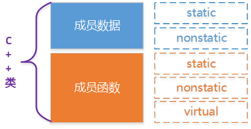

如下面的Base类定义：

```cpp
#pragma once

#include<iostream>
using namespace std;

class Base
{
public:
    Base(int);
    virtual ~Base(void);

    int getIBase() const;
    static int instanceCount();
    virtual void print() const;

protected:
    int iBase;
    static int count;
};
```

Base类在机器中我们如何构建出各种成员数据和成员函数的呢？

## 基本C++对象模型

在介绍C++使用的对象模型之前，介绍2种对象模型：简单对象模型（a simple object model）、表格驱动对象模型（a table-driven object model）。

### 简单对象模型（a simple object model）

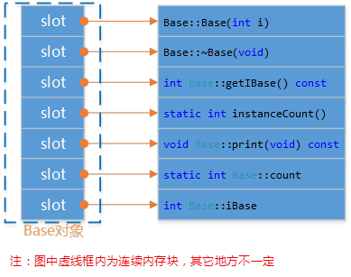

所有的成员占用相同的空间（跟成员类型无关），**对象只是维护了一个包含成员指针的一个表**。表中放的是成员的地址，无论上成员变量还是函数，都是这样处理。对象并没有直接保存成员而是保存了成员的指针。

#### 表格对象模型（a table-driven object model）

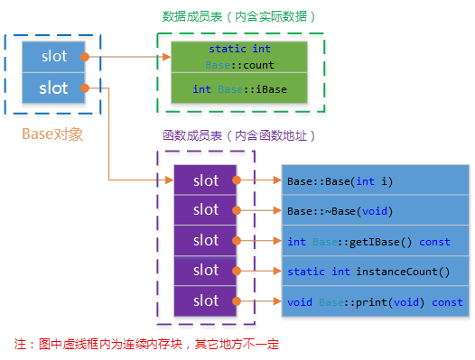

这个模型在简单对象的基础上又添加了一个间接层。将成员分成函数和数据，并且用两个表格保存，然后对象只保存了两个指向表格的指针。这个模型可以保证所有的对象具有相同的大小，比如简单对象模型还与成员的个数相关。其中数据成员表中包含实际数据；函数成员表中包含的实际函数的地址（与数据成员相比，多一次寻址）。

### C++对象模型

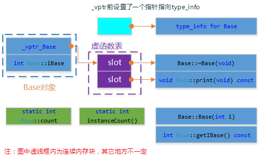

这个模型从结合上面2中模型的特点，并对**内存存取**和**空间**进行了优化。在此模型中，non static数据成员被放置到对象内部，static数据成员， static and nonstatic 函数成员均被放到对象之外。对于虚函数的支持则分两步完成：

1. 每一个class产生一堆指向虚函数的指针，放在表格之中。这个表格称之为虚函数表（virtual table，vtbl）。

2. 每一个对象被添加了一个指针，指向相关的虚函数表vtbl。通常这个指针被称为vptr。vptr的设定（setting）和重置（resetting）都由每一个class的**构造函数**，**析构函数**和**拷贝赋值运算符**自动完成。

另外，虚函数表地址的前面设置了一个指向type_info的指针，RTTI（Run Time Type Identification）运行时类型识别是有编译器在编译器生成的特殊类型信息，包括对象继承关系，对象本身的描述，RTTI是为多态而生成的信息，所以只有具有虚函数的对象在会生成。

这个模型的**优点在于它的空间和存取时间的效率**；缺点如下：如果应用程序本身未改变，但当所使用的类的nonstatic数据成员添加删除或修改时，需要重新编译。

### 模型验证测试

为了验证上述C++对象模型，我们编写如下测试代码。

**模型验证测试：**

```cpp
void test_base_model()
{
    Base b1(1000);
    cout << "对象b1的起始内存地址：" << &b1 << endl;
    cout << "type_info信息：" << ((int*)*(int*)(&b1) - 1) << endl;

    RTTICompleteObjectLocator str=
        *((RTTICompleteObjectLocator*)*((int*)*(int*)(&b1) - 1));
    //abstract class name from RTTI
    string classname(str.pTypeDescriptor->name);
    classname = classname.substr(4,classname.find("@@")-4);
    cout << classname <<endl;
    cout << "虚函数表地址：\t\t\t" << (int*)(&b1) << endl;
    cout << "虚函数表 — 第1个函数地址：\t" << (int*)*(int*)(&b1) << "\t即析构函数地址：" << (int*)*((int*)*(int*)(&b1)) << endl;
    cout << "虚函数表 — 第2个函数地址：\t" << ((int*)*(int*)(&b1) + 1) << "\t";
    typedef void(*Fun)(void);
    Fun pFun = (Fun)*(((int*)*(int*)(&b1)) + 1);
    pFun();
    b1.print();
    cout << endl;
    cout << "推测数据成员iBase地址：\t\t" << ((int*)(&b1) +1) << "\t通过地址取值iBase的值：" << *((int*)(&b1) +1) << endl;
    cout << "Base::getIBase(): " << b1.getIBase() << endl;
 
    b1.instanceCount();
    cout << "静态函数instanceCount地址： " << b1.instanceCount << endl;
}
```

根据C++对象模型，实例化对象b1的起始内存地址，即虚函数表地址。

* 虚函数表的中第1个函数地址是虚析构函数地址；
* 虚函数表的中第2个函数地址是虚函数print()的地址，通过函数指针可以调用，进行验证；
* 推测数据成员iBase的地址，为虚函数表的地址 + 1，((int*)(&b1) +1)；
* 静态数据成员和静态函数所在内存地址，与对象数据成员和函数成员位段不一样；

下面是测试代码输出：（从下面2个图验证了，上面的观点。）

注意：本测试代码及后面的测试代码中写的函数地址，是对应虚函数表项的地址，不是实际的函数地址。

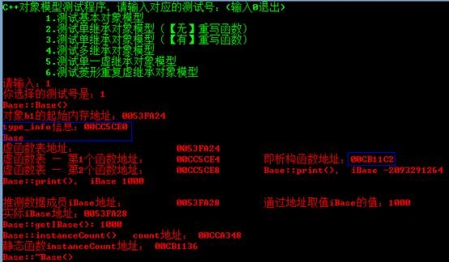

图：测试代码输出结果

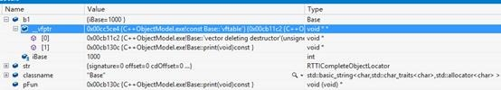

图：vs断点观察（注意看虚函数表中第一个函数的地址，名称与测试代码输出一致）

上面介绍并验证了基本的C++对象模型，引入继承之后，C++对象模型又是怎样的？

## C++对象模型中加入单继承

不管是单继承、多继承，还是虚继承，如果基于“简单对象模型”，每一个基类都可以被派生类中的一个slot指出，该slot内包含基类对象的地址。**这个机制的主要缺点是，因为间接性而导致空间和存取时间上的额外负担；优点则是派生类对象的大小不会因其基类的改变而受影响**。

如果基于“表格驱动模型”，派生类中有一个slot指向基类表，表格中的每一个slot含一个相关的基类地址（这个很像虚函数表，内含每一个虚函数的地址）。这样每个派生类对象汗一个bptr，它会被初始化，指向其基类表。**这种策略的主要缺点是由于间接性而导致的空间和存取时间上的额外负担；优点则是在每一个派生类对象中对继承都有一致的表现方式，每一个派生类对象都应该在某个固定位置上放置一个基类表指针，与基类的大小或数量无关。第二个优点是，不需要改变派生类对象本身，就可以放大，缩小、或更改基类表**。

不管上述哪一种机制，“间接性”的级数都将因为集成的深度而增加。C++实际模型是，对于一般继承是扩充已有存在的虚函数表；对于虚继承添加一个虚函数表指针。

### 无重写的单继承

无重写，即派生类中没有于基类同名的虚函数。

```cpp
#pragma once
#include "base.h"

class Derived : public Base
{
public:
    Derived(int);
    virtual ~Derived(void);
    virtual void derived_print(void);

protected:
    int iDerived;
};
```

Base、Derived的类图如下所示：

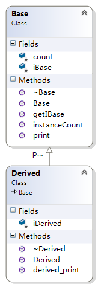

Base的模型跟上面的一样，不受继承的影响。Derived不是虚继承，所以是扩充已存在的虚函数表，所以结构如下图所示：

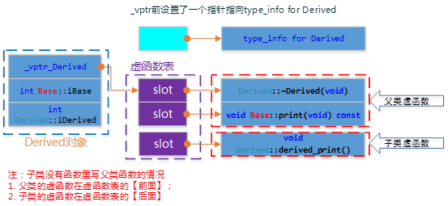

为了验证上述C++对象模型，我们编写如下测试代码。

**测试代码：**

```cpp
void test_single_inherit_norewrite()
{
    Derived d(9999);
    cout << "对象d的起始内存地址：" << &d << endl;
    cout << "type_info信息：" << ((int*)*(int*)(&d) - 1) << endl;

    RTTICompleteObjectLocator str=
        *((RTTICompleteObjectLocator*)*((int*)*(int*)(&d) - 1));
    //abstract class name from RTTI
    string classname(str.pTypeDescriptor->name);
    classname = classname.substr(4,classname.find("@@")-4);
    cout << classname <<endl;
    cout << "虚函数表地址：\t\t\t" << (int*)(&d) << endl;
    cout << "虚函数表 — 第1个函数地址：\t" << (int*)*(int*)(&d) << "\t即析构函数地址" << endl;
    cout << "虚函数表 — 第2个函数地址：\t" << ((int*)*(int*)(&d) + 1) << "\t";
    typedef void(*Fun)(void);
    Fun pFun = (Fun)*(((int*)*(int*)(&d)) + 1);
    pFun();
    d.print();
    cout << endl;

    cout << "虚函数表 — 第3个函数地址：\t" << ((int*)*(int*)(&d) + 2) << "\t";
    pFun = (Fun)*(((int*)*(int*)(&d)) + 2);
    pFun();
    d.derived_print();

    cout << endl;
    cout << "推测数据成员iBase地址：\t\t" << ((int*)(&d) +1) << "\t通过地址取得的值：" << *((int*)(&d) +1) << endl;
    cout << "推测数据成员iDerived地址：\t" << ((int*)(&d) +2) << "\t通过地址取得的值：" << *((int*)(&d) +2) << endl;
}
```

输出结果如下图所示：

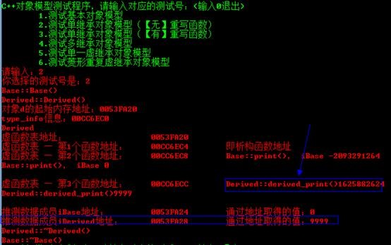

### 有重写的单继承

派生类中重写了基类的print()函数。

```cpp
#pragma once
#include "base.h"

class Derived_Overrite : public Base
{
public:
    Derived_Overrite(int);
    virtual ~Derived_Overrite(void);
    virtual void print(void) const;

protected:
    int iDerived;
};
```

Base、Derived_Overwrite的类图如下所示：

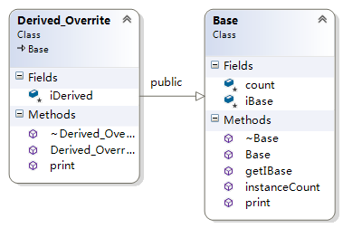

重写print()函数在虚函数表中表现如下：

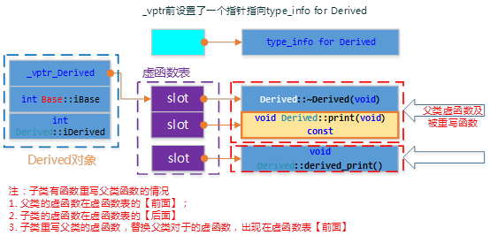

为了验证上述C++对象模型，我们编写如下测试代码。

**测试代码：**

```cpp
void test_single_inherit_rewrite()
{
    Derived_Overrite d(111111);
    cout << "对象d的起始内存地址：\t\t" << &d << endl;
    cout << "虚函数表地址：\t\t\t" << (int*)(&d) << endl;
    cout << "虚函数表 — 第1个函数地址：\t" << (int*)*(int*)(&d) << "\t即析构函数地址" << endl;
    cout << "虚函数表 — 第2个函数地址：\t" << ((int*)*(int*)(&d) + 1) << "\t";
    typedef void(*Fun)(void);
    Fun pFun = (Fun)*(((int*)*(int*)(&d)) + 1);
    pFun();
    d.print();
    cout << endl;

    cout << "虚函数表 — 第3个函数地址：\t" << *((int*)*(int*)(&d) + 2) << "【结束】\t";
    cout << endl;

    cout << "推测数据成员iBase地址：\t\t" << ((int*)(&d) +1) << "\t通过地址取得的值：" << *((int*)(&d) +1) << endl;
    cout << "推测数据成员iDerived地址：\t" << ((int*)(&d) +2) << "\t通过地址取得的值：" << *((int*)(&d) +2) << endl;
}
```

输出结果如下图所示：

![clip_image022\[3\]](./image/20201130-122211-11.jpg)

特别注意下，前面的模型虚函数表中最后一项没有打印出来，本实例中共2个虚函数，打印虚函数表第3项为0。其实虚函数表以**0x0000000**结束，类似字符串以**’\0’**结束。

## C++对象模型中加入多继承

从单继承可以知道，派生类中只是扩充了基类的虚函数表。如果是多继承的话，又是如何扩充的？

1. 每个基类都有自己的虚表。
2. 子类的成员函数被放到了第一个基类的表中。
3. 内存布局中，其父类布局依次按声明顺序排列。
4. 每个基类的虚表中的print()函数都被overwrite成了子类的print()。这样做就是为了解决不同的基类类型的指针指向同一个子类实例，而能够调用到实际的函数。

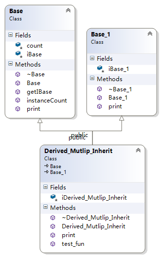

上面3个类，Derived_Mutlip_Inherit继承自Base、Base_1两个类，Derived_Mutlip_Inherit的结构如下所示：

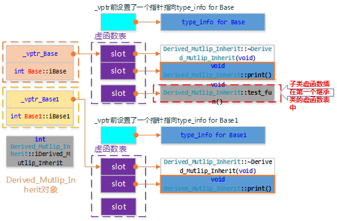

为了验证上述C++对象模型，我们编写如下测试代码。

**测试代码：**

```cpp

void test_multip_inherit()

{

    Derived_Mutlip_Inherit dmi(3333);

    cout << "对象dmi的起始内存地址：\t\t" << &dmi << endl;
    cout << "虚函数表_vptr_Base地址：\t" << (int*)(&dmi) << endl;
    cout << "_vptr_Base — 第1个函数地址：\t" << (int*)*(int*)(&dmi) << "\t即析构函数地址" << endl;
    cout << "_vptr_Base — 第2个函数地址：\t" << ((int*)*(int*)(&dmi) + 1) << "\t";
    typedef void(*Fun)(void);
    Fun pFun = (Fun)*(((int*)*(int*)(&dmi)) + 1);
    pFun();
    cout << endl;

    cout << "_vptr_Base — 第3个函数地址：\t" << ((int*)*(int*)(&dmi) + 2) << "\t";
    pFun = (Fun)*(((int*)*(int*)(&dmi)) + 2);
    pFun();
    cout << endl;

    cout << "_vptr_Base — 第4个函数地址：\t" << *((int*)*(int*)(&dmi) + 3) << "【结束】\t";
    cout << endl;

    cout << "推测数据成员iBase地址：\t\t" << ((int*)(&dmi) +1) << "\t通过地址取得的值：" << *((int*)(&dmi) +1) << endl;
    SetConsoleTextAttribute(GetStdHandle(STD_OUTPUT_HANDLE), FOREGROUND_INTENSITY | FOREGROUND_GREEN);
    cout << "++++++++++++++++++++++++++++++++++++++++++++++++++++++++++++++" << endl;
    SetConsoleTextAttribute(GetStdHandle(STD_OUTPUT_HANDLE), FOREGROUND_INTENSITY | FOREGROUND_RED);
    cout << "虚函数表_vptr_Base1地址：\t" << ((int*)(&dmi) +2) << endl;
    cout << "_vptr_Base1 — 第1个函数地址：\t" << (int*)*((int*)(&dmi) +2) << "\t即析构函数地址" << endl;
    cout << "_vptr_Base1 — 第2个函数地址：\t" << ((int*)*((int*)(&dmi) +2) + 1) << "\t";
    typedef void(*Fun)(void);
    pFun = (Fun)*((int*)*((int*)(&dmi) +2) + 1);
    pFun();
    cout << endl;

    cout << "_vptr_Base1 — 第3个函数地址：\t" << *((int*)*(int*)((int*)(&dmi) +2) + 2) << "【结束】\t";
    cout << endl;  

    cout << "推测数据成员iBase1地址：\t" << ((int*)(&dmi) +3) << "\t通过地址取得的值：" << *((int*)(&dmi) +3) << endl;
    SetConsoleTextAttribute(GetStdHandle(STD_OUTPUT_HANDLE), FOREGROUND_INTENSITY | FOREGROUND_GREEN);
    cout << "++++++++++++++++++++++++++++++++++++++++++++++++++++++++++++++" << endl;
    SetConsoleTextAttribute(GetStdHandle(STD_OUTPUT_HANDLE), FOREGROUND_INTENSITY | FOREGROUND_RED);
    cout << "推测数据成员iDerived地址：\t" << ((int*)(&dmi) +4) << "\t通过地址取得的值：" << *((int*)(&dmi) +4) << endl;
}
```

输出结果如下图所示：

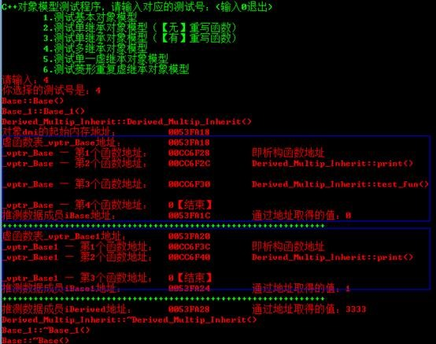

## C++对象模型中加入虚继承

虚继承是为了解决重复继承中多个间接父类的问题的，所以不能使用上面简单的扩充并为每个虚基类提供一个虚函数指针（这样会导致重复继承的基类会有多个虚函数表）形式。

虚继承的派生类的内存结构，和普通继承完全不同。虚继承的子类，有单独的虚函数表，另外也单独保存一份父类的虚函数表，两部分之间用一个四个字节的**0x00000000**来作为分界。派生类的内存中，首先是自己的虚函数表，然后是派生类的数据成员，然后是0x0，之后就是基类的虚函数表，之后是基类的数据成员。

如果派生类没有自己的虚函数，那么派生类就不会有虚函数表，但是派生类数据和基类数据之间，还是需要0x0来间隔。

因此，在虚继承中，派生类和基类的数据，是完全间隔的，先存放派生类自己的虚函数表和数据，中间以**0x**分界，最后保存基类的虚函数和数据。如果派生类重载了父类的虚函数，那么则将派生类内存中基类虚函数表的相应函数替换**。

### 简单虚继承（无重复继承情况）

简单虚继承的2个类Base、Derived_Virtual_Inherit1的关系如下所示：

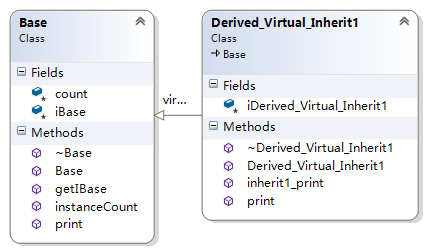

Derived_Virtual_Inherit1的对象模型如下图：

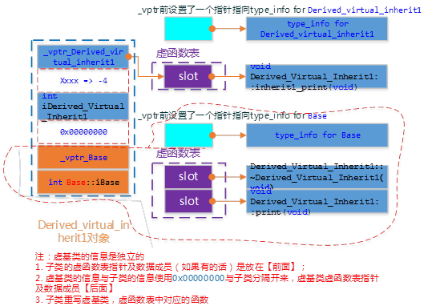

为了验证上述C++对象模型，我们编写如下测试代码。

**测试代码：**

```cpp
void test_single_vitrual_inherit()

{

    Derived_Virtual_Inherit1 dvi1(88888);

    cout << "对象dvi1的起始内存地址：\t\t" << &dvi1 << endl;
    cout << "虚函数表_vptr_Derived..地址：\t\t" << (int*)(&dvi1) << endl;
    cout << "_vptr_Derived — 第1个函数地址：\t" << (int*)*(int*)(&dvi1) << endl;
    typedef void(*Fun)(void);
    Fun pFun = (Fun)*((int*)*(int*)(&dvi1));
    pFun();
    cout << endl;

    cout << "_vptr_Derived — 第2个函数地址：\t" << *((int*)*(int*)(&dvi1) + 1) << "【结束】\t";
    cout << endl;

    cout << "=======================：\t" << ((int*)(&dvi1) +1) << "\t通过地址取得的值：" << (int*)*((int*)(&dvi1) +1) << "\t" <<*(int*)*((int*)(&dvi1) +1) << endl;
    cout << "推测数据成员iDerived地址：\t" << ((int*)(&dvi1) +2) << "\t通过地址取得的值：" << *((int*)(&dvi1) +2) << endl;
    cout << "=======================：\t" << ((int*)(&dvi1) +3) << "\t通过地址取得的值：" << *((int*)(&dvi1) +3) << endl;
    cout << "虚函数表_vptr_Base地址：\t" << ((int*)(&dvi1) +4) << endl;
    cout << "_vptr_Base — 第1个函数地址：\t" << (int*)*((int*)(&dvi1) +4) << "\t即析构函数地址" << endl;
    cout << "_vptr_Base — 第2个函数地址：\t" << ((int*)*((int*)(&dvi1) +4) +1) << "\t";
    pFun = (Fun)*((int*)*((int*)(&dvi1) +4) +1);
    pFun();
    cout << endl;

    cout << "_vptr_Base — 第3个函数地址：\t" << ((int*)*((int*)(&dvi1) +4) +2) << "【结束】\t" << *((int*)*((int*)(&dvi1) +4) +2);
    cout << endl;

    cout << "推测数据成员iBase地址：\t\t" << ((int*)(&dvi1) +5) << "\t通过地址取得的值：" << *((int*)(&dvi1) +5) << endl;
}
```

输出结果如下图所示：

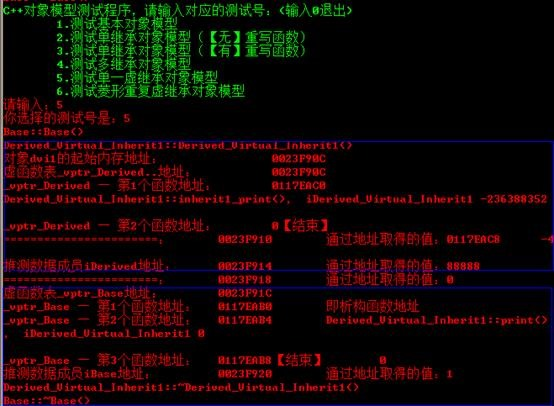

### 菱形继承（含重复继承、多继承情况）

菱形继承关系如下图：

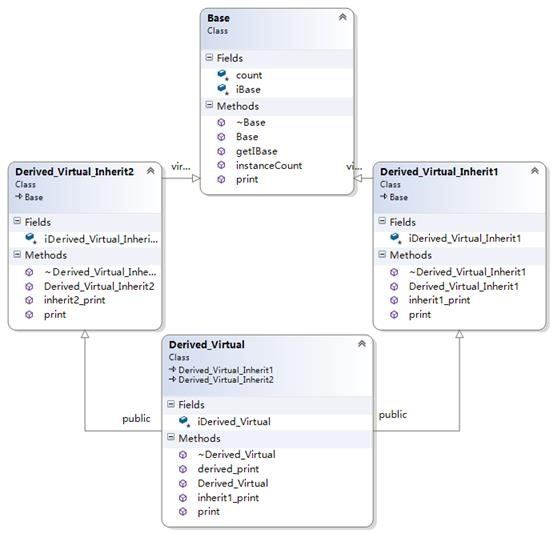

Derived_Virtual的对象模型如下图：

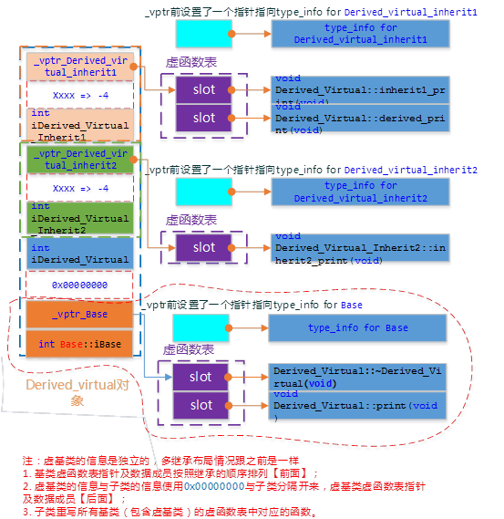

为了验证上述C++对象模型，我们编写如下测试代码。

**测试代码：**

```cpp

void test_multip_vitrual_inherit()

{

    Derived_Virtual dvi1(88888);

    cout << "对象dvi1的起始内存地址：\t\t" << &dvi1 << endl;
    cout << "虚函数表_vptr_inherit1地址：\t\t" << (int*)(&dvi1) << endl;
    cout << "_vptr_inherit1 — 第1个函数地址：\t" << (int*)*(int*)(&dvi1) << endl;
    typedef void(*Fun)(void);
    Fun pFun = (Fun)*((int*)*(int*)(&dvi1));
    pFun();
    cout << endl;

    cout << "_vptr_inherit1 — 第2个函数地址：\t" << ((int*)*(int*)(&dvi1) + 1) << endl;
    pFun = (Fun)*((int*)*(int*)(&dvi1) + 1);
    pFun();
    cout << endl;

    cout << "_vptr_inherit1 — 第3个函数地址：\t" << ((int*)*(int*)(&dvi1) + 2) << "\t通过地址取得的值：" << *((int*)*(int*)(&dvi1) + 2) << "【结束】\t";
    cout << endl;

    cout << "======指向=============：\t" << ((int*)(&dvi1) +1) << "\t通过地址取得的值：" << (int*)*((int*)(&dvi1) +1)<< "\t" <<*(int*)*((int*)(&dvi1) +1) << endl;
    cout << "推测数据成员iInherit1地址：\t" << ((int*)(&dvi1) +2) << "\t通过地址取得的值：" << *((int*)(&dvi1) +2) << endl;
    //
    cout << "虚函数表_vptr_inherit2地址：\t" << ((int*)(&dvi1) +3) << endl;
    cout << "_vptr_inherit2 — 第1个函数地址：\t" << (int*)*((int*)(&dvi1) +3) << endl;
    pFun = (Fun)*((int*)*((int*)(&dvi1) +3));
    pFun();
    cout << endl;

    cout << "_vptr_inherit2 — 第2个函数地址：\t" << (int*)*((int*)(&dvi1) +3) + 1 <<"\t通过地址取得的值：" << *((int*)*((int*)(&dvi1) +3) + 1) << "【结束】\t" << endl;
    cout << endl;

    cout << "======指向=============：\t" << ((int*)(&dvi1) +4) << "\t通过地址取得的值：" << (int*)*((int*)(&dvi1) +4) << "\t" <<*(int*)*((int*)(&dvi1) +4)<< endl;
    cout << "推测数据成员iInherit2地址：\t" << ((int*)(&dvi1) +5) << "\t通过地址取得的值：" << *((int*)(&dvi1) +5) << endl;
    cout << "推测数据成员iDerived地址：\t" << ((int*)(&dvi1) +6) << "\t通过地址取得的值：" << *((int*)(&dvi1) +6) << endl;
    cout << "=======================：\t" << ((int*)(&dvi1) +7) << "\t通过地址取得的值：" << *((int*)(&dvi1) +7) << endl;
    //
    cout << "虚函数表_vptr_Base地址：\t" << ((int*)(&dvi1) +8) << endl;
    cout << "_vptr_Base — 第1个函数地址：\t" << (int*)*((int*)(&dvi1) +8) << "\t即析构函数地址" << endl;
    cout << "_vptr_Base — 第2个函数地址：\t" << ((int*)*((int*)(&dvi1) +8) +1) << "\t";
    pFun = (Fun)*((int*)*((int*)(&dvi1) +8) +1);
    pFun();
    cout << endl;

    cout << "_vptr_Base — 第3个函数地址：\t" << ((int*)*((int*)(&dvi1) +8) +2) << "【结束】\t" << *((int*)*((int*)(&dvi1) +8) +2);
    cout << endl;

    cout << "推测数据成员iBase地址：\t\t" << ((int*)(&dvi1) +9) << "\t通过地址取得的值：" << *((int*)(&dvi1) +9) << endl;
}
```

输出结果如下图所示：

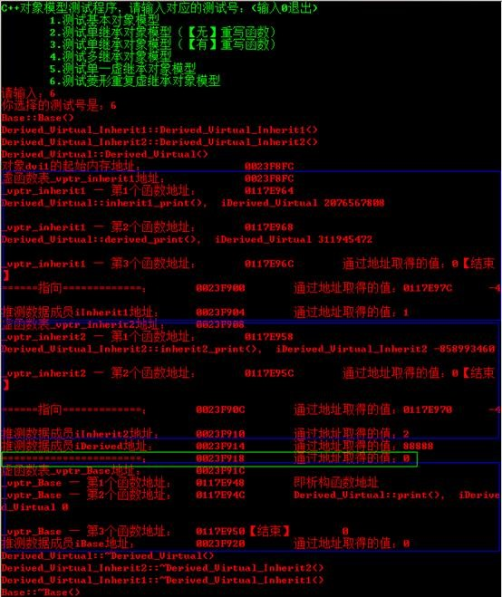

至此，C++对象模型介绍的差不多了，清楚了C++对象模型之后，很多疑问就能迎刃而解了。下面结合模型介绍一些典型问题。

## 如何访问成员？

前面介绍了C++对象模型，下面介绍C++对象模型的对访问成员的影响。其实清楚了C++对象模型，就清楚了成员访问机制。下面分别针对数据成员和函数成员是如何访问到的，给出一个大致介绍。

### 对象大小问题

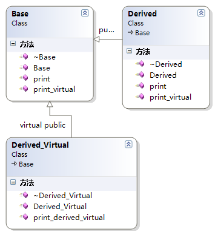

其中：3个类中的函数都是虚函数

* Derived继承Base
* Derived_Virtual虚继承Base

**测试对象大小：**

```cpp
void test_size()
{
    Base b;
    Derived d;
    Derived_Virtual dv;

    cout << "sizeof(b):\t" << sizeof(b) << endl;
    cout << "sizeof(d):\t" << sizeof(d) << endl;
    cout << "sizeof(dv):\t" << sizeof(dv) << endl;
}
```

输出如下：

![clip_image040\[3\]](./image/20201130-122211-22.png)

因为Base中包含虚函数表指针，所有size为4；Derived继承Base，只是扩充基类的虚函数表，不会新增虚函数表指针，所以size也是4；Derived_Virtual虚继承Base，根据前面的模型知道，派生类有自己的虚函数表及指针，并且有分隔符（0x00000000），然后才是虚基类的虚函数表等信息，故大小为4+4+4=12。

**空类Empty**：

```cpp
#pragma once

class Empty
{
public:
    Empty(void);
    ~Empty(void);
};
```

Empty p，sizeof(p)的大小是多少？事实上并不是空的，它有一个隐晦的1byte，那是被编译器安插进去的一个char。这将使得这个**class**的两个对象得以在内中有独一无二的地址。

### 数据成员如何访问（直接取址）

**跟实际对象模型相关联**，根据对象起始地址+偏移量取得。

### 静态绑定与动态绑定

程序调用函数时，将使用那个可执行代码块呢？编译器负责回答这个问题。将源代码中的函数调用解析为执行特定的函数代码块被称为函数名绑定（binding，又称联编）。在C语言中，这非常简单，因为每个函数名都对应一个不同的额函数。在C++中，由于函数重载的缘故，这项任务更复杂。编译器必须查看函数参数以及函数名才能确定使用哪个函数。然而编译器可以再编译过程中完成这种绑定，这称为静态绑定（static binding），又称为早期绑定（early binding）。

然而虚函数是这项工作变得更加困难。使用哪一个函数不是能在编译阶段时确定的，因为编译器不知道用户将选择哪种类型。所以，编译器必须能够在程序运行时选择正确的虚函数的代码，这被称为动态绑定（dynamic binding），又称为晚期绑定（late binding）。

使用虚函数是有代价的，在**内存和执行速度**方面是有一定成本的，包括：

* 每个对象都将增大，增大量为存储虚函数表指针的大小；
* 对于每个类，编译器都创建一个虚函数地址表；
* 对于每个函数调用，都需要执行一项额外的操作，即到虚函数表中查找地址。

虽然非虚函数比虚函数效率稍高，单不具备动态联编能力。

### 函数成员如何访问（间接取址）

**跟实际对象模型相关联**，普通函数（nonstatic、static）根据编译、链接的结果直接获取函数地址；如果是虚函数根据对象模型，取出对于虚函数地址，然后在虚函数表中查找函数地址。

## 多态如何实现?

### 多态的实现

多态（Polymorphisn）在C++中是通过虚函数实现的。通过前面的模型【参见“有重写的单继承”】知道，如果类中有虚函数，编译器就会自动生成一个虚函数表，对象中包含一个指向虚函数表的指针。能够实现多态的**关键在于**：虚函数是允许被派生类重写的，在虚函数表中，派生类函数对覆盖（**override**）基类函数。除此之外，**还必须通过指针或引用调用方法才行**，将派生类对象赋给基类对象。

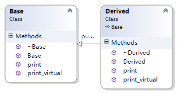

上面2个类，基类Base、派生类Derived中都包含下面2个方法：

```cpp
void print() const;
virtual void print_virtual() const;
```

这个2个方法的区别就在于一个是普通成员函数，一个是虚函数。编写测试代码如下：

**测试多态代码：**

```cpp
void test_polmorphisn()
{
    Base b;
    Derived d;

    b = d;
    b.print();
    b.print_virtual();

    Base *p;
    p = &d;
    p->print();
    p->print_virtual();
}
```

根据模型推测只有p->print_virtual()才实现了动态，其他3调用都是调用基类的方法。原因如下：

* b.print();b.print_virtual();不能实现多态是因为**通过基类对象调用，而非指针或引用**所以不能实现多态。
* p->print();不能实现多态是因为，print函数没有声明为虚函数（**virtual**），派生类中也定义了print函数只是隐藏了基类的print函数。

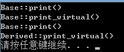

### 为什么析构函数设为虚函数是必要的

析构函数应当都是虚函数，除非明确该类不做基类（不被其他类继承）。基类的析构函数声明为虚函数，这样做是为了确保释放派生对象时，按照正确的顺序调用析构函数。

从前面介绍的C++对象模型可以知道，如果析构函数不定义为虚函数，那么派生类就不会重写基类的析构函数，在有多态行为的时候，派生类的析构函数不会被调用到（**有内存泄漏的风险！**）。

例如，通过new一个派生类对象，赋给基类指针，然后delete基类指针。

**测试析构函数：**

```cpp
void test_vitual_destructor()
{
    Base *p = new Derived();
    delete p;
}
```

如果基类的析构函数不是析构函数：

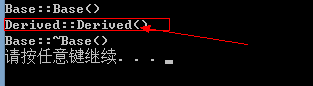

**注意，缺少了派生类的析构函数调用**。把析构函数声明为虚函数，调用就正常了：

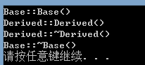

## 相关资料

* [1]深度探索C++对象模型，侯捷
* [2]测试代码下载：_<https://github.com/saylorzhu/CppObjectDataModelTestCode>_

<hr>

#### <p>原文出处：<a href='https://www.jianshu.com/p/0aaffd3f4018' target='blank'>深入理解C++对象模型</a></p>

### 1. C++对象模型

所有的非静态数据成员存储在对象本身中。所有的静态数据成员、成员函数（包括静态与非静态）都置于对象之外。另外，用一张虚函数表（virtual table)存储所有指向虚函数的指针，并在表头附加上一个该类的type_info对象，在对象中则保存一个指向虚函数表的指针。如下图：

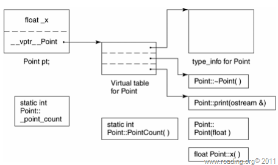

 **一个类的对象的内存大小包括：**

  1. 所有非静态数据成员的大小。
  2. 由内存对齐而填补的内存大小。
  3. 为了支持virtual有内部产生的额外负担。  

如下类：


```cpp
class ZooAnimal {  
public:  
    ZooAnimal();  
    virtual ~ZooAnimal();  
    virtual void rotate();  
protected:  
    int loc;  
    String name;  
};
```

> 在32位计算机上所占内存为16字节：int四字节，String8字节（一个表示长度的整形，一个指向字符串的指针），以及一个指向虚函数表的指针vptr。对于继承类则为基类的内存大小加上本身数据成员的大小。在cfront中其内存布局如下图：

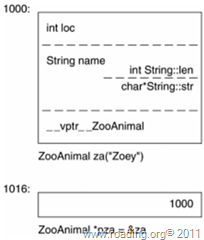

### 2. C++构造函数

 通常很多C++程序员存在两种误解：

  * 没有定义默认构造函数的类都会被编译器生成一个默认构造函数。
  * 编译器生成的默认构造函数会明确初始化类中每一个数据成员。

 C++标准规定：如果类的设计者并未为类定义任何构造函数，那么会有一个默认构造函数被暗中生成，而这个暗中生成的默认构造函数通常是不做什么事的(无用的)，下面四种情况除外。

**1）.包含有带默认构造函数的对象成员的类**  

若一个类X没有定义任何构造函数，但却包含一个或以上定义有默认构造函数的对象成员，此时编译器会为X合成默认构造函数，该默认函数会调用对象成员的默认构造函数为之初始化。如果对象的成员没有定义默认构造函数，那么编译器合成的默认构造函数将不会为之提供初始化。例如类A包含两个数据成员对象，分别为：`stringstr`和`char *Cstr`，那么编译器生成的默认构造函数将只提供对string类型成员的初始化，而不会提供对char*类型的初始化。

假如类X的设计者为X定义了默认的构造函数来完成对str的初始化，形如：`A::A(){Cstr=”hello”};`因为默认构造函数已经定义，编译器将不能再生成一个默认构造函数。但是编译器将会扩充程序员定义的默认构造函数——在最前面插入对初始化str的代码。若有多个定义有默认构造函数的成员对象，那么这些成员对象的默认构造函数的调用将依据声明顺序排列。

**2）.继承自带有默认构造函数的基类的类**  

如果一个没有定义任何构造函数的类派生自带有默认构造函数的基类，那么编译器为它定义的默认构造函数，将按照声明顺序为之依次调用其基类的默认构造函数。若该类没有定义默认构造函数而定义了多个其他构造函数，那么编译器扩充它的所有构造函数——加入必要的基类默认构造函数。另外，如果该类满足一的条件，那么编译器会将基类的默认构造函数代码加在对象成员的默认构造函数代码之前。

**3）.带有虚函数的类")**  

带有虚函数的类，与其它类不太一样，因为它多了一个vptr，而vptr的设置是由编译器完成的，因此编译器会为类的每个构造函数添加代码来完成对vptr的初始化。

**4）.带有一个虚基类的类**  

在这种情况下，编译器要将虚基类在类中的位置准备妥当，提供支持虚基类的机制。也就是说要在所有构造函数中加入实现前述功能的的代码。没有构造函数将合成以完成上述工作。

总结：简单来讲编译器会为构造函数做的一点事就是调用其基类或成员对象的默认构造函数，以及初始化vprt以及准备虚基类的位置。

总的来说，编译器将对构造函数动这些手脚：

  * 如果类虚继承自基类，编译器将在所有构造函数中插入准备虚基类位置的代 码和提供支持虚基类机制的代码。
  * 如果类声明有虚函数，那么编译器将为之生成虚函数表以存储虚函数地址，并将虚函数指（vptr）的初始化代码插入到类的所有构造函数中。
  * 如果类的父类有默认构造函数，编译将会对所有的默认构造函数插入调用其父类必要的默认构造函数。必要是指设计者没有显示初始化其父类，调用顺序，依照其继承时声明顺序。
  * 如果类包含带有默认构造函数的对象成员，那么编译器将会为所有的构造函数插入对这些对象成员的默认构造函数进行必要的调用代码，所谓必要是指类设计者设计的构造函数没有对对象成员进行显式初始化。成员对象默认构造函数的调用顺序，依照其声明顺序。
  * 若类没有定义任何构造函数，编译器会为其合成默认构造函数，再执行上述四点。


 **需要说明的是**，从概念来上来讲，每一个没有定义构造函数的类都会由编译器来合成一个默认构造函数，以使得可以定义一个该类的对象，但是默认构造函数是否真的会被合成，将视是否有需要而定。C++ standard 将合成的默认构造函数分为 trivial 和 notrivial 两种，前文所述的四种情况对应于notrivial默认构造函数，其它情况都属于trivial。对于一个trivial默认构造函数，编译器的态度是，既然它全无用处，干脆就不合成它。在这儿要厘清的是概念与实现的差别，概念上追求缜密完善，在实现上则追求效率，可以不要的东西就不要。

### 3. 拷贝构造函数（copy constuctor）

当一个类对象以另一个同类实体作为初值时，大部分情况下会调用拷贝构造函数。一般是这三种具体情况：


   * 显式地以一个类对象作为另一个类对象的初值，形如`X xx=x;`
   * 当类对象被作为参数交给函数时。
   * 当函数返回一个类对象时。

**后两种情形会产生一个临时对象。**

**编译器何时合成拷贝构造函数**  

并不是所有未定义有拷贝构造函数的类编译器都会为其合成拷贝构造函数，编译器只有在必要的时候才会为其合成拷贝构造函数。  
如果一个类没有定义拷贝构造函数，通常按照“成员逐一初始化(DefaultMemberwise Initialization)”（_成员逐一初始化(Default Memberwise Initialization)具体的实现方式则是位逐次拷贝（Bitwise copy semantics）_）的手法来解决“一个类对象以另一个同类实体作为初值”——也就是说把内建或派生的数据成员从某一个对象拷贝到另一个对象身上，如果数据成员是一个对象，则递归使用“成员逐一初始化(Default Memberwise Initialization)”的手法。  

有以下几种情况之一，位逐次拷贝将不能胜任或者不适合来完成“一个类对象以另一个同类实体作为初值”的工作。此时，如果类没有定义拷贝构造函数，那么编译器将必须为类合成一个拷贝构造函数：

   * 当类内含一个成员对象，而后者的类声明有一个拷贝构造函数时（不论是设计者定义的还是编译器合成的）。
   * 当类继承自一个声明有拷贝构造函数的类时（同样，不论这个拷贝构造函数是被显示声明还是由编译器合成的）。
   * 类中声明有虚函数。
   * 当类的派生串链中包含有一个或多个虚基类。

> 对于前两种情况，不论是基类还是对象成员，既然后者声明有拷贝构造函数时，就表明其类的设计者或者编译器希望以其声明的拷贝构造函数来完成“一个类对象以另一个同类实体作为初值”的工作，而设计者或编译器这样做——声明拷贝构造函数，总有它们的理由，而通常最直接的原因莫过于因为他们想要做一些额外的工作或“位逐次拷贝”无法胜任。  
> 对于有虚函数的类，如果两个对象的类型相同那么位逐次拷贝其实是可以胜任的。但问题将出现在，如果基类由其继承类进行初始化时，此时若按照位逐次拷贝来完成这个工作，那么基类的vptr将指向其继承类的虚函数表，这将导致无法预料的后果——调用一个错误的虚函数实体是无法避免的，轻则带来程序崩溃，更糟糕的问题可能是这个错误被隐藏了。所以对于有虚函数的类编译器将会明确的使被初始化的对象的vptr指向正确的虚函数表。因此有虚函数的类没有声明拷贝构造函数，编译将为之合成一个，来完成上述工作，以及初始化各数据成员，声明有拷贝构造函数的话也会被插入完成上述工作的代码。  
> 对于继承串链中有虚基类的情况，问题同样出现在继承类向基类提供初值的情况，此时位逐次拷贝有可能破坏对象中虚基类子对象的位置。

### 4. 命名返回值优化和成员初始化列表

**命名返回值优化**  

对于一个如foo()这样的函数，它的每一个返回分支都返回相同的对象，编译器有可能对其做Named return Value优化（下文都简称NRV优化），方法是以一个引用参数result取代返回对象。

foo()的原型：  

```cpp
X foo()
{
  X xx;
  if(...)
  returnxx;
  else
  returnxx;
}
```

优化后的foo()以result取代xx：  

```cpp
void foo(X &result)  
{  
  result.X::X();  
  if(...)  
  {  
    //直接处理result  
    return;  
  }  
  else  
  {  
    //直接处理result  
    return;  
  }  
}
```

对比优化前与优化后的代码可以看出，对于一句类似于X a = foo()这样的代码，NRV优化后的代码相较于原代码节省了一个临时对象的空间（省略了xx）,同时减少了两次函数调用（减少xx对象的默认构造函数和析构函数，以及一次拷贝构造函数的调用，增加了一次对a的默认构造函数的调用）。

**成员初始化列表**  

对于初始化队列，我相信厘清一个概念是非常重要的：在构造函数中对于对象成员的初始化发生在初始化队列中——或者我们可以把初始化队列直接看做是对成员的定义，而构造函数体中进行的则是赋值操作。所以不难理解有四种情况必须用到初始化列表：

  * 有const成员
  * 有引用类型成员
  * 成员对象没有默认构造函数
  * 基类对象没有默认构造函数

> 前两者因为要求定义时初始化，所以必须明确的在初始化队列中给它们提供初值。后两者因为不提供默认构造函数，所有必须显示的调用它们的带参构造函数来定义即初始化它们。显而易见的是当类中含有对象成员或者继承自基类的时候，在初始化队列中初始化成员对象和基类子对象会在效率上得到提升——省去了一些赋值操作嘛。

最后，一个关于初始化队列众所周知的陷阱，初始化队列的顺序，初始化列表中成员初始化的顺序和列表中的顺序无关，只与成员在对象中声明的顺序有关。

     
```cpp
class X{
  int  i;
  int  j;
public:
  X(int  val)
  : j(val), i(j)
  {}
  ...
};
```

> **上述代码意味，j用val赋值，然后i用j赋值，但这里存在一个陷阱，就是i先被声明，根据规则，i先初始化，但是此时j并没有被初始化过，所以i的值不确定，造成一个严重错误**

### 5. c++类对象的大小

#### 一个实例引出的思考

     
```cpp
class X{};
class Y:virtual public X{};
class Z:virtual public X{};
class A:public Y, public Z{};
```


猜猜sizeof上面各个类都为多少？  

Lippman的一个法国读者的结果是：

     
```cpp
sizeof X yielded 1                         
sizeof Y yielded 8                         
sizeof Z yielded 8                         
sizeof A yielded 12                    
```


在vs2010上的结果是：

     
```cpp
sizeof X yielded 1   
sizeof Y yielded 4   
sizeof Z yielded 4    
sizeof Z yielded 8        
```

> 当我们对于C++对象的内存布局知之甚少的情况下，想搞清这些奇怪现象的缘由将是一件非常困难的事情。  
> 事实上，对于像X这样的一个的空类，编译器会对其动点手脚——隐晦的插入一个字节。为什么要这样做呢？插入了这一个字节，那么X的每一个对象都将有一个独一无二的地址。如果不插入这一个字节呢？哼哼，那对X的对象取地址的结果是什么？两个不同的X对象间地址的比较怎么办？  
> 我们再来看Y和Z。首先我们要明白的是实现虚继承，将要带来一些额外的负担——额外需要一个某种形式的指针。到目前为止，对于一个32位的机器来说Y、Z的大小应该为5，而不是8或者4。我们需要再考虑两点因素：**内存对齐（alignment）**和**编译器的优化**。  
> 那么在vs2010中为什么Y、Z的大小是4而不是8呢？我们先思考一个问题，X之所以被插入1字节是因为本身为空，需要这一个字节为其在内存中给它占领一个独一无二的地址。但是当这一字节被继承到Y、Z后呢？它已经完全失去了它存在的意义，为什么？因为Y、Z各自拥有一个虚基类指针，它们的大小不是0。既然这一字节在Y、Z中毫无意义，那么就没必要留着。也就是说vs2010对它们进行了优化，优化的结果是去掉了那一个字节。  
> 当我们现在再来看A的时候，一切就不是问题了。对于那位Lippman的法国读者来说，A的大小是共享的X实体1字节,X和Y的大小分别减去虚基类带来的内存空间，都是4。A的总计大小为9，对齐以后就是12了。而对于vs2010来说，那个一字节被优化后，A的大小为8，也不需再进行alignment操作。

**总结**  

影响C++类的大小的三个因素：

  * 支持特殊功能所带来的额外负担（对各种virtual的支持）。
  * 编译器对特殊情况的优化处理。
  * alignment操作，即内存对齐。

> 关于更多的memory alignment（内存对齐）的知识见[VC内存对齐准则（Memory alignment）](http://www.roading.org/develop/cpp/vc%E5%86%85%E5%AD%98%E5%AF%B9%E9%BD%90%E5%87%86%E5%88%99%EF%BC%88memory-alignment%EF%BC%89.html)


> 关于pragma  
> `#pragma pack(4)` 可以指定对齐大小为4，另外还要满足以下规则  
> 这里有一个小问题：vs对预处理没有进行语法检测，括号换为中文的不会报错，但也没有意义。  
> **在结构体内部对齐大小是 min(pragma, 自身大小）  
> 整个结构体对齐大小是 min(pragma, 最大数据成员大小）**

### 6. c++对象的数据成员

**数据成员的布局**  

对于一个类来说它的对象中只存放非静态的数据成员,但是除此之外，编译器为了实现virtual功能还会合成一些其它成员插入到对象中。我们来看看这些成员的布局。

**C++ 标准的规定**

* 在同一个Access Section（也就是private,public,protected片段）中，要求较晚出现的数据成员处在较大的内存中。这意味着同一个片段中的数据成员并不需要紧密相连，编译器所做的成员对齐就是一个例子。
* 允许编译器将多个Acess Section的顺序自由排列，而不必在乎它们的声明 次序。但似乎没有编译器这样做。
* 对于继承类，C++标准并未指定是其基类成员在前还是自己的成员在前。
* 对于虚基类成员也是同样的未予规定。

**一般的编译器怎么做？**

* 同一个Access Section中的数据成员按期声明顺序，依次排列。但成员与成员之间因为内存对齐的原因可能存在空当。
* 多个Access Section按其声明顺序排放。
* 基类的数据成员总放在自己的数据成员之前，但虚基类除外。

**编译器合成的成员放在哪？**  

为了实现虚函数和虚拟继承两个功能，编译器一般会合成Vptr和Vbptr两个指针。那么这两个指针应该放在什么位置？C++标准肯定是不曾规定的，因为它甚至并没有
规定如何来实现这两个功能，因此就语言层面来看是不存在这两个指针的。

* 对于Vptr来说有的编译器将它放在末尾，如Lippman领导开发的Cfront。有的则将其放在最前面，如MS的VC，但似乎没人将它放在中间。为什么不放在中间？没有理由可以让人这么做，放在末尾，可以保持C++类对C的struct的良好兼容性，放在最前可以给多重继承下的指针或引用调用虚函数带来好处。
* 对于Vbptr来说，有好几种方法，在这儿我们只看看VC的实现原理：  

对于由虚拟继承而得的类，VC会在其每一个对象中插入一个Vbptr,这个Vbptr指向vitual base class table（我称之为虚基类表）。虚基类表中则存放有其虚基类子对象相对于虚基类指针的偏移量。例如声明如`class Y:virtual public X`的类的virtual base class table的虚基类表中当存储有X对象相对于Vbptr的偏移量。

> _对象成员或基类对象成员后面的填充空白不能为其它成员所用_  
> 如果有填充空白被使用，设想一下，将会造成数据错误，地址内存的值并不是你原本需要的值；

**Vptr与Vbptr**

* 在多继承情况下，即使是多虚拟继承，继承而得的类只需维护一个Vbptr；而多继承情况下Vptr则可能有要维护多个Vptr，视其基类有几个有虚函数。
* 一条继承线路只有一个Vptr，但可能有多个Vbptr，视有几次虚拟继承而定。换言之，对于一个继承类对象来说，不需要新合成vptr，而是使用其基类子对象的vptr。而对于一个虚拟继承类来说，必须新合成一个自己的Vbptr。  

**如：**
     
```cpp
class X{
    virtual void vf(){};
};
class X2:virtual public X
{
    virtual void vf(){};
};
class X3:virtual public  X2
{
    virtual void vf(){};
}
```

X3将包含有一个Vptr，两个Vbptr。确切的说这两个Vbptr一个属于X3，一个属于X3的子对象X2,X3通过其Vbptr找到子对象X2，而X2通过其Vbptr找到X。  
_其中差别在于vptr通过一个虚函数表可以确切地知道要调用的函数，而Vbptr通过虚基类表只能够知道其虚基类子对象的偏移量。这两条规则是由虚函数与虚拟继承的实现方式，以及受它们的存取方式和复制控制的要求决定的。_

**数据成员的存取**

静态数据成员相当于一个仅对该类可见的全局变量，因为程序中只存在一个静态数据成员的实例，所以其地址在编译时就已经被决定。不论如何静态数据成员的存取不会带来
任何额外负担。  

非静态数据成员的存取，相当于对象起始地址加上偏移量。效率上与C struct成员的效率等同。因为它的偏移量在编译阶段已经确定。但有一种情况例外：`pt->x=0.0`。当通过指针或引用来存取——x，而x又是虚基类的成员的时候。因为必须要等到执行期才能知道pt指向的确切类型，所以必须通过一个间接导引才能完成。

**小结**

在VC中数据成员的布局顺序为：

1. vptr部分（如果基类有，则继承基类的）
2. vbptr （如果需要）
3. 基类成员（按声明顺序）
4. 自身数据成员
5. 虚基类数据成员（按声明顺序）

### 7. C++ 成员函数调用

c++支持三种类型的成员函数，分别为static,nostatic,virtual。每一种调用方式都不尽相同。

**非静态成员函数（Nonstatic Member Functions）**  

保证nostatic member function至少必须和一般的nonmember function有相同的效率是C++的设计准则之一。事实上在c++中非静态成员函数（nostatic member function）与普通函数的调用也确实具有相同的效率，因为本质上非静态成员函数就如同一个普通函数,如一个非静态成员函数X`float Point::X();`就相当于一个普通函数`float X(Point* this);`。编译器内部会将成员函数等价转换为非成员函数，具体是这样做的:

1、改写成员函数的签名，使得其可以接受一个额外参数，这个额外参数即是this指针：

     
```cpp
float Point::X();
//成员函数X被插入额外参数this
float Point:: X(Point* this );
```

**_当然如果成员函数是const的，插入的参数类型将为 const Point_ 类型。**

2、将每一个对非静态数据成员的操作都改写为经过this操作。

3、将成员函数写成一个外部函数，对函数名进行“mangling”处理，使之成为独一无二的名称。

* 可以看出，将一个成员函数改写成一个外部函数的关键在于两点:  
  一是给函数提供一个可以直接读写成员数据的通道；  
  二是解决好有可能带来的名字冲突。  
  第一点通过给函数提供一个额外的指针参数来解决，第二点则是通过一定的规则将名字转换，使之独一无二。

* 由此可以做出一点总结：一个成员函数实际上就是一个被插入了一个接受其类的指针类型的额外参数的非成员函数，  
  当然还要额外对函数的名称进行处理。额外插入的参数用来访问数据成员，而名称的特殊处理用来避免名字冲突。

* 对于名称的特殊处理并没有统一的标准，各大编译器厂商可能有不同的处理规则。  
  在VC下上述的成员函数X()的名称X处理后就成了`?X@Point@@QAEMXZ`  
  更多信息可以参见维基百科的[Visual C++名字修饰](https://zh.wikipedia.org/zh/Visual_C%2B%2B%E5%90%8D%E5%AD%97%E4%BF%AE%E9%A5%B0)。

_于是在VC中对于上面的例子中的成员函数的调用将发生如下的转换：_

     
```cpp
//p->X();被转化为
point_X(Point *this);
//obj.X();被转化为
point_X(Point &obj);
```

**虚拟成员函数(Virtual Member Functions)**

如果function()是一个虚拟函数，那么用指针或引用进行的调用将发生一点特别的转换——一个中间层被引入进来。例如：

     
```cpp
// ptr->function()
//将转化为
(*ptr->vptr[1])(ptr);
```

* 其中vptr为指向虚函数表的指针，它由编译器产生。vptr也要进行名字处理，因为一个继承体系可能有多个vptr。
* 1是虚函数在虚函数表中的索引，通过它关联到虚函数function().
* 第二个ptr表示this指针

何时发生这种转换？答案是在必需的时候——一个再熟悉不过的答案。当通过指针调用的时候，要调用的函数实体无法在编译期决定，必需待到执行期才能获得，所以上面引入一个间接层的转换必不可少。但是当我们通过对象（不是引用，也不是指针）来调用的时候，进行上面的转换就显得多余了，因为在编译器要调用的函数实体已经被决定。此时调用发生的转换，与一个非静态成员函数(Nonstatic Member Functions)调用发生的转换一致。

**静态成员函数(Static Member Functions)**

静态成员函数的一些特性：

1. 没有this指针，
2. 不能够直接存取其类中的非静态成员（nostatic members），包括不能调用非静态成员函数(Nonstatic Member Functions)。
3. 不能够声明为 const、voliatile或virtual。
4. 它不需经由对象调用，当然，通过对象调用也被允许。
5. 2、3、4主要因为1而产生

> 除了缺乏一个this指针他与非静态成员函数没有太大的差别。在这里通过对象调用和通过指针或引用调用，将被转化为同样的调用代码。

**需要注意的是通过一个表达式或函数对静态成员函数进行调用，被C++ Standard要求对表达式进行求值。如：**
     
```cpp     
(a+=b).static_fuc();
```

> 虽然省去对a+b求值对于static_fuc()的调用并没有影响，但是程序员肯定会认为表达式a+=b已经执行，一旦编译器为了效率省去了这一步，很难说会浪费多少程序员多少时间。这无疑是一个明智的规定。

### C++ 之虚函数

《深度探索C++对象模型》是这样来说多态的:

> 在C++中,多态表示“以一个public base class的指针（或引用），寻址出一个derived class object”的意思。

**消极多态与积极多态**  

用基类指针来寻址继承类的对象，我们可以这样：  

```cpp
Point ptr=new Point3d; //Point3d继承自Point
```

在这种情况下，多态可以在编译期完成（虚基类情况除外），因此被称作消极多态（没有进行虚函数的调用）。相对于消极多态，则有积极多态——指向的对象类型需要在执行期在能决定[^注1]积极多态的例子,如虚函数和RTTI：

     
```cpp
//例1，虚函数的调用
ptr->z();
//例2，RTTI 的应用
if(Point3d *p=dynamic_cast<Point3d*>(ptr) )
    return p->z();
```

关于RTTI的笔记可见笔记[EH & RTTI](http://www.roading.org/develop/cpp/eh-rtti.html)。本文主要精力将集中于虚函数上。对于一个如上例关于虚函数的调用，要如何来保证在执行期调用的是正确的`z()`实体——Point3d::z()而不是调用了Point::z()。来看看虚函数的实现机制吧，它将保证这一点。

**单继承下的虚函数**

虚函数的实现：

* 为每个有虚函数的类配一张虚函数表，它存储该类类型信息和所有虚函数执行期的地址。
* 为每个有虚函数的类插入一个指针（vptr）,这个指针指向该类的虚函数表。
* 给每一个虚函数指派一个在表中的索引。

用这种模型来实现虚函数得益于在C++中,虚函数的地址在编译期是可知的，而且这一地址是固定不变的。而且表的大小不会在执行期增大或减小。

一个类的虚函数表中存储有类型信息（存储在索引为0的位置）和所有虚函数地址，这些虚函数地址包括三种：

* 这个类定义的虚函数，会改写（overriding）一个可能存在的基类的虚函数实体——假如基类也定义有这个虚函数。
* 继承自基类的虚函数实体，——基类定义有，而这个类却没有定义。直接继承之。
* 一个纯虚函数实体。用来在虚函数表中占座，有时候也可以当做执行期异常处理函数。

每一个虚函数都被指派一个固定的索引值，这个索引值在整个继承体系中保持前后关联，例如,假如`z()`在Point虚函数表中的索引值为2，那么在Point3d虚函数表中的索引值也为2。

当一个类单继承自有虚函数的基类的时候，将按如下步骤构建虚函数表：

1. 继承基类中声明的虚函数——这些虚函数的实体地址被拷贝到继承类中的虚函数表中对于的slo中。
2. 如果有改写（override）基类的虚函数，那么在1中应将改写（override）的函数实体的地址放入对应的slot中而不是拷贝基类的。
3. 如果有定义新的虚函数，那么将虚函数表扩大一个slot以存放新的函数实体地址。

我们假设`z()`函数在Point虚函数表中的索引为4，回到最初的问题——要如何来保证在执行期调用的是正确的z()实体？其中微妙在于，编译将做一个小小的转换:

     
```cpp
ptr->z();
//被编译器转化为：
(*ptr->vptr[4])(ptr);
```

这个转换保证了调用到正确的实体，因为：

* 虽然我们不知道ptr所指的真正类型,但它可以通过vptr找到正确类型的虚函数表。
* 在整个继承体系中_z()_的地址总是被放在slot 4。

**多重继承下的虚函数**

在多重继承下，继承类需要为每一条继承线路维护一个虚函数表（也有可能这些表被合成为一个，但本质意义并没有变化）。当然这一切都发生在需要的情况下。

当使用第一继承的基类指针来调用继承类的虚函数的时候，与单继承的情况没有什么异样，问题出生在当以第二或后继的基类指针（或引用）的使用上。例如：

     
```cpp
//假设有这样的继承关系：class Derived:public base1,public base2;
//base1,base2都定义有虚析构函数。
base2 *ptr = new derived;
//需要被转换为，这个转换在编译期完成
base2 *ptr = temp ? temp + sizeof(base1) : 0 ;
```

如果不做出上面的转换，那么 ptr 指向的并不是 derived 的 base2 subobject。后果是，ptr 将一个derived类型当做base2类型来用。

当要`delete ptr`时又面临了一次转换，因为在`delete ptr`的时候，需要对整个对象而不是其子对象施行delete运算符，这期间需要调整ptr指向完整的对象起点，因为不论是调用正确的析构函数还是delete运算符都需要一个指向对象起点的指针，想一想给予一个derived类的成员函数指向base2 subobjuect 的this指针会发生什么吧。因为ptr的具体类型并不知道，所以必须要等到执行期来完成。

**Bjame的解决方法**是将每一个虚函数表的slot扩展，以使之存放一个额外的偏移量。于是虚函数的调用：

     
```cpp
(*ptr->vptr[1])(ptr);
//将变成：
(*ptr->vptr[1].addr)(ptr+*ptr->vptr[1].offset);
```

其中使用`ptr->vptr[1].addr`用以获取正确的虚函数地址，而`ptr+*ptr->vptr[1].offset`来获得指向对象完整的起点。这种方法的缺点显而易见，代价过大了一点，所有的情况都被这一种占比较小的情况拖累。

**还有一种叫做thunk的方法，**thunk的作用在于:

1. 以适当的offset值来this调整指针.
2. 跳到虚函数中去。

Thunk技术即是：虚函数表中的slot仍然继续放一个虚函数实体地址，但是如果调用这个虚函数需要进行this调整的话,该slot中的地址就指向一个Thunk而不是一个虚函数实体的地址。

书中纷杂的讲到不少中种情况，但我以我的理解，做如下小结：

多继承下的虚函数，影响到虚函数的调用的实际质上为this的调整。而this调整一般为两种：

1. 调整指针指向对应的subobject，一般发生在继承类类型指针向基类类型指针赋值的情况下。
2. 将指向subobject的指针调整回继承类对象的起始点，一般发生在基类指针对继承类虚函数进行调用的时候。

第一点，使得该基类指针指向一个与其指针类型匹配的子对象，唯有如此才能保证使得该指针在执行与其指针类型相匹配的特定行为的正确性。比方调用基类的成员，获得正确的虚函数地址。可以想象如果不调整，用ptr存取base2 subobject的数据成员时，会发生什么？调用base2的成员函数的时候，其成员函数接受的this指针指向derived类型对象，这又会发生什么？结果是整个对象的内存结构有可能都被破坏。还有别忘了，vptr也可以看做一个数据成员，要找到虚函数，前提是获取正确的vptr偏移量。

而第二点，显然是让一个继承类的虚函数获取一个正确的this指针，因为一个继承类虚函数要的是一个指向继承类对象的this指针，而不是指向其子对象。

第一顺序继承类之所以不需要进行调整的关键在于，其subobject的起点与继承类对象的起点一致。

**虚拟继承下的虚函数**

Lippman说，如果一个虚基类派生自另一虚基类，而且它们都支持虚函数和非静态数据成员的时候，编译器对虚基类的支持就像迷宫一样复杂。其实我原想告诉他，我是
怀着一颗勇士之心而来的

你说呢？。

虽然书中没有介绍太多，但不难猜测的是在虚继承情况下，复杂点在仍旧在于this指针的调整，然而其复杂度显然又在多继承之上，因为又多了一个vbptr了。

### 构造、解构、拷贝 语意学（Semantics of Construction，Destruction，and Copy）

#### 几点类设计原则

1. **即使是一个抽象基类，如果它有非静态数据成员，也应该给它提供一个带参数的构造函数**，来初始化它的数据成员。或许你可以通过其派生类来初始化它的数据成员（假如nostatic data member为publish或protected）,但这样做的后果则是破坏了数据的封装性，使类的维护和修改更加困难。由此引申，类的data member应当被初始化，且只在其构造函数或其member function中初始化。

2. **不要将析构函数设计为纯虚的，这不是一个好的设计。**将析构函数设计为纯虚函数意味着，即使纯虚函数在语法上允许我们只声明而不定义纯虚函数，但还是必须实现该纯虚析构函数，否则它所有的继承类都将遇到链接错误。一个不能派生继承类的抽象类有什么存在的意义？必须定义纯虚析构函数，而不能仅仅声明它的原因在于：每一个继承类的析构函数会被编译器加以扩展，以静态调用方式其每一个基类的析构函数（假如有的话，不论是显示的还是编译器合成的），所以只要任何一个基类的析构函数缺乏定义，就会导致链接失败。矛盾就在这里，纯虚函数的语法，允许只声明而不定义纯虚析构函数，而编译器则死脑筋的看到一个其基类的析构函数声明，则去调用它的实体，而不管它有没有被定义。

3. **真的必要的时候才使用虚函数，不要滥用虚函数。**虚函数意味着不小的成本，编译很可能给你的类带来膨胀效应：

  * 每一个对象要多负担一个word的vptr。
  * 给每一个构造函数（不论是显示的还是编译器合成的），插入一些代码来初始化vptr，这些代码必须被放在所有基类构造函数的调用之后，但需在任意用户代码之前。没有构造函数则需要合成，并插入代码。
  * 合成一个拷贝构造函数和一个复制操作符（如果没有的话），并插入对vptr的初始化代码，有的话也需要插入vptr的初始化代码。
  * 意味着，如果具有bitwise语意，将不再具有，然后是变大的对象、没有那么高效的构造函数，没有那么高效的复制控制。

4. **不能决定一个虚函数是否需要 const ，那么就不要它。**

5. **决不在构造函数或析构函数中使用虚函数机制。**在构造函数中，每次调用虚函数会被决议为当前构造函数所对应类的虚函数实体，虚函数机制并不起作用。当一个base类的构造函数含有对虚函数vf()的调用，当其派生类derived的构造函数调用基类base的构造函数的时候，其中调用的虚函数vf()是base中的实体，而不是derived中的实体。这是由vptr初始化的位置决定的——在所有基类构造函数用之后，在程序员供应的代码或是成员初始化队列之前。因构造函数的调用顺序是：有根源到末端，由内而外，所以对象的构造过程可以看成是，从构建一个最基础的对象开始，一步步构建成一个目标对象。析构函数则有着与构造相反的顺序，因此在构造或析构函数中使用虚函数机制，往往不是程序员的意图。若要在构造函数或析构函数中调用虚函数，应当直接以静态方式调用，而不要通过虚函数机制。

#### 构造、复制、析构语意学

一种所谓的Plain OI’Data声明形式：

     
```cpp
struct Point {
    float x,y,z;
};
```

概念上来讲，对于一段这样的C++代码,编译器会为之合成一个默认构造函数、复制构造函数、析构函数、赋值操作符。然而实际上编译器会分析这段代码，并给`Point`贴上Plain OI’Data标签。编译器在此后对于`Point`的处理与在C中完全一样,也就是说上述的函数都不会被合成。可见概念上应当由编译器合成的函数，并不一定会合成，编译器只有在必要的时候才会合成它们。由此一来，原本在观念上应该调用这些函数的地方实质上不会调用，而是用其它的方法来完成上面的功能，比方复制控制会用bitwise copy。

#### 对象构造语意学

无继承情况下的对象构造：略。

##### 单继承体系下的对象构造

对于简单定义的一个对象`T object;`,很明显它的默认构造函数会被调用（被编译器合成的或用户提供的）。但是一个构造函数究竟做了什么，就显得比较复杂了——编译器给了它很多的隐藏代码。编译器一般会做如下扩充操作

1. 调用所有虚基类的构造函数，从左到右，从最深到最浅： 
  * 如果该类被列于成员初始化列表中，任何明确明确指定的参数，都应 该被传递过来。若没有列入成员初始化列表中，虚基类的一个默认构造函数被调用（有的话）。
  * 此外，要保证虚基类的偏移量在执行期可存取，对于使用vbptr来实现虚基类的编译器来说，满足这点要求就是对vbptr的初始化。
  * 然而，只有在类对象代表着“most-derived class”时，这些构造函数才可能会被调用。一些支持这个行为的代码会被放进去（直观点说就是，虚基类的构造由最外层类控制)。
2. 调用所有基类构造函数，依声明顺序： 
  * 如果该基类被列入了成员初始化队列，那么所有明确指定的参数，应该被传递过来。
  * 没有列入的话，那么调用其默认构造函数，如果有的话。
  * 如果该基类是第二顺位或之后的基类，this 指针必须被调整。
3. 正确初始化vptr,如果有的话。
4. 调用没有出现在初始化成员列表中的member object的默认构造函数，如果有的话。
5. 记录在成员初始化队列中的数据成员初始化操作以声明的顺序被放进构造函数中。

##### 虚拟继承下的构造抑制

有如下继承体系：  

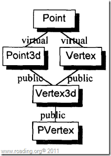

根据c++ 语法，Point 的初始化应有most-derived class来施行。也就是说当Vertex3d为most-derived class的时候，应当由它的构造函数来调用Point的构造函数初始化Point子对象，Vertex3d的子对象的构造函数对于Point的调用则应当抑制。如果没有抑制会怎么样?当我们定义`Vertex3d cv;`时，Vertex3d的构造函数中调用Point的构造函数、而随之调用它的子对象，Point3d和Vertex的构造函数中也调用了Point的构造函数。先不说，对于同一个子对象进行三次初始化是否有效率，更重要的是，这将不可避免的带来错误。由Vertex3d指定的子对象Point的值，会被覆盖掉。

编译器通常使用一个条件变量来表示是否为most-derived class,各构造函数根据这个条件变量来决定是否调用虚基类的构造函数，因此通过控制这个条件变量，就可以抑制非most-derived class调用虚基类的构造函数。当然也有其它的方法来做同样的事。

##### 对象复制语意学

设计一个类，并考虑到要以一个对象指定给另一个对象时，有三种选择：

* 什么都不做，采用编译器提供默认行为（bitwise copy或者由编译器合成一个）。
* 自己提供一个赋值运算符操作。
* 明确拒绝将一个对象指定给另一个对象。

对于第三点，只要将赋值操作符声明为private，且不定义它就可以了。对于第二点，只有在第一点的行为不安全或不正确，或你特别想往其中插入点东西的时候。


以下四种情况 copy assignment operator(还是用它的英文名，感觉顺畅点)，不具有bitwise copy语意，也就是说这些情况下，编译器要合成copy assignment operator而不能依靠bitwise copy来完成赋值操作，这四种情况与构造函数、[拷贝构造函数](http://www.roading.org/develop/cpp/%E6%8B%B7%E8%B4%9D%E6%9E%84%E9%80%A0%E5%87%BD%E6%95%B0%EF%BC%88copy-constuctor%EF%BC%89.html)的情况类似，原因可以参考它们的。四种情况如下：

* 类包含有定义了copy assignment operator的class object成员。
* 类的基类有copy assignment operator。
* 类声明有任何虚函数的时候（问题同样会出现在由继承类对象向基类对象拷贝的时候）。
* 当class继承体系中有虚基类时。

在虚拟继承情况下，copy assignment opertator会遇到一个不可避免的问题，virtual base class subobject的复制行为会发生多次，与前面说到的在虚拟继承情况下虚基类被构造多次是一个意思，不同的是在这里不能抑制非most-derived class对virtual base class 的赋值行为。

安全的做法是把虚基类的赋值放在最后，避免被覆盖。

##### 对象析构语意学

只有在基类拥有析构函数，或者object member拥有析构函数的时候，编译器才为类合成析构函数，否则都被视为不需要。  

析构的顺序正好与构造相反：

* 本身的析构函数被执行。
* 以声明的相反顺序调用member object 的析构函数，如果有的话。
* 重设vptr 指向适当的基类的虚函数表，如果有的话。
* 以声明相反的顺序调用上一层的析构函数，如果有的话。
* 如果当前类是 most-derived class，那么以构造的相反顺序调用虚基类的析构函数。

> “在此之前”的叙述并不适合我，我喜欢很直白的方式，按顺序来。书中的方式在于，从最浅显的步骤入手，然后告诉你，做这步之前，你还该做点什么。

所以，我以对原文的理解写下这点。Lippman的原文为：

> These constructors, however, may be invoked if, and only if, the class object represents the “most-derived class.” Some mechanism supporting this must be put into place.

侯捷的译文为：

> 如果class object是最底层（most-derived）的class,其constructors可能被调用；某些用以支持这个行为的机制必须被放进来。

我认为，Lippman在这一句上要说的是，虚基类的构造函数只能由most-derived class调用，而为了支持这一机制，需要插入一些代码来抑制非most-derived class对虚基类构造函数的调用。同时说一点，5.4的标题个人以为应该译为“对象的效率”而非“对象的功能”——原标题为：Object Efficency。

### 对象的构造和析构

一般而言，构造函数被安插在对象的定义处，而析构函数被安插在对象生命周期结束前：

     
```cpp
// Pseudo C++ Code 
{ 
  Point point; 
  // point.Point::Point() 一般被安插在这儿 
  ... 
  // point.Point::~Point() 一般被安插在这儿 
}
```

当代码有一个以上的离开点的时候，析构函数则必须放在对象被构造之后的每一个离开点之前。因此，尽可能将对象定义在接近要使用的地方，可以减少不必要的构造对象和析构对象的代码被插入到自己的代码当中。

#### 全局对象

一个全局对象，c++保证它在`main()`在第一次使用它之前将其构造，而在`main()`结束之前，将之析构掉。C规定一个全局对象只能被一个常量表达式(编译期可知)赋初值。而构造函数显然不是一个常量表达式。虽然全局对象在编译期被即被置为0，但真正的构造工作却需要直到程序激活后才能进行，而这个过程就是所谓的静态初始化。我是这样理解，但我不保证正确，因为全局变量，被放在data segment (数据段)，data segment是在编译期已经布置好的，但构造函数的结果在编译期不能评估，因此先将对象的内容设置为0，存储在数据段，而等到程序激活时，这时候就可以通过构造函数对在数据段的全局对象进行初始化了，而这就是所谓的静态初始化。

静态初始化的对象有一些缺点：如果构造函数支持异常机制，那么遗憾的是对象的构造函数的调用，无法被放置与try块中，我们知道一个没有得到catch的异常默认的调用`terminate()`函数。也就是说一个全局对象在构造过程中抛出异常，将导致程序的终结，而更悲剧的是，你还无法来捕获并处理这个异常。另一点在于，在不同文件中定义的全局变量，构造顺序有规则吗？我不知道。即使有规则，如果不同的构造顺序对程序有影响的话，那么有多琐碎复杂…

Lippman甚至建议：根本就不要使用那些需要静态初始化的全局对象。真的非要一个全局对象，而且这个对象还需要静态初始化？那么我的方法是，用一个函数封装一个静态局部对象，也是一样的效果嘛。

#### 局部静态对象(Local Static Object)

下面一段代码：

     
```cpp
const Matrix&  identity()
{  
    static Matrix mat_identity;  
    // ...  
    return mat_identity;  
}
```

因为静态语意保证了 mat_identity 在整个程序周期都存在，而不会在函数`identity()`退出时被析构，所以：

* mat_identity的构造函数只能被施行一次，虽然identity()可以被调用多次。
* mat_identity 的析构函数只能被施行一次，虽然identity()可以被调用多次。


那么 mat_identity的构造函数和析构函数到底在什么时候被调用？答案是:  

mat_identity的构造函数只有在第一次被调用时在被施行，而在整个程序退出之时按构造相反的顺序析构局部静态对象。

#### 对象数组(Array of Objects)

对于定义一个普通的数组，例如：

     
```cpp
Point knots[ 10 ];
```

实际上背后做的工作则是：

1. 分配充足的内存以存储10个Point元素；
2. 为每个Point元素调用它们的默认构造函数(如果有的话，且不论是合成的还是显式定义的)。编译器一般以一个或多个函数来完成这个任务。当数组的生命周期结束的时候，则要逐一调用析构函数，然后回收内存，编译器同样一个或多个函数来完成任务。这些函数完成什么功能，大概都能猜得出来。而关于细节，不必要死扣了，每个编译器肯定都有些许差别。

### 模板二事

#### 模板的实例化

一个模板只有被使用到，才会被实例化，否则不会被实例化。对于一个实例化后的模板来说，未被调用的成员函数将不会被实例化，只有成员函数被使用时，C++标准才要求实例化他们。其原因，有两点：

* 空间和时间效率的考虑，如果模板类中有100个成员函数，对某个特定类型只有2个函数会被使用，针对另一个特定类型只会使用3个，那么如果将剩余的195个函数实例化将浪费大量的时间和空间。
* 使模板有最大的适用性。并不是实例化出来的每个类型都支持所有模板的全部成员函数所需要的运算符。如果只实例化那些真正被使用的成员函数的话，那么原本在编译期有错误的类型也能够得到支持。  

可以明确的要求在一个文件中将整个类模板实例化：  
`template class Point3d<float>;`  
也可以显示指定实例化一个模板类的成员函数：  
`template float Point3d<float>::X() const;`  
或是针对一个模板函数：

     
```cpp
template Point3d<float> operator+(
    const Point3d<float>&, const Point3d<float>& );
```

模板的错误报告，使用模板并遇到错误的大概都深有体会，那就是一个灾难。

#### 模板的名称决议

一开始先要区分两种意义,一种是C++ 标准所谓的“scope of the templatedefinition”，直译就是“定义模板的范围”。另一种是C++标准所谓的“scope ofthe temlate
instantiation”，可以直译为“实例化模板的范围”。  

第一种情况：

```cpp     
//// scope of the template definition
extern double foo ( double ); 

template < class type > 
class ScopeRules 
{ 
public: 
 void invariant() { 
 _member = foo( _val ); 
 } 

 type type_dependent() { 
 return foo( _member ); 
 } 
 // ... 
private: 
 int _val; 
 type _member; 
};
```


第二种情况:

     
```cpp
//scope of the template instantiation 
extern int foo( int ); 
// ... 
ScopeRules< int > sr0; 
sr0.invariant();
sr0.type_dependent();
```
在“scope of the template instantiation ”中 两个foo()都声明在此scope中。猜猜sr0.invariant() 中调用的是哪个foo()函数，出乎意料，实际调用的是：


```cpp
extern double foo ( double );
```


看上去，应该调用：  

```cpp
extern int foo( int );
```


毕竟，_val 的类型是 int 类型，它们才完全匹配。而 sr0.type_dependent()中调用的却在我们意料之中，调用的是:  

```cpp
extern int foo( int );
```

诸上所述,看上去或合理或不合理的选择，原因在于:

> template 之中， 对于一个非成员名字的决议结果是根据这个name的使用是否与“用以实例化该模板的参数类型”有关来决定name。如果其使用互不相干，那么就以“scope of the template dclaration”来决定name。如果其使用的互相关联，那么就以“scope of the template instantiation”来决定name.

对于上面这一段话我的理解比较粗鲁且直接：在模板中，一个非成员名字的决议在于它适不适合在当前决议，当它完全与实例化模板的参数的类型无关的时候，就可以在当前决议下来；如果有关的话，则认为不适合在当前决议下来，将被推迟到实例化这个模板实例化的时候来决议。为什么以与实例化的类型相关不相关来区别适不适合当前决议？一个与实例化类型无关的名字，如果推迟到实例化的时候来决议，将使模板的设计者无所适从，一个模板的设计者能容忍一个与实例化类型无关的名字在他的模板中表现出当前不具有的含义吗？当然不行，那种场面，估计没有一个模板设计者能够hold住。相反，对于一个与实例化类型有关的名字，天生就应该可以根据实例化模板的不同类型表现出不同含义，如果其名字早在模板定义时被决议出来，那就该轮到模板的使用者hold不住了。当然所上完全属一家之言，呸，连一家之言都不算，怎么敢自称“家”。如有不同理解，可当我一派胡言，如果你聊发善心，可以对我赐教一二，当聆听受教。

##### 异常处理(Exception Handling)

C++的 exception handling 有三个主要的子句组成：

* 一个throw子句。它在程序的某处丢出一个exception，被丢出的exception可以是内建类型，也可以是自定义类型。——抛出exception组件。
* 一个或多个 catch 子句。 每一个 catch 子句都是一个 exception handler。每个子句可以处理一种类型(也包括其继承类)的exception，在大括号中包含处理代码。——专治各种不服组件。每一个catch子句都可以用来处理某种exception。
* 一个 try 区段。用大括号包围一系列语句，这些语句有可能抛出exception，从而引发catch 子句的作用。——逮捕各种 exception 组件。

当一个 exception 被抛出后，控制权从函数调用中被释放，寻找一个吻合的catch子句，如果各层调用都没有吻合的catch子句，`terminate()`将被调用。在控制权被放弃后，堆栈中的每一个函数调用也被出栈，这个过程称为unwinding the stack(关于 stack unwinding,可以参考《C++ Primer》第四版之 17.1.2 Stack Unwinding)，在每一个函数被出栈之前,其局部变量会被摧毁。

异常抛出有可能带来一些问题，比方在一块内存的lock和unlock内存之间，或是在new和delete之间的代码抛出了异常，那么将导致本该进行的unlock或delete操作不能进行。解决方法之一是：

     
```cpp
void  mumble( void *arena ) 
{ 
 Point *p; 
 p = new Point; 
 try { 
 smLock( arena ); 
 // ... 
 } 
 catch ( ... ) { 
 smUnLock( arena ); 
 delete p; 
 throw; 
 } 
 smUnLock( arena ); 
 delete p; 
}
```
在函数被出栈之前，先截住异常，在unlock和delete之后再将异常原样抛出。new expression的调用不用包括在try块之内是因为，不论在new operator调用时还是构造函数调用时抛出异常，都会在抛出异常之前释放已分配好的资源，所以不用再调用delete 。

另一个办法是，将这些资源管理的问题，封装在一个类对象中，由析构函数释放资源，这样就不需要对代码进行上面那样的处理——利用函数释放控制权之前会析构所有局部对象的原理。

在对单个对象构造过程中抛出异常，会只调用已经构造好的base class object或member classobject的析构函数。同样的道理，适用于数组身上，如果在调用构造函数过程中抛出异常，那么之前所有被构造好的元素的析构函数被调用，对于抛出异常的该元素，则遵循关于单个对象构造的原则，然后释放已经分配好的内存。

只有在一个catch子句评估完毕并且知道它不会再抛出exception后，真正的exception object才会被释放。关于catch子句使用引用还是使用对象来捕获异常，省略。

#### 执行期类型识别（Runtime Type Identification RTTI）

1. RTTI 只支持多态类，也就是说没有定义虚函数是的类是不能进行 RTTI的。
2. 对指针进行`dynamic_cast`失败会返回NULL ,而对引用的话，识别会抛出`bad_cast exception`。
3. typeid 可以返回`const type_info&`，用以获取类型信息。

关于1是因为RTTI的实现是通过vptr来获取存储在虚函数表中的`type_info*` ，事实上为非多态类提供RTTI,也没有多大意义。2的原因在于指针可以被赋值为0，以表示 no object，但是引用不行。关于3，虽然第一点指出RTTI只支持多态类，但`typeid`和`type_info`同样可用于内建类型及所有非多态类。与多态类的差别在于，非多态类的`type_info`对象是静态取得(所以不能叫“执行期类型识别”)，而多态类的是在执行期获得。

### 参考：

* 《深度探索C++对象模型》 侯捷译
