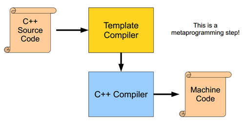
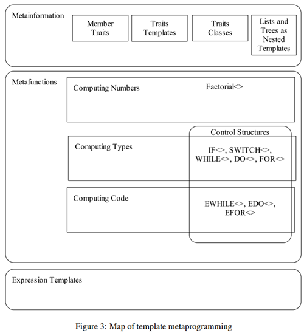
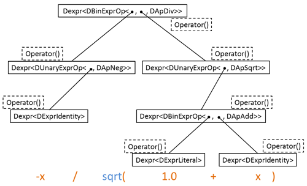
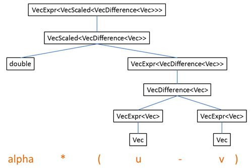

 
<!--BEGIN_DATA
{
    "create_date": "2020-12-23 10:10", 
    "modify_date": "2020-12-23 10:10", 
    "is_top": "0", 
    "summary": "C++模板元编程", 
    "tags": "C/C++", 
    "file_name": "C++模板元编程.md"
}
END_DATA-->

#### <p>原文出处：<a href='https://www.cnblogs.com/liangliangh/p/4219879.html' target='blank'>C++模板元编程（C++ template metaprogramming）</a></p>


所谓元编程就是编写直接生成或操纵程序的程序，C++ 模板给 C++ 语言提供了元编程的能力，模板使 C++ 编程变得异常灵活，能实现很多高级动态语言才有的特性（语法上可能比较丑陋，一些历史原因见下文）。一些系统级的代码不可避免的要涉及元编程（如类型计算）。

实验平台：Win7，VS2013 Community，GCC 4.8.3（在线版）

所谓元编程就是编写直接生成或操纵程序的程序，C++ 模板给 C++ 语言提供了元编程的能力，模板使 C++编程变得异常灵活，能实现很多高级动态语言才有的特性（语法上可能比较丑陋，一些历史原因见下文）。普通用户对 C++模板的使用可能不是很频繁，大致限于泛型编程，但一些系统级的代码，尤其是对通用性、性能要求极高的基础库（如 STL、Boost）几乎不可避免的都大量地使用C++ 模板，一个稍有规模的大量使用模板的程序，不可避免的要涉及元编程（如类型计算）。本文就是要剖析 C++ 模板元编程的机制。

下面所给的所有代码，想做实验又懒得打开编译工具？一个[在线运行 C++ 代码的网站（GCC4.8）](http://www.tutorialspoint.com/compile_cpp11_online.php)很好~

（本博文地址：http://www.cnblogs.com/liangliangh/p/4219879.html，转载版本将得不到作者维护）

### 1. C++模板的语法

**函数模板**（function template）和**类模板**（class template）的简单示例如下：
    
```cpp
#include <iostream>

// 函数模板
template<typename T>
bool equivalent(const T& a, const T& b){
    return !(a < b) && !(b < a);
}

// 类模板
template<typename T=int> // 默认参数
class bignumber{
    T _v;
public:
    bignumber(T a) : _v(a) { }
    inline bool operator<(const bignumber& b) const; // 等价于 (const bignumber<T>& b)
};

// 在类模板外实现成员函数
template<typename T>
bool bignumber<T>::operator<(const bignumber& b) const{
    return _v < b._v;
}

int main()
{
    bignumber<> a(1), b(1); // 使用默认参数，"<>"不能省略
    std::cout << equivalent(a, b) << '\n'; // 函数模板参数自动推导
    std::cout << equivalent<double>(1, 2) << '\n';
    std::cin.get();    return 0;
}
```

程序输出如下：

```cpp
1
0
```

关于模板（函数模板、类模板）的**模板参数**（详见文献[1]第3章）：

  * 类型参数（type template parameter），用 typename 或 class 标记；
  * 非类型参数（non-type template parameter）可以是：整数及枚举类型、对象或函数的指针、对象或函数的引用、对象的成员指针，非类型参数是模板实例的常量；
  * 模板型参数（template template parameter），如“template<typename T, template<typename> class A> someclass {};”；
  * 模板参数可以有默认值（函数模板参数默认是从 C++11 开始支持）；
  * 函数模板的和函数参数类型有关的模板参数可以自动推导，类模板参数不存在推导机制；
  * C++11 引入变长模板参数，请见下文。

**模板特例化**（template specialization，又称特例、特化）的简单示例如下：
    
```cpp
// 实现一个向量类
template<typename T, int N>
class Vec{
    T _v[N];
    // ... // 模板通例（primary template），具体实现
};

template<>
class Vec<float, 4>{
    float _v[4];
    // ... // 对 Vec<float, 4> 进行专门实现，如利用向量指令进行加速
};

template<int N>
class Vec<bool, N>{
    char _v[(N+sizeof(char)-1)/sizeof(char)];
    // ... // 对 Vec<bool, N> 进行专门实现，如用一个比特位表示一个bool
};
```

所谓模板特例化即对于通例中的某种或某些情况做单独专门实现，最简单的情况是对每个模板参数指定一个具体值，这成为完全特例化（full specialization），另外，可以限制模板参数在一个范围取值或满足一定关系等，这称为部分特例化（partial specialization），用数学上集合的概念，通例模板参数所有可取的值组合构成全集U，完全特例化对U中某个元素进行专门定义，部分特例化对U的某个真子集进行专门定义。

更多模板特例化的例子如下（参考了文献[1]第44页）：

```cpp
template<typename T, int i> class cp00; // 用于模板型模板参数

// 通例
template<typename T1, typename T2, int i, template<typename, int> class CP>
class TMP;

// 完全特例化
template<>
class TMP<int, float, 2, cp00>;

// 第一个参数有const修饰
template<typename T1, typename T2, int i, template<typename, int> class CP>
class TMP<const T1, T2, i, CP>;

// 第一二个参数为cp00的实例且满足一定关系，第四个参数为cp00
template<typename T, int i>
class TMP<cp00<T, i>, cp00<T, i+10>, i, cp00>;

// 编译错误!，第四个参数类型和通例类型不一致
//template<template<int i> CP>
//class TMP<int, float, 10, CP>;
```

关于模板特例化（详见文献[1]第4章）：

  * 在定义模板特例之前必须已经有模板通例（primary template）的声明；
  * 模板特例并不要求一定与通例有相同的接口，但为了方便使用（体会特例的语义）一般都相同；
  * 匹配规则，在模板实例化时如果有模板通例、特例加起来多个模板版本可以匹配，则依据如下规则：对版本AB，如果 A 的模板参数取值集合是B的真子集，则优先匹配 A，如果 AB 的模板参数取值集合是“交叉”关系（AB 交集不为空，且不为包含关系），则发生编译错误，对于函数模板，用函数重载分辨（overload resolution）规则和上述规则结合并优先匹配非模板函数。

对模板的多个实例，**类型等价**（type equivalence）判断规则（详见文献[2] 13.2.4）：同一个模板（模板名及其参数类型列表构成的模板签名（template signature）相同，函数模板可以重载，类模板不存在重载）且指定的模板实参等价（类型参数是等价类型，非类型参数值相同）。如下例子：

    
```cpp
#include <iostream>

// 识别两个类型是否相同，提前进入模板元编程^_^
template<typename T1, typename T2> // 通例，返回 false
class theSameType       { public: enum { ret = false }; };

template<typename T>               // 特例，两类型相同时返回 true
class theSameType<T, T> { public: enum { ret = true }; };
template<typename T, int i> class aTMP { };

int main(){
    typedef unsigned int uint; // typedef 定义类型别名而不是引入新类型
    typedef uint uint2;
    std::cout << theSameType<unsigned, uint2>::ret << '\n';
    // 感谢 C++11，连续角括号“>>”不会被当做流输入符号而编译错误
    std::cout << theSameType<aTMP<unsigned, 2>, aTMP<uint2, 2>>::ret << '\n';
    std::cout << theSameType<aTMP<int, 2>, aTMP<int, 3>>::ret << '\n';
    std::cin.get(); return 0;
}
```
    
```cpp
1
1
0
```

关于**模板实例化**（template instantiation）（详见文献[4]模板）：

  * 指在编译或链接时生成函数模板或类模板的具体实例源代码，即用使用模板时的实参类型替换模板类型参数（还有非类型参数和模板型参数）；
  * 隐式实例化（implicit instantiation）：当使用实例化的模板时自动地在当前代码单元之前插入模板的实例化代码，模板的成员函数一直到引用时才被实例化；
  * 显式实例化（explicit instantiation）：直接声明模板实例化，模板所有成员立即都被实例化；
  * 实例化也是一种特例化，被称为实例化的特例（instantiated (or generated) specialization）。

隐式实例化时，成员只有被引用到才会进行实例化，这被称为推迟实例化（lazy instantiation），由此可能带来的问题如下面的例子（文献[6]，文献[7]）：

    
```cpp
#include <iostream>

template<typename T>
class aTMP {
public:
    void f1() { std::cout << "f1()\n"; }
    void f2() { std::ccccout << "f2()\n"; } // 敲错键盘了，语义错误：没有 std::ccccout
};

int main(){
    aTMP<int> a;
    a.f1();
    // a.f2(); // 这句代码被注释时，aTMP<int>::f2() 不被实例化，从而上面的错误被掩盖!
    std::cin.get(); return 0;
}
```

所以模板代码写完后最好写个诸如显示实例化的测试代码，更深入一些，可以插入一些模板调用代码使得编译器及时发现错误，而不至于报出无限长的错误信息。另一个例子如下（GCC 4.8 下编译的输出信息，VS2013 编译输出了 500 多行错误信息）：

```cpp
#include <iostream>

// 计算 N 的阶乘 N!
template<int N>
class aTMP{
public:
    enum { ret = N==0 ? 1 : N * aTMP<N-1>::ret }; // Lazy Instantiation，将产生无限递归!
};

int main(){
    std::cout << aTMP<10>::ret << '\n';
    std::cin.get(); return 0;
}
```

```cpp 
sh-4.2## g++ -std=c++11 -o main *.cpp
main.cpp:7:28: error: template instantiation depth exceeds maximum of 900 (use -ftemplate-depth= to increase the maximum) instantiating 'class aTMP<-890>'
    enum { ret = N==0 ? 1 : N * aTMP<N-1>::ret };
                            ^
main.cpp:7:28:   recursively required from 'class aTMP<9>'
main.cpp:7:28:   required from 'class aTMP<10>'
main.cpp:11:23:   required from here
main.cpp:7:28: error: incomplete type 'aTMP<-890>' used in nested name specifier
```

上面的错误是因为，当编译 aTMP<N> 时，并不判断 N==0，而仅仅知道其依赖 aTMP<N-1>（lazy instantiation），从而产生无限递归，纠正方法是使用模板特例化，如下：

    
```cpp
#include <iostream>

// 计算 N 的阶乘 N!
template<int N>
class aTMP{
public:
    enum { ret = N * aTMP<N-1>::ret };
};

template<>
class aTMP<0>{
public:
    enum { ret = 1 };
};

int main(){
    std::cout << aTMP<10>::ret << '\n';
    std::cin.get(); return 0;
}
```

```cpp
3228800
```

关于模板的**编译和链接**（详见文献[1] 1.3、文献[4]模板）：

  * 包含模板编译模式：编译器生成每个编译单元中遇到的所有的模板实例，并存放在相应的目标文件中；链接器合并等价的模板实例，生成可执行文件，要求实例化时模板定义可见，不能使用系统链接器；
  * 分离模板编译模式（使用 export 关键字）：不重复生成模板实例，编译器设计要求高，可以使用系统链接器；
  * 包含编译模式是主流，C++11 已经弃用 export 关键字（对模板引入 extern 新用法），一般将模板的全部实现代码放在同一个头文件中并在用到模板的地方用 #include 包含头文件，以防止出现实例不一致（如下面紧接着例子）；

实例化，编译链接的简单例子如下（参考了文献[1]第10页）：

```cpp    
// file: a.cpp
#include <iostream>

template<typename T>
class MyClass { };
template MyClass<double>::MyClass(); // 显示实例化构造函数 MyClass<double>::MyClass()
template class MyClass<long>;        // 显示实例化整个类 MyClass<long>

template<typename T>
void print(T const& m) { std::cout << "a.cpp: " << m << '\n'; }

void fa() {
    print(1);   // print<int>，隐式实例化
    print(0.1); // print<double>
}

void fb(); // fb() 在 b.cpp 中定义，此处声明

int main(){
    fa();
    fb();
    std::cin.get(); return 0;
}
```
    
```cpp
// file: b.cpp
#include <iostream>

template<typename T>
void print(T const& m) { std::cout << "b.cpp: " << m << '\n'; }

void fb() {
    print('2'); // print<char>
    print(0.1); // print<double>
}
```

```cpp 
a.cpp: 1
a.cpp: 0.1
b.cpp: 2
a.cpp: 0.1
```

上例中，由于 a.cpp 和 b.cpp 中的 print<double> 实例等价（模板实例的二进制代码在编译生成的对象文件 a.obj、b.obj中），故链接时消除了一个（消除哪个没有规定，上面消除了 b.cpp 中的）。

关于 **template、typename、this 关键字**的使用（文献[4]模板，文献[5]）：

  * 依赖于模板参数（template parameter，形式参数，实参英文为 argument）的名字被称为依赖名字（dependent name），C++标准规定，如果解析器在一个模板中遇到一个嵌套依赖名字，它假定那个名字不是一个类型，除非显式用 typename 关键字前置修饰该名字；
  * 和上一条 typename 用法类似，template 用于指明嵌套类型或函数为模板；
  * this 用于指定查找基类中的成员（当基类是依赖模板参数的类模板实例时，由于实例化总是推迟，这时不依赖模板参数的名字不在基类中查找，文献[1]第 166 页）。

一个例子如下（需要 GCC 编译，GCC 对 C++11 几乎全面支持，VS2013 此处总是在基类中查找名字，且函数模板前不需要 template）：

```cpp
#include <iostream>

template<typename T>
class aTMP{
public: 
    typedef const T reType;
};

void f() { std::cout << "global f()\n"; }

template<typename T>
class Base {
public:
    template <int N = 99>
    void f() { std::cout << "member f(): " << N << '\n'; }
};

template<typename T>
class Derived : public Base<T> {
public:
    typename T::reType m; // typename 不能省略
    Derived(typename T::reType a) : m(a) { }
    void df1() { f(); }                       // 调用全局 f()，而非想象中的基类 f()
    void df2() { this->template f(); }        // 基类 f<99>()
    void df3() { Base<T>::template f<22>(); } // 强制基类 f<22>()
    void df4() { ::f(); }                     // 强制全局 f()
};

int main(){
    Derived<aTMP<int>> a(10);
    a.df1(); a.df2(); a.df3(); a.df4();
    std::cin.get(); return 0;
}
```

```cpp 
global f()
member f(): 99
member f(): 22
global f()
```

**C++11 关于模板的新特性**（详见文献[1]第15章，文献[4]C++11）：

  * “>>” 根据上下文自动识别正确语义；
  * 函数模板参数默认值；
  * 变长模板参数（扩展 sizeof...() 获取参数个数）；
  * 模板别名（扩展 using 关键字）；
  * 外部模板实例（拓展 extern 关键字），弃用 export template。

在本文中，如无特别声明将不使用 C++11 的特性（除了 “>>”）。

### 2. 模板元编程概述

如果对 C++ 模板不熟悉（光熟悉语法还不算熟悉），可以先跳过本节，往下看完例子再回来。

C++ 模板最初是为实现泛型编程设计的，但人们发现模板的能力远远不止于那些设计的功能。一个重要的理论结论就是：C++ 模板是**图灵完备**的（Turing-complete），其证明过程请见文献[8]（就是用 C++ 模板模拟图灵机），理论上说 C++模板可以执行任何计算任务，但实际上因为模板是编译期计算，其能力受到具体编译器实现的限制（如递归嵌套深度，C++11 要求至少 1024，C++98 要求至少17）。C++ 模板元编程是“意外”功能，而不是设计的功能，这也是 C++ 模板元编程语法丑陋的根源。

C++ 模板是图灵完备的，这使得 C++ 成为**两层次语言**（two-level languages，中文暂且这么翻译，文献[9]），其中，执行编译计算的代码称为静态代码（static
code），执行运行期计算的代码称为动态代码（dynamic code），C++的静态代码由模板实现（预处理的宏也算是能进行部分静态计算吧，也就是能进行部分元编程，称为宏元编程，见 Boost 元编程库即BCCL，文献[16]和文献[1] 10.4）。

具体来说 C++ 模板可以做以下事情：编译期数值计算、类型计算、代码计算（如循环展开），其中数值计算实际不太有意义，而类型计算和代码计算可以使得代码更加通用，更加易用，性能更好（也更难阅读，更难调试，有时也会有代码膨胀问题）。编译期计算在编译过程中的位置请见下图（取自文献[10]），可以看到关键是模板的机制在编译具体代码（模板实例）前执行：



从编程范型（programming paradigm）上来说，C++ 模板是**函数式编程**（functional programming），它的主要特点是：函数调用不产生任何副作用（没有可变的存储），用递归形式实现循环结构的功能。C++模板的特例化提供了条件判断能力，而模板递归嵌套提供了循环的能力，这两点使得其具有和普通语言一样通用的能力（图灵完备性）。

从**编程形式**来看，模板的“<>”中的模板参数相当于函数调用的输入参数，模板中的 typedef 或 static const 或 enum定义函数返回值（类型或数值，数值仅支持整型，如果需要可以通过编码计算浮点数），代码计算是通过类型计算进而选择类型的函数实现的（C++属于静态类型语言，编译器对类型的操控能力很强）。代码示意如下：

    
```cpp
#include <iostream>

template<typename T, int i=1>
class someComputing {
public:
    typedef volatile T* retType; // 类型计算
    enum { retValume = i + someComputing<T, i-1>::retValume }; // 数值计算，递归
    static void f() { std::cout << "someComputing: i=" << i << '\n'; }
};

template<typename T> // 模板特例，递归终止条件
class someComputing<T, 0> {
public:
    enum { retValume = 0 };
};

template<typename T>
class codeComputing {
public:
    static void f() { T::f(); } // 根据类型调用函数，代码计算
};

int main(){
    someComputing<int>::retType a=0;
    std::cout << sizeof(a) << '\n'; // 64-bit 程序指针
    // VS2013 默认最大递归深度500，GCC4.8 默认最大递归深度900（-ftemplate-depth=n）
    std::cout << someComputing<int, 500>::retValume << '\n'; // 1+2+...+500
    codeComputing<someComputing<int, 99>>::f();
    std::cin.get(); return 0;
}
```

```cpp 
8
125250
someComputing: i=99
```

C++ 模板元编程**概览框图**如下（取自文献[9]）：



下面我们将对图中的每个框进行深入讨论。

### 3. 编译期数值计算

**第一个 C++ 模板元程序**是 Erwin Unruh 在 1994 年写的（文献[14]），这个程序计算小于给定数 N 的全部素数（又叫质数），程序并不运行（都不能通过编译），而是让编译器在错误信息中显示结果（直观展现了是编译期计算结果，C++ 模板元编程不是设计的功能，更像是在戏弄编译器，当然 C++11 有所改变），由于年代久远，原来的程序用现在的编译器已经不能编译了，下面的代码在原来程序基础上稍作了修改（GCC 4.8 下使用 -fpermissvie，只显示警告信息）：

```cpp    
// Prime number computation by Erwin Unruh
template<int i> struct D { D(void*); operator int(); }; // 构造函数参数为 void* 指针

template<int p, int i> struct is_prime { // 判断 p 是否为素数，即 p 不能整除 2...p-1
    enum { prim = (p%i) && is_prime<(i>2?p:0), i-1>::prim };
};

template<> struct is_prime<0, 0> { enum { prim = 1 }; };
template<> struct is_prime<0, 1> { enum { prim = 1 }; };

template<int i> struct Prime_print {
    Prime_print<i-1> a;
    enum { prim = is_prime<i, i-1>::prim };
    // prim 为真时， prim?1:0 为 1，int 到 D<i> 转换报错；假时， 0 为 NULL 指针不报错
    void f() { D<i> d = prim?1:0; a.f(); } // 调用 a.f() 实例化 Prime_print<i-1>::f()
};

template<> struct Prime_print<2> { // 特例，递归终止
    enum { prim = 1 };
    void f() { D<2> d = prim?1:0; }
};

#ifndef LAST
#define LAST 10
#endif

int main() {
    Prime_print<LAST> a; a.f(); // 必须调用 a.f() 以实例化 Prime_print<LAST>::f()
}
```cpp

```cpp
sh-4.2## g++ -std=c++11 -fpermissive -o main *.cpp
main.cpp: In member function 'void Prime_print<2>::f()':
main.cpp:17:33: warning: invalid conversion from 'int' to 'void*' [-fpermissive]
    void f() { D<2> d = prim ? 1 : 0; }
                                    ^
**main.cpp:2:28: warning:   initializing argument 1 of 'D<i>::D(void*) [with int i = 2]' [-fpermissive]**
    template<int i> struct D { D(void*); operator int(); };
                            ^
main.cpp: In instantiation of 'void Prime_print<i>::f() [with int i = 7]':
main.cpp:13:36:   recursively required from 'void Prime_print<i>::f() [with int i = 9]'
main.cpp:13:36:   required from 'void Prime_print<i>::f() [with int i = 10]'
main.cpp:25:27:   required from here
main.cpp:13:33: warning: invalid conversion from 'int' to 'void*' [-fpermissive]
    void f() { D<i> d = prim ? 1 : 0; a.f(); }
                                    ^
**main.cpp:2:28: warning:   initializing argument 1 of 'D<i>::D(void*) [with int i = 7]' [-fpermissive]**
    template<int i> struct D { D(void*); operator int(); };
                            ^
main.cpp: In instantiation of 'void Prime_print<i>::f() [with int i = 5]':
main.cpp:13:36:   recursively required from 'void Prime_print<i>::f() [with int i = 9]'
main.cpp:13:36:   required from 'void Prime_print<i>::f() [with int i = 10]'
main.cpp:25:27:   required from here
main.cpp:13:33: warning: invalid conversion from 'int' to 'void*' [-fpermissive]
    void f() { D<i> d = prim ? 1 : 0; a.f(); }
                                    ^
**main.cpp:2:28: warning:   initializing argument 1 of 'D<i>::D(void*) [with int i = 5]' [-fpermissive]**
    template<int i> struct D { D(void*); operator int(); };
                            ^
main.cpp: In instantiation of 'void Prime_print<i>::f() [with int i = 3]':
main.cpp:13:36:   recursively required from 'void Prime_print<i>::f() [with int i = 9]'
main.cpp:13:36:   required from 'void Prime_print<i>::f() [with int i = 10]'
main.cpp:25:27:   required from here
main.cpp:13:33: warning: invalid conversion from 'int' to 'void*' [-fpermissive]
    void f() { D<i> d = prim ? 1 : 0; a.f(); }
                                    ^
**main.cpp:2:28: warning:   initializing argument 1 of 'D<i>::D(void*) [with int i = 3]' [-fpermissive]**
    template<int i> struct D { D(void*); operator int(); };
```                          ^

上面的编译输出信息只给出了前一部分，虽然信息很杂，但还是可以看到其中有 10 以内全部素数：2、3、5、7（已经加粗显示关键行）。

到目前为止，虽然已经看到了阶乘、求和等递归数值计算，但都没涉及原理，下面以求和为例讲解 C++ 模板编译期数值计算的原理：

    
```cpp
#include <iostream>

template<int N>
class sumt{
public: 
    static const int ret = sumt<N-1>::ret + N;
};

template<>
class sumt<0>{
public: 
    static const int ret = 0;
};

int main() {
    std::cout << sumt<5>::ret << '\n';
    std::cin.get(); return 0;
}
```
    
```cpp
15
```

当编译器遇到 sumt<5> 时，试图实例化之，sumt<5> 引用了 sumt<5-1> 即 sumt<4>，试图实例化 sumt<4>，以此类推，直到sumt<0>，sumt<0> 匹配模板特例，sumt<0>::ret 为 0，sumt<1>::ret 为 sumt<0>::ret+1 为1，以此类推，sumt<5>::ret 为 15。值得一提的是，虽然对用户来说程序只是输出了一个编译期常量sumt<5>::ret，但在背后，编译器其实至少处理了 sumt<0> 到 sumt<5> 共 6 个类型。

从这个例子我们也可以窥探 C++ 模板元编程的函数式编程范型，对比结构化求和程序：for(i=0,sum=0; i<=N; ++i) sum+=i; 用逐步改变存储（即变量 sum）的方式来对计算过程进行编程，模板元程序没有可变的存储（都是编译期常量，是不可变的变量），要表达求和过程就要用很多个常量：sumt<0>::ret，sumt<1>::ret，...，sumt<5>::ret 。函数式编程看上去似乎效率低下（因为它和数学接近，而不是和硬件工作方式接近），但有自己的优势：描述问题更加简洁清晰（前提是熟悉这种方式），没有可变的变量就没有数据依赖，方便进行并行化。

### 4. 模板下的控制结构

模板实现的条件 **if 和 while 语句**如下（文献[9]）：

```cpp
// 通例为空，若不匹配特例将报错，很好的调试手段（这里是 bool 就无所谓了）
template<bool c, typename Then, typename Else> class IF_ { };
template<typename Then, typename Else>
class IF_<true, Then, Else> { public: typedef Then reType; };
template<typename Then, typename Else>
class IF_<false,Then, Else> { public: typedef Else reType; };
// 隐含要求： Condition 返回值 ret，Statement 有类型 Next
template<template<typename> class Condition, typename Statement>
class WHILE_ {
    template<typename Statement> class STOP { public: typedef Statement reType; };
public:
    typedef typename
        IF_<Condition<Statement>::ret,
        WHILE_<Condition, typename Statement::Next>,
        STOP<Statement>>::reType::reType
    reType;
};
```

IF_<> 的使用示例见下面：

```cpp    
const int len = 4;
typedef
    IF_<sizeof(short)==len, short,
    IF_<sizeof(int)==len, int,
    IF_<sizeof(long)==len, long,
    IF_<sizeof(long long)==len, long long,
    void>::reType>::reType>::reType>::reType
int_my; // 定义一个指定字节数的类型
std::cout << sizeof(int_my) << '\n';
```

```cpp
4
```

WHILE_<> 的使用示例见下面：

```cpp    
// 计算 1^e+2^e+...+n^e
template<int n, int e>
class sum_pow {
    template<int i, int e> class pow_e{ public: enum{ ret=i*pow_e<i,e-1>::ret }; };
    template<int i> class pow_e<i,0>{ public: enum{ ret=1 }; };
    // 计算 i^e，嵌套类使得能够定义嵌套模板元函数，private 访问控制隐藏实现细节
    template<int i> class pow{ public: enum{ ret=pow_e<i,e>::ret }; };
    template<typename stat>
    class cond { public: enum{ ret=(stat::ri<=n) }; };
    template<int i, int sum>
    class stat { public: typedef stat<i+1, sum+pow<i>::ret> Next;
                            enum{ ri=i, ret=sum }; };
public:
    enum{ ret = WHILE_<cond, stat<1,0>>::reType::ret };
};

int main() {
    std::cout << sum_pow<10, 2>::ret << '\n';
    std::cin.get(); return 0;
}
```

```cpp 
385
```

为了展现编译期数值计算的强大能力，下面是一个更复杂的计算：最大公约数（Greatest Common Divisor，GCD）和最小公倍数（Lowest Common Multiple，LCM），经典的辗转相除算法：

```cpp
// 最小公倍数，普通函数
int lcm(int a, int b){
    int r, lcm=a*b;
    while(r=a%b) { a = b; b = r; } // 因为用可变的存储，不能写成 a=b; b=a%b;
    return lcm/b;
}

// 递归函数版本
int gcd_r(int a, int b) { return b==0 ? a : gcd_r(b, a%b); } // 简洁
int lcm_r(int a, int b) { return a * b / gcd_r(a,b); }

// 模板版本
template<int a, int b>
class lcm_T{
    template<typename stat>
    class cond { public: enum{ ret=(stat::div!=0) }; };
    template<int a, int b>
    class stat { public: typedef stat<b, a%b> Next; enum{ div=a%b, ret=b }; };
    static const int gcd = WHILE_<cond, stat<a,b>>::reType::ret;
public:
    static const int ret = a * b / gcd;
};

// 递归模板版本
template<int a, int b>
class lcm_T_r{
    template<int a, int b> class gcd { public: enum{ ret = gcd<b,a%b>::ret }; };
    template<int a> class gcd<a, 0> { public: enum{ ret = a }; };
public:
    static const int ret = a * b / gcd<a,b>::ret;
};

int main() {
    std::cout << lcm(100, 36) << '\n';
    std::cout << lcm_r(100, 36) << '\n';
    std::cout << lcm_T<100, 36>::ret << '\n';
    std::cout << lcm_T_r<100, 36>::ret << '\n';
    std::cin.get(); return 0;
}
```

```cpp    
900
900
900
900
```

上面例子中，定义一个类的整型常量，可以用 enum，也可以用 static const int，需要注意的是 enum 定义的常量的字节数不会超过sizeof(int) （文献[2]）。


### 5. 循环展开

文献[11]展示了一个**循环展开**（loop unrolling）的例子 -- 冒泡排序：

```cpp
#include <utility>  // std::swap

// dynamic code, 普通函数版本
void bubbleSort(int* data, int n)
{
    for(int i=n-1; i>0; --i) {
        for(int j=0; j<i; ++j)
            if (data[j]>data[j+1]) std::swap(data[j], data[j+1]);
    }
}

// 数据长度为 4 时，手动循环展开
inline void bubbleSort4(int* data)
{
#define COMP_SWAP(i, j) if(data[i]>data[j]) std::swap(data[i], data[j])
    COMP_SWAP(0, 1); COMP_SWAP(1, 2); COMP_SWAP(2, 3);
    COMP_SWAP(0, 1); COMP_SWAP(1, 2);
    COMP_SWAP(0, 1);
}

// 递归函数版本，指导模板思路，最后一个参数是哑参数（dummy parameter），仅为分辨重载函数
class recursion { };
void bubbleSort(int* data, int n, recursion)
{
    if(n<=1) return;
    for(int j=0; j<n-1; ++j) if(data[j]>data[j+1]) std::swap(data[j], data[j+1]);
    bubbleSort(data, n-1, recursion());
}

// static code, 模板元编程版本
template<int i, int j>
inline void IntSwap(int* data) { // 比较和交换两个相邻元素
    if(data[i]>data[j]) std::swap(data[i], data[j]);
}

template<int i, int j>
inline void IntBubbleSortLoop(int* data) { // 一次冒泡，将前 i 个元素中最大的置换到最后
    IntSwap<j, j+1>(data);
    IntBubbleSortLoop<j<i-1?i:0, j<i-1?(j+1):0>(data);
}

template<>
inline void IntBubbleSortLoop<0, 0>(int*) { }

template<int n>
inline void IntBubbleSort(int* data) { // 模板冒泡排序循环展开
    IntBubbleSortLoop<n-1, 0>(data);
    IntBubbleSort<n-1>(data);
}

template<>
inline void IntBubbleSort<1>(int* data) { }
```

对循环次数固定且比较小的循环语句，对其进行展开并内联可以避免函数调用以及执行循环语句中的分支，从而可以提高性能，对上述代码做如下测试，代码在 VS2013的 Release 下编译运行：

```cpp
#include <iostream>
#include <omp.h>
#include <string.h> // memcpy

int main() {
    double t1, t2, t3; const int num=100000000;
    int data[4]; int inidata[4]={3,4,2,1};
    t1 = omp_get_wtime();
    for(int i=0; i<num; ++i) { memcpy(data, inidata, 4); bubbleSort(data, 4); }
    t1 = omp_get_wtime()-t1;
    t2 = omp_get_wtime();
    for(int i=0; i<num; ++i) { memcpy(data, inidata, 4); bubbleSort4(data); }
    t2 = omp_get_wtime()-t2;
    t3 = omp_get_wtime();
    for(int i=0; i<num; ++i) { memcpy(data, inidata, 4); IntBubbleSort<4>(data); }
    t3 = omp_get_wtime()-t3;
    std::cout << t1/t3 << '\t' << t2/t3 << '\n';
    std::cin.get(); return 0;
}
```

```cpp 
2.38643 0.926521
```

上述结果表明，模板元编程实现的循环展开能够达到和手动循环展开相近的性能（90% 以上），并且性能是循环版本的 2 倍多（如果扣除 memcpy函数占据的部分加速比将更高，根据 Amdahl 定律）。这里可能有人会想，既然循环次数固定，为什么不直接手动循环展开呢，难道就为了使用模板吗？当然不是，有时候循环次数确实是编译期固定值，但对用户并不是固定的，比如要实现数学上向量计算的类，因为可能是 2、3、4 维，所以写成模板，把维度作为 int 型模板参数，这时因为不知道具体是几维的也就不得不用循环，不过因为维度信息在模板实例化时是编译期常量且较小，所以编译器很可能在代码优化时进行循环展开，但我们想让这一切发生的更可控一些。

上面用三个函数模板 IntSwap<>()、 IntBubbleSortLoop<>()、 IntBubbleSort<>()来实现一个排序功能，不但显得分散（和封装原理不符），还暴露了实现细节，我们可以仿照上一节的代码，将 IntBubbleSortLoop<>()、IntBubbleSort<>() 嵌入其他模板内部，因为函数不允许嵌套，我们只能用类模板：

```cpp
// 整合成一个类模板实现，看着好，但引入了 代码膨胀
template<int n>
class IntBubbleSortC {
    template<int i, int j>
    static inline void IntSwap(int* data) { // 比较和交换两个相邻元素
        if(data[i]>data[j]) std::swap(data[i], data[j]);
    }
    template<int i, int j>
    static inline void IntBubbleSortLoop(int* data) { // 一次冒泡
        IntSwap<j, j+1>(data);
        IntBubbleSortLoop<j<i-1?i:0, j<i-1?(j+1):0>(data);
    }
    template<>
    static inline void IntBubbleSortLoop<0, 0>(int*) { }
public:
    static inline void sort(int* data) {
        IntBubbleSortLoop<n-1, 0>(data);
        IntBubbleSortC<n-1>::sort(data);
    }
};

template<>
class IntBubbleSortC<0> {
public:
    static inline void sort(int* data) { }
};

int main() {
    int data[4] = {3,4,2,1};
    IntBubbleSortC<4>::sort(data); // 如此调用
    std::cin.get(); return 0;
}
```

上面代码看似很好，不仅整合了代码，借助类成员的访问控制，还隐藏了实现细节。不过它存在着很大问题，如果实例化 IntBubbleSortC<4>、IntBubbleSortC<3>、 IntBubbleSortC<2>，将实例化成员函数 IntBubbleSortC<4>::IntSwap<0, 1>()、 IntBubbleSortC<4>::IntSwap<1, 2>()、 IntBubbleSortC<4>::IntSwap<2, 3>()、IntBubbleSortC<3>::IntSwap<0, 1>()、 IntBubbleSortC<3>::IntSwap<1, 2>()、IntBubbleSortC<2>::IntSwap<0, 1>()，而在原来的看着分散的代码中 IntSwap<0, 1>()只有一个。这将导致**代码膨胀**（code bloat），即生成的可执行文件体积变大（代码膨胀另一含义是源代码增大，见文献[1]第11章）。不过这里使用了内联（inline），如果编译器确实内联展开代码则不会导致代码膨胀（除了循环展开本身会带来的代码膨胀），但因为重复编译原本可以复用的模板实例，会增加编译时间。在上一节的例子中，因为只涉及编译期常量计算，并不涉及函数（函数模板，或类模板的成员函数，函数被编译成具体的机器二进制代码），并不会出现代码膨胀。

为了清晰证明上面的论述，我们去掉所有 inline 并将函数实现放到类外面（类里面实现的成员函数都是内联的，因为函数实现可能被包含多次，见文献[2]10.2.9，不过现在的编译器优化能力很强，很多时候加不加 inline并不影响编译器自己对内联的选择...），分别编译分散版本和类模板封装版本的冒泡排序代码编译生成的目标文件（VS2013 下是 .obj文件）的大小，代码均在 VS2013 Debug 模式下编译（防止编译器优化），比较 main.obj （源文件是 main.cpp）大小。

类模板封装版本代码如下，注意将成员函数在外面定义的写法：

```cpp
#include <iostream>
#include <utility>  // std::swap

// 整合成一个类模板实现，看着好，但引入了 代码膨胀
template<int n>
class IntBubbleSortC {
    template<int i, int j> static void IntSwap(int* data);
    template<int i, int j> static void IntBubbleSortLoop(int* data);
    template<> static void IntBubbleSortLoop<0, 0>(int*) { }
public:
    static void sort(int* data);
};

template<>
class IntBubbleSortC<0> {
public:
    static void sort(int* data) { }
};

template<int n> template<int i, int j>
void IntBubbleSortC<n>::IntSwap(int* data) {
    if(data[i]>data[j]) std::swap(data[i], data[j]);
}

template<int n> template<int i, int j>
void IntBubbleSortC<n>::IntBubbleSortLoop(int* data) {
    IntSwap<j, j+1>(data);
    IntBubbleSortLoop<j<i-1?i:0, j<i-1?(j+1):0>(data);
}

template<int n>
void IntBubbleSortC<n>::sort(int* data) {
    IntBubbleSortLoop<n-1, 0>(data);
    IntBubbleSortC<n-1>::sort(data);
}

int main() {
    int data[40] = {3,4,2,1};
    IntBubbleSortC<2>::sort(data);  IntBubbleSortC<3>::sort(data);
    IntBubbleSortC<4>::sort(data);  IntBubbleSortC<5>::sort(data);
    IntBubbleSortC<6>::sort(data);  IntBubbleSortC<7>::sort(data);
    IntBubbleSortC<8>::sort(data);  IntBubbleSortC<9>::sort(data);
    IntBubbleSortC<10>::sort(data); IntBubbleSortC<11>::sort(data);
#if 0
    IntBubbleSortC<12>::sort(data); IntBubbleSortC<13>::sort(data);
    IntBubbleSortC<14>::sort(data); IntBubbleSortC<15>::sort(data);
    IntBubbleSortC<16>::sort(data); IntBubbleSortC<17>::sort(data);
    IntBubbleSortC<18>::sort(data); IntBubbleSortC<19>::sort(data);
    IntBubbleSortC<20>::sort(data); IntBubbleSortC<21>::sort(data);
    IntBubbleSortC<22>::sort(data); IntBubbleSortC<23>::sort(data);
    IntBubbleSortC<24>::sort(data); IntBubbleSortC<25>::sort(data);
    IntBubbleSortC<26>::sort(data); IntBubbleSortC<27>::sort(data);
    IntBubbleSortC<28>::sort(data); IntBubbleSortC<29>::sort(data);
    IntBubbleSortC<30>::sort(data); IntBubbleSortC<31>::sort(data);
#endif
    std::cin.get(); return 0;
}
```

分散定义函数模板版本代码如下，为了更具可比性，也将函数放在类里面作为成员函数：

```cpp    
#include <iostream>
#include <utility>  // std::swap

// static code, 模板元编程版本
template<int i, int j>
class IntSwap {
public: static void swap(int* data);
};

template<int i, int j>
class IntBubbleSortLoop {
public: static void loop(int* data);
};

template<>
class IntBubbleSortLoop<0, 0> {
public: static void loop(int* data) { }
};

template<int n>
class IntBubbleSort {
public: static void sort(int* data);
};

template<>
class IntBubbleSort<0> {
public: static void sort(int* data) { }
};

template<int i, int j>
void IntSwap<i, j>::swap(int* data) {
    if(data[i]>data[j]) std::swap(data[i], data[j]);
}

template<int i, int j>
void IntBubbleSortLoop<i, j>::loop(int* data) {
    IntSwap<j, j+1>::swap(data);
    IntBubbleSortLoop<j<i-1?i:0, j<i-1?(j+1):0>::loop(data);
}

template<int n>
void IntBubbleSort<n>::sort(int* data) {
    IntBubbleSortLoop<n-1, 0>::loop(data);
    IntBubbleSort<n-1>::sort(data);
}

int main() {
    int data[40] = {3,4,2,1};
    IntBubbleSort<2>::sort(data);  IntBubbleSort<3>::sort(data);
    IntBubbleSort<4>::sort(data);  IntBubbleSort<5>::sort(data);
    IntBubbleSort<6>::sort(data);  IntBubbleSort<7>::sort(data);
    IntBubbleSort<8>::sort(data);  IntBubbleSort<9>::sort(data);
    IntBubbleSort<10>::sort(data); IntBubbleSort<11>::sort(data);
#if 0
    IntBubbleSort<12>::sort(data); IntBubbleSort<13>::sort(data);
    IntBubbleSort<14>::sort(data); IntBubbleSort<15>::sort(data);
    IntBubbleSort<16>::sort(data); IntBubbleSort<17>::sort(data);
    IntBubbleSort<18>::sort(data); IntBubbleSort<19>::sort(data);
    IntBubbleSort<20>::sort(data); IntBubbleSort<21>::sort(data);
    IntBubbleSort<22>::sort(data); IntBubbleSort<23>::sort(data);
    IntBubbleSort<24>::sort(data); IntBubbleSort<25>::sort(data);
    IntBubbleSort<26>::sort(data); IntBubbleSort<27>::sort(data);
    IntBubbleSort<28>::sort(data); IntBubbleSort<29>::sort(data);
    IntBubbleSort<30>::sort(data); IntBubbleSort<31>::sort(data);
#endif
    std::cin.get(); return 0;
}
```

程序中条件编译都未打开时（#if 0），main.obj 大小分别为 264 KB 和 211 KB，条件编译打开时（#if 1），main.obj大小分别为 1073 KB 和 620 KB。可以看到，类模板封装版的对象文件不但绝对大小更大，而且增长更快，这和之前分析是一致的。

### 6. 表达式模板，向量运算

文献[12]展示了一个**表达式模板**（Expression Templates）的例子：

```cpp
#include <iostream> // std::cout
#include <cmath>    // std::sqrt()

// 表达式类型
class DExprLiteral {                    // 文字量
    double a_;
public:
    DExprLiteral(double a) : a_(a) { }
    double operator()(double x) const { return a_; }
};

class DExprIdentity {                   // 自变量
public:
    double operator()(double x) const { return x; }
};

template<class A, class B, class Op>    // 双目操作
class DBinExprOp {
    A a_; B b_;
public:
    DBinExprOp(const A& a, const B& b) : a_(a), b_(b) { }
    double operator()(double x) const { return Op::apply(a_(x), b_(x)); }
};

template<class A, class Op>             // 单目操作
class DUnaryExprOp {
    A a_;
public:
    DUnaryExprOp(const A& a) : a_(a) { }
    double operator()(double x) const { return Op::apply(a_(x)); }
};

// 表达式
template<class A>
class DExpr {
    A a_;
public:
    DExpr() { }
    DExpr(const A& a) : a_(a) { }
    double operator()(double x) const { return a_(x); }
};

// 运算符，模板参数 A、B 为参与运算的表达式类型
// operator /, division
class DApDiv { public: static double apply(double a, double b) { return a / b; } };

template<class A, class B> DExpr<DBinExprOp<DExpr<A>, DExpr<B>, DApDiv> >
operator/(const DExpr<A>& a, const DExpr<B>& b) {
    typedef DBinExprOp<DExpr<A>, DExpr<B>, DApDiv> ExprT;
    return DExpr<ExprT>(ExprT(a, b));
}

// operator +, addition
class DApAdd { public: static double apply(double a, double b) { return a + b; } };

template<class A, class B> DExpr<DBinExprOp<DExpr<A>, DExpr<B>, DApAdd> >
operator+(const DExpr<A>& a, const DExpr<B>& b) {
    typedef DBinExprOp<DExpr<A>, DExpr<B>, DApAdd> ExprT;
    return DExpr<ExprT>(ExprT(a, b));
}

// sqrt(), square rooting
class DApSqrt { public: static double apply(double a) { return std::sqrt(a); } };

template<class A> DExpr<DUnaryExprOp<DExpr<A>, DApSqrt> >
sqrt(const DExpr<A>& a) {
    typedef DUnaryExprOp<DExpr<A>, DApSqrt> ExprT;
    return DExpr<ExprT>(ExprT(a));
}

// operator-, negative sign
class DApNeg { public: static double apply(double a) { return -a; } };

template<class A> DExpr<DUnaryExprOp<DExpr<A>, DApNeg> >
operator-(const DExpr<A>& a) {
    typedef DUnaryExprOp<DExpr<A>, DApNeg> ExprT;
    return DExpr<ExprT>(ExprT(a));
}

// evaluate()
template<class Expr>
void evaluate(const DExpr<Expr>& expr, double start, double end, double step) {
    for(double i=start; i<end; i+=step) std::cout << expr(i) << ' ';
}

int main() {
    DExpr<DExprIdentity> x;
    evaluate( -x / sqrt( DExpr<DExprLiteral>(1.0) + x ) , 0.0, 10.0, 1.0);
    std::cin.get(); return 0;
}
```

```cpp 
-0 -0.707107 -1.1547 -1.5 -1.78885 -2.04124 -2.26779 -2.47487 -2.66667 -2.84605
```

代码有点长（我已经尽量压缩行数），请先看最下面的 main() 函数，表达式模板允许我们以 “-x / sqrt( 1.0 + x )”这种类似数学表达式的方式传参数，在 evaluate() 内部，将 0-10 的数依次赋给自变量 x 对表达式进行求值，这是通过在 template<>DExpr 类模板内部重载 operator() 实现的。我们来看看这一切是如何发生的。

在 main() 中调用 evaluate() 时，编译器根据全局重载的加号、sqrt、除号、负号推断“-x / sqrt( 1.0 + x )” 的类型是Dexpr<DBinExprOp<Dexpr<DUnaryExprOp<Dexpr<DExprIdentity>, DApNeg>>, Dexpr<DUnaryExprOp<Dexpr<DBinExprOp<Dexpr<DExprLiteral>, Dexpr<DExprIdentity>, DApAdd>>, DApSqrt>>, DApDiv>>（即将每个表达式编码到一种类型，设这个类型为ultimateExprType），并用此类型实例化函数模板 evaluate()，类型的推导见下图。在 evaluate() 中，对表达式进行求值expr(i)，调用 ultimateExprType 的 operator()，这引起一系列的 operator() 和 Op::apply()的调用，最终遇到基础类型 “表达式类型” DExprLiteral 和DExprIdentity，这个过程见下图。总结就是，请看下图，从下到上类型推断，从上到下 operator() 表达式求值。



上面代码函数实现写在类的内部，即内联，如果编译器对内联支持的好的话，上面代码几乎等价于如下代码：

```cpp
#include <iostream> // std::cout
#include <cmath>    // std::sqrt()

void evaluate(double start, double end, double step) {
    double _temp = 1.0;
    for(double i=start; i<end; i+=step)
        std::cout << -i / std::sqrt(_temp + i) << ' ';
}

int main() {
    evaluate(0.0, 10.0, 1.0);
    std::cin.get(); return 0;
}
```

```cpp 
-0 -0.707107 -1.1547 -1.5 -1.78885 -2.04124 -2.26779 -2.47487 -2.66667 -2.84605
```

和表达式模板类似的技术还可以用到向量计算中，以避免产生临时向量变量，见文献[4] Expression templates和文献[12]的后面。传统向量计算如下：

```cpp
class DoubleVec; // DoubleVec 重载了 + - * / 等向量元素之间的计算
DoubleVec y(1000), a(1000), b(1000), c(1000), d(1000); // 向量长度 1000
// 向量计算
y = (a + b) / (c - d);
// 等价于
DoubleVec __t1 = a + b;
DoubleVec __t2 = c - d;
DoubleVec __t3 = __t1 / __t2;
y = __t3;
```

模板代码实现向量计算如下：

```cpp    
template<class A> DVExpr;
class DVec{
    // ...
    template<class A>
    DVec& operator=(const DVExpr<A>&); // 由 = 引起向量逐个元素的表达式值计算并赋值
};

DVec y(1000), a(1000), b(1000), c(1000), d(1000); // 向量长度 1000
// 向量计算
y = (a + b) / (c - d);
// 等价于
for(int i=0; i<1000; ++i) {
    y[i] = (a[i] + b[i]) / (c[i] + d[i]);
}
```

不过值得一提的是，传统代码可以用 C++11 的右值引用提升性能，C++11 新特性我们以后再详细讨论。

我们这里看下文献[4] Expression templates 实现的版本，它用到了**编译期多态**，编译期多态示意代码如下（关于这种代码形式有个名字叫curiously recurring template pattern， CRTP，见文献[4]）：

```cpp
// 模板基类，定义接口，具体实现由模板参数，即子类实现
template <typename D>
class base {
public:
    void f1() { static_cast<E&>(*this).f1(); } // 直接调用子类实现
    int f2() const { static_cast<const E&>(*this).f1(); }
};

// 子类
class dirived1 : public base<dirived1> {
public:
    void f1() { /* ... */ }
    int f2() const { /* ... */ }
};

template<typename T>
class dirived2 : public base<dirived2<T>> {
public:
    void f1() { /* ... */ }
    int f2() const { /* ... */ }
};
```

简化后（向量长度固定为1000，元素类型为 double）的向量计算代码如下：

```cpp    
#include <iostream> // std::cout

// A CRTP base class for Vecs with a size and indexing:
template <typename E>
class VecExpr {
public:
    double operator[](int i) const { return static_cast<E const&>(*this)[i]; }
    operator E const&() const { return static_cast<const E&>(*this); } // 向下类型转换
};

// The actual Vec class:
class Vec : public VecExpr<Vec> {
    double _data[1000];
public:
    double&  operator[](int i) { return _data[i]; }
    double operator[](int i) const { return _data[i]; }
    template <typename E>
    Vec const& operator=(VecExpr<E> const& vec) {
        E const& v = vec;
        for (int i = 0; i<1000; ++i) _data[i] = v[i];
        return *this;
    }
    // Constructors
    Vec() { }
    Vec(double v) { for(int i=0; i<1000; ++i) _data[i] = v; }
};

template <typename E1, typename E2>
class VecDifference : public VecExpr<VecDifference<E1, E2> > {
    E1 const& _u; E2 const& _v;
public:
    VecDifference(VecExpr<E1> const& u, VecExpr<E2> const& v) : _u(u), _v(v) { }
    double operator[](int i) const { return _u[i] - _v[i]; }
};

template <typename E>
class VecScaled : public VecExpr<VecScaled<E> > {
    double _alpha; E const& _v;
public:
    VecScaled(double alpha, VecExpr<E> const& v) : _alpha(alpha), _v(v) { }
    double operator[](int i) const { return _alpha * _v[i]; }
};

// Now we can overload operators:
template <typename E1, typename E2> VecDifference<E1, E2> const
operator-(VecExpr<E1> const& u, VecExpr<E2> const& v) {
    return VecDifference<E1, E2>(u, v);
}

template <typename E> VecScaled<E> const
operator*(double alpha, VecExpr<E> const& v) {
    return VecScaled<E>(alpha, v);
}

int main() {
    Vec u(3), v(1); double alpha=9; Vec y;
    y = alpha*(u - v);
    std::cout << y[999] << '\n';
    std::cin.get(); return 0;
}
```

```cpp
18
```

“alpha*(u - v)” 的类型推断过程如下图所示，其中有子类到基类的隐式类型转换：



这里可以看到基类的作用：提供统一的接口，让 operator- 和 operator* 可以写成统一的模板形式。

### 7. 特性，策略，标签

利用迭代器，我们可以实现很多通用算法，迭代器在容器与算法之间搭建了一座桥梁。求和函数模板如下：

```cpp
#include <iostream> // std::cout
#include <vector>

template<typename iter>
typename iter::value_type mysum(iter begin, iter end) {
    typename iter::value_type sum(0);
    for(iter i=begin; i!=end; ++i) sum += *i;
    return sum;
}

int main() {
    std::vector<int> v;
    for(int i = 0; i<100; ++i) v.push_back(i);
    std::cout << mysum(v.begin(), v.end()) << '\n';
    std::cin.get(); return 0;
}
```

```cpp 
4950
```

我们想让 mysum() 对指针参数也能工作，毕竟迭代器就是模拟指针，但指针没有嵌套类型 value_type，可以定义 mysum()对指针类型的特例，但更好的办法是在函数参数和 value_type 之间多加一层 --**特性**（traits）（参考了文献[1]第72页，特性详见文献[1] 12.1）：

```cpp
// 特性，traits
template<typename iter>
class mytraits{
public: 
    typedef typename iter::value_type value_type;
};

template<typename T>
class mytraits<T*>{
public: 
    typedef T value_type;
};

template<typename iter>
typename mytraits<iter>::value_type mysum(iter begin, iter end) {
    typename mytraits<iter>::value_type sum(0);
    for(iter i=begin; i!=end; ++i) sum += *i;
    return sum;
}

int main() {
    int v[4] = {1,2,3,4};
    std::cout << mysum(v, v+4) << '\n';
    std::cin.get(); return 0;
}
```

```cpp 
10
```

其实，C++ 标准定义了类似的 traits：std::iterator_trait（另一个经典例子是 std::numeric_limits）。特性对类型的信息（如 value_type、 reference）进行包装，使得上层代码可以以统一的接口访问这些信息。C++模板元编程会涉及大量的类型计算，很多时候要提取类型的信息（typedef、 常量值等），如果这些类型的信息的访问方式不一致（如上面的迭代器和指针），我们将不得不定义特例，这会导致大量重复代码的出现（另一种代码膨胀），而通过加一层特性可以很好的解决这一问题。另外，特性不仅可以对类型的信息进行包装，还可以提供更多信息，当然，因为加了一层，也带来复杂性。特性是一种提供元信息的手段。

**策略**（policy）一般是一个类模板，典型的策略是 STL 容器（如 std::vector<>，完整声明是template<class T, class Alloc=allocator<T>> class vector;）的分配器（这个参数有默认参数，即默认存储策略），策略类将模板的经常变化的那一部分子功能块集中起来作为模板参数，这样模板便可以更为通用，这和特性的思想是类似的（详见文献[1] 12.3）。

**标签**（tag）一般是一个空类，其作用是作为一个独一无二的类型名字用于标记一些东西，典型的例子是 STL 迭代器的五种类型的名字（input_iterator_tag, output_iterator_tag, forward_iterator_tag, bidirectional_iterator_tag, random_access_iterator_tag），std::vector<int>::iterator::iterator_category 就是 random_access_iterator_tag，可以用第1节判断类型是否等价的模板检测这一点：
    
```cpp    
#include <iostream>
#include <vector>

template<typename T1, typename T2> // 通例，返回 false
class theSameType       { public: enum { ret = false }; };

template<typename T>               // 特例，两类型相同时返回 true
class theSameType<T, T> { public: enum { ret = true }; };

int main(){
    std::cout << theSameType< std::vector<int>::iterator::iterator_category,
                                std::random_access_iterator_tag >::ret << '\n';
    std::cin.get(); return 0;
}
```

```cpp 
1
```

有了这样的判断，还可以根据判断结果做更复杂的元编程逻辑（如一个算法以迭代器为参数，根据迭代器标签进行特例化以对某种迭代器特殊处理）。标签还可以用来分辨函数重载，第5节中就用到了这样的标签（recursion）（标签详见文献[1] 12.1）。

### 8. 更多类型计算

在第1节我们讲类型等价的时候，已经见到了一个可以判断两个类型是否等价的模板，这一节我们给出更多例子，下面是判断一个类型是否可以隐式转换到另一个类型的模板（参考了文献[6] Static interface checking）：

```cpp
#include <iostream> // std::cout

// whether T could be converted to U
template<class T, class U>
class ConversionTo {
    typedef char Type1[1]; // 两种 sizeof 不同的类型
    typedef char Type2[2];
    static Type1& Test( U ); // 较下面的函数，因为参数取值范围小，优先匹配
    static Type2& Test(...); // 变长参数函数，可以匹配任何数量任何类型参数
    static T MakeT(); // 返回类型 T，用这个函数而不用 T() 因为 T 可能没有默认构造函数
public:
    enum { ret = sizeof(Test(MakeT()))==sizeof(Type1) }; // 可以转换时调用返回 Type1 的 Test()
};

int main() {
    std::cout << ConversionTo<int, double>::ret << '\n';
    std::cout << ConversionTo<float, int*>::ret << '\n';
    std::cout << ConversionTo<const int&, int&>::ret << '\n';
    std::cin.get(); return 0;
}
```

```cpp 
1
0
0
```

下面这个例子检查某个类型是否含有某个嵌套类型定义（参考了文献[4] Substitution failure is not an erro(SFINAE)），这个例子是个内省（反射的一种）：

```cpp
#include <iostream>
#include <vector>

// thanks to Substitution failure is not an erro (SFINAE)
template<typename T>
struct has_typedef_value_type {
    typedef char Type1[1];
    typedef char Type2[2];
    template<typename C> static Type1& test(typename C::value_type*);
    template<typename> static Type2& test(...);
public:
    static const bool ret = sizeof(test<T>(0)) == sizeof(Type1); // 0 == NULL
};

struct foo { typedef float lalala; };

int main() {
    std::cout << has_typedef_value_type<std::vector<int>>::ret << '\n';
    std::cout << has_typedef_value_type<foo>::ret << '\n';
    std::cin.get(); return 0;
}
```

```cpp 
1
0
```

这个例子是有缺陷的，因为不存在引用的指针，所以不用用来检测引用类型定义。可以看到，因为只涉及类型推断，都是编译期的计算，不涉及任何可执行代码，所以类的成员函数根本不需要具体实现。

### 9. 元容器

文献[1]第 13 章讲了元容器，所谓元容器，就是类似于 std::vector<> 那样的容器，不过它存储的是元数据 --类型，有了元容器，我们就可以判断某个类型是否属于某个元容器之类的操作。

在讲元容器之前，我们先来看看**伪变长参数模板**（文献[1] 12.4），一个可以存储小于某个数（例子中为 4个）的任意个数，任意类型数据的元组（tuple）的例子如下（参考了文献[1] 第 225~227 页）：

```cpp
#include <iostream>

class null_type {}; // 标签类，标记参数列表末尾

template<typename T0, typename T1, typename T2, typename T3>
class type_shift_node {
public:
    typedef T0 data_type;
    typedef type_shift_node<T1, T2, T3, null_type> next_type; // 参数移位了
    static const int num = next_type::num + 1; // 非 null_type 模板参数个数
    data_type data; // 本节点数据
    next_type next; // 后续所有节点数据
    type_shift_node() :data(), next() { } // 构造函数
    type_shift_node(T0 const& d0, T1 const& d1, T2 const& d2, T3 const& d3)
        :data(d0), next(d1, d2, d3, null_type()) { } // next 参数也移位了
};

template<typename T0> // 特例，递归终止
class type_shift_node<T0, null_type, null_type, null_type> {
public:
    typedef T0 data_type;
    static const int num = 1;
    data_type data; // 本节点数据
    type_shift_node() :data(), next() { } // 构造函数
    type_shift_node(T0 const& d0, null_type, null_type, null_type) : data(d0) { }
};

// 元组类模板，默认参数 + 嵌套递归
template<typename T0, typename T1=null_type, typename T2=null_type,
            typename T3=null_type>
class my_tuple {
public:
    typedef type_shift_node<T0, T1, T2, T3> tuple_type;
    static const int num = tuple_type::num;
    tuple_type t;
    my_tuple(T0 const& d0=T0(),T1 const& d1=T1(),T2 const& d2=T2(),T3 const& d3=T3())
        : t(d0, d1, d2, d3) { } // 构造函数，默认参数
};

// 为方便访问元组数据，定义 get<unsigned>(tuple) 函数模板
template<unsigned i, typename T0, typename T1, typename T2, typename T3>
class type_shift_node_traits {
public:
    typedef typename
        type_shift_node_traits<i-1,T0,T1,T2,T3>::node_type::next_type node_type;
    typedef typename node_type::data_type data_type;
    static node_type& get_node(type_shift_node<T0,T1,T2,T3>& node)
    { return type_shift_node_traits<i-1,T0,T1,T2,T3>::get_node(node).next; }
};

template<typename T0, typename T1, typename T2, typename T3>
class type_shift_node_traits<0, T0, T1, T2, T3> {
public:
    typedef typename type_shift_node<T0,T1,T2,T3> node_type;
    typedef typename node_type::data_type data_type;
    static node_type& get_node(type_shift_node<T0,T1,T2,T3>& node)
    { return node; }
};

template<unsigned i, typename T0, typename T1, typename T2, typename T3>
typename type_shift_node_traits<i,T0,T1,T2,T3>::data_type
get(my_tuple<T0,T1,T2,T3>& tup) {
    return type_shift_node_traits<i,T0,T1,T2,T3>::get_node(tup.t).data;
}

int main(){
    typedef my_tuple<int, char, float> tuple3;
    tuple3 t3(10, 'm', 1.2f);
    std::cout << t3.t.data << ' '
                << t3.t.next.data << ' '
                << t3.t.next.next.data << '\n';
    std::cout << tuple3::num << '\n';
    std::cout << get<2>(t3) << '\n'; // 从 0 开始，不要出现 3，否则将出现不可理解的编译错误
    std::cin.get(); return 0;
}
```

```cpp 
10 m 1.2
3
1.2
```

C++11 引入了变长模板参数，其背后的原理也是模板递归（文献[1]第 230 页）。

利用和上面例子类似的模板参数移位递归的原理，我们可以构造一个存储“类型”的元组，即**元容器**，其代码如下（和文献[1]第 237 页的例子不同）：

    
```cpp    
#include <iostream>

// 元容器
template<typename T0=void, typename T1=void, typename T2=void, typename T3=void>
class meta_container {
public:
    typedef T0 type;
    typedef meta_container<T1, T2, T3, void> next_node; // 参数移位了
    static const int size = next_node::size + 1; // 非 null_type 模板参数个数
};

template<> // 特例，递归终止
class meta_container<void, void, void, void> {
public:
    typedef void type;
    static const int size = 0;
};

// 访问元容器中的数据
template<typename C, unsigned i>
class get {
public:
    static_assert(i<C::size, "get<C,i>: index exceed num"); // C++11 引入静态断言
    typedef typename get<C,i-1>::c_type::next_node c_type;
    typedef typename c_type::type ret_type;
};

template<typename C>
class get<C, 0> {
public:
    static_assert(0<C::size, "get<C,i>: index exceed num"); // C++11 引入静态断言
    typedef C c_type;
    typedef typename c_type::type ret_type;
};

// 在元容器中查找某个类型，找到返回索引，找不到返回 -1
template<typename T1, typename T2> class same_type { public: enum { ret = false }; };
template<typename T> class same_type<T, T> { public: enum { ret = true }; };
template<bool c, typename Then, typename Else> class IF_ { };
template<typename Then, typename Else>
class IF_<true, Then, Else> { public: typedef Then reType; };
template<typename Then, typename Else>
class IF_<false, Then, Else> { public: typedef Else reType; };
template<typename C, typename T>
class find {
    template<int i> class number { public: static const int ret = i; };
    template<typename C, typename T, int i>
    class find_i {
    public:
        static const int ret = IF_< same_type<get<C,i>::ret_type, T>::ret,
            number<i>, find_i<C,T,i-1> >::reType::ret;
    };
    template<typename C, typename T>
    class find_i<C, T, -1> {
    public:
        static const int ret = -1;
    };
public:
    static const int ret = find_i<C, T, C::size-1>::ret;
};

int main(){
    typedef meta_container<int, int&, const int> mc;
    int a = 9999;
    get<mc, 1>::ret_type aref = a;
    std::cout << mc::size << '\n';
    std::cout << aref << '\n';
    std::cout << find<mc, const int>::ret << '\n';
    std::cout << find<mc, float>::ret << '\n';
    std::cin.get(); return 0;
}
```

```cpp 
3
9999
2
-1
```

上面例子已经实现了存储类型的元容器，和元容器上的查找算法，但还有一个小问题，就是它不能处理模板，编译器对模板的操纵能力远不如对类型的操纵能力强（提示：类模板实例是类型），我们可以一种间接方式实现存储“模板元素”，即用模板的一个代表实例（如全用 int 为参数的实例）来代表这个模板，这样对任意模板实例，只需判断其模板的代表实例是否在容器中即可，这需要进行**类型过滤**：对任意模板的实例将其替换为指定模板参数的代表实例，类型过滤实例代码如下（参考了文献[1]第241 页）：

```cpp
// 类型过滤，meta_filter 使用时只用一个参数，设置四个模板参数是因为，模板通例的参数列表
// 必须能够包含特例参数列表，后面三个参数设置默认值为 void 或标签模板
template<typename T> class dummy_template_1 {};

template<typename T0, typename T1> class dummy_template_2 {};

template<typename T0, typename T1 = void,
    template<typename> class tmp_1 = dummy_template_1,
    template<typename, typename> class tmp_2 = dummy_template_2>
class meta_filter { // 通例，不改变类型
public:
    typedef T0 ret_type;
};

// 匹配任何带有一个类型参数模板的实例，将模板实例替换为代表实例
template<template<typename> class tmp_1, typename T>
class meta_filter<tmp_1<T>, void, dummy_template_1, dummy_template_2> {
public:
    typedef tmp_1<int> ret_type;
};

// 匹配任何带有两个类型参数模板的实例，将模板实例替换为代表实例
template<template<typename, typename> class tmp_2, typename T0, typename T1>
class meta_filter<tmp_2<T0, T1>, void, dummy_template_1, dummy_template_2> {
public:
    typedef tmp_2<int, int> ret_type;
};
```

现在，只需将上面元容器和元容器查找函数修改为：对模板实例将其换为代表实例，即修改 meta_container<> 通例中“typedef T0 type;”语句为“typedef typename meta_filter<T0>::ret_type type;”，修改 find<>的最后一行中“T”为“typename meta_filter<T>::ret_type”。修改后，下面代码的执行结果是：

```cpp
template<typename, typename> class my_tmp_2;
// 自动将 my_tmp_2<float, int> 过滤为 my_tmp_2<int, int>
typedef meta_container<int, float, my_tmp_2<float, int>> mc2;
// 自动将 my_tmp_2<char, double> 过滤为 my_tmp_2<int, int>
std::cout << find<mc2, my_tmp_2<char, double>>::ret << '\n'; // 输出 2
```

```cpp 
2
```


### 10. 总结

博文比较长，总结一下所涉及的东西：

  * C++ 模板包括函数模板和类模板，模板参数形式有：类型、模板型、非类型（整型、指针）；
  * 模板的特例化分完全特例化和部分特例化，实例将匹配参数集合最小的特例；
  * 用实例参数替换模板形式参数称为实例化，实例化的结果是产生具体类型（类模板）或函数（函数模板），同一模板实参完全等价将产生等价的实例类型或函数；
  * 模板一般在头文件中定义，可能被包含多次，编译和链接时会消除等价模板实例；
  * template、typename、this 关键字用来消除歧义，避免编译错误或产生不符预期的结果；
  * C++11 对模板引入了新特性：“>>”、函数模板也可以有默认参数、变长模板参数、外部模板实例（extern），并弃用 export template；
  * C++ 模板是图灵完备的，模板编程是函数编程风格，特点是：没有可变的存储、递归，以“<>”为输入，typedef 或静态常量为输出；
  * 编译期数值计算虽然实际意义不大，但可以很好证明 C++ 模板的能力，可以用模板实现类似普通程序中的 if 和 while 语句；
  * 一个实际应用是循环展开，虽然编译器可以自动循环展开，但我们可以让这一切更可控；
  * C++ 模板编程的两个问题是：难调试，会产生冗长且难以阅读的编译错误信息、代码膨胀（源代码膨胀、二进制对象文件膨胀），改进的方法是：增加一些检查代码，让编译器及时报错，使用特性、策略等让模板更通用，可能的话合并一些模板实例（如将代码提出去做成单独模板）；
  * 表达式模板和向量计算是另一个可加速程序的例子，它们将计算表达式编码到类型，这是通过模板嵌套参数实现的；
  * 特性，策略，标签是模板编程常用技巧，它们可以是模板变得更加通用；
  * 模板甚至可以获得类型的内部信息（是否有某个 typedef），这是反射中的内省，C++ 在语言层面对反射支持很少（typeid），这不利于模板元编程；
  * 可以用递归实现伪变长参数模板，C++11 变长参数模板背后的原理也是模板递归；
  * 元容器存储元信息（如类型）、类型过滤过滤某些类型，它们是元编程的高级特性。

**进一步学习**

C++ 确实比较复杂，这可能是因为，虽然 C++ 语言层次比较低，但它却同时可以实现很多高级特性。进一步学习 C++ 模板元编程的途径很多：

  * C++ 标准库的 STL 可能是最好的学习案例，尤其是其容器、迭代器、通用算法、函数类模板等部件，实现机制很巧妙；
  * 另外一个 C++ 库也值得一看，那就是 Boost 库，Boost 的元编程库参考文献[16]；
  * 很推荐《深入实践C++模板编程》这本书，这篇博文大量参考了这本书；
  * wikibooks.org 上有个介绍 C++ 各种编程技巧书：More C++ Idioms，文献[15]；
  * 文献[17]列了 C++ 模板的参考书，共四本；
  * 好多东西，书上讲的比较浅显，而且不全面，有时候直接看 C++ 标准（最新 C++11）可能更为高效，C++ 标准并不是想象中那样难读，C++ 标准委员会网站的 Papers 也很值得看，文献[3]。

### 参考文献：

  1. 深入实践C++模板编程，温宇杰著，2013（[到当当网](http://product.dangdang.com/1364954327.html)）；
  2. C++程序设计语言，Bjarne Stroustrup著，裘宗燕译，2002（[到当当网](http://product.dangdang.com/20813125.html)）；
  3. C++标准，ISO/IEC 14882:2003，ISO/IEC 14882:2011（[到ISO网站](http://www.iso.org/iso/catalogue_detail.htm?csnumber=50372)，[C++标准委员会](http://www.open-std.org/jtc1/sc22/wg21/)）；
  4. wikipedia.org（[C++](http://zh.wikipedia.org/wiki/C%2B%2B#cite_note-2)， [模板](http://zh.wikipedia.org/wiki/%E6%A8%A1%E6%9D%BF_\(C%2B%2B\))， [Template metaprogramming](http://en.wikipedia.org/wiki/Template_metaprogramming)， [Curiously recurring template pattern](http://en.wikipedia.org/wiki/Curiously_recurring_template_pattern)， [Substitution failure is not an erro (SFINAE)](http://en.wikipedia.org/wiki/Substitution_failure_is_not_an_error)， [Expression templates](http://en.wikipedia.org/wiki/Expression_templates)， [C++11](http://zh.wikipedia.org/wiki/C%2B%2B11)， [C++14](http://zh.wikipedia.org/wiki/C%2B%2B14)）；
  5. What does a call to 'this->template [somename]' do? （[stackoverflow问答](http://stackoverflow.com/questions/5533354/what-does-a-call-to-this-template-somename-do)）；
  6. Advanced C++ Lessons，chapter 6，在线教程，2005（[到网站](http://aszt.inf.elte.hu/~gsd/halado_cpp/)）；
  7. C++ TUTORIAL - TEMPLATES - 2015，bogotobogo.com 网上教程（[到网站](http://www.bogotobogo.com/cplusplus/templates.php)）；
  8. C++ Templates are Turing Complete，Todd L. Veldhuizen，2003（作者网站已经停了，[archive.org 保存的版本](http://web.archive.org/web/20050118195822/http://osl.iu.edu/~tveldhui/papers/2003/turing.pdf)，archive.org 可能被限制浏览）；
  9. Metaprogramming in C++，Johannes Koskinen，2004（[中科大老师保存的版本](http://staff.ustc.edu.cn/~xyfeng/teaching/FOPL/lectureNotes/MetaprogrammingCpp.pdf)）；
  10. C++ Template Metaprogramming in 15ish Minutes（Stanford 课程 PPT，[到网站](http://stanfordacm.com/files/Template-Metaprogramming.pdf)）；
  11. Template Metaprograms，Todd Veldhuizen，1995（[archive.org 保存 Todd Veldhuizen 主页](http://web.archive.org/web/20050212212917/http://osl.iu.edu/~tveldhui/)，可能限制访问，[在线 PS 文件转 PDF 文件网站](http://online2pdf.com/convert-ps-to-pdf)）；
  12. Expression Templates，Todd Veldhuizen，1995；
  13. C++ Templates as Partial Evaluation，Todd Veldhuizen，1999；
  14. [Erwin Unruh 写的第一个模板元编程程序](http://www.erwin-unruh.de/primorig.html)；
  15. wikibooks.org（[C++ Programming/Templates/Template Meta-Programming](http://en.wikibooks.org/wiki/C++_Programming/Templates/Template_Meta-Programming)，[More C++ Idioms](http://en.wikibooks.org/wiki/More_C%2B%2B_Idioms)）；
  16. THE BOOST MPL LIBRARY online docs（[到网站](http://www.boost.org/doc/libs/1_57_0/libs/mpl/doc/index.html)）；
  17. Best introduction to C++ template metaprogramming?（[stackoverflow问答](http://stackoverflow.com/questions/112277/best-introduction-to-c-template-metaprogramming)）。

注：参考文献中所给的链接，打开不了的，可以参见[我的另一篇博客配置浏览器](http://www.cnblogs.com/liangliangh/p/4191529.html)

Johannes Koskinen 论文，Stanford 课程 PPT，Todd Veldhuizen 论文我网盘保存的副本 -

链接: <http://pan.baidu.com/s/1ntJstvF> 密码: hogb


    

