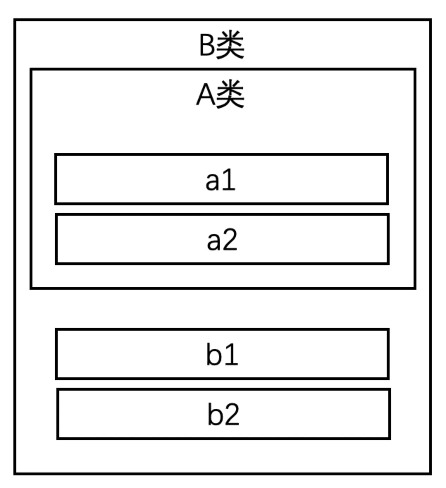
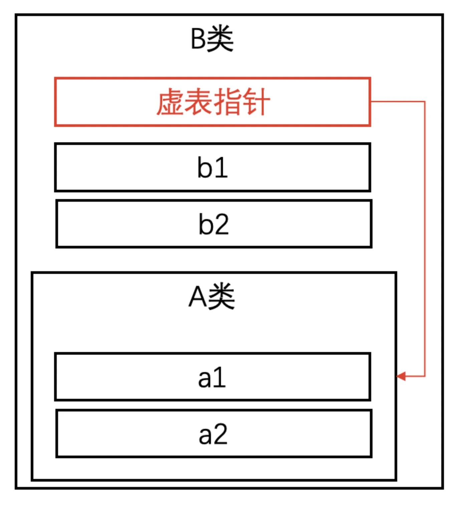
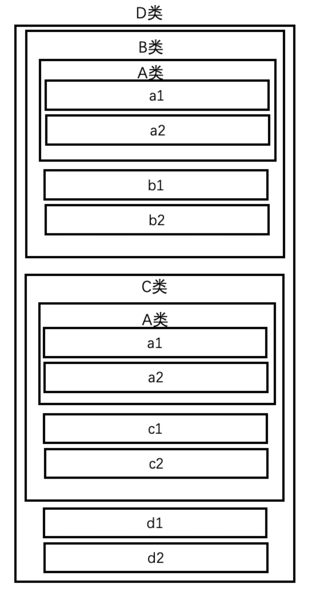
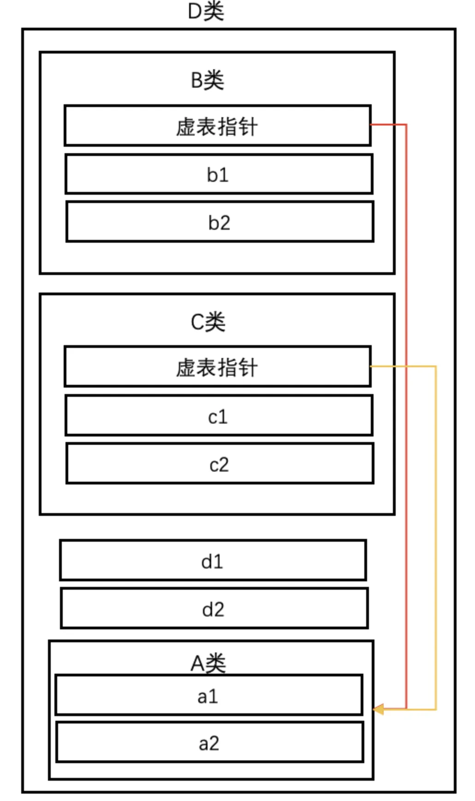

<!--BEGIN_DATA
{
    "create_date": "2023-03-08 10:05", 
    "modify_date": "2023-03-08 10:05", 
    "is_top": "0", 
    "summary": "C++缺陷和思考", 
    "tags": "C/C++", 
    "file_name": "C++缺陷和思考.md"
}
END_DATA-->

#### <p>原文出处：<a href='https://km.woa.com/articles/show/556701?kmref=author_recommend' target='blank'>C++缺陷和思考</a></p>

本文主要有3个目的：

  1. 总结一些C++晦涩难懂的语法现象，解释其背后原因，作为防踩坑之用

  2. 和一些其他的编程语言进行比较，列举它们的优劣

  3. 发表一些我自己作为C++程序员的看法和感受

备注：真的没想到这篇文章能上热搜，万分感谢各位同学的关注和支持。

笔者发现有读者对这篇文章的理解和我写这篇文章的本意有了一点gap，特别在此声明一下：

  1. 这篇文章不是在黑C++，我个人是非常喜欢C++的，我经常跟别人说，C++虽然不一定是最适合开发的语言，但一定是最值得学习的语言。学会了C++你能认识到的视野会不一样。

  2. 文中提到的“缺陷”仅仅是我认为容易出错的地方，但其实这种设计是有理由的，我在文中有叙述，所以它并不一定真的是“缺陷”，只是一个我希望拿来讲一讲的点吧。所以本文更多的在“思考”，告诉大家这里为什么是这样设计的，而并不是提供向导或者例程模板，希望读者千万不要误会。

  3. 文中会介绍一些比如裸指针、原始数组等等这些比较“老旧”的语法。并不是推荐大家去使用它。在从C++11开始，每次版本更新都会提供很多新的工具，使用这些工具可以在很大程度上规避这些语言原始存在的缺陷。但C++的版本更新有一个很有趣的现象，就是主要通过扩展STL来实现（C++20后又有变化），STL原本并不属于C++语言，只是标准委员会将其定为了C++的标准库。所以在STL中的工具逃不过“工具库”的定义，它和语法本身支持是有区别的。在STL内部也是用这些底层的原始语法来实现更高语义的功能的，做了一层封装后可以屏蔽很多底层缺陷。而本文倾向于向读者介绍这些底层原理，同时也能解释“为什么C++更推荐我们使用这些工具，而不是原始语法”。所以介绍这些不是向导大家来使用。所以希望读者不要出现类似于“明明你用XXX就不会出现这种问题，明明C++就应该用XXX，为什么要纠结原始语法？”这样的困惑或是抵触心理，我恰恰是在想大家解释，为什么C++更应该用XXX，而用原始语法会出现什么样的坑。（我个人在代码中看到有人用裸指针，或者`void *` \+ `size`这种的时候我也是瞬间一个头四个大，看到`new`的时候心里也毛毛的，就怕出现内存泄漏。所以这里不是给大家不良向导哈！）

  4. 由于C++20对语法本身进行了一定的修改，并且出于公司目前要求仅使用C++17的原因，文中大部分都是以C++17为前提的，而C++20将会在后续作为独立章节呈现。

  5. 非常感谢评论区各路大神的批评指正，万分万分感谢大家的指教，我已经将各位提到的错误在正文中进行修正，评论区的沟通内容也保留下来便于大家查看。

  6. 正文已完结，后续如果发现错误还会持续更正。

更新列表：

  * 关于函数参数为数组时传负数的问题，会报错，已删除对应描述

  * 关于右值引用对已有对象的生命空间控制问题（并不会直接造成重复析构），已修改对应的描述

  * 更新了“模板全特化”“构造/析构调用虚函数”“经典二义性”三个章节

  * 更新了“## 语言、STL、编译器、编程规范”“C++11和C++20”“一些方便的工具”“总结与感悟”章节

  * 修改了部分错别字和拼写错误，例如「module」

## 来自C语言的历史包袱

C++有一个很大的历史包袱，就是C语言。C语言诞生时间很早，并且它是为了编写OS而诞生的，语法更加底层。有人说，C并不是针对程序员友好的语言，而是针对编译期友好的语言。有些场景在C语言本身可能并没有什么不合理，但放到C++当中会“爆炸”，或者说，会迅速变成一种“缺陷”，让人异常费解。

C++在演变过程中一直在吸收其他语言的优势，不断提供新的语法、工具来进行优化。但为了兼容性（不仅仅是语法的兼容，还有一些设计理念的兼容），还是会留下很多坑。

## 数组

数组本身其实没有什么问题，这种语法也非常常用，主要是表示连续一组相同的数据构成的集合。但数组类型在待遇上却和其他类型（比如说结构体）非常不一样。

#### 数组的复制

我们知道，结构体类型是可以很轻松的复制的，比如说：

```cpp
struct St {
  int m1;
  double m2;
};

void demo() {
  St st1;
  St st2 = st1; // OK
  St st3;
  st1 = st3; // OK
}
```

但数组却并不可以，比如：

```cpp
int arr1[5];
int arr2[5] = arr1; // ERR
```
明明这里arr2和arr1同为`int[5]`类型，但是并不支持复制。照理说，数组应当比结构体更加适合复制场景，因为需求是很明确的，就是元素按位复制。

#### 数组类型传参

由于数组不可以复制，导致了数组同样不支持传参，因此我们只能采用“首地址+长度”的方式来传递数组：

```cpp
void f1(int *arr, size_t size) {}

void demo() {
  int arr[5];
  f1(arr, 5);
}
```

而为了方便程序员进行这种方式的传参，C又做了额外的2件事：

  1. 提供一种隐式类型转换，支持将数组类型转换为首元素指针类型（比如说这里arr是`int[5]`类型，传参时自动转换为`int *`类型）

  2. 函数参数的语法糖，如果在函数参数写数组类型，那么会自动转换成元素指针类型，比如说下面这几种写法都完全等价：  

```cpp
void f(int *arr);
void f(int arr[]);
void f(int arr[5]);
void f(int arr[100]);
```

所以这里非常容易误导人的就在这个语法糖中，**无论中括号里写多少，或者不写，这个值都是会被忽略的**，要想知道数组的边界，你就必须要通过额外的参数来传递。

但通过参数传递这是一种软约束，你无法保证调用者传的就是数组元素个数，这里的危害详见后面“指针偏移”的章节。

#### 分析和思考

之所以C的数组会出现这种奇怪现象，我猜测，作者考虑的是数组的实际使用场景，是经常会进行切段截取的，也就是说，一个数组类型并不总是完全整体使用，我们可能更多时候用的是其中的一段。举个简单的例子，如果数组是整体复制、传递的话，做数组排序递归的时候会不会很尴尬？首先，排序函数的参数难以书写，因为要指定数组个数，我们总不能针对于1,2,3,4,5,6,...元素个数的数组都分别写一个排序函数吧？其次，如果取子数组就会复制出一个新数组的话，也就不能对原数组进行排序了。

所以综合考虑，干脆这里就不支持复制，强迫程序员使用指针+长度这种方式来操作数组，反而更加符合数组的实际使用场景。

当然了，在C++中有了引用语法，我们还是可以把数组类型进行传递的，比如：

```cpp
void f1(int (&arr)[5]); // 必须传int[5]类型

void demo() {
  int arr1[5];
  int arr2[8];
  f1(arr1); // OK
  f1(arr2); // ERR
}
```

但绝大多数的场景似乎都不会这样去用。 一些新兴语言（比如说Go）就注意到了这一点，因此将其进行了区分。在Go语言中，区分了“数组”和“切片”的概念，数组就是长度固定的，整体来传递；而切片则类似于首地址+长度的方式传递（只不过没有单独用参数，而是用len函数来获取）

```cpp
func f1(arr [5]int) {
}

func f2(arr []int) {
}
```

上面例子里，f1就必须传递长度是5的数组类型，而f2则可以传递任意长度的切片类型。

而C++其实也注意到了这一点，但由于兼容问题，它只能通过STL提供容器的方式来解决，`std::array`就是定长数组，而`std::vector`就是变长数组，跟上述Go语言中的数组和切片的概念是基本类似的。这也是C++中更加推荐使用vector而不是C风格数组的原因。

## 类型说明符

#### 类型不是从左向右说明

C/C++中的类型说明符其实设计得很不合理，除了最简单的变量定义：

```cpp
int a; // 定义一个int类型的变量a
```

上面这个还是很清晰明了的，但稍微复杂一点的，就比较奇怪了：

```cpp
int arr[5]; // 定义一个int[5]类型的变量arr
```

arr明明是`int[5]`类型，但是这里的int和[5]却并没有写到一起，如果这个还不算很容易造成迷惑的话，那来看看下面的：

```cpp
int *a1[5]; // 定义了一个数组
int (*a2)[5]; // 定义了一个指针
```

a1是`int *[5]`类型，表示a1是个数组，有5个元素，每个元素都是指针类型的。

a2是`int (*)[5]`类型，是一个指针，指针指向了一个`int[5]`类型的数组。

这里离谱的就在这个`int (*)[5]`类型上，也就是说，“指向`int[5]`类型的指针”并不是`int[5]*`，而是`int (*)[5]`，类型说明符是从里往外描述的，而不是从左往右。

#### 类型说明符同时承担了动作语义

这里的另一个问题就是，C/C++并没有把“定义变量”和“变量的类型”这两件事分开，而是用类型说明符来同时承担了。也就是说，“定义一个int类型变量”这件事中，int这一个关键字不仅表示“int类型”，还表示了“定义变量”这个意义。这件事放在定义变量这件事上可能还不算明显，但放到定义函数上就不一样了：

```cpp
int f1();
```

上面这个例子中，int和()共同表示了“定义函数”这个意义。也就是说，看到int这个关键字，并不一定是表示定义变量，还有可能是定义函数，定义函数时int表示了函数的返回值的类型。

正是由于C/C++中，类型说明符具有多重含义，才造成一些复杂语法简直让人崩溃，比如说定义高阶函数：

```cpp
// 输入一个函数，输出这个函数的导函数
double (*DC(double (*)(double)))(double);
```

DC是一个函数，它有一个参数，是`double (*)(double)`类型的函数指针，它的返回值是一个`double (*)(double)`类型的函数指针。但从直观性上来说，上面的写法完全毫无可读性，如果没有那一行注释，相信大家很难看得出这个语法到底是在做什么。

C++引入了返回值右置的语法，从一定程度上可以解决这个问题：

```cpp
auto f1() -> int;
auto DC(auto (*)(double) -> double) -> auto (*)(double) -> double;
```

但用auto作为占位符仍然还是有些突兀和晦涩的。

#### 将类型符和动作语义分离的语言

我们来看一看其他语言是如何弥补这个缺陷的，最简单的做法就是把“类型”和“动作”这两件事分开，用不同的关键字来表示。 Go语言：

```cpp
// 定义变量
var a1 int
var a2 []int
var a3 *int
var a4 []*int // 元素为指针的数组
var a5 *[]int // 数组的指针

// 定义函数
func f1() {
}

func f2() int {
  return 0
}

// 高阶函数
func DC(f func(float64)float64) func(float64)float64 {
}
```

Swift语言：

```cpp
// 定义变量
var a1: Int
var a2: [Int]

// 定义函数
func f1() {
}

func f2() -> Int {
  return 0
}

// 高阶函数
func DC(f: (Double, Double)->Double) -> (Double, Double)->Double {
}
```

JavaScript语言：

```cpp
// 定义变量
var a1 = 0
var a2 = [1, 2, 3]

// 定义函数
function f1() {}

function f2() {
  return 0
}

// 高阶函数
function DC(f) {
  return function(x) {
    //...
  }
}
```

## 指针偏移

指针的偏移运算让指针操作有了较大的自由度，但同时也会引入越界问题

```cpp
int arr[5];
int *p1 = arr + 5; 
*p1 = 10// 越界
int a = 0;
int *p2 = &a;
a[1] = 10; // 越界
```

换句话说，指针的偏移是完全随意的，静态检测永远不会去判断当前指针的位置是否合法。

这个与之前章节提到的数组传参的问题结合起来，会更加容易发生并且更加不容易发现：

```cpp
void f(int *arr, size_t size) {}

void demo() {
  int arr[5];
  f(arr, 6); // 可能导致越界
}
```

因为参数中的值和数组的实际长度并没有要求强一致。

#### 其他语言的指针

在其他语言中，有的语言（例如java、C#）直接取消了指针的相关语法，但由此就必须引入“值类型”和“引用类型”的概念。
例如在java中，存在“实”和“名”的概念：

```cpp
public static void Demo() {
  int[] arr = new int[10];
  int[] arr2 = arr; // “名”的复制，浅复制
  int[] arr3 = Arrays.copyOf(arr, arr.length); // 用库方法进行深复制
}
```

本质上来说，这个“名”就是栈空间上的一个指针，而“实”则是堆空间中的实际数据。如果取消指针概念的话，就要强行区分哪些类型是“值类型”，会完全复制，哪些是“引用类型”，只会浅复制。

C#中的结构体和类的概念恰好如此，结构体是值类型，整体复制，而类是引用类型，要用库函数来复制。

而还有一些语言保留了指针的概念（例如Go、Swift），但仅仅用于明确指向和引用的含义，并不提供指针偏移运算，来防止出现越界问题。例如go中：

```cpp
func Demo() {
  var a int
  var p *int
  p = &a // OK
  r1 := *p // 直接解指针是OK的
  r2 := *(p + 1) // ERR，指针不可以偏移
}
```

swift中虽然仍然支持指针，但非常弱化了它的概念，从语法本身就能看出，不到迫不得已并不推荐使用：

```cpp
func f1(_ ptr: UnsafeMutablePointer<Int>) {
  ptr.pointee += 1 // 给指针所指向的值加1
}

func demo() {
  var a: Int = 5
  f1(&a)
}
```

OC中的指针更加特殊和“奇葩”，首先，OC完全保留了C中的指针用法，而额外扩展的“类”类型则不允许出现在栈中，也就是说，所有对象都强制放在堆中，栈上只保留指针对其引用。虽然OC中的指针仍然是C指针，但由于操作对象的“奇葩”语法，倒是并不需要太担心指针偏移的问题

```cpp
void demo() {
  NSObject *obj = [[NSObject alloc] init];
  // 例如调用obj的description方法
  NSString *desc = [obj description];
  // 指针仍可偏移，但几乎不会有人这样来写：
  [(obj+1) description]; // 也会越界
}
```

## 隐式类型转换

隐式类型转换在一些场景下会让程序更加简洁，降低代码编写难度。比如说下面这些场景：

```cpp
double a = 5; // int->double
int b = a * a; // double->int
int c = '5' - '0'; // char->int
```

但是有的时候隐式类型转化却会引发很奇怪的问题，比如说：

```cpp
#define ARR_SIZE(arr) (sizeof(arr) / sizeof(arr[0]))

void f1() {
  int arr[5];
  size_t size = ARR_SIZE(arr); // OK
}

void f2(int arr[]) {
  size_t size = ARR_SIZE(arr); // WRONG
}
```

结合之前所说，函数参数中的数组其实是数组首元素指针的语法糖，所以`f2`中的`arr`其实是`int *`类型，这时候再对其进行`sizeof`运算，结果是指针的大小，而并非数组的大小。如果程序员不能意识到这里发生了`int [N]`->`int *`的隐式类型转换，那么就可能出错。 还有一些隐式类型转换也很离谱，比如说：

```cpp
int a = 5;
int b = a > 2; // 可能原本想写a / 2，把/写成了>
```

这里发生的隐式转换是bool->int，同样可能不符合预期。关于布尔类型详见后面章节。C中的这些隐式转换可能影响并不算大，但拓展到C++中就可能有爆炸性的影响，详见后面“隐式构造”和“多态转换”的相关章节。

## 赋值语句的返回值

C/C++的赋值语句自带返回值，这一定算得上一大缺陷，在C中赋值语句返回值，在C++中赋值语句返回左值引用。

这件事造成的最大影响就在`=`和`==`这两个符号上，比如：

```cpp
int a1, a2;
bool b = a1 = a2;
```

这里原本想写`b = a1 == a2`，但是错把`==`写成了`=`，但编译是可以完全通过的，因为`a1 = a2`本身返回了a1的引用，再触发一次隐式类型转换，把bool转化为int（这里详见后面非布尔类型的布尔意义章节）。

更有可能的是写在if表达式中：

```cpp
if (a = 1) {
}
```

可以看到，`a = 1`执行后a的值变为1，返回的a的值就是1，所以这里的`if`变成了恒为真。

C++为了兼容这一特性，又不得不要求自定义类型要定义赋值函数

```cpp
class Test {
 public:
  Test &operator =(const Test &); // 拷贝赋值函数
  Test &operator =(Test &&); // 移动赋值函数
  Test &operator =(int a); // 其他的赋值函数
};
```

这里赋值函数的返回值强制要求定义为当前类型的左值引用，一来会让人觉得有些无厘头，记不住这里的写法，二来在发生继承关系的时候非常容易忘记处理父类的赋值

```cpp
class Base {
 public:
  Base &operator =(const Base &);
};

class Ch : public Base {
 public:
  Ch &opeartor =(const Ch &ch) {
    this->Base::operator =(ch);
    // 或者写成 *static_cast<Base *>(this) = ch;
    // ...
    return *this;
  }
};
```

#### 其他语言的赋值语句

古老一些的C系扩展语言基本还是保留了赋值语句的返回值（例如java、OC），但一些新兴语言（例如Go、Swift）则是直接取消了赋值语句的返回值，比如说在swift中：

```cpp
let a = 5
var b: Int
var c: Int
c = (b = a) // ERR
```

`b = a`会返回`Void`，所以再赋值给c时会报错

## 非布尔类型的布尔意义

在原始C当中，其实并没有“布尔”类型，所有表示是非都是用int来做的。所以，int类型就赋予了布尔意义，0表示false，非0都表示true，由此也诞生了很多“野路子”的编程技巧：

```cpp
int *p;
if (!p) {} // 指针→bool
while (1) {} // int→bool
int n;
while (~scanf("%d", &n)) {} // int→bool
```

所有表示判断逻辑的语法，都可以用非布尔类型的值传入，这样的写法其实是很反人类直觉的，更严重的问题就是与true常量比较的问题

```cpp
int judge = 2; // 用了int表示了判断逻辑
if (judge == true) {} // 但这里的条件其实是false，因为true会转为1，2 == 1是false
```

正是由于非布尔类型具有了布尔意义，才会造成一些非常反直觉的事情，比如说：

```cpp
true + true != true
!!2 == 1
(2 == true) == false
```

#### 其他语言的布尔类型

基本上除了C++和一些弱类型脚本语言（比如js）以外，其他语言都取消了非布尔类型的布尔意义，要想转换为布尔值，一定要通过布尔运算才可以，例如在Go中：

```cpp
func Demo() {
  a := 1 // int类型
  if (a) { // ERR，if表达式要求布尔类型
  }
  if (a != 0) { // OK，通过逻辑运算得到布尔类型
  }
}
```

这样其实更符合直觉，也可以一定程度上避免出现写成类似于`if (a = 1)`出现的问题。C++中正是由于“赋值语句有返回值”和“非布尔类型有布尔意义”同时生效，才会在这里出现问题。

## 解指针类型

关于C/C++到底是强类型语言还是弱类型语言，业界一直争论不休。有人认为，变量的类型从定义后就不能改变，并且每个变量都有固定的类型，所以C/C++应该是强类型语言。

但有人持相反意见，是因为这个类型，仅仅是“表面上”不可变，但其实是可变的，比如说看下面例程：

```cpp
int a = 300;
uint8_t *p = reinterpret_cast<uint8_t *>(&a);
*p = 1; // 这里其实就是把a变成了uint8_t类型
```

根源就在于，指针的解类型是可以改变的，原本`int`类型的变量，我们只要把它的首地址保存下来，然后按照另一种类型来解，那么就可以做到“改变a的类型”的目的。

这也就意味着，指针类型是不安全的，因为你不一定能保证现在解指针的类型和指针指向数据的真实类型是匹配的。

还有更野一点的操作，比如：

```cpp
struct S1 {
  short a, b;
};

struct S2 {
  int a;
};

void demo() {
  S2 s2;
  S1 *p = reinterpret_cast<S1 *>(&s2);
  p->a = 2;
  p->b = 1;
  std::cout << s2.a; // 猜猜这里会输出多少？
}
```

这里的指针类型问题和前面章节提到的指针偏移问题，综合起来就是说C/C++的指针操作的自由度过高，提升了语言的灵活度，同时也增加了其复杂度。

## 后置自增/自减

如果仅仅在C的角度上，后置自增/自减语法并没有带来太多的副作用，有时候在程序中作为一些小技巧反而可以让程序更加精简，比如说：

```cpp
void AttrCnt() {
  static int count = 0;
  std::cout << count++ << std::endl;
}
```

但这个特性继承到C++后问题就会被放大，比如说下面的例子：

```cpp
for (auto iter = ve.begin(); iter != ve.end(); iter++) {
}
```

这段代码看似特别正常，但仔细想想，iter作为一个对象类型，如果后置`++`，一定会发生复制。后置`++`原本的目的就是在表达式的位置先返回原值，表达式执行完后再进行自增。但如果放在类类型来说，就必须要临时保存一份原本的值。例如：

```cpp
class Element {
 public：
  // 前置++
  Element &operator ++() {
  	ele++;
  	return *this;
  } 
  // 后置++
  Element operator ++(int) {
    // 为了最终返回原值，所以必需保存一份快照用于返回
    Element tmp = *this;
    ele++;
    return tmp;
  }

 private:
  int ele;
};
```

这也从侧面解释了，为什么前置`++`要求返回引用，而后置`++`则是返回非引用，因为这里需要复制一份快照用于返回。

那么，写在for循环中的后置`++`就会平白无故发生一次复制，又因为返回值没有接收，再被析构。

C++保留的`++`和`--`的语义，也是因为它和`+=1`或`-=1`语义并不完全等价。我们可以用顺序迭代器来解释。对于顺序迭代器（比如说链表的迭代器），`++`表示取下一个节点，`--`表示取上一个节点。而`+n`或者`-n`则表示偏移了，这种语义更适合随机访问（所以说随机迭代器支持`+=`和`-=`，但顺序迭代器只支持`++`和`--`）。

##### 其他语言的自增/自减

其他语言的做法基本分两种，一种就是保留自增/自减语法，但不再提供返回值，也就不用区分前置和后置，例如Go：

```cpp
a := 3
a++ // OK
b := a++ // ERR，自增语句没有返回值
```

另一种就是干脆删除自增/自减语法，只提供普通的操作赋值语句，例如Swift：

```cpp
var a = 3
a++ // ERR，没有这种语法
a += 1 // OK，只能用这种方式自增
```

## 类型长度

这里说的类型长度指的是相同类型在不同环境下长度不一致的情况，下面总结表格

<table><thead><tr><th>类型</th><th>32位环境长度</th><th>64位环境长度</th></tr></thead><tbody><tr><td>int/unsigned</td><td>4B</td><td>4B</td></tr><tr><td>long/unsigned long</td><td>4B</td><td>8B</td></tr><tr><td>long long/ unsigned long long</td><td>8B</td><td>8B</td></tr></tbody></table>

由于这里出现了32位和64位环境下长度不一致的情况，C语言特意提供了`stdint.h`头文件(C++中在cstddef中引用)，定义了定长类型，例如`int64_t`在32位环境下其实是`long long`，而在64位环境下其实是`long`。

但这里的问题点在于：

##### 1. 并没有定长格式符

例如`uint64_t`在32位环境下对应的格式符是`%llu`，但是在64位环境下对应的格式符是`%lu`。有一种折中的解决办法是自定义一个宏：

```cpp
#if(sizeof(void*) == 8)
#define u64 "%lu"
#else
#define u64 "%llu"
#endif

void demo() {
  uint64_t a;
  printf("a="u64, a);
}
```

但这样会让字符串字面量从中间断开，非常不直观。

##### 2. 类型不一致。

例如在64位环境下，`long`和`long long`都是64位长，但编译器会识别为不同类型，在一些类型推导的场景会出现和预期不一致的情况，例如：

```cpp
template <typename T>
void func(T t) {}

template <>
void func<int64_t>(int64_t t) {}

void demo() {
  long long a;
  func(a); // 会匹配通用模板，而匹配不到特例
}
```

上述例子表明，`func<int64_t>`和`func<long long>`是不同实例，尽管在64位环境下`long`和`long long`真的看不出什么区别，但是编译器就是会识别成不同类型。

## 格式化字符串

格式化字符串算是非常经典的C的产物，不仅是C++，非常多的语言都是支持这种格式符的，例如java、Go、python等等。

但C++中的格式化字符串可以说完全就是C的那一套，根本没有任何扩展。换句话说，除了基本数据类型和0结尾的字符串以外，其他任何类型都没有用于匹配的格式符。

例如，对于结构体类型、数组、元组类型等等，都没法匹配到格式符：

```cpp
struct Point {
  double x, y;
};

void Demo() {
  // 打印Point
  Point p {1, 2.5};
  printf("(%lf,%lf)", p.x, p.y); // 无法直接打印p
  // 打印数组
  int arr[] = {1, 2, 3};
  for (int i = 0; i < 3; i++) {
    printf("%d, ", arr[i]); // 无法直接打印整个数组
  } 
  // 打印元组
  std::tuple tu(1, 2.5, "abc");
  printf("(%d,%lf,%s)", std::get<0>(tu), std::get<1>(tu), std::get<2>(tu)); // 无法直接打印整个元组
}
```

对于这些组合类型，我们就不得不手动去访问内部成员，或者用循环访问，非常不方便。

针对于字符串，还会有一个严重的潜在问题，比如：

```cpp
std::string str = "abc";
str.push_back('\0');
str.append("abc");
char buf[32];
sprintf(buf, "str=%s", str.c_str());
```

由于str中出现了`'\0'`，如果用`%s`格式符来匹配的话，会在0的位置截断，也就是说`buf`其实只获取到了`str`中的第一个abc，第二个abc就被丢失了。

#### 其他语言中的格式符

而一些其他语言则是扩展了格式符功能用于解决上述问题，例如OC引入了`%@`格式符，用于调用对象的`description`方法来拼接字符串：

```cpp
@interface Point2D : NSObject
@property double x;
@property double y;
- (NSString *)description;
@end

@implementation Point2D
- (NSString *)description {
  return [[NSString alloc] initWithFormat:@"(%lf, %lf)", self.x, self.y];
}
@end

void Demo() {
  Point2D *p = [[Point2D alloc] init];
  [p setX:1];
  [p setY:2.5];
  NSLog(@"p=%@", p); // 会调用p的description方法来获取字符串，用于匹配%@
}
```

而Go语言引入了更加方便的`%v`格式符，可以用来匹配任意类型，用它的默认方式打印

```cpp
type Test struct {
	m1 int
	m2 float32
}

func Demo() {
  a1 := 5
  a2 := 2.6
  a3 := []int{1, 2, 3}
  a4 := "123abc"
  a5 := Test{2, 1.5}
	
  fmt.Printf("a1=%v, a2=%v, a3=%v, a4=%v, a5=%v\n", a1, a2, a3, a4, a5)
}
```

Python则是用`%s`作为万能格式符来使用：

```cpp
def Demo():
     a1 = 5
     a2 = 2.5
     a3 = "abc123"
     a4 = [1, 2, 3]
     print("%s, %s, %s, %s"%(a1, a2, a3, a4)) #这里没有特殊格式要求时都可以用%s来匹配
```

## 枚举

枚举类型原本是用于解决固定范围取值的类型表示，但由于在C语言中被定义为了整型类型的一种语法糖，导致枚举类型的使用上出现了一些问题。

##### 1. 无法前置声明。

枚举类型无法先声明后定义，例如下面这段代码会编译报错：

```cpp
enum Season;
struct Data {
  Season se; // ERR
};

enum Season {
  Spring,
  Summer,
  Autumn,
  Winter
};
```

主要是因为`enum`类型是动态选择基础类型的，比如这里只有4个取值，那么可能会选取`int16_t`，而如果定义的取值范围比较大，或者中间出现大枚举值的成员，那么可能会选取`int32_t`或者`int64_t`。也就是说，枚举类型如果没定义完，编译期是不知道它的长度的，因此就没法前置声明。

C++中允许指定枚举的基础类型，制定后可以前置声明:

```cpp
enum Season : int;
struct Data {
  Season se; // OK
};

enum Season : int {
  Spring,
  Summer,
  Autumn,
  Winter
};
```

但如果你是在调别人写的库的时候，人家的枚举没有指定基础类型的话，那你也没辙了，就是不能前置声明。

##### 2. 无法确认枚举值的范围。

也就是说，我没有办法判断某个值是不是合法的枚举值：

```cpp
enum Season {
  Spring,
  Summer,
  Autumn,
  Winter
};

void Demo() {
  Season s = static_cast<Season>(5); // 不会报错
}
```

##### 3. 枚举值可以相同

```cpp
enum Test {
  Ele1 = 10,
  Ele2,
  Ele3 = 10
};

void Demo() {
  bool judge = (Ele1 == Ele3); // true
}
```

##### 4. C风格的枚举还存在“成员名称全局有效”和“可以隐式转换为整型”的缺陷

但因为C++提供了`enum class`风格的枚举类型，解决了这两个问题，因此这里不再额外讨论。

## 宏

宏这个东西，完全就是针对编译器友好的，编译器非常方便地在宏的指导下，替换源代码中的内容。但这个玩意对程序员（尤其是阅读代码的人）来说是极其不友好的，由于是预处理指令，因此任何的静态检测均无法生效。一个经典的例子就是：

```cpp
#define MUL(x, y) x * y

void Demo() {
  int a = MUL(1 + 2, 3 + 4); // 11
}
```

因为宏就是简单粗暴地替换而已，并没有任何逻辑判断在里面。

宏因为它很“好用”，所以非常容易被滥用，下面列举了一些宏滥用的情况供参考：

##### 1. 用宏来定义类成员

```cpp
#define DEFAULT_MEM     \
public:                 \
    int GetX() {return x_;} \
private:                \
    int x_;

class Test {
DEFAULT_MEM;
 public:
  void method();
};
```

这种用法相当于屏蔽了内部实现，对阅读者非常不友好，与此同时加不加`DEFAULT_MEM`是一种软约束，实际开发时极容易出错。

再比如这种的：

```cpp
#define SINGLE_INST(class_name)                        \
 public:                                               \
  static class_name &GetInstance() {                   \
    static class_name instance;                        \
    return instance;                                   \
  }                                                    \
  class_name(const class_name&) = delete;              \
  class_name &operator =(const class_name &) = delete; \
 private:                                              \
  class_name();
class Test {
  SINGLE_INST(Test)
};
```

这位同学，我理解你是想封装一下单例的实现，但咱是不是可以考虑一下更好的方式？（比如用模板）

##### 2. 用宏来屏蔽参数

```cpp
#define strcpy_s(dst, dst_buf_size, src) strcpy(dst, src)
```

这位同学，咱要是真想写一个安全版本的函数，咱就好好去判断`dst_buf_size`如何？

##### 3. 用宏来拼接函数处理

```cpp
#define COPY_IF_EXSITS(dst, src, field) \
do {                                    \
  if (src.has_##field()) {              \
    dst.set_##field(dst.field());       \
  }                                     \
} while (false)

void Demo() {
  Pb1 pb1;
  Pb2 pb2;
  COPY_IF_EXSITS(pb2, pb1, f1);
  COPY_IF_EXSITS(pb2, pb1, f2);
}
```

这种用宏来做函数名的拼接看似方便，但最容易出的问题就是类型不一致，加入`pb1`和`pb2`中虽然都有`f1`这个字段，但类型不一样，那么这样用就可能造成类型转换。试想`pb1.f1`是`uint64_t`类型，而`pb2.f1`是`uint32_t`类型，这样做是不是有可能造成数据的截断呢？

##### 4. 用宏来改变语法风格

```cpp
#define IF(con) if (con) {
#define END_IF }
#define ELIF(con) } else if (con) {
#define ELSE } else {

void Demo() {
  int a;
  IF(a > 0)
    Process1();
  ELIF(a < -3) 
    Process2();
  ELSE
    Process3();
}
```

这位同学你到底是写python写惯了不适应C语法呢，还是说你为了让代码扫描工具扫不出来你的圈复杂度才出此下策的呢~~

## 共合体

共合体的所有成员共用内存空间，也就是说它们的首地址相同。在很多人眼中，共合体仅仅在“多选一”的场景下才会使用，例如：

```cpp
union QueryKey {
  int id;
  char name[16];
};
int Query(const QueryKey &key);
```

上例中用于查找某个数据的key，可以通过id查找，也可以通过name，但只能二选一。

这种场景确实可以使用共合体来节省空间，但缺点在于，共合体的本质就是同一个数据的不同解类型，换句话说，程序是不知道当前的数据是什么类型的，共合体的成员访问完全可以用更换解指针类型的方式来处理，例如：

```cpp
union Un {
  int m1;
  unsigned char m2;
};

void Demo() {
  Un un;
  un.m1 = 888;
  std::cout << un.m2 << std::endl;
  // 等价于
  int n1 = 888;
  std::cout << *reinterpret_cast<unsigned char *>(&n1) << std::endl;
}
```

共合体只不过把有可能需要的解类型提前写出来罢了。所以说，共合体并不是用来“多选一”的，笔者认为这是大家曲解的用法。毕竟真正要做到“多选一”，你就得知道当前选的是哪一个，例如：

```cpp
struct QueryKey {
  union {
    int id;
    char name[16];
  } key;
  enum {
    kCaseId,
    kCaseName
  } key_case;
};
```

用过google protobuf的读者一定很熟悉上面的写法，这个就是proto中`oneof`语法的实现方式。

在C++17中提供了`std::variant`，正是为了解决“多选一”问题存在的，它其实并不是为了代替共合体，因为共合体原本就不是为了这种需求的，把共合体用做“多选一”实在是有点“屈才”了。

更加贴合共合体本意的用法，是我最早是在阅读处理网络报文的代码中看到的，例如某种协议的报文有如下规定（例子是我随便写的）：

<table><thead><tr><th>二进制位</th><th>意义</th></tr></thead><tbody><tr><td>0~3</td><td>协议版本号</td></tr><tr><td>4~5</td><td>超时时间</td></tr><tr><td>6</td><td>协商次数</td></tr><tr><td>7</td><td>保留位，固定 为0</td></tr><tr><td>8~15</td><td>业务数据</td></tr></tbody></table>

这里能看出来，整个报文有2字节，一般的处理时，我们可能只需要关注这个报文的这2个字节值是多少（比如说用十六进制表示），而在排错的时候，才会关注报文中每一位的含义，因此，“整体数据”和“内部数据”就成为了这段报文的两种获取方式，这种场景下非常适合用共合体：

```cpp
union Pack {
  uint16_t data; // 直接操作报文数据
  struct {
    unsigned version : 4;
    unsigned timeout : 2;
    unsigned retry_times : 1;
    unsigned block : 1;
    uint8_t bus_data;
  } part; // 操作报文内部数据
};

void Demo() {
  // 例如有一个从网络获取到的报文
  Pack pack;
  GetPackFromNetwork(pack);
  // 打印一下报文的值
  std::printf("%X", pack.data);
  // 更改一下业务数据
  pack.part.bus_data = 0xFF;
  // 把报文内容扔到处理流中
  DataFlow() << pack.data;
}
```

因此，这里的需求就是“用两种方式来访问同一份数据”，才是完全符合共合体定义的用法。

共合体应该是C语言的特色了，其他任何高级语言都没有类似的语法，主要还是因为C语言更加面相底层，C++仅仅是继承了C的语法而已。

## const引用

#### 先说说const

先来吐槽一件事，就是C/C++中`const`这个关键字，这个名字起的非常非常不好！为什么这样说呢？const是constant的缩写，翻译成中文就是“常量”，但其实在C/C++中，`const`并不是表示“常量”的意思。

我们先来明确一件事，什么是“常量”，什么是“变量”？常量其实就是衡量，比如说`1`就是常量，它永远都是这个值。再比如`'A'`就是个常量，同样，它永远都是和它ASCII码对应的值。 “变量”其实是指存储在内存当中的数据，起了一个名字罢了。如果我们用汇编，则不存在“变量”的概念，而是直接编写内存地址：

```cpp
mov ax, 05FAh
mov ds, ax
mov al, ds:[3Fh]
```

但是这个`05FA:3F`地址太突兀了，也很难记，另一个缺点就是，内存地址如果固定了，进程加载时动态分配内存的操作空间会下降（尽管可以通过相对内存的方式，但程序员仍需要管理偏移地址），所以在略高级一点的语言中，都会让程序员有个更方便的工具来管理内存，最简单的方法就是给内存地址起个名字，然后编译器来负责翻译成相对地址。

```c
int a; // 其实就是让编译器帮忙找4字节的连续内存，并且起了个名字叫a
```

所以“变量”其实指“内存变量”，它一定拥有一个内存地址，和可变不可变没啥关系。

因此，C语言中`const`用于修饰的一定是“变量”，来控制这个变量不可变而已。用`const`修饰的变量，其实应当说是一种“只读变量”，这跟“常量”根本挨不上。

这就是笔者吐槽这个`const`关键字的原因，你叫个`read_only`之类的不是就没有歧义了么？

C#就引入了`readonly`关键字来表示“只读变量”，而`const`则更像是给常量取了个别名（可以类比为C++中的宏定义，或者`constexpr`，后面章节会详细介绍`constexpr`）：

```c
const int pi = 3.14159; // 常量的别名
readonly int[] arr = new int[]{1, 2, 3}; // 只读变量
```

#### 左右值

C++由于保留了C当中的`const`关键字，但更希望表达其“不可变”的含义，因此着重在“左右值”的方向上进行了区分。左右值的概念来源于赋值表达式：

```c
var = val; // 赋值表达式
```

赋值表达式的左边表示即将改变的变量，右边表示从什么地方获取这个值。因此，很自然地，右值不会改变，而左值会改变。那么在这个定义下，“常量”自然是只能做右值，因为常量仅仅有“值”，并没有“存储”或者“地址”的概念。而对于变量而言，“只读变量”也只能做右值，原因很简单，因为它是“只读”的。

虽然常量和只读变量是不同的含义，但它们都是用来“读取值”的，也就是用来做右值的，所以，C++引入了“const引用”的概念来统一这两点。**所谓const引用包含了2个方面的含义**:

  1. 作为只读变量的引用（指针的语法糖）
  2. 作为只读变量

换言之，const引用**可能是引用**，也**可能只是个普通变量**，如何理解呢？请看例程：

```c
void Demo() {
  const int a = 5; // a是一个只读变量
  const int &r1 = a; // r1是a的引用，所以r1是引用
  const int &r2 = 8; // 8是一个常量，因此r2并不是引用，而是一个只读变量
}
```

也就是说，当用一个const引用来接收一个变量的时候，这时的引用是真正的引用，其实在`r1`内部保存了`a`的地址，当我们操作`r`的时候，会通过解指针的语法来访问到`a`

```c
const int a = 5;
const int &r1 = a;
std::cout << r1;
// 等价于
const int *p1 = &a; // 引用初始化其实是指针的语法糖
std::cout << *p1; // 使用引用其实是解指针的语法糖
```

但与此同时，const引用还可以接收常量，这时，由于常量根本不是变量，自然也不会有内存地址，也就不可能转换成上面那种指针的语法糖。那怎么办？这时，就只能去重新定义一个变量来保存这个常量的值了，所以这时的const引用，**其实根本不是引用**，就是一个普通的只读变量。

```c
const int &r1 = 8;
// 等价于
const int c1 = 8; // r1其实就是个独立的变量，而并不是谁的引用
```

#### 思考

const引用的这种设计，更多考虑的是语义上的，而不是实现上的。如果我们理解了const引用，那么也就不难理解为什么会有“将亡值”和“隐式构造”的问题了，因为搭配const引用，可以实现语义上的统一，但代价就是同一语法可能会做不同的事，会令人有疑惑甚至对人有误导。

在后面“右值引用”和“因式构造”的章节会继续详细介绍它们和const引用的联动，以及可能出现的问题。

## 右值引用与移动语义

C++11的右值引用语法的引入，其实也完全是针对于底层实现的，而不是针对于上层的语义友好。换句话说，右值引用是为了优化性能的，而并不是让程序变得更易读的。

#### 右值引用

右值引用跟const引用类似，仍然是同一语法不同意义，并且右值引用的定义强依赖“右值”的定义。根据上一节对“左右值”的定义，我们知道，左右值来源于赋值语句，常量只能做右值，而变量做右值时仅会读取，不会修改。按照这个定义来理解，“右值引用”就是对“右值”的引用了，而右值可能是常量，也可能是变量，那么右值引用自然也是分两种情况来不同处理：

  1. 右值引用绑定一个常量
  2. 右值引用绑定一个变量

我们先来看右值引用绑定常量的情况：

```c
int &&r1 = 5; // 右值引用绑定常量
```

和const引用一样，常量没有地址，没有存储位置，只有值，因此，要把这个值保存下来的话，同样得按照“新定义变量”的形式，因此，当右值引用绑定常量时，相当于定义了一个普通变量：

```c
int &&r1 = 5;
// 等价于
int v1 = 5; // r1就是个普通的int变量而已，并不是引用
```

所以这时的右值引用并不是谁的引用，而是一个普普通通的变量。

我们再来看看右值引用绑定变量的情况: 这里的关键问题在于，**什么样的变量适合用右值引用绑定？**如果对于普通的变量，C++不允许用右值引用来绑定，但这是为什么呢？

```c
int a = 3;
int &&r = a; // ERR，为什么不允许右值引用绑定普通变量？
```

我们按照上面对左右值的分析，**当一个变量做右值时，该变量只读，不会被修改**，那么，“引用”这个变量自然是想让引用成为这个变量的替身，而如果我们希望这里做的事情是“当通过这个引用来操作实体的时候，实体不能被改变”的话，使用const引用就已经可以达成目的了，没必要引入一个新的语法。

所以，**右值引用并不是为了让引用的对象只能做右值**（这其实是const引用做的事情），相反，右值引用本身是可以做左值的。这就是右值引用最迷惑人的地方，也是笔者认为“右值引用”这个名字取得迷惑人的地方。

右值引用到底是想解决什么问题呢？请看下面示例：

```c
struct Test { // 随便写一个结构体，大家可以脑补这个里面有很多复杂的成员
  int a, b;
};

Test GetAnObj() { // 一个函数，返回一个结构体类型
  Test t {1, 2};  // 大家可以脑补这里面做了一些复杂的操作
  return t; // 最终返回了这个对象
}

void Demo() {
  Test t1 = GetAnObj();
}
```

我们忽略编译器的优化问题，只分析C++语言本身。在`GetAnObj`函数内部，`t`是一个局部变量，局部变量的生命周期是从创建到**当前代码块结束**，也就是说，当`GetAnObj`函数结束时，这个`t`**一定会被释放掉**。

既然这个局部变量会被释放掉，那么函数如何返回呢？这就涉及了“值赋值”的问题，假如`t`是一个整数，那么函数返回的时候容易理解，就是返回它的值。具体来说，就是把这个值推到寄存器中，在跳转会调用方代码的时候，再把寄存器中的值读出来：

```c
int f1() {
  int t = 5;
  return t;
}
```

翻译成汇编就是：

```c
push    rbp                                     
mov     rbp, rsp
mov     DWORD PTR [rbp-4], 5     ; 这里[rbp-4]就是局部变量t 
mov     eax, DWORD PTR [rbp-4]   ; 把t的值放到eax里，作为返回值
pop     rbp
ret
```

之所以能这样返回，主要就是eax放得下t的值。但如果t是结构体的话，一个eax寄存器自然是放不下了，那怎么返回？（这里汇编代码比较长，而且跟编译器的优化参数强相关，就不放代码了，有兴趣的读者可以自己汇编看结果。）简单来说，因为寄存器放不下整个数据，这个数据就只能放到内存中，作为一个临时区域，然后在寄存器里放一个临时区域的内存地址。等函数返回结束以后，再把这个临时区域释放掉。

那么我们再回来看这段代码：

```c
struct Test {
  int a, b;
};

Test GetAnObj() {
  Test t {1, 2}; 
  return t; // 首先开辟一片临时空间，把t复制过去，再把临时空间的地址写入寄存器
} // 代码块结束，局部变量t被释放

void Demo() {
  Test t1 = GetAnObj(); // 读取寄存器中的地址，找到临时空间，再把临时空间的数据复制给t1
  // 函数调用结束，临时空间释放
}
```

那么整个过程发生了2次复制和2次释放，如果我们按照程序的实际行为来改写一下代码，那么其实应该是这样的：

```c
struct Test {
  int a, b;
};

void GetAnObj(Test *tmp) { // tmp要指向临时空间
  Test t{1, 2};
  *tmp = t; // 把t复制给临时空间
}  // 代码块结束，局部变量t被释放

void Demo() {
  Test *tmp = (Test *)malloc(sizeof(Test)); // 临时空间
  GetAnObj(tmp); // 让函数处理临时空间的数据
  Test t1 = *tmp; // 把临时空间的数据复制给这里的局部变量t1
  free(tmp); // 释放临时空间
}
```

如果我真的把代码写成这样，相信一定会被各位前辈骂死，质疑我为啥不直接用出参。的确，用出参是可以解决这种多次无意义复制的问题，所以C++11以前并没有要去从语法层面来解决，但这样做就会让代码不得不“面相底层实现”来编程。C++11引入的右值引用，就是希望从“语法层面”解决这种问题。

试想，这片非常短命的临时空间，究竟是否有必要存在？既然这片空间是用来返回的，返回完就会被释放，那我何必还要单独再搞个变量来接收，如果这片临时空间可以持续使用的话，不就可以减少一次复制吗？于是，“右值引用”的概念被引入。

```c
struct Test {
  int a, b;
};

Test GetAnObj() {
  Test t {1, 2}; 
  return t; // t会复制给临时空间
}

void Demo() {
  Test &&t1 = GetAnObj(); // 我设法引用这篇临时空间，并且让他不要立刻释放
  // 临时空间被t1引用了，并不会立刻释放
} // 等代码块结束，t1被释放了，才让临时空间释放
```

所以，右值引用的目的是为了**延长临时变量的生命周期**，如果我们把函数返回的临时空间中的对象视为“临时对象”的话，正常情况下，当函数调用结束以后，临时对象就会被释放，所以我们管这个短命的对象叫做“**将亡对象**”，简单粗暴理解为“马上就要挂了的对象”，它的使命就是让外部的`t1`复制一下，然后它就死了，所以这时候你对他做什么操作都是没意义的，他就是让人来复制的，自然就是个只读的值了，所以才被归结为“右值”。我们为了让它不要死那么快，而给它延长了生命周期，因此使用了右值引用。所以，右值引用是不是应该叫“续命引用”更加合适呢~

当用右值引用捕获一个将亡对象的时候，对象的生命周期从“将亡”变成了“与右值引用共存亡”，这就是右值引用的根本意义，这时的右值引用就是“将亡对象的引用”，又因为这时的将亡对象已经不再“将亡”了，那它既然不再“将亡”，我们再对它进行操作（改变成员的值）自然就是有意义的啦，所以，这里的右值引用其实就**等价于一个普通的引用**而已。既然就是个普通的引用，而且没用const修饰，自然，可以做左值咯。右值引用做左值的时候，其实就是它所指对象做左值而已。不过又因为普通引用并不会影响原本对象的生命周期，但右值引用会，因此，右值引用更像是**一个普通的变量**，但我们要知道，它本质上还是引用（底层是指针实现的）。

总结来说就是，右值引用绑定常量时相当于“给一个常量提供了生命周期”，这时的“右值引用”并不是谁的引用，而是相当于一个普通变量；而右值引用绑定将亡对象时，相当于“给将亡对象延长了生命周期”，这时的“右值引用”并不是“右值的引用”，而是“对需要续命的对象”的引用，生命周期变为了右值引用本身的生命周期（或者理解为“接管”了这个引用的对象，成为了一个普通的变量）。

#### const引用绑定将亡对象

需要知道的是，const引用也是可以绑定将亡对象的，正如上文所说，既然将亡对象定义为了“右值”，也就是只读不可变的，那么自然就符合const引用的语义。

```c
// 省略Test的定义，见上节
void Demo() {
  const Test &t1 = GetAnObj(); // OK
}
```

这样看来，const引用同样可以让将亡对象延长生命周期，但其实这里的出发点并不同，const引用更倾向于“引用一个不可变的量”，既然这里的将亡对象是一个“不可变的值”，那么，我就可以用const引用来保存“这个值”，或者这里的“值”也可以理解为这个对象的“快照”。所以，**当一个const引用绑定一个将亡值时，const引用相当于这个对象的“快照”**，但背后还是间接地延长了它的生命周期，但只不过是不可变的。

#### 移动语义

在解释移动语义之前，我们先来看这样一个例子：

```c
class Buffer final {
 public：
  Buffer(size_t size);
  Buffer(const Buffer &ob);
  ~Buffer();
  int &at(size_t index);
 private：
  size_t buf_size_;
  int *buf_;
};

Buffer::Buffer(size_t size) : buf_size_(size), buf_(malloc(sizeof(int) * size)) {}
Buffer::Buffer(const Buffer &ob) :buf_size_(ob.buf_size_), 
                                  buf_(malloc(sizeof(int) * ob.buf_size_)) {
  memcpy(buf_, ob.buf_, ob.buf_size_);
}

Buffer::~Buffer() {
  if (buf_ != nullptr) {
    free(buf_);
  }
}

int &Buffer::at(size_t index) {
  return buf_[index];
}

void ProcessBuf(Buffer buf) {
  buf.at(2) = 100; // 对buf做一些操作
}

void Demo() {
  ProcessBuf(Buffer{16}); // 创建一个16个int的buffer
}
```

上面这段代码定义了一个非常简单的缓冲区处理类，`ProcessBuf`函数想做的事是传进来一个buffer，然后对这个buffer做一些修改的操作，最后可能把这个buffer输出出去之类的（代码中没有体现，但是一般业务肯定会有）。

如果像上面这样写，会出现什么问题？不难发现在于`ProcessBuf`的参数，这里会发生复制。由于我们在`Buffer`类中定义了拷贝构造函数来实现深复制，那么任何传入的buffer都会在这里进行一次拷贝构造（深复制）。再观察`Demo`中调用，仅仅是传了一个临时对象而已。临时对象本身也是将亡对象，复制给`buf`后，就会被释放，也就是说，我们进行了一次无意义的深复制。 有人可能会说，那这里参数用引用能不能解决问题？比如这样：

```c
void ProcessBuf(Buffer &buf) {
  buf.at(2) = 100;
}

void Demo() {
  ProcessBuf(Buffer{16}); // ERR，普通引用不可接收将亡对象
}
```

所以这里需要我们注意的是，C++当中，并不只有在显式调用`=`的时候才会赋值，在函数传参的时候仍然由赋值语义（也就是实参赋值给形参）。所以上面就相当于:

```c
Buffer &buf = Buffer{16}; // ERR
```

所以自然不合法。那，用const引用可以吗？由于const引用可以接收将亡对象，那自然可以用于传参，但`ProcessBuf`函数中却对对象进行了修改操作，所以const引用不能满足要求：

```c
void ProcessBuf(const Buffer &buf) {
  buf.at(2) = 100; // 但是这里会报错
}

void Demo() {
  ProcessBuf(Buffer{16}); // 这里确实OK了
}
```

正如上一节描述，const引用倾向于表达“保存快照”的意义，因此，虽然这个对象仍然是放在内存中的，但const引用并不希望它发生改变（否则就不叫快照了），因此，这里最合适的，仍然是右值引用：

```c
void ProcessBuf(Buffer &&buf) {
  buf.at(2) = 100; // 右值引用完成绑定后，相当于普通引用，所以这里操作OK
}

void Demo() {
  ProcessBuf(Buffer{16}); // 用右值引用绑定将亡对象，OK
}
```

我们再来看下面的场景：

```c
void Demo() {
  Buffer buf1{16};
  // 对buf进行一些操作
  buf1.at(2) = 50;
  // 再把buf传给ProcessBuf
  ProcessBuf(buf1); // ERR，相当于Buffer &&buf= buf1;右值引用绑定非将亡对象
}
```

因为右值引用是要来绑定将亡对象的，但这里的`buf1`是`Demo`函数的局部变量，并不是将亡的，所以右值引用不能接受。但如果我有这样的需求，就是说`buf1`我不打算用了，我想把它的控制权交给`ProcessBuf`函数中的`buf`，相当于，我主动让`buf1`提前“亡”，是否可以强制把它弄成将亡对象呢？STL提供了`std::move`函数来完成这件事，“期望强制把一个对象变成将亡对象”：

```c
void Demo() {
  Buffer buf1{16};
  // 对buf进行一些操作
  buf1.at(2) = 50;
  // 再把buf传给ProcessBuf
  ProcessBuf(std::move(buf1)); // OK，强制让buf1将亡，那么右值引用就可以接收
} // 但如果读者尝试的话，在这里会出ERROR
```

`std::move`的本意是提前让一个对象“将亡”，然后把控制权“**移交**”给右值引用，所以才叫「move」，也就是“移动语义”。但很可惜，C++并不能真正让一个对象提前“亡”，所以这里的“移动”仅仅是“语义”上的，并不是实际的。如果我们看一下`std::move`的实现就知道了：

```c
template <typename T>
constexpr std::remove_reference_t<T> &&move(T &&ref) noexcept {
  return static_cast<std::remove_reference_t<T> &&>(ref);
}
```

如果这里参数中的`&&`符号让你懵了的话，可以参考后面“引用折叠”的内容，如果对其他乱七八糟的语法还是没整明白的话，没关系，我来简化一下：

```c
template <typename T>
T &&move(T &ref) {
  return static_cast<T &&>(ref);
}
```

哈？就这么简单？是的！真的就这么简单，这个`std::move`不是什么多高大上的处理，就是简单把普通引用给强制转换成了右值引用，就这么简单。

所以，我上线才说“C++并不能真正让一个对象提前亡”，这里的`std::move`就是**跟编译器玩了一个文字游戏**罢了。

所以，C++的移动语义仅仅是在语义上，在使用时必须要注意，一旦将一个对象move给了一个右值引用，那么不可以再操作原本的对象，但这种约束是一种软约束，操作了也并不会有报错，但是就可能会出现奇怪的问题。

#### 移动构造、移动赋值

有了右值引用和移动语义，C++还引入了移动构造和移动赋值，这里简单来解释一下:

```c
void Demo() {
  Buffer buf1{16};
  Buffer buf2(std::move(buf1)); // 把buf1强制“亡”，但用它的“遗体”构造新的buf2
  Buffer buf3{8};
  buf3 = std::move(buf2); // 把buf2强制“亡”，把“遗体”转交个buf3，buf3原本的东西不要了
}
```

为了解决用一个将亡对象来构造/赋值另一个对象的情况，引入了移动构造和移动赋值函数，既然是用一个将亡对象，那么参数自然是右值引用来接收了。

```c
class Buffer final {
 public：
  Buffer(size_t size);
  Buffer(const Buffer &ob);
  Buffer(Buffer &&ob); // 移动构造函数
  ~Buffer();
  Buffer &operator =(Buffer &&ob); // 移动赋值函数
  int &at(size_t index);
 private：
  size_t buf_size_;
  int *buf_;
};
```

这里主要考虑的问题是，既然是用将亡对象来构造新对象，那么我们应当尽可能多得利用将亡对象的“遗体”，在将亡对象中有一个`buf_`指针，指向了一片堆空间，那这片堆空间就可以直接利用起来，而不用再复制一份了，因此，移动构造和移动赋值应该这样实现：

```c
Buffer::Buffer(Buffer &&ob) : buf_size_(ob.buf_size_), // 基本类型数据，只能简单拷贝了
                              buf_(ob.buf_) { // 直接把ob中指向的堆空间接管过来
    // 为了防止ob中的空间被重复释放，将其置空
    ob.buf_ = nullptr;
}

Buffer &Buffer::operator =(Buffer &&ob) {
  // 先把自己原来持有的空间释放掉
  if (buf_ != nullptr) {
    free(buf_);
  }
  // 然后继承ob的buf_
  buf_ = ob.buf_;
  // 为了防止ob中的空间被重复释放，将其置空
  ob.buf_ = nullptr;
}
```

细心的读者应该能发现，所谓的“移动构造/赋值”，其实就是一个“浅复制”而已。当出现移动语义的时候，我们想象中是“把旧对象里的东西 **移动**到新对象中”，但其实没法做到这种移动，只能是“把旧对象**引用**的东西**转为**新对象来**引用**”，本质就是一次**浅复制**。

## 引用折叠

引用折叠指的是在模板参数以及auto类型推导时遇到多重引用时进行的映射关系，我们先从最简单的例子来说：

```c
template <typename T>
void f(T &t) {
}

void Demo() {
  int a = 3;
  f<int>(a);
  f<int &>(a);
  f<int &&>(a);
}
```

当`T`实例化为`int`时，函数变成了：

```c
void f(int &t);
```

但如果`T`实例化为`int &`和`int &&`时呢？难道是这样吗？

```c
void f(int & &t);
void f(int && &t);
```

我们发现，这种情况下编译并没有出错，`T`本身带引用时，再跟参数后面的引用符结合，也是可以正常通过编译的。这就是所谓的引用折叠，简单理解为“两个引用撞一起了，以谁为准”的问题。引用折叠满足下面规律：

```c
左值引用短路右值引用
```

简单来说就是，除非是两个右值引用遇到一起，会推导出右值引用以外，其他情况都会推导出左值引用，所以是左值引用优先。

```c
& + & -> &
& + && -> &
&& + & -> &
&& + && -> &&
```

#### auto &&

这种规律同样同样适用于`auto &&`，当`auto &&`遇到左值时会推导出左值引用，遇到右值时才会推导出右值引用：

```c
auto &&r1 = 5; // 绑定常量，推导出int &&
int a;
auto &&r2 = a; // 绑定变量，推导出int &
int &&b = 1;
auto &&r3 = b; // 右值引用一旦绑定，则相当于普通变量，所以绑定变量，推导出int &
```

由于`&`比`&&`优先级高，因此`auto &`一定推出左值引用，如果用`auto &`绑定常量或将亡对象则会报错：

```c
auto &r1 = 5; // ERR，左值引用不能绑定常量
auto &r2 = GetAnObj(); // ERR，左值引用不能绑定将亡对象
int &&b = 1;
auto &r3 = b; // OK，左值引用可以绑定右值引用（因为右值引用一旦绑定后，相当于左值）
auto &r4 = r3; // OK，左值引用可以绑定左值引用（相当于绑定r4的引用源）
```

#### 右值引用传递时失去右性

前面的章节笔者频繁强调一个概念：右值引用一旦绑定，则相当于普通的引用（左值）。

这也就意味着，“右值”性质无法传递，请看例子：

```c
void f1(int &&t1) {}

void f2(int &&t2) {
  f1(t2); // 注意这里
}

void Demo() {
  f2(5);
}
```

在`Demo`函数中调用`f2`，`f2`的参数是`int &&`，用来绑定常量`5`没问题，但是，在`f2`函数内，`t2`是一个右值引用，而右值引用一旦绑定，则相当于左值，因此，不能再用右值引用去接收。所以`f2`内部调`f1`的过程会报错。这就是所谓“右值引用传递时会失去右性”。

那么如何保持右性呢？很无奈，只能层层转换：

```c
void f1(int &&t1) {}

void f2(int &&t2) {
  f1(std::move(t2)); // 保证右性
}

void Demo() {
  f2(5);
}
```

但我们来考虑另一个场景，在模板函数中这件事会怎么样？

```c
template <typename T>
void f1(T &&t1) {}

template <typename T>
void f2(T &&t2) {
  f1<T>(t2);
}

void Demo() {
  f2<int &&>(5); // 传右值
  int a;
  f2<int &>(a); // 传左值
}
```

由于`f1`和`f2`都是模板，因此，传入左值和传入右值的可能性都要有的，我们没法在`f2`中再强制`std::move`了，因为这样做会让左值变成右值传递下去，我们希望的是保持其左右性 但如果不这样做，当我向`f2`传递右值时，右性无法传递下去，也就是`t2`是`int&&`类型，但是传递给`f1`的时候，`t1`变成了`int &`类型，这时`t1`是`t2`的引用（就是左值引用绑定右值引用的场景），并不是我们想要的。那怎么解决，如何让这种左右性质传递下去呢？就要用到模板元编程来完成了:

```c
template <typename T>
T &forward(T &t) {
  return t; // 如果传左值，那么直接传出
}

template <typename T>
T &&forward(T &&t) {
  return std::move(t); // 如果传右值，那么保持右值性质传出
}

template <typename T>
void f1(T &&t1) {}

template <typename T>
void f2(T &&t2) {
  f1(forward<T>(t2));
}

void Demo() {
  f2<int &&>(5); // 传右值
  int a;
  f2<int &>(a); // 传左值
}
```

上面展示的是`std::forward`的一个示例型的代码，便于读者理解，实际实现要稍微复杂一点。思路就是，根据传入的参数来判断，如果是左值引用就直接传出，如果是右值引用就`std::move`变成右值再传出，保证其左右性。`std::forward`又被称为“完美转发”，意义就在于传递引用时能保持其左右性。

## auto推导策略

C++11提供了`auto`来自动推导类型，很大程度上提升了代码的直观性，例如：

```c
std::unordered_map<std::string, std::vector<int>> data_map;
// 不用auto
std::unordered_map<std::string, std::vector<int>>::iterator iter = data_map.begin();
// 使用auto推导
auto iter = data_map.begin();
```

但auto的推导仍然引入了不少奇怪的问题。首先，`auto`关键字仅仅是用来代替“类型符”的，它并没有改变“C++类型说明符具有多重意义”这件事，在前面“类型说明符”的章节我曾介绍过，C++中，类型说明符除了表示“类型”以外，还承担了“定义动作”的任务，`auto`可以视为一种**带有类型推导的类型说明符**，其本质仍然是类型说明符，所以，它同样承担了定义动作的任务，例如：

```c
auto a = 5; // auto承担了“定义变量”的任务
```

但`auto`却不可以和`[]`组合定义数组，比如：

```c
auto arr[] = {1, 2, 3}; // ERR
```

在定义函数上，更加有趣，在C++14以前，并不支持用`auto`推导函数返回值类型，但是却支持返回值后置语法，所以在这种场景下，`auto`仅仅是一个占位符而已，它**既不表示类型**，**也不表示定义动作**，仅仅就是为了结构完整占位而已：

```cpp
auto func() -> int; // () -> int表示定义函数，int表示函数返回值类型
```

到了C++14才支持了返回值类型自动推导，但并不支持自动生成多种类型的返回值：

```cpp
auto func(int cmd) {
  if (cmd > 0) {
    return 5; // 用5推导返回值为int
  }
  return std::string("123"); // ERR，返回值已经推导为int了，不能多类型返回
}
```

#### auto的语义

同样还是出自这句话“auto是用来代替类型说明符的”，因此`auto`在语义上也更加倾向于“用它代替类型说明符”这种行为，尤其是它和引用、指针类型结合时，这种特性更加明显：

```cpp
int a = 5;
const int k = 9;
int &r = a;
auto b = a; // auto->int
auto c = 4; // auto->int
auto d = k; // auto->int
auto e = r; // auto->int
```

我们看到，无论用普通变量、只读变量、引用、常量去初始化auto变量时，`auto`都只会推导其类型，而不会带有左右性、只读性这些内容。 所以，`auto`的类型推导，并不是“**推导某个表达式的类型**”，而是“**推导当前位置合适的类型**”，或者可以理解为“**这里最简单可以是什么类型**”。比如说上面`auto c = 4`这里，`auto`可以推导为`int`,`int &&`,`const int`,`const int &`,`const int
&&`，而`auto`选择的是里面**最简单**的那一种。

`auto`还可以跟指针符、引用符结合，而这种时候它还是满足上面“最简单”的这种原则，并且此时指的是“`auto`本身最简单”，举例来说：

```cpp
int a = 5;
auto p1 = &a; // auto->int *
auto *p2 = &a; // auto->int
auto &r1 = a; // auto->int
auto *p3 = &p2; // auto->int *
auto p4 = &p2; // auto-> int **
```

`p1`和`p2`都是指针，但`auto`都是用最简原则来推导的，`p2`这里因为我们已经显式写了一个`*`了，所以`auto`只会推导出`int`，因此`p2`最终类型仍然是`int *`而不会变成`int **`。同样的道理在`p3`和`p4`上也成立。 在一些将“类型”和“动作”语义分离的语言中，就完全不会有auto的这种困扰，它们可以用“省略类型符”来表示“自动类型推导”的语义，而起“定义”语义的关键字得以保留而不受影响，例如在swift中：

```cpp
var a = 5 // Int
let b = 5.6 // 只读Double
let c: Double = 8 // 显式指定类型
```

在Go中也是类似的：

```cpp
var a = 2.5 // var表示“定义变量”动作，自动推导a的类型为float64
b := 5 // 自动推导类型为int，:=符号表示了“定义动作”语义
const c = 7 // const表示“定义只读变量”动作，自动推导c类型为int
var d float32 = 9 // 显式指定类型
```

#### auto引用

在前面“引用折叠”的章节曾经提到过`auto &&`的推导原则，有可能会推导出左值引用来，所以`auto &&`并不是要“定义一个右值引用”，而是“定义一个保持左右性的引用”，也就是说，绑定一个左值时会推导出左值引用，绑定一个右值时会推导出右值引用。

```cpp
int a = 5;
int &r1 = a;
int &&r2 = 4;
auto &&y1 = a; // int &
auto &&y2 = r1; // int &
auto &&y3 = r2; // int &（注意右值引用本身是左值）
auto &&y4 = 3; // int &&
auto &&y5 = std::move(r1); // int &&
```

更详细的内容可以参考前面“引用折叠”的章节。

#### C语言曾经的auto

我相信大家现在看到`auto`都第一印象是C++当中的“自动类型推导”，但其实`auto`并不是C++11引入的新关键在，在原始C语言中就有这一关键字的。 在原始C中，`auto`表示“自动变量位置”，与之对应的是`register`。在之前“const引用”章节中笔者曾经提到，“变量就是内存变量”，但其实在原始C中，除了内存变量以外，还有一种变量叫做“寄存器变量”，也就是直接将这个数据放到CPU的寄存器中。也就是说，编译器可以控制这个变量的位置，如果更加需要读写速度，那么放到寄存器中更合适，因此`auto`表示让编译器自动决定放内存中，还是放寄存器中。而`register`修饰的则表示人工指定放在寄存器中。至于没有关键字修饰的，则表示希望放到内存中。

```cpp
int a; // 内存变量
register int b; // 寄存器变量
auto int c; // 由编译器自动决定放在哪里
```

需要注意的是，寄存器变量不能取址。这个很好理解，因为只有内存才有地址（地址本来指的就是内存地址），寄存器是没有的。因此，`auto`修饰的变量如果被取址了，那么一定会放在内存中：

```cpp
auto int a; // 有可能放在内存中，也有可能放在寄存器中
auto int b;
int *p = &b; // 这里b被取址了，因此b一定只能放在内存中
register int c;
int *p2 = &c; // ERR，对寄存器变量取址，会报错
```

然而在C++中，几乎不会人工来控制变量的存放位置了，毕竟C++更加上层一些，这样超底层的语法就被摒弃了（C++11取消了`register`关键字，而`auto`关键字也失去其本意，变为了“自动类型推导”的占位符）。而关于变量的存储位置则是全权交给了编译器，也就是说我们可以理解为，在C++11以后，所有的变量都是自动变量，存储位置由编译器决定。

## static

笔者在前面章节吐槽了`const`这个命名，也吐槽了“右值引用”这个命名。那么`static`就是笔者下一个要重点吐槽的命名了。 `static`这个词本身没有什么问题，其主要的槽点就在于“一词多用”，也就是说，这个词在不同场景下表示的是完全不同的含义。（作者可能是出于节省关键词的目的吧，明明是不同的含义，却没有用不同的关键词）。

  1. 在局部变量前的`static`，限定的是变量的生命周期

  2. 在全局变量/函数前的`static`，限定的变量/函数的作用域

  3. 在成员变量前的`static`，限定的是成员变量的生命周期

  4. 在成员函数前的`static`，限定的是成员函数的调用方（或隐藏参数）

上面是`static`关键字的4种不同含义，接下来逐一我会解释。

#### 静态局部变量

当用`static`修饰局部变量时，`static`表示其生命周期：

```cpp
void f() {
  static int count = 0;
  count++;
}
```

上例中，`count`是一个局部变量，既然已经是“局部变量”了，那么它的作用域很明显，就是`f`函数内部。而这里的`static`表示的是其生命周期。普通的全局变量在其所在函数(或代码块)结束时会被释放。而用`static`修饰的则不会，我们将其称为“静态局部变量”。静态局部变量会在首次执行到定义语句时初始化，在主函数执行结束后释放，在程序执行过程中遇到定义（和初始化）语句时会忽略。

```cpp
void f() {
   static int count = 0;
   count++;
   std::cout << count << std::endl;
}

int main(int argc, const char *argv[]) {
  f(); // 第一次执行时count被定义，并且初始化为0，执行后count值为1，并且不会释放
  f(); // 第二次执行时由于count已经存在，因此初始化语句会无视，执行后count值为2，并且不会释放
  f(); // 同上，执行后count值为3，不会释放
} // 主函数执行结束后会释放f中的count
```

例如上面例程的输出结果会是：

```cpp
1
2
3
```

详细的说明已经在注释中，这里不再赘述。

#### 内部全局变量/函数

当`static`修饰全局变量或函数时，用于限定其作用域为“当前文件内”。
同理，由于已经是“全局”变量了，生命周期一定是符合全局的，也就是“主函数执行前构造，主函数执行结束后释放”。至于全局函数就不用说了，函数都是全局生命周期的。
因此，这时候的`static`不会再对生命周期有影响，而是限定了其作用域。与之对应的是`extern`。
用`extern`修饰的全局变量/函数作用于整个程序内，换句话说，就是可以跨文件：

```cpp
// a1.cc
int g_val = 4; // 定义全局变量

// a2.cc
extern int g_val; // 声明全局变量
void Demo() {
  std::cout << g_val << std::endl; // 使用了在另一个文件中定义的全局变量
}
```

而用`static`修饰的全局变量/函数则只能在当前文件中使用，不同文件间的`static`全局变量/函数可以同名，并且互相独立

```cpp
// a1.cc
static int s_val1 = 1; // 定义内部全局变量
static int s_val2 = 2; // 定义内部全局变量
static void f1() {} // 定义内部函数

// a2.cc
static int s_val1 = 6; // 定义内部全局变量，与a1.cc中的互不影响
static int s_val2; // 这里会视为定义了新的内部全局变量，而不会视为“声明”
static void f1(); // 声明了一个内部函数

void Demo() {
  std::cout << s_val1 << std::endl; // 输出6，与a1.cc中的s_val1没有关系
  std::cout << s_val2 << std::endl; // 输出0，同样不会访问到a1.cc中的s_val2
  f1(); // ERR，这里链接会报错，因为在a2.cc中没有找到f1的定义，并不会链接到a1.cc中的f1
}
```

所以我们发现，在这种场景下，`static`并不表示“静态”的含义，而是表示“内部”的含义，所以，为什么不再引入个类似于`inner`的关键字呢？这里很容易
让程序员造成迷惑。

#### 静态成员变量

静态成员变量指的是用`static`修饰的成员变量。普通的成员变量其生命周期是跟其所属对象绑定的。构造对象时构造成员变量，析构对象时释放成员变量。

```cpp
struct Test {
  int a; // 普通成员变量
};

int main(int argc, const char *argv[]) {
  Test t; // 同时构造t.a
  auto t2 = new Test; // 同时构造t2->a
  delete t2; // t2所指对象析构，同时释放t2->a
} // t析构，同时释放t.a
```

而用`static`修饰后，其声明周期变为全局，也就是“主函数执行前构造，主函数执行结束后释放”，并且不再跟随对象，而是全局一份。

```cpp
struct Test {
  static int a; // 静态成员变量（基本等同于声明全局变量）
};

int Test::a = 5; // 初始化静态成员变量（主函数前执行，基本等同于初始化全局变量）

int main(int argc, const char *argv[]) {
  std::cout << Test::a << std::endl; // 直接访问静态成员变量
  Test t;
  std::cout << t.a << std::endl; // 通过任意对象实例访问静态成员变量
} // 主函数结束时释放Test::a
```

所以静态成员变量基本就相当于一个全局变量，而这时的类更像一个命名空间了。唯一的区别在于，通过类的实例（对象）也可以访问到这个静态成员变量，就像上面的`t.a
`和`Test::a`完全等价。

#### 静态成员函数

`static`关键字修饰在成员函数前面，称为“静态成员函数”。我们知道普通的成员函数要以对象为主调方，对象本身其实是函数的一个隐藏参数（this指针）：

```cpp
struct Test {
  int a;
  void f(); // 非静态成员函数
};

void Test::f() {
  std::cout << this->a << std::endl;
}

void Demo() {
  Test t;
  t.f(); // 用对象主调成员函数
}
```

上面其实等价于：

```cpp
struct Test {
  int a;
};

void f(Test *this) {
  std::cout << this->a << std::endl;
}

void Demo() {
  Test t;
  f(&t); // 其实对象就是函数的隐藏参数
}
```

也就是说，`obj.f(arg)`本质上就是`f(&obj, arg)`，并且这个参数强制叫做`this`。
这个特性在Go语言中尤为明显，Go不支持封装到类内的成员函数，也不会自动添加隐藏参数，这些行为都是显式的：

```cpp
type Test struct {
  a int
}
func(
    t *Test) f() {
  fmt.Println(t.a) 
}

func Demo() {
  t := new(Test)
  t.f()
}
```

回到C++的静态成员函数这里来。用`static`修饰的成员函数表示“不需要对象作为主调方”，也就是说没有那个隐藏的`this`参数。

```cpp
struct Test {
  int a;
  static void f(); // 静态成员函数
};

void Test::f() {
  // 没有this，没有对象，只能做对象无关操作
  // 也可以操作静态成员变量和其他静态成员函数
}
```

可以看出，这时的静态成员函数，其实就相当于一个普通函数而已。这时的类同样相当于一个命名空间，而区别在于，如果这个函数传入了同类型的参数时，可以访问私有成员，例如：

```cpp
class Test {
 public:
   static void f(const Test &t1, const Test &t2); // 静态成员函数
 private:
   int a; // 私有成员
};

void Test::f(const Test &t1, const Test &t2) {
  // t1和t2是通过参数传进来的，但因为是Test类型，因此可以访问其私有成员
  std::cout << t1.a + t2.a << std::endl;
}
```

或者我们可以把静态成员函数理解为**一个友元函数**，只不过从设计角度上来说，与这个类型的关联度应该是更高的。但是从语法层面来解释，基本相当于“写在类里的普通函数”。

#### 小结

其实C++中`static`造成的迷惑，同样也是因为C中的缺陷被放大导致的。毕竟在C中不存在构造、析构和引用链的问题。说到这个引用链，其实C++中的静态成员
变量、静态局部变量和全局变量还存在一个链路顺序问题，可能会导致内存重复释放、访问野指针等情况的发生。这部分的内容详见后面“平凡、标准布局”的章节。
总之，我们需要了解`static`关键字有多义性，了解其在不同场景下的不同含义，更有助于我们理解C++语言，防止踩坑。

## 平凡、标准布局

前阵子我和一个同事对这样一个问题进行了非常激烈的讨论：

**到底应不应该定义std::string类型的全局变量**

这个问题乍一看好像没什么值得讨论的地方，我相信很多程序员都在不经意间写过类似的代码，并且确实没有发现什么执行上的问题，所以可能从来没有意识到，这件事还有可能
出什么问题。 我们和我同事之所以激烈讨论这个问题，一切的根源来源于谷歌的C++编程规范，其中有一条是：

```
Static or global variables of class type are forbidden: they cause hard-to-find bugs due to indeterminate order of construction and destruction.
Objects with static storage duration, including global variables, static variables, static class member variables, and function static variables, must be Plain Old Data (POD): only ints, chars, floats, or pointers, or arrays/structs of POD.
```

大致翻译一下就是说：不允许非POD类型的全局变量、静态全局变量、静态成员变量和静态局部变量，因为可能会导致难以定位的bug。而`std::string`是非POD类型的，自然，按照规范，也不允许`std::string`类型的全局变量。（公司编程规范中并没有直接限制POD类型，而是限制了非平凡析构，它确实会比谷歌规范中用POD一刀砍会合理得多，但笔者仍然觉得其实限制仍然可以继续再放开些。可以参考[公司C++编程规范](https://git.code.oa.com/standards/cpp#33)第3.5条）

但是如果我们真的写了，貌似也从来没有遇到过什么问题，程序也不会出现任何bug或者异常，甚至下面的几种写法都是在日常开发中经常遇到的，但都不符合这谷歌的这条代码规范。

  * 全局字符串 

```cpp
const std::string ip = "127.0.0.1";
const uint16_t port = 80;
void Demo() {
  // 开启某个网络连接
  SocketSvr svr{ip, port};
  // 记录日志
  WriteLog("net linked: ip:port={%s:%hu}", ip.c_str(), port);
}
```

  * 静态映射表  

```cpp
std::string GetDesc(int code) {
  static const std::unordered_map<int, std::string> ma {
    {0, "SUCCESS"},
    {1, "DATA_NOT_FOUND"},
    {2, "STYLE_ILLEGEL"},
    {-1, "SYSTEM_ERR"}
  };
  if (auto res = ma.find(code); res != ma.end()) {
    return res->second;
  }
  return "UNKNOWN";
}
```

  * 单例模式  

```cpp
class SingleObj {
 public：
  SingleObj &GetInstance();
  SingleObj(const SingleObj &) = delete;
  SingleObj &operator =(const SingleObj &) = delete;
 private:
   SingleObj();
   ~SingleObj();
};

SingleObj &SingleObj::GetInstance() {
  static SingleObj single_obj;
  return single_obj;
}
```

上面的几个例子都存在“非POD类型全局或静态变量”的情况。

#### 全局、静态的生命周期问题

既然谷歌规范中禁止这种情况，那一定意味着，这种写法存在潜在风险，我们需要搞明白风险点在哪里。 首先明确变量生命周期的问题：

  1. 全局变量和静态成员变量在主函数执行前构造，在主函数执行结束后释放

  2. 静态局部变量在第一次执行到定义位置时构造，在主函数执行后释放

这件事如果在C语言中，并没有什么问题，设计也很合理。但是C++就是这样悲催，很多C当中合理的问题在C++中会变得不合理，并且缺陷会被放大。

由于C当中的变量仅仅是数据，因此，它的“构造”和“释放”都没有什么副作用。但在C++当中，“构造”是要调用构造函数来完成的，“释放”之前也是要先调用析构函数。这就是问题所在！照理说，**主函数应该是程序入口**，那么在主函数之前不应该调用任何自定义的函数才对。但这件事放到C++当中就不一定成立了，我们看一下下面例程：

```cpp
class Test {
 public：
  Test();
  ~Test();
};

Test::Test() {
  std::cout << "create" << std::endl;
}

Test::~Test() {
  std::cout << "destroy" << std::endl;
}

Test g_test; // 全局变量
int main(int argc, const char *argv[]) {
  std::cout << "main function" << std::endl;
  return 0;
}
```

运行上面程序会得到以下输出：

```cpp
create
main function
destroy
```

也就是说，Test的构造函数在主函数前被调用了。解释起来也很简单，因为“全局变量在主函数执行之前构造，主函数执行结束后释放”，而因为`Test`类型是类类型，“构造”时要调用构造函数，“释放”时要调用析构函数。所以上面的现象也就不奇怪了。

这种单一个的全局变量其实并不会出现什么问题，但如果有多变量的依赖，这件事就不可控了，比如下面例程:

test.h

```cpp
struct Test1 {
  int a;
};

extern Test1 g_test1; // 声明全局变量
```

test.cc

```cpp
Test1 g_test1 {4}; // 定义全局变量
```

main.cc

```cpp
#include "test.h"
class Test2 {
 public:
  Test2(const Test1 &test1); // 传Test1类型参数
 private:
  int m_;
};

Test2::Test2(const Test1 &test1): m_(test1.a) {}

Test2 g_test2{g_test1}; // 用一个全局变量来初始化另一个全局变量

int main(int argc, const char *argv) {
  return 0;
}
```

上面这种情况，程序编译、链接都是没问题的，但运行时会**概率性出错**，问题就在于，`g_test1`和`g_test2`都是全局变量，并且是在不同文件中定义的，并且由于全局变量构造在主函数前，因此其**初始化顺序是随机的**。

假如`g_test1`在`g_test2`之前初始化，那么整个程序不会出现任何问题，但如果`g_test2`在`g_test1`前初始化，那么在`Test2`的构造函数中，得到的就是一个未初始化的`test1`引用，这时候访问`test1.a`就是操作野指针了。

这时我们就能发现，全局变量出问题的根源在于**全局变量的初始化顺序不可控，是随机的**，因此，如果出现依赖，则会导致问题。同理，析构发生在主函数后，那么析构顺序也是随机的，可能出问题，比如：

```cpp
struct Test1 {
  int count;
};

class Test2 {
 public:
  Test2(Test1 *test1);
  ~Test2();
 private:
  Test1 *test1_;  
};

Test2::Test2(Test1 *test1): test1_(test1) {
  test1_->count++;
}

Test2::~Test2() {
  test1_->count--;
}

Test1 g_test1 {0}; // 全局变量

void Demo() {
  static Test2 t2{&g_test1}; // 静态局部变量
}

int main(int argc, const char *argv[]) {
  Demo(); // 构造了t2
  return 0;
}
```

在上面示例中，构造`t2`的时候使用了`g_test1`，由于`t2`是静态局部变量，因此是在第一个调用时（主函数中调用`Demo`时）构造。这时已经是主函数执行过程中了，因此`g_test1`已经构造完毕的，所以构造时不会出现问题。

但是，静态成员变量是在主函数执行完成后析构，这和全局变量相同，因此，`t2`和`g_test1`的**析构顺序**无法控制。如果`t2`比`g_test1`先析构，那么不会出现任何问题。但如果`g_test1`比`t2`先析构，那么在析构`t2`时，对`test1_`访问`count`成员这一步，就会访问野指针。因为`test1_`所指向的`g_test1`已经先行析构了。

那么这个时候我们就可以确定，全局变量、静态变量之间不能出现依赖关系，否则，由于其构造、析构顺序不可控，因此可能会出现问题。

#### 谷歌标准中的规定

回到我们刚才提到的谷歌标准，这里标准的制定者正是因为担心这样的问题发生，才禁止了非POD类型的全局或静态变量。但我们分析后得知，也并不是说所有的类类型全局或静态变量都会出现问题。

而且，谷歌规范中的“POD类型”的限定也过于广泛了。所谓“POD类型”指的是“平凡”+“标准内存布局”，这里我来解释一下这两种性质，并且分析分析为什么谷歌标准允许POD类型的全局或静态变量。

#### 平凡

“平凡(trivial)”指的是：

  1. 拥有默认无参构造函数

  2. 拥有默认析构函数

  3. 拥有默认拷贝构造函数

  4. 拥有默认移动构造函数

  5. 拥有默认拷贝赋值函数

  6. 拥有默认移动赋值函数

换句话说，六大特殊函数都是默认的。这里要区分2个概念，我们要的是“语法上的平凡”还是“实际意义上的平凡”。语法上的平凡就是说能够被编译期识别、认可的平凡。而实际意义上的平凡就是说里面没有额外操作。 比如说：

```cpp
class Test1 {
 public:
  Test1() = default; // 默认无参构造函数
  Test1(const Test1 &) = default; // 默认拷贝构造函数
  Test &operator =(const Test1 &) = default; // 默认拷贝赋值函数
  ~Test1() = default; // 默认析构函数
};

class Test2 {
 public:
  Test2() {} // 自定义无参构造函数，但实际内容为空
  ~Test2() {std::printf("destory\n");} // 自定义析构函数，但实际内容只有打印
};
```

上面的例子中，`Test1`就是个真正意义上的平凡类型，语法上是平凡的，因此编译器也会认为其是平凡的。我们可以用STL中的工具来判断一个类型是否是平凡的:

```cpp
bool is_test1_tri = std::is_trivial_v<Test1>; // true
```

但这里的Test2，由于我们自定义了其无参构造函数和析构函数，那么对编译器来说，它就是非平凡的，我们用`std::is_trivial`来判断也会得到`false_value`。但其实内部并没有什么外链操作，所以其实我们把`Test2`类型定义全局变量时也不会出现任何问题，这就是所谓“实际意义上的平凡”。

C++对“平凡”的定义比较严格，但实际上我们看看如果要做全局变量或静态变量的时候，是不需要这样严格定义的。对于全局变量来说，只要**定义全局变量时，使用的是“实际意义上平凡”的构造函数**，并且**拥有“实际意义上平凡”的析构函数**，那这个全局变量定义就不会有任何问题。而对于静态局部变量来说，只要**拥有“实际意义上平凡”的析构函数**的就一定不会出问题。

#### 标准内存布局

标准内存布局的定义是：

  1. 所有成员拥有相同的权限（比如说都`public`，或都`protected`，或都`private`）

  2. 不含虚基类、虚函数

  3. 如果含有基类，基类必须都是标准内存布局

  4. 如果函数成员变量，成员的类型也必须是标准内存布局

我们同样可以用STL中的`std::is_standard_layout`来判断一个类型是否是标准内存布局的。这里的定义比较简单，不在赘述。

##### POD(Plain Old Data)类型

所谓POD类型就是同时符合“平凡”和“标准内存布局”的类型。符合这个类型的基本就是基本数据类型，加上一个普通C语言的结构体。换句话说，符合“旧类型（C语言中的类型）行为的类型”，它不存在虚函数指针、不存在虚表，可以视为普通二进制来操作的。

因此，在C++中，只有POD类型可以用`memcpy`这种二进制方法来复制而不会产生副作用，其他类型的都必须用用调用拷贝构造。

以前有人向笔者提出疑问，为何`vector`扩容时不直接用类似于`memcpy`的方式来复制，而是要以此调用拷贝构造。原因正是在此，对于非POD类型的对象，其中可能会包含虚表、虚函数指针等数据，复制时这些内容可能会重置，并且内部可能会含有一些类似于“计数”这样操作其他引用对象的行为，因为一定要用拷贝构造函数来保证这些行为是正常的，而不能简单粗暴地用二进制方式进行拷贝。

STL中可以用`std::is_pod`来判断是个类型是否是POD的。

##### 小结

我们再回到谷歌规范中，POD的限制比较多，因此，确实POD类型的全局/静态变量是肯定不会出问题的，但直接将非POD类型的一棍子打死，笔者个人认为有点过了，没
必要。

所以，笔者认为更加精确的限定应该是：对于全局变量、静态成员变量来说，初始化时必须调用的是**平凡的构造函数**，并且其应当拥有**平凡的析构函数**，而且这里的“平凡”是指实际意义上的平凡，也就是说可以自定义，但是在内部**没有对任何其他的对象**进行操作；对于静态局部变量来说，其应当拥有**平凡的析构函数**，同样指的是实际意义上的平凡，也就是它的析构函数中没有对任何其他的对象进行操作。

最后举几个例子：

```cpp
class Test1 {
 public:
  Test1(int a): m_(a) {}
  void show() const {std::printf("%d\n", m_);}
 private:
  int m_;
};

class Test2 {
 public:
  Test2(Test1 *t): m_(t) {}
  Test2(int a): m_(nullptr) {}
  ~Test2() {}
 private:
  Test1 *m_;
};

class Test3 {
  public:
   Test3(const Test1 &t): m_(&t) {}
   ~Test3() {m_->show();}
  private:
   Test1 *m_;
};

class Test4 {
 public:
  Test4(int a): m_(a) {}
  ~Test4() = default;
 private：
  Test1 m_;
};
```

`Test1`是非平凡的（因为无参构造函数没有定义），但它仍然可以定义全局/静态变量，因为`Test1(int)`构造函数是“实际意义上平凡”的。

`Test2`是非平凡的，并且`Test2(Test1 *)`构造函数需要引用其他类型，因此它不能通过`Test2(Test1 *)`定义全局变量或静态成员变量，但可以通过`Test2(int)`来定义全局变量或静态成员变量，因为这是一个“实际意义上平凡”的构造函数。而且因为它的析构函数是“实际意义上平凡”的，因此`Test2`类型可以定义静态局部变量。

`Test3`是非平凡的，构造函数对`Test1`有引用，并且析构函数中调用了`Test1::show`方法，因此`Test3`类型不能用来定义局部/静态变量。

`Test4`也是非平凡的，并且内部存在同样非平凡的`Test1`类型成员，但是因为`m1_`不是引用或指针，一定会随着`Test4`类型的对象的构造而构造，析构而析构，不存在顺序依赖问题，因此`Test4`可以用来定义全局/静态变量。

##### 所以全局std::string变量到底可以不可以？

最后回到这个问题上，笔者认为定义一个全局的`std::string`类型的变量并不会出现什么问题，在`std::string`的内部，数据空间是通过`new`的方式申请的，并且一般情况下都不会被其他全局变量所引用，在`std::string`对象析构时，对这片空间会进行`delete`，所以并不会出现析构顺序问题。

但是，如果你用的不是默认的内存分配器，而是自定义了内存分配器的话，那确实要考虑构造析构顺序的问题了，你要保证在对象构造前，内存分配器是存在的，并且内存分配器的析构要在所有对象之后。

当然了，如果你仅仅是想给字符串常量起个别名的话，有一种更好的方式：

```cpp
constexpr const char *ip = "127.0.0.1";
```

毕竟指针一定是平凡类型，而且用`constexpr`修饰后可以变为编译期常量。这里详情可以在后面“constexpr”的章节了解。

而至于其他类型的静态局部变量（比如说单例模式，或者局部内的`map`之类的映射表），只要让它不被析构就好了，所以可以用堆空间的方式：

```cpp
static Test &Test::GetInstance() {
  static Test &inst = *new Test;
  return inst;
}

std::string GetDesc(int code) {
  static const auto &desc = *new std::map<int, std::string> {
    {1, "desc1"},
	{2, "desc2"},
  };
  auto iter = desc.find(code);
  return iter == desc.end() ? "no_desc" : iter->second;
}
```

#### 非平凡析构类型的移动语义

在讨论完平凡类型后，我们发现平凡析构其实是更加值得关注的场景。这里就引申出非平凡析构的移动语义问题，请看例程：

```cpp
class Buffer {
 public:
  Buffer(size_t size): buf(new int[size]), size(size) {}
  ~Buffer() {delete [] buf;}
  Buffer(const Buffer &ob): buf(new int[ob.size]), size(ob.size) {}
  Buffer(Buffer &&ob): buf(ob.buf), size(ob.size) {}
 private:
  int *buf;
  size_t size;
};

void Demo() {
  Buffer buf{16};
  Buffer nb = std::move(buf);
} // 这里会报错
```

还是这个简单的缓冲区的例子，如果我们调用`Demo`函数，那么结束时会报重复释放内存的异常。

那么在上面例子中，`buf`和`nb`中的`buf`指向的是同一片空间，当`Demo`函数结束时，`buf`销毁会触发一次`Buffer`的析构，`nb`析构时也会触发一次`Buffer`的析构。而析构函数中是`delete`操作，所以堆空间会被释放两次，导致报错。

这也就是说，**对于非平凡析构类型，其发生移动语义后，应当放弃对原始空间的控制**。

如果我们修改一下代码，那么这种问题就不会发生：

```cpp
class Buffer {
 public:
  Buffer(size_t size): buf(new int[size]), size(size) {}
  ~Buffer();
  Buffer(const Buffer &ob): buf(new int[ob.size]), size(ob.size) {}
  Buffer(Buffer &&ob): buf(ob.buf), size(ob.size) {ob.buf = nullptr;} // 重点在这里
 private:
  int *buf;
};

Buffer::~Buffer() {
  if (buf != nullptr) {
    delete [] buf;
  }
}

void Demo() {
  Buffer buf{16};
  Buffer nb = std::move(buf);
} // OK，没有问题
```

由于移动构造函数和移动赋值函数是我们可以自定义的，因此，可以把重复析构产生的问题在这个里面考虑好。例如上面的把对应指针置空，而析构时再进行判空即可。

因此，我们得出的结论是**并不是说非平凡析构的类型就不可以使用移动语义**，而是**非平凡析构类型进行移动构造或移动赋值时，要考虑引用权释放问题**。

## 私有继承和多继承

#### C++是多范式语言

在讲解私有继承和多继承之前，笔者要先澄清一件事：**C++不是单纯的面相对象的语言**。同样地，它也不是单纯的面向过程的语言，也不是函数式语言，也不是接口型语言……

真的要说，C++是一个多范式语言，也就是说它并不是为了某种编程范式来创建的。C++的语法体系完整且庞大，很多范式都可以用C++来展现。因此，**不要试图用任一一种语言范式来解释C++语法**，不然你总能找到各种漏洞和奇怪的地方。

举例来说，C++中的“继承”指的是一种语法现象，而面向对象理论中的“继承”指的是一种类之间的关系。这二者是有本质区别的，请读者一定一定要区分清楚。

以面向对象为例，C++当然可以面向对象编程（OOP），但由于C++并不是专为OOP创建的语言，自然就有OOP理论解释不了的语法现象。比如说多继承，比如说私有继承。

C++与java不同，java是完全按照OOP理论来创建的，因此所谓“抽象类”，“接口（协议）类”的语义是明确可以和OOP对应上的，并且，在OOP理论中，“继承”关系应当是"A is a B"的关系，所以不会存在A既是B又是C的这种情况，自然也就不会出现“多继承”这样的语法。

但是在C++中，考虑的是对象的布局，而不是OOP的理论，所以出现私有继承、多继承等这样的语法也就不奇怪了。

笔者曾经听有人持有下面这样类似的观点：

  * 虚函数都应该是纯虚的

  * 含有虚函数的类不应当支持实例化（创建对象）

  * 能实例化的类不应当被继承，有子类的类不应当被实例化

  * 一个类至多有一个“属性父类”，但可以有多个“协议父类”

等等这些观点，它们其实都有一个共同的前提，那就是“我要用C++来支持OOP范式”。如果我们用OOP范式来约束C++，那么上面这些观点都是非常正确的，否则将不符合OOP的理论，例如：

```cpp
class Pet {};
class Cat : public Pet {};
class Dog : public Pet {};

void Demo() {
  Pet pet; // 一个不属于猫、狗等具体类型，仅仅属于“宠物”的实例，显然不合理
}
```

`Pet`既然作为一个抽象概念存在，自然就不应当有实体。同理，如果一个类含有未完全实现的虚函数，就证明这个类属于某种抽象，它就不应该允许创建实例。而可以创建
实例的类，一定就是最“具象”的定义了，它就不应当再被继承。

在OOP的理论下，多继承也是不合理的：

```cpp
class Cat {};
class Dog {};
class SomeProperty : public Cat, public Dog {}; // 啥玩意会既是猫也是狗？
```

但如果是“协议父类”的多继承就是合理的：

```cpp
class Pet { // 协议类
 public:
  virtual void Feed() = 0; // 定义了喂养方式就可以成为宠物
};

class Animal {};
class Cat : public Animal, public Pet { // 遵守协议，实现其需方法
 public:
  void Feed() override; // 实现协议方法
};
```

上面例子中，`Cat`虽然有2个父类，但`Animal`才是真正意义上的父类，也就是`Cat is a (kind of) Animal`的关系，而`Pet`是协议父类，也就是`Cat could be a Pet`，只要一个类型可以完成某些行为，那么它就可以“作为”这样一种类型。

在java中，这两种类型是被严格区分开的：

```cpp
interface Pet { // 接口类
  public void Feed();
}

abstract class Animal {} // 抽象类，不可创建实例
class Cat extends Animal implements Pet {
  public void Feed() {}
}
```

子类与父类的关系叫“继承”，与协议（或者叫接口）的关系叫“实现”。

与C++同源的Objective-C同样是C的超集，但从名称上就可看出，这是“面向对象的C”，语法自然也是针对OOP理论的，所以OC仍然只支持单继承链，但可以定义协议类（类似于java中的接口类），“继承”和“遵守（类似于java中的实现语义）”仍然是两个分离的概念：

```cpp
@protocol Pet <NSObject> // 定义协议
- (void)Feed;
@end

@interface Animal : NSObject
@end

@interface Cat : Animal<Pet> // 继承自Animal类，遵守Pet协议
- (void)Feed;
@end

@implementation Cat
- (void)Feed {
  // 实现协议接口
}
@end
```

相比，C++只能说“可以”用做OOP编程，但OOP并不是其唯一范式，也就不会针对于OOP理论来限制其语法。这一点，希望读者一定要明白。

#### 私有继承与EBO

##### 私有继承本质不是「继承」

在此强调，这个标题中，第一个“继承”指的是一种C++语法，也就是`class A : B{};`这种写法。而第二个“继承”指的是OOP（面向对象编程）的理论，也就是A is a B的抽象关系，类似于“狗”继承自“动物”的这种关系。

所以我们说，私有继承本质是表示组合的，而不是继承关系，要验证这个说法，只需要做一个小实验即可。我们知道最能体现继承关系的应该就是多态了，如果父类指针能够指向子类对象，那么即可实现多态效应。 请看下面的例程：

```cpp
class Base {};
class A : public Base {};
class B : private Base {};
class C : protected Base {};

void Demo() {
  A a;
  B b;
  C c;
  Base *p = &a; // OK
  p = &b; // ERR
  p = &c; // ERR
}
```

这里我们给`Base`类分别编写了`A`、`B`、`C`三个子类，分别是`public`、`private`和`protected`继承。然后用`Base *`类型的指针去分别指向`a`、`b`、`c`。发现只有`public`继承的`a`对象可以用`p`直接指向，而`b`和`c`都会报这样的错：

```cpp
Cannot cast 'B' to its private base class 'Base'
Cannot cast 'C' to its protected base class 'Base'
```

也就是说，私有继承是不支持多态的，那么也就印证了，他并不是OOP理论中的“继承关系”，但是，由于私有继承会继承成员变量，也就是可以通过`b`和`c`去使用`a`的成员，那么其实这是一种组合关系。或者，大家可以理解为，把`b.a.member`改写成了`b.A::member`而已。

那么私有继承既然是用来表示组合关系的，那我们为什么不直接用成员对象呢？为什么要使用私有继承？这是因为用成员对象在某种情况下是有缺陷的。

##### 空类大小

在解释私有继承的意义之前，我们先来看一个问题，请看下面例程

```cpp
class T {};
// sizeof(T) = ?
```

`T`是一个空类，里面什么都没有，那么这时`T`的大小是多少？照理说，空类的大小就是应该是`0`，但如果真的设置为`0`的话，会有很严重的副作用，请看例程：

```cpp
class T {};

void Demo() {
  T arr[10];
  sizeof(arr); // 0
  T *p = arr + 5;
  // 此时p==arr
  p++; // ++其实无效
}
```

发现了吗？假如`T`的大小是`0`，那么`T`指针的偏移量就永远是`0`，`T`类型的数组大小也将是`0`，而如果它成为了一个成员的话，问题会更严重：

```cpp
struct Test {
  T t;
  int a;
};
// t和a首地址相同
```

由于`T`是`0`大小，那么此时`Test`结构体中，`t`和`a`就会在同一首地址。
所以，为了避免这种0长的问题，编译器会针对于空类自动补一个字节的大小，也就是说**其实`sizeof(T)`是1，而不是0**。

这里需要注意的是，不仅是绝对的空类会有这样的问题，只要是不含有非静态成员变量的类都有同样的问题，例如下面例程中的几个类都可以认为是空类：

```cpp
class A {};
class B {
  static int m1;
  static int f();
};

class C {
public:
  C();
  ~C();
  void f1();
  double f2(int arg) const;
};
```

有了自动补1字节，`T`的长度变成了1，那么`T*`的偏移量也会变成1，就不会出现0长的问题。但是，这么做就会引入另一个问题，请看例程：

```cpp
class Empty {};

class Test {
  Empty m1;
  long m2;
};
// sizeof(Test)==16
```

由于`Empty`是空类，编译器补了1字节，所以此时`m1`是1字节，而`m2`是8字节，`m1`之后要进行字节对齐，因此`Test`变成了16字节。如果`Test`中出现了很多空类成员，这种问题就会被继续放大。

这就是用成员对象来表示组合关系时，可能会出现的问题，而私有继承就是为了解决这个问题的。

##### 空基类成员压缩（EBO，Empty Base Class Optimization）

在上一节最后的历程中，为了让`m1`不再占用空间，但又能让`Test`中继承`Empty`类的其他内容（例如函数、类型重定义等），我们考虑将其改为继承来实现，EBO就是说，当父类为空类的时候，子类中不会再去分配父类的空间，也就是说这种情况下编译器不会再去补那1字节了，节省了空间。
但如果使用`public`继承会怎么样？

```cpp
class Empty {};

class Test : public Empty {
  long m2;
};

// 假如这里有一个函数让传Empty类对象
void f(const Empty &obj) {}

// 那么下面的调用将会合法
void Demo() {
  Test t;
  f(t); // OK
}
```

`Test`由于是`Empty`的子类，所以会触发多态性，`t`会当做`Empty`类型传入`f`中。这显然问题很大呀！如果用这个例子看不出问题的话，我们换一个例子：

```cpp
class Alloc {
public:
  void *Create();
  void Destroy();
};

class Vector : public Alloc {
};

// 这个函数用来创建buffer
void CreateBuffer(const Alloc &alloc) {
  void *buffer = alloc.Create(); // 调用分配器的Create方法创建空间
}

void Demo() {
  Vector ve; // 这是一个容器
  CreateBuffer(ve); // 语法上是可以通过的，但是显然不合理
}
```

内存分配器往往就是个空类，因为它只提供一些方法，不提供具体成员。`Vector`是一个容器，如果这里用`public`继承，那么容器将成为分配器的一种，然后调用`CreateBuffer`的时候可以传一个容器进去，这显然很不合理呀！ 那么此时，用私有继承就可以完美解决这个问题了

```cpp
class Alloc {
public:
  void *Create();
  void Destroy();
};

class Vector : private Alloc {
private:
  void *buffer;
  size_t size;
  // ...
};

// 这个函数用来创建buffer
void CreateBuffer(const Alloc &alloc) {
  void *buffer = alloc.Create(); // 调用分配器的Create方法创建空间
}

void Demo() {
  Vector ve; // 这是一个容器
  CreateBuffer(ve); // ERR，会报错，私有继承关系不可触发多态
}
```

此时，由于私有继承不可触发多态，那么`Vector`就并不是`Alloc`的一种，也就是说，从OOP理论上来说，他们并不是继承关系。而由于有了私有继承，在`Vector`中可以调用`Alloc`里的方法以及类型重命名，所以这其实是一种组合关系。而又因为EBO，所以也不用担心`Alloc`占用`Vector`的成员空间的问题。

谷歌规范中规定了继承必须是`public`的，这主要还是在贴近OOP理论。另一方面就是说，虽然使用私有继承是为了压缩空间，但一定程度上也是牺牲了代码的可读性，让我们不太容易看得出两种类型之间的关系，因此在绝大多数情况下，还是应当使用`public`继承。不过笔者仍然持有“万事皆不可一棒子打死”的观点，如果我们确实需要EBO的特性否则会大幅度牺牲性能的话，那么还是应当允许使用私有继承。

#### 多继承

与私有继承类似，C++的多继承同样是“语法上”的继承，而实际意义上可能并不是OOP中的“继承”关系。再以前面章节的Pet为例：

```cpp
class Pet {
 public:
  virtual void Feed() = 0;
};

class Animal {};

class Cat : public Animal, public Pet {
 public:
  void Feed() override;
};
```

从形式上来说，`Cat`同时继承自`Anmial`和`Pet`，但从OOP理论上来说，`Cat`和`Animal`是继承关系，而和`Pet`是实现关系，前面章节已经介绍得很详细了，这里不再赘述。

但由于C++并不是完全针对OOP的，因此支持真正意义上的多继承，也就是说，即便父类不是这种纯虚类，也同样支持集成，从语义上来说，类似于“交叉分类”。请看示例：

```cpp
class Organic { // 有机物
};

class Inorganic { // 无机物
};

class Acid { // 酸
};

class Salt { // 盐
};

class AceticAcid : public Organic, public Acid { // 乙酸
};

class HydrochloricAcid : public Inorganic, public Acid { // 盐酸
};

class SodiumCarbonate : public Inorganic, public Salt { // 碳酸钠
};
```

上面就是一个交叉分类法的例子，使用多继承语法合情合理。如果换做其他OOP语言，可能会强行把“酸”或者“有机物”定义为协议类，然后用继承+实现的方式来完成。但如果从化学分类上来看，无论是“酸碱盐”还是“有机物无机物”，都是一种强分类，比如说“碳酸钠”，它就是一种“无机物”，也是一种“盐”，你并不能用类似于“猫是一种动物，可以作为宠物”的理论来解释，不能说“碳酸钠是一种盐，可以作为一种无机物”。

因此C++中的多继承是哪种具体意义，取决于父类本身是什么。如果父类是个协议类，那这里就是“实现”语义，而如果父类本身就是个实际类，那这里就是“继承”语义。当然了，像私有继承的话表示是“组合”语义。不过C++本身并不在意这种语义，有时为了方便，我们也可能用公有继承来表示组合语义，比如说：

```cpp
class Point {
 public:
  double x, y;
};

class Circle : public Point {
 public:
  double r; // 半径
};
```

这里`Circle`继承了`Point`，但显然不是说“圆是一个点”，这里想表达的就是圆类“包含了”点类的成员，所以只是为了复用。从意义上来说，`Circle`类中继承来的`x`和`y`显然表达的是圆心的坐标。不过这样写并不符合设计规范，但笔者用这个例子希望解释的是**C++并不在意类之间实际是什么关系，它在意的是数据复用**，因此我们更需要了解一下多继承体系中的内存布局。

对于一个普通的类来说，内存布局就是按照成员的声明顺序来布局的，与C语言中结构体布局相同，例如：

```cpp
class Test1 {
 public:
  char a;
  int b;
  short c;
};
```

那么`Test1`的内存布局就是

<table><thead><tr><th>字节编号</th><th>内容</th></tr></thead><tbody><tr><td>0</td><td>a</td></tr><tr><td>1~3</td><td>内存对齐保留字节</td></tr><tr><td>4~7</td><td>b</td></tr><tr><td>8~9</td><td>c</td></tr><tr><td>9~11</td><td>内存对齐保留字节</td></tr></tbody></table>

但如果类中含有虚函数，那么还会在末尾添加虚函数表的指针，例如：

```cpp
class Test1 {
 public:
  char a;
  int b;
  short c;
  virtual void f() {}
};
```

<table><thead><tr><th>字节编号</th><th>内容</th></tr></thead><tbody><tr><td>0</td><td>a</td></tr><tr><td>1~3</td><td>内存对齐保留字节</td></tr><tr><td>4~7</td><td>b</td></tr><tr><td>8~9</td><td>c</td></tr><tr><td>9~15</td><td>内存对齐保留字节</td></tr><tr><td>16~23</td><td>虚函数表指针</td></tr></tbody></table>

多继承时，第一父类的虚函数表会与本类合并，其他父类的虚函数表**单独存在**，并排列在本类成员的后面。

#### 菱形继承与虚拟继承

C++由于支持“普适意义上的多继承”，那么就会有一种特殊情况——菱形继承，请看例程：

```cpp
struct A {
  int a1, a2;
};

struct B : A {
  int b1, b2;
};

struct C : A {
  int c1, c2;
};

struct D : B, C {
  int d1, d2;
};
```

根据内存布局原则，`D`类首先是`B`类的元素，然后`D`类自己的元素，最后是`C`类元素：

<table><thead><tr><th>字节序号</th><th>意义</th></tr></thead><tbody><tr><td>0~15</td><td>B类元素</td></tr><tr><td>16~19</td><td>d1</td></tr><tr><td>20~23</td><td>d2</td></tr><tr><td>24~31</td><td>C类元素</td></tr></tbody></table>

如果再展开，会变成这样：

<table><thead><tr><th>字节序号</th><th>意义</th></tr></thead><tbody><tr><td>0~3</td><td>a1（B类继承自A类的）</td></tr><tr><td>4~7</td><td>a2（B类继承自A类的）</td></tr><tr><td>8~11</td><td>b1</td></tr><tr><td>12~15</td><td>b2</td></tr><tr><td>16~19</td><td>d1</td></tr><tr><td>20~23</td><td>d2</td></tr><tr><td>24~27</td><td>a1（C类继承自A类的）</td></tr><tr><td>28~31</td><td>a2（C类继承自A类的）</td></tr><tr><td>32~35</td><td>c1</td></tr><tr><td>36~39</td><td>c2</td></tr></tbody></table>

可以发现，A类的成员出现了2份，这就是所谓“菱形继承”产生的副作用。这也是C++的内存布局当中的一种缺陷，多继承时第一个父类作为主父类合并，而其余父类则是直接向后扩写，这个过程中没有去重的逻辑（详情参考上一节）。这样的话不仅浪费空间，还会出现二义性问题，例如`d.a1`到底是指从`B`继承来的`a1`还是从`C`里继承来的呢？

C++引入虚拟继承的概念就是为了解决这一问题。但怎么说呢，C++的复杂性往往都是因为**为了解决一种缺陷而引入了另一种缺陷**，虚拟继承就是非常典型的例子，如果你直接去解释虚拟继承（比如说和普通继承的区别）你一定会觉得莫名其妙，为什么要引入一种这样奇怪的继承方式。所以这里需要我们了解到，它是为了解决菱形继承时空间爆炸的问题而不得不引入的。

首先我们来看一下普通的继承和虚拟继承的区别： 普通继承：

```cpp
struct A {
  int a1, a2;
};
struct B : A {
  int b1, b2;
};
```

`B`的对象模型应该是这样的：  而如果使用虚拟继承:

```cpp
struct A {
  int a1, a2;
};

struct B : virtual A {
  int b1, b2;
};
```

对象模型是这样的：  虚拟继承的排布方式就类似于虚函数的排布，子类对象会自动生成一个虚基表来指向虚基类成员的首地址。

就像刚才说的那样，单纯的虚拟继承看上去很离谱，因为完全没有必要强行更换这样的内存布局，所以绝大多数情况下我们是不会用虚拟继承的。但是菱形继承的情况，就不一样了，普通的菱形继承会这样：

```cpp
struct A {
  int a1, a2;
};

struct B : A {
  int b1, b2;
};

struct C : A {
  int c1, c2;
};

struct D : B, C {
  int d1, d2;
};
```

`D`的对象模型： 

 但如果使用虚拟继承，则可以把每个类单独的东西抽出来，重复的内容则用指针来指向：

```cpp
struct A {
  int a1, a2;
};

struct B : virtual A {
  int b1, b2;
};

struct C : virtual A {
  int c1, c2;
};

struct D : B, C {
  int d1, d2;
};
```

`D`的对象模型将会变成： 

 也就是说此时，共有的虚基类只会保存一份，这样就不会有二义性，同时也节省了空间。

但需要注意的是，`D`继承自`B`和`C`时是普通继承，如果用了虚拟继承，则会在D内部又额外添加一份虚基表指针。要虚拟继承的是`B`和`C`对`A`的继承，这也是虚拟继承语法非常迷惑的地方，也就是说，菱形继承的**分支处要用虚拟继承**，而**汇聚处要用普通继承**。所以我们还是要明白其底层原理，以及引入这个语法的原因（针对解决的问题），才能更好的使用这个语法，避免出错。

## 隐式构造

隐式构造指的就是隐式调用构造函数。换句话说，我们不用写出类型名，而是仅仅给出构造参数，编译期就会自动用它来构造对象。举例来说：

```cpp
class Test {
 public:
  Test(int a, int b) {}
};

void f(const Test &t) {
}

void Demo() {
 f({1, 2}); // 隐式构造Test临时对象，相当于f(Test{a, b})
}
```

上面例子中，`f`需要接受的是`Test`类型的对象，然而我们在调用时仅仅使用了构造参数，并没有指定类型，但编译器会进行隐式构造。

尤其，当构造参数只有1个的时候，可以省略大括号：

```cpp
class Test {
 public：
  Test(int a) {}
  Test(int a, int b) {}
};

void f(const Test &t) {
}

void Demo() {
  f(1); // 隐式构造Test{1}，单参时可以省略大括号
  f({2}); // 隐式构造Test{2}
  f({1, 2}); // 隐式构造Test{1, 2}
}
```

这样做的好处显而易见，就是可以让代码简化，尤其是在构造`string`或者`vector`的时候更加明显：

```cpp
void f1(const std::string &str) {}
void f2(const std::vector<int> &ve) {}

void Demo() {
  f1("123"); // 隐式构造std::string{"123"}，注意字符串常量是const char *类型
  f2({1, 2, 3}); // 隐式构造std::vector，注意这里是initialize_list构造
}
```

当然，如果遇到函数重载，原类型的优先级大于隐式构造，例如：

```cpp
class Test {
public:
  Test(int a) {}
};

void f(const Test &t) {
  std::cout << 1 << std::endl;
}

void f(int a) {
  std::cout << 2 << std::endl;
}

void Demo() {
  f(5); // 会输出2
}
```

但如果有多种类型的隐式构造则会报二义性错误：

```cpp
class Test1 {
public:
  Test1(int a) {}
};

class Test2 {
public:
  Test2(int a) {}
};

void f(const Test1 &t) {
  std::cout << 1 << std::endl;
}

void f(const Test2 &t) {
  std::cout << 2 << std::endl;
}

void Demo() {
  f(5); // ERR，二义性错误
}
```

在返回值场景也支持隐式构造，例如：

```cpp
struct err_t {
  int err_code;
  const char *err_msg;
};

err_t f() {
  return {0, "success"}; // 隐式构造err_t
}
```

但隐式构造有时会让代码含义模糊，导致意义不清晰的问题（尤其是单参的构造函数），例如：

```cpp
class System {
 public:
  System(int version);
};

void Operate(const System &sys, int cmd) {}

void Demo() {
  Operate(1, 2); // 意义不明确，不容易让人意识到隐式构造
}
```

上例中，`System`表示一个系统，其构造参数是这个系统的版本号。那么这时用版本号的隐式构造就显得很突兀，而且只通过`Operate(1, 2)`这种调用很难让人想到第一个参数竟然是`System`类型的。

因此，是否应当隐式构造，取决于隐式构造的场景，例如我们用`const char *`来构造`std::string`就很自然，用一组数据来构造一个`std::vector`也很自然，或者说，代码的阅读者非常直观地能反应出来这里发生了隐式构造，那么这里就适合隐式构造，否则，这里就应当限定必须显式构造。用`explicit`关键字限定的构造函数不支持隐式构造：

```cpp
class Test {
 public：
  explicit Test(int a);
  explicit Test(int a, int b);
  Test(int *p);
};

void f(const Test &t) {}

void Demo() {
  f(1); // ERR，f不存在int参数重载，Test的隐式构造不允许用（因为有explicit限定），所以匹配失败
  f(Test{1}); // OK，显式构造
  f({1, 2}); // ERR，同理，f不存在int, int参数重载，Test隐式构造不许用（因为有explicit限定），匹配失败
  f(Test{1, 2}); // OK，显式构造
  int a;
  f(&a); // OK，隐式构造，调用Test(int *)构造函数 
}
```

还有一种情况就是，对于变参的构造函数来说，更要优先考虑要不要加`explicit`，因为变参包括了单参，并且默认情况下所有类型的构造（模板的所有实例，任意类型、任意个数）都会支持隐式构造，例如：

```cpp
class Test {
 public:
  template <typename... Args>
  Test(Args&&... args);
};

void f(const Test &t) {}

void Demo() {
  f(1); // 隐式构造Test{1}
  f({1, 2}); // 隐式构造Test{1, 2}
  f("abc"); // 隐式构造Test{"abc"}
  f({0, "abc"}); // 隐式构造Test{0, "abc"}
}
```

所以避免爆炸（生成很多不可控的隐式构造），对于变参构造最好还是加上`explicit`，如果不加的话一定要慎重考虑其可能实例化的每一种情况。

在谷歌规范中，单参数构造函数必须用`explicit`限定（公司规范中也是这样的，可以参考[公司C++编程规范](https://git.woa.com/standards/cpp#33)第4.2条），但笔者认为这个规范并不完全合理，在个别情况隐式构造意义非常明确的时候，还是应当允许使用隐式构造。另外，即便是多参数的构造函数，如果当隐式构造意义不明确时，同样也应当用`explicit`来限定。所以还是要视情况而定。 C++支持隐式构造，自然考虑的是一些场景下代码更简洁，但归根结底在于**C++主要靠STL来扩展功能，而不是语法**。举例来说，在Swift中，原生语法支持数组、map、字符串等：

```cpp
let arr = [1, 2, 3] // 数组
let map = [1 : "abc", 25 : "hhh", -1 : "fail"] // map
let str = "123abc" // 字符串
```

因此，它并不需要所谓隐式构造的场景，因为语法本身已经表明了它的类型。

而C++不同，C++并没有原生支持`std::vector`、`std::map`、`std::string`等的语法，这就会让我们在使用这些基础工具的时候很头疼，因此引入隐式构造来简化语法。所以归根结底，C++语言本身考虑的是语法层面的功能，而数据逻辑层面靠STL来解决，二者并不耦合。但又希望程序员能够更加方便地使用STL，因此引入了一些语言层面的功能，但它却像全体类型开放了。

举例来说，Swift中，`[1, 2, 3]`的语法强绑定`Array`类型，`[k1:v1, k2,v2]`的语法强绑定`Map`类型，因此这里的“语言”和“工具”是耦合的。但C++并不和STL耦合，他的思路是`{x, y, z}`就是构造参数，哪种类型都可以用，你交给`vector`时就是表示数组，你交给`map`时就是表示kv对，并不会将“语法”和“类型”做任何强绑定。因此把隐式构造和`explicit`都提供出来，交给开发者自行处理是否支持。

这是我们需要体会的C++设计理念，当然，也可以算是C++的缺陷。

## C风格字符串

字符串同样是C++特别容易踩坑的位置。出于对C语言兼容、以及上一节所介绍的C++希望将“语言”和“类型”解耦的设计理念的目的，在C++中，字符串并没有映射为`std::string`类型，而是保留C语言当中的处理方式。编译期会将字符串常量存储在一个全局区，然后再使用字符串常量的位置用一个指针代替。所以基本可以等价认为，字符串常量（字面量）是`const char *`类型。

但是，更多的场景下，我们都会使用`std::string`类型来保存和处理字符串，因为它功能更强大，使用更方便。得益于隐式构造，我们可以把一个字符串常量轻松转化为`std::string`类型来处理。

但本质上来说，`std::string`和`const char *`是两种类型，所以一些场景下它还是会出问题。

#### 类型推导问题

在进行类型推导时，字符串常量会按`const char *`来处理，有时会导致问题，比如：

```cpp
template <typename T>
void f(T t) {
  std::cout << 1 << std::endl;
}

template <typename T>
void f(T *t) {
  std::cout << 2 << std::endl;
}

void Demo() {
  f("123");
  f(std::string{"123"});
}
```

代码的原意是将“值类型”和“指针类型”分开处理，至于字符串，照理说应当是一个“对象”，所以要按照值类型来处理。但如果我们用的是字符串常量，则会识别为`const char *`类型，直接匹配到了指针处理方式，而并不会触发隐式构造。

#### 截断问题

C风格字符串有一个约定，就是以0结尾。它并不会去单独存储数据长度，而是很暴力地从首地址向后查找，找到0为止。但`std::string`不同，其内部有统计个数的成员，因此不会受0值得影响：

```cpp
std::string str1{"123\0abc"}; // 0处会截断
std::string str2{"123\0abc", 7}; // 不会截断
```

截断问题在传参时更加明显，比如说：

```cpp
void f(const char *str) {}

void Demo() {
  std::string str2{"123\0abc", 7}; 
  // 由于f只支持C风格字符串，因此转化后传入
  f(str2.c_str()); // 但其实已经被截断了
}
```

前面的章节曾经提到过，C++没有引入额外的格式符，因此把`std::string`传入格式化函数的时候，也容易发生截断问题：

```cpp
std::string MakeDesc(const std::string &head, double data) {
  // 拼凑一个xxx:ff%的形式
  char buf[128];
  std::sprintf(buf, "%s:%lf%%", head.c_str(), data); // 这里有可能截断
  return buf; // 这里也有可能截断
}
```

总之，C风格的字符串永远难逃0值截断问题，而又因为C++中仍然保留了C风格字符串的所有行为，并没有在语言层面直接关联`std::string`，因此在使用时一定要小心截断问题。

#### 指针意义不明问题

由于C++保留了C风格字符串的行为，因此在很多场景下，把`const char *`就默认为了字符串，都会按照字符串去解析。但有时可能会遇到一个真正的指针，那么此时就会有问题，比如说：

```cpp
void Demo() {
  int a;
  char b;
  std::cout << &a << std::endl; // 流接受指针，打印指针的值
  std::cout << &b << std::endl; // 流接收char *，按字符串处理
}
```

STL中所有流接收到`char *`或`const char *`时，并不会按指针来解析，而是按照字符串解析。在上面例子中，`&b`本身应当就是个单纯指针，但是输出流却将其按照字符串处理了，也就是会持续向后搜索找到0值为止，那这里显然是发生越界了。

因此，如果我们给`char`、`signed char`、`unsigned char`类型取地址时，一定要考虑会不会被识别为字符串。

#### int8_t和uint8_t

原本`int8_t`和`uint8_t`是用来表示“8位整数”的，但是不巧的是，他们的定义是：

```cpp
using int8_t = signed char;
using uint8_t = unsigned char;
```

由于C语言历史原因，ASCII码只有7位，所以“字符”类型有无符号是没区别的，而当时没有定制规范，因此不同编译器可能有不同处理。到后来干脆把`char`当做独立类型了。所以`char`和`signed char`以及`unsigned char`是不同类型。这与其他类型不同，例如`int`和`signed int`是同一类型。

但是类似于流的处理中，却没有把`signed char`和`unsigned char`单独拿出来处理，都是按照字符来处理了（这里笔者也不知道什么原因）。而`int8_t`和`uint8_t`又是基于此定义的，所以也会出现奇怪问题，比如：

```cpp
uint8_t n = 56; // 这里是单纯想放一个整数
std::cout << n << std::endl; // 但这里会打印出8，而不是56
```

原本`uint8_t`是想屏蔽掉`char`这层含义，让它单纯地表示8位整数的，但是在STL的解析中，却又让它有了“字符”的含义，去按照ASCII码来解析了，让`uint8_t`的定义又失去了原本该有的含义，所以这里也是很容易踩坑的地方。

（这一点笔者真的没想明白为什么，明明是不同类型，但为什么没有区分开。可能同样是历史原因吧，总之这个点可以算得上真正意义上的“缺陷”了。）

## new和delete

`new`这个运算符相信大家一定不陌生，即便是非C++系其他语言一般都会保留`new`这个关键字。而且这个已经成为业界的一个哏了，比如说“没有对象怎么办？不怕，new一个！”

从字面意思就能看得出，这是“新建”的意思，不过在C++中，`new`远不止字面看上去这么简单。而且，`delete`关键字基本算得上是C++的特色了，其他语言中基本见不到。

#### 分配和释放空间

“堆空间”的概念同样继承自C语言，它是提供给程序手动管理、调用的内存空间。在C语言中，`malloc`用于分配堆空间，`free`用于回收。自然，在C++中仍然可以用`malloc`和`free`

但使用`malloc`有一个不方便的地方，我们来看一下`malloc`的函数原型：

```cpp
void *malloc(size_t size);
```

`malloc`接收的是字节数，也就是我们需要手动计算出我们需要的空间是多少字节。它不能方便地通过某种类型直接算出空间，通常需要`sizeof`运算。
`malloc`返回值是`void *`类型，是一个泛型指针，也就是没有指定默认解类型的，使用时通常需要类型转换，例如：

```cpp
int *data = (int *)malloc(sizeof(int));
```

而`new`运算符可以完美解决上面的问题，注意，在C++中`new`是一个**运算符**：

```cpp
int *data = new int;
```

同理，`delete`也是一个**运算符**，用于释放空间：

```cpp
delete data;
```

#### 运算符本质是函数调用

熟悉C++运算符重载的读者一定清楚，C++中运算符的本质其实就是一个函数的语法糖，例如`a + b`实际上就是`operator +(a, b)`，`a++`实际上就是`a.operator++()`，甚至仿函数、下标运算也都是函数调用，比如`f()`就是`f.operator()()`，`a[i]`就是`a.operator[](i)`。

既然`new`和`delete`也是运算符，那么它就应当也符合这个原理，一定有一个`operator new`的函数存在，下面是它的函数原型：

```cpp
void *operator new(size_t size);
void *operator new(size_t size, void *ptr);
```

这个跟我们直观想象可能有点不一样，它的返回值仍然是`void *`，也并不是一个模板函数用来判断大小。所以，`new`运算符跟其他运算符并不一样，它并不只是单纯映射成`operator new`，而是做了一些额外操作。

另外，这个拥有2个参数的重载又是怎么回事呢？这个等一会再来解释。

系统内置的`operator new`本质上就是`malloc`，所以如果我们直接调`operator new`和`operator delete`的话，本质上来说，和`malloc`和`free`其实没什么区别：

```cpp
int *data = static_cast<int *>(operator new(sizeof(int)));
operator delete(data);
```

而当我们用运算符的形式来书写时，编译器会自动处理类型的大小，以及返回值。`new`运算符必须作用于一个类型，编译器会将这个类型的size作为参数传给`operator new`，并把返回值转换为这个类型的指针，也就是说：

```cpp
new T;
// 等价于
static_cast<T *>(operator new(sizeof(T)))
```

`delete`运算符要作用于一个指针，编译器会将这个指针作为参数传给`operator delete`，也就是说：

```cpp
delete ptr;
// 等价于
operator delete(ptr);
```

#### 重载new和delete

之所以要引入`operator new`和`operator delete`还有一个原因，就是可以重载。默认情况下，它们操作的是堆空间，但是我们也可以通过重载来使得其操作自己的内存池。

```cpp
std::byte buffer[16][64]; // 一个手动的内存池
std::array<void *, 16> buf_mark {nullptr}; // 统计已经使用的内存池单元

struct Test {
  int a, b;
  static void *operator new(size_t size) noexcept; // 重载operator new
  static void operator delete(void *ptr); // 重载operator delete
};

void *Test::operator new(size_t size) noexcept {
  // 从buffer中分配资源
  for (int i = 0; i < 16; i++) {
    if (buf_mark.at(i) == nullptr) {
      buf_mark.at(i) = buffer[i];
      return buffer[i];
    }
  }
  return nullptr;
}

void Test::operator delete(void *ptr) {
  for (int i = 0; i < 16; i++) {
    if (buf_mark.at(i) == ptr) {
      buf_mark.at(i) = nullptr;
    }
  }
}

void Demo() {
  Test *t1 = new Test; // 会在buffer中分配
  delete t1; // 释放buffer中的资源
}
```

另一个点，相信大家已经发现了，`operator new`和`operator delete`是支持异常抛出的，而我们这里引用直接用空指针来表示分配失败的情况了，于是加上了`noexcept`修饰。而默认的情况下，可以通过接收异常来判断是否分配成功，而不用每次都对指针进行判空。

#### 构造函数和placement new

`malloc`的另一个问题就是处理非平凡构造的类类型。当一个类是非平凡构造时，它可能含有虚函数表、虚基表，还有可能含有一些额外的构造动作（比如说分配空间等等），我们拿一个最简单的字符串处理类为例：

```cpp
class String {
 public:
  String(const char *str);
  ~String();
 private:
  char *buf;
  size_t size;
  size_t capicity;
};

String::String(const char *str):
    buf((char *)std::malloc(std::strlen(str) + 1)), 
    size(std::strlen(str)), 
    capicity(std::strlen(str) + 1) {
  std::memcpy(buf, str, capicity);
}

String::~String() {
  if (buf != nullptr) {
    std::free(buf);
  }
}
void Demo() {
  String *str = (String *)std::malloc(sizeof(String)); 
  // 再使用str一定是有问题的，因为没有正常构造
}
```

上面例子中，`String`就是一个非平凡的类型，它在构造函数中创建了堆空间。如果我们直接通过`malloc`分配一片`String`大小的空间，然后就直接用的话，显然是会出问题的，因为构造函数没有执行，其中`buf`管理的堆空间也是没有进行分配的。 所以，在C++中，创建一个对象应该分2步：

  1. 分配内存空间

  2. 调用构造函数

同样，释放一个对象也应该分2步：

  3. 调用析构函数

  4. 释放内存空间

这个理念在OC语言中贯彻得非常彻底，OC中没有默认的构造函数，都是通过实现一个类方法来进行构造的，因此构造前要先分配空间：

```cpp
NSString *str = [NSString alloc]; // 分配NSString大小的内存空间
[str init]; // 调用初始化函数
// 通常简写为：
NSString *str = [[NSString alloc] init];
```

但是在C++中，初始化方法并不是一个普通的类方法，而是特殊的构造函数，那如何手动调用构造函数呢？

我们知道，要想调用构造函数（构造一个对象），我们首先需要一个分配好的内存空间。因此，要拿着**用于构造的内存空间**，以构造参数，才能构造一个对象（也就是调用构造函数）。C++管这种语法叫做**就地构造（placement new）**。

```cpp
String *str = static_cast<String *>(std::malloc(sizeof(String))); // 分配内存空间
new(str) String("abc"); // 在str指向的位置调用String的构造函数
```

就地构造的语法就是`new(addr) T(args...)`，看得出，这也是`new`运算符的一种。这时我们再回去看`operator new`的一个重载，应该就能猜到它是干什么的了：

```cpp
void *operator new(size_t size, void *ptr);
```

就是用于支持就地构造的函数。 要注意的是，如果是通过就地构造方式构造的对象，需要再回收内存空间之前进行析构。以上面`String`为例，如果不析构直接回收，那么`buf`所指的空间就不能得到释放，从而造成内存泄漏：

```cpp
str->~String(); // 析构
std::free(str); // 释放内存空间
```

#### new = operator new + placement new

看到本节的标题，相信读者会恍然大悟。C++中`new`运算符同时承担了“分配空间”和“构造对象”的任务。上一节的例子中我们是通过`malloc`和`free`来管理的，自然，通过`operator new`和`operator delete`也是一样的，而且它们还支持针对类型的重载。

因此，我们说，一次`new`，相当于先`operator new`（分配空间）加`placement new`（调用构造函数）。

```cpp
String *str = new String("abc"); 
// 等价于
String *str = static_cast<String *>(operator new(sizeof(String)));
new(str) String("abc");
```

同理，一次`delete`相当于先“析构”，再`operator delete`（释放空间）

```cpp
delete str;
// 等价于
str->~String();
operator delete(str);
```

这就是`new`和`delete`的神秘面纱，它确实和普通的运算符不一样，除了对应的`operator`函数外，还有对构造、析构的处理。但也正是由于C++总是进行一些隐藏操作，才会复杂度激增，有时也会出现一些难以发现的问题，所以我们一定要弄清楚它的本质。

#### new []和delete []

`new []`和`delete []`的语法看起来是“创建/删除数组”的语法。但其实它们也并不特殊，就是封装了一层的`new`和`delete`

```cpp
void *operator new[](size_t size);
void operator delete[](void *ptr);
```

可以看出，`operator new[]`和`operator new`完全一样，`opeator delete[]`和`operator delete`也完全一样，所以区别应当在编译器的解释上。 `operator new T[size]`的时候，会计算出`size`个`T`类型的总大小，然后调用`operator new[]`，之后，会依次对每个元素进行构造。也就是说：

```cpp
String *arr_str = new String [4] {"abc", "def", "123"};
// 等价于
String *arr_str = static_cast<String *>(opeartor new[](sizeof(String) * 3));
new(arr_str) String("abc");
new(arr_str + 1) String("def");
new(arr_str + 2) String("123");
new(arr_str + 3) String; // 没有写在列表中的会用无参构造函数
```

同理，`delete []`会首先依次调用析构，然后再调用`operator delete []`来释放空间：

```cpp
delete [] arr_str;
// 等价于
for (int i = 0; i < 4; i++) {
  arr_str[i].~String();
}
operator delete[] (arr_str);
```

总结下来`new []`相当于一次内存分配加多次就地构造，`delete []`运算符相当于多次析构加一次内存释放。

## constexpr

`constexpr`全程叫“常量表达式（constant expression）”，顾名思义，将一个表达式定义为“常量”。

关于“常量”的概念笔者在前面“const引用”的章节已经详细叙述过，只有像`1`，`'a'`，`2.5f`之类的才是真正的常量。储存在内存中的数据都应当叫做“变量”。

但很多时候我们在程序编写的时候，会遇到一些**编译期就能确定的量**，但**不方便直接用常量表达**的情况。最简单的一个例子就是“魔鬼数字”：

```cpp
using err_t = int;
err_t Process() {
  // 某些错误
  return 25;
  // ...
  return 0;
}
```

作为错误码的时候，我们只能知道业界约定`0`表示成功，但其他的错误码就不知道什么含义了，比如这里的`25`号错误码，非常突兀，根本不知道它是什么含义。

C中的解决的办法就是定义宏，又有宏是预编译期进行替换的，因此它在编译的时候一定是作为常量存在的，我们又可以通过宏名称来增加可读性：

```cpp
#define ERR_DATA_NOT_FOUNT 25
#define SUCC 0
using err_t = int;
err_t Process() {
  // 某些错误
  return ERR_DATA_NOT_FOUNT;
  // ...
  return SUCC;
}
```

（对于错误码的场景当然还可以用枚举来实现，这里就不再赘述了。）

用宏虽然可以解决魔数问题，但是宏本身是不推荐使用的，详情大家可以参考前面“宏”的章节，里面介绍了很多宏滥用的情况。

不过最主要的一点就是宏不是类型安全的。我们既希望定义一个类型安全的数据，又不希望这个数据成为“变量”来占用内存空间。这时，就可以使用C++11引入的`constexpr`概念。

```cpp
constexpr double pi = 3.141592654;
double Squ(double r) {
  return pi * r * r;
}
```

这里的`pi`虽然是`double`类型的，类型安全，但因为用`constexpr`修饰了，因此它会在编译期间成为“常量”，而不会占用内存空间。

用`constexpr`修饰的表达式，会保留其原有的作用域和类型（例如上面的`pi`就跟全局变量的作用域是一样的），只是会变成编译期常量。

#### constexpr可以当做常量使用

既然`constexpr`叫“常量表达式”，那么也就是说有一些编译期参数只能用常量，用`constexpr`修饰的表达式也可以充当。

举例来说，模板参数必须是一个编译期确定的量，那么除了常量外，`constexpr`修饰的表达式也可以：

```cpp
template <int N>
struct Array {
  int data[N];
};
constexpr int default_size = 16;
const int g_size = 8;
void Demo() {
  Array<8> a1; // 常量OK
  Array<default_size> a2; // 常量表达式OK
  Array<g_size> a3; // ERR，非常量不可以，只读变量不是常量
}
```

至于其他类型的表达式，也支持`constexpr`，原则在于它必须要是编译期可以确定的类型，比如说POD类型：

```cpp
constexpr int arr[] {1, 2, 3}; 
constexpr std::array<int> arr2 {1, 2, 3};
void f() {}
constexpr void (*fp)() = f;
constexpr const char *str = "abc123";
int g_val = 5;
constexpr int *pg = &g_val;
```

这里可能有一些和直觉不太一样的地方，我来解释一下。首先，数组类型是编译期可确定的（你可以单纯理解为一组数，使用时按对应位置替换为值，并不会真的分配空间）。

`std::array`是POD类型，那么就跟普通的结构体、数组一样，所以都可以作为编译期常量。

后面几个指针需要重点解释一下。用`constexpr`修饰的除了可以是绝对的常量外，在编译期能确定的量也可以视为常量。比如这里的`fp`，由于函数`f`的地址，在运行期间是不会改变的，编译期间尽管不能确定其绝对地址，但可以确定它的相对地址，那么作为函数指针`fp`，它就是`f`将要保存的地址，所以，这就是编译期可以确定的量，也可用`constexpr`修饰。

同理，`str`指向的是一个字符串常量，字符串常量同样是有一个固定存放地址的，位置不会改变，所以用于指向这个数据的指针`str`也可以用`constexpr`修饰。要注意的是：`constexpr`表达式有固定的书写位置，**与`const`的位置不一定相同**。比如说这里如果定义只读变量应该是`const char *const str`，后面的`const`修饰`str`，前面的`const`修饰`char`。但换成常量表达式时，`constexpr`要放在最前，因此不能写成`const char *constexpr str`，而是要写成`constexpr const char *str`。当然，少了这个`const`也是不对的，因为不仅是指针不可变，指针所指数据也不可变。这个也是C++中推荐的定义字符串常量别名的方式，优于宏定义。

最后的这个`pg`也是一样的道理，因为全局变量的地址也是固定的，运行期间不会改变，因此`pg`也可以用常量表达式。

当然，如果运行期间可能发生改变的量（也就是编译期间不能确定的量）就不可以用常量表达式，例如：

```cpp
void Demo() {
  int a;
  constexpr int *p = &a; // ERR，局部变量地址编译期间不能确定
  static int b;
  constexpr int *p2 = &b; // OK，静态变量地址可以确定
  constexpr std::string str = "abc"; // ERR，非平凡POD类型不能编译期确定内部行为
}
```

#### constexpr表达式也可能变成变量

希望读者看到这一节标题的时候不要崩溃，C++就是这么难以捉摸。

没错，虽然`constexpr`已经是常量表达式了，但是用`constexpr`修饰变量的时候，它仍然是“定义变量”的语法，因此C++希望它能够兼容只读变量的情况。

当且仅当一种情况下，`constexpr`定义的变量会真的成为变量，那就是这个变量被取址的时候：

```cpp
void Demo() {
  constexpr int a = 5;
  const int *p = &a; // 会让a退化为const int类型
}
```

道理也很简单，因为只有变量才能取址。上面例子中，由于对`a`进行了取地址操作，因此，`a`不得不真正成为一个变量，也就是变为`const int`类型。

那另一个问题就出现了，如果说，我对一个常量表达式既取了地址，又用到编译期语法中了怎么办？

```cpp
template <int N>
struct Test {};
void Demo() {
  constexpr int a = 5;
  Test<a> t; // 用做常量
  const int *p = &a; // 用做变量
}
```

没关系，编译器会让它在编译期视为常量去给那些编译期语法（比如模板实例化）使用，之后，再把它用作变量写到内存中。

换句话说，在编译期，这里的`a`相当于一个宏，所有的编译期语法会用`5`替换`a`，`Test<a>`就变成了`Test<5>`。之后，又会让`a`成为一个只读变量写到内存中，也就变成了`const int a = 5;`那么`const int *p = &a;`自然就是合法的了。

## 就地构造

“就地构造”这个词本身就很C++。很多程序员都能发现，到处纠结对象有没有拷贝，纠结出参还是返回值的只有C++程序员。

无奈，C++确实没法完全摆脱底层考虑，C++程序员也会更倾向于高性能代码的编写。当出现嵌套结构的时候，就会考虑复制问题了。举个最简单的例子，给一个`vector`进行`push_back`操作时，会发生一次复制：

```cpp
struct Test {
  int a, b;
};

void Demo() {
  std::vector<Test> ve;
  ve.push_back(Test{1, 2}); // 用1,2构造临时对象，再移动构造
}
```

原因就在于，`push_back`的原型是：

```cpp
template <typename T>
void vector<T>::push_back(const T &);
template <typename T>
void vector<T>::push_back(T &&);
```

如果传入左值，则会进行拷贝构造，传入右值会移动构造。但是对于`Test`来说，无论深浅复制，都是相同的复制。这多构造一次`Test`临时对象本身就是多余的。

既然，我们已经有`{1, 2}`的构造参数了，能否想办法跳过这一次临时对象，而是直接在`vector`末尾的空间上进行构造呢？这就涉及了就地构造的问题。我们在前面“new和delete”的章节介绍过，“分配空间”和“构造对象”的步骤可以拆解开来做。首先对`vector`的`buffer`进行扩容（如果需要的话），确定了要放置新对象的空间以后，直接使用`placement new`进行就地构造。

比如针对`Test`的`vector`我们可以这样写：

```cpp
template <>
void vector<Test>::emplace_back(int a, int b) {
  // 需要时扩容
  // new_ptr表示末尾为新对象分配的空间
  new(new_ptr) Test{a, b};
}
```

STL中把容器的就地构造方法叫做`emplace`，原理就是通过传递构造参数，直接在对应位置就地构造。所以更加通用的方法应该是：

```cpp
template <typename T, typename... Args>
void vector<T>::emplace_back(Args &&...args) {
  // new_ptr表示末尾为新对象分配的空间
  new(new_ptr) T{std::forward<Args>(args)...};
}
```

#### 嵌套就地构造

就地构造确实能在一定程度上解决多余的对象复制问题，但如果是嵌套形式就实则没办法了，举例来说：

```cpp
struct Test {
  int a, b;
};

void Demo() {
  std::vector<std::tuple<int, Test>> ve;
  ve.emplace_back(1, Test{1, 2}); // tuple嵌套的Test没法就地构造
}
```

也就是说，我们没法在就地构造对象时对参数再就地构造。

这件事情放在`map`或者`unordered_map`上更加有趣，因为这两个容器的成员都是`std::pair`，所以对它进行`emplace`的时候，就地构造的是`pair`而不是内部的对象：

```cpp
struct Test {
  int a, b;
};

void Demo() {
  std::map<int, Test> ma;
  ma.emplace(1, Test{1, 2}); // 这里emplace的对象是pair<int, Test>
}
```

不过好在，`map`和`unordered_map`提供了`try_emplace`方法，可以在一定程度上解决这个问题，函数原型是：

```cpp
template <typename K, typename V, typename... Args>
std::pair<iterator, bool> map<K, V>::try_emplace(const K &key, Args &&...args);
```

这里把`key`和`value`拆开了，前者还是只能通过复制的方式传递，但后者可以就地构造。（实际使用时，`value`更需要就地构造，一般来说`key`都是整数、字符串这些。）那么我们可用它代替`emplace`:

```cpp
void Demo() {
  std::map<int, Test> ma;
  ma.try_emplace(1, 1, 2); // 1, 2用于构造Test
}
```

但看这个函数名也能猜到，它是“不覆盖逻辑”。也就是如果容器中已有对应的`key`，则不会覆盖。返回值中第一项表示对应项迭代器（如果是新增，就返回新增这一条的迭代器，如果是已有`key`则放弃新增，并返回原项的迭代器），第二项表示是否成功新增（如果已有`key`会返回`false`）。

```cpp
void Demo() {
  std::map<int, Test> ma {{1, Test{1, 2}}};
  auto [iter, is_insert] = ma.try_emplace(1, 7, 8);
  auto &current_test = iter->second;
  std::cout << current_test.a << ", " << current_test.b << std::endl; // 会打印1, 2
}
```

不过有一些场景利用`try_emplace`会很方便，比如处理多重`key`时使用`map`嵌套`map`的场景，如果用`emplace`要写成：

```cpp
void Demo() {
  std::map<int, std::map<int, std::string>> ma;
  // 例如想给key为(1, 2)新增value为"abc"的
  // 由于无法确定外层key为1是否已经有了，所以要单独判断
  if (ma.count(1) == 0) {
    ma.emplace(1, std::map<int, std::string>{});
  }
  ma.at(1).emplace(1, "abc");
}
```

但是利用`try_emplace`就可以更取巧一些：

```cpp
void Demo() {
  std::map<int, std::map<int, std::string>> ma;
  ma.try_emplace(1).first->second.try_emplace(1, "abc");
}
```

解释一下，如果`ma`含有`key`为`1`的项，就返回对应迭代器，如果没有的话则会新增（由于没指定后面的参数，所以会构造一个空`map`），并返回迭代器。迭代器在返回值的第一项，所以取`first`得到迭代器，迭代器指向的是`map`内部的`pair`，取`second`得到内部的`map`，再对其进行一次`try_emplace`插入内部的元素。

当然了，这么做确实可读性会下降很多，具体使用时还需要自行取舍。

## 模板的全特化

先跑个小题~，模板的「模」正确发音应该是「mú」，原本是工程上的术语，生产一种工件可能需要一种样本，但它和实际生产出的工件可能并不相同。所以说，「模板」本身并不是实际的工件，但可以用于生产出工件。更通俗来说，可以理解成一个浇注用的壳，比如说是圆柱形状，如果你往里灌铁水，那出来的就是铁柱；如果你灌铝水出来的就是铝柱；如果你灌水泥，那出来的就是水泥柱……

所以C++中用“模板”这个词特别贴切，它本身并不是实际代码，而在实例化的时候才会生成对应的代码。

而模板又存在“特化”的问题，分为“偏特化”和“全特化”。偏特化也就是部分特化，也就是半成品，本质上来说仍然属于“模板”。但全特化就很特殊了，全特化的模板就已经不是模板了，而是真正的代码了，因此这里的行为也会和模板有所不同，而更加接近普通代码。

最简单的例子就是，模板的声明和实现一般都会写在头文件中（除非仅在某个源文件中使用）。这是由于模板是编译期代码，在编译期会生成实际代码，而“编译”过程是单文件行为，因此你必须保证每个独立的源文件都能找到这段模板定义。（include头文件本质就是文件内容的复制，所以还是相当于每个使用的源文件都获取了一份模板定义）。而如果拆开则会在编译期间找不到而报错：

demo.h

```cpp
template <typename T>
void f(T t);
```

demo.cpp

```cpp
template <typename T>
void f(T t) {
// ...
}
```

main.cpp

```cpp
#include "demo.h" // 这里只获得了声明
int main() {
  f<int>(5); // ERR，链接报错，因为只有声明而没有实现
  return 0;
}
```

上例中，main.cpp包含了demo.h，因此获得的是`f`函数的声明。当main.cpp在编译期间，是不会去关联demo.cpp的，在主函数中调用了`f<int>`，因此会标记`f<int>`函数已经声明。

而编译demo.cpp的时候，由于`f`并没有任何实例化，因此不会产生任何代码。

此后链接main.cpp和demo.cpp，发现main.cpp中的`f<int>`没有实现，因此链接阶段报错。

所以，我们才要求模板的实现也要写在头文件中，也就是变成：

demo.h

```cpp
// 声明
template <typename T>
void f(T t);
// ...其他内容
// 定义
template <typename T>
void f(T t) {
}
```

main.cpp

```cpp
#include "demo.h"
int main() {
  f<int>(5); // OK
  return 0;
}
```

由于实现也写在了demo.h中，因此当主函数中调用了`f<int>`时，既会用模板`f`的声明生成出`f<int>`的声明，也会用模板`f`的实现生成出`f<int>`的实现。

但是对于全特化的模板，情况将完全不同。因为全特化的模板已经不是模板了，而是一个确定的函数，编译期不会再用它来生成代码，因此，这时如果你把实现也写在头文件里，就会出现重定义错误：

demo.h

```cpp
template <typename T>
void f(T t) {}
// f<int>全特化
template <>
void f<int>(int t) {}
```

src1.cpp

```cpp
#include "demo.h" // 这里有一份f<int>的实现
```

main.cpp

```cpp
#include "demo.h" // 这里也有一份f<int>的实现
int main() {
  f<int>(a); // ERR, redefine f<int>
  return 0;
}
```

这时会报重定义错误，因为`f<int>`的实现写在了demo.h中，那么src.cpp包含了一次，相当于实现了一次，然后main.cpp也包含了一次，相当于又实现了一次，所以报重定义错误。

因此，正确的做法是把全特化模板当做普通函数来对待，只能在源文件中定义一次：

demo.h

```cpp
template <typename T>
void f(T t) {}
// 特化f<int>的声明
template <>
void f<int>(int t);
```

demo.cpp

```cpp
#include "demo.h"
// 特化f<int>的定义
template <>
void f<int>(int t) {}
```

src1.cpp

```cpp
#include "demo.h" // 只得到了声明，没有重复实现
```

main.cpp

```cpp
#include "demo.h" // 只得到了声明，没有重复实现
int main() {
  f<int>(5); // OK，全局只有一份实现
  return 0;
}
```

所以在使用模板特化的时候，一定要小心，如果是全特化的话，就要按照普通函数/类来对待，声明和实现需要分开。

当然了，硬要把实现写在头文件里也是可以的，只不过要用`inline`修饰，防止重定义。

demo.h

```cpp
template <typename T>
void f(T t) {}
// 特化f<int>声明
template <>
void f<int>(int t);
// 特化f<int>内联定义
template <>
inline void f<int>(int t) {}
```

## 构造/析构函数调用虚函数

我们知道C++用来实现“多态”的语法主要是虚函数。当调用一个对象的虚函数时，会根据对象的实际类型来调用，而不是根据引用/指针的类型。

```cpp
class Base {
 public:
  virtual void f() {std::cout << "Base::f" << std::endl;}
};

class Child1 : public Base {
 public:
  void f() override {std::cout << "Child1::f" << std::endl;}
};

class Child2 : public Base {
 public:
  void f() override {std::cout << "Child2::f" << std::endl;}
};

void Demo() {
  Base *obj1 = new Child1;
  Child2 ch;
  Base &obj2 = ch;
  Base obj3;
  obj1->f(); // Child1::f
  obj2.f(); // Child2::f
  obj3.f(); // Base::f
}
```

但有一种特殊情况，会让多态性失效，请看下面例程：

```cpp
class Base {
 public:
  Base() {f();} // 构造函数调用虚函数
  virtual void f() {std::cout << "Base::f" << std::endl;}
};

class Child : public Base {
 public:
  Child() {}
  void f() override {std::cout << "Child::f" << std::endl;}
};

void Demo() {
  Child ch; // Base::f
}
```

我们知道子类构造时需要先调用父类构造函数。这里由于`Child`中没有指定`Base`的构造函数，因此会调用无参的构造。在`Base`的无参构造函数中调用了虚函数`f`。照理说，我们是在构造`Child`的过程中调用了`f`，那么应该调用的是`Child`的`f`，但实际调的是`Base`的`f`，也就是多态性失效了。

究其原因，我们就要知道C++构造的模式了。由于`Child`是`Base`的子类，因此会含有`Base`类的成员，并且构造时也要先构造。在构造`Child`的`Base`部分时，先初始化了虚函数表，由于此时还属于`Base`的构造函数，因此虚函数表中指向的是`Base::f`。虚函数表初始化后开始构造`Base`的成员，示例中由于是空的所以跳过。再执行`Base`构造函数的函数体，函数体里调用了`f`。**以上都属于`Base`的构造，完成后才会继续`Child`独有部分的构造**。首先会构造虚函数表，把`f`指向`Child::f`。然后是初始化成员，示例中为空所以跳过。最后执行`Child`构造函数函数体，示例中是空的。

所以，我们看到，这里调用`f`的时机，是在`Base`构造的过程中。`f`由于是虚函数，因此会通过虚函数表来访问，但又因为此时虚函数表里指向的就是`Base
::f`，所以会调用到`Base`类的`f`。

同理，如果在析构函数中调用虚函数的话，同样会失去多态性。原则就是**哪个类里调用的，实际就会调用哪个类的实现**。

## 经典二义性问题

C++中存在3个非常经典的二义性问题，并且他们的默认含义都是反直觉的。

#### 临时对象传参时的二义性

请看下面的代码：

```cpp
struct Test {};
struct Data {
 explicit Data(const Test &test);
};
void Demo() {
  Data data(Test()); // 这句是什么含义？
}
```

上面这种类型的代码确实有时会一不留神就写出来。我们愿意是想创建一个`Data`类型的对象叫做`data`，构造参数是一个`Test`类型，这里我们直接创建了一个临时对象作为构造参数。

但如果你真的这样写的话，会得到一个warning，并且`data`这个对象并没有创建成功。为什么呢？因为编译期把它误以为是函数声明了。这里首先需要了解一个语法糖：

```cpp
void f(void d(int));
// 等价于
void f(void (*d)(int));
```

C++中允许参数为“函数类型”，又因为函数并不是一种存储类型，因此这种语法会当做“函数指针类型”来处理。所以说当函数参数是一个函数的时候，本质上是让传一个函数指针进去。

与此同时，C++也支持了“函数取地址”和“解函数指针”的操作。函数取地址后仍然是函数指针，解函数指针后仍然是函数指针：

```cpp
void f() {}
void Demo() {
  void (*p1)() = f; // 函数类型转化为函数指针（C语言只支持这种写法）
  void (*p2)() = &f; // 函数类型取地址还是函数指针类型
  p2(); // 函数指针直接调用相当于函数调用
  (*p2)(); // 函数指针解指针后仍然是函数指针
  auto p3 = *p2; // 同上，p3仍然是void (*)()类型
  (*************p2)(); // 逐渐离谱，但确实是合法的
}
```

再回到一开始的例子，假如我们要声明一个函数名为`data`，返回值是`Data`类型，参数是一个函数类型，一个返回值为`Test`，空参类型的函数。那么就是：

```cpp
Data data(Test());
// 或者是
Data data(Test (*)());
```

第一种写法正好和我们刚才想表示“定义`Data`类型的对象名为`data`，参数是一个`Test`类型的临时对象”给撞脸了。引发了二义性。

解决方法也很简单，我们知道表示“值”的时候，套一层或者多层括号是不影响“值”的意义的：

```cpp
// 下面都等价
a;
(a);
((a));
```

那么表示“函数调用”时，传值也是可以套多层括号的：

```cpp
f(a);
f((a));
f(((a)));
```

但是当你表示函数声明的时候，你就不能套多层括号了：

```cpp
void f(int); // 函数声明
void f((int)); // ERR，错误语法
```

所以，第一种解决方法就是，套一层括号，那么就只能解释为“函数调用”而不是“函数声明”了：

```cpp
Data data((Test())); // 定义对象data，不会出现二义性
```

第二种方法就是不要用小括号表示构造参数，而是换成大括号：

```cpp
Data data{Test{}}; // 大括号表示构造参数列表，不能表示函数类型
```

在要不就不要用临时对象，改用普通变量：

```cpp
Test t;
Data data{t};
```

#### 模板参数嵌套时的二义性

当两个模板参数套在一起的时候，两个`>`会碰在一起：

```cpp
std::vector<std::vector<int>> ve; // 这里出现了一个>>
```

而这和参数中的右移运算给撞脸了：

```cpp
std::array<int, 1 >> 5> arr; // 这里也出现了一个>>
```

在C++11以前，`>>`会优先识别为右移符号，因此对于模板嵌套，就必须加空格：

```cpp
std::vector<std::vector<int> > ve; // 加空格避免歧义
```

但可能是因为模板参数右移的情况远远少过模板嵌套的情况，因此在C++11开始，把这种默认情况改了过来，遇见`>>`会识别为模板嵌套：

```cpp
std::vector<std::vector<int>> ve; // OK
```

但相对的，如果要进行右移运算的话，就会识别错误，解决方法是加括号

```cpp
std::array<int, 1 >> 5> arr; // ERR
std::array<int, (1 >> 5)> arr; // OK，要通过加小括号避免歧义
```

#### 模板中类型定义和静态变量二义性

直接上代码：

```cpp
template <typename T>
struct Test {
  void f() {
  	T::abc *p;
  }
};

struct T1 {
  static int abc;
};

struct T2 {
  using abc = int;
};

void Demo() {
  Test<T1> t1;
  Test<T2> t2;
}
```

`Test`是一个模板类，里面取了参数`T`的成员`abc`。对于`T1`的实例化来说，`T1::abc`是一个整型变量，所以`T::abc *p`相当于两个变量相乘，`*`会理解为“乘法”。

而对于`T2`来说，`T2::abc`是一个类型重命名，那么`T::abc *p`相当于定义一个`int`类型的指针，`*`会理解为指针类型。

所以，对于模板`Test`来说，由于`T`还没有实例化，所以不能确定`T::abc`到底是静态变量还是类型重命名。因此会出现二义性。

解决方式是用`typename`关键字，强制表名这里`T::abc`是一个类型：

```cpp
template <typename T>
struct Test {
  void f() {
    typename T::abc *p; // 一定表示指针定义
  }
};
```

`typename`关键字大家应该并不陌生，但一般都是在模板参数中见到的。其实在C++11以前，模板参数中表示“类型”参数的关键字是`class`，但用这个关键字会对人产生误导，其实这里不一定非要传类类型，传基本类型也是OK的，因此C++11的时候让`typename`可以承担这个责任，因为它更能表示“类型名称”这种含义。但其实在此之前`typename`仅仅是为了解决上面二义性问题的。

另外值得说明的一点是，C++17以前，模板参数是模板的情况时仍然只能用`class`：

```cpp
// 要求参数要传一个模板类型，其含有两个类型参数
// C++14及以前版本这里必须用class
template <template <typename, typename> class Temp>
struct Test {}

template <typename T, typename R>
struct T1 {}

void Demo() {
  Test<T1>; // 模板参数是模板的情况实例化
}
```

C++17开始才允许这个`class`替换为`typename`：

```cpp
// C++17后可以用typename
template <template <typename, typename> typename Temp>
struct Test {}
```

## 语言、STL、编译器、编程规范

笔者认为，C++跟一些新兴语言最大的不同就在于将「语言」、「标准库」、「编译器」这三个概念划分为了三个领域。在前面章节提到的一系列所谓“缺陷”其实都跟这种领域划分有非常大的关系。

举例来说，处理字符串相关问题，但是使用`std::string`就已经可以避免踩非常多的坑了。它不会出现`0`值截断问题；不会出现拷贝时缓冲区溢出问题；配合流使用时不会出现`%s`不安全的问题；传参不必在意数组退化指针问题；不必担心复制时的浅复制问题……

但问题就在于，`std::string`属于STL的领域，它的出现并没有改变C++本身，最直观地来讲，字符串常量`"abc"`并没有映射到`std::string`类型，它仍然会按照C风格字符串来处理。它就有可能导致重载、导致模板参数识别不符合预期。除非我们将其转换为`std::string`。

所以说，虽然`std::string`解决了绝大对数原始字符串可能出现的问题，但它是在STL的维度来解决的，并不是在C++语言的维度来解决的。接下来我会详细介绍这三种领域之间的关系，以及我个人的一些思考。

#### C++与STL的关系

虽说STL是“C++的标准库”，但C++和STL的关系是不如C和C标准库的关系的。主要的区别是：

**C标准库的实现基本是用汇编写的，而STL是完全用C++写的。**

听上去可能不足为奇，但仔细想想这种差异可谓天壤之别。C库用汇编实现，也就意味着OS要原生支持这种功能，不同架构下的汇编是不同的。比如说Intel芯片的Mac电脑，它自带的C库就要用x86汇编（准确来说是AMD64汇编）来实现，而M系列芯片的Mac电脑，它自带的C库就要用ARM汇编来实现。

用C语言开发OS的时候确实没法使用标准库，但同时，我们没法做到仅用C语言来开发OS，它不可避免地要和汇编进行联动。而在用C开发应用程序的时候，OS就会提供C标准库的对应实现，也就是说在编译C程序的时候，标准库的内容是不用编译的，一遍都是作为静态链接库直接参与链接。（还有一些可能是动态链接库，运行是调用，但这个就跟OS和架构有关了。）

但STL不同，STL我们可以轻松看到其源码，它就是用C++来实现的。在C++工程编译时，STL要全程参与编译。

再说得笼统一点：**你没法用C语言实现C标准库，但完全可以用C++实现STL**，与此同时，如果你要用C++来实现STL的时候，你也不能没有C标准库。所以STL单纯是一些功能、工具的封装，它并没有对语言本身进行任何扩展和改变。

在C++诞生的时候，并没有所谓标准库，那个时候的C++其实就是给C做了一些扩充，所以用的仍然是C的标准库。只不过后来有位苏联的大神利用C++写了一个工具库，所以准确地来说，STL原本就只是个第三方库，是跟C++语言本身没什么关系的，只不过后来语言标准协会把它纳入了C++标准的一部分，让它成为了标准库。

所以“容器”“迭代器”“内存分配器”等等这些概念都是STL领域的，并不跟C++语言强绑定。另一方面，到后来STL其实是一套规定的标准，比如说规定要实现哪些容器，这些容器里应当有哪些功能。但其实实现方法是没有规定的，也就是说不同的人可以有不同的实现方法，它们的性能问题、设计的侧重点可能也不一样。历史上真实出现过某个版本的STL实现，由于设计缺陷导致求`size`时时间复杂度是`O(n)`的情况。

之前有读者读过我的文章后有发出质疑，类似于「如果你这么担心内存泄漏问题的话，为什么不用智能指针？」或者「如果你觉得C风格字符串存在各种问问题为什么不用`string`和`string_view`」这样的问题。那么这里的问题点就在于，无论是`string`也好，还是智能指针也好，这些都是STL领域的，并不是C++语言本身领域的。所以一来，我希望读者能够明白STL提供这些工具是为了解决哪些问题，为什么我们使用了STL的这个工具就不会踩坑，工具内部是怎么避坑的；二来，给一些C++的新人解开疑惑，他们可能会奇怪，明明直接打一个双引号就是字符串了，为什么还要用`string`或者`string_view`。明明打一颗星就是指针了，为什么还要用`shared_ptr`、`weak_ptr`等等；三来，也是**倡导大家尽可能使用STL提供的工具，而不是自行使用底层语法**。

我曾经有过一个疑问，就是说为什么C++不能在语言层面上支持STL。举例来说，`"abc"`为什么不干脆直接映射成`std::string`类型？而是非要通过隐式构造的方式。为什么不能直接引入类似于`{k1:v1, k2:v2}`的语法来映射`std::map`？而是非要通过嵌套构造的方式。后来我大概猜到了原因，其实就是为了兼容性。设想，如果突然引入一种类型的强绑定，那么现有代码的行为会发生很大的变化，大量的团队将不敢升级到这个新标准。另一方面，有些特殊的项目其实是对STL不信任的，比如说内核开发，嵌入式开发。他们对性能要求很高，所以类似于内存的分配、释放等等这些操作，都必须非常小心，都必须完全在自己的掌控之中。如果使用STL则不能保证内部操作完全符合预期，但与此同时又不想使用纯C，因为还希望能使用一些C++的特性（比如说引用、类封装、函数重载等等）。那他们的选择就是使用C++但禁用STL。一旦C++语法和STL强绑定的话，也会劝退这些团队。

所以，这就是一个取舍问题，C语言保留着最基础、最底层的功能。而需要快速迭代、屏蔽底层细节又不是特别在乎性能的项目则可以选择更高级的语言。而C++的定位就是在他们之间搭一座桥，如果你是写底层而会的C++，你也可以转型上层软件而不用学习新的语言，反之亦然。总之，**C++定位就是全能**，可上可下。但正犹如细胞分化一样，越全能的细胞就越不专一，当你让它去做一种比较专一的事情的时候，它可能就显得臃肿了。但其实，C++提供庞大而复杂的功能后，我们完全可以根据情况使用它的一个子集，完成自己的需求就好，而不用过分纠结C++本身的复杂性。

#### 编译器优化

编译器的优化又属于另一个维度的事情了。所谓编译器的优化就是指，从代码字面上脱离出来，理解其含义，然后优化成更高性能的方式。

举个前面章节提到过的例子来说：

```cpp
struct Test {
  int a, b;
};

Test f() {
  Test t {1, 2};
  return t;
};

void Demo() {
  Test t = f();
}
```

如果按照语言本意来说，这里就是会发生2次复制，`f`内部的局部变量复制给临时区域（拷贝构造），再临时区域复制给`Demo`中的变量（移动构造）。

但是编译器就可以对这种情况进行优化，它会直接拿着`Demo`中的`t`进到`f`中构造，也就是说，编译器“理解”了这段代码的含义，然后改写成了更高性能的方式：

```cpp
struct Test {
  int a, b;
};
void f(Test *t) {
  new(t) Test {1, 2};
}
void Demo() {
  Test t = *(Test *)operator new(sizeof(Test));
  f(&t);
}
```

这也就是编译器的RVO（Return Value Optimization，返回值优化）。

当然，编译器不止这一种优化，还会有很多优化，对于gcc来说，有3种级别的优化编译选项，`-O1`、`-O2`、`-O3`。会对很多情况进行优化。这么做的意义也很显而易见，就是说让程序员可以尽可能屏蔽这些底层语法对程序行为（或者说性能）的影响，而可以更多聚焦在逻辑含义上。

但笔者希望传达的意思是，“语言”、“库”、“编译器”是不同维度的事情。针对同一个语言“缺陷”，库可能有库的解决方法，编译器有编译器的优化方案，但是不同的库实现可能倾向性不同，不同的编译器优化程度也不同。

#### 编程规范

编程规范又是一个完全不一样的维度，它一般是在比较固定的场景下，为了防止出现错误，而进行的一种上层约束。与编程规范一同使用的还有一些代码扫描工具。

笔者认为，编程规范主要是要考虑项目或者团队的实际情况，从而制定的一种标准。除了一些格式、代码风格上的统一以外，其他任意一条规范都一定有其担忧道理。可能是团队以前在这个点上踩过坑，也可能是以团队的平均水平来说很容易踩这个坑，而同时又有其他避坑的方式，因此干脆规定不许怎么怎么样，必须怎么怎么样。对于个人来说，有时可能确实难以理解和接受，甚至觉得有些束手束脚。但毕竟人心都向自由，但对于团队来说，要找到的是让团队更加高效、不易出错的方式。

有人说小白都不会质疑规则，大佬才会看得出规则中有哪些不合理。从某种角度来说，笔者认为这种说法是对的，但还应该补充一句“真正的大佬则是能看得出这里为什么不合理”。如果你能看得出制定这条规则的人在担心些什么，为什么要做这样约束的时候，那我相信你的视野会更宽，心也会更宽。

因此，如果你认为你所在团队的编程规范中槽点很多，那笔者认为，最好的方式就是提升团队整体的水平，就拿C++来说，如果多数人都能意识到这个位置有坑，应当注意些什么，并且都可以很好的处理这部分问题的话，那我相信，规范的制定者并不会再去出于担心，而强行对大家进行束缚了。

#### 思考

尽管C++语言由于历史原因留下不少缺陷，但随着版本迭代，STL和编译器都在做着非常多的优化，所以其实对于程序员来说，日常开发真的不用太在意太纠结这些细枝末节的东西，把更多底层的事情交给底层的工具来完成，何苦要勉强自己？

但笔者觉得，这个道理就像“我会自己做饭，但我可以不用做（有人给我做）”，和“我不会做饭，只能指望别人给我做”是完全不同的两种状态。尽管工具可以提供优化，但“我很清楚底层原理，了解他们是如何优化的，然后我可以屏蔽很多底层的东西，使用方便的工具来提升我的工作效率”和“我根本不知道底层原理，只能没心没肺地用工具”也是不同的状态。笔者希望把这些告诉读者，这样即便工具出现一些问题的时候，我们也能有一个定位思路，而不会束手无策。

## C++11和C++20

前面章节中笔者提到，C++的迭代过程中，主要是通过STL提供更方便的工具来解决原始缺陷的。但也有例外，C++11和C++20就是非常具有代表性的2次更新。

C++11引入的「自动类型推导」「右值引用」「移动语义」「lambda表达式」「强枚举」「基于范围的for循环」「变参模板」「常量表达式」等等的特性，其实都是对C++语言的一种扩充。C++11推出后，立刻让人感觉C++不再是C的感觉了。

只不过，兼容性是C++更多用于考虑的，一方面是出于对老项目迁移的门槛考虑，另一方面是对编译器运行方式的考虑，它并没有做过多的“改正”，而是以“修补”为主。举例来说，虽然引入了lambda表达式，但并没有用它代替函数指针，代替仿函数类型。再比如虽然引入了常量表达式，但仍然保留了`const`关键字的性质，甚至还做了向下兼容（比如前面章节提到的给常量表达式取地址后，会变为只读变量）。

之后的C++14、C++17更多的是在C++11的基础上进行了完善，因为你能够感觉到，这两个标准虽然提供了新的内容，但从根本上来说，它仍然是C++11的理念。比如C++14可以用`auto`推导函数返回值，但它并没有改变“函数返回值必须确定”这一理念，所以返回多种类型的时候只会以第一个为准。再比如C++17中引入了「折叠表达式」以及由「合并using」所诞生的很多奇技淫巧，让模板元编程更上一层楼，但它并没有解决模板元编程的本质是利用「SFINAE」，所以如果匹配失败，编译器报错会充斥非常复杂的SFINAE过程，导致开发者没法快速获取核心信息。

在这里举个小例子，假如我想判断某个类中是否含有名为`Find`、空参且返回值为`int`的方法，如果有就可以传入`Process`函数中，那么用C++17的方法应该这样写：

```cpp
template <typename T, typename R = void>
struct HasFind : std::false_value {};

template <typename T>
struct HasFind<T, typename = std::void_t<decltype(&T::Find)>>
    : std::disjunction<
	   std::is_same<decltype(&T::Find), int (T::*)(void)>,
      std::is_same<decltype(&T::Find), int (T::*)(void) const>,
      std::is_same<decltype(&T::Find), int (T::*)(void) noexcept>,
      std::is_same<decltype(&T::Find), int (T::*)(void) const noexcept>
    > {};

template <typename T>
auto Process(const T &t) -> std::enable_if_t<HasFind<std::remove_reference_t<T>>::value, void> {
}
```

首先要想着把`T::Find`抠出来，对它进行`decltype`，如果这个操作是合法的，就说明`T`中含有这个成员，因此就能利用SFINAE原则匹配到下面`HasFind`的特例，否则匹配通用模板（也就是`false_value`了）。

其次，针对含有成员`Find`的类型再继续进行其类型判断，让它必须是一个返回值为`int`且空参的非静态成员函数，此时还不得不考虑`const`和`noexcept`的问题。

最后再利用`std::enable_if`进行判断类型是否匹配，在其内部其实仍然利用的是SFINAE原则，对于匹配不上的类型通过“只声明，不定义”的方式让它不能通过编译。

```cpp
template <bool conj, typename T>
struct enable_if {}; // 没有实现type，所以取type会编译不通过

template <typename T>
struct enable_if<true, T> {
  using type = T;
}; // 当第一个参数是true的时候才能编译通过，并且把T传递出来
```

用上例是想表明，尽管C++17提供了方便的工具，但依然逃不过“利用SFINAE匹配原则”来实现功能的理念，这一点就是从C++11继承来的。

而C++20的诞生又是一次颠覆性的，它引入的「concept」则是彻彻底底改变了这一行为，让类似于“限定模板类型”的工作不再依靠SFINAE匹配。比如上面用于判断`Find`方法的功能，在C++20时可以写成这样：

```cpp
template <typename T>
requires requires (T t) {
    {t.Find()} -> std::same_as<int>;
}

void Process(const T &t) {
    std::cout << 123 << std::endl;
}
```

其中的类型约束条件就可以定义成一个`concept`，所以还可以改写成这样：

```cpp
template <typename T>
concept HasFind = requires (T t) {
    {t.Find()} -> std::same_as<int>;
};

template <typename T>
requires HasFind<T>
void Process(const T &t) {
    std::cout << 123 << std::endl;
}
```

可以看出，这样就是彻底在“语言”层面解决“模板类型限制”的问题。这样一来语法表达更加清晰，报错信息也更加纯粹（不会出现一大堆SFINAE过程）。

因此我们说，C++20是C++的又一次颠覆，就是在于C++20不再是一味地通过扩充STL的功能来“找补”，而是从语言维度出发，真正地“进化”C++语言。

除了`concept`外，C++20还提供了「module」概念，用于优化传承已久的头文件编译方式，这同样也是从语言的层面来解决问题。

由于C++20在业内并没有普及，因此本文主要介绍C++17下的C++缺陷和思考，并且以“思考”和“底层原理”为主，因此不再过多介绍语言特性。如果有读者希望了解各版本C++新特性，以及C++20提出的新理念，那么可以期待笔者后续将会编写的其他系列的文章。

## 一些方便的工具

【说明：其实我本来没想写这一章，因为主要本文以“思考”和“底层原理”为主，但鉴于读者们强烈要求，最终决定在截稿前补充这一章，介绍一些用于避坑的工具，还有一些触发缺陷的代替写法，但仅做非常的简单介绍，有详细需求的读者可以期待我其他系列文章。】

#### 智能指针

智能指针是一个用来代替`new`和`delete`的方案，本质是一个引用计数器。`shared_ptr`会在最后一个指向对象的指针释放时析构对象。

```cpp
void Demo() {
  auto p = std::make_shared<Test>(1, 2);
  {
  	auto p2 = p; // 引用计数加1
  } // p2释放，引用计数减1
} // p释放，p目前是最后一个指针了，会析构对象
```

`unique_ptr`就是独立持有，只支持转交，不支持复制：

```cpp
void Demo() {
  auto p = std::make_unique<Test>(1, 2);
  auto p2 = p; // ERR，unique指针不能复制
  auto p3 = std::move(p); // OK，可以转交，转交后p变为nullptr，不再控制对象
}
```

`weak_ptr`主要解决循环引用问题：

```cpp
struct Test2;
struct Test1 {
  std::shared_ptr<Test2> ptr;
};

struct Test2 {
  std::shared_ptr<Test1> ptr;
};

void Demo() {
  auto p1 = std::make_shared<Test1>();
  auto p2 = std::make_shared<Test2>();
  p1->ptr = p2;
  p2->ptr = p1;
}; // p1和p2释放了，但是Test1对象内部的ptr和Test2对象内部的ptr还在互相引用，所以这两个对象都不能被释放
```

因此要将其中一个改为`weak_ptr`，它不会对引用计数产生作用：

```cpp
struct Test2;
struct Test1 {
  std::shared_ptr<Test2> ptr;
};

struct Test2 {
  std::weak_ptr<Test1> ptr;
};

void Demo() {
  auto p1 = std::make_shared<Test1>();
  auto p2 = std::make_shared<Test2>();
  p1->ptr = p2;
  p2->ptr = p1;
}; // 可以正常释放
```

#### string_view

使用`string`主要遇到的问题是复制，尤其是获取子串的时候，一定会发生复制：

```cpp
std::string str = "abc123";
auto substr = str.substr(2); // 生成新串
```

另外就是`string`是非平凡的，因此C++17引入了`string_view`，用于获取字符串的一个切片，它是平凡的，并且不会发生文本的复制：

```cpp
std::string_view sv = "abc123"; // 数据会保留在全局区，string_view更像是一组指针
auto substr = sv.substr(2); // 新的视图不会复制原本的数据
```

#### tuple

`tuple`可以理解为元组，或者是成员匿名的C风格结构体。可以比较方便地绑定一组数据。

```cpp
std::tuple tu(1, 5.0, std::string("abc"));
// 获取内部成员
auto &inner = std::get<1>(tu);
// 全量解开
int m1;
double m2;
std::string m3;
std::tie(m1, m2, m3) = tu;
// 结构化绑定
auto [d1, d2, d3] = tu;
```

用做函数返回值也可以间接做到“返回多值”的作用：

```cpp
using err_t = std::tuple<int, std::string>;
err_t Process() {
  if (err) {
    return {err_code, "err msg"};
  }
  return {0, ""};
};
```

这里比较期待的是能用原生语法支持，比如说像Swift中，括号表示元组：

```cpp
// 定义元组
let tup1 = (1, 4.5, "abc")
var tup2: (Int, String)
tup2.1 = "123"
let a = tup2.1
// 函数返回元组
func Process() -> (Int, String) {
  return (0, "")
}
```

#### optional

`optional`用于表示“可选”量，内含“存在”语义，不用单独选一个量来表示空：

```cpp
void Demo() {
	std::optional<int> oi; // 定义
	oi = 5; // 赋值
	oi.emplace(8); // 赋值
	oi.reset(); // 置空
	if (io.has_value()) { // 判断有无
		int val = oi.value(); // 获取内部值
	}
}
```

还是跟Swift比较一下，因为Swift原生支持可选类型，语法非常整洁：

```cpp
var oi : Int? // 定义可选Int类型
oi = 5 // 赋值
oi = nil // 置空
if (oi == nil) {
	let val = oi! // 解包
}

class Test {
  func f() -> Int {}
}

var obj: Test!
let i = obj?.f() // i是可选Int型，如果obj为空则返回nil，否则解包后调用f函数
let obj2 = obj ?? Test() // obj2是Test类型，如果obj为空则返回新Test对象，否则返回obj的解包
```

所以同样期待可选类型能够被原生语法支持。

## 总结与感悟

#### 与C++的初见

想先聊聊笔者个人的经历，当年我上大学的时候一心想做iOS方向，所以我的启蒙语言是OC。曾经的我还用OC去批判过C++的不合理。

后来我想做一个小型的手游，要用到cocos2d游戏引擎，cocos2d原本就是OC写的，但由于OC仅仅能用在iOS上，不能移植到Android，因此国内几乎找不到OC版cocos2d的任何资料。唯一可用的就是官方文档，但官方文档的缺点就是，它是一个类似于字典的资料，你首先要知道你要查什么，才能上去查。但是对于一个新手来说，更需要的是一个向导，告诉你怎么上手，怎么写个hello world，有哪些基础组件分别怎么用，展示几个demo这种的资料。但OC版的恰好没有，有入门资料的只有cocos2d-x（C++移植版）、cocos2d-js和cocos2d-lua。其中C++版的资料最多，于是我当时就只能读C++版的资料。

但早期版本的cocos2d-x属于OC向C++的移植版，命名、设计理念等都是跟OC保持一致的，所以那时候你读cocos2d-x的资料，然后再去做OC版原生cocos2d的开发是没什么问题的。但我当年非常不赶巧，我正好赶上那一版的cocos2d-x做C++化的改造。比如引入命名空间，把`CCLayer`变成了`cocos2d::layer`；比如做STL移植，把`CCString`迁移成`std::string`，把`CCMap`迁移成`std::map`；再比如设计方式上，把原本OC的`init`函数改成了C++构造函数，`selector`改成了`std::function`，诸多仿函数工具都转换为了lambda展现。所以那一版本的cocos2d-x我根本读不懂，要想读懂，就得先学会C++。后来考虑到反正C++和OC是可以混编的，干脆直接用C++版的cocos2d来做开发算了。我就这样糊里糊涂地学起了C++。

但这种孽缘一旦开始，就很难再停下来了。随着我对C++的不断深入学习，我逐渐发现C++很有趣，而且正是因为它的复杂，让我有了持续学下去的动力。每当我以为我差不多征服了C++的时候，我就总能再发现一些我没见过的语法、没踩过的坑，然后就会促使我继续深入研究它。

#### 一段优越感极强的阶段

我在上一家公司曾经做过一段时间的交换机嵌入式开发，原本那就是纯C的开发（而且还是C89标准），后来公司全面普及编程能力，成立了一个先锋队，尝试向C++转型。我当时参与并且主导了其中一个领域，把C89改造成C++14。

那时的一段时间，我对“自己会使用C++”这件事有着非常强的优越感，而且，时不时会炫耀自己掌握的C++的奇技淫巧。而且那段时间我挂在嘴边最多的一句话就是“**不是这玩意不合理，是你不会用！**”。那个时候根本不想承认C++存在缺陷，或者哪里设计不合理。在我心目中，C++就是最合理的，世界上最好的编程语言。其他人觉得有问题无非就是他没有掌握，而自己掌握了其他人觉得复杂的事情，就不得不产生了非常强的优越感。

所以我曾经觉得C++就是我的信仰，只有C++程序员才是真正的程序员，你们其他语言的懂指针吗？懂模板吗？看到那一大串模板套模板的时候你不晕菜吗？哈哈！我不仅能看懂，我还能自己手撸type_traits，了不起吧？

所以那个时期，其实是自己给自己设置了一道屏障，让自己不再去接触其他领域的内容，得意洋洋地满足于一个狭窄的领域中。可能人就是这样，会有一段新鲜时期，过后就是一段浮躁期，但最后还是会沉下来，进入冷静期。而到了冷静期，你又会有非常不同的视野。

#### 冷静期后

我逐渐发现，身边很多同学、朋友都“叛逃”了C++，转向了其他的（比如说Go），或许确实是因为C++的复杂造成了劝退，但我觉得，需要思考一下，为什么会这样。

他们很多人都说Go是“下一个C++”，我原本并不认同，我认为C++永远都会作为一个长老的形象存在，其他那些“年轻人（新语言）”还没有经历时间的打磨，所以不以为然。但后来我慢慢发现，这话虽然不全对，但在一些情况下是有道理的。比如互联网公司与传统软件公司不同，更多的项目都是没有特别久的分析和设计时间，所以要求快速迭代。但C++其实并不是特别适合这种场景，尽管语言只是语言，设计才是关键，但语言也是一种工具，也有更合适的场景。

而对于Go来说，似乎更适合这种微服务的领域，我就是开发一个领域内的功能，然后对外一共一个rpc接口。那其实这种模式下，我似乎并不需要太多的OOP设计，也不需要过分考虑比如一个字符串复制所带来的性能损耗。但如果使用了C++，你不得不去考虑复制问题、平凡析构问题、内存泄漏问题等等的事情，我们能专心投在核心领域的精力就会分散。

所以之后的一段时间我学习了一些其他的语言，尤其是Go语言，我当时看的那本Go语言的资料，满篇都在有意无意地跟C++进行比较，有的时候还用C++代码来解释Go的语言现象。那个时候我就思考，Go的这种设计到底是为了什么？它比C++强在哪里？又弱在哪里？

其实结论也是很简单的，就是说，C++是一种全能语言，而针对于某个更专精的领域，把这部分的功能加强，受影响的缺陷减弱或消除，然后去创造一个新的语言，更加适合这种场景的语言，那自然优势就是在这种场景下更加高效便捷。缺点也是显而易见的，换个领域它的特长就发挥不出来了。说通俗一点就是，C++能写OS、能写后端、还能写前端（Qt了解一下！），写后台可能拼不过Go，但Go你就写不了OS，写不了前端。所以这就是一个「通用」和「专精」的问题。

#### 总结

曾经有很多朋友问过我，C++适不适合入门？C++适不适合干活？我学C++跟我学java哪个更赚钱啊？笔者持有这样的观点：**C++并不是最适合生产的语言，但C++一定是最值得学习的语言**。如果说你单纯就是想干活，享受产出的快乐，那我不建议你学C++，因为太容易劝退，找一些新语言，语法简单清晰容易上手，自然干活效率会高很多；但如果你希望更多地理解编程语言，全面了解一些自底层到上层的原理和进程，希望享受研究和开悟的快乐，那非C++莫属了。掌握了C++再去看其他语言，相信你一定会有不同的见解的。

所以到现在这个时间点，应该说，C++仍然还是我的信仰，我认为C++将会在将来很长一段时间存在，并且以一个长老的身份发挥其在业界的作用和价值，但同时也会有越来越多新语言的诞生，他们在自己适合的地方发挥着不一样的光彩。我也不再会否认C++的确有设计不合理的地方，不会否认其存在不擅长的领域，也不会再去鄙视那些吐槽C++复杂的人。与此同时，我也不会拒绝涉足其他的领域，我认为，只有不断学习比较，不断总结沉淀，才能持续进步。

如果你能读到这里的话，那非常感激你的支持，听我说谢谢你，因为有你……咳咳~。这篇文章作为我学习C++多年的一个沉淀，也希望借此把我的想法分享给读者，如果你有任何疑问或者建议，欢迎评论区留言！针对更多C++的特性的用法、编程技巧等内容，请期待我其他系列的文章。

【完结】

