<!--BEGIN_DATA
{
    "create_date": "2022-04-03 11:45", 
    "modify_date": "2022-04-03 11:45", 
    "is_top": "0", 
    "summary": "C++那些事之SFINAE", 
    "tags": "C/C++", 
    "file_name": "C++那些事之SFINAE.md"
}
END_DATA-->

#### <p>原文出处：<a href='https://mp.weixin.qq.com/s/752S9ke9F1lIjfCDcLfIGQ' target='blank'>C++那些事之SFINAE</a></p>

## 介绍c++的SFINAE概念:类成员的编译时内省

### 0.导语

本篇文章翻译自

> https://jguegant.github.io/blogs/tech/sfinae-introduction.html

文中代码见《**C++那些事**》：

> https://github.com/Light-City/CPlusPlusThings

### 1.C++自省?

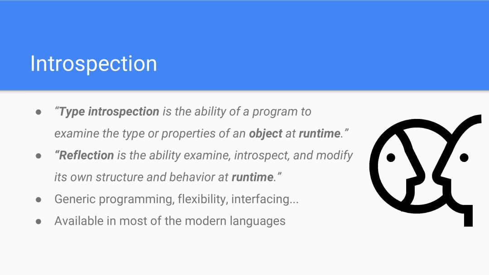

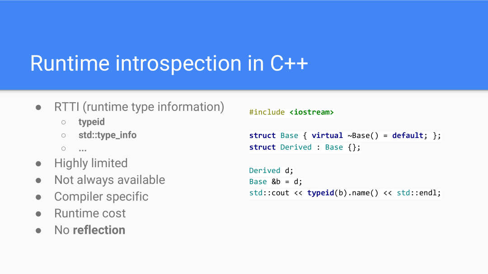

在解释什么是**SFINAE**之前，让我们探讨其主要用法之一：自省(**introspection**)。您可能已经知道，在运行时检查对象的类型或属性时，C ++并不出色。默认情况下提供的最佳功能是**RTTI**(Run-time type information)。不仅RTTI并不总是可用，而且它还提供给您的不仅仅是操作对象的当前类型。在某些情况下，例如序列化，动态语言或具有反射功能的语言确实很方便。

例如，在Python中，使用反射可以执行以下操作：

```python
class A(object):  
    ## Simply overrides the 'object.__str__' method.  
    def __str__(self):  
        return "I am a A"  

class B(object):  
    ## A custom method for my custom objects that I want to serialize.  
    def serialize(self):  
        return "I am a B"  

class C(object):  
    def __init__(self):  
        ## Oups! 'serialize' is not a method.  
        self.serialize = 0  
    def __str__(self):  
        return "I am a C"  

def serialize(obj):  
    ## Let's check if obj has an attribute called 'serialize'.  
    if hasattr(obj, "serialize"):  
        ## Let's check if this 'serialize' attribute is a method.  
        if hasattr(obj.serialize, "__call__"):  
            return obj.serialize()  
    ## Else we call the __str__ method.  
    return str(obj)  


a = A()  
b = B()  
c = C()  

print(serialize(a)) ## output: I am a A.  
print(serialize(b)) ## output: I am a B.  
print(serialize(c)) ## output: I am a C.  
```

如您所见，在序列化过程中，很容易检查对象是否具有属性并查询该属性的类型。在我们的例子中，它允许我们使用serialize方法（如果可用），否则返回到更通用的方法str。功能强大，不是吗？好吧，我们可以用纯C ++做到这一点！

这是**Boost.Hana**文档中使用**is_valid**提到的**C ++ 14**解决方案：

```cpp
#include <boost/hana.hpp>  
#include <iostream>  
#include <string>  

using namespace std;  
namespace hana = boost::hana;  

// 检查类型是否有一个serialize方法  
auto hasSerialize = hana::is_valid([](auto &&x) -> decltype(x.serialize()) {});  
// 序列化任意对象  

template<typename T>  
std::string serialize(T const &obj) {  
    return hana::if_(hasSerialize(obj),  
                     [](auto &x) { return x.serialize(); },  
                     [](auto &x) { return to_string(x); }  
    )(obj);  
}  

// 类型A只有to_string 方法  
struct A {  
};  

std::string to_string(const A &) {  
    return "I am A";  
} 

// 类型B有serialize方法  
struct B {  
    std::string serialize() const {  
        return "I am B";  
    }  
}; 

// 类型C有个serialize数据成员与to_string方法  
struct C {  
    std::string serialize;  
}; 

std::string to_string(const C &) {  
    return "I am C";  
}  


int main() {  
    A a;  
    B b;  
    C c;  
    std::cout << serialize(a) << endl;  
    std::cout << serialize(b) << endl;  
    std::cout << serialize(c) << endl;  
}  
```

如您所见，与Python相比，它只需要比Python多一点的样板，而不像您期望的那样复杂。它是如何工作的？好吧，如果您懒于阅读其余内容，这是我能给您的最简单的答案：与动态类型的语言不同，您的编译器一旦启动便可以访问许多静态类型信息。我们可以限制您的编译器对这些类型进行一些工作是有意义的！您想到的下一个问题是“如何？”。好吧，在下面，我们将探索各种选项，我们必须奴役我们喜欢的编译器以获取乐趣和收益！最后，我们将重新创建自己的**is_valid**。

### 2.老式的C++98方式


不管你的编译器是过时的，还是你的老板拒绝为最新的Visual Studio许可证付费，或者你只是喜欢考古学，这一章都会让你感兴趣。对于那些卡在c++ 11和c++ 14之间的人来说，这也很有趣。

c++ 98中的解决方案依赖于3个关键概念:**重载解析**、**SFINAE**和**sizeof**的静态行为。

> **overload resolution**, **SFINAE** and the static behavior of **sizeof**

#### 2.1重载决议

当一个函数名称和某个函数模板名称匹配时，重载决议过程大致如下：

  * 根据名称找出所有适用的函数和函数模板对于适用的函数模板，要根据实际情况对模板形参进行替换；
  * 替换过程中如果发生错误，这个模板会被丢弃
  * 在上面两步生成的可行函数集合中，编译器会寻找一个最佳匹配，产生对该函数的调用
  * 如果没有找到最佳匹配，或者找到多个匹配程度相当的函数，则编译器需要报错。

一个简单的函数调用，如“**f(obj);**”在c++中，激活一个机制，根据参数**obj**来确定应该调用哪个**f**函数。如果一组函数可以接受**obj**作为参数，那么编译器必须选择最合适的函数，或者换句话说，解决最好的重载!下面是一个很好的cppreference页面，它解释了整个过程:重载解析。

> https://en.cppreference.com/w/cpp/language/overload_resolution

在这种情况下，经验法则是编译器选择参数与参数最匹配的候选函数。没有什么比一个好的例子更好的了：

```cpp
void f(std::string s); // int can't be convert into a string.  
void f(double d); // int can be implicitly convert into a double, so this version could be selected, but...  
void f(int i); // ... this version using the type int directly is even more close!  
f(1); // Call f(int i);  
```

在c++中，也有一些可以接受任何东西的陷洞函数(sink-hole functions)。首先，函数模板接受任何类型的参数(假设是T)，但是编译器的真正黑洞、魔鬼变量真空、被遗忘类型的遗忘都是**可变参数函数**。是的，就像可怕的C **printf**。

> 可变参数函数
>
> https://en.cppreference.com/w/cpp/utility/variadic

```cpp
std::string f(...); // Variadic functions are so "untyped" that...  
template <typename T> std::string f(const T& t); // ...this templated function got the precedence!  
f(1); // Call the templated function version of f.  
```

必须记住的一点是，函数模板不如可变参数函数通用。

注意：**模板化函数**实际上可以比**普通函数**更精确。但是，在平局的情况下，**普通函数**将具有优先级。

#### 2.2 SFINAE


回忆一下上述的**重载决议**：

> 函数调用

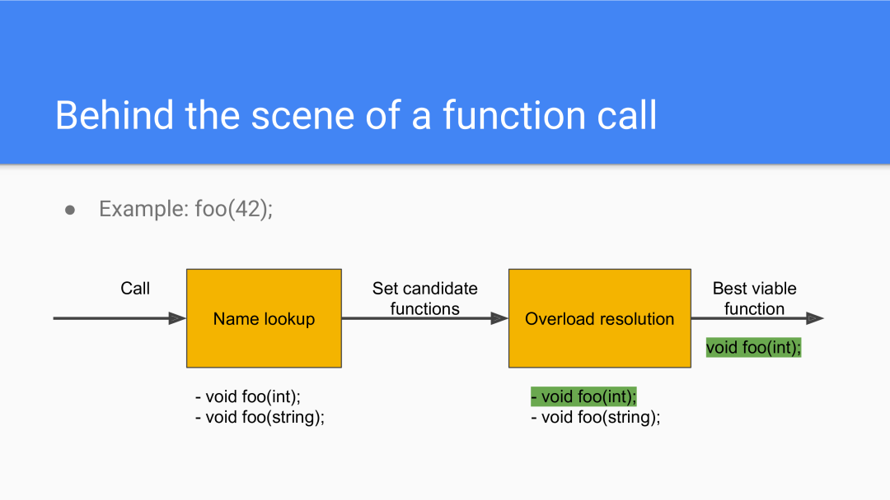

> 函数模板

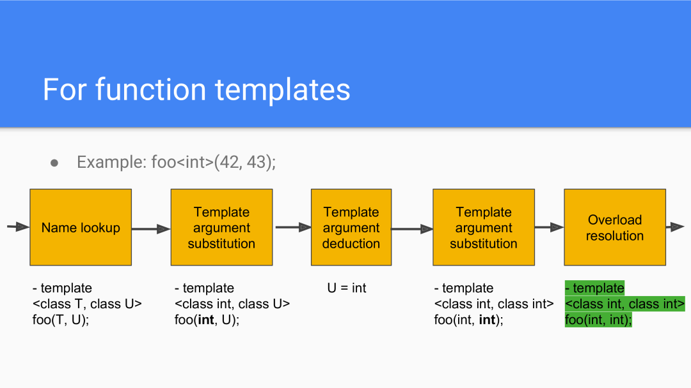

> SFINAE

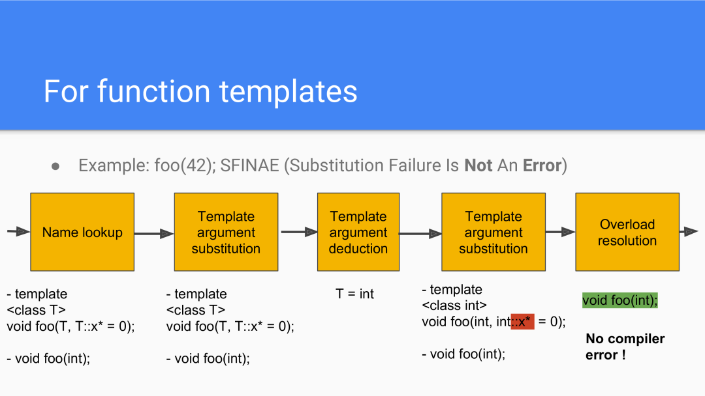

我已经用几个段落的强大功能来戏弄你了，现在终于可以解释这个并不复杂的缩写词了。SFINAE表示替换失败不是错误(**S**bstitution **F**ailure **I**s **N**ot An **E**rror)。简单地说，替换就是尝试用提供的类型或值替换模板参数的机制。在某些情况下，如果替换导致无效代码，编译器不应该抛出大量错误，而应该继续尝试其他可用的重载。SFINAE概念只是为“健全”的编译器保证这种“健全”的行为。**例
如：

```cpp
/*  
 The compiler will try this overload since it's less generic than the variadic.  
 T will be replace by int which gives us void f(const int& t, int::iterator* b = nullptr);  
 int doesn't have an iterator sub-type, but the compiler doesn't throw a bunch of errors.  
 It simply tries the next overload.  
*/  
template <typename T> void f(const T& t, typename T::iterator* it = nullptr) { }  
// The sink-hole.  
void f(...) { }  

f(1); // Calls void f(...) { }  
```

上述例子中：编译器尝试**f**重载,因为模板化函数比可变参数函数更精确(通用)。T将被int取代，这将使我们得到`void f(const int& t, int::iterator* b = nullptr);` int 没有迭代器子类型，但是编译器不会抛出一堆错误。它只是尝试下一个重载。

再来回顾一下上述的简单理解：**替换就是尝试用提供的类型或值替换模板参数的机制。在某些情况下，如果替换导致无效代码，编译器不应该抛出大量错误，而应该继续尝试其他可用的重载。SFINAE概念只是为“健全”的编译器保证这种“健全”的行为**。

所有的表达式都不会导致SFINAE。**一个广泛的规则是说功能/方法主体之外的所有替代都是“安全的”**。要获得更好的列表，请查看此Wiki页面。

> https://en.cppreference.com/w/cpp/language/sfinae

例如，**函数体内的错误替换将导致可怕的C ++模板错误**：

```cpp
// The compiler will be really unhappy when it will later discover the call to hahahaICrash.  
// 当以后发现对hahahaICrash的调用时，编译器将非常不满意。  
template <typename T> void f(T t) { t.hahahaICrash(); }  

void f(...) { } // The sink-hole wasn't even considered.  

int main() {  
    f(1);  
}  
```

经过上述的探讨，我们可以得到：

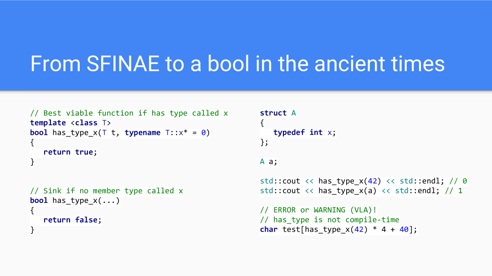

可惜`has_type_x`不是编译时，因此我们需要一个在编译时可确定的bool，引出sizeof运算符。

#### 2.3 sizeof运算符

sizeof运算符确实是一个不错的工具！它允许我们在编译时返回类型或表达式的字节大小。sizeof非常有趣，因为它精确地计算表达式，就像编译表达式一样精确。

例如，一个人可以做：

```cpp
#include <iostream>  

typedef char type_test[42];  
type_test &f() {} 

int main() {  
    // In the following lines f won't even be truly called but we can still access to the size of its return type.  
    // Thanks to the "fake evaluation" of the sizeof operator.  
    char arrayTest[sizeof(f())];  
    std::cout << sizeof(f()) << std::endl; // Output 42.  
}  
```

但是等等!如果我们能处理一些编译时整数，我们不能做一些编译时比较吗?

答案是:绝对是的(当然可以比较)，我亲爱的读者!我们在这里：

```cpp
typedef char yes; // Size: 1 byte.  
typedef yes no[2]; // Size: 2 bytes.  

// Two functions using our type with different size.  
yes &f1() {}  
no &f2() {}  

int main() {  
    std::cout << sizeof(f1()) << std::endl;  
    std::cout << sizeof(f2()) << std::endl;  
    std::cout << (sizeof(f1()) == sizeof(f2())) << std::endl; // Output 0.  
}  
```

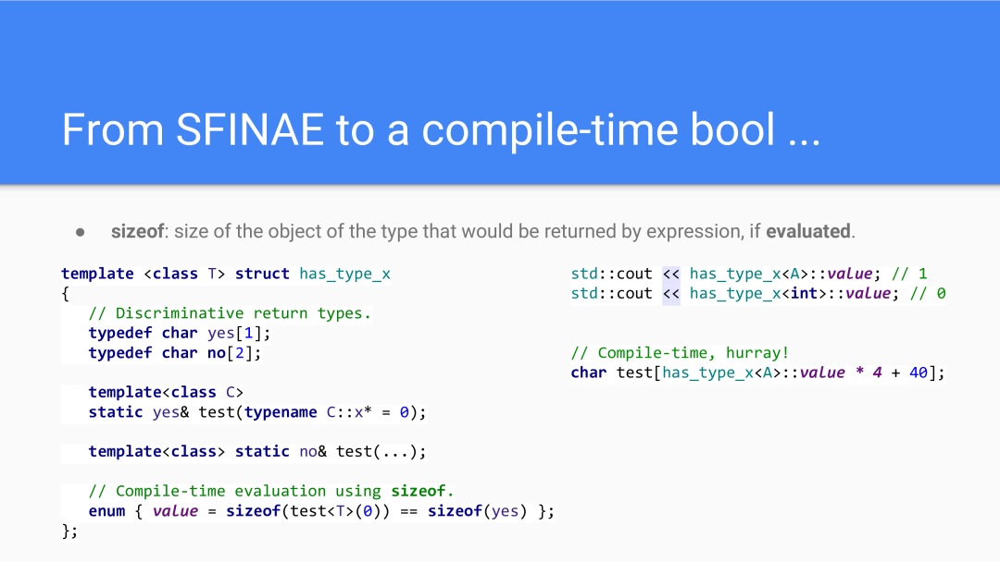

可以看到，此时`has_type_x`可以在编译时计算出来对应的value。

#### 2.4 结合一切

现在，我们有了所有工具来创建解决方案，以在编译时检查类型中方法的存在。您甚至可能已经自己解决了大部分问题。因此，让我们创建它：

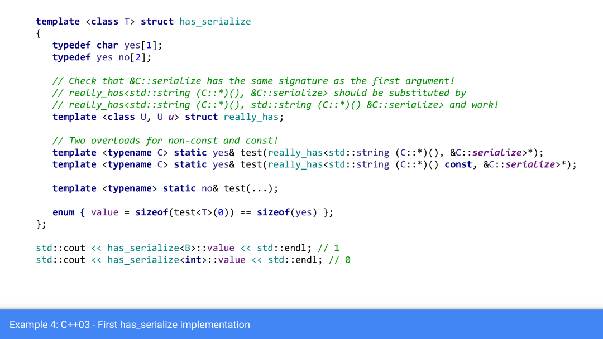

```cpp
#include <iostream>  
#include "structData.h"  

template<class T>  
struct hasSerialize {  
    // 编译时比较  
    typedef char yes[1];  
    typedef char no[2];  

    // 允许我们检查序列化确实是一种方法  
    // 第二个参数必须是第一个参数的类型  
    // 例如：reallyHas<int,10> 替换为 reallyHas<int,int 10> 并起作用  
    // 注意：它仅适用于整数常量和指针(因此函数指针可以使用)  
    // 例如：reallyHas<std::string (C::*)(), &C::serialize> 替换为  
    // reallyHas<std::string (C::*)(), std::string (C::*)() &C::serialize> 并起作用  
    template<typename U, U u>  
    struct reallyHas;  

    // std::string (C::*)() 是函数指针声明  
    template<typename C>  
    static yes &test(reallyHas<std::string (C::*)(), &C::serialize> * /*unused*/) {}  

    //  std::string (C::*)()const 函数指针 -> std::string serialize() const  
    template<typename C>  
    static yes &test(reallyHas<std::string (C::*)() const, &C::serialize> * /*unused*/) {}  

    // The famous C++ sink-hole.  
    // Note that sink-hole must be templated too as we are testing test<T>(0).  
    // If the method serialize isn't available, we will end up in this method.  
    template<typename>  
    static no &test(...) { /* dark matter */ }  

    //用作测试的返回值的常数。  
    //由于编译时评估的大小，因此实际上在这里完成了测试。  
    static const bool value = sizeof(test<T>(0)) == sizeof(yes);  
    // 或者  
    // enum { value = sizeof(test<T>(0)) == sizeof(yes) };  
}; 

int main() {  
    // 检测结构体是否有serialize方法  
    // Using the struct A, B, C defined in the previous hasSerialize example.  
    std::cout << hasSerialize<A>::value << std::endl;  
    std::cout << hasSerialize<B>::value << std::endl;  
    std::cout << hasSerialize<C>::value << std::endl;  
}  
```

realHas结构体有点棘手，但必须确保序列化是方法而不是类型的简单成员。您可以使用此解决方案的变体对类型进行大量测试（测试成员，子类型...），我建议您更多地搜索SFINAE技巧。

注意：如果您确实想要一个纯编译时常量，并且避免在旧编译器上出现一些错误，则可以用以下方法替换最后一个值评估：“`enum { value = sizeof(test(0)) == sizeof(yes) }`” 。

您可能还想知道为什么它不能与**继承**一起使用。C ++中的**继承**和**动态多态性**是一个在运行时可用的概念，换句话说，就是编译器将不会拥有且无法猜测的数据！但是，**编译时类型检查效率更高（运行时影响为0），几乎与运行时一样强大**。例如：

```cpp
// Using the previous A struct and hasSerialize helper.  
struct D : A  
{  
    std::string serialize() const  
    {  
        return "I am a D!";  
    }  
};  

template <class T> bool testHasSerialize(const T& /*t*/) { return hasSerialize<T>::value; }  

D d;  
A& a = d; // Here we lost the type of d at compile time.  
std::cout << testHasSerialize(d) << std::endl; // Output 1.  
std::cout << testHasSerialize(a) << std::endl; // Output 0.  
```

最后但并非最不重要的是，我们的测试覆盖了主要的情况，而不是像函子那样棘手的情况：(没有考虑仿函数的情况)

```cpp
struct E  
{  
    struct Functor  
    {  
        std::string operator()()  
        {  
            return "I am a E!";  
        }  
    };  
    Functor serialize;  
};  

E e;  
std::cout << e.serialize() << std::endl; // Succefully call the functor.  
std::cout << testHasSerialize(e) << std::endl; // Output 0.  
```

#### 2.5 实现我们的想法

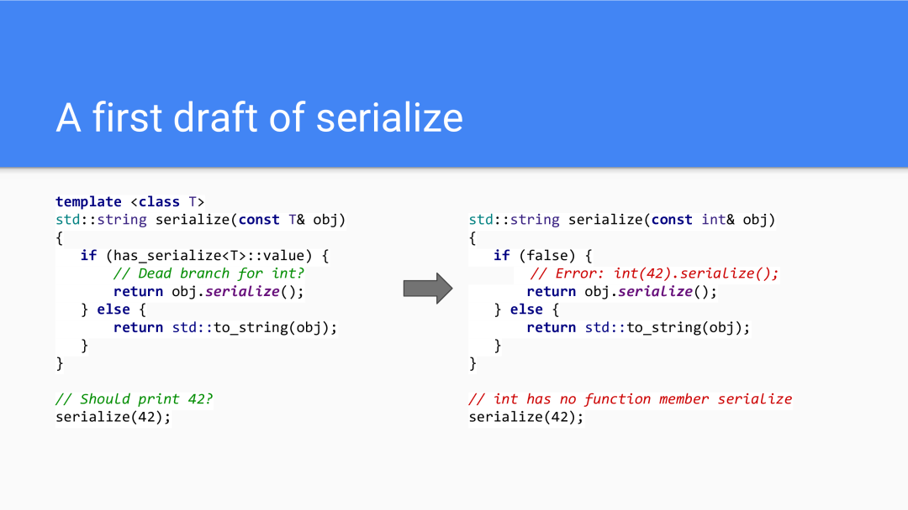

现在，您可能认为使用我们的**hasSerialize**来创建一个序列化函数非常容易!好吧，我们试试

```cpp
template <class T> std::string serialize(const T& obj)  
{  
    if (hasSerialize<T>::value) {  
        return obj.serialize(); // error: no member named 'serialize' in 'A'.  
    } else {  
        return to_string(obj);  
    }  
}  

A a;  
serialize(a);  
```

它可能很难接受，但由编译器引起的错误是绝对正常的!

模板展开后(如果考虑在替换和编译时求值之后)将获得的代码：

```cpp
std::string serialize(const A& obj)  
{  
    if (0) { // Dead branching, but the compiler will still consider it!  
        return obj.serialize(); // error: no member named 'serialize' in 'A'.  
    } else {  
        return to_string(obj);  
    }  
}  
```

分支0永远也跑不到，但是编译器还是执行到这个分支下的代码。0的分支，说明obj没有serialize函数，但是却调用了，当然出错了。

您的编译器确实是个好人，不会遗忘任何分支，因此在这种情况下，**obj**必须同时具有**serialize**方法和**`to_string`**重载。解决方案包括将序列化功能分为两个不同的功能：一个仅使用**obj.serialize()**，另一个根据**obj的类型**使用**`to_string`**。

我们回到一个已经解决的较早的问题，如何根据类型拆分？**SFINAE**，可以肯定！到那时，我们可以将**hasSerialize**函数重新构造为序列化函数，并使其返回**std::string**而不是编译时**boolean**。但是我们不会那样做！将**hasSerialize**测试与其使用序列化分开是比较干净的。

这个问题如何解决呢？

第一种解决方案：**加上constexpr**，具体后面阐述。

C++17 引入 `if constexpr` 支持在编译期执行, 可以将之应用于泛型编程中的条件判断,

```cpp
if constexpr (hasSerialize<T>::value)  
```

第二种解决方案：就是不用if语句了，而是将这个函数分成两个函数，每个函数对应一个分支。如何分？用`enable_if`：

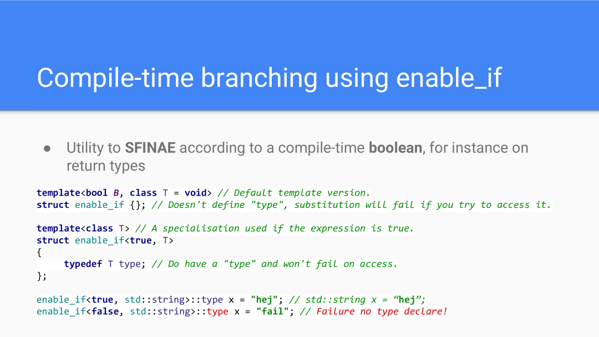SFINAE-14

```cpp
template<bool B, class T = void> // Default template version.  
struct enable_if {}; // This struct doesn't define "type" and the substitution will fail if you try to access it.  

template<class T> // A specialisation used if the expression is true.  
struct enable_if<true, T> { typedef T type; }; // This struct do have a "type" and won't fail on access.  

// Usage:  
enable_if<true, int>::type t1; // Compiler happy. t's type is int.  
enable_if<hasSerialize<B>::value, int>::type t2; // Compiler happy. t's type is int.  
enable_if<false, int>::type t3; // Compiler unhappy. no type named 'type' in 'enable_if<false, int>';  
enable_if<hasSerialize<A>::value, int>::type t4; // no type named 'type' in 'enable_if<false, int>';  
```

我们需要在“**`template <class T> std::string serialize(const T& obj)`**”签名上找到一个巧妙的SFINAE解决方案。我带给您难题的最后一部分，称为`enable_if`。

如您所见，我们可以使用**enable** if根据编译时表达式触发**替换失败**。现在我们可以在“**`template <class T> std::string serialize(const T& obj)`**”签名上使用这个错误来调度到正确的版本。最后，我们找到了问题的真正解决办法：

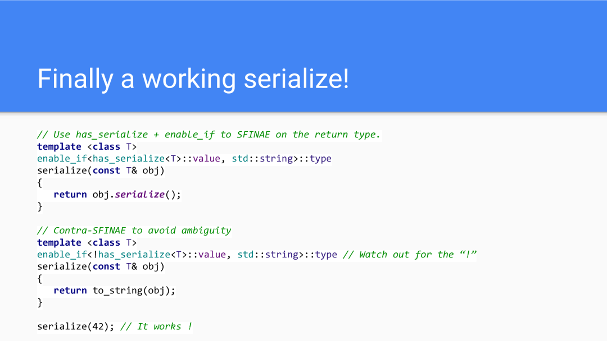

```cpp
template <class T> typename enable_if<hasSerialize<T>::value, std::string>::type serialize(const T& obj)  
{  
    return obj.serialize();  
}  

template <class T> typename enable_if<!hasSerialize<T>::value, std::string>::type serialize(const T& obj)  
{  
    return to_string(obj);  
}  

A a;  
B b;  
C c;  

// The following lines work like a charm!  
std::cout << serialize(a) << std::endl;  
std::cout << serialize(b) << std::endl;  
std::cout << serialize(c) << std::endl;  
```

值得注意两个细节！

首先，我们在返回类型上使用**`enable_if`**，以保持参数推导，否则我们将必须明确指定类型"**`serialize<A>(a)`**"。

其次，即使使用**to_string**的版本也必须使用**`enable_if`**，否则**serialize（b）**将有两个潜在的可用重载并引起歧义。如果您想查看此C ++ 98版本的完整代码，这里是要点。在C ++ 11中，生活要容易得多，所以让我们看一下这个新标准的美妙之处！

注意:同样重要的是要知道这段代码在一个表达式上创建了一个**SFINAE**(“**&C::serialize**”)。虽然这个特性不是c++98标准所要求的，但是它已经在使用了，这取决于您的编译器。它确实成为c++ 11中一个安全的选择。

#### 2.6 小结

以上C++98方式总结说出下面问题：

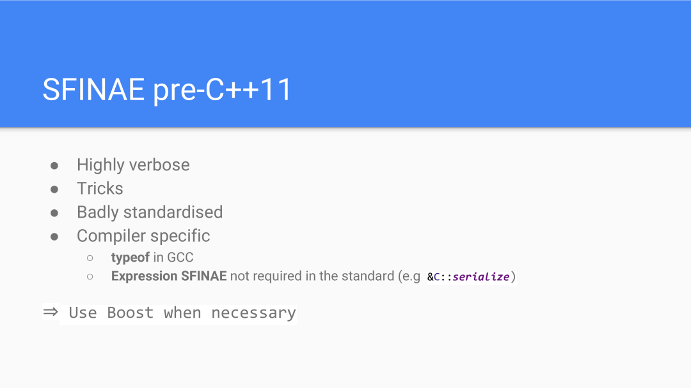SFINAE-14

### 3.C++11方式

SFINAE-14

在2000年的大世纪闰年之后，人们对未来几年相当乐观。有些人甚至决定为像我这样的下一代c++程序员设计一个新的标准!这个标准不仅可以减轻TMP的麻烦(模板元编程的副作用)，而且在第一个十年就可以使用，因此它的代码名为c++ 0x。好吧，这个标准不幸地出现在下一个十年（2011 ==> C++ 11），但是它带来了许多有趣的特性。让我们回顾一下他们。

#### 3.1 decltype, declval, auto & co

> decltype

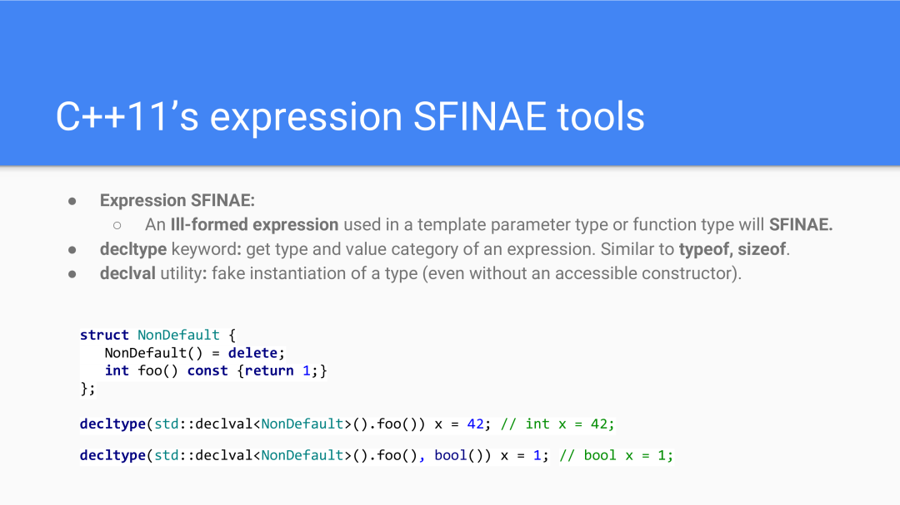

还记得**sizeof操作符**对传递给它的表达式进行“伪计算”，然后返回表达式类型的大小吗?

c++ 11增加了一个新的运算符**decltype**。**decltype**给出了它要计算的表达式的类型。由于我的善良，我不会让你举一个例子，直接给你：

```cpp
B b;  
decltype(b.serialize()) test = "test"; // Evaluate b.serialize(), which is typed as std::string.  
// Equivalent to std::string test = "test";  
```

**declval**是一个实用程序，可为您提供对无法轻松构造的类型的对象的“伪引用”。**declval**对于我们的**SFINAE**结构确实非常方便。cppreference示例非常简单，因此这里是一个副本：

```cpp
struct Default {  
    int foo() const {return 1;}  
};  

struct NonDefault {  
    NonDefault(const NonDefault&) {}  
    int foo() const {return 1;}  
};  

int main()  
{  
    decltype(Default().foo()) n1 = 1; // int n1  
//  decltype(NonDefault().foo()) n2 = n1; // error: no default constructor  
    decltype(std::declval<NonDefault>().foo()) n2 = n1; // int n2  
    std::cout << "n2 = " << n2 << '\n';  
}  
```

> auto

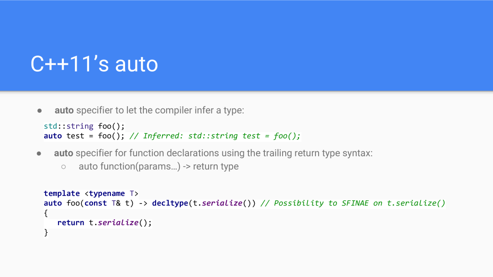

**auto specifier** 指定被声明的变量的类型将被自动推导。auto相当于c#中的var。auto在c++ 11中也有一个不太出名的函数声明用法。这里有一个很好的例子：

```cpp
bool f();  
auto test = f(); // Famous usage, auto deduced that test is a boolean, hurray!  

//                             vvv t wasn't declare at that point, it will be after as a parameter!  
template <typename T> decltype(t.serialize()) g(const T& t) {   } // Compilation error  

// Less famous usage:  
//                    vvv auto delayed the return type specification!  
//                    vvv                vvv the return type is specified here and use t!  
template <typename T> auto g(const T& t) -> decltype(t.serialize()) {   } // No compilation error.  
```

如您所见，**auto**允许使用尾随返回类型语法，并使用**decltype**以及涉及函数参数之一的表达式。这是否意味着我们可以使用它来测试**SFINAE**序列化的存在？

是的，沃森博士！**decltype**很快就会亮起来，您必须等待C ++ 14才能完成这种棘手的自动用法（但是由于它是C++ 11的功能，因此最终会在这里出现）。

> constexpr

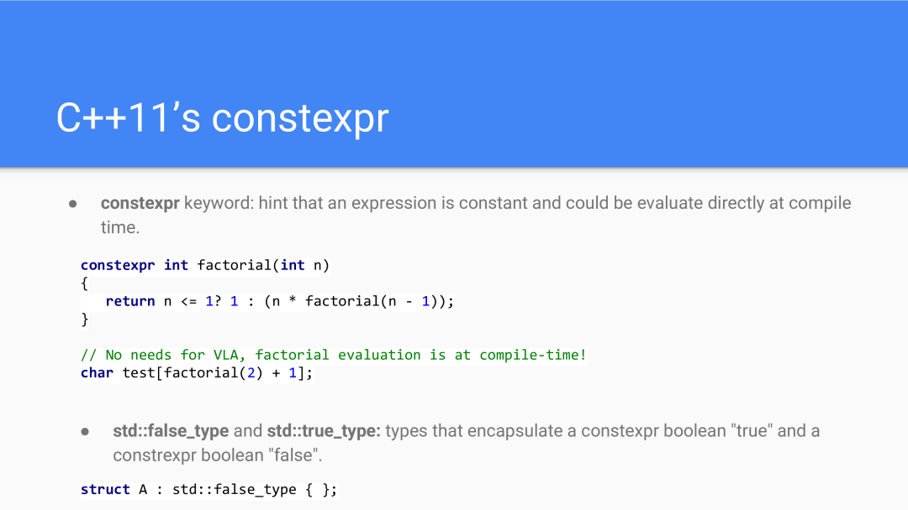

c++ 11还提供了一种执行编译时计算的新方法!

新的关键字constexpr是编译器的一个提示，这意味着这个表达式是常量，可以在编译时直接求值。在c++ 11中，constexpr有很多规则，只能使用一小部VIEs(非常重要的表达式)表达式(没有循环……)!我们仍然有足够的时间来创建编译时阶乘函数：

```cpp
constexpr int factorial(int n)  
{  
    return n <= 1? 1 : (n * factorial(n - 1));  
}  

int i = factorial(5); // Call to a constexpr function.  
// Will be replace by a good compiler by:  
// int i = 120;  
```

constexpr增加了STL中**`std::true_type`**和**`std::false_type`**的使用。顾名思义，这些类型封装了constexpr布尔值“ true”和constrexpr布尔值“false”。它们最重要的属性是类或结构可以从它们继承。例如：

```cpp
struct testStruct : std::true_type { }; // Inherit from the true type.  
constexpr bool testVar = testStruct(); // Generate a compile-time testStruct.  
bool test = testStruct::value; // Equivalent to: test = true;  
test = testVar; // true_type has a constexpr converter operator, equivalent to: test = true;  
```

### 4.融合时间


#### 4.1 第一种解决方案

在烹饪中，一个好的食谱需要把所有最好的配料按正确的比例混合。如果您不想在晚餐时使用1998年的意大利面条代码，那么让我们重新访问2011年的c++ 98 **hasSerialize**和**serialize**函数，其中包含“新鲜”的成分。让我们从消除腐烂的方法开始，使用美味的**decltype**和bake 一点点的**constexpr**而不是**sizeof**。在烤箱中烘烤15分钟后（或出现新的头痛症状），您将获得：

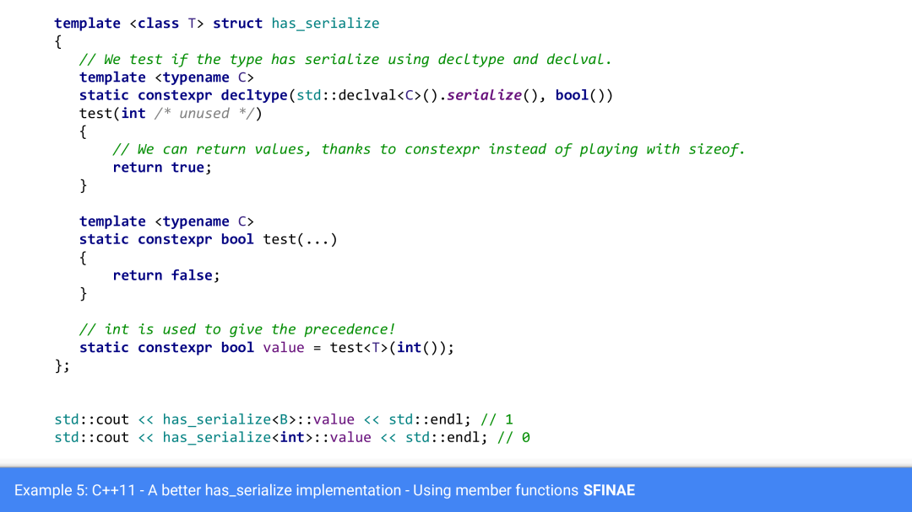

```cpp
template<class T>  
struct hasSerialize {  

    // We test if the type has serialize using decltype and declval.  
    template<typename C>  
    static constexpr decltype(std::declval<C>().serialize(), bool()) test(int /* unused */) {  
        // We can return values, thanks to constexpr instead of playing with sizeof.  
        return true;  
    }  

    template<typename C>  
    static constexpr bool test(...) {  
        return false;  
    }  

    // int is used to give the precedence!  
    static constexpr bool value = test<T>(int());  
};  
```

您可能对我使用decltype感到有些困惑。C ++逗号运算符“，”可以创建多个表达式链。在decltype中，将评估所有表达式，但仅将最后一个表达式视为该类型。序列化不需要任何更改，减去了STL中现在提供了`enable_if`函数的事实。

测试如下：

```cpp
template<class T>  
std::string serialize(const T &obj) {  
    // 不加constexpr 报错：error: no member named 'serialize' in 'A'.  
    // C++17的constexpr  
    if constexpr (hasSerialize<T>::value)  
        return obj.serialize();  
    else  
        return to_string(obj);  
}  

int main() {  
    A a;  
    B b;  
    C c;  
    // The following lines work like a charm!  
    std::cout << serialize(a) << std::endl;  
    std::cout << serialize(b) << std::endl;  
    std::cout << serialize(c) << std::endl;  
}  
```

#### 4.2 第二种解决方案

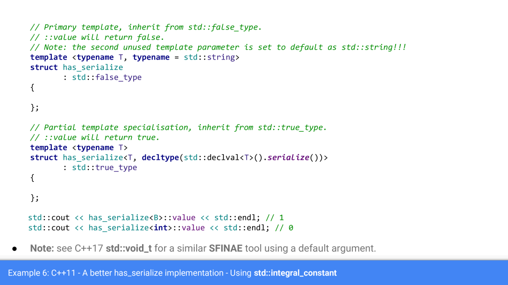

Boost.Hanna文档中介绍的另一个使用**`std::true_type`**和**`std::false_type`**的C++ 11解决方案是这样的：

```cpp
template<typename T, typename=std::string>  
struct hasSerialize : std::false_type {  
};  

template<typename T>  
struct hasSerialize<T, decltype(std::declval<T>().serialize())> : std::true_type {  
};  
// 测试同上  
```

我个人认为，这种解决方案更加狡猾！它依赖于不太知名的默认模板参数。但是，如果您的灵魂已经（堆栈）损坏，您可能会意识到默认参数会在专业领域传播。因此，当我们使用`hasSerialize<OurType>::value`**时，默认参数会起作用，并且实际上我们在 **primary template** 和 **specialisation**方面都正在寻找**`hasSerialize <OurType，std::string>::value`**。同时，将处理**decltype**的替换和求值，并且如果**OurType**具有返回**std::string**的序列化方法，则我们的**specialisation**会被替换为具有签名**`hasSerialize<OurType，std::string>`，否则替换将失败。因此，在良好情况下，**specialisation**优先。在这种情况下，将可以使用`std::void_t` C++ 17帮助程序。无论如何，这是您可以使用的要点！

我告诉过你，第二种解决方案隐藏了很多复杂性，我们仍然有很多c++ 11特性没有被利用，比如nullptr、lambda、r-values。不用担心，我们将在c++ 14中使用其中的一些。

### 5.C++14的优势

#### 5.2 auto与lambda

根据我的XFCE环境右上角的公历，我们是2015年！我可以安全地在我最喜欢的编译器上打开**C++ 14**编译标志，不是吗？好吧，我可以使用**clang**（**MSVC**是否使用maya日历？）。再一次，让我们探索新功能，并使用它们来构建精彩的东西！就像我在本文开头所承诺的那样，我们甚至将重新创建一个**is_valid**。

> auto

**（1）返回类型推断的结果**

c++ 14中的一些很酷的特性来自于auto关键字的轻松使用(用于类型推断的关键字)。现在，auto可以用于函数或方法的返回类型。例如：

```cpp
auto myFunction() // Automagically figures out that myFunction returns ints.  
{  
    return int();  
}  
```

只要类型很容易被编译器“猜测”，它就可以工作。毕竟我们是在用c++编程，而不是OCaml

> lambda

**（2）函数爱好者的功能**

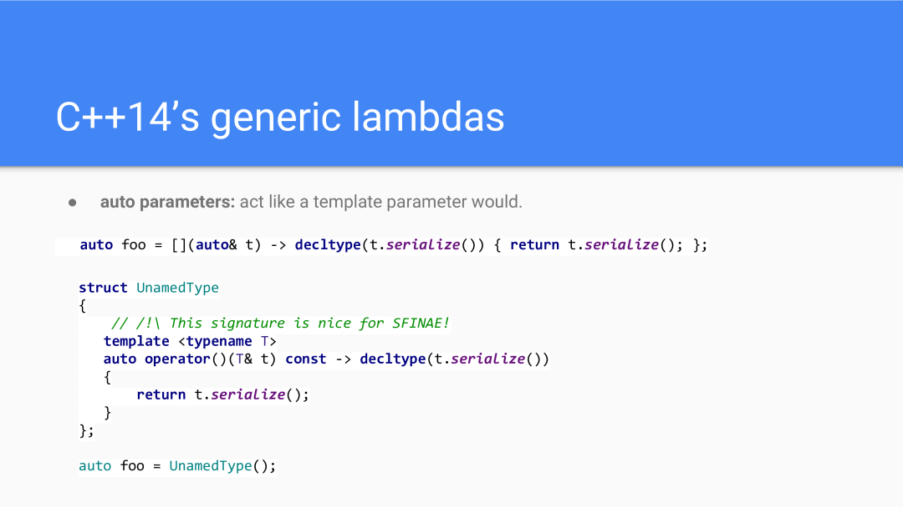

**c++ 11**介绍了**lambda**。**lambda**具有以下语法：

```cpp
[capture-list](params) -> non-mandatory-return-type { ...body... }  
```

在我们的例子中，一个有用的例子是：

```cpp
int main() {  
    B b;  

    auto l1 = [](B &b) { return b.serialize(); }; // Return type figured-out by the return statement.  
    auto l3 = [](B &b) -> std::string { return b.serialize(); }; // Fixed return type.  
    auto l2 = [](B &b) -> decltype(b.serialize()) { return b.serialize(); }; // Return type dependant to the B type.  

    std::cout << l1(b) << std::endl; // Output: I am a B!  
    std::cout << l2(b) << std::endl; // Output: I am a B!  
    std::cout << l3(b) << std::endl; // Output: I am a B!  
}  
```

**c++ 14**给**lambdas**带来了一个小的变化，但是带来了巨大的影响!

**Lambdas**接受自动参数:根据参数推导出参数类型。**Lambdas**被实现为一个具有新创建的未命名类型(也称为闭包类型)的对象。如果一个**lambda**有一些自动参数，它的“函子操作符”操作符()将被简单地模板化。让我们来看看：

```cpp    
void fun(A a,B b,C c) {  
    // ***** Simple lambda unamed type *****  
    auto l4 = [](int a, int b) { return a + b; };  
    std::cout << l4(4, 5) << std::endl; // Output 9.  

    // Equivalent to:  
    struct l4UnamedType {  
        int operator()(int a, int b) const {  
            return a + b;  
        }  
    };  

    l4UnamedType l4Equivalent = l4UnamedType();  
    std::cout << l4Equivalent(4, 5) << std::endl; // Output 9 too.  

    // ***** auto parameters lambda unnamed type *****  
    // b's type is automagically deduced!  
    auto l5 = [](auto &t) -> decltype(t.serialize()) { return t.serialize(); };  
    std::cout << l5(b) << std::endl; // Output: I am a B!  

//    std::cout << l5(a) << std::endl; // Error: no member named 'serialize' in 'A'.  
    l5UnamedType l5Equivalent = l5UnamedType();  
    std::cout << l5Equivalent(b) << std::endl; // Output: I am a B!  
//    std::cout << l5Equivalent(a) << std::endl; // Error: no member named 'serialize' in 'A'.  
}  
```

除了**lambda**本身，我们对生成的未命名类型更感兴趣:它的**lambda**操作符()可以用作**SFINAE**!

正如您所看到的，编写lambda比编写等价类型要简单。这应该使你想起我最初的解决办法：

```cpp
// Check if a type has a serialize method.  
auto hasSerialize = hana::is_valid([](auto&& x) -> decltype(x.serialize()) { });  
```

好消息是，我们现在可以重新创建**`is_valid`**一切！

#### 5.2 重建is_valid

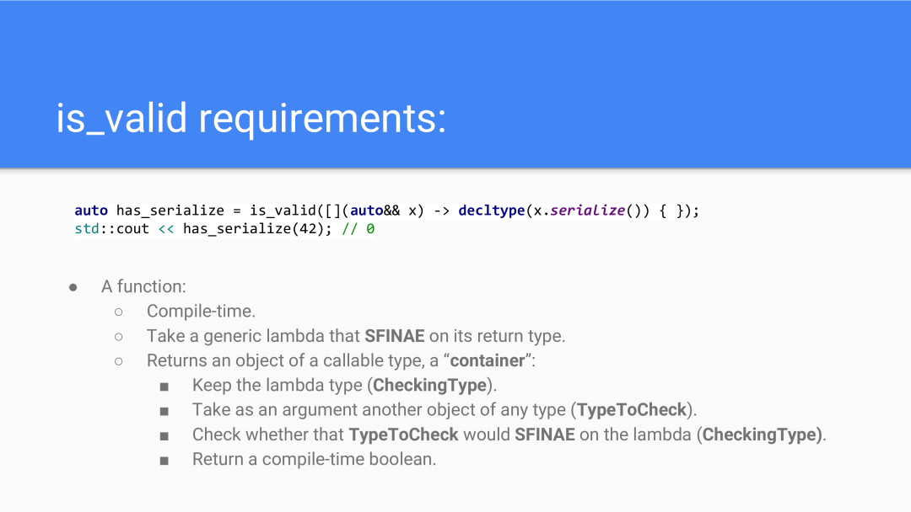

现在，我们已经有了一种非常时尚的方式，可以使用**lambda**生成具有潜在**SFINAE**属性的**未命名类型**，我们需要弄清楚如何使用它们！如您所见，**`hana::is_valid`**是一个将**lambda**作为参数并返回类型的函数。我们将**`is_valid`**返回的类型称为**container**。**container**将负责保留**lambda**的未命名类型以供以后使用。让我们从编写**`is_valid`**函数及其**container**开始：

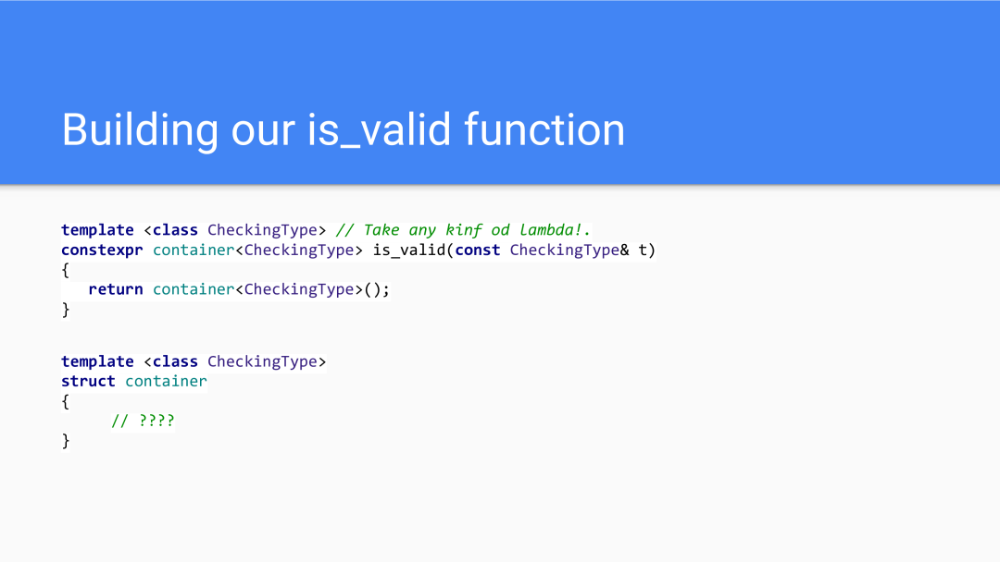

```cpp
template <typename UnnamedType> struct container  
{  
    // Remembers UnnamedType.  
};  

template <typename UnnamedType> constexpr auto is_valid(const UnnamedType& t)   
{  
    // We used auto for the return type: it will be deduced here.  
    return container<UnnamedType>();  
}  

auto test = is_valid([](const auto& t) -> decltype(t.serialize()) {})  
// Now 'test' remembers the type of the lambda and the signature of its operator()!  
```

下一步是使用operator操作符()扩展容器，例如我们可以用一个参数调用它。此参数类型将针对**UnnamedType**进行测试!为了对参数类型进行测试，我们可以再次对一个重新创建的'**UnnamedType**'对象使用**SFINAE** !它给出了这个解决方案：

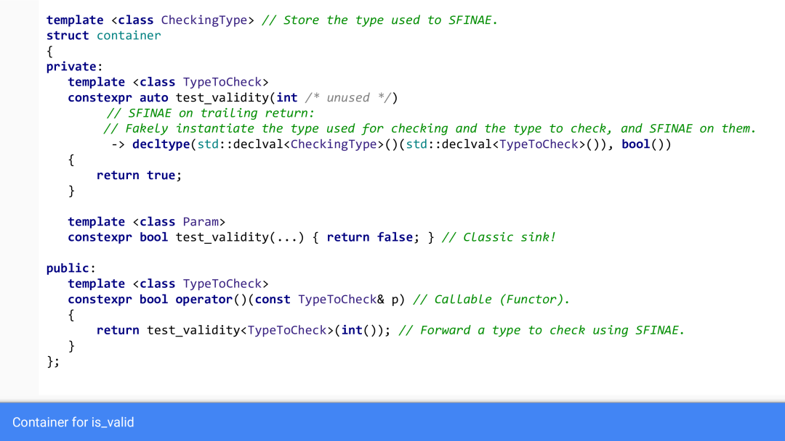

```cpp
template <typename UnnamedType> struct container  
{  
// Let's put the test in private.  
private:  
    // We use std::declval to 'recreate' an object of 'UnnamedType'.  
    // We use std::declval to also 'recreate' an object of type 'Param'.  
    // We can use both of these recreated objects to test the validity!  
    template <typename Param> constexpr auto testValidity(int /* unused */)  
    -> decltype(std::declval<UnnamedType>()(std::declval<Param>()), std::true_type())  
    {  
        // If substitution didn't fail, we can return a true_type.  
        return std::true_type();  
    }  

    template <typename Param> constexpr std::false_type testValidity(...)  
    {  
        // Our sink-hole returns a false_type.  
        return std::false_type();  
    } 

public:  
    // A public operator() that accept the argument we wish to test onto the UnnamedType.  
    // Notice that the return type is automatic!  
    template <typename Param> constexpr auto operator()(const Param& p)  
    {  
        // The argument is forwarded to one of the two overloads.  
        // The SFINAE on the 'true_type' will come into play to dispatch.  
        // Once again, we use the int for the precedence.  
        return testValidity<Param>(int());  
    }  
};  

template <typename UnnamedType> constexpr auto is_valid(const UnnamedType& t)   
{  
    // We used auto for the return type: it will be deduced here.  
    return container<UnnamedType>();  
}  

// Check if a type has a serialize method.  
auto hasSerialize = is_valid([](auto&& x) -> decltype(x.serialize()) { });  
```

如果您在这一点上有点困惑，我建议您花点时间重新阅读前面的所有示例。你已经拥有了所有你需要的武器，现在开始与c++战斗吧!

最后! ! !我们有一个工作是有效的，我们可以使用它的序列化!

如果我和我的SFINAE技巧一样邪恶，我会让你复制每个代码片段来重新创建一个完整的工作解决方案。但今天，万圣节的精神与我同在，这里是要点。嘿,嘿!不要这么快就结束这篇文章!如果你是真正的战士，你可以读最后一部分!

### 6.C++17

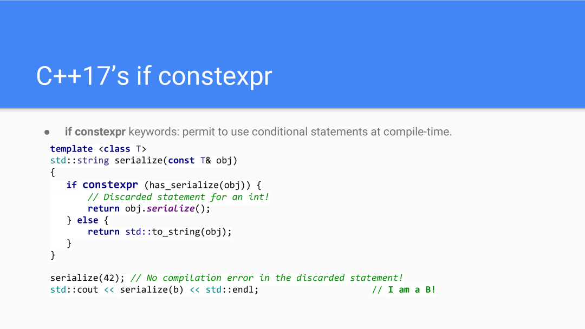

前面已经使用过这个方法了，这里提及一下即可。

### 7.For the fun

我没有告诉你几件事，是故意的。否则，我担心这篇文章要长两倍。我强烈建议您向Google询问有关我要说的内容的更多信息。

（1）首先，如果您希望有一个与Boost一起工作的解决方案。**Boost.Hana** static**if_**，您需要通过Hana的等效物来改变testValidity方法的返回类型，如下所示：

```cpp
template <typename Param> constexpr auto test_validity(int /* unused */)  
-> decltype(std::declval<UnnamedType>()(std::declval<Param>()), boost::hana::true_c)  
{  
    // If substitution didn't fail, we can return a true_type.  
    return boost::hana::true_c;  
}  

template <typename Param> constexpr decltype(boost::hana::false_c) test_validity(...)  
{  
    // Our sink-hole returns a false_type.  
    return boost::hana::false_c;  
}  
```

静态if实现非常有趣，但至少与我们在本文中解决的问题一样困难。也许有一天，我会再写一篇关于它的文章

（2）如果您注意到我们一次只检查一个参数？我们不能做这样的事情：

```cpp
auto test = is_valid([](auto&& a, auto&& b) -> decltype(a.serialize(), b.serialize()) { });  

A a;  
B b;  

std::cout << test(a, b) << std::endl;  
```
实际上，我们可以使用一些参数包。这是解决方案：

```cpp
template <typename UnnamedType> struct container  
{  
// Let's put the test in private.  
private:  
    // We use std::declval to 'recreate' an object of 'UnnamedType'.  
    // We use std::declval to also 'recreate' an object of type 'Param'.  
    // We can use both of these recreated objects to test the validity!  
    template <typename... Params> constexpr auto test_validity(int /* unused */)  
    -> decltype(std::declval<UnnamedType>()(std::declval<Params>()...), std::true_type())  
    {  
        // If substitution didn't fail, we can return a true_type.  
        return std::true_type();  
    } 

    template <typename... Params> constexpr std::false_type test_validity(...)  
    {  
        // Our sink-hole returns a false_type.  
        return std::false_type();  
    }  
public:  
    // A public operator() that accept the argument we wish to test onto the UnnamedType.  
    // Notice that the return type is automatic!  
    template <typename... Params> constexpr auto operator()(Params&& ...)  
    {  
        // The argument is forwarded to one of the two overloads.  
        // The SFINAE on the 'true_type' will come into play to dispatch.  
        return test_validity<Params...>(int());  
    }  
};  

template <typename UnnamedType> constexpr auto is_valid(UnnamedType&& t)  
{  
    // We used auto for the return type: it will be deduced here.  
    return container<UnnamedType>();  
}  

// Check if a type has a serialize method.  
auto hasSerialize = is_valid([](auto &&x) -> decltype(x.serialize()) {});  

// Notice how I simply swapped the return type on the right?  
template<class T>  
auto serialize(T &obj)  
-> typename std::enable_if<decltype(hasSerialize(obj))::value, std::string>::type {  
    return obj.serialize();  
}

template<class T>  
auto serialize(T &obj)  
-> typename std::enable_if<!decltype(hasSerialize(obj))::value, std::string>::type {  
    return to_string(obj);  
} 

int main() {  
    A a;  
    B b;  
    C c;  

    auto test = is_valid([](const auto &t) -> decltype(t.serialize()) {});  
    std::cout << test(a,b) << std::endl;  
    std::cout << test(b) << std::endl;  
    std::cout << test(c) << std::endl;  
    
    // The following lines work like a charm!  
    std::cout << serialize(a) << std::endl;  
    std::cout << serialize(b) << std::endl;  
    std::cout << serialize(c) << std::endl;  
}  
```

### 8.总结

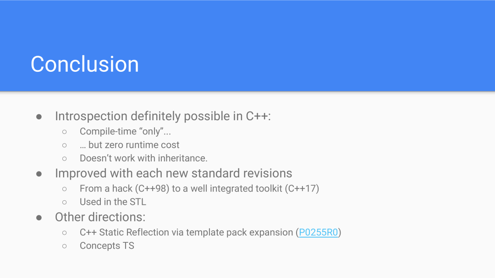
