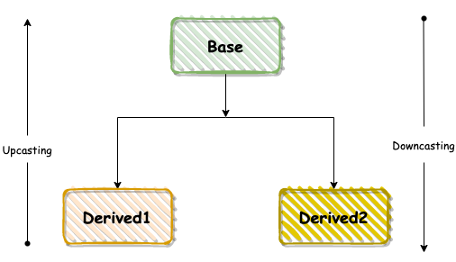
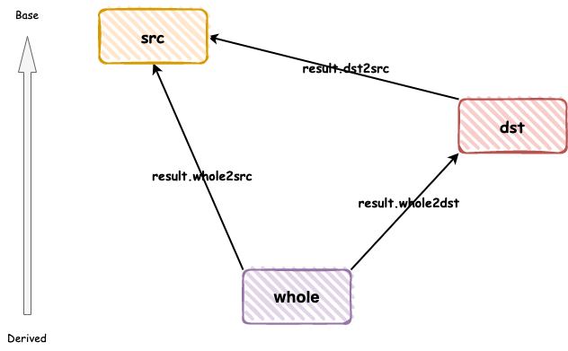

 
<!--BEGIN_DATA
{
    "create_date": "2022-12-02 22:14", 
    "modify_date": "2022-12-02 22:14", 
    "is_top": "0", 
    "summary": "C++：从技术实现角度聊聊RTTI", 
    "tags": "C/C++", 
    "file_name": "C++：从技术实现角度聊聊RTTI.md"
}
END_DATA-->

#### <p>原文出处：<a href='https://mp.weixin.qq.com/s/h_pgrd7Ui0zZwwTBJb0Sxg' target='blank'>C++：从技术实现角度聊聊RTTI</a></p>

> 第一次接触RTTI，是在<<深度探索c++对象模型>>这本书中，当时对这块的理解比较浅，可能因为知识积累不足吧。后面在工作中用到的越来越多，也逐渐加深了对其认识，但一直没有一个系统的认知，所以抽出一段时间，把这块内容整理下。

## 背景

RTTI的英文全称是"**Runtime Type Identification**"，中文称为"**运行时类型识别**"，它指的是程序在运行的时候才确定需要用到的对象是什么类型的。用于在运行时（而不是编译时）获取有关对象的信息。

在C++中，由于存在多态行为，基类指针或者引用指向一个派生类，而其指向的真正类型，在编译阶段是无法知道的：

```cpp
Base *b = new Derived;  
Base &b1 = *b;
```

在上述代码中，如果想知道b的具体类型，只能通过其他方式，而`RTTI`正是为了解决此问题而诞生，也就是说在运行时，RTTI可以通过特有的方式来告诉调用方其所
调用的对象具体信息，一般有如下几种：

  * `typeid`操作符

  * `type_info`类

  * `dynamic_cast`操作符

## typeid 和 type_info

`typeid`是C++的关键字之一，等同于`sizeof`这类的操作符。用来获取类型、变量、表达式的类型信息，适用于C++基础类型、内置类、用户自定义类、模板类等。有如下两种形式：

  * `typeid(type)`

  * `typeid(expr)`

用法如下：

```cpp
#include <cassert>  
#include <iostream>  
#include <typeinfo> 

class Base {  
public:  
  virtual float f() {   
    return 1.0;  
  }  
    
  virtual ~Base() {}  
};  

class Derived : public Base {  
};  

int main() {  
  Base* p = new Derived;  
  Base& r = *p;  
  assert(typeid(p) == typeid(Base*));  
  assert(typeid(p) != typeid(Derived*));  
  assert(typeid(r.f()) == typeid(float));  
    
  const char *name = typeid(p).name();  
    
  std::cout << name << std::endl;  
  return 0;  
} 
```

### 返回值

在上面的例子中，用到了了 **typeid(xxx).name()**，通过其名称可以看出name()函数返回的是具体类型的变量名称(以字符串的方式)，那么typeid()的类型又是什么？

在翻阅了**cppreference**之后了解到，`typeid`操作符的结果是名为`type_info`的标准库类型的对象的引用（在头文件`<typeinfo>`中定义），或者说**typeid**表达式的类型是**`const std::type_info&`** 。

ISO C++标准并没有对type_info有明确的要求，仅仅要求必须有以下几个行为接口：

  * t1 == t2 // 如果两个对象t1和t2类型相同，则返回true；否则返回false

  * t1 != t2 // 如果两个对象t1和t2类型不同，则返回true；否则返回false

  * t.name() // 返回类型的C-style字符串

  * t1.before(t2) // 抱歉，我没用过😁

正是因为标准对`type_info`做了有限的规定，这就使得每个编译器厂商对`type_info`类的实现均不相同，从而使得函数功能也不尽相同。以常用的函数typeid().name()举例，int和Base(自定义类)在VS下输出分别为**int和Base**，而在gcc编译器下，其输出为**i和4Base**，又比如typeid(std::vector).name()在gcc下输出为St6vectorIiSaIiEE，这是因为编译期对名称进行了mangle，如果我们想得到跟VS下一样结果的话，可以采用如下方式：

```cpp
#include <cxxabi.h>  
#include <iostream>  
#include <memory>  
#include <string>  
#include <typeinfo>  
#include <vector>  

std::string demangle(const char* name) {  
  int status = -4;  
  std::unique_ptr<char, void(*)(void*)> res {  
         abi::__cxa_demangle(name, NULL, NULL, &status),  
                 std::free  
         };  
  return (status==0) ? res.get() : name ;  
}  

int main() {  
  std::vector<int> v;  
  std::cout << "before: " << typeid(v).name() << " after: " << demangle(typeid(v).name()) << std::endl;  
  return 0;  
}
```

输出如下：

```cpp
before: St6vectorIiSaIiEE after: std::vector<int, std::allocator<int> >
```

下面是gcc编译器对`type_info`类的定义(仅抽取了声明部分)，如果有兴趣的读者可以点击链接自行阅读：

```cpp
class type_info {  
 public:  
  virtual ~type_info();  

  const char* name() const;  

  bool before(const type_info& __arg) const;  
  bool operator==(const type_info& __arg) const;  
  bool before(const type_info& __arg) const;  
  bool operator==(const type_info& __arg) const;  
  bool before(const type_info& __arg) const;  
  bool operator==(const type_info& __arg) const;  
  bool operator!=(const type_info& __arg) const;  

  size_t hash_code() const throw();  

  virtual bool __is_pointer_p() const;  
  virtual bool __is_function_p() const;  
  virtual bool __do_catch(const type_info *__thr_type, void **__thr_obj,  
                 unsigned __outer) const;  
  virtual bool __do_upcast(const __cxxabiv1::__class_type_info *__target,  
                  void **__obj_ptr) const; 

 protected:  
  const char *__name;  
  explicit type_info(const char *__n): __name(__n) { }  

 private:  
  type_info& operator=(const type_info&);  
  type_info(const type_info&);  
};
```

从上述定义可以看出，其析构函数声明为virtual，至少可以说明其存在子对象，那么子对象又是如何被使用的呢？

其实，`type_info`可以当做一个接口类(通过调用typeid()获取`type_info`对象，实际上返回的是一个指向子类对象的`type_info`引用)，其有多个子类，对于有虚函数的类来说，在虚函数表中有一个slot专门用来存储该对象的信息，这块内容在文章后面将有详细说明。

### 实现

在前面有提到，typeid()会**返回一个`const std::type_info&`对象**，其中存储这对象的基本信息，那么如果其类型对象为多态和非多态时候，其又有什么区别呢？

**如果类型对象至少包含一个虚函数，那么`typeid`操作符的类型是运行时的事情**，也就是说在运行时才能获取到其真正的类型信息；否则，在编译期就能获取其具体类型，甚至在某些情况下，可以对typeid()的结果直接进行替换。

#### 多态

**多态**，我们知道经常用于运行时，也就是说在运行时刻才会知道其指针或者引用指向的具体类型，如果要对一个包含虚函数的对象获取其类型信息(typeid)，那么也是在运行时才能具体知道，举例如下：

```cpp
#include <iostream>  
#include <typeinfo>  

class Base  
{  
public:  
     virtual void fun() {}  
};  

class Derived : public Base  
{  
public:  
     void fun() {}  
}; 

void fun(Base *b) {  
  const std::type_info &info = typeid(b);  
}  

int main() {  
  Base *b = new Derived;  
  fun(b);  
    
  return 0;  
}
```

上述代码汇编后(只取了部分关键代码)，如下所示：

```cpp
fun(Base*):  
        push    rbp  
        mov     rbp, rsp  
        mov     QWORD PTR [rbp-24], rdi  
        mov     QWORD PTR [rbp-8], OFFSET FLAT:typeinfo for Base*  
        pop     rbp  
        ret  
vtable for Derived:  
        .quad   0  
        .quad   typeinfo for Derived  
        .quad   Derived::fun()  
vtable for Base:  
        .quad   0  
        .quad   typeinfo for Base  
        .quad   Base::fun()  
typeinfo name for Base*:  
        .string "P4Base"  
typeinfo for Base*:  
        .quad   vtable for __cxxabiv1::__pointer_type_info+16  
        .quad   typeinfo name for Base*  
        .long   0  
        .zero   4  
        .quad   typeinfo for Base  
typeinfo name for Derived:  
        .string "7Derived"  
typeinfo for Derived:  
        .quad   vtable for __cxxabiv1::__si_class_type_info+16  
        .quad   typeinfo name for Derived  
        .quad   typeinfo for Base  
typeinfo name for Base:  
        .string "4Base"  
typeinfo for Base:  
        .quad   vtable for __cxxabiv1::__class_type_info+16  
        .quad   typeinfo name for Base
```

首先，我们看fun()函数的汇编(`fun(Base*)`:处)，在其中有一行**`OFFSET FLAT:typeinfo for Base*`**代表获取Base指针所指向对象的typeinfo。那么typeinfo又是如何获取的呢？

我们以Base指针实际指向Derived对象为例，**vtable for Derived:**部分代表着Derived类的虚函数表内容，其中有一行**typeinfo for Derived**代表着Derived类的typeinfo信息，而在该段中有一句**typeinfo name for Derived**代表着该类的名称(`7Derived经过mangle之后，该句在上述代码中可以找到`)。

综上内容，可以知道，对于存在虚函数的类来说，其对象的typeinfo信息存储在该类的虚函数表中。在运行时刻，根据指针的实际指向，获取其typeinfo()信息，从而进行相关操作。

其实，不难看出，上述汇编基本列出了类的对象布局，但仍然不是很清晰，gcc提供了一个参数 **-fdump-class-hierarchy**，可以输出类的布局信息，仍然以上述代码为例，其布局信息如下：

```cpp
Vtable for Base  
Base::_ZTV4Base: 3u entries  
0     (int (*)(...))0  
8     (int (*)(...))(& _ZTI4Base)  
16    (int (*)(...))Base::fun  

Class Base  
   size=8 align=8  
   base size=8 base align=8  
Base (0x0x7f59773402a0) 0 nearly-empty  
    vptr=((& Base::_ZTV4Base) + 16u)  

Vtable for Derived  
Derived::_ZTV7Derived: 3u entries  
0     (int (*)(...))0  
8     (int (*)(...))(& _ZTI7Derived)  
16    (int (*)(...))Derived::fun  

Class Derived  
   size=8 align=8  
   base size=8 base align=8  
Derived (0x0x7f59773756e8) 0 nearly-empty  
    vptr=((& Derived::_ZTV7Derived) + 16u)  
  Base (0x0x7f5977340300) 0 nearly-empty  
      primary-for Derived (0x0x7f59773756e8)
```

我们注意查看，以 **`_ZTI`** 开头的代表类型信息，也就是Type Info的意思(至于以`_Z`的意思嘛，我理解的是编译器的行为)，那么**`_ZTI7Derived`** 前面的`_ZTI`代表类型信息，而后面7代表类名(Derived)的长度，最后面的代表类名。通过上面内存布局信息可以看出，在虚函数表中存在一项`_ZTI7Derived`，其中存储着该对类的类型信息。

如果想要知道其具体名称，可以使用c++filt来查看，如下：

```cpp
c++filt _ZTI7Derived  
typeinfo for Derived
```

#### 非多态

代码如下：

```cpp
#include <iostream>  
#include <string>  
#include <typeinfo>  

class MyClss {  
};  

int main() {  
  MyClss s;  
  const std::type_info &info = typeid(s);  
    
  return 0;  
}
```

在上述代码中，实现了一个空类MyClass，然后在main()中，获取该类对象的typeinfo，上述代码汇编如下：

```cpp
main:  
        push    rbp  
        mov     rbp, rsp  
        mov     QWORD PTR [rbp-8], OFFSET FLAT:typeinfo for MyClss  
        mov     eax, 0  
        pop     rbp  
        ret  
typeinfo name for MyClss:  
        .string "6MyClss"  
typeinfo for MyClss:  
        .quad   vtable for __cxxabiv1::__class_type_info+16  
        .quad   typeinfo name for MyClss
```

我们注意下在源码中的第三行即**`const std::type_info &info = typeid(s);`**对应汇编的第三行即**QWORD PTR [rbp-8], OFFSET FLAT:typeinfo for MyClss**，从而可以看出，在编译期，编译器已经知道了对象的具体信息，进而可以在某些情况下，直接由编译器进行替换(比如typeinf().name()操作等)。

## dynamic_cast

记得在几年前的一次面试中，面试官提了个问题，对于`dynamic_cast`，如果操作失败了会有什么行为？当时对这块理解的也不深，所以仅仅回答了：对于指针类型转换，如果失败，则返回NULL，而对于引用，转换失败就抛出`bad_cast`。

作为C++开发人员，基本都知道`dynamic_cast`是C++中几个常用的类型转换符之一，其通过类型信息(typeinfo)进行相对安全的类型转换，在转换时，会检查转换的src对象是否真的可以转换成dst类型。**`dynamic_cast`转换符只能用于含有虚函数的类**，因此其常常用于运行期，对于不包括虚函数的类，完全可以使用其它几个转换符在编译期进行转换。通常来说，其类型转换分为**向上转换和向下转换**两种，如下图所示：



实例代码如下：

```cpp
#include <iostream>  
#include <typeinfo>  

class Base1 {  
public:  
  void f0() {}  
  virtual void f1() {}  
  int a;  
};

class Base2 {  
public:  
  virtual void f2() {}  
  int b;  
};  

class Derived : public Base1, public Base2 {  
public:  
  void d() {}  
  void f2() {}  // override Base2::f2()  
  int c;  
};  

int main() {  
  Derived *d = new Derived;  
  Base1 *b1 = new Derived;  
  Base2 *b2 = dynamic_cast<Base2*>(d); // upcasting 向上转换  
  Derived *d1 = dynamic_cast<Derived*>(b1); // downcasting 向下转换  
    
  return 0;  
}
```

### 实现

通过查阅资料，发现`dynamic_cast`最终会调用libstdc++中的`__dynamic_cast`函数，所以曾经以为`__dynamic_cast`函数就是`dynamic_cast`的实现版本，但是通过对比参数，发现并非如此：

```cpp
dynamic_cast<T*>(t); // 只有一个参数  
// __dynamic_cast声明  
__dynamic_cast (const void *src_ptr,    // object started from  
                const __class_type_info *src_type, // type of the starting object  
                const __class_type_info *dst_type, // desired target type  
                ptrdiff_t src2dst) // how src and dst are related
```

所以，有没有可能`__dynamic_cast`只是`dynamic_cast`的一个分支实现？

为了验证猜测，示例如下：

```cpp
#include <iostream>  
#include <typeinfo>  

class Base1 {  
public:  
  void f0() {}  
  virtual void f1() {}  
  int a;  
};  

class Base2 {  
public:  
  virtual void f2() {}  
  int b;  
};  

class Derived : public Base1, public Base2 {  
public:  
  void d() {}  
  void f2() {}  // override Base2::f2()  
  int c;  
};  

template <class T>  
int CheckType(T t) {  
  int n = 0;  
  if (dynamic_cast<Derived*>(t)) {  
    n |= 1;  
  }   
  if (dynamic_cast<Base1*>(t)) {  
    n |= 2;  
  }  
  if (dynamic_cast<Base2*>(t)) {  
    n |= 4;  
  }  
  return n;  
}  

int main() {  
  Derived  *d  = new Derived;  
  Base1 *b1 = new Base1;  
  Base2 *b2 = new Base2;  
  CheckType(d);  
  CheckType(b1);  
  CheckType(b2);  
  return 0;  
}
```

既然本节内容是**`dynamic_cast`**，而只在 **CheckType()**函数中才有对`dynamic_cast`的调用，那么我们着重分析CheckType函数。

首先，我们通过g++的命令-fdump-class-hierarchy获取其内存布局，Derived内存布局如下（需要注意**`32 (int(*)(...))-16`** 和 **Base2 (0x0x7f7fbbe5b6c0) 16**部分）：

```cpp
Vtable for Derived  
Derived::_ZTV7Derived: 7u entries  
0     (int (*)(...))0  
8     (int (*)(...))(& _ZTI7Derived)  
16    (int (*)(...))Base1::f1  
24    (int (*)(...))Derived::f2  
32    (int (*)(...))-16  
40    (int (*)(...))(& _ZTI7Derived)  
48    (int (*)(...))Derived::_ZThn16_N7Derived2f2Ev  

Class Derived  
   size=32 align=8  
   base size=32 base align=8  
Derived (0x0x7f7fbbf10c40) 0  
    vptr=((& Derived::_ZTV7Derived) + 16u)  
  Base1 (0x0x7f7fbbe5b660) 0  
      primary-for Derived (0x0x7f7fbbf10c40)  
  Base2 (0x0x7f7fbbe5b6c0) 16  
      vptr=((& Derived::_ZTV7Derived) + 48u)
```

#### 向上转换

在`CheckType(Derived*)`处，通过gdb进行分析，如下：

```cpp
(gdb) disas  
Dump of assembler code for function _Z9CheckTypeIP7DerivedEiT_:  
   0x00000000004009ce <+0>: push   %rbp  
   0x00000000004009cf <+1>: mov    %rsp,%rbp  
   0x00000000004009d2 <+4>: mov    %rdi,-0x18(%rbp)  
=> 0x00000000004009d6 <+8>: movl   $0x0,-0x4(%rbp)  
   0x00000000004009dd <+15>: cmpq   $0x0,-0x18(%rbp)  
   0x00000000004009e2 <+20>: je     0x4009e8 <_Z9CheckTypeIP7DerivedEiT_+26>  
   0x00000000004009e4 <+22>: orl    $0x1,-0x4(%rbp) ; if t != nullptr  
     
   0x00000000004009e8 <+26>: cmpq   $0x0,-0x18(%rbp)  
   0x00000000004009ed <+31>: je     0x4009f3 <_Z9CheckTypeIP7DerivedEiT_+37>  
   0x00000000004009ef <+33>: orl    $0x2,-0x4(%rbp) ; if t != nullptr  
     
   0x00000000004009f3 <+37>: cmpq   $0x0,-0x18(%rbp)  
   0x00000000004009f8 <+42>: je     0x400a0b <_Z9CheckTypeIP7DerivedEiT_+61>  
   0x00000000004009fa <+44>: mov    -0x18(%rbp),%rax  
   0x00000000004009fe <+48>: add    $0x10,%rax  
   0x0000000000400a02 <+52>: test   %rax,%rax  
   0x0000000000400a05 <+55>: je     0x400a0b <_Z9CheckTypeIP7DerivedEiT_+61>  
   0x0000000000400a07 <+57>: orl    $0x4,-0x4(%rbp) ; if t != nullptr && t + 0x10 != nullptr  
   0x0000000000400a0b <+61>: mov    -0x4(%rbp),%eax  
   0x0000000000400a0e <+64>: pop    %rbp  
   0x0000000000400a0f <+65>: retq  
End of assembler dump.
```

为了便于理解，在上述代码关键部分加上了注释.

我们注意到，在上述汇编代码中，没有找到外部函数调用(`__dynamic_cast`)，而仅仅是一些常用的跳转和比较指令。其中，前两条orl指令的执行条件为**t不为0**，而第三条orl指令的执行条件为**t不为0且t+16不为0**。这几个行为是在编译期完成的，也就是说在本例中，`dynamic_cast`由编译器在编译期实现了转换，所以可以说其是`静态转换`。

在前面的内存布局中，Derived对象有3个偏移量，分别为(Derived/Base1 = 0, Base2 = +0x10)，即相对于Derived和Base1其偏移量为0，而相对于Base2其偏移量为16。前两个`dynamic_cast`是`Derived* -> Derived*` 和 `Derived* -> Base1*`，都不需要调整指针，所以在CheckType的if语句中使用t的值作为`dynamic_cast`的返回值。在第三次`Derived* -> Base2*`转换中，编译时知道地址是t+0x10，所以计算t+0x10的结果就是`dynamic_cast`的返回值。

至此，我们可以说，**`dynamic_cast`操作中，向上转换是静态操作，在编译阶段完成**。

#### 向下转换

在CheckType(Base1*)处，通过gdb进行分析，如下：

```cpp
(gdb) disas  
Dump of assembler code for function _Z9CheckTypeIP5Base1EiT_:  
   0x0000000000400a10 <+0>: push   %rbp  
   0x0000000000400a11 <+1>: mov    %rsp,%rbp  
   0x0000000000400a14 <+4>: sub    $0x20,%rsp  
   0x0000000000400a18 <+8>: mov    %rdi,-0x18(%rbp)  
=> 0x0000000000400a1c <+12>: movl   $0x0,-0x4(%rbp)  
   0x0000000000400a23 <+19>: mov    -0x18(%rbp),%rax  
   0x0000000000400a27 <+23>: test   %rax,%rax  
   0x0000000000400a2a <+26>: je     0x400a4f <_Z9CheckTypeIP5Base1EiT_+63>  
   0x0000000000400a2c <+28>: mov    $0x0,%ecx ; src2dst = 0  
   0x0000000000400a31 <+33>: mov    $0x400c98,%edx ; dst_type<_ZTV7Derived>  
   0x0000000000400a36 <+38>: mov    $0x400cf8,%esi ; src_type<_ZTI5Base1>  
   0x0000000000400a3b <+43>: mov    %rax,%rdi  
   0x0000000000400a3e <+46>: callq  0x4006d0 <__dynamic_cast@plt>  
   0x0000000000400a43 <+51>: test   %rax,%rax  
   0x0000000000400a46 <+54>: je     0x400a4f <_Z9CheckTypeIP5Base1EiT_+63>  
   0x0000000000400a48 <+56>: mov    $0x1,%eax  
   0x0000000000400a4d <+61>: jmp    0x400a54 <_Z9CheckTypeIP5Base1EiT_+68>  
   0x0000000000400a4f <+63>: mov    $0x0,%eax  
   0x0000000000400a54 <+68>: test   %al,%al  
   0x0000000000400a56 <+70>: je     0x400a5c <_Z9CheckTypeIP5Base1EiT_+76>  
   0x0000000000400a58 <+72>: orl    $0x1,-0x4(%rbp)  
     
   0x0000000000400a5c <+76>: cmpq   $0x0,-0x18(%rbp)  
   0x0000000000400a61 <+81>: je     0x400a67 <_Z9CheckTypeIP5Base1EiT_+87>  
   0x0000000000400a63 <+83>: orl    $0x2,-0x4(%rbp)  
     
   0x0000000000400a67 <+87>: mov    -0x18(%rbp),%rax  
   0x0000000000400a6b <+91>: test   %rax,%rax  
   0x0000000000400a6e <+94>: je     0x400a95 <_Z9CheckTypeIP5Base1EiT_+133>  
   0x0000000000400a70 <+96>: mov    $0xfffffffffffffffe,%rcx ; src2dst = -2  
   0x0000000000400a77 <+103>: mov    $0x400ce0,%edx ; dst_type<_ZTI5Base2>  
   0x0000000000400a7c <+108>: mov    $0x400cf8,%esi ; src_type<_ZTI5Base1>  
   0x0000000000400a81 <+113>: mov    %rax,%rdi  
   0x0000000000400a84 <+116>: callq  0x4006d0 <__dynamic_cast@plt>  
   0x0000000000400a89 <+121>: test   %rax,%rax  
   0x0000000000400a8c <+124>: je     0x400a95 <_Z9CheckTypeIP5Base1EiT_+133>  
   0x0000000000400a8e <+126>: mov    $0x1,%eax  
   0x0000000000400a93 <+131>: jmp    0x400a9a <_Z9CheckTypeIP5Base1EiT_+138>  
     
   0x0000000000400a95 <+133>: mov    $0x0,%eax  
   0x0000000000400a9a <+138>: test   %al,%al  
   0x0000000000400a9c <+140>: je     0x400aa2 <_Z9CheckTypeIP5Base1EiT_+146>  
   0x0000000000400a9e <+142>: orl    $0x4,-0x4(%rbp)  
     
   0x0000000000400aa2 <+146>: mov    -0x4(%rbp),%eax  
   0x0000000000400aa5 <+149>: leaveq  
---Type <return> to continue, or q <return> to quit---  
   0x0000000000400aa6 <+150>: retq  
End of assembler dump.
```

通过上述汇编代码，很明显可以看出，`Base1* -> Base1*`不进行任何转换（这不废话嘛，类型是相同的）。而对于`Base1* -> Derived*` 以及 `Base1* -> Base2*` 则需要调用`__dynamic_cast`函数，而其所需要的参数，在汇编指令中也可以看出，下面将对该函数进行详细分析。

#### `__dynamic_cast`参数语义

声明如下：

```cpp
__dynamic_cast (const void *src_ptr,    // object started from  
                const __class_type_info *src_type, // type of the starting object  
                const __class_type_info *dst_type, // desired target type  
                ptrdiff_t src2dst) // how src and dst are related
```

在上述声明中：

  * `src_ptr`代表需要转换的指针

  * `src_type`原始类型

  * `dst_type`目标类型

  * src2dst表示从dst到src的偏移量，当该值为如下3个之一时候，有特殊含义:

    * -1: no hint

    * -2: src is not a public base of dst

    * -3: src is a multiple public base type but never a virtual base type

src2dst的值中，-2代表src 不是 dst 的公共基类，如上节中的`Base1* -> Base2*`；-3代表src是多个（dst的）公共基类并且不是虚基类，即没有虚拟继承的菱形继承。如果不为-1 -2
-3三值之一，则src2dst代表src和dst的偏移，如上一节中从`Base1* -> Base1*`转换的时候传值为0，即偏移为0；`Base1*->Base2*`转换的时候，传的值为-2(0xfffffffffffffffe)。

#### `__dynamic_cast`实现

```cpp
extern "C" void *
__dynamic_cast (const void *src_ptr,    // object started from
                const __class_type_info *src_type, // type of the starting object
                const __class_type_info *dst_type, // desired target type
                ptrdiff_t src2dst) // how src and dst are related
  {
  const void *vtable = *static_cast <const void *const *> (src_ptr);
  const vtable_prefix *prefix =
      adjust_pointer <vtable_prefix> (vtable,
              -offsetof (vtable_prefix, origin));
  const void *whole_ptr =
      adjust_pointer <void> (src_ptr, prefix->whole_object);
  const __class_type_info *whole_type = prefix->whole_type;
  __class_type_info::__dyncast_result result;

  // If the whole object vptr doesn't refer to the whole object type, we're
  // in the middle of constructing a primary base, and src is a separate
  // base.  This has undefined behavior and we can't find anything outside
  // of the base we're actually constructing, so fail now rather than
  // segfault later trying to use a vbase offset that doesn't exist.
  const void *whole_vtable = *static_cast <const void *const *> (whole_ptr);
  const vtable_prefix *whole_prefix =
    adjust_pointer <vtable_prefix> (whole_vtable,
            -offsetof (vtable_prefix, origin));
  const void *whole_vtable = *static_cast <const void *const *> (whole_ptr);
  const vtable_prefix *whole_prefix =
    (adjust_pointer <vtable_prefix>
     (whole_vtable, -ptrdiff_t (offsetof (vtable_prefix, origin))));
  if (whole_prefix->whole_type != whole_type)
    return NULL;

  // Avoid virtual function call in the simple success case.
  if (src2dst >= 0
      && src2dst == -prefix->whole_object
      && *whole_type == *dst_type)
    return const_cast <void *> (whole_ptr);

  whole_type->__do_dyncast (src2dst, __class_type_info::__contained_public,
                            dst_type, whole_ptr, src_type, src_ptr, result);
...
```

这个函数先通过`src_ptr`来初始化部分局部变量:

  * **`vtable`** 通过对`src_ptr`解引用(deref)获取

  * **`vtable_prefix`** 子对象虚函数表地址，通过vtable的类型信息和`offset_to_top`来获取

  * **`whole_ptr`** `src_ptr`最底层的派生类地址，一般为`src_ptr`的值加上`offset_to_top`

  * **`whole_type`** `src_ptr`最底层的派生类的虚函数表中的类型信息(type info)

  * **`whole_vtable`** whole对象的虚函数表地址

然后调用**`whole_type->__do_dyncast`**，而这也是该函数的核心模块。然后根据返回值的内容来判断结果，并进行相应的操作。

其中，`vtable_prefix`的定义如下：

```cpp
struct vtable_prefix   
{  
  // Offset to most derived object.  
  ptrdiff_t whole_object;  
  // Pointer to most derived type_info.  
  const __class_type_info *whole_type;   
  // What a class's vptr points to.  
  const void *origin;                 
};
```

  * `whole_object` 表示当前指针指向对象的偏移量

  * `whole_type` 指向 C++ 对象的类型：`class（基类）、si_class（单一继承类型）、vmi_class（多重或虚拟继承类型）`

  * origin 表示虚函数表的入口，等于实例的虚指针。origin在这里的作用是offsetof，反向获取`whole_object`的指针。

`__class_type_info::__dyncast_result` 定义如下：

```cpp
struct __class_type_info::__dyncast_result  
{  
  const void *dst_ptr;        // pointer to target object or NULL  
  __sub_kind whole2dst;       // path from most derived object to target  
  __sub_kind whole2src;       // path from most derived object to sub object  
  __sub_kind dst2src;         // path from target to sub object  
  int whole_details;          // details of the whole class hierarchy  
...
```

在前面提到，`__do_dyncast`被调用之后，后面就根据其出参result的返回值进行各种判断，那么result到底什么意思呢？其实，从上述定义就能看出，whole2dst代表whole对象向dst的转换结果，而whole2src代表whole对象向src的转换结果等，通过下面的图能更加清晰的理解转换过程：



在上图中，有3中类型，src、whole以及dst，`__do_dyncast`函数功能则是提供该3中类型的转换结果，在只有满足以下3中情况时候，`__dynamic_cast`才返回非空：

  * src是dst的公共基类

  * dst和src不是直接继承的关系，但是whole2src和whole2dst都是public

  * dst2src未知且whole2src是非public虚继承关系，则不使用whole，重新获取dst和src的关系

这块逻辑比较绕，其实可以将关系理解为图上的一条条连接线，节点理解为类型信息，`dynamic_cast`的过程，就是判断有没有从src到dst有没有路径的过程。

#### 继承关系

在前面的内容中，遇到过**`vtable for __cxxabiv1::__si_class_type_info+16`**这种，那么`si_class_type_info`又是什么呢？同样，在翻阅了源码之后，发现其是gcc中继承关系的一种。

在gcc中，将继承关系表示为图结构，对于类，有以下三种类型(type info):

  * `class __class_type_info : public std::type_info`

  * `class __si_class_type_info : public __class_type_info`

  * `class __vmi_class_type_info : public __class_type_info`

其中，`__class_type_info` `表示没有继承关系的类，__si_class_type_info` 表示单继承的类，`__vmi_class_type_info`表示多继承或虚拟继承的类。类名开头的si代表单继承，vmi代表虚拟或多重继承。

查看定义，`__si_class_type_info` 包含指向基类类型的单个指针，而 `__vmi_class_type_info` 包含指向基类类型的指针数组。基类类型存储其子对象的位置和基类的类型（public、virtual）。

仍然以上一节中的代码为例，使用gdb来分析`__ZTI7Derived`、`__ZTI5Base1`、`__ZTI5Base2`的关系

```cpp
(gdb) x/2xg &_ZTI7Derived
0x555555755d80 <_ZTI7Derived>:        0x00007ffff7dca5d8      0x0000555555554d74
(gdb) x/2xg 0x00007ffff7dca5d8
0x7ffff7dca5d8 <_ZTVN10__cxxabiv121__vmi_class_type_infoE+16>:  0x00007ffff7ae0920      0x00007ffff7ae0940

(gdb) p *(__cxxabiv1::__vmi_class_type_info*)0x555555755d80
$2 = {
  <__cxxabiv1::__class_type_info> = {
    <std::type_info> = {
      _vptr.type_info = 0x7ffff7dca5d8 <vtable for __cxxabiv1::__vmi_class_type_info+16>,
      __name = 0x555555554d74 <typeinfo name for Derived> "7Derived"
    }, <No data fields>},
  members of __cxxabiv1::__vmi_class_type_info:
  __flags = 0,
  __base_count = 2,
  __base_info = {{
      __base_type = 0x555555755dc8 <typeinfo for Base1>,
      __offset_flags = 2
    }}

(gdb) p (*(__cxxabiv1::__vmi_class_type_info*)0x555555755d80)->__base_info[0]
$4 = {
  __base_type = 0x555555755dc8 <typeinfo for Base1>,
  __offset_flags = 2     <---- __public_mask(2) | offset:0x00
}
(gdb) p (*(__cxxabiv1::__vmi_class_type_info*)0x555555755d80)->__base_info[1]
$5 = {
  __base_type = 0x555555755db8 <typeinfo for Base2>,
  __offset_flags = 4098  <---- __public_mask(2) | offset:0x10
}

(gdb) x/2xg 0x555555755dc8
0x555555755dc8 <_ZTI5Base1>:       0x00007ffff7dc98d8      0x0000555555554d7b
(gdb) x/2xg 0x00007ffff7dc98d8
0x7ffff7dc98d8 <_ZTVN10__cxxabiv117__class_type_infoE+16>:      0x00007ffff7add930      0x00007ffff7add950

(gdb) x/2xg 0x555555755db8
0x555555755db8 <_ZTI5Base2>:       0x00007ffff7dc98d8      0x0000555555554d77
(gdb) x/2xg 0x00007ffff7dc98d8
0x7ffff7dc98d8 <_ZTVN10__cxxabiv117__class_type_infoE+16>:      0x00007ffff7add930      0x00007ffff7add950

(gdb) p *(__cxxabiv1::__class_type_info*)0x555555755dc8
$6 = {
  <std::type_info> = {
    _vptr.type_info = 0x7ffff7dc98d8 <vtable for __cxxabiv1::__class_type_info+16>,
    __name = 0x555555554d7b <typeinfo name for Base1> "5Base1"
  }, <No data fields>}

(gdb) p *(__cxxabiv1::__class_type_info*)0x555555755db8
$7 = {
  <std::type_info> = {
    _vptr.type_info = 0x7ffff7dc98d8 <vtable for __cxxabiv1::__class_type_info+16>,
    __name = 0x555555554d77 <typeinfo name for Base2> "5Base2"
  }, <No data fields>}
```

通过上述代码，可以看出_ZTI7Derived是`__vmi_class_type_info`的一个实例，其基类数组的类型分别是`_ZTI5Base1`和`_ZTI5Base2`，通过将这些类型展开，就能获取一张图结构，进而说明`dynamic_cast`的过程就是遍历图结构确定路径关系的过程，采用的是**深度优先搜索**。

## 结语

断断续续写了一个月，期间经历了病毒的折磨，总算是完成了。

至此，算是对gcc的RTTI实现有了一个初步的认识，由于文章内容通过调查资料以及分析源码，所以可能会有理解偏差，欢迎指正。
