<!--BEGIN_DATA
{
    "create_date": "2020-11-11 16:08", 
    "modify_date": "2020-11-11 16:08", 
    "is_top": "0", 
    "summary": "1.版本管理工具及Ruby工具链环境<br/>2.整体把握CocoaPods核心组件<br/>Ex1.CocoaPods中的Ruby特性之Mix-in", 
    "tags": "iOS、工具", 
    "file_name": "CocoaPods历险记01.md"
}
END_DATA-->

#### <p>原文出处：<a href='https://mp.weixin.qq.com/s?__biz=MzA5MTM1NTc2Ng==&mid=2458322728&idx=1&sn=3a16de4b2adae7c57bbfce45858dfe06&chksm=870e0831b0798127994902655fdee3be7d6abd53734428dd8252b8f584343aad217e77a70920&scene=178&cur_album_id=1477103239887142918#rd' target='blank'>1. 版本管理工具及 Ruby 工具链环境</a></p>


> **CocoaPods 历险记**这个专题是 **Edmond **和 **冬瓜** 共同撰写，对于 iOS / macOS 工程中版本管理工具 CocoaPods 的实现细节、原理、源码、实践与经验的分享记录，旨在帮助大家能够更加了解这个依赖管理工具，而不仅局限于 `pod install` 和 `pod update`。

## 本文知识目录

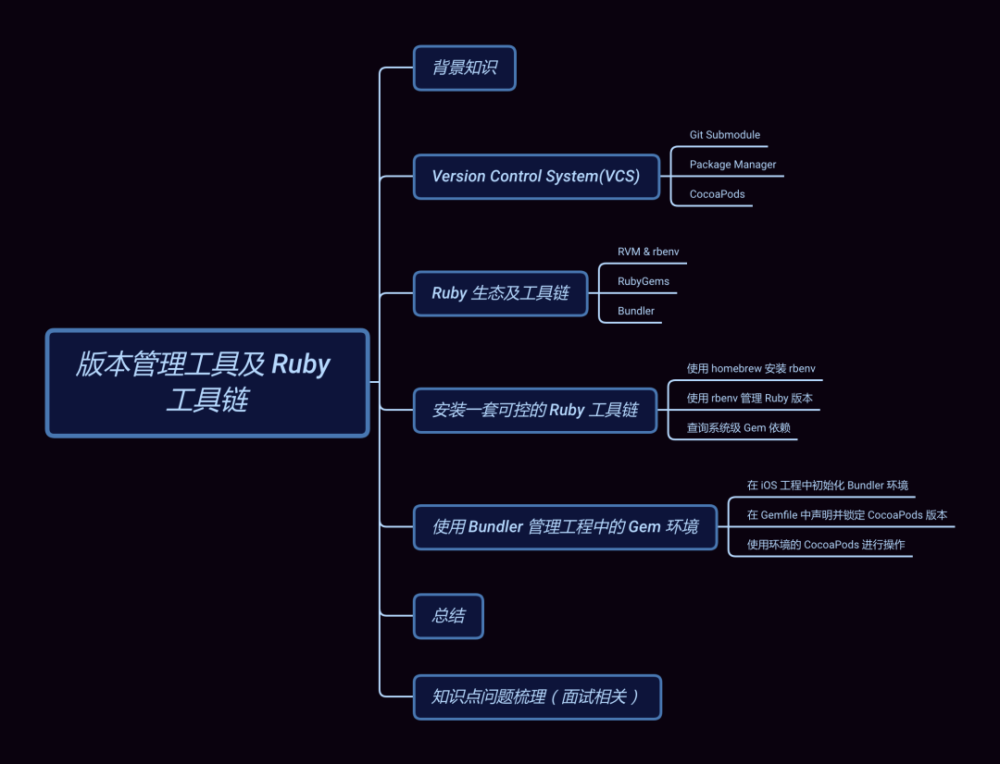 
版本管理工具及 Ruby工具链

## 背景

`CocoaPods` 作为业界标准，各位 iOS 开发同学应该都不陌生。不过很多同学对 `CocoaPods` 的使用基本停留在 `pod install` 和 `pod update` 上。一旦项目组件化，各业务线逻辑拆分到独立的 `Pod` 中后，光了解几个简单 `Pod` 命令是无法满足需求的，同时还面临开发环境的一致性，`Pod` 命令执行中的各种异常错误，都要求我们对其有更深层的认知和 ????。

关于 `CocoaPods` 深入的文章有很多，推荐 ObjC China 的这篇，深入理解 CocoaPods[1]，而本文希望从依赖管理工具的角度来谈谈`CocoaPods` 的管理理念。

## Version Control System (VCS)

> Version control systems are a category of software tools that help a software team manage changes to source code over time. Version control software keeps track of every modification to the code in a special kind of database.

软件工程中，版本控制系统是敏捷开发的重要一环，为后续的持续集成提供了保障。`Source Code Manager` (SCM) 源码管理就属于 VCS 的范围之中，熟知的工具有如 `Git` 。而 `CocoaPods` 这种针对各种语言所提供的 `Package Manger (PM)`也可以看作是 SCM 的一种。

而像 `Git` 或 `SVN` 是针对项目的单个文件的进行版本控制，而 PM 则是以每个独立的 Package 作为最小的管理单元。包管理工具都是结合`SCM` 来完成管理工作，对于被 PM 接管的依赖库的文件，通常会在 `Git` 的 `.ignore` 文件中选择忽略它们。

例如：在 `Node` 项目中一般会把 `node_modules` 目录下的文件 ignore 掉，在 iOS / macOS 项目则是 `Pods`。

### Git Submodule

 Git
Submodule

> Git submodules allow you to keep a git repository as a subdirectory of another git repository. Git submodules are simply a reference to another repository at a particular snapshot in time. Git submodules enable a Git repository to incorporate and track version history of external code.

**`Git Submodules` 可以算是 PM 的“青春版”，它将单独的 git 仓库以子目录的形式嵌入在工作目录中**。它不具备 PM 工具所特有的语义化版本[2]管理、无法处理依赖共享与冲突等。只能保存每个依赖仓库的文件状态。

`Git` 在提交更新时，会对所有文件制作一个快照并将其存在数据库中。Git 管理的文件存在 3 种状态：

  * **working director：** 工作目录，即我们肉眼可见的文件

  * **stage area：** 暂存区 (或称 `index area` )，存在 `.git/index` 目录下，保存的是执行 `git add` 相关命令后从工作目录添加的文件。

  * **commit history：** 提交历史，存在 `.git/` 目录下，到这个状态的文件改动算是入库成功，基本不会丢失了。

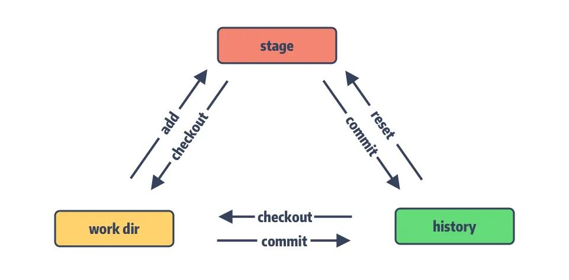

Git submodule 是依赖 `.gitmodules` 文件来记录子模块的。


```ruby
[submodule "ReactNative"]
 path = ReactNative
 url = https://github.com/facebook/ReactNative.git
```


`.gitmodules` 仅记录了 path 和 url 以及模块名称的基本信息， 但是我们还需要记录每个 Submodule Repo 的 commit 信息，而这 commit 信息是记录在 `.git/modules` 目录下。同时被添加到 `.gitmodules` 中的 path 也会被 git 直接 ignore 掉。

### Package Manger

作为 Git Submodule 的强化版，PM基本都具备了语义化的版本检查能力，依赖递归查找，依赖冲突解决，以及针对具体依赖的构建能力和二进制包等。简单对比如下：

<table data-tool="mdnice编辑器"><thead><tr style="border-width: 1px 0px 0px;border-right-style: initial;border-bottom-style: initial;border-left-style: initial;border-right-color: initial;border-bottom-color: initial;border-left-color: initial;border-top-style: solid;border-top-color: rgb(204, 204, 204);background-color: white;"><th style="border-top-width: 1px;border-color: rgb(204, 204, 204);text-align: left;background-color: rgb(240, 240, 240);"><strong>Key File</strong></th><th style="border-top-width: 1px;border-color: rgb(204, 204, 204);text-align: left;background-color: rgb(240, 240, 240);"><strong>Git submodule</strong></th><th style="border-top-width: 1px;border-color: rgb(204, 204, 204);text-align: left;background-color: rgb(240, 240, 240);"><strong>CocoaPods</strong></th><th style="border-top-width: 1px;border-color: rgb(204, 204, 204);text-align: left;background-color: rgb(240, 240, 240);"><strong>SPM</strong></th><th style="border-top-width: 1px;border-color: rgb(204, 204, 204);text-align: left;background-color: rgb(240, 240, 240);"><strong>npm</strong></th></tr></thead><tbody style="border-width: 0px;border-style: initial;border-color: initial;"><tr style="border-width: 1px 0px 0px;border-right-style: initial;border-bottom-style: initial;border-left-style: initial;border-right-color: initial;border-bottom-color: initial;border-left-color: initial;border-top-style: solid;border-top-color: rgb(204, 204, 204);background-color: white;"><td style="border-color: rgb(204, 204, 204);"><strong>描述文件</strong></td><td style="border-color: rgb(204, 204, 204);">.gitmodules</td><td style="border-color: rgb(204, 204, 204);">Podfile</td><td style="border-color: rgb(204, 204, 204);">Package.swift</td><td style="border-color: rgb(204, 204, 204);">Package.json</td></tr><tr style="border-width: 1px 0px 0px;border-right-style: initial;border-bottom-style: initial;border-left-style: initial;border-right-color: initial;border-bottom-color: initial;border-left-color: initial;border-top-style: solid;border-top-color: rgb(204, 204, 204);background-color: rgb(248, 248, 248);"><td style="border-color: rgb(204, 204, 204);"><strong>锁存文件</strong></td><td style="border-color: rgb(204, 204, 204);">.git/modules</td><td style="border-color: rgb(204, 204, 204);">Podfile.lock</td><td style="border-color: rgb(204, 204, 204);">Package.resolved</td><td style="border-color: rgb(204, 204, 204);">package-lock.json</td></tr></tbody></table>

从表可见，PM 工具基本围绕这个两个文件来现实包管理：

  * **描述文件**：声明了项目中存在哪些依赖，版本限制；

  * **锁存文件（Lock 文件）**：记录了依赖包最后一次更新时的全版本列表。

除了这两个文件之外，中心化的 PM 一般会提供依赖包的托管服务，比如 npm 提供的 npmjs.com[3] 可以集中查找和下载 npm
包。如果是去中心化的 PM 比如 `iOS` 的 `Carthage` 和 `SPM` 就只能通过 Git 仓库的地址了。

### CocoaPods

 
image.png

**`CocoaPods`  是开发 iOS/macOS 应用程序的一个第三方库的依赖管理工具。** 利用 `CocoaPods`，可以定义自己的依赖关系（简称 `Pods`），以及在整个开发环境中对第三方库的版本管理非常方便。

下面我们以 `CocoaPods` 为例。

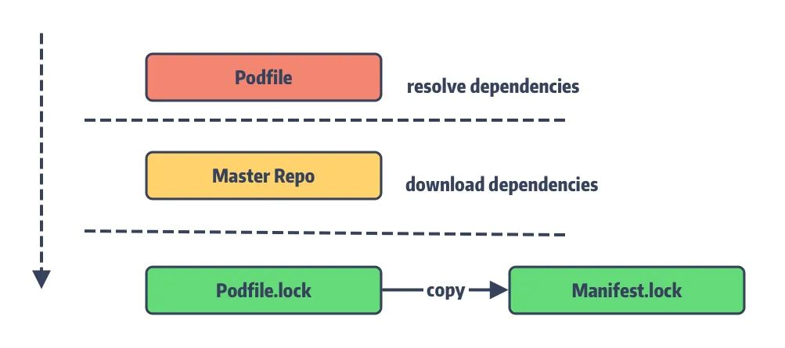

#### `Podfile`

`Podfile` 是一个文件，以 DSL（其实直接用了 Ruby 的语法）来描述依赖关系，用于定义项目所需要使用的第三方库。该文件支持高度定制，你可以根据个人喜好对其做出定制。更多相关信息，请查阅 Podfile 指南[4]。

#### `Podfile.lock`

这是 `CocoaPods` 创建的最重要的文件之一。它记录了需要被安装的 Pod 的每个已安装的版本。如果你想知道已安装的 `Pod` 是哪个版本，可以查看这个文件。推荐将 `Podfile.lock` 文件加入到版本控制中，这有助于整个团队的一致性。

#### `Manifest.lock`

这是每次运行 `pod install` 命令时创建的 `Podfile.lock` 文件的副本。如果你遇见过这样的错误 **沙盒文件与`Podfile.lock` 文件不同步 (The sandbox is not in sync with the `Podfile.lock`)**，这是因为 `Manifest.lock` 文件和 `Podfile.lock` 文件不一致所引起。由于 `Pods` 所在的目录并不总在版本控制之下，这样可以保证开发者运行 App 之前都能更新他们的 `Pods`，否则 App 可能会crash，或者在一些不太明显的地方编译失败。

#### Master Specs Repo

> Ultimately, the goal is to improve discoverability of, and engagement in, third party open-source libraries, by creating a more centralized ecosystem.

作为包管理工具，`CocoaPods` 的目标是为我们提供一个更加集中的生态系统，来提高依赖库的可发现性和参与度。本质上是为了提供更好的检索和查询功能，可惜成为了它的问题之一。因为`CocoaPods` 通过官方的 Spec 仓库来管理这些注册的依赖库。随着不断新增的依赖库导致 Spec 的更新和维护成为了使用者的包袱。

好在这个问题在 1.7.2 版本中已经解决了，`CocoaPods` 提供了 Mater Repo CDN[5] ，可以直接 CDN 到对应的 Pod 地址而无需在通过本地的 Spec 仓库了。同时在 1.8 版本中，官方默认的 Spec 仓库已替换为 CDN，其地址为https://cdn.cocoapods.org[6]。

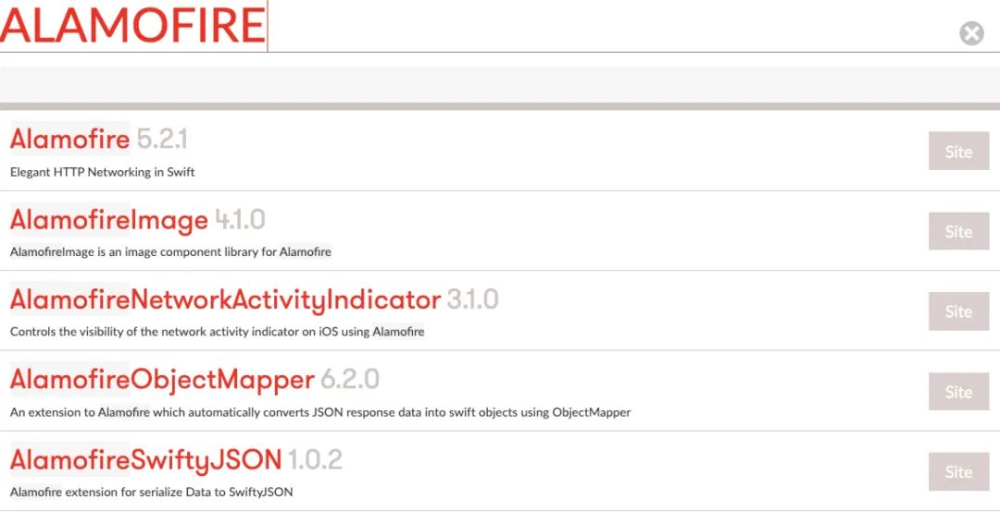 
Spec 仓静态页

## Ruby 生态及工具链

对于一部分仅接触过 `CocoaPods` 的同学，其 PM 可能并不熟悉。其实 `CocoaPods` 的思想借鉴了其他语言的 PM 工具，例：`RubyGems`[7], `Bundler`[8], `npm`[9] 和 `Gradle`[10]。

我们知道 `CocoaPods` 是通过 Ruby 语言实现的。它本身就是一个 `Gem` 包。理解了 Ruby 的依赖管理有助于我们更好的管理不同版本的`CocoaPods` 和其他 `Gem`。同时能够保证团队中的所有同事的工具是在同一个版本，这也算是敏捷开发的保证吧。

### `RVM` & `rbenv`

 
RVM vs rbenv

**`RVM`[11] 和 `rbenv`[12] 都是管理多个 Ruby 环境的工具，它们都能提供不同版本的 Ruby 环境管理和切换。**

> **具体哪个更好要看个人习惯。** 当然 `rbenv` 官方是这么说的 Why rbenv[13] 。本文后续的实验也都是是使用 `rbenv` 进行演示。

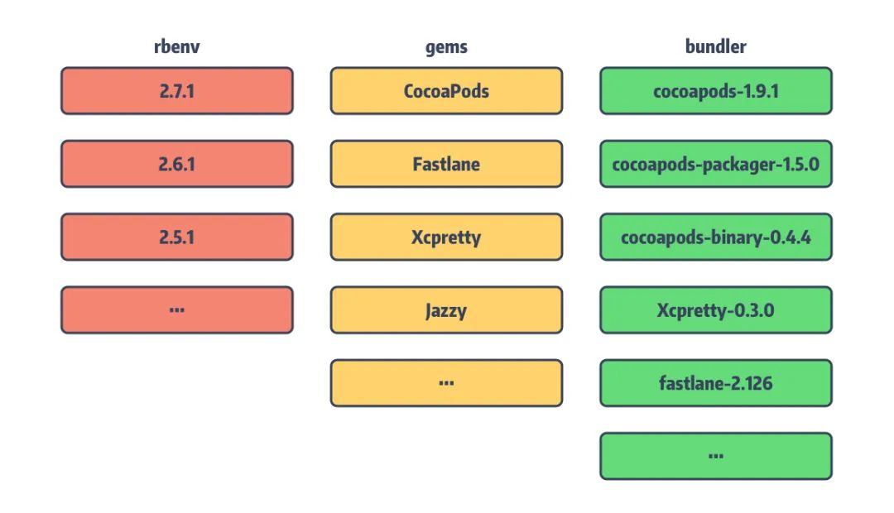 
层级关系

### RubyGems

 
RubyGems

> The RubyGems software allows you to easily download, install, and use ruby software packages on your system. The software package is called a “gem” which contains a packaged Ruby application or library.

**RubyGems[14] 是 Ruby 的一个包管理工具，这里面管理着用 Ruby 编写的工具或依赖我们称之为 Gem。**

并且 RubyGems 还提供了 Ruby 组件的托管服务，可以集中式的查找和安装 library 和 apps。当我们使用 `gem install xxx` 时，会通过 `rubygems.org` 来查询对应的 Gem Package。而 iOS 日常中的很多工具都是 Gem 提供的，例：`Bundler`，`fastlane`，`jazzy`，`CocoaPods` 等。

在默认情况下 Gems 总是下载 library 的最新版本，这无法确保所安装的 library 版本符合我们预期。因此我们还缺一个工具。

### Bundler

 
Bundler

**Bundler[15] 是管理 Gem 依赖的工具，可以隔离不同项目中 Gem 的版本和依赖环境的差异，也是一个 Gem。**

Bundler 通过读取项目中的依赖描述文件 `Gemfile` ，来确定各个 Gems 的版本号或者范围，来提供了稳定的应用环境。当我们使用`bundle install` 它会生成 `Gemfile.lock` 将当前 librarys 使用的具体版本号写入其中。之后，他人再通过 `bundle install` 来安装 libaray 时则会读取 `Gemfile.lock` 中的 librarys、版本信息等。

#### `Gemfile`

**可以说 `CocoaPods` 其实是 iOS 版的 RubyGems + Bundler 组合。Bundler 依据项目中的 `Gemfile` 文件来管理 Gem，而`CocoaPods` 通过 Podfile 来管理 Pod。**

Gemfile[16] 配置如下：


```ruby
source 'https://gems.example.com' do
  gem 'cocoapods', '1.8.4'是管理 Gem 依赖的工具
  gem 'another_gem', :git => 'https://looseyi.github.io.git', :branch => 'master'
end
```

可见，Podfile 的 DSL 写法和 Gemfile 如出一辙。那什么情况会用到 Gemfile 呢 ？

`CocoaPods` 每年都会有一些重大版本的升级，前面聊到过 `CocoaPods` 在 `install` 过程中会对项目的 `.xcodeproj`文件进行修改，不同版本其有所不同，这些在变更都可能导致大量 `conflicts`，处理不好，项目就不能正常运行了。我想你一定不愿意去修改`.xcodeproj` 的冲突。

如果项目是基于 `fastlane` 来进行持续集成的相关工作以及 App 的打包工作等，也需要其版本管理等功能。

## 如何安装一套可管控的 Ruby 工具链？

讲完了这些工具的分工，然后来说说实际的运用。**我们可以使用 `homebrew` + `rbenv` + `RubyGems` + `Bundler`这一整套工具链来控制一个工程中 Ruby 工具的版本依赖。**

以下是我认为比较可控的 Ruby 工具链分层管理图。下面我们逐一讲述每一层的管理方式，以及实际的操作方法。

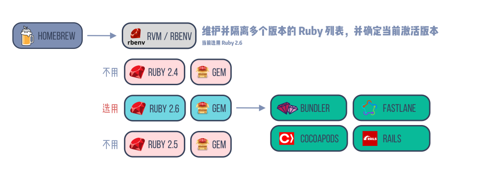 
可管控工具链的分层结构

### 1. 使用 `homebrew` 安装 `rbenv`


```ruby
$ brew install rbenv
```

安装成功后输入 `rbenv`  就可以看到相关提示：


```ruby
$ rbenv
rbenv 1.1.2
Usage: rbenv <command> [<args>]
Some useful rbenv commands are:
   commands    List all available rbenv commands
   local       Set or show the local application-specific Ruby version
   global      Set or show the global Ruby version
   shell       Set or show the shell-specific Ruby version
   install     Install a Ruby version using ruby-build
   uninstall   Uninstall a specific Ruby version
   rehash      Rehash rbenv shims (run this after installing executables)
   version     Show the current Ruby version and its origin
   versions    List installed Ruby versions
   which       Display the full path to an executable
   whence      List all Ruby versions that contain the given executable
See `rbenv help <command>' for information on a specific command.
For full documentation, see: https://github.com/rbenv/rbenv#readme
```

### 2. 使用 `rbenv` 管理 Ruby 版本

使用 `rbenv`  来安装一个 Ruby 版本，这里我使用刚刚 release Ruby 2.7：


```ruby
$ rbenv install 2.7.0
```

这个安装过程有些长，因为要下载 `openssl` 和 Ruby 的解释器，大概要 20 分钟左右。

安装成功后，我们让其在本地环境中生效：


```ruby
$ rbenv shell 2.7.0
```

> 输入上述命令后，可能会有报错。`rbenv`  提示我们在 `.zshrc`  中增加一行 `eval "$(rbenv init -)"`  语句来对`rbenv`  环境进行初始化。如果报错，我们增加并重启终端即可。


```ruby
$ ruby --version
ruby 2.7.0p0 (2019-12-25 revision 647ee6f091) [x86_64-darwin19]
$ which ruby
/Users/gua/.rbenv/shims/ruby
```

切换之后我们发现 Ruby 已经切换到 `rbenv`  的管理版本，并且其启动 `PATH`  也已经变成 `rbenv`  管理下的 Ruby。并且我们可以看一下 Ruby 捆绑的 `Gem`  的 `PATH` ：


```ruby
$ which gem
/Users/bytedance/.rbenv/shims/gem
```

对应的 `Gem`  也已经变成 `rbenv`  中的 `PATH` 。

### 3. 查询系统级 `Gem` 依赖

如此，我们使用 `rbenv` 已经对 Ruby 及其 `Gem`  环境在版本上进行了环境隔离。我们可以通过 `gem list`命令来查询当前系统环境下所有的 `Gem`  依赖：


```ruby
$ gem list
*** LOCAL GEMS ***
activesupport (4.2.11.3)
...
claide (1.0.3)
cocoapods (1.9.3)
cocoapods-core (1.9.3)
cocoapods-deintegrate (1.0.4)
cocoapods-downloader (1.3.0)
cocoapods-plugins (1.0.0)
cocoapods-search (1.0.0)
cocoapods-stats (1.1.0)
cocoapods-trunk (1.5.0)
cocoapods-try (1.2.0)
```

记住这里的 `CocoaPods` 版本，我们后面项目中还会查询。

如此我们已经完成了全部的 Ruby、Gem 环境的配置，我们通过一张流程图再来梳理一下：

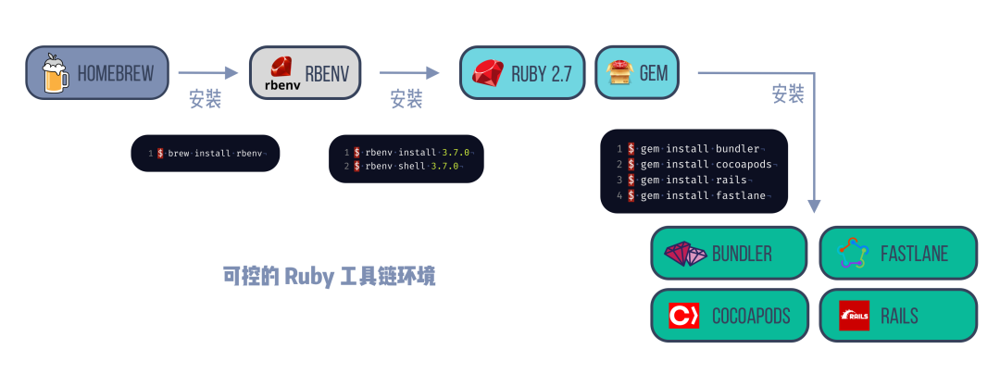 
操作安装流程

## 如何使用 Bundler 管理工程中的 Gem 环境

下面我们来实践一下，如何使用 `Bundler` 来锁定项目中的 `Gem` 环境，从而让整个团队统一 `Gem` 环境中的所有 Ruby 工具版本。从而避免文件冲突和不必要的错误。

下面是在工程中对于 `Gem` 环境的层级图，我们可以在项目中增加一个 `Gemfile` 描述，从而锁定当前项目中的 `Gem` 依赖环境。

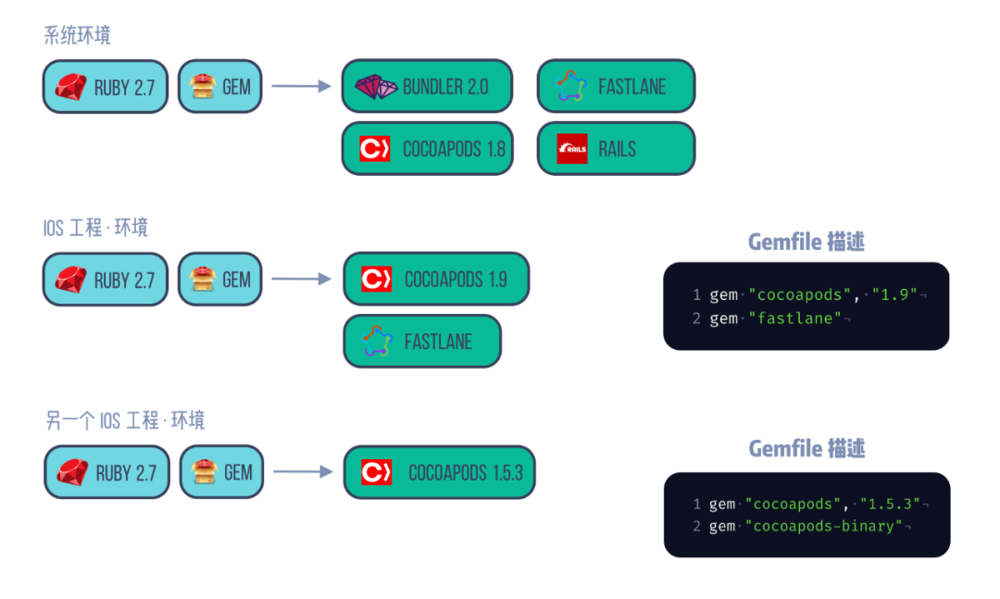 
工程中独立 Gem 环境示意图

以下也会逐一讲述每一层的管理方式，以及实际的操作方法。

### 1. 在 iOS 工程中初始化 `Bundler` 环境

首先我们有一个 iOS Demo 工程 - `GuaDemo` ：


```ruby
$ ls -al
total 0
drwxr-xr-x   4 gua  staff   128 Jun 10 14:47 .
drwxr-xr-x@ 52 gua  staff  1664 Jun 10 14:47 ..
drwxr-xr-x   8 gua  staff   256 Jun 10 14:47 GuaDemo
drwxr-xr-x@  5 gua  staff   160 Jun 10 14:47 GuaDemo.xcodeproj
```

首先先来初始化一个 `Bundler`  环境（其实就是自动创建一个 `Gemfile`  文件）：


```ruby
    $ bundle init
    Writing new Gemfile to /Users/Gua/GuaDemo/Gemfile
```

### 2. 在 `Gemfile`  中声明使用的 `CocoaPods` 版本并安装

之后我们编辑一下这个 `Gemfile` 文件，加入我们当前环境中需要使用 `CocoaPods 1.5.3` 这个版本，则使用 `Gemfile`  的 DSL 编写以下内容：


```ruby
# frozen_string_literal: true
source "https://rubygems.org"
git_source(:github) {|repo_name| "https://github.com/#{repo_name}" }
# gem "rails"
gem "cocoapods", "1.5.3"
```

编写之后执行一下 `bundle install` ：


```ruby
$ bundle install
Fetching gem metadata from https://gems.ruby-china.com/............
Resolving dependencies...
...
Fetching cocoapods 1.5.3
Installing cocoapods 1.5.3
Bundle complete! 1 Gemfile dependency, 30 gems now installed.
```

发现 `CocoaPods 1.5.3`  这个指定版本已经安装成功，并且还保存了一份 `Gemfile.lock`  文件用来锁存这次的依赖结果。

### 3. 使用当前环境下的 `CocoaPods` 版本操作 iOS 工程

此时我们可以检查一下当前 `Bundler` 环境下的 `Gem`  列表：


```ruby
$ bundle exec gem list
*** LOCAL GEMS ***
activesupport (4.2.11.3)
atomos (0.1.3)
bundler (2.1.4)
CFPropertyList (3.0.2)
claide (1.0.3)
cocoapods (1.5.3)
...
```

发现相比于全局 `Gem` 列表，这个列表精简了许多，并且也只是基础 `Gem` 依赖和 `CocoaPods` 的 `Gem` 依赖。此时我们使用`bundle exec pod install`  来执行 Install 这个操作，就可以使用 `CocoaPods 1.5.3`  版本来执行`Pod`  操作了（当然，前提是你还需要写一个 `Podfile` ，大家都是 iOSer 这里就略过了）。


```ruby
$ bundle exec pod install
Analyzing dependencies
Downloading dependencies
Installing SnapKit (5.0.1)
Integrating client project
[!] Please close any current Xcode sessions and use `GuaDemo.xcworkspace` for this project from now on.
Sending stats
Pod installation complete! There is 1 dependency from the Podfile and 1 total pod installed.
```

可以再来看一下 `Podfile.lock`  文件：


```ruby
cat Podfile.lock
PODS:
  - SnapKit (5.0.1)
DEPENDENCIES:
  - SnapKit (~> 5.0.0)
SPEC REPOS:
  https://github.com/cocoapods/specs.git:
    - SnapKit
SPEC CHECKSUMS:
  SnapKit: 97b92857e3df3a0c71833cce143274bf6ef8e5eb
PODFILE CHECKSUM: 1a4b05aaf43554bc31c90f8dac5c2dc0490203e8
COCOAPODS: 1.5.3
```

发现使用的 `CocoaPods` 的版本确实是 `1.5.3` 。而当我们不使用 `bundle exec`  执行前缀，则会使用系统环境中的`CocoaPods` 版本。如此我们也就验证了工程中的 `Gem` 环境和系统中的环境可以通过 `Bundler` 进行隔离。

## 总结

  * 通过版本管理工具演进的角度可以看出，CocoaPods 的诞生并非一蹴而就，也是不断地借鉴其他管理工具的优点，一点点的发展起来的。VCS 工具从早期的 `SVN`、`Git`，再细分出 `Git Submodule`，再到各个语言的 `Package Manager` 也是一直在发展的。

  * 虽然 `CocoaPods` 作为包管理工具控制着 iOS 项目的各种依赖库，但其自身同样遵循着严格的版本控制并不断迭代。希望大家可以从本文中认识到版本管理的重要性。

  * 通过实操 `Bundler` 管理工程的全流程，学习了 `Bundler` 基础，并学习了如何控制一个项目中的 `Gem` 版本信息。

后续我们将会围绕 `CocoaPods` ，从工具链逐渐深入到细节，根据我们的使用经验，逐一讲解。

## 知识点问题梳理

这里罗列了几个问题用来考察你是否已经掌握了这篇文章，如果没有建议你**加入****收藏**再次阅读：

  1. `PM` 是如何进行依赖库的版本管理？
  2. `Ruby` 和 `RVM/rbenv` 之间的关系是什么？
  3. `Gem`、`Bundler` 和 `CocaPods` 之间的关系是什么？
  4. 如何通过 `Bundler` 来管理工程中的 `Gem` 环境？
  5. 如何锁死工程内部的 `CocoaPods` 版本？

#### 参考资料

[1]深入理解 CocoaPods: _https://objccn.io/issue-6-4/_
[2]语义化版本: _https://semver.org/_
[3]npmjs.com: _https://www.npmjs.com/_
[4]Podfile 指南: _http://guides.cocoapods.org/syntax/podfile.html_
[5]Mater Repo CDN: _http://blog.cocoapods.org/CocoaPods-1.7.2/_
[6]https://cdn.cocoapods.org: _https://cdn.cocoapods.org_
[7]`RubyGems`: _https://rubygems.org/_
[8]`Bundler`: _https://bundler.io/_
[9]`npm`: _https://www.npmjs.com/_
[10]`Gradle`: _https://gradle.org/_
[11]`RVM`: _https://rvm.io/_
[12]`rbenv`: _https://github.com/rbenv/rbenv_
[13]Why rbenv: _https://github.com/rbenv/rbenv/wiki/Why-rbenv%3F_
[14]RubyGems: _https://rubygems.org/_
[15]Bundler: _https://bundler.io/_
[16]Gemfile: _https://bundler.io/v2.0/gemfile.html_


<hr>

#### <p>原文出处：<a href='https://mp.weixin.qq.com/s?__biz=MzA5MTM1NTc2Ng==&mid=2458324020&idx=1&sn=5d57193433b93127e3f72865bdc5b173&chksm=870e032db0798a3bab5da470df244a44096fc6a2faeeb1207ae6def6edef7053c766a0f0ceb6&scene=178&cur_album_id=1477103239887142918#rd' target='blank'>2. 整体把握 CocoaPods 核心组件</a></p>

> **本文作者：Edmond**
>
> **CocoaPods** 历险记这个专题是 **Edmond** 和 **冬瓜** 共同撰写，对于 iOS / macOS 工程中版本管理工具CocoaPods 的实现细节、原理、源码、实践与经验的分享记录，旨在帮助大家能够更加了解这个依赖管理工具，而不仅局限于 `pod install` 和`pod update`。

## 本文知识目录

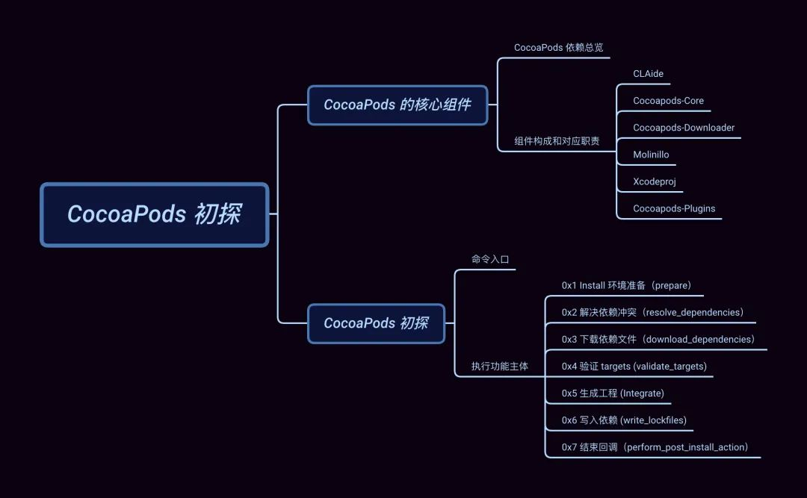

## 引子

在上文 [版本管理工具及 Ruby 工具链环境](http://mp.weixin.qq.com/s?__biz=MzA5MTM1NTc2Ng%3D%3D&chksm=870e0831b0798127994902655fdee3be7d6abd53734428dd8252b8f584343aad217e77a70920&idx=1&mid=2458322728&scene=21&sn=3a16de4b2adae7c57bbfce45858dfe06#wechat_redirect) 中，我们聊到如何统一管理团队小伙伴的 CocoaPods 生产环境及使用到的 Ruby 工具链。今天让我们将目光转到 CocoaPods 身上，一起来聊聊它的主要构成，以及各个组件在整个 Pods 工作流的关系。

> 为了整体把握 _CocoaPods_ 这个项目，建议大家去入门一下 Ruby 这门脚本语言。另外本文基于 CocoaPods 1.9.2 版本。

## CocoaPods 的核心组件

作为包管理工具，CocoaPods 随着 Apple 生态的蓬勃发展也在不断迭代和进化，并且各部分核心功能也都演化出相对独立的组件。这些功能独立的组件，均拆分出一个个独立的 Gem 包，而 CocoaPods 则是这些组件的“集大成者”。

### CocoaPods 依赖总览

我们知道在 Pod 管理的项目中，`Podfile` 文件里描述了它所依赖的 dependencies，类似的 Gem 的依赖可以在 `Gemfile` 中查看。那 CocoaPods 的 `Gemfile` 有哪些依赖呢？


```ruby
SKIP_UNRELEASED_VERSIONS = false
# ...
source 'https://rubygems.org'
gemspec
gem 'json', :git => 'https://github.com/segiddins/json.git', :branch => 'seg-1.7.7-ruby-2.2'
group :development do
  cp_gem 'claide',                'CLAide'
  cp_gem 'cocoapods-core',        'Core', '1-9-stable'
  cp_gem 'cocoapods-deintegrate', 'cocoapods-deintegrate'
  cp_gem 'cocoapods-downloader',  'cocoapods-downloader'
  cp_gem 'cocoapods-plugins',     'cocoapods-plugins'
  cp_gem 'cocoapods-search',      'cocoapods-search'
  cp_gem 'cocoapods-stats',       'cocoapods-stats'
  cp_gem 'cocoapods-trunk',       'cocoapods-trunk'
  cp_gem 'cocoapods-try',         'cocoapods-try'
  cp_gem 'molinillo',             'Molinillo'
  cp_gem 'nanaimo',               'Nanaimo'
  cp_gem 'xcodeproj',             'Xcodeproj'
   
  gem 'cocoapods-dependencies', '~> 1.0.beta.1'
  # ...
  # Integration tests
  gem 'diffy'
  gem 'clintegracon'
  # Code Quality
  gem 'inch_by_inch'
  gem 'rubocop'
  gem 'danger'
end
group :debugging do
  gem 'cocoapods_debug'
  gem 'rb-fsevent'
  gem 'kicker'
  gem 'awesome_print'
  gem 'ruby-prof', :platforms => [:ruby]
end
```

上面的 `Gemfile` 中我们看到很多通过 `cp_gem` 装载的 Gem 库，其方法如下：


```ruby
def cp_gem(name, repo_name, branch = 'master', path: false)
  return gem name if SKIP_UNRELEASED_VERSIONS
  opts = if path
           { :path => "../#{repo_name}" }
         else
           url = "https://github.com/CocoaPods/#{repo_name}.git"
           { :git => url, :branch => branch }
         end
  gem name, opts
end
```

它是用于方便开发和调试，当 _**`SKIP_UNRELEASED_VERSIONS`**_ 为 `false && path` 为 `true` 时会使用与本地的 _CocoaPods_ 项目同级目录下的 git 仓库，否则会使用对应的项目直接通过 Gem 加载。

通过简单的目录分割和 `Gemfile`管理，就实现了最基本又最直观的**热插拔**，对组件开发十分友好。所以你只要将多个仓库如下图方式排列，即可实现跨仓库组件开发：


```ruby
$ ls -l
lrwxr-xr-x  1 gua  staff    31 Jul 30 21:34 CocoaPods
lrwxr-xr-x  1 gua  staff    26 Jul 31 13:27 Core 
lrwxr-xr-x  1 gua  staff    31 Jul 31 10:14 Molinillo 
lrwxr-xr-x  1 gua  staff    31 Aug 15 11:32 Xcodeproj 
lrwxr-xr-x  1 gua  staff    42 Jul 31 10:14 cocoapods-downloader
```

### 组件构成和对应职责

通过上面对于 `Gemfile` 的简单分析，可以看出 _CocoaPods_不仅仅是一个仓库那么简单，它作为一个三方库版本管理工具，对自身组件的管理和组件化也是十分讲究的。我们继续来看这份 `Gemfile` 中的核心开发组件：

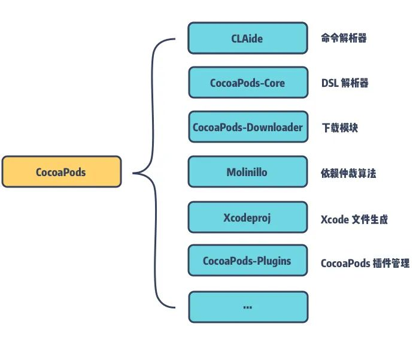

#### CLAide

> The CLAide gem is a simple command line parser, which provides an API that allows you to quickly create a full featured command-line interface.

CLAide[2] 虽然是一个简单的命令行解释器，但它提供了功能齐全的命令行界面和 API。它不仅负责解析我们使用到的 `Pods` 命令，如：`pod install`, `pod update` 等，还可用于封装常用的一些脚本，将其打包成简单的命令行小工具。

> PS: 所谓命令行解释器就是从标准输入或者文件中读取命令并执行的程序。详见 Wiki[3]。

#### cocoapods-core

> The CocoaPods-Core gem provides support to work with the models of CocoaPods, for example the Podspecs or the Podfile.

CocoaPods-Core[4] 用于 CocoaPods 中模板文件的解析，包括 `Podfile`、`.podspec`，以及所有的 `.lock` 文件中特殊的 YAML 文件。

#### cocoapods-downloader

> The Cocoapods-downloader gem is a small library that provides downloaders for various source control types (HTTP/SVN/Git/Mercurial). It can deal with tags, commits, revisions, branches, extracting files from zips and almost anything these source control system would use.

Cocoapods-Downloader[5] 是用于下载源码的小工具，它支持各种类型的版本管理工具，包括 HTTP / SVN / Git / Mercurial。它可以提供 `tags`、`commites`，`revisions`，`branches` 以及 `zips` 文件的下载和解压缩操作。

#### Molinillo

> The Molinillo gem is a generic dependency resolution algorithm, used in CocoaPods, Bundler and RubyGems.

Molinillo[6] 是 CocoaPods 对于依赖仲裁算法的封装，它是一个具有前向检查的回溯算法。不仅在 `Pods` 中，`Bundler` 和 `RubyGems` 也是使用的这一套仲裁算法。

#### Xcodeproj

> The Xcodeproj gem lets you create and modify Xcode projects from Ruby. Script boring management tasks or build Xcode-friendly libraries. Also includes support for Xcode workspaces (.xcworkspace) and configuration files(.xcconfig).

Xcodeproj[7] 可通过 Ruby 来操作 Xcode 项目的创建和编辑等。可友好的支持 Xcode 项目的脚本管理和 libraries 构建，以及 Xcode 工作空间 (.xcworkspace)  和配置文件 `.xcconfig` 的管理。

#### cocoapods-plugins

> CocoaPods plugin which shows info about available CocoaPods plugins or helps you get started developing a new plugin. Yeah, it's very meta.

`cocoapods-plugins` 插件管理功能，其中有 `pod plugin` 全套命令，支持对于 CocoaPods 插件的列表一览（list）、搜索（search）、创建（create）功能。

当然，上面还有很多组件这里就不一一介绍了。通过查看 `Gemfile` 可以看出 Pod 对于组件的拆分粒度是比较细微的，通过对各种组件的组合达到现在的完整版本。这些组件中，笔者的了解也十分有限，不过我们会在之后的一系列文章来逐一介绍学习。

## CocoaPods 初探

接下来，结合 `pod install` 安装流程来展示各个组件在 `Pods` 工作流中的上下游关系。

### 命令入口

每当我们输入 `pod xxx` 命令时，系统会首先调用 `pod` 命令。所有的命令都是在 `/bin` 目录下存放的脚本，当然 Ruby 环境的也不例外。我们可以通过 `which pod` 来查看命令所在位置：


```ruby
$ which pod
/Users/edmond/.rvm/gems/ruby-2.6.1/bin/pod
```

> 这里的显示路径不是 `/usr/local/bin/pod` 的原因是因为使用 _RVM_ 进行版本控制的。

我们通过 `cat` 命令来查看一下这个入口脚本执行了什么


```ruby
$ cat /Users/edmond/.rvm/gems/ruby-2.6.1/bin/pod
```

输出如下：


```ruby
#!/usr/bin/env ruby_executable_hooks
require 'rubygems'
version = ">= 0.a"
str = ARGV.first
if str
  str = str.b[/\A_(.*)_\z/, 1]
  if str and Gem::Version.correct?(str)
    version = str
    ARGV.shift
  end
end
if Gem.respond_to?(:activate_bin_path)
    load Gem.activate_bin_path('cocoapods', 'pod', version)
else
    gem "cocoapods", version
    load Gem.bin_path("cocoapods", "pod", version)
end
```

程序 CocoaPods 是作为 Gem 被安装的，此脚本用于唤起CocoaPods。逻辑比较简单，就是一个单纯的命令转发。`Gem.activate_bin_path` 和 `Gem.bin_path` 用于找到CocoaPods 的安装目录 `cocoapods/bin`，最终加载该目录下的 `/pod` 文件:


```ruby
#!/usr/bin/env ruby
# ... 忽略一些对于编码处理的代码
require 'cocoapods'
# 这里手动输出一下调用栈，来关注一下
puts caller
# 如果环境配置中指定了 ruby-prof 配置文件，会对执行命令过程进行性能监控
if profile_filename = ENV['COCOAPODS_PROFILE']
  require 'ruby-prof'
  # 依据配置文件类型加载不同的 reporter 解析器
  # ...
  File.open(profile_filename, 'w') do |io|
    reporter.new(RubyProf.profile { Pod::Command.run(ARGV) }).print(io)
  end
else
  Pod::Command.run(ARGV)
end
```

一起来查看一下 `pod` 命令的输出结果：


```ruby
$ pod
/Users/edmond/.rvm/gems/ruby-2.6.1/bin/pod:24:in `load'
/Users/edmond/.rvm/gems/ruby-2.6.1/bin/pod:24:in `<main>'
/Users/edmond/.rvm/gems/ruby-2.6.1/bin/ruby_executable_hooks:24:in `eval'
/Users/edmond/.rvm/gems/ruby-2.6.1/bin/ruby_executable_hooks:24:in `<main>'
```

ruby_executable_hooks 通过 `bin` 目录下的 `pod` 入口唤醒，再通过 eval[8] 的手段调起我们需要的CocoaPods 工程。这是 RVM 的自身行为，它利用了 executable-hook[9] 来注入 Gems 插件来定制扩展。

> PS：大多数动态语言都支持 `eval` 这一神奇的函数。自从 Lisp 开始就支持了，它通过接受一个字符串类型作为参数，将其解析成语句并混合在当前作用域内运行。详细可以参考这篇 文章[10]。

在入口的最后部分，通过调用 `Pod::Command.run(ARGV)`，实例化了一个 `CLAide::Command` 对象，开始我们的 **CLAide 命令解析阶段**。这里不对 `CLAide` 这个命令解析工具做过多的分析，这个是后面系列文章的内容。这里我们仅仅需要知道：

> 每个 CLAide  命令的执行，最终都会对应到具体 Command Class 的 `run` 方法。

Pod 命令对应的 run 方法实现如下：


```ruby
module Pod
  class Command
    class Install < Command
      # ... 
      def run
        # 判断是否存在 Podfile 文件
        verify_podfile_exists!
        # 从 Config 中获取一个 Instraller 实例
        installer = installer_for_config
        # 默认是不执行 update
        installer.repo_update = repo_update?(:default => false)
        installer.update = false
        installer.deployment = @deployment
        # install 的真正过程
        installer.install!
      end
    end
  end
end
```

上述所见的 `Command::Install` 类对应的命令为 `pod install`。`pod install` 过程是依赖于 `Podfile`文件的，所以在入口处会做检测，如果不存在 `Podfile` 则直接抛出 **No 'Podfile' found in the project directory** 的异常 警告并结束命令。

### 执行功能主体

在 `installer` 实例组装完成之后，调用其 `install!` 方法，这时候才进入了我们 `pod install` 命令的主体部分，流程如下图：

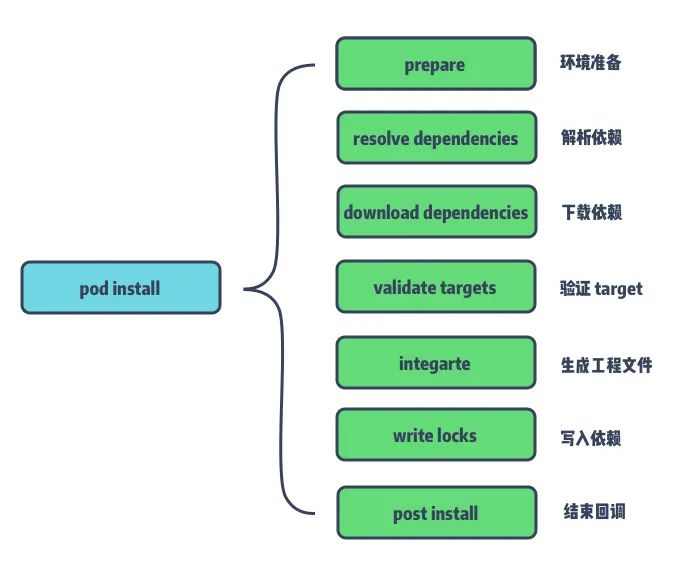

对应的实现如下：


```ruby
def install!
    prepare
    resolve_dependencies
    download_dependencies
    validate_targets
    if installation_options.skip_pods_project_generation?
        show_skip_pods_project_generation_message
    else
        integrate
    end
    write_lockfiles
    perform_post_install_actions
end

def integrate
    generate_pods_project
    if installation_options.integrate_targets?
        integrate_user_project
    else
        UI.p 'Skipping User Project Integration'
    end
end
```

#### 0x1 Install 环境准备（prepare）


```ruby
def prepare
  # 如果检测出当前目录是 Pods，直接 raise 终止
  if Dir.pwd.start_with?(sandbox.root.to_path)
    message = 'Command should be run from a directory outside Pods directory.'
    message << "\n\n\tCurrent directory is #{UI.path(Pathname.pwd)}\n"
    raise Informative, message
  end
  UI.message 'Preparing' do
    # 如果 lock 文件的 CocoaPods 主版本和当前版本不同，将以新版本的配置对 xcodeproj 工程文件进行更新
    deintegrate_if_different_major_version
    # 对 sandbox(Pods) 目录建立子目录结构
    sandbox.prepare
    # 检测 PluginManager 是否有 pre-install 的 plugin
    ensure_plugins_are_installed!
    # 执行插件中 pre-install 的所有 hooks 方法
    run_plugins_pre_install_hooks
  end
end
```

在 `prepare` 阶段会将 `pod install` 的环境准备完成，包括**版本一致性**、**目录结构**以及将 _pre-install_的装载插件脚本全部取出，并执行对应的 `pre_install` hook。

#### 0x2 解决依赖冲突（resolve_dependencies）


```ruby
def resolve_dependencies
    # 获取 Sources
    plugin_sources = run_source_provider_hooks
    # 创建一个 Analyzer
    analyzer = create_analyzer(plugin_sources)
    # 如果带有 repo_update 标记
    UI.p 'Updating local specs repositories' do
        # 执行 Analyzer 的更新 Repo 操作
        analyzer.update_repositories
    end if repo_update?
    UI.p 'Analyzing dependencies' do
        # 从 analyzer 取出最新的分析结果，@analysis_result，@aggregate_targets，@pod_targets
        analyze(analyzer)
        # 拼写错误降级识别，白名单过滤
        validate_build_configurations
    end
    # 如果 deployment? 为 true，会验证 podfile & lockfile 是否需要更新
    UI.p 'Verifying no changes' do
        verify_no_podfile_changes!
        verify_no_lockfile_changes!
    end if deployment?
 
    analyzer
end
```

依赖解析过程就是通过 `Podfile`、`Podfile.lock` 以及沙盒中的 `manifest` 生成 _Analyzer_对象。_Analyzer_ 内部会使用 _Molinillo_ （具体的是 `Molinillo::DependencyGraph`图算法）解析得到一张依赖关系表。

> PS：通过 _Analyzer_ 能获取到很多依赖信息，例如 _Podfile_ 文件的依赖分析结果，也可以从 specs_by_target来查看各个 _target_ 相关的 specs。

另外，需要注意的是 analyze 的过程中有一个 _pre_download_ 的阶段，即在 _\--verbose_ 下看到的 **Fetching external sources** 过程。这个 _pre_download_ 阶段**不属于依赖下载**过程，而是在当前的**依赖分析**阶段。

> PS：该过程主要是解决当我们在通过 Git 地址引入的 Pod 仓库的情况下，系统无法从默认的 Source 拿到对应的 Spec，需要直接访问我们的Git 地址下载仓库的 zip 包，并取出对应的 `podspec` 文件，从而进行对比分析。

#### 0x3 下载依赖文件（download_dependencies）


```ruby
def download_dependencies
  UI.p 'Downloading dependencies' do
    # 初始化 sandbox 文件访问器
    create_file_accessors
    # 构造 Pod Source Installer
    install_pod_sources
    # 执行 podfile 定义的 pre install 的 hooks
    run_podfile_pre_install_hooks
    # 根据配置清理 pod sources 信息，主要是清理无用 platform 相关内容
    clean_pod_sources
  end
end
```

在 `create_file_accessors` 中会创建沙盒目录的文件访问器，通过构造 `FileAccessor`实例来解析沙盒中的各种文件。接着是最重要的 `install_pod_sources` 过程，它会调用对应 Pod 的 `install!`方法进行资源下载。

先来看看 `install_pod_sources` 方法的实现：


```ruby
def install_pod_sources
 @installed_specs = []
 # install 的 Pod 只需要这两种状态，added 和 changed 状态的并集
 pods_to_install = sandbox_state.added | sandbox_state.changed
 title_options = { :verbose_prefix => '-> '.green }
 puts "root_specs"
 root_specs.each do |item|
   puts item
 end
 # 将 Podfile 解析后排序处理
 root_specs.sort_by(&:name).each do |spec|
   # 如果是 added 或 changed 状态的 Pod
   if pods_to_install.include?(spec.name)
     # 如果是 changed 状态并且 manifest 已经有记录
     if sandbox_state.changed.include?(spec.name) && sandbox.manifest
       # 版本更新
       current_version = spec.version
       # 被更新版本记录
       previous_version = sandbox.manifest.version(spec.name)
       # 变动记录
       has_changed_version = current_version != previous_version
       # 找到第一个包含 spec.name 的 Pod，获取对应的 Repo，其实就是 find 方法
       current_repo = analysis_result.specs_by_source.detect { |key, values| break key if values.map(&:name).include?(spec.name) }
       # 获取当前仓库
       current_repo &&= current_repo.url || current_repo.name
       # 获取之前该仓库的信息
       previous_spec_repo = sandbox.manifest.spec_repo(spec.name)
       # 是否仓库有变动
       has_changed_repo = !previous_spec_repo.nil? && current_repo && (current_repo != previous_spec_repo)
       # 通过 title 输出上面的详细变更信息
       title = ...
     else
       # 非 changed 状态，展示 Installing 这个是经常见的 log
       title = "Installing #{spec}"
     end
     UI.titled_p(title.green, title_options) do
       # 通过 name 拿到对应的 installer，记录到 @pod_installers 中
       install_source_of_pod(spec.name)
     end
   else
     # 如果没有 changed 情况，直接展示 Using，也是经常见到的 log
     UI.titled_p("Using #{spec}", title_options) do
       # # 通过 sandbox, specs 的 platform 信息生成 Installer 实例，记录到 @pod_installers 中
       create_pod_installer(spec.name)
     end
   end
 end
end

# 通过缓存返回 PodSourceInstaller 实例
def create_pod_installer(pod_name)
    specs_by_platform = specs_for_pod(pod_name)
 
    # 当通过 pod_name 无法找到对应的 pod_target 或 platform 配置，主动抛出错误信息
    if specs_by_platform.empty?
        requiring_targets = pod_targets.select { |pt| pt.recursive_dependent_targets.any? { |dt| dt.pod_name == pod_name } }
        # message = "..."
        raise StandardError, message
    end
    # 通过 sandbox, specs 的 platform 信息生成 Installer 实例
    pod_installer = PodSourceInstaller.new(sandbox, podfile, specs_by_platform, :can_cache => installation_options.clean?)
    pod_installers << pod_installer
    pod_installer
end

# 如果 resolver 声明一个 Pod 已经安装或者已经存在，将会将其删除并重新安装。如果不存在则直接安装。
def install_source_of_pod(pod_name)
  pod_installer = create_pod_installer(pod_name)
  pod_installer.install!
  @installed_specs.concat(pod_installer.specs_by_platform.values.flatten.uniq)
end
```

在方法的开始，`root_specs` 方法是通过 `analysis_result` 拿出所有根 spec


```ruby
def root_specs
  analysis_result.specifications.map(&:root).uniq
end
```

下面再来看看 `pod_installer` 中的 `install!` 方法，主要是通过调用 `cocoapods-downloader` 组件，将 Pod 对应的 Source 下载到本地。实现如下：


```ruby
def install!
    download_source unless predownloaded? || local?
    PodSourcePreparer.new(root_spec, root).prepare! if local?
    sandbox.remove_local_podspec(name) unless predownloaded? || local? || external?
end
```

#### 0x4 验证 targets (validate_targets)

用来验证之前流程中的产物 (pod 所生成的 Targets) 的合法性。主要作用就是构造 `TargetValidator`，并执行
`validate!` 方法：


```ruby
def validate_targets
    validator = Xcode::TargetValidator.new(aggregate_targets, pod_targets, installation_options)
    validator.validate!
end

def validate!
    verify_no_duplicate_framework_and_library_names
    verify_no_static_framework_transitive_dependencies
    verify_swift_pods_swift_version
    verify_swift_pods_have_module_dependencies
    verify_no_multiple_project_names if installation_options.generate_multiple_pod_projects?
end
```

验证环节在整个 Install 过程中仅占很小的一部分。因为只是验证部分，是完全解耦的。

  1. **verify_no_duplicate_framework_and_library_names**

     验证是否有重名的 `framework`，如果有冲突会直接抛出 `frameworks with conflicting names` 异常。

  2. **verify_no_static_framework_transitive_dependencies**

     验证动态库中是否有静态链接库 (`.a` 或者 `.framework`) 依赖，如果存在则会触发 `transitive dependencies that include static binaries...` 错误。假设存在以下场景：

     a. 组件 A 和组件 B 同时依赖了组件 C，C 为静态库，如 `Weibo_SDK `;
     b. 组件 A 依赖组件 B，而组件 B 的 `.podspec` 文件中存在以下设置时，组件 B 将被判定为存在静态库依赖：  
          1. podspec 设置了 `s.static_framework = true`
          2. podspec 以 `s.dependency 'xxx_SDK` 依赖了静态库 `xxx_SDK`
          3. podspec 以 `s.vendored_libraries = 'libxxx.a'` 方式内嵌了静态库 `libxxx`

     **此时如果项目的 Podfile 设置了 use_framework! 以动态链接方式打包的时，则会触发该错误。**
     **问题原因**
     Podfile 中不使用 `use_frameworks!` 时，每个 pod 是会生成相应的 .a（静态链接库）文件，然后通过 Static Libraries 来管理 pod 代码，在 Linked 时会包含该 pod 引用的其他的 pod 的 .a 文件。
     Podfile 中使用 `use_frameworks!` 时是会生成相应的 .framework 文件，然后通过 Dynamic Frameworks的方式来管理 pod 代码，在 Linked 时会包含该 pod 引用的其他的 pod 的 `.framework` 文件。
     上述场景中虽然以 framework 的方式引用了 B 组件，然而 B 组件实际上是一个静态库，需要拷贝并链接到该 pod 中，然而 Dynamic Frameworks 方式并不会这么做，所以就报错了。
     **解决方案**
          1. 修改 pod 库中 `podspec`，增加 `pod_target_xcconfig`，定义好 `FRAMEWORK_SEARCH_PATHS` 和 `OTHER_LDFLAGS` 两个环境变量；
          2. hook `verify_no_static_framework_transitive_dependencies` 的方法，将其干掉！对应issue[11]
          3. 修改 pod 库中 `podspec`，开启 static_framework 配置 `s.static_framework = true`

  3. **verify_swift_pods_swift_version**

     确保 Swift Pod 的 Swift 版本正确配置且互相兼容的。

  4. **verify_swift_pods_have_module_dependencies**

     检测 Swift 库的依赖库是否支持了 module，这里的 module 主要是针对 Objective-C 库而言。首先，Swift 是天然支持module 系统来管理代码的，Swift Module 是构建在 LLVM Module[12] 之上的模块系统。Swift 库在解析后会生成对应的`modulemap` 和 `umbrella.h` 文件，这是 LLVM Module 的标配，同样 Objective-C 也是支持 LLVM Module。**当我们以 Dynamic Framework 的方式引入 Objective-C 库时，Xcode 支持配置并生成 header，而静态库.a 需要自己编写对应的 `umbrella.h` 和 `modulemap`**。

     其次，如果你的 Swift Pod 依赖了 Objective-C 库，又希望以静态链接的方式来打包 Swift Pod 时，就需要保证Objective-C 库启用了 `modular_headers`，这样 CocoaPods 会为我们生成对应 `modulemap` 和`umbrella.h` 来支持 LLVM Module。你可以从这个地址 -http://blog.cocoapods.org/CocoaPods-1.5.0/[13] 查看到更多细节。

  5. **verify_no_pods_used_with_multiple_swift_versions**

     检测是否所有的 _Pod Target_ 中版本一致性问题。

用一个流程图来概括这一验证环节：

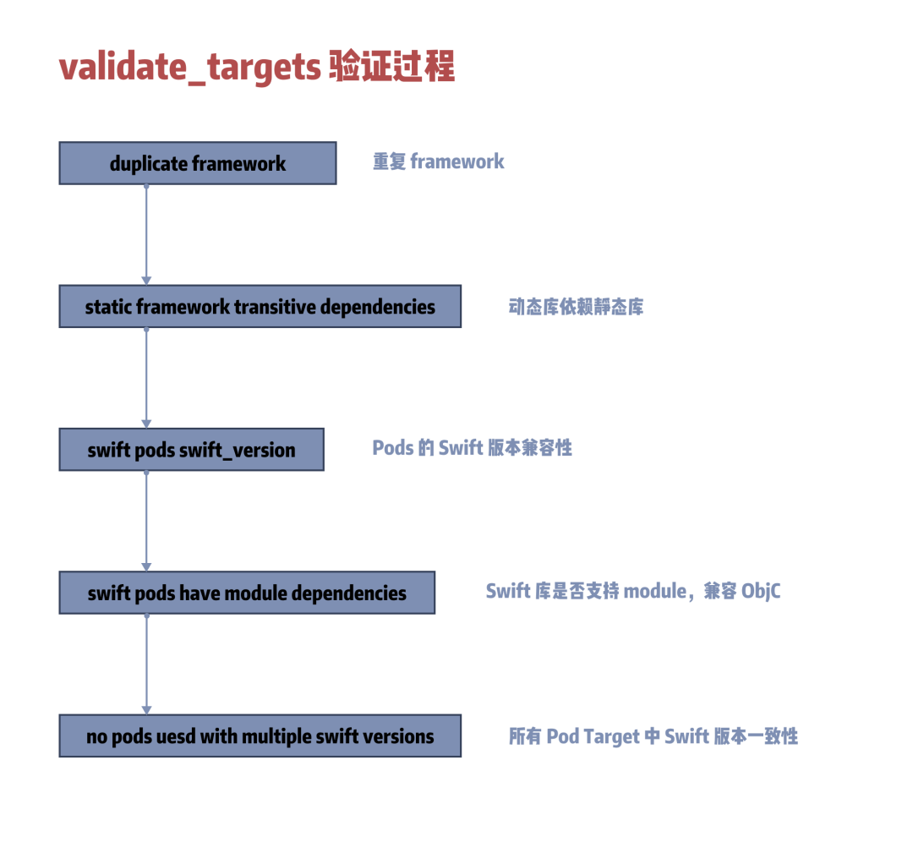

#### 0x5 生成工程 (Integrate)

工程文件的生成是 `pod install` 的最后一步，他会将之前版本仲裁后的所有组件通过 Project 文件的形式组织起来，并且会对 Project中做一些用户指定的配置。


```ruby
def integrate
    generate_pods_project
    if installation_options.integrate_targets?
        # 集成用户配置，读取依赖项，使用 xcconfig 来配置
        integrate_user_project
    else
        UI.p 'Skipping User Project Integration'
    end
end

def generate_pods_project
    # 创建 stage sanbox 用于保存安装前的沙盒状态，以支持增量编译的对比
    stage_sandbox(sandbox, pod_targets)
    # 检查是否支持增量编译，如果支持将返回 cache result
    cache_analysis_result = analyze_project_cache
    # 需要重新生成的 target
    pod_targets_to_generate = cache_analysis_result.pod_targets_to_generate
    # 需要重新生成的 aggregate target
    aggregate_targets_to_generate = cache_analysis_result.aggregate_targets_to_generate
    # 清理需要重新生成 target 的 header 和 pod folders
    clean_sandbox(pod_targets_to_generate)
    # 生成 Pod Project，组装 sandbox 中所有 Pod 的 path、build setting、源文件引用、静态库文件、资源文件等
    create_and_save_projects(pod_targets_to_generate, aggregate_targets_to_generate,
                                cache_analysis_result.build_configurations, cache_analysis_result.project_object_version)
    # SandboxDirCleaner 用于清理增量 pod 安装中的无用 headers、target support files 目录
    SandboxDirCleaner.new(sandbox, pod_targets, aggregate_targets).clean!
    # 更新安装后的 cache 结果到目录 `Pods/.project_cache` 下
    update_project_cache(cache_analysis_result, target_installation_results)
end
```

在 `install` 过程中，除去依赖仲裁部分和下载部分的时间消耗，在工程文件生成也会有相对较大的时间开销。这里往往也是速度优化核心位置。

#### 0x6 写入依赖 (write_lockfiles)

将依赖更新写入 `Podfile.lock` 和 `Manifest.lock`

#### 0x7 结束回调（perform_post_install_action）

最后一步收尾工作，为所有插件提供 post-installation 操作以及 hook。


```ruby
def perform_post_install_actions
    # 调用 HooksManager 执行每个插件的 post_install 方法 
    run_plugins_post_install_hooks
    # 打印过期 pod target 警告
    warn_for_deprecations
    # 如果 pod 配置了 script phases 脚本，会主动输出一条提示消息
    warn_for_installed_script_phases
    # 输出结束信息 `Pod installation complete!`
    print_post_install_message
end
```

核心组件在 `pod install` 各阶段的作用如下：

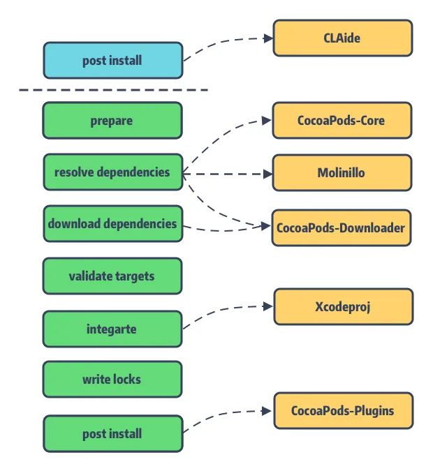

## 总结

当我们知道 CocoaPods 在 install 的大致过程后，我们可以对其做一些修改和控制。例如知道了插件的 `pre_install` 和`post_install` 的具体时机，我们就可以在 `Podfile` 中执行对应的 Ruby 脚本，达到我们的预期。同时了解 install 过程也有助于我们进行每个阶段的性能分析，以优化和提高 Install 效率。

后续，将学习 CocoaPods 中每一个组件的实现，将所有的问题在代码中找到答案。

## 知识点问题梳理

这里罗列了四个问题用来考察你是否已经掌握了这篇文章，如果没有建议你加入**收藏**再次阅读：

  1. 简单概述 CocoaPods 的核心模块？
  2. `pod` 命令是如何找到并启动 CocoaPods 程序的？
  3. 简述 pod install 流程？
  4. `resolve_dependencies` 阶段中的 `pre_download` 是为了解决什么问题？
  5. `validate_targets` 都做了哪些校验工作？

#### 参考资料

[1]**版本管理工具及 Ruby 工具链环境**: _https://zhuanlan.zhihu.com/p/147537112_
[2]**CLAide**: _https://github.com/CocoaPods/CLAide_
[3]**Wiki**: _https://www.wikiwand.com/en/Command-line_argument_parsing_
[4]**CocoaPods-Core**: _https://github.com/CocoaPods/Core_
[5]**Cocoapods-Downloader**: _https://github.com/CocoaPods/cocoapods-downloader_
[6]**Molinillo**: _https://github.com/CocoaPods/Molinillo/blob/master/ARCHITECTURE.md_
[7]**Xcodeproj**: _https://github.com/CocoaPods/Xcodeproj_
[8]**eval**: _https://www.infoq.com/articles/eval-options-in-ruby/_
[9]**executable-hook**: _https://github.com/rvm/executable-hooks_
[10]**eval 相关介绍**: _https://ruby-china.org/topics/31465_
[11]**对应** **issue**: _https://github.com/CocoaPods/CocoaPods/issues/3289_
[12]**LLVM Module**: _http://clang.llvm.org/docs/Modules.html_
[13]http://blog.cocoapods.org/CocoaPods-1.5.0/

<hr>

#### <p>原文出处：<a href='https://mp.weixin.qq.com/s?__biz=MzA5MTM1NTc2Ng==&mid=2458324049&idx=1&sn=8de53f46fbc52427cdb660b427cb8226&chksm=870e0348b0798a5ed6d14715cc4a1af93cd168a5e15198acfb3b84ea49506b0f815fa891d683&scene=178&cur_album_id=1477103239887142918#rd' target='blank'>Ex1. CocoaPods 中的 Ruby 特性之 Mix-in</a></p>

CocoaPods 是使用 Ruby 这门脚本语言实现的工具。Ruby 有很多优质的特性被 CocoaPods 所利用，为了在后续的源码阅读中不会被这些用法阻塞，所以在这个系列中，会给出一些 CocoaPods 的番外篇，来介绍 Ruby 及其当中的一些语言思想。

## 面向对象中的继承

### 构造一个动物类

`Mix-in` 在有些编程书中也被翻译成**「混入模式」**。根据字面意思，`Mix-in` 就是通过“混入”额外的功能，从而简化多层次的复杂继承关系。

我们举一个例子来说明。假如我们设计了一个 `Animal` 类，并且要实现一下四种动物的定义：

  * `Dog` - 狗
  * `Bat` - 蝙蝠
  * `Parrot` - 鹦鹉
  * `Ostrich` - 鸵鸟

如果按照哺乳动物和鸟类动物来归类，则可以设计出以下类的层级关系：

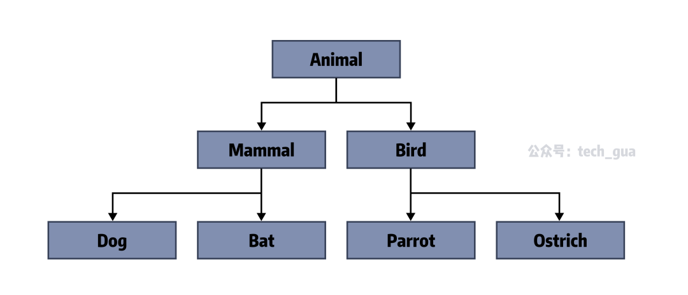

但如果按照“能跑”和“能飞”来归类，则应该设计以下的类层次：

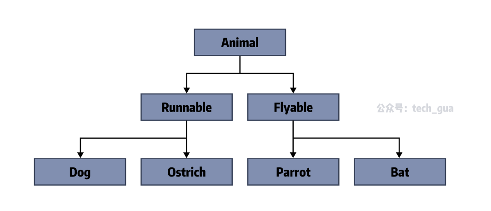

但是在我们的代码中又想拥有之前哺乳动物和鸟类动物也增加进来，那么我们就要设计更加复杂的层次：

  * 动物
  * * 能飞（BFly）
    * 能跑（BRun）
    * 能飞（MFly）
    * 能跑（MRun）
    * 哺乳动物（Mammal）
    * 鸟类动物（Bird）

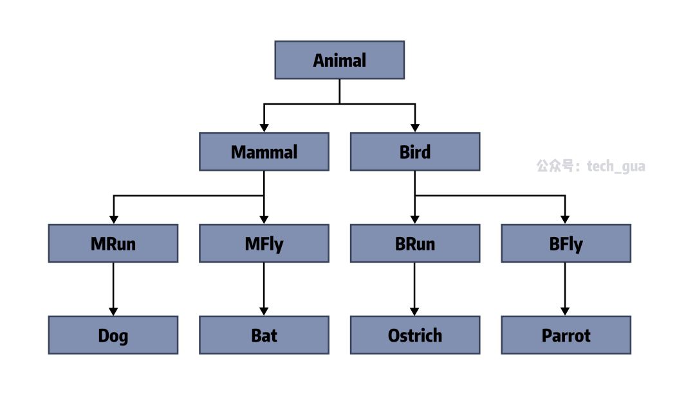

如果继续增加分类手段，例如“宠物类”和“非宠物类”，则类的数量就会以指数级别增长，难以维护且可读性极差。

那么我们应该用什么方式来解决这个问题呢？

### 使用多继承解决

首先，我们可以按照哺乳动物和鸟类动物来进行继承关系的描述。由于 Python 支持多继承语法，所以我们下面用 Python 来描述一下使用多继承来描述上述场景：


```python
class Animal(object):
    pass
# 动物大类
class Mammal(Animal):
    pass
class Bird(Animal):
    pass
```

现在，我们给动物加上加上 `Runnable` 和 `Flyable` 的功能，当我们定义好这两个描述能力的类，使用多继承来描述每个动物即可：


```python
# 描述能力的类
class Runnable(object):
    def run(self):
        print('Running...')

class Flyable(object):
    def fly(self):
        print('Flying...')

# 每个动物
class Dog(Mammal, Runnable):
    pass

class Bat(Mammal, Flyable):
    pass
```

通过多重继承，一个子类可以获得多个父类的所有功能，并且其继承的关系树如下：

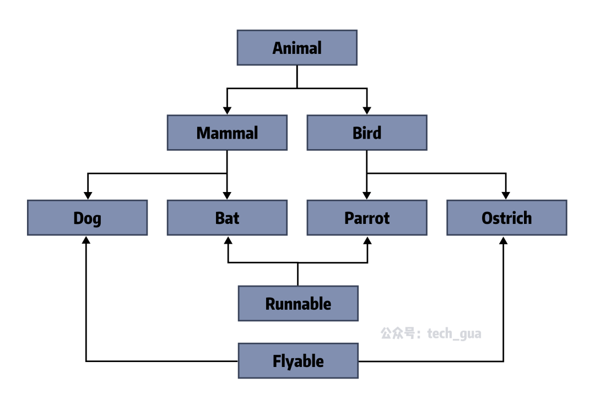

### 多继承的问题

Ruby 这门语言是不支持多继承的，取而代之是使用 Mix-in。那么多继承到底有什么样的问题呢？

在「松本行弘的程序世界」中，作者列举了以下三点：

  1. **结构复杂化** - 如果是单继承，一个类的父类是什么，父类的父类是什么，这些十分明确。因为单一继承关系中，是一棵多叉树结构。但是如果是多重继承，继承关系就十分复杂了。

  2. **优先顺序模糊** - 假如有 A、C 同时继承了基类，B 继承了 A，然后 D 又同时继承了 B 和 C，所以此时 D 继承父类方法的顺序应该是 D ⇒ B ⇒ A ⇒ C 还是 D ⇒ B ⇒ C ⇒ A？又或者是其他顺序？如此优先顺序十分模糊。

  3. **功能冲突** - 因为多重继承有多个父类，所以当不同的父类中更有相同的方法时就会产生冲突。如果 B 和 C 同时又有相同的方法时，D 继承的是哪个实现就会产生冲突。

但是单一继承又会有上文提到的缺陷。那么我们要如何平衡这个问题呢？其实方法很简单，**引入“受限制的多重继承”特性即可。**

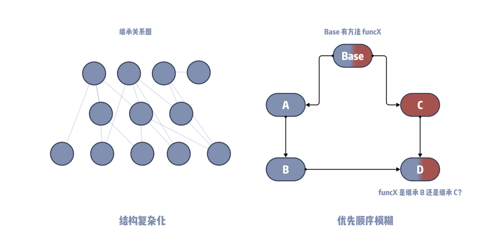

抛开各个编程语言只讨论面向对象思想，继承关系在最终的表现结果上往往只有两种含义：

  * **类有哪些方法** - 子类对于父类属性描述的继承；
  * **类的方法具体的实现是什么样的** - 子类对于父类方法实现逻辑的继承；

在静态语言中，这两者的区别更加的明显，几乎都是以关键字来做含义的隔离。例如 Java 中用 `extend` 实现单一继承，使用 `implements`来间接实现多重继承；在 Swift 中，我们也会使用 `class` 和 `protocol` 来区别两种场景。

但是仅仅是区分了上述两种继承含义，这并不完美。Java 中用 `implements` 来实现多重继承，虽然避免来功能的冲突性，但是`implements` 是无法共享的（这里的前提是 Java 8 之前，在 Java 8 之后，`interface` 可以使用 `default` 关键字增加默认实现），**如果想实现共享就要用组合模式来调用别的 `class` 从而实现共通功能，十分麻烦**。

在如此背景下我们来介绍 Ruby 中的 Mix-in 模式。

## Mix-in 以及其意义

上面说到，我们需要提供一种“受限制的多重继承”的特殊的继承方式，我们将这种继承简化称呼为**规格继承**。简单来讲，**规格继承就是指不但会将方法名继承下去，并且可以定义某些继承方法的默认实现。**

**如果你是 Swift 玩家，那么会立刻想到，这就是 `protocol` 的 `extension` 默认实现。** 是的，Mix-in 就是这个含义。在 Ruby 中 Mix-in 的语法是通过 `module` 和 `include` 方式来实现的，我们来举个例子说明一下。
    
```ruby
class Animal
end

class Mammal < Animal
end

class Bird < Animal
end

module RunMixin
    def run
        puts "I can run"
    end
end

module FlyMinxin
    def fly
        puts "I can fly"
    end
end

class Dog < Mammal
    include RunMixin
end

class Parrot < Bird
    include FlyMinxin
end

dog = Dog.new
dog.run       # "I can run"
parrot = Parrot.new
parrot.fly    # "I can fly"
```

通过这种方式，我们将 Run 和 Fly 的能力抽象成了两个 `module` ，当描述对应 `class` 时需要的时候，就使用 Min-in 模式将其`include` 就可以获得对应能力。

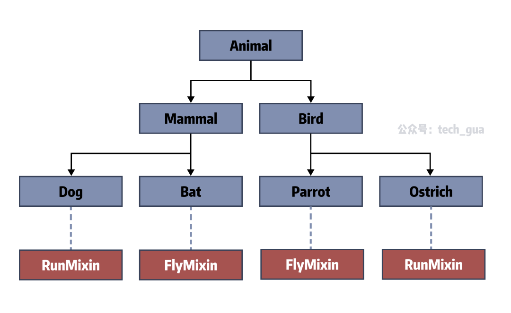

那么如果我们将 Mammal 哺乳动物和 Bird 鸟类动物封装成 Mix-in ，并将 Fly 和 Run 做成一级 `class`这样可以吗？**在实现上是可以的，但是并不推荐**。

这里简单说一下原因：因为 Mix-in 期望是一个行为的集合，并且这个行为可以添加到任意的 `class`中。从某种程度上来说，**继承描述的是“它是什么”，而 Mix-in 描述的是“它能做什么”**。从这一点出发，**Mix-in的设计是单一职责的**，并且 **Mix-in 实际上对宿主类一无所知**，**也有一种情况是只要宿主类有某个属性，就可以加入 Mix-in**。

## Mix-in in CocoaPods

在 CocoaPods 的 `config.rb` 中，其中有很多关于 Pods 的配置字段、CocoaPods 的一些关键目录，并且还持有一些单例的Manager。

在「整体把握 CocoaPods 核心组件」一文中，我们介绍来 `pod install` 的过程都是在 `installer.rb` 中完成的，而这个 `Installer` 的 class ，中的定义是这样的：


```ruby
module Pod
 class Installer
  autoload :Analyzer,                     'cocoapods/installer/analyzer'
    autoload :InstallationOptions,          'cocoapods/installer/installation_options'
    autoload :PostInstallHooksContext,      'cocoapods/installer/post_install_hooks_context'
  #...
  include Config::Mixin
  
  #...
 end
end
```

我们可以看到 `Installer` 拿入了 `Config::Mixin` 这个 `module`。而这个 `config` 属性其实就是CocoaPods 中的**一些全局配置变量**和**一些配置字段**。

例如我们在 `write_lockfiles`  方法中来查看 `config` 的用法：


```ruby
    def write_lockfiles
     # 获取 lockfile 数据
      @lockfile = generate_lockfile
     
     # 将 lockfile 数据写入 Podfile.lock 
      UI.message "- Writing Lockfile in #{UI.path config.lockfile_path}" do
        @lockfile.write_to_disk(config.lockfile_path)
      end
     # 将 lockfile 数据写入 manifest.lock 
      UI.message "- Writing Manifest in #{UI.path sandbox.manifest_path}" do
        @lockfile.write_to_disk(sandbox.manifest_path)
      end
    end
```

这里面的 `config` 就是通过 Mix-in 方式拿进来的变量，意在更加容易的去访问那些全局变量和配置字段。

我们在写入文件的位置下一个断点，可以清楚的打印 `lockfile_path` ；当然我也可以使用 `config` 打印其他的重要信息：


```ruby
config.lockfile_path     # lockfile 的 Path
config.installation_root # 执行 install 的目录
config.podfile           # 解析后的 Podfile 实例
config.sandbox           # 当前工程的 sandbox 目录
# ...
```

具体的属性可以查看 `config.rb` 中的代码来确定。既然 `Config` 已经变成一个 Mix-in ，在 CocoaPods
中引入的地方自然就会很多了：

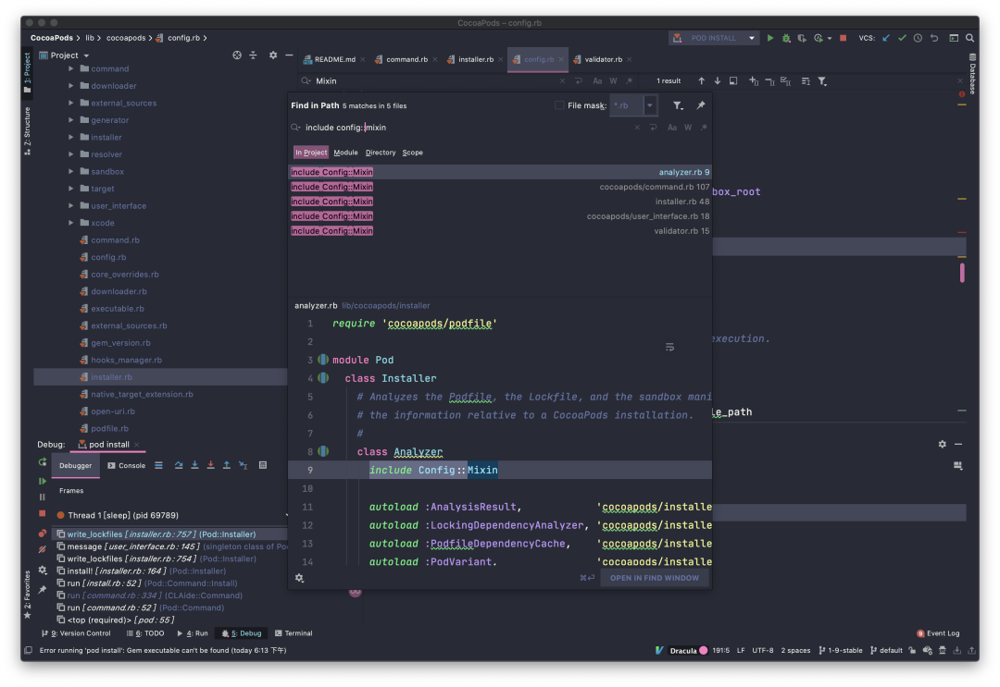

## 简单说一句 Duck Typing 思想

> 下面是一点对于编程思想的思考，可以不看。

最后我们来说一个高级的东西（其实只是名字很高级），那就是 Duck Typing，在很多书中也被称作**鸭子类型**。

Duck Typing 描述的是这么一个思想：**如果一个事物不是鸭子（Duck），如果它走起路来像一只鸭子，叫起来也像一只鸭子，即我们可以说它从表现来看像一只鸭子，那么我们就可以认为它是一只鸭子**。

这种思想应用到编程中是什么样的呢？**简而言之，一个约定要求必须实现某些功能，而某个类实现类这个功能，就可以把这个类当作约定的具体实现来使用**。

我们从这个角度来看，其实 Mix-in 这种模式就更加区别于多继承，而是一种 Duck Typing 思想的语法糖。我们不用将一层层 `interface`全部继承，而是**声明即实现**。

Duck Typing 是一种设计语言的思想，如果你想了解的更多，也可以从 **Duck Test 这种测试方式**开始了解。


## 总结

本文从 CocoaPods 中使用到的 Ruby 语法特性说起，讲述了在 Ruby 当中，**为了解决多继承中的问题从而引入的 Mix-in 模式，并且Ruby 也为其定义了 `module` 和 `include` 关键字的语法糖**。从 Mix-in 模式里，我们可以了解多继承的一些缺点，并且说明了Mix-in 是为了解决什么问题。最后稍微引入了 Duck Typing 这种程序设计思想，有兴趣的朋友可以自行研究。

## 知识点问题梳理

这里罗列了一些问题用来考察你是否已经掌握了这篇文章，如果没有建议你加入 **收藏** 再次阅读：

  1. 什么是 Mix-in，它与多继承是什么关系？
  2. Mix-in 在大多数编程语言中是如何落地的？分别说说 Java、Ruby、Swift？
  3. 多继承的缺点有什么？
  4. 在 CocoaPods 中是如何使用 Mix-in 特性的？

## 引用

  * **《松本行弘的程序世界》**- https://book.douban.com/subject/6756090/
  * **《Ruby基础教程 第5版》**- https://book.douban.com/subject/27166893/
  * **「廖雪峰 Python 教程 - 多重继承」**- https://www.liaoxuefeng.com/wiki/1016959663602400/1017502939956896
