<!--BEGIN_DATA
{
    "create_date": "2020-11-11 16:55", 
    "modify_date": "2020-11-11 16:55", 
    "is_top": "0", 
    "summary": "3.CocoaPods命令解析-CLAide<br/>4.Podfile的解析逻辑<br/>Ex2.Ruby黑魔法-eval和alias", 
    "tags": "iOS、工具", 
    "file_name": "CocoaPods历险记02.md"
}
END_DATA-->

#### <p>原文出处：<a href='https://blog.csdn.net/Desgard_Duan/article/details/108373487' target='blank'>3. CocoaPods 命令解析 - CLAide</a></p>

> **CocoaPods 历险记** 这个专题是 **Edmond** 和 **冬瓜** 共同撰写，对于 iOS / macOS 工程中版本管理工具
CocoaPods 的实现细节、原理、源码、实践与经验的分享记录，旨在帮助大家能够更加了解这个依赖管理工具，而不仅局限于 `pod install` 和`pod update`。

## 本文知识目录

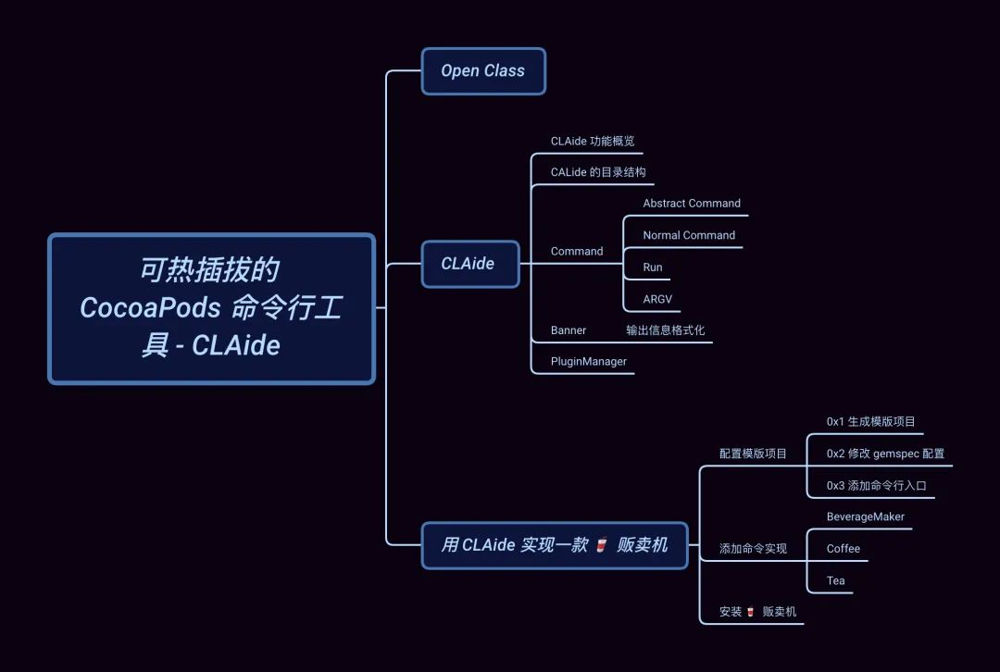

## 引子

在上文 [整体把握 CocoaPods 核心组件](https://mp.weixin.qq.com/s?__biz=MzA5MTM1NTc2Ng%3D%3D&idx=1&mid=2458324020&scene=21&sn=5d57193433b93127e3f72865bdc5b173#wechat_redirect) 中，我们通过对 `pod install` 的流程的介绍，引出 CocoaPods
的各个核心组件的角色分工和其主要作用，希望通过对这些组件的使用和介绍来帮助大家更好的了解 CocoaPods 的完整工作流以及背后的原理。

今天我们主要聊一聊为 CocoaPods 提供的命令行解析的工具 `CLAide`，它是如何来解析 pod 命令以及 CocoaPods 的插件机制。

## Open Class

开始之前，我们需要了解一个 Ruby 的语言特性：Open Classes

在 Ruby 中，类永远是开放的，你总是可以将新的方法加入到已有的类中，除了在你自己的代码中，还可以用在标准库和内置类中，这个特性被称为 `Open Classes`。说到这里作为 iOS 工程师，脑中基本能闪现出 Objective-C 的 **Category** 或者 Swift 的 **Extensions** 特性。不过，这种动态替换方法的功能也**称作 Monkeypatch**。(????  到底招谁惹谁了）

下面，我们通过在 `Monkey.rb` 文件中添加一个自定义类 `Monkey` 来简单看一下该特性，


```ruby
class Monkey
    def eat
        puts "i have banana"
    end
end
monkey = Monkey.new
class Monkey
    def eat
        puts "I have apple"
    end
end
monkey.eat
```

直接在 VSCode 中运行，效果如下：


```ruby
[Running] ruby "/Users/edmond/Desktop/Monkey.rb"
I have apple
```

可以看到，`Monkey` 类的实例输出已经改为 `I have apple`。

> 需要注意，即使是已经创建好的实例，方法替换同样是生效的。另外 ⚠️ `Open Class` 可以跨文件、跨模块进行访问的，甚至对 Ruby
内置方法的也同样适用 (谨慎)。

这强大的功能让我们可以很容易的对三方模块进行扩展，这也是 CocoaPods 的插件体系所依赖的基础。

举个例子，在 _CocoaPods_ 主仓库 `cocoapods/downloader.rb` 中定义了一些 download 方法：


```ruby
module Pod
  module Downloader
    # ...
  end
end
```

但是在 _cocoapods-downloader_ 模块中，`Downloader` 这个 `module` 的方法并不能满足全部需求，于是在`cocoapods-downloader/api.rbapi.rb` 中就对其进行了扩展：


```ruby
module Pod
  module Downloader
    module API
      def execute_command(executable, command, raise_on_failure = false)
        # ...
      end
      # ...
  end
end
```

## CLAide

CLAide 虽然是一个简单的命令行解释器，但它提供了功能齐全的命令行界面和 API。它不仅负责解析我们使用到的 `Pods` 命令，例如：`pod install`, `pod update` 等，还可用于封装常用的一些脚本，将其打包成简单的命令行小工具。

> 备注：所谓命令行解释器就是从标准输入或者文件中读取命令并执行的程序。详见 Wikiwand 上的解释。

### CLAide 功能概览

我们先通过 `pod --help` 来查看 `CLAide` 的真实输出效果：


```ruby 
$ pod
Usage:
    $ pod COMMAND
      CocoaPods, the Cocoa library package manager.
Commands:
    + cache               Manipulate the CocoaPods cache
    + deintegrate         Deintegrate CocoaPods from your project
    + env                 Display pod environment
    + init                Generate a Podfile for the current directory
   ...
Options:
    --allow-root          Allows CocoaPods to run as root
    --silent              Show nothing
    --version             Show the version of the tool
    ...
```

上面所展示的 `Usage`、`Commands`、`Options` p 及其内容均是由 `CALide` 的输出模版 **Banner** 来完成的。

`CALide` 提供了 Command 基类帮助我们快速定义出标准且美观的命令。除了 `pod` 命令之外，例如：Xcodeproj 所提供的命令也是由`CALide` 来实现的。

`CALide` 还提供了一套插件加载机制在命令执行前获取所有插件中的命令，例如：`cocoapods-packeger` 提供的 `pod package NAME [SOURCE]` 就是从其 source code 中的 `lib/pod/commnad/package.rb` 读取出来的，它令我们仅需一份`podspec` 信息，即可完成 CocoaPods 依赖库的封装。

### CALide 的目录结构

> 对于 Ruby 的项目结构，在 Rubygems.org 中有 文件结构手册 这个标准供大家参考学习。

首先来看 `CALide` 项目的文件入口 `lib/calide.rb` ：


```ruby
module CLAide
  VERSION = '1.0.3'.freeze
  require 'claide/ansi'
  require 'claide/argument'
  require 'claide/argv'
  require 'claide/command'
  require 'claide/help'
  require 'claide/informative_error'
end
```

我们接下来分析一下 `lib/cladie/` 目录下的相关代码。

### Command 抽象类

**`Command` 是用于构建命令行界面的基础抽象类**。所有我们添加的命令都需要继承自 `Command`，这些子类可以嵌套组合成更加精细的命令。

`pod` 命令正是由多个 `Pod::Command < CLAide::Command` 的子类组合而成的 `abstract command`。

当然 `pod` 的 subcommand 同样也能声明为 `abstact command`，通过这样的方式我们就能达到多级嵌套命令的效果。有抽象命令当然也需要有具体执行任务的 `normal command`。

举个例子：


```ruby
$ pod update --help
Usage:
    $ pod update [POD_NAMES ...]
        Updates the Pods identified by the specified `POD_NAMES`
Options:
    --verbose                              Show more debugging information
    --no-ansi                              Show output without ANSI codes
    --help                                 Show help banner of specified command
```

对应的， `pod update` 这个命令的逻辑在 `CLAide` 中就是如下描述：


```ruby
module Pod
  class Command
    class Update < Command
      self.arguments = [
        CLAide::Argument.new('POD_NAMES', false, true),
      ]
      
      self.description = <<-DESC
        Updates the Pods identified by the specified `POD_NAMES`.
      DESC
      
      def self.options
        [
          ["--sources", 'The sources from which to update dependent pods'],
          ['--exclude-pods', 'Pods to exclude during update'],
          ['--clean-install', 'Ignore the contents of the project cache and force a full pod installation']
        ].concat(super)
      end
    end
  end
end
```

当我们如此描述后，CLAide 会对这个类进行以下方式的解析：

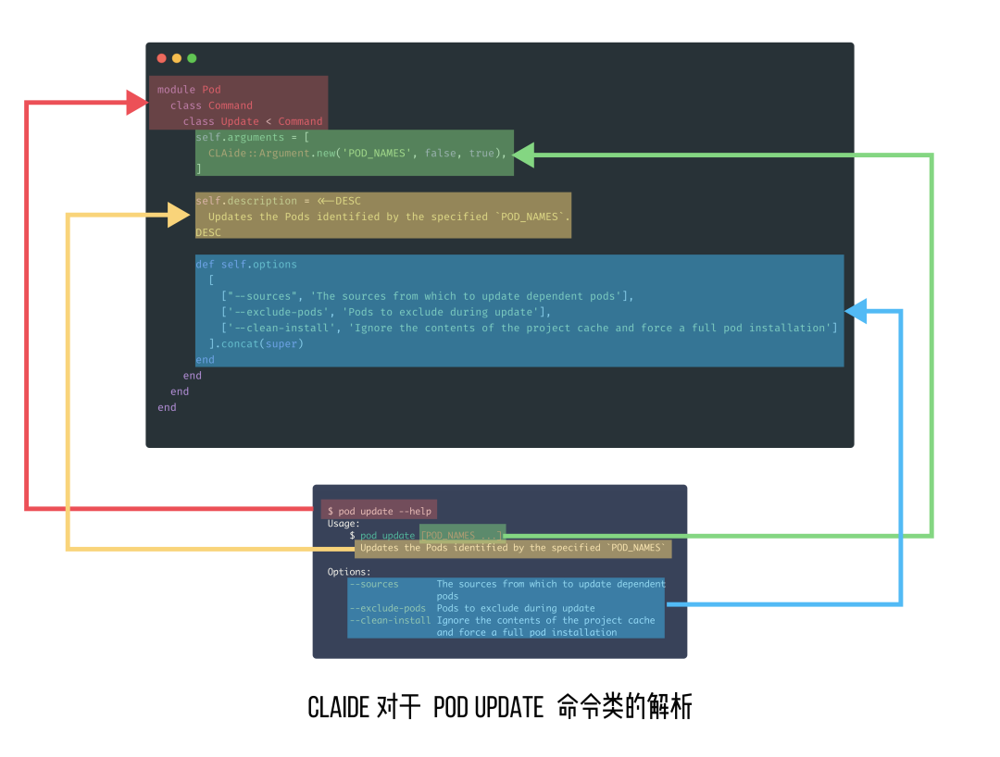

此外，`Command` class 提供了大量基础功能，其中最核心的方法为 `run`，会在 `normal command`小节会介绍。对于任何命令类型都可以设置以下几个属性和方法：

  * **summary**: 用于简单描述该命令的作用
  * **options**: 用于返回该命令的可选项及对应的描述，返回的 options 需要通过调用 `super` 插入到父类的可选项前
  * **initialize**: 如果需要获取命令行传递的实参，需要通过重载 `initialize` 方法来获取
  * **validate!**: 用于检查输入实参的有效性，如果校验失败，会通过调用 `help!` 方法来输出帮助信息
  * **help!**：用于错误信息的处理和展示

> Tips：这里我们说的 **`abstract command` 和 `normal command` 均是通过 `Command`来实现的**，只是它们的配置不同。

#### Abstract Command

`abstract command` 为不提供具体命令实现的抽象容器命令类，不过它可以包含一个或多个的 subcommands。

我们可以指定 subcommands 中的 `normal command` 为默认命令，就能将 `abstract command`作为作为普通命令直接执行了。

抽象命令的现实比较简单：


```ruby
self.abstract_command = true
```

**仅需设置 `abstract_command`，然后就可以继承它来实现普通命令或者多级嵌套的抽象命令**。

以 `pod` 命令的实现为例：


```ruby
module Pod
  class Command < CLAide::Command
    require 'cocoapods/command/install' # 1
    require 'cocoapods/command/update'
    # ...
    self.abstract_command = true
    self.command = 'pod'
    # ...
end
```

上述通过 **require** 引入的 `update`、`install` 等子命令都是继承自 `Pod::Command` 的 `normal command`。

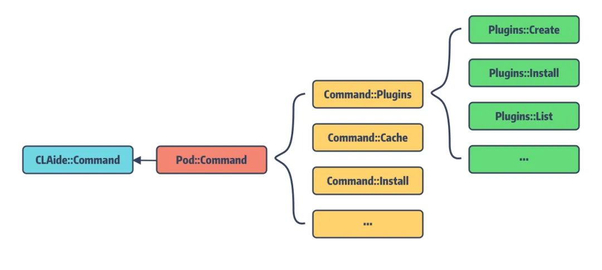

#### Normal Command

相对于抽象命令，普通命令就需要设置传递实参的名称和描述，以及重载 `run` 方法。

**Arguments**

`arguments` 用于配置该命令支持的参数列表的 banner 输出，类型为 `Array<Argument>`，它最终会格式化成对应的信息展示在`Usage` banner 中。

我们来看 `pod update` 的 `arguments` 是如何配置的：


```ruby
self.arguments = [
    CLAide::Argument.new('POD_NAMES', false, true),
]
```

其中 `Argument` 的构造方法如下：


```ruby
module CLAide
  class Argument
   
    def initialize(names, required, repeatable = false)
      @names = Array(names)
      @required = required
      @repeatable = repeatable
    end
end
```

这里传入的 names 就是在 `Usage` banner 中输出的 `[POD_NAMES ...]` 。

  * **require** 表示该 Argument 是否为必传参数，可选参数会用 `[ ]` 将其包裹起来。也就是说 `pod update` 命令默认是不需要传 `POD_NAMES`

  * **repeatable** 表示该 Argument 是否可以重复多次出现。如果设置为可重复，那么会在 names 的输出信息后面会添加 `...` 表示该参数为复数参数。

举个例子：


```ruby
$ pod update Alamofire, SwiftyJSON
```

我们可以指定 `pod update` 仅更新特定的依赖库，如果不传 `POD_NAMES` 将进行全量更新。

#### Run 方法

在 `Command` 类中定义了两个 `run` 方法：


```ruby
def self.run(argv = [])
    # 根据文件前缀来匹配对应的插件
    plugin_prefixes.each do |plugin_prefix|
       PluginManager.load_plugins(plugin_prefix)
    end
    argv = ARGV.coerce(argv)
    # 解析 argument 生成对应的 command instance
    command = parse(argv) 
    ANSI.disabled = !command.ansi_output?
    unless command.handle_root_options(argv)
       command.validate!
       command.run
    end
rescue Object => exception
    handle_exception(command, exception)
end

def run
    raise 'A subclass should override the `CLAide::Command#run` method to ' \
    'actually perform some work.'
end
```

这里的 `self.run` 方法是 class method，而 `run` 是 instanced method。

> 对于 `Ruby` 不太熟悉的同学可以看看这个：What does def `self.function` name mean?

作为 `Command` 类的核心方法，类方法 `self.run` 将终端传入的参数解析成对应的 **command** 和 **argv**，并最终调用command 的实例方法 `run` 来触发真正的命令逻辑。因此，子类需要通过重载 `run` 方法来完成对应命令的实现。

那么问题来了，方法 `Command::parse` 是如何将 `run` 的类方法转换为实例方法的呢？


```ruby
def self.parse(argv)
  # 通过解析 argv 获取到与 cmd 名称
    argv = ARGV.coerce(argv)
    cmd = argv.arguments.first
    # 如果 cmd 对应的 Command 类，则更新 argv，继续解析命令
    if cmd && subcommand = find_subcommand(cmd)
        argv.shift_argument
        subcommand.parse(argv)
    # 如果 cmd 为抽象命令且指定了默认命令，则返回默认命令继续解析参数
    elsif abstract_command? && default_subcommand
        load_default_subcommand(argv)
    else
        # 初始化真正的 cmd 实例
        new(argv)
    end
end
```

可以说，`CLAide` 的命令解析就是一个**多叉树遍历**，通过分割参数及遍历 `CLAide::Command` 的子类，最终找到用户输入的`normal command` 并初始化返回。

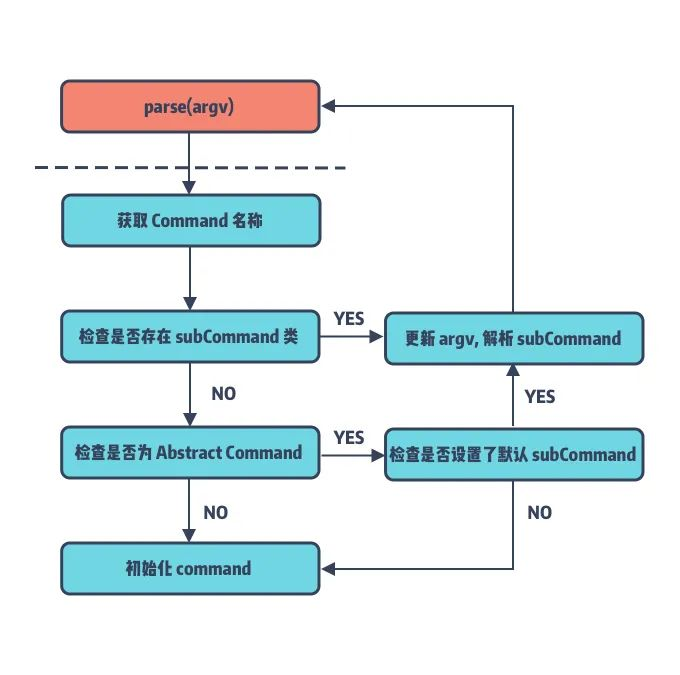

这里还有一个知识点就是，`CLAide::Command` 是如何知道有哪些子类集成它的呢？


```ruby
def self.inherited(subcommand)
    subcommands << subcommand
end
```

**这里利用了 `Ruby` 提供的 _Hook Method_ `self.inherited` 来获取它所继承的子类，并将其保存在 `subcommands`。**

另外，这里在真正执行 `self.run` 方法之前会遍历当前项目所引入的 Gems 包中的指定目录下的命令插件文件，并进行插件加载，具体内容将在`PluginManager` 中展开。

#### ARGV 传入参数

`CLAide` 提供了专门的类 `ARGV` 用于解析命令行传入的参数。主要功能是对 `Parse` 解析后的 tuple 列表进行各种过滤、CURD等操作。

按照 `CALide` 的定义参数分三种类型：

  * `arg`: 普通的实参，所谓的实参就是直接跟在命令后面的，且不带任何 `\--` 修饰的字符
  * `flag`: 简单理解 `flag` 就是限定为 bool 变量的 `option` 类型参数，如果 `flag` 前面添加带 `\--no-` 则值为 false，否则为 true
  * `option`: 可选项参数，以 `\--` 为前缀且以 `=` 作为分割符来区分 key 和 value

而在 `ARGV` 内部又提供了私有工具类 `Parser` 来解析终端的输入，其核心方法为 `parse`:


```ruby
module Parser
    def self.parse(argv)
        entries = []
        copy = argv.map(&:to_s)
        double_dash = false
        while argument = copy.shift
          next if !double_dash && double_dash = (argument == '--')
          type = double_dash ? :arg : argument_type(argument)
          parsed_argument = parse_argument(type, argument)
          entries << [type, parsed_argument]
        end
        entries
    end
    # ,,,
end
```

parse 的返回值为 `[Array<Array<Symbol, String, Array>>]` 类型的 tuple，其中 tuple 的第一个变量为实参的类型，第二个才是对应的实参。

依旧以 `pod update` 为例：


```ruby
pod update Alamofire --no-repo-update --exclude-pods=SwiftyJSON
```

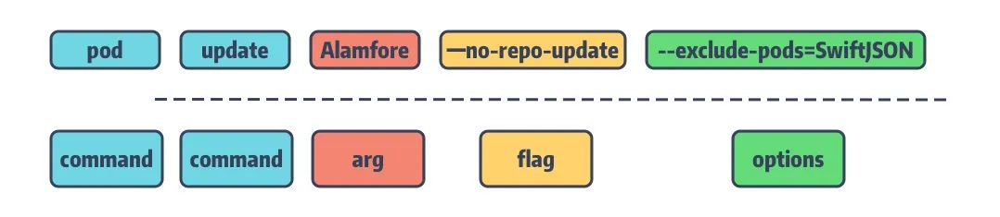

解析后，输出的 tuple 列表如下：


```ruby
[
    [:arg, "Alamofire"],
    [:flag, ["repo-update", false]],
    [:option, ["exclude-pods", "SwiftyJSON"]]
]
```

### Banner 与输出格式化

接下来，我们再来聊聊 `CLAide` 提供的格式化效果的 banner。

那什么是 banner 呢？回看第一个例子 `pod --help` 所输出的帮助信息，它分为三个 Section：

  * `Usage`：用于描述该命令的用法
  * `Commands`：用于描述该命令所包含的子命令，没有则不显示。在子命令前面存在两种类型的标识
  *     * `+` ：用于强调该 command 是单独添加的子命令
    * `>` ：用于表示指引的意思，表示该 command 是当前命令的默认实现
  * `Options`：用于描述该命令的可选项

**这三段帮助信息就是对应的不同的 banner。**

`CLAide` 对于输出的 banner 信息提供了 ANSI 转义，用于在不同的终端里显示富文本的效果。banner 的主要格式化效果如下：

对于 Section 标题：`Usage`、`Commands`、`Options` 添加了下划线且加粗处理

  * Command 配置为绿色
  * Options 配置为蓝色
  * 提示警告信息配置为黄色
  * 错误信息则是红色

对于这些配色方案，`CLAide` 提供了 String 的 convince method 来完成 ANSI 转义：


```ruby
    class String
      def ansi
        CLAide::ANSI::StringEscaper.new(self)
      end
    end
```

例如：


```ruby
"example".ansi.yellow #=> "\e[33mexample\e[39m"
"example".ansi.on_red #=> "\e[41mexample\e[49m"
"example".ansi.bold   #=> "\e[1mexample\e[21m"
```

对于 Banner 的一些高亮效果也提供了 convince method：


```ruby
def prettify_title(title)
  title.ansi.underline
end
def prettify_subcommand(name)
  name.chomp.ansi.green
end
def prettify_option_name(name)
  name.chomp.ansi.blue
end
```

### PluginManager 载入插件

`PluginManager` 是 Command 的管理类，会在第一次运行命令 `self.run`时进行加载，且仅加载命令类中指定前缀标识的文件下的命令。让我们先看 `PluginManager.rb` 的核心实现：


```ruby
def self.load_plugins(plugin_prefix)
    loaded_plugins[plugin_prefix] ||=
    plugin_gems_for_prefix(plugin_prefix).map do |spec, paths|
        spec if safe_activate_and_require(spec, paths)
    end.compact
end

def self.plugin_gems_for_prefix(prefix)
    glob = "#{prefix}_plugin#{Gem.suffix_pattern}"
    Gem::Specification.latest_specs(true).map do |spec|
        matches = spec.matches_for_glob(glob)
        [spec, matches] unless matches.empty?
    end.compact
end

def self.safe_activate_and_require(spec, paths)
    spec.activate
    paths.each { |path| require(path) }
    true
rescue Exception => exception
    # ...
end
```

整体的流程大致是：

  1. 调用 `load_plugins` 并传入 `plugin_prefix`
  2. `plugin_gems_for_prefix` 对插件名进行处理，取出我们需要加载的文件
  3. 调用 `safe_activate_and_require` 进行对应的 gem spec 检验并对每个文件进行加载

CocoaPods 的插件加载正是依托于 CLAide 的 `load_plugins`，它会遍历所有的 RubyGem，并搜索这些 Gem 中是否包含名为`#{plugin_prefix}_plugin.rb` 的文件。例如，在 Pod 命令的实现中有如下配置：


```ruby
self.plugin_prefixes = %w(claide cocoapods)
```

也就是说在 Pod 命令执行前，**它会加载所有包含 `claide_plugin.rb` 或 `cocoapods_plugin.rb` 文件的Gem**。通过在运行时的文件检查来加载符合要求的相关命令。

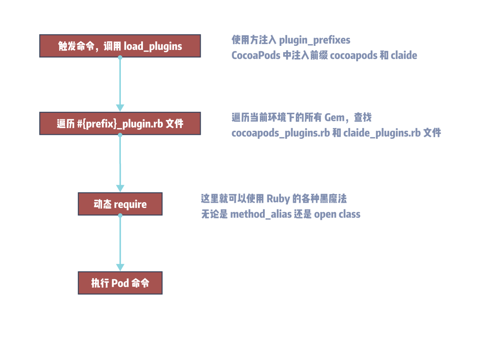

## 用 CLAide 实现一款 ???? 贩卖机

最后一节让我们一起来创建一个 CLAide 命令。需求是希望实现一个自动 🥤 贩卖机，它有如下功能：主要售卖 ☕️ 和 🍵，这两种 🥤 都可以按需选择是否添加 🥛  和 🍬，对于 🍬 还可以选择不同的甜度。

  * ☕️：对于咖啡，我们提供了：BlackEye、Affogato、CaPheSuaDa、RedTux 的口味
  * 🍵：对于茶，你可以选择不同的品种，有黑茶、绿茶、乌龙茶和白茶，同时茶还提供了加 🧊 的选项

### 配置模版项目

基于上述构想，我们最终的 `BeverageMaker` 目录将由以下文件组成：


```ruby
.
├── BeverageMaker.gemspec
│   # ...
├── exe
│   └── beverage-maker
├── lib
│   ├── beveragemaker
│   │   ├── command
│   │   │   ├── coffee.rb # 包含 abstract command 以及用于制作不同咖啡的 normal command
│   │   │   ├── maker.rb  # Command 抽象类
│   │   │   └── tea.rb    # normal command, 不同种类的 ???? 通过参数配置来完成
│   │   ├── command.rb
│   │   └── version.rb
│   └── beveragemaker.rb
└── spec
    ├── BeverageMaker_spec.rb
    └── spec_helper.rb
```

#### 0x1 生成模版项目

首先，我们使用 `bundler gem GEM_NAME` 命令生成一个模版项目，项目取名为 **BeverageMaker**。


```ruby
$ bundle gem BeverageMaker
Creating gem 'BeverageMaker'...
MIT License enabled in config
Code of conduct enabled in config
      create  BeverageMaker/Gemfile
      create  BeverageMaker/lib/BeverageMaker.rb
      create  BeverageMaker/lib/BeverageMaker/version.rb
      create  BeverageMaker/BeverageMaker.gemspec
      create  BeverageMaker/Rakefile
      # ...
Initializing git repo in ~/$HOME/Desktop/BeverageMaker
Gem 'BeverageMaker' was successfully created. For more information on making a RubyGem visit https://bundler.io/guides/creating_gem.html
```

#### 0x2 修改 gemspec 配置

生成的项目中需要将 `BeverageMaker.gemspec` 文件所包含 **TODO** 的字段进行替换，作为示例项目相关链接都替换为个人主页了。

另外，需要添加我们的依赖 `'claide', '>= 1.0.2', '< 2.0'` 和 `'colored2', '~> 3.1'`。

> **colored2** 用于 banner 信息的 ANSI 转义并使其能在终端以富文本格式输出。

最终 `.gempsc` 配置如下：


```ruby
require_relative 'lib/BeverageMaker/version'
Gem::Specification.new do |spec|
  spec.name          = "BeverageMaker"
  spec.version       = BeverageMaker::VERSION
  spec.authors       = ["Edmond"]
  spec.email         = ["chun574271939@gmail.com"]
  spec.summary       = "BeverageMaker"
  spec.description   = "BeverageMaker"
  spec.homepage      = "https://looseyi.github.io"
  spec.license       = "MIT"
  spec.required_ruby_version = Gem::Requirement.new(">= 2.3.0")
  spec.metadata["allowed_push_host"] = "https://looseyi.github.io"
  spec.metadata["homepage_uri"] = spec.homepage
  spec.metadata["source_code_uri"] = "https://looseyi.github.io"
  spec.metadata["changelog_uri"] = "https://looseyi.github.io"
  spec.files         = Dir.chdir(File.expand_path('..', __FILE__)) do
    `git ls-files -z`.split("\x0").reject { |f| f.match(%r{^(test|spec|features)/}) }
  end
  # 1
  spec.bindir        = "exe"
  spec.executables   = "beverage-maker"
  spec.require_paths = ["lib"]
   
  spec.add_runtime_dependency 'claide',         '>= 1.0.2', '< 2.0'
  spec.add_runtime_dependency 'colored2',       '~> 3.1'
end
```

#### 0x3 添加命令行入口

通过修改 `.gemspec` 的 `bindir` 和 `executables` 字段，把最终的 binary 执行文件暴露给用户，使其成为一个真正的CLI：


```ruby
spec.bindir        = "exe"
spec.executables   = "beverage-maker"
```

在默认生成的模版中指定的 `bindir` 为 `/bin` 目录，这里我们替换为新建的 `exe` 目录，并在 `exe` 目录下创建一个名为`beverage-maker` 的文件，它将作为 CLI 的入口，其内容如下：


```ruby
#!/usr/bin/env ruby
require 'beveragemaker'
BeverageMaker::Command.run(ARGV)
```

### 添加命令实现

为了让 Demo 结构清晰，我们将不能类型的饮料制作分到了不同的文件和命令类中。

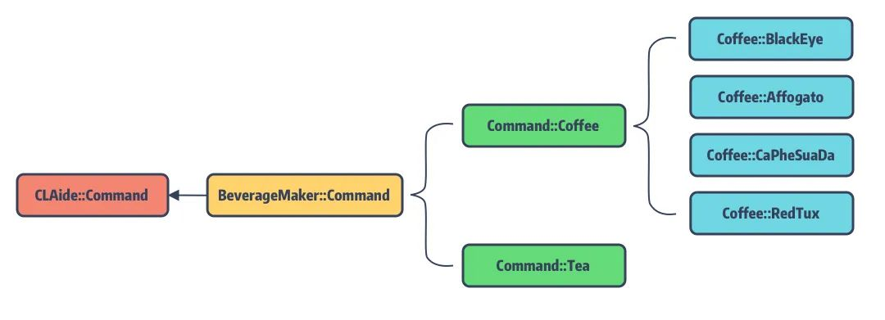

#### BeverageMaker

先来实现 `beverage-maker` 命令，它是一个 `abstract command`，其内容如下：


```ruby
require 'claide'
require 'colored2'
module BeverageMaker
  # 引入具体的 coffee & tea maker
  require 'beveragemaker/command/coffee'
  require 'beveragemaker/command/tea'
  
  class Command < CLAide::Command
    self.command = 'beverage-maker'  
    self.abstract_command = true   
    self.description = 'Make delicious beverages from the comfort of your terminal.'
    def self.options
      [
        ['--no-milk', 'Don’t add milk to the beverage'],
        ['--sweetener=[sugar|honey]', 'Use one of the available sweeteners'],
      ].concat(super)
    end
  
    def initialize(argv)
      @add_milk = argv.flag?('milk', true)
      @sweetener = argv.option('sweetener')
      super
    end
  
    def validate!
      super
      if @sweetener && !%w(sugar honey).include?(@sweetener)
        help! "`#{@sweetener}' is not a valid sweetener."
      end
    end
  
    def run
      puts '* Boiling water…'
      sleep 1
      if @add_milk
        puts '* Adding milk…'
        sleep 1
      end
      if @sweetener
        puts "* Adding #{@sweetener}…"
        sleep 1
      end
    end
  end
end
```

正常来说，对于不同口味的咖啡和茶是可以用相同的命令模式来实现的，不过为了更好的展示 `CLAide` 的效果，我们将咖啡的生产配置为 `abstact command`，对于不同口味的咖啡，需要实现不同的 `normal command`。而茶的生产直接通过 `normal command` 实现，不同品种的茶叶会以参数的形式来配置。

#### Coffee

接着添加 ☕️ 的代码


```ruby
class Coffee < Command
    # ...
    self.abstract_command = true
    def run
        super
        puts "* Grinding #{self.class.command} beans…"
        sleep 1
        puts '* Brewing coffee…'
        sleep 1
        puts '* Enjoy!'
    end
    class BlackEye < Coffee
        self.summary = 'A Black Eye is dripped coffee with a double shot of ' \
        'espresso'
    end
    # ...
end
```

#### Tea


```ruby
class Tea < Command
    # ...
    self.arguments = [
      CLAide::Argument.new('FLAVOR', true),
    ]
    def self.options
      [['--iced', 'the ice-tea version']].concat(super)
    end
    def initialize(argv)
      @flavor = argv.shift_argument
      @iced = argv.flag?('iced')
      super
    end
    def validate!
      super
      if @flavor.nil?
        help! 'A flavor argument is required.'
      end
      unless %w(black green oolong white).include?(@flavor)
        help! "`#{@flavor}' is not a valid flavor."
      end
    end
  # ...
end
```

### 安装 🥤 贩卖机

我们知道，对于正常发布的 gem 包，可以直接通过 `gem install GEM_NAME` 安装。

而我们的 Demo 程序并未发布，那要如何安装使用呢？幸好 Gem 提供了源码安装的方式：


```ruby
gem build *.gemspec
gem install *.gem
```

`gem build` 可以根据一个 `.gemspec` 生成一个 `.gem` 文件供 gem 安装，所以在拥有源码的情况下，执行上面命令就可以安装了。

执行结果如下：


```ruby
$ gem build *.gemspec
WARNING:  description and summary are identical
WARNING:  See http://guides.rubygems.org/specification-reference/ for help
  Successfully built RubyGem
  Name: BeverageMaker
  Version: 0.1.0
  File: BeverageMaker-0.1.0.gem
  
$ gem install *.gem
Successfully installed BeverageMaker-0.1.0
Parsing documentation for BeverageMaker-0.1.0
Done installing documentation for BeverageMaker after 0 seconds
1 gem installed
```

编译通过！

现在可以开始我们的 🥤  制作啦！


```ruby
$ beverage-maker
Usage:
    $ beverage-maker COMMAND
      Make delicious beverages from the comfort of yourterminal.
Commands:
    + coffee                    Drink brewed from roasted coffee beans
Options:
    --no-milk                   Don’t add milk to the beverage
    --sweetener=[sugar|honey]   Use one of the available sweeteners
    --version                   Show the version of the tool
    --verbose                   Show more debugging information
    --no-ansi                   Show output without ANSI codes
    --help                      Show help banner of specified command
```

来一杯 black-eye ☕️，休息一下吧!


```ruby
$ beverage-maker coffee black-eye
* Boiling water…
* Adding milk…
* Grinding black-eye beans…
* Brewing coffee…
* Enjoy!
```

如需本文的 Demo 代码，请访问：https://github.com/looseyi/BeverageMaker

## 总结

本文简单分析来 `CLAide` 的实现，并手动制作了一款 ???? 贩卖机来展示 `CALide` 的命令配置。主要感受如下：

  1. 通过对源码对阅读，终于了解了对  `pod` 命令的的正确使用姿势
  2. 仅需简单配置 `Command` banner，就能有比较精美的终端输出效果和帮助提示等
  3. 提供的抽象命令功能，方便的将相关逻辑收口到统一到命令中，方便查阅
  4. 从侧面简单了解了，如何在终端输出带富文本效果的提示信息

## 知识点问题梳理

这里罗列了四个问题用来考察你是否已经掌握了这篇文章，如果没有建议你加入 **收藏** 再次阅读：

  1. `CLAide` 预设的 banner 有哪些，其作用分别是什么 ？
  2. `CALide` 中设定的 Argument 有几种类型，区别是什么 ？
  3. `CALide` 中抽象命令的和普通命令的区别 ？
  4. 要实现 CLI 需要修改 `.gemspec` 中的哪些配置 ？

<hr>
#### <p>原文出处：<a href='https://mp.weixin.qq.com/s?__biz=MzA5MTM1NTc2Ng==&mid=2458324199&idx=1&sn=3886bbbcef3640bf97e16fcec34b451f&chksm=870e03feb0798ae84ab4b5dab26dfbe8ebbac0bca8491493fa4919f6069bfef58cd04df5ab34&scene=178&cur_album_id=1477103239887142918#rd' target='blank'>4. Podfile 的解析逻辑</a></p>

> **CocoaPods 历险记** 这个专题是 **Edmond** 和 **冬瓜** 共同撰写，对于 iOS / macOS 工程中版本管理工具
CocoaPods 的实现细节、原理、源码、实践与经验的分享记录，旨在帮助大家能够更加了解这个依赖管理工具，而不仅局限于 `pod install` 和`pod update`。

## 本文知识目录  


## 引子

在上文 [「CocoaPods 命令解析 - CLAide」](http://mp.weixin.qq.com/s?__biz=MzA5MTM1NTc2Ng%3D%3D&chksm=870e0346b0798a50c9bea91cef28286694792b84bdf7b6488608560c9c5bd309f170756211ac&idx=1&mid=2458324063&scene=21&sn=eff7c06743eac09a08fb96b874fb4ed6#wechat_redirect)  中，我们通过对 **CLAide** 的源码分析，了解了 CocoaPods 是如何处理 `pod`命令，多级命令又是如何组织和嵌套的，并解释了命令行输出所代表的含义。今天我们开始学习 `Podfile` 。

大多 iOS 工程师最先接触到的 CocoaPods 概念应该是 `Podfile`，而 `Podfile` 属于 `cocoapods-core`（以下简称 **Core**） 的两大概念之一。另外一个则是 Podspec[2] (用于描述 Pod Library
的配置文件)，只有当你需要开发 Pod 组件的时候才会接触。

在介绍 Podfile 的内容结构之前，必须要谈谈 Xcode 的工程结构。

## Xcode 工程结构

我们先来看一个极简 Podfile 声明：


```ruby
target 'Demo' do
 pod 'Alamofire', :path => './Alamofire'
end
```

它编译后的工程目录如下：

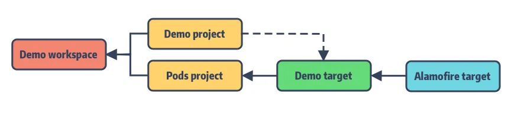

如你所见 Podfile 的配置是围绕 Xcode 的这些工程结构：**Workspace、Project、Target 以及 Build Setting** 来展开的。作为包管理工具 CocoaPods 将所管理的 Pods 依赖库组装成一个个 Target，统一放入 `Pods project` 中的 `Demo target`，并自动配置好 Target 间的依赖关系。

之后将 `Example` 主工程和 `Pods` 工程一起打包到新建的 `Example.workspace`，配好主工程与 `Pods` 工程之间的依赖，完成最终转换。

接下来，我们来聊一聊这些 Xcode 结构：

### Target - 最小可编译单元

**首先是 Target，它作为工程中最小的可编译单元，根据 Build Phases[3] 和 Build Settings[4]** 将源码作为输入，经编译后输出结果产物。

其输出结果可以是链接库、可执行文件或者资源包等，具体细节如下：

  * Build Setting：比如指定使用的编译器，目标平台、编译参数、头文件搜索路径等；
  * Build 时的前置依赖、执行的脚本文件；
  * Build 生成目标的签名、Capabilities 等属性；
  * Input：哪些源码或者资源文件会被编译打包；
  * Output：哪些静态库、动态库会被链接；

### Project - Targets 的载体

**Project 就是一个独立的 Xcode 工程，作为一个或多个 Targets 的资源管理器，本身无法被编译。**Project 所管理的资源都来自它所包含的 Targets。特点如下：

  * 至少包含一个或多个可编译的 Target；
  * 为所包含的 Targets 定义了一份默认编译选项，如果 Target 有自己的配置，则会覆盖 Project 的预设值；
  * 能将其他 Project 作为依赖嵌入其中；

下图为 Project 与所包含对 Targets 的关系

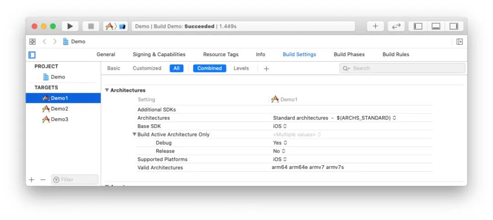

### Workspace - 容器

**作为纯粹的项目容器，Workspace 不参与任何编译链接过程，仅用于管理同层级的 Project**，其特点：

  * **Workspace 可以包含多个 Projects**；
  * 同一个 Workspace 中的 Proejct 文件对于其他 Project 是默认可见的，**这些 Projcts 会共享 `workspace build directory`** ；
  * 一个 Xcode Project 可以被包含在多个不同的 Workspace 中，因为每个 Project 都有独立的 Identity，默认是 Project Name；

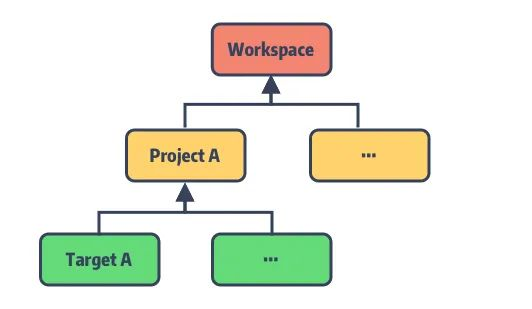

### Scheme - 描述 Build 过程

**Scheme 是对于整个 Build 过程的一个抽象**，它描述了 Xcode 应该使用哪种 Build Configurations[5] 、执行什么任务、环境参数等来构建我们所需的 Target。

Scheme 中预设了六个主要过程：**Build、Run、Test、Profile、Analyze、Archive**。包括了我们对 Target 的所有操作，每一个过程都可以单独配置。

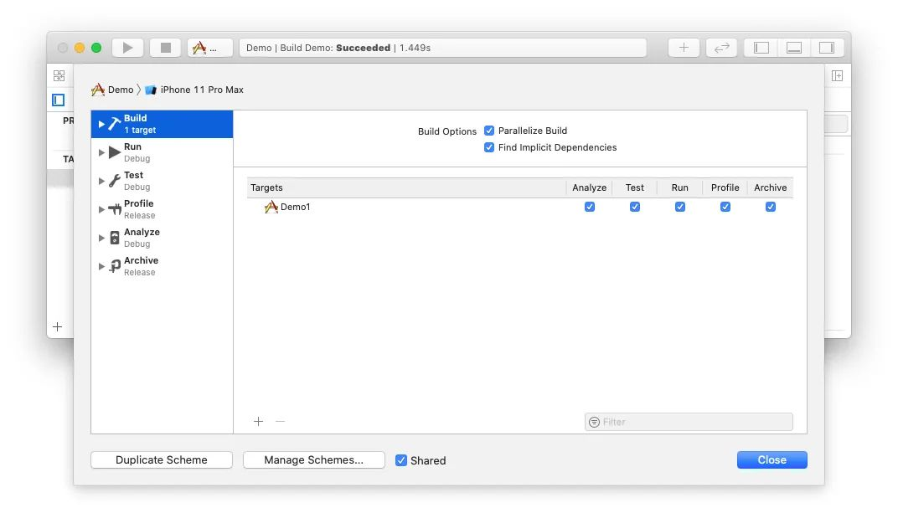

## CocoaPods-Core

CocoaPods-Core 用于 CocoaPods 中配置文件的解析，包括 `Podfile`、`Podspec` 以及解析后的依赖锁存文件，如 Podfile.lock 等。

### CocoaPods-Core 的文件构成

照例，我们先通过入口文件 `lib/cocoapods-core.rb` 来一窥 Core 项目的主要文件：


```ruby
module Pod
  require 'cocoapods-core/gem_version'
  class PlainInformative < StandardError; end
  class Informative < PlainInformative; end
  require 'pathname'
  require 'cocoapods-core/vendor'
   
  # 用于存储 PodSpec 中的版本号
  autoload :Version,        'cocoapods-core/version'
  # pod 的版本限制
  autoload :Requirement,    'cocoapods-core/requirement'
  # 配置 Podfile 或 PodSpec 中的 pod 依赖
  autoload :Dependency,     'cocoapods-core/dependency'
  # 获取 Github 仓库信息
  autoload :GitHub,         'cocoapods-core/github'
  # 处理 HTTP 请求
  autoload :HTTP,           'cocoapods-core/http'
  # 记录最终 pod 的依赖信息
  autoload :Lockfile,       'cocoapods-core/lockfile'
  # 记录 SDK 的名称和 target 版本
  autoload :Platform,       'cocoapods-core/platform'
  # 对应 Podfile 文件的 class
  autoload :Podfile,        'cocoapods-core/podfile'
  # 管理 PodSpec 的集合
  autoload :Source,         'cocoapods-core/source'
  # 管理基于 CDN 来源的 PodSpec 集合
  autoload :CDNSource,      'cocoapods-core/cdn_source'
  # 管理基于 Trunk 来源的 PodSpec 集合
  autoload :TrunkSource,    'cocoapods-core/trunk_source'
  # 对应 PodSpec 文件的 class
  autoload :Specification,  'cocoapods-core/specification'
  # 将 pod 信息转为 .yml 文件，用于 lockfile 的序列化
  autoload :YAMLHelper,     'cocoapods-core/yaml_helper'
  # 记录 pod 依赖类型，是静态库/动态库
  autoload :BuildType,      'cocoapods-core/build_type'
  
  ...
  Spec = Specification
end
```

将这些 Model 类按照对应的依赖关系进行划分，层级如下：

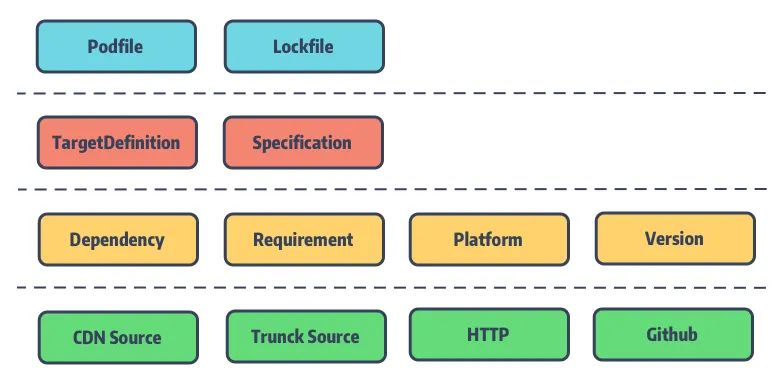

### Podfile 的主要数据结构

先来了解 Podfile 的主要数据结构

#### Specification

Specification 即存储 `PodSpec` 的内容，是用于**描述一个 Pod 库的源代码和资源将如何被打包编译成链接库或framework**，后续将会介绍更多的细节。

#### TargetDefinition

**`TargetDefinition` 是一个多叉树结构，每个节点记录着 `Podfile` 中定义的 Pod 的 Source 来源、Build Setting、Pod 子依赖等**。

该树的根节点指向 `Podfile`，而 `Podfile` 中的 `root_target_definitions` 则记录着所有的`TargetDefinition` 的根节点，正常情况下该 list 中只有一个 root 即 `Pods.project`。

为了便于阅读，简化了大量的 DSL 配置相关的方法和属性并对代码顺序做了调整，大致结构如下：


```ruby
module Pod
  class Podfile
    class TargetDefinition
      # 父节点: TargetDefinition 或者 Podfile
      attr_reader :parent
      # 子节点: TargetDefinition
      attr_reader :children
      # 记录 tareget 的配置信息
      attr_accessor :internal_hash
      def root?
        parent.is_a?(Podfile) || parent.nil?
      end
      def root
        if root?
          self
        else
          parent.root
        end
      end
      def podfile
        root.parent
      end
       
      # ...
    end
  end
end
```

对应上一节 Xcode 工程结构中的 `Podfile` 关系如下：

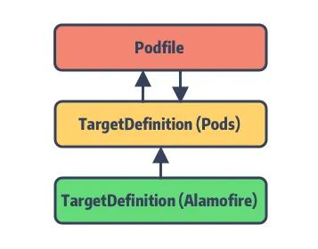

CocoaPods 正是巧妙利用了 Xcode 工程结构的特点，引入  `Pods.project` 这一中间层，将主工程的 Pods 依赖全部转接到`Pods.project` 上，最后再将 `Pods.project` 作为主项目的依赖。

尽管这么做也受到了一些质疑和诟病（所谓的侵入性太强），但笔者的观点是，正得益于 `Pods.project`这一设计隔绝了第三方依赖库对于主项目的频繁更改，也便于后续的管理和更新，体现了软件工程中的 **开放-关闭原则** 。

比如，在 Pod 1.7.0 版本中支持的 **Multiple Xcodeproj Generation[6]** 就是解决随着项目的迭代而日益增大的`Pods` project 的问题。

试想当你的项目中存在上百个依赖库，每个依赖库的变更都会影响到你的主工程，这将是非常可怕的问题。

#### `Podfile`

`Podfile` 是用于描述一个或多个 Xcode Project 中各个 Targets 之间的依赖关系。

这些 Targets 的依赖关系对应的就是 `TargetDefinition` 树中的各子节点的层级关系。如前面所说，**有了 `Podfile`这个根节点的指向，仅需对依赖树进行遍历，就能轻松获取完整的依赖关系**。

有了这层依赖树，对于某个 `Pod` 库的更新即是对树节点的更新，便可轻松的分析出此次更新涉及的影响。

简化调整后的 Podfile 代码如下：


```ruby
require 'cocoapods-core/podfile/dsl'
require 'cocoapods-core/podfile/target_definition'
module Pod
  class Podfile
    include Pod::Podfile::DSL
    # podfile 路径
    attr_accessor :defined_in_file
    # 所有的 TargetDefinition 的根节点, 正常只有一个，即 Pods.project target
    attr_accessor :root_target_definitions
    # 记录 Pods.project 项目的配置信息
    attr_accessor :internal_hash
    # 当前 DSL 解析使用的 TargetDefinition
    attr_accessor :current_target_definition
    # ...
  end
end
```

直接看 `dsl.rb`，该文件内部定义了 Podfile DSL 支持的所有方法。通过 **include** 的使用将`Pod::Podfile::DSL` 模块 Mix-in 后插入到 Podfile 类中。想了解更多 Mix-in 特性，移步 [「CocoaPods中的 Ruby 特性之 Mix-in」](http://mp.weixin.qq.com/s?__biz=MzA5MTM1NTc2Ng%3D%3D&chksm=870e0348b0798a5ed6d14715cc4a1af93cd168a5e15198acfb3b84ea49506b0f815fa891d683&idx=1&mid=2458324049&scene=21&sn=8de53f46fbc52427cdb660b427cb8226#wechat_redirect)。

#### `Lockfile`

**`Lockfile`，顾名思义是用于记录最后一次 CocoaPods 所安装的 Pod 依赖库版本的信息快照。也就是生成的 **`Podfile.lock`**。**

在 `pod install` 过程，Podfile 会结合它来确认最终所安装的 Pod 版本，固定 Pod 依赖库版本防止其自动更新。

`Lockfile` 也作为 Pods 状态清单 (`mainfest`)，用于记录安装过程的中哪些 Pod 需要被删除或安装或更新等。

以开头的 Podfile 经 `pod install` 所生成的 `Podfile.lock` 为例：


```ruby 
    PODS:
      - Alamofire (4.6.0)
    DEPENDENCIES:
      - Alamofire (from `./Alamofire`)
    EXTERNAL SOURCES:
      Alamofire:
        :path: "./Alamofire"
    SPEC CHECKSUMS:
      Alamofire: 0dda98a0ed7eec4bdcd5fe3cdd35fcd2b3022825
    PODFILE CHECKSUM: da12cc12a30cfb48ebc5d14e8f51737ab65e8241
    COCOAPODS: 1.10.0.beta.2
```

我们来分析一下，通过该 Lockfile 能够获取哪些信息：

<table><thead><tr style="border-width: 1px 0px 0px;border-right-style: initial;border-bottom-style: initial;border-left-style: initial;border-right-color: initial;border-bottom-color: initial;border-left-color: initial;border-top-style: solid;border-top-color: rgb(204, 204, 204);background-color: white;"><th style="border-top-width: 1px;border-color: rgb(204, 204, 204);text-align: left;background-color: rgb(240, 240, 240);min-width: 85px;"><strong>Key</strong></th><th style="border-top-width: 1px;border-color: rgb(204, 204, 204);text-align: left;background-color: rgb(240, 240, 240);min-width: 85px;"><strong>含义</strong></th></tr></thead><tbody style="border-width: 0px;border-style: initial;border-color: initial;"><tr style="border-width: 1px 0px 0px;border-right-style: initial;border-bottom-style: initial;border-left-style: initial;border-right-color: initial;border-bottom-color: initial;border-left-color: initial;border-top-style: solid;border-top-color: rgb(204, 204, 204);background-color: white;"><td style="border-color: rgb(204, 204, 204);min-width: 85px;"><strong>PODS</strong></td><td style="border-color: rgb(204, 204, 204);min-width: 85px;">记录所有 Pod 库的具体安装版本号</td></tr><tr style="border-width: 1px 0px 0px;border-right-style: initial;border-bottom-style: initial;border-left-style: initial;border-right-color: initial;border-bottom-color: initial;border-left-color: initial;border-top-style: solid;border-top-color: rgb(204, 204, 204);background-color: rgb(248, 248, 248);"><td style="border-color: rgb(204, 204, 204);min-width: 85px;"><strong>DEPENDENCIES</strong></td><td style="border-color: rgb(204, 204, 204);min-width: 85px;">记录各 Pod 库之间的相互依赖关系，由于这里只有 Alamofire 且它无其他依赖，暂时无关看出区别</td></tr><tr style="border-width: 1px 0px 0px;border-right-style: initial;border-bottom-style: initial;border-left-style: initial;border-right-color: initial;border-bottom-color: initial;border-left-color: initial;border-top-style: solid;border-top-color: rgb(204, 204, 204);background-color: white;"><td style="border-color: rgb(204, 204, 204);min-width: 85px;"><strong>EXTERNAL SOURCES</strong></td><td style="border-color: rgb(204, 204, 204);min-width: 85px;">记录部分通过外部源的 Pod 库（Git 引入、Path 引入）</td></tr><tr style="border-width: 1px 0px 0px;border-right-style: initial;border-bottom-style: initial;border-left-style: initial;border-right-color: initial;border-bottom-color: initial;border-left-color: initial;border-top-style: solid;border-top-color: rgb(204, 204, 204);background-color: rgb(248, 248, 248);"><td style="border-color: rgb(204, 204, 204);min-width: 85px;"><strong>SPEC CHECKSUMS</strong></td><td style="border-color: rgb(204, 204, 204);min-width: 85px;">记录当前各 Pod 库的 Podspec 文件 Hash 值，其实就是文件的 md5</td></tr><tr style="border-width: 1px 0px 0px;border-right-style: initial;border-bottom-style: initial;border-left-style: initial;border-right-color: initial;border-bottom-color: initial;border-left-color: initial;border-top-style: solid;border-top-color: rgb(204, 204, 204);background-color: white;"><td style="border-color: rgb(204, 204, 204);min-width: 85px;"><strong>PODFILE CHECKSUM</strong></td><td style="border-color: rgb(204, 204, 204);min-width: 85px;">记录 Podfile 文件的 Hash 值，同样是 md5，确认是否有变更</td></tr><tr style="border-width: 1px 0px 0px;border-right-style: initial;border-bottom-style: initial;border-left-style: initial;border-right-color: initial;border-bottom-color: initial;border-left-color: initial;border-top-style: solid;border-top-color: rgb(204, 204, 204);background-color: rgb(248, 248, 248);"><td style="border-color: rgb(204, 204, 204);min-width: 85px;"><strong>COCOAPODS</strong></td><td style="border-color: rgb(204, 204, 204);min-width: 85px;">记录上次所使用的 CocoaPods 版本</td></tr></tbody></table>

### `Podfile` 内容加载

#### `Podfile` 文件类型

你可以在 CocoaPods 的 `/lib/cocoapods/config.rb` 找到 Podfile 所支持的文件类型：


```ruby
PODFILE_NAMES = [
   'CocoaPods.podfile.yaml',
   'CocoaPods.podfile',
   'Podfile',
   'Podfile.rb',
].freeze
```

CocoaPods 按照上述命名优先级来查找工程目录下所对应的 `Podfile` 文件。当发现目录中存在 `CocoaPods.podfile.yaml`文件时会优先加载。

很多同学可能只知道到 Podfile 支持 Ruby 的文件格式，而不了解它还支持了 YAML 格式。YAML 是 `YAML Ain't Markup Language` 的缩写，其官方定义[7]如下：

**它是一种面向工程师友好的序列化语言。我们的 Lockfile 文件就是以 YAML 格式写入 `Podfile.lock` 中的。**

#### Podfile 文件读取

回到 `lib/cocoapods-core/podfile.rb` 来看读取方法：


```ruby
module Pod
  class Podfile
    include Pod::Podfile::DSL
    def self.from_file(path)
      path = Pathname.new(path)
      unless path.exist?
        raise Informative, "No Podfile exists at path `#{path}`."
      end
      # 这里我们可以看出，Podfile 目前已经支持了结尾是 .podfile 和 .rb 后缀的文件名
      # 其实是为了改善很多编译器使用文件后缀来确认 filetype，比如 vim
      # 相比与 Podfile 这个文件名要更加的友好
      case path.extname
      when '', '.podfile', '.rb'
        Podfile.from_ruby(path)
      when '.yaml'
        # 现在也支持了 .yaml 格式
        Podfile.from_yaml(path)
      else
        raise Informative, "Unsupported Podfile format `#{path}`."
      end
    end
end
```

`from_file` 在 `pod install` 命令执行后的 `verify_podfile_exists!` 中被调用的：


```ruby
def verify_podfile_exists!
    unless config.podfile
        raise Informative, "No `Podfile' found in the project directory."
    end
end
```

而 `Podfile` 文件的读取就是 `config.podfile`  里触发的，代码在 CocoaPods 的 `config.rb` 文件中：


```ruby
def podfile_path_in_dir(dir)
    PODFILE_NAMES.each do |filename|
        candidate = dir + filename
        if candidate.file?
        return candidate
        end
    end
    nil
end
def podfile_path
    @podfile_path ||= podfile_path_in_dir(installation_root)
end
def podfile
    @podfile ||= Podfile.from_file(podfile_path) if podfile_path
end
```

这里的方法 `podfile` 和 `podfile_path` 都是 lazy 加载的。最后 Core 的 `from_file` 将依据目录下的`Podfile` 文件类型选择调用 `from_yaml` 或者 `from_ruby`。

从 `Pod::Command::Install` 命令到 Podfile 文件加载的调用栈如下：

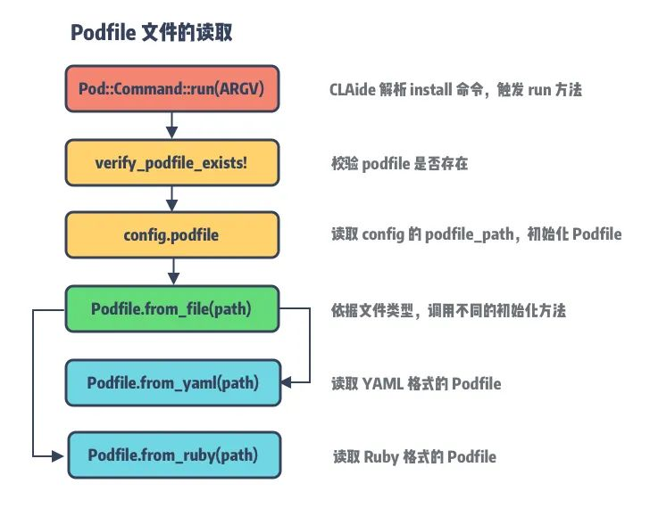

#### Podfile From Ruby 解析

当我们通过 `pod init` 来初始化 CocoaPods 项目时，默认生成的 Podfile 名称就是 `Podfile`，那就从`Podfile.from_ruby` 开始。


```ruby
def self.from_ruby(path, contents = nil)
    # ①
    contents ||= File.open(path, 'r:utf-8', &:read)
    # 兼容 1.9 版本的 Rubinius 中的编码问题
    if contents.respond_to?(:encoding) && contents.encoding.name != 'UTF-8'
        contents.encode!('UTF-8')
    end
    # 对 Podfile 中不规范的单引号或双引号进行检查，并进行自动修正，及抛出错误
    if contents.tr!('“”‘’‛', %(""'''))
        CoreUI.warn "..."
    end
    # ②
    podfile = Podfile.new(path) do
        begin
         eval(contents, nil, path.to_s)
        rescue Exception => e
         message = "Invalid `#{path.basename}` file: #{e.message}"
         raise DSLError.new(message, path, e, contents)
        end
    end
    podfile
end
```

**①** 是对 Podfile 内容的读取和编码，同时对可能出现的单引号和双引号的匹配问题进行了修正。**②** 以 `path` 和 `block` 为入参行 `podfile` 类的初始化并将其放回，保存在全局的 `config.podfile` 中。

> Tips: 如果要在 Ruby 对象的初始化中传入参数，需要重载 Object 的 initialize[8] 方法，这里的Podfile.new(...) 本质上是 `initialize` 的方法调用。

`initialize` 方法所传入的尾随闭包 `block` 的核心在于内部的 `eval` 函数（在 CocoaPods 核心组件[9] 中有提到）：


```ruby
    eval(contents, nil, path.to_s)
```

它将 Podfile 中的文本内容转化为方法执行，也就是说里面的参数是一段 Ruby 的代码字符串，通过 `eval` 方法可以直接执行。继续看
Podfile 的 `initialize` 方法：


```ruby
def initialize(defined_in_file = nil, internal_hash = {}, &block)
    self.defined_in_file = defined_in_file
    @internal_hash = internal_hash
    if block
        default_target_def = TargetDefinition.new('Pods', self)
        default_target_def.abstract = true
        @root_target_definitions = [default_target_def]
        @current_target_definition = default_target_def
        instance_eval(&block)
    else
        @root_target_definitions = []
    end
end
```

它定义了三个参数：

<table><thead><tr style="border-width: 1px 0px 0px;border-right-style: initial;border-bottom-style: initial;border-left-style: initial;border-right-color: initial;border-bottom-color: initial;border-left-color: initial;border-top-style: solid;border-top-color: rgb(204, 204, 204);background-color: white;"><th style="border-top-width: 1px;border-color: rgb(204, 204, 204);text-align: left;background-color: rgb(240, 240, 240);min-width: 85px;">参数</th><th style="border-top-width: 1px;border-color: rgb(204, 204, 204);text-align: left;background-color: rgb(240, 240, 240);min-width: 85px;">定义</th></tr></thead><tbody style="border-width: 0px;border-style: initial;border-color: initial;"><tr style="border-width: 1px 0px 0px;border-right-style: initial;border-bottom-style: initial;border-left-style: initial;border-right-color: initial;border-bottom-color: initial;border-left-color: initial;border-top-style: solid;border-top-color: rgb(204, 204, 204);background-color: white;"><td style="border-color: rgb(204, 204, 204);min-width: 85px;"><code>defined_in_file</code></td><td style="border-color: rgb(204, 204, 204);min-width: 85px;"><code>Podfile</code> 文件路径</td></tr><tr style="border-width: 1px 0px 0px;border-right-style: initial;border-bottom-style: initial;border-left-style: initial;border-right-color: initial;border-bottom-color: initial;border-left-color: initial;border-top-style: solid;border-top-color: rgb(204, 204, 204);background-color: rgb(248, 248, 248);"><td style="border-color: rgb(204, 204, 204);min-width: 85px;"><code>internal_hash</code></td><td style="border-color: rgb(204, 204, 204);min-width: 85px;">通过 yaml 序列化得到的 <code>Podfile</code> 配置信息，保存在 <code>internal_hash</code> 中</td></tr><tr style="border-width: 1px 0px 0px;border-right-style: initial;border-bottom-style: initial;border-left-style: initial;border-right-color: initial;border-bottom-color: initial;border-left-color: initial;border-top-style: solid;border-top-color: rgb(204, 204, 204);background-color: white;"><td style="border-color: rgb(204, 204, 204);min-width: 85px;"><code>block</code></td><td style="border-color: rgb(204, 204, 204);min-width: 85px;">用于映射 <code>Podfile</code> 的 DSL 配置</td></tr></tbody></table>

> 需要注意的是，通过 `from_ruby` 初始化的 `Podfile` 只传入了参数 1 和 3，参数 2 `internal_hash` 则是提供给`from_yaml` 的。

当 `block` 存在，会初始化名为 `Pods` 的 TargetDefinition 对象，用于保存 `Pods project` 的相关信息和Pod 依赖。然后调用 _instance_eval[10]_ 执行传入的 `block`，将 Podfile 的 DSL 内容转换成对应的方法和参数，最终将参数存入 `internal_hash` 和对应的 `target_definitions` 中。

> Tips: 在 Ruby 中存在两种不同的方式来执行代码块 `block`，分别是 `instance_eval` 和 `class_eval`。`class_eval` 的执行上下文与调用类相关，调用者是类名或者模块名，而 `instance_eval`的调用者可以是类的实例或者类本身。细节看 StackOverFlow[11]。

#### Podfile From YAML 解析

YAML 格式的 Podfile 加载需要借助 **YAMLHelper** 类来完成，YAMLHelper 则是基于 yaml[12] 的简单封装。


```ruby
def self.from_yaml(path)
    string = File.open(path, 'r:utf-8', &:read)
  
    # 为了解决 Rubinius incomplete encoding in 1.9 mode
   # https://github.com/rubinius/rubinius/issues/1539
    if string.respond_to?(:encoding) && string.encoding.name != 'UTF-8'
        string.encode!('UTF-8')
    end
    hash = YAMLHelper.load_string(string)
    from_hash(hash, path)
end

def self.from_hash(hash, path = nil)
    internal_hash = hash.dup
    target_definitions = internal_hash.delete('target_definitions') || []
    podfile = Podfile.new(path, internal_hash)
    target_definitions.each do |definition_hash|
        definition = TargetDefinition.from_hash(definition_hash, podfile)
        podfile.root_target_definitions << definition
    end
    podfile
end
```

通过 `from_yaml` 将文件内容转成 Ruby hash 后转入 `from_hash` 方法。

区别于 `from_ruby`，这里调用的 `initialize` 将读取的 hash 直接存入 `internal_hash`，然后利用`TargetDefinition.from_hash` 来完成的 hash 内容到 targets 的转换，因此，这里无需传入 block 进行 DSL解析和方法转换。

### Podfile 内容解析

前面提到 Podfile 的内容最终保存在 `internal_hash` 和 `target_definitions` 中，本质上都是使用了 `hash`来保存数据。由于 YAML 文件格式的 Podfile 加载后就是 hash 对象，无需过多加工。唯一需要处理的是递归调用 TargetDefinition 的 `from_hash` 方法来解析 target 子节点的数据。

因此，接下来的内容解析主要针对 Ruby 文件格式的 DSL 解析，我们以 `pod` 方法为例：


```ruby
target 'Example' do
 pod 'Alamofire'
end
```

当解析到 `pod 'Alamofire'` 时，会先通过 `eval(contents, nil, path.to_s` 将其转换为 `dsl.rb`
中的方法：


```ruby
def pod(name = nil, *requirements)
    unless name
        raise StandardError, 'A dependency requires a name.'
    end
    current_target_definition.store_pod(name, *requirements)
end
```

name 为 Alamofire，由于我们没有指定对应的 Alamofire 版本，默认会使用最新版本。`requirements`  是控制 该 pod
来源获取或者 pod target 的编译选项等，例如：


```ruby
pod 'Alamofire', '0.9'
pod 'Alamofire', :modular_headers => true
pod 'Alamofire', :configurations => ['Debug', 'Beta']
pod 'Alamofire', :source => 'https://github.com/CocoaPods/Specs.git'
pod 'Alamofire', :subspecs => ['Attribute', 'QuerySet']
pod 'Alamofire', :testspecs => ['UnitTests', 'SomeOtherTests']
pod 'Alamofire', :path => '~/Documents/AFNetworking'
pod 'Alamofire', :podspec => 'https://example.com/Alamofire.podspec'
pod 'Alamofire', :git => 'https://github.com/looseyi/Alamofire.git', :tag => '0.7.0'
```

> Tips：requirements 最终是以 Gem::Requirement 对象来保存的。关于 pod 详细说明请移步：Podfile手册[13]。

对 name 进行校验后，直接转入 `current_target_definition` 毕竟 Pod 库都是存在 `Pods.project` 之下：


```ruby
def store_pod(name, *requirements)
  return if parse_subspecs(name, requirements) # This parse method must be called first
  parse_inhibit_warnings(name, requirements)
  parse_modular_headers(name, requirements)
  parse_configuration_whitelist(name, requirements)
  parse_project_name(name, requirements)
  if requirements && !requirements.empty?
    pod = { name => requirements }
  else
    pod = name
  end
  get_hash_value('dependencies', []) << pod
  nil
end

def get_hash_value(key, base_value = nil)
  unless HASH_KEYS.include?(key)
    raise StandardError, "Unsupported hash key `#{key}`"
  end
  internal_hash[key] = base_value if internal_hash[key].nil?
  internal_hash[key]
end

def set_hash_value(key, value)
  unless HASH_KEYS.include?(key)
    raise StandardError, "Unsupported hash key `#{key}`"
  end
  internal_hash[key] = value
end
```

经过一系列检查之后，调用 `get_hash_value` 获取 `internal_hash` 的 `dependencies`，并将 name 和`requirements` 选项存入。

这里的 `dependencies` key 是定义在 TargetDefinition 文件的 `HASH_KEYS`，表示 Core 所支持的配置参数:


```ruby
## freeze 表示该数组不可修改。另外，%w 用于表示其中元素被单引号括起的数组。 
# %W(#{foo} Bar Bar\ with\ space) => ["Foo", "Bar", "Bar with space"] 
# 对应的还有 %W 表示其中元素被双引号括起的数组。
HASH_KEYS = %w(
    name
    platform
    podspecs
    exclusive
    link_with
    link_with_first_target
    inhibit_warnings
    use_modular_headers
    user_project_path
    build_configurations
    project_names
    dependencies
    script_phases
    children
    configuration_pod_whitelist
    uses_frameworks
    swift_version_requirements
    inheritance
    abstract
    swift_version
).freeze
```

整个映射过程如下：

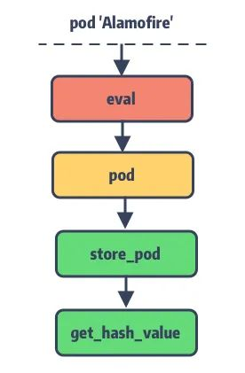

## 精细化的 Podfile 配置

最后一节让我们来 Show 一下 ，看看 `Podfile` 所谓的 `targets` 之间的依赖关系可以玩出什么花来 ???? 。

### Target 嵌套

**最简单的 `Podfile` 就是文章开头所展示的，不过在 `Podfile` 中还可以对 Target 进行嵌套使用。**

假设在我们的主工程同时维护了三个项目，它们都依赖了 Alamofire，通过俄罗斯套娃就能轻松满足条件：


```ruby
target 'Demo1' do
  pod 'Alamofire'
  target 'Demo2' do
    target 'Demo3' do
    end
  end
end
```

编译后的 `Pods.project` 项目结构如下：

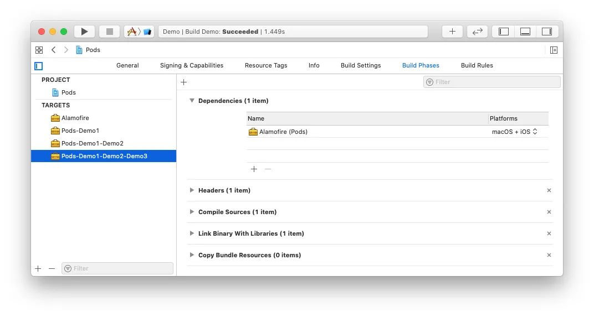

我们知道，CocoaPods 在 `Pods.project` 中为每个在 Podfile 中声明的 Target 生成一个与之对应的专属 Target 来集成它的 Pod 依赖。

对于有依赖关系的 Target 其生成的专属 Target 名称则会按照依赖关系叠加来命名，如  `target Demo3` 的专属 Target 名称为**Pods-Demo1-Demo2-Demo3**。安装完成后主项目将会引入该专属 Target 来完成依赖关联，如 Demo3：

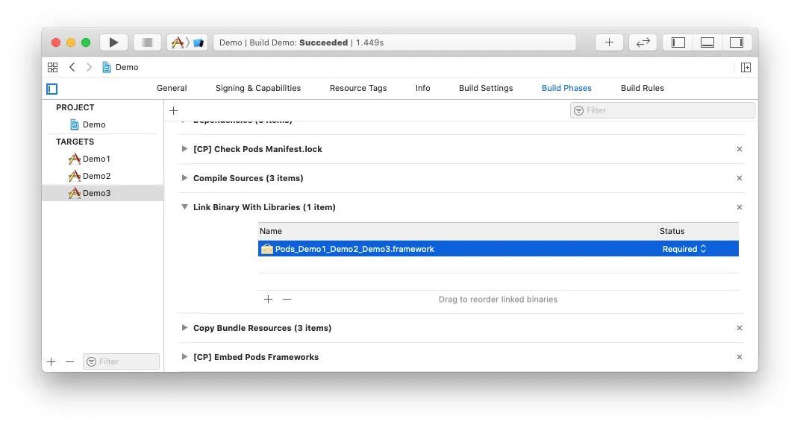

关于 Target 嵌套，一个父节点是可以有多个子节点的：


```ruby
target 'Demo1' do
  pod 'Alamofire'
  target 'Demo2' do
    pod 'RxSwift'
  end
  target 'Demo3' do
   pod 'SwiftyJSON'
  end
end
```

### Abstract Target

上面例子中，由于 Demo1 与 Demo2 都需要依赖 Alamofire，我们通过 Target 嵌套让 Demo2 来继承 Demo1 的 Pods 库依赖。

这么做可能会有一个限制，就是当 Demo1 的 Pod 依赖并非全部为 Demo2 所需要的时候，就会有依赖冗余。此时就需要 `Abstract Target` 登场了。例如：


```ruby 
abstract_target 'Networking' do
  pod 'Alamofire'
  target 'Demo1' do
    pod 'RxSwift'
  end
  target 'Demo2' do
    pod 'ReactCocoa'
  end
  target 'Demo3' do
  end
end
```

将网络请求的 Pod 依赖抽象到 `Networking` target 中，这样就能避免 Demo2 对 RxSwift 的依赖。

这种方式配置所生成的 `Pods.project` 并不会存在名称为 `Networking` 的 Target，它仅会在主工程的专属 Target 中留下印记：

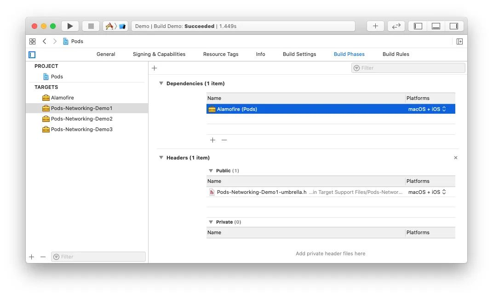

## 总结

本文结合 Xcode 工程结构来展开 CocoaPods-Core 的 Podfile 之旅，主要感受如下：

  1. 再一次感受了 Ruby 语言的动态之美，给我一个字符串，还你一个未知世界；
  2. 结合 Xcode 工程结构更好的理解了 Podfile 的设计初衷，**基础知识很重要；**
  3. 所谓“算法无用论”这种事情，在计算机的世界是不存在的，没有好的数据结构知识如何更好的抽象；
  4. 了解 Podfile 的 DSL 是如何映射到内存中，又是如何来存储每个关键数据的

## 知识点问题梳理

这里罗列了四个问题用来考察你是否已经掌握了这篇文章，如果没有建议你加入 **收藏** 再次阅读：

  1. 说说 `TargetDefinition` 的数据结构 ？
  2. 说说 `TargetDefinition` 与 Xcode Project 的关系 ？
  3. `Podfile` 的文件格式有几种，分别是如何加载 ？
  4. `Lockfile` 和 `Podfile` 的关系

#### 参考资料

[1]CocoaPods 命令解析: _https://zhuanlan.zhihu.com/p/212101448_
[2]`Podspec`: _https://guides.cocoapods.org/syntax/podspec.html_
[3]Build Phases: _https://www.objc.io/issues/6-build-tools/build-process/#controlling-the-build-process_
[4]Build Settings:_https://developer.apple.com/library/archive/featuredarticles/XcodeConcepts/Concept-Build_Settings.html#//apple_ref/doc/uid/TP40009328-CH6-SW1_
[5]Build Configurations: _https://medium.com/practical-ios-development/some-practical-uses-for-xcode-build-schemes-and-build-configurations-swift-e50d15a1304f_
[6]Multiple Xcodeproj Generation:_http://blog.cocoapods.org/CocoaPods-1.7.0-beta/_
[7]官方定义: _https://yaml.org/_
[8]initialize: _https://ruby-doc.org/docs/ruby-doc-bundle/UsersGuide/rg/objinitialization.html_
[9]CocoaPods 核心组件: _https://zhuanlan.zhihu.com/p/187272448_
[10]instance_eval: _https://ruby-doc.org/core-2.7.0/BasicObject.html_
[11]StackOverFlow: _https://stackoverflow.com/questions/900419/how-to-understand-the-difference-between-class-eval-and-instance-eval_
[12]yaml: _https://github.com/ruby/yaml_
[13]Podfile 手册: _https://guides.cocoapods.org/syntax/podfile.html#pod_

<hr>

#### <p>原文出处：<a href='https://mp.weixin.qq.com/s?__biz=MzA5MTM1NTc2Ng==&mid=2458324222&idx=1&sn=76945077aecf97bb56f0da48e1311068&chksm=870e03e7b0798af15e72d46ba90e2ec7f8f748f3e87e875afcc50766724a96e3111298fb5375&scene=178&cur_album_id=1477103239887142918#rd' target='blank'>Ex2. Ruby 黑魔法 - eval 和 alias</a></p>


CocoaPods 是使用 Ruby 这门脚本语言实现的工具。Ruby 有很多优质的特性被 CocoaPods所利用，为了在后续的源码阅读中不会被这些用法阻塞，所以在这个系列中，会给出一些 CocoaPods 的番外篇，来介绍 Ruby 及其当中的一些语言思想。

今天这一篇我们来聊聊 Ruby 中的一些十分“动态”的特性：**eval 特性和 alias 特性**。

## 说说 Eval 特性

### 源自 Lisp 的 Evaluation

在一些语言中，`eval` 方法是**将一个字符串当作表达式执行而返回一个结果的方法**；在另外一些中，`eval`它所传入的不一定是字符串，还有可能是抽象句法形式，Lisp 就是这种语言，并且 Lisp 也是首先提出使用 `eval` 方法的语言，并提出了
Evaluation 这个特性。**这也使得 Lisp 这门语言可以实现脱离编译这套体系而动态执行的结果**。


Lisp 中的 `eval` 方法预期是：**将表达式作为参数传入到 `eval` 方法，并声明给定形式的返回值，运行时动态计算**。  

下面是一个 Lisp Evaluation 代码的例子（ Scheme[1] 方言 RRS 及以后版本）：


```ruby
; 将 f1 设置为表达式 (+ 1 2 3)
(define f1 '(+ 1 2 3))
 
; 执行 f1 (+ 1 2 3) 这个表达式，并返回 6
(eval f1 user-initial-environment)
```

可能你会觉得：**这只是一个简单的特性，为什么会称作黑魔法特性？**

因为 Evaluation 这种可 eval 特性是很多思想、落地工具的基础。为什么这么说，下面来说几个很常见的场景。

### REPL 的核心思想

如果你是 iOSer，你一定还会记得当年 Swift 刚刚诞生的时候，有一个主打的功能就是 **REPL 交互式开发环境**。

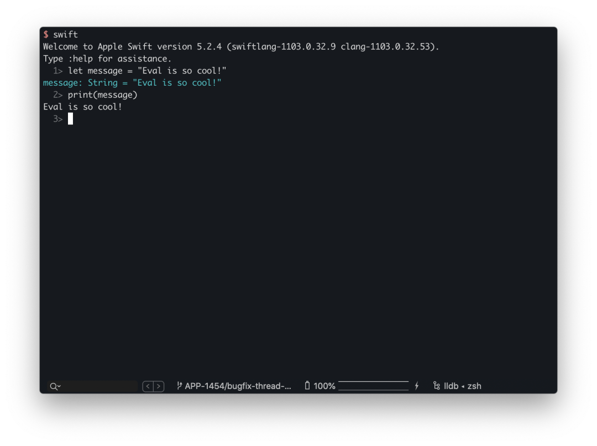

当然，作为动态性十分强大的 Lisp 和 Ruby 也有对应的 REPL 工具。例如 Ruby 的 irb 和 pry 都是十分强大的REPL。为什么这里要提及 REPL 呢？**因为在这个名字中，E 就是 eval 的意思。**  

REPL 对应的英文是 **Read-Eval-Print Loop**。

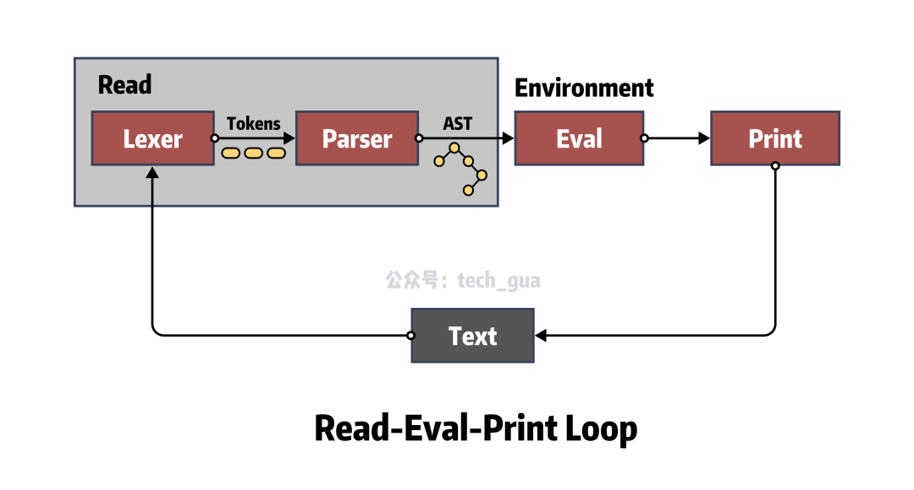

  * Read 读入一个来自于用户的表达式，将其放入内存；
  * Eval 求值函数，负责处理内部的数据结构并对上下文逻辑求值；
  * Print 输出方法，将结果呈现给用户，完成交互。

REPL 的模型让大家对于语言的学习和调试也有着增速作用，因为“Read - Eval - Print” 这种循环要比 “Code - Compile - Run - Debug” 这种循环更加敏捷。

在 Lisp 的思想中，为了实现一个 Lisp REPL，只需要实现这三个函数和一个轮循的函数即可。当然这里我们忽略掉复杂的求值函数，因为它就是一个解释器。

有了这个思想，一个最简单的 REPL 就可以使用如下的形式表达：


```ruby
# Lisp 中
(loop (print (eval (read))))
# Ruby 中
while [case]
  print(eval(read))
end
```

### 简单聊聊 HotPatch

大约在 2 年前，iOS 比较流行使用 JSPatch/RN 基于 JavaScriptCore 提供的 iOS 热修复和动态化方案。其核心的思路基本都是下发 JavaScript 脚本来调用 Objective-C，从而实现逻辑注入。

JSPatch 尤其被大家所知，需要编写大量的 JavaScript 代码来调用 Objective-C 方法，当然官方也看到了这一效率的洼地，并制作了JSPatch 的语法转化器来间接优化这一过程。

但是无论如何优化，其实最大的根本问题是 Objective-C 这门语言不具备 Evaluation 的可 eval 特性，倘若拥有该特性，那其实就可以跨越使用 JavaScript 做桥接的诸多问题。

我们都知道 Objective-C 的 Runtime 利用消息转发可以动态执行任何 Objective-C 方法，这也就给了我们一个启示。假如我们**自制一个轻量级解释器，动态解释 Objective-C 代码，利用 Runtime 消息转发来动态执行Objective-C 方法，就可以实现一个“准 eval 方法”**。

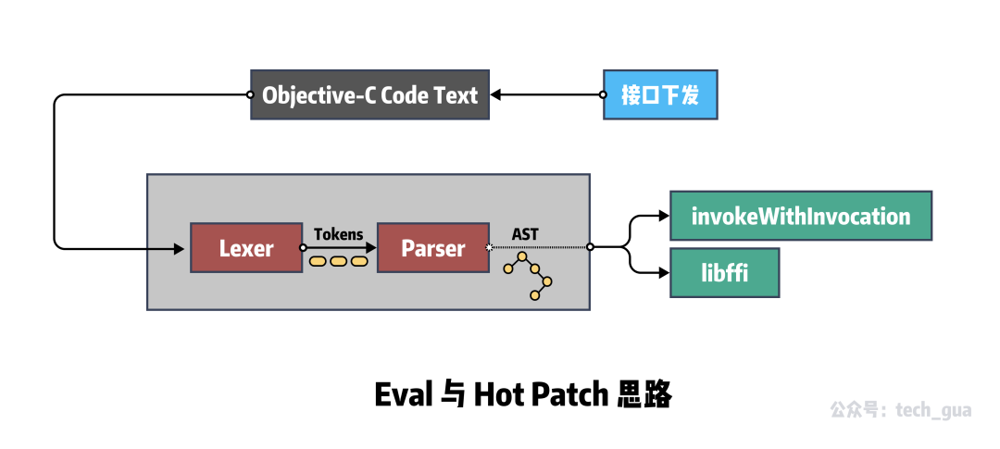

这种思路在 GitHub 上也已经有朋友开源出了 Demo - OCEval[2]。不同于 Clang 的编译过程，他进行了精简：  

  1. 去除了 Preprocesser 的预编译环节，保留了 Lexer 词法分析和 Parser 语法分析，
  2. 利用 `NSMethodSignature` 封装方法，结合递归下降，使用 Runtime 对方法进行消息转发。

利用这种思路的还有另外一个 OCRunner[3] 项目。

这些都是通过自制解释器，实现 eval 特性，进而配合 libffi 来实现。

### Ruby 中的 `eval` 和 `binding`

**Ruby 中的 eval 方法其实很好理解，就是将 Ruby 代码以字符串的形式作为参数传入，然后进行执行。**
    

```ruby
str = 'Hello'
puts eval("str + ' CocoaPods'") # Hello CocoaPods
```

上面就是一个例子，我们发现传入的代码 `str + ' CocoaPods'`  在 `eval` 方法中已经变成 Ruby 代码执行，并返回结果`'Hello CocoaPods'`  字符串。

在[「Podfile 的解析逻辑」](http://mp.weixin.qq.com/s?__biz=MzA5MTM1NTc2Ng%3D%3D&chksm=870e03feb0798ae84ab4b5dab26dfbe8ebbac0bca8491493fa4919f6069bfef58cd04df5ab34&idx=1&mid=2458324199&scene=21&sn=3886bbbcef3640bf97e16fcec34b451f#wechat_redirect)中讲到， CocoaPods 中也使用了 `eval` 方法，从而以 Ruby 脚本的形式，执行了 `Podfile` 文件中的逻辑。


```ruby
def self.from_ruby(path, contents = nil)
  # ... 
  podfile = Podfile.new(path) do
    begin
      # 执行 Podfile 中的逻辑
      eval(contents, nil, path.to_s)
    rescue Exception => e
      message = "Invalid `#{path.basename}` file: #{e.message}"
      raise DSLError.new(message, path, e, contents)
    end
  end
  podfile
end
```

当然，在 CocoaPods 中仅仅是用了 `eval` 方法的第一层，对于我们学习者来说肯定不能满足于此。

在 Ruby 中， `Kernel` 有一个方法 `binding` ，它会返回一个 Binding 类型的对象。这个 Binding 对象就是我们俗称的**绑定**，它封装了当前执行上下文的所有绑定，包括变量、方法、Block 和 `self` 的名称绑定等，这些绑定直接决定了面向对象语言中的执行环境。

那么这个 Binding 对象在 `eval` 方法中怎么使用呢？其实就是 `eval` 方法的第二个参数。这个在 CocoaPods 中运行Podfile 代码中并没有使用到。我们下面来做一个例子：


```ruby
def foo 
  name = 'Gua'
  binding
end
eval('p name', foo) # Gua
```

在这个例子中，我们的 `foo` 方法就是我们上面说的执行环境，在这个环境里定义了 `name` 这个变量，并在方法体最后返回 `binding`方法调用结果。在下面使用 `eval` 方法的时候，当做 `Kernel#binding` 入参传入，便可以成功输出 `name` 变量。

### `TOPLEVEL_BINDING` 全局常量

在 Ruby 中 `main` 对象是最顶级范围，Ruby 中的任何对象都至少需要在次作用域范围内被实例化。为了随时随地地访问 `main`对象的上下文，Ruby 提供了一个名为 `TOPLEVEL_BINDING` 的全局常量，**它指向一个封装了顶级绑定的对象**。便于理解，举个例子：


```ruby
@a = "Hello"
class Addition
  def add
    TOPLEVEL_BINDING.eval("@a += ' Gua'")
  end
end
Addition.new.add
p TOPLEVEL_BINDING.receiver # main
p @a # Hello Gua
```

这段代码中，`Binding#receiver` 方法返回 `Kernel#binding` 消息的接收者。为此，则保存了调用执行上下文 - 在我们的示例中，是 `main` 对象。

然后我们在 Addition 类的实例中使用 `TOPLEVEL_BINDING` 全局常量访问全局的 `@a` 变量。

### 总说 Ruby Eval 特性

以上的简单介绍如果你曾经阅读过 SICP（Structture and Interpretation of Computer Programs）这一神书的第四章后，一定会有更加深刻的理解。

**我们将所有的语句当作求值，用语言去描述过程，用与被求值的语言相同的语言写出的求值器被称作元循环；eval 在元循环中，参数是一个表达式和一个环境，这也与 Ruby 的 `eval` 方法完全吻合。**

不得不说，Ruby 的很多思想，站在 SICP 的肩膀上。


## 类似于 Method Swizzling 的 `alias`  

对于广大 iOSer 一定都十分了解被称作 Runtime 黑魔法的 Method Swizzling。这其实是动态语言大都具有的特性。

在 iOS 中，使用 Selector 和 Implementation（即 IMP）的指向交换，从而实现了方法的替换。这种替换是发生在运行时的。

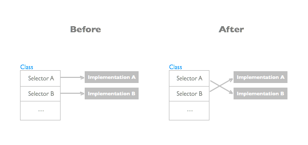

在 Ruby 中，也有类似的方法。为了全面的了解 Ruby 中的 “Method Swizzling”，我们需要了解这几个关于元编程思想的概念：**Open Class 特性**与**环绕别名**。这两个特性也是实现 CocoaPods 插件化的核心依赖。  

### Open Class 与特异方法

Open Class 特性就是在一个类已经完成定义之后，再次向其中添加方法。在 Ruby 中的实现方法就是**定义同名类**。

在 Ruby 中不会像 Objective-C 和 Swift 一样被认为是编译错误，后者需要使用 Category 和 Extension 特殊的关键字语法来约定是扩展。**而是把同名类中的定义方法全部附加到已定义的旧类中，不重名的增加，重名的覆盖**。以下为示例代码：


```ruby
    class Foo
      def m1
        puts "m1"
      end
    end

    class Foo
      def m2 
        puts "m2"
      end
    end

    Foo.new.m1 # m1
    Foo.new.m2 # m2

    class Foo
      def m1
        puts "m1 new"
      end
    end

    Foo.new.m1 # m1 new
    Foo.new.m2 # m2
```

**特异方法**和 Open Class 有点类似，不过**附加的方法不是附加到类中，而是附加到特定到实例中**。被附加到方法仅仅在目标实例中存在，不会影响该类到其他实例。示例代码：
    

```ruby
class Foo
  def m1
    puts "m1"
  end
end

foo1 = Foo.new

def foo1.m2()
  puts "m2"
end

foo1.m1 # m1
foo1.m2 # m2
foo2 = Foo.new
foo2.m1 # m1
# foo2.m2 undefined method `m2' for #<Foo:0x00007f88bb08e238> (NoMethodError)
```

### 环绕别名（Around Aliases）

其实环绕别名只是一种特殊的写法，这里使用了 Ruby 的 `alias` 关键字以及上文提到的 Open Class 的特性。

首先先介绍一下 Ruby 的 `alias` 关键字，其实很简单，**就是给一个方法起一个别名**。但是 `alias` 配合上之前的 Open Class特性，就可以达到我们所说的 Method Swizzling 效果。


```ruby
class Foo
  def m1
    puts "m1"
  end
end

foo = Foo.new
foo.m1 # m1

class Foo
  alias :origin_m1 :m1
  def m1
    origin_m1
    puts "Hook it!"
  end
end

foo.m1 
# m1
# Hook it!
```

虽然在第一个位置已经定义了 `Foo#m1`  方法，但是由于 Open Class 的重写机制以及 `alias` 的别名设置，我们将 `m1`已经修改成了新的方法，旧的 `m1` 方法使用 `origin_m1` 也可以调用到。如此也就完成了类似于 Objective-C 中的 Method Swizzling 机制。

总结一下环绕别名，其实就是**给方法定义一个别名，然后重新定义这个方法，在新的方法中使用别名调用老方法**。

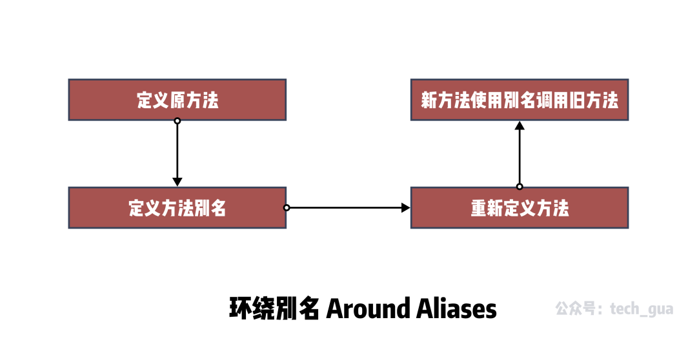

### 猴子补丁（Monkey Patch）  

既然说到了 `alias` 别名，那么就顺便说一下**猴子补丁**这个特性。猴子补丁**区别于环绕别名的方式，它主要目的是在运行时动态替换并可以暂时性避免程序崩溃**。

先聊聊背景，由于 Open Class 和环绕别名这两个特性，Ruby 在运行时改变属性已经十分容易了。但是如果我们现在有一个需求，就是 **需要动态的进行Patch ** ，而不是只要 `alias` 就全局替换，这要怎么做呢？

这里我们引入 Ruby 中的另外两个关键字 `refine` 和 `using` ，通过它们我们可以动态实现 Patch。举个例子：


```ruby
class Foo
  def m1
    puts "m1"
  end
end

foo = Foo.new
foo.m1 # m1

"""
定义一个 Patch
"""
module TemproaryPatch
  refine Foo do 
    def m1 
      puts "m1 bugfix"
    end
  end
end

using TemproaryPatch
foo2 = Foo.new
foo2.m1 # m1 bugfix
```

上面代码中，我们先使用了 `refine` 方法重新定义了 `m1` 方法，定义完之后它并不会立即生效，而是在我们使用 `using TemporaryPatch` 时，才会生效。这样也就实现了动态 Patch 的需求。

### 总说 alias 特性

Ruby 的 `alias` 使用实在是太灵活了，这也导致了 Ruby 很容易地实现插件化能力。因为所有的方法都可以通过环绕别名的方式进行 Hook，从而实现自己的 Gem 插件。

除了以上介绍的一些扩展方式，其实 Ruby 还有更多修改方案。例如 `alias_method` 、 `extend` 、 `refinement`等。如果后面 CocoaPods 有所涉及，我们也会跟进介绍一些。

## 总结

本文通过 CocoaPods 中的两个使用到的特性 Eval 和 Alias，讲述了很多 Ruby 当中有意思的语法特性和元编程思想。Ruby在众多的语言中，因为注重思想和语法优雅脱颖而出，也让我个人对语言有很大的思想提升。

如果你有经历，我也强烈推荐你阅读 SICP 和「Ruby元编程」这两本书，相信它们也会让你在语言设计的理解上，有着更深的认识。从共性提炼到方法论，从语言升华到经验。

## 知识点问题梳理

这里罗列了四个问题用来考察你是否已经掌握了这篇文章，你可以在评论区及时回答问题与作者交流。如果没有建议你加入**收藏**再次阅读：

  1. REPL 的核心思想是什么？与 Evaluation 特性有什么关系？
  2. Ruby 中 `eval` 方法作用是什么？Binding 对象用来干什么？
  3. Ruby 是否可以实现 Method Swizzling 这种功能？
  4. Open Class 是什么？环绕别名如何利用？

#### 参考资料

[1]Scheme: _https://zh.wikipedia.org/wiki/Scheme_
[2]OCEval: _https://github.com/lilidan/OCEval_
[3]OCRunner: _https://github.com/SilverFruity/OCRunner_
