<!--BEGIN_DATA
{
    "create_date": "2020-11-11 17:58", 
    "modify_date": "2020-11-11 17:58", 
    "is_top": "0", 
    "summary": "5.Podspec文件分析<br/>6.PodSpec管理策略", 
    "tags": "iOS、工具", 
    "file_name": "CocoaPods历险记03.md"
}
END_DATA-->

#### <p>原文出处：<a href='https://mp.weixin.qq.com/s?__biz=MzA5MTM1NTc2Ng==&mid=2458324238&idx=1&sn=2f358378eac71b471765a4ddc9ff9785&chksm=870e0217b0798b0156361f407f76f7b4c3a2e1b4c0a56f71cc6e01b56323b17bd5bb8df02f9d&scene=178&cur_album_id=1477103239887142918#rd' target='blank'>5. Podspec 文件分析</a></p>


> CocoaPods 历险记 这个专题是 Edmond 和 冬瓜 共同撰写，对于 iOS / macOS 工程中版本管理工具 CocoaPods 的实现细节、原理、源码、实践与经验的分享记录，旨在帮助大家能够更加了解这个依赖管理工具，而不仅局限于 `pod install` 和 `pod update`。

## 本文知识目录

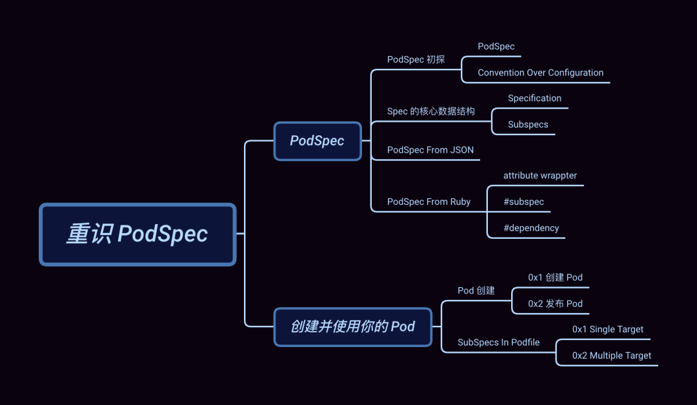

## 引子  

在上文 [Podfile 解析逻辑 ](http://mp.weixin.qq.com/s?__biz=MzA5MTM1NTc2Ng%3D%3D&chksm=870e03feb0798ae84ab4b5dab26dfbe8ebbac0bca8491493fa4919f6069bfef58cd04df5ab34&idx=1&mid=2458324199&scene=21&sn=3886bbbcef3640bf97e16fcec34b451f#wechat_redirect) 中（**建议先阅读这篇文章**），我们以 Xcode 工程结构作为切入点介绍了 Podfile 背后对应的数据结构，剖析了`Podfile` 文件是如何解析与加载，并最终 _"入侵"_ 项目影响其工程结构的。今天我们来聊一聊 CocoaPods-Core[2]中的另一个重要文件 --- `Podspec` 以及它所撑起的 CocoaPods 世界。

一个 `Pod` 的创建和发布离不开 `.podspec` 文件，它可以很简单也能复杂，如 QMUIKit[3]（后续介绍)。

今天我们就直奔主题，来分析 `Podspec` 文件。

## Podspec

`Podspec` 是用于 **描述一个 Pod 库的源代码和资源将如何被打包编译成链接库或 framework 的文件** ，而 `Podspec`中的这些描述内容最终将映会映射到 `Specification` 类中（以下简称 **Spec**）。


现在让我们来重新认识 `Podspec`。  

### Podspec 初探

`Podspec` 支持的文件格式为 `.podspec` 和 `.json` 两种，而 `.podspec` 本质是 Ruby 文件。

问题来了，为什么是 JSON 格式而不像 `Podfile` 一样支持 YAML 呢？

笔者的理解：由于 `Podspec` 文件会满世界跑，它可能存在于 CocoaPods 的 CDN Service[4]、Speces Repo[5]或者你们的私有 Specs Repo 上，因此采用  JSON 的文件在网络传输中会更友好。而 `Podfile`更多的场景是用于序列化，它需要在项目中生成一份经依赖仲裁后的 `Podfile` 快照，用于后续的对比。

#### Podspec


```ruby
Pod::Spec.new do |spec|
  spec.name         = 'Reachability'
  spec.version      = '3.1.0'
  spec.license      = { :type => 'BSD' }
  spec.homepage     = 'https://github.com/tonymillion/Reachability'
  spec.authors      = { 'Tony Million' => 'tonymillion@gmail.com' }
  spec.summary      = 'ARC and GCD Compatible Reachability Class for iOS and OS X.'
  spec.source       = { :git => 'https://github.com/tonymillion/Reachability.git', :tag => "v#{spec.version}" }
  spec.source_files = 'Reachability.{h,m}'
  spec.framework    = 'SystemConfiguration'
end
```

上面这份 `Reachability.podspec` 配置，基本通过命令行 `pod lib create NAME`就能帮我们完成。除此之外我们能做的更多，比如，默认情况下 CococaPods 会为每个 `Pod` framework 生成一个对应的`modulemap` 文件，它将包含 `Podspec` 中指定的公共 headers。如果需要自定义引入的 header 文件，仅需配置`moduel_map` 即可完成。

下面是进阶版配置：


```ruby
Pod::Spec.new do |spec|
  spec.name         = 'Reachability'
  # 省略与前面相同部分的配置 ...
  
  spec.module_name   = 'Rich'
  spec.swift_version = '4.0'
  spec.ios.deployment_target  = '9.0'
  spec.osx.deployment_target  = '10.10'
  spec.source_files       = 'Reachability/common/*.swift'
  spec.ios.source_files   = 'Reachability/ios/*.swift', 'Reachability/extensions/*.swift'
  spec.osx.source_files   = 'Reachability/osx/*.swift'
  spec.framework      = 'SystemConfiguration'
  spec.ios.framework  = 'UIKit'
  spec.osx.framework  = 'AppKit'
  spec.dependency 'SomeOtherPod'
end
```

像 👆 我们为不同的系统指定了不同的源码和依赖等，当然可配置的不只这些。

`Podspec` 支持的完整配置分类如下：

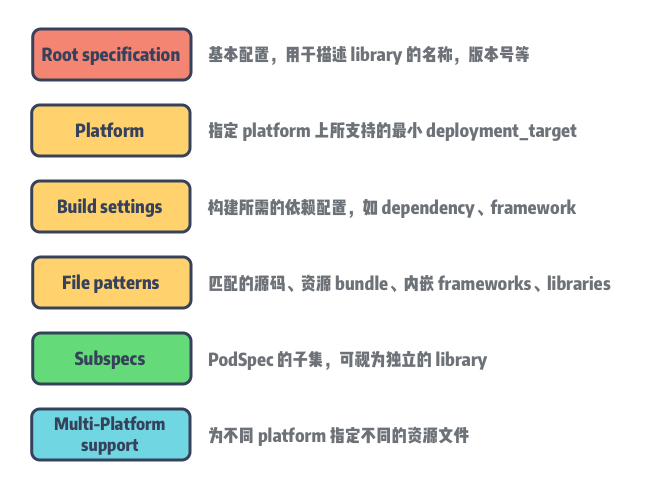

想了解更多的配置选项：传送门[6]。  

#### Convention Over Configuration

说到配置，不得不提一下 `CoC` 约定大于配置。约定大于配置算是在软件工程较早出现的概念的了，大意是：**为了简单起见，我们的代码需要按照一定的约定来编写**（如代码放在什么目录，用什么文件名，用什么类名等)。这样既简化了配置文件，同时也降低了学习成本。

约定大于配置可以说是通过 Ruby on Rails[7] 发扬光大的。尽管它一直饱受争议，但是主流语言的依赖管理工具，如 `Maven`、`npm`等都遵循 `CoC` 进行不断演进的，因为 `CoC` 能够有效帮助开发者减轻选择的痛感，减少无意义的选择。一些新的语言也吸收了这个思想，比如 Go 语言。如果用 C/C++ 可能需要定义复杂的 Makefile 来定义编译的规则，以及如何运行测试用例，而在 Go 中这些都是约定好的。

举个 🌰 ：`Podfile` 中是可以指定 pod library 所链接的 Xcode project，不过大多情况下无需配置，CocoaPods 会自动查找 `Podfile` 所在的同级目录下所对应的工程文件 `.project` 。

### Spec 的核心数据结构

#### Specification

在数据结构上 `Specification` 与 TargetDefinition[8] 是类似的，**同为多叉树结构**。简化后的 `Spec` 的类如下：


```ruby
require 'active_support/core_ext/string/strip.rb'
# 记录对应 platform 上 Spec 的其他 pod 依赖
require 'cocoapods-core/specification/consumer'
# 解析 DSL
require 'cocoapods-core/specification/dsl'
# 校验 Spec 的正确性，并抛出对应的错误和警告
require 'cocoapods-core/specification/linter'
# 用于解析 DSL 内容包含的配置信息
require 'cocoapods-core/specification/root_attribute_accessors'
# 记录一个 Pod 所有依赖的 Spec 来源信息
require 'cocoapods-core/specification/set'
# json 格式数据解析
require 'cocoapods-core/specification/json'

module Pod
  class Specification
    include Pod::Specification::DSL
    include Pod::Specification::DSL::Deprecations
    include Pod::Specification::RootAttributesAccessors
    include Pod::Specification::JSONSupport
 
    # `subspec` 的父节点
    attr_reader :parent
    # `Spec` 的唯一 id，由 name + version 的 hash 构成
    attr_reader :hash_value
    # 记录 `Spec` 的配置信息 
    attr_accessor :attributes_hash
    # `Spec` 包含的 `subspec`
    attr_accessor :subspecs
     
    # 递归调用获取 Specification 的根节点
    def root
      parent ? parent.root : self
    end
     
  def hash
    if @hash_value.nil?
       @hash_value = (name.hash * 53) ^ version.hash
  end
      @hash_value
    end
     
    # ...
  end
end
```

`Specification` 同样用 map `attributes_hash` 来记录配置信息。

注意，这里的 parent 是为 `subspec` 保留的，用于指向其父节点的 `Spec`。

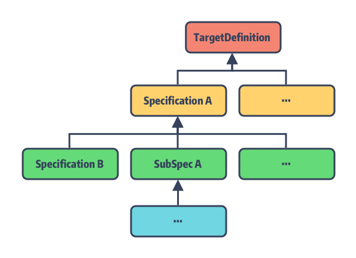

#### Subspecs  

乍一听 `Subspec` 这个概念似乎有一些抽象，不过当你理解了上面的描述，就能明白什么是 `Subspec` 了。我们知道在 Xcode 项目中，target 作为最小的可编译单元，它编译后的产物为链接库或 framework。而在 CocoaPods 的世界里这些 targets 则是由`Spec` 文件来描述的，它还能拆分成一个或者多个 `Subspec`，我们暂且把它称为 `Spec` 的 **子模块**，子模块也是用**Specification** 类来描述的。

**子模块可以单独作为依赖被引入到项目中**。它有几个特点：

  * 未指定 `default_subspec` 的情况下，`Spec` 的全部子模块都将作为依赖被引入；
  * 子模块会主动继承其父节点 `Spec` 中定义的 `attributes_hash`；
  * 子模块可以指定自己的源代码、资源文件、编译配置、依赖等；
  * 同一 `Spec` 内部的子模块是可以有依赖关系的；
  * 每个子模块在 `pod push` 的时候是需要被 lint 通过的；

光听总结似乎还是云里雾里，祭出 QMUI 让大家感受一下：


```ruby
Pod::Spec.new do |s|
  s.name             = "QMUIKit"
  s.version          = "4.2.1"
  # ...
  s.subspec 'QMUICore' do |ss|
    ss.source_files = 'QMUIKit/QMUIKit.h', 'QMUIKit/QMUICore', 'QMUIKit/UIKitExtensions'
    ss.dependency 'QMUIKit/QMUIWeakObjectContainer'
    ss.dependency 'QMUIKit/QMUILog'
  end

  s.subspec 'QMUIWeakObjectContainer' do |ss|
    ss.source_files = 'QMUIKit/QMUIComponents/QMUIWeakObjectContainer.{h,m}'
  end

  s.subspec 'QMUILog' do |ss|
    ss.source_files = 'QMUIKit/QMUIComponents/QMUILog/*.{h,m}'
  end

  s.subspec 'QMUIComponents' do |ss|
    ss.dependency 'QMUIKit/QMUICore'
     
    ss.subspec 'QMUIButton' do |sss|
      sss.source_files = 'QMUIKit/QMUIComponents/QMUIButton/QMUIButton.{h,m}'
    end
    # 此处省略 59 个 Components
  end
  # ...
end
```

> 不吹不黑，QMUI 是笔者见过国内开源作品中代码注释非常详尽且提供完整 Demo 的项目之一。

整个 QMUIKit 的 `Spec` 文件中，总共定义了 **64** 个 `subspec` 子模块，同时这些子模块之间还做了分层。比如QMUICore：

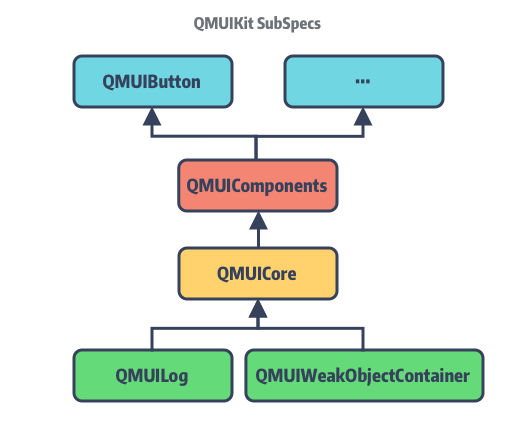

另外补充一点，CocoaPods 支持了不同类型的 `SubSpec`：  


```ruby
# lib/cocoapods-core/specification/dsl/attribute_support.rb
SUPPORTED_SPEC_TYPES = [:library, :app, :test].freeze
```

`:app` 和 `:test` 用于在项目中集成单元测试代码的 `Subspec`。

### Podspec From JSON

有了上文 `Podfile` 的了解，这次我们对 `Podspec` 的文件加载会更加轻车熟路。首先是由 `#from_file`
方法进行文件路径和内容编码格式的检查，将加载的内容转入 `#from_string`：


```ruby
def self.from_file(path, subspec_name = nil)
  path = Pathname.new(path)
  unless path.exist?
    raise Informative, "No Podspec exists at path `#{path}`."
  end
  string = File.open(path, 'r:utf-8', &:read)
  # Work around for Rubinius incomplete encoding in 1.9 mode
  if string.respond_to?(:encoding) && string.encoding.name != 'UTF-8'
    string.encode!('UTF-8')
  end
  from_string(string, path, subspec_name)
end

def self.from_string(spec_contents, path, subspec_name = nil)
  path = Pathname.new(path).expand_path
  spec = nil
  case path.extname
  when '.podspec'
    Dir.chdir(path.parent.directory? ? path.parent : Dir.pwd) do
      spec = ::Pod._eval_Podspec(spec_contents, path)
      unless spec.is_a?(Specification)
        raise Informative, "Invalid Podspec file at path `#{path}`."
      end
    end
  when '.json'
    spec = Specification.from_json(spec_contents)
  else
    raise Informative, "Unsupported specification format `#{path.extname}` for spec at `#{path}`."
  end

  spec.defined_in_file = path
  spec.subspec_by_name(subspec_name, true)
end
```

接着根据文件类型为 `.podspec` 和 `.json` 分别采用不同的解析方式。在  **JSONSupport** 模块内将`#from_json` 的逻辑拆成了两部分：


```ruby
# `lib/cocoapods-core/specification/json.rb`
module Pod
  class Specification
    module JSONSupport
    # ①
    def self.from_json(json)
      require 'json'
      hash = JSON.parse(json)
      from_hash(hash)
    end
    # ②
    def self.from_hash(hash, parent = nil, test_specification: false, app_specification: false)
      attributes_hash = hash.dup
      spec = Spec.new(parent, nil, test_specification, :app_specification => app_specification)
      subspecs = attributes_hash.delete('subspecs')
      testspecs = attributes_hash.delete('testspecs')
      appspecs = attributes_hash.delete('appspecs')
  
      ## backwards compatibility with 1.3.0
      spec.test_specification = !attributes_hash['test_type'].nil?
  
      spec.attributes_hash = attributes_hash
      spec.subspecs.concat(subspecs_from_hash(spec, subspecs, false, false))
      spec.subspecs.concat(subspecs_from_hash(spec, testspecs, true, false))
      spec.subspecs.concat(subspecs_from_hash(spec, appspecs, false, true))
  
      spec
    end
    # ③
    def self.subspecs_from_hash(spec, subspecs, test_specification, app_specification)
      return [] if subspecs.nil?
      subspecs.map do |s_hash|
        Specification.from_hash(s_hash, spec,
                                :test_specification => test_specification,
                                :app_specification => app_specification)
      end
    end
  end
end
```

这里的逻辑也是比较简单：

  * ① 将传入的字符串转换为 json；
  * ② 将转换后的 json 转换为 `Spec` 对象并将 json 转换为 `attributes_hash`，同时触发 ③；
  * ③ 通过 `self.subspecs_from_hash` 实现递归调用完成 `subspecs` 解析；

> Tips: 方法 ② 里的 **Spec** 是对 `Specification` 的别名。

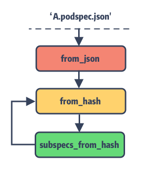

### Podspec From Ruby  

`QMUIKit.podspec` 的文件内容，大家是否注意到其开头的声明：


```ruby
Pod::Spec.new do |s|
  s.name             = "QMUIKit"
  s.source_files     = 'QMUIKit/QMUIKit.h'
  # ...
end
```

发现没 `.podspec` 文件就是**简单直接地声明了一个 `Specifiction` 对象**，然后通过 block 块定制来完成配置。像`name`、`source_files` 这些配置参数最终都会转换为方法调用并将值存入 `attributes_hash`中。这些方法调用的实现方式分两种：

  1. 大部分配置是通过方法包装器 `attribute` 和 `root_attribute` 来动态添加的 setter 方法；
  2. 对于复杂逻辑的配置则直接方法声明，如 `subspec` 、`dependency` 方法等（后续介绍)。

#### attribute wrappter


```ruby
# `lib/cocoapods-core/specification/dsl.rb`
module Pod
  class Specification
    module DSL
      extend Pod::Specification::DSL::AttributeSupport
      # Deprecations must be required after include AttributeSupport
      require 'cocoapods-core/specification/dsl/deprecations'

      attribute :name,
                :required => true,
                :inherited => false,
                :multi_platform => false

      root_attribute :version,
                      :required => true
      # ...
    end
  end
end
```

可以看出 name 和 version 的方法声明与普通的不太一样，其实 `attribute` 和 `root_attribute` 是通过 Ruby 的方法包装器来实现的，感兴趣的同学看这里 「Python装饰器 与 Ruby实现[9]」。

> Tips: Ruby 原生提供的属性访问器 --- `attr_accessor` 大家应该不陌生，就是通过包装器实现的。

这些**装饰器所声明的方法会在其模块被加载时动态生成**，来看其实现：


```ruby 
# `lib/cocoapods-core/specification/attribute_support.rb`
module Pod
  class Specification
    module DSL
      class << self
        attr_reader :attributes
      end

      module AttributeSupport
        def root_attribute(name, options = {})
          options[:root_only] = true
          options[:multi_platform] = false
          store_attribute(name, options)
        end

        def attribute(name, options = {})
          store_attribute(name, options)
        end

        def store_attribute(name, options)
          attr = Attribute.new(name, options)
          @attributes ||= {}
          @attributes[name] = attr
        end
      end
    end
  end
end
```

`attribute` 和 `root_attribute` 最终都走到了 `store_attribute` 保存在创建的 Attribute 对象内，并以配置的 Symbol 名称作为 KEY 存入 `@attributes`，用于生成最终的 attributes setter 方法。

最关键的一步，让我们回到 `specification` 文件：


```ruby
# `/lib/coocapods-core/specification`
module Pod
  class Specification
    # ...
    
    def store_attribute(name, value, platform_name = nil)
      name = name.to_s
      value = Specification.convert_keys_to_string(value) if value.is_a?(Hash)
      value = value.strip_heredoc.strip if value.respond_to?(:strip_heredoc)
      if platform_name
        platform_name = platform_name.to_s
        attributes_hash[platform_name] ||= {}
        attributes_hash[platform_name][name] = value
      else
        attributes_hash[name] = value
      end
    end

    DSL.attributes.values.each do |a|
      define_method(a.writer_name) do |value|
        store_attribute(a.name, value)
      end
      if a.writer_singular_form
        alias_method(a.writer_singular_form, a.writer_name)
      end
    end
  end
end
```

`Specification` 类被加载时，会先遍历 `DSL` module 加载后所保存的 attributes，再通过 `define_method`动态生成对应的配置方法。最终数据还是保存在 `attributes_hash` 中。

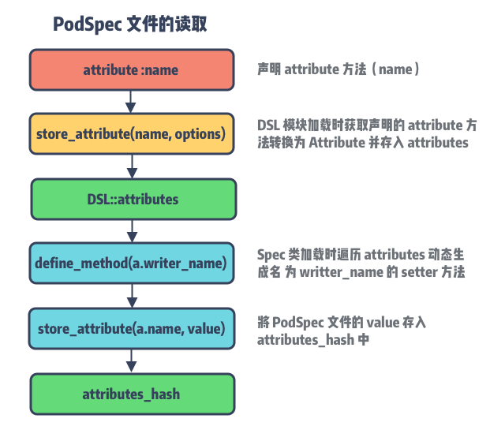

#### Attribute  

Attribute 是为了记录该配置的相关信息，例如，记录 `Spec` 是否为根节点、`Spec` 类型、所支持的 platforms、资源地址通配符等。

  1. 以 `root_attribute` 包装的配置仅用于修饰 `Spec` 根节点，比如版本号 `version` 只能由 `Spec` 根节点来设置，另外还有 `source`、`static_framework`、`module_name` 等；
  2. 以 `attribute` 包装的配置则不限是否为 `Spec` 根结点。我们以 AFNetworking 的 `source_files` 为例：由于在 macOS 和 watchOS 上并没有 UIKit framwork，因此它单独将 UIKit 的相关功能拆分到了 `AFNetworking/UIKit` 中；


```ruby
Pod::Spec.new do |s|
  # ...
  s.subspec 'NSURLSession' do |ss|
  # ...
  end
  s.subspec 'UIKit' do |ss|
    ss.ios.deployment_target = '9.0'
    ss.tvos.deployment_target = '9.0'
    ss.dependency 'AFNetworking/NSURLSession'
    ss.source_files = 'UIKit+AFNetworking'
  end
end
```

#### #subspec

除了 attribute 装饰器声明的 setter 方法，还有几个自定义的方法是直接通过 eval 调用的。


```ruby
def subspec(name, &block)
  subspec = Specification.new(self, name, &block)
  @subspecs << subspec
  subspec
end

def test_spec(name = 'Tests', &block)
  subspec = Specification.new(self, name, true, &block)
  @subspecs << subspec
  subspec
end

def app_spec(name = 'App', &block)
  appspec = Specification.new(self, name, :app_specification => true, &block)
  @subspecs << appspec
  appspec
end
```

这三种不同类型的 `Subspec` 经 `eval` 转换为对应的 `Specification` 对象，注意这里初始化后都将 parent 节点指向**self** 同时存入 `@subspecs` 数组中，完成 `SubSpec` 依赖链的构造。

#### #dependency

对于其他 `pod` 依赖的添加我们通过 dependency 方法来实现：


```ruby
def dependency(*args)
  name, *version_requirements = args
  # dependency args 有效性校验 ...
  attributes_hash['dependencies'] ||= {}
  attributes_hash['dependencies'][name] = version_requirements
  unless whitelisted_configurations.nil?
    # configuration 白名单过滤和校验 ...
    attributes_hash['configuration_pod_whitelist'] ||= {}
    attributes_hash['configuration_pod_whitelist'][name] = whitelisted_configurations
  end
end
```

dependency 方法内部主要是对依赖有效性的校验，限于篇幅这里不列出实现，核心要点如下：

  1. **检查依赖循环**，根据 `Spec` 名称判断 `Spec` 与自身，`Spec` 与`SubSpec`之间是否存在循环依赖；
  2. **检查依赖来源**，`Podspec` 中不支持 `:git` 或 `:path` 形式的来源指定，如需设定可通过 `Podfile` 来修改;
  3. **检查 configuation 白名单**，目前仅支持 Xcode 默认的 `Debug` 和 `Release` 的 configuration 配置；

## 创建并使用你的 Pod

最后一节来两个实践：创建 Pod 以及在项目中使用 `SubSpecs`。

### Pod 创建

pod 相关使用官方都提供了很详尽的都文档，本小节仅做介绍。

#### 1. 创建 Pod

仅需一行命令完成 `Pod` 创建（文档[10]）：


```ruby
$ pod lib create `NAME`
```

之后每一步都会输出友好提示，按照提示选择即可。在添加完 source code 和 dependency 之后，你还可以在 CocoaPods 为你提供的Example 项目中运行和调试代码。

准备就绪后，可以通过以下命令进行校验，检查 `Pod` 正确性：


```ruby
$ pod lib lint `[Podspec_PATHS ...]`
```

#### 2. 发布 Pod

校验通过后就可以将 `Pod` 发布了，你可以将 `PodSepc` 发布到  Master Repo 上，或者发布到内部的 Spec Repo 上。

**CocoaPods Master Repo**

如果发布的 CocoaPods 的主仓库，那么需要通过 CocoaPods 提供的 **Trunk** 命令：


```ruby
$ pod trunk push `[NAME.podspec]`
```

不过使用前需要先通过邮箱注册，详情查看文档[11]。

**Private Spec Repo**

对于发布到私有仓库的，可通过 CocoaPods 提供的 **Repo** 命令：


```ruby
$ pod repo push `REPO_NAME` `SPEC_NAME.podspec`
```

文档详情 --- 传送门[12]。

### SubSpecs In Podfile

在 `SubSpec` 一节提到过，在 CocoaPods 中 `SubSpec` 是被作为单独的依赖来看待的，这里就借这个实操来证明一下。

在上文的实践中，我们知道每一个 `Pod` 库对应为 Xcode 项目中的一个个 target，那么当明确指定部分 `SubSpec`时，它们也将被作为独立的 target 进行编译。不过这里需要明确一下使用场景：

#### 1. Single Target

当主项目中仅有一个 target 或多个 target 引用了同一个 `pod` 库的多个不同 `SubSpec` 时，生成的 target
只会有一个。我们以 QMUIKit 为例，项目 Demo.project 下的 Podfile 配置如下：


```ruby
target 'Demo' do
  pod 'QMUIKit/QMUIComponents/QMUILabel', :path => '../QMUI_iOS'
  pod 'QMUIKit/QMUIComponents/QMUIButton', :path => '../QMUI_iOS'
end
```

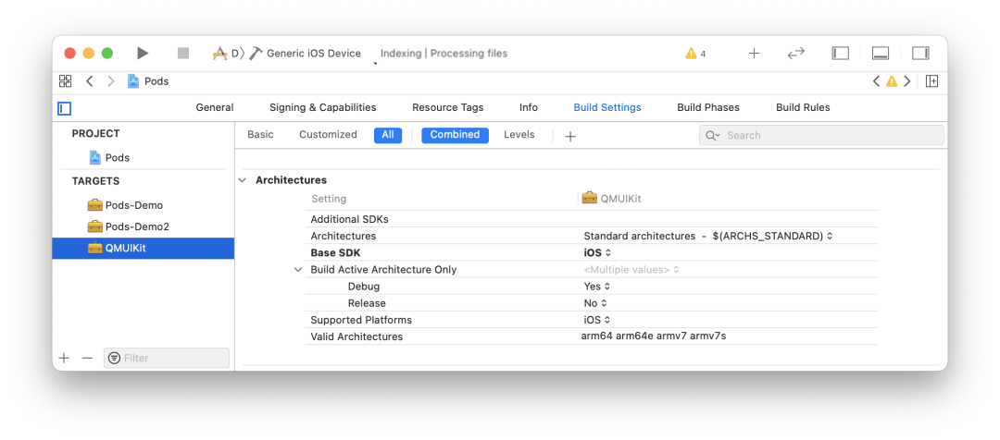

此时 `Pods.project` 下的 QMUIKit 的 target 名称为 **QMUIKit**。  

#### 2. Multiple Target

如果我们的主项目中存在多个 target 且使用同一个 `pod` 库的不同 `SubSpec` 时，结果则有所不同。

现在我们在步骤 1 的基础上添加如下配置：


```ruby
target 'Demo2' do
 pod 'QMUIKit/QMUIComponents/QMUILog', :path => '../QMUI_iOS'
end
```

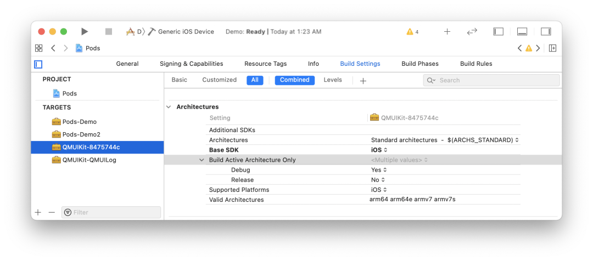

可以发现，CocoaPods 为每个 tareget 对应的 `SubSpec` 依赖生成了不同的 QMUIKit targets。  

> Tips: 当主工程 target 依赖的 `Subspec` 数量过多导致的名称超过 50 个字符，将会对 subspec 后缀做摘要处理作为唯一标识符。

## 总结

本文是 CocoaPods-Core 的第二篇，重点介绍了 `Podspec` 的类构成和解析实现，总结如下：

  1. 初探 `Podspec` 让我们对其能力边界和配置分类有了更好的了解；
  2. 深入 `Podspec` 我们发现其数据结构同 `Podfile` 类似，都是根据依赖关系建立对应的树结构；
  3. `Podspec` 针对单个库的源码和资源提供了更精细化的管理，`SubSpec` 结构的推出让大型 library 的内部分层提供了很好的工具；
  4. 装饰器模式结合 Ruby 的动态特性，让 `Podspec` 的 DSL 特性的实现起来更加优雅；

## 知识点问题梳理

这里罗列了四个问题用来考察你是否已经掌握了这篇文章，如果没有建议你加入**收藏** 再次阅读：

  1. 说说 `Podspec` 所支持的配置有几类，分别具有哪些功能 ？
  2. `Podspec` 与 `SubSpec` 之间有哪些关系 ？
  3. 说说 `SubSpec` 的特点以及作用 ？
  4. 谈谈 `Podspec` 中的 DSL 解析与 `Podfile` 的解析实现有哪些区别 ？

#### 参考资料

[1]Podfile 解析逻辑: _/2020/09/16/cocoapods-story-4.html_
[2]CocoaPods-Core:_https://link.zhihu.com/?target=https%3A//github.com/CocoaPods/Core_
[3]QMUIKit: _https://github.com/Tencent/QMUI_iOS/blob/master/QMUIKit.podspec_
[4]CDN Service: _https://cdn.cocoapods.org/_
[5]Speces Repo: _https://github.com/CocoaPods/Specs_
[6]传送门: _https://guides.cocoapods.org/syntax/Podspec.html_
[7]Ruby on Rails: _https://www.wikiwand.com/en/Ruby_on_Rails_
[8]TargetDefinition: _https://looseyi.github.io/post/sourcecode-cocoapods/04-cocoapods-podfile/#targetdefinition_
[9]Python装饰器 与 Ruby实现: _https://github.com/mxchenxiaodong/haha_day/issues/3#_
[10]文档: _https://guides.cocoapods.org/making/using-pod-lib-create.html_
[11]文档: _https://guides.cocoapods.org/making/getting-setup-with-trunk.html_
[12]传送门: _https://guides.cocoapods.org/making/private-cocoapods.html_

<hr>
#### <p>原文出处：<a href='https://mp.weixin.qq.com/s?__biz=MzA5MTM1NTc2Ng==&mid=2458324802&idx=1&sn=dea6f4317864efade0fdfaee4e8c35ab&chksm=870e005bb079894d8b650976ce745798f56b661039ed68527e0415545bf28a72484411dd47f1&scene=178&cur_album_id=1477103239887142918#rd' target='blank'>6. PodSpec 管理策略</a></p>

## 引子

本文是 Core 的最后一篇，它与另外两篇文章[Podfile 解析逻辑](http://mp.weixin.qq.com/s?__biz=MzA5MTM1NTc2Ng%3D%3D&chksm=870e03feb0798ae84ab4b5dab26dfbe8ebbac0bca8491493fa4919f6069bfef58cd04df5ab34&idx=1&mid=2458324199&scene=21&sn=3886bbbcef3640bf97e16fcec34b451f#wechat_redirect) 和[PodSpec 文件分析](http://mp.weixin.qq.com/s?__biz=MzA5MTM1NTc2Ng%3D%3D&chksm=870e0217b0798b0156361f407f76f7b4c3a2e1b4c0a56f71cc6e01b56323b17bd5bb8df02f9d&idx=1&mid=2458324238&scene=21&sn=2f358378eac71b471765a4ddc9ff9785#wechat_redirect) 共同支撑起 CocoaPods 世界的骨架。

CocoaPods-Core 这个库之所以被命名为 Core 就是因为它包含了 **Podfile -> Spec Repo -> PodSpec**这条完整的链路，将散落各地的依赖库连接起来并基于此骨架不断地完善功能。

从提供各种便利的命令行工具，到依赖库与主项目的自动集成，再到提供多样的 Xcode 编译配置、单元测试、资源管理等等，最终形成了我们所见的CocoaPods。

今天我们就来聊聊 `Spec Repo` 这个 `PodSpec` 的聚合仓库以及它的演变与问题。

## Source

作为 `PodSpec` 的聚合仓库，Spec Repo **记录着所有 `pod` 所发布的不同版本的 `PodSpec` 文件**。该仓库对应到Core 的数据结构为 `Source`，即为今天的主角。

整个 `Source` 的结构比较简单，它基本是围绕着 Git 来做文章，主要是对 `PodSpec` 文件进行各种查找更新操作。结构如下：


```ruby
# 用于检查 spec 是否符合当前 Source 要求
require 'cocoapods-core/source/acceptor'
# 记录本地 source 的集合
require 'cocoapods-core/source/aggregate'
# 用于校验 source 的错误和警告
require 'cocoapods-core/source/health_reporter'
# source 管理器
require 'cocoapods-core/source/manager'
# source 元数据
require 'cocoapods-core/source/metadata'

module Pod
  class Source
    # 仓库默认的 Git 分支
    DEFAULT_SPECS_BRANCH = 'master'.freeze
    # 记录仓库的元数据
    attr_reader :metadata
    # 记录仓库的本地地址
    attr_reader :repo
    # repo 仓库地址 ~/.cocoapods/repos/{repo_name}
    def initialize(repo)
      @repo = Pathname(repo).expand_path
      @versions_by_name = {}
      refresh_metadata
    end
    # 读取 Git 仓库中的 remote url 或 .git 目录
    def url
      @url ||= begin
        remote = repo_git(%w(config --get remote.origin.url))
        if !remote.empty?
          remote
        elsif (repo + '.git').exist?
          "file://#{repo}/.git"
        end
      end
    end

    def type
      git? ? 'git' : 'file system'
    end
    # ...
  end
end
```

`Source` 还有两个子类 **CDNSource** 和 **TrunkSource**，TrunkSouce 是 CocoaPods 的默认仓库。

在版本 1.7.2 之前 Master Repo 的 URL 指向为 GitHub 的 Specs 仓库[1]，这也是造成我们每次 `pod install` 或 `pod update` 慢的原因之一。

它不仅保存了近 10 年来 PodSpec 文件同时还包括 Git 记录，再加上墙的原因，每次更新都非常痛苦。

而在 1.7.2 之后 CocoaPods 的默认 Source 终于改为了 CDN 指向，同时支持按需下载，缓解了 `pod` 更新和磁盘占用过大问题。

`Source` 的依赖关系如下：


回到 `Source` 来看其如何初始化的，可以看到其构造函数 `#initialize(repo)` 将传入的 repo 地址保存后，直接调用了`#refresh_metadata` 来完成元数据的加载：


```ruby
def refresh_metadata
  @metadata = Metadata.from_file(metadata_path)
end

def metadata_path
  repo + 'CocoaPods-version.yml'
end
```

### Metadata

Metadata 是保存在 repo 目录下，名为 `CocoaPods-version.yml` 的文件，**用于记录该 Source 所支持的CocoaPods 的版本以及仓库的分片规则**。


```ruby
autoload :Digest, 'digest/md5'
require 'active_support/hash_with_indifferent_access'
require 'active_support/core_ext/hash/indifferent_access'

module Pod
  class Source
    class Metadata
      # 最低可支持的 CocoaPods 版本，对应字段 `min`
      attr_reader :minimum_cocoapods_version
      # 最高可支持的 CocoaPods 版本，对应字段 `max`
      attr_reader :maximum_cocoapods_version
      # 最新 CocoaPods 版本，对应字段 `last`
      attr_reader :latest_cocoapods_version
      # 规定截取的关键字段的前缀长度和数量
      attr_reader :prefix_lengths
      # 可兼容的 CocoaPods 最新版本
      attr_reader :last_compatible_versions
      # ...
    end
  end
end
```

这里以笔者 💻 环境中 Master 仓库下的 `CocoaPods-version.yml` 文件内容为例：


```ruby
---
min: 1.0.0
last: 1.10.0.beta.1
prefix_lengths:
- 1
- 1
- 1
```

最低支持版本为 `1.0.0`，最新可用版本为 `1.10.0.beta.1`，以及最后这个 `prefix_lengths` 为 `[1, 1, 1]`的数组。那么这个 **prefix_lengths 的作用是什么呢 ？**

要回答这个问题，我们先来看一张 `Spec Repo` 的目录结构图：

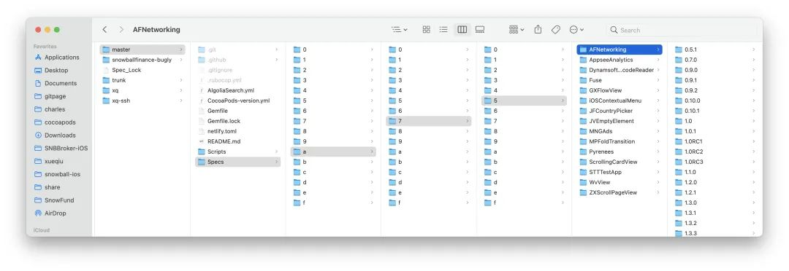

再 🤔 另外一个问题，**为什么 CocoaPods 生成的目录结构是这样 ？**

其实在 2016 年 CocoaPods Spec 仓库下的所有文件都在同级目录，不像现在这样做了分片。这个是为了解决当时用户的吐槽：GitHub下载慢[2]，最终解决方案的结果就如你所见：**将 Git 仓库进行了分片**。

那么问题来了，**为什么分片能够提升 GitHub 下载速度？**

很重要的一点是 CocoaPods 的 `Spec Repo` 本质上是 Git 仓库，而 Git 在做变更管理的时候，会记录目录的变更，每个子目录都会对应一个 Git model。

而当目录中的文件数量过多的时候，Git 要找出对应的变更就变得十分困难。有兴趣的同学可以查看官方说明[3]。

另外再补充一点，在 Linux 中最经典的一句话是：**一切皆文件**，不仅普通的文件和目录，就连块设备、管道、socket 等，也都是统一交给文件系统管理的。

也就是说就算不用 Git 来管理 Specs 仓库，当目录下存在数以万计的文件时，如何高效查找目标文件也是需要考虑的问题。

> 备注：关于文件系统层次结构有兴趣的同学可以查看FHS 标准[4]，以及这篇文章：**[「一口气搞懂「文件系统」，就靠这 25 张图了」**](https://mp.weixin.qq.com/s?__biz=MzUxODAzNDg4NQ%3D%3D&idx=1&mid=2247485446&scene=21&sn=2c525f008622b98bc08a66f2b4dcfee8#wechat_redirect)

回到 CocoaPods，如何对 Master 仓库目录进行分片就涉及到 metadata 类中的关键方法：


```ruby
def path_fragment(pod_name, version = nil)
  prefixes = if prefix_lengths.empty?
               []
             else
               hashed = Digest::MD5.hexdigest(pod_name)
               prefix_lengths.map do |length|
                 hashed.slice!(0, length)
               end
             end
  prefixes.concat([pod_name, version]).compact
end
```

`#path_fragment` 会依据 pod_name 和 version 来生成 pod 对应的索引目录：

  * 首先对 pod_name 进行 MD5 计算获取摘要；
  * 遍历 `prefix_lengths` 对生成的摘要不断截取指定的长度作为文件索引。

以 `AFNetworking` 为例：


```ruby
$ Digest::MD5.hexdigest('AFNetworking')
"a75d452377f3996bdc4b623a5df25820"
```

由于我们的 `prefix_lengths` 为 `[1, 1, 1]` 数组，那么它将会从左到右依次截取出一个字母，即：`a`、`7`、`5`，这三个字母作为索引目录，它正好符合我们 ???? 目录结构图中 AFNetworking 的所在位置。

### Versions

要找到 `Podfile` 中限定版本号范围的 `PodSpec` 文件还需要需要最后一步，获取当前已发布的 Versions 列表，并通过比较Version 得出最终所需的 `PodSpec` 文件。

在上一步已通过 `metadata` 和 `pod_name` 计算出 `pod` 所在目录，接着就是找到 `pod` 目录下的 Versions 列表：

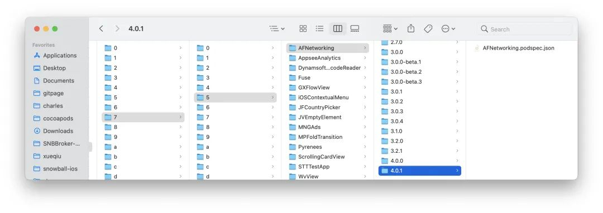

获取 Versions：


```ruby
def versions(name)
  return nil unless specs_dir
  raise ArgumentError, 'No name' unless name
  pod_dir = pod_path(name)
  return unless pod_dir.exist?
  @versions_by_name[name] ||= pod_dir.children.map do |v|
    basename = v.basename.to_s
    begin
      Version.new(basename) if v.directory? && basename[0, 1] != '.'
    rescue ArgumentError
    raise Informative, 'An unexpected version directory ...'
    end
  end.compact.sort.reverse
end
```

该方法重点在于将 `pod_dir` 下的每个目录都转换成为了 **Version** 类型，并在最后进行了 sort 排序。

> `#versions` 方法主要在 `pod search` 命令中被调用，后续会介绍。

来搂一眼 Version 类：


```ruby
class Version < Pod::Vendor::Gem::Version
  METADATA_PATTERN = '(\+[0-9a-zA-Z\-\.]+)'
  VERSION_PATTERN = "[0-9]+(\\.[0-9a-zA-Z\\-]+)*#{METADATA_PATTERN}?"
  # ...
end
```

该 Version 继承于 Gem::Version[6] 并对其进行了扩展，实现了语义化版本号的标准，sort 排序也是基于语义化的版本来比较的，这里我们稍微展开一下。

#### Semantic Versioning

语义化版本号（Semantic Versioning[7] 简称：SemVer）绝对是依赖管理工具绕不开的坎。

**语义化的版本就是让版本号更具语义化，可以传达出关于软件本身的一些重要信息而不只是简单的一串数字。**

我们每次对 Pod 依赖进行更新，最后最重要的一步就是更新正确的版本号，一旦发布出去，再要更改就比较麻烦了。

> SemVer[8] 是由 Tom Preston-Werner 发起的一个关于软件版本号的命名规范，该作者为 Gravatars 创办者同时也是GitHub 联合创始人。

那什么是语义化版本号有什么特别呢 ？我们以 AFNetworking 的 **release tag** 示例：


```ruby
3.0.0
3.0.0-beta.1
3.0.0-beta.2
3.0.0-beta.3
3.0.1
```

这些 tags 并非随意递增的，它们背后正是遵循了语义化版本的标准。

**基本规则**

  * 软件的版本通常由三位组成，如：X.Y.Z。
  * 版本是严格递增的，
  * 在发布重要版本时，可以发布 alpha, rc 等先行版本，
  * alpha 和 rc 等修饰版本的关键字后面可以带上次数和 meta 信息，

**版本格式：**

> 主版本号.次版本号.修订号

版本号递增规则如下：

<table><thead><tr style="border-width: 1px 0px 0px;border-right-style: initial;border-bottom-style: initial;border-left-style: initial;border-right-color: initial;border-bottom-color: initial;border-left-color: initial;border-top-style: solid;border-top-color: rgb(204, 204, 204);background-color: white;"><th style="border-top-width: 1px;border-color: rgb(204, 204, 204);text-align: left;background-color: rgb(240, 240, 240);min-width: 85px;">Code status</th><th style="border-top-width: 1px;border-color: rgb(204, 204, 204);text-align: left;background-color: rgb(240, 240, 240);min-width: 85px;">Stage</th><th style="border-top-width: 1px;border-color: rgb(204, 204, 204);text-align: left;background-color: rgb(240, 240, 240);min-width: 85px;">Example version</th></tr></thead><tbody style="border-width: 0px;border-style: initial;border-color: initial;"><tr style="border-width: 1px 0px 0px;border-right-style: initial;border-bottom-style: initial;border-left-style: initial;border-right-color: initial;border-bottom-color: initial;border-left-color: initial;border-top-style: solid;border-top-color: rgb(204, 204, 204);background-color: white;"><td style="border-color: rgb(204, 204, 204);min-width: 85px;">新品首发</td><td style="border-color: rgb(204, 204, 204);min-width: 85px;">从 1.0.0 开始</td><td style="border-color: rgb(204, 204, 204);min-width: 85px;">1.0.0</td></tr><tr style="border-width: 1px 0px 0px;border-right-style: initial;border-bottom-style: initial;border-left-style: initial;border-right-color: initial;border-bottom-color: initial;border-left-color: initial;border-top-style: solid;border-top-color: rgb(204, 204, 204);background-color: rgb(248, 248, 248);"><td style="border-color: rgb(204, 204, 204);min-width: 85px;">向后兼容的 BugFix</td><td style="border-color: rgb(204, 204, 204);min-width: 85px;">增加补丁号 Z</td><td style="border-color: rgb(204, 204, 204);min-width: 85px;">1.0.1</td></tr><tr style="border-width: 1px 0px 0px;border-right-style: initial;border-bottom-style: initial;border-left-style: initial;border-right-color: initial;border-bottom-color: initial;border-left-color: initial;border-top-style: solid;border-top-color: rgb(204, 204, 204);background-color: white;"><td style="border-color: rgb(204, 204, 204);min-width: 85px;">向后兼容的 Feature</td><td style="border-color: rgb(204, 204, 204);min-width: 85px;">增加次版本号 Y</td><td style="border-color: rgb(204, 204, 204);min-width: 85px;">1.1.0</td></tr><tr style="border-width: 1px 0px 0px;border-right-style: initial;border-bottom-style: initial;border-left-style: initial;border-right-color: initial;border-bottom-color: initial;border-left-color: initial;border-top-style: solid;border-top-color: rgb(204, 204, 204);background-color: rgb(248, 248, 248);"><td style="border-color: rgb(204, 204, 204);min-width: 85px;">向后不兼容的改动</td><td style="border-color: rgb(204, 204, 204);min-width: 85px;">增加主版本号 X</td><td style="border-color: rgb(204, 204, 204);min-width: 85px;">2.0.0</td></tr><tr style="border-width: 1px 0px 0px;border-right-style: initial;border-bottom-style: initial;border-left-style: initial;border-right-color: initial;border-bottom-color: initial;border-left-color: initial;border-top-style: solid;border-top-color: rgb(204, 204, 204);background-color: white;"><td style="border-color: rgb(204, 204, 204);min-width: 85px;">重要版本的预览版</td><td style="border-color: rgb(204, 204, 204);min-width: 85px;">补丁号后添加 alpha, rc</td><td style="border-color: rgb(204, 204, 204);min-width: 85px;">2.1.0-rc.0</td></tr></tbody></table>

关于 CocoaPods 的 Version 使用描述，传送门[9]。

### CDNSource

CocoaPods 在 1.7.2 版本正式将 Master 仓库托管到 Netlify 的 CDN 上，当时关于如何支持这一特性的文章和说明铺天盖地，这里还是推荐大家看官方说明[10]。另外，当时感受是似乎国内的部分 iOS 同学都炸了，各种标题党：_**什么最完美**__**的升级**_ 等等。

所以这里明确一下，对于 CocoaPods 的 Master 仓库支持了 CDN 的行为，仅解决了两个问题：

  1. 利用 CDN 节点的全球化部署解决内容分发慢，提高 Specs 资源的下载速度。
  2. 通过 Specs 按需下载摆脱了原有 Git Repo 模式下本地仓库的磁盘占用过大，操作卡的问题。

然而，**仅仅对 `PodSpec` 增加了 CDN 根本没能解决 GFW 导致的 GitHub 源码校验、更新、下载慢的问题。**只能说路漫漫其修远兮。

> PS：作为 iOS 工程师，就经常被前端同学吐槽：**你看这 CocoaPods 也太垃圾了吧！！！**一旦删掉 `Pods` 目录重新 install就卡半天，缓存基本不生效，哪像 npm 多快 balabala ...

先来看 CDNSource 结构：


```ruby
require 'cocoapods-core/source'
# ...
module Pod
  class CDNSource < Source
    def initialize(repo)
      # 标记是否正在同步文件
      @check_existing_files_for_update = false
      # 记录时间用于对比下载文件的新旧程度，以确认是否需要更新保存所下的资源
      @startup_time = Time.new
      # 缓存查询过的 PodSpec 资源
      @version_arrays_by_fragment_by_name = {}
      super(repo)
    end

    def url
      @url ||= File.read(repo.join('.url')).chomp.chomp('/') + '/'
    end

    def type
      'CDN'
    end
    # ...
  end
end
```

Source 类是基于 GitHub Repo 来同步更新 `PodSpec`，而 CDNSource 则是基于 CDN 服务所返回的Response，因此将 Source 类的大部分方法重写了一个遍，具体会在 SourceManager 一节来展开。

最后看一下 `TrunkSource` 类：


```ruby
module Pod
  class TrunkSource < CDNSource
    # 新版落盘后仓库名称
    TRUNK_REPO_NAME = 'trunk'.freeze
    TRUNK_REPO_URL = 'https://cdn.cocoapods.org/'.freeze
    def url
      @url ||= TRUNK_REPO_URL
      super
    end
  end
end
```

核心就是重写了返回的 `url`，由于旧版 Spec 仓库名称为 `master` 为了加以区分，CDN 仓库则改名为 `trunk`。

## Source Manager

`Manager` 作为 source 的管理类，其主要任务为 source 的添加和获取，而对 `PodSpec` 文件的更新和查找行为则交由source 各自实现。不过由于一个 `pod` 库可能对应多个不同的 source，这里又产生出 `Aggregate` 类来统一 `PodSpec`
的查询。

它们的关系如下：


Manager 实现：


```ruby
module Pod
  class Source
    class Manager
      attr_reader :repos_dir

      def initialize(repos_dir)
        @repos_dir = Pathname(repos_dir).expand_path
      end

      def source_repos
        return [] unless repos_dir.exist?
        repos_dir.children.select(&:directory?).sort_by { |d| d.basename.to_s.downcase }
      end

      def aggregate
        aggregate_with_repos(source_repos)
      end

      def aggregate_with_repos(repos)
        sources = repos.map { |path| source_from_path(path) }
        @aggregates_by_repos ||= {}
        @aggregates_by_repos[repos] ||= Source::Aggregate.new(sources)
      end

      def all
        aggregate.sources
      end
      # ...
    end
  end
end
```

Manager 类的初始化仅需要传入当前 repos 目录，即 `~/.cocoapods/repos`，而 Aggregate 的生成则保存`repos_dir` 了目录下的 Source，用于后续处理。

先看 Source 的生成，在 `#source_from_path` 中：


```ruby
def source_from_path(path)
  @sources_by_path ||= Hash.new do |hash, key|
    hash[key] = case
                when key.basename.to_s == Pod::TrunkSource::TRUNK_REPO_NAME
                  TrunkSource.new(key)
                when (key + '.url').exist?
                  CDNSource.new(key)
                else
                  Source.new(key)
                end
  end
  @sources_by_path[path]
end
```

以 `repos_dir` 下的目录名称来区分类型，而 CDNSource 则需要确保其目录下存在名为 `.url` 的文件。同时会对生成的 source进行缓存。

最后看 Aggregate 结构，核心就两个 search 方法：


```ruby
module Pod
  class Source
    class Aggregate
      attr_reader :sources

      def initialize(sources)
        raise "Cannot initialize an aggregate with a nil source: (#{sources})" if sources.include?(nil)
        @sources = sources
      end

      # 查询依赖对应的 specs
      def search(dependency) ... end
       
      # 查询某个 pod 以发布的 specs
      def search_by_name(query, full_text_search = false) ... end
        
      # ...
  end
end
```

### Source 源起

本节我们来谈谈 source 是如何添加到 `repo_dir` 目录下的。

由前面的介绍可知，每个 source 中自带 **url**，在 Source 类中 url 读取自 Git 仓库的 `remote.origin.url`或本地 `.git` 目录，而在 CDNSource 中 url 则是读取自当前目录下的  `.url` 文件所保存的 URL 地址。

那 CDNSource 的  **`.url` 文件是在什么时候被写入的呢 ？**

这需要从 `Podfile` 说起。很多老项目的 `Podfile` 开头部分大都会有一行或多行 source 命令：


```ruby
source 'https://github.com/CocoaPods/Specs.git'
source 'https://github.com/artsy/Specs.git'
```

用于指定项目中 `PodSpec` 的查找源，这些指定源最终会保存在 `~/.cocoapods/repos` 目录下的仓库。

当敲下 `pod install` 命令后，在 `#resolve_dependencies` 阶段的依赖分析中将同时完成 sources 的初始化。

  


```ruby
# lib/cocoapods/installer/analyzer.rb
def sources
  @sources ||= begin
    # 省略获取 podfile、plugins、dependencies 的 source url ...
    sources = ...
     
    result = sources.uniq.map do |source_url|
      sources_manager.find_or_create_source_with_url(source_url)
    end
    unless plugin_sources.empty?
      result.insert(0, *plugin_sources)
      plugin_sources.each do |source|
        sources_manager.add_source(source)
      end
    end
    result
  end
end
```

获取 sources url 之后会通过 `sources_manager` 来完成 source 更新，逻辑在 CocoaPods 项目的 Manager扩展中：


```ruby
# lib/cocoapods/sources_manager.rb
module Pod
  class Source
    class Manager

      def find_or_create_source_with_url(url)
        source_with_url(url) || create_source_with_url(url)
      end

      def create_source_with_url(url)
        name = name_for_url(url)
        is_cdn = cdn_url?(url)
    # ...
        begin
          if is_cdn
            Command::Repo::AddCDN.parse([name, url]).run
          else
            Command::Repo::Add.parse([name, url]).run
          end
        rescue Informative => e
          raise Informative, # ...
        ensure
          UI.title_level = previous_title_level
        end
        source = source_with_url(url)
        raise "Unable to create a source with URL #{url}" unless source
        source
      end
      # ...
    end
  end
end
```

查找会先调用 `#source_with_url` 进行缓存查询，如未命中则会先下载 Source 仓库，结束后重刷 aggreate 以更新source。


```ruby
# lib/cocoapods-core/source/manager.rb

def source_with_url(url)
  url = canonic_url(url)
  url = 'https://github.com/cocoapods/specs' if url =~ %r{github.com[:/]+cocoapods/specs}
  all.find do |source|
    source.url && canonic_url(source.url) == url
  end
end

def canonic_url(url)
  url.downcase.gsub(/\.git$/, '').gsub(%r{\/$}, '')
end
```

另外，仓库的下载的则会通过 `#cdn_url?` 方法区分，最后的下载则包裹在两个命令类中，概括如下：

  * **Repo::AddCDN**：即  `pod repo add-cdn` 命令，仅有的操作是将 url 写入 `.url` 文件中。
  * **Repo::Add**：即 `pod repo add` 命令，对于普通类型的 Source 仓库下载本质就是 `git clone` 操作。

简化后源的添加流程如下：


### PodSpec 查询

同样在 `#resolve_dependencies` 的依赖仲裁阶段，当 **Molinillo** 依赖仲裁开始前，会触发缓存查询`#find_cached_set` 并最终调用到 Aggregate 的 `#search`。完整调用栈放在 gist[11] 上。

我们来看看 `#search` 入口：


```ruby
# lib/cocoapods-core/source/aggregate.rb

def search(dependency)
  found_sources = sources.select { |s| s.search(dependency) }
  unless found_sources.empty?
    Specification::Set.new(dependency.root_name, found_sources)
  end
end
```

Aggregate 先遍历当前 sources 并进行 dependency 查找。由于 Git 仓库保存了完整的PodSpecs，只要能在分片目录下查询到对应文件即可，最终结果会塞入 `Specification::Set` 返回。

> `Specification::Set` 记录了当前 pod 关联的 Source，一个 pod 可能存在与多个不同的 Spec 仓库 中。

#### CDN 仓库查询

CDNSource 重写了 `#search` 实现：


```ruby
# lib/cocoapods-core/cdn_source.rb

def search(query)
  unless specs_dir
    raise Informative, "Unable to find a source named: `#{name}`"
  end
  if query.is_a?(Dependency)
    query = query.root_name
  end

  fragment = pod_shard_fragment(query)
  ensure_versions_file_loaded(fragment)
  version_arrays_by_name = @version_arrays_by_fragment_by_name[fragment] || {}
   
  found = version_arrays_by_name[query].nil? ? nil : query

  if found
    set = set(query)
    set if set.specification_name == query
  end
end
```

逻辑两步走：

  * 通过 `#ensure_versions_file_loaded` 检查 `all_pods_versions` 文件，如果不存在会进行下载操作。
  * 如果当前 source 包含查询的 pod，会创建 `Specification::Set` 作为查询结果，并在 `#specification_name` 方法内完成 `PodSpec` 的检查和下载。

##### 1. `all_pods_versions` 文件下载

依据前面提到的分片规则会将 pod 名称 MD5 分割后拼成 URL。

以 `AFNetworking` 为例，经 `#pod_shard_fragment` 分割后获取的 fragment 为 `[a, 7, 5]`，则拼接后的 URL 为
`https://cdn.cocoapods.org/all_pods_versions_a_7_5.txt`，下载后的内容大致如下：


```ruby
AFNetworking/0.10.0/0.10.1/.../4.0.1
AppseeAnalytics/2.4.7/2.4.8/2.4.8.0/...
DynamsoftBarcodeReader/7.1.0/...
...
```

所包含的这些 pod 都是分片后得到的相同的地址，因此会保存在同一份 `all_pods_versions` 中。


```ruby
def ensure_versions_file_loaded(fragment)
  return if !@version_arrays_by_fragment_by_name[fragment].nil? && !@check_existing_files_for_update
  index_file_name = index_file_name_for_fragment(fragment)
  download_file(index_file_name)
  versions_raw = local_file(index_file_name, &:to_a).map(&:chomp)
  @version_arrays_by_fragment_by_name[fragment] = versions_raw.reduce({}) do |hash, row|
    row = row.split('/')
    pod = row.shift
    versions = row
    hash[pod] = versions
    hash
  end
end

def index_file_name_for_fragment(fragment)
  fragment_joined = fragment.join('_')
  fragment_joined = '_' + fragment_joined unless fragment.empty?
  "all_pods_versions#{fragment_joined}.txt"
end
```


另外每一份 pods_version 都会对应生成一个文件用于保存 ETag，具体会在下一节会介绍。

##### 2. PodSpec 文件下载

`#specification_name` 将从 `all_pods_versions` 索引文件中找出该 pod 所发布的版本号，依次检查下载对应版本的`PodSpec.json` 文件。


```ruby
module Pod
  class Specification
    class Set
      attr_reader :name
      attr_reader :sources
      
      def specification_name
        versions_by_source.each do |source, versions|
          next unless version = versions.first
          return source.specification(name, version).name
        end
        nil
      end

      def versions_by_source
        @versions_by_source ||= sources.each_with_object({}) do |source, result|
          result[source] = source.versions(name)
        end
      end
      # ...
    end
  end
end
```

绕了一圈后回到 Source 的 `#versions` 方法，由于 CDN Source 不会全量下载 pod 的 PodSpec 文件，在#version[12] 的检查过程会进行下载操作。


#### Pod Search 查询命令

CocoaPods 还提供了命令行工具 `cocoapods-search` 用于已发布的 `PodSpec` 查找：


```ruby
    $ pod search `QUERY`
```

它提供了 Web 查询和本地查询。本地查询则不同于 `#search`，它需要调用 Aggregate 的 `#search_by_name` ，其实现同`#search` 类似，最终也会走到 Source 的 #versions[13] 方法。


> 注意，Gti 仓库的 `#search_by_name` 查询仍旧为文件查找，不会调用其 `#versions` 方法。

### Repo 更新

`pod install` 执行过程如果带上了 `\--repo-update` 命令则在 `#resolve_dependencies` 阶段会触发`#update_repositories` 更新 Spec 仓库：


```ruby
# lib/cocoapods/installer/analyzer.rb

def update_repositories
  sources.each do |source|
    if source.updateable?
      sources_manager.update(source.name, true)
    else
      UI.message "Skipping ..."
    end
  end
  @specs_updated = true
end
```

不过 `#update` 的实现逻辑在 CocoaPods 项目的 Manager 扩展中：


```ruby
# lib/cocoapods/sources_managers.rb

def update(source_name = nil, show_output = false)
  if source_name
    sources = [updateable_source_named(source_name)]
  else
    sources = updateable_sources
  end

  changed_spec_paths = {}

  # Do not perform an update if the repos dir has not been setup yet.
  return unless repos_dir.exist?

  File.open("#{repos_dir}/Spec_Lock", File::CREAT) do |f|
    f.flock(File::LOCK_EX)
    sources.each do |source|
      UI.p "Updating spec repo `#{source.name}`" do
        changed_source_paths = source.update(show_output)
        changed_spec_paths[source] = changed_source_paths if changed_source_paths.count > 0
        source.verify_compatibility!
      end
    end
  end
  update_search_index_if_needed_in_background(changed_spec_paths)
end
```


  * 获取指定名称的 source，对 aggregate 返回的全部 sources 进行 filter，如未指定则 sources 全量。
  * 挨个调用 `source.update(show_output)`，注意 Git 和 CDN 仓库的更新方式的不同。

#### Git 仓库更新  

Git 仓库更新本质就是 Git 操作，即 `git pull`、`git checkout` 命令：


```ruby
def update(show_output)
  return [] if unchanged_github_repo?
  prev_commit_hash = git_commit_hash
  update_git_repo(show_output)
  @versions_by_name.clear
  refresh_metadata
  if version = metadata.last_compatible_version(Version.new(CORE_VERSION))
    tag = "v#{version}"
    CoreUI.warn "Using the ..."
    repo_git(['checkout', tag])
  end
  diff_until_commit_hash(prev_commit_hash)
end
```


`#update_git_repo` 就是 `git fetch` + `git reset --hard [HEAD]` 的结合体，更新后会进行 cocoapods 版本兼容检查，最终输出 diff 信息。

#### CDN 仓库更新

Git 仓库是可以通过 Commit 信息来进行增量更新，那以静态资源方式缓存的 CDN 仓库是如何更新数据的呢 ？

像浏览器或本地缓存**本质是利用 ETag 来进行 Cache-Control**，关于 CDN 缓存可以看这篇：传送门[14]。

而 ETag 就是一串字符，内容通常是数据的哈希值，由服务器返回。首次请求后会在本地缓存起来，并在后续的请求中携带上 ETag 来确定缓存是否需要更新。如果ETag 值相同，说明资源未更改，服务器会返回 304（Not Modified）响应码。

Core 的实现也是如此，它会将各请求所对应的 ETag 以文件形式存储：

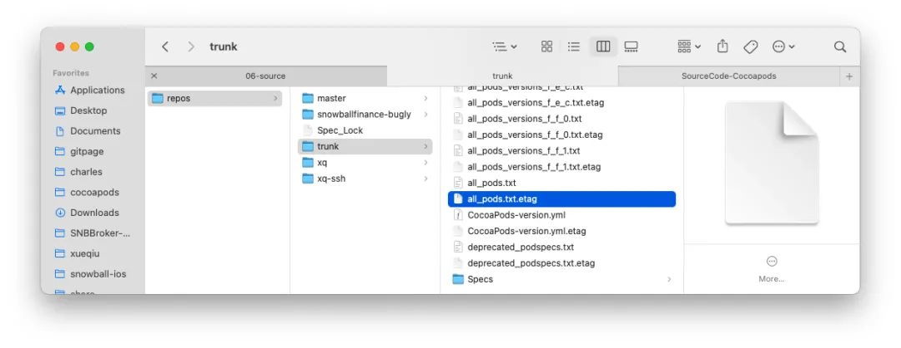

**注意，在这个阶段 CDNSource 仅仅是更新当前目录下的索引文件**，即 `all_pods_versions_x_x_x.txt`。
    

```ruby
def update(_show_output)
  @check_existing_files_for_update = true
  begin
    preheat_existing_files
  ensure
    @check_existing_files_for_update = false
  end
  []
end

def preheat_existing_files
  files_to_update = files_definitely_to_update + deprecated_local_podspecs - ['deprecated_podspecs.txt']
  concurrent_requests_catching_errors do
    loaders = files_to_update.map do |file|
      download_file_async(file)
    end
    Promises.zip_futures_on(HYDRA_EXECUTOR, *loaders).wait!
  end
end
```

#### Pod Repo 更新命令

CocoaPods 对于 sources 仓库的更新也提供了命令行工具：


```ruby
$ pod repo update `[NAME]`
```

其实现如下：


```ruby
# lib/cocoapods/command/repo/update.rb
module Pod
  class Command
    class Repo < Command
      class Update < Repo
        def run
          show_output = !config.silent?
          config.sources_manager.update(@name, show_output)
          exclude_repos_dir_from_backup
        end
        # ...
      end
    end
  end
end
```

在命令初始化时会保存指定的 Source 仓库名称 `@name`，接着通过 Mixin 的 `config` 来获取 `sources_manager`
触发更新。

最后用一张图来收尾 CocoaPods Workflow：

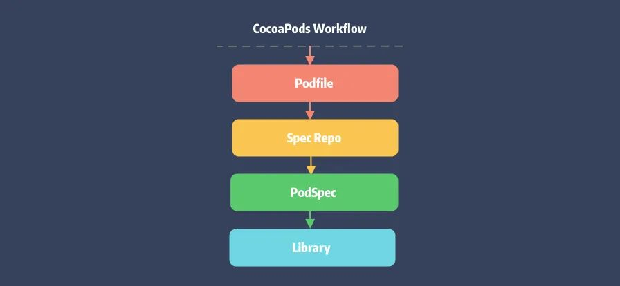

## 总结

最后一篇 Core 的分析文章，重点介绍了它是如何管理 `PodSpec` 仓库以及 `PodSpec` 文件的更新和查找，总结如下：

  * 了解 Source Manager 的各种数据结构以及它们之间的相互关系，各个类之间居然都做到了权责分明。
  * 通过对 Metadata 的分析了解了 Source 仓库的演变过程，并剖析了存在的问题。
  * 掌握了如何利用 CDN 来改造原有的 Git 仓库，优化 PodSpec 下载速度。
  * 发现原来 CLI 工具不仅仅可以提供给用户使用，内部调用也不是不可以。

## 知识点问题梳理

这里罗列了五个问题用来考察你是否已经掌握了这篇文章，可以在评论区依次作答。如果没有掌握建议你加入**收藏**再次阅读：

逻辑两步走：

  * `PodSpecs` 的聚合类有哪些，可以通过哪些手段来区分他们的类型？
  * 说说你对 `Aggregate` 类的理解，以及它的主要作用？
  * `Source` 类是如何更新 `PodSpec`？
  * Core 是如何对仓库进行分片的，它的分片方式是否支持配置？
  * CDN 仓库是如何来更新 `PodSpec` 文件？

#### 参考资料

[1]Specs 仓库: _https://github.com/CocoaPods/Specs_
[2]GitHub 下载慢: _https://github.com/CocoaPods/CocoaPods/issues/4989#issuecomment-193772935_
[3]官方说明: _https://blog.cocoapods.org/Master-Spec-Repo-Rate-Limiting-Post-Mortem/#too-many-directory-entries_
[4]FHS 标准: _https://www.wikiwand.com/en/Filesystem_Hierarchy_Standard_
[5]传送门: _https://zhuanlan.zhihu.com/p/183238194#tocbar--13f51dj_
[6]Gem::Version: _https://www.rubydoc.info/github/rubygems/rubygems/Gem/Version_
[7]Semantic Versioning: _https://semver.org/_
[8]SemVer: _https://github.com/semver/semver_
[9]传送门: _https://guides.cocoapods.org/using/the-podfile.html#specifying-pod-versions_
[10]官方说明: _https://blog.cocoapods.org/CocoaPods-1.7.2/_
[11]gist: _https://gist.github.com/looseyi/492b220ea7e933e972b65876e491886f_
[12]**#version**: _https://www.rubydoc.info/gems/cocoapods-core/Pod/CDNSource#versions-instance_method_
[13]#versions: _https://www.rubydoc.info/gems/cocoapods-core/Pod/Source/Aggregate#search_by_name-instance_method_
[14]传送门: _https://zhuanlan.zhihu.com/p/65722520_
