 
<!--BEGIN_DATA
{
    "create_date": "2020-11-11 20:40", 
    "modify_date": "2020-11-11 20:40", 
    "is_top": "0", 
    "summary": "6. PodSpec 管理策略<br/>7. Molinillo 依赖校验<br/>8. Xcode 工程文件解析", 
    "tags": "iOS、工具", 
    "file_name": "CocoaPods历险记04.md"
}
END_DATA-->

#### <p>原文出处：<a href='https://mp.weixin.qq.com/s?__biz=MzA5MTM1NTc2Ng==&mid=2458324802&idx=1&sn=dea6f4317864efade0fdfaee4e8c35ab&chksm=870e005bb079894d8b650976ce745798f56b661039ed68527e0415545bf28a72484411dd47f1&scene=178&cur_album_id=1477103239887142918#rd' target='blank'>6. PodSpec 管理策略</a></p>

## 本文目录

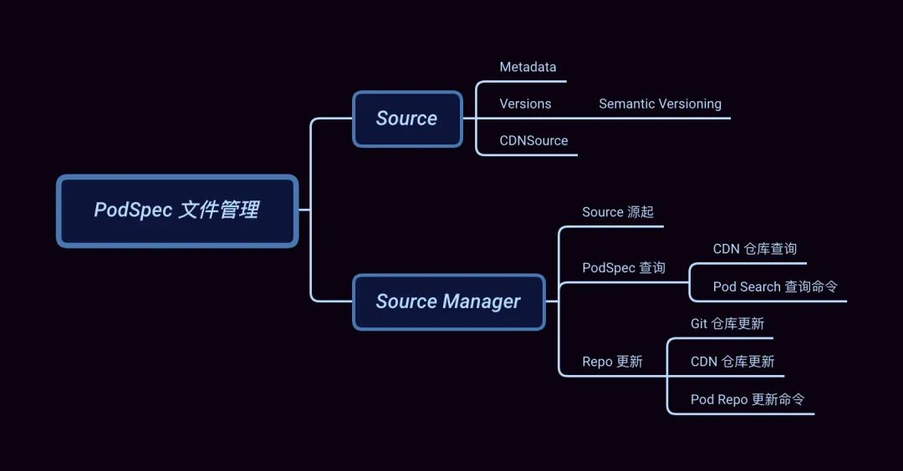

## 引子

本文是 Core 的最后一篇，它与另外两篇文章[「Podfile 解析逻辑」](http://mp.weixin.qq.com/s?__biz=MzA5MTM1NTc2Ng==&mid=2458324199&idx=1&sn=3886bbbcef3640bf97e16fcec34b451f&chksm=870e03feb0798ae84ab4b5dab26dfbe8ebbac0bca8491493fa4919f6069bfef58cd04df5ab34&scene=21#wechat_redirect)和[「PodSpec 文件分析」](http://mp.weixin.qq.com/s?__biz=MzA5MTM1NTc2Ng==&mid=2458324238&idx=1&sn=2f358378eac71b471765a4ddc9ff9785&chksm=870e0217b0798b0156361f407f76f7b4c3a2e1b4c0a56f71cc6e01b56323b17bd5bb8df02f9d&scene=21#wechat_redirect)共同支撑起 CocoaPods 世界的骨架。

CocoaPods-Core 这个库之所以被命名为 Core 就是因为它包含了 **Podfile -> Spec Repo -> PodSpec**这条完整的链路，将散落各地的依赖库连接起来并基于此骨架不断地完善功能。

从提供各种便利的命令行工具，到依赖库与主项目的自动集成，再到提供多样的 Xcode 编译配置、单元测试、资源管理等等，最终形成了我们所见的CocoaPods。

今天我们就来聊聊 `Spec Repo` 这个 `PodSpec` 的聚合仓库以及它的演变与问题。

## Source

作为 `PodSpec` 的聚合仓库，Spec Repo **记录着所有 `pod` 所发布的不同版本的 `PodSpec` 文件**。该仓库对应到Core 的数据结构为 `Source`，即为今天的主角。

整个 `Source` 的结构比较简单，它基本是围绕着 Git 来做文章，主要是对 `PodSpec` 文件进行各种查找更新操作。结构如下：

    
```ruby
## 用于检查 spec 是否符合当前 Source 要求  
require 'cocoapods-core/source/acceptor'  
## 记录本地 source 的集合  
require 'cocoapods-core/source/aggregate'  
## 用于校验 source 的错误和警告  
require 'cocoapods-core/source/health_reporter'  
## source 管理器  
require 'cocoapods-core/source/manager'  
## source 元数据  
require 'cocoapods-core/source/metadata'  
  
module Pod  
  class Source  
    ## 仓库默认的 Git 分支  
    DEFAULT_SPECS_BRANCH = 'master'.freeze  
    ## 记录仓库的元数据  
    attr_reader :metadata  
    ## 记录仓库的本地地址  
    attr_reader :repo  
    ## repo 仓库地址 ~/.cocoapods/repos/{repo_name}  
    def initialize(repo)  
      @repo = Pathname(repo).expand_path  
      @versions_by_name = {}  
      refresh_metadata  
    end  
    ## 读取 Git 仓库中的 remote url 或 .git 目录  
    def url  
      @url ||= begin  
        remote = repo_git(%w(config --get remote.origin.url))  
        if !remote.empty?  
          remote  
        elsif (repo + '.git').exist?  
          "file://#{repo}/.git"  
        end  
      end  
    end  
  
    def type  
      git? ? 'git' : 'file system'  
    end  
    ## ...  
  end  
end  
```

`Source` 还有两个子类 **CDNSource** 和 **TrunkSource**，TrunkSouce 是 CocoaPods 的默认仓库。

在版本 1.7.2 之前 Master Repo 的 URL 指向为 GitHub 的 Specs 仓库[1]，这也是造成我们每次 `pod install` 或 `pod update` 慢的原因之一。

它不仅保存了近 10 年来 PodSpec 文件同时还包括 Git 记录，再加上墙的原因，每次更新都非常痛苦。

而在 1.7.2 之后 CocoaPods 的默认 Source 终于改为了 CDN 指向，同时支持按需下载，缓解了 `pod` 更新和磁盘占用过大问题。

`Source` 的依赖关系如下：


回到 `Source` 来看其如何初始化的，可以看到其构造函数 `#initialize(repo)` 将传入的 repo 地址保存后，直接调用了`#refresh_metadata` 来完成元数据的加载：

```ruby
def refresh_metadata  
  @metadata = Metadata.from_file(metadata_path)  
end  
  
def metadata_path  
  repo + 'CocoaPods-version.yml'  
end  
```

### Metadata

Metadata 是保存在 repo 目录下，名为 `CocoaPods-version.yml` 的文件，**用于记录该 Source 所支持的 CocoaPods 的版本以及仓库的分片规则**。

```ruby
autoload :Digest, 'digest/md5'  
require 'active_support/hash_with_indifferent_access'  
require 'active_support/core_ext/hash/indifferent_access'  
  
module Pod  
  class Source  
    class Metadata  
      ## 最低可支持的 CocoaPods 版本，对应字段 `min`  
      attr_reader :minimum_cocoapods_version  
      ## 最高可支持的 CocoaPods 版本，对应字段 `max`  
      attr_reader :maximum_cocoapods_version  
      ## 最新 CocoaPods 版本，对应字段 `last`  
      attr_reader :latest_cocoapods_version  
      ## 规定截取的关键字段的前缀长度和数量  
      attr_reader :prefix_lengths  
      ## 可兼容的 CocoaPods 最新版本  
      attr_reader :last_compatible_versions  
      ## ...  
    end  
  end  
end  
```

这里以笔者 💻 环境中 Master 仓库下的 `CocoaPods-version.yml` 文件内容为例：

```ruby
---  
min: 1.0.0  
last: 1.10.0.beta.1  
prefix_lengths:  
- 1  
- 1  
- 1  
```

最低支持版本为 `1.0.0`，最新可用版本为 `1.10.0.beta.1`，以及最后这个 `prefix_lengths` 为 `[1, 1, 1]`的数组。那么这个 **prefix_lengths 的作用是什么呢 ？**

要回答这个问题，我们先来看一张 `Spec Repo` 的目录结构图：


再 🤔 另外一个问题，**为什么 CocoaPods 生成的目录结构是这样 ？**

其实在 2016 年 CocoaPods Spec 仓库下的所有文件都在同级目录，不像现在这样做了分片。这个是为了解决当时用户的吐槽：GitHub 下载慢[2]，最终解决方案的结果就如你所见：**将 Git 仓库进行了分片**。

那么问题来了，**为什么分片能够提升 GitHub 下载速度？**

很重要的一点是 CocoaPods 的 `Spec Repo` 本质上是 Git 仓库，而 Git 在做变更管理的时候，会记录目录的变更，每个子目录都会对应一个 Git model。

而当目录中的文件数量过多的时候，Git 要找出对应的变更就变得十分困难。有兴趣的同学可以查看官方说明[3]。

另外再补充一点，在 Linux 中最经典的一句话是：**一切皆文件**，不仅普通的文件和目录，就连块设备、管道、socket 等，也都是统一交给文件系统管理的。

也就是说就算不用 Git 来管理 Specs 仓库，当目录下存在数以万计的文件时，如何高效查找目标文件也是需要考虑的问题。

> 备注：关于文件系统层次结构有兴趣的同学可以查看FHS 标准[4]，以及这篇文章：[「一口气搞懂「文件系统」，就靠这 25 张图了」](https://mp.weixin.qq.com/s?__biz=MzUxODAzNDg4NQ==&mid=2247485446&idx=1&sn=2c525f008622b98bc08a66f2b4dcfee8&scene=21#wechat_redirect)

回到 CocoaPods，如何对 Master 仓库目录进行分片就涉及到 metadata 类中的关键方法：

```ruby
def path_fragment(pod_name, version = nil)  
  prefixes = if prefix_lengths.empty?  
               []  
             else  
               hashed = Digest::MD5.hexdigest(pod_name)  
               prefix_lengths.map do |length|  
                 hashed.slice!(0, length)  
               end  
             end  
  prefixes.concat([pod_name, version]).compact  
end  
```

`#path_fragment` 会依据 pod_name 和 version 来生成 pod 对应的索引目录：

  * 首先对 `pod_name` 进行 MD5 计算获取摘要；
  * 遍历 `prefix_lengths` 对生成的摘要不断截取指定的长度作为文件索引。

以 `AFNetworking` 为例：

```ruby   
$ Digest::MD5.hexdigest('AFNetworking')  
"a75d452377f3996bdc4b623a5df25820"  
```

由于我们的 `prefix_lengths` 为 `[1, 1, 1]` 数组，那么它将会从左到右依次截取出一个字母，即：`a`、`7`、`5`，这三个字母作为索引目录，它正好符合我们 👆 目录结构图中 AFNetworking 的所在位置。

### Versions

要找到 `Podfile` 中限定版本号范围的 `PodSpec` 文件还需要需要最后一步，获取当前已发布的 Versions 列表，并通过比较Version 得出最终所需的 `PodSpec` 文件。

在上一步已通过 `metadata` 和 `pod_name` 计算出 `pod` 所在目录，接着就是找到 `pod` 目录下的 Versions 列表：


获取 Versions：

```ruby
def versions(name)  
  return nil unless specs_dir  
  raise ArgumentError, 'No name' unless name  
  pod_dir = pod_path(name)  
  return unless pod_dir.exist?  
  @versions_by_name[name] ||= pod_dir.children.map do |v|  
    basename = v.basename.to_s  
    begin  
      Version.new(basename) if v.directory? && basename[0, 1] != '.'  
    rescue ArgumentError  
    raise Informative, 'An unexpected version directory ...'  
    end  
  end.compact.sort.reverse  
end  
```

该方法重点在于将 `pod_dir` 下的每个目录都转换成为了 **Version** 类型，并在最后进行了 sort 排序。

> `#versions` 方法主要在 `pod search` 命令中被调用，后续会介绍。

来搂一眼 Version 类：

```ruby
class Version < Pod::Vendor::Gem::Version  
  METADATA_PATTERN = '(\+[0-9a-zA-Z\-\.]+)'  
  VERSION_PATTERN = "[0-9]+(\\.[0-9a-zA-Z\\-]+)*#{METADATA_PATTERN}?"  
  ## ...  
end  
```

该 Version 继承于 Gem::Version[6] 并对其进行了扩展，实现了语义化版本号的标准，sort 排序也是基于语义化的版本来比较的，这里我们稍微展开一下。

#### Semantic Versioning

语义化版本号（Semantic Versioning[7] 简称：SemVer）绝对是依赖管理工具绕不开的坎。

**语义化的版本就是让版本号更具语义化，可以传达出关于软件本身的一些重要信息而不只是简单的一串数字。**

我们每次对 Pod 依赖进行更新，最后最重要的一步就是更新正确的版本号，一旦发布出去，再要更改就比较麻烦了。

> SemVer[8] 是由 Tom Preston-Werner 发起的一个关于软件版本号的命名规范，该作者为 Gravatars 创办者同时也是 GitHub 联合创始人。

那什么是语义化版本号有什么特别呢 ？我们以 AFNetworking 的 **release tag** 示例：

```ruby
3.0.0  
3.0.0-beta.1  
3.0.0-beta.2  
3.0.0-beta.3  
3.0.1  
```

这些 tags 并非随意递增的，它们背后正是遵循了语义化版本的标准。

**基本规则**

  * 软件的版本通常由三位组成，如：X.Y.Z。
  * 版本是严格递增的，
  * 在发布重要版本时，可以发布 alpha, rc 等先行版本，
  * alpha 和 rc 等修饰版本的关键字后面可以带上次数和 meta 信息，

**版本格式：**

> 主版本号.次版本号.修订号

版本号递增规则如下：

<table><thead><tr style="border-width: 1px 0px 0px;border-right-style: initial;border-bottom-style: initial;border-left-style: initial;border-right-color: initial;border-bottom-color: initial;border-left-color: initial;border-top-style: solid;border-top-color: rgb(204, 204, 204);background-color: white;"><th style="border-top-width: 1px;border-color: rgb(204, 204, 204);text-align: left;background-color: rgb(240, 240, 240);min-width: 85px;">Code status</th><th style="border-top-width: 1px;border-color: rgb(204, 204, 204);text-align: left;background-color: rgb(240, 240, 240);min-width: 85px;">Stage</th><th style="border-top-width: 1px;border-color: rgb(204, 204, 204);text-align: left;background-color: rgb(240, 240, 240);min-width: 85px;">Example version</th></tr></thead><tbody style="border-width: 0px;border-style: initial;border-color: initial;"><tr style="border-width: 1px 0px 0px;border-right-style: initial;border-bottom-style: initial;border-left-style: initial;border-right-color: initial;border-bottom-color: initial;border-left-color: initial;border-top-style: solid;border-top-color: rgb(204, 204, 204);background-color: white;"><td style="border-color: rgb(204, 204, 204);min-width: 85px;">新品首发</td><td style="border-color: rgb(204, 204, 204);min-width: 85px;">从 1.0.0 开始</td><td style="border-color: rgb(204, 204, 204);min-width: 85px;">1.0.0</td></tr><tr style="border-width: 1px 0px 0px;border-right-style: initial;border-bottom-style: initial;border-left-style: initial;border-right-color: initial;border-bottom-color: initial;border-left-color: initial;border-top-style: solid;border-top-color: rgb(204, 204, 204);background-color: rgb(248, 248, 248);"><td style="border-color: rgb(204, 204, 204);min-width: 85px;">向后兼容的 BugFix</td><td style="border-color: rgb(204, 204, 204);min-width: 85px;">增加补丁号 Z</td><td style="border-color: rgb(204, 204, 204);min-width: 85px;">1.0.1</td></tr><tr style="border-width: 1px 0px 0px;border-right-style: initial;border-bottom-style: initial;border-left-style: initial;border-right-color: initial;border-bottom-color: initial;border-left-color: initial;border-top-style: solid;border-top-color: rgb(204, 204, 204);background-color: white;"><td style="border-color: rgb(204, 204, 204);min-width: 85px;">向后兼容的 Feature</td><td style="border-color: rgb(204, 204, 204);min-width: 85px;">增加次版本号 Y</td><td style="border-color: rgb(204, 204, 204);min-width: 85px;">1.1.0</td></tr><tr style="border-width: 1px 0px 0px;border-right-style: initial;border-bottom-style: initial;border-left-style: initial;border-right-color: initial;border-bottom-color: initial;border-left-color: initial;border-top-style: solid;border-top-color: rgb(204, 204, 204);background-color: rgb(248, 248, 248);"><td style="border-color: rgb(204, 204, 204);min-width: 85px;">向后不兼容的改动</td><td style="border-color: rgb(204, 204, 204);min-width: 85px;">增加主版本号 X</td><td style="border-color: rgb(204, 204, 204);min-width: 85px;">2.0.0</td></tr><tr style="border-width: 1px 0px 0px;border-right-style: initial;border-bottom-style: initial;border-left-style: initial;border-right-color: initial;border-bottom-color: initial;border-left-color: initial;border-top-style: solid;border-top-color: rgb(204, 204, 204);background-color: white;"><td style="border-color: rgb(204, 204, 204);min-width: 85px;">重要版本的预览版</td><td style="border-color: rgb(204, 204, 204);min-width: 85px;">补丁号后添加 alpha, rc</td><td style="border-color: rgb(204, 204, 204);min-width: 85px;">2.1.0-rc.0</td></tr></tbody></table>

关于 CocoaPods 的 Version 使用描述，传送门[9]。

### CDNSource

CocoaPods 在 1.7.2 版本正式将 Master 仓库托管到 Netlify 的 CDN 上，当时关于如何支持这一特性的文章和说明铺天盖地，这里还是推荐大家看官方说明[10]。另外，当时感受是似乎国内的部分 iOS 同学都炸了，各种标题党：_**什么最完美的升级**_ 等等。

所以这里明确一下，对于 CocoaPods 的 Master 仓库支持了 CDN 的行为，仅解决了两个问题：

  1. 利用 CDN 节点的全球化部署解决内容分发慢，提高 Specs 资源的下载速度。
  2. 通过 Specs 按需下载摆脱了原有 Git Repo 模式下本地仓库的磁盘占用过大，操作卡的问题。

然而，**仅仅对 `PodSpec` 增加了 CDN 根本没能解决 GFW 导致的 GitHub 源码校验、更新、下载慢的问题。**只能说路漫漫其修远兮。

> PS：作为 iOS 工程师，就经常被前端同学吐槽：**你看这 CocoaPods 也太垃圾了吧！！！**一旦删掉 `Pods` 目录重新 install 就卡半天，缓存基本不生效，哪像 npm 多快 balabala ...

先来看 CDNSource 结构：

```ruby
require 'cocoapods-core/source'  
## ...  
module Pod  
  class CDNSource < Source  
    def initialize(repo)  
      ## 标记是否正在同步文件  
      @check_existing_files_for_update = false  
      ## 记录时间用于对比下载文件的新旧程度，以确认是否需要更新保存所下的资源  
      @startup_time = Time.new  
      ## 缓存查询过的 PodSpec 资源  
      @version_arrays_by_fragment_by_name = {}  
      super(repo)  
    end  
  
    def url  
      @url ||= File.read(repo.join('.url')).chomp.chomp('/') + '/'  
    end  
  
    def type  
      'CDN'  
    end  
    ## ...  
  end  
end  
```

Source 类是基于 GitHub Repo 来同步更新 `PodSpec`，而 CDNSource 则是基于 CDN 服务所返回的 Response，因此将 Source 类的大部分方法重写了一个遍，具体会在 SourceManager 一节来展开。

最后看一下 `TrunkSource` 类：

```ruby
module Pod  
  class TrunkSource < CDNSource  
    ## 新版落盘后仓库名称  
    TRUNK_REPO_NAME = 'trunk'.freeze  
  
    TRUNK_REPO_URL = 'https://cdn.cocoapods.org/'.freeze  
  
    def url  
      @url ||= TRUNK_REPO_URL  
      super  
    end  
  end  
end  
```

核心就是重写了返回的 `url`，由于旧版 Spec 仓库名称为 `master` 为了加以区分，CDN 仓库则改名为 `trunk`。

## Source Manager

`Manager` 作为 source 的管理类，其主要任务为 source 的添加和获取，而对 `PodSpec` 文件的更新和查找行为则交由 source 各自实现。不过由于一个 `pod` 库可能对应多个不同的 source，这里又产生出 `Aggregate` 类来统一 `PodSpec` 的查询。

它们的关系如下：

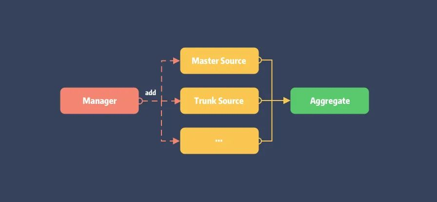

Manager 实现：

```ruby
module Pod  
  class Source  
    class Manager  
      attr_reader :repos_dir  
  
      def initialize(repos_dir)  
        @repos_dir = Pathname(repos_dir).expand_path  
      end  
  
      def source_repos  
        return [] unless repos_dir.exist?  
        repos_dir.children.select(&:directory?).sort_by { |d| d.basename.to_s.downcase }  
      end  
  
      def aggregate  
        aggregate_with_repos(source_repos)  
      end  
  
      def aggregate_with_repos(repos)  
        sources = repos.map { |path| source_from_path(path) }  
        @aggregates_by_repos ||= {}  
        @aggregates_by_repos[repos] ||= Source::Aggregate.new(sources)  
      end  
  
      def all  
        aggregate.sources  
      end  
      ## ...  
    end  
  end  
end  
```

Manager 类的初始化仅需要传入当前 repos 目录，即 `~/.cocoapods/repos`，而 Aggregate 的生成则保存 `repos_dir` 了目录下的 Source，用于后续处理。

先看 Source 的生成，在 `#source_from_path` 中：

```ruby
def source_from_path(path)  
  @sources_by_path ||= Hash.new do |hash, key|  
    hash[key] = case  
                when key.basename.to_s == Pod::TrunkSource::TRUNK_REPO_NAME  
                  TrunkSource.new(key)  
                when (key + '.url').exist?  
                  CDNSource.new(key)  
                else  
                  Source.new(key)  
                end  
  end  
  @sources_by_path[path]  
end  
```

以 `repos_dir` 下的目录名称来区分类型，而 CDNSource 则需要确保其目录下存在名为 `.url` 的文件。同时会对生成的 source 进行缓存。

最后看 Aggregate 结构，核心就两个 search 方法：

```ruby
module Pod  
  class Source  
    class Aggregate  
      attr_reader :sources  
  
      def initialize(sources)  
        raise "Cannot initialize an aggregate with a nil source: (#{sources})" if sources.include?(nil)  
        @sources = sources  
      end  
      ## 查询依赖对应的 specs  
      def search(dependency) ... end  
         
      ## 查询某个 pod 以发布的 specs  
      def search_by_name(query, full_text_search = false) ... end  
          
      ## ...  
  end  
end  
```

### Source 源起

本节我们来谈谈 source 是如何添加到 `repo_dir` 目录下的。

由前面的介绍可知，每个 source 中自带 **url**，在 Source 类中 url 读取自 Git 仓库的 `remote.origin.url` 或本地 `.git` 目录，而在 CDNSource 中 url 则是读取自当前目录下的  `.url` 文件所保存的 URL 地址。

那 CDNSource 的  **`.url` 文件是在什么时候被写入的呢 ？**

这需要从 `Podfile` 说起。很多老项目的 `Podfile` 开头部分大都会有一行或多行 source 命令：

```ruby
source 'https://github.com/CocoaPods/Specs.git'  
source 'https://github.com/artsy/Specs.git'  
``` 

用于指定项目中 `PodSpec` 的查找源，这些指定源最终会保存在 `~/.cocoapods/repos` 目录下的仓库。

当敲下 `pod install` 命令后，在 `#resolve_dependencies` 阶段的依赖分析中将同时完成 sources 的初始化。

  

```ruby   
## lib/cocoapods/installer/analyzer.rb  
  
def sources  
  @sources ||= begin  
    ## 省略获取 podfile、plugins、dependencies 的 source url ...  
    sources = ...  
       
    result = sources.uniq.map do |source_url|  
      sources_manager.find_or_create_source_with_url(source_url)  
    end  
    unless plugin_sources.empty?  
      result.insert(0, *plugin_sources)  
      plugin_sources.each do |source|  
        sources_manager.add_source(source)  
      end  
    end  
    result  
  end  
end  
```

获取 sources url 之后会通过 `sources_manager` 来完成 source 更新，逻辑在 CocoaPods 项目的 Manager 扩展中：

```ruby
## lib/cocoapods/sources_manager.rb  
  
module Pod  
  class Source  
    class Manager  
  
      def find_or_create_source_with_url(url)  
        source_with_url(url) || create_source_with_url(url)  
      end  
  
      def create_source_with_url(url)  
        name = name_for_url(url)  
        is_cdn = cdn_url?(url)  
    ## ...  
        begin  
          if is_cdn  
            Command::Repo::AddCDN.parse([name, url]).run  
          else  
            Command::Repo::Add.parse([name, url]).run  
          end  
        rescue Informative => e  
          raise Informative, ## ...  
        ensure  
          UI.title_level = previous_title_level  
        end  
        source = source_with_url(url)  
        raise "Unable to create a source with URL #{url}" unless source  
        source  
      end  
      ## ...  
    end  
  end  
end  
```

查找会先调用 `#source_with_url` 进行缓存查询，如未命中则会先下载 Source 仓库，结束后重刷 aggreate 以更新 source。

```ruby
## lib/cocoapods-core/source/manager.rb  
  
def source_with_url(url)  
  url = canonic_url(url)  
  url = 'https://github.com/cocoapods/specs' if url =~ %r{github.com[:/]+cocoapods/specs}  
  all.find do |source|  
    source.url && canonic_url(source.url) == url  
  end  
end  
  
def canonic_url(url)  
  url.downcase.gsub(/\.git$/, '').gsub(%r{\/$}, '')  
end  
```

另外，仓库的下载的则会通过 `#cdn_url?` 方法区分，最后的下载则包裹在两个命令类中，概括如下：

  * **Repo::AddCDN**：即  `pod repo add-cdn` 命令，仅有的操作是将 url 写入 `.url` 文件中。
  * **Repo::Add**：即 `pod repo add` 命令，对于普通类型的 Source 仓库下载本质就是 `git clone` 操作。

简化后源的添加流程如下：

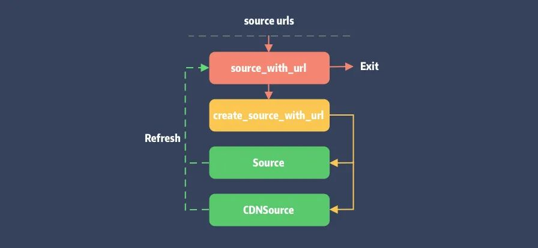

### PodSpec 查询

同样在 `#resolve_dependencies` 的依赖仲裁阶段，当 **Molinillo** 依赖仲裁开始前，会触发缓存查询 `#find_cached_set` 并最终调用到 Aggregate 的 `#search`。完整调用栈放在 gist[11] 上。

我们来看看 `#search` 入口：

```ruby
## lib/cocoapods-core/source/aggregate.rb  
  
def search(dependency)  
  found_sources = sources.select { |s| s.search(dependency) }  
  unless found_sources.empty?  
    Specification::Set.new(dependency.root_name, found_sources)  
  end  
end  
```

Aggregate 先遍历当前 sources 并进行 dependency 查找。由于 Git 仓库保存了完整的 PodSpecs，只要能在分片目录下查询到对应文件即可，最终结果会塞入 `Specification::Set` 返回。

> `Specification::Set` 记录了当前 pod 关联的 Source，一个 pod 可能存在与多个不同的 Spec 仓库 中。

#### CDN 仓库查询

CDNSource 重写了 `#search` 实现：

```ruby
## lib/cocoapods-core/cdn_source.rb  
  
def search(query)  
  unless specs_dir  
    raise Informative, "Unable to find a source named: `#{name}`"  
  end  
  if query.is_a?(Dependency)  
    query = query.root_name  
  end  
  
  fragment = pod_shard_fragment(query)  
  ensure_versions_file_loaded(fragment)  
  version_arrays_by_name = @version_arrays_by_fragment_by_name[fragment] || {}  
     
  found = version_arrays_by_name[query].nil? ? nil : query  
  
  if found  
    set = set(query)  
    set if set.specification_name == query  
  end  
end  
``` 

逻辑两步走：

  * 通过 `#ensure_versions_file_loaded` 检查 `all_pods_versions` 文件，如果不存在会进行下载操作。

  * 如果当前 source 包含查询的 pod，会创建 `Specification::Set` 作为查询结果，并在 `#specification_name` 方法内完成 `PodSpec` 的检查和下载。

##### 1. `all_pods_versions` 文件下载

依据前面提到的分片规则会将 pod 名称 MD5 分割后拼成 URL。

以 `AFNetworking` 为例，经 `#pod_shard_fragment` 分割后获取的 fragment 为 `[a, 7, 5]`，则拼接后的 URL 为 `https://cdn.cocoapods.org/all_pods_versions_a_7_5.txt`，下载后的内容大致如下：

```ruby
AFNetworking/0.10.0/0.10.1/.../4.0.1  
AppseeAnalytics/2.4.7/2.4.8/2.4.8.0/...  
DynamsoftBarcodeReader/7.1.0/...  
...  
``` 

所包含的这些 pod 都是分片后得到的相同的地址，因此会保存在同一份 `all_pods_versions` 中。

```ruby
def ensure_versions_file_loaded(fragment)  
  return if !@version_arrays_by_fragment_by_name[fragment].nil? && !@check_existing_files_for_update  
  
  index_file_name = index_file_name_for_fragment(fragment)  
  download_file(index_file_name)  
  versions_raw = local_file(index_file_name, &:to_a).map(&:chomp)  
  @version_arrays_by_fragment_by_name[fragment] = versions_raw.reduce({}) do |hash, row|  
    row = row.split('/')  
    pod = row.shift  
    versions = row  
  
    hash[pod] = versions  
    hash  
  end  
end  
  
def index_file_name_for_fragment(fragment)  
  fragment_joined = fragment.join('_')  
  fragment_joined = '_' + fragment_joined unless fragment.empty?  
  "all_pods_versions#{fragment_joined}.txt"  
end  
```

另外每一份 pods_version 都会对应生成一个文件用于保存 ETag，具体会在下一节会介绍。

##### 2. PodSpec 文件下载

`#specification_name` 将从 `all_pods_versions` 索引文件中找出该 pod 所发布的版本号，依次检查下载对应版本的`PodSpec.json` 文件。

```ruby
module Pod  
  class Specification  
    class Set  
      attr_reader :name  
      attr_reader :sources  
        
      def specification_name  
        versions_by_source.each do |source, versions|  
          next unless version = versions.first  
          return source.specification(name, version).name  
        end  
        nil  
      end  
  
      def versions_by_source  
        @versions_by_source ||= sources.each_with_object({}) do |source, result|  
          result[source] = source.versions(name)  
        end  
      end  
      ## ...  
    end  
  end  
end  
```

绕了一圈后回到 Source 的 `#versions` 方法，由于 CDN Source 不会全量下载 pod 的 PodSpec 文件，在 #version[12] 的检查过程会进行下载操作。

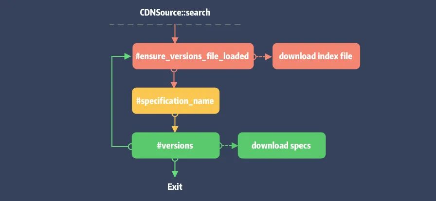

#### Pod Search 查询命令

CocoaPods 还提供了命令行工具 `cocoapods-search` 用于已发布的 `PodSpec` 查找：

```ruby
$ pod search `QUERY`  
```    

它提供了 Web 查询和本地查询。本地查询则不同于 `#search`，它需要调用 Aggregate 的 `#search_by_name` ，其实现同 `#search` 类似，最终也会走到 Source 的 #versions[13] 方法。

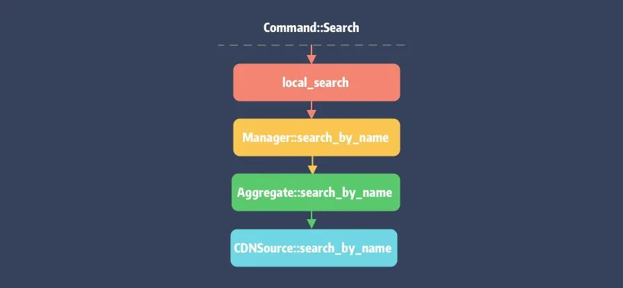

> 注意，Gti 仓库的 `#search_by_name` 查询仍旧为文件查找，不会调用其 `#versions` 方法。

### Repo 更新

`pod install` 执行过程如果带上了 `\--repo-update` 命令则在 `#resolve_dependencies` 阶段会触发 `#update_repositories` 更新 Spec 仓库：

```ruby
## lib/cocoapods/installer/analyzer.rb  
  
def update_repositories  
  sources.each do |source|  
    if source.updateable?  
      sources_manager.update(source.name, true)  
    else  
      UI.message "Skipping ..."  
    end  
  end  
  @specs_updated = true  
end  
```

不过 `#update` 的实现逻辑在 CocoaPods 项目的 Manager 扩展中：

```ruby 
## lib/cocoapods/sources_managers.rb  
  
def update(source_name = nil, show_output = false)  
  if source_name  
    sources = [updateable_source_named(source_name)]  
  else  
    sources = updateable_sources  
  end  
  
  changed_spec_paths = {}  
  
  ## Do not perform an update if the repos dir has not been setup yet.  
  return unless repos_dir.exist?  
  
  File.open("#{repos_dir}/Spec_Lock", File::CREAT) do |f|  
    f.flock(File::LOCK_EX)  
    sources.each do |source|  
      UI.section "Updating spec repo `#{source.name}`" do  
        changed_source_paths = source.update(show_output)  
        changed_spec_paths[source] = changed_source_paths if changed_source_paths.count > 0  
        source.verify_compatibility!  
      end  
    end  
  end  
  update_search_index_if_needed_in_background(changed_spec_paths)  
end
```

  * 获取指定名称的 source，对 aggregate 返回的全部 sources 进行 filter，如未指定则 sources 全量。

  * 挨个调用 `source.update(show_output)`，注意 Git 和 CDN 仓库的更新方式的不同。

#### Git 仓库更新  

Git 仓库更新本质就是 Git 操作，即 `git pull`、`git checkout` 命令：

```ruby
def update(show_output)  
  return [] if unchanged_github_repo?  
  prev_commit_hash = git_commit_hash  
  update_git_repo(show_output)  
  @versions_by_name.clear  
  refresh_metadata  
  if version = metadata.last_compatible_version(Version.new(CORE_VERSION))  
    tag = "v#{version}"  
    CoreUI.warn "Using the ..."  
    repo_git(['checkout', tag])  
  end  
  diff_until_commit_hash(prev_commit_hash)  
end  
```

`#update_git_repo` 就是 `git fetch` \+ `git reset --hard [HEAD]` 的结合体，更新后会进行 cocoapods 版本兼容检查，最终输出 diff 信息。

#### CDN 仓库更新

Git 仓库是可以通过 Commit 信息来进行增量更新，那以静态资源方式缓存的 CDN 仓库是如何更新数据的呢 ？

像浏览器或本地缓存**本质是利用 ETag 来进行 Cache-Control**，关于 CDN 缓存可以看这篇：传送门[14]。

而 ETag 就是一串字符，内容通常是数据的哈希值，由服务器返回。首次请求后会在本地缓存起来，并在后续的请求中携带上 ETag 来确定缓存是否需要更新。如果 ETag 值相同，说明资源未更改，服务器会返回 304（Not Modified）响应码。

Core 的实现也是如此，它会将各请求所对应的 ETag 以文件形式存储：


**注意，在这个阶段 CDNSource 仅仅是更新当前目录下的索引文件**，即 `all_pods_versions_x_x_x.txt`。

```ruby
def update(_show_output)  
  @check_existing_files_for_update = true  
  begin  
    preheat_existing_files  
  ensure  
    @check_existing_files_for_update = false  
  end  
  []  
end  
  
def preheat_existing_files  
  files_to_update = files_definitely_to_update + deprecated_local_podspecs - ['deprecated_podspecs.txt']  
  
  concurrent_requests_catching_errors do  
    loaders = files_to_update.map do |file|  
      download_file_async(file)  
    end  
    Promises.zip_futures_on(HYDRA_EXECUTOR, *loaders).wait!  
  end  
end  
```

#### Pod Repo 更新命令

CocoaPods 对于 sources 仓库的更新也提供了命令行工具：

```ruby
$ pod repo update `[NAME]`  
```

其实现如下：

```ruby 
## lib/cocoapods/command/repo/update.rb  
  
module Pod  
  class Command  
    class Repo < Command  
      class Update < Repo  
        def run  
          show_output = !config.silent?  
          config.sources_manager.update(@name, show_output)  
          exclude_repos_dir_from_backup  
        end  
        ## ...  
      end  
    end  
  end  
end  
```

在命令初始化时会保存指定的 Source 仓库名称 `@name`，接着通过 Mixin 的 `config` 来获取 `sources_manager`触发更新。

最后用一张图来收尾 CocoaPods Workflow：


## 总结

最后一篇 Core 的分析文章，重点介绍了它是如何管理 `PodSpec` 仓库以及 `PodSpec` 文件的更新和查找，总结如下：

  * 了解 Source Manager 的各种数据结构以及它们之间的相互关系，各个类之间居然都做到了权责分明。

  * 通过对 Metadata 的分析了解了 Source 仓库的演变过程，并剖析了存在的问题。

  * 掌握了如何利用 CDN 来改造原有的 Git 仓库，优化 PodSpec 下载速度。

  * 发现原来 CLI 工具不仅仅可以提供给用户使用，内部调用也不是不可以。

## 知识点问题梳理

这里罗列了五个问题用来考察你是否已经掌握了这篇文章，可以在评论区依次作答。如果没有掌握建议你加入**收藏**再次阅读：

逻辑两步走：

  * `PodSpecs` 的聚合类有哪些，可以通过哪些手段来区分他们的类型？

  * 说说你对 `Aggregate` 类的理解，以及它的主要作用？

  * `Source` 类是如何更新 `PodSpec`？

  * Core 是如何对仓库进行分片的，它的分片方式是否支持配置？

  * CDN 仓库是如何来更新 `PodSpec` 文件？

## 参考资料

1. [Specs 仓库](https://github.com/CocoaPods/Specs)
2. [GitHub 下载慢](https://github.com/CocoaPods/CocoaPods/issues/4989#issuecomment-193772935)
3. [官方说明](https://blog.cocoapods.org/Master-Spec-Repo-Rate-Limiting-Post-Mortem/#too-many-directory-entries)
4. [FHS 标准](https://www.wikiwand.com/en/Filesystem_Hierarchy_Standard)
5. [传送门](https://zhuanlan.zhihu.com/p/183238194#tocbar--13f51dj)
6. [Gem::Version](https://www.rubydoc.info/github/rubygems/rubygems/Gem/Version)
7. [Semantic Versioning](https://semver.org/)
8. [SemVer](https://github.com/semver/semver)
9. [传送门](https://guides.cocoapods.org/using/the-podfile.html#specifying-pod-versions)
10. [官方说明](https://blog.cocoapods.org/CocoaPods-1.7.2/)
11. [gist](https://gist.github.com/looseyi/492b220ea7e933e972b65876e491886f)
12. [version](https://www.rubydoc.info/gems/cocoapods-core/Pod/CDNSource#versions-instance_method)
13. [versions](https://www.rubydoc.info/gems/cocoapods-core/Pod/Source/Aggregate#search_by_name-instance_method)
14. [传送门](https://zhuanlan.zhihu.com/p/65722520)

<hr>

#### <p>原文出处：<a href='https://mp.weixin.qq.com/s?__biz=MzA5MTM1NTc2Ng==&mid=2458325057&idx=1&sn=8bbfb3b55f767332f12081344d42b470&chksm=870e1f58b079964e331b6888b396441dbf3aa3e286915ff9560bbc1417c573a683ef7ddc5827&scene=178&cur_album_id=1477103239887142918#rd' target='blank'>7. Molinillo 依赖校验</a></p>

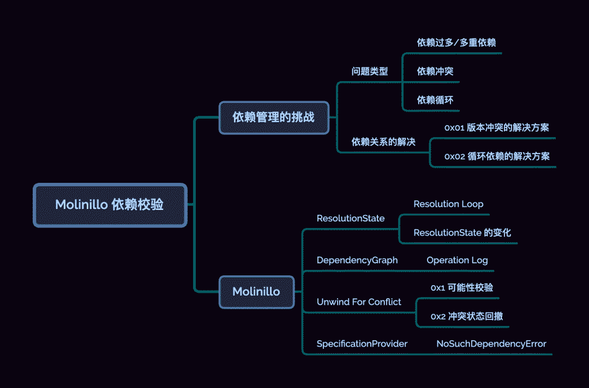

## 引子

通过[「PodSpec 管理策略」](http://mp.weixin.qq.com/s?__biz=MzA5MTM1NTc2Ng==&mid=2458324802&idx=1&sn=dea6f4317864efade0fdfaee4e8c35ab&chksm=870e005bb079894d8b650976ce745798f56b661039ed68527e0415545bf28a72484411dd47f1&scene=21#wechat_redirect)对 CocaPods-Core 的分析，我们大体了解了 `Pod` 是如何被解析、查询与管理的。有了这些整体概念之后，我们就可以逐步深入 `pod install` 的各个细节。

今天我们就来聊聊 `Pod` 的依赖校验工具 --- Molinillo[1]。

开始前，需要聊聊依赖校验的背景。

## 依赖管理的挑战

同大多数包管理工具一样 `Pod` 会将传递依赖的包用扁平化的形式，安装至 workspace 目录 (即：`Pods/`)。

**依赖传递**：`pod A` 依赖于 `pod B`，而 `pod B` 依赖 `Alamofire`。

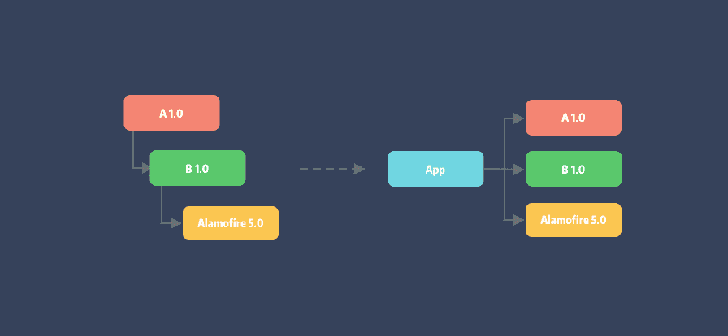

可以看到，经依赖解析原有的依赖树被拍平了，安装在同层目录中。

然而在大型项目中，遇到的更多情况可能像下面这样：

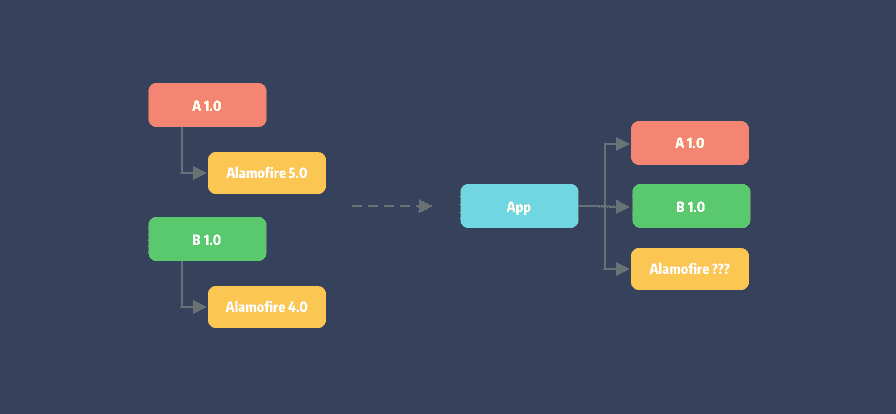

**依赖冲突：** 即 `pod A` 和 `pod B` 分别依赖不同版本的 `Alamofire`。这就是 **依赖地狱[2]** 的开始。

> 依赖地狱：指在操作系统中由于软件之间的依赖性不能被满足而引发的问题。

随着项目的迭代，我们不断引入依赖并最终形成错综复杂的网络。这使得项目的依赖性解析变得异常困难，甚至出现 致命错误[3]。

那么，产生的问题有哪些类型 ？

### 问题类型

#### 依赖过多/多重依赖

即项目存在大量依赖关系，或者依赖本身有其自身依赖（依赖传递），导致依赖层级过深。像微信或淘宝这样的超级应用，其中的单一业务模块都可能存在这些问题，这将使得依赖解析过于复杂，且容易产生依赖冲突和依赖循环。

#### 依赖冲突

即项目中的两个依赖包无法共存的情况。可能两个依赖库内部的代码冲突，也可能其底层依赖互相冲突。上面例子中因 `Alamofire` 版本不同产生的问题就是依赖冲突。

#### 依赖循环

即依赖性关系形成一个闭合环路。如下图三个 pod 库之间互相依赖产生循环：

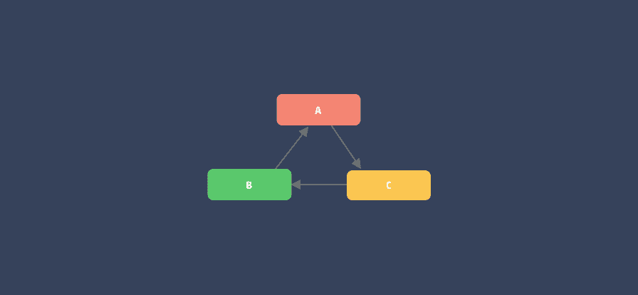

要判断依赖关系中是否存在依赖环，则需要通依赖仲裁算法来解决。

### 依赖关系的解决

对于依赖过多或者多重依赖问题，我们可通过合理的架构和设计模式来解决。而**依赖校验**主要解决的问题为：

  1. 检查依赖图是否存在版本冲突；
  2. 判断依赖图是否存在循环依赖；

#### 版本冲突的解决方案

对于版本冲突可通过修改指定版本为带兼容性的版本范围问题来避免。如上面的问题有两个解决方案：

  * 通过修改两个 `pod` 的 `Alamofire` 版本约束为 `~> 4.0` 来解决。
  * 去除两个 `pod` 的版本约束，交由项目中的 `Podfile` 来指定。

不过这样会有一个隐患，由于两个 `Pod` 使用的主版本不同，可能带来 API 不兼容，导致 `pod install`
即使成功了，最终也无法编译或运行时报错。

还有一种解决方案，是基于语言特性来进行依赖性隔离。如 npm 的每个传递依赖包如果冲突都可以有自己的 `node_modules` 依赖目录，即一个依赖库可以存在多个不同版本。

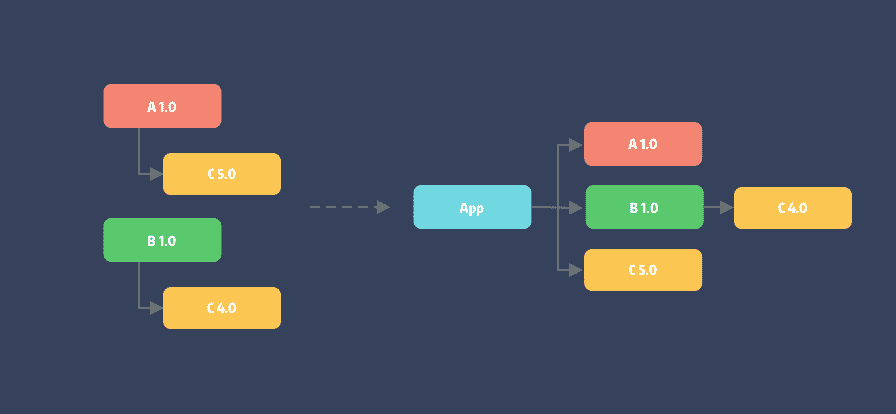

#### 循环依赖的解决方案

循环依赖则需要需要进行数学建模生成 `DAG` 图，利用拓扑排序的拆点进行处理。通过确定依赖图是否为 `DAG` 图，来验证依赖关系的合理性。

一个 DAG 图的示例：

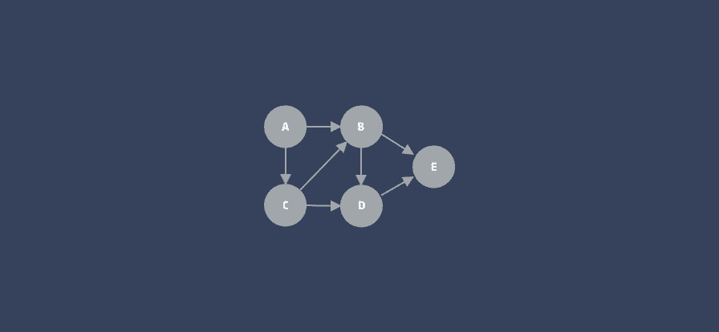

> DAG 是图论中常见的一种描述问题的结构，全称 **有向无环图 （Directed Acyclic Graph）**。想了解更多，可查看冬瓜的文章
> [「从拓扑排序到 Carthage 依赖校验算法」](http://mp.weixin.qq.com/s?__biz=MzA5MTM1NTc2Ng==&mid=2458322279&idx=1&sn=54ff9fdaec62b73bd4f5389e0f42abe8&chksm=870e0a7eb0798368dace023c2223e0acbe6849d156fb6c6b9bbf8dcaa2cb9b9fa9b8903cdcb9&scene=21#wechat_redirect)。

另外，各种包管理工具的依赖校验算法也各不相同，有如 Dart 和 SwiftPM 所使用的 PubGrub[4]，作者号称其为下一代依赖校验算法，Yarn 的 Selective dependency resolutions[5]，还有我们今天聊到的 Molinillo。

## Molinillo

Molinillo 作为通用的依赖解析工具，它不仅应用在 CocoaPods 中，在 Bundler 1.9 版本也采用 Molinillo。另外，值得注意的是 Bundler 在 Ruby 2.6 中被作为了默认的 Gem 工具内嵌。可以说 Ruby 相关的依赖工具都通过 Molinillo 完成依赖解析。

### ResolutionState

Molinillo 算法的核心是基于回溯 (Backtracking)[6] 和 [向前检查 (forward checking)](https://en.wikipedia.org/wiki/Look-ahead_(backtracking "向前检查(forward checking)"))，整个过程会追踪栈中的两个状态 `DependencyState` 和 `PossibilityState`。

```ruby

module Molinillo  
  ## 解析状态  
  ResolutionState = Struct.new(  
    ## [String] 当前需求名称  
    :name,  
    ## [Array<Object>] 未处理的需求  
    :requirements,  
    ## [DependencyGraph] 依赖关系图  
    :activated,  
    ## [Object] 当前需求  
    :requirement,  
    ## [Object] 满足当前需求的可能性  
    :possibilities,  
    ## [Integer] 解析深度  
    :depth,  
    ## [Hash] 未解决的冲突，以需求名为 key  
    :conflicts,  
    ## [Array<UnwindDetails>] 记录着未处理过的需要用于回溯的信息  
    :unused_unwind_options  
  )  
  
  class ResolutionState  
    def self.empty  
      new(nil, [], DependencyGraph.new, nil, nil, 0, {}, [])  
    end  
  end  
  
  ## 记录一组需求和满足当前需求的可能性  
  class DependencyState < ResolutionState  
  ## 通过不断 pop 过滤包含的可能性，找出最符合需求的解  
    def pop_possibility_state  
      PossibilityState.new(  
        name,  
        requirements.dup,  
        activated,  
        requirement,  
        [possibilities.pop],  
        depth + 1,  
        conflicts.dup,  
        unused_unwind_options.dup  
      ).tap do |state|  
        state.activated.tag(state)  
      end  
    end  
  end  
  
  ## 仅包含一个满足需求的可能性  
  class PossibilityState < ResolutionState  
  end  
end  
```

光看 state 定义大家可能觉得云里雾里。这里很有必要解释一下：

我们说的需求 (`requirement`) 到底是指什么呢？大家可以理解为在 `Podfile` 中声明的 pod。**之所以称为需求，是由于无法判断定义的 dependency 是否合法。** 假设它合法，又是否存在符合需求限制版本的解呢 ？即是否存在对应的 `PodSpec` 我们不而知。因此，这些未知状态称为统一被可能性 `possibility`。

> Tips: 了解这个概念非常重要，这也是笔者在几乎写完本文的情况下，才想明白这些变量名的意义。💔

#### Resolution Loop

我们先通过图来了解一下 Molinillo 的核心流程 (先忽略异常流）：

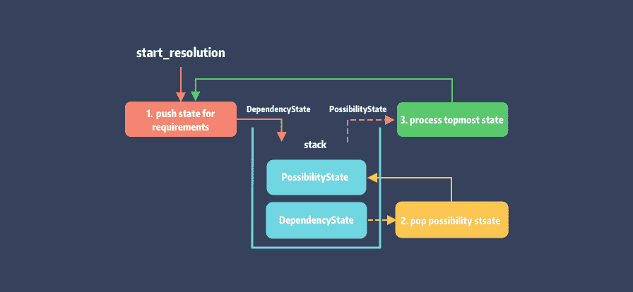

可以看到整个流程就是不断的将 requirement 的 possibility 过滤和处理，一层层剥离转换为 `DependencyState`，如此循环往复。

Molinillo 的入口为 `Resolution::resolve` 方法，也是上图对应的实现，逻辑如下：

```ruby
## lib/molinillo/resolution.rb  
  
def resolve  
  ## 1. 初始化 timer 统计耗时初始位置打点  
  ## 2. 内部会调用 push_initial_state 初始化 DependencyState 压栈  
  ## 3. 初始化 DependencyGraph 实例  
  start_resolution  
  
  while state  
    break if !state.requirement && state.requirements.empty?  
    ## 输出一个进度占位  
    indicate_progress  
    if state.respond_to?(:pop_possibility_state) ## DependencyState  
      ## 调试日志入口  
      ## 如果环境变量 MOLINILLO_DEBUG 是非 nil 就输出 log  
      ## 这里的调试日志有助于排查 Pod 组件的依赖问题  
      debug(depth) { "Creating possibility state for #{requirement} (#{possibilities.count} remaining)" }  
      state.pop_possibility_state.tap do |s|  
        if s  
          states.push(s)  
          activated.tag(s)  
        end  
      end  
    end  
    ## 处理栈顶 Possibility State  
    process_topmost_state  
  end  
 ## 遍历 Dependency Graph   
  resolve_activated_specs  
ensure  
  end_resolution  
end  
```

  1. 首先 `#start_resolution` 会初始化 timer 用于统计解析耗时，在这个方法中还会调用 `#push_initial_state` 初始化 `DependencyState` 入栈，以及 `DependencyGraph` 初始化。
  2. 获取栈顶 `state` 检查是否存在待解析需求，接着调用 `#pop_possibility_state` 进行 `state` 转换并入栈。
  3. 调用 `#process_topmost_state` 处理栈顶的 Possibility State，如果当前 state 可被激活，则将该 Possiblity 存入 `DependencyGraph` 对应顶点的 payload 中。否则判定为冲突，需要进行状态回滚。
  4. 循环直到 state 的可能性全部处理结束。
  5. 调用 `#resolve_activated_specs` ，遍历 `DependencyGraph` 以存储更新需求的可能性，解析结束。

当然，依赖处理并非这么简单，复杂的过滤和回溯逻辑都隐藏在 `#process_topmost_state` 中。

#### ResolutionState 的变化

其实从 `ResolutionState` 的定义能够看出，为了方便回溯和数据还原，state 是以 Struct 结构定义的。同时在每次 `#pop_possibility_state` 中，通过 #dup[7] 对 diff 数据进行了复制。

这里用依赖传递的例子来展示解析后状态栈的变化。假设我们在 Podfile 中声明了 `A，B，C` 三个依赖，他们的关系为：`A -> B -> C`。

```ruby
target 'Example' do  
  pod 'C', :path => '../'  
  pod 'B', :path => '../'    
  pod 'A', :path => '../’  
end  
```

在 `#resolve_activated_specs` 方法设置断点，在解析结束时打印状态栈 `@states`（简化处理后）如下：

```ruby
 [  
   #<struct Molinillo::DependencyState name="C", requirements=[B, A], ...>,   
   #<struct Molinillo::PossibilityState name="C", requirements=[B, A], ...>  
   #<struct Molinillo::DependencyState name="B", requirements=[A], ...>  
   #<struct Molinillo::PossibilityState name="B", requirements=[A], ...>  
   ## 省略了 C、C、A、A...  
   #<struct Molinillo::DependencyState name="B", requirements=[], ...,   
   #<struct Molinillo::PossibilityState name="B", requirements=[], ...,   
   #<struct Molinillo::DependencyState name="", requirements=[], ...,   
]  
```

可以看到栈内保存的 states 中 `DependencyState` 与 `PossibilityState` 是成对出现的。不过最后入栈的`DependencyState` 是一个空状态，requirements 也为空，此时无法再 pop state 循环结束。

### DependencyGraph

其实包括 Molinillo 在内的依赖解析工具都会在运行期间对依赖关系进行建模来构建依赖图，毕竟这是我们表达依赖关系的方式。那么 DependencyGraph (以下简称 `dg` ) 是如何定义：

```ruby
module Molinillo  
  
  class DependencyGraph  
    ## 有向边  
    Edge = Struct.new(:origin, :destination, :requirement)  
    ## @return [{String => Vertex}] 用字典保存顶点, key 为顶点名称(即 requirement.name)  
    attr_reader :vertices  
    ## @return [Log] 操作日志  
    attr_reader :log  
  ...  
end  
```

另外 **Vertex** 定义如下：

```ruby
module Molinillo  
  class DependencyGraph  
    class Vertex  
      attr_accessor :name  
      ## @return [Object] 顶点的元数据，reqiuremnt 对应的 possiblity  
      attr_accessor :payload  
      ## @return [Array<Object>] 需要依赖该顶点可能性能的需求  
      attr_reader :explicit_requirements  
      ## @return [Boolean] 是否为根结点  
      attr_accessor :root  
      ## @return [Array<Edge>] 出度 {Edge#origin}  
      attr_accessor :outgoing_edges  
      ## @return [Array<Edge>] 入度 {Edge#destination}  
      attr_accessor :incoming_edges  
      ## @return [Array<Vertex>] 入度的起点  
      def predecessors  
        incoming_edges.map(&:origin)  
      end  
      ## @return [Array<Vertex>] 出度的终点  
      def successors  
        outgoing_edges.map(&:destination)  
      end  
      ...  
    end  
  end  
end  
```

熟悉图论的同学都了解，图的保存常用的方式是**邻接表**和**邻接矩阵**。

Molinillo 则通过 map + list，vertext 字典与边集数组来保存。如果仅用边集数组来查询顶点本身效率并不高，好在顶点直接用了字典保存了。

Molinillo 通过栈来维护解析状态，不断将解析结果 possibility 存入 dg 的 payload 中，同时记录了各个顶点的依赖关系，即 dg 的出度和入度。

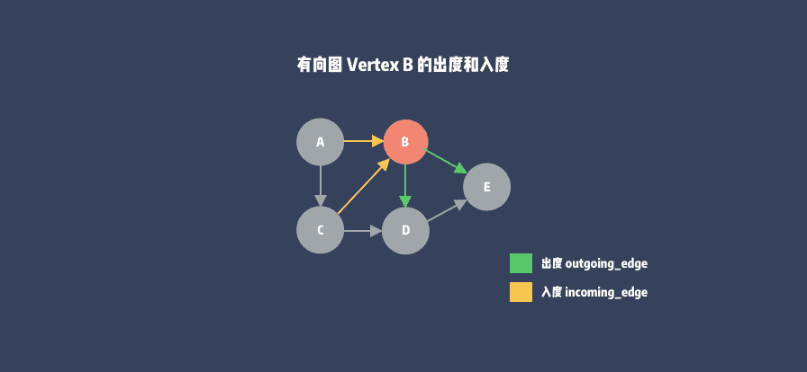

>   * 在有向图中对于一个顶点来说，如果 Molinillo 则通过 map + list，v一条边的终点是这个顶点，这条边就是这个顶点的入度；

>   * 在有向图中对于一个顶点来说，如果一条边的起点是这个顶点，这条边就是这个顶点的出度。

当成功解析的一刻，dg 图也构建完毕。

#### Operation Log

当解析过程出现冲突时，状态栈要回溯直接 pop 一下就完事了，而 dg 咋办 ? 它可没法 pop。

好在 Molinillo 设计了 Operation Log 机制，通过 Log 记录 dg 执行过的操作。这些操作类型包括：`AddEdgeNoCircular`、`AddVertex`、`DeleteEdge`、`DetachVertexNamed`、`SetPayload`、`Tag`。

Log 结构如下：

```ruby
## frozen_string_literal: true  
  
module Molinillo  
  class DependencyGraph  
    class Log  
      def initialize  
        @current_action = @first_action = nil  
      end  
  
      def pop!(graph)  
        return unless action = @current_action  
        unless @current_action = action.previous  
          @first_action = nil  
        end  
        action.down(graph)  
        action  
      end  
  
      ## 回撤到指定的操作节点  
      def rewind_to(graph, tag)  
        loop do  
          action = pop!(graph)  
          raise "No tag #{tag.inspect} found" unless action  
          break if action.class.action_name == :tag && action.tag == tag  
        end  
      end  
  
      private  
  
      ## 插入操作节点  
      def push_action(graph, action)  
  
        action.previous = @current_action  
        @current_action.next = action if @current_action  
        @current_action = action  
        @first_action ||= action  
        action.up(graph)  
      end  
      ...  
    end  
  end  
end  
```

标准的链表结构，Log 提供了当前指针 `@current_action` 和表头指针 `@first_action` 便于链表的遍历。接着看看Action：

```ruby
## frozen_string_literal: true  
  
module Molinillo  
  class DependencyGraph  
  
    class Action  
      ## @return [Symbol] action 名称  
      def self.action_name  
        raise 'Abstract'  
      end  
  
      ## 对图执行正向操作  
      def up(graph)  
        raise 'Abstract'  
      end  
  
      ## 撤销对图的操作  
      def down(graph)  
        raise 'Abstract'  
      end  
         
      ## @return [Action,Nil] 前序节点  
      attr_accessor :previous  
      ## @return [Action,Nil] 后序节点  
      attr_accessor :next  
    end  
  end  
end  
```

Action 本身是个抽象类，Log 通过 Action 子类的 `#up`、`#down` 来完成对 dg 的操作和撤销。所提供的 Action 中除了**Tag** 特殊一点，其余均是对 dg 的顶点和边的 CURD 操作。这里以 `AddVertex` 为例：

```ruby
## frozen_string_literal: true  
  
require_relative 'action'  
module Molinillo  
  class DependencyGraph  
  ## @!visibility private  
    class AddVertex < Action ## :nodoc:  
      def self.action_name  
        :add_vertex  
      end  
        
      ## 操作添加顶点  
      def up(graph)  
        if existing = graph.vertices[name]  
          @existing_payload = existing.payload  
          @existing_root = existing.root  
        end  
        vertex = existing || Vertex.new(name, payload)  
        graph.vertices[vertex.name] = vertex  
        vertex.payload ||= payload  
        vertex.root ||= root  
        vertex  
      end  
  
      ## 删除顶点  
      def down(graph)  
        if defined?(@existing_payload)  
          vertex = graph.vertices[name]  
          vertex.payload = @existing_payload  
          vertex.root = @existing_root  
        else  
          graph.vertices.delete(name)  
        end  
      end  
  
      ## @return [String] 顶点名称 (或者说依赖名称)  
      attr_reader :name  
      ## @return [Object] 顶点元数据  
      attr_reader :payload  
      ## @return [Boolean] 是否为根  
      attr_reader :root  
  ...  
    end  
  end  
end  
```

Action 子类均声明为 private 的，通过 Log 提供的对应方法来执行。

```ruby 
def tag(graph, tag)  
  push_action(graph, Tag.new(tag))  
end  
  
def add_vertex(graph, name, payload, root)  
  push_action(graph, AddVertex.new(name, payload, root))  
end  
  
def detach_vertex_named(graph, name)  
  push_action(graph, DetachVertexNamed.new(name))  
end  
  
def add_edge_no_circular(graph, origin, destination, requirement)  
  push_action(graph, AddEdgeNoCircular.new(origin, destination, requirement))  
end  
  
def delete_edge(graph, origin_name, destination_name, requirement)  
  push_action(graph, DeleteEdge.new(origin_name, destination_name, requirement))  
end  
  
def set_payload(graph, name, payload)  
  push_action(graph, SetPayload.new(name, payload))  
end  
```

最后 log 声明的这些方法会由 dg 直接调用，如 `#addVertext`:

```ruby
module Molinillo  
  class DependencyGraph  
    def add_vertex(name, payload, root = false)  
      log.add_vertex(self, name, payload, root)  
    end  
    ...  
  end  
end  
```

### Unwind For Conflict

有了 op log 之后我们还需要一样重要的东西：**哨兵节点**。由 Tag 类来承载：

```ruby
## frozen_string_literal: true  
module Molinillo  
  class DependencyGraph  
    ## @!visibility private       
    class Tag < Action  
  
      def up(graph)  
      end  
         
      def down(graph)  
      end  
  
      attr_reader :tag  
  
      def initialize(tag)  
        @tag = tag  
      end  
    end  
  end  
end  
```

作为哨兵节点 Tag 的 **#up** 与 **#down** 操作总是成对出现的。在 Molinillo 中有两处需要进行状态回溯，分别为可能性校验和冲突状态回撤。

#### 可能性校验

`#possibility_satisfies_requirements?` 方法用于冲突产生的前后，用于判断该可能性能否同时满足多个需求：

```ruby
def possibility_satisfies_requirements?(possibility, requirements)  
  name = name_for(possibility)  
  
  activated.tag(:swap)  
  activated.set_payload(name, possibility) if activated.vertex_named(name)  
  satisfied = requirements.all? { |r| requirement_satisfied_by?(r, activated, possibility) }  
  activated.rewind_to(:swap)  
  
  satisfied  
end  
```

为了直观的说明参数，我们举个例子。`Case 1`假设 `Podfile` 中存在 pod A 和 B，且 A、B 分别依赖了 Alamofire 3.0 和 4.0，那么对应的参数为：

```ruby
possibility: #<Pod::Specification name="Alamofire" version="4.0.0">  
requirements: [  
 <Pod::Dependency name=Alamofire requirements=~> 3.0 source=nil external_source=nil>,   <Pod::Dependency name=Alamofire requirements=~> 4.0 source=nil external_source=nil>  
]  
``` 

现在来看方法实现：

  1. 首先 `activated` 就是 Podfile 解析生成的 dg 对象，这里将 symbol `:swap` 作为标识用于稍后的回撤；
  2. 调用 `#set_payload` 将顶点 Alamofire 的 payload 修改为 possibility 版本；
  3. 遍历 requirements 并调用代理的 `#requirement_satisfied_by` 以校验 possiblity 在 dg 中存在的可能性；
  4. 调用 `#rewind_to` 将顶点的修改回撤至 `:swap` 前的状态，最后返回检验结果。

> Tips: 此处的代理是指 CocoaPods，它做为 Molinillo 的 client 实现了很多代理方法，后续会聊到。

作为候选项 possibility 当然不止一个，代理提供的查询方法 `#search_for(dependency)` 会返回所有符合 requiremnt 名称的依赖。在 CocoaPods 中，就是通过 `Pod::Source` 查询获得所有版本的 `Pod::Specification`，具体可以看上一篇文章：PodSpec 管理策略[8]。

#### 冲突状态回撤

依赖解析过程出现冲突属于正常情况，此时通过回撤也许可以避免部分冲突，找出其它可行解。Molinillo 通过定义 `Conflict` 来记录当前的冲突的必要信息：

```ruby
Conflict = Struct.new(  
  :requirement,  
  :requirements,  
  :existing,  
  :possibility_set,  
  :locked_requirement,  
  :requirement_trees,  
  :activated_by_name,  
  :underlying_error  
)  
``` 

重点关注 `underlying_error`，它记录了所拦截的指定类型错误，并用于状态回撤时的一些判断依据(后面会解释)。这里我们先看一下定义的错误类型：

```ruby
## frozen_string_literal: true  
  
module Molinillo  
  
  class ResolverError < StandardError; end  
     
  ## 错误信息："Unable to find a specification for `#{dependency}`"  
  class NoSuchDependencyError < ResolverError ... end  
          
  ## 错误信息："There is a circular dependency between ..."  
  class CircularDependencyError < ResolverError ... end  
          
  ## 当出现版本冲突时抛出  
  ## 错误信息："Unable to satisfy the following requirements:\n\n ..."  
  class VersionConflict < ResolverError ... end  
end  
```

除了主动拦截错误之外，possiblity 不存在时也会主动生成冲突，同时进入状态回撤处理。发生冲突后调用 `#create_conflict` 和 `#unwind_for_conflict` 两个方法分别用于生成 Conflict 对象和状态回撤。

```ruby
def process_topmost_state  
  if possibility  
    attempt_to_activate  
  else  
    create_conflict  
    unwind_for_conflict  
  end  
rescue CircularDependencyError => underlying_error  
  create_conflict(underlying_error)  
  unwind_for_conflict  
end  
  
def attempt_to_activate  
  debug(depth) { 'Attempting to activate ' + possibility.to_s }  
  existing_vertex = activated.vertex_named(name)  
  if existing_vertex.payload  
    debug(depth) { "Found existing spec (#{existing_vertex.payload})" }  
    attempt_to_filter_existing_spec(existing_vertex)  
  else  
    latest = possibility.latest_version  
    possibility.possibilities.select! do |possibility|  
      requirement_satisfied_by?(requirement, activated, possibility)  
    end  
    if possibility.latest_version.nil?  
      ## ensure there's a possibility for better error messages  
      possibility.possibilities << latest if latest  
      create_conflict  
      unwind_for_conflict  
    else  
      activate_new_spec  
    end  
  end  
end  
  
def attempt_to_filter_existing_spec(vertex)  
  filtered_set = filtered_possibility_set(vertex)  
  if !filtered_set.possibilities.empty?  
    activated.set_payload(name, filtered_set)  
    new_requirements = requirements.dup  
    push_state_for_requirements(new_requirements, false)  
  else  
    create_conflict  
    debug(depth) { "Unsatisfied by existing spec (#{vertex.payload})" }  
    unwind_for_conflict  
  end  
end  
```

可以看到这 3 个方法中处理了 4 处冲突的情况。其中 `#process_topmost_state` 方法拦截了 **CircularDependencyError** 并将其记录在 Conflict 的 `underlying_error` 中，其余的都是因为 possibility 可行解不存在而主动抛出冲突。

我们简化成下面的状态图：

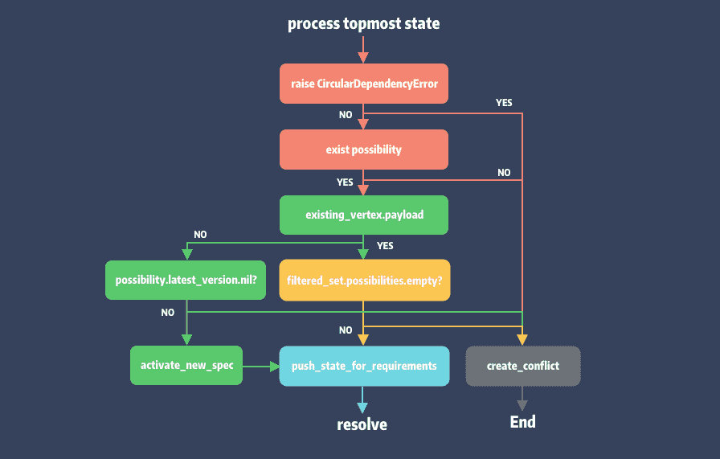

可以理解 possiblity 状态机，通过不断检查可能性，一旦出错主动生成异常。为什么要这么做 ？因为状态回溯的成本是很高的，一旦发生意味着我们之前检查工作可能就白费了。这也是 Molinillo 前向查询的充电，通过提早暴露问题，提前回溯。

**unwind_for_conflict**

了解了冲突时如何产生之后，接下来该 `#unwind_for_conflict` 登场了：

```ruby
def unwind_for_conflict  
  details_for_unwind = build_details_for_unwind  
  unwind_options = unused_unwind_options  
  debug(depth) { "Unwinding for conflict: #{requirement} to #{details_for_unwind.state_index / 2}" }  
  conflicts.tap do |c|  
    sliced_states = states.slice!((details_for_unwind.state_index + 1)..-1)  
    raise_error_unless_state(c)  
    activated.rewind_to(sliced_states.first || :initial_state) if sliced_states  
    state.conflicts = c  
    state.unused_unwind_options = unwind_options  
    filter_possibilities_after_unwind(details_for_unwind)  
    index = states.size - 1  
    @parents_of.each { |_, a| a.reject! { |i| i >= index } }  
    state.unused_unwind_options.reject! { |uw| uw.state_index >= index }  
  end  
end  
```

冲突回溯就涉及到前面说过的两个状态需要处理，分别是状态栈 `@states` 和 dg 内容的回溯。`@state` 本身是数组实现的，其元素是各个状态的state, 要回溯到指定的 state 则要利用 `state_index`，它保存在 `UnwindDetails` 中：

```ruby
UnwindDetails = Struct.new(  
  :state_index,  
  :state_requirement,  
  :requirement_tree,  
  :conflicting_requirements,  
  :requirement_trees,  
  :requirements_unwound_to_instead  
)  
  
class UnwindDetails  
  include Comparable  
  ...  
end  
```

这里解释一下 requirement_trees，这里是指以当前需求作为依赖的需求。以上面的 `Case 1` 为例，当前冲突的 requirement 就是 Alamofire，对应 requirement_trees 就是依赖了 Alamofire 的 Pod A 和 B：

```ruby
[  
  [  
    <Pod::Dependency name=A requirements=nil source=nil external_source=nil>,  
    <Pod::Dependency name=Alamofire requirements=~> 3.0 ...>  
  ],[  
    <Pod::Dependency name=B ...>,  
    <Pod::Dependency name=Alamofire requirements=~> 4.0 ...>  
  ]  
]  
```

`#build_details_for_unwind` 主要用于生成 UnwindDetails，大致流程如下：

```ruby
def build_details_for_unwind  
  current_conflict = conflicts[name]  
  binding_requirements = binding_requirements_for_conflict(current_conflict)  
  unwind_details = unwind_options_for_requirements(binding_requirements)  
  
  last_detail_for_current_unwind = unwind_details.sort.last  
  current_detail = last_detail_for_current_unwind  
  
  ## filter & update details options  
  ...  
  current_detail  
end  
```

  1. 以 conflict.requirement 为参数，执行 `#binding_requirements_for_conflict` 以查找出存在冲突的需求 `binding_requirements`。查询是通过代理的 `#search_for(dependency)` 方法；
  2. 通过 `#unwind_options_for_requirements` 遍历查询到的 `binding_requirements` 获取 requirement 对应的 state 以及该 state 在栈中的 index，用于生成 `unwind_details`；
  3. 对 `unwind_details` 排序，取 last 作为 `current_detail` 并进行其他相关的修改。

**关于如何获取 `state_index` 和 `unwind_details`**:
    
```ruby
def unwind_options_for_requirements(binding_requirements)  
  unwind_details = []  
  
  trees = []  
  binding_requirements.reverse_each do |r|  
    partial_tree = [r]  
    trees << partial_tree  
    unwind_details << UnwindDetails.new(-1, nil, partial_tree, binding_requirements, trees, [])  
    ## 1.1 获取 requirement 对应的 state  
    requirement_state = find_state_for(r)  
    ## 1.2 确认 possibility 存在  
    if conflict_fixing_possibilities?(requirement_state, binding_requirements)  
      ## 1.3 生成 detail 存入 unwind_details  
      unwind_details << UnwindDetails.new(  
        states.index(requirement_state),  
        r,  
        partial_tree,  
        binding_requirements,  
        trees,  
        []  
      )  
    end  
      
    ## 2. 沿着 requirement 依赖树的父节点获取其 state  
    parent_r = parent_of(r)  
    next if parent_r.nil?  
    partial_tree.unshift(parent_r)  
    requirement_state = find_state_for(parent_r)  
    ## 重复 1.2， 1.3 步骤 ...  
    
    ## 6. 沿着依赖树，重复上述操作  
    grandparent_r = parent_of(parent_r)  
    until grandparent_r.nil?  
      partial_tree.unshift(grandparent_r)  
      requirement_state = find_state_for(grandparent_r)  
      ## 重复 1.2、1.3 步骤 ...  
      parent_r = grandparent_r  
      grandparent_r = parent_of(parent_r)  
    end  
  end  
  
  unwind_details  
end  
```

确认 `state_index` 后，栈回溯反而比较简单了，直接 `#slice!` 即可：

```ruby
sliced_states = states.slice!((details_for_unwind.state_index + 1)..-1)  
```

dg 回撤还是 `activated.rewind_to(sliced_states.first || :initial_state) if sliced_states`。回撤结束后，流程重新回到 Resolution Loop。

### SpecificationProvider

最后一节简单聊聊 SpecificationProvider。为了更好的接入不同平台，同时保证 Molinillo 的通用性和灵活性，作者将依赖描述文件查询等逻辑抽象成了代理。

SpecificationProvider 作为单独的 Module 声明了接入端必须实现的 API：

```ruby
module Molinillo  
   module SpecificationProvider  
  
    def search_for(dependency)  
      []  
    end  
  
    def dependencies_for(specification)  
      []  
    end  
    ...  
  end  
end  
```

而 Provider 就是在 Molinillo 初始化的时候注入的：

```ruby
require_relative 'dependency_graph'  
  
module Molinillo  
  
  class Resolver  
    require_relative 'resolution'  
  
    attr_reader :specification_provider  
    attr_reader :resolver_ui  
  
    def initialize(specification_provider, resolver_ui)  
      @specification_provider = specification_provider  
      @resolver_ui = resolver_ui  
    end  
  
    def resolve(requested, base = DependencyGraph.new)  
      Resolution.new(specification_provider,  
                     resolver_ui,  
                     requested,  
                     base).  
        resolve  
    end  
  end  
end  
```

而在 CocoaPods 中的初始化方法则是：

```ruby
## /lib/CocoaPods/resolver.rb  
def resolve  
  dependencies = @podfile_dependency_cache.target_definition_list.flat_map do |target|  
    @podfile_dependency_cache.target_definition_dependencies(target).each do |dep|  
      next unless target.platform  
      @platforms_by_dependency[dep].push(target.platform)  
    end  
  end.uniq  
  @platforms_by_dependency.each_value(&:uniq!)  
  @activated = Molinillo::Resolver.new(self, self).resolve(dependencies, locked_dependencies)  
  resolver_specs_by_target  
rescue Molinillo::ResolverError => e  
  handle_resolver_error(e)  
end  
```

该方法则处于 pod install 中的 resolve dependencies 阶段：


#### NoSuchDependencyError

另外，为了更好的处理产生的异常，同时保证核心逻辑对 provider 的无感知，Molinillo 将代理方法做了一层隔离，并且对异常做了统一拦截：

```ruby
module Molinillo  
  module Delegates  
  
    module SpecificationProvider  
  
      def search_for(dependency)  
        with_no_such_dependency_error_handling do  
          specification_provider.search_for(dependency)  
        end  
      end  
  
      def dependencies_for(specification)  
        with_no_such_dependency_error_handling do  
          specification_provider.dependencies_for(specification)  
        end  
      end  
  
      ...  
  
      private  
  
      def with_no_such_dependency_error_handling  
        yield  
      rescue NoSuchDependencyError => error  
        if state  
          ...  
        end  
        raise  
      end  
    end  
  end  
end  
```

## 总结

本篇文章从依赖解析的状态维护、状态存储、状态回溯三个维度来解构 Molinillo 的核心逻辑，它们分别对应了 ResolutionState、DependencyGraph、UnwindDetail 这三种数据结构。

一开始写这篇内容时，头脑中对于这些概念是未知的，因为一开始就直接看了作者对 Molinillo 的架构阐述[9]更是完全找不到思绪，好在我有 VSCode ！

最终依据不同 Case 下的数据呈现，一点点的进行源码调试，大致摸清的 Molinillo 的状态是如何变化转移的。最后一点，英文和数据结构还是很重要的，possiblity 你理解了吗 ？

## 知识点问题梳理

这里罗列了五个问题用来考察你是否已经掌握了这篇文章，如果没有建议你加入**收藏**再次阅读：

  1. 说说 Resolution 栈中的 state 是如何转移的 ？
  2. DependencyGraph 的数据通过什么方式进行回撤的 ？
  3. `#process_topmost_state` 处理了几种 conflict 情况 ？
  4. UnwindDetail 的 state_index 是如何获取的 ？
  5. 作者如何利用 SpecificationProvider 来解偶的 ？

## 参考资料

* [Molinillo](https://github.com/CocoaPods/Molinillo)
* [依赖地狱](https://www.wikiwand.com/zh-hans/%E7%9B%B8%E4%BE%9D%E6%80%A7%E5%9C%B0%E7%8B%B1)
* [致命错误](https://www.wikiwand.com/en/Fatal_exception_error)
* [PubGrub](https://medium.com/@nex3/pubgrub-2fb6470504f)
* [Selective dependency resolutions](https://classic.yarnpkg.com/en/docs/selective-version-resolutions)
* [回溯 (Backtracking)](https://en.wikipedia.org/wiki/Backtracking)
* [`#dup`](https://stackoverflow.com/questions/10183370/whats-the-difference-between-rubys-dup-and-clone-methods)
* [PodSpec 管理策略](https://zhuanlan.zhihu.com/p/275680356)
* [Molinillo 的架构阐述](https://github.com/CocoaPods/Molinillo/blob/master/ARCHITECTURE.md)

<hr>  

#### <p>原文出处：<a href='https://mp.weixin.qq.com/s?__biz=MzA5MTM1NTc2Ng==&mid=2458325182&idx=1&sn=c8cbbdef95a1f76e2a3b64590216e10b&chksm=870e1fa7b07996b1e93124426c37495841f30d5deb84a8a31b687ea77c5e5036141a88823871&scene=178&cur_album_id=1477103239887142918#rd' target='blank'>8. Xcode 工程文件解析</a></p>

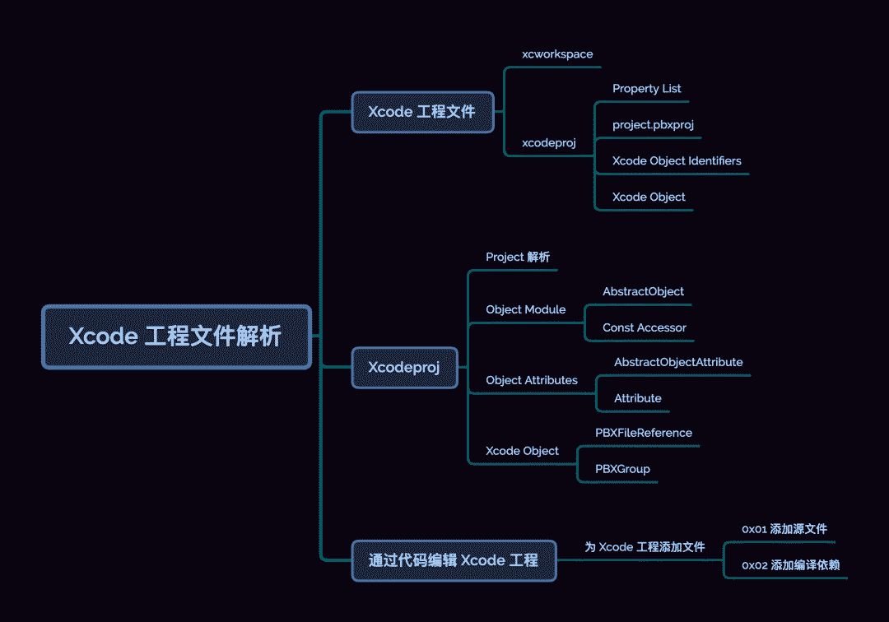

## 引子

在[「Molinillo 依赖校验」](http://mp.weixin.qq.com/s?__biz=MzA5MTM1NTc2Ng==&mid=2458325057&idx=1&sn=8bbfb3b55f767332f12081344d42b470&chksm=870e1f58b079964e331b6888b396441dbf3aa3e286915ff9560bbc1417c573a683ef7ddc5827&scene=21#wechat_redirect)通过后，CocoaPods 会根据确定的 PodSpec 下载对应的源代码和资源，并为每个 PodSpec 生成对应的 Xcode Target。本文重点就来聊聊 Xcode Project 的内容构成，以及 xcodeproj[1] 是如何组织 Xcode Project 内容的。

## Xcode 工程文件

早在前文[「Podfile 的解析逻辑」](http://mp.weixin.qq.com/s?__biz=MzA5MTM1NTc2Ng==&mid=2458324199&idx=1&sn=3886bbbcef3640bf97e16fcec34b451f&chksm=870e03feb0798ae84ab4b5dab26dfbe8ebbac0bca8491493fa4919f6069bfef58cd04df5ab34&scene=21#wechat_redirect)中，我们简单介绍过 **Xcode 的工程结构：Workspace、Project、Target 及 Build Setting** 等。

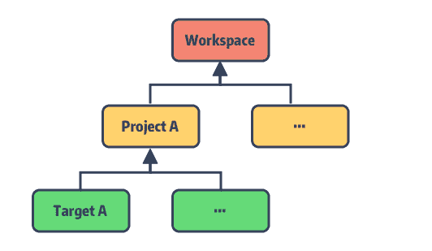

我们先来了解下这些数据在 Xcode 中是如何表示，了解这些结构才能方便我们理解 xcodeproj 的代码设计思路。

### xcworkspace

早在 Xcode 4 之前就出现 workspace bundle 了，只是那会 workspace 仍内嵌于 `.xcodeproj` 中。Xcode 4 之后，我们才对 workspace 单独可见。让我们新建一个 Test.xcodeproj 项目，来看看其目录结构：

```ruby
Test.xcodeproj  
├── project.pbxproj  
├── project.xcworkspace  
│   ├── contents.xcworkspacedata  
│   └── xcuserdata  
│       └── edmond.xcuserdatad  
│           └── UserInterfaceState.xcuserstate  
└── xcuserdata  
    └── edmond.xcuserdatad  
        └── xcschemes  
            └── xcschememanagement.plist  
```

可以发现 `Test.xcodeproj` bundle 内包含 `project.workspace`。而当我们通过 `pod install` 命令成功添加 Pod 依赖后，Xcode 工程目录下会多出 `Test.workspace`，它是 Xcodeproj 替我们生成的，用于管理当前的 `Test.project` 与 `Pods.pbxproj`。新建的 workspace 目录如下：

```ruby
Test.xcworkspace  
└── contents.xcworkspacedata  
```

生成的 workspace 文件夹内部只包含了 `contents.xcworkspacedata`，为 xml 格式的内容：

```xml
<?xml version="1.0" encoding="UTF-8"?>  
<Workspace  
   version = "1.0">  
   <FileRef  
      location = "group:Test.xcodeproj">  
   </FileRef>  
   <FileRef  
      location = "group:Pods/Pods.xcodeproj">  
   </FileRef>  
</Workspace>  
```

在标签 Workspace 下声明了两个 `FileRef` 其地址分别指向了 `Test.xcodeproj` 和 `Pods.xcodeproj`。这里注意的是 `FileRef` 属性的值使用前缀 `group + path` 来修饰的，而内嵌的`project.xcworkspace`，使用 `self` 作为前缀：

```xml
<?xml version="1.0" encoding="UTF-8"?>  
<Workspace  
   version = "1.0">  
   <FileRef  
      location = "self:">  
   </FileRef>  
</Workspace>  
```

另外，当我们用 Xcode 打开项目后，能发现 workspace 目录下会自动生成 `xcuserdata` 目录，它用于保存用户的 Xcode 配置。比如：

  * `UserInterfaceState.xcuserstate`：以二进制的 Plist 保存，用于记录窗口布局等个性化设置。
  * `xcdebugger`：记录各种断点数据。

这也是在日常开发中，经常会选择将 `xcuserdata` 目录 ignore 掉的原因。

### xcodeproj

与 `.xcworkspace` 类似 `.xcodeproj` 同为 Xcode 工程配置的 bundle，接下来重点展开`project.pbxproj`，它记录了 Xcode 工程的各项配置，本质上是一种旧风格的 Plist 文件。

#### Property List

Plist 被设计为人类可读的、可以手工修改的格式，故采用了类似于编程语言的语法将数据序列化为ASCII数据。Plist 最早可追溯到 NeXTSTEP 时期，由于历史原因，目前它支持多种格式，string、binary、array、dictionary 等类型数据。相比于 JSON，Plist 还支持二进制数据的表示，以 `<>` 修饰文本形式的十六进制数，其中字典与数组的区别如下：

```ruby
Array：  
plist => ( "1", "2", "3" )  
json => [ "1", "2", "3" ]  
  
Dictionary：  
plist => { "key" = "value"; ... }  
json => { "key" : "value", ... }  
```

处理 Plist 文件可使用 Unix 提供的 `plutil` 工具。比如将 Plist 文件转成 XML 格式：

```
plutil -convert xml1 -s -r -o project.pbxproj.xml project.pbxproj  
```    

`-convert fmt` 选项支持转换的格式有：xml1、binary1、json、swift、json。

#### project.pbxproj

**pbxproj 文件全称为 Project Builder Xcode Project**，光看第一层元数据比较简单：

```ruby
// !$*UTF8*$!  
{  
 archiveVersion = 1;  
 classes = {  
 };  
 objectVersion = 50;  
 objects = {  
  ...  
   };  
 rootObject = 8528A0D92651F281005BEBA5 /* Project object */;  
}  
``` 

文件以明确的编码信息开头，`archiveVersion` 通常为 1，表示序列化的版本号；`classes` 则似乎一直为空；`objectVersion` 表示所兼容的最低版本的 Xcode，该数字与 Xcode 的版本对应关系如下：

```ruby
53 => 'Xcode 11.4',  
52 => 'Xcode 11.0',  
51 => 'Xcode 10.0',  
50 => 'Xcode 9.3',  
48 => 'Xcode 8.0',  
47 => 'Xcode 6.3',  
46 => 'Xcode 3.2',  
45 => 'Xcode 3.1',  
```

`rootObject` 记录的 16 进制数字，为 project 对象的索引。这里我们可以称其为 Xcode Object Identifier，pbxproj 中的每个 Xcode Object 创建时，都会生成对应唯一标识数字，而上面的 `objects` 字典则记录了整个 Xcode 项目的所有 Xcode Object。

#### Xcode Object Identifiers

Xcode Object Identifier 是用 24 位的 16 进制字符表示，我们暂且称其为 GUID。

> ⚠️ 注意这并不意味着它与其他称为 GUID 的其他事物相似。

生成的 GUID 不仅在项目文件中必须唯一，并且在 Xcode 中同时打开的其他项目文件中也必须唯一，即**跨工程唯一性**。只有这样能避免了多人合作中，同时新增或编辑工程文件带来的问题。这其实是一个有趣的竞争需求，有兴趣的可以查看 Premake[2] 这个项目，它能保证重新生成的项目具有相同的 GUID。

对于 Xcode 使用的 GUID 算法可参考 PBXProj Identifers[3]，它是通过逆向 `DevToolsCore.framework` 获取的，从中可以窥见 GUID 的生成需要依赖 👇 这些数据：

```ruby
struct globalidentifier {  
    int8_t user;            // encoded username  
    int8_t pid;             // encoded current pid ##  
    int16_t _random;        // encoded random value  
    int32_t _time;          // encoded time value  
    int8_t zero;            // zero  
    int8_t host_shift;      // encoded, shifted hostid  
    int8_t host_h;          // high byte of lower bytes of hostid  
    int8_t host_l;          // low byte of lower bytes of hostid  
} __attribute__((packed));  // packed, so we always have a length of 12 bytes  
```

#### Xcode Object

Xcode Object 是指所有记录在 `objects` 字典中的对象 (后续简称为 Object)，内部以 `isa` 来标识类型。同时Xcode 按 `isa` 类型划分出若干 section，以注释的方式分节。

以 `PBXProject` 为例：

```ruby
/* Begin PBXProject section */  
   8528A0D92651F281005BEBA5 /* Project object */ = {  
      isa = PBXProject;  
      ...  
      mainGroup = 8528A0D82651F281005BEBA5;  
      productRefGroup = 8528A0E22651F281005BEBA5 /* Products */;  
      projectDirPath = "";  
      projectRoot = "";  
      targets = (   
         8528A0E02651F281005BEBA5 /* Test */,  
      );  
   };  
/* End PBXProject section */  
```

这里 `Project object` 的索引值正是 `rootObject` 记录的 _8528A0D92651F281005BEBA5_，其 `isa` 类型为 `PBXProject`，`targets` 数组记录了项目需要构建的任务：`Test target`。整个 PBXProject section 就定义在 `objects` 中。

Object 类型的引用关系大致如下图：

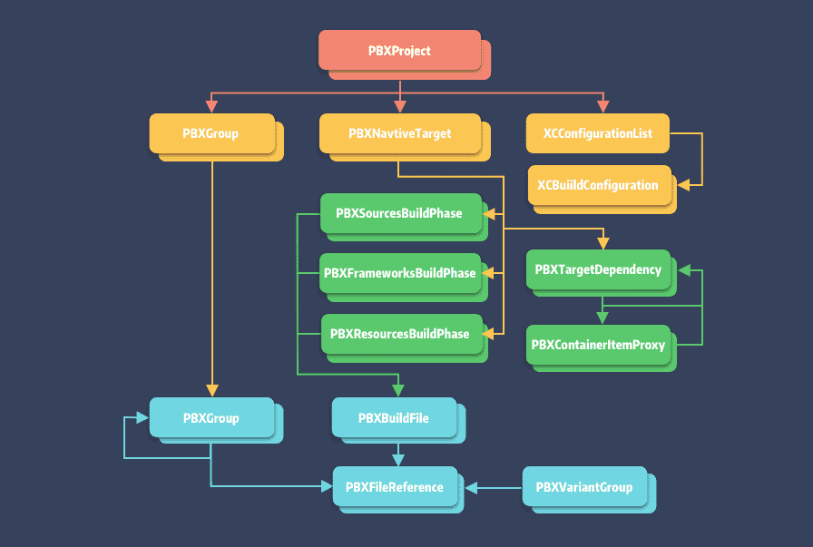

> 关于 pbxproj 内 Object 的详细说明，可参照 Xcode Project File Format[4]。

  * PBXProject：Project 的设置，编译工程所需信息
  * PBXNativeTarget：Target 的设置
  * PBXTargetDependency：Target 依赖
  * PBXContainerItemProxy：部署的元素
  * XCConfigurationList：构建配置相关，包含 project 和 target 文件
  * XCBuildConfiguration：编译配置，对应 Xcode 的 Build Setting 内容
  * PBXVariantGroup：国际化对照表或 `.storyboard` 文件
  * PBXBuildFile：各类文件，最终会关联到 PBXFileReference
  * PBXFileReference：源码、资源、库，Info.plist 等文件索引
  * PBXGroup：虚拟文件夹，可嵌套，记录管理的 PBXFileReference 与子 PBXGroup
  * PBXSourcesBuildPhase：编译源文件（.m、.swift）
  * PBXFrameworksBuildPhase：用于 framework 的构建
  * PBXResourcesBuildPhase：编译资源文件，有 xib、storyboard、plist 以及 xcassets 等资源文件

## Xcodeproj

Xcodeproj[5] 能够通过 Ruby 来创建和修改 Xcode 工程文件，其内部完整映射了 `project.pbxproj` 的 Object 类型及其对应的属性，限于篇幅本文会重点介绍关键的 Object 和解析逻辑。

### Project 解析

上节内容可知，Xcode 解析工程的是依次检查 `*.xcworkspace` > `*.xcproject` > `project.pbxproj`，根据 `project.pbxproj` 的数据结构，Xcodeproj 提供了 Project 类，用于记录根元素。

```ruby
module Xcodeproj  
  class Project  
    ## object 模块，后面会提到  
    include Object   
    ...  
    ## 序列化时 project 的最低兼容版本, 与 object_version 对应  
    attr_reader :archive_version  
    ## 作用未知  
    attr_reader :classes  
    ## project 最低兼容版本  
    attr_reader :object_version  
    ## project 所包含的 objects，结构为 [Hash{String => AbstractObject}]  
    attr_reader :objects_by_uuid  
    ## project 的根结点，即 PBXProject  
    attr_reader :root_object  
  end  
end  
```

在 `pod install` 的依赖解析阶段，会读取 `project.pbxproj`。

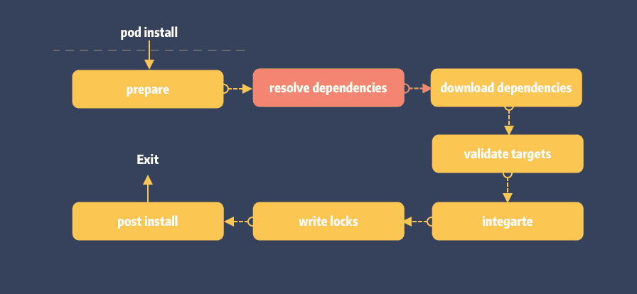

最终在 `inspect_targets_to_integrate` 方法内打开项目：

```ruby
def inspect_targets_to_integrate  
  project = Xcodeproj::Project.open(project_path)  
  ...  
end  
```

继续看 `Xcodeproj::Project::open` 实现：

```ruby
## lib/xcproject/Project.rb  
  
def self.open(path)  
  path = Pathname.pwd + path  
  unless Pathname.new(path).exist?  
    raise "[Xcodeproj] Unable to open `#{path}` because it doesn't exist."  
  end  
  project = new(path, true)  
  project.send(:initialize_from_file)  
  project  
end  
  
def initialize_from_file  
  pbxproj_path = path + 'project.pbxproj'  
  plist = Plist.read_from_path(pbxproj_path.to_s)  
  root_object.remove_referrer(self) if root_object  
  @root_object     = new_from_plist(plist['rootObject'], plist['objects'], self)  
  @archive_version = plist['archiveVersion']  
  @object_version  = plist['objectVersion']  
  @classes         = plist['classes'] || {}  
  @dirty           = false  
  
  unless root_object  
    raise "[Xcodeproj] Unable to find a root object in #{pbxproj_path}."  
  end  
  
  if archive_version.to_i > Constants::LAST_KNOWN_ARCHIVE_VERSION  
    raise '[Xcodeproj] Unknown archive version.'  
  end  
  
  if object_version.to_i > Constants::LAST_KNOWN_OBJECT_VERSION  
    raise '[Xcodeproj] Unknown object version.'  
  end  
  
  ## Projects can have product_ref_groups that are not listed in the main_groups["Products"]  
  root_object.product_ref_group ||= root_object.main_group['Products'] || root_object.main_group.new_group('Products')  
end  
```

  1. 在 open 方法中会检验路径，初始化 Project 对象;
  2. 使用内部 Property List 类 `Plist` 来读取 `project.pbxproj` 数据;

需要注意的是 `new_from_plist` 不仅完成了 rootObject 的解析，同时也完成 objects 的解析。

```ruby
/* Begin PBXProject section */  
   8528A0D92651F281005BEBA5 /* Project object */ = {  
      isa = PBXProject;  
      ...  
      mainGroup = 8528A0D82651F281005BEBA5;  
      productRefGroup = 8528A0E22651F281005BEBA5 /* Products */;  
      projectDirPath = "";  
      projectRoot = "";  
      targets = (   
         8528A0E02651F281005BEBA5 /* Test */,  
      );  
   };  
/* End PBXProject section */  
```

  1. 以 uuid 取出 Plist 数据并利用 isa kclass 完成 Project 对象的初始化和映射。`Object const` 中记录了支持的 `isa`；
  2. 将 object 存入 `objects_by_uuid` 字典中，以覆盖原有的 GUID；
  3. 执行 `configure_with_plist` 递归，完成 `objects` 映射。

> Tips: `configure_with_plist` 于下篇展开.

`project.pbxproj` 解析主体流程如下

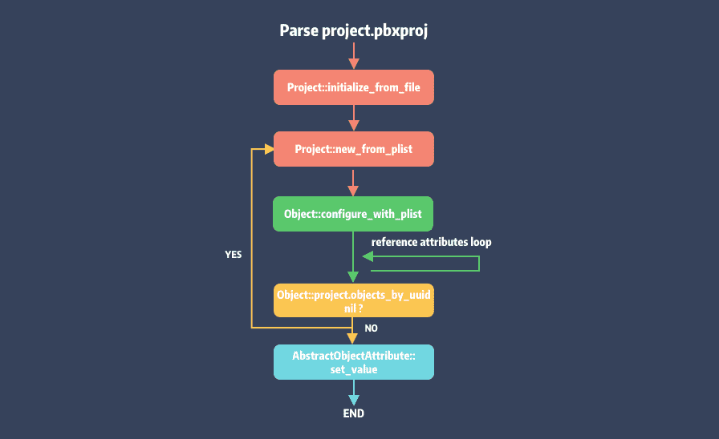

图中的 reference attributes 是指 Object 的引用属性，后面会有介绍。

### Object Module

#### AbstractObject

Object 的抽象类，Xcode 项目并不存在对应的 `isa` 类型。先简单介绍部分属性，方便后续理解。

```ruby
class AbstractObject  
  ## object 类型  
  attr_reader :isa  
  ## object 唯一标识  
  attr_reader :uuid  
  ## 持有 object 的 project  
  attr_reader :project  
  
  def initialize(project, uuid)  
    @project = project  
    @uuid = uuid  
    @isa = self.class.isa  
    @referrers = []  
    unless @isa =~ /^(PBX|XC)/  
      raise "[Xcodeproj] Attempt to initialize an abstract class (#{self.class})."  
    end  
  end  
  ...  
end  
```

注意，Object 类在 initialize 时关联了 project 对象，作者不建议我们直接使用，而在 Xcodeproj 模块内提供了 convince 方法。

```ruby
def new(klass)  
   if klass.is_a?(String)  
     klass = Object.const_get(klass)  
   end  
   object = klass.new(self, generate_uuid)  
   object.initialize_defaults  
   object  
end  
```

作者保留 project 的引用是为了方便处理 Object 的引用计数，project 作为项目的根节点，记录了完整的工程配置和各模块的交叉引用关系，有了 project 的引用能给进行 object 的引用管理。

#### Const Accessor

这里先插播一下 Object 模块中 `const` 定义及其存储的值。在 Ruby 中 Module 可以在运行时添加模块级的常量，方法如下：

```ruby
Module#const_get  
Module#const_set  
``` 

那么问题来了，这些 const 常量是在什么时机存入 Object 中的呢 ？

```ruby
## lib/xcodeproj/project/object.rb  
  
Xcodeproj::Constants::KNOWN_ISAS.each do |superclass_name, isas|  
  superklass = Xcodeproj::Project::Object.const_get(superclass_name)  
  isas.each do |isa|  
    c = Class.new(superklass)  
    Xcodeproj::Project::Object.const_set(isa, c)  
  end  
end  
```

在 object.rb 文件中，可以定位到 `Object.const_set` 的调用，它是在 Object 类被加载时触发的。Xcodeproj 支持的 `isa` 类型名称都定义在 `Xcodeproj::Constants::KNOWN_ISAS` 中。Object 加载时通过遍历它来载入 `isa class`。

```ruby
KNOWN_ISAS = {  
  'AbstractObject' => %w(  
    PBXBuildFile  
    AbstractBuildPhase  
    PBXBuildRule  
    XCBuildConfiguration  
    XCConfigurationList  
    PBXContainerItemProxy  
    PBXFileReference  
    PBXGroup  
    PBXProject  
    PBXTargetDependency  
    PBXReferenceProxy  
    AbstractTarget  
  ),  
  
  'AbstractBuildPhase' => %w(  
    PBXCopyFilesBuildPhase  
    PBXResourcesBuildPhase  
    PBXSourcesBuildPhase  
    PBXFrameworksBuildPhase  
    PBXHeadersBuildPhase  
    PBXShellScriptBuildPhase  
  ),  
  
  'AbstractTarget' => %w(  
    PBXNativeTarget  
    PBXAggregateTarget  
    PBXLegacyTarget  
  ),  
  
  'PBXGroup' => %w(  
    XCVersionGroup  
    PBXVariantGroup  
  ),  
}.freeze  
```

### Object Attributes

`AbstractObject` 作为 `Xcodeproj` 提供的 Object 基类，它不仅提供了基本属性，如 `isa` 类型和 uuid 等，还提供了特殊的属性修饰器如 `Attribute`，方便快速添加属性。光从 `KNOWN_ISAS` 看来这些 `isa` 类型就已经够多了，还要考虑属性的 CURD 以及数据到对象映射等一系列操作。

为此，Xcodeproj 实现了一套针对 **`project.pbxproj`** 的 DSL 解析。这些特性的实现正是依赖于属性修饰器和 Ruby 强大的 Runtime 能力。

#### AbstractObjectAttribute

`AbstractObjectAttribute` 是用于声明和存储 Object 属性的关键信息，定义如下：

```ruby
class AbstractObjectAttribute  
     
  ## 属性本身类型，:simple, :to_one, :to_many.  
  attr_reader :type  
     
  ## 属性名  
  attr_reader :name  
     
  ## 属性的持有者  
  attr_accessor :owner  
  
  def initialize(type, name, owner)  
    @type  = type  
    @name  = name  
    @owner = owner  
  end  
  
  ## 属性支持的类型  
  attr_accessor :classes  
     
  ## 仅限于 :references_by_keys 关联的类型  
  attr_accessor :classes_by_key  
     
  ## 仅限于 :simple 类型指定默认值  
  attr_accessor :default_value  
  ...  
end  
```

`AbstractObject` 通过 Ruby 提供的 `Singleton Classes` 以实现属性修饰器方法的扩展。

对于单例模式，Ruby 提供了多种实现方式。在 Ruby 中，每个对象可以拥有一个匿名**单例类**。默认情况下，自定义类是不存在单例类，不过可通过`class << obj` 来打开对象的单例类空间。

```ruby
class C  
  class << self  
    puts self ## 输出：#<Class:C>，类 C 类对象的单例类  
  end  
end  
```

> 注意：Ruby 中每个对象 (Class / Module 也是对象) 都有自己所属的类，它们都是有具体名称的类。

`Xcodeproj` 针对 Attribute 提供了多种单例类方法，定义如下：

```ruby
module Object  
  class AbstractObject  
    class << self  
      ## 普通属性声明方法  
      def attribute(name, klass, default_value = nil) ... end  
         
      ## 单一引用的属性声明方法  
      def has_one(singular_name, isas) ... end  
         
      ## 多引用的属性声明方法  
      def has_many(plural_name, isas) ... end  
         
      ## 多引用且不同 key 的属性声明方法  
      def has_many_references_by_keys(plural_name, classes_by_key) ... end  
    end  
  end  
end  
```

直接看如何使用，声明属性比较直观：

```ruby
module Object  
  class PBXProject < AbstractObject       
       
    ## 声明为 [String] 类型的 project_dir_path，默认值为空  
    attribute :project_dir_path, String, ''  
      
    ## 声明为 [PBXGroup] 类型的 main_group  
    has_one :main_group, PBXGroup  
  
    ## 声明为 [ObjectList<AbstractTarget>] 类型的 targets  
    has_many :targets, AbstractTarget  
       
    ## 声明为 [Array<ObjectDictionary>] 类型的 project_references   
    has_many_references_by_keys :project_references,  
                                :project_ref   => PBXFileReference,  
                                :product_group => PBXGroup  
    ...  
  end  
end  
```

所谓的单一或者多引用是指**Object 之间引用关系**。以 `PBXProject` 为例，一个项目只能指定一个 mainGroup，但对于 targets 可以存在多个。这里不直接使用 `attribute` 来修饰是因为，像 target 这种存在交叉引用的 Object 被删除时，我们需要知道谁引用了它，才保证所有的引用都能被清理干净。因此，**Xcodeproj 实现了一套针对 Object 的引用计数管理**(不在本文讨论范围)。

#### Attribute

今天先看普通属性的 DSL 实现，`has_one` 与 `has_many` 的属性修饰将在下篇展开。

```ruby
## lib/xcodeproj/project/object_attributes.rb  
  
def attribute(name, klass, default_value = nil)  
  ## 1. 初始化 attribute，记录属性名，属性类型及默认值  
  attrb = AbstractObjectAttribute.new(:simple, name, self)  
  attrb.classes = [klass]  
  attrb.default_value = default_value  
  ## 2. 将 attrb 存入 @attributes  
  add_attribute(attrb)  
    
  ## 3. 添加名为 name 的 getter  
  define_method(attrb.name) do  
    @simple_attributes_hash ||= {}  
    @simple_attributes_hash[attrb.plist_name]  
  end  
  
  ## 4. 添加名为 #{name}= 的 setter，并将值存入 @simple_attributes_hash 字典中  
  define_method("#{attrb.name}=") do |value|  
    @simple_attributes_hash ||= {}  
    ## 5. 检查 value 是否为 klass 支持的类型  
    attrb.validate_value(value)  
  
    existing = @simple_attributes_hash[attrb.plist_name]  
    if existing.is_a?(Hash) && value.is_a?(Hash)  
      return value if existing.keys == value.keys && existing == value  
    elsif existing == value  
      return value  
    end  
    mark_project_as_dirty!  
    @simple_attributes_hash[attrb.plist_name] = value  
  end  
end  
```

代码比较长核心逻辑就 2 步：

  1. 初始化 attribute，记录属性名，属性类型及默认值，将 attrb 存入对象的 `@attributes` 用于后续遍历；
  2. 利用 `define_method` 为修饰的对象添加实例变量存取方法。由于修饰的属性类型不同，accessor 方法直接使用 Hash 容器来保存变量值，key 为 `attribute.name`，使用 Hash 是为了避免受到 Object 引用计数的影响。

本质上 attribute 为我们生成的 accessor 如下：

```ruby
def project_dir_path  
  @simple_attributes_hash[projectDirPath]  
end  
  
def project_dir_path=(value)  
  attribute.validate_value(value)  
  @simple_attributes_hash[projectDirPath] = value  
end  
```

### Xcode Object

最后我们来聊两个 `project.pbxproj` 中的基础 Object 类型：`PBXFileReference` 和 `PBXGroup`。放在文章末尾，是希望看到这里的同学能理解Xcode 设计的背后思想。

#### PBXFileReference

`PBXFileReference` 记录了构建 Xcode 项目所需要的真实文件信息，**主要记录了文件路径**。这些`PBXFileReference` 就是我们在 Xcode 项目的左侧边栏中所见的文件。

```ruby
F8DA09E31396AC040057D0CC /* main.m */ = {  
  isa = PBXFileReference;   
  fileEncoding = 4;  
  lastKnownFileType = sourcecode.c.objc;   
  path = main.m;   
  sourceTree = SOURCE_ROOT;   
};  
```

对于 `PBXFileReference` 路径，重点在于确认该 path 是相对路径还是绝对路径，`sourceTree` 就是用来描述这个的，它有几种相对关系：

  * `<absolute>`：绝对路径
  * `<group>` 基于 PBXGroup 的相对路径
  * `SOURCE_ROOT` 基于 project 的相对路径
  * `DEVELOPER_DIR` 基于 developer directory 的相对路径
  * `BUILT_PRODUCTS_DIR` 基于 build  products directory 的相对路径
  * `SDKROOT` 基于 SDK directory 的相对路径

`Xcodeproj` 提供了 `GroupableHelper` 用于获取各种状态的文件目录，比如文件的绝对目录：

```ruby
def source_tree_real_path(object)  
  case object.source_tree  
  when '<group>'  
    object_parent = parent(object)  
    if object_parent.isa == 'PBXProject'.freeze  
      object.project.project_dir + object.project.root_object.project_dir_path  
    else  
      real_path(object_parent)  
    end  
  when 'SOURCE_ROOT'  
    object.project.project_dir  
  when '<absolute>'  
    nil  
  else  
    Pathname.new("${#{object.source_tree}}")  
  end  
end  
```

`PBXFileReference` 主要定义如下：

```ruby
module Object  
  class PBXFileReference < AbstractObject  
    attribute :name, String  
    attribute :path, String  
    attribute :source_tree, String, 'SOURCE_ROOT'  
end  
```

#### PBXGroup

基于 `PBXFileReference` 之上的一层抽象，能更好的对 `PBXFileReference` 进行管理和分组。`PBXGroup` 背后并不一定真实存在对应的文件夹，另外 `PBXGroup` 可以引用其他 `PBXGroup`，进行嵌套。定义如下:

```ruby
module Object  
  class PBXGroup < AbstractObject  
    ## group 可包含的类型  
    has_many :children, [PBXGroup, PBXFileReference, PBXReferenceProxy]  
    attribute :source_tree, String, '<group>'  
    ## 记录 group 在文件系统中的路径  
    attribute :path, String  
  ## group 名称，它和 path 不能同时存在  
    attribute :name, String  
end  
```

举个例子：

```ruby
F8E469631395739D00DB05C8 /* Frameworks */ = {  
  isa = PBXGroup;  
  children = (  
    50ABD6EC159FC2CE001BE42C /* MobileCoreServices.framework */,  
    ...  
  );  
  name = Frameworks;  
  sourceTree = "<group>";  
};  
```  

项目中并不存在真实的 `Framework` 文件夹，所以无需指定 path。

## 通过代码编辑 Xcode 工程

最后一章，一起来实践一下简单的功能。

### 为 Xcode 工程添加文件

#### 0x01 添加源文件

```ruby
project = Xcodeproj::Project.open(path)  
target = project.targets.first  
group = project.main_group.find_subpath(File.join('Xcodeproj', 'Test'), true)  
group.set_source_tree('SOURCE_ROOT')  
file_ref = group.new_reference(file_path)  
target.add_file_references([file_ref])  
project.save  
``` 

给 Xcode 工程添加文件算是常规操作。这段代码引用自 draveness 的文章[6]，作者对每一步都做了详细的解释了。我们从代码角度重点说一下`new_reference` 和 `add_file_references`。

**PBXGroup::new_references**

Xcode 工程会指定 main_group 作为项目资源的入口，所添加的文件资源需要先加入 main_group 内，以生成对应的`PBXFileReference`，这样 target 任务和 buildPhase 等配置才能访问该资源。因此，`new_reference` 核心是`new_file_reference` 代码如下：

```ruby
def new_reference(group, path, source_tree)  
  ref = case File.extname(path).downcase  
        when '.xcdatamodeld'  
          new_xcdatamodeld(group, path, source_tree)  
        when '.xcodeproj'  
          new_subproject(group, path, source_tree)  
        else  
          new_file_reference(group, path, source_tree)  
        end  
  
  configure_defaults_for_file_reference(ref)  
  ref  
end  
  
def new_file_reference(group, path, source_tree)  
  path = Pathname.new(path)  
  ref = group.project.new(PBXFileReference)  
  group.children << ref  
  GroupableHelper.set_path_with_source_tree(ref, path, source_tree)  
  ref.set_last_known_file_type  
  ref  
end  
```

**PBXNativeTarget::add_file_references**

加入文件资源后，便可将其加入对应的构建任务中去。

```ruby
def add_file_references(file_references, compiler_flags = {})  
  file_references.map do |file|  
    extension = File.extname(file.path).downcase  
    header_extensions = Constants::HEADER_FILES_EXTENSIONS  
    ## 依据资源类型区分是头文件还是源文件   
    is_header_phase = header_extensions.include?(extension)  
    phase = is_header_phase ? headers_build_phase : source_build_phase  
  
    ## 将文件资源作为编译资源加入到编译源中  
    unless build_file = phase.build_file(file)  
      build_file = project.new(PBXBuildFile)  
      build_file.file_ref = file  
      phase.files << build_file  
    end  
  ...  
    yield build_file if block_given?  
  
    build_file  
  end  
end  
```

#### 0x02 添加编译依赖

这里的编译依赖是指，依赖的 framework、library、bundle。不同于文件，他有均有对应的虚拟 group。

```ruby
## 添加 framework 引用  
file_ref = project.frameworks_group.new_file('path/to/A.framework')  
target.frameworks_build_phases.add_file_reference(file_ref)  
  
## 添加 libA.a 引用  
file_ref = project.frameworks_group.new_file('path/to/libA.a')  
target.frameworks_build_phases.add_file_reference(file_ref)  
  
## 添加 bundle 引用  
file_ref = project.frameworks_group.new_file('path/to/xxx.bundle')  
target.resources_build_phase.add_file_reference(file_ref)  
```

大家有兴趣可以看看 CocoaPods 是如何配置 `Pods.project`，为 Pod  生成对应 target，入口在 `Installer::generate_pods_project` 处。

## 总结

Xcode 通过 project.pbxproj，在文件系统之上又抽象出基于 **`PBXFileReference`** 和 **`PBXGroup`** 的任务构建系统。对于这一操作一直是不能理解的。为什么不像其他 IDE 一样直接使用项目的文件目录，而是另起炉灶搞了一套似乎并不好用构建件系统呢 ？

在了解完 `project.pbxproj` 和 Xcodeproj 后，似乎能理解一些设计者的意图。

假设你参与的是一个多人合作的超大型项目 (Project)，它将同时存在多个子任务 (Target)，同时这些任务之间可能存在大量交叉的资源依赖。这些资源不限于  File、Framework、Target、Project。如果我们直接基于文件路径来记录这些资源及其依赖关系，那么当资源发生产生变化时，将会产生大量的修改，例如文件路径变更。

这其实是不能接受的。而有了 `PBXFileReference` 的存在，任务构建者只需关心 `PBXFileReference`这唯一引用，无需在意它背后的文件是否存在，路径是否正确，甚至是内容是否变更，这些都不重要。通过 **`PBXFileReference`**这层隔离，实现了任务的构建行为及资源关系的固化。

## 知识点问题梳理

这里罗列了五个问题用来考察你是否已经掌握了这篇文章，如果没有建议你加入**收藏**再次阅读：

  1. 说说 `xcworkspace` 和 `xcodeproj` 本质是什么，有什么区别 ？
  2. `pbxproj` 中 `isa` 关键字的作用，有哪些类型 ？
  3. 说说 `pbxproj` 中是如何定义和引用源文件的 ？
  4. `pbxproj` 如何映射为 Xcodeproj 中的对象的 ？
  5. 谈谈你对 `PBXGroup` 和 `PBXFileReference` 的理解 ？

## 参考资料

* [xcodeproj](https://github.com/CocoaPods/Xcodeproj)
* [Premake](https://github.com/premake/premake-core)
* [PBXProj Identifers](https://pewpewthespells.com/blog/pbxproj_identifiers.html)
* [Xcode Project File Format](http://www.monobjc.net/xcode-project-file-format.html)
* [Xcodeproj](https://github.com/CocoaPods/Xcodeproj)
* [draveness 的文章](https://draveness.me/bei-xcodeproj-keng-de-zhe-ji-tian/)


