 
<!--BEGIN_DATA
{
    "create_date": "2016-09-13 15:58", 
    "modify_date": "2016-09-13 15:58", 
    "is_top": "0", 
    "summary": "CocoaPods组件平滑二进制化方案与App组件化开发实践", 
    "tags": "iOS", 
    "file_name": "CocoaPods组件平滑二进制化方案与App组件化开发实践.md"
}
END_DATA-->

####
原文出处：<a href='http://mdsb100-xiabigao.daoapp.io/zai-tan-zu-jian-er-jin-zhi-hua/' target='blank'>Carthage和iOS组件二进制化</a>

##Carthage和iOS组件二进制化

我本来认为CocoaPods就是事实标准了。但是现在发现好像不一定噢。

比如大名鼎鼎的[ReactCocoa](https://github.com/ReactiveCocoa/ReactiveCocoa)。切到早期版本，你根本找不到podspec，说明它从未官方支持过CocoaPods。现在的ReactiveCocoa.podspec都是第三方发的。而从2.4.1起ReactCocoa开始使用Carthage。

再比如[Mantle](https://github.com/Mantle/Mantle)也是一样。Mantle更是直接在README中这样说：

> If you would prefer to use CocoaPods, there are some Mantle podspecs that
have been generously contributed by third parties.

那么我们来讲讲[Carthage](https://github.com/Carthage/Carthage)。

Carthage翻译过来就是“迦太基”（Qart-ḥadašt，该词源于腓尼基语，意为“新的城市”，英语：Carthage）的意思。我猜取这个名字大概取“新的城市”这个寓意吧。

Carthage是个后起之秀，从2014年10月开始。而CocoaPods资格更老一些，从2011年8月就开始了。从start来看，CocoaPods是8262；Carthage是7397。他们已经在一个数量级了。说明Carthage相比CocoaPods并不差。Carthage肯定是为了解决CocoaPods的某些问题而生。

####查看Carthage的README。首先看到的是workflow。

> 1.Create a Cartfile that lists the frameworks you’d like to use in your
project.
>
> 2.Run Carthage, which fetches and builds each framework you’ve listed.
>
> 3.Drag the built .framework binaries into your application’s Xcode project.

第一步创建一个Carfile列出你想要的库。 这个CocoaPods一样。

第二步运行Carthage，它会拉去和编译每一个库。 说明还是需要编译一遍的。

第三步把framework拽进项目。

####需要注意的还有这个：

> Once you have Carthage installed, you can begin adding frameworks to your
project. Note that Carthage only supports dynamic frameworks, which are only
available on iOS 8 or later (or any version of OS X).

Carthage只支持动态库，所以只支持到iOS 8。

####看一下Carthage自己的说明，它和CocoaPods的区别。

> CocoaPods is a long-standing dependency manager for Cocoa. So why was
Carthage created?
>
> Firstly, CocoaPods (by default) automatically creates and updates an Xcode
workspace for your application and all dependencies. Carthage builds framework
binaries using xcodebuild, but leaves the responsibility of integrating them
up to the user. CocoaPods’ approach is easier to use, while Carthage’s is
flexible and unintrusive.

关键词：binaries、integrating、flexible、unintrusive。

  * Carthage使用二进制。
  * 用户自己集成进去。
  * 更灵活。
  * 非侵入。

> The goal of CocoaPods is listed in its README as follows:
>
>> … to improve discoverability of, and engagement in, third party open-source
libraries, by creating a more centralized ecosystem.
>
> By contrast, Carthage has been created as a decentralized dependency
manager. There is no central list of projects, which reduces maintenance work
and avoids any central point of failure. However, project discovery is more
difficult—users must resort to GitHub’s Trending pages or similar.

Carthage是个分散型的依赖管理器。降低了维护工作和避免了集中管理的问题。CocoaPods是个集中的生态系统。

> Ultimately, we created Carthage because we wanted the simplest tool
possible—a dependency manager that gets the job done without taking over the
responsibility of Xcode, and without creating extra work for framework
authors. CocoaPods offers many amazing features that Carthage will never have,
at the expense of additional complexity.

最后，我们创建Carthage是为了创造一个更简单的工具。创建一个依赖管理器去完成工作，而不用接手Xcode的职责。

CocoaPods提供了很多很棒的功能，Carthage永远不会以额外的复杂性作为代价去提供这些功能。貌似这句才是最关键。

####试用一下Carthage

安装：

    
    
    brew install carthage  
    

当前默认安装版本是0.11.0

创建Cartfile:

    
    
    ##Require version 2.3.1 or later
    github "ReactiveCocoa/ReactiveCocoa" >= 2.3.1
    ##Require version 1.x
    github "Mantle/Mantle" ~> 1.0    ##(1.0 or later, but less than 2.0)  
    

执行carthage update

    
    
    *** Cloning Mantle
    *** Cloning ReactiveCocoa
    *** Cloning Result
    *** Cloning Nimble
    *** Checking out ReactiveCocoa at "v4.2.2"
    *** Checking out Result at "2.1.3"
    *** Checking out Mantle at "1.5.8"
    *** Cloning Quick
    *** Cloning xcconfigs
    *** Cloning Box
    *** xcodebuild output can be found in /var/folders/w2/khz8t6h10q51lx_hvw8ds9wr0000gn/T/carthage-xcodebuild.Wwng0O.log
    Failed to discover shared schemes in project Nimble.xcodeproj—either the project does not have any shared schemes, or xcodebuild never returned
    If you believe this to be a project configuration error, please file an issue with the maintainers at https://github.com/Mantle/Mantle/issues/new  
    

竟然失败了。 执行：

    
    
    sudo rm -rf ~/Library/Caches/org.carthage.CarthageKit  
    carthage build  
    

得到结果： 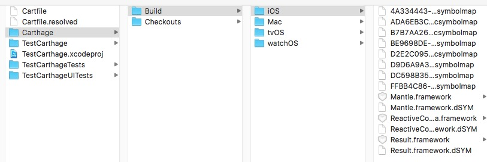

Cartfile.resolved应该和Podflie.lock一个作用。

build了这么多平台实在太慢了，所以可以指定平台：

    
    
    carthage build --platform iOS  
    

将 Carthage/Build/iOS 中的 framework 文件添加到项目中。如图：
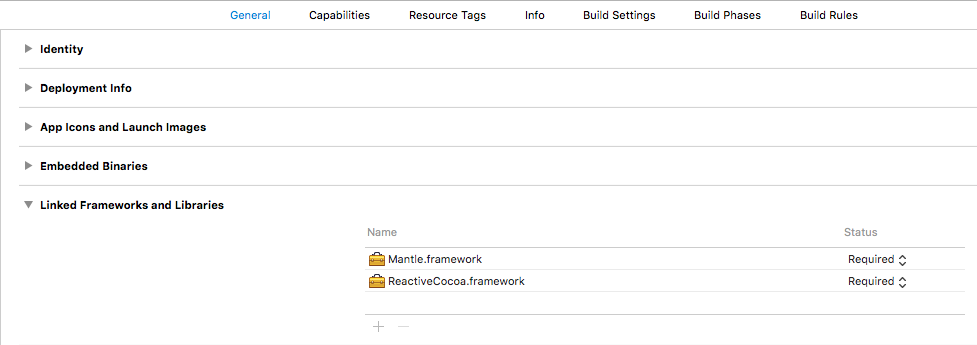 然后在
Build Phrases 中，点击左上角的 + 号，添加一个 New Run Script Phrase。如图：
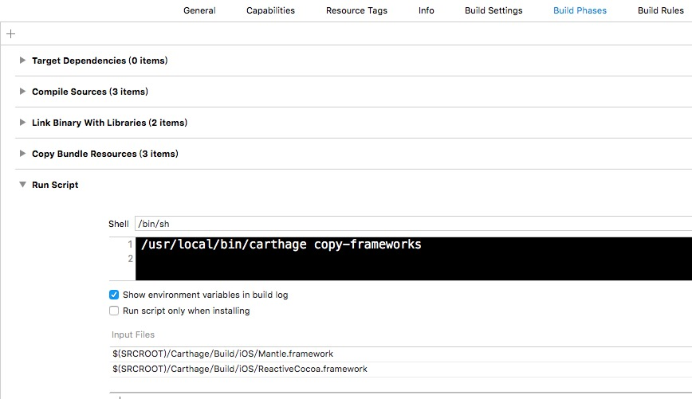

####使你的framework支持Carthage

1.明确只最低支持iOS8。  
2.共享你的Xcode schemes。Carthage会build你共享的Xcode schemes。  
3.解决编译的错误。  
4.打上tag发布（上传到代码库）。  
5.Carthage可以使用你预先生成的包含frameworks的zip文件，这样就不用在使用者这边编译了。这个zip文件必须包含在你发布的tag中。

####私有Carthage

其实很简单，发布到你自己的代码源，然后在Cartfile里面这样写就可以了：

    
    
    git "https://gitlab.baidao.com/git-error-translations2.git"  >= 1.0.1  
    

####看了下其他文档和亲身使用经历。总结一下：

  * Cartfile配置起来很简单。
  * 使用Carthage，版本管理是不用担心的。和CocoaPods类似。
  * Cartfile不能加载深度依赖。比如有个库KKNetKit依赖AFNetwork。你不能只写KKNetKit，还得显示地写上AFNetwork。这一点和CocoaPods不同，CocoaPods会自动帮你加入AFNetwork。
  * Carthage和你的项目并没有直接的关系。这也符合了它宣称的非侵入。你可以在任意地方定义Cartfile。
  * Carthage一样可以使用CI。例如[travis CLI](https://github.com/travis-ci/travis.rb#installation)。
  * 目前Carthage的CLI相比CocoaPods还是做的比较烂的。也没有很多功能。
  * 现在支持Carthage的常用第三方库并不是很多。Carthage目前也没有像CocoaPods那样提供一个search命令去查找库。所以我并不能知道有哪些第三方库支持了Carthage。
  * 它会自动创建submodule。这个专门放submodule文件夹叫Carthage/Checkouts。
  * 因为是非侵入式的，需要自己手动去配置Xcode。这个有好处也有坏处。如果用到了很多库，会感觉麻烦。
  * 如果你有多个App的话，共用那些framework会非常爽。但因为需要这样配置"$(SRCROOT)/Carthage/Build/iOS/Mantle.framework"，你的本地路径可能和其他人会不一样，所以没法在团队间共享。
  * 我要调试源码的话就变的比较麻烦。查看源码可以在submodule中去找，但增加了麻烦。
  * 首次carthage update时间会非常长。虽然我只是导入了2个库而已。（那2个库没有提供archive zip）
  * 因为时间非常长，所以就得考虑如何在Team中共享的问题。让每个人都xcodebuild一遍时间太长了，上传到git又太大了。
  * 当用CocoaPods时，pod install之后需要重新编译所有CococaPods库，哪怕我只改动了一个CocoaPods库的版本号。而Carthage也不能解决这个问题。carthage update和carthage build也都会重新编译一遍。而Carthage更慢，因为CocoaPods只要编译一个architect，Carthage要编译多个Architect。
  * 如果那个Carthage的目标库没有提供archive zip的话，还是需要编译一次。Team其他人也需要编译一次。如果要彻底避免的话，当一个人编译完，需要把frameworks都上传到代码库上才行。或者自己压个zip，内网互相发送一下？
  * 就算Carthage目标库支持archive zip，他一定得支持全部平台，问题是我怎么告诉它我只需要iOS平台的呢？全部clone下来，就中国这个网络环境岂不是很痛苦。

Carthage的优缺点都是非常鲜明的，所以需要综合自身的情况考虑。

####那用Carthage做组件二进制化可不可以？

我觉得是可以的。但有以下几个问题需要解决。

  * 迁移的成本。一般大家都是用的CocoaPods。
  * 只支持到iOS8。如果支持到iOS7的就没有办法了。
  * 没有灵活的方式去切回源码调试。查看源码也不是很方便，毕竟不在一个workspace里面。
  * 目前支持的第三方库并不多。没有像CocoaPods那样普及。

**我的建议是：CocoaPods和Carthage一起用。**

Carthage解决了组件如何二进制化的问题，加快了编译速度。在开发时继续使用CocoaPods可以查看弱业务组件和基础功能组件的源码、以及调试源码。第三方库视情况而定，如果它支持Carthage就用Carthage。

具体做法是：在App主项目中，业务组件都是Carthage提供archive zip的方式集成进来的。而在业务组件A的Example App中还是可以继续使用CocoaPods加载弱业务组件和基础功能组件和不支持Carthage的第三方组件。参与集成调试的其他业务组件和支持Carthage的第三方库可以通过Carthage集成进来。

**这篇文章只是提供了一种思路。如果你原先一直使用CocoaPods又没有迫切二进制化的需求的话，我觉得目前可以不考虑转用Carthage。**

即使你有二进制化需求的话，也可以参考我写的这篇[文章](http://www.yiqixiabigao.com/ios-cocoapodszu-jian-
ping-hua-er-jin-zhi-hua-fang-an-ji-xiang-xi-jiao-cheng/)。推荐还是使用CocoaPods加
[cocoapods-packager](https://github.com/CocoaPods/cocoapods-packager)这个插件。

####
原文出处：<a href='http://mdsb100-xiabigao.daoapp.io/ios-cocoapodszu-jian-ping-hua-er-jin-zhi-hua-fang-an-ji-xiang-xi-jiao-cheng/' target='blank'>iOS CocoaPods组件平滑二进制化解决方案</a>

##iOS CocoaPods组件平滑二进制化解决方案

iOS CocoaPods组件平滑二进制化方案及详细教程

感谢"fly2never_宝贝别哭"。可以使用[cocoapods-packager](https://github.com/CocoaPods/cocoapods-packager)这个插件来方便生成library（静态库，动态库都可以）。

强烈建议生成framework。

    
    
    IS_SOURCE=1 pod package YTXChart.podspec --library --exclude-deps --spec-sources=http://gitlab.baidao.com/ios/ytx-pod-specs.git,https://github.com/CocoaPods/Specs.git  
    

虽然有了这个方便的工具，但是了解一下打包的过程也是好的。

后记，有人问我为什么不改用[Carthage](https://github.com/Carthage/Carthage)。

可以看看我写的这一篇[Carthage和iOS组件二进制化](http://www.yiqixiabigao.com/zai-tan-zu-jian-er-jin-zhi-hua/)

CocoaPods和Carthage设计目的不一样。

我们的现在组织架构有多个iOS team，多个App。

  * 已经使用了CocoaPods，如果要再集成Carthage比较麻烦。我们自己team还好说，还有其他team怎么办。 
  * 其他team已经用的是CocoaPods。对他们来说只需要升级版本号，要用源码时加上一个IS_SOURCE=1 pod install就可以了。够平滑。
  * Carthage我要如何方便的切回源码调试。 
  * Carthage并不能解决版本更新要编译的问题。除非track那些framework，共享给Team中的其他人。那样的话你的git库就会很大。

说到底Carthage并不能解决实际应用的问提。

####什么是组件二进制化？

在iOS开发中，事实标准是我们使用CocoaPods生成、管理和使用library。这里的library就是一个模块、组件或库。二进制化指的是通过编译把组件的源码转换成静态库或动态库，以提高该组件在App项目中的编译速度。

我们的方案是转换成静态库，也就是.a格式的文件加上暴露出来的头文件。

####为什么我们需要二进制化呢？

在我们App开发中，我们逐渐的抽象了很多模块、业务、UI等把他转换成私有CocoaPod库。其中有一个是用C++和Objective-C混写的，源码格式为.mm。在app项目编译时.mm部分代码编译非常慢。这作为一个契机让我们去考虑如何加快编译速度。

这个混写的CocoaPod库叫做YTXChart，之后会以此库为例反复提到。

另外随着业务的扩展，私有CocoaPod库和第三方CocoaPod库越来越多，App项目中的文件也越来越多。每次`pod install`安装新库或`pod update`更新库的时候，重新编译的过程需要等待很长时间。这也向我们提出了加快编译速度的需求。

另外如果想要做组件化的话，一定要做二进制化。

所以我们想到了二进制化的方案来解决这个问题，并且很多大公司也是这么做的。

####这带来一个新问题？一步就位还是平滑过度。

对我们来说，这是一个尝试，不可能开始就决定把所有的私有CocoaPod库二进制化，也不可能决定把所有第三方CocoaPod库二进制化。当务之急的情况是加快YTXChart库编译速度。所以必须找到一个方案平滑过度。

我们的App中的podflie是这样的

    
    
    target 'jryMobile' do  
        pod 'AFNetworking', '~> 2.6.3'
        pod 'Mantle', '~> 1.5.7'
        pod 'DateTools', '~> 1.7.0'
        pod 'ReactiveCocoa', '~> 2.3.1'
        pod 'CocoaAsyncSocket', '~> 7.4.1'
        pod 'FMDB', '~> 2.5'
        pod 'MWPhotoBrowser', '~> 1.4.1'
        pod 'MZFormSheetController', '~> 2.3.6'
        pod 'HMSegmentedControl', '~> 1.5.1'
        pod 'UMengAnalytics', '~> 3.5.8'
        pod 'UMengFeedback', '~> 2.3.4'
        pod 'TSMessagesNW', '~> 0.9.15'
        pod 'TPKeyboardAvoiding', '~> 1.2.9'
        pod 'SDWebImage', '~> 3.7'
        pod 'JHChainableAnimations', '~> 1.3.0' 
        pod 'BarrageRenderer', '~> 1.7.0'
        pod 'MJRefresh', '~> 3.1.7'
        pod 'YTXAnimations', '~> 1.2.4', :subspecs => ["AnimateCSS", "Transformer"]
        pod 'YTXMediaIJKPlayer', '~> 0.2.1'
        pod 'YTXTradeBusinessType', '~> 1.1.0'
        pod 'YTXServerId', '~> 0.1.4'
        pod 'YTXUtilCategory','~> 1.2.0'
        pod 'YTXScreenShotManager', '~> 0.1.7'
        pod 'YTXRequest', '~> 1.0.0'
        pod 'YTXCommonSocket', '~> 0.1.9'
        pod 'YTXChartSocket', '~> 0.5.1'
    ##希望是二进制化的
        pod 'YTXChart', '~> 0.17.0'
        pod 'YTXRestfulModel', '~> 1.2.2', :subspecs => ["RACSupport", "YTXRequestRemoteSync", "FMDBSync", "UserDefaultStorageSync"]
        pod 'YTXWebViewJavaScriptBridge', '~> 0.1.2'
        pod 'YTXCheckForAppUpdates', '~> 1.0.0'
        ####  pod 'YTXVideoAVPlayer', '~> 0.5.0'
        pod 'YTXChatUI', '~> 0.3.2'
        pod 'PNChart', '~>0.8.9'
        #pod 'EaseMobSDKFull', :git => 'https://github.com/easemob/sdk-ios-cocoapods-integration.git', :tag => '2.2.0'
        ##EaseMobSDKFull 更新地址'https://github.com/easemob/sdk-ios-cocoapods-integration.git'
        #pod 'AFgzipRequestSerializer', '~> 0.0.2'
        pod 'AdhocSDK', '~> 2.2.1'
        pod 'FLEX', '~> 2.0', :configurations => ['Debug']
        pod 'React', :path => './ReactComponent/node_modules/react-native', :subspecs => [
        'Core',
        'RCTImage',
        'RCTNetwork',
        'RCTText',
        'RCTWebSocket',
        ##添加其他你想在工程中使用的依赖。
        ]
        pod 'CodePush', :path => './ReactComponent/node_modules/react-native-code-push'
    end  
    

####平滑二进制方案需求点

  * 其他的CocoaPod库都还是源码。YTXChart为二进制化。
  * 以后能够逐步迭代把更多的以YTX开头的CocoaPod库进行二进制化，而不影响主App。
  * 能够提供一种方式把二进制化CocoaPod库切换回源码CocoaPod库以便调试。尽量做的方便。
  * 解决YTXChart引用依赖的问题。（YTXChart还依赖了第三方AFNetworking和私有YTXServerId。保证生成的静态库中不会含有AFNetworking的内容和YTXServerId的内容并且能够编译通过）
  * 利用原来的YTXChart.git，不创建新项目，不创建新的git库。因为我们的二进制化库的生成还是来自于源码，当源码更新时，我们需要一种非常快捷的方式去生成二进制的东西，不希望copy源码到某处，或者增加一个git submodule。
  * 希望App源码和YTXChart中的源码尽量少或者没有改动。
  * 希望App中的Podfile尽量少或者没有改动。
  * 希望Podfile中的版本号保持风格一致，不会出现`'~> 2.2.1.binary'`这种情况。
  * 用原来的那一个CocoaPods Repo Spec。

####以下这个解决方案的教程满足了以上所有需求点

注意，以下的例子基于Cocoapods@1.0.1，而且目前只能是1.0.1

####第一步：源码生成静态库

如果你是通过命令`pod lipo create`创建的CocoaPod库并且`pod install`的话，它的目录结构应该像这样子（只列出重要的）：

    
    
    YTXChart  
      |-Example
        |-YTXChart
        |-Pods
        |-YTXChart.xcodeproj
        |-YTXChart.xcworkspace
        |-Podfile
        \-Podfile.lock
      |-Pod
        |-Assets
        \-Classes
      \-YTXChart.podspec
    

_在xcode中创建新Target YTXChartBinary`File->New->Target->Framework & Library->Cocoa
Touch Static Library`_

如果你们的项目最低支持到iOS8可以创建Dynamic Framework

注意在Podfile中加入以下这段

    
    
    target 'YTXChartBinary' do
    end  
    

_然后`pod install`_

_解释：Cocoapods@1.0.1会在Header Search Path自动加入内容。如果你用CocoaPods@0.39.0则需要自己加HeaderSearch Path保证依赖库YTXServerId和AFNetwork能够被找到。如图：_ 
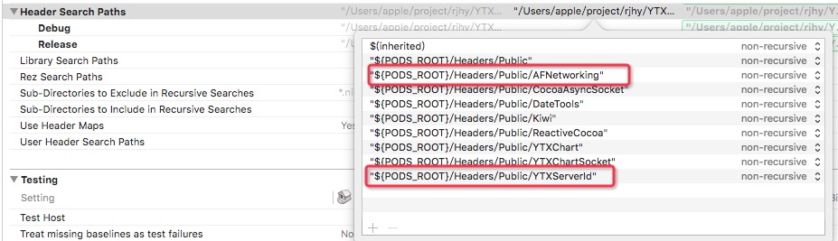

_然后把Pod/Classes中的源码拖入到YTXChartBinary中，这样选择（这样会link源码而不是复制）：_
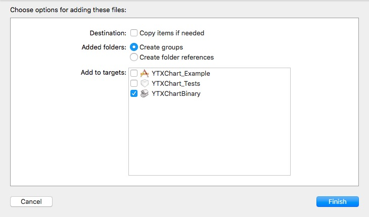 然后变成这样子：
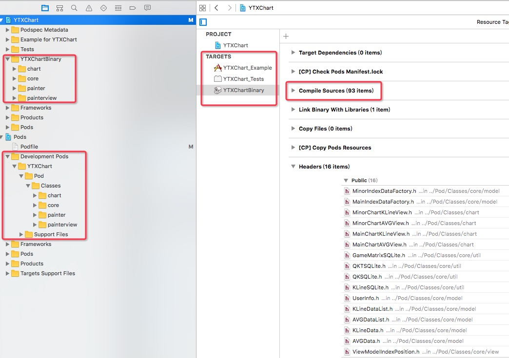
_Headers需要自己加，里面是你需要暴露的头文件_

_在YTXChartBinary Target中的Build Settings下找到iOS Deployment Target选择和YTXChart.podspec中的s.platform保持一致。这里是7.0`YTXChartBinary Target->Build
Settings->iOS Deployment Target`_

_在根目录创建shell脚本buildbinary.sh_

_你也可以创建一个Aggregate Target用来执行shell脚本_

代码如下：

    
    
    #获得当前目录的名字，一般是YTXChartSocket这种
    PROJECT_NAME=${PWD##*/}
    ##编译工程
    BINARY_NAME="${PROJECT_NAME}Binary"
    cd Example
    INSTALL_DIR=$PWD/../Pod/Products  
    rm -fr "${INSTALL_DIR}"  
    mkdir $INSTALL_DIR  
    WRK_DIR=build
    BUILD_PATH=${WRK_DIR}
    DEVICE_INCLUDE_DIR=${BUILD_PATH}/Release-iphoneos/usr/local/include  
    DEVICE_DIR=${BUILD_PATH}/Release-iphoneos/lib${BINARY_NAME}.a  
    SIMULATOR_DIR=${BUILD_PATH}/Release-iphonesimulator/lib${BINARY_NAME}.a  
    RE_OS="Release-iphoneos"  
    RE_SIMULATOR="Release-iphonesimulator"
    xcodebuild -configuration "Release" -workspace "${PROJECT_NAME}.xcworkspace" -scheme "${BINARY_NAME}" -sdk iphoneos clean build CONFIGURATION_BUILD_DIR="${WRK_DIR}/${RE_OS}" LIBRARY_SEARCH_PATHS="./Pods/build/${RE_OS}"  
    xcodebuild ARCHS=x86_64 ONLY_ACTIVE_ARCH=NO -configuration "Release" -workspace "${PROJECT_NAME}.xcworkspace" -scheme "${BINARY_NAME}" -sdk iphonesimulator clean build CONFIGURATION_BUILD_DIR="${WRK_DIR}/${RE_SIMULATOR}" LIBRARY_SEARCH_PATHS="./Pods/build/${RE_SIMULATOR}"
    if [ -d "${INSTALL_DIR}" ]  
    then  
    rm -rf "${INSTALL_DIR}"  
    fi  
    mkdir -p "${INSTALL_DIR}"
    cp -rp "${DEVICE_INCLUDE_DIR}" "${INSTALL_DIR}/"
    INSTALL_LIB_DIR=${INSTALL_DIR}/lib  
    mkdir -p "${INSTALL_LIB_DIR}"
    lipo -create "${DEVICE_DIR}" "${SIMULATOR_DIR}" -output "${INSTALL_LIB_DIR}/lib${PROJECT_NAME}.a"  
    rm -r "${WRK_DIR}"  
    

这个脚本写的并不是很好。说说主要做了什么。 _Release不同的静态库，真机和模拟器的。只构建x86_64，不构建i386加快速度_

    
    
    xcodebuild -configuration "Release" -workspace "${PROJECT_NAME}.xcworkspace" -scheme "${BINARY_NAME}" -sdk iphoneos clean build CONFIGURATION_BUILD_DIR="${WRK_DIR}/${RE_OS}" LIBRARY_SEARCH_PATHS="./Pods/build/${RE_OS}"  
    xcodebuild ARCHS=x86_64 ONLY_ACTIVE_ARCH=NO -configuration "Release" -workspace "${PROJECT_NAME}.xcworkspace" -scheme "${BINARY_NAME}" -sdk iphonesimulator clean build CONFIGURATION_BUILD_DIR="${WRK_DIR}/${RE_SIMULATOR}" LIBRARY_SEARCH_PATHS="./Pods/build/${RE_SIMULATOR}"  
    

*通过lipo命令合并。新.a使用project name是因为要和App项目的OTHER_LDFLAGS兼容`-l"YTXChart"`
    
    
    lipo -create "${DEVICE_DIR}" "${SIMULATOR_DIR}" -output "${INSTALL_LIB_DIR}/lib${PROJECT_NAME}.a"  
    

结果： 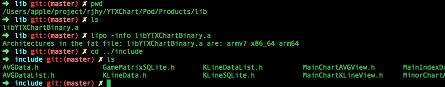

####为什么要删除i386

实际上，二进制化方案就是以空间换时间。我们这个YTXChart库生成的.a去除i386之后大小有166.3M。上传到git仓库后，git会压缩。增加了33M左右。而作为二进制文件，git是没法做增量的。所以每次上传.a都会大大增加git库大小，增加硬盘使用量。考虑到我们的服务器硬盘只有60个G能用，以后还会二进制化很多组件。

所以得出：尽量压缩二进制文件大小；尽量不上传.a，直到发布某个版本时才上传。

当然，如果你的服务器硬盘是1T的话，我觉得你也可以随便搞。

_现在文件目录是这样子的：_

    
    
    YTXChart  
      |-Example
        |-YTXChart
        |-Pods
        |-YTXChart.xcodeproj
        |-YTXChart.xcworkspace
        |-YTXChartBinary //空的
        |-Podfile
        \-Podfile.lock
      |-Pod
        |-Assets
        |-Classes //里面是源码
        \-Products
          |-include
             |-xxx.h
             |-...
             \-xxx.h
          \-lib
             \- libYTXChart.a
      \-YTXChart.podspec
    

####第二步：测试生成的静态库。

修改YTXChart.podspec如下：

    
    
    Pod::Spec.new do |s|  
      s.name             = "YTXChart"
      s.version          = "0.17.7"
      s.summary          = "YTXChart for pod"
    ##This description is used to generate tags and improve search results.
    #### * Think: What does it do? Why did you write it? What is the focus?
    #### * Try to keep it short, snappy and to the point.
    #### * Write the description between the DESC delimiters below.
    #### * Finally, don't worry about the indent, CocoaPods strips it!
      s.description      = "银天下Chart, 依赖AFNetworking"
      s.homepage         = "http://gitlab.baidao.com/ios/YTXChart.git"
      ##s.screenshots     = "www.example.com/screenshots_1", "www.example.com/screenshots_2"
      s.license          = 'MIT'
      s.author           = { "caojun-mac" => "78612846@qq.com" }
      s.source           = { :git => "http://gitlab.baidao.com/ios/YTXChart.git", :tag => s.version }
      ##s.social_media_url = 'https://twitter.com/<TWITTER_USERNAME>'
      s.platform     = :ios, '7.0'
      s.requires_arc = true
      s.source_files = 'Pod/Products/include/**'
      s.public_header_files = 'Pod/Products/include/*.h'
      s.ios.vendored_libraries = 'Pod/Products/lib/libYTXChart.a'
      s.libraries = 'sqlite3', 'c++'
      s.dependency 'YTXServerId'
      s.dependency 'AFNetworking', '~> 2.0'
    end  
    

注意s.source_files和s.public_header_files和s.ios.vendored_libraries的路径

_Exampl/Podfile是长这样子的：_

    
    
    source 'http://gitlab.baidao.com/ios/ytx-pod-specs.git'  
    source 'https://github.com/CocoaPods/Specs.git'
    target 'YTXChart_Example' do  
      pod "YTXChart", :path => "../"
      pod 'ReactiveCocoa', '~> 2.5'
      pod 'YTXChartSocket'
      pod 'AFNetworking', '~> 2.0'
    end
    target 'YTXChartBinary' do
    end
    target 'YTXChart_Tests' do  
      pod "YTXChart", :path => "../"
      pod 'Kiwi'
    end  
    

执行`pod install`后应该是这样子的，然后跑起来没问题

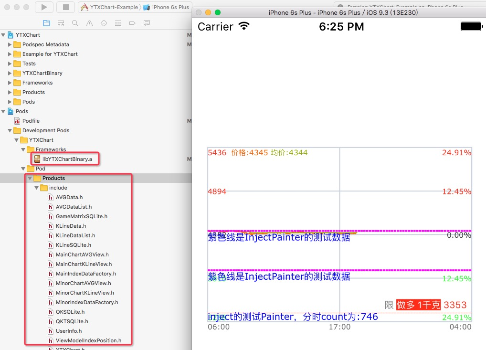

执行`pod lib lint --sources='http://gitlab.baidao.com/ios/ytx-pod-specs.git,master'--verbose --use-libraries --fail-fast`也是好的

####至此我们构建出一个静态库，只包含YTXChart的内容，不包含依赖AFNetwork和YTXServerId的内容

_证明：把`s.dependency 'AFNetworking', '~> 2.0'`去除再执行`pod lib lint
'http://gitlab.baidao.com/ios/ytx-pod-specs.git,master' --verbose --use-libraries --fail-fast`会报出找不到AFNetwork相关文件。_

题外话：因为CocoaPods1.0.1不支持C++项目的lint（这是一个[defect](https://github.com/CocoaPods/CocoaPods/issues/5152)），所以这个时候我会切回CocoaPods@0.39.0来lint和publish。而前面pod instal增加Search Path是依靠CocoaPods@1.0.1。如果你不是.mm混写的，是不会有这个问题的。尽管使用CocoaPods@1.0.1。强行当作没看到这个题外话。

_下一步解决如何在源码和二进制中切换_ _修改YTXChart.podspec为以下内容：_

    
    
    #
    ##Be sure to run `pod lib lint YTXChart.podspec' to ensure this is a
    ##valid spec before submitting.
    #
    ##Any lines starting with a ##are optional, but their use is encouraged
    ##To learn more about a Podspec see http://guides.cocoapods.org/syntax/podspec.html
    #
    Pod::Spec.new do |s|  
      s.name             = "YTXChart"
      s.version          = "0.17.7"
      s.summary          = "YTXChart for pod"
    ##This description is used to generate tags and improve search results.
    #### * Think: What does it do? Why did you write it? What is the focus?
    #### * Try to keep it short, snappy and to the point.
    #### * Write the description between the DESC delimiters below.
    #### * Finally, don't worry about the indent, CocoaPods strips it!
      s.description      = "银天下Chart, 依赖AFNetworking"
      s.homepage         = "http://gitlab.baidao.com/ios/YTXChart.git"
      ##s.screenshots     = "www.example.com/screenshots_1", "www.example.com/screenshots_2"
      s.license          = 'MIT'
      s.author           = { "caojun-mac" => "78612846@qq.com" }
      s.source           = { :git => "http://gitlab.baidao.com/ios/YTXChart.git", :tag => s.version }
      ##s.social_media_url = 'https://twitter.com/<TWITTER_USERNAME>'
      s.platform     = :ios, '7.0'
      s.requires_arc = true
     if ENV['IS_SOURCE']
        puts '-------------------------------------------------------------------'
        puts 'Notice:YTXChart is source now'
        puts '-------------------------------------------------------------------'
          s.source_files  = "Pod/Classes/painter/*.{h,m,mm}", "Pod/Classes/painterview/*.{h,m,mm}", "Pod/Classes/chart/*.{h,m,mm}", "Pod/Classes/core/*.{h,mm}", "Pod/Classes/core/**/*.{h,m,mm,inl}"  
      else
        puts '-------------------------------------------------------------------'
        puts 'Notice:YTXChart is binary now'
        puts '-------------------------------------------------------------------'
        s.source_files = 'Pod/Products/include/**'
        s.public_header_files = 'Pod/Products/include/*.h'
        s.ios.vendored_libraries = 'Pod/Products/lib/libYTXChart.a'
      end
      s.libraries = 'sqlite3', 'c++'
      s.dependency 'YTXServerId'
      s.dependency 'AFNetworking', '~> 2.0'
    end
    

_注意这段`if ENV['IS_SOURCE']`。我们的需求是优先使用二进制，偶尔才会切回源码。_

删除Example/Pods目录。

_执行`IS_SOURCE=1 pod install`。你会看到Example/Pods/YTXChart/里面都是源码_

_输出_Notice:YTXChart Now is source

_进一步跑起模拟器，因为是源码编译用了很长时间，模拟器起来，一切也是好的_

_再试下`pod cache clean --all && IS_SOURCE=1 pod lib lint`也是好的_

_再试下`pod cache clean --all && pod lib lint`也是好的_

_现在我们通过`if else`简单地实现了本地Example App项目切换源码和二进制。_

####发布到自己的pod repo spec

_发布就和正常发布没有任何区别。_

####检查从spec repo的source中安装

_Podfile修改为`pod 'YTXChart', '~> 0.17.7'`_

以下两步很重要

`pod cache clean --all`

删除Example/Pods

_然后`pod install`_

_检查Example/Pods/YTXServerId/和Example/Pods/AFNetwork/发现都是.h .m源码。_

_检查Example/Pods/YTXChart/里的是二进制.a和头文件。跑起App并没有问题。_

####尝试切回源码

_如果你直接`IS_SOURCE=1 pod install`你会发现Example/Pods/YTXChart/里的内容都变成了空_

_这是为什么呢，因为pod cache了一个podspec.json。可以通过`pod cache
list`查看。他cache了一个描述如何从s.source中找到相关文件。现在的描述还是从Pod/Products/下去找，自然为空。_

_为了避免这个问题，所以必须执行上面两步。这个是唯一的问题，目前我还找不到更好的解决方案。切换的行为只是偶尔发生，这是可以接受的。_

_执行2步。再次`IS_SOURCE=1 pod install`你就发现Example/Pods/YTXChart/里的内容都变成了.h
.mm源码。跑起App也是好的。_

为什么lint之前要cache clean。原理是一样的。如果YTXChart依赖的YTXServerId也被做成了二进制化就需要cache clean。不过你也可以这样`pod cache clean YTXServerId`

####特别注意IS_SOURCE应当作为一个所有非二进制化Pod库的统一标识，并且通知你们的项目组里所有成员。`pod install`可能会有某几个已经二进制化的库使用二进制的内容。`IS_SOURCE=1 pod install`时，所有的库都将会是源码的内容。

####版本管理

请参考这篇我的文章[CocoaPod版本规范](http://www.yiqixiabigao.com/yin-tian-xia-cocoapodshi-yong-gui-fan/)

#####完整分析

_当你发布完成之后，查看。我们发现在Spec Repo中对应版本的podspec就是我们的YTXChart/podspec。_
_CocoaPod从`s.source`git地址和tag下载对应的代码，Pod/Products和Pod/Classes里的内容都存在_ _当你使用`IS
_SOURCE=1`时`ENV['IS_SOURCE']`会为true。`CocoaPods通过`s.source_files`从下载代码的路径找到源码构建 Example/Pods和YTXChart.xcworkspace`_ 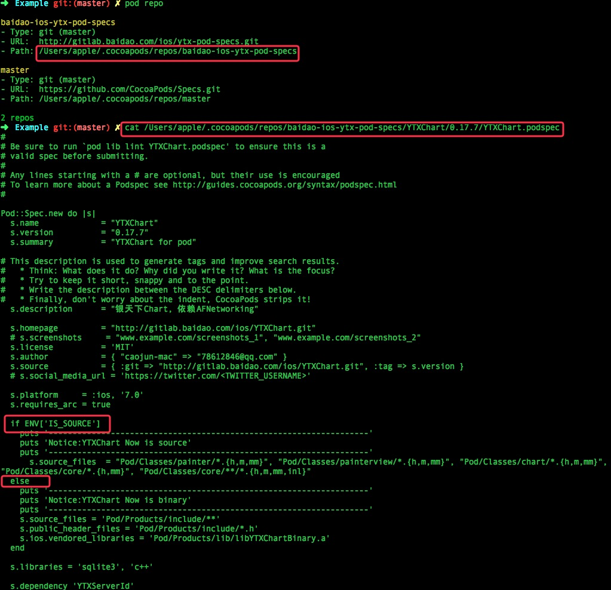
_明白了上面的过程，来再分析下为什么要在切换源码和二进制化时删除cache和Pods目录。放几张图就明白了_
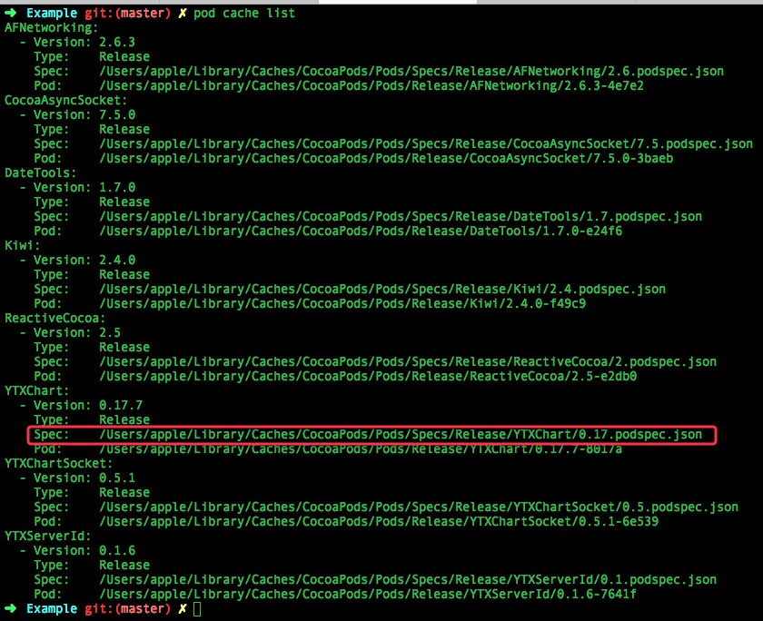
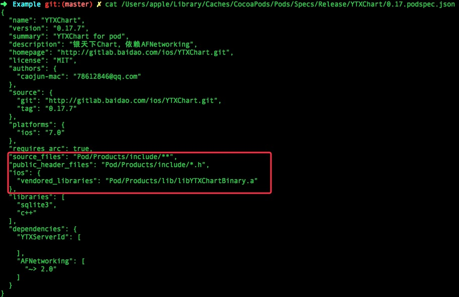
_删除cache和Pods目录。`IS_SOURCE=1 pod install`观察json。_ 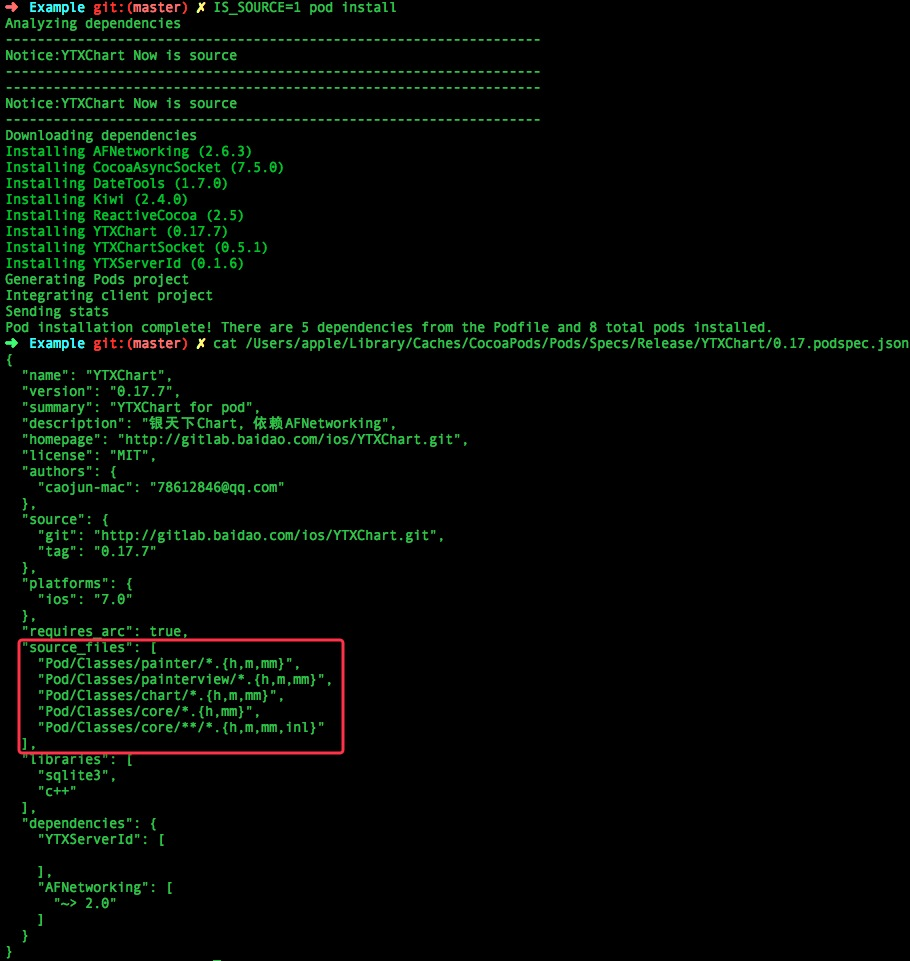

#####再进一步

当你删除了所有cache之后再`pod install`会比较慢，有时候我们只是想要查看某个库的源码，怎么办。

  * podspec中变成这样子`if ENV['IS_SOURCE'] || ENV["YTXChart_SOURCE"]`
  * 删除Pods/Pods.xcodeproj
  * 删除Pods/YTXChart
  * 删除YTXChart的cache`pod cache clean YTXChart`
  * 最后`YTXChart_SOURCE=1 pod install`

####总结：

  * 没有使用submodule或新的git仓库来构建出一个不包含依赖内容的静态库。一份原来的git仓库。
  * 没有因为构建二进制库而需要增加冗余的源代码。所以当你修改Pod/Classes中的源码，可以方便简单地执行buildbinary.sh脚本来构建出静态库。一份源码。
  * 共用了一份YTXChart.podspec
  * 没有大量修改YTXChart.podspec
  * 使用`pod lib lint`和`IS_SOURCE=1 pod lib lint`检查通过。
  * 没有修改Podfile。这个Example的Podflie只是测试需要才改的。主App项目中的Podfile可以一行都不改。不会出现`'~> 2.2.1.binary'`。
  * App中的源码不会因为使用了二进制CocoaPods组件而做任何修改。
  * 没有手动配置Search Path，这样更容易。
  * 在Example App中可以通过`IS_SOURCE`灵活地切换源码和二进制静态库。唯一一个问题每次切换要删除Pods目录和`pod cache clean --all`
  * 跑起Example App总是好的。
  * 没有影响到其他库，我可以逐步平滑地把YTXXXX一个一个做成二进制。

####下一步目标

_逐步平滑地把YTXXXX一个一个做成二进制_

_进一步的把第三方如AFNetwork在私有spec repo中做份镜像也提供二进制化_

_把Podfile中绝大部分组件都做成二进制（RN这种本地安装模式和有sub spec的库目前不打算二进制化）_

####关于资源文件，资源文件在二进制化中的配置是一样的

####另外，使用二进制化的CocoaPods库不会增加ipa的大小。所以我们应当优先用二进制化的东西，这可以加快Archive速度。

####关于有sub spec的CocoaPods组件

两个方案：

  * 提供一个全集
  * 对每一个sub spec都做份二进制并保持它们之间依赖的相互关系

####走过的弯路！！！！！！！！！！！！！！！！！！！！！！！！！！！！！！！！！

_现在这个解决方案看起来简单，但在当初的探索过程中并不是那么顺利。以下是不成功的尝试！_

#####创建另一个YTXChartBinary.podspec

  * 把生成的Products目录放到YTXChartBinary下
  * 把YTXChartBinary.podspec目录放到YTXChartBinary下
  * Podfile中通过增加Binary字段安装二进制化如`pod 'YTXChartBinary', '~> 0.17.7'`

_问题_

  * 要维护2个podspec。版本号很可能不统一。
  * 当`pod spec lint`报错：找不到相关文件。
  * Podfile中通过增加Binary字段来切换，非常不方便。
  * 要改App源码。当安装二进制的时候`<YTXChart/YTXChart.h>`需要改成`<YTXChartBinary/YTXChart.h>`。来回切换都需要改，极不方便。
  * 要改App源码。这次一劳永逸。直接这样使用`"YTXChart.h"`。但这样也不好。

#####创建另一个专门放二进制化的Spec Repo，通过不同的Source来区分

_解决了要改App源码的问题。只需要在Podfile中加个source。_

不同的source例子` source 'http://gitlab.baidao.com/ios/ytx-binary-pod-specs.git'  
source 'http://gitlab.baidao.com/ios/ytx-pod-specs.git'  
`

_问题_

  * 发布两次，lint两次。
  * 创建了2个Spec Repo。

####
原文出处：<a href='http://mdsb100-xiabigao.daoapp.io/ios-cocoapodszu-jian-ping-hua-er-jin-zhi-hua-jie-jue-fang-an-ji-xiang-xi-jiao-cheng-er-zhi-subspecpian/' target='blank'>iOS CocoaPods组件平滑二进制化解决方案及详细教程二之subspecs篇</a>

##iOS CocoaPods组件平滑二进制化解决方案及详细教程二之subspecs篇

####这篇文章主要想介绍以下几个部分：

  * subspecs基本概念
  * 实际应用的好处
  * 如何对含有subspecs的CocoaPods库进行二进制化

#####什么是CocoaPods的subspecs

来一个直观点的。顺便为自己的[YTXAnimations](https://github.com/baidao/YTXAnimations)做个广告。

在Podfile中，它是这样的：

    
    
    pod 'YTXAnimations', '~> 1.2.4', :subspecs => ["AnimateCSS", "Transformer"]  
    

在App中Pods/YTXAnimations文件目录下它是这样的：

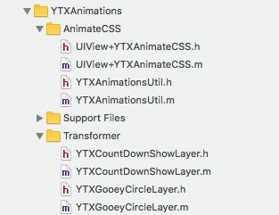

在CocoaPods项目开发时是这样的：

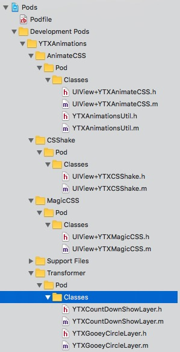

在podspec里是这样的：

    
    
        YTXAnimateCSS   = { :spec_name => "AnimateCSS" }
        YTXCSShake   = { :spec_name => "CSShake" }
        YTXMagicCSS   = { :spec_name => "MagicCSS" }
        $animations = [YTXAnimateCSS, YTXCSShake, YTXMagicCSS]
        $animations.each do |sync_spec|
            s.subspec sync_spec[:spec_name] do |ss|
                specname = sync_spec[:spec_name]
                sources = ["Pod/Classes/UIView+YTX#{specname}.*", "Pod/Classes/YTXAnimationsUtil.{h,m}"]
                ss.source_files = sources
                if sync_spec[:dependency]
                    sync_spec[:dependency].each do |dep|
                        ss.dependency dep[:name], dep[:version]
                    end
                end
            end
        end
        s.subspec "Transformer" do |ss|
          ss.source_files = ["Pod/Classes/YTXGooeyCircleLayer.{h,m}", "Pod/Classes/YTXCountDownShowLayer.{h,m}"]
        end
    

在一个podspec里我可以定义它的subspecs，给使用方提供了一种灵活的方式去获取相关源码，而不是全部源码。subspec之间也可以有依赖关系，依赖其他第三方库等。

如果是这样的用的话，就是全量。

    
    
    pod 'YTXAnimations', '~> 1.2.4'  
    

也有不少在github第三方库用了subspecs。比如：[ARAnalytics](https://github.com/orta/ARAnalytics)。

####谈谈作用：subspecs这种模式特别适合组件化开发。

比如有两个业务team A和B。他们各自维护一个业务组件A和业务组件B。原则上业务组件A和业务组件B之间不能相互依赖。但是很多时候组件A需要调用组件B的功能，接受组件B的回调。架构的时候我们会使用依赖协议或者依赖下沉等等方式去除他们之间的耦合。

但问题是我们还是需要集成在一起调试的。

一般做法就是在业务组件A的Example项目的Podfile中，加上依赖业务组件B：

    
    
    target 'TestBusinessAExampleApp' do  
      pod 'BusinessA', :path => "../"
      pod 'BusinessB', '~>1.2.1'
    end  
    

然后在Example App中串联起A和B，以达到调试的目的。

组件B作为一个业务肯定是很庞大的，所以编译慢。二进制化可以解决这个问题。作为Team A的人，我不需要关注组件B是否太大编译慢，依赖等问题。

举个例子，比如外卖和电影，外卖会送电影票。

很容易想到！业务组件A只依赖业务组件B的部分。组件B应该把这部分其实对外的内容尽量做成一个subspec或者正常结构划分，划分成依赖其中几个subspec。
这样业务组件A需要关心的事就更少了。当发生问题，Team A不得已想要查看业务组件B的源代码以查看是否问题出在了业务组件B的时候，TeamA的人员面对的不是整个业务组件B的业务源代码，而是部分其实对外的源代码。缩小依赖的二进制文件大小或源代码数量也是有显而易见的好处的。

嗯，调试源代码，我们应该：

  * 删除Pods目录
  * pod cache clean --all
  * IS_SOURCE=1 pod install

嗯，这已经在公司内部达成了一致，使用IS_SOURCE。

现在的业务组件A的Example项目的Podfile中应该变成了这样：

    
    
    target 'TestBusinessAExampleApp' do  
      pod 'BusinessA', :path => "../"
      pod 'BusinessB', '~>1.2.1' , :subspecs => ["SomeBusinessXXX"]
    end  
    

进一步的如果有个业务组件C要和业务组件B打交道，它的Example项目的Podfile应该这样写：

    
    
    target 'TestBusinessCExampleApp' do  
      pod 'BusinessC', :path => "../"
      pod 'BusinessB', '~>1.2.1' , :subspecs => ["SomeBusinessTTT"]
    end  
    

在主项目App中的Podfile是这样写：

    
    
    target 'DaMeiTuanApp' do  
      pod 'BusinessA', '~>3.0.5'
      pod 'BusinessB', '~>1.2.1'
      pod 'BusinessC', '~>2.2.0'
    end  
    

####下面开始说说subspec如何二进制化，如何在podspec中定义

如果没有特别说明，没有讲到细节的内容或方式都应该在教程一里

在教程一里面提到有subspecs的CocoaPods的组件二进制化方案，说了两个方案。最后选择的方案：是对每一个subspec都做份二进制并保持它们之间依赖的相互关系。

**为什么不使用全集？也就是把所有源码都变成.a呢？**

  * 使用方的Podfile就需要改写了。
  * 使用方本来希望只用AnimateCSS和Transformer，现在不得不把CSShake和MagicCSS也包含进来了。

**接下来以实际项目YTXUtilCategory作为例子来讲解。**

**方案就是：是对每一个subspec都做份二进制并保持它们之间依赖的相互关系。**

YTXUtilCategory是我们的一个提供公共通用方法和Category的类。在二进制化之前它大概是长这个样子的：  

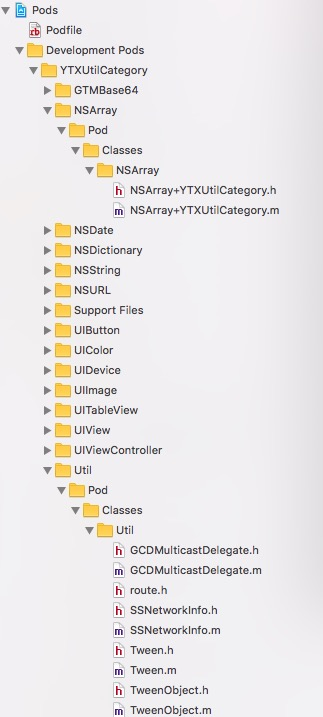

二进制化之前它的podspec是这样的：

    
    
    Pod::Spec.new do |s|  
      .......
      _all_names = []
      _GTMBase64         = { :spec_name => "GTMBase64",        :source_files => ['Pod/Classes/GTMBase64/GTM*.{h,m}'              ] }
      _UIColor           = { :spec_name => "UIColor",          :source_files => ['Pod/Classes/UIColor/UIColor+*.{h,m}'          ] }
      _UIView            = { :spec_name => "UIView",           :source_files => ['Pod/Classes/UIView/UIView+*.{h,m}'           ] }
      _UIImage           = { :spec_name => "UIImage",          :source_files => ['Pod/Classes/UIImage/UIImage+*.{h,m}'          ] }
      _UIDevice          = { :spec_name => "UIDevice",         :source_files => ['Pod/Classes/UIDevice/UIDevice+*.{h,m}'         ] }
      _UITableView       = { :spec_name => "UITableView",      :source_files => ['Pod/Classes/UITableView/UITableView+*.{h,m}'      ] }
      _UIViewController  = { :spec_name => "UIViewController", :source_files => ['Pod/Classes/UIViewController/UIViewController+*.{h,m}' ] }
      _UIButton          = { :spec_name => "UIButton",         :source_files => ['Pod/Classes/UIButton/UIButton+*.{h,m}'           ] }
      _NSURL             = { :spec_name => "NSURL",            :source_files => ['Pod/Classes/NSUR/NSURL+*.{h,m}'            ] }
      _NSArray           = { :spec_name => "NSArray",          :source_files => ['Pod/Classes/NSArray/NSArray+*.{h,m}'          ] }
      _NSDictionary      = { :spec_name => "NSDictionary",     :source_files => ['Pod/Classes/NSDictionary/NSDictionary+*.{h,m}'     ] }
      _NSDate            = { :spec_name => "NSDate",           :source_files => ['Pod/Classes/NSDate/NSDate+*.{h,m}'           ] ,     :dependency => [{:name => "DateTools",    :version => "~> 1.0"    }] }
      _NSString          = { :spec_name => "NSString",         :source_files => ['Pod/Classes/NSString/NSString+*.{h,m}'         ],
        :sub_dependency => [_GTMBase64] }
      _Util              = { :spec_name => "Util",             :source_files => ['Pod/Classes/Util/*.{h,m}'         ]}
      _FoundationAll     = { :spec_name => "FoundationAll",    :sub_dependency => [_NSString, _NSURL, _NSDate, _NSArray, _NSDictionary    ] }
      _UIAll             = { :spec_name => "UIAll",            :sub_dependency => [_UIColor, _UIView, _UIImage, _UIButton, _UIDevice, _UITableView, _UIViewController        ] }
      _all_subspec = [_GTMBase64, _UIColor, _UIView, _UIImage, _UIDevice, _UITableView, _UIViewController, _UIButton, _NSURL, _NSDate, _NSArray, _NSString, _NSDictionary, _Util, _FoundationAll, _UIAll]
      _all_subspec.each do |spec|
          s.subspec spec[:spec_name] do |ss|
              specname = spec[:spec_name]
              _all_names << specname
              if spec[:source_files]
                  ss.source_files = spec[:source_files]
              end
              if spec[:sub_dependency]
                  spec[:sub_dependency].each do |dep|
                      ss.dependency "YTXUtilCategory/#{dep[:spec_name]}"
                  end
              end
              if spec[:dependency]
                  spec[:dependency].each do |dep|
                      ss.dependency dep[:name], dep[:version]
                  end
              end
          end
      end
      spec_names = _all_names[0...-1].join(", ") + " 和 " + _all_names[-1]
      s.description = "拆分了这些subspec:#{spec_names}"
    end  
    

通过分析代码可以知道：

  * 有这些subspecs：GTMBase64, UIColor, UIView, UIImage, UIDevice, UITableView, UIViewController, UIButton, NSURL, NSDate, NSArray, NSString, NSDictionary, Util, FoundationAll, UIAll
  * NSDate依赖第三方DateTools。
  * NSString依赖兄弟GTMBase64。
  * FoundationAll依赖兄弟subspecs，自己没什么内容，或者说提供一个灵活的方式一口气纳入所有相关Foundation内容。
  * UIAll依赖兄弟subspecs，和FoundationAll想要做的是一样的。

相信各位读者看了这个podspec也就知道怎么创建自己的subspec了。或者看看[ARAnalytics](https://github.com/orta
/ARAnalytics)的podspec。

在App中的Podflie是这样用的：

    
    
    pod 'YTXUtilCategory','~> 1.2.0'  
    

或

    
    
    pod 'YTXUtilCategory','~> 1.2.0', :subspecs => ["UIColor", "FoundationALL"]  
    

从分析的结果来看我应该创建这些target：

 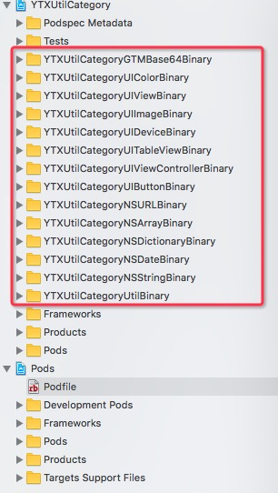

在Example/Podfile中根据target的名字增加以下内容并pod install：

    
    
    target 'YTXUtilCategoryGTMBase64Binary' do
    end
    .........省略
    target 'YTXUtilCategoryNSDateBinary' do  
      pod 'DateTools', '~> 1.0'
    end
    target 'YTXUtilCategoryUtilBinary' do
    end  
    

注意YTXUtilCategoryNSDateBinary，把它的第三方依赖加上。版本和podspec里描写的一致。

在根目录增加两个shell脚本。

buildbinary.sh和教程一的基本一致，只是改了第一行：

    
    
    #获得第一个参数
    PROJECT_NAME=$1  
    ##编译工程
    BINARY_NAME="${PROJECT_NAME}Binary"  
    

buildallbinary.sh

    
    
    pushd "$(dirname "$0")" > /dev/null  
    SCRIPT_DIR=$(pwd -L)  
    popd > /dev/null  
    #也可以写个for循环
    ./buildbinary.sh YTXUtilCategoryGTMBase64
    ......省略
    ./buildbinary.sh YTXUtilCategoryUtil
    

执行

    
    
    ./buildallbinary.sh
    

得到结果： 
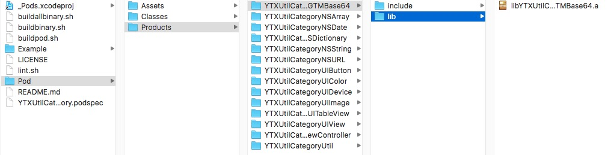

更改podspec内容为：

    
    
    Pod::Spec.new do |s|  
      ......省略
      _all_names = []
      _GTMBase64         = { :spec_name => "GTMBase64"}
      _UIColor           = { :spec_name => "UIColor"}
      _UIView            = { :spec_name => "UIView"}
      _UIImage           = { :spec_name => "UIImage"}
      _UIDevice          = { :spec_name => "UIDevice"}
      _UITableView       = { :spec_name => "UITableView"}
      _UIViewController  = { :spec_name => "UIViewController"}
      _UIButton          = { :spec_name => "UIButton"}
      _NSURL             = { :spec_name => "NSURL"}
      _NSArray           = { :spec_name => "NSArray"}
      _NSDictionary      = { :spec_name => "NSDictionary"}
      _NSDate            = { :spec_name => "NSDate", :dependency => [{:name => "DateTools",    :version => "~> 1.0"    }] }
      _NSString          = { :spec_name => "NSString", :sub_dependency => [_GTMBase64] }
      _Util              = { :spec_name => "Util"}
      _temp = [_GTMBase64, _UIColor, _UIView, _UIImage, _UIDevice, _UITableView, _UIViewController, _UIButton, _NSURL, _NSArray, _NSDictionary, _NSDate, _NSString, _Util]
      puts '-------------------------------------------------------------------'
      if ENV['IS_SOURCE']
        puts '-------------------------------------------------------------------'
        puts "Notice:#{s.name} is source now"
        puts '-------------------------------------------------------------------'
        _temp.each do |spec|
          spec[:source_files]=["Pod/Classes/#{spec[:spec_name]}/*.{h,m}"]
        end
      else
        puts '-------------------------------------------------------------------'
        puts "Notice:#{s.name} is binary now"
        puts '-------------------------------------------------------------------'
        _temp.each do |spec|
            spec[:source_files]=["Pod/Products/#{s.name}#{spec[:spec_name]}/include/**"]
            spec[:public_header_files]=["Pod/Products/#{s.name}#{spec[:spec_name]}/include/*.h"]
            spec[:vendored_libraries]=["Pod/Products/#{s.name}#{spec[:spec_name]}/lib/*.a"]
        end
      end
      _FoundationAll     = { :spec_name => "FoundationAll",    :sub_dependency => [_NSString, _NSURL, _NSDate, _NSArray, _NSDictionary    ] }
      _UIAll             = { :spec_name => "UIAll",            :sub_dependency => [_UIColor, _UIView, _UIImage, _UIButton, _UIDevice, _UITableView, _UIViewController        ] }
      _all_subspec = [_GTMBase64, _UIColor, _UIView, _UIImage, _UIDevice, _UITableView, _UIViewController, _UIButton, _NSURL, _NSDate, _NSArray, _NSString, _NSDictionary, _Util, _FoundationAll, _UIAll]
      _all_subspec.each do |spec|
          s.subspec spec[:spec_name] do |ss|
              specname = spec[:spec_name]
              _all_names << specname
              if spec[:source_files]
                  ss.source_files = spec[:source_files]
              end
              if spec[:public_header_files]
                  ss.public_header_files = spec[:public_header_files]
              end
              if spec[:vendored_libraries]
                  ss.ios.vendored_libraries = spec[:vendored_libraries]
              end
              if spec[:sub_dependency]
                  spec[:sub_dependency].each do |dep|
                      ss.dependency "YTXUtilCategory/#{dep[:spec_name]}"
                  end
              end
              if spec[:dependency]
                  spec[:dependency].each do |dep|
                      ss.dependency dep[:name], dep[:version]
                  end
              end
          end
      end
      spec_names = _all_names[0...-1].join(", ") + " 和 " + _all_names[-1]
      s.description = "拆分了这些subspec:#{spec_names}"
    end  
    

难点其实在于podspec如何写，如何描述subspec之间的关系，如何拆分subspec。

假如a.h和b.h都用到了c.h，而a.h隶属于subspec A，而b.h隶属于subspec B。那你应该做一个subspec
C其中包含c.h。而A和B都依赖C。

要避免a.h依赖b.h，b.h依赖a.h这种循环依赖的问题。

**到此为止，含有subspec的CocoaPods库就这么简单的完成了。**

####后记，在做subspec二进制化遇到的问题

    
    
    _all_sync.each do |sync_spec|  
      ...
      ss.prefix_header_contents = "#define YTX_#{specname.upcase}_EXISTS 1"
      ... 
    end  
    

注意ss. ss.prefix_header_contents这段。加了一个宏。然后在这里会用到:

    
    
    #import "YTXRestfulModel.h"
    #ifdef YTX_USERDEFAULTSTORAGESYNC_EXISTS
    #import "YTXRestfulModelUserDefaultStorageSync.h"
    #endif
    #ifdef YTX_AFNETWORKINGREMOTESYNC_EXISTS
    #import "AFNetworkingRemoteSync.h"
    #endif
    #ifdef YTX_YTXREQUESTREMOTESYNC_EXISTS
    #import "YTXRestfulModelYTXRequestRemoteSync.h"
    #endif
    #ifdef YTX_FMDBSYNC_EXISTS
    #import "YTXRestfulModelFMDBSync.h"
    #import "NSValue+YTXRestfulModelFMDBSync.h"
    #endif
    

在源码的情况下，如果我想要用YTXRequestRemote这个subspec，那么引入YTXRequestRemote时会自带宏YTX_YTXREQUES TREMOTESYNC_EXISTS，YTXRestfulModel在编译时会根据宏引入相关头文件。

问题来了，宏都是预编译的。当我编译出二进制时，内容已经决定了。这样就丧失了subspec的动态性了。所以关键的问题在于当初设计的时候没有考虑好。

希望大家看到这个例子后，避免将来遇到相思的问题。目前没有想到好的解决方案，所以这个库并没有二进制化。

 

####
原文出处：<a href='http://mdsb100-xiabigao.daoapp.io/wo-suo-li-jie-de-zu-jian-er-jin-zhi-hua/' target='blank'>我所理解的组件化之路</a>

##我所理解的组件化之路

####为什么会有这篇文章呢？

和之前的同事"我是你爸爸"讨论了关于组件化的事，对我有很大的启发。在此特别感谢"我是你爸爸"。

最近写了关于组件[二进制化的文章](http://www.yiqixiabigao.com/ios-cocoapodszu-jian-ping-hua-er-jin-zhi-hua-fang-an-ji-xiang-xi-jiao-cheng/)的文章，有点感触。

一些朋友来问我关于CocoaPods的问题提到了组件化。

自己一开始准备写《组件化之路》的博文的，但是后来发现我的理解是有偏差的。

**以上，所以我想写一篇关于《我所理解的组件化之路》的博文来阐述自己的观点。**

####先提出一个新词，我自己想的。叫做“CocoaPods化”或叫做“library化”

什么叫做CocoaPods化？

CocoaPods化也就是我们公司正在做的。随着业务的扩展，有了多个App，有了多个Team，我们希望把一些代码重用。使用CocoaPods把他们做成library是个很好的选择。也可以说是CocoaPods化之路。

1.和业务无关。  
开始做这件事的时候，我们会容易的想要把那些Util、Category、JSBrige等等这些和业务无关的源码搞在一起做成一个一个CocoaPods库。它们变成了YTXUtilCategory、YTXWebViewJavaScriptBridge、YTXNibBrige、YTXAnimations这些库。

2.弱业务  
接下来，进一步地我们会把那些比如网络请求、Server配置、行情图、行情Socket等等这些弱业务的源码搞在一起。她们变成了YTXRequest、YTXServerId、YTXChart、YTXChartSocket、YTXChatUI等等。

为什么说是弱业务呢，稍微分析下。比如YTXRequest、YTXChartSocket、YTXServerId在公司内部各个App，各个Team之间是通用的，在各个业务组件之间可以重用和组合使用；又带着鲜明的公司特色，没法直接开源了就能让其他开发者使用。

_如果只做到了前2步，我觉得不能称之为组件化。只能叫做CocoaPods化或Library化。_

3.业务  
这一步，到目前来说没有做。所以没法举我自己实际的例子。

比如拿美团App做例子来说。一条业务线是外卖，一条业务线是电影。分别由2个Team维护开发（技术，产品，测试等）。有各自的KPI。这两条业务线是自洽的，是分治的。

外卖是一个业务组件，电影也是一个业务组件。里面包含了各种内容，各种依赖。外卖可以手写autolayout，电影可以用storyboard。外卖可以用mvc，电影可以mvvm。想怎么搞就怎么搞。他们两个就像独立的App一样。

有不少朋友包括我自己之前，认为做了前2步就是组件化了。只有真正做到了第3步，并且完善了相关架构，我才认为能称之为组件化。

那么我们来看看真正的组件化应该包含什么，什么情况适合组件化。业界内部的讨论已经有很多了，我来列举下我自己的看法。

画一个图： 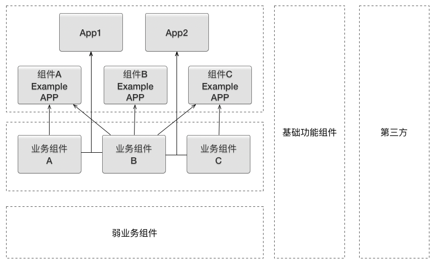

**适合的情况**

  * 业务上要分治。
  * Team规模大，30人+。
  * 业务越来越多，越来越大。

如果不符合这些情况，我认为做组件化没有意义。因为性价比太低。

有一种情况表面上都符合上面列的条件，但实际上不适合组件化：例如我们公司。虽然有好几个iOS Team，虽然总人数上超过了30人，但每一个Team都只有6～10人。每个Team各自维护各自的一个App，各个App业务上没有交集，只公用1和2步的CocoaPods库。就算有交集，做相同的业务，也不打算公用或重用这部分代码（内部有竞争关系）。

我们公司这种情况就像是拆分成了好几个无关的小公司，大家都用了github上的一些CocoaPods库一样。

还好早期推了第1步和第2步，避免了每个Team之间都去造差不多功能的轮子，而能把精力尽量集中在各自的业务上，避免了一些资源浪费。

**我认为需要包含什么（不分先后顺序）**

  * App生命周期及事件如何下发给业务组件。
  * 业务组件之间没有依赖关系，需要解耦。
  * 解决组件化页面跳转的问题。
  * 解决业务组件之间通信的问题。
  * 解决如何划分抽象业务组件、基础功能组件（业务无关）和弱业务组件。
  * 统一的网络服务，本地存储方式等。
  * 去Model化。
  * 如何披露接口信息，调用方式，参数等等。
  * 明确组件的生命周期。
  * 提供二进制化方案。
  * 组件的subspec。
  * 版本规范。
  * 持续集成。
  * 代码准入制度。
  * 统一的命名规范。
  * 集成调试。
  * 代码维护。

所以我们得出的结论是：不轻易组件化。而是统筹规划好以上所有的内容。可以不用一步就位全部做好，但要预先想好每一步的解决方案；能够承上启下。

如果你要问我说哪一步比较重要，我觉得都挺重要的。要结合自己的实际情况，去排一个优先级。

#####App生命周期及事件如何下发给业务组件

例如：applicationDidEnterBackground，didRegisterUserNotificationSettings，didReceiv
eRemoteNotification等等。 通过注册方式，App向注册的业务组件中的协议发送消息。

#####业务组件之间没有依赖关系，需要解耦

通过依赖协议，或依赖下沉等方式解耦。准确拆分业务组件，弱业务组件，基础功能组件。保证单一原则、DRY 原则等。

#####解决组件化页面跳转的问题

各种router。比如[MGJRouter](https://github.com/mogujie/MGJRouter)。
我不建议是淡出使用URL传参。理由是可以传参的对象受限制。

我们自己有一套叫GOTO的东西。使用分类。唯一的问题，你需要知道你要跳转页面的去model化参数是什么，代表该页面的枚举是什么，目前没法注册。

#####解决业务组件之间通信的问题

组件间需要相互调用，监听回调。不是说不能相互依赖么？对，可以通过依赖协议或中间件（依赖下沉）等方式解决这个问题。比如[CTMediator](https://github.com/casatwy/CTMediator)。CTMediator应该是属于依赖下沉的方式。

#####解决如何划分抽象业务组件、基础功能组件（业务无关）和弱业务组件

这个得要从各自的实际情况出发。但有几个原则可以借鉴：

  * 重要性
  * 重用性
  * 单一性

#####统一的网络服务，本地存储方案等

可以通过创建弱业务Pod库解决这个问题。

为什么要这么做？ Team之间人员调动后可以快速入手。

#####去Model化

业务组件间通讯尽量去Model化。否则就得把该Model单独做成Pod库。

去Model化后，比如使用NSDictionary如何及时传播具体的参数信息？（文档？口口相传？写在头文件？）

#####如何披露接口信息、调用方式、参数和一些规则等等

文档？口口相传？写在头文件？使用协议？

各有利弊和适用场景。

按目前情况，我们选择写在头文件。

#####明确组件的生命周期。

明确组件的生命周期，就能在App中统一的创建，注册，集成，协作，销毁。

#####提供二进制化方案

二进制化方案能够提高编译速度，提升开发效率。集中注意力在自己维护的业务组件上。 [二进制化方案](http://www.yiqixiabigao.com/ios-cocoapodszu-jian-ping-hua-er-jin-zhi-hua-fang-an-ji-xiang-xi-jiao-cheng/)。

#####组件的subspec。

[subspec](http://www.yiqixiabigao.com/ios-cocoapodszu-jian-ping-hua-er-jin-zhi-hua-jie-jue-fang-an-ji-xiang-xi-jiao-cheng-er-zhi-subspecpian/)教程。
使用subspec可以降低集成调试门槛。集中注意力在自己维护的业务组件上。让组件间依赖更清晰。

#####版本规范

可以参考[semver](http://semver.org/)。

也可以参考我们的： 组件的依赖版本尽量宽泛一点，精确到minor就行。在App里精确到patch就可以了。然后大家只要按照规范发版本就可以了。参考一下这个[
规范](http://www.yiqixiabigao.com/yin-tian-xia-cocoapodshi-yong-gui-fan/)。

#####持续集成

主要工具可以有：[gitlab runner](https://gitlab.com/gitlab-org/gitlab-ci-multi-runner)，
[jenkins](https://jenkins.io/)，[fastlne](https://github.com/fastlane/fastlane)
，[fir.im](http://fir.im/)。

持续集成我们是这样做的。

CI工具是[gitlab runner](https://gitlab.com/gitlab-org/gitlab-ci-multi-
runner)。每当一定条件下，会触发build IPA并且上传到[fir.im](http://fir.im/)。

dev分支用的是dev证书。  
master分支用的是adhoc证书。

测试人员可以通过<http://fir.im/TestXXApp或http://fir.im/XXApp来分别下载。>

.gitlab-ci.yml中的构建和上传看起来是这样的：

    
    
    xcodebuild -exportArchive -archivePath 'build/p4.xcarchive' -exportPath 'build' -exportOptionsPlist exportOptionsDebug.plist | xcpretty
    fir publish build/*.ipa -c $CI_BUILD_REF -T $FIR_TOKEN_DEBUG  
    

在组件化开发中，一定条件应该是：

  * 业务组件发版更新（会自动修改App的Podfile，然后正常push。修改的部分不只是业务组件的版本号，业务组件可能需要更高版本的其他组件或第三方组件，它会在Podfile中一并修改这些库的版本号）
  * dev/master分支正常push
  * 手动触发

#####代码准入

Build/Test/Lint，code review，CI。

有了CI，就可以谈谈代码准入了。

  1. Build正常构建成功 
  2. 单元测试通过（我们用的[Kiwi](https://github.com/kiwi-bdd/Kiwi)） 
  3. Lint通过   

    1. [deploymate](http://www.deploymateapp.com/)检查API
    2. [OCLint](http://oclint.org/)检查代码
    3. CocoaPods Lint。不仅会Build一遍，还会检查podspec相关内容设置的对不对。如果没有用--allow-warnings的参数，有waring发生Lint是会不通过的。（建议把warning当作error，不要使用--allow-warings参数）
    4. Code Review。 
      1. 检查发版规范。比如：我们更改了一个弱业务组件，升了一个patch版本号，但其实不只是修了bug，而且还增加了向前兼容的新功能，这个时候应该升的是minor版本号。
      2. 检查代码风格。
      3. 检查潜在的bug。
      4. 检查其他只有人能看得出的问题。

.gitlab-ci.yml中的OCLint和dploymate看起来是这样的：

    
    
    Deploymate --cli -t jryMobile p4.xcworkspace -V 8.0 -x
    xcodebuild -workspace p4.xcworkspace -scheme p4 -configuration Adhoc -archivePath 'build/p4' archive | tee xcodebuild.log | xcpretty
    oclint-xcodebuild xcodebuild.log
    oclint-json-compilation-database -e Pods -e Chart -e Chart/core/jsoncpp -e RKNotificationHub.m -e TTMessage.mm -e SSNetworkInfo.m -e Tween.mm -e 略...... && echo 'OCLint Passed' || (cat report.json && exit 1)  
    

#####命名规范

公司名+组件名+具体名字

#####集成调试

各自业务组件如何调试？应该就和在主App中一样，只需要在Example App中依赖相关的其他业务组件即可。

另一种情况是，当业务组件版本更新时需要自动修改主App的Podfile中的版本，自上而下的触发集成。

#####代码维护

谁来维护基础功能组件和弱业务组件？如何保证某个Team提交代码后不会影响其他Team。（包含了：代码准入，集成调试，相互协作，版本规范）

需要一个Team专门来做这个事情。

补充：写在主App中的业务，要把自己当作业务组件，不能够依赖其他业务组件。

####
原文出处：<a href='http://mdsb100-xiabigao.daoapp.io/yin-ke-kong-gu-iosman-man-zu-jian-hua-kai-fa-zhi-lu/' target='blank'>iOS App组件化开发实践</a>

##iOS App组件化开发实践

###前因

其实我们这个7人iOS开发团队并不适合组件化开发。原因是因为性价比低，需要花很多时间和经历去做这件事，带来的收益并不能彻底改变什么。但是因为有2～3个星期的空档期，并不是很忙；另外是可以用在一个全新的App上。所以决定想尝试下组件化开发。

所谓尝试也就是说：去尝试解决组件化开发当中的一些问题。如果能解决，并且有比较好的解决方案，那就继续下去，否则就放弃。

###背景

脱离实际情况去谈方案的选型是不合理的。

所以先简单介绍下背景：我们是一家纳斯达克交易所上市的科技企业。我们公司还有好几款App，由不同的几个团队去维护，我们是其中之一。我们这个团队是一个7人的iOS开发小团队。作者本人是小组长。

之前的App已经使用了模块化（CocoaPods）开发，并且已经使用了**[二进制化](http://www.yiqixiabigao.com/ios-cocoapodszu-jian-ping-hua-er-jin-zhi-hua-fang-an-ji-xiang-xi-jiao-cheng/)**方案。App已经在使用自动化集成。

虽然要开发一个新App，但是很多业务和之前的App是一样的或者相似的。

###为什么要写这篇博客？

想把整个过程记录下来，方便以后回顾。

**我们的思路和解决方案不一定是对的或者是最好的。所以希望大家看了这篇博客之后，能给我们提供很多建议和别的解决方案，让我们可以优化使得这个组件化开发的方案能变得更加好。**

###技术栈

[gitlab](https://about.gitlab.com/) [gitlab-runner](https://gitlab.com/gitlab-org/gitlab-ci-multi-runner)
[CocoaPods](https://github.com/CocoaPods/CocoaPods) [CocoaPods-
Packager](https://github.com/CocoaPods/cocoapods-packager)
[fir](http://fir.im/) [二进制化](http://www.yiqixiabigao.com/ios-cocoapodszu-jian-ping-hua-er-jin-zhi-hua-fang-an-ji-xiang-xi-jiao-cheng/)
[fastlane](https://github.com/fastlane/fastlane)
[deploymate](http://www.deploymateapp.com/) [oclint](http://oclint.org/)
[Kiwi](https://github.com/kiwi-bdd/Kiwi)

###成果

使用组件化开发App之后：

  * 代码提交更规范，质量提高。体现在测试人员反馈的bug明显减少。
  * 编译加快。在都是源码的情况下：原App需要150s左右整个编译完毕，然后开发人员才可以开始调试。而现在组件化之后，某个业务组件只需要10s～20s左右。在依赖二进制化组件的情况下，业务组件编译速度一般低于10s。
  * 分工更为明确，从而提升开发效率。
  * 灵活，耦合低。
  * 结合MVVM。非常细致的单元测试，提高代码质量，保证App稳定性。体现在测试人员反馈的bug明显减少。
  * 回滚更方便。我们经常会发生业务或者UI变回之前版本的情况，以前我们都是checkout出之前的代码。而现在组件化了之后，我们只需要使用旧版本的业务组件Pod库，或者在旧版本的基础上再发一个Pod库。
  * 新人更容易上手。

对于我来说：

  * 更加容易地把控代码质量。
  * 更加容易地知道小组成员做了些什么。
  * 更加容易地分配工作。
  * 更加容易地安排新成员。

####解耦

我们的想法是这样的，就算最后做不成组件化开发，把这些应该重用的代码抽出来做成Pod库也没有什么影响。所以优先做了这一步。

**哪些东西需要抽成Pod库？**

我们之前的App已经使用了模块化（CocoaPods化）开发。我们已经把会在App之间重用的Util、Category、网络层和本地存储等等这些东西抽成了Pod库。还有一些和业务相关的，比如YTXChart,YTXChartSocket；这些也是在各个App之间重用的。

**所以得出一个很简单的结论：要在App之间共享的代码就应该抽成Pod库，把它们作为一个个组件。**

我们去仔细查看了原App代码，发现很多东西都需要重用而我们却没有把它们组件化。

**为什么没有把这些代码组件化？**

因为当时没想好怎么解耦，举个例子。

有一个类叫做YTXAnalytics。是依赖UMengAnalytics来做统计的。
它的耦合是在于一个方法。这个方法是用来收集信息的。它依赖了User，还依赖了currentServerId这个东西。

    
    
    + (NSDictionary*)collectEventInfo:(NSString*)event withData:(NSDictionary*)data
    {
    .......
        return @{
            @"event" : event,
            @"eventType" : @"event",
            @"time" : [[[NSDate date] timeIntervalSince1970InMillionSecond] stringValue],
            @"os" : device.systemName,
            @"osVersion" : device.systemVersion,
            @"device" : device.model,
            @"screen" : screenStr,
            @"network" : [YTXAnalytics networkType],
            @"appVersion" : [AppInfo appVersion],
            @"channel" : [AppInfo marketId],
            @"deviceId" : [ASIdentifierManager sharedManager].advertisingIdentifier.UUIDString,
            @"username" : objectOrNull([YTXUserManager sharedManager].currentUser.username),
            @"userType" : objectOrNull([[YTXUserManager sharedManager].currentUser.userType stringValue]),
            @"company" : [[ServiceProvider sharedServiceProvider].currentServerId stringValue],
            @"ip" : objectOrNull([SSNetworkInfo currentIPAddress]),
            @"data" : jsonStr
        };
    }
    

解决方案是，搞了一个block，把获取这些信息的责任丢出来。

    
    
         [YTXAnalytics sharedAnalytics].analyticsDataBlock = ^ NSDictionary *() {
            return @{
                     @"appVersion" : objectOrNull([PBBasicProviderModule appVersion]),
                     @"channel" : objectOrNull([PBBasicProviderModule marketId]),
                     @"username" : objectOrNull([PBUserManager shared].currentUser.username),
                     @"userType" : objectOrNull([PBUserManager shared].currentUser.userType),
                     @"company" : objectOrNull([PBUserManager shared].currentUser.serverId),
                     @"ip" : objectOrNull([SSNetworkInfo currentIPAddress])
                     };
        };
    

我们的耦合大多数都是这种。解决方案都是弄了一个block，把获取信息的职责丢出来到外面。

我们解耦的方式就是以下几种：

1.把它依赖的代码先做成一个Pod库，然后转而依赖Pod库。有点像是“依赖下沉”。

2.使用category的方式把依赖改成组合的方式。

3.使用一个block或delegate（协议）把这部分职责丢出去。

4.直接copy代码。copy代码这个事情看起来很不优雅，但是它的好处就是快。对于一些不重要的工具方法，也可以直接copy到内部来用。

####初始化

AppDelegate充斥着各种初始化。  
比如我们自己的代码。已经只是截取了部分！

    
    
        [self setupScreenShowManager];
        //event start
        [YTXAnalytics createYtxanalyticsTable];
        [YTXAnalytics start];
        [YTXAnalytics page:APP_OPEN];
        [YTXAnalytics sharedAnalytics].analyticsDataBlock = ^ NSDictionary *() {
            return @{
                     @"appVersion" : objectOrNull([AppInfo appVersion]),
                     .......
                     @"ip" : objectOrNull([SSNetworkInfo currentIPAddress]),
                     };
        };
        [self registerPreloadConfig];
        //Migrate UserDefault 转移standardUserDefault到group
        [NSUserDefaults migrateOldUserDefaultToGroup];
        [ServiceProvider sharedServiceProvider];
        [YTXChatManager sharedYTXChatManager];
        [ChartSocketManager sharedChartSocketController].delegate = [ChartProvider sharedChartProvider];
        //初始化最初的行情集合
        [[ChartProvider sharedChartProvider] addMetalList:[ChartSocketManager sharedChartSocketController].quoteList];
        //初始化环信信息Manager
        [YTXEaseMobManager sharedManager];
    

比如第三方：

    
    
        //注册环信
        [self setupEaseMob:application didFinishLaunchingWithOptions:launchOptions];
        //Talking Data
        [self setupTalkingData];
        [self setupAdTalkingData];
        [self setupShareSDK];
        [self setupUmeng];
        [self setupJSPatch];
        [self setupAdhocSDK];
        [YTXGdtAnalytics communicateWithGdt];//广点通
    

首先这些初始化的东西是会被各个业务组件都用到的。

那我组件化开发的时候，每一个业务组件如何保证我使用这些东西的时候已经初始化过了呢？难道每一个业务组件都初始化一遍？有参数怎么办，能不能使用单例？

但问题是第三方库基本都需要注册一个AppKey，我每一个业务组件里都写一份？那样肯定不好，那我配置在主App里的info.plist里面，每一个业务组件都初始化一下好了，也不会有什么副作用。但这样感觉不优雅，而且有很多重复代码。万一某个AppKey或重要参数改了，那每一个业务组件岂不是都得改了。这样肯定不行。另
外一点，那我的业务组件必须依赖主App的内容了。无论是在主App里调试还是把主App的info.plist的相关内容拷贝过来使用。

更关键的是有一些第三方的库需要在application: didFinishLaunchingWithOptions:时初始化。

    
    
    //初始化环信，shareSDK, 友盟, Talking Data等
    [self setupThirdParty:application didFinishLaunchingWithOptions:launchOptions];
    

有没有更好的办法呢？

首先我写了一个[YTXModule](https://github.com/mdsb100/YTXModule/blob/master/Example/Tests/TestYTXModuleSpec.m)。它利用runtime，不需要在AppDelegate中添加任何代码，就可以捕获App生命周期。

在某个想获得App生命周期的类中的.m中这样使用：

    
    
    YTXMODULE_EXTERN()  
    {
        //相当于load
        isLoad = YES;
    }
    + (BOOL)application:(UIApplication *)application willFinishLaunchingWithOptions:(nullable NSDictionary *)launchOptions
    {
        //实现一样的方法名，但是必须是静态方法。
        return YES;
    }
    

####分层

因为在解决初始化问题的时候，要先设计好层级结构。所以这里突然跳转到分层。

上个图： 

我们自己定了几个原则。

  * 业务组件之间不能有依赖关系。
  * 按照图示不能跨层依赖。
  * 所谓弱业务组件就是包含着少部分业务，并且可以在这个App内的各个业务组件之间重用的代码。
  * 要依赖YTXModule的组件一定要以Module结尾，而且它一定是个业务组件或是弱业务组件。
  * 弱业务组件以App代号开头（比如PB），以Module结尾。例：PBBasicProviderModule。
  * 业务组件以App代号开头（比如PB）BusinessModule结尾。例：PBHomePageBusinessModule。

业务组件之间不能有依赖关系，这是公认的的原则。否则就失去了组件化开发的核心价值。

弱业务组件之间也不应当有依赖关系。如果有依赖关系说明你的功能划分不准确。

####初始化设计

我们约定好了层级结构，明确了职责之后。我们就可以跳回初始化的设计了。

创建一个PBBasicProviderModule弱业务组件。

  * 它通过依赖YTXModule来捕捉App生命周期。
  * 它来负责初始化自己的和第三方的东西。
  * 所有业务组件都可以依赖这个弱业务组件。
  * 它来保证所有东西一定是是初始化完毕的。
  * 它来统一管理。
  * 它来暴露一些类和功能给业务组件使用。

反正就是业务组件中依赖PBBasicProviderModule，它保证它里面的所有东西都是好用的。

因为有了PBBasicProviderModule，所以才让我更明确了弱业务组件这个概念。

因为我们懒，如果把PBBasicProvider定义为业务组件。那它和其他业务组件之间的通信就必须通过Bus、Notification或协议等等。

但它又肯定是业务啊。因为那些AppKey肯定是和这个App有关系的，也就是App的相关配置和参数也可以说是业务；我需要初始化设置那些Block依赖User信息、CurrentServerId等等肯定都是业务啊。

那只好搞个弱业务出来啊。因为我不能打破这个原则啊：业务组件之间不能互相依赖。

再进一步分清弱业务组件和业务组件。

业务组件里面基本都有：storyboard、nib、图片等等。弱业务组件里面一般没有。这不是绝对的，但一般情况是这样。

业务组件一般都是App上某一具体业务。比如首页、我、直播、行情详情、XX交易大盘、YY交易大盘、XX交易中盘、资讯、发现等等。而弱业务组件是给这些业务组件提供功能的，自己不直接表现在App上展示。

我们还可以创建一些弱业务组件给业务组件提供功能。当然了，不能够滥用。需要准确划分职责。

最后，代码大概是这样的：

    
    
    @implementation PBBasicProviderModule
    YTXMODULE_EXTERN()  
    {
    }
    + (BOOL)application:(UIApplication *)application didFinishLaunchingWithOptions:(nullable NSDictionary *)launchOptions
    {
        [self setupThirdParty:application didFinishLaunchingWithOptions:launchOptions];
        [self setupBasic:application didFinishLaunchingWithOptions:launchOptions];
        return YES;
    }
    + (void) setupThirdParty:(UIApplication *)application didFinishLaunchingWithOptions:(NSDictionary *)launchOptions
    {
        dispatch_async(dispatch_get_global_queue(DISPATCH_QUEUE_PRIORITY_HIGH, 0), ^{
            [self setupEaseMob:application didFinishLaunchingWithOptions:launchOptions];
            [self setupTalkingData];
            [self setupAdTalkingData];
            [self setupShareSDK];
            [self setupJSPatch];
            [self setupUmeng];
    //        [self setupAdhoc];
        });
    }
    + (void) setupBasic:(UIApplication *)application didFinishLaunchingWithOptions:(NSDictionary *)launchOptions
    {
        [self registerBasic];
        [self autoIncrementOpenAppCount];
        [self setupScreenShowManager];
        [self setupYTXAnalytics];
        [self setupRemoteHook];
    }
    + (YTXAnalytics) sharedYTXAnalytics
    {
        return ......;
    }
    ......
    

####设想

这个PBBasicProviderModule简直就是个大杂烩啊，把很多以前写在AppDelegate里的东西都丢在里面了。毫无优雅可言。

的确是这样的，感觉没有更好的办法了。

既然已经这样了。我们可不可以大胆地设想一下：每个开发者开发自己负责的业务组件的时候不需要关心主App。

因为我知道美团的组件化开发必须依赖主App的AppDelegate的一大堆设置和初始化。所以干脆他们就直接在主App中集成调试，他们通过二进制化和去Pod依赖化的方式让主App的构建非常快。

所以我们是不是可以继续污染这个PBBasicProviderModule。不需要在主App项目里的AppDelegate写任何初始化代码？基本或者尽量不在主App里写任何代码？改依赖主App变为依赖这个弱业务组件？

按照这个思路我们搬空了AppDelegate里的所有代码。比如一些初始化App样式的东西、初始化RootViewController等等这些都可以搬到一个新的弱业务组件里。

而业务组件其实根本不需关心这个弱业务组件，开发人员只需要在业务组件中的Example
App中的AppDelegate中初始化自己业务组件的RootViewController就好了。

其他的事情交给这个新的弱业务组件就好了。而主App和Example App只要在Podfile中依赖它就好了。

所以最后的设想就是：开发者不会去改主App项目，也不需要知道主App项目。对于开发者来说，主App和业务组件之间是隔绝的。

有一个更大的好处，我只要更换这个弱业务组件，这个业务组件就能马上适配一个新App。这也是某种意义上的解耦。

####Debug/Release

谁说不用在主App里的AppDelegate写任何代码的，打脸。。。

我们在对二进制Pod库跑测试的发现，源码能过，二进制(.a)不能过。百思不得其解，然后仔细查看代码，发现是这个宏的锅：

    
    
    #ifdef DEBUG
    #endif
    

DEBUG在编译阶段就已经决定了。二进制化的时候已经编译完成了。  
而我们的代码中充满着#ifdef DEBUG
就这样这样。那怎么办，这是二进制化的锅。但是我们的二进制化已经形成了标准，大家都自觉会这么做，怎么解决这个问题呢。

解决方案是：

创建了一个PBEnvironmentProvider。大家都去依赖它。

然后原来判断宏的代码改成这样：

    
    
    if([PBEnvironmentProvider testing])  
    {
    //...
    }
    

在主App的AppDelegate中这样：

    
    
    #if DEBUG && TESTING
    //PBEnvironmentProvider提供的宏
    CONFIG_ENVIRONMENT_TESTING  
    #endif
    

原理是：如果AppDelegate有某个方法（CONFIG_ENVIRONMENT_TESTING宏会提供这个方法），[PBEnvironmentProvider testing]得到的结果就是YES。

为什么要写在主App里呢？其实也可以丢在PBBasicProviderModule里面，提供一个方法啊。

因为主App的AppDelegate.m是源码，未经编译。另外注意TESTING这个宏。我们可以在xcode设置里加一个macro参数TESTING，并且修改为0的情况下，能够生成一个实际是DEBUG的App但里面内容却是线上的内容。

这个需求是来自于我们经常需要紧急通过xcode直接build一个app到手机上以解决或确认线上的问题。

虽然打脸了，但是也还好，以后也不用改了。再说这个是特殊需求。除了这个之外，主App没有其他代码了。

###业务组件间通信

我们解决了初始化和解耦的问题。接下来只要解决组件间通信的问题就好了。

然后我找了几个第三方库，选用了[MGJRouter](https://github.com/mogujie/MGJRouter)。本来直接依赖它就好了。

后来觉得都使用Block的方式会导致这样的代码，全部堆在了一个方法里：

    
    
    + (void) setupRouter
    {
    ......
    [MGJRouter registerURLPattern:@"mgj://foo/a" toHandler:^(NSDictionary *routerParameters) {
        NSLog(@"routerParameterUserInfo:%@", routerParameters[MGJRouterParameterUserInfo]);
    }];
    [MGJRouter registerURLPattern:@"mgj://foo/b" toHandler:^(NSDictionary *routerParameters) {
        NSLog(@"routerParameterUserInfo:%@", routerParameters[MGJRouterParameterUserInfo]);
    }];
    ......
    }
    

这样感觉很不爽。那我干脆就把MGJRouter代码复制了下来，把Block改成了@selector。并且把它直接加入了[YTXModule](https://github.com/mdsb100/YTXModule/blob/master/Example/Tests/TestYTXModuleSpec.m)里面。并且使用了宏，让结果看起来优雅些。代码看起来是这样的：

    
    
    //在某个类的.m里，其实并不需要继承YTXModule也可以使用该功能
    YTXMODULE_EXTERN_ROUTER_OBJECT_METHOD(@"object1")  
    {
        YTXMODULE_EXAPAND_PARAMETERS(parameters)
        NSLog(@"%@ %@", userInfo, completion);
        isCallRouterObjectMacro2 = YES;
        return @"我是个类型";
    }
    YTXMODULE_EXTERN_ROUTER_METHOD(@"YTX://QUERY/:query")  
    {
        YTXMODULE_EXAPAND_PARAMETERS(parameters)
        NSLog(@"%@ %@", userInfo, completion);
        testQueryStringQueryValue = parameters[@"query"];;
        testQueryStringNameValue = parameters[@"name"];
        testQueryStringAgeValue = parameters[@"age"];
    }
    

调用的时候看起来是这样的：

    
    
     [YTXModule openURL:@"YTX://QUERY/query?age=18&name=CJ" withUserInfo:@{@"Test":@1} completion:nil];
     NSString * testObject2 = [YTXModule objectForURL:@"object1" withUserInfo:@{@"Test":@2}];
    

通信问题解决了。其实页面跳转问题也解决了。

####页面跳转

页面跳转解决方案与业务组件之间通信问题是一样的。

但是需要注意的是，你一个业务组件内部的页面跳转也请使用URL+Router的方式跳转，而不要自己直接pushViewController。

这样的好处是：如果将来某些内部跳转页面需要给其他业务组件调用，你就不需要再注册个URL了。因为本来就有。

####是否去Model化

去Model化主要体现在业务组件间通信，要不要传一个Model过去(传过去的Dictionary中的某个键是Model)。

如果去Model化，这个业务组件的开发者如何确定Dictionary里面有哪些内容分别是什么类型呢？那需要有个地方传播这些信息，比如写在头文件，wiki等等。

如果不去Model化的话，就需要把这个Model做成Pod库。两个业务组件都去依赖它。

最后决定不去Model。因为实际上有一些Model就是在各个业务组件之间公用的（比如User），所以肯定就会有Model做成Pod库。我们可以把它做成重Model，Model里可以带网络请求和本地存储的方法。唯一不能避免的问题是，两个业务组件的开发者都有可能去改这个Model的Pod库。

####信息的披露

跳转的页面需要传哪些参数？ 业务组件之间传递数据时候本质的载体是什么？

不同业务开发者如何知晓这些信息。

使用去Model化和不使用去Model化，我们都有各自的方案。

去Model化，则披露头文件，在头文件里面写详细的注释。

如果不去Model化，则就看Model就可以了。如有特殊情况，那也是文档写在头文件内。

总结的话：信息披露的方式就是把注释文档写在头文件内。

####组件的生命周期

业务组件的生命周期和App一样。它本身就是个类，只暴露类方法，不存在需要实例，所以其实不存在生命周期这个概念。而它可以使用类方法创建很多ViewController，ViewController的生命周期由App管理。哪怕这些ViewController之间需要通信，你也可以使用Bus/YTXModule/协议等等方式来做，而不应该让业务组件这个类来负责他们之间的通信；也不应该自己持有ViewController；这样增加了耦合。

弱业务组件的生命周期由创建它的对象来管理。按需创建和ARC自动释放。

基础功能组件和第三方的生命周期由创建它的对象来管理。按需创建和ARC自动释放。

####版本规范

我们自己定的规则。

所有Pod库都只依赖到minor
        
    "~> 2.3"
    

主App中精确依赖到patch   
    
    "2.3.1"
    

参考：[Semantic Versioning](http://semver.org/) [RubyGems Versioning
Policies](http://guides.rubygems.org/patterns/#semantic-versioning)

####二进制化

二进制化我认为是必须的，能够加快开发速度。

而我使用的这个[二进制方案](http://www.yiqixiabigao.com/ios-cocoapodszu-jian-ping-hua-er-jin-zhi-hua-fang-an-ji-xiang-xi-jiao-cheng/)

有个坑就是在gitlab-runner上在二进制和源码切换时，经常需要pod cache clean
--all，test/lint/publish才能成功。而每次pod cache clean
--all之后CocoaPods会去重新下载相关的pod库，增加了时间和不必要的开销。

我们现在通过podspec中增加preserve_paths和执行download_zip.sh解决了cache的问题。原理是让pod cache既有源码又有二进制.a。具体可以看ytx-pod-template项目中的[Name.podspec](https://github.com/mdsb100/ytx-pod-template/blob/master/NAME.podspec)和[download_zip.sh](https://github.com/mdsb100/ytx-pod-template/blob/master/download_zip.sh)。

二进制化还得注意宏的问题。小心使用宏，尤其是#ifdef。避免源码和二进制代码运行的结果不一样。

####集成调试

集成调试很简单。每一个业务组件在自己的Example App中调试。

这个业务组件的podspec只要写清楚自己依赖的库有哪些。剩下的其他业务组件应该写在Example App的Podfile里面。

依赖的Pod库都是二进制的。如有问题可以装源码(IS_SOURCE=1 pod install)来调试。

开发人员其实只需要关心自己的业务组件，这个业务组件是自洽的。

####公共库谁来维护的问题

这个问题在我们这种小Team不存在。没有仔细地去想过。但是只要做好代码准入（Test/Lint/Code Review）和权限管理就应该不会存在大的问题。

####单元测试

单元测试我们用的是[Kiwi](https://github.com/kiwi-bdd/Kiwi)。
结合MVVM模式，对每一个业务组件的ViewModel都进行单元测试。每次push代码，gitlab-runner都会自动跑测试。一旦开发人员发现测试挂了就能够及时找到问题。也可以很容易的追溯哪次提交把测试跑挂了。

这也是我们团队的强制要求。没有测试，测试写的不好，测试挂了，直接拒绝merge request。 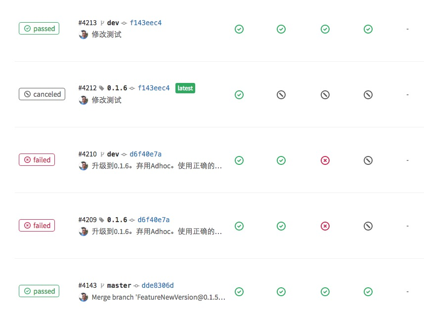

####lint

对每一个组件进行lint再发布，保证了正确性。这也是一步强制要求。

lint的时候能够发现很多问题。通常情况下不允许warning出现的。如果不能避免（比如第三方）请用--allow-warnings。

    
    
    pod lib lint --sources=$SOURCES --verbose --fail-fast --use-libraries  
    

####统一的网络服务和本地存储方式

这个就很简单。把这两个部分抽象成几个Pod库供所有业务组件使用就好了。 我们这边分别是三个Pod库：

  * YTXRequest
  * YTXRestfulModel
  * NSUserDefault+YTX

####其他一些内容

ignore了主App中的Podfile.lock尽量避免冲突。

主App Archive的时候要使用源码，而不是二进制。

后期可以使用oclint和deploymate检查代码。

使用fastlane match去维护开发证书。

一些需要从plist或者json读取配置的Pod库模块，要注意读出来的内容最好要加一个namespace。namespace可以是这个业务组件的名字。

业务组件读取资源文件的区别

    
    
    #从main bundle中取。如果图片希望在storyboard中被找到，使用这种方式。
    s.resource = ["#{s.name}/Assets/**"]
    #只是希望在我这个业务组件的bundle内使用的plist。作为配置文件。这是官方推荐方式。
    s.resource_bundles = {  
      "{s.name}/" => ["{s.name}/Assets/config.plist"]
    }
    

**持续集成**

原来的App就是持续集成的。想当然的，我们希望新的组件化开发的App也能够持续集成。

Podfile应该是这样的：这里面出现的全是私有Pod库。

    
    
    pod 'YTXRequest', '2.0.1'  
    pod 'YTXUtilCategory', '1.6.0'
    pod 'PBBasicProviderModule', '0.2.1'  
    pod 'PBBasicChartAndSocketModule', '0.3.1'  
    pod 'PBBasicAppInitModule', '0.5.1'  
    ...
    pod 'PBBasicHomepageBusinessModule', '1.2.15'  
    pod 'PBBasicMeBusinessModule', '1.2.10'  
    pod 'PBBasicLiveBusinessModule', '1.2.1'  
    pod 'PBBasicChartBusinessModule', '1.2.6'  
    pod 'PBBasicTradeBusinessModule', '1.2.7'  
    ...
    

**如果Pod依赖的东西特别特别多，比如100多个。另外又必须依赖主App做集成调试。 你也可以用这种方案：把你所有的Pod库的依赖都展开写到主App的Podfile中。而发布Pod库时podspec中不带任何的依赖的。这样就避免了pod install的时候解析依赖特别耗时的问题。**

各个脚本都在这个[ytx-pod-template](https://github.com/mdsb100/ytx-pod-template)。先从
.gitlab-ci.yml看起。

我们持续集成的工具是gitlab runner。

持续集成的整个流程是：

第一步：

使用template创建Pod。像这样：   
    
    pod lib create <Pod库名称> --template-url="http://gitlab.baidao.com/pods/ytx-pod-template"  
    

第二步：

创建dev分支。用来开发。

第三步：

每次push dev的时候会触发runner自动跑Stage: Init Lint(中的test)

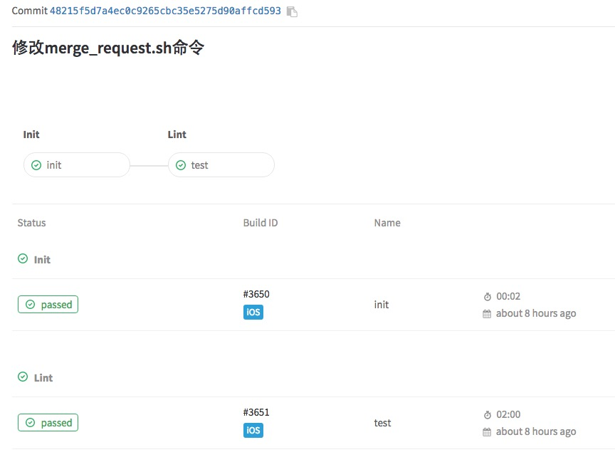

第四步：

1.准备发布Pod库。修改podspec的版本号，打上相应tag。  
2.使用merge_request.sh向master提交一个merge request。  
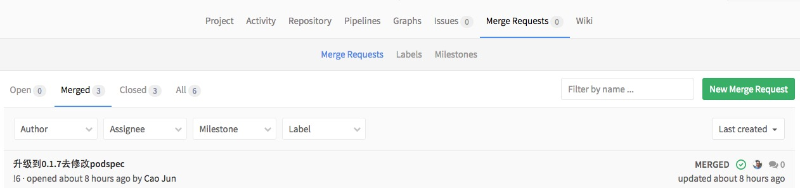

第五步：

1.其他有权限开发者code review之后，接受merge request。  
2.master合并这个merge request  
3.master触发runner自动跑Stage: Init Package Lint ReleasePod UpdateApp

第六步：

如果第五步正确。主App的dev分支会收到一个merge request，里面的内容是修改Podfile。
图中内容出现了AFNetworking等是因为这个时候在做测试。 
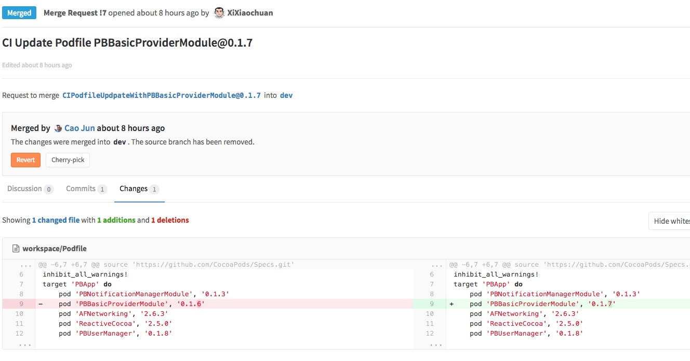 

第七步：

主App触发runner，会构建一个ipa自动上传到[fir](http://fir.im/)。

Init

  * 初始化一些环境。
  * 打印一些信息。

Package

  * 二进制化打包成.a

Lint

  * Pod lib lint。二进制和源码都lint。
  * 测试。
  * 以后考虑加入oclint和deploymate。

ReleasePod

  * 把相关文件zip后，传到静态服务器库。以提供二进制化下载包。
  * pod repo push。发布该Pod库。

ReleasePod的时候不允许Pod库出现警告。

UpdateApp

  * 下载App代码
  * 修改Podfile文件。如果匹配到pod库文件名则修改，否则添加。
  * 生成一个merge request到主App的dev分支。

**关于gitlab runner。**

stage这个功能非常的厉害。强烈推荐。

每一个stage可以跑在不同的runner上。每一个stage失败了可以单独retry。而某一个stage里面的任务可以并行执行：(test和lint就是并行的) 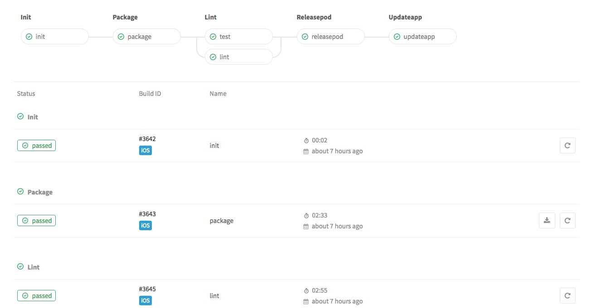

