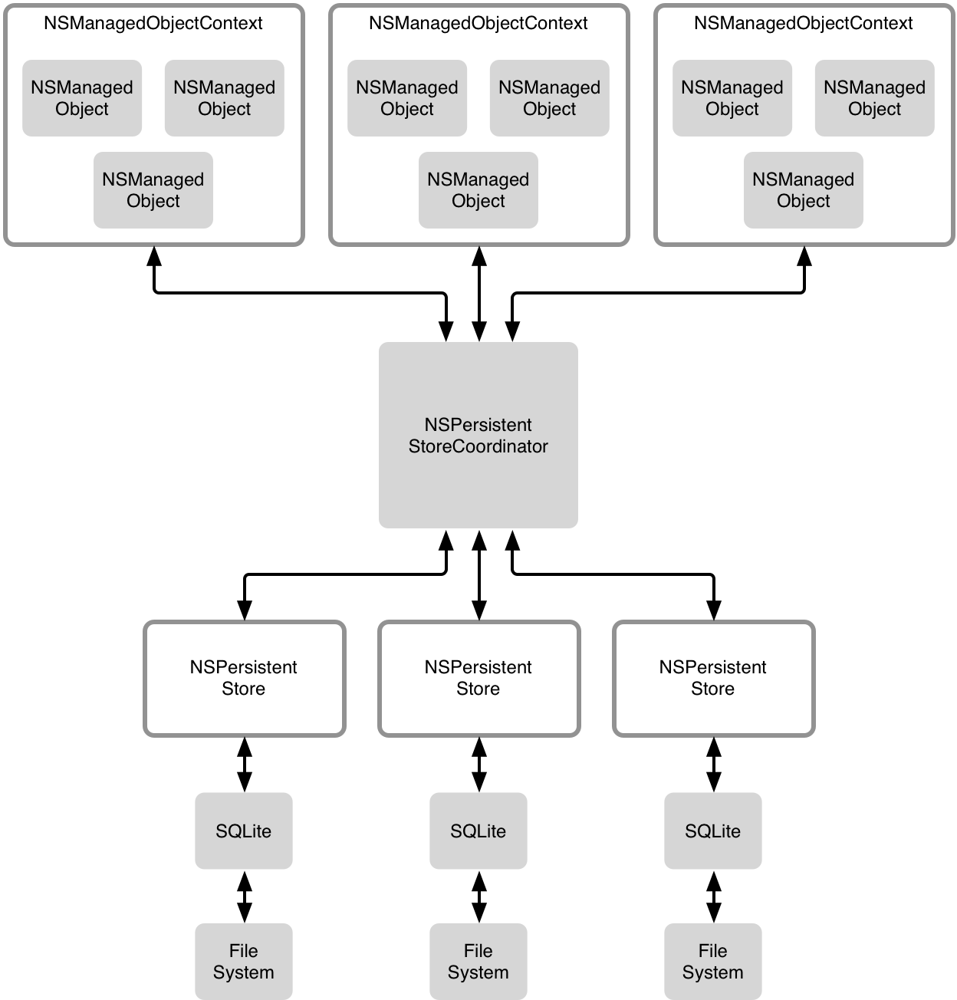
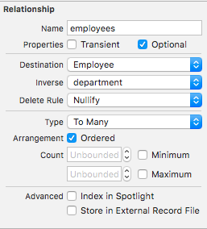
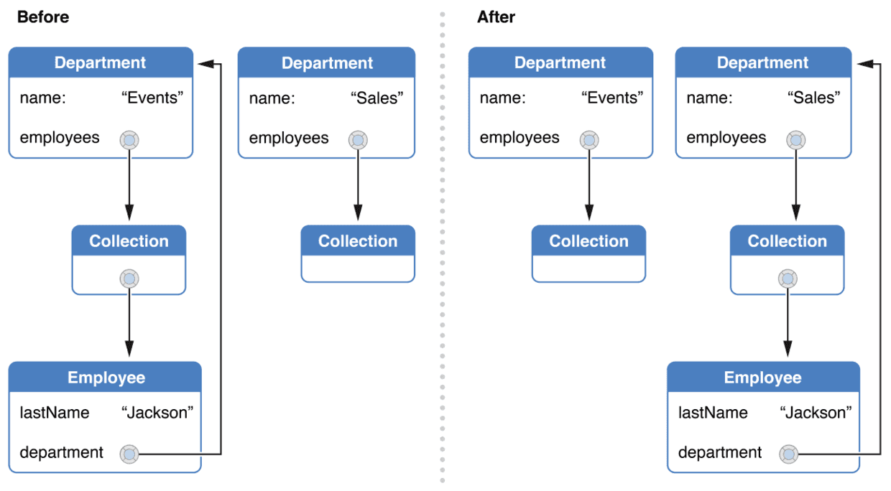

<!--BEGIN_DATA
{
    "create_date": "2016-03-15 10:39", 
    "modify_date": "2016-03-15 10:39", 
    "is_top": "0", 
    "summary": "Core Data Stack", 
    "tags": "iOS", 
    "file_name": "Core-Data:-Stack,-Data-Type,-Fetch,-Relationship.md"
}
END_DATA-->

官方文档为第一手参考资料：[Core Data Guide](https://developer.apple.com/library/ios/documentation/Cocoa/Conceptual/CoreData/index.html#//apple_ref/doc/uid/TP40001075-CH2-SW1)

Objc.io 出品的 Core Data 专题也是很不错的：[Core Data](http://objccn.io/issue-4/)

# Core Data Stack

官方文档里的基本结构:

Objc.io 出品的多线程架构 Stack：

Xcode 提供的模板一般都无法满足解耦的需求，一般情况下单个 Coordinator + 单个 Persistent Store + 多个 NSManagedObjectContext 就能满足绝大部分需求了，这时候最好能提供创建主线程和后台线程的 context 的接口，BigNerdRanch 封装了一个：[CoreDataStack](https://github.com/bignerdranch/CoreDataStack)。

# Data Type 数据类型

陈旧的 Core Data 文档终于在 iOS 9 正式发布的当天更新了，文档更新历史上写着此次更新重写了文档，是关于当前 API 实践的重大更新。然而数据类型的部分大概不怎么想写了，就几段话，而非标准数据类型就剩下下面一段话了，原本关于这部分的内容就我一直很困惑，如今倒好文档也给删了。

之前 google 的缓存还可以看以前的文档，后来缓存也更新了，还好我将旧的缓存备份了一份。

### Core Data 支持的数据类型

Core Data 支持的标准数据类型包括：

1. 不同类型的数字，包括16、32、64位的 Int，两种浮点数，Decimal，布尔值，这些数据都会被封装成 NSNumber，在生成子类的时候可以选择是否使用原始的数据类型；
2. String, 使用 Unicode 存储，由于 Unicode 的复杂性，对 String 类型的属性进行排序和搜索会比较复杂；
3. Date，仅仅是对`NSTimeInterval`(也就是 Double)的封装，不包含时区信息，你需要自行保存时区的信息，默认在子类中使用 NSDate 类型，可以在生成子类时使用原始数据类型，会使用 NSTimeInterval；
4. BinaryData，也就是 NSData 类型。
5. 以上这些标准类型都是不可变的类型，剩下的两种：Undefined 和 Transformable 用于支持非标准类型的数据。对于 Undefined 类型，记得在右侧的 Data Model Inspector 里勾选 Transient 选项。支持非标准类型时，你最好也使用不可变类型，不然 Core Data 无法跟踪数据的变化。也就是说每次给属性设置一个新的值，Core Data 才知道你的`NSManagedObject`对象发生了变化，这点在你使用自定义数据类型时很重要。

那不是以上这些类型的对象和结构体怎么办？总体来说，支持非标准类型有两条路：Transformable Attribute 和 Transient Attribute。

#### Transformable Attribute
使用这种属性时工作量很小，适合遵守 NSCoding 协议的类型，在你生成的 NSManagedObject 子类中将该属性类型更改为你需要的类型即可，剩下的工作由 Core Data 替我们完成。缺点是这种属性的内部存储由于是使用属性列表 property list 这种格式，所以比较浪费空间，在性能上也不太好。如果你对性能和空间没有很特别的要求，使用这种就可以了。

如果你想更加高效地存储，你可以提供自定义的 value transformer 来实现数据的转化。（我是不会这个的）

#### Transient Attribute
类似 Swift 里的计算属性，需要根据其他属性来生成。Core Data 在 fetch 时并不会处理这种属性，不会存储这种属性，也不会跟踪这种属性的变化。总之就是对这种属性不管不问，完全由开发者自己负责；不过，处理这种属性的全过程都可以自定义，应对各种需求。

Core Data 对这种属性完全是放任自流的，使用时需要额外的工作：需要我们实现属性的存取方法 accessor methods。
比如，处理 UIImage 对象时，需要先使用一个备份属性使用 Core Data 支持的类型，然后 transient attribute 利用前者生成我们需要的 UIImage 对象。

备注：在Model Editor 里「Allows External Storage」不是必选选项，选中该项后由 Core Data 决定数据是否存放在其他地方；而对于 transient attribute，必须指定 Attribute Type 为 Undefined，而且要选中 Transient。`@NSManaged`修饰符表示由 Core Data 来负责动态生成存取方法，对于 transient attribute，无法使用`@NSManaged`修饰符，因为这是需要开发者负责的。

使用 transient attribute，必须要提到 primitive property，这是 Core Data 对属性的内部实现。可以通过 `primitiveValueForKey(key)`和`setPrimitiveValue(newValue, forKey:)`两个方法来获得对 primitive property 的访问。

    @NSManaged private var imageData: NSData?
    var image: UIImage?{
        get {
            let ImageKey: String = "image"
            willAccessValueForKey(ImageKey)
            var imageObject = primitiveValueForKey(ImageKey) as? UIImage
            didAccessValueForKey(ImageKey)
            if imageObject == nil{
                imageObject = UIImage(data: imageData!)
            }
            return imageObject
        }

        set {
            let ImageKey: String = "image"
            let ImageDataKey = "imageData"
            willChangeValueForKey(ImageKey)
            self.setPrimitiveValue(newValue, forKey: ImageKey)
            didChangeValueForKey(ImageKey)
            let imageRawData = UIImageJPEGRepresentation(newValue!, 1.0)!
            //更新persistent attribute 时使用 KVC 方法，这样 Core Data 才知道该属性变化了。
            self.setValue(imageRawData, forKey: ImageDataKey) 
        }
    }
由于Core Data 基本上对 transient attribute 不管不问，同时不支持的数据类型也通常会有访问代价大的问题。因此，可以基于不同的优化策略对 transient attribute 进行定制。

获取策略有两种：

1.按需获取 The On-demand Get：上面的代码里 image 属性就是例子。

2.预获取 The Pre-calculated Get：在对象被 fetch 时获取对象。

    override func awakeFromFetch() {
        super.awakeFromFetch()
        if let imageRawData = self.imageData{
            let imageKey = "image"
            let imageObject = UIImage(data: imageRawData)
            self.setPrimitiveValue(imageObject, forKey: imageKey)
        }
    }

更新策略有两种：

1.即时更新 The Immediate-Update Set：上面的 image 属性就是。

2.延迟更新 The Delayed-Update Set：在对象被保存时才更新。

    override func willSave() {
        super.willSave()
        let imageKey = "image"
        let imageDataKey = "imageData"
        //这里不必使用 KVC 方法
        if  let image = self.primitiveValueForKey(imageKey) as? UIImage {
            let imageRawData = UIImageJPEGRepresentation(image, 1.0)
            self.setPrimitiveValue(imageRawData, forKey: imageDataKey)
        }else{
            self.setPrimitiveValue(nil, forKey: imageDataKey)
        }
    }
同时还需要更改 transient attribute 的 set 方法，不要在 set 里更新用作备份的属性。

    set {
        let ImageKey: String = "image"
        willChangeValueForKey(ImageKey)
        self.setPrimitiveValue(newValue, forKey: ImageKey)
        didChangeValueForKey(ImageKey)
    }

### Binary Large Data Objects (BLOBs)

在上一节中，使用了 NSData 来存储图像的二进制数据，这里也可以不用 transient attribute 这种方式，直接用 NSData 存储。如果直接使用二进制来存储数据，那么有几个问题需要考虑。

首先是内存占用，图像一般比其他数据大得多。下面是 Core Data 支持的 persistent store 类型，面对会占用大量内存的数据，使用 SQLite store 是最佳选择。

其次，选择更合理的访问策略。与其将 BLOBs 对象直接作为属性，不如将其用`NSManagedObject`子类封装并将两者使用关系(relationship)联系起来。因为访问关系默认是 faults 状态，只有访问属性时才会填充数据，这样可以最大限度地降低内存占用。
另外，对于这种 BLOBs，可以选择在文件系统中存储，而在 Core Data 里只需要维持该资源的 URL，在需要的时候才获取该资源。

### 数据类型总结
对于不支持的类型，基本策略是将其转化为支持的类型。大部分对象类型都遵守 NSCoding 协议，可以使用 Transformable Attribute，这是最简单的方法，可能会有一些性能上的问题，需要优化的话就使用 Transient Attribute。

不支持 NSCoding 协议的类型，比如 CGRect，CGSize 这些结构体，可以转化为遵守 NSCoding 协议的 NSValue 对象，这样可以使用 Transformable Attribute 来保存了。又或者将类型的成员数据拆分，比如 CGSize 有 width 和 height 两个都是 CGFloat 成员变量，可以将两个成员变量转换为 float 类型，这样就可以添加一个 transient attribute 在 fetch 后获取对应的 CGSize 数据了，这个手法和 Swift 里的计算属性相似。

不支持 NSCoding 协议的类，可以考虑将这个类用`NSManagedObject`子类来封装，其内部被 Core Data 支持的数据就不要说了，不被直接支持的数据就拆分成支持的类型。

# Fetch 请求
关于这个话题，Objc.io 专题里有一期写得很深入：[Fetch 请求](http://objccn.io/issue-4-6/)。
待填......

# Relationship 关系

本文部分内容来自 Obcc.io 的[《Core Data》](https://www.objc.io/books/core-data/)一书，买来一个月后觉得39美元总体还是花得值得的，推荐购买。

Fetch requests 并非获取 managed objects 的唯一途径，而且，应该尽可能避免 fetch。因为 fetch 操作会遍历整个 Core Data Stack，代价很大，是重大的性能瓶颈。获取 managed objects 的另外一个重要途径是 relationship。

###Creating Relationships
######一般关系
Relationship 有三种：一对一(to-one)，一对多(to-many)，多对多(many-many)。多对多关系的对应关系也应该是多对多关系。建立关系时尽量避免单向关系，这样不利于 Core Data 维护对象之间的关系。在 Model Editor 里设置关系时注意设置逆向关系 Inverse Relationship，这样 Core Data 可以替我们完成很多工作。

部门 Department 和职员 Employee 的关系设置：

这里部门与职员的关系是一对多，职员与部门的关系是一对一。
一对一关系和 managed object 的其他属性没有多大区别，Xcode 生成的子类里该关系的属性类型就是关系目标的类型；一对多关系里，为了保持维护的对象唯一，子类使用 Set 来维护对对象的引用。若勾选了 Ordered，则使用 NSOrderdSet 类。使用有序关系并没有真的对里面的对象进行排序，只是方便了索引。

    extension Department {
        @NSManaged var name: String?
        @NSManaged var employees: NSOrderedSet?
    }
    extension Employee {
        @NSManaged var name: String?
        @NSManaged var department: Department?
    }

######不一般关系⊙▂⊙
上面的例子里关系目标都是其他实体 Entity，关系也可以指向自身类型的 Entity，比如，利用 Person 建立一个族谱，那么关系的目标对象都是 Person。这里除了关系引用的是自身类型，也没有什么特别的了。
还有一种比较特别：单向关系。上面也提到了，尽量不要建立单向关系。因为在单向关系里，一方被删除了的话，另一方无法得知。使用单向关系时必须小心。
**PS: Core Data 不支持跨 Store 的关系。**
###Accessing and Manipulating Relationships 
######访问关系
访问关系有两种途径，一种是和访问普通的对象属性一样：

     let employees: NSOrderedSet = aDepartment.employees
     let department: Department = anEmployee.department
另外一种是使用 KVC 方法，如果传递的 key 不是 Modal 里定义的属性，将会抛出异常：
    
    let employees = aDepartment.valueForKey("employees") as? NSOrderedSet
    let department = anEmployee.valueForKey("department") as? Department
除此之外，关系还支持 keypath 访问，path 支持普通的属性 perporty 和关系 relationship:

    let departmentName = anEmployee.valueForKeyPath("department.name") as? String
######修改关系
修改关系这件事需要好好说明一下：我们只需要修改关系一方，Core Data 会自动替我们处理好剩下的事情。比如下面的情况：

只需要：
    
    //方法1：
    anEmployee.department = newDepartment
    //方法2：
    anEmployee.setValue(newDepartment, forKey:"department")
或者：

    //如果没有勾选 Ordered 选项，使用 mutableSetValueForKey(_:)
    newDepartment.mutableSetValueForKey("employees").addObject(employee)
    //如果勾选了，使用 mutableOrderedSetValueForKey(_:)
    newDepartment.mutableOrderedSetValueForKey("employees").addObject(employee)
只需要使用上面的一种方法就可以了。
如果像批量更改部门的职员构成怎么办，单个移除以及添加很麻烦，使用 KVC 方法。

    newDepartment.setValue(newEmployees, forKey:"employees")
在 Department 这一端，因为直接访问`employees`得到的一个无法更改的量，只能使用`mutableSetValueForKey(_:)`或`mutableOrderedSetValueForKey(_:)`来进行个体的修改，或者使用`setValue(_, forKey:)`来进行整体的修改。处于性能的原因，set<Key>:这类方法比如`setEmployees:`不能用来修改关系。
`NSManagedObject`重写了`valueForKey:`和`setValue:forKey:`以及`mutableSetValueForKey(_:)`这三个 KVC 方法，当 key 不是在 modal 里定义的属性时，这三个方法都会抛出异常。你不应该在子类中重写这三个方法。
###Delete Rule
上面只需要在修改一端修改关系剩下的事情由 Core Data 替我们处理了得益于 Delete Rule 的设计。删除规则决定了删除对象时它的关系怎么处理的行为。Core Data 提供了四种删除规则，下面还是用部门与员工之间的关系来举例：
1. 拒绝 Deny 
如果关系目标里还有对象，比如要删除（撤销）某个部门，但该部门还有一个员工，那么是无法删除（撤销）该部门的，只有该部门里所有的员工被调往其他部门或是被删除（解雇）了才能删除（撤销）该部门。
2. 失效 Nullify
移除对象之间的关系但是不删除对象。只有当一方关系是可有可无的时候才有意义，比如员工有没有部门都无所谓，那么删除该对象时只会将其关系设置为空而不会删除对象本身。
3. 连坐 Cascade
在这种规则下，可以把一个部门一锅端。删除（撤销）某部门，部门里的员工也会被全部解雇（删除）。
4. 不作为 No Action
什么也不做。部门被删除（撤销）后，里面的员工还不知道，以为自己还在这个部门工作呢。
前三种删除规则还是比较清晰的，都有合适的使用场景，而最后一种比较危险，需要你自己来确定关系里的对象是否还存在。

###Relationship Faults
访问 managed object 的 relationship property 时，relationship 对应的 managed object 如果在 context 中不存在，那么被 fetch 进内存时会处于 faults 状态，即使已经存在也不会主动填充 managed object 中的数据，无论原来的 managed object 处于 faults 状态还是已经填充了全部数据。而且，无论是 to-one relationship 还是 to-mant relationship都是这样。这个特性对于维持较低的内存占用具有重要意义。
Relationship faults 有两层：访问 relationship 时，这时候 Core Data 做的仅仅是根据 relationship 的 objectID 来获取相应的 managed object，并不会填充数据；访问 relationship 上的某个属性时，relationship 才会填充该属性对应的数据。

###Reference Cycles
关系一般都是双向的，而且关系并不想其他对象一样有强引用和弱引用的区别，在这种情况下，当关系的双方都在内存中后，自然而然就形成了引用循环。打破引用循环的唯一方法是刷新关系中的一方，使用 context 的`refreshObject(_:mergeChanges:)`来刷新对象。

    context.refreshObject(managedObejct, mergeChanges:false)
参数`mergeChanges`为 false 时，对象会重新进入 faults 状态，这会移除对象里所有的数据，包括与其他对象之间的关系。需要注意的是，在这个参数配置下，该方法会放弃对象身上所有没有保存的变化。
至于何时打破引用循环这取决于应用自身的需要。比如，将当前的 ViewController 从 stack 中移除，你不再需要这些数据了，可以将对象转变为 faults状态；或者应用进入后台，你也可以这样做降低内存占用避免被系统杀掉。