<!--BEGIN_DATA
{
    "create_date": "2016-03-03 12:34", 
    "modify_date": "2016-03-03 12:34", 
    "is_top": "0", 
    "summary": "IOS CoreText.framework", 
    "tags": "iOS", 
    "file_name": "CoreText.md"
}
END_DATA-->

原文出处：<a href="http://blog.csdn.net/fengsh998/article/details/8691823" target="blank">IOS CoreText.framework --- 基本用法</a>

    

API接口文档。

https://developer.apple.com/library/mac/#documentation/Carbon/Reference/CoreText_Framework_Ref/_index.html

 

CoreText 框架中最常用的几个类：

<ol class="collectionColumn" style="list-style-position:outside; margin:0px 0px 0px 2.5em; padding:0px 0px 1em 0.5em; font-family:'Lucida Grande','Lucida Sans Unicode',Helvetica,Arial,Verdana,sans-serif; font-size:13px">
<li class="forums" style="margin-top:0px; width:auto; padding-left:10px; text-indent:-10px; color:rgb(9,61,146); font-size:12px; line-height:1.364em; margin-bottom:0px; list-style-type:none">
<a href="https://developer.apple.com/library/mac/documentation/Carbon/Reference/CTFontRef/Reference/reference.html#//apple_ref/doc/uid/TP40005110" style="color:rgb(9,61,146); text-decoration:none; line-height:1.364em; margin-bottom:0.455em; border-bottom-width:1px; border-bottom-style:solid; border-bottom-color:rgb(51,102,204)">CTFont</a></li><li class="forums" style="margin-top:0px; width:auto; padding-left:10px; text-indent:-10px; color:rgb(9,61,146); font-size:12px; line-height:1.364em; margin-bottom:0px; list-style-type:none">
<a href="https://developer.apple.com/library/mac/documentation/Carbon/Reference/CTFontCollectionRef/Reference/reference.html#//apple_ref/doc/uid/TP40005104" style="color:rgb(9,61,146); text-decoration:none; line-height:1.364em; margin-bottom:0.455em">CTFontCollection</a></li><li class="forums" style="margin-top:0px; width:auto; padding-left:10px; text-indent:-10px; color:rgb(9,61,146); font-size:12px; line-height:1.364em; margin-bottom:0px; list-style-type:none">
<a href="https://developer.apple.com/library/mac/documentation/Carbon/Reference/CTFontDescriptorRef/Reference/reference.html#//apple_ref/doc/uid/TP40005107" style="color:rgb(9,61,146); text-decoration:none; line-height:1.364em; margin-bottom:0.455em">CTFontDescriptor</a></li><li class="forums" style="margin-top:0px; width:auto; padding-left:10px; text-indent:-10px; color:rgb(9,61,146); font-size:12px; line-height:1.364em; margin-bottom:0px; list-style-type:none">
<a href="https://developer.apple.com/library/mac/documentation/Carbon/Reference/CTFrameRef/Reference/reference.html#//apple_ref/doc/uid/TP40005113" style="color:rgb(9,61,146); text-decoration:none; line-height:1.364em; margin-bottom:0.455em">CTFrame</a></li><li class="forums" style="margin-top:0px; width:auto; padding-left:10px; text-indent:-10px; color:rgb(9,61,146); font-size:12px; line-height:1.364em; margin-bottom:0px; list-style-type:none">
<a href="https://developer.apple.com/library/mac/documentation/Carbon/Reference/CTFramesetterRef/Reference/reference.html#//apple_ref/doc/uid/TP40005105" style="color:rgb(9,61,146); text-decoration:none; line-height:1.364em; margin-bottom:0.455em">CTFramesetter</a></li><li class="forums" style="margin-top:0px; width:auto; padding-left:10px; text-indent:-10px; color:rgb(9,61,146); font-size:12px; line-height:1.364em; margin-bottom:0px; list-style-type:none">
<a href="https://developer.apple.com/library/mac/documentation/Carbon/Reference/CTGlyphInfoRef/Reference/reference.html#//apple_ref/doc/uid/TP40005108" style="color:rgb(9,61,146); text-decoration:none; line-height:1.364em; margin-bottom:0.455em">CTGlyphInfo</a></li><li class="forums" style="margin-top:0px; width:auto; padding-left:10px; text-indent:-10px; color:rgb(9,61,146); font-size:12px; line-height:1.364em; margin-bottom:0px; list-style-type:none">
<a href="https://developer.apple.com/library/mac/documentation/Carbon/Reference/CTLineRef/Reference/reference.html#//apple_ref/doc/uid/TP40005111" style="color:rgb(9,61,146); text-decoration:none; line-height:1.364em; margin-bottom:0.455em">CTLine</a></li><li class="forums" style="margin-top:0px; width:auto; padding-left:10px; text-indent:-10px; color:rgb(9,61,146); font-size:12px; line-height:1.364em; margin-bottom:0px; list-style-type:none">
<a href="https://developer.apple.com/library/mac/documentation/Carbon/Reference/CTParagraphStyleRef/Reference/reference.html#//apple_ref/doc/uid/TP40005114" style="color:rgb(9,61,146); text-decoration:none; line-height:1.364em; margin-bottom:0.455em">CTParagraphStyle</a></li><li class="forums" style="margin-top:0px; width:auto; padding-left:10px; text-indent:-10px; color:rgb(9,61,146); font-size:12px; line-height:1.364em; margin-bottom:0px; list-style-type:none">
<a href="https://developer.apple.com/library/mac/documentation/Carbon/Reference/CTRunRef/Reference/reference.html#//apple_ref/doc/uid/TP40005106" style="color:rgb(9,61,146); text-decoration:none; line-height:1.364em; margin-bottom:0.455em">CTRun</a></li><li class="forums" style="margin-top:0px; width:auto; padding-left:10px; text-indent:-10px; color:rgb(9,61,146); font-size:12px; line-height:1.364em; margin-bottom:0px; list-style-type:none">
<a href="https://developer.apple.com/library/mac/documentation/Carbon/Reference/CTTextTabRef/Reference/reference.html#//apple_ref/doc/uid/TP40005109" style="color:rgb(9,61,146); text-decoration:none; line-height:1.364em; margin-bottom:0.455em">CTTextTab</a></li><li class="forums" style="margin-top:0px; width:auto; padding-left:10px; text-indent:-10px; color:rgb(9,61,146); font-size:12px; line-height:1.364em; margin-bottom:0px; list-style-type:none">
<a href="https://developer.apple.com/library/mac/documentation/Carbon/Reference/CTTypesetterRef/Reference/reference.html#//apple_ref/doc/uid/TP40005112" style="color:rgb(9,61,146); text-decoration:none; line-height:1.364em; margin-bottom:0.455em">CTTypesetter</a></li></ol>

先来了解一下该框架的整体视窗组合图：

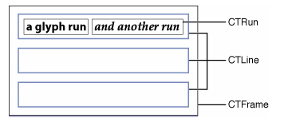 

CTFrame 作为一个整体的画布(Canvas)，其中由行(CTLine)组成，而每行可以分为一个或多个小方块（CTRun）。

注意：你不需要自己创建CTRun，Core Text将根据NSAttributedString的属性来自动创建CTRun。每个CTRun对象对应不同的属性，正因此，你可以自由的控制字体、颜色、字间距等等信息。

通常处理步聚：

1.使用core text就是先有一个要显示的string，然后定义这个string每个部分的样式－&gt;attributedString －&gt; 生成 CTFramesetter -&gt; 得到CTFrame -&gt; 绘制（CTFrameDraw） 
其中可以更详细的设置换行方式，对齐方式，绘制区域的大小等。 
2.绘制只是显示，点击事件就需要一个判断了。 
CTFrame 包含了多个CTLine,并且可以得到各个line的其实位置与大小。判断点击处在不在某个line上。CTLine 又可以判断这个点(相对于ctline的坐标)处的文字范围。然后遍历这个string的所有NSTextCheckingResult，根据result的rang判断点击处在不在这个rang上，从而得到点击的链接与位置。

 

<strong>字体的基本知识：</strong>

字体(Font):是一系列字号、样式和磅&#20540;相同的字符(例如:10磅黑体Palatino)。现多被视为字样的同义词

字面(Face):是所有字号的磅&#20540;和&#26684;式的综合

字体集(Font family):是一组相关字体(例如:Franklin family包括Franklin Gothic、Fran-klinHeavy和Franklin Compressed)

磅&#20540;(Weight):用于描述字体粗度。典型的磅&#20540;,从最粗到最细,有极细、细、book、中等、半粗、粗、较粗、极粗

样式(Style):字形有三种形式:Roman type是直体;oblique type是斜体;utakuc type是斜体兼曲线(比Roman type更像书法体)。

x高度(X height):指小写字母的平均高度(以x为基准)。磅&#20540;相同的两字母,x高度越大的字母看起来比x高度小的字母要大

Cap高度(Cap height):与x高度相&#20284;。指大写字母的平均高度(以C为基准)

下行字母(Descender):例如在字母q中,基线以下的字母部分叫下伸部分

上行字母(Ascender):x高度以上的部分(比如字母b)叫做上伸部分

基线(Baseline):通常在x、v、b、m下的那条线

描边(Stroke):组成字符的线或曲线。可以加粗或改变字符形状

衬线(Serif):用来使字符更可视的一条水平线。如字母左上角和下部的水平线。

无衬线(Sans Serif):可以让排字员不使用衬线装饰。

方形字(Block):这种字体的笔画使字符看起来比无衬线字更显&#30524;,但还不到常见的衬线字的程度。例如Lubalin Graph就是方形字,这种字看起来好像是木头块刻的一样

手写体脚本(Calligraphic script):是一种仿效手写体的字体。例如Murray Hill或者Fraktur字体

艺术字(Decorative):像绘画般的字体

Pi符号(Pisymbol):非标准的字母数字字符的特殊符号。例如Wingdings和Mathematical Pi

连写(Ligature):是一系列连写字母如fi、fl、ffi或ffl。由于字些字母形状的原因经常被连写,故排字员已习惯将它们连写。

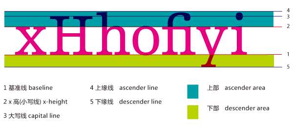 

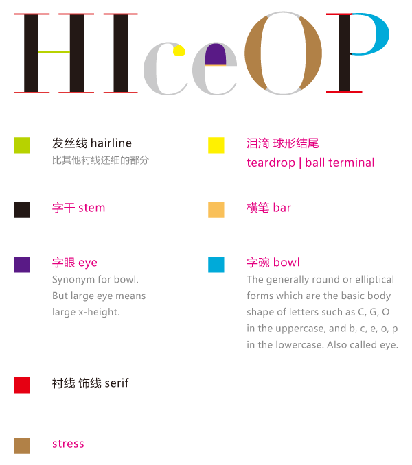 

 

字符属性名称：

<pre class="declaration" style="margin:0em 0.333em 1em 0.5em; font-size:13px; font-family:Courier,Consolas,monospace; color:rgb(102,102,102); background-color:rgb(255,255,255)">//字体形状属性  必须是CFNumberRef对象默认为0，非0则对应相应的字符形状定义，如1表示传统字符形状
const CFStringRef kCTCharacterShapeAttributeName;                     
</pre>

</pre>
<pre class="declaration" style="margin:0em 0.333em 1em 0.5em; font-size:13px; font-family:Courier,Consolas,monospace; color:rgb(102,102,102); background-color:rgb(255,255,255)">//字体属性   必须是CTFont对象
const CFStringRef kCTFontAttributeName; 
</pre>

<pre class="declaration" style="margin:0em 0.333em 1em 0.5em; font-size:13px; font-family:Courier,Consolas,monospace; color:rgb(102,102,102); background-color:rgb(255,255,255)">//字符间隔属性 必须是CFNumberRef对象
const CFStringRef kCTKernAttributeName;
</pre>

<pre class="declaration" style="margin:0em 0.333em 1em 0.5em; font-size:13px; font-family:Courier,Consolas,monospace; color:rgb(102,102,102); background-color:rgb(255,255,255)">//设置是否使用连字属性，设置为0，表示不使用连字属性。标准的英文连字有FI,FL.默认&#20540;为1，既是使用标准连字。也就是当搜索到f时候，会把fl当成一个文字。必须是CFNumberRef 默认为1,可取0,1,2
const CFStringRef kCTLigatureAttributeName;
</pre>

<pre class="declaration" style="margin:0em 0.333em 1em 0.5em; font-size:13px; font-family:Courier,Consolas,monospace; color:rgb(102,102,102); background-color:rgb(255,255,255)">//字体颜色属性  必须是CGColor对象，默认为black
const CFStringRef kCTForegroundColorAttributeName;
</pre>

<pre class="declaration" style="margin:0em 0.333em 1em 0.5em; font-size:13px; font-family:Courier,Consolas,monospace; color:rgb(102,102,102); background-color:rgb(255,255,255)"> //上下文的字体颜色属性 必须为CFBooleanRef 默认为False,
const CFStringRef kCTForegroundColorFromContextAttributeName;&nbsp;
</pre>

<pre class="declaration" style="margin:0em 0.333em 1em 0.5em; font-size:13px; font-family:Courier,Consolas,monospace; color:rgb(102,102,102); background-color:rgb(255,255,255)">//段落样式属性 必须是CTParagraphStyle对象 默认为NIL
const CFStringRef kCTParagraphStyleAttributeName;             &nbsp;
</pre>

<pre class="declaration" style="margin:0em 0.333em 1em 0.5em; font-size:13px; font-family:Courier,Consolas,monospace; color:rgb(102,102,102); background-color:rgb(255,255,255)">//笔画线条宽度 必须是CFNumberRef对象，默为0.0f，标准为3.0f
const CFStringRef kCTStrokeWidthAttributeName;             &nbsp;
</pre>

<pre class="declaration" style="margin:0em 0.333em 1em 0.5em; font-size:13px; font-family:Courier,Consolas,monospace; color:rgb(102,102,102); background-color:rgb(255,255,255)">//笔画的颜色属性 必须是CGColorRef 对象，默认为前景色
const CFStringRef kCTStrokeColorAttributeName;             &nbsp;
</pre>

<pre class="declaration" style="margin:0em 0.333em 1em 0.5em; font-size:13px; font-family:Courier,Consolas,monospace; color:rgb(102,102,102); background-color:rgb(255,255,255)">//设置字体的上下标属性 必须是CFNumberRef对象 默认为0,可为-1为下标,1为上标，需要字体支持才行。如排列组合的样式Cn1
const CFStringRef kCTSuperscriptAttributeName;             &nbsp;
</pre>

<pre class="declaration" style="margin:0em 0.333em 1em 0.5em; font-size:13px; font-family:Courier,Consolas,monospace; color:rgb(102,102,102); background-color:rgb(255,255,255)">//字体下划线颜色属性 必须是CGColorRef对象，默认为前景色
const CFStringRef kCTUnderlineColorAttributeName;          &nbsp;
</pre>

<pre class="declaration" style="margin:0em 0.333em 1em 0.5em; font-size:13px; font-family:Courier,Consolas,monospace; color:rgb(102,102,102); background-color:rgb(255,255,255)">//字体下划线样式属性 必须是CFNumberRef对象,默为kCTUnderlineStyleNone 可以通过CTUnderlineStypleModifiers 进行修改下划线风&#26684;
const CFStringRef kCTUnderlineStyleAttributeName;          &nbsp;
</pre>

<pre class="declaration" style="margin:0em 0.333em 1em 0.5em; font-size:13px; font-family:Courier,Consolas,monospace; color:rgb(102,102,102); background-color:rgb(255,255,255)">//文字的字形方向属性 必须是CFBooleanRef 默认为false，false表示水平方向，true表示竖直方向
const CFStringRef kCTVerticalFormsAttributeName;
</pre>

<pre class="declaration" style="margin:0em 0.333em 1em 0.5em; font-size:13px; font-family:Courier,Consolas,monospace; color:rgb(102,102,102); background-color:rgb(255,255,255)">//字体信息属性 必须是CTGlyphInfo对象
const CFStringRef kCTGlyphInfoAttributeName;
</pre>

<pre class="declaration" style="margin:0em 0.333em 1em 0.5em; font-size:13px; font-family:Courier,Consolas,monospace; color:rgb(102,102,102); background-color:rgb(255,255,255)">//CTRun 委托属性 必须是CTRunDelegate对象
const CFStringRef kCTRunDelegateAttributeName
</pre>

举例说明：

<pre name="code" class="cpp">NSMutableAttributedString *mabstring = [[NSMutableAttributedString alloc]initWithString:@&quot;This is a test of characterAttribute. 中文字符&quot;];</pre>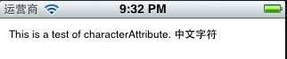 
 

<pre name="code" class="cpp">  //设置字体属性
    CTFontRef font = CTFontCreateWithName(CFSTR(&quot;Georgia&quot;), 40, NULL);
    [mabstring addAttribute:(id)kCTFontAttributeName value:(id)font range:NSMakeRange(0, 4)]; </pre>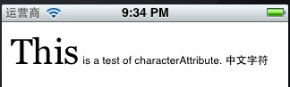 
<pre name="code" class="cpp">//设置斜体字
    CTFontRef font = CTFontCreateWithName((CFStringRef)[UIFont italicSystemFontOfSize:20].fontName, 14, NULL);
    [mabstring addAttribute:(id)kCTFontAttributeName value:(id)font range:NSMakeRange(0, 4)];</pre>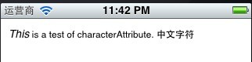 
<pre name="code" class="cpp">//下划线
    [mabstring addAttribute:(id)kCTUnderlineStyleAttributeName value:(id)[NSNumber numberWithInt:kCTUnderlineStyleDouble] range:NSMakeRange(0, 4)]; </pre>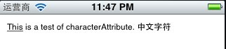 
<pre name="code" class="cpp">//下划线颜色
    [mabstring addAttribute:(id)kCTUnderlineColorAttributeName value:(id)[UIColor redColor].CGColor range:NSMakeRange(0, 4)];</pre>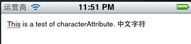 
 

<pre name="code" class="cpp">//设置字体简隔 eg:test 
    long number = 10;
    CFNumberRef num = CFNumberCreate(kCFAllocatorDefault,kCFNumberSInt8Type,&amp;number);
    [mabstring addAttribute:(id)kCTKernAttributeName value:(id)num range:NSMakeRange(10, 4)];</pre>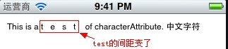 
<pre name="code" class="cpp">//设置连字
long number = 1;
    CFNumberRef num = CFNumberCreate(kCFAllocatorDefault,kCFNumberSInt8Type,&amp;number);
    [mabstring addAttribute:(id)kCTLigatureAttributeName value:(id)num range:NSMakeRange(0, [str length])];</pre>连字还不会使用，未看到效果。 
<pre name="code" class="cpp">//设置字体颜色
    [mabstring addAttribute:(id)kCTForegroundColorAttributeName value:(id)[UIColor redColor].CGColor range:NSMakeRange(0, 9)];</pre>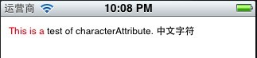 
<pre name="code" class="cpp">//设置字体颜色为前影色
    CFBooleanRef flag = kCFBooleanTrue;
    [mabstring addAttribute:(id)kCTForegroundColorFromContextAttributeName value:(id)flag range:NSMakeRange(5, 10)];</pre>无明显效果。

<pre name="code" class="cpp">//设置空心字
    long number = 2;
    CFNumberRef num = CFNumberCreate(kCFAllocatorDefault,kCFNumberSInt8Type,&amp;number);
    [mabstring addAttribute:(id)kCTStrokeWidthAttributeName value:(id)num range:NSMakeRange(0, [str length])];</pre>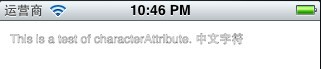 
<pre name="code" class="cpp">//设置空心字
    long number = 2;
    CFNumberRef num = CFNumberCreate(kCFAllocatorDefault,kCFNumberSInt8Type,&amp;number);
    [mabstring addAttribute:(id)kCTStrokeWidthAttributeName value:(id)num range:NSMakeRange(0, [str length])];
     
    //设置空心字颜色
    [mabstring addAttribute:(id)kCTStrokeColorAttributeName value:(id)[UIColor greenColor].CGColor range:NSMakeRange(0, [str length])];</pre>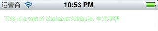 
在设置空心字颜色时，必须先将字体高为空心，否则设置颜色是没有效果的。 
 

<pre name="code" class="cpp">//对同一段字体进行多属性设置    
    //红色
    NSMutableDictionary *attributes = [NSMutableDictionary dictionaryWithObject:(id)[UIColor redColor].CGColor forKey:(id)kCTForegroundColorAttributeName];
    //斜体
    CTFontRef font = CTFontCreateWithName((CFStringRef)[UIFont italicSystemFontOfSize:20].fontName, 40, NULL);
    [attributes setObject:(id)font forKey:(id)kCTFontAttributeName];
    //下划线
    [attributes setObject:(id)[NSNumber numberWithInt:kCTUnderlineStyleDouble] forKey:(id)kCTUnderlineStyleAttributeName];
    
    [mabstring addAttributes:attributes range:NSMakeRange(0, 4)];</pre>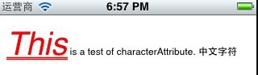 

最后是draw了。

<pre name="code" class="cpp">-(void)characterAttribute
{
    NSString *str = @&quot;This is a test of characterAttribute. 中文字符&quot;;
    NSMutableAttributedString *mabstring = [[NSMutableAttributedString alloc]initWithString:str];
    
    [mabstring beginEditing];
    /*
    long number = 1;
    CFNumberRef num = CFNumberCreate(kCFAllocatorDefault,kCFNumberSInt8Type,&amp;number);
    [mabstring addAttribute:(id)kCTCharacterShapeAttributeName value:(id)num range:NSMakeRange(0, 4)];
    */
    /*
    //设置字体属性
    CTFontRef font = CTFontCreateWithName(CFSTR(&quot;Georgia&quot;), 40, NULL);
    [mabstring addAttribute:(id)kCTFontAttributeName value:(id)font range:NSMakeRange(0, 4)];
    */
    /*
    //设置字体简隔 eg:test 
    long number = 10;
    CFNumberRef num = CFNumberCreate(kCFAllocatorDefault,kCFNumberSInt8Type,&amp;number);
    [mabstring addAttribute:(id)kCTKernAttributeName value:(id)num range:NSMakeRange(10, 4)];
    */

    /*
    long number = 1;
    CFNumberRef num = CFNumberCreate(kCFAllocatorDefault,kCFNumberSInt8Type,&amp;number);
    [mabstring addAttribute:(id)kCTLigatureAttributeName value:(id)num range:NSMakeRange(0, [str length])];
     */
    /*
    //设置字体颜色
    [mabstring addAttribute:(id)kCTForegroundColorAttributeName value:(id)[UIColor redColor].CGColor range:NSMakeRange(0, 9)];
     */
    /*
    //设置字体颜色为前影色
    CFBooleanRef flag = kCFBooleanTrue;
    [mabstring addAttribute:(id)kCTForegroundColorFromContextAttributeName value:(id)flag range:NSMakeRange(5, 10)];
     */
    
    /*
    //设置空心字
    long number = 2;
    CFNumberRef num = CFNumberCreate(kCFAllocatorDefault,kCFNumberSInt8Type,&amp;number);
    [mabstring addAttribute:(id)kCTStrokeWidthAttributeName value:(id)num range:NSMakeRange(0, [str length])];
     
    //设置空心字颜色
    [mabstring addAttribute:(id)kCTStrokeColorAttributeName value:(id)[UIColor greenColor].CGColor range:NSMakeRange(0, [str length])];
     */
    
    /*
    long number = 1;
    CFNumberRef num = CFNumberCreate(kCFAllocatorDefault,kCFNumberSInt8Type,&amp;number);
    [mabstring addAttribute:(id)kCTSuperscriptAttributeName value:(id)num range:NSMakeRange(3, 1)];
    */
    
    /*
    //设置斜体字
    CTFontRef font = CTFontCreateWithName((CFStringRef)[UIFont italicSystemFontOfSize:20].fontName, 14, NULL);
    [mabstring addAttribute:(id)kCTFontAttributeName value:(id)font range:NSMakeRange(0, 4)];
    */ 
    
    /*
    //下划线
    [mabstring addAttribute:(id)kCTUnderlineStyleAttributeName value:(id)[NSNumber numberWithInt:kCTUnderlineStyleDouble] range:NSMakeRange(0, 4)]; 
    //下划线颜色
    [mabstring addAttribute:(id)kCTUnderlineColorAttributeName value:(id)[UIColor redColor].CGColor range:NSMakeRange(0, 4)];
     */
    
    
    
    //对同一段字体进行多属性设置    
    //红色
    NSMutableDictionary *attributes = [NSMutableDictionary dictionaryWithObject:(id)[UIColor redColor].CGColor forKey:(id)kCTForegroundColorAttributeName];
    //斜体
    CTFontRef font = CTFontCreateWithName((CFStringRef)[UIFont italicSystemFontOfSize:20].fontName, 40, NULL);
    [attributes setObject:(id)font forKey:(id)kCTFontAttributeName];
    //下划线
    [attributes setObject:(id)[NSNumber numberWithInt:kCTUnderlineStyleDouble] forKey:(id)kCTUnderlineStyleAttributeName];
    
    [mabstring addAttributes:attributes range:NSMakeRange(0, 4)];
     

    
    NSRange kk = NSMakeRange(0, 4);
    
    NSDictionary * dc = [mabstring attributesAtIndex:0 effectiveRange:&amp;kk];
    
    [mabstring endEditing];
    
    NSLog(@&quot;value = %@&quot;,dc);
    

    
    CTFramesetterRef framesetter = CTFramesetterCreateWithAttributedString((CFAttributedStringRef)mabstring);
    
    CGMutablePathRef Path = CGPathCreateMutable();
    
    CGPathAddRect(Path, NULL ,CGRectMake(10 , 0 ,self.bounds.size.width-10 , self.bounds.size.height-10));
    
    CTFrameRef frame = CTFramesetterCreateFrame(framesetter, CFRangeMake(0, 0), Path, NULL);	
    
    //获取当前(View)上下文以便于之后的绘画，这个是一个离屏。
    CGContextRef context = UIGraphicsGetCurrentContext();
    
    CGContextSetTextMatrix(context , CGAffineTransformIdentity);
    
    //压栈，压入图形状态栈中.每个图形上下文维护一个图形状态栈，并不是所有的当前绘画环境的图形状态的元素都被保存。图形状态中不考虑当前路径，所以不保存
    //保存现在得上下文图形状态。不管后续对context上绘制什么都不会影响真正得屏幕。
    CGContextSaveGState(context);
    
    //x，y轴方向移动
    CGContextTranslateCTM(context , 0 ,self.bounds.size.height);
    
    //缩放x，y轴方向缩放，－1.0为反向1.0倍,坐标系转换,沿x轴翻转180度
    CGContextScaleCTM(context, 1.0 ,-1.0);
    
    CTFrameDraw(frame,context);
    
    CGPathRelease(Path);
    CFRelease(framesetter);
}
</pre> 
<pre name="code" class="cpp">- (void)drawRect:(CGRect)rect
{
    [self characterAttribute];
}</pre> 
 

CORETEXT框架图

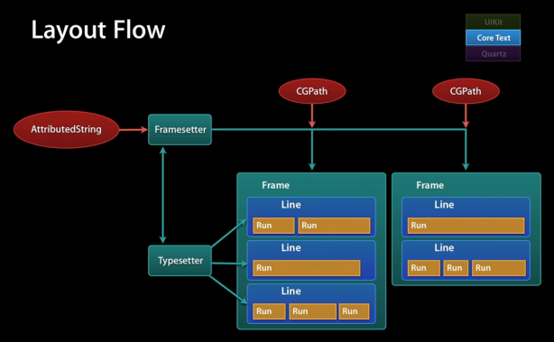 

另对于Context的了解可以参考:http://www.padovo.com/blog/2013/01/31/study-coretext/

原文出处：<a href="http://blog.csdn.net/fengsh998/article/details/8700627" target="blank">IOS CoreText.framework --- 段落样子CTParagraphStyle</a>

 
     

在前面一篇文章中，介绍了属性文字的基本使用，本章节主要针对文字的段落样式展开演示说明。

先定义一段演示文字（文字中有中，英文）。

<pre name="code" class="cpp">NSString *src = [NSString stringWithString:@&quot;其实流程是这样的： 1、生成要绘制的NSAttributedString对象。 2、生成一个CTFramesetterRef对象，然后创建一个CGPath对象，这个Path对象用于表示可绘制区域坐标值、长宽。 3、使用上面生成的setter和path生成一个CTFrameRef对象，这个对象包含了这两个对象的信息（字体信息、坐标信息），它就可以使用CTFrameDraw方法绘制了。&quot;];
NSMutableAttributedString * mabstring = [[NSMutableAttributedString alloc]initWithString:src];
long slen = [mabstring length];
</pre> 

<pre name="code" class="cpp">在未设置段落样式的情况下，效果：</pre>

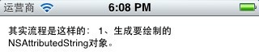

从上面的交果来看，想必大家也看到了，英文部份换行显示了。这个一般情况下不注意，但在大的段落文章中就会出现不对齐现象。

先不管上面的，下面逐个来演示一下段落属性。 
段落样式定义：

<pre name="code" class="cpp">kCTParagraphStyleSpecifierAlignment = 0,                 //对齐属性
 kCTParagraphStyleSpecifierFirstLineHeadIndent = 1,       //首行缩进
 kCTParagraphStyleSpecifierHeadIndent = 2,                //段头缩进
 kCTParagraphStyleSpecifierTailIndent = 3,                //段尾缩进
 kCTParagraphStyleSpecifierTabStops = 4,                  //制表符模式
 kCTParagraphStyleSpecifierDefaultTabInterval = 5,        //默认tab间隔
 kCTParagraphStyleSpecifierLineBreakMode = 6,             //换行模式
 kCTParagraphStyleSpecifierLineHeightMultiple = 7,        //多行高
 kCTParagraphStyleSpecifierMaximumLineHeight = 8,         //最大行高
 kCTParagraphStyleSpecifierMinimumLineHeight = 9,         //最小行高
 kCTParagraphStyleSpecifierLineSpacing = 10,              //行距 
 kCTParagraphStyleSpecifierParagraphSpacing = 11,         //段落间距  在段的未尾（Bottom）加上间隔，这个值为负数。
 kCTParagraphStyleSpecifierParagraphSpacingBefore = 12,   //段落前间距 在一个段落的前面加上间隔。TOP
 kCTParagraphStyleSpecifierBaseWritingDirection = 13,     //基本书写方向
 kCTParagraphStyleSpecifierMaximumLineSpacing = 14,       //最大行距
 kCTParagraphStyleSpecifierMinimumLineSpacing = 15,       //最小行距
 kCTParagraphStyleSpecifierLineSpacingAdjustment = 16,    //行距调整
 kCTParagraphStyleSpecifierCount = 17,        //
</pre> 
对齐属性：

<pre class="declaration" style="margin:0em 0.333em 1em 0.5em; font-size:13px; font-family:Courier,Consolas,monospace; color:rgb(102,102,102); background-color:rgb(255,255,255)">kCTLeftTextAlignment = 0,                //左对齐
kCTRightTextAlignment = 1,               //右对齐
kCTCenterTextAlignment = 2,              //居中对齐
kCTJustifiedTextAlignment = 3,           //文本对齐
段落默认样式为
<pre class="declaration" style="margin:0em 0.333em 1em 0.5em; background-color:rgb(255,255,255); font-size:13px; font-family:Courier,Consolas,monospace; color:rgb(102,102,102)">kCTNaturalTextAlignment</pre>
<pre class="declaration" style="margin:0em 0.333em 1em 0.5em; background-color:rgb(255,255,255); font-size:13px; font-family:Courier,Consolas,monospace; color:rgb(102,102,102)">效果：</pre>
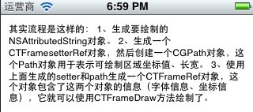

<pre class="declaration" style="margin:0em 0.333em 1em 0.5em; background-color:rgb(255,255,255); font-size:13px; font-family:Courier,Consolas,monospace; color:rgb(102,102,102)">居中：</pre>
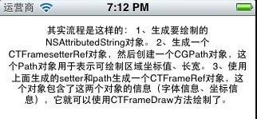

<pre class="declaration" style="margin:0em 0.333em 1em 0.5em; background-color:rgb(255,255,255); font-size:13px; font-family:Courier,Consolas,monospace; color:rgb(102,102,102)">文本对齐Justified效果</pre>
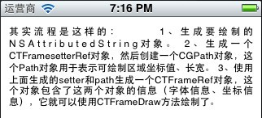

<pre class="declaration" style="margin:0em 0.333em 1em 0.5em; background-color:rgb(255,255,255); font-size:13px; font-family:Courier,Consolas,monospace; color:rgb(102,102,102)">对齐方式设置代码：</pre>
<pre name="code" class="cpp">CTTextAlignment alignment = kCTJustifiedTextAlignment;
    CTParagraphStyleSetting alignmentStyle;
    alignmentStyle.spec=kCTParagraphStyleSpecifierAlignment;//指定为对齐属性
    alignmentStyle.valueSize=sizeof(alignment);
    alignmentStyle.value=&amp;alignment;</pre> 首行缩进代码：</pre>
<pre name="code" class="cpp">//首行缩进
    CGFloat fristlineindent = 24.0f;
    CTParagraphStyleSetting fristline;
    fristline.spec = kCTParagraphStyleSpecifierFirstLineHeadIndent;
    fristline.value = &amp;fristlineindent;
    fristline.valueSize = sizeof(float);</pre> 效果：</pre> 
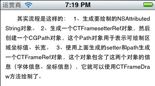

<pre class="declaration" style="margin:0em 0.333em 1em 0.5em; background-color:rgb(255,255,255); font-size:13px; font-family:Courier,Consolas,monospace; color:rgb(102,102,102)">段头缩进代码：</pre>
<pre name="code" class="cpp">    //段缩进
    CGFloat headindent = 10.0f;
    CTParagraphStyleSetting head;
    head.spec = kCTParagraphStyleSpecifierHeadIndent;
    head.value = &amp;headindent;
    head.valueSize = sizeof(float);</pre>效果：</pre> 
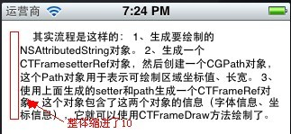

<pre class="declaration" style="margin:0em 0.333em 1em 0.5em; background-color:rgb(255,255,255); font-size:13px; font-family:Courier,Consolas,monospace; color:rgb(102,102,102)">段尾缩进代码：</pre>
<pre name="code" class="cpp">    //段尾缩进
    CGFloat tailindent = 50.0f;
    CTParagraphStyleSetting tail;
    tail.spec = kCTParagraphStyleSpecifierTailIndent;
    tail.value = &amp;tailindent;
    tail.valueSize = sizeof(float);
</pre> 效果：</pre>
 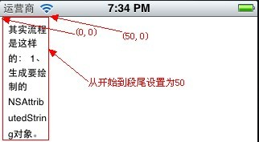

<pre class="declaration" style="margin:0em 0.333em 1em 0.5em; background-color:rgb(255,255,255); font-size:13px; font-family:Courier,Consolas,monospace; color:rgb(102,102,102)">制表符（tab）代码：</pre>
<pre name="code" class="cpp">//tab
    CTTextAlignment tabalignment = kCTJustifiedTextAlignment;
    CTTextTabRef texttab = CTTextTabCreate(tabalignment, 24, NULL);
    CTParagraphStyleSetting tab;
    tab.spec = kCTParagraphStyleSpecifierTabStops;
    tab.value = &amp;texttab;
    tab.valueSize = sizeof(CTTextTabRef);</pre>
<pre class="declaration" style="margin:0em 0.333em 1em 0.5em; background-color:rgb(255,255,255); font-size:13px; font-family:Courier,Consolas,monospace; color:rgb(102,102,102)">效果（未看出哪有变化感觉行距大了点）：</pre>
<pre class="declaration" style="margin:0em 0.333em 1em 0.5em; background-color:rgb(255,255,255); font-size:13px; font-family:Courier,Consolas,monospace; color:rgb(102,102,102)">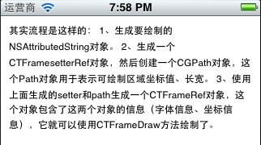
</pre>
<pre class="declaration" style="margin:0em 0.333em 1em 0.5em; background-color:rgb(255,255,255); font-size:13px; font-family:Courier,Consolas,monospace; color:rgb(102,102,102)">换行模式：</pre>
<pre class="declaration" style="margin:0em 0.333em 1em 0.5em; font-size:13px; font-family:Courier,Consolas,monospace; color:rgb(102,102,102); background-color:rgb(255,255,255)">kCTLineBreakByWordWrapping = 0,        //出现在单词边界时起作用，如果该单词不在能在一行里显示时，整体换行。此为段的默认&#20540;。
kCTLineBreakByCharWrapping = 1,        //当一行中最后一个位置的大小不能容纳一个字符时，才进行换行。
kCTLineBreakByClipping = 2,            //超出画布边缘部份将被截除。
kCTLineBreakByTruncatingHead = 3,      //截除前面部份，只保留后面一行的数据。前部份以...代替。
kCTLineBreakByTruncatingTail = 4,      //截除后面部份，只保留前面一行的数据，后部份以...代替。
kCTLineBreakByTruncatingMiddle = 5     //在一行中显示段文字的前面和后面文字，中间文字使用...代替。</pre>换行模式代码：</pre>
<pre name="code" class="cpp"> //换行模式
CTParagraphStyleSetting lineBreakMode;
CTLineBreakMode lineBreak = kCTLineBreakByWordWrapping;//kCTLineBreakByCharWrapping;//换行模式
lineBreakMode.spec = kCTParagraphStyleSpecifierLineBreakMode;
lineBreakMode.value = &amp;lineBreak;
lineBreakMode.valueSize = sizeof(CTLineBreakMode);</pre> 
<pre class="declaration" style="margin:0em 0.333em 1em 0.5em; background-color:rgb(255,255,255); color:rgb(102,102,102); font-size:13px; font-family:Courier,Consolas,monospace">kCTLineBreakByWordWrapping</pre>效果：</pre>
 

<pre class="declaration" style="margin:0em 0.333em 1em 0.5em; background-color:rgb(255,255,255); color:rgb(102,102,102); font-size:13px; font-family:Courier,Consolas,monospace">kCTLineBreakByCharWrapping</pre>效果:</pre>
 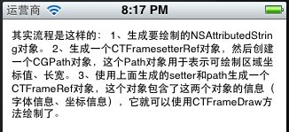

<pre class="declaration" style="margin:0em 0.333em 1em 0.5em; background-color:rgb(255,255,255); color:rgb(102,102,102); font-size:13px; font-family:Courier,Consolas,monospace">kCTLineBreakByClipping</pre>效果：</pre> 
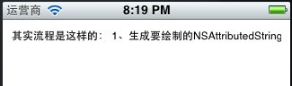

<pre class="declaration" style="margin:0em 0.333em 1em 0.5em; background-color:rgb(255,255,255); color:rgb(102,102,102); font-size:13px; font-family:Courier,Consolas,monospace">kCTLineBreakByTruncatingHead</pre>效果：</pre> 
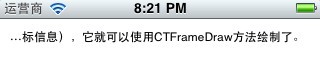

<pre class="declaration" style="margin:0em 0.333em 1em 0.5em; background-color:rgb(255,255,255); color:rgb(102,102,102); font-size:13px; font-family:Courier,Consolas,monospace">kCTLineBreakByTruncatingTail</pre>效果：</pre>
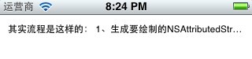

<pre class="declaration" style="margin:0em 0.333em 1em 0.5em; background-color:rgb(255,255,255); color:rgb(102,102,102); font-size:13px; font-family:Courier,Consolas,monospace">kCTLineBreakByTruncatingMiddle</pre>效果：</pre>
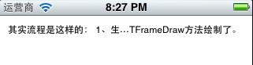

<pre class="declaration" style="margin:0em 0.333em 1em 0.5em; background-color:rgb(255,255,255); font-size:13px; font-family:Courier,Consolas,monospace; color:rgb(102,102,102)">多行高设置代码：</pre>
<pre name="code" class="cpp">    //多行高
    CGFloat MutiHeight = 10.0f;
    CTParagraphStyleSetting Muti;
    Muti.spec = kCTParagraphStyleSpecifierLineHeightMultiple;
    Muti.value = &amp;MutiHeight;
    Muti.valueSize = sizeof(float);</pre>效果：</pre> 
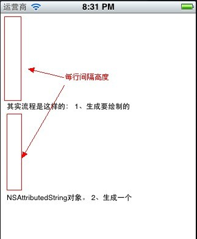

<pre class="declaration" style="margin:0em 0.333em 1em 0.5em; background-color:rgb(255,255,255); font-size:13px; font-family:Courier,Consolas,monospace; color:rgb(102,102,102)">最大行高代码：</pre>
<pre name="code" class="cpp">//最大行高
    CGFloat MaxHeight = 5.0f;
    CTParagraphStyleSetting Max;
    Max.spec = kCTParagraphStyleSpecifierLineHeightMultiple;
    Max.value = &amp;MaxHeight;
    Max.valueSize = sizeof(float);</pre> 效果：</pre>  
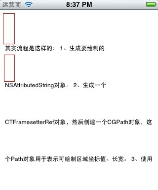

<pre class="declaration" style="margin:0em 0.333em 1em 0.5em; background-color:rgb(255,255,255); font-size:13px; font-family:Courier,Consolas,monospace; color:rgb(102,102,102)">行距代码：</pre>
<pre name="code" class="cpp">    //行距 
    CGFloat _linespace = 5.0f;
    CTParagraphStyleSetting lineSpaceSetting;
    lineSpaceSetting.spec = kCTParagraphStyleSpecifierLineSpacing;
    lineSpaceSetting.value = &amp;_linespace;
    lineSpaceSetting.valueSize = sizeof(float);</pre> 效果：</pre> 
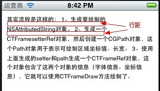

<pre class="declaration" style="margin:0em 0.333em 1em 0.5em; background-color:rgb(255,255,255); font-size:13px; font-family:Courier,Consolas,monospace; color:rgb(102,102,102)">段前间距设置代码（段与段之间）：</pre>
<pre name="code" class="cpp">    //段前间隔
    CGFloat paragraphspace = 5.0f;
    CTParagraphStyleSetting paragraph;
    paragraph.spec = kCTParagraphStyleSpecifierLineSpacing;
    paragraph.value = ¶graphspace;
    paragraph.valueSize = sizeof(float);</pre>效果：</pre> 
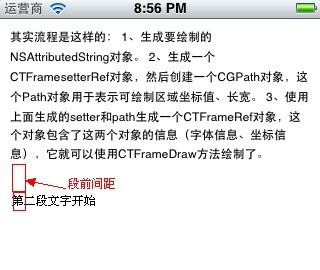

<pre class="declaration" style="margin:0em 0.333em 1em 0.5em; font-size:13px; font-family:Courier,Consolas,monospace; color:rgb(102,102,102); background-color:rgb(255,255,255)">kCTWritingDirectionNatural = -1,            //普通书写方向，一般习惯是从左到右写
kCTWritingDirectionLeftToRight = 0,         //从左到右写
kCTWritingDirectionRightToLeft = 1          //从右到左写</pre> </pre>
<pre class="declaration" style="margin:0em 0.333em 1em 0.5em; background-color:rgb(255,255,255); font-size:13px; font-family:Courier,Consolas,monospace; color:rgb(102,102,102)">基本书写方向代码：</pre>
<pre name="code" class="cpp">    //书写方向
    CTWritingDirection wd = kCTWritingDirectionRightToLeft;
    CTParagraphStyleSetting writedic;
    writedic.spec = kCTParagraphStyleSpecifierBaseWritingDirection;
    writedic.value = &amp;wd;
    writedic.valueSize = sizeof(CTWritingDirection);</pre> 效果：</pre>
 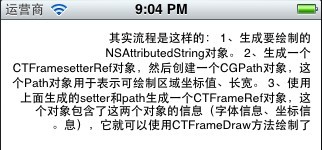

<pre class="declaration" style="margin:0em 0.333em 1em 0.5em; background-color:rgb(255,255,255); font-size:13px; font-family:Courier,Consolas,monospace; color:rgb(102,102,102)">这个跟字体右对齐效果上类&#20284;。

</pre>
<pre class="declaration" style="margin:0em 0.333em 1em 0.5em; background-color:rgb(255,255,255); font-size:13px; font-family:Courier,Consolas,monospace; color:rgb(102,102,102)">好了，段落的API样式介绍到这里，里面还有很多配合设置时的效果。读者自行演示了。</pre>
<pre class="declaration" style="margin:0em 0.333em 1em 0.5em; background-color:rgb(255,255,255); font-size:13px; font-family:Courier,Consolas,monospace; color:rgb(102,102,102)">下面附上draw 代码：</pre>

<pre name="code" class="cpp">-(void)ParagraphStyle
{
    NSString *src = [NSString stringWithString:@&quot;其实流程是这样的： 1、生成要绘制的NSAttributedString对象。 2、生成一个CTFramesetterRef对象，然后创建一个CGPath对象，这个Path对象用于表示可绘制区域坐标值、长宽。 3、使用上面生成的setter和path生成一个CTFrameRef对象，这个对象包含了这两个对象的信息（字体信息、坐标信息），它就可以使用CTFrameDraw方法绘制了。&quot;];
    
    //修改windows回车换行为mac的回车换行
    //src = [src stringByReplacingOccurrencesOfString:@&quot;\r\n&quot; withString:@&quot;\n&quot;];
    
    NSMutableAttributedString * mabstring = [[NSMutableAttributedString alloc]initWithString:src];
    
    long slen = [mabstring length];
    
    
    //创建文本对齐方式
    CTTextAlignment alignment = kCTRightTextAlignment;//kCTNaturalTextAlignment;
    CTParagraphStyleSetting alignmentStyle;
    alignmentStyle.spec=kCTParagraphStyleSpecifierAlignment;//指定为对齐属性
    alignmentStyle.valueSize=sizeof(alignment);
    alignmentStyle.value=&amp;alignment;
    
    //首行缩进
    CGFloat fristlineindent = 24.0f;
    CTParagraphStyleSetting fristline;
    fristline.spec = kCTParagraphStyleSpecifierFirstLineHeadIndent;
    fristline.value = &amp;fristlineindent;
    fristline.valueSize = sizeof(float);
    
    //段缩进
    CGFloat headindent = 10.0f;
    CTParagraphStyleSetting head;
    head.spec = kCTParagraphStyleSpecifierHeadIndent;
    head.value = &amp;headindent;
    head.valueSize = sizeof(float);
    
    //段尾缩进
    CGFloat tailindent = 50.0f;
    CTParagraphStyleSetting tail;
    tail.spec = kCTParagraphStyleSpecifierTailIndent;
    tail.value = &amp;tailindent;
    tail.valueSize = sizeof(float);
    
    //tab
    CTTextAlignment tabalignment = kCTJustifiedTextAlignment;
    CTTextTabRef texttab = CTTextTabCreate(tabalignment, 24, NULL);
    CTParagraphStyleSetting tab;
    tab.spec = kCTParagraphStyleSpecifierTabStops;
    tab.value = &amp;texttab;
    tab.valueSize = sizeof(CTTextTabRef);
    
    //换行模式
    CTParagraphStyleSetting lineBreakMode;
    CTLineBreakMode lineBreak = kCTLineBreakByTruncatingMiddle;//kCTLineBreakByWordWrapping;//换行模式
    lineBreakMode.spec = kCTParagraphStyleSpecifierLineBreakMode;
    lineBreakMode.value = &amp;lineBreak;
    lineBreakMode.valueSize = sizeof(CTLineBreakMode);
    
    //多行高
    CGFloat MutiHeight = 10.0f;
    CTParagraphStyleSetting Muti;
    Muti.spec = kCTParagraphStyleSpecifierLineHeightMultiple;
    Muti.value = &amp;MutiHeight;
    Muti.valueSize = sizeof(float);
    
    //最大行高
    CGFloat MaxHeight = 5.0f;
    CTParagraphStyleSetting Max;
    Max.spec = kCTParagraphStyleSpecifierLineHeightMultiple;
    Max.value = &amp;MaxHeight;
    Max.valueSize = sizeof(float);
    
    //行距 
    CGFloat _linespace = 5.0f;
    CTParagraphStyleSetting lineSpaceSetting;
    lineSpaceSetting.spec = kCTParagraphStyleSpecifierLineSpacing;
    lineSpaceSetting.value = &amp;_linespace;
    lineSpaceSetting.valueSize = sizeof(float);
    
    //段前间隔
    CGFloat paragraphspace = 5.0f;
    CTParagraphStyleSetting paragraph;
    paragraph.spec = kCTParagraphStyleSpecifierLineSpacing;
    paragraph.value = ¶graphspace;
    paragraph.valueSize = sizeof(float);
    
    //书写方向
    CTWritingDirection wd = kCTWritingDirectionRightToLeft;
    CTParagraphStyleSetting writedic;
    writedic.spec = kCTParagraphStyleSpecifierBaseWritingDirection;
    writedic.value = &amp;wd;
    writedic.valueSize = sizeof(CTWritingDirection);
    
    //组合设置
    CTParagraphStyleSetting settings[] = {
        alignmentStyle
        fristline,
        head,
        tail,
        tab,
        lineBreakMode,
        Muti,
        Max,
        lineSpaceSetting,
        writedic
        indentSetting
        
    };
    
    //通过设置项产生段落样式对象
    CTParagraphStyleRef style = CTParagraphStyleCreate(settings, 11);
     
    // build attributes
    NSMutableDictionary *attributes = [NSMutableDictionary dictionaryWithObject:(id)style forKey:(id)kCTParagraphStyleAttributeName ];
 
    // set attributes to attributed string
    [mabstring addAttributes:attributes range:NSMakeRange(0, slen)];
    
    
    CTFramesetterRef framesetter = CTFramesetterCreateWithAttributedString((CFAttributedStringRef)mabstring);
    
    CGMutablePathRef Path = CGPathCreateMutable();
    
    //坐标点在左下角
    CGPathAddRect(Path, NULL ,CGRectMake(10 , 10 ,self.bounds.size.width-20 , self.bounds.size.height-20));
    
    CTFrameRef frame = CTFramesetterCreateFrame(framesetter, CFRangeMake(0, 0), Path, NULL);	
    
    
    
    //获取当前(View)上下文以便于之后的绘画，这个是一个离屏。
    CGContextRef context = UIGraphicsGetCurrentContext();
    
    CGContextSetTextMatrix(context , CGAffineTransformIdentity);
    
    //压栈，压入图形状态栈中.每个图形上下文维护一个图形状态栈，并不是所有的当前绘画环境的图形状态的元素都被保存。图形状态中不考虑当前路径，所以不保存
    //保存现在得上下文图形状态。不管后续对context上绘制什么都不会影响真正得屏幕。
    CGContextSaveGState(context);
    
    //x，y轴方向移动
    CGContextTranslateCTM(context , 0 ,self.bounds.size.height);
    
    //缩放x，y轴方向缩放，－1.0为反向1.0倍,坐标系转换,沿x轴翻转180度
    CGContextScaleCTM(context, 1.0 ,-1.0);
    
    CTFrameDraw(frame,context);
    
    CGPathRelease(Path);
    CFRelease(framesetter);
}
 
-（void）drawRect:(CGRect)rect
{
   [self ParagraphStyle];
}</pre>
   

原文出处：<a href="http://blog.csdn.net/fengsh998/article/details/8701738" target="blank">IOS CoreText.framework --- 行 CTLineRef   
</a>
 

前面两篇文章介绍了文字的样式，段落样式。本文章主要介绍行模式。CTLineRef

知识了解：

<h4 style="padding:0px; margin:0px; border:none; outline:none; font-family:Cuprum,'Hiragino Sans GB','Microsoft YaHei',sans-serif; font-size:16px; color:rgb(51,51,51); line-height:24px; word-spacing:1px">
1.字符（Character）和字形（Glyphs）</h4>

排版系统中文本显示的一个重要的过程就是字符到字形的转换，字符是信息本身的元素，而字形是字符的图形表征，字符还会有其它表征比如发音。 字符在计算机中其实就是一个编码，某个字符集中的编码，比如Unicode字符集，就囊括了大都数存在的字符。 而字形则是图形，一般都存储在字体文件中，字形也有它的编码，也就是它在字体中的索引。 一个字符可以对应多个字形（不同的字体，或者同种字体的不同样式:粗体斜体等）；多个字符也可能对应一个字形，比如字符的连写（ Ligatures）。&nbsp; 
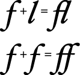 
Roman Ligatures

下面就来详情看看字形的各个参数也就是所谓的字形度量Glyph Metrics

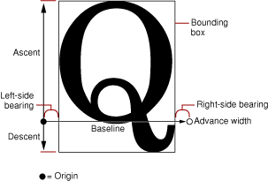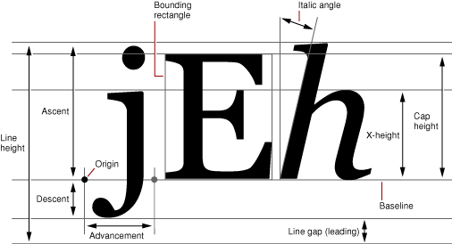 
 

<ul style="padding:0px; margin:0px; border:none; outline:none; list-style-position:inside; font-family:Galdeano,'Hiragino Sans GB','Microsoft YaHei',Trebuchet,'Trebuchet MS',Tahoma,'Lucida Grande','Lucida Sans Unicode',Verdana,sans-serif; font-size:16px; line-height:24px; word-spacing:1px">
<li style="padding:0.2em 0px; margin:0px; border:none; outline:none">bounding box（边界框 bbox），这是一个假想的框子，它尽可能紧密的装入字形。</li><li style="padding:0.2em 0px; margin:0px; border:none; outline:none">baseline（基线），一条假想的线,一行上的字形都以此线作为上下位置的参考，在这条线的左侧存在一个点叫做基线的原点，</li><li style="padding:0.2em 0px; margin:0px; border:none; outline:none">ascent（上行高度）从原点到字体中最高（这里的高深都是以基线为参照线的）的字形的顶部的距离，ascent是一个正&#20540;</li><li style="padding:0.2em 0px; margin:0px; border:none; outline:none">descent（下行高度）从原点到字体中最深的字形底部的距离，descent是一个负&#20540;（比如一个字体原点到最深的字形的底部的距离为2，那么descent就为-2）</li><li style="padding:0.2em 0px; margin:0px; border:none; outline:none">linegap（行距），linegap也可以称作leading（其实准确点讲应该叫做External leading）,行高lineHeight则可以通过 ascent &#43; |descent| &#43; linegap 来计算。</li></ul>

一些Metrics专业知识还可以参考Free Type的文档&nbsp;<a href="http://www.freetype.org/freetype2/docs/glyphs/glyphs-3.html" style="padding:0px; margin:0px; border:none; outline:none; color:rgb(221,0,0); text-decoration:none">Glyph metrics</a>，其实iOS就是使用<a href="http://www.freetype.org/" style="padding:0px; margin:0px; border:none; outline:none; color:rgb(221,0,0); text-decoration:none">Free
 Type</a>库来进行字体渲染的。

以上图片和部分概念来自苹果文档&nbsp;<a href="http://developer.apple.com/library/mac/#documentation/TextFonts/Conceptual/CocoaTextArchitecture/FontHandling/FontHandling.html#//apple_ref/doc/uid/TP40009459-CH5-SW18" style="padding:0px; margin:0px; border:none; outline:none; color:rgb(221,0,0); text-decoration:none">Querying
 Font Metrics</a>&nbsp;，<a href="http://developer.apple.com/library/mac/documentation/TextFonts/Conceptual/CocoaTextArchitecture/TypoFeatures/TextSystemFeatures.html#//apple_ref/doc/uid/TP40009459-CH6-51627-BBCCHIFF" style="padding:0px; margin:0px; border:none; outline:none; color:rgb(221,0,0); text-decoration:none">Text
 Layout</a>

<h4 style="padding:0px; margin:0px; border:none; outline:none; font-family:Cuprum,'Hiragino Sans GB','Microsoft YaHei',sans-serif; font-size:16px; color:rgb(51,51,51); line-height:24px; word-spacing:1px">
2.坐标系</h4>

首先不得不说 苹果编程中的坐标系花样百出，经常让开发者措手不及。 传统的Mac中的坐标系的原点在左下角，比如NSView默认的坐标系，原点就在左下角。但Mac中有些View为了其实现的便捷将原点变换到左上角，像NSTableView的坐标系坐标原点就在左上角。iOS UIKit的UIView的坐标系原点在左上角。&nbsp; 
往底层看，Core Graphics的context使用的坐标系的原点是在左下角。而在iOS中的底层界面绘制就是通过Core Graphics进行的，那么坐标系列是如何变换的呢？ 在UIView的drawRect方法中我们可以通过UIGraphicsGetCurrentContext()来获得当前的Graphics Context。drawRect方法在被调用前，这个Graphics Context被创建和配置好，你只管使用便是。如果你细心，通过CGContextGetCTM(CGContextRef c)可以看到其返回的&#20540;并不是CGAffineTransformIdentity，通过打印出来看到&#20540;为

<pre style="padding:0px; margin-top:0px; margin-bottom:0px; border:none; outline:none; font-family:Menlo,'Andale Mono',Consolas,'Courier New',Monaco,monospace; font-size:13px; line-height:24px; word-spacing:1px; background-color:rgb(255,255,255)"><code style="padding:0px; margin:1em 0px; border:none; outline:none; font-family:Menlo,'Andale Mono',Consolas,'Courier New',Monaco,monospace; background-color:rgb(247,247,247); line-height:1.6; display:block; overflow:auto">Printing description of contextCTM:
(CGAffineTransform) contextCTM = {
        a = 1
        b = 0
        c = 0
        d = -1
        tx = 0
        ty = 460
}       
</code></pre>

这是非retina分辨率下的结果，如果是如果是retina上面的a,d,ty的&#20540;将会乘2，如果是iPhone 5，ty的&#20540;会再大些。 但是作用都是一样的就是将上下文空间坐标系进行了flip，使得原本左下角原点变到左上角，y轴正方向也变换成向下。

 

还是老样子，拿一个事先定义好的属性字串进行开讲。

 

<pre name="code" class="cpp">  NSString *src = [NSString stringWithString:@&quot;其实流程是这样的： 1、生成要绘制的NSAttributedString对象。 &quot;];
    
    NSMutableAttributedString * mabstring = [[NSMutableAttributedString alloc]initWithString:src];
    
    long slen = [mabstring length];</pre> 
将属性字串放到frame当中。

<pre name="code" class="cpp">    CTFramesetterRef framesetter = CTFramesetterCreateWithAttributedString((CFAttributedStringRef)mabstring);
    
    CGMutablePathRef Path = CGPathCreateMutable();
    
    //坐标点在左下角
    CGPathAddRect(Path, NULL ,CGRectMake(10 , 10 ,self.bounds.size.width-20 , self.bounds.size.height-20));
    
    CTFrameRef frame = CTFramesetterCreateFrame(framesetter, CFRangeMake(0, 0), Path, NULL);</pre>

显示效果：

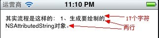 

得到属性字串在frame中被自动分成了多少个行。每行中有多少个CTRun

<pre name="code" class="cpp">    //得到frame中的行数组
     CFArrayRef rows = CTFrameGetLines(frame);
     
     int rowcount = CFArrayGetCount(rows);
    
     NSLog(@&quot;rowcount = %i&quot;,rowcount);
     
     CTLineRef line = CFArrayGetValueAtIndex(rows, 0);
    
    //从一行中得到CTRun数组
     CFArrayRef runs = CTLineGetGlyphRuns(line);     
     int runcount = CFArrayGetCount(runs);
     
     NSLog(@&quot;runcount = %i&quot;,runcount);</pre>结果：

<pre name="code" class="cpp">2013-03-20 23:07:38.835 CTextDemo[5612:207] rowcount = 2
2013-03-20 23:07:38.838 CTextDemo[5612:207] runcount = 17
</pre>

 

将第一行设置为使用省略号模式

<pre name="code" class="cpp">   NSAttributedString *truncatedString = [[NSAttributedString alloc]initWithString:@&quot;\u2026&quot;];
    CTLineRef token = CTLineCreateWithAttributedString((__bridge CFAttributedStringRef)truncatedString);
    
    CTLineTruncationType ltt = kCTLineTruncationStart;//kCTLineTruncationEnd;
    CTLineRef newline = CTLineCreateTruncatedLine(line, self.bounds.size.width-200, ltt, token);</pre>

&nbsp; &nbsp; &nbsp;CGContextSetTextPosition(context,20,&nbsp;20); 
&nbsp;&nbsp;&nbsp;&nbsp;CTLineDraw(newline,&nbsp;context);&nbsp;

 

效果： 

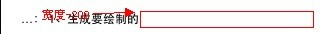

CTLineTruncationType 为kCTLineTrunceationEnd; 
 
 

省略号在中间
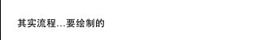 
 

 

<h3 class="tight jump function" id="jumpTo_7" style="margin-top:2em; margin-bottom:-0.25em; font-size:19px; font-weight:normal; font-family:'Lucida Grande','Lucida Sans Unicode',Helvetica,Arial,Verdana,sans-serif">
<pre class="declaration" style="margin:0em 0.333em 1em 0.5em; font-size:13px; font-family:Courier,Consolas,monospace; color:rgb(102,102,102); background-color:rgb(255,255,255)">CFIndex CTLineGetGlyphCount( CTLineRef line );</pre>
</h3>
获取一行中的图像个数，即有多少个CTRun。

<pre class="declaration" style="margin:0em 0.333em 1em 0.5em; font-size:13px; font-family:Courier,Consolas,monospace; color:rgb(102,102,102); background-color:rgb(255,255,255)">CFArrayRef CTLineGetGlyphRuns( CTLineRef line );</pre>
<pre class="declaration" style="margin:0em 0.333em 1em 0.5em; font-size:13px; font-family:Courier,Consolas,monospace; color:rgb(102,102,102); background-color:rgb(255,255,255)">获取CTRUN数组，可以通过CFArrayGetCount得到数组的个数得到的&#20540;与CTLineGetGlyphCount相同。</pre>
 

<pre class="declaration" style="margin:0em 0.333em 1em 0.5em; font-size:13px; font-family:Courier,Consolas,monospace; color:rgb(102,102,102); background-color:rgb(255,255,255)">CGFloat CTLineGetOffsetForStringIndex( CTLineRef line, CFIndex charIndex, CGFloat* secondaryOffset );</pre>
<pre class="declaration" style="margin:0em 0.333em 1em 0.5em; font-size:13px; font-family:Courier,Consolas,monospace; background-color:rgb(255,255,255)">获取一行文字中，指定charIndex字符相对x原点的偏移量，返回&#20540;与secondaryOffset同为一个&#20540;。如果charIndex超出一行的字符长度则反回最大长度结束位置的偏移量，如一行文字共有17个字符，哪么返回的是第18个字符的起始偏移，即第17个偏移&#43;第17个字符占有的宽度=第18个起始位置的偏移。因此想求一行字符所占的像素长度时，就可以使用此函数，将charIndex设置为大于字符长度即可。</pre>

<pre name="code" class="cpp"> //获取整段文字中charIndex位置的字符相对line的原点的x值
    CGFloat offset;
    CGFloat retoffset = CTLineGetOffsetForStringIndex(line,1,&amp;offset);
    NSLog(@&quot;return offset = %f&quot;,retoffset);
    NSLog(@&quot;output offset = %f&quot;,offset);
</pre>

效果：

<pre name="code" class="cpp">2013-03-21 13:37:22.330 CTextDemo[6851:207] return offset = 12.000000
2013-03-21 13:37:22.331 CTextDemo[6851:207] output offset = 12.000000</pre> 
 

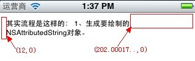 

<pre class="declaration" style="margin:0em 0.333em 1em 0.5em; font-size:13px; font-family:Courier,Consolas,monospace; color:rgb(102,102,102); background-color:rgb(255,255,255)">double CTLineGetPenOffsetForFlush( CTLineRef line, CGFloat flushFactor, double flushWidth );</pre>
<pre class="declaration" style="margin:0em 0.333em 1em 0.5em; font-size:13px; font-family:Courier,Consolas,monospace; color:rgb(102,102,102); background-color:rgb(255,255,255)">获取相对于Flush的偏移量。即[flushwidth - line(字符占的像素)]*flushFactor/100;这是我个人推的公式，发现精确度上还存在偏差。</pre>
<pre class="declaration" style="margin:0em 0.333em 1em 0.5em; font-size:13px; font-family:Courier,Consolas,monospace; color:rgb(102,102,102); background-color:rgb(255,255,255)">当flushFactor取&#20540;为0,0.5,1时分别显示的效果为左对齐，居中对齐，右对齐。</pre>
演示代码：
<pre name="code" class="cpp">- (void)drawRect:(CGRect)rect
{
	  NSString *src = [NSString stringWithString:@&quot;其实流程是这样的： 1、生成要绘制的NSAttributedString对象。 &quot;];
    
    NSMutableAttributedString * mabstring = [[NSMutableAttributedString alloc]initWithString:src];
    
    long slen = [mabstring length];
    
    
    CTFramesetterRef framesetter = CTFramesetterCreateWithAttributedString((CFAttributedStringRef)mabstring);
    
    CGMutablePathRef Path = CGPathCreateMutable();
    
    //坐标点在左下角
    CGPathAddRect(Path, NULL ,CGRectMake(10 , 10 ,self.bounds.size.width-20 , self.bounds.size.height-20));
    
    CTFrameRef frame = CTFramesetterCreateFrame(framesetter, CFRangeMake(0, 0), Path, NULL);	
    

    //得到frame中的行数组
    CFArrayRef rows = CTFrameGetLines(frame);
    
    if (rows) {
        const CFIndex numberOfLines = CFArrayGetCount(rows);
        const CGFloat fontLineHeight = [UIFont systemFontOfSize:20].lineHeight;
        CGFloat textOffset = 0;
        
        CGContextRef ctx = UIGraphicsGetCurrentContext();
        CGContextSaveGState(ctx);
        CGContextTranslateCTM(ctx, rect.origin.x, rect.origin.y+[UIFont systemFontOfSize:20].ascender);
        CGContextSetTextMatrix(ctx, CGAffineTransformMakeScale(1,-1));
        
        for (CFIndex lineNumber=0; lineNumber&lt;numberOfLines; lineNumber++) {
            CTLineRef line = CFArrayGetValueAtIndex(rows, lineNumber);
            float flush;
            switch (2) {
                case UITextAlignmentCenter:	flush = 0.5;	break; //1
                case UITextAlignmentRight:	flush = 1;		break; //2
                case UITextAlignmentLeft:  //0
                default:					flush = 0;		break;
            }
            
            CGFloat penOffset = CTLineGetPenOffsetForFlush(line, flush, rect.size.width);
            NSLog(@&quot;penOffset = %f&quot;,penOffset);
            CGContextSetTextPosition(ctx, penOffset, textOffset);//在偏移量x,y上打印
            CTLineDraw(line, ctx);//draw 行文字
            textOffset += fontLineHeight;
        }
        
        CGContextRestoreGState(ctx);
        
    }
}</pre>
 效果：</pre>
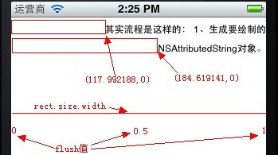

<pre class="declaration" style="margin:0em 0.333em 1em 0.5em; font-size:13px; font-family:Courier,Consolas,monospace; color:rgb(102,102,102); background-color:rgb(255,255,255)">CFIndex CTLineGetStringIndexForPosition( CTLineRef line, CGPoint position );</pre><pre class="declaration" style="margin:0em 0.333em 1em 0.5em; font-size:13px; font-family:Courier,Consolas,monospace; color:rgb(102,102,102); background-color:rgb(255,255,255)">获取一行中光标点击处（position）的字符索引，这个&#20540;只能为0或最大字符长度。</pre>
<pre class="declaration" style="margin:0em 0.333em 1em 0.5em; font-size:13px; font-family:Courier,Consolas,monospace; color:rgb(102,102,102); background-color:rgb(255,255,255)">CFRange CTLineGetStringRange( CTLineRef line );</pre>获取一行字符占的范围(包括换行符一起计算)，返回一行位置的起始位置(location)和长度(length)。</pre>location不是每行都从0开始的，而是该行的前N行字符和。</pre>
<pre class="declaration" style="margin:0em 0.333em 1em 0.5em; font-size:13px; font-family:Courier,Consolas,monospace; color:rgb(102,102,102); background-color:rgb(255,255,255)">double CTLineGetTrailingWhitespaceWidth( CTLineRef line );</pre>

<pre class="declaration" style="margin:0em 0.333em 1em 0.5em; font-size:13px; font-family:Courier,Consolas,monospace; color:rgb(102,102,102); background-color:rgb(255,255,255)">获取一行未尾字符后空&#26684;的像素长度。如果：&quot;abc  &quot;后面有两个空&#26684;，返回的就是这两个空&#26684;占有的像素长度。</pre>

<pre name="code" class="cpp">    double wspace = CTLineGetTrailingWhitespaceWidth(line);
    NSLog(@&quot;whitespacewidth = %f&quot;,wspace);</pre> <pre class="declaration" style="margin:0em 0.333em 1em 0.5em; font-size:13px; font-family:Courier,Consolas,monospace; color:rgb(102,102,102); background-color:rgb(255,255,255)">double CTLineGetTypographicBounds( CTLineRef line, CGFloat* ascent, CGFloat* descent, CGFloat* leading );</pre><pre class="declaration" style="margin:0em 0.333em 1em 0.5em; font-size:13px; font-family:Courier,Consolas,monospace; color:rgb(102,102,102); background-color:rgb(255,255,255)">获取一行中上行高(ascent)，下行高(descent)，行距(leading),整行高为(ascent&#43;|descent|&#43;leading) 返回&#20540;为整行字符串长度占有的像素宽度。</pre>
<pre name="code" class="cpp">CGFloat asc,des,lead;
    double lineHeight = CTLineGetTypographicBounds(line, &amp;asc, &amp;des, &amp;lead);
    NSLog(@&quot;ascent = %f,descent = %f,leading = %f,lineheight = %f&quot;,asc,des,lead,lineHeight);
</pre> <pre class="declaration" style="margin:0em 0.333em 1em 0.5em; font-size:13px; font-family:Courier,Consolas,monospace; color:rgb(102,102,102); background-color:rgb(255,255,255)">CGRect CTLineGetImageBounds( CTLineRef line, CGContextRef context );</pre>获取一行文字的范围，什么意思，就是指把这一行文字点有的像素距阵作为一个image图片，来得到整个矩形区域。</pre><pre class="declaration" style="margin:0em 0.333em 1em 0.5em; font-size:13px; font-family:Courier,Consolas,monospace; color:rgb(102,102,102); background-color:rgb(255,255,255)">演示代码：</pre>
<pre name="code" class="cpp">-(void)drawBounds
{
    NSString *src = [NSString stringWithString:@&quot;其实流程是这样的： 1、生成要绘制的NSAttributedString对象。 &quot;];
    
    NSAttributedString * string = [[NSAttributedString alloc]initWithString:src];
    
    CGContextRef ctx = UIGraphicsGetCurrentContext();
    
    CGContextSetTextMatrix(ctx , CGAffineTransformIdentity);
    
    //CGContextSaveGState(ctx);
    
    //x，y轴方向移动
    CGContextTranslateCTM(ctx , 0 ,self.bounds.size.height);
    
    //缩放x，y轴方向缩放，－1.0为反向1.0倍,坐标系转换,沿x轴翻转180度
    CGContextScaleCTM(ctx, 1.0 ,-1.0);
    
	// layout master
	CTFramesetterRef framesetter = CTFramesetterCreateWithAttributedString(
                                                                           (CFAttributedStringRef)string);
    CGMutablePathRef Path = CGPathCreateMutable();
    
    //坐标点在左下角
    CGPathAddRect(Path, NULL ,CGRectMake(0 , 0 ,self.bounds.size.width , self.bounds.size.height));
    
    CTFrameRef frame = CTFramesetterCreateFrame(framesetter, CFRangeMake(0, 0), Path, NULL);
    
    CFArrayRef Lines = CTFrameGetLines(frame);
    
    int linecount = CFArrayGetCount(Lines);
    
    CGPoint origins[linecount];
    CTFrameGetLineOrigins(frame,
                          CFRangeMake(0, 0), origins);
    NSInteger lineIndex = 0;
    
    for (id oneLine in (NSArray *)Lines)
    {
        CGRect lineBounds = CTLineGetImageBounds((CTLineRef)oneLine, ctx);
        
        lineBounds.origin.x += origins[lineIndex].x;
        lineBounds.origin.y += origins[lineIndex].y;
        
        lineIndex++;
        //画长方形
        
        //设置颜色，仅填充4条边
        CGContextSetStrokeColorWithColor(ctx, [[UIColor redColor] CGColor]);
        //设置线宽为1 
        CGContextSetLineWidth(ctx, 1.0);
        //设置长方形4个顶点
        CGPoint poins[] = {CGPointMake(lineBounds.origin.x, lineBounds.origin.y),CGPointMake(lineBounds.origin.x+lineBounds.size.width, lineBounds.origin.y),CGPointMake(lineBounds.origin.x+lineBounds.size.width, lineBounds.origin.y+lineBounds.size.height),CGPointMake(lineBounds.origin.x, lineBounds.origin.y+lineBounds.size.height)};
        CGContextAddLines(ctx,poins,4);
        CGContextClosePath(ctx);
        CGContextStrokePath(ctx);
        
    }
    

    
    CTFrameDraw(frame,ctx);
    
    CGPathRelease(Path);
    CFRelease(framesetter);
}
</pre>

 效果图：</pre> 
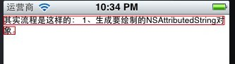
 效果图：</pre> 
通这个RECT我们可以对文字增加点击事件或其它触发动作等。

OK，CTLine 介绍完毕。
 
   

</a>

原文出处：<a href="http://blog.csdn.net/fengsh998/article/details/8714497" target="blank"> IOS CoreText.framework --- 图文混排</a>

  
  
     

利用CORETEXT进行图文混排。

实现代码：

<pre name="code" class="cpp">void RunDelegateDeallocCallback( void* refCon ){
    
}

CGFloat RunDelegateGetAscentCallback( void *refCon ){
    NSString *imageName = (NSString *)refCon;
    return 80;//[UIImage imageNamed:imageName].size.height;
}

CGFloat RunDelegateGetDescentCallback(void *refCon){
    return 0;
}

CGFloat RunDelegateGetWidthCallback(void *refCon){
    NSString *imageName = (NSString *)refCon;
    return 100;//[UIImage imageNamed:imageName].size.width;
}
</pre> 
先设置一个CTRun的委托，主要是用于指定对象的上行高，宽，或上下文释放时使用。

<pre name="code" class="cpp">-(void)drawCharAndPicture
{
    CGContextRef context = UIGraphicsGetCurrentContext();
    
    CGContextSetTextMatrix(context, CGAffineTransformIdentity);//设置字形变换矩阵为CGAffineTransformIdentity，也就是说每一个字形都不做图形变换
    
    CGAffineTransform flipVertical = CGAffineTransformMake(1,0,0,-1,0,self.bounds.size.height);
    CGContextConcatCTM(context, flipVertical);//将当前context的坐标系进行flip
    NSLog(@&quot;bh=%f&quot;,self.bounds.size.height);
    
    NSMutableAttributedString *attributedString = [[[NSMutableAttributedString alloc] initWithString:@&quot;请在这里插入一张图片位置&quot;] autorelease];
    
    
    //为图片设置CTRunDelegate,delegate决定留给图片的空间大小
    NSString *imgName = @&quot;img.png&quot;;
    CTRunDelegateCallbacks imageCallbacks;
    imageCallbacks.version = kCTRunDelegateVersion1;
    imageCallbacks.dealloc = RunDelegateDeallocCallback;
    imageCallbacks.getAscent = RunDelegateGetAscentCallback;
    imageCallbacks.getDescent = RunDelegateGetDescentCallback;
    imageCallbacks.getWidth = RunDelegateGetWidthCallback;
    CTRunDelegateRef runDelegate = CTRunDelegateCreate(&amp;imageCallbacks, imgName);
    NSMutableAttributedString *imageAttributedString = [[NSMutableAttributedString alloc] initWithString:@&quot; &quot;];//空格用于给图片留位置
    [imageAttributedString addAttribute:(NSString *)kCTRunDelegateAttributeName value:(id)runDelegate range:NSMakeRange(0, 1)];
    CFRelease(runDelegate);
    
    [imageAttributedString addAttribute:@&quot;imageName&quot; value:imgName range:NSMakeRange(0, 1)];
    
    [attributedString insertAttributedString:imageAttributedString atIndex:4];
   &nbsp;</pre><pre name="code" class="cpp">    //换行模式
    CTParagraphStyleSetting lineBreakMode;
    CTLineBreakMode lineBreak = kCTLineBreakByCharWrapping;
    lineBreakMode.spec = kCTParagraphStyleSpecifierLineBreakMode;
    lineBreakMode.value = &amp;lineBreak;
    lineBreakMode.valueSize = sizeof(CTLineBreakMode);
    
    CTParagraphStyleSetting settings[] = {
        lineBreakMode
    };
    
    CTParagraphStyleRef style = CTParagraphStyleCreate(settings, 1);
    
        
    // build attributes
    NSMutableDictionary *attributes = [NSMutableDictionary dictionaryWithObject:(id)style forKey:(id)kCTParagraphStyleAttributeName ];
    
    // set attributes to attributed string
    [attributedString addAttributes:attributes range:NSMakeRange(0, [attributedString length])];
    

    
    CTFramesetterRef ctFramesetter = CTFramesetterCreateWithAttributedString((CFMutableAttributedStringRef)attributedString);
    
    CGMutablePathRef path = CGPathCreateMutable();
    CGRect bounds = CGRectMake(0.0, 0.0, self.bounds.size.width, self.bounds.size.height);
    CGPathAddRect(path, NULL, bounds);
    
    CTFrameRef ctFrame = CTFramesetterCreateFrame(ctFramesetter,CFRangeMake(0, 0), path, NULL);
    CTFrameDraw(ctFrame, context);
    
    CFArrayRef lines = CTFrameGetLines(ctFrame);
    CGPoint lineOrigins[CFArrayGetCount(lines)];
    CTFrameGetLineOrigins(ctFrame, CFRangeMake(0, 0), lineOrigins);
    NSLog(@&quot;line count = %ld&quot;,CFArrayGetCount(lines));
    for (int i = 0; i &lt; CFArrayGetCount(lines); i++) {
        CTLineRef line = CFArrayGetValueAtIndex(lines, i);
        CGFloat lineAscent;
        CGFloat lineDescent;
        CGFloat lineLeading;
        CTLineGetTypographicBounds(line, &amp;lineAscent, &amp;lineDescent, &amp;lineLeading);
        NSLog(@&quot;ascent = %f,descent = %f,leading = %f&quot;,lineAscent,lineDescent,lineLeading);
        
        CFArrayRef runs = CTLineGetGlyphRuns(line);
        NSLog(@&quot;run count = %ld&quot;,CFArrayGetCount(runs));
        for (int j = 0; j &lt; CFArrayGetCount(runs); j++) {
            CGFloat runAscent;
            CGFloat runDescent;
            CGPoint lineOrigin = lineOrigins[i];
            CTRunRef run = CFArrayGetValueAtIndex(runs, j);
            NSDictionary* attributes = (NSDictionary*)CTRunGetAttributes(run);
            CGRect runRect;
            runRect.size.width = CTRunGetTypographicBounds(run, CFRangeMake(0,0), &amp;runAscent, &amp;runDescent, NULL);
            NSLog(@&quot;width = %f&quot;,runRect.size.width);
            
            runRect=CGRectMake(lineOrigin.x + CTLineGetOffsetForStringIndex(line, CTRunGetStringRange(run).location, NULL), lineOrigin.y - runDescent, runRect.size.width, runAscent + runDescent);
            
            NSString *imageName = [attributes objectForKey:@&quot;imageName&quot;];
            //图片渲染逻辑
            if (imageName) {
                UIImage *image = [UIImage imageNamed:imageName];
                if (image) {
                    CGRect imageDrawRect;
                    imageDrawRect.size = image.size;
                    imageDrawRect.origin.x = runRect.origin.x + lineOrigin.x;
                    imageDrawRect.origin.y = lineOrigin.y;
                    CGContextDrawImage(context, imageDrawRect, image.CGImage);
                }
            }
        }
    }
    
    CFRelease(ctFrame);
    CFRelease(path);
    CFRelease(ctFramesetter);
}
</pre> 
效果：

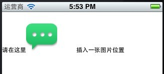 

 

从上面看大家可能没有发现什么问题，当把图片放在字的最左边会是什么样子的？

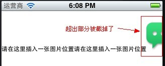 

因此为了避免这种情况发生，我在代码中添加了换行模式。添加换行后的效果：

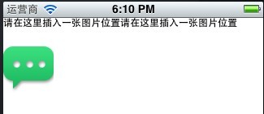 

   

