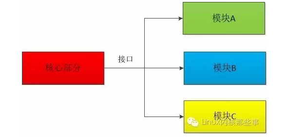
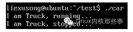
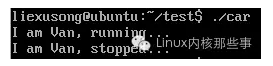
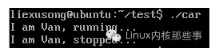
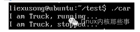

 
<!--BEGIN_DATA
{
    "create_date": "2016-07-13 17:35", 
    "modify_date": "2016-07-13 17:35", 
    "is_top": "0", 
    "summary": "C模块化编程", 
    "tags": "C/C++", 
    "file_name": "C模块化编程.md"
}
END_DATA-->

####<p>原文出处：<a href='http://mp.weixin.qq.com/s?__biz=MzA3NzYzODg1OA==&mid=2648464085&idx=1&sn=f9c4350ea474737a9d296467ea7eaeb8&scene=2&srcid=0711rNNBFtVUUwsZI6rdTh8o&from=timeline&isappinstalled=0#wechat_redirect' target='blank'>C模块化编程</a></p>

模块化编程 是指程序核心部分定义好功能的接口，而具体的实现留给各个模块去做。举个现实世界的例子：我们可以在电脑的PCI插槽上安装显卡、声卡或者网卡，原因就是这些硬件都按照PCI接口的规范来制造的。
模块化编程也一样，程序核心部分定义好接口，各个模块按照接口的定义去实现功能，然后把各个模块挂载到程序上即可，这个有点像Java的面向接口编程。如下图：
 


模块化编程的好处就是最大化灵活性，程序的核心部分不用关心功能的具体实现，只需要调用模块提供的接口即可得到相应的结果。因为各个模块的具体实现各不相同，所以得到的结果也是多样化的。

使用C进行模块化编程
用过C语言编程的人都知道C语言是没有接口的，所以怎么使用C语言进行模块化编程呢？使用C语言的结构体和函数指针可以模拟出Java接口的特性，我们只需定义一个由多个函数指针构成的结构体，然后功能模块实现这个结构体里的函数即可。
例如我们定义一个名为Car的结构体，而这个结构体有两个函数指针，分别是run()和stop()：

car.h

```
#ifndef __CAR_H
#define __CAR_H
 
struct Car
{
	void (*run)();
	void (*stop)();
};
 
#endif
```

从上面定义可以知道，实现了run()和stop()方法的模块都可以被称为Car（汽车）。现在我们来编写两个模块，分别是Truck和Van。
Truck模块如下（truck.c）：

```
#include <stdlib.h>
#include <stdio.h>
#include "car.h"
 
static void run()
{
	printf("I am Truck, running...\n");
}
 
static void stop()
{
	printf("I am Truck, stopped...\n");
}
 
struct Car truck = {
	.run = &run,
	.stop = &stop,
};
```

Van模块如下（van.c）：

```
#include <stdlib.h>
#include <stdio.h>
#include "car.h"
 
static void run()
{
	printf("I am Van, running...\n");
}
 
static void stop()
{
	printf("I am Van, stopped...\n");
}
 
struct Car van = {
	.run = &run,
	.stop = &stop,
};
```

这样我们编写了两个模块，一个是卡车模块（Truck），一个是客车模块（Van）。为了简单起见，我们只是简单的打印一段文字。现在可以说我们的车是变形金刚了，因为可以随时变成卡车或者客车（嘻嘻）。
我们把模块都写好了，但是怎么把模块应用到程序的核心部分呢？这时候我们需要一个注册机制。因为核心部分不知道我们到底编写了什么模块，所以就需要这个注册机制来告诉核心部分。注册机制很简单，只需要一个函数即可（main.c）：

```
#include "car.h"
 
extern struct Car van;
extern struct Car truck;
 
struct Car *car;
 
void register_module(struct Car *module)
{
	car = module;
}
 
int main(int argc, char *argv[])
{
	register_module(&truck);
	 
	car->run();
	car->stop();
	 
	return 0;
}
```
 
编译运行后我们会得到以下的结果：



如果把 register_module(&truck); 改为 register_module(&van); 会得到以下结果：



从上面的结果可以看到，我们可以注册不同的模块来提供不同的服务，模块化编程就这样实现了。
Are you kidding me?
C的模块化编程的确是这么简单，但是我们可以实现更强大的功能：使用动态链接库来实现模块化。

使用动态链接库进行模块化编程
Linux提供一种叫动态链接库的技术（Windows也有类似的功能），可以通过系统API动态加载.so文件中的函数或者变量。动态链接库的好处是把程序划分成多个独立的部分编译，每个部分的编译互补影响。例如我们有动态链接库A、B、C，如果发现A有bug，我们只需要修改和重新编译A即可，而不用对B和C进行任何的改动。
下面我们使用动态链接库技术来重写上面的程序。
其实要使用动态链接库技术，只需要把模块编译成.so文件，然后核心部分使用操作系统提供的dlopen()和dlsym()接口来载入模块即可。
 
1. 把模块编译成.so文件
首先我们修改van.c文件，主要是增加一个让核心部分获取模块接口的方法get_module()：

```
#include <stdlib.h>
#include <stdio.h>
#include "car.h"
 
static void run()
{
	printf("I am Van, running...\n");
}
 
static void stop()
{
	printf("I am Van, stopped...\n");
}
 
struct Car module = {
	.run = &run,
	.stop = &stop,
};
 
sturct Car *get_module()
{
	return &module;
}
```

然后我们需要把库的源文件编译成无约束位代码。无约束位代码是存储在主内存中的机器码，执行的时候与绝对地址无关。

```
$ gcc -c -Wall -Werror -fpic van.c
```
现在让我们将对象文件变成共享库。我们将其命名为van.so：
```
$ gcc -shared -o van.so van.o
```
这样我们就把van.c编译成动态链接库了。我们使用相同的方法把truck.c编译成truck.so。
 
2. 在核心部分载入动态链接库
使用动态链接库接口来修改核心部分代码，如下：

```
#include "Car.h"
#include <dlfcn.h>
#include <stdlib.h>
 
struct Car *car;
 
struct Car *register_module(char *module_name)
{
	struct Car *(*get_module)();
	void *handle;
	 
	handle = dlopen(module_name, RTLD_LAZY);
	if (!handle) {
		return NULL;
	}
	 
	get_module = dlsym(handle, "get_module");
	if (dlerror() != NULL) {
		dlclose(handle);
		return NULL;
	}
	 
	dlclose(handle);
	 
	return get_module();
}
	 
int main(int argc, char *argv[])
{
	struct Car *car;
	 
	if ((car = register_module("./van.so")) == NULL) {
		return -1;
	}
	 
	car->run();
	car->stop();
	 
	return 0;
}
```

使用以下命令编译代码：

	$ gcc -rdynamic -o car main.c -ldl
 
运行程序后得到结果：



修改 register_module("./van.so") 为 register_module("./truck.so") 得到结果：



可以看到我们成功使用动态链接库改写了程序。

总结
由于模块化编程的灵活性和可扩展性非常好，所以很多流行的软件也提供模块化特性，如：Nginx、PHP和Python等。而这些软件使用的方法与本文介绍的大致相同，有兴趣可以查看这些软件的实现。