 
<!--BEGIN_DATA
{
    "create_date": "2020-12-06 09:50", 
    "modify_date": "2020-12-06 09:50", 
    "is_top": "0", 
    "summary": "DTLS协议中client/server的认证过程和密钥协商过程<br/>WebRTC数据通道之SCTP over DTLS简介<br/>DTLS协议详解和协议抓包<br/>借助mbedTLS了解DTLS握手协议", 
    "tags": "WebRTC、C/C++", 
    "file_name": "DTLS协议协商过程与WebRTC数据通道之SCTP over DTLS.md"
}
END_DATA-->

#### <p>原文出处：<a href='https://blog.csdn.net/y_xianjun/article/details/80335051' target='blank'>DTLS协议中client/server的认证过程和密钥协商过程</a></p>

### 1.DTLS介绍

#### 1.1 DTLS的作用

互联网先驱们最开始在设计互联网协议时主要考虑的是可用性，安全性是没有考虑在其中的，所以传输层的TCP、UDP协议本身都不具备安全性。SSL/TLS协议是基于TCP socket，在传输层和应用层之间构建了一个端到端的安全通道，保证了传输数据的加密性。

但是SSL/TLS协议并不能用于UDP协议，而UDP也有安全传输的需求，于是产生了DTLS协议（Datagram TLS）。

即DTLS的作用为给UDP提供端到端的安全通道，就像SSL/TLS对TCP的作用一样。并且DTLS尽可能参考了SSL/TLS协议的安全机制，在具体实现上复用了70%的TLS代码。

#### 1.2 DTLS的特点

UDP协议是不面向连接的不可靠协议，且没有对传输的报文段进行加密，不能保证通信双方的身份认证、消息传输过程中的按序接收、不丢失和加密传送。

而DTLS协议在UDP提供的socket之上实现了客户机与服务器双方的握手连接，并且在握手过程中通过使用PSK或ECC实现了加密，并且利用cookie验证机制和证书实现了通信双方的身份认证，并且用在报文段头部加上序号，缓存乱序到达的报文段和重传机制实现了可靠传送。

在握手完成后，通信双方就可以实现应用数据的安全加密和可靠传输。

#### 1.3 DTLS协议层次

DLTS协议分为两层，下层为记录层（记录层），record包的内容分为头部和载荷两部分。记录包的载荷即为上层的内容。DTLS上层的包的类型分为三种，分别是握手消息，警告消息，应用数据；如图一所示。

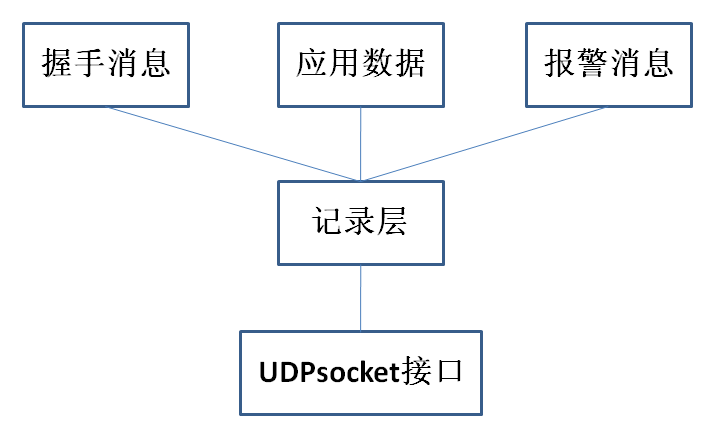

在整个DTLS协议的通信过程中，通信双方构造报文段的过程都是先产生上层的载荷消息（如握手消息，应用数据，警告消息），然后添加头部，构成完整的上层消息。接着再以此作为记录层的载荷，最后添加记录层的头部，构成完整的记录报文段，最后调用UDP的socket接口，发送给另一方。

加密过程是只对记录层的载荷(即上层消息，此协议中被加密的消息是finished消息和应用数据两种)进行加密，所以接收方在收到记录消息后，首先要做的也是判断记录消息是否被发送方加密，若是，则应先解密才能读取出明文数据以进行后面的处理。

### 2.DTLS传输阶段

#### 2.1 整个握手阶段的交互过程

DTLS的传输阶段分为两个：握手阶段和握手建立之后的传输应用数据阶段。

DTLS的握手阶段如下图二所示：

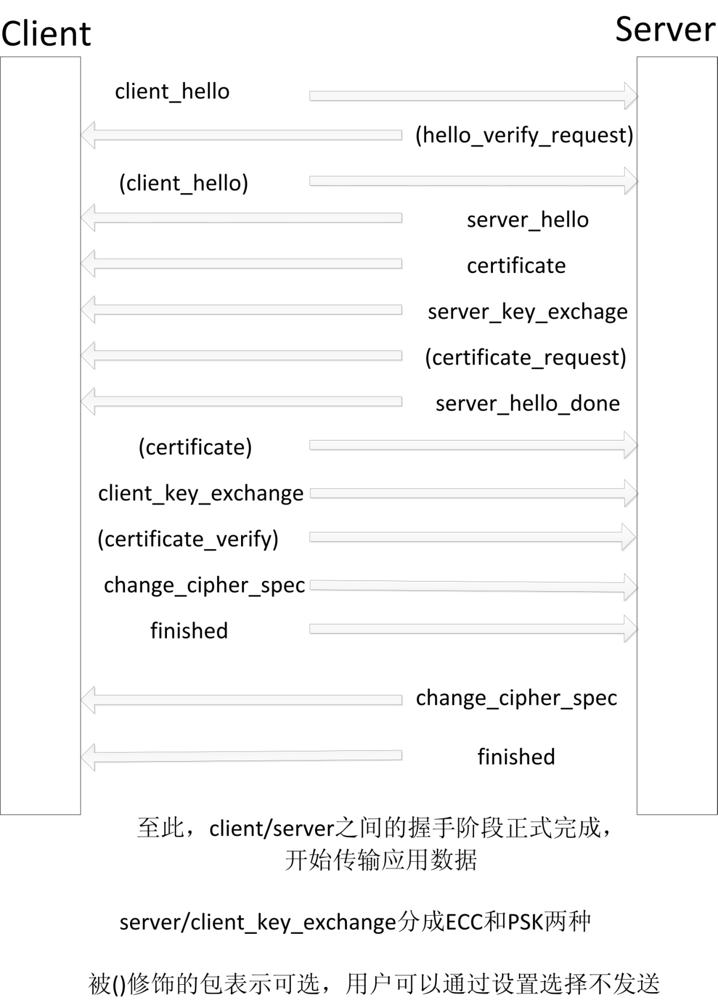

客户机向服务器发起连接，服务器可以根据配置选择是否验证客户机的cookie和证书（即是否向客户机发送client_hello_verify和certificate_request报文段）。

#### 2.2 DTLS的cookie验证机制

由于DTLS是基于UDP的，所以可能会遭受两种形式的拒绝服务攻击。一种是类似于对TCP的资源消耗攻击，另一种是放大攻击，即恶意攻击者仿造被攻击者的IP地址发通信初始化报文段给服务器，而服务器会返回一个体积大很多的证书给被攻击者，超大量证书有可能造成被攻击者的瘫痪。

cookie机制要求客户机重复发送服务器之前发送的cookie值来验证通信方的源IP地址确实可以通信，由此可以减少拒绝服务攻击的危害。

cookie验证身份的具体机制为：

协议规定客户机发送的第一个报文段client_hello中含有cookie的值这一项（有可能为空）。服务器检验收到的该报文段中的cookie值，如果cookie为空，则说明之前没建立过连接，服务器根据客户机的源IP地址通过哈希方法随机生成一个cookie，并填入client_hello_verify中发送给客户机。

客户机再在第二次发送的client_hello报文段中填入服务器之前发过来的cookie，服务器第二次收到该报文段之后便检验报文段里面的cookie值和服务器之前发给该主机的cookie值是否完全相同，若是，则通过cookie验证，继续进行握手连接；若不是，则拒绝建立连接。

#### 2.3 client_hello报文段和server_hello报文段的内容

client_hello报文段的内容除cookie外，还有客户机产生的32字节的随机数，其中前4字节为时间戳，后28字节为系统产生的随机数。此外，该报文段的内容还有客户机支持的加密方式（PSK或者ECC）和压缩方式，供服务器进行选择。

在通过cookie校验后，服务器发送server_hello报文段给客户机。该报文段包含有服务器产生的32字节的随机数，和服务器选中的用来进行之后的会话的加密方式和压缩方式。

#### 2.4 certificate报文段的内容

在服务器发给客户机的证书报文段中，包含有服务器证书的公钥；客户机接收到该报文段后，按照协议规定，从报文段的对应位置中读取出服务器证书的公钥存入相关变量中。

#### 2.5 基于ECC加密方式的ECDH秘钥交换协议和ECDSA数字签名算法

若协议所选加密方式为ECC（椭圆曲线加密），则在server_key_exchange报文段的构造过程中会使用ECDH（椭圆曲线秘钥交换协议）和ECDSA（椭圆曲线数字签名算法）。ECDH和ECDSA分别是ECC和DH（diffie-hellman）秘钥交换协议、DSA（数字签名算法）的结合。

在server_key_exchange报文段中，包含有所选用的椭圆曲线E，阶N和基点G的x,y坐标，客户机在收到这个报文段后，进行对应的格式检验，并读取数据，因此服务器和客户机共同获得约定好的用来进行ECDH秘钥协商交换协议的参数，从而可以共同协商出相同的对话秘钥用于加密之后的会话内容。

同时，为了防范中间人攻击，服务器还在server_key_exchange报文段的末尾对整个报文段进行了ECDSA数字签名。具体签名过程为先用client_hello报文段和server_hello报文段中的2个32字节的随机数作为函数参数，利用sha256哈希算法对server_key_exchange报文段本身的载荷产生摘要，然后再用服务器的私钥和sha256哈希算法进行ECDSA数字签名，得到签名结果r和s,并写入server_key_exchange报文段的末尾。

客户机在收到server_key_exchange报文段后，先进行各数值项格式的校验，然后提取出报文段末尾的签名值r和s。之后，用已经读取出的服务器的公钥的x,y坐标值来对server_key_exchange报文段进行ECDSA签名验证，若结果和报文段中的r和s值一致，则报文段通过验证。

#### 2.6 基于PSK加密方式的身份认证过程和会话秘钥产生过程

整个DTLS协议的加密方式可选用ECC或PSK（预共享秘钥，PreSharedKey）两种。若为ECC，则通过ECDH协议来进行通信双方的秘钥协商；若为PSK，则直接以通信双方事先就已经约定好了的秘钥为基础来进行加密通信。

对于PSK加密通信来说，验证对方的通信身份非常关键。所以通信双方会在本地存取对方的psk_id（即身份标志）和psk_id_length（身份标志长度），通过比较收到的报文段中的psk_id,psk_id_length和本地存储的是否完全一致来进行对方身份的验证。

在整个通信过程中，采用PSK与ECC的区别主要体现在server_key_exchange报文段、client_key_exchange报文段的内容不同和双方计算得到预主秘钥方式的不同。

当采用PSK加密时，server_key_exchange报文段和client_key_exchange报文段的内容分别是服务器与客户机各自的psk_id和psk_id_length，由此双方可以互相知道对方的psk_id和psk_id_length。

之后，双方都会对收到的报文段进行检验，只有psk_id和psk_id_length与本地存储的完全一致才会进行后面的通信。

当双方都通过身份验证后，双方再各自用相同的函数产生预主秘钥，而函数的参数包括之前通信阶段中双方各自产生的32字节的随机数，由此可以保证虽然本地存储的psk秘钥不变，但每次临时通信时的会话秘钥还是会一直变化的，从而增强了抗攻击性。

双方产生预主秘钥后，再调用和使用ECC加密的相同方式来产生主秘钥，即用于之后会话通信的对称秘钥，该过程中依然会用到双方产生的32字节的随机数。

由此，通信双方使用PSK加密方式来实现了身份认证和会话秘钥的产生。

#### 2.7 server_hello_done报文段和client_key_exchange报文段的内容

服务器发送的server_hello_done报文段的载荷部分为空，只是发给客户机来作为标志，表示服务器当前阶段的报文段已经发送完毕。

客户机在收到server_hello_done报文段后，发送client_key_exchange报文段给服务器，里面包含了用于秘钥协商的基点的x,y坐标,并且不同于server_key_exchange报文段，客户机并没有在报文段的末尾进行ECDSA数字签名。

#### 2.8 客户机产生会话秘钥

之后，客户机再通过ecdh_pre_master_secret函数来产生用于之后会话的预主秘钥。其中函数的参数包括客户机自己的私钥，和服务器共享的用于ECDH秘钥协商算法的基点的x,y坐标。

产生预主秘钥后，再根据之前阶段客户机和服务器分别产生的32字节的随机数产生主秘钥master_secret，此时主秘钥为对称秘钥，用于之后会话的加解密。

#### 2.9 change_cipher_spec报文段和finished报文段的内容

客户机计算出会话秘钥后，发送change_cipher_spec报文段给服务器，这个报文段的有效载荷为空，用来作为标志通知服务器，表示客户机已经算出主秘钥，之后发送的报文段会采用主秘钥加密。

握手阶段中客户机发送的最后一个报文段为finished报文段，载荷内容为MAC值（消息验证码），用于给服务器做认证。并且值得注意的是，finished报文段作为记录层的载荷部分在发送时已经用上一步产生的会话秘钥进行加密编码。

#### 2.10 服务器产生会话秘钥

服务器在收到客户机发送过来的finished报文段后，也会和客户机用ECDH秘钥协商算法经过相同的流程，调用相同的函数先产生预主秘钥，再产生主秘钥。

#### 2.11 握手阶段的结束

最后，服务器产生经会话秘钥加密后的finished报文段给客户机，标志整个握手阶段的结束。

客户机收到服务器发过来的finished报文段后，便可发送应用数据。并且应用数据会一直用会话秘钥加密，从而实现了UDP所不具备的安全性。

<hr>

#### <p>原文出处：<a href='https://blog.csdn.net/CrystalShaw/article/details/104655418' target='blank'>WebRTC数据通道之SCTP over DTLS简介</a></p>

### 一、总述

webrtc的数据通道可以走三种协议：1、SCTP；2、RTP；3、QUIC。这里先研究第一种，SCTP。

webrtc使用SCTP over DTLS方式传输数据通道报文。

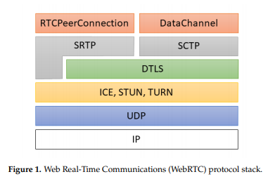

DTLS的作用是给数据通道数据加密（保证数据安全性）、增加链路证书校验机制（防止网络攻击）。

与TLS over TCP不同，UDP层没有对数据报文的乱序、丢包做处理，会导致链路证书校验协商无法保证。所以：

1、DTLS在创建连接时的握手消息里面，需要增加可靠性传输机制。

2、由于UDP对数据的实时性要求比较高，所以链路建立稳定后，传输应用数据时，没有提供数据可靠性传输机制，需要SCTP协议或者应用层保证。

### 二、DTLS

#### 1）握手消息全协商流程

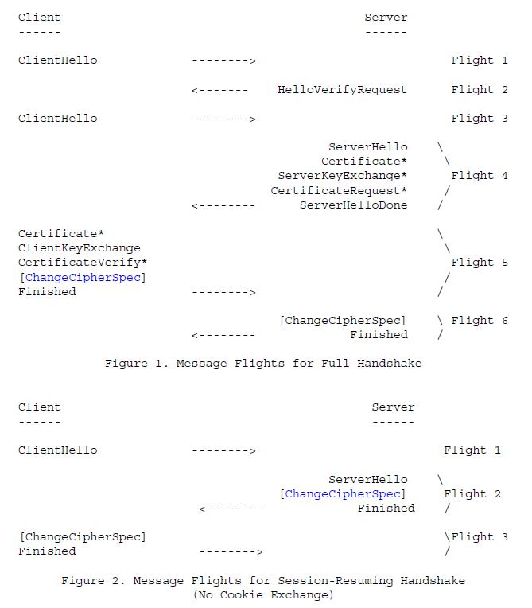

#### 2）握手消息可靠性设计流程

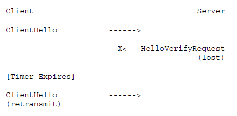

* 包丢失

一旦Client传输了ClientHello消息，它会期望收到从Server发来的一个 HelloVerifyRequest。然而，如果这个Server的消息丢失了，Client就会知道ClientHello或HelloVerifyRequest已经丢失，然后重传。当Server收到重传包时，它就会知道重传发生了。Server也维护了一个重传定时器，当其超时后会重传。

需要注意超时和重传并不应用于HelloVerifyRequest，因为这需要在Server上创建状态。HelloVerifyRequest被设计的足够小以避免自身被分片，因此可以不用考虑多个HelloVerifyRequest交叉的情况。

* 包重排

在DTLS中，每个握手消息会在握手中被分配一个明确的序列号。当一个客户端收到一个握手消息时，它能快速确定这个消息是否是它所期望接收的下一个消息。如果是，它会进行处理。如果不是，它会将其放入队列中，等所有缺失的报文都收到后再进行处理。

* 包大小

TLS和DTLS握手消息可能会相当大（理论上可以达到的上限是2^24-1字节，实际上是很多个K字节）。相比值之下，UDP报文通常被限制在小于1500字节，如果不想要IP分片的话。为了适应这个限制，每个DTLS握手消息可以在几个DTLS记录中进行分片，每个DTLS记录都会试图适应一个单个IP数据报。每个DTLS握手消息包含一个分片偏移和分片长度。因此，一个拥有一个握手消息所有字节的接受者能够重组原始的未分片消息。

#### 3）DTLS报文格式

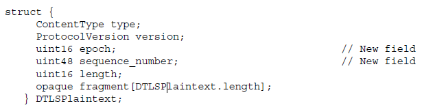

  * ContentType type定义

          20:change_cipher_spec   密码变更（每次变更epoch要加一）  
          21:alert    报警消息  
          22:handshake   握手消息  
          23:application_data    应用数据

  * ProtocolVersion version

          DTLS version 1.2版本使用的是{254, 253}

  * uint16 epoch

          计数值，随着每次加密状态改变而递增

  * uint48 sequence_number

          本记录的序列号

  * uint16 length

          fragment数据长度，不能超过2^14次方。

##### 握手消息定义

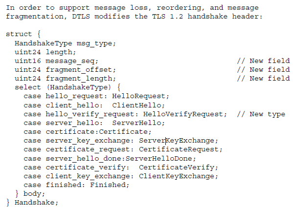

###### 握手消息抓包示例

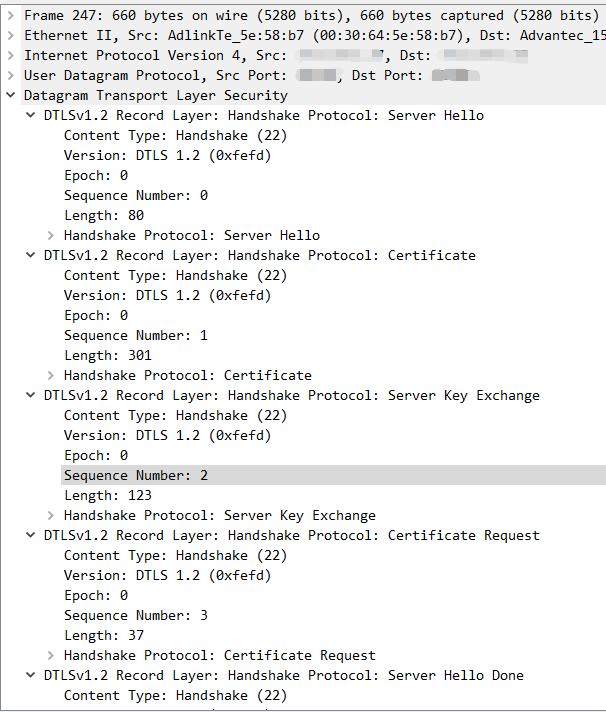

###### 应用数据抓包示例

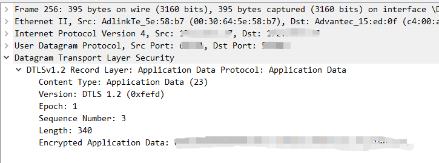

### 三、SCTP

最早STCP是把窄带7号信令的可靠性传输机制引入到IP协议、优化TCP协议的不能分帧传输的局限性提出来的。不过后来应用不是很广泛。

webrtc使用的是改良剪切版的STCP协议。由于SCTP协议是承载在DTLS协议上，所以SCTP的Multihoming功能，在webrtc的数据通道没有被使用。

有两个草案描述webrtc的改良方法《draft-ietf-rtcweb-data-channel-13》、《draft-ietf-rtcweb-data-protocol-09》，根据描述webrtc根据实际场景，引入了：可靠传输模式、部分可靠传输模式、不可靠传输模式等。

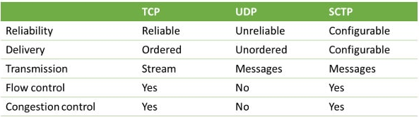

这几种模式在DataChannelInit结构体中配置。

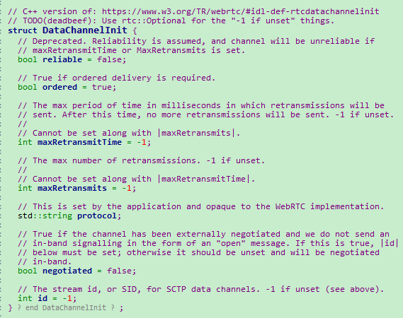

当ordered配置成false、maxRetransmits配置成0，这里实现的就是不可靠传输，类似UDP协议。

当ordered配置成true、maxRetransmits配置成-1、maxRetransmits配置成-1，这里实现的就是可靠传输，类似TCP协议。

也可以根据需要配置成部分可靠性传输。

### 四、webrtc实现

  * 创建数据通道

CreateDataChannel  
->CreateSctpTransport_n  
->CreateDtlsTransport_n  
->CreateDtlsTransportChannel_n  
->new DtlsTransport

备注：WebRtcSession::Initialize里面有限制，使用SCTP通道须开启DTLS功能。

接收发送DTLS报文，及处理DTLS的握手消息等，在DtlsTransport类中实现。

### 五、附录

* <https://en.wikipedia.org/wiki/Stream_Control_Transmission_Protocol>
* <https://www.html5rocks.com/en/tutorials/webrtc/datachannels/>
* <https://bloggeek.me/sctp-data-channel/>
* 《rfc6347》
* 《rfc5246》
* 《draft-ietf-rtcweb-data-protocol-09》
* 《draft-ietf-rtcweb-data-channel-13》

<hr>

#### <p>原文出处：<a href='https://www.jianshu.com/p/ae270b912c66' target='blank'>DTLS协议详解和协议抓包</a></p>

> DTLS(Datagram Transport Layer Security)即数据包传输层安全性协议。TLS不能用来保证UDP上传输的数据的安全，因此Datagram TLS试图在现存的TLS协议架构上提出扩展，使之支持UDP，即成为TLS的一个支持数据包传输的版本。

* DTLS 1.0 基于 TLS 1.1
* DTLS 1.2 基于TLS 1.2。

#### 简介

UDP协议是不面向连接的不可靠协议，且没有对传输的报文段进行加密，不能保证通信双方的身份认证、消息传输过程中的按序接收、不丢失和加密传送。

而DTLS协议在UDP提供的socket之上实现了客户机与服务器双方的握手连接，并且在握手过程中通过使用PSK或ECC实现了加密，并且利用cookie验证机制和证书实现了通信双方的身份认证，并且用在报文段头部加上序号，缓存乱序到达的报文段和重传机制实现了可靠传送。

在握手完成后，通信双方就可以实现应用数据的安全加密和可靠传输

#### 协议过程

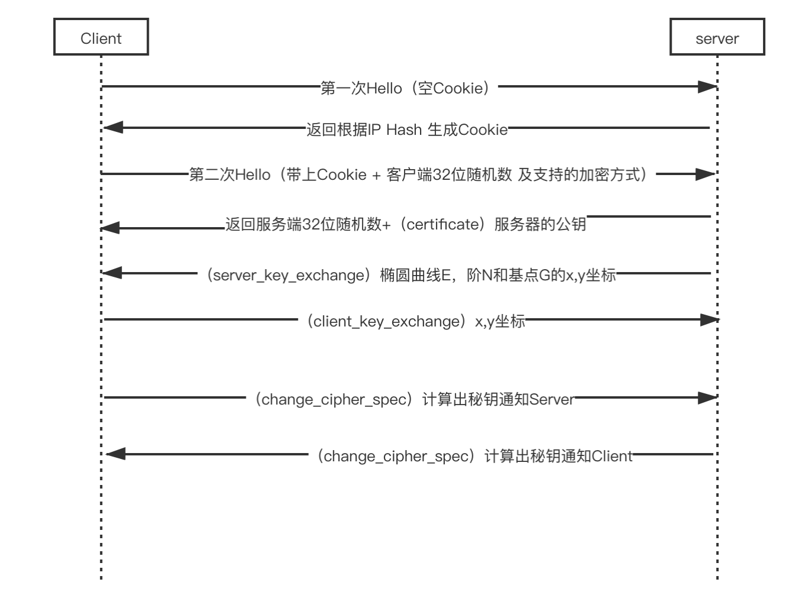

##### 第一步

客户端发送第一个报文段 Client Hello， 未携带 Cookie， SessionID 未生成，客户端携带了用于协商的算法集，DTLS 支持的 Version（1.0/1.2），服务端响应的报文段 Client Hello Verify 中加入 Cookie（32字节），协商 DTLS Version 返回给客户端。

##### 第二步

客户端发送 Client Hello 报文段中加入服务端发送过来的 Cookie，添加了 Random，客户端携带了用于协商的算法集。  
服务端验证 Cookie 是否合法，若是通过 Cookie 验证，继续进行握手连接；若验证失败，则拒绝建立连接；

  * 返回 Cipher Suite，指明了即将采用的密钥算法集，比如 TLS_ECDHE_RSA_WITH_AES_256_GCM_SHA384；
  * 返回 Certificate (公钥证书)；
  * 返回 Server Key Exchange (ECDSA 数字签名)；
  * Server Hello Done（这只是一个简单的标志，告知客户端报文段已经发送结束）；

##### 第三步

做密钥的协商；

客户端收到 Server Hello Done，客户端计算产生 Client Key Exchange，不同于 Server Key Exchange，无
ECDSA 数字签名。。  
client_key_exchange，合法性验证通过之后，客户端计算产生随机数字 Pre-master，并用证书公钥加密，发送给服务器;  
change_cipher_spec，客户端通知服务器后续的通信都采用协商的通信密钥和加密算法进行加密通信;  
encrypted_handshake_message，结合之前所有通信参数的 hash 值与其它相关信息生成一段数据，采用协商密钥 session secret 与算法进行加密，然后发送给服务器用于数据与握手验证;

这一步也代表客户端已经确认算法和密钥。 服务端也要确认算法和密钥。

##### 第四步

采用计算出来的对称密钥，进行数据的加解密。

##### 第五步

双方 CLOSE 操作

##### 协议抓包

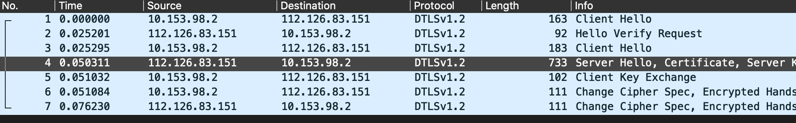

<hr>


#### <p>原文出处：<a href='https://www.zhihu.com/column/p/24028871' target='blank'>借助mbedTLS了解DTLS握手协议</a></p>

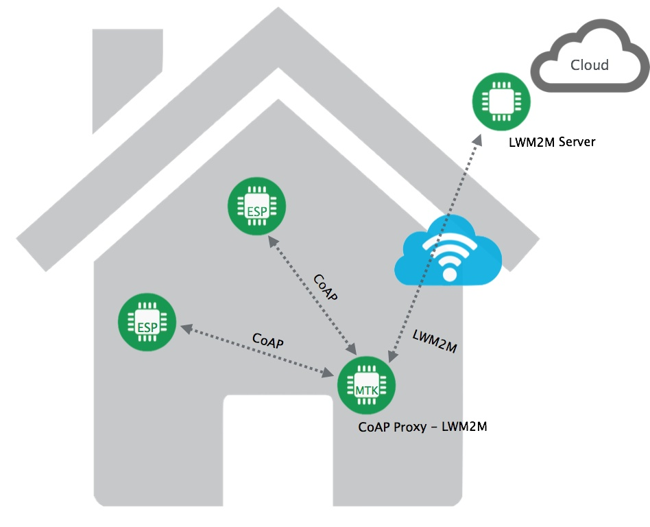

### 引子

本文将会利用mbedTLS协议栈，通过dump协议栈调试信息，抓包，代码分析等方式来对DTLS的握手协议进行介绍。

### DTLS简介

简单说，DTLS（Datagram Transport Layer Security）实现了在UDP协议之上的TLS安全层。由于基于TCP的SSL/TLS没有办法处理UDP报文的丢包及重排序（这些问题一般交给UDP的上层应用解决），DTLS在原本TLS的基础上做了一些小改动（复用大部分TLS的代码）来解决如下UDP上实现TLS的问题：

  1. TLS记录层内记录的强关联性及无序号
  2. 握手协议的可靠性

    * 包丢失重传机制（UDP无重传机制）
    * 无法按序接收（握手需要对包按顺序处理，而UDP包的到达并非按序，包头没有TCP那样的Seq/Ack number）
    * 握手协议包长（证书之类传输可能达到KB级别）导致的UDP分包组包（类似于UDP在IP层的分包）
  3. 重复包（Replay）检测

由于UDP/DTLS相较于TCP/TLS的轻量化及较小的开销，目前被更多的运用的嵌入式环境中。例如CoAP使用DTLS来实现安全通路，CoAP及其上层的LWM2M则运用在物联网和云端的通讯上。

如果你已经很熟悉TLS，那么看到这里后就请忽略此文:)

### 如何借助mbedTLS来分析握手协议

mbedTLS（前身PolarSSL）是面向嵌入式系统，实现的一套易用的加解密算法和SSL/TLS库。mbedTLS系统开销极小，对于系统资源要求不高。mbedTLS是开源项目，并且使用Apache 2.0许可证，使得用户既可以讲mbedTLS使用在开源项目中，也可以应用于商业项目。目前使用mbedTLS的项目很多，例如Monkey HTTP Daemon，LinkSYS路由器。

我们在这里简单的利用mbedTLS自带的dtls_client/dtls_server的测试程序来分析握手协议。这里要说明的是mbedTLS这个自带的DTLS 测试程序，服务器只在localhost做bind，客户端也只连接到localhost。实际上是个loopback测试。并且使用了TLS_ECDHE_RSA_WITH_AES_256_GCM_SHA384的Cipher Suite，也就是用椭圆曲线（EC）的DH算法来实现密钥（Session Key）的协商，用RSA来实现密钥协商时交换的EC类型，DH公钥等数据的签名加密。所以握手的流程和其他一些加密方式会有所差别。比如和单纯的RSA密钥交换方式比起来，会多一个“Server Key Exchange”报文。

#### 下载mbedTLS

```
$git clone https://github.com/ARMmbed/mbedtls
```

#### 打开调试

在program/dtls_client.c, dtls_server.c里，增大DEBUG_LEVEL，然后将my_debug里加上时间戳信息。使能协议栈的内部调试信息，方便对比客户端和服务端的流程：


```cpp
#define DEBUG_LEVEL 100
static void my_debug( void *ctx, int level,
                      const char *file, int line,
                      const char *str )
{
    struct timeval tv;
    ((void) level);
    gettimeofday(&tv, NULL);
    //strftime(outstr, sizeof(outstr), "%H:%M:%S", tmp);
    mbedtls_fprintf( (FILE *) ctx, "[%06ld.%ld]%s:%04d: %s", tv.tv_sec, tv.tv_usec, file, line, str );
    fflush(  (FILE *) ctx  );
}
```

#### 编译

在Ubuntu上可以直接编译。
```
$ make
```

编译结果为

  * 服务器：program/ssl/dtls_server
  * 客户端: program/ssl/dtls_client

#### 抓包

打开wireshark之类的抓包工具，对本地网卡进行抓包。先跑server，后跑client。在抓包结束后，加dtls的display filter既可以：

_Wireshark抓包截图：_（[导出pcapng包下载](http://muddog.pub/DTLS-Analysis/dtls.pcapng)）  

有了TLS协议栈的调试信息，Wireshark的实际的抓包数据再加上源代码，我们就很容易来分析DTLS的握手协议。当然gdb拿过来直接调试也行，不过需要把DEBUG宏在编译时打开：

```
$ make DEBUG=1
```

### DTLS握手协议分析

DTLS握手协议和TLS类似。DTLS协议在UDP之上实现了客户机与服务器双方的握手连接，在握手过程中验证对方的身份，并且使用RSA或者DH（Diffie-Hellman）实现会话密钥的建立，以便在后面的数据传输中对数据加密。它利用cookie验证机制和证书实现了通信双方的身份认证；并且用在报文段头部加上序号，缓存乱序到达的报文段；还利用重传机制实现了可靠传送。在握手完成后，通信双方就可以利用握手阶段协商好的会话密钥来对应用数据进行加解密。

简易握手流程图：  

从流程图上看，有(1)(3)两个“Client Hello”请求，他两之间的区别是第二个包含有(2)”Hello Verify Request”里服务端发来的Cookie。要使得DTLS握手正真开始，服务端必须要判断发送请求的客户端是否是有效客户端。通过这样的Cookie交互，可以很大程度上保护服务端不受DoS的攻击。如果利用Cookie，服务端会在收到每个客户请求后返回一个体积大很多的证书给被攻击者，超大量证书有可能造成被攻击者的瘫痪。当首次建立连接时，(1)请求包中的cookie为空，服务端根据客户端的源IP地址通过哈希方法随机生成一个cookie，并填入(2)”Hello VerifyRequest”包中发送给客户端。客户端收到Cookie后，再次发送带有该Cookie的“Client Hello”包(3)，服务端收到该包后便检查报文段里面的cookie值和之前发给该客户端的Cookie值是否完全相同，若是，则通过Cookie验证，继续进行握手连接；若不是，则拒绝建立连接。所以说(1)(2)步骤只在第一次连接时发生，之后在Cookie有效的情况下，DTLS握手从步骤(3)开始。

  * 客户端的实现都在ssl_cli.c里，状态机由mbedtls_ssl_handshake_client_step()处理
  * 服务端的实现则在ssl_srv.c里，状态机由mbedtls_ssl_handshake_server_step()处理

(3)”Client Hello”由函数ssl_write_client_hello()实现报文填充和发送，内容主要包含：

  1. Random 32字节随机数，前4字节为当前时间+28字节随机数
  2. Cookie，从报文(2)中获得
  3. Cipher Suite，客户端可以支持的密钥交换，数据加密方式
  4. Compression methods，是否压缩，及压缩方式
  5. Extension，例如服务器主机名；支持的签名加密方式，EC曲线类型等

服务端收到报文(3)后，会调用函数ssl_parse_client_hello()做一系列协商工作：  
将Random保存；验证Cookie是否和客户端的IP匹配；根据客户端提供的Cipher Suite找最佳匹配的，能提供的Cipher算法集合。在mbedTLS的例子里使用了ECDHE_RSA_WITH_AES_256_GCM_SHA384（ECDHE密钥协商算法、RSA签名、GCM-AES对称密钥加密传输数据、SHA384哈希签名）。如果协商没有问题，服务端就调用ssl_write_server_hello()会发送报文(4)”ServerHello”，告诉客户端使用什么Cipher Suite做握手，什么压缩方式，然后利用随机数生成一个Session ID。并且以客户端同样的方式生成的Random随机数，将随机数和Session ID放入报文中。紧接着服务端会接连发送报文(5)(6)(7)

(5)”Certification”服务端会将他自己的证书发送给客户端。证书中的肯定有一个证书的Subject是和Server Name相匹配的（commonName=”localhost”，organizationName=”PolarSSL”）。测试程序中其实发送了3个证书，subject分别是localhost, PolarSSL Test CA及PolarSSL Test EC CA。PolarSSL Test CA实际上是localhost的父证书，这里就涉及到一个CA Chain的概念。现实情况中（例如浏览器访问HTTPS服务器），服务器发给客户端的证书一般是终端用户证书（end-user CA），客户端需要通过证书认证来检查服务器是否可信。首先客户端在自己安装（浏览器安装时都会默认安装可靠证书）的一系列中间证书（intermediate CA）和根证书（ROOT CA）中查找该终端用户证书的父证书，以及该父证书的父证书，直到追溯到根证书，建立起这些证书的关系：CA Chain。然后使用该终端用户证书的父证书的公钥来验证终端用户证书的完整性，然后找到父证书的父证书，以同样的方式验证父证书完整性，直到遇到根证书。一般来讲，终端客户证书的Issuer都会和某个中间或者根证书的Subject相匹配，也就意味着客户证书是由某个中间或根证书发行机构签发，并且终端客户证书中的签名是由父证书拥有者的私钥加密的。由于根证书的Subject和Issuer都是自己，所以客户端的根证书一定要保证是Trust CA颁发的，否则没有办法自己验证自己。  

回到我们的例子，客户端在初始化的时候加载了PolarSSL Test CA的根证书（当然只是测试的根证书），这个和现实的情况类似。客户端收到(5)”Certification”报文后，很快就可以查找到”localhost”这个终端用户证书的根证书是”PolarSSL Test CA”，一次便验证通过了。验证的代码在：mbedtls_x509_crt_verify_with_profile()。验证通过后，客户端实际上就获得了证书中的公钥。证书验证完毕，说明服务端的身份没有问题，可以进行下一步密钥协商。

(6)”Server Key Exchange”是Session Key协商的重要一步ssl_write_server_key_exchange()，测试程序中使用了ECDHE_RSA的协商方式。服务端首先要将在(3)”Client Hello”阶段和客户端协商使用的EC曲线类型找出来，这里协商的曲线类型是secp512r1(0x0019)。利用该曲线类型，加载对应于该曲线的参数p,b,G(x,y),n （服务端和客户端参数相同，参考：library/ecp_curves.c）。调用mbedtls_ecdh_gen_public()，首先生成一个随机数私钥a（范围[1, n-1]），然后计算Qs=aG，产生ECDHE的Public Key Qs，再用服务端的私钥（和localhost证书中的公钥配对的）对Qs做签名（SHA512做哈希，RSA加密）。最后将曲线类型，公钥Qs，签名算法及签名写入(6)的报文中，发送给客户端。由于ECDHE(Elliptic curveDiffie–Hellman)算法较为复杂，我也不是非常理解，在这里就不深入讨论了。具体可以参考：  [WikiPage](https://link.zhihu.com/?target=https%3A//en.wikipedia.org/wiki/Elliptic_curve_Diffie%25E2%2580%2593Hellman)  总之，ECDHE算法很快，而且不需要暴露预主密码（premaster secret，马上谈到）。后面客户端也会做同样的操作，生成自己的私钥b,计算Qc。双方交换Q后，可以计算得到相同的预主密码:bQs=baG=abG=aQc。之后双方就可以用这个abG预主密码和之前(3)(4)报文中的客户端、服务端的Random来生成对称密钥Session Key（master secret）。预主密码如何生成密钥，可以参考mbedtls_ssl_derive_keys()：

```
master = PRF( premaster, "master secret", randbytes )[0..47]
```

因为premaster secret不需要做交换，而是在本地计算产生，所以说ECDHE的密钥协商方式比RSA更安全。

(7)”Server Hello Done”会紧接着(6)发送，内容很简单，标示了handshake type 14,，告诉客户端Hello阶段结束。

(8)”Client Key Exchange”客户端在收到(6)报文后，获取服务端发送过来的EC曲线类型和Qs，使用和服务端一样的流程生成私钥b，计算公钥Qc=bG，将Qc放入该报文，并发送给服务端。此时不需要再做签名，后面”Finish”报文会再次让双方验证密钥的一致性。

(9)”Change Cipher Spec”客户端接着发送该报文，告诉服务端Session Key我已经生成，双方可以用密钥SessionKey（master secret）开始加密通讯了。

(10)”Finished”该报文由客户端发送mbedtls_ssl_write_finished()，这是第一个用SessionKey加密的密文，内容是一段验证数据：

```
valid_data = PRF(master_secret, "client finished", MD5(handshake_messages) + SHA(handshake_messages))[0..11]
```

handshake_messages实际上是客户端在握手阶段发出的所有报文（不包含该Finished报文），服务端在收到该报文后，会以同样的方式计算出valid_data，并且做比较。以确认双方协商的密钥一致。确认完毕后，服务端以同样的方式发送(11)”Change Cipher Spec”和(12)”Finished”给客户端。最后完成握手。

完成握手后，双发就可以发送加密的Application Data数据包来进行安全通讯，并且报文中都包含一个sequence number来标识顺序。

到这里握手协议部分就介绍完了，如果大家想要深入研究算法，去看mbedTLS的代码不失为一个好途径。

### 结尾

记得很早以前，我是看过SSL/TLS的协议，握手也是了解过。没想到，最近看CoAP，很多细节现在都回想不起来。好记心不如烂笔头，写下来也是分享，今后碰到问题也可以做个参考。

### 参考文献

  * [DTLS协议中client/server的认证过程和密钥协商过程](https://link.zhihu.com/?target=https%3A//segmentfault.com/a/1190000006233845)
  * [大型网站的HTTPS实践（一）—HTTPS协议和原理](https://link.zhihu.com/?target=http%3A//blog.csdn.net/luocn99/article/details/45460673)
  * [X.509 wiki](https://link.zhihu.com/?target=https%3A//en.wikipedia.org/wiki/X.509)
  * [mbedTLS Web](https://link.zhihu.com/?target=https%3A//tls.mbed.org/)
  * [RF4347](https://link.zhihu.com/?target=https%3A//tools.ietf.org/html/rfc4347%23section-4)
  * [RF4492](https://link.zhihu.com/?target=https%3A//tools.ietf.org/html/rfc4492%23section-2)
