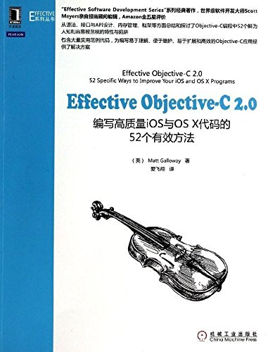

<!--BEGIN_DATA
{
    "create_date": "2016-06-01 15:34", 
    "modify_date": "2016-06-01 15:34", 
    "is_top": "0", 
    "summary": "Effective Objective-C 2.0 敲门砖", 
    "tags": "iOS", 
    "file_name": "Effective Objective-C 2.0 敲门砖.md"
}
END_DATA-->

###[Effective Objective-C 2.0 敲门砖](http://www.jianshu.com/p/a8a728f3ba7e)

Effective Objective-C 2.0  
编写高质量iOS和OS X代码的52个有效方法

# 前言

这本书和**Objective-C高级编程-iOS和OS X多线程和内存管理**实在是iOS开发人员必读书. 实在是太经典了. 相信懂的人自然懂~

而**Objective-C高级编程**的读书笔记我已经整理好发布了, 大家感兴趣的话可以去看看, 不感兴趣就直接略过吧~  
[Objective-C高级编程读书笔记之内存管理](http://www.jianshu.com/p/3fcdd5f492da)  
[Objective-C高级编程读书笔记之blocks](http://www.jianshu.com/p/abeb5848b57a)  
[Objective-C高级编程读书笔记之GCD](http://www.jianshu.com/p/b259c882a540)

这篇文章只是一个敲门砖, 大家不要指望看了这篇文章就不用去看书了, 那是不可能的, 也是远远不够的, 只是希望各位能借助我这篇文章, 留个整体的印象,
然后再带着问题去研读这本书. 那才能达到最好的效果.

* * *

# 目录

> 第1章 : 熟悉Objective-C  
第2章 : 对象, 消息, 运行时  
第3章 : 接口与API设计  
第4章 : 协议和分类  
第5章 : 内存管理  
第6章 : 块与大中枢派发(也就是Block与GCD)  
第7章 : 系统框架

* * *

# 第1章 : 熟悉Objective-C

##### 1\. Objective-C是一门动态语言, 该语言使用的是"消息结构"而非"函数调用".

  * 消息结构 : 运行时所执行的代码由**运行时环境**决定
  * 函数调用 : 运行时所执行的代码由**编译器**决定.

也就是说

    
    
     [person run];

给person对象发送一条run消息 : 不到程序运行的时候你都不知道他究竟会执行什么代码. 而且, person这个对象究竟是Person类的对象,
还是其他类的对象, 也要到运行时才能确定, 这个过程叫**动态绑定**.

##### 2\. 堆空间

对象所占内存总是分配在**堆空间**中. 不能在栈中分配Objective-C对象.

  * 栈空间 : 栈空间的内存不用程序员管理.
  * 堆空间 : 堆空间的内存需要程序员管理.
    
    
    NSString *anString = @"Jerry";  
    NSString *anotherString = anString;

以上代码的意思是, 在堆空间中创建一个NSString实例对象, 然而栈空间中分配两个指针分别指向该实例. 如图,  

  

堆和栈

##### 在类的头文件中尽量少引入其他文件

在类的头文件中用到某个类, 如果没有涉及到其类的细节, 尽量用@class向前声明该类(等于告诉编译器这是一个类,
其他你先别管)而不导入该类的头文件以避免循环引用和减少编译时间.

##### 多用字面量语法, 少用与之等价的方法

我们知道, 现在我们创建Foundation框架的类时有许多便捷的方法, 如

    
    
    NSString *string = @"Jerry";  
    NSNumber *number = @10;  
    NSArray *array = @[obj, obj1, obj2];  
    NSDictionary *dict = @{  
                         @"key1" : obj1,  
                         @"key2" : obj2,  
                         @"key3" : obj3 };

我用们字面量语法替代传统的alloc-init来创建对象的好处 :

  * 方便直观
  * 更加安全
  * 更利于debug

局限性 :

  * 只有NSString, NSArray, NSDictionary, NSNumber支持字面量语法
  * 若想用字面量语法创建出可变对象, 则需要再次调用mutableCopy方法复制多一份(多调用了一个方法, 多创建了一个对象. 不必要)

关于字面量语法, 有位哥们写得挺清楚, 可以去看看[浅谈OC字面量语法](http://www.jianshu.com/p/8639ddb099d0).

##### 多用类型常量, 少用#define预处理指令

为什么少用#define预处理指令?

  * 用预处理指令定义的常量不含类型信息
  * 编译时只会进行简单查找与替代操作, 会分配多次内存
  * 如果有人重新定义了常量值, 则会导致程序中常量值不一致

为什么多用类型常量?

  * 在实现文件中使用static const定义只在该文件内可见的常量, 其他文件无法使用(无需给常量名称加前缀)
  * 在头文件中使用extern来声明全局常量, 并在实现文件中定义其值, 可以供整个程序使用(需要给常量名称加前缀)

针对**const**和**#define**的优劣, 可参考我之前写过的一篇文章[15分钟弄懂 const 和 [define](http://www.jianshu.com/p/26b88ca848e0)

##### 用枚举来表示状态, 选项, 状态码

相对于魔法数字(Magic Number), 使用枚举的好处不言而喻. 这里只说两个.

  1. 如果枚举类型的多个选项不需要组合使用, 则用NS_ENUM
    
        typedef NS_ENUM(NSInteger, UIViewAnimationTransition) {  
          UIViewAnimationTransitionNone,  
          UIViewAnimationTransitionFlipFromLeft,  
          UIViewAnimationTransitionFlipFromRight,  
          UIViewAnimationTransitionCurlUp,  
          UIViewAnimationTransitionCurlDown,  
    };

  2. 如果枚举类型的多个选项可能组合使用, 则用NS_OPTIONS
    
        typedef NS_OPTIONS(NSUInteger, UIViewAutoresizing) {  
            UIViewAutoresizingNone                 = 0,  
            UIViewAutoresizingFlexibleLeftMargin   = 1 << 0,  
            UIViewAutoresizingFlexibleWidth        = 1 << 1,  
            UIViewAutoresizingFlexibleRightMargin  = 1 << 2,  
            UIViewAutoresizingFlexibleTopMargin    = 1 << 3,  
            UIViewAutoresizingFlexibleHeight       = 1 << 4,  
            UIViewAutoresizingFlexibleBottomMargin = 1 << 5  
    };

以上代码为苹果源码.  
使用NS_ENUM和NS_OPTIONS来替代C语言的enum的好处

  * 可以自定义枚举的底层数据类型
  * 在C中使用C的语法, 在OC中使用OC的语法, 保持语法的统一

另外, 在处理枚举的switch语句中, 不要使用default分支, 因为以后你加入新枚举之后, 编译器会提示开发者 :
switch语句没有处理所有枚举(没使用default的情况下).

* * *

# 第2章 : 对象, 消息, 运行时

上一章我们说到, Objective-C是一门动态语言, 其动态性就由这一章来说明.

##### 理解"属性"这一概念

    
    
    @interface Person : NSObject {  
    @public  
        NSString *_firstName;  
        NSString *_lastName;  
    @private  
        NSString *_address;  
    }

编写过Java或C++的人应该比较熟悉这种写法, 但是这种写法问题很大!!!  
对象布局在编译器就已经固定了. 只要碰到访问_firstName变量的代码, 编译器就把其替换为"偏移量", 这个偏移量是"硬编码",
表示该变量距离存放对象的内存区域的起始地址有多远.

目前这样看没有问题, 但是只要在_firstName前面再加一个实例变量就能说明问题了.

    
    
    @interface Person : NSObject {  
    @public  
        NSDate *_birthday;  
        NSString *_firstName;  
        NSString *_lastName;  
    @private  
        NSString *_address;  
    }

原来表示_firstName的偏移量现在却指向_birthday了. 如图

  

在类中新增另一个实例变量前后的数据布局图

有人可能会有疑问, 新增实例变量不是要写代码然后编译运行程序吗? 重新编译后对象布局不就又变正确了吗? **错误!** 正是因为Objective-
C是动态语言, 他可以在运行时动态添加实例变量, 那时对象布局早就已固定不能再更改了.

那么Objective-C是怎么避免这种情况的呢? 它把实例变量当做一种存储偏移量所用的"特殊变量",
交由"类对象"保管(**类对象**将会在本章后面说明). 此时, 偏移量会在运行时进行查找, 如果类的定义变了, 那么存储的偏移量也会改变,
这样在运行时无论何时访问实例变量, 都能使用正确的偏移量. 有了这种稳固的ABI(Application Binary Interface),
OC就能在运行时给类动态添加实例变量而不会发生访问错误了.

## @property, @synthesize, @dynamic

这是本节的重中之重. 我们必须要搞清楚使用@property, @synthesize, @dynamic关键字, 编译器会帮我们做了什么,
才能更好地掌握使用属性.

  * @property 
    
        @interface Person : NSObject  
    @property NSString *firstName;  
    @property NSString *lastName;  
    @end

以上代码编译器会帮我们分解成setter和getter方法声明, 以上代码与以下代码等效

    
    
    @interface Person : NSObject  
    - (NSString *)firstName;  
    - (void)setFirstName:(NSString *)firstName;  
    - (NSString *)lastName;  
    - (void)setLastName:(NSString *)lastName;  
    @end

  * @synthesize
    
    
    @implementation Person  
    @synthesize firstName;  
    @end

以上代码相当于给Person类添加一个_firstName的实例变量并为该实例变量生成setter和getter方法的实现(存取方法).

可以利用@synthesize给实例变量取名字(默认为_xxx, 例如@property声明的是name, 则生成的是_name的实例变量)

    
    
    @implementation Person  
    @synthesize firstName = myFirstName;  
    @end

以上代码就是生成myFirstName的实例变量了. 由于OC的命名规范, 不推荐这么做. 没必要给实例变量取另一个名字.

  * @dynamic
    
    
    @implementation Person  
    @dynamic firstName;  
    @end

该代码会告诉编译器 : 不要自动创建实现属性(property)所用的实例变量(_property)和存取方法实现(setter和getter).

也就是说, 实例变量不存在了, 因为编译器不会自动帮你创建了. 而且如果你不手动实现setter和getter,
使用者用点语法或者对象方法调用setter和getter时, 程序会直接崩溃, 崩溃原因很简单 : **unrecognized selector sent
to instance**

上代码

    
    
    // Person.h  
    @interface Person : NSObject  
    @property (nonatomic, copy) NSString *name;  
    @end  
    -------------------------------------------  
    // Person.m  
    @implementation Person  
    @dynamic name;  
    @end  
    -------------------------------------------  
    // main.m  
    int main(int argc, const char * argv[]) {  
        Person *p = [[Person alloc] init];  
        p.name = @"Jerry";  
        return 0;  
    }  
    -------------------------------------------  
    // 程序崩溃, 控制台输出  
    -[Person setName:]: unrecognized selector sent to instance

原因很简单, 我用@dynamic骗编译器, 你不用帮我生成实例变量跟方法实现啦, 我自己来. 结果运行的时候却发现你丫的根本找不到实现方法,
所以崩溃了呗~

总结下

> 在现在的编译器下,

>

>   1. @property会为属性生成setter和getter的**方法声明**, 同时调用@synthesize ivar =
_ivar生成_ivar实例变量和存取方法的实现

>   2. 手动调用@synthesize可以用来修改实例变量的名称

>   3. 手动调用@dynamic可以告诉编译器: 不要自动创建实现属性所用的实例变量, 也不要为其创建存取方法的实现.

>   4.   

>

> readonly与readwrite

>

>  
以上文档说明, 就算你没有用@dynamic,
只要你手动实现了setter和getter方法(属性为readwrite情况下)或者手动实现getter方法(属性为readonly情况下),
@property关键字也不会自动调用@synthesize来帮你合成实例变量了.

以上特性均可以使用runtime打印类的实例变量列表来印证.

##### 在对象内部尽量直接访问实例变量

为什么呢? 使用点语法不好吗? 这里说说区别

  * 直接用_xxx访问实例变量而不用点语法可以绕过OC的"方法派发", 效率比用点语法来访问快
  * 直接用_xxx访问实例变量而不用点语法不会调用setter方法, 所以不会触发KVO(Key Value Observing), 同时如果你访问的该属性是声明为copy的属性, 则不会进行拷贝, 而是直接保留新值, 释放旧值.
  * 使用点语法访问有助于debug, 因为可以在setter或getter中增加断点来监控方法的调用
  * 属性使用懒加载时, 必须使用点语法, 否则实例变量永远不会初始化(因为懒加载实际就是调用getter方法, 直接访问实例变量绕过了该方法, 所以该变量则永远为nil)

综上, 比较折中的方法就是

  * 写入实例变量时, 用setter
  * 读取实例变量时, 直接访问

##### 对象等同性

比较两个对象是否相同.  
我们可以重写isEqual方法自定义对象等同的条件

##### 类族模式

Objective-C的系统框架中普遍使用此模式, 用子类来隐藏"抽象基类"的内部实现细节.  
我们肯定使用过UIButton的这个类方法

    
    
     + (UIButton *)buttonWithType:(UIButtonType)type;

这就是UIButton类实现的"工厂方法", 根据传入的枚举创建并返回合乎条件的子类.

Foundation框架中大部分容器类都是类族, 如NSArray与NSMutableArray, NSSet与NSMutableSet,
NSDictionary与NSMutableDictionary.

用isKindOfClass方法可以判断对象所属的类是否位于类族之中.

在类族中实现子类时所需遵循的规范一般都会定义于基类的文档之中, 使用前应先看看.

具体类族的使用方法大家请看书~~

##### 在既有类中使用关联对象存放自定义数据

在类的内部利用哈希表映射技术, 关联一个与该类毫无耦合的对象.  
使用场景

  * 为现有的类添加私有变量以帮助实现细节
  * 为现有的类添加公有属性
  * 为KVO创建一个关联的观察者

鉴于书中所说, 容易出现循环引用, 以及关联对象释放和移除不同步等缺陷,  
使用关联对象这一解决方案总是不到万不得已都不用的, 所以这里只提供两篇文章, 感兴趣的话大家可以去了解了解.  
[Associated Objects](http://nshipster.com/associated-objects/)  
[Objective-C Associated Objects
的实现原理](http://blog.leichunfeng.com/blog/2015/06/26/objective-c-associated-
objects-implementation-principle/)

## 消息发送和转发机制

OC的消息发送和转发机制是深入了解OC这门语言的必经之路. 下面我们就来学习学习这个消息发送和转发机制的神奇之处.

### objc_msgSend

在解释OC消息发送之前, 最好先理解C语言的函数调用方式. C语言使用"静态绑定", 也就是说在编译器就能决定运行时所应调用的函数. 如下代码所示

    
    
    void run() {  
        // run  
    }  
    void study() {  
        // study  
    }  
    void doSomething(int type) {  
        if (type == 0) {  
            run();  
        } else {  
            study();  
        }  
    }

如果不考虑[内联](https://zh.wikipedia.org/wiki/%E5%86%85%E8%81%94%E5%87%BD%E6%95%B0),
那么编译器在编译代码的时候就已经知道程序中有run和study这两个函数了, 于是会直接生成调用这些函数的指令. 如果将上述代码改写成这样呢?

    
    
    void run() {  
        // run  
    }  
    void study() {  
        // study  
    }  
    void doSomething(int type) {  
        void (*func)();  
        if (type == 0) {  
            func = run;  
        } else {  
            func = study;  
        }  
        func();  
    }

这就是"动态绑定".

在OC中, 如果向某对象发送消息, 那就会使用动态绑定机制来决定需要调用的方法. OC的方法在底层都是普通的C语言函数,
所以对象收到消息后究竟要调用什么函数完全由运行时决定, 甚至可以在运行时改变执行的方法.

现在开始来探索OC的消息机制

    
    
    [person read:book];  
    // 解释  
    // person : receiver(消息接收者)  
    // read : selector(选择子)  
    // 选择子 + 参数 = 消息

编译器会将以上代码编译成以下代码

    
    
    objc_msgSend(person, @selector(read:), book);  
    // 解释  
    // objc_msgSend方法原型为 void objc_msgSend(id self, SEL cmd, ...)  
    // self : 接收者  
    // cmd : 选择子  
    // ... : 参数, 参数的个数可变

`objc_msgSend`会根据接收者和选择子的类型来调用适当的方法, 流程如下

  1. 查找接收者的所属类的cache列表, 如果没有则下一步
  2. 查找接收者所属类的"方法列表"
  3. 如果能找到与选择子名称相符的方法, 就跳至其实现代码
  4. 找不到, 就沿着继承体系继续向上查找
  5. 如果能找到与选择子名称相符的方法, 就跳至其实现代码
  6. 找不到, 执行"消息转发".

那么**找到与选择子名称相符的方法, 就跳至其实现代码**这一步是怎么实现的呢? 这里又要引出一个函数原型了

    
    
    <return_type> Class_selector(id self, SEL _cmd, ...);

真实的函数名可能有些出入, 不过这里志在用该原型解释其过程, 所以也就无所谓了.  
每个类里都有一张表格, 其中的指针都会指向这种函数, 而选择子的名称则是查表时所用的key.
objc_msgSend函数正是通过这张表格来寻找应该执行的方法并跳至其实现的.

  

方法底层实现

乍一看觉得调用一个方法原来要这么多步骤, 岂不是很费时间? 不着急~ objc_msgSend会将匹配结果缓存在"快速映射表"里, 每个类都有这样一块缓存,
下次调用相同方法时, 就能很快查找到实现代码了.

消息发送的其他方法

  * objc_msgSend_stret : 消息要返回结构体, 则由此函数处理.
  * objc_msgSend_fpret : 消息要返回浮点数, 则由此函数处理.
  * objc_msgSendSuper : 给超类发消息.

### 消息转发

上面我们曾说过, 如果到最后都找不到, 则进入消息转发

  * 动态方法解析 : 先问接收者所属的类, 你看能不能动态添加个方法来处理这个"为止的选择子"? 如果能, 则消息转发结束. 
  * 备胎(后备接收者) : 请接收者看看有没有其他对象能处理这条消息? 如果有, 则把消息转给那个对象, 消息转发结束. 
  * 完整的消息转发 : 备胎都搞不定了, 那就只能把该消息相关的所有细节都封装到一个**NSInvocation**对象, 再问接收者一次, 快想办法把这个搞定了. 到了这个地步如果还无法处理, 消息转发机制也无能为力了.

##### 动态方法解析 :

对象在收到无法解读的消息后, 首先调用其所属类的这个类方法 :

    
    
    + (BOOL)resolveInstanceMethod:(SEL)selector  
    // selector : 那个未知的选择子  
    // 返回YES则结束消息转发  
    // 返回NO则进入备胎

假如尚未实现的方法不是实例方法而是类方法, 则会调用另一个方法**resolveClassMethod:**

##### 备胎 :

动态方法解析失败, 则调用这个方法

    
    
    - (id)forwardingTargetForSelector:(SEL)selector  
    // selector : 那个未知的选择子  
    // 返回一个能响应该未知选择子的备胎对象

通过备胎这个方法, 可以用"组合"来模拟出"多重继承".

##### 完整的消息转发 :

备胎也无能为力了, 只能把消息包装成一个对象, 给接收者最后一次机会, 搞不定就不搞了!

    
    
    - (void)forwardInvocation:(NSInvovation *)invocation  
    // invocation : 封装了与那条尚未处理的消息相关的所有细节的对象

在这里能做的比较现实的事就是 : 在触发消息前, 先以某种方式改变消息内容, 比如追加另外一个参数, 或是改变选择子等等. 实现此方法时,
如果发现某调用操作不应该由本类处理, 可以调用超类的同名方法. 则继承体系中的每个类都有机会处理该请求, 直到NSObject.
如果NSObject搞不定, 则还会调用**doesNotRecognizeSelector:**来抛出异常,
此时你就会在控制台看到那熟悉的**unrecognized selector sent to instance**..

  

消息转发

尽量在第一步就把消息处理了, 因为越到后面所花代价越大.

### Method Swizzling

被称为黑魔法的一个方法, 可以把两个方法的实现互换.  
如上文所述, 类的方法列表会把选择子的名称映射到相关的方法实现上, 使得"动态消息派发系统"能够据此找到应该调用的方法. 这些方法均以函数指针的形式来表示,
这种指针叫做IMP,

    
    
     id (*IMP)(id, SEL, ...)

  

NSString类的选择子映射表

OC运行时系统提供了几个方法能够用来操作这张表, 动态增加, 删除, 改变选择子对应的方法实现, 甚至交换两个选择子所映射到的指针. 如,

  

经过一些操作后的NSString选择子映射表

如何交换两个已经写好的方法实现?

    
    
    // 取得方法  
    Method class_getInstanceMethod(Class aClass, SEL aSelector)  
    // 交换实现  
    void method_exchangeImplementations(Method m1, Method m2)

通过Method Swizzling可以为一些完全不知道其具体实现的黑盒方法增加日志记录功能, 利于我们调试程序.
并且我们可以将某些系统类的具体实现换成我们自己写的方法, 以达到某些目的. (例如, 修改主题, 修改字体等等)

### 类对象

OC中的类也是对象的一种, 你同意吗?

    
    
    // 对象的结构体  
    struct objc_object {  
        Class isa;  
    };  
    // 类的结构体  
    struct objc_class {  
        Class isa;  
        Class super_class;  
        const char *name;  
        long version;  
        long info;  
        long instance_size;  
        struct objc_ivar_list *ivars;  
        struct objc_method_list **methodLists;  
        struct objc_cache *cache;  
        struct objc_protocol_list *protocols;  
    }

根据以上源码我们可以知道, 其实类本身也是一个对象, 称之为类对象, 并且类对象是单例, 即在程序运行时, 每个类的Class仅有一个实例.

实例对象的isa指针指向所属类, 那么类对象的isa指向什么呢? 是元类(metaclass)

  

类与对象的继承层级关系图

##### isa指针

  * 根据上文消息派发机制我们可以得知, 实例方法是存在类的方法列表里的, 那么实例对象是怎么找到这些方法呢? 没错, 答案就是isa指针. 
  * 还有我们刚刚得知, 类也是个对象, 那么我们猜测, 类方法是不是存在元类的方法列表里呢? 是的, 因为类相当于"元类"的实例, 所以实例方法当然是存在类的方法列表中. 而类对象中的isa指针当然是用来查找其所属类(元类)的了. 

##### 用类型信息查询方法来检视类继承体系

    
    
    // 判断对象是否为某个**特定类**的实例  
    - (BOOL)isMemberOfClass:(Class)aClass  
    // 判断对象是否为**某类或其派生类**的实例  
    - (BOOL)isKindOfClass:(Class)aClass

例如, GoodPerson是Person的子类

    
    
    Person *p = [[Person alloc] init];  
    GoodPerson *gp = [[GoodPerson alloc] init];  
    // 判断p的类型  
    [p isMemberOfClass:[Person class]]; // YES  
    [p isMemberOfClass:[GoodPerson class]]; // NO  
    [p isKindOfClass:[Person class]]; // YES  
    [p isKindOfClass:[GoodPerson class]]; // NO  
    // 判断gp的类型  
    [gp isMemberOfClass:[Person class]]; // NO  
    [gp isMemberOfClass:[GoodPerson class]]; // YES  
    [gp isKindOfClass:[Person class]]; // YES  
    [gp isKindOfClass:[GoodPerson class]]; // YES

* * *

# 第3章 : 接口与API设计

这一章讲的是一些命名规范, 设计API时的一些注意点.

### 用前缀避免命名空间冲突

OC没有其他语言那种内置的命名空间, 所以只能通过前缀来营造一个假的"命名空间". 这里推荐

  * 给类中定义的C语言函数的名字加上类前缀
  * 在类中定义的全局变量要加上类前缀
  * 为自己所开发的程序库中用到的第三方库加上前缀

### 提供"全能初始化方法"

何为全能初始化方法?

  * 所有初始化方法都要调用的方法称为全能初始化方法. 

为什么要提供全能初始化方法?

  * 该方法用来存储一些内部数据, 初始化一些操作, 这样当数据存储机制改变, 只需修改一处的代码, 无须改动其他初始化方法. 

子类的全能初始化应该调用超类的全能初始化方法. 若超类的初始化方法不适用于子类, 那么应该重写这个超类方法, 并在该方法抛出异常.

### 实现description方法

我们知道, 利用%@来打印一个对象得到的永远是`<类名 : 内存地址>`(NSString, NSDictionary, NSArray等对象除外).
如果我们需要输出一些我们想要的内容, 那么重写该方法即可. 应该注意的是不要在description方法输出**self**, 会引发死循环.

除了description方法, 还有一个dubug专用的debugDescription方法.
该方法只有在开发者在调试器中用LLDC的"po"指令打印对象时才会调用.

### 尽量使用不可变对象

我们知道, 如果我们暴露一个可变属性出去, 然而别人就可以绕过你的API, 随意地修改该属性, 进行添加, 删除操作. 为了加强程序的鲁棒性,
我们应该对外公布一个不可变属性, 然后提供相应的方法给调用者操作该属性, 而内部修改对象时我们可以使用可变对象进行修改.

    
    
    // Person.h  
    @interface Person : NSObject  
    @property (nonatomic, strong, readonly) NSSet *friends;  
    - (void)addFriend:(Person *)person;  
    - (void)removeFriend:(Person *)person;  
    @end  
    // Person.m  
    @interface Person()  
    {  
        NSMutableSet *_internalFriends;  
    }  
    @end  
    @implementation Person  
    // 返回所有朋友  
    - (NSSet *)friends  
    {  
        return [_internalFriends copy];  
    }  
    // 添加朋友  
    - (void)addFriend:(Person *)person  
    {  
        [_internalFriends addObject:person];  
    }  
    // 移除朋友  
    - (void)removeFriend:(Person *)person  
    {  
        [_internalFriends removeObject:person];  
    }  
    @end

这样别人拿到的永远是不可变的NSSet, 而且只能用你给的接口来操作这个set, 你内部依然是使用一个可变的NSMutableSet来做事情, 一举两得!

为了使我们的程序变得更加健壮, 我们应该尽量多声明**readonly**属性!

### 使用清晰而协调的命名方式

我们知道, OC的方法名总是很长, 长得跟句子一样, 好处很明显, 那就是一读就知道该方法是干嘛用的, 劣处嘛, 那就是麻烦了. 这里给几个方法命名规范

  * 尽量少使用简称, 而使用全称
  * 返回BOOL类型的方法应该用has或is当前缀
  * 在当前对象上操作则方法名应该包含动词, 如果需要参数着动词后面跟上
  * 返回对象的方法名, 第一个单词应该是该返回值的类型

### 为私有方法加前缀

因为私有方法只在类内部调用, 不像外部方法, 修改会影响到面向外界的那些API, 对于私有方法来说可以随意修改.
所以为私有方法加前缀可以提醒自己哪些方法可以随意修改, 哪些不应轻易改动.

  * 给私有方法加上一个**p_**前缀, 如`\- (void)p_method;`

### 正确处理错误信息

不是有错就要抛出异常!!!只有在发生了可能致使应用程序崩溃的严重错误, 才使用异常. OC多使用代理和NSError对象来处理错误信息.  
NSError对象封装了三条信息 :

  * Error domain(错误范围, 其类型为字符串, 产生错误的根源)
  * Error code(错误码, 其类型为整数, 多为枚举)
  * User info(用户信息, 其类型为字典, 有关错误的额外信息)

### 理解NSCopying协议

巧了, 之前我写过一篇关于copy的文章, 这里就直接引用, 不在赘述了.  
[小结iOS中的copy](http://www.jianshu.com/p/5254f1277dba)

* * *

# 第4章 : 协议和分类

这一章讲的协议和分类都是两个需要重点掌握的语言特性.

### 通过委托和数据源协议进行对象间通信

委托(delegate), 我还是比较习惯叫代理, 下文就直接说代理了..

代理和数据源, 我们在哪里看到过? 没错, UITableView, UICollectionView.  
无论是什么对象, 只要遵循了代理协议和数据源协议就都能当一个对象的代理和数据源. 苹果这么做完全是为了解耦和复用.

而使用代理的时候, 我们是不是总是写以下这些代码

    
    
    if ( [self.delegate respondsToSelector:@selector(someClassDidSomething:)] ) {  
        [self.delegate someClassDidSomething:self];  
    }

那大家有没有想过, 如果这个方法调用得很频繁很频繁, 那么每次调用之前都要问问代理能不能响应这个方法, 不是很影响效率吗?

我们可以这样来优化程序效率 -> 把代理能否响应某个方法这一信息缓存起来

这里我们需要用到一个C语言的"位端数据类型". 我们可以把结构体中某个字段所占用的二进制个数设为特定的值

    
    
    struct data {  
        unsigned int fieldA : 8;  
        unsigned int fieldB : 4;  
        unsigned int fieldC : 2;  
        unsigned int fieldD : 1;  
    }

以上代码表示fieldA只占用8个二进制位, dieldB占用4个, 如此类推. 那么我们可以根据此特性设计一个代理对象是否响应某代理方法的结构体

    
    
    @interface Person() {  
        struct {  
            unsigned int didEat : 1;  
            unsigned int didSleep : 1;  
        } _delegateFlags;  
    }  
    @end

这时我们可以拦截setDelegate方法, 在该方法里面一次过把代理是否响应代理方法全部问个遍,
然后对号入座把各自的BOOL值赋值给_delegateFalgs结构体的对应变量中. 那么我们下次调用代理的相关方法之前就变得优雅多了, 如下:

    
    
    if ( _delegateFlags.didEat ) {  
        [self.delegate didEat:self];  
    }

### 将类的实现代码分散到便于管理的数个分类之中

如果某个类方法太多, 整个类太臃肿了, 可以根据方法的功能用分类的思想跟方法集分个类, 划分成易于管理的小块.

### 总是为第三方类的分类名称加前缀

这种情况说起来比较抽象, 直接上代码, 例如你想要给NSString添加分类,

    
    
    @interface NSString (HTTP)  
    - (NSString *)urlEncodedString;  
    - (NSString *)urlDecodedString;  
    @end

我们不应该像以上代码那么做, 因为苹果说不定哪一天会给NSString加上一个HTTP分类呢? 那么你就相当于复写了系统的分类了, 这是不允许的.
对应的方法也是, 我们应该为自己为第三方类的分类和方法名加上自己的专用前缀, 如下 :

    
    
    @interface NSString (JR_HTTP)  
    - (NSString *)jr_urlEncodedString;  
    - (NSString *)jr_urlDecodedString;  
    @end

### 不要在分类中声明属性

除了"class-continuation分类"之外, 其他分类都无法向类中新增实例变量, 它们无法将实现属性所需的实例变量合成出来. 所以,
请不要在分类中声明属性.

分类的目的在于扩展类的功能, 而不是封装数据.

### 使用"class-continuation分类"隐藏实现细节

"class-continuation分类"与其他分类不同

  * 它是定义在类的.m文件中的分类
  * 他没有名称

"class-continuation分类"的作用 :

  * 定义内部使用的私密类, 不暴露在主接口(.h文件)中
  * 将使用到的C++类放在这里, 可以屏蔽实现细节, 外部甚至不知道你内部写了C++代码
  * 把主接口中声明**readonly**的属性扩展为**readwrite**供类内部使用
  * 把私有方法声明在这里, 不给外人知道
  * 向类新增实例变量
  * 遵循一些私密协议

### 通过协议提供匿名对象

有时候对象的类型并不那么重要, 我们只需要保证他能满足我的需求即可, 不管他是什么类, 这时候可以使用协议来隐藏类的类型, 如下 :

    
    
     @property (nonatomic, weak) id<JRDelegate> delegate

我们使用代理时总是这样, 为什么呢? 只要他遵循了这个协议, 我们甚至不用关心代理是什么, 阿猫阿狗都可以成为我的代理.

而字典中也是说明这一概念. 在字典中, 键的标准内存管理语义是"设置时拷贝", 而值的语义则是"设置时保留".

    
    
     - (void)setObject:(id)object forKey:(id<NSCopying>)key

我们可以使用这一方法来屏蔽代理对象的实现细节, 使用者只需要这种对象实现了代理方法即可, 其他的你不需要管.

* * *

# 第5章 : 内存管理 与 第6章 : Block与GCD

不知不觉也写了差不多8千字了, 终于可以歇会了... 哇你千万不要以为下面的内容不重要. 相反, 他们太重要了, 我花了好多时间去研究内存管理和block,
GCD. 还好, 这部分内容我之前已经总结过了, 刚好一一对应.

* * *

##### 所以第5章和第6章我会用比较少的笔墨来写, 因为大部分的内容都已经在文章一开头所分享的3篇文章里涵盖了, 这里只把一些漏网之鱼补上.

* * *

### 在dealloc方法中只释放引用并解除监听

在这个方法里只释放指针, 解除KVO监听和NSNotificationCenter通知, 不要做其他耗时操作, 尤其是不要执行异步任务!

### 用"僵尸对象"调试内存管理问题

在Xcode - Scheme - Run - Diagnostics - 勾选 "Enable Zombie Objects"选项来开启僵尸对象.

开启之后, 系统在即将回收对象时, 会执行一个附加步骤, 把该对象转化为僵尸对象, 而不彻底回收. 这样你对僵尸对象发送消息后, 控制台会打印错误.

**僵尸类** : 如果NSZombieEnabled变量已设置, 那么运行时系统会swizzle原来的dealloc方法, 转而执行另一方法, 将该类转换成_NSZombie_OriginalClass, 这里的OriginalClass是原类名. 

### 用handler块降低代码分散程度

以前我们总是用代理来监听一个类内部发生的时. 例如一个下载器类, 下载完毕后通知代理, 下载出错时通知代理, 这个时候我们的代码是这样写的,

    
    
    - (void)download {  
        NSURL *url = [[NSURL alloc] initWithString:@"www.baidu.com"];  
        JRDownloader *downloader = [[JRDownloader alloc] initWithURL:url];  
        downloader.delegate = self;  
        [downloader startDownload];  
    }  
    #pragma mark - JRDownloaderDelegate  
    - (void)downloader:(JRDownloader *)downloader didFinishWithData:(NSData *)data  
    {  
        self.data = data;  
    }

这种办法没毛病, 也没错, 很好, 但是如果该类中的代理多了起来, 这个类就会变得十分臃肿, 我们可以使用block来写, 代码会更加紧致,
开发者调用起来也为方便.如下所示 :

    
    
    - (void)download {  
        NSURL *url = [[NSURL alloc] initWithString:@"www.baidu.com"];  
        JRDownloader *downloader = [[JRDownloader alloc] initWithURL:url];  
        [downloader startDownloadWithCompletionHandler:^(NSData *data){  
            self.data = data;  
        }];  
    }

把completion handler块传递给start方法, 当方法调用完毕方法内部就会调用该block把data传进来. 这种办法是不是更加聪明呢~

然而我们再想一下, 终于给我们发现代理模式的一个缺点了! 假设我们要同时开启若干个下载器,
那么在代理方法里面是不是就要对各个下载器进行判断然后执行对应的操作呢? 很麻烦对吧, 一大堆判断, if, else, if, else.
然而handler的优势马上展现出来了.

    
    
    - (void)downloadHeaderData {  
        NSURL *url = [[NSURL alloc] initWithString:@"www.baidu.com"];  
        JRDownloader *downloader = [[JRDownloader alloc] initWithURL:url];  
        [downloader startDownloadWithCompletionHandler:^(NSData *data){  
            // do something  
            self.headerData = data;  
        }];  
    }  
    - (void)downloadFooterData {  
        NSURL *url = [[NSURL alloc] initWithString:@"www.baidu.com"];  
        JRDownloader *downloader = [[JRDownloader alloc] initWithURL:url];  
        [downloader startDownloadWithCompletionHandler:^(NSData *data){  
            // do something  
            self.FooterData = data;  
        }];  
    }

一目了然, 我们根本不需要对哪个下载器进行判断, 再处理响应的数据, 因为在创建下载器的时候已经设定好了.

而且我们还能用handler很easy地处理下载成功和失败的情况! 例如,

    
    
    - (void)download {  
        NSURL *url = [[NSURL alloc] initWithString:@"www.baidu.com"];  
        JRDownloader *downloader = [[JRDownloader alloc] initWithURL:url];  
        [downloader startDownloadWithCompletionHandler:^(NSData *data){  
            // handler success  
        } failureHandler: ^(NSError *error){  
            // handler failure  
        }];  
    }

除了这种设计模式以外, 还有一个就是把成功和失败都放在一个handler中来处理, 例如,

    
    
    - (void)download {  
        NSURL *url = [[NSURL alloc] initWithString:@"www.baidu.com"];  
        JRDownloader *downloader = [[JRDownloader alloc] initWithURL:url];  
        [downloader startDownloadWithCompletionHandler:^(NSData *data, NSError *error){  
            if (error) {  
                // handler failure  
            } else {  
                // handler success  
            }  
        }];  
    }

这里说说各自的优缺点 :

  * 一个block  
1.代码长, 比较复杂  
2.失败的时候还能拿到数据, 做点事情  
3.数据长度不符合时, 需要按下载失败处理

  * 两个block  
1.代码清晰

两种方法都可以, 萝卜青菜各有所爱. 不过综上和结合苹果的API, 我建议用一个block来同时处理成功和失败.

**补充** : 使用handler的好处还有, 可以通过传递多一个队列的参数, 指定该block在哪个队列上执行. 

### 用块引用其所属对象时, 注意避免循环引用

    
    
    __weak typeof(self) wself = self;  
    self.completionHandler = ^(NSInteger result) {  
        [wself removeObserver: wself forKeyPath:@"dog"];  
    };

这里我就不介绍__weak来避免循环引用了, 要说的是苹果称为"Strong-Weak Dance"的一个技术.

我们知道, 使用__weak确实可以避免循环引用. 但是还有点小瑕疵, 假如block是在子线程中执行, 而对象本身在主线程中被销魂了,
那么block内部的弱引用就会置空(nil). 而这在KVO中会导致崩溃.

**Strong-Weak Dance**就是针对以上问题的. 使用方法很简单, 只需要加一行代码
    
    
    __weak typeof(self) wself = self;  
    self.completionHandler = ^(NSInteger result) {  
        __strong typeof(wself) sself = wself;  
        [sself removeObserver: sself forKeyPath:@"dog"];  
    };

这样一来, block中sself所指向的对象在block执行完毕之前都不会被释放掉, 因为在ARC下, 只要对象被强引用着, 就不会被释放.

这里推荐一篇文章, 对**Strong-Weak Dance**分析得很周到  
[对 Strong-Weak Dance 的思考](http://www.jianshu.com/p/4ec18161d790)

* * *

# 第7章 : 系统框架

我们之所以能够编写OS X和iOS的程序, 全是因为有系统框架在背后默默地支持着我们. 系统的框架非常强大, 以置于我们想要实现一些功能的时候,
可以不妨先找找系统有没有已经帮我们实现好的方法, 往往可以事半功倍.

### 多用块枚举, 少用for循环

##### for循环

用C语言写到OC, 我们再熟悉不过了

    
    
    NSArray *array = /* ... */  
    for (int i = 0; i < array.count; i++) {  
        id obj = array[i];  
        // do something with 'obj'  
    }

##### 快速遍历

OC 2.0的新特性, 语法简洁, 好用, 唯一的缺点就是没有索引

    
    
    NSArray *array = /* ... */  
    **for** (id obj **in** array) {  
        // do something with 'obj'  
    }

##### 用OC 1.0 的NSEnumerator来遍历

这种方法已经过时了, 这里不介绍.

##### 基于块的遍历方式

NSArray, NSDictionary, NSSet都有基于block的遍历方式, 例如数组的 :

    
    
    NSArray *array = /* ... */  
    [array enumerateObjectsUsingBlock:^(id obj, NSUInteger idx, BOOL _stop) {  
        // do something with 'obj'  
        if (shouldStop) {
            _stop = YES;  
        }  
    }];

不仅能简单遍历, 还能控制什么时候退出遍历. 还有更高级的块遍历方法能够指定选项, 例如反向遍历, 并行快速遍历等等.

    
    
    // 数组的方法  
    - (void)enumerateObjectsWithOptions:(NSEnumerationOptions)opts usingBlock:(void (^)(ObjectType obj, NSUInteger idx, BOOL *stop))block;  
    // 字典的方法  
    - (void)enumerateKeysAndObjectsWithOptions:(NSEnumerationOptions)opts usingBlock:(void (^)(KeyType key, ObjectType obj, BOOL *stop))block;

### 构建缓存时选用NSCache而非NSDictionary

NSCache是Foundation框架中为缓存而生的类. NSCache对比NSDictionary的优点

  * 当系统的资源将要耗尽时, 它可以自动删减缓存. 
  * 先行删减"最久未使用的对象"
  * NSCache不会"拷贝"键, 而是"保留"键. 所有在键不支持拷贝的情况下比字典方便. 
  * 线程安全, 开发者无需自己编写加锁代码
  * 开发者可以操纵缓存删减其内容的时机, 也就是清理缓存的策略  
1.缓存中的对象总数(countLimit属性)  
2.缓存中所有对象的总开销(totalCostLimit属性)

NSCache还经常会跟NSPurgeableData(NSMutableData的子类)搭配使用,
当NSPurgeableData对象所占内存被系统所丢弃时, 该对象自身也会从缓存中移除.

该类有2个特别的方法

  * beginContentAccess : 告诉它, 现在还不应该丢弃自己所占据的内存
  * endContentAccess : 告诉它, 必要时可以丢弃自己所占据的内存了

缓存使用得当, 将会大大提高应用程序的响应速度. 但并不是什么东西都需要缓存, 只有那种"重新计算起来费劲"的数据, 才值得放入缓存中.
例如从网络获取或从磁盘读取的数据.

### 精简 initialize 与 load 的实现代码

    
    
    + (void)load

该方法特点如下 :

  * 程序一启动, 就会调用每个类及分类的load方法. 
  * 执行子类的load方法之前必定会先执行超类的load方法. 
  * 执行分类的load方法之前必定会先执行本类的load方法
  * 该方法不遵从继承规则, 也就是说如果子类没有实现load方法, 那么不管其超类有没有实现该方法, 系统都不会自动调用.
  * 该方法会阻塞主线程!!!!!!!!!!!!!
    
    
    + (void)initialize

该方法特点如下 :

  * 该方法会在程序首次使用该类之前调用, 且只调用一次. 也就是说该方法是懒加载的, 如果某个类一直没使用, 就永远不会调用. 
  * 该方法一定会在"线程安全的环境"下执行. 意思就是只有执行该方法的那个线程可以操作类和类实例. 其他线程都要先阻塞, 等着该方法执行完. 
  * 该方法遵从继承规则, 子类如果没实现它, 则会调用超类的实现代码. 

回到主题, 为什么**initialize 与 load**的代码要尽量精简呢?

  * load方法会阻塞主线程;
  * initialize方法会阻塞当前线程, 如果该线程恰好是主线程, 你懂的...
  * 开发者无法控制类的初始化时机, 也许将来苹果会修改类的初始化方式呢?
  * 如果某类的该两方法引入了其他类, 而那些类又没初始化, 系统就会迫使其初始化, 而那些类初始化一不小心又刚刚好引入了某类, 则会出现"依赖环"

综上, 尽量不要重写load方法, 而initialize方法只应该用来

  1. 设置内部数据, 不应该调用其他方法, 哪怕是本类自己的方法. 
  2. 如果单例类在首次使用之前需要做一些操作, ok, 在这里执行吧. 

### NSTimer会保留其目标对象

这种情况跟block引用self那种情况差不多. 目标对象保留计时器, 计时器反过来又保留对象, 则会导致循环引用.

我们可以利用block或者"Strong-Weak Dance"来解决此问题.

* * *

###[编写高质量iOS与OS X代码的52个有效方法](http://www.jianshu.com/p/d440d06994ac)

本篇是我阅读《Effective Objective-C 2.0》的摘要与总结，如有疑问，，我会附上例子解释。

### 一、熟悉Objective-C

  1. 了解Objective-C语言的起源
    * Objective-C为C语言添加了面向对象特性，是其超集。Objective-C使用动态绑定的消息结构，也就是说，在运行时才会检查对象类型。接收一条消息之后，究竟应执行何种代码，由运行环境而非编译器来决定。
    * 理解C语言的核心概念有助于写好Objective-C程序。尤其要掌握内存模型与指针。
  2. 在类的头文件中尽量少引入其他头文件
    * 除非确有必要，否则不要引入头文件。一般来说，应在某个类的头文件中使用向前声明（forward declaring）来提及别的类，并在实现文件中引入那些类的头文件。这样做可以尽量降低类之间的耦合。
    * 有时无法使用向前声明，比如要声明某个类遵循一项协议。这种情况下，尽量把“该类遵循某协议”的这条声明移至“class-continuation”分类中。如果不行的话，就把协议单独放在一个头文件中，然后将其引入。
  3. 多用literal语法，少用与之等价的方法  
比如多用`NSArray *array = @[@1,@2];`少用`NSArray *array = [NSArray
arrayWithObjects:@1,@2,nil];`

    * 应该使用literal语法来创建字符串，数值，数组，字典。与创建此类对象的常规方法相比，这么做更加简明扼要。
    * 应该通过取下标操作来访问数组下标或字典中的键所对应的元素。
    * 用literal语法创建数组或字典时，若值中有nil，则会抛出异常。因此，务必确保值里不含nil。
  4. 多用类型常量，少用#define预处理指令
    * 不要用预处理指令定义常量。这样定义出来的常量不含类型信息，编译器只是会在编译前据此执行查找与替换操作。即使有人重新定义了常量值，编译器也不会产生警告信息，这将导致应用程序中的常量值不一致。
    * 在实现文件中使用static const来定义只在编译单元内可见的常量。由于此类常量不在全局符号表中，所以无需为其名称加前缀。
    * 在头文件中使用extern来声明全局常量，并在相关实现文件中定义其值。这种常量要出现在全局符号表中，所以其名称要加以区隔，通常用与之相关的类名做前缀。
  5. 用枚举表示状态、选项、状态码
    * 应该用枚举来表示状态机的状态、传递给方法的选项遗迹状态码等值，给这些值起个易懂的名字。
    * 如果把传递给某个方法的选项表示为枚举型，而多个选项又可同时使用，那么就将各选项值定义为2的幂，以便通过按位或者操作将其组合起来。
    * 用NS_ENUM与NS_OPTIONS宏来定义枚举类型，并指明其底层数据类型。这样做可以确保枚举是用开发者所选的底层数据类型实现出来的，而不会采用编译器所选的类型。
    * 在处理枚举类型的switch语句中不要实现default分支。这样的话，加入新枚举之后，编译器就会提示开发者：switch语句并未处理所有的枚举。

### 二、对象、消息、runtime

  1. 理解“属性”这一概念
    * 可以通过@property语法来定义对象中所封装的数据。
    * 通过“特质”来指定存储数据所需的正确语义
    * 在设置属性所对应的实例变量时，一定要遵从该属性所声明的语义。
    * 开发iOS程序时，应该使用nonatomic属性，因为atomic属性会严重影响性能。
  2. 在对象内部尽量直接访问实例变量
    * 在对象内部读取数据时，应该直接通过实例变量来读，而写入数据时，应该通过属性来写。
    * 在初始化方法及dealloc方法中，总是应该直接通过实例变量来读写数据。
    * 有时会使用惰性初始化技术配置某份数据，这种情况下，需要通过属性来读取数据。
  3. 理解“对象等同性”这一概念
    * 若想检测对象的等同性，请提供“isEqual:”与hash方法。
    * 相同的对象必须具有相同的hash码，但是两个hash码相同的对象却未必相同。
    * 不要盲目的逐个监测每条属性，而是应该依照具体需求来制定检测方案。
    * 编写hash方法时，应该使用计算速度快而且哈希码碰撞几率低的算法。
  4. 以“类族模式”隐藏实现细节
    * 类族模式可以把实现细节隐藏在一套简单的公共接口后面。
    * 系统框架中经常使用类族。
    * 从类族的公共抽象基类中继承子类时要当心，若有开发文档，则应首先阅读。
  5. 在既有类中，使用关联对象(Associated Object)存放自定义数据
    * 可以通过“关联对象”机制来把两个对象连起来。
    * 定义关联对象时可指定内存管理语义，用以模仿定义属性时所采用的“拥有关系”与“非拥有关系”。
    * 只有在其他做法不可行时才应选用关联对象，因为这种做法通常会引入难于查找的bug。
  6. 理解objc_msgSend的作用
    * 消息由接受者，selector及参数构成。给某对象“发送消息”也就相当于在该对象上调用方法。
    * 发给某对象的全部消息都要由“动态消息派发系统”来处理，该系统会查出对应的方法，并执行其代码。
  7. 理解消息转发机制
    * 若对象无法响应某个selector，则进入消息转发流程。
    * 通过运行期的动态方法解析功能，我们可以在需要用到某个方法时再将其加入类中。
    * 对象可以将其无法解读的某些selector转交给其他对象处理。
    * 经过上述两步后，如果还是没办法处理selector，那就启动完整的消息转发机制。
  8. 用method swizzling调试黑盒方法
    * 在runtime中，可以向类中新增或替换selector所对应的方法实现。
    * 使用另一份实现来替换原有的方法实现，这道工序叫做method swizzling，开发者常用此技术向原有视线中添加功能。
    * 一般来说，只有调试程序的时候才需要在runtime中修改方法实现，这种做法不宜滥用。
  9. 理解“类对象”的用意
    * 每个实例都有一个指向Class对象的指针，用以表明其类型，而这些Class对象则构成了累的继承体系。
    * 如果对象类型无法在编译期确定，那么就应该使用类型信息查询方法来探知。
    * 尽量使用类型信息查询方法来确定对象类型，而不要直接比较类对象，因为某些对象可能实现了消息转发功能。

### 三、接口与API设计

  1. 用前缀避免命名空间冲突
    * 选择与你公司、应用程序或者二者皆有关联之名称作为类名的前缀，并在所有代码中均使用这一前缀。
    * 若自己所开发的程序库中用到了第三方库，则应为其中的名称加上前缀。
    * Apple宣称保留使用所有两字母前缀的权利，所以自己所选用的前缀最好是三字母的。
  2. 提供“全能初始化方法”
    * 在类中提供一个全能初始化方法，并于文档里指明。其它初始化方法均应调用此方法。
    * 若全能初始化方法与超类不同，则需覆写超类中对应方法。
    * 如果超类的初始化方法并不适用于子类，那么应该覆写这个超类方法，并在其中抛出异常。
  3. 实现description方法
    * 实现description方法返回一个有意义的字符串，用以描述该实例。
    * 若想在调试时打印出更详尽的对象描述信息，则应该实现debugDescription方法。
  4. 尽量使用不可变对象
    * 尽量创建不可变的对象。
    * 若某属性仅可于对象内部修改，则在“class-continuation分类”中将其由readonly属性扩展为readwrite属性。
    * 不要把可变的collection作为属性公开，而应提供相关方法，一次修改对象中的可变collection。
  5. 使用清晰而协调的命名方式
    * 起名时应遵从标准的Objective-C命名规范，这样创建出来的接口更容易为开发者所理解。
    * 方法名要言简意赅，从左至右读起来要像个日常用语中的句子才好。
    * 方法名利不要使用缩略后的类型名称。
    * 给方法吗起名时的第一要务就是确保其风格与你自己的代码或所要集成的框架相符。
  6. 为私有方法名加前缀
    * 给私有方法的名称加上前缀，这样可以很容易的将其通公共方法区分开。
    * 不要单用一个下划线做私有方法的前缀，因为这种做法的预留给苹果公司用的。
  7. 理解Objective-C错误模型
    * 只有发生了可使整个应用程序崩溃的严重错误时，才使用异常。
    * 在错误不那么严重的情况下，可以指派委托方法来处理错误，也可把错误信息放在NSError对象里，经由输出参数返回给调用者。
  8. 理解NSCopying协议
    * 若想令自己所写的对象具有拷贝功能，则需实现NSCopying协议。
    * 如果自定义的对象分为可变版本与不可变版本，那么就要同时实现NSCopying与NSMutableCopying协议。
    * 复制对象时需决定采用浅拷贝还是深拷贝，一般情况下应该尽量执行浅拷贝。
    * 如果你所写的对象需要深拷贝，那么可考虑新增一个专门执行深拷贝的方法。

### 四、协议与分类

  1. 通过委托与数据源协议进行对象间通信
    * 委托模式为对象提供了一套接口，使其可由此将相关事件告知其他对象。
    * 将委托对象应该支持的接口定义成协议，在协议中把可能需要吃力的事件定义成方法。
    * 当某对象需要从另外一个对象中获取数据时，可使用委托模式。在这种情况下，该模式亦称数据源协议。
  2. 若有必要，可实现含有位段的结构体，将委托对象是否能响应相关协议方法这一信息缓存至其中。
  3. 将类的实现代码分散到便于管理的数个分类之中
    * 使用分类机制把类的实现代码划分成易于管理的小块。
    * 将应该视为私有的方法归入名叫Private的分类中，以隐藏实现细节。
  4. 总是为第三方类的分类名称加前缀
    * 向第三方类中添加分类时，总应给其名称加上你专用的前缀。
    * 向第三方类中添加分类时，总应给其中的方法名加上你专用的前缀。  
26.勿在分类中声明属性

    * 把封装数据所用的全部属性都定义在主接口里。
    * 在class-continuation分类之外的其他分类中，可以定义存取方法，但尽量不要定义属性。
  5. 使用class-continuation分类隐藏实现细节
    * 通过class-continuation分类向类中新增实例变量。
    * 如果某属性在主接口中声明为只读，而类的内部又要用设置方法修改此属性，那么就在class-continuation分类中将其扩展为可读写。
    * 把私有方法的原型声明在class-continuation分类里面。
    * 若想使类遵循的协议不为人所知，则可于class-continuation分类中声明。
  6. 通过协议提供匿名对象
    * 协议可在某种程度上提供匿名类型。具体的对象类型可以淡化成遵从某些一的id类型，协议里规定了对象所应实现的方法。
    * 使用匿名对象来隐藏类型名称或类名。
    * 如果具体类型不重要，重要的是对象能够响应（定义在协议里的）特定方法，那么可使用匿名对象来表示。

### 五、内存管理

  1. 理解引用计数
    * 引用计数机制通过可以递增递减的计数器来管理内存。对象创建好后，其保留计数至少为1.若保留计数为正，则对象继续存活。当保留计数降为0时，对象就被销毁了。
    * 在对象生命期中，其余对象通过引用来保留或释放此对象。保留与释放操作分别会递增及递减保留计数。
  2. 以ARC简化引用计数
    * 在ARC之后，程序员就无须担心内存管理问题了。使用ARC来编程，可省去类中的许多样板代码。
    * ARC管理对象生命期的办法基本上就是：在合适的地方插入保留及释放操作。在ARC环境下，变量的内存管理语义总是通过方法名来体现。ARC将此确定为开发者必须遵守的规则。
    * ARC只负责管理Objective-C对象的内存。尤其要注意：CoreFoundation对象不归ARC管理，开发者必须适时调用CFRetain/CFRelease。
  3. 在dealloc方法中只释放引用并解除监听
    * 在dealloc方法里，应该做的事情就是释放指向其它对象的引用，并取消原来订阅的键值观测或NSNotificationCenter等通知，不要做其他事情。
    * 如果对象持有文件描述符等系统资源，那么应该专门编写一个方法来释放此种资源。这样的类要和其使用者约定“用完资源后必须调用close方法。
    * 执行异步任务的方法不应在dealloc里调用；只能在正常状态下执行的那些方法也不应在dealloc里调用，因为此时对象已处于正在回收的状态了。
  4. 编写异常安全代码时留意内存管理问题
    * 捕获异常时，一定要注意将try块内所创立的对象清理干净。
    * 在默认情况下，ARC不生成安全处理异常所需的清理代码。开启编译器标志后，可生成这种代码，不过会导致应用程序变大，而且会降低运行效率。
  5. 以弱引用避免重复引用
    * 将某些引用设为weak，可避免出现重复引用。
    * weak引用可以自动清空，也可以不自动清空。自动清空是随着ARC而引入的新特性，由runtime来实现，在具备自动清空功能的弱引用上，可以随意读取其数据，因为这种引用不会指向已经回收过的对象。
  6. 以自动释放池块降低内存峰值
    * 自动释放池排布在栈中，对象收到autorelease消息后，系统将其放入最顶端的池里。
    * 合理运用自动释放池，可降低应用程序的内存峰值。
    * @autoreleasepool这种新式写法能创建出更为轻便的自动释放池。
  7. 用“僵尸对象”调试内存管理问题
    * 系统在回收对象时，可以不将其真的回收，而是把它转化为僵尸对象。通过环境变量NSZombieEnabled可开启此功能。
    * 系统会修改对象的isa指针，令其指向特殊的僵尸类，从而使该对象变为僵尸对象。僵尸类能够响应所有的selector响应方式为：打印一条包含消息内容及其接受者的消息，然后终止应用程序。
  8. 不要使用retainCount
    * 对象的保留计数看似有用，实则不然，因为任何给定时间点上的绝对保留计数都无法反映对象生命期的全貌。
    * 引入ARC后，retainCount方法就正式废止了，在ARC下调用该方法会导致编译器报错。

### 六、block与GCD

  1. 理解block的概念
    * block是C、C++、Objective-C中的词法闭包。
    * block可接收参数，也可返回值。
    * block可以分配在栈或堆上，也可以是全局的。分配在栈上的block可拷贝到堆里，这样的话，就和标准的Objective-C对象一样，具备引用计数了。
  2. 为常用的block类型创建typedef
    * 以typedef重新定义block类型，可以令block变量用起来更加简单。
    * 定义新类型时应遵循现有的命名习惯，勿使其名称与别的的类型相冲突。
    * 不妨为同一个block签名定义多个类型别名。如果要重构的代码使用了block类型的某个别名，那么只需修改相应的typedef中的block签名即可，无需改动其他typedef。
  3. 用handler块降低代码分散程度
    * 在创建对象时，使用内联的handler块将相关业务逻辑一并声明。
    * 在有多个实例需要监控时，如果采用委托模式，那么经常需要根据传入的对象来切换，而若改用handler块来实现，则可直接将block与相关对象放在一起。
    * 设计API时如果用到了handler块，那么可以增加一个参数，使调用者可通过此参数来决定应该把block安排在哪个队列上执行。
  4. 用block引用其所属对象时不要出现循环引用
    * 如果block所捕获的对象直接或间接的保留了block本身，那么就得当心循环引用的问题。
    * 一定要找个适当的时机解除循环引用，而不能把责任推给API的调用者。
  5. 多用派发队列，少用同步锁
    * 派发队列可用来表述同步语义，这种做法要比使用@synchronized块或NSLock对象更简单。
    * 将同步与异步派发结合起来，可以实现与普通加锁机制一样的同步行为，而这么做却不会阻塞执行异步派发的线程。
    * 使用同步队列及栅栏块，可以领同步行为更加高效。
  6. 多用GCD，少用performSelector系列方法
    * performSelector系列方法在内存管理方面容易有疏失。它无法确定将要执行的selector具体是什么，因而ARC编译器就无法插入适当的内存管理方法。
    * performSelector系列方法所能处理的selector太过局限了，selector的返回值类型及发送给方法的参数个数都受到限制。
    * 如果想把人物放在另一个线程上执行，那么最好不要用performSelector系列方法而是应该把任务封装到block里然后调用GCD机制的相关方法来实现。
  7. 掌握GCD及操作队列的使用时机
    * 在解决多线程与任务管理问题时，派发队列并非唯一方案。
    * 操作队列提供了一套高层的Objective-C API，能实现纯GCD所具备的绝大部分功能，而且还能完成一些更为复杂的操作，那些操作若改用GCD来实现，则需另外编写代码。
  8. 通过Dispatch Group机制根据系统资源状况来执行任务
    * 一系列任务可贵如一个dispatch group之中。开发者可以在这组任务执行完毕时获得通知。
    * 通过dispatch group，可以在并发式派发队列里同时执行多项任务。此时GCD会根据系统资源状况来调度这些并发执行的任务。开发者若自己来实现此功能，则需编写大量代码。
  9. 使用dispatch_once来执行只需运行一次的线程安全代码
    * 经常需要编写只需执行一次的线程安全代码。通过GCD所提供的dispatch_once函数，很容易就能实现此功能。
    * 标记应该声明在static或global作用域中，这样的话，在把只需执行一次的block传给dispatch_once函数时，传进去的标记也是相同的。
  10. 不要使用dispatch_get_current_queue
    * dispatch_get_current_queue函数的行为常常与开发者所预期的不同。此函数已废弃，只应做调试之用。
    * 由于派发队列是按层级来组织的，所以无法单用某个队列对象来描述当前队列这一概念。
    * dispatch_get_current_queue函数用于解决由不可重入的代码所引发的死锁，然而能用此函数解决的问题，通常也能改用“队列特定数据”来解决。

### 七、系统框架

  1. 熟悉系统框架
    * 许多系统框架都可以直接使用。其中最重要的是Foundation与CoreFoundation，这两个框架提供了构建应用程序所需的许多核心功能。
    * 很多常见任务都能用框架来做，例如音频与视频处理、网络通信  
数据管理等。

    * 请记住，用纯C写成的框架与用Objective-C写成的一样重要，若想成为优秀的Objective-C开发者，应该掌握C语言的核心概念。
  2. 多用块枚举，少用for循环 
    * 遍历collection有4种方式。最基本的办法是for循环，其次是NSEnumerator遍历方法及快速遍历方法，最新、最先进的方式则是块枚举法。
    * 块枚举法本身就能通过GCD来并发执行遍历操作，无需另行编写代码。而采用其他遍历方式则无法轻易实现这一点。
    * 若提前知道待遍历的collection含有何种对象，则应修改块签名，指出对象的具体类型。
  3. 队自定义其内存管理语义的collection使用无缝桥接
    * 通过无缝桥接技术，可以在Foundation框架中的Objective-C对象与CoreFoundation框架中的C语言数据结构之前来回转换。
    * 在CoreFoundation层面创建collection时，可以指定许多回调函数，这些函数表示此collection应如何处理其元素。然后，可运用无缝桥接技术，将其转换成具备特殊内存管理语义的Objective-C collection。
  4. 构建缓存是选用NSCachae而非NSDictionary
    * 实现缓存时应选用NSCache而非NSDictionary对象。因为NSCache可以提供优雅的自动删减功能，而且是线程安全的，此外，它与字典不同，并不会拷贝键。
    * 可以给NSCache对象设置上限，用以限制缓存中的对象总个数及总成本，而这些尺度则定义了缓存删减其中对象的时机。但是绝对不要把这些尺度当成可靠的硬限制，他们仅对NSCache起指导作用。
    * 将NSPurgeableData与NSCache搭配使用，可实现自动清除数据的功能，也就是说，当NSPurgeableData对象所占内存为系统丢弃时，该对象自身也会从缓存中移除4.
    * 如果缓存使用得当。那么应用程序的响应速度就能提高。只有那种重新计算起来很费事的数据，才值得放入缓存，比如那些需要从网络获取或从磁盘读取的数据。
  5. 精简initialize与load的实现代码
    * 在加载阶段，如果实现了load方法，那么系统就会调用它。分类里也可以定义此方法，类load方法要比分类中的先调用。与其他方法不同，load方法不参与覆写机制。
    * 首次使用某个类之前，系统会向其发送initialize消息。由于此方法遵从普通的复写规则，所以通常应该在里面判断当前要初始化的是哪个类。
    * load与initialize方法都应该实现的精简一些，这有助于保持应用程序的响应能力，也能减少引入依赖环的几率。
    * 无法在编译期设定的全局常量，可以放在initialize方法里初始化。
  6. 别忘了NSTimer会保留其目标对象
    * NSTimer对象会保留其目标，直到计时器本身失效为止，调用invalidate方法可令计时器失效，另外，一次性的计时器在触发完任务之后也会失效。
    * 反复执行任务的计时器，很容易引入循环引用，进入过这种计时器的目标对象又保留了计时器本身，那肯定会导致循环引用。这种循环引用，可能是直接发生的，也可能是通过对象图里的其他对象间接发生的。
    * 可以扩充NSTimer的功能，用块来打破循环引用。不过，除非NSTimer将来在公共接口里提供此功能，否则必须创建分类，将相关实现代码加入其中。

