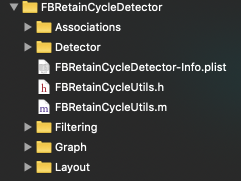

 
<!--BEGIN_DATA
{
    "create_date": "2022-02-23 13:10", 
    "modify_date": "2022-02-23 13:10", 
    "is_top": "0", 
    "summary": "FBRetainCycleDetector与FBAllocationTracker源码解析<br/>FBAllocationTracker源码阅读", 
    "tags": "iOS", 
    "file_name": "FBRetainCycleDetector与FBAllocationTracker源码解析.md"
}
END_DATA-->

#### <p>原文出处：<a href='https://tbfungeek.github.io/2019/11/26/FBRetainCycleDetector-FBAllocationTracker-FBMemoryProfiler-%E6%BA%90%E7%A0%81%E8%A7%A3%E6%9E%90/' target='blank'>FBRetainCycleDetector与FBAllocationTracker源码解析</a></p>

## 开篇叨叨

[FBRetainCycleDetector](https://github.com/facebook/FBRetainCycleDetector)是FaceBook推出的用于检测对象是否有循环引用的一个开源库.下面是一个简单的用法：

```objc
#import <FBRetainCycleDetector/FBRetainCycleDetector.h>  
FBRetainCycleDetector *detector = [FBRetainCycleDetector new];  
[detector addCandidate:myObject];  
NSSet *retainCycles = [detector findRetainCycles];  
NSLog(@"%@", retainCycles);  
```

它先创建一个FBRetainCycleDetector循环引用检测器，然后将待检查循环引用关系的对象通过addCandidate传入，检测器通过findRetainCycles查找这个对象中的循环引用。它能通过添加Filters对某些进行过滤，并且支持检测Block,Timmer,Associations这些对象的内存泄漏。但是它不能单独在项目中使用必须借助其他工具比如FBAllocationTracker,MLeaksFinders 查找Candidates，下面这篇博客主要是对FBRetainCycleDetector源码进行分析，不对使用做过多介绍，具体使用可以在GitHub主页查看。

## FBRetainCycleDetector

### 项目结构

下图是FBRetainCycleDetector目录结构：

  * 

### 源码解析

FBRetainCycleDetector主要任务有两个：

1. 找出**Object**，**Timer类型Object**，**Object associate类型Object**,**Block类型Object** 这几种类型的 Strong Reference。  

2. 最开始把Self作为根节点，沿着找出的各个Reference进行深度遍历，如果形成了环，则存在循环依赖。  

OK 我们现在开始FBRetainCycleDetector的解析：

**FBRetainCycleDetector 对象初始化**

首先我们来看下FBRetainCycleDetector：

```objc
@implementation FBRetainCycleDetector {  
  NSMutableArray *_candidates;  
  FBObjectGraphConfiguration *_configuration;  
  NSMutableSet *_objectSet;  
}  
```

这里最重要有两个对象，`_candidates`是一系列待检测的对象，`_configuration`为配置对象，在这里可以配置需要过滤的对象，检测属性的配置等等。

为了简化代码的分析过程，我们以最简单的初始化形式入手看下初始化过程我们做了什么:

```objc
- (instancetype)init {  
  return [self initWithConfiguration:  
          [[FBObjectGraphConfiguration alloc] initWithFilterBlocks:FBGetStandardGraphEdgeFilters()  
                                               shouldInspectTimers:YES]];  
}  

- (instancetype)initWithConfiguration:(FBObjectGraphConfiguration *)configuration {  
  if (self = [super init]) {  
    _configuration = configuration;  
    _candidates = [NSMutableArray new];  
    _objectSet = [NSMutableSet new];  
  }  
  return self;  
}  
```

在初始化过程中FBRetainCycleDetector调用了initWithConfiguration:初始化了一个标准的过滤器，过滤器过滤了引用循环中的一些类和方法，并检查NSTimer循环引用情况。

**添加检测对象**

待检测的对象在addCandidate方法中被封装为FBObjectiveCGraphElement对象，然后添加到`_candidates`中。

```objc
- (void)addCandidate:(id)candidate {  
  FBObjectiveCGraphElement *graphElement = FBWrapObjectGraphElement(nil, candidate, _configuration);  
  if (graphElement) {  
    [_candidates addObject:graphElement];  
  }  
}  
```

**查找循环引用**

FBRetainCycleDetector 通过调用findRetainCycles开始查找循环引用，如果某个对象比较复杂可能检测时间会比较久，所以在FBRetainCycleDetector中默认设置了一个检测深度，默认情况下为10.可以通过  

```objc
- (NSSet<NSArray<FBObjectiveCGraphElement *> *> *)findRetainCyclesWithMaxCycleLength:(NSUInteger)length  
```

来指定更深的层级。我们继续看findRetainCycles，findRetainCycles内部只是简单得转调了findRetainCyclesWithMaxCycleLength方法。

```objc
- (NSSet<NSArray<FBObjectiveCGraphElement *> *> *)findRetainCycles {  
  return [self findRetainCyclesWithMaxCycleLength:kFBRetainCycleDetectorDefaultStackDepth];  
}  
```

我们继续跟进findRetainCyclesWithMaxCycleLength方法：

```objc
- (NSSet<NSArray<FBObjectiveCGraphElement *> *> *)findRetainCyclesWithMaxCycleLength:(NSUInteger)length {  
  NSMutableSet<NSArray<FBObjectiveCGraphElement *> *> *allRetainCycles = [NSMutableSet new];  
  for (FBObjectiveCGraphElement *graphElement in _candidates) {  
    NSSet<NSArray<FBObjectiveCGraphElement *> *> *retainCycles = [self _findRetainCyclesInObject:graphElement  
                                                                                      stackDepth:length];  
    [allRetainCycles unionSet:retainCycles];  
  }  
  [_candidates removeAllObjects];  
  [_objectSet removeAllObjects];  
  // Filter cycles that have been broken down since we found them.  
  // These are false-positive that were picked-up and are transient cycles.  
  NSMutableSet<NSArray<FBObjectiveCGraphElement *> *> *brokenCycles = [NSMutableSet set];  
  for (NSArray<FBObjectiveCGraphElement *> *itemCycle in allRetainCycles) {  
    for (FBObjectiveCGraphElement *element in itemCycle) {  
      if (element.object == nil) {  
        // At least one element of the cycle has been removed, thus breaking  
        // the cycle.  
        [brokenCycles addObject:itemCycle];  
        break;  
      }  
    }  
  }  
  [allRetainCycles minusSet:brokenCycles];  
  return allRetainCycles;  
}  
```

findRetainCyclesWithMaxCycleLength方法中主要可以分成两个阶段，第一个阶段通过`_findRetainCyclesInObject`查找被加入到`_candidates`中对象的循环引用放到allRetainCycles集合中，第二阶段是查看这些元素中哪些是已经释放了的从allRetainCycles中移除。

对于对象的相互引用情况可以看做一个有向图，对象之间的引用就是图的的连线，每一个对象就是有向图的顶点，查找循环引用的过程就是在整个有向图中查找闭环的过程，FBRetainCycleDetector是通过DFS深度遍历的方式遍历整个对象有向图的，整个遍历查找过程真正的实现位于 `_findRetainCyclesInObject`方法中，在分析`_findRetainCyclesInObject`实现之前我们先通过下面的视频看下整个算法的

大概流程：

```objc
- (NSSet<NSArray<FBObjectiveCGraphElement *> *> *)_findRetainCyclesInObject:(FBObjectiveCGraphElement *)graphElement  
                                                                 stackDepth:(NSUInteger)stackDepth {  
  NSMutableSet<NSArray<FBObjectiveCGraphElement *> *> *retainCycles = [NSMutableSet new];  
  // 查找循环引用是通过深度遍历整个对象图来实现的  
  // 首先初始化深度搜索树中的一个节点  
  FBNodeEnumerator *wrappedObject = [[FBNodeEnumerator alloc] initWithObject:graphElement];  
  // stack 用于保存当前DFS搜索树中的搜索路径  
  NSMutableArray<FBNodeEnumerator *> *stack = [NSMutableArray new];  
  // objectsOnPath 保存搜索路径中访问过的对象  
  NSMutableSet<FBNodeEnumerator *> *objectsOnPath = [NSMutableSet new];  
  // 增加根节点，从根节点开始搜索  
  [stack addObject:wrappedObject];  
  //判断是否已经搜索完毕  
  while ([stack count] > 0) {  
    // 算法会创建许多生命周期非常短的对象，这个会造成很大的内存抖动，所以这里使用了自动释放池来缓解这个问题。  
    @autoreleasepool {  
      // 取出stack中的最上面的节点，并标记该节点已读  
      FBNodeEnumerator *top = [stack lastObject];  
      // 这里不重复便利同样的子树  
      if (![objectsOnPath containsObject:top]) {  
        if ([_objectSet containsObject:@([top.object objectAddress])]) {  
          [stack removeLastObject];  
          continue;  
        }  
        // 这里之所以只保留对象的地址是为了避免不必要的对象持有  
        [_objectSet addObject:@([top.object objectAddress])];  
      }  
      // 记录已经访问过的节点  
      [objectsOnPath addObject:top];  
      // Take next adjecent node to that child. Wrapper object can  
      // persist iteration state. If we see that node again, it will  
      // give us new adjacent node unless it runs out of them  
      //取top节点的next节点，也就是这个object可能持有的对象。  
      FBNodeEnumerator *firstAdjacent = [top nextObject];  
      if (firstAdjacent) {  
        //如果存在未访问到的节点  
        // Current node still has some adjacent not-visited nodes  
        BOOL shouldPushToStack = NO;  
        // 检查是否已经访问过了  
        // Check if child was already seen in that path  
        if ([objectsOnPath containsObject:firstAdjacent]) {  
          // We have caught a retain cycle  
          //如果该节点已经存在被访问过的对象中，说明构成了retain cycle  
          // Ignore the first element which is equal to firstAdjacent, use firstAdjacent  
          // we're doing that because firstAdjacent has set all contexts, while its  
          // first occurence could be a root without any context  
          NSUInteger index = [stack indexOfObject:firstAdjacent];  
          NSInteger length = [stack count] - index;  
          if (index == NSNotFound) {  
            // Object got deallocated between checking if it exists and grabbing its index  
            shouldPushToStack = YES;  
          } else {  
            //计算出firstAdj出现的位置，同时计算出路径的长度，将这一系列的节点（object），也就是环，存放在array里面。  
            //将这个array存放到retainCycles集合中。  
            NSRange cycleRange = NSMakeRange(index, length);  
            NSMutableArray<FBNodeEnumerator *> *cycle = [[stack subarrayWithRange:cycleRange] mutableCopy];  
            [cycle replaceObjectAtIndex:0 withObject:firstAdjacent];  
            // 1. Unwrap the cycle  
            // 2. Shift to lowest address (if we omit that, and the cycle is created by same class,  
            //    we might have duplicates)  
            // 3. Shift by class (lexicographically)  
            [retainCycles addObject:[self _shiftToUnifiedCycle:[self _unwrapCycle:cycle]]];  
          }  
        } else {  
          // Node is clear to check, add it to stack and continue  
          shouldPushToStack = YES;  
        }  
        if (shouldPushToStack) {  
          if ([stack count] < stackDepth) {  
            [stack addObject:firstAdjacent];  
          }  
        }  
      } else {  
        // Node has no more adjacent nodes, it itself is done, move on  
        [stack removeLastObject];  
        [objectsOnPath removeObject:top];  
      }  
    }  
  }  
  return retainCycles;  
}  
```

`_findRetainCyclesInObject`方法中有四个比较重要的对象：

    * retainCycles用于存放循环引用环的集合；  
    * wrappedObject图的根起点  
    * stack是在图中当前的路径  
    * objectsOnPath用于记录以前访问过的节点。  

在遍历开始前首先用传进来的graphElement来初始化FBNodeEnumerator对象，FBNodeEnumerator 是整个遍历的关键，但是这里我们先注重整个流程，开始遍历之前会将用当前graphElement初始化的FBNodeEnumerator添加到stack，然后通过FBNodeEnumerator 的 nextObject 取出下一个节点，通过 **[objectsOnPath containsObject:firstAdjacent]**来判断该节点是否已经被访问过了，如果该节点已经存在被访问过的对象中，说明构成了retain cycle，这时候计算出firstAdj出现的位置，同时计算出路径的长度，将这一系列的节点组成的环，存放在array里面。将这个array存放到retainCycles集合中。

这里还有两个比较重要的方法_unwrapCycle和_shiftToUnifiedCycle：

  * `_unwrapCycle`: 的作用是将数组中的每一个 FBNodeEnumerator 实例解压成 FBObjectiveCGraphElement
  * `_shiftToUnifiedCycle`: 方法用于将每一个环中的元素按照地址递增以及字母顺序来排序，来避免把相同环的不同表示方式当作两个不同的环。

**获取强引用对象**

我们上面介绍addCandidate方法的时候看到FBRetainCycleDetector会把所有的对象封装在FBObjectiveCGraphElement中，FBObjectiveCGraphElement类中有个十分重要的方法allRetainedObjects，它用于返回某个对象所持有的全部强引用对象数组。获取数组之后，再把其中的对象包装成新的FBNodeEnumerator实例，作为下一个有向图的顶点。

```objc
- (NSSet *)allRetainedObjects {  
  NSArray *retainedObjectsNotWrapped = [FBAssociationManager associationsForObject:_object];  
  NSMutableSet *retainedObjects = [NSMutableSet new];  
  for (id obj in retainedObjectsNotWrapped) {  
    FBObjectiveCGraphElement *element = FBWrapObjectGraphElementWithContext(self,  
                                                                            obj,  
                                                                            _configuration,  
                                                                            @[@"__associated_object"]);  
    if (element) {  
      [retainedObjects addObject:element];  
    }  
  }  
  return retainedObjects;  
}  
```

在最开始我们会通过[FBAssociationManager associationsForObject:]获取该对象所有通过`objc_setAssociatedObject`关联的对象。FBAssociationManager 是 object
associations的一个跟踪器，通过指定对象它能够返回该指定对象通过`objc_setAssociatedObjectretain`策略添加的关联对象。它只有三个方法：

```objc
/**  
 开始跟踪 object associations，这里使用的是fishhook来hook objc_(set/remove)AssociatedObject 这些C方法,并插入一些跟踪代码  
 */  
+ (void)hook;  
/**  
 停止跟踪 object associations  
 */  
+ (void)unhook;  
/**  
 返回指定对象的 objects associated  
 */  
+ (nullable NSArray *)associationsForObject:(nullable id)object;  
```

要跟踪关联对象必须在main.m中调用[FBAssociationManager hook]通过fishhook Hook 对应方法。

我们接下来继续看下allRetainedObjects方法。allRetainedObjects方法中会遍历FBAssociationManager获取到的`_object`关联的对象。然后通过FBWrapObjectGraphElementWithContext创建FBObjectiveCGraphElement。并添加到retainedObjects数组返回。

```objc
FBObjectiveCGraphElement *FBWrapObjectGraphElementWithContext(FBObjectiveCGraphElement *sourceElement,  
                                                              id object,  
                                                              FBObjectGraphConfiguration *configuration,  
                                                              NSArray<NSString *> *namePath) {  
  //通过FBObjectGraphConfiguration中添加的过滤器对当前的object进行一次过滤  
  if (_ShouldBreakGraphEdge(configuration, sourceElement, [namePath firstObject], object_getClass(object))) {  
    return nil;  
  }  
  FBObjectiveCBlock *newElement;  
  //如果是Block类型则返回FBObjectiveCBlock  
  if (FBObjectIsBlock((__bridge void *)object)) {  
    newElement = [[FBObjectiveCBlock alloc] initWithObject:object  
                                             configuration:configuration  
                                                  namePath:namePath];  
  } else {  
    //如果是NSTimer的子类并且配置类中shouldInspectTimers 为 YES 返回FBObjectiveCNSCFTimer  
    if ([object_getClass(object) isSubclassOfClass:[NSTimer class]] &&  
        configuration.shouldInspectTimers) {  
      newElement = [[FBObjectiveCNSCFTimer alloc] initWithObject:object  
                                                   configuration:configuration  
                                                        namePath:namePath];  
    } else {  
      //否则返回FBObjectiveCObject  
      newElement = [[FBObjectiveCObject alloc] initWithObject:object  
                                                configuration:configuration  
                                                     namePath:namePath];  
    }  
  }  
  return (configuration && configuration.transformerBlock) ? configuration.transformerBlock(newElement) : newElement;  
}  
```

FBWrapObjectGraphElementWithContext会根据传入的object的对象判断，如果是Block类型则返回FBObjectiveCBlock，如果是NSTimer的子类并且配置类中shouldInspectTimers 为 YES 返回FBObjectiveCNSCFTimer，如果其他类型返回FBObjectiveCObject。

FBObjectiveCBlock，FBObjectiveCNSCFTimer，FBObjectiveCObject都是FBObjectiveCGraphElement的子类，都是一种对象图元素。

我们回到FBNodeEnumerator类，我们上面提到深度遍历对象树靠的就是FBNodeEnumerator的nextObject方法。我们看下nextObject方法：

```objc
- (FBNodeEnumerator *)nextObject {  
  if (!_object) {  
    return nil;  
  } else if (!_retainedObjectsSnapshot) {  
    _retainedObjectsSnapshot = [_object allRetainedObjects];  
    _enumerator = [_retainedObjectsSnapshot objectEnumerator];  
  }  
  FBObjectiveCGraphElement *next = [_enumerator nextObject];  
  if (next) {  
    return [[FBNodeEnumerator alloc] initWithObject:next];  
  }  
  return nil;  
}  
```

在这里最关键的就是调用了上面提到的allRetainedObjects方法。也就是说通过allRetainedObjects可以对当前节点进行展开递归。

我们针对上面提到的三种对象图元素一一看下怎么获取到某个对象的全部强引用属性：

**FBObjectiveCBlock**

```objc
- (NSSet *)allRetainedObjects {  
  // ......  
  //获取一个对象的所有强引用属性  
  NSArray *strongIvars = FBGetObjectStrongReferences(self.object, self.configuration.layoutCache);  
  //通过super方法获取当前类的关联对象属性  
  NSMutableArray *retainedObjects = [[[super allRetainedObjects] allObjects] mutableCopy];  
  //将全部的强引用对象封装成FBObjectiveCGraphElement  
  for (id<FBObjectReference> ref in strongIvars) {  
    id referencedObject = [ref objectReferenceFromObject:self.object];  
    if (referencedObject) {  
      NSArray<NSString *> *namePath = [ref namePath];  
      FBObjectiveCGraphElement *element = FBWrapObjectGraphElementWithContext(self,  
                                                                              referencedObject,  
                                                                              self.configuration,  
                                                                              namePath);  
      if (element) {  
        [retainedObjects addObject:element];  
      }  
    }  
  }  
  if ([NSStringFromClass(aCls) hasPrefix:@"__NSCF"]) {  
    /**  
     If we are dealing with toll-free bridged collections, we are not guaranteed that the collection  
     will hold only Objective-C objects. We are not able to check in runtime what callbacks it uses to  
     retain/release (if any) and we could easily crash here.  
     */  
    return [NSSet setWithArray:retainedObjects];  
  }  
  if (class_isMetaClass(aCls)) {  
    // If it's a meta-class it can conform to following protocols,  
    // but it would crash when trying enumerating  
    return nil;  
  }  
  //获取集合类的引用  
  if ([aCls conformsToProtocol:@protocol(NSFastEnumeration)]) {  
    BOOL retainsKeys = [self _objectRetainsEnumerableKeys];  
    BOOL retainsValues = [self _objectRetainsEnumerableValues];  
    BOOL isKeyValued = NO;  
    if ([aCls instancesRespondToSelector:@selector(objectForKey:)]) {  
      isKeyValued = YES;  
    }  
    /**  
     This codepath is prone to errors. When you enumerate a collection that can be mutated while enumeration  
     we fall into risk of crash. To save ourselves from that we will catch such exception and try again.  
     We should not try this endlessly, so at some point we will simply give up.  
     */  
    NSInteger tries = 10;  
    for (NSInteger i = 0; i < tries; ++i) {  
      // If collection is mutated we want to rollback and try again - let's keep refs in temporary set  
      NSMutableSet *temporaryRetainedObjects = [NSMutableSet new];  
      @try {  
        for (id subobject in self.object) {  
          if (retainsKeys) {  
            FBObjectiveCGraphElement *element = FBWrapObjectGraphElement(self, subobject, self.configuration);  
            if (element) {  
              [temporaryRetainedObjects addObject:element];  
            }  
          }  
          if (isKeyValued && retainsValues) {  
            FBObjectiveCGraphElement *element = FBWrapObjectGraphElement(self,  
                                                                         [self.object objectForKey:subobject],  
                                                                         self.configuration);  
            if (element) {  
              [temporaryRetainedObjects addObject:element];  
            }  
          }  
        }  
      }  
      @catch (NSException *exception) {  
        // mutation happened, we want to try enumerating again  
        continue;  
      }  
      // If we are here it means no exception happened and we want to break outer loop  
      [retainedObjects addObjectsFromArray:[temporaryRetainedObjects allObjects]];  
      break;  
    }  
  }  
  return [NSSet setWithArray:retainedObjects];  
}  
```

这里最关键的就是FBGetObjectStrongReferences方法：它能从类中获取它的所有引用，无论是强引用或者是弱引用。

```objc
NSArray<id<FBObjectReference>> *FBGetObjectStrongReferences(id obj,  
                                                            NSMutableDictionary<Class, NSArray<id<FBObjectReference>> *> *layoutCache) {  
  NSMutableArray<id<FBObjectReference>> *array = [NSMutableArray new];  
  __unsafe_unretained Class previousClass = nil;  
  __unsafe_unretained Class currentClass = object_getClass(obj);  
  while (previousClass != currentClass) {  
    NSArray<id<FBObjectReference>> *ivars;  
    if (layoutCache && currentClass) {  
      ivars = layoutCache[currentClass];  
    }  
    if (!ivars) {  
      ivars = FBGetStrongReferencesForClass(currentClass);  
      if (layoutCache && currentClass) {  
        layoutCache[currentClass] = ivars;  
      }  
    }  
    [array addObjectsFromArray:ivars];  
    previousClass = currentClass;  
    currentClass = class_getSuperclass(currentClass);  
  }  
  return [array copy];  
}  
```

在FBGetObjectStrongReferences方法中遍历本类以及所有父指针强引用，并且加入了缓存以加速查找强引用的过程，在这里会对所有遍历的类调用FBGetStrongReferencesForClass获取ivars，同时过滤弱引用。

```objc
static NSArray<id<FBObjectReference>> *FBGetStrongReferencesForClass(Class aCls) {  
  NSArray<id<FBObjectReference>> *ivars = [FBGetClassReferences(aCls) filteredArrayUsingPredicate:[NSPredicate predicateWithBlock:^BOOL(id evaluatedObject, NSDictionary *bindings) {  
    if ([evaluatedObject isKindOfClass:[FBIvarReference class]]) {  
      FBIvarReference *wrapper = evaluatedObject;  
      return wrapper.type != FBUnknownType;  
    }  
    return YES;  
  }]];  
  const uint8_t *fullLayout = class_getIvarLayout(aCls);  
  if (!fullLayout) {  
    return @[];  
  }  
  NSUInteger minimumIndex = FBGetMinimumIvarIndex(aCls);  
  NSIndexSet *parsedLayout = FBGetLayoutAsIndexesForDescription(minimumIndex, fullLayout);  
  NSArray<id<FBObjectReference>> *filteredIvars =  
  [ivars filteredArrayUsingPredicate:[NSPredicate predicateWithBlock:^BOOL(id<FBObjectReference> evaluatedObject,  
                                                                           NSDictionary *bindings) {  
    return [parsedLayout containsIndex:[evaluatedObject indexInIvarLayout]];  
  }]];  
  return filteredIvars;  
}  
```

我们来看下FBGetClassReferences方法：

```objc
NSArray<id<FBObjectReference>> *FBGetClassReferences(Class aCls) {  
  NSMutableArray<id<FBObjectReference>> *result = [NSMutableArray new];  
  unsigned int count;  
  Ivar *ivars = class_copyIvarList(aCls, &count);  
  for (unsigned int i = 0; i < count; ++i) {  
    Ivar ivar = ivars[i];  
    FBIvarReference *wrapper = [[FBIvarReference alloc] initWithIvar:ivar];  
    if (wrapper.type == FBStructType) {  
      std::string encoding = std::string(ivar_getTypeEncoding(wrapper.ivar));  
      NSArray<FBObjectInStructReference *> *references = FBGetReferencesForObjectsInStructEncoding(wrapper, encoding);  
      [result addObjectsFromArray:references];  
    } else {  
      [result addObject:wrapper];  
    }  
  }  
  free(ivars);  
  return [result copy];  
}  
```

这里主要通过`class_copyIvarList`方法获取到Ivar然后将所有的Ivar封装到FBIvarReference对象。FBIvarReference对象其实是Ivar的面向对象封装，包括属性的名称、类型、偏移量以及索引。

```objc
@interface FBIvarReference : NSObject <FBObjectReference>  
@property (nonatomic, copy, readonly, nullable) NSString *name;  
@property (nonatomic, readonly) FBType type;  
@property (nonatomic, readonly) ptrdiff_t offset;  
@property (nonatomic, readonly) NSUInteger index;  
@property (nonatomic, readonly, nonnull) Ivar ivar;  
- (nonnull instancetype)initWithIvar:(nonnull Ivar)ivar;  
@end  
```

到目前为止我们直到了如何获取到某个对象的全部属性，这里包括强引用和弱引用，下面我们还要知道如何过滤弱引用。

为了弄明白怎么过滤弱引用，我们要先了解Ivar Layout，获取Ivar Layout 是通过 FBGetLayoutAsIndexesForDescription方法获取的。  

Ivar Layout 是一系列的字符，每两个一组，比如\xmn，每一组 Ivar Layout 中第一位表示有m个非强属性，第二位表示接下来有n个强属性。  

FBGetLayoutAsIndexesForDescription 返回的就是所有强引用的Ivar Layout。

```objc
static NSIndexSet *FBGetLayoutAsIndexesForDescription(NSUInteger minimumIndex, const uint8_t *layoutDescription) {  
	NSMutableIndexSet *interestingIndexes = [NSMutableIndexSet new];  
	NSUInteger currentIndex = minimumIndex;  
	while (*layoutDescription != '\x00') {  
		int upperNibble = (*layoutDescription & 0xf0) >> 4;  
		int lowerNibble = *layoutDescription & 0xf;  
		currentIndex += upperNibble;  
		[interestingIndexes addIndexesInRange:NSMakeRange(currentIndex, lowerNibble)];  
		currentIndex += lowerNibble;  
		++layoutDescription;  
	}  
	return interestingIndexes;  
}  
```

接下来我们就可以拿着上面找到的parsedLayout对ivars进行过滤，留下所有强引用的ivars。  

```objc
NSArray<id<FBObjectReference>> *filteredIvars =  
[ivars filteredArrayUsingPredicate:[NSPredicate predicateWithBlock:^BOOL(id<FBObjectReference> evaluatedObject,  
																		 NSDictionary *bindings) {  
	return [parsedLayout containsIndex:[evaluatedObject indexInIvarLayout]];  
}]];  
```

**FBObjectiveCBlock**

我们来看下Block对象对应的图节点FBObjectiveCBlock：

```objc
- (NSSet *)allRetainedObjects {  
  //获取关联对象的全部强引用  
  NSMutableArray *results = [[[super allRetainedObjects] allObjects] mutableCopy];  
  // Grab a strong reference to the object, otherwise it can crash while doing  
  // nasty stuff on deallocation  
  __attribute__((objc_precise_lifetime)) id anObject = self.object;  
  void *blockObjectReference = (__bridge void *)anObject;  
  NSArray *allRetainedReferences = FBGetBlockStrongReferences(blockObjectReference);  
  for (id object in allRetainedReferences) {  
    FBObjectiveCGraphElement *element = FBWrapObjectGraphElement(self, object, self.configuration);  
    if (element) {  
      [results addObject:element];  
    }  
  }  
  return [NSSet setWithArray:results];  
}  
```

这里最重要的是FBGetBlockStrongReferences方法：

```objc
NSArray *FBGetBlockStrongReferences(void *block) {  
	if (!FBObjectIsBlock(block)) {  
		return nil;  
	}  
	NSMutableArray *results = [NSMutableArray new];  
	void **blockReference = block;  
	NSIndexSet *strongLayout = _GetBlockStrongLayout(block);  
	[strongLayout enumerateIndexesUsingBlock:^(NSUInteger idx, BOOL *stop) {  
		void **reference = &blockReference[idx];  
		if (reference && (*reference)) {  
			id object = (id)(*reference);  
			if (object) {  
				[results addObject:object];  
			}  
		}  
	}];  
	return [results autorelease];  
}  
```

在FBGetBlockStrongReferences方法中通过`_GetBlockStrongLayout`获得Block所持有的强引用。在理解如何Block强引用之前我们先来回顾下Block的一些基础知识：

```objc
struct BlockLiteral {  
  void _isa;  
  int flags;  
  int reserved;  
  void (_invoke)(void _, …);  
  struct BlockDescriptor _descriptor;  
  // imported variables  
};
```

首先Block对于它所捕获的Objective-C对象实例，都会在block结构体的下面存放这些持有的对象，并且会将强引用的对象排放在弱引用对象的前面。当Block将要释放时，会调用dispose_helper函数，该函数会调用所有需要进行内存管理的所捕获的对象，如Block、**block变量、**`attribute__((NSObject))`变量或有constructor/destructor的C++ const对象。所以我们可以创建一系列的fake对象来模拟捕获的Objective-C对象实例，然后主动调用Block的`dispose_helper`方法，该方法会调用对象实例的release方法，我们只需要在fake对象中实现release方法，如果release方法被调用，所以该fake对象对应的真实变量为Objective-C对象实例。

```objc
static NSIndexSet *_GetBlockStrongLayout(void *block) {  
  struct BlockLiteral *blockLiteral = block;  
  /**  
   BLOCK_HAS_CTOR - Block has a C++ constructor/destructor, which gives us a good chance it retains  
   objects that are not pointer aligned, so omit them.  
   !BLOCK_HAS_COPY_DISPOSE - Block doesn't have a dispose function, so it does not retain objects and  
   we are not able to blackbox it.  
   */  
  if ((blockLiteral->flags & BLOCK_HAS_CTOR)  
      || !(blockLiteral->flags & BLOCK_HAS_COPY_DISPOSE)) {  
    return nil;  
  }  
  //获取当前Block的dispose_helper方法  
  void (*dispose_helper)(void *src) = blockLiteral->descriptor->dispose_helper;  
  //指针大小  
  const size_t ptrSize = sizeof(void *);  
  //计算出需要填充的fake对象数量  
  // Figure out the number of pointers it takes to fill out the object, rounding up.  
  const size_t elements = (blockLiteral->descriptor->size + ptrSize - 1) / ptrSize;  
  // 创建fack对象  
  // Create a fake object of the appropriate length.  
  void *obj[elements];  
  void *detectors[elements];  
  for (size_t i = 0; i < elements; ++i) {  
    FBBlockStrongRelationDetector *detector = [FBBlockStrongRelationDetector new];  
    obj[i] = detectors[i] = detector;  
  }  
  //调用dispose_helper，这时候会调用每个FBBlockStrongRelationDetector的release方法，这时候会将strong设置为YES  
  @autoreleasepool {  
    dispose_helper(obj);  
  }  
  // Run through the release detectors and add each one that got released to the object's  
  // strong ivar layout.  
  NSMutableIndexSet *layout = [NSMutableIndexSet indexSet];  
 //判断strong是否为YES,如果为YES表示为强引用，则将其添加到layout  
  for (size_t i = 0; i < elements; ++i) {  
    FBBlockStrongRelationDetector *detector = (FBBlockStrongRelationDetector *)(detectors[i]);  
    if (detector.isStrong) {  
      [layout addIndex:i];  
    }  
    // Destroy detectors  
    [detector trueRelease];  
  }  
  return layout;  
}  
```

**FBObjectiveCNSCFTimer***

FBObjectiveCNSCFTimer比较简单它会通过runloop去获取CFRunLoopTimerGetContext，然后通过context查看是否有target或者，userInfo如果有假设它强持有这些对象的引用。

```objc
- (NSSet *)allRetainedObjects {  
  // Let's retain our timer  
  __attribute__((objc_precise_lifetime)) NSTimer *timer = self.object;  
  if (!timer) {  
    return nil;  
  }  
  NSMutableSet *retained = [[super allRetainedObjects] mutableCopy];  
  CFRunLoopTimerContext context;  
  //通过runloop去获取CFRunLoopTimerGetContext  
  CFRunLoopTimerGetContext((CFRunLoopTimerRef)timer, &context);  
  // If it has a retain function, let's assume it retains strongly  
  if (context.info && context.retain) {  
    _FBNSCFTimerInfoStruct infoStruct = *(_FBNSCFTimerInfoStruct *)(context.info);  
    if (infoStruct.target) {  
      FBObjectiveCGraphElement *element = FBWrapObjectGraphElementWithContext(self, infoStruct.target, self.configuration, @[@"target"]);  
      if (element) {  
        [retained addObject:element];  
      }  
    }  
    if (infoStruct.userInfo) {  
      FBObjectiveCGraphElement *element = FBWrapObjectGraphElementWithContext(self, infoStruct.userInfo, self.configuration, @[@"userInfo"]);  
      if (element) {  
        [retained addObject:element];  
      }  
    }  
  }  
  return retained;  
}  
```

## FBAllocationTracker

[FBAllocationTracker](https://github.com/facebook/FBAllocationTracker)我们上面给大家分析了[FBRetainCycleDetector](https://tbfungeek.github.io/2019/11/26/FBRetainCycleDetector-FBAllocationTracker-FBMemoryProfiler-%E6%BA%90%E7%A0%81%E8%A7%A3%E6%9E%90/)，它主要的功能是查找到待检测对象的全部强引用对象，这些强引用对象便是搜索循环引用的有向图节点， FBRetainCycleDetector通过深度优先原则遍历整个对象图，如果在整个路径中发现有存在重复访问的情况，便认为是一个循环引用，FBRetainCycleDetector一般先通过MLeaksFinder或者FBAllocationTracker这些开源库找到可疑的对象，然后再通过FBRetainCycleDetector对这个对象进行检查是否存在循环引用。  

接下来我们给大家介绍下FBAllocationTracker，下面是它的最基本用法：

```objc
#import <FBAllocationTracker/FBAllocationTrackerManager.h>  

int main(int argc, char * argv[]) {  
  [[FBAllocationTrackerManager sharedManager] startTrackingAllocations];  
  [[FBAllocationTrackerManager sharedManager] enableGenerations];  
  @autoreleasepool {  
      return UIApplicationMain(argc, argv, nil, NSStringFromClass([AppDelegate class]));  
  }  
}  
```
   
```objc
- (void)startTrackingAllocations {  
  FB::AllocationTracker::beginTracking();  
}  
- (void)enableGenerations {  
  dispatch_sync(_queue, ^{  
    if (self->_generationsClients == 0) {  
      FB::AllocationTracker::enableGenerations();  
      FB::AllocationTracker::markGeneration();  
    }  
    self->_generationsClients += 1;  
  });  
}  
```

<hr>

#### <p>原文出处：<a href='https://meng03.github.io/2019/08/01/FBAllocationTracker%E6%BA%90%E7%A0%81%E9%98%85%E8%AF%BB/' target='blank'>FBAllocationTracker源码阅读</a></p>

`FBAllocationTracker`有两种模式，跟踪对象，基数allocs/deallocs。

## 主要类分析

### FBAllocationTrackerManager

本类是提供给使用者的最外层包装。

```objc
@interface FBAllocationTrackerManager : NSObject

+ (nullable instancetype)sharedManager;
//启动track
- (void)startTrackingAllocations;
- (void)stopTrackingAllocations;
- (BOOL)isAllocationTrackerEnabled;

- (nullable NSArray<FBAllocationTrackerSummary *> *)currentAllocationSummary;
//使用tracking对象模式
- (void)enableGenerations;
- (void)disableGenerations;
//类似Instruments中allocation提供的mark功能
- (void)markGeneration;

- (nullable NSArray<NSArray<FBAllocationTrackerSummary *> *> *)currentSummaryForGenerations;
- (nullable NSArray *)instancesForClass:(nonnull __unsafe_unretained Class)aCls
                           inGeneration:(NSInteger)generation;
- (nullable NSArray *)instancesOfClasses:(nonnull NSArray *)classes;
- (nullable NSSet<Class> *)trackedClasses;
@end
``` 

实现中，多是通过`FBAllocationTrackerImpl`来完成。

### FBAllocationTrackerImpl

```objc
AllocationSummary allocationTrackerSummary();
//启动&关闭track
void beginTracking();
void endTracking();
bool isTracking();
//启动&关闭generation
void enableGenerations();
void disableGenerations();
//mark
void markGeneration();

FullGenerationSummary generationSummary();
```

这个类本身实现了allocs和deallocs计数，通过`Generation`类实现track对象功能，后者下面会说到。

与其他内存监控相关库类似，首先需要 hook `alloc` 和 `dealloc`。这部分逻辑大同小异。

**准备 - 将 `allocWithZone`与 `dealloc` 的函数实现，复制到准备好的空方法上**
  
```objc
void prepareOriginalMethods(void) {
    if (_didCopyOriginalMethods) {
      return;
    }
    // prepareOriginalMethods called from turnOn/Off which is synced by
    // _lock, this is thread-safe
    _didCopyOriginalMethods = true;

      //copy方法的实现到fb_originalAllocWithZone和fb_originalDealloc
      //使用_didCopyOriginalMethods保证只copy一次
    replaceSelectorWithSelector([NSObject class],
                                @selector(fb_originalAllocWithZone:),
                                @selector(allocWithZone:),
                                FBClassMethod);

    replaceSelectorWithSelector([NSObject class],
                                @selector(fb_originalDealloc),
                                sel_registerName("dealloc"),
                                FBInstanceMethod);
  }
```

**开始 - 用自己的alloc和dealloc替换系统的**
    
```objc
void turnOnTracking(void) {
prepareOriginalMethods();
replaceSelectorWithSelector([NSObject class],
                            @selector(allocWithZone:),
                            @selector(fb_newAllocWithZone:),
                            FBClassMethod);
replaceSelectorWithSelector([NSObject class],
                            sel_registerName("dealloc"),
                            @selector(fb_newDealloc),
                            FBInstanceMethod);
}
```

**关闭 - 用一开始保存的系统方法，再替换回去**

```objc
void turnOffTracking(void) {
    prepareOriginalMethods();

    replaceSelectorWithSelector([NSObject class],
                                @selector(allocWithZone:),
                                @selector(fb_originalAllocWithZone:),
                                FBClassMethod);

    replaceSelectorWithSelector([NSObject class],
                                sel_registerName("dealloc"),
                                @selector(fb_originalDealloc),
                                FBInstanceMethod);
}
``` 

自定义的`alloc`和`dealloc`方法除了调用系统实现外，额外调用了记录该类的方法。

```
+ (id)fb_newAllocWithZone:(id)zone
{
  id object = [self fb_originalAllocWithZone:zone];
  FB::AllocationTracker::incrementAllocations(object);
  return object;
}

- (void)fb_newDealloc
{
  FB::AllocationTracker::incrementDeallocations(self);
  [self fb_originalDealloc];
}
```

`incrementAllocations`做两件事，将该对象的allocs记数+1。如果启用了`generation`，就将对象记录到`generation`中。`incrementDeallocations`是相反的步骤。

```objc
void incrementAllocations(__unsafe_unretained id obj) {
    Class aCls = [obj class];

    if (!_shouldTrackClass(aCls)) {
      return;
    }

    std::lock_guard<std::mutex> l(*_lock);

    if (_trackingInProgress) {
      (*_allocations)[aCls]++;
    }

    if (_generationManager) {
      _generationManager->addObject(obj);
    }
}
```

### Generation

generation主要是用来记录对象。因为可以分代记录。所以generation中有两个集合对象。每一代的对象，记录在同一个`GenerationMap`中。所有的`GenerationMap`都存在`GenerationList`中。`markGeneration`会创建一个新的`GenerationMap`。

## 总结

`FBAllocationTracker`通过对`alloc`和`dealloc`的hook。记录创建和销毁的对象。这部分和其他内存相关的监控类似。此外借鉴了 instruments 工具中 allocation 部分的 markgeneration，提供了分代记录的功能。实现也比较容易，通过集合来存储generation。每次记录对象，就从集合中取最后一个generation来添加即可。

