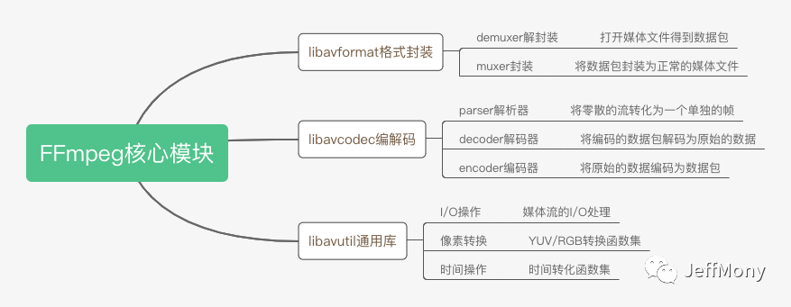
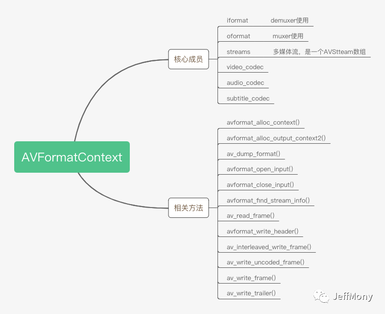
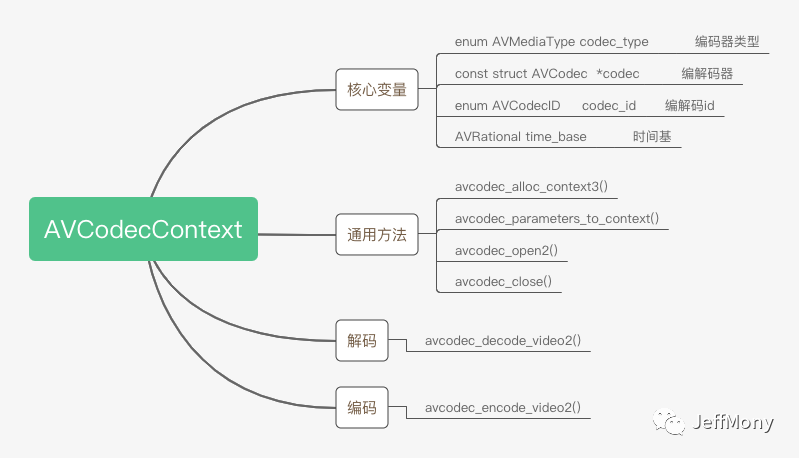

<!--BEGIN_DATA
{
    "create_date": "2021-11-07 18:00", 
    "modify_date": "2021-11-07 18:00", 
    "is_top": "0", 
    "summary": "FFmpeg代码架构", 
    "tags": "FFmpeg", 
    "file_name": "FFmpeg代码架构.md"
}
END_DATA-->

#### <p>原文出处：<a href='https://mp.weixin.qq.com/s/gvD18mwdO_NUCWACgTyKCA' target='blank'>FFmpeg代码架构</a></p>

## FFmpeg模块分类

打开FFmpeg源码，会发现有一系列libavxxx的模块，这些模块很好地划分了代码的结构和分工。

>   * libavformat，format，格式封装
>   * libavcodec，codec，编码、解码
>   * libavutil，util，通用音视频工具，像素、IO、时间等工具
>   * libavfilter，filter，过滤器，可以用作音视频特效处理
>   * libavdevice，device，设备（摄像头、拾音器）
>   * libswscale，scale，视频图像缩放，像素格式互换
>   * libavresample，resample，重采样
>   * libswresample，也是重采样，类似图像缩放
>   * libpostproc，后期处理

对于入门来说，最重要的是前面三个，也就是format、codec、util，这三个是最基本的库，我们先理一下这三个库的基本结构：  



## FFmpeg中的Context

如果你看过FFmpeg的代码，就很容易发现，FFmpeg里有各式各样的结构体，有一类结构体的命名规则比较类似，都是XxxxContext。

>   * AVFormatContext
>   * AVCodecContext
>   * AVCodecParserContext
>   * AVIOContext
>   * AVFilterContext

当然还有很多Context，上面只是列出比较典型的几种，一看这种命名规则就和面向对象中的命名很类似。  

Context是持有的上下文，是数据链路传递过程中的持有数据的对象。  

其实这是FFmpeg在运用面向对象的思想来编程。XxxxContext可以看做是C语言“类”的实现。  

C语言没有类的语法特征，但可以用结构体struct来描述一组元素的集合。如果把XxxxContext看做类，成员变量显然可以用结构体struct来模拟。

下面一个简单的例子表示下：


```c
struct AVFormatContext {  
    iformat;  
    oformat;  
}  
avformat_alloc_context();   
avformat_free_context();  
```

```cpp
class AVFormatContext {  
private:  
    iformat;  
    oformat;  

public:  
    AVFormatContext();  
    ~AVFormatContext();  
}  
```

其实FFmpeg中的XxxxContext的写法就是按照面向对象的语法设计的。对面向对象比较熟悉的同学其实看到这些命名应该比较亲切。

## AVFormatContext

AVFormatContext是FFmpeg中打开文件必备的一个结构体。  

之前介绍过，格式Format是音视频的一个核心概念，所以在FFmpeg里你需要经常与AVFormatContext打交道。因为一般不是直接操作解封装器Demuxer和封装器Muxer，而是通过AVFormatContext来操作它们。

常用的 AVFormatContext 的操作，可以分为3类：

>   * 通用的函数，例如创建和销毁，等价于C++的构造函数和析构函数。
>   * 对输入视频流的读操作，用于输入处理，也就是使用_解封装器Demuxer_对视频流进行操作，是读操作。
>   * 对输出视频流的写操作，用于输出处理，也就是使用_封装器Muxer_对视频流进行操作，是写操作。



iformat对应的是AVInputFormat，oformat对应的是AVOutputFormat，正好说一下AVFormatContext和AVInputFormat/AVOutputFormat的区别。  

AVFormatContext持有的是传递过程中的数据，这些数据在整个传递路径上都存在，或者都可以复用，AVInputFormat/AVOutputFormat中包含的是动作，包含着如何解析得到的这些数据。

`AVStream **streams`; 是媒体文件中包含的流数据，几条流，媒体流中分别是音频、视频、字幕等等。


>   * avformat_alloc_context() 创建输入媒体文件的AVFormatContext
>   * avformat_alloc_output_context2() 创建输出媒体文件的AVFormatContext
>   * av_dump_format() 打印format详情
>   * avformat_open_input() 打开媒体文件，探知媒体文件的封装格式。
>   * avformat_close_input() 关闭媒体文件
>   * avformat_find_stream_info() 探知媒体文件中的流信息，几条流，每条流的基本信息。
>   * av_read_frame() 读取媒体文件中每一帧数据，这是未解码之前的帧
>   * avformat_write_header() 写入输出文件的媒体头部信息
>   * av_interleaved_write_frame() 写入输出文件的帧信息，此帧信息已经调整了帧与帧之间的关联了。
>   * av_write_uncoded_frame() 写入输出文件的未编码的帧信息
>   * av_write_frame() 写入输出文件的已编码的帧信息
>   * av_write_trailer() 写入输出文件的媒体尾部信息

对于AVFormatContext的使用，主要就是读视频和写视频，下面是基本的流程：

读视频流程：

* 1.创建avformat上下文  

    `AVFormatContext *ifmt_ctx = avformat_alloc_context()`

* 2.打开视频文件  
  
    `avformat_open_input(&ifmt_ctx, in_filename, 0, 0)`

* 3.持续读取视频帧 

```c
while(...) { 
    av_read_frame(ifmt_ctx, &pkt) 
}
```
* 4.关闭avformat上下文  

    `avformat_close_input(&ifmt_ctx)`

写视频流程：

* 1.创建输出上下文  

    `avformat_alloc_output_context2(&ofmt_ctx, NULL, NULL, out_filename)`

* 2.写格式头部  

    `avformat_write_header(ofmt_ctx, NULL)`

* 3.持续输出帧  

```c
while(...) {  
    av_interleaved_write_frame(ofmt_ctx, &pkt)  
}
```

* 4.写格式尾部  

    `av_write_trailer(ofmt_ctx)`

* 5.关闭上下文  

    `avformat_free_context(ofmt_ctx)`

## AVInputFormat

解封装器Demuxer，正式的结构体是AVInputFormat，其实是一个接口，功能是对封装后的格式容器解开获得编码后的音视频的工具。简单说，就是拆包工具。

我们所知道的各种多媒体格式，例如MP4、MP3、FLV等格式的读取，都有AVInputFormat的具体实现。

demuxer的种类很多，而且是可配置的，demuxer有多少，可以看一下`demuxer_list.c`文件，太多了，不一一列举了，我们举一个mp4 demuxer的例子。

下面是mp4视频格式的解封装器`ff_mov_demuxer`，在mov.c中：


```c
AVInputFormat ff_mov_demuxer = {  
    .name           = "mov,mp4,m4a,3gp,3g2,mj2",  
    .long_name      = NULL_IF_CONFIG_SMALL("QuickTime / MOV"),  
    .priv_class     = &mov_class,  
    .priv_data_size = sizeof(MOVContext),  
    .extensions     = "mov,mp4,m4a,3gp,3g2,mj2",  
    .read_probe     = mov_probe,  
    .read_header    = mov_read_header,  
    .read_packet    = mov_read_packet,  
    .read_close     = mov_read_close,  
    .read_seek      = mov_read_seek,  
    .flags          = AVFMT_NO_BYTE_SEEK | AVFMT_SEEK_TO_PTS,  
};  
```

看到了有几个函数指针：

* read_probe  

    探测一下什么封装格式

* read_header  
  
    读取格式头部数据

* read_packet  
  
    读取解封装之后的数据包

* read_close  
  
    关闭对象

* read_seek  

    格式的seek读取控制

你可以看到AVInputFormat提供的是类似接口一样的功能，而`ff_mov_demuxer`是其的一个具体实现。FFmpeg其实本身的逻辑并不复杂，只是由于支持的格式特别丰富，所以代码才如此多。如果我们先把大部分格式忽略掉，重点关注FFmpeg对其中几个格式的实现，可以更好理解FFmpeg。

## AVOutputFormat

封装器 Muxer，对应的结构体是AVOutputFormat，也是一个接口，功能是对编码后的音视频封装进格式容器的工具。简单说，就是打包工具。

跟_解封装器 Demuxer_类似，也是MP4、MP3、FLV等格式的实现，差别是_封装器 Muxer_用于输出。

与demuxer类似，muxer的种类很多，可以看一下`muxer_list.c`文件。  

下面看一下mp3的muxer，在mp3enc.c中：


```c    
AVOutputFormat ff_mp3_muxer = {  
    .name              = "mp3",  
    .long_name         = NULL_IF_CONFIG_SMALL("MP3 (MPEG audio layer 3)"),  
    .mime_type         = "audio/mpeg",  
    .extensions        = "mp3",  
    .priv_data_size    = sizeof(MP3Context),  
    .audio_codec       = AV_CODEC_ID_MP3,  
    .video_codec       = AV_CODEC_ID_PNG,  
    .write_header      = mp3_write_header,  
    .write_packet      = mp3_write_packet,  
    .write_trailer     = mp3_write_trailer,  
    .query_codec       = query_codec,  
    .flags             = AVFMT_NOTIMESTAMPS,  
    .priv_class        = &mp3_muxer_class,  
};  
```

上面也有对应的指针函数，是demuxer的反过程。

## AVCodecContext

跟AVFormatContext类似，我们也是通过AVCodecContext对_编码器Encoder_和_解码器Decoder_操作，一般也不直接操作编解码器。所以需要实现编解码，一般都要跟AVCodecContext打交道。



和demuxer与muxer一样，codec也有decode和encode之分，具体可以参考`codec_list.c`文件：  

查看`ff_libx264_encoder`，在libx264.c中：


```c
AVCodec ff_libx264_encoder = {  
    .name             = "libx264",  
    .long_name        = NULL_IF_CONFIG_SMALL("libx264 H.264 / AVC / MPEG-4 AVC / MPEG-4 part 10"),  
    .type             = AVMEDIA_TYPE_VIDEO,  
    .id               = AV_CODEC_ID_H264,  
    .priv_data_size   = sizeof(X264Context),  
    .init             = X264_init,  
    .encode2          = X264_frame,  
    .close            = X264_close,  
    .capabilities     = AV_CODEC_CAP_DELAY | AV_CODEC_CAP_AUTO_THREADS |  
                        AV_CODEC_CAP_ENCODER_REORDERED_OPAQUE,  
    .priv_class       = &x264_class,  
    .defaults         = x264_defaults,  
    .init_static_data = X264_init_static,  
    .caps_internal    = FF_CODEC_CAP_INIT_CLEANUP,  
    .wrapper_name     = "libx264",  
};  
```

其中核心的函数就是encode2，对应X264_frame函数

## FFmpeg中的Parser

解析器 Parser，将输入流转换为帧的数据包  
由于解码器的输入是一个完整的帧数据包，而无论是网络传输还是文件读取，一般都是固定的buffer来读取的，而不是安装格式的帧大小来读取，所以我们需要解析器Parser将流整理成一个一个的Frame数据包。

parser的全局声明在parsers.c，具体的定义在`list_parser.c`  

看一下`h264_parser.c`中的`ff_h264_parser`例子：


```c
AVCodecParser ff_h264_parser = {  
    .codec_ids      = { AV_CODEC_ID_H264 },  
    .priv_data_size = sizeof(H264ParseContext),  
    .parser_init    = init,  
    .parser_parse   = h264_parse,  
    .parser_close   = h264_close,  
    .split          = h264_split,  
};  
```

H264ParseContext结构中是H264格式的帧数据定义。

```c
typedef struct H264ParseContext {  
    ParseContext pc;  
    H264ParamSets ps;  
    H264DSPContext h264dsp;  
    H264POCContext poc;  
    H264SEIContext sei;  
    int is_avc;  
    int nal_length_size;  
    int got_first;  
    int picture_structure;  
    uint8_t parse_history[6];  
    int parse_history_count;  
    int parse_last_mb;  
    int64_t reference_dts;  
    int last_frame_num, last_picture_structure;  
} H264ParseContext;  
```

这儿大家简单看下，其中H264ParamSets很重要，H264关键的参数都在这儿定义：我们熟知的sps、pps都在这儿定义，有了这两个定义，我们方便在宏块中快速找到当前帧的属性。


```c
typedef struct H264ParamSets {  
    AVBufferRef *sps_list[MAX_SPS_COUNT];  
    AVBufferRef *pps_list[MAX_PPS_COUNT];  
  
    AVBufferRef *pps_ref;  
    AVBufferRef *sps_ref;  
    /* currently active parameters sets */  
    const PPS *pps;  
    const SPS *sps;  
} H264ParamSets;  
```

## 小结

* FFmpeg的学习过程很难，梳理清楚结构，整体的代码脉络就比较清楚了，但是libavfilter等核心模块本文没有讲。这个模块非常庞大，而且可以自定义，后续会单独讲一下。

* 在实践中学习FFmpeg进步会快一些。下面提供一些实践的思路。  

    + FFmpeg代码结构
    + FFmpeg交叉编译
    + FFmpeg解封装 
    + FFmpeg重封装 
    + FFmpeg解码 
    + FFmpeg分离音视频流
