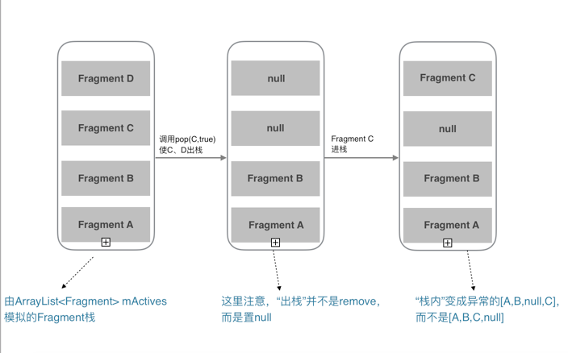
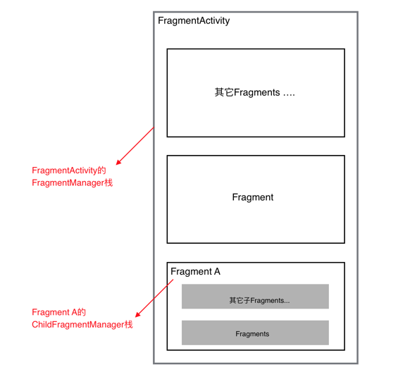
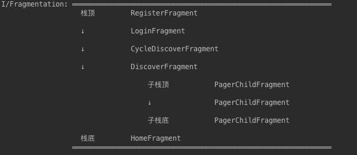

 
<!--BEGIN_DATA
{
    "create_date": "2017-01-10 13:38", 
    "modify_date": "2017-01-10 13:38", 
    "is_top": "0", 
    "summary": "Fragment全解析系列", 
    "tags": "Android", 
    "file_name": "Fragment全解析系列.md"
}
END_DATA-->

####
原文出处：<a href='http://www.jianshu.com/p/d9143a92ad94' target='blank'>Fragment全解析系列（一）：那些年踩过的坑</a>

Fragment系列文章：  
1、Fragment全解析系列（一）：那些年踩过的坑  
2、[Fragment全解析系列（二）：正确的使用姿势](http://www.jianshu.com/p/fd71d65f0ec6)  
3、[Fragment之我的解决方案：Fragmentation](http://www.jianshu.com/p/38f7994faa6b)

本篇主要介绍一些最常见的Fragment的坑以及官方Fragment库的那些自身的BUG，并给出解决方案；这些BUG在你深度使用时会遇到，比如Fragment嵌套时或者单Activity＋多Fragment架构时遇到的坑。

Fragment是可以让你的app纵享丝滑的设计，如果你的app想在现在基础上**性能大幅度提高**，并且**占用内存降低**，同样的界面Activity占用内存比Fragment要多，响应速度Fragment比Activty在中低端手机上快了很多，甚至能达到好几倍！如果你的app当前或以后有**移植**平板等平台时，可以让你节省大量时间和精力。

_简陋的目录_  
**1、getActivity()空指针**  
**2、异常：Can not perform this action after onSaveInstanceState**  
**3、Fragment重叠异常-----正确使用hide、show的姿势**  
**4、Fragment嵌套的那些坑**  
**5、未必靠谱的出栈方法remove()**  
**6、多个Fragment同时出栈的深坑BUG**  
**7、深坑 Fragment转场动画**

##开始之前

最新版知乎，单Activity多Fragment的架构，响应可以说非常“丝滑”，非要说缺点的话，就是没有转场动画，并且转场会有类似闪屏现象。我猜测可能和Fragment转场动画的一些BUG有关。（这系列的最后一篇文章我会给出我的解决方案，可以自定义转场动画，并能在各种特殊情况下正常运行。）

但是！Fragment相比较Activity要难用很多，在多Fragment以及嵌套Fragment的情况下更是如此。  更重要的是Fragment的坑真的太多了，看Square公司的这篇文章吧，[Square：从今天开始抛弃Fragment吧！](http://www.jcodecraeer.com/a/anzhuokaifa/androidkaifa/2015/0605/2996.html)

当然，不能说不再用Fragment，Fragment的这些坑都是有解决办法的，官方也在逐步修复一些BUG。  

下面罗列一些，有常见的，也有极度隐蔽的一些坑，也是我在用单Activity多Fragment时遇到的坑，可能有更多坑可以挖掘...

在这之前为了方便后面文章的介绍，先规定一个“术语”，安卓app有一种特殊情况，就是 app运行在后台的时候，系统资源紧张的时候导致把app的资源全部回收（杀死app的进程），这时把app再从后台返回到前台时，app会重启。这种情况下文简称为：**“内存重启”**。（屏幕旋转等配置变化也会造成当前Activity重启，本质与“内存重启”类似）

在系统要把app回收之前，系统会把Activity的状态保存下来，Activity的FragmentManager负责把Activity中的Fragment保存起来。在“内存重启”后，Activity的恢复是从栈顶逐步恢复，Fragment会在宿主Activity的`onCreate`方法调用后紧接着恢复（`从onAttach`生命周期开始）。

####getActivity()空指针

可能你遇到过getActivity()返回null，或者平时运行完好的代码，在“内存重启”之后，调用getActivity()的地方却返回null，报了空指针异常。

大多数情况下的原因：你在调用了getActivity()时，当前的Fragment已经`onDetach()`了宿主Activity。  
比如：你在pop了Fragment之后，该Fragment的异步任务仍然在执行，并且在执行完成后调用了getActivity()方法，这样就会空指针。

解决办法：  
**更"安全"的方法**：(对于Fragment已经onDetach这种情况，我们应该避免在这之后再去调用宿主Activity对象，比如取消这些异步任务，但我们的团队可能会有粗心大意的情况，所以下面给出的这个方案会保证安全)

在Fragment基类里设置一个Activity mActivity的全局变量，在`onAttach(Activity activity)`里赋值，使用mActivity代替`getActivity()`，保证Fragment即使在`onDetach`后，仍持有Activity的引用（有引起内存泄露的风险，但是异步任务没停止的情况下，本身就可能已内存泄漏，相比Crash，这种做法“安全”些），即：
   
    protected Activity mActivity;
    @Override
    public void onAttach(Activity activity) {
        super.onAttach(activity);
        this.mActivity = activity;
    }
    /**
    *  如果你用了support 23的库，上面的方法会提示过时，有强迫症的小伙伴，可以用下面的方法代替
    */
    @Override
    public void onAttach(Context context) {
        super.onAttach(context);
        this.mActivity = (Activity)context;
    }

####异常：Can not perform this action after onSaveInstanceState

有很多小伙伴遇到这个异常，这个异常产生的原因是：

在你离开当前Activity等情况下，系统会调用`onSaveInstanceState()`帮你保存当前Activity的状态、数据等，**直到再回到该Activity之前（`onResume()`之前），你使用`commit()`提交了Fragment事务，就会抛出该异常！**

解决方法2个：  
1、（不推荐）该事务使用`commitAllowingStateLoss()`方法提交，但是有**可能导致该次提交无效**！（在此次离开时恰巧Activity被强杀时）  
2、（推荐）在重新回到该Activity的时候（`onResumeFragments()`或`onPostResume()`），再执行该事务！

####Fragment重叠异常-----正确使用hide、show的姿势

如果你`add()`了几个Fragment，使用`show()、hide()`方法控制，比如微信、QQ的底部tab等情景，如果你什么都不做的话，在“内存重启”后回到前台，app的这几个Fragment界面会重叠。

原因是FragmentManager帮我们管理Fragment，当发生“内存重启”，他会从栈底向栈顶的顺序一次性恢复Fragment；  
但是因为没有保存Fragment的mHidden属性，默认为false，即show状态，所以所有Fragment都是以show的形式恢复，我们看到了界面重叠。  

（如果是`replace`，恢复形式和Activity一致，只有当你pop之后上一个Fragment才开始重新恢复，所有使用`replace`不会造成重叠现
象）

还有一种场景，`add`和`replace`都有可能造成重叠： 在`onCreate`中加载Fragment，并且没有判断`saveInstanceState==null`，导致重复加载了同一个Fragment导致重叠。（PS：`replace`情况下，如果没有加入回退栈，则不判断也不会造成重叠，但建议还是统一判断下）   
    
    @Override 
    protected void onCreate(@Nullable Bundle savedInstanceState) {
    // 在页面重启时，Fragment会被保存恢复，而此时再加载Fragment会重复加载，导致重叠 ;
        if(saveInstanceState == null){
           // 正常情况下去 加载根Fragment 
        } 
    }

详细原因：[从源码角度分析，为什么会发生Fragment重叠？](http://www.jianshu.com/p/78ec81b42f92)

这里给出3个解决方案：  
**1、是大家比较熟悉的 `findFragmentByTag`：**

即在`add()`或者`replace()`时绑定一个tag，一般我们是用fragment的类名作为tag，然后在发生“内存重启”时，通过`findFragmentByTag`找到对应的Fragment，并`hide()`需要隐藏的fragment。

下面是个标准恢复写法：
   
    
    @Override
    protected void onCreate(Bundle savedInstanceState) {
        super.onCreate(savedInstanceState);
        setContentView(R.layout.activity);
        TargetFragment targetFragment;
        HideFragment hideFragment;
        if (savedInstanceState != null) {  // “内存重启”时调用
            targetFragment = getSupportFragmentManager().findFragmentByTag(TargetFragment.class.getName);
            hideFragment = getSupportFragmentManager().findFragmentByTag(HideFragment.class.getName);
            // 解决重叠问题
            getFragmentManager().beginTransaction()
                    .show(targetFragment)
                    .hide(hideFragment)
                    .commit();
        }else{  // 正常时
            targetFragment = TargetFragment.newInstance();
            hideFragment = HideFragment.newInstance();
            getFragmentManager().beginTransaction()
                    .add(R.id.container, targetFragment, targetFragment.getClass().getName())
                    .add(R.id,container,hideFragment,hideFragment.getClass().getName())
                    .hide(hideFragment)
                    .commit();
        }
    }

如果你想恢复到用户离开时的那个Fragment的界面，你还需要在`onSaveInstanceState(BundleoutState)`里保存离开时的那个可见的tag或下标，在`onCreate`“内存重启”代码块中，取出tag/下标，进行恢复。

**2、使用getSupportFragmentManager().getFragments()恢复**

通过`getFragments()`可以获取到当前FragmentManager管理的栈内所有Fragment。

标准写法如下：

    
    
    @Override
    protected void onCreate(Bundle savedInstanceState) {
        super.onCreate(savedInstanceState);
        setContentView(R.layout.activity);
        TargetFragment targetFragment;
        HideFragment hideFragment;
        if (savedInstanceState != null) {  // “内存重启”时调用
            List<Fragment> fragmentList = getSupportFragmentManager().getFragments();
            for (Fragment fragment : fragmentList) {
                if(fragment instanceof TartgetFragment){
                   targetFragment = (TargetFragment)fragment; 
                }else if(fragment instanceof HideFragment){
                   hideFragment = (HideFragment)fragment;
                }
            ｝
            // 解决重叠问题
            getFragmentManager().beginTransaction()
                    .show(targetFragment)
                    .hide(hideFragment)
                    .commit();
        }else{  // 正常时
            targetFragment = TargetFragment.newInstance();
            hideFragment = HideFragment.newInstance();
            // 这里add时，tag可传可不传
            getFragmentManager().beginTransaction()
                    .add(R.id.container)
                    .add(R.id,container,hideFragment)
                    .hide(hideFragment)
                    .commit();
        }
    }

从代码看起来，这种方式比较复杂，但是这种方式在一些场景下比第一种方式更加简便有效。  
我会在[下一篇](http://www.jianshu.com/p/fd71d65f0ec6)中介绍在不同场景下如果选择，何时用`findFragmentByTag()`，何时用`getFragments()`恢复。

顺便一提，有些小伙伴会用一种并**不合适**的方法恢复Fragment，虽然效果也能达到，但并**不恰当**。即：   
    
    // 保存
    @Override
    protected void onSaveInstanceState(Bundle outState) {
        super.onSaveInstanceState(outState);
        getSupportFragmentManager().putFragment(outState, KEY, targetFragment);
    }
    // 恢复
    @Override
    protected void onCreate(Bundle savedInstanceState) {
        super.onCreate(savedInstanceState);
        setContentView(R.layout.activity_scrolling);
        if (savedInstanceState != null) {
            Fragment targetFragment = getSupportFragmentManager().getFragment(savedInstanceState, KEY);
        }
    ｝

如果仅仅为了找回栈内的Fragment，使用`putFragment(bundle, key, fragment)`保存fragment，是完全没有必要的；
因为FragmentManager在任何情况都会帮你存储Fragment，你要做的仅仅是在“内存重启”后，找回这些Fragment即可。  。

** 3、我的解决方案，9行代码解决所有情况的Fragment重叠：[传送门](http://www.jianshu.com/p/c12a98a36b2b)**

##Fragment嵌套的那些坑

其实一些小伙伴遇到的很多嵌套的坑，大部分都是由于对嵌套的栈视图产生混乱，只要理清栈视图关系，做好恢复相关工作以及正确选择是使用`getFragmentManager()`还是`getChildFragmentManager()`就可以避免这些问题。

这部分内容是我们感觉Fragment非常难用的一个点，我会在[下一篇](http://www.jianshu.com/p/fd71d65f0ec6)中，详细介绍使用Fragment嵌套的一些技巧，以及如何清晰分析各个层级的栈视图。

附：startActivityForResult接收返回问题  
在support 23.2.0以下的支持库中，对于在嵌套子Fragment的`startActivityForResult()`，会发现无论如何都不能在`onActivityResult()`中接收到返回值，只有最顶层的父Fragment才能接收到，这是一个supportv4库的一个BUG，不过在前两天发布的support 23.2.0库中，已经修复了该问题，嵌套的子Fragment也能正常接收到返回数据了!

####未必靠谱的出栈方法remove()

如果你想让某一个Fragment出栈，使用`remove()`在加入回退栈时并不靠谱。

如果你在add的同时将Fragment加入回退栈：addToBackStack(name)的情况下，它并不能真正将Fragment从栈内移除，如果你在2秒后（确保Fragment事务已经完成）打印`getSupportFragmentManager().getFragments()`，会发现该Fragment依然存在，并且依然可以返回到被remove的Fragment，而且是空白页面。

如果你没有将Fragment加入回退栈，remove方法可以正常出栈。

如果你加入了回退栈，`popBackStack()`系列方法才能真正出栈，这也就引入下一个深坑，`popBackStack(String tag,int flags)`等系列方法的BUG。

####多个Fragment同时出栈的深坑BUG

在Fragment库中如下4个方法是有BUG的：

1、popBackStack(String tag,int flags)  
2、popBackStack(int id,int flags)  
3、popBackStackImmediate(String tag,int flags)  
4、popBackStackImmediate(int id,int flags)

上面4个方法作用是，出栈到tag/id的fragment，即一次多个Fragment被出栈。

**1、FragmentManager栈中管理fragment下标位置的数组ArrayList<Integer> mAvailIndeices的BUG**

下面的方法FragmentManagerImpl类方法，产生BUG的罪魁祸首是管理Fragment栈下标的`mAvailIndeices`属性：
    
    void makeActive(Fragment f) {
          if (f.mIndex >= 0) {
             return;
          } 
          if (mAvailIndices == null || mAvailIndices.size() <= 0) {
               if (mActive == null) {
                  mActive = new ArrayList<Fragment>();
               } 
               f.setIndex(mActive.size(), mParent); 
               mActive.add(f);
           } else {
               f.setIndex(mAvailIndices.remove(mAvailIndices.size()-1), mParent);
               mActive.set(f.mIndex, f);
           } 
          if (DEBUG) Log.v(TAG, "Allocated fragment index " + f);
     }

上面代码最终导致了栈内顺序不正确的问题，如下图：  

  

上面的这个情况，会一次异常，一次正常。带来的问题就是“内存重启”后，各种异常甚至Crash。

发现这BUG的时候，我一脸懵比，幸好，stackoverflow上有大神给出了[解决方案](http://stackoverflow.com/questions/25520705/android-cant-retain-fragments-that-are-nested-in-other-fragments)！hack `FragmentManagerImpl`的`mAvailIndices`，对其进行一次`Collections.reverseOrder()`降序排序，保证栈内Fragment的index的正确。    
    
    public class FragmentTransactionBugFixHack {
      public static void reorderIndices(FragmentManager fragmentManager) {
        if (!(fragmentManager instanceof FragmentManagerImpl))
          return;
        FragmentManagerImpl fragmentManagerImpl = (FragmentManagerImpl) fragmentManager;
        if (fragmentManagerImpl.mAvailIndices != null && fragmentManagerImpl.mAvailIndices.size() > 1) {
          Collections.sort(fragmentManagerImpl.mAvailIndices, Collections.reverseOrder());
        }
      }
    }

使用方法就是通过`popBackStackImmediate(tag/id)`多个Fragment后，调用
  
    
    hanler.post(new Runnable(){
        @Override
         public void run() {
             FragmentTransactionBugFixHack.reorderIndices(fragmentManager));
         }
    });

**2、popBackStack的坑**  
`popBackStack`和`popBackStackImmediate`的区别在于前者是加入到主线队列的末尾，等其它任务完成后才开始出栈，后者是立刻出栈。

如果你`popBackStack`多个Fragment后，紧接着`beginTransaction()` add新的一个Fragment，接着发生了“内存重启”后，你再执行`popBackStack()`，app就会Crash，解决方案是postDelay出栈动画时间再执行其它事务，但是根据我的观察不是很稳定。  
我的建议是：如果你想出栈多个Fragment，你应尽量使用`popBackStackImmediate(tag/id)`，而不是`popBackStack(tag/id)`，如果你想在出栈后，立刻`beginTransaction()`开始一项事务，你应该把事务的代码post/postDelay到主线程的消息队列里，下一篇有详细描述。

##深坑 Fragment转场动画

如果你的Fragment没有转场动画，或者使用`setCustomAnimations(enter,
exit)`的话，那么上面的那些坑解决后，你可以愉快的玩耍了。

    
    getFragmentManager().beginTransaction()
             .setCustomAnimations(enter, exit)
            // 如果你有通过tag/id同时出栈多个Fragment的情况时，
            // 请谨慎使用.setCustomAnimations(enter, exit, popEnter, popExit)  
            // 因为在出栈多Fragment时，伴随出栈动画，会在某些情况下发生异常
            // 你需要搭配Fragment的onCreateAnimation()临时取消出栈动画，或者延迟一个动画时间再执行一次上面提到的Hack方法，排序

**(注意：如果你想给下一个Fragment设置进栈动画和出栈动画，.setCustomAnimations(enter, exit)只能设置进栈动画，第二个参数并不是设置出栈动画；  
请使用.setCustomAnimations(enter, exit, popEnter, popExit)，这个方法的第1个参数对应进栈动画，第4个参数对应出栈动画，所以是.setCustomAnimations(进栈动画, exit, popEnter, 出栈动画))**

总结起来就是Fragment没有出栈动画的话，可以避免很多坑。  
如果想让出栈动画运作正常的话，需要使用Fragment的`onCreateAnimation`中控制动画。

    
    
    @Override
    public Animation onCreateAnimation(int transit, boolean enter, int nextAnim) {
        // 此处设置动画
    }

但是用代价也是有的，你需要解决出栈动画带来的几个坑。

**1、pop多个Fragment时转场动画 带来的问题**  
在使用 `pop(tag/id)`出栈多个Fragment的这种情况下，将转场动画临时取消或者延迟一个动画的时间再去执行其他事务；

原因在于这种情景下，如果发生“内存重启”后，因为Fragment转场动画没结束时再执行其他方法，会导致Fragment状态不会被FragmentManager正常保存下来。

**2、进入新的Fragment并立刻关闭当前Fragment 时的一些问题**  
（1）如果你想从当前Fragment进入一个新的Fragment，并且同时要关闭当前Fragment。由于数据结构是栈，所以正确做法是先`pop`，再`add`，但是转场动画会有覆盖的不正常现象，你需要特殊处理，不然会闪屏！

（2）Fragment的根布局要设置`android:clickable = true`，原因是在`pop`后又立刻`add`新的Fragment时，在转场动画过程中，如果你的手速太快，在动画结束前你多点击了一下，上一个Fragment的可点击区域可能会在下一个Fragment上依然可用。

**Tip：**  
**如果你遇到Fragment的mNextAnim空指针的异常（通常是在你的Fragment被重启的情况下），那么你首先需要检查是否操作的Fragment是否为null；其次在你的Fragment转场动画还没结束时，你是否就执行了其他事务等方法；解决思路就是延迟一个动画时间再执行事务，或者临时将该Fragment设为无动画**

##总结

看了上面的介绍，你可能会觉得Fragment有点可怕。

但是我想说，如果你只是浅度使用，比如一个Activity容器包含列表Fragment＋详情Fragment这种简单情景下，不涉及到`popBackStack/Immediate(tag/id)`这些的方法，还是比较轻松使用的，出现的问题，网上都可以找到解决方案。

但是如果你的Fragment逻辑比较复杂，有特殊需求，或者你的app架构是仅有一个Activity + 多个Fragment，上面说的这些坑，你都应该全部解决。

在[下一篇](http://www.jianshu.com/p/fd71d65f0ec6)中，介绍了一些非常实用的使用技巧，包括如何解决Fragment嵌套、各种环境、组件下Fragment的使用等技巧，推荐阅读！

还有一些比较隐蔽的问题，不影响app的正常运行，仅仅是一些显示的BUG，并没有在上面介绍，在本系列的[最后一篇](http://www.jianshu.com/p/38f7994faa6b)，我给出了我的解决方案，一个我封装的[Fragmentation库](https://github.com/YoKeyword/Fragmentation)，解决了所有动画问题，非常适合**单Activity+多Fragment** 或者**多模块Activity＋多Fragment**的架构。有兴趣的可以看看 :)

####
原文出处：<a href='http://www.jianshu.com/p/fd71d65f0ec6' target='blank'>Fragment全解析系列（二）：正确的使用姿势</a>

Fragment系列文章：  
1、[Fragment全解析系列（一）：那些年踩过的坑](http://www.jianshu.com/p/d9143a92ad94)  
2、Fragment全解析系列（二）：正确的使用姿势  
3、[Fragment之我的解决方案：Fragmentation](http://www.jianshu.com/p/38f7994faa6b)

本篇主要介绍一些Fragment使用技巧。

Fragment是可以让你的app纵享丝滑的设计，如果你的app想在现在基础上**性能大幅度提高**，并且**占用内存降低**，同样的界面Activity占用内存比Fragment要多，响应速度Fragment比Activty在中低端手机上快了很多，甚至能达到好几倍！如果你的app当前或以后有**移植**平板等平台时，可以让你节省大量时间和精力。

_简陋的目录_  
**1、一些使用建议**  
**2、add(), show(), hide(), replace()的那点事**  
**3、关于FragmentManager你需要知道的**  
**4、使用FragmentPagerAdapter+ViewPager的注意事项**  
**5、是使用单Activity＋多Fragment的架构，还是多模块Activity＋多Fragment的架构？**

作为一个稳定的app，从后台且回到前台，一定会在任何情况都能恢复到离开前的页面，并且保证数据的完整性。

如果你没看过本系列的[第一篇]()，为了方便后面文章的介绍，先规定一个“术语”，安卓app有一种特殊情况，就是 app运行在后台的时候，系统资源紧张的时候导致把app的资源全部回收（杀死app的进程），这时把app再从后台返回到前台时，app会重启。这种情况下文简称为：“内存重启”。（屏幕旋转等配置变化也会造成当前Activity重启，本质与“内存重启”类似）

####1、一些使用建议

1、对Fragment传递数据，建议使用`setArguments(Bundle
args)`，而后在`onCreate`中使用`getArguments()`取出，在
“内存重启”前，系统会帮你保存数据，不会造成数据的丢失。和Activity的Intent恢复机制类似。

2、使用`newInstance(参数)` 创建Fragment对象，优点是调用者只需要关系传递的哪些数据，而无需关心传递数据的Key是什么。

3、如果你需要在Fragment中用到宿主Activity对象，建议在你的基类Fragment定义一个Activity的全局变量，在`onAttach`中初始化，这不是最好的解决办法，但这可以有效避免一些意外Crash。详细原因参考[第一篇](http://www.jianshu.com/p/d9143a92ad94)的“getActivity()空指针”部分。

    
    
    protected Activity mActivity;
    @Override
    public void onAttach(Activity activity) {
        super.onAttach(activity);
        this.mActivity = activity;
    }

####2、add(), show(), hide(), replace()的那点事
  
**1、区别**  
`show()`，`hide()`最终是让Fragment的View `setVisibility`(true还是false)，不会调用生命周期；

`replace()`的话会销毁视图，即调用onDestoryView、onCreateView等一系列生命周期；

`add()`和 `replace()`不要在同一个阶级的FragmentManager里混搭使用。

**2、使用场景**  
如果你有一个很高的概率会再次使用当前的Fragment，建议使用`show()`，`hide()`，可以提高性能。

在我使用Fragment过程中，大部分情况下都是用`show()`，`hide()`，而不是`replace()`。

注意：如果你的app有大量图片，这时更好的方式可能是replace，配合你的图片框架在Fragment视图销毁时，回收其图片所占的内存。

**3、onHiddenChanged的回调时机**  
当使用`add()`+`show()，hide()`跳转新的Fragment时，旧的Fragment回调`onHiddenChanged()`，不会回调`onStop()`等生命周期方法，而新的Fragment在创建时是不会回调`onHiddenChanged()`，这点要切记。

**4、Fragment重叠问题**  
使用`show()`，`hide()`带来的一个问题就是，如果你不做任何额外处理，在“内存重启”后，Fragment会重叠；（该BUG在support-v424.0.0+以上 官方已修复）

有些小伙伴可能就是为了避免Fragment重叠问题，而选择使用`replace()`，但是使用`show()`，`hide()`时，重叠问题很简单解决的：

  * 如果你在用24.0.0+的版本，需要特殊处理，官方已经修复该BUG；
  * 如果你在使用小于24.0.0以下的v4包，可以参考[9行代码让你App内的Fragment对重叠说再见](http://www.jianshu.com/p/c12a98a36b2b)

####3、关于FragmentManager你需要知道的
  
**FragmentManager栈视图:**  
（1）每个Fragment以及宿主Activity(继承自FragmentActivity)都会在创建时，初始化一个FragmentManager对象，处理好Fragment嵌套问题的关键，就是理清这些不同阶级的栈视图。

下面给出一个简要的**关系图**：

  

栈关系图.png

（2）对于宿主Activity，`getSupportFragmentManager()`获取的FragmentActivity的FragmentManager对象;

对于Fragment，`getFragmentManager()`是获取的是父Fragment(如果没有，则是FragmentActivity)的FragmentManager对象，而`getChildFragmentManager()`是获取自己的FragmentManager对象。

####4、使用FragmentPagerAdapter+ViewPager的注意事项

  * 使用FragmentPagerAdapter+ViewPager时，切换回上一个Fragment页面时（已经初始化完毕），不会回调任何生命周期方法以及`onHiddenChanged()`，只有`setUserVisibleHint(boolean isVisibleToUser)`会被回调，所以如果你想进行一些懒加载，需要在这里处理。

  * 在给ViewPager绑定FragmentPagerAdapter时，  
`new FragmentPagerAdapter(fragmentManager)`的FragmentManager，一定要保证正确，如果ViewPager是Activity内的控件，则传递`getSupportFragmentManager()`，如果是Fragment的控件中，则应该传递`getChildFragmentManager()`。只要记住ViewPager内的Fragments是当前组件的子Fragment这个原则即可。

  * 你不需要考虑在“内存重启”的情况下，去恢复的Fragments的问题，因为FragmentPagerAdapter已经帮我们处理啦。

####5、是使用单Activity＋多Fragment的架构，还是多模块Activity＋多Fragment的架构？

  
**单Activity＋多Fragment：**  
一个app仅有一个Activity，界面皆是Frament，Activity作为app容器使用。

优点：性能高，速度最快。参考：新版知乎 、google系app

缺点：逻辑比较复杂，尤其当Fragment之间联动较多或者嵌套较深时，比较复杂。

**多模块Activity＋多Fragment：**  
一个模块用一个Activity，比如  
1、登录注册流程：  
LoginActivity + 登录Fragment + 注册Fragment + 填写信息Fragment ＋ 忘记密码Fragment  
2、或者常见的数据展示流程：  
DataActivity + 数据列表Fragment + 数据详情Fragment ＋ ...

优点：速度快，相比较单Activity+多Fragment，更易维护。

**我的观点：**  
权衡利弊，我认为多模块Activity＋多Fragment是最合适的架构，开发起来不是很复杂，app的性能又很高效。

当然。**Fragment只是官方提供的灵活组件，请优先遵从你的项目设计！**真的特别复杂的界面，或者单个Activity就可以完成一个流程的界面，使用Ac
tivity可能是更好的方案。

####最后

如果你读完了[第一篇](http://www.jianshu.com/p/d9143a92ad94)和这篇文章，那么我相信你使用多模块Activity+多Fragment的架构所遇到的坑，大部分都应该能找到解决办法。

但是如果流程较为复杂，比如Fragment A需要启动一个新的Fragment B并且关闭当前A,或者A启动B，B在获取数据后，想在返回到A时把数据交给A（类似Activity的`startActivityForResult`），又或者你保证在Fragment转场动画的情况下，使用`pop(tag\id)`从栈内退出多个Fragment，或者你甚至想Fragment有一个类似Activity的`SingleTask`启动模式，那么你可以参考[下一篇](http://www.jianshu.com/p/38f7994faa6b)，我的解决方案库，[Fragmentation](https://github.com/YoKeyword/Fragmentation)。它甚至提供了一个让你在开发时，可以随时查看所有阶级的栈视图的UI界面。

####
原文出处：<a href='http://www.jianshu.com/p/38f7994faa6b' target='blank'>Fragment之我的解决方案：Fragmentation</a>

Fragment系列文章：  
1、[Fragment全解析系列（一）：那些年踩过的坑](http://www.jianshu.com/p/d9143a92ad94)  
2、[Fragment全解析系列（二）：正确的使用姿势](http://www.jianshu.com/p/fd71d65f0ec6)  
3、Fragment之我的解决方案：Fragmentation

附：[SwipeBackFragment的实现分析](http://www.jianshu.com/p/626229ca4dc2)

如果你通读了本系列的前两篇，我相信你可以写出大部分场景都能正常运行的Fragment了。如果你想了解更多，那么你可以看看我封装的这个库：Fragmentat
ion。  
本篇主要介绍这个库，解决了一些BUG，使用简单，提供实时查看栈视图等实用功能。

源码地址：[Github](https://github.com/YoKeyword/Fragmentation)，欢迎Star，Fork。

[Demo网盘下载（V_0.9.0）](https://pan.baidu.com/s/1c1Nku0C)  
Demo演示：  
单Activity + 多Fragment，项目中有3个Demo。

流式的单Activity＋多Fragment：  

  

流式的单Activity＋多Fragment

类似微信交互方式的单Activity+多Fragment：（全页面支持滑动返回）  

  

类似微信交互方式的单Activity+多Fragment

类似新版仿知乎交互方式的单Activity＋多Frgment：  

  

类似新版仿知乎交互方式的单Activity＋多Frgment

##Fragmentation

为"单Activity ＋ 多Fragment的架构","多模块Activity + 多Fragment的架构"而生，帮你简化使用过程，轻松解决各种复杂嵌套等问题，修复了官方Fragment库存在的一些BUG。  

  

##特性

1、**快速开发出各种嵌套设计的Fragment App**

2、**实时查看Fragment的(包括嵌套Fragment)栈视图的对话框和Log，方便调试**

3、**增加启动模式、startForResult等类似Activity方法**

4、**类似Android事件分发机制的Fragment回退方法：onBackPressedSupport()，轻松为每个Fragment实现Back按键事件**

5、**New！！！ 提供onSupportVisible()等生命周期方法，简化嵌套Fragment的开发过程；提供统一的onLazyInitView()懒加载方法**

6、**提供靠谱的 Fragment转场动画 的解决方案**

7、**更强的兼容性, 解决多点触控、重叠等问题**

8、**支持SwipeBack滑动边缘退出(需要使用Fragmentation_SwipeBack库,详情[README](https://github.com/YoKeyword/Fragmentation/blob/master/fragmentation_swipeback/README.md))**

  

通过logFragmentStackHierarchy(TAG)查看Log

####重大更新日志

####0.9.X 来了！ [详情点这里](https://github.com/YoKeyword/Fragmentation/wiki/Home)

1、解决多点触控问题

2、`onFragmentResult()`现在在任何情况都可以被正确触发了

3、更强的兼容性，解决已知BUG

4、对于25.1.0+的 v4包，完善了SharedElement！

####0.8.X 来了!

1、提供onSupportVisible(),onSupportInvisible()等生命周期方法，简化嵌套Fragment的开发过程；

2、提供统一的onLazyInitView()懒加载方法；

3、SupportActivity提供registerFragmentLifecycleCallbacks()来监控其下所有Fragment的生命周期；

4、可以自定义Tag了！

5、事务提交模式默认为`commitAllowingStateLoss()`.

####如何使用

**1. 项目下app的build.gradle中依赖：**
    
    
    // appcompat v7包是必须的
    compile 'me.yokeyword:fragmentation:0.9.3'
    // 如果想使用SwipeBack 滑动边缘退出Fragment/Activity功能，请再添加下面的库
    // compile 'me.yokeyword:fragmentation-swipeback:0.7.9'

**2. Activity继承SupportActivity：**
    
    
    public class MainActivity extends SupportActivity {
      @Override
      protected void onCreate(Bundle savedInstanceState) {
        super.onCreate(savedInstanceState);
        setContentView(...);
        if (savedInstanceState == null) {
          loadRootFragment(R.id.fl_container, HomeFragment.newInstance());  
        }
      }

**3. Fragment继承SupportFragment：**
    
    
    public class HomeFragment extends SupportFragment {
      private void xxx() {
            // 启动新的Fragment, 同时还有start(fragment,SINGTASK)、startForResult、startWithPop等启动方法
        start(DetailFragment.newInstance(HomeBean));
            // ... 其他方法请自行查看 API

