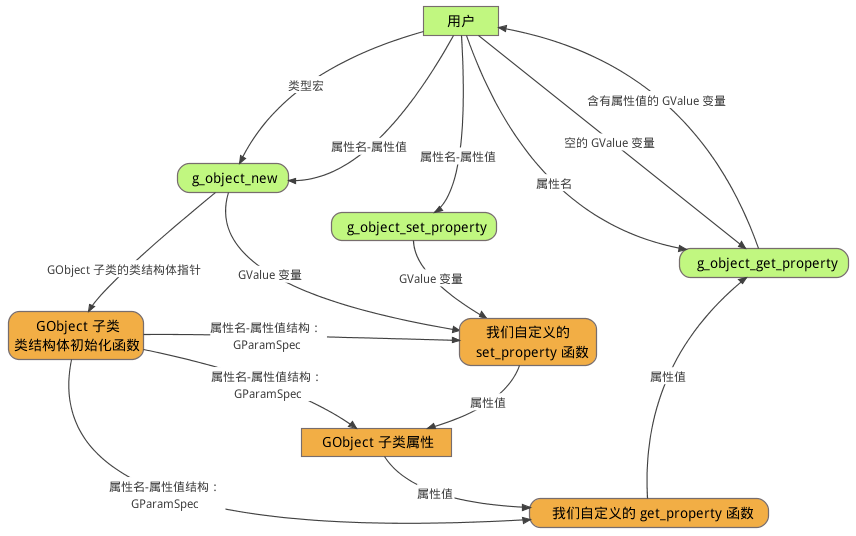
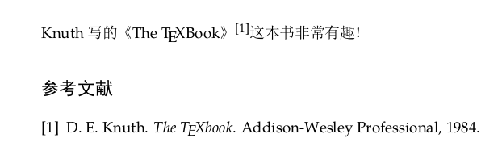

 
<!--BEGIN_DATA
{
    "create_date": "2019-02-01 16:40",
    "modify_date": "2019-02-01 16:40",
    "is_top": "0",
    "summary": "GObject 1",
    "tags": "C/C++",
    "file_name": "GObject_1.md"
}
END_DATA-->

####
原文出处：<a href='http://garfileo.is-programmer.com/2011/2/25/we-should-believe-gobject-is-useful-and-simple.24746.html' target='blank'>要相信 GObject 是有用并且简单的！</a>

去年，曾经用了 10 多天的时间学习了一番 GObject，当时疏于心得的总结，而现在已经忘记的差不多了。  
  
最近因为观察到 GtkGLExt 项目没有跟进 gtk+-3.0 的意思，便想自己动手，丰衣足食，要么去改造现有的 gtkglext 代码，要么另起炉灶。也许在自由/开源的世界中，期待是可耻的，只有动手才会幸福。但是，这与 GObject 有什么关系？  
  
在 GTK+ 的众多底层库中，GObject 与 GLib 是两块基石，在它们之上矗立着 Cairo、Pango、Clutter、GDK、ATK 等支柱，还有 GtkGLExt 这棵对我而言非常重要的小支柱，没有它我便不知道该如何在 GTK+ 中直接绘制 OpenGL 三维图形。事实上，除了 GtkGLExt 之外，还有 Cogl 可供选择，后者是对 OpenGL 进行抽象封装，主要是为了方便 Clutter 在其上层创造场景图结构。既然是封装，那么就需要容器，Cogl 所使用的容器便是 GObject。

也许你对 GTK+ 支持 OpenGL 的事情并不感兴趣，那么我们便将话题转回至 GObject，并提出这样一个问题：既然 GObject 如此重要，那么它究竟是做什么的？

简单的说，GObject 是一个程序库，它可以帮助我们使用 C 语言编写面向对象程序。

很多人被灌输了这样一种概念：要写面向对象程序，那么就需要学习一种面向对象编程语言，例如 C++、Java、C##等等，而 C 语言是用来编写结构化程序的。事实上，面向对象只是一种编程思想，不是一种编程语言。换句话说，面向对象是一种游戏规则，它不是游戏。GObject 告诉我们，使用 C 语言编写程序时，可以运用面向对象这种编程思想。

从宏观层面上来论证 GObject 与 C++、Java 之类的面向对象编程语言相比具备何种优越性，这是没有意义的。最优化理论中有一个 "没有免费的午餐"定理，大意是说没有一种方法可以适合于全部问题，应当选择合适的方法，并将它放在合适的地方使用。这个定理对于编程语言的选择与使用也有效，因为选择某种最合适的语言，本身就是一个最优化问题。

假如我们选择了 GObject，它最适合处理那些问题？

首先，与操作系统层面相距较近的程序设计，即系统程序设计，例如上文所列举的 GTK+ 及其支柱，使用 GObject 模拟的面向对象机制可以简化程序逻辑结构，同时还能保证程序的性能以及系统接口直接调用。最主要的是，系统程序员大都熟悉 C 语言，沟通较为方便。

其次，有时为了兼顾程序性能与开发效率，会对程序结构进行分层设计，底层模块采用 C 程序库实现，上层则使用动态语言或函数式语言实现，此时使用 GObject 除了可以简化底层模块的逻辑结构，还可以通过 GObject 与上层模块进行胶合。现在，GNOME 3 项目提供了 GObject Introspection 技术，专门用于处理 C + GObject 所实现的程序与上层动态语言或函数式语言的胶合问题 [1]。另外，GNOME 3 项目还实现了两种新的语言 Vala 和 Genie，前者语法类似 C#，后者语法类似 Python，使用它们所编写的程序源码，利用相应的编译器便可以生成 C + GObject 代码，进而可以编译为 C 程序[2, 3]。

那么 GObject 容易掌握么？我认为它应该很容易学习和使用，就像网络上许多人很轻易的诟病它非常繁琐难用一样容易。在打算掌握任何一种技术之前，如果不相信它是简单的，内心深处便会滋生一种逃避的意识。我们也可以例证，如果
GObject 真的很难理解和应用，怎么会存在那么多基于 GObject 实现的程序，难道那些程序的作者皆为天才抑或疯子？这种概率实在太小了。

事实上，GObject 是被人为的复杂化了。因为很多学习 GObject 的人，一上来就奔着要全面洞悉 GObject 的实现原理与细节，但是又缺乏足够的耐心和基础知识。如果换一个角度来考虑这个问题，作为初学者，在学习 C++、Java
之类的面向对象编程语言之时，我们有打算直接潜心理解这些语言的内部实现吗？我们大都是要从 Hello world 之类的示例起步的。对于 GObject
的学习也应当如此。

~ END ~

####
原文出处：<a href='http://garfileo.is-programmer.com/2011/2/27/the-analog-of-classed-type-based-gobject.24798.html' target='blank'>使用 GObject 库模拟类的数据封装形式</a>

[上一篇：要相信 GObject 是有用并且简单的！](http://garfileo.is-programmer.com/2011/2/25/we-should-believe-gobject-is-useful-and-simple.24746.html)

事实上，有关 GObject 库的学习与使用，GObject 库参考手册提供了一份简短且过于晦涩的指南。如果你能够理解它，那么完全可以无视这篇以及后续的几篇文章。倘若没有明白那份指南，那么建议最好能克制一下，先不要急于去做文档
[1] 中所列举那些探索，谨记 Knuth 所说的，过早优化是诸恶之源。

这篇文档主要讲述如何使用 GObject 库来模拟面向对象程序设计的最基本的要素，即基于类的数据封装，所采用的具体示例是一个双向链表的设计。

#####从一个双向链表的数据结构开始

对于双向链表这种数据结构，即便是 C 语言的初学者也不难创建一个名为 double-list.h 的头文件并写出以下代码：

    
    /* file name: double-list.h */
    #ifndef DOUBLE_LIST_H
    #define DOUBLE_LIST_H
    struct double_list_node {
            struct doule_list_node *prev;
            struct double_list_node *next;
            void *data;
    };
    struct double_list {
            struct double_list_node *head;
            struct double_list_node *tail;
    };
    #endif

较为熟悉 C 语言的人自然不屑于写出上面那种新手级别的代码，他们通常使用 typedef 关键字去定义数据类型，并且将 double\_list 简写为
dlist，以避免重复的去写  "struct double\_list\_xxxxx" 这样的代码，此外还使用了 Pascal 命名惯例，即单词首字母大写[2]，具体如下：
  
    
    /* file name: dlist.h（版本 2）*/
    #ifndef DLIST_H
    #define DLIST_H
    typedef struct _DListNode DListNode;
    struct  _DListNode {
            DListNode *prev;
            DListNode *next;
            void *data;
    };
    typedef struct _DList DList;
    struct  _DList {
            DListNode *head;
            DListNode *tail;
    };
    #endif

现在，代码看上去稍微专业了一点。

但是，由于 C 语言没有为数据类型提供自定义命名空间的功能，程序中所有的数据类型（包括函数）均处于同一个命名空间，这样数据类型便存在因为同名而撞车的可能性。为了避免这一问题，更专业一点的程序员会为数据类型名称添加一些前缀，并且通常会选择项目名称的缩写。我们可以为这种命名方式取一个名字，叫做 **PT 格式** ，P 是项目名称缩写，T 是数据类型的名称。例如，对于一个多面体建模（Polyhedron Modeling）的项目，如果要为这个项目定义一个双向链表的数据类型，通常是先将 dlist.h 文件名修改为 pm-dlist.h，将其内容改为：

    
    
    /* file name: pm-dlist.h*/
    #ifndef PM_DLIST_H
    #define PM_DLIST_H
    typedef struct _PMDListNode PMDListNode;
    struct  _PMDListNode {
            PMDListNode *prev;
            PMDListNode *next;
            void *data;
    };
    typedef struct _PMDList PMDList;
    struct  _PMDList {
            PMDListNode *head;
            PMDListNode *tail;
    };
    #endif

在以上一波三折的过程中，我们所做的工作就是仅仅是定义了两个结构体而已，一个是双向链表结点的结构体，另一个是双向链表的结构体，并且这两个结构体中分别包含了一组指针成员。这样的工作，用面向对象编程方法中的术语，叫做"数据封装"。借用《C++ Primer》中的定义，所谓 **数据封装，就是一种将低层次的元素组合起来，形成新的、高层次实体的技术**。对于上述代码而言，指针类型的变量属于低层次的元素，而它们所构成的结构体，则是高层次的实体。在面向对象程序设计中， **类** 是数据封装形式中的一等公民。

接下来，我们更进一步，使用 GObject 库模拟 **类** 的数据封装形式，如下：

    
    
    /* file name: pm-dlist.h*/
    #ifndef PM_DLIST_H
    #define PM_DLIST_H
    #include <glib-object.h>
    typedef struct _PMDListNode PMDListNode;
    struct  _PMDListNode {
            PMDListNode *prev;
            PMDListNode *next;
            void *data;
    };
    typedef struct _PMDList PMDList;
    struct  _PMDList {
            GObject parent_instance;
            PMDListNode *head;
            PMDListNode *tail;
    };
    typedef struct _PMDListClass PMDListClass;
    struct _PMDListClass {
            GObjectClass parent_class;
    };
    #endif

上述代码与 dlist.h 版本 2 中的代码相比，除去空行，多出 6 行代码，它们的作用是实现一个双向链表类。也许你会感觉这样很滑稽，特别当你特别熟悉
C++、Java、C##之类的语言之时。

但是，上述代码的确构成了一个 **类** 。在 GObject 世界里， **类** 是两个结构体的组合，一个是 **实例结构体** ，另一个是**类结构体** 。例如，PMDList 是实例结构体，PMDListClass 是类结构体，它们合起来便可以称为 **PMDList 类**（此处的"PMDList 类"只是一个称谓，并非是指 PMDList 实例结构体。下文将要谈及的"GObject 类"的理解与此类似）。

也许你会注意到， **PMDList 类** 的 **实例结构体** 的第一个成员是 GObject 结构体， **PMDList 类** 的**类结构体** 的第一个成员是 GObjectClass 结构体。其实，GObject 结构体与 GObjectClass 结构体分别是**GObject 类** 的 **实例结构体** 与 **类结构体** ，当它们分别作为 **PMDList 类** 的 **实例结构体** 与**类结构体** 的 **第一个成员** 时，这意味着 **PMDList 类** 继承自 **GObject 类** 。

也许你并不明白 GObject 为什么要将类拆解为实例结构体与类结构体，也不明白为什么将某个类的实例结构体与类结构体，分别置于另一个类的实例结构体与类结构体的成员之首便可实现类的继承，这些其实并不重要，至少是刚接触
GObject 时它们并不重要，应当像对待一个数学公式那样将它们记住。以后每当需要使用 C 语言来模拟类的封装形式时，只需要构建一个基类是 GObject
类的类即可。就像我们初学 C++ 那样，对于下面的代码，

    
    
    class PMDListNode {
    public:
            PMDListNode *prev;
            PMDListNode *next;
            void *data;
    }
    class PMDList : public GObject {
    public:
            PMDListNode *head;
            PMDListNode *tail;
    };

也许除了 C++ 编译器的开发者之外，没人会对为什么使用"class"关键字便可以将一个数据结构变成类，为什么使用一个冒号便可以实现 DList 类继承自
GObject 类，为什么使用 public 便可以将 DList 类的 head 与 tail 属性对外开放之类的问题感兴趣。

#####继承 GObject 类的好处

为什么 DList 类一定要将 GObject 类作为父类？主要是因为 GObject 类具有以下功能：

  * 基于引用计数的内存管理
  * 对象的构造函数与析构函数
  * 可设置对象属性的 set/get 函数
  * 易于使用的信号机制

现在即使并不明白上述功能的意义也无关紧要，这给予了我们对其各个击破的机会。

虽然，我们尚且不是很清楚继承 GObject 类的好处，但是不继承 GObject 类的坏处是显而易见的。在 cloverprince 所写的 11 篇文章[3]中，从第 2 篇到第 5 篇均展示了不使用 GObject 的坏处，虽然它们对理解 GObject 类的实现原理有很大帮助，但是对于 GObject 库的使用并无太多助益。

#####概念游戏

我承认，我到现在也不是很明白面向对象程序设计中的"类"、"对象"和"实例"这三者的关系。不过看到还有人同我一样没有搞明白[4]，心里便略微有些安慰，甚至觉得 C 语言不内建支持面向对象程序设计是一件值得庆幸的事情。暂时就按照文档[4]那样理解吧，对于上面所设计的 PMDList 类，可以用下面的代码模拟类的实例化与对象的实例化。

    
    
    PMDList *list; /* 类的实例化 */
    list = g_object_new (PM_TYPE_DLIST, NULL); /* 对象的实例化 */

也就是说，对于 PMDList 类，它的实例是一个对象，例如上述代码中的 list，而对象的实例化则是让这个对象成为计算机内存中的实体。

也许，对象的实例化比较令人费解，幸好，C 语言的表示会更加直观，例如：

    
    
    PMDList *dlist; /* 类的实例化，产生对象 */
    dlist = g_object_new (PM_TYPE_DLIST, NULL); /* 创建对象的一个实例 */
    g_object_unref (dlist); /* 销毁对象的一个实例 */
    dlist = g_object_new (PM_TYPE_DLIST, NULL); /* 再创建对象的一个实例 */

这里需要暂停，请回溯到上一节所说的让一个类继承 GObject 类的好处的前两条，即 GObject 类提供的" **基于引用计数的内存管理** "与"
**对象的构造函数与析构函数** "，此时体现于上例中的 g\_object\_new 与 g\_object\_unref 函数。

g\_object\_new 用于构建对象的实例，虽然其内部实现非常繁琐和复杂，但这是 GObject 库的开发者所要考虑的事情。我们只需要知道 g_object_new 可以为对象的实例分配内存与初始化，并且将实例的引用计数设为 1。

g\_object\_unref 用于将对象的实例的引用计数减 1，并检测对象的实例的引用计数是否为 0，若为 0，那么便释放对象的实例的存储空间。

现在，再回到上述代码的真正要表述的概念，那就是： **类的实例是对象，每个对象皆有可能存在多个实例** 。

下面，继续概念游戏，看下面的代码： 
    
    PMDList *list = g_object_new (PM_TYPE_DLIST, NULL);

这是类的实例化还是对象的实例化？自然是 **类的实例化的实例化**，感觉有点恶心，事实上这只不过是为某个数据类型动态分配了内存空间，然后用指针指向它！我们最好是不再对"对象"和"实例"进行区分，对象是实例，实例也是对象，只需要知道它们所指代的事物在同一时刻是相同的，除非有了量子计算机。

#####PM_TYPE_DLIST 引发的血案

上一节所使用的 g\_object\_new 函数的参数是 PM\_TYPE\_DLIST 和 NULL。对于 NULL，虽然我们不知道它的真实意义，但是至少知道它表示一个空指针，而那个 PM\_TYPE\_DLIST 是什么？

PM\_TYPE\_DLIST 是一个宏，需要在 pm-dlist.h 头文件中进行定义，于是最新版的 pm-dlist.h 内容如下：

    
    
    #ifndef PM_DLIST_H
    #define PM_DLIST_H
    #include <glib-object.h>
    #define PM_TYPE_DLIST (pm_dlist_get_type ())
    typedef struct _PMDListNode PMDListNode;
    struct  _PMDListNode {
            PMDListNode *prev;
            PMDListNode *next;
            void *data;
    };
    typedef struct _PMDList PMDList;
    struct  _PMDList {
            GObject parent_instance;
            PMDListNode *head;
            PMDListNode *tail;
    };
    typedef struct _PMDListClass PMDListClass;
    struct _PMDListClass {
            GObjectClass parent_class;
    };
    GType pm_dlist_get_type (void);
    #endif

嗯，与之前的 pm-dlist.h 相比，现在又多了两行代码：

    
    
    #define PM_TYPE_DLIST (pm_dlist_get_type ())
    GType pm_dlist_get_type (void);

显然，PM\_TYPE\_DLIST 这个宏是用来替代函数 pm\_dlist\_get\_type 的，该函数的返回值是 GType 类型。

我们将 PM\_TYPE\_DLIST 宏作为 g\_object\_new 函数第一个参数，这就意味着向 g\_object\_new 函数传递了一个看上去像是在获取数据类型的函数。不需要猜测，也不需要去阅读 g\_object\_new 函数的源代码，g\_object\_new 之所以能够为我们进行对象的实例化，那么它必然要知道对象对应的 **类的数据结构** ，pm\_dlist\_get\_type 函数的作用就是告诉它有关 PMDList 类的具体结构。

现在既然知道了 PM\_TYPE\_DLIST 及其代表的函数 pm\_dlist\_get\_type，那么 pm\_dlist\_get\_type 具体该如何实现？很简单，只需要再建立一个 pm-dlist.c 文件，内容如下：

    
    
    #include "pm-dlist.h"
    G_DEFINE_TYPE (PMDList, pm_dlist, G_TYPE_OBJECT);
    static
    void pm_dlist_init (PMDList *self)
    {
            g_printf ("\t实例结构体初始化！\n");
            self->head = NULL;
            self->tail = NULL;
    }
    static
    void pm_dlist_class_init (PMDListClass *klass)
    {
            g_printf ("类结构体初始化!\n");
    }
    

这样，在源代码文件的层次上，pm-dlist.h 文件存放这 PMDList 类的声明，pm-dlist.c 文件存放的是 PMDList 类的具体实现。

在上述的 pm-dlist.c 中，我们并没有看到 pm\_dlist\_get\_type 函数的具体实现，这是因为 GObject 库所提供的 G\_DEFINE\_TYPE 宏可以为我们生成 pm\_dlist\_get\_type 函数的实现代码。

G\_DEFINE\_TYPE 宏，顾名思义，它可以帮助我们最终实现 **类** 类型的定义。对于上例，

    
    
    G_DEFINE_TYPE (PMDList, pm_dlist, G_TYPE_OBJECT);

G_DEFINE_TYPE 可以让 GObject 库的数据类型系统能够识别我们所定义的 **PMDList 类** 类型，它接受三个参数，第一个参数是类名，即 PMDList；第二个参数则是类的成员函数（面向对象术语称之为"方法"或"行为"）名称的前缀，例如 pm\_dlist\_get\_type 函数即为 PMDList 类的一个成员函数，"pm\_dlist" 是它的前缀；第三个参数则指明 **PMDList类** 类型的父类型为 G\_TYPE\_OBJECT……嗯，这又是一个该死的宏！

也许你会注意到， **PMDList 类** 类型的父类型 G\_TYPE\_OBJECT 与前面所定义的宏 PM\_TYPE\_DLIST 非常相像。的确是这样，G\_TYPE\_OBJECT 指代 g\_object\_get\_type 函数。

为了便于描述，我们可以将 PMDList 类和 GObject 类这种形式的 **类** 类型统称为 **PT 类** 类型，将 pm\_dlist\_get\_type 和 g\_object\_get\_type 这种形式的函数统称为 p\_t\_get\_type 函数，并将 PM\_TYPE\_DLIST 和 G\_TYPE\_OBJECT 这样的宏统称为 P\_TYPE\_T 宏。当然，这种格式的函数名与宏名，只是一种约定。

若想让 GObject 库能够识别你所定义的数据类型，那么必须要提供一个 p\_t\_get\_type 这样的函数。虽然你不见得非要使用 p\_t\_get\_type 这样的函数命名形式，但是必须提供一个具备同样功能的函数。p\_t\_get\_type 函数的作用是向 GObject 库所提供的类型管理系统提供要注册的 **PT 类** 类型的相关信息，其中包含 **PT 类** 类型的 **实例结构体初始化函数** p\_t\_init 与 **类结构体初始化函数** p\_t\_class\_init，例如上例中的 pm\_list\_init 与 pm\_list\_class\_init。

因为 p\_t\_get\_type 函数是 g\_object\_new 函数的参数，当我们 首次调用 g\_object\_new 函数进行对象实例化时，p\_t\_get\_type 函数便会被 g\_object\_new 函数调用，从而引发 GObject 库的类型管理系统去接受 **PT类** 类型（例如 PMDList 类型）的申请并为其分配一个类型标识码作为 p\_t\_get\_type 函数的返回值。当 g\_object\_new 函数从 p\_t\_get\_type 函数那里获取 **PT 类** 类型标识码之后，便可以进行对象实例的内存分配及属性的初始化。

#####将一切放在一起

这篇文章居然出乎意料的长，原本没打算涉及任何细节，结果有些忍不住。不过，倘若你顺利的阅读到这里，便已经掌握了如何使用 GObject 库在 C 语言程序中模拟面向对象程序设计中基于类的数据封装，并且我们完成了一个双向链表类 PMDList 的数据封装。

为了验证 PMDList 类是否可用，可以再建立一份 main.c 文件进行测试，内容如下：

    
    
    #include "pm-dlist.h"
    int
    main (void)
    {
            /* GObject 库的类型管理系统的初始化 */
            g_type_init ();
            int i;
            PMDList *list;
            /* 进行三次对象实例化 */
            for (i = 0; i < 3; i++){
                    list = g_object_new (PM_TYPE_DLIST, NULL);
                    g_object_unref (list);
            }
            /* 检查实例是否为 GObject 对象 */
            list = g_object_new (PM_TYPE_DLIST, NULL);
            if (G_IS_OBJECT (list))
                    g_printf ("\t这个实例是一个 GObject 对象！\n");
            return 0;
    }
    

编译上述测试程序的命令为：

    
    
    $ gcc $(pkg-config --cflags --libs gobject-2.0) pmd-dlist.c main.c -o test

测试程序的运行结果如下：

    
    
    $ ./test
    类结构体初始化!
    	实例结构体初始化！
    	实例结构体初始化！
    	实例结构体初始化！
    	实例结构体初始化！
    	这个实例是一个 GObject 对象！

从输出结果可以看出，PMDList 类的类结构体初始化函数只被调用了一次，而实例结构体的初始化函数的调用次数等于对象实例化的次数。这意味着，**所有实例共享的数据，可保存在类结构体中，而所有对象私有的数据，则保存在实例结构体中** 。

上述的 main 函数中，在使用 GObject 库的任何功能之前，必须先调用 g\_type\_init 函数初始化 GObject 库的类型管理系统，否则程序可能会出错。

main 函数中还使用了 G\_IS\_OBJECT 宏，来检测 list 对象是否为 G\_TYPE\_OBJECT 类型的对象：

    
    
    G_IS_OBJECT (list)

因为 PMDList 类继承自 GObject 类，那么一个 PMDList 对象自然是一个 G_TYPE_OBJECT 类型的对象。

#####总结

也许我讲的很明白，也许我一点都没有讲明白。但是使用 GObject 库模拟基于类的数据封装，或者用专业术语来说，即 **GObject 类** 类型的 **子类化** ，念起来比较拗口，便干脆简称 **GObject 子类化** ，其过程只需要以下四步：

  1. 在 .h 文件中包含 glib-object.h；
  2. 在 .h 文件中构建实例结构体与类结构体，并分别将 GObject 类的实例结构体与类结构体置于成员之首；
  3. 在 .h 文件中定义 P_TYPE_T 宏，并声明 p_t_get_type 函数；
  4. 在 .c 文件中调用 G_DEFINE_TYPE 宏产生类型注册代码。

也许让我们感到晕眩的，是那些命名约定。但是，从工程的角度来说，GObject 库所使用的命名风格是合理的，值得 C 程序员借鉴。

~ End ~

####
原文出处：<a href='http://garfileo.is-programmer.com/2011/2/28/data-hiden.24848.html' target='blank'>GObject 子类对象的私有属性模拟</a>

上一篇文章 "[使用 GObject 库模拟类的数据封装形式](../../../posts/24798.html)"讲述了 GObject 子类化过程，本文以其为基础，进一步讲述如何对数据进行隐藏，即对面向对象程序设计中的"私有属性"概念进行模拟。

#####非类类型数据的隐藏

第一个问题，可以称之为非类类型数据结构的隐藏，因为 PMDListNode 是普通的 C 结构体。隐藏这个结构体成员的方法有多种。

第一种方法尤为简单，如下：

    
    
    typedef struct _PMDListNode PMDListNode;
    struct  _PMDListNode {
    /* private */
            PMDListNode *prev;
            PMDListNode *next;
    /* public */
            void *data;
    };

只需要向结构体中添加一条注释，用于标明哪些成员是私有的，哪些是可以被直接访问的。

也许你会认为这是开玩笑呢吧！但，这是最符合 C 语言设计理念的做法。 **C 语言认为，程序员应当知道自己正在干什么，而且保证自己的所作所为是正确的** 。

倘若你真的这么认为这是在开玩笑，那也没什么。我们还可以使用第二种隐藏的方法，即在 pm-dlist.h 文件中保留下面代码：

    
    
    typedef struct _PMDListNode PMDListNode;

并将以下代码：

    
    
    struct  _PMDListNode {
            PMDListNode *prev;
            PMDListNode *next;
            void *data;
    };

转移到 pm-dlist.c 文件中。

这下隐藏的非常彻底。当然，这并不能防止用户打开 pm-dlist.c 文件查看 PMDListNode 的定义。不过，我们是自由软件，不怕你看。

如果想半遮半掩，稍微麻烦一些。可以在 pm-dlist.h 中写入以下代码：

    
    
    typedef struct _PMDListPriv PMDListPriv;
    typedef struct _PMDListNode PmdListNode;
    struct _PMDListNode {
            PMDListPriv priv;
            void *data;
    };
    

然后，将 PMDListPriv 的定义放在 pm-dlist.c 文件中，如下：

    
    
    struct _PMDListPriv {
            PMDListNode *prev;
            PMDListNode *next;
    };

#####GObject 子类对象的属性隐藏

GObject 子类对象的属性即继承 GObject 类的类的实例结构体所包含的属性，这句话说起来还真拗口。

考虑一下如何隐藏 PMDList 类的实例结构体中的成员。先回忆一下这个结构体的定义：

    
    
    typedef struct _PMDList PMDList;
    struct  _PMDList {
            GObject parent_instance;
            PMDListNode *head;
            PMDListNode *tail;
    };

我们希望 head 与 tail 指针不容他人窥视，虽然可以使用上一节的方式进行数据隐藏，但是 GObject 库为 GObject 子类提供了一种私有结构体的机制，基于它也可以实现数据隐藏，而且更像是隐藏。

首先，我们将 pm-dlist.h 中 PMDList 结构体的定义修改为：

    
    
    typedef struct _PMDList PMDList;
    struct  _PMDList {
            GObject parent_instance;
    };

然后，在 pm-dlist.c 文件中，定义一个结构体：

    
    
    typedef struct _PMDListPrivate PMDListPrivate;
    struct  _PMDListPrivate {
            PMDListNode *head;
            PMDListNode *tail;
    };

再在 dm-dlist.c 中定义一个宏：

    
    
    #define PM_DLIST_GET_PRIVATE(obj) (\
    		G_TYPE_INSTANCE_GET_PRIVATE ((obj), PM_TYPE_DLIST, PMDListPrivate))
    

这个宏可以帮助我们从对象中获取所隐藏的私有属性。例如，在 PMDList 类的实例结构体初始化函数中，使用 PM\_DLIST\_GET\_PRIVATE 宏获取
PMDList 对象的 head 与 tail 指针，如下：

    
    
    static void
    pm_dlist_init (PMDList *self)
    {
            PMDListPrivate *priv = PM_DLIST_GET_PRIVATE (self);
            priv->head = NULL;
            priv->tail = NULL;
    }
    

但是，那个 PMDListPrivate 结构体是怎样被添加到 PMDList 对象中的呢？答案存在于 PMDList 类的类结构体初始化函数之中，如下：

    
    
    static void
    pm_dlist_class_init (PMDListClass *class)
    {
            g_type_class_add_private (klass, sizeof (PMDListPrivate));
    }
    

由 于 pm\_dlist\_class\_init 函数会先于 pm\_dlist\_init 函数被 g\_object\_new 函数调用，GObject 库的类型管理系统可以从 pm\_dlist\_class\_init 函数中获知 PMDListPrivate 结构体所占用的存储空间，从而 g\_object\_new 函数在为 PMDList 对象的实例分配存储空间时，便会多分出一部分以容纳 PMDListPrivate 结构体，这样便相当于将一个 PMDListPrivate 结构体挂到 PMDList 对象之中。

GObject 库对私有属性所占用的存储空间是由限制的。一个 GObject 子类对象，它的私有属性及其父类对象的私有属性累加起来不能超过 64 KB。

#####将一切放到一起

将本文的示例代码综合到一起，便可以得到数据隐藏方法的全貌。

完整的 pm-dlist.h 文件，内容如下：

    
    
    #ifndef PM_DLIST_H
    #define PM_DLIST_H
    #include <glib-object.h>
    #define PM_TYPE_DLIST (pm_dlist_get_type ())
    typedef struct _PMDList PMDList;
    struct  _PMDList {
            GObject parent_instance;
    };
    typedef struct _PMDListClass PMDListClass;
    struct _PMDListClass {
            GObjectClass parent_class;
    };
    GType pm_dlist_get_type (void);
    #endif

完整的 pm-dlist.c 文件，内容如下：

    
    
    #include "pm-dlist.h"
    G_DEFINE_TYPE (PMDList, pm_dlist, G_TYPE_OBJECT);
    #define PM_DLIST_GET_PRIVATE(obj) (\
    		G_TYPE_INSTANCE_GET_PRIVATE ((obj), PM_TYPE_DLIST, PMDListPrivate))
    typedef struct _PMDListNode PMDListNode;
    struct  _PMDListNode {
            PMDListNode *prev;
            PMDListNode *next;
            void *data;
    };
    typedef struct _PMDListPrivate PMDListPrivate;
    struct  _PMDListPrivate {
            PMDListNode *head;
            PMDListNode *tail;
    };
    static void
    pm_dlist_class_init (PMDListClass *klass)
    {
            g_type_class_add_private (klass, sizeof (PMDListPrivate));
    }
    static void
    pm_dlist_init (PMDList *self)
    {
            PMDListPrivate *priv = PM_DLIST_GET_PRIVATE (self);
            priv->head = NULL;
            priv->tail = NULL;
    }

测试源代码文件 main.c 内容如下：

    
    
    #include "pm-dlist.h"
    int
    main (void)
    {
            /* GObject 库的类型管理系统的初始化 */
            g_type_init ();
            PMDList *list;
            list = g_object_new (PM_TYPE_DLIST, NULL);
            g_object_unref (list);
            return 0;
    }

#####总结

从上述各源文件来看，经过数据隐藏处理之后，pm-dlist.h 被简化，pm-dlist.c 变得更复杂。

事实上，PMDList 类实现完毕后，第三方（即类的使用者）如果要使用这个类，那么他面对的只是 pm-dlist.h 文件，因此一个简洁的 pm-
dlist.h 是他最希望看到的。

pm-dlist.c 变得更加复杂，但是这并不是坏事情。因为我们已经尽力将细节隐藏在类的实现部分，而且这部分代码通常也是第三方并不关注的。

这就是数据隐藏的意义。

####
原文出处：<a href='http://garfileo.is-programmer.com/2011/3/4/accessing-properties-of-gobject-subclass.24952.html' target='blank'>GObject 子类私有属性的外部访问</a>

之前，写了一篇 GObject 劝学的文章  [1]，还有两篇有关 GObject 子类对象数据封装的文章 [2, 3]。

虽然，创建一个 GObject 子类对象需要一些辅助函数和宏的支持，并且它们的内幕也令人费解，但是只要将足够的信任交托给 GObject 开发者，将那些辅助函数和宏当作"语法"糖一样享用，一切还是挺简单的。至于细节，还是等较为全面的掌握 GObject 库的用法之后再去挖掘！

现在，我们基本上知道了如何将数据封装并藏匿于 GObject 子类的实例结构体中。本文打算再向前走一步，关注如何实现在外部比较安全的访问（读写）这些数据。

#####简单的做法

像下面这样的双向链表数据结构：

    
    
    typedef struct _PMDListNode PMDListNode;
    struct _PMDListNode {
            PMDListNode *prev;
            PMDListNode *next;
    };
    typedef struct _PMDList PMDList;
    struct _PMDList {
            PMDListNode *head;
            PMDListNode *tail;
    };

现在，我们希望能够安全访问 PMDList 结构题的两个成员，即链表的首结点指针 head 和尾结点指针 tail，以便进行一些操作，例如将两个双向链表 list1 和 list2 链接到一起。

所谓安全访问，意味着不要像下面这样简单粗暴：

    
    
    /* 将 list1 与 list2 链接在一起 */
    list1->tail->next = list2->head;
    list2->head->prev = list1->tail;

而应当委婉一些：

    
    
    PMDListNode *list1_tail, *list2_head;
    list1_tail = pm_dlist_get (list1, TAIL);
    list2_head = pm_dlist_get (list2, HEAD);
    pm_dlist_set (list1, TAIL, NEXT, list2_head);
    pm_dlist_set (list2, HEAD, PREV, list1_tail);

这样委婉的访问，有什么好处？答案很简单，可以将数据的变化与程序的功能隔离开，数据的变化不影响程序的功能。

试想，如果有一天，上述 PMDList 结构体的设计者使用 GObject 子类化的方法将双向链表定义为建 PMDList 类的形式，并且将链表的首结点指针
head 与尾结点都隐匿起来，那么上述的那个简单粗暴的数据访问方法便失效了。更糟糕的是，PMDList 类的设计者明知道很多人会受到这种数据变化的影响，对此也毫无办法。

如果 PMDList 结构体的设计者提供了 pm\_dlist\_set 与 pm\_dlist\_get 函数，那么即便设计者基于 GObject 子类化的方式定义了 PMDList 类，他只需要修改 pm\_dlist\_set 和 pm\_dlist\_get 函数，便可以让上述那种委婉方式访问 PMDList 结构体成员的代码不会受到任何影响。

既然 pm\_dlist\_set 与 pm\_dlist\_get 函数这样有用，我们可以像下面这样实现它们。

    
    
    typedef enum _PM_DLIST_PROPERTY PM_DLIST_PROPERTY
    enum _PM_DLIST_PROPERTY {
            PM_DLIST_HEAD,
            PM_DLIST_TAIL,
            PM_DLIST_NODE_PREV,
            PM_DLIST_NODE_NEXT
    };
    PMDListNode *
    pm_dlist_get (PMDList *self, PM_DLIST_PROPERTY property)
    {
            PMDListNode *node = NULL;
            switch (property) {
            case PM_DLIST_HEAD:
                    node = self->head;
                    break;
            case PM_DLIST_TAIL:
                    node = self->tail;
                    break;
            default:
                    g_print ("对不起，你访问的成员不存在!\n");
            }
            return node;
    }
    void 
    pm_dlist_set (PMDList *self, 
                  PM_DLIST_PROPERTY property,
                  PM_DLIST_PROPERTY subproperty,
                  PMDListNode *node)
    {
            switch (property) {
            case PM_DLIST_HEAD:
                    if (subproperty == PM_DLIST_NODE_PREV)
                            self->head->prev = node;
                    else if (subproperty == PM_DLIST_NODE_NEXT)
                            self->head->next = node;
                    break;
            case PM_DLIST_TAIL:
                    if (subproperty == PM_DLIST_NODE_PREV)
                            self->tail->prev = node;
                    else if (subproperty == PM_DLIST_NODE_NEXT)
                            self->tail->next = node;
                    break;
            default:
                    g_print ("对不起，你访问的成员不存在!\n");
            }
    }

事实上，上述代码所实现的功能仅仅是实现下面这 6 种赋值运算：

    
    
    PMDList *list;
    list->head->prev = aaaa;
    list->head->next = bbbb;
    list->tail->prev = cccc;
    list->tail->next = dddd;
    node = list->head;
    node = list->tail;

对于区区一个链表的最原始形态的属性访问模拟便已如此，那些内建支持面向对象的编程语言、动态编程语言以及函数编程语言，它们所提供的语法越高级，那么它们等价的 C 代码量便会越庞大。

如果你所解决的问题，需要很多层的数据抽象，如果使用 C 语言的话，就不得不写很多的模拟代码。倘若这些模拟代码在你全部代码所占的比重超过了你的容忍限度，可以考虑换一种更合适的编程语言。当然，你不可能是先用 C 写完代码后，再去评估那部分模拟代码所占的比重，但是这并不妨碍你凭借现有的经验去粗略估计。

我将 gtk+ 作为使用 C 语言应用的典范，gtk+ 3.0 的全部代码大约 515500 行，而 GObject 的代码大概 20000 行，其所占比重大约为 4%，这其中还不算 GTK+ 的那些基于 GObject 的底层库的代码量。我觉得 GTK+ 开发者使用 GObject 实现足够的面向对象支持，是比较划算的。

#####那个很二的参数

回顾一下文档 [2] 和 [3] 中出现过的 g\_object\_new 函数的参数：

    
    
    PMDList *list = g_object_new (PM_TYPE_DLIST, NULL);

该函数第一个参数 PM\_TYPE\_DLIST 的含义在文档 [2] 中已有较为详细的解释，而第二个参数的含义一直被故意的忽略，现在才是分析它的最好时机。事实上，g\_object\_new 接受的是可变参数[4]，第二个参数后面，还可以有第三个、第四个...理论上的无穷个。这些参数的作用可以用下面的代码来表现：

    
    
    PMDList *list = g_object_new (PM_TYPE_DLIST,
                                  "head", NULL,
                                  "tail", NULL,
                                  NULL);

如果采用这种方式调用 g\_object\_new 函数，意味着在文档 [3] 中的 dlist.c 文件中，不需要再在 PMDList 类的实例结构体初始化函数 pm\_dlist\_init 中对链表首结点和尾结点指针进行赋值了，即 pm\_dlist\_init 函数：

    
    
    static void 
    pm_dlist_init (PMDList *self)
    {
            PMDListPrivate *priv = PM_DLIST_GET_PRIVATE (self);
            priv->head = NULL;
            priv->tail = NULL;
    }

可以为空：

    
    
    static void 
    pm_dlist_init (PMDList *self)
    { 
    }

换句话说，就是你在使用 g\_object\_new 函数进行对象实例化的过程中，可直接通过 g\_object\_new 函数的输入参数去初始化对象的属性，这是通过" **属性名-属性值** "参数来实现的，即 g\_object\_new 的第二个参数为属性名，第三个参数为属性值，它们在 g\_object\_new 内部会被合成为"属性名-属性值"结构；同理，第四个参数与第五个参数也可以形成"属性名-属性值"结构，依次类推，当属性名参数为 NULL 时，g\_object\_new 会认为"属性名：属性值"结构序列结束。上面示例中的g\_object\_new 可形成 2 个"参数名：参数值"结构：

    
    
    "head" : NULL
    "tail" : NULL

g\_object\_new 函数会根据属性名匹配对象的相应属性，并将属性值赋予该属性，但是这需要 PMDList 类的设计者去实现一部分比较丑陋的代码。

#####将丑陋封锁在内部

要想实现上一节所讲述的让 g\_object\_new 函数中通过"属性名-属性值"结构为 GObject 子类对象的属性进行初始化，我们需要完成以下工作：

  1. 实现 p\_t\_set\_property 与 p\_t\_get\_property 函数，让它们来完成 g\_object\_new 函数的"属性名-属性值"结构向 GObject 子类属性的映射。
  2. 在GObject 子类的类结构体初始化函数中，让 GObject 类（基类）的两个函数指针 set\_property 与 get\_property 分别指向 p\_t\_set\_property 与 p\_t\_get\_property 函数。
  3. 在 GObject 子类的类结构体初始化函数中，为 GObject 子类安装属性。

前两个步骤，可以理解为 GObject 的两个虚函数的实现。第三个步骤，可以视为为比文档 [3] 中 GObject 子类私有属性更高级一些的模拟。

现在，开始动手吧。

首先，pm\_dlist\_set\_property 和 pm\_dlist\_get\_property 函数，可以像下面这样实现：

    
    
    static void
    pm_dlist_set_property (GObject *object, guint property_id,
                           const GValue *value, GParamSpec *pspec)
    {
            PMDList *self = PM_DLIST (object);
            PMDListPrivate *priv = PM_DLIST_GET_PRIVATE (self);
            switch (property_id) {
            case PROPERTY_DLIST_HEAD:
                    priv->head = g_value_get_pointer (value);
                    break;
            case PROPERTY_DLIST_HEAD_PREV:
                    priv->head->prev = g_value_get_pointer (value);
                    break;
            case PROPERTY_DLIST_HEAD_NEXT:
                    priv->head->next = g_value_get_pointer (value);
                    break;
            case PROPERTY_DLIST_TAIL:
                    priv->tail = g_value_get_pointer (value);
                    break;
            case PROPERTY_DLIST_TAIL_PREV:
                    priv->tail->prev = g_value_get_pointer (value);
                    break;
            case PROPERTY_DLIST_TAIL_NEXT:
                    priv->tail->next = g_value_get_pointer (value);
                    break;
            default:
                    G_OBJECT_WARN_INVALID_PROPERTY_ID (object, property_id, pspec);
                    break;
            }
    }
    static void
    pm_dlist_get_property (GObject *object, guint property_id,
                           GValue *value, GParamSpec *pspec)
    {
            PMDList *self = PM_DLIST (object);
            PMDListPrivate *priv = PM_DLIST_GET_PRIVATE (self);
            switch (property_id) {
            case PROPERTY_DLIST_HEAD:
                    g_value_set_pointer (value, priv->head);
                    break;
            case PROPERTY_DLIST_HEAD_PREV:
                    g_value_set_pointer (value, priv->head->prev);
                    break;
            case PROPERTY_DLIST_HEAD_NEXT:
                    g_value_set_pointer (value, priv->head->next);
                    break;
            case PROPERTY_DLIST_TAIL:
                    g_value_set_pointer (value, priv->tail);
                    break;
            case PROPERTY_DLIST_TAIL_PREV:
                    g_value_set_pointer (value, priv->tail->prev);
                    break;
            case PROPERTY_DLIST_TAIL_NEXT:
                    g_value_set_pointer (value, priv->tail->next);
                    break;
            default:
                    G_OBJECT_WARN_INVALID_PROPERTY_ID (object, property_id, pspec);
                    break;
            }
    }

哇，代码很多！但是请不要恐惧，因为所有 GObject 子类属性的 set 与 get
函数的实现，思路上均与上述代码相似。要理解这些代码，只需注意以下几点：

  * PM_DLIST (object) 宏的作用是将一个基类指针类型转换为 PMDList 类的指针类型，它需要 GObject 子类的设计者提供，我们可以将其定义为：  

    
    
    	#define PM_DLIST(object) \
            G_TYPE_CHECK_INSTANCE_CAST ((object), PM_TYPE_DLIST, PMDList)) 

  * PROPERTY\_DLIST\_XXXX 宏，可以采用枚举类型实现。
  * GValue 类型是一个变量容器，可用于存放各种变量的值，例如整型数、指针、GObject 子类等等，上述代码主要用 GValue 存放指针变量的值。
  * GParamSpec 类型是比 GValue 高级一点的变量容器，它不仅可以存放各种变量的值，还能为这些值命名，因此它比较适合用于表示 g_object_new 函数的"属性名-属性值"结构。不过，在上述代码中，GParamSpec 类型只是昙花一现，没关系，反正下文它还会出现。

在理解了上述代码之后，我们继续前进，迈入 PMDList 类的类结构体初始化函数，首先要覆盖 GObject 类的两个函数指针：

    
    
    static void
    pm_dlist_class_init (PMDListClass *klass)
    {
            /* 对象私有属性的安装，详见文档 [3] */
            g_type_class_add_private (klass, sizeof (PMDListPrivate));
            GObjectClass *base_class = G_OBJECT_CLASS (klass);
            base_class->set_property = pm_dlist_set_property;
            base_class->get_property = pm_dlist_get_property;
    /* 未完，下文待续 */
    

set\_property 和 get\_property 是两个函数指针，它们位于 GObject 类的类结构体中。如果你看过文档 [2]，也许你还记得 GObject 库中，类是由实例结构体与类结构体构成的。对象的属性，应当存储在实例结构体中，而所有对象共享的数据，应当存储于类结构体中。因此，set\_property 和
get\_property 是两个函数指针可以被 GObject 类及其子类的所有对象共享，并且各个对象都可以让这两个函数指针指向它所期望的函数。

类似的机制，在 C++ 中被称为"虚函数"，主要用于实现多态。不过，即便你不知道虚函数与多态是什么东西，这也无所谓，你只需要知道 PMDList 类从它的父类----GObject 类中继承了 2 个函数指针，在 PMDList 类的类结构体初始化函数中，将这 2 个函数指针指向了前文中定义的 pm\_dlist\_set\_property 与 pm\_dlist\_get\_property 函数，这些就足够了。

接下来，就是向 PMDList 类安装属性，紧接上面的代码：

    
    
    /* 接前文尚未完成的 pm_dlist_class_init 函数 */
            GParamSpec *pspec;
            pspec = g_param_spec_pointer ("head",
                                          "Head node",
                                          "The head node of the double list",
                                          G_PARAM_READABLE | G_PARAM_WRITABLE | G_PARAM_CONSTRUCT);
            g_object_class_install_property (base_class, PROPERTY_DLIST_HEAD, pspec);
    /* 未完，下文待续 */
    

在 pm\_dlist\_set\_property 与 pm\_dlist\_get\_property 函数中昙花一现的 GParamSpec 类型终于又出现了。我知道，它看起来似乎很恐怖，但是它所作的事情却很简单，就是对一个键值对打包成一个数据结构，然后将之安装到相应的 GObject 子类中。

g\_param\_spec\_pointer 函数，可以将"属性名：属性值"参数打包为 GParamSpec 类型的变量，该函数的第一个参数用于设定键名，第二个参数是键名的昵称，第三个参数是对这个键值对的详细描述，第四个参数用于表示键值的访问权限，G\_PARAM_READABLE | G\_PARAM\_WRITABLE 是指定属性即可读又可写，G\_PARAM\_CONSTRUCT 是设定属性可以在对象示例化之时被设置。

g\_object\_class\_install\_property 函数用于将 GParamSpec 类型变量所包含的数据插入到 GObject 子类中，其中的细节可以忽略，只需要知道该函数的第一个参数为 GObject 子类的类结构体，第二个参数是 GParamSpec 对应的属性 ID。GObject 子类的属性 ID 在前文已经提及，它是 GObject 子类设计者定义的宏或枚举类型。第三个参数是要安装值向 GObject 子类中的
GParamSpec 类型的变量指针。

但是， **一定要注意，g\_object\_class\_install\_property 函数的第二个参数值不能为 0** 。在使用枚举类型来定义 ID 时，为了避免 0 的使用，一个比较笨的技巧就是像下面这样设计一个枚举类型：

    
    
    enum PropertyDList {
            PROPERTY_DLIST_0,
            PROPERTY_DLIST_HEAD,
            PROPERTY_DLIST_HEAD_PREV,
            PROPERTY_DLIST_HEAD_NEXT,
            PROPERTY_DLIST_TAIL,
            PROPERTY_DLIST_TAIL_PREV,
            PROPERTY_DLIST_TAIL_NEXT
    };

其中的 PROPERTY\_DLIST\_0，只是占位符，它不被使用。

按照上面的属性的安装方式，我们可以陆续写处其它属性的安装代码，即 pm\_dlist\_class\_init 函数的剩余部分：

    
    
    /* 接前文尚未完成的 pm_dlist_class_init 函数 */
            pspec = g_param_spec_pointer ("head-prev",
                                          "The previous node of the head node",
                                          "The previous node of the head node of the double list",
                                          G_PARAM_READABLE | G_PARAM_WRITABLE);
            g_object_class_install_property (base_class, PROPERTY_DLIST_HEAD_PREV, pspec);
            pspec = g_param_spec_pointer ("head-next",
                                          "The next node of the head node",
                                          "The next node of the head node of the double list",
                                          G_PARAM_READABLE | G_PARAM_WRITABLE);
            g_object_class_install_property (base_class, PROPERTY_DLIST_HEAD_NEXT, pspec);
            pspec = g_param_spec_pointer ("tail",
                                          "Tail node",
                                          "The tail node of the double list",
                                          G_PARAM_READABLE | G_PARAM_WRITABLE | G_PARAM_CONSTRUCT);
            g_object_class_install_property (base_class, PROPERTY_DLIST_TAIL, pspec);
            pspec = g_param_spec_pointer ("tail-prev",
                                          "The previous node of the tail node",
                                          "The previous node of the tail node of the double list",
                                          G_PARAM_READABLE | G_PARAM_WRITABLE);
            g_object_class_install_property (base_class, PROPERTY_DLIST_TAIL_PREV, pspec);
            pspec = g_param_spec_pointer ("tail-next",
                                          "The next node of the tail node",
                                          "The next node of the tail node of the double list",
                                          G_PARAM_READABLE | G_PARAM_WRITABLE);
            g_object_class_install_property (base_class, PROPERTY_DLIST_TAIL_NEXT, pspec);
    }
    

这些代码又冗余又无趣，但是并不难理解。

#####将简洁留给外部

对于上一节所实现的 PMDList 类，可以采用下面的代码在对象实例化时便进行属性的初始化，即将链表的首结点和尾节点指针设为 NULL：

    
    
    PMDList *list = g_object_new (PM_TYPE_DLIST,
                                  "head", NULL,
                                  "tail", NULL,
                                  NULL); /* 要记得键值对参数之后，要以 NULL 收尾 */
    

也可以调用 g\_object\_get\_property 函数获取 PMDList 类的实例属性，例如获取链表 list 的首结点指针：

    
    
    GValue val = { 0, };
    g_value_init(val,G_TYPE_POINTER);
    g_object_get_property(G_OBJECT(list),"head",val);
    g_value_unset (val);
    

也可以调用 g\_object\_set\_property 函数设置 PMDList 类的实例属性，例如将链表 list1 的尾结点指针所指向的结点地址赋给链表 list2 的首结点的前驱结点指针：

    
    
    GValue val = {0};
    g_value_init (val,G_TYPE_POINTER);
    g_object_get_property (G_OBJECT(list1), "tail", val);
    g_object_set_property (G_OBJECT(list2), "head-prev", val);
    g_value_unset (val);
    

如果我们要解决本文开始时的那个 list1 与 list2 链接的问题，可以这样：

    
    
    GValue list1_tail = {0};
    GValue list2_head = {0};
    g_value_init (&list1_tail, G_TYPE_POINTER);
    g_value_init (&list2_head, G_TYPE_POINTER);
    g_object_get_property (G_OBJECT(list1), "tail", &list1_tail);
    g_object_set_property (G_OBJECT(list2), "head-prev", &list1_tail);
    g_object_get_property (G_OBJECT(list2), "head", &list2_head);
    g_object_set_property (G_OBJECT(list1), "tail-next", &list2_head);
    g_value_unset (&list2_head);
    g_value_unset (&list1_tail);
    

看上去还不错。当然，前提是你需要了解一下 GValue 容器的用法，并且上述代码已经展示了它的基本用法，但是最好还是阅读文档 [5, 6]。

**上述代码中使用的 g\_object\_set\_property 与g\_object\_get\_property 函数，看上去很无趣，每次只能设置或获取一个属性值，并且还要借助 GValue 容器，事实上它们是为那些基于 GObject 库的语言绑定使用的。对于在 C 程序中直接使用 GObject 库的用户，可以使用 g\_object\_set 和 g\_object\_get 函数一次进行多个属性的设置与获取，它们的用法与 g\_object\_new 相似，可以处理以 NULL 结尾的 "属性名-属性值"参数序列。**

#####将一切放在一起

如果能够登临山顶，领略水何澹澹，山岛耸峙的景观，那么即便是需要穿越一条遍布荆棘的山路，也是很值得去做的。现在，我们已经站在了碣石山上，看到了下面的图景：

本文示例源码可从 <http://garfileo.is-programmer.com/user_files/garfileo/File/test/pm-dlist.tar.gz> 下载。

~ End ~

####
原文出处：<a href='http://garfileo.is-programmer.com/2011/3/6/reviewing-the-old-and-understand-the-new.25017.html' target='blank'>温故而知新</a>

也许很多人将孔子所说的"温故而知新"理解为：温习学过的知识，从中获得新的领悟。但是，我更倾向于另一种解释：温习学过的知识，继续学习新的知识。本文借助一个更加平易和现实的示例用以温习文档 [1-3] 中的 GObject 知识，并进一步学习类与对象的方法。

#####Bibtex 文献数据格式

使用 TeX 写论文，免不了要用 Bibtex 处理参考文献，像 google scholar 这样的网站，直接提供 bibtex 格式的文献数据，比如
Knuth 所写的《The TeXbook》这本书，其 Bibtex 文献数据格式如下：

    
    
    @book {texbook,
        title={{The {\TeX}book}},
        author={Knuth, D. E.},
        year={1984},
        publisher={Addison-Wesley Professional}
    }
    

有了 Bibtex 文献数据，在 TeX 源文档中便可以进行文献引用了，例如：

    
    Knuth 写的《The {\TeX}book》\cite[texbook]这本书非常有趣！

TeX 源文档的排版结果大致像下面这个样子：

本文不关心 TeX 是如何处理参考文献的，只关注 Bibtex 文献数据格式。

Bibtex 文献数据格式非常简单，可描述如下：

    
    
    @文献类型 {引用名
        标识1 = {字符串1},
        标识2 = {字符串2},
        ...   = { ... },
        标示 n = {字符串 n}
    }

#####Bibtex 文献类的设计，代号Kill Bill

这个才是本文的主题。我们将此次行动（或者称为项目也可）命名为"Kill Bill"，缩写"Kb"，其中并无深意，只是因为我正在看这部电影。

######1\. 类的声明

建立 kb-bibtex.h 头文件，以 GObject 类作为基类，声明 KbBibtex 类：

    
    
    #ifndef KB_BIBTEX_H
    #define KB_BIBTEX_H
    #include <glib-object.h>
    #define KB_TYPE_BIBTEX (kb_bibtex_get_type ())
    #define KB_BIBTEX(object) \
            G_TYPE_CHECK_INSTANCE_CAST ((object), KB_TYPE_BIBTEX, KbBibtex)
    typedef struct _KbBibtex KbBibtex;
    struct _KbBibtex {
        GObject parent;
    };
    typedef struct _KbBibtexClass KbBibtexClass;
    struct _KbBibtexClass {
        GObjectClass parent_class;
    };
    GType kb_bibtex_get_type (void);
    #endif
    

######2\. 类型注册

建立 kb-bibtex.c 源文件，对 KbBibtex 类进行定义，首先向 GObject 库的类型系统注册 KbBibtex 类型，使之成为
GObject 库认可的一类公民：

    
    
    #include "kb-bibtex.h"
    G_DEFINE_TYPE (KbBibtex, kb_bibtex, G_TYPE_OBJECT);
    

######3\. 对象的私有属性

在此，必须要澄清两个概念，它们在文档 [1-3] 中的描述有些混淆：

  * 首先是 **对象属性** ，它指代隶属于实例结构体的数据，文档 [2] 主要讲述的是对象属性的隐藏。
  * 其次是 **类属性** ，它指代隶属于类结构体的数据，可被所有的对象所共享，在文档 [3] 中我们利用了这一点，实现了通过类属性来访问对象属性。

下面定义 KbBibtex 对象的私有属性：

    
    
    #define KB_BIBTEX_GET_PRIVATE(object) (\
            G_TYPE_INSTANCE_GET_PRIVATE ((object), KB_TYPE_BIBTEX, KbBibtexPrivate))
    typedef struct _KbBibtexPrivate KbBibtexPrivate;
    struct _KbBibtexPrivate {
            GString *title;
            GString *author;
            GString *publisher;
            guint   year;
    };
    

######4\. 类结构体与实例结构体的构造函数（初始化函数）

在 KbBibtex 类结构体构造函数中安装对象的私有属性：

    
    
    static void
    kb_bibtex_class_init (KbBibtexClass *klass)
    {
            g_type_class_add_private (klass, 
                                      sizeof (KbBibtexPrivate));
    }

kb\_bibtex\_class_init 参数名之所以使用 klass 而不是 class，是因为 class 是 c++ 语言的关键字，如果使用
class，那么 KbBibtex 类如是被 C++ 程序调用，那么程序编译时就杯具了。

KbBibtex 实例结构体的构造函数则什么也不做：

    
    
    static void
    kb_bibtex_init (KbBibtex *self)
    {
    }

因为我们打算采用文档 [3] 中的方式，通过类属性来访问对象属性。

######5\. 对象私有属性的外部访问

首先要实现类属性与对象属性之间的映射，即 kb\_bibtex\_set\_property 与 kb\_bibtex\_get\_property 函数：

    
    
    static void
    kb_bibtex_set_property (GObject *object, guint property_id,
                            const GValue *value, GParamSpec *pspec)
    {       
            KbBibtex *self = KB_BIBTEX (object);
            KbBibtexPrivate *priv = KB_BIBTEX_GET_PRIVATE (self);
            switch (property_id) {
            case PROPERTY_TITLE:
                    if (priv->title)
                            g_string_free (priv->title, TRUE);
                    priv->title = g_string_new (g_value_get_string (value));
                    break;
            case PROPERTY_AUTHOR:
                    if (priv->author)
                            g_string_free (priv->author, TRUE);
                    priv->author = g_string_new (g_value_get_string (value));
                    break;
            case PROPERTY_PUBLISHER:
                    if (priv->publisher)
                            g_string_free (priv->publisher, TRUE);
                    priv->publisher = g_string_new (g_value_get_string (value));
                    break;
            case PROPERTY_YEAR:
                    priv->year = g_value_get_uint (value);
                    break;
            default:
                    G_OBJECT_WARN_INVALID_PROPERTY_ID (object, property_id, pspec);
                    break;
            }
    }
    static void
    kb_bibtex_get_property (GObject *object, guint property_id,
                            GValue *value, GParamSpec *pspec)
    {
            KbBibtex *self = KB_BIBTEX (object);
            KbBibtexPrivate *priv = KB_BIBTEX_GET_PRIVATE (self);
            GString *similar = NULL;
            switch (property_id) {
            case PROPERTY_TITLE:
                    g_value_set_string (value, priv->title->str);
                    break;
            case PROPERTY_AUTHOR:
                    g_value_set_string (value, priv->author->str);
                    break;
            case PROPERTY_PUBLISHER:
                    g_value_set_string (value, priv->publisher->str);
                    break;
            case PROPERTY_YEAR:
                    g_value_set_uint (value, priv->year);
                    break;
            default:
                    G_OBJECT_WARN_INVALID_PROPERTY_ID (object, property_id, pspec);
                    break;
            }
    }
    

为了是上述代码能够工作，需要在 kb-bibtex.c 文件中定义 KbBibtex 各个类属性的 ID：

    
    
    enum PROPERTY_BIBTEX {
            PROPERTY_0,
            PROPERTY_TITLE,
            PROPERTY_AUTHOR,
            PROPERTY_PUBLISHER,
            PROPERTY_YEAR,
            N_PROPERTIES
    };

注意，enum 类型中，第一个成员 PROPERTY_0 仅仅是个占位符，它不会被使用，而最后一个成员 N\_PROPERTIES
则用于表示类属性的个数，它在向类中安装属性的时候可以用到，详见下文。

######6\. 类属性的构造与安装

一旦完成了 KbBibtex 类属性与 KbBibtex 对象属性之间的映射，即 kb\_bibtex\_set\_property 与
kb\_bibtex\_get\_property 函数，那么便可以在 KbBibtex 类结构体构造函数中使用 GObject 类的 setter 与
getter 指针指向它们：

    
    
    static void
    kb_bibtex_class_init (KbBibtexClass *klass)
    {
            g_type_class_add_private (klass, sizeof (KbBibtexPrivate));
            GObjectClass *base_class = G_OBJECT_CLASS (klass);
            base_class->set_property = kb_bibtex_set_property;
            base_class->get_property = kb_bibtex_get_property;
    /* 未完 */

然后，构造类属性，与文档 [3] 有所区别，本文采用的是 ParamSpec 类型的指针数组，一遍在类属性构造完毕后，使用
g\_object\_class\_install\_properties 函数一并安装到类结构体中，而不是像文档 [3] 那样使用
g\_object\_class\_install\_property 函数一个一个的安装。

类属性的构造代码如下：

    
    
    /* 接上面的代码 */
            GParamSpec *properties[N_PROPERTIES] = {NULL,};
            properties[PROPERTY_TITLE] =
                    g_param_spec_string ("title",
                                         "Title",
                                         "Bibliography title",
                                         NULL,
                                         G_PARAM_READWRITE);
            properties[PROPERTY_AUTHOR] =
                    g_param_spec_string ("author",
                                         "Author",
                                         "Bibliography author",
                                         NULL,
                                         G_PARAM_READWRITE);
            properties[PROPERTY_PUBLISHER] =
                    g_param_spec_string ("publisher",
                                         "Publisher",
                                         "Bibliography Publisher",
                                         NULL,
                                         G_PARAM_READWRITE);
            properties[PROPERTY_YEAR] =
                    g_param_spec_uint ("year",
                                       "Year",
                                       "Bibliography year",
                                       0,
                                       G_MAXUINT,
                                       0,
                                       G_PARAM_READWRITE);
    /* 未完 */
    

最后，安装类属性：

    
    
    /* 接上面代码 */
            g_object_class_install_properties (base_class, N_PROPERTIES, properties);
    }

#####使用 KbBibtex 类

建立 main.c 源文件，内容为：

    
    
    #include "kb-bibtex.h"
    int
    main (void)
    {
            g_type_init ();
            KbBibtex *entry = g_object_new (KB_TYPE_BIBTEX,
                                            "title", "The {\\TeX}Book",
                                            "author", "Knuth, D. E.",
                                            "publisher", "Addison-Wesley Professional",
                                            "year", 1984,
                                            NULL);
            gchar *title, *author, *publisher;
            guint year;
            g_object_get (G_OBJECT (entry),
                          "title", &title,
                          "author", &author,
                          "publisher", &publisher,
                          "year", &year,
                          NULL);
            g_printf ("    Title: %s\n"
                      "   Author: %s\n"
                      "Publisher: %s\n"
                      "     Year: %d\n", title, author, publisher, year);
            g_free (title);
            g_free (author);
            g_free (publisher);
            g_object_unref (entry);
            return 0;
    }

编译这个程序的命令为：

    
    
    $ gcc $(pkg-config --cflags --libs gobject-2.0) kb-bibtex.c main.c  -o test

程序运行结果：

    
    
    $ ./test
        Title: The {\TeX}Book
       Author: Knuth, D. E.
    Publisher: Addison-Wesley Professional
         Year: 1984

#####为类和对象添加方法

在面向对象程序设计方法中，类和对象皆由"属性"与"方法"构成。文档 [1-3] 所讲的均是基于 GObject 子类化的数据抽象与封装，而未有涉及到类和对象的方法。其实，这样说并不正确，因为我们已经接触到了 **GObject 子类的类结构体与实例结构体的构造函数，它们分别是类的方法和对象的方法** 。

类的方法，形式如下：

    
    
    返回值 
    函数名 (参数, ...)
    {
    }

对象的方法，形式如下：

    
    
    返回值 
    函数名 (参数, ...)
    {
    }

\#@￥%……开玩笑呢吧？这两种方法有什么区别？它们不就是普通的 C 函数么？

嗯，你以为呢？就是普通的 C 函数。

下面为 KbBibtex 类增加一个对象方法，这个函数的功能是可以在终端输出文献信息。

首先，在 kb-bibtex.h 头文件的底部增加函数声明：

    
    
    /* 对象的方法 */
    void kb_bibtex_printf (KbBibtex *self);

然后在 kb-bibtex.c 源文件中实现该函数，如下：

    
    
    void
    kb_bibtex_printf (KbBibtex *self)
    {
            gchar *title, *author, *publisher;
            guint year;
            g_object_get (G_OBJECT (self),
                          "title",     &title,
                          "author",    &author,
                          "publisher", &publisher,
                          "year",      &year,
                          NULL);
            g_printf ("    Title: %s\n"
                      "   Author: %s\n"
                      "Publisher: %s\n"
                      "     Year: %d\n", title, author, publisher, year);
            g_free (title);
            g_free (author);
            g_free (publisher);
    }

这样，main.c 源文件便可以被简化为：

    
    
    #include "kb-bibtex.h"
    int
    main (void)
    {
            g_type_init ();
            KbBibtex *entry = g_object_new (KB_TYPE_BIBTEX,
                                            "title", "The {\\TeX}Book",
                                            "author", "Knuth, D. E.",
                                            "publisher", "Addison-Wesley Professional",
                                            "year", 1984,
                                            NULL);
            kb_bibtex_printf (entry);
            g_object_unref (entry);
            return 0;
    }

~ End ~