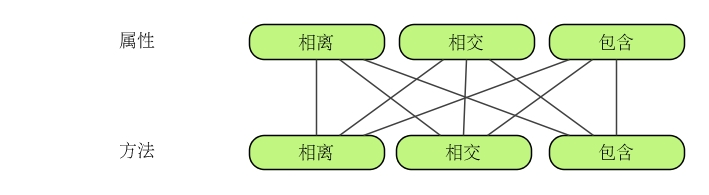
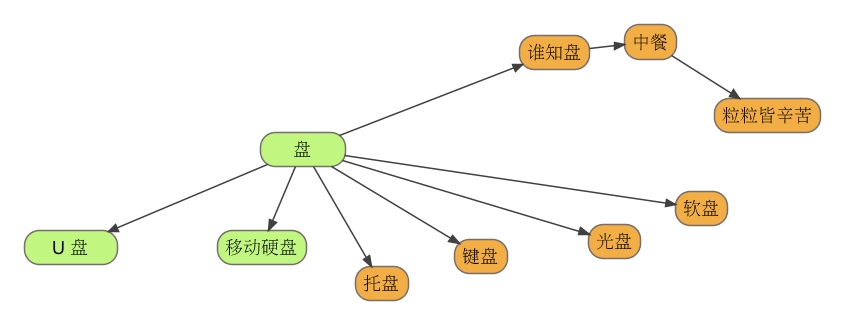
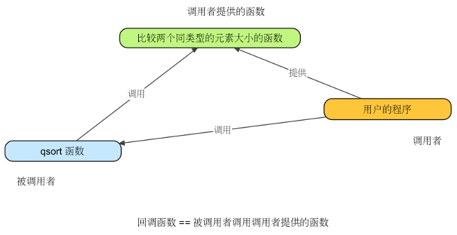
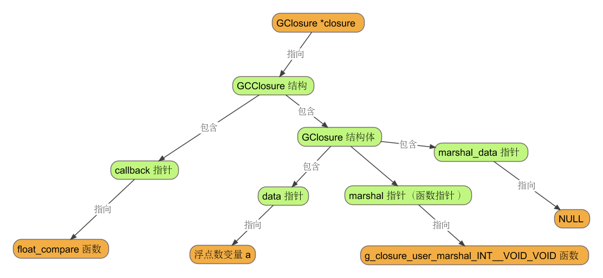
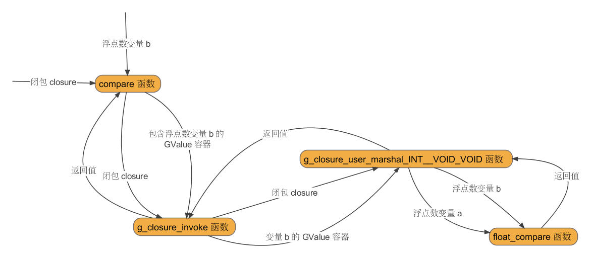

 
<!--BEGIN_DATA
{
    "create_date": "2019-02-01 17:40",
    "modify_date": "2019-02-01 17:40",
    "is_top": "0",
    "summary": "GObject 2",
    "tags": "C/C++",
    "file_name": "GObject_2.md"
}
END_DATA-->

####
原文出处：<a href='http://garfileo.is-programmer.com/2011/3/8/inherition-of-gobject.25106.html' target='blank'>GObject 的子类继承</a>

在文档 [1] 中，我们构造了一个 KbBibtex 类，其构造过程看似挺复杂，但实际上只需要动手尝试一下，即可明白 GObject 子类化的各项步骤的意义与作用。许多事物之所以被认为复杂，是因为大家在观望。

本文沿用文档 [1] 中的那个 KbBibtex 示例，学习如何对其进行子类化，构造新类，即面向对象程序设计方法中类的继承。

#####文献有很多种类

写过论文的人都知道，参考文献的形式有许多种类，例如期刊论文、技术报告、专著等，并非所有的文献格式都能表示文档 [1] 所给出的 KbBibtex 对象属性，即：

    
    
    typedef struct _KbBibtexPrivate KbBibtexPrivate;
    struct _KbBibtexPrivate {
            GString *title;
            GString *author;
            GString *publisher;
            guint   year;
    };
    

对于期刊论文而言，也许我们期望的数据结构是：

    
    
    typedef struct _KbBibtexPrivate KbBibtexPrivate;
    struct _KbBibtexPrivate {
            GString *title;
            GString *author;
            GString *journal;
            GString *volume;
            GString *number;
            GString *pages;
            guint   year;
            GString *publisher;
    };
    

对于技术报告，需求又要变成：

    
    
    typedef struct _KbBibtexPrivate KbBibtexPrivate;
    struct _KbBibtexPrivate {
            GString *title;
            GString *author;
            GString *institution;
            guint   year;
    };

这样的变化非常之多。因此，设计一个 "万能"的 KbBibtex 类，使之可以表示任何文献类型，看上去会很美好。

#####类的继承

因为期刊论文这种对象只比文档 [1] 中的 KbBibtex 对象多出 4 个属性，即 journal、volume、number、pages，其他属性皆与 KbBibtex 对象相同。

在程序猿的职业生涯中也许不断听到这样的警告：Don't Repeat Yourself（不要重复）！所以面向对象程序设计方法会告诉我们，既然
KbBibtex 对象已经拥有了一部分期刊论文对象所需要的属性，后者与前者都属于 KbBibtex 类（因为它们都是文献类型），那么只需设计一个期刊论文类，让它可以继承 KbBibtex 类的所以所拥有的一切，那么就可以不用 DRY 了。

那么怎么来实现？和 GObject 子类化过程相似，只需建立一个 kb-article.h 头文件，与继承相关的代码如下：

    
    
    #include "kb-bibtex.h"
    typedef struct _KbArticle KbArticle;
    struct _KbArticle {
            KbBibtex parent;
    };
    typedef struct _KbArticleClass KbArticleClass;
    struct _KbArticleClass {
            KbBibtexClass parent_class;
    };
    

然后，再建立一个 kb-article.c 源文件，其中与继承相关的代码如下：

    
    
    G_DEFINE_TYPE (KbArticle, kb_article, KB_TYPE_BIBTEX);
    

另外，KbBibtex 对象的 kb\_bibtex\_printf 方法也需要被 KbArticle 对象继承，这只需在 kb\_article\_printf 函数中调用 kb\_bibtex\_printf 即可实现，例如：

    
    
    void
    kb_article_printf (KbArticle *self)
    {
            kb_bibtex_printf (&self->parent);
            /* 剩下代码是 KbArticle 对象的 kb_article_printf 方法的具体实现 */
            ... ...
    }
    

当然，kb-article.h 和 kb-article.c 中剩余代码需要类似文档 [1] 中实现 KbBibtex 类那样去实现 KbArticle 类。这部分代码，我希望你能动手去尝试一下。下面，我仅给出测试 KbArticle 类的 main.c 源文件内容：

    
    
    #include "kb-article.h"
    int
    main (void)
    {
            g_type_init ();
            KbArticle *entry = g_object_new (KB_TYPE_ARTICLE,
                                             "title", "Breaking paragraphs into lines",
                                             "author", "Knuth, D.E. and Plass, M.F.",
                                             "publisher", "Wiley Online Library",
                                             "journal", "Software: Practice and Experience",
                                             "volume", "11",
                                             "number", "11",
                                             "year", 1981,
                                             "pages", "1119-1184",
                                             NULL);
            kb_article_printf (entry);
            g_object_unref (entry);
            return 0;
    }
    

测试结果表明，一切尽在掌握之中：

    
    
    $ ./test
        Title: Breaking paragraphs into lines
       Author: Knuth, D.E. and Plass, M.F.
    Publisher: Wiley Online Library
         Year: 1981
      Journal: Software: Practice and Experience
       Volume: 11
       Number: 11
        Pages: 1119-1184
    

#####继承真的很美好？

通过类的继承来实现一部分的代码复用真的是很惬意。但是，《C专家编程》一书的作者却不这么认为，为了说明类的继承通常很难解决现实问题，他运用了一个比喻，将程序比作一本书，并将程序库比作一个图书馆。当你基于一个程序库去写你个人的程序之时，好比你在利用图书馆中的藏书去写你个人的书，显然你不可能很轻松的在那些藏书中复印一部分拼凑出一本书。

就本文开头所举的例子而言，就无法通过继承文档 [1] 所设计的 KbBibtex 类来建立技术报告类，因为技术报告对象是没有 publisher 属性的。

也许你会说，那是 KbBibtex 类设计的太烂了。嗯，我承认这一点，但是你不可能要求别人在设计程序库时候知道你想要什么，就像你不能去抱怨为什么图书馆里的藏书怎么不是为你写书而准备的一样。

基类设计的失误，对于它的所有子类是一场巨大的灾难。要避免这种灾难，还是认真考虑自己所要解决的问题吧。其实很多问题都可以不需要使用继承便可以很好的解决，还有许多问题不需要继承很多的层次也可以很好的解决。

对于本文的问题，不采用继承的实现会更好。比如我们可以这样来改造 KbBibtex 类：

  * 将 Bibtex 文献所有格式的属性都设为 KbBibtex 的类属性
  * 为 Bibtex 对象拥有一个链表或数组之类的线性表容器，或者效率更高的 Hash 表容器（GLib 库均已提供），容器的第一个单元存储 Bibtex 对象对应的文献类型，其他单元则存储文献的属性。
  * 在 kb\_bibtex\_set\_property 与 kb\_bibtex\_get\_property 函数中，实现 Bibtex 类属性与 Bibtex 对象属性的数据交换。

仅此而已。

如果说继承是美好的，那么平坦一些会更美好。如果你不愿意选择平坦，那么可以选择接口（Interface），这是下一篇文档的主题。

~ End ~

####
原文出处：<a href='http://garfileo.is-programmer.com/2011/3/15/inheritance-and-interface.25299.html' target='blank'>继承与接口</a>

本文仅仅表达了我对面向对象程序设计方法中继承和接口用法的理解。

在文档 [1] 中，讨论了有关 GObject 子类继承的问题，并在后半部分指出了类的继承所存在的问题，并企图挖掘类的继承是多么的没用。这显然是徒劳的，因为类的继承的确是有用的，并且我们已经见 识过它不计其数的应用，例如几乎所有的 GUI 库都是基于类的继承的方式而设计的。

那么，为什么会这样？这是因为 GUI 库的设计者们发现类的继承非常适合解决他们的问题。

那么，他们的问题是什么问题？答案很简单，这肯定跟对象的属性和方法有关系。当然，这个答案连我都不满意，但它指明了分析的方向。我们沿着这个方向分析一下。

如果对象 A 所拥有的属性和方法，对象 B 也拥有，但是对象 B 还拥有对象 A 所没有的属性和方法，那么对象 B 便可以继承对象 A。

简而言之，只有当对象 A 的属性和方法是对象 B 的真子集时，即 [tex]A\subset B[/tex] 时，对象 B 继承对象 A 才有意义，因为这样可以节省重复编写相同的代码，即代码复用。

事实上，对象 A 与对象 B 之间的属性和方法的组合可以分为 9 种情况，如下图：

类 的继承仅能解决这 9 种情况中的一种，即属性与方法同时表现为包含（或被包含）的关系。比如 MP3 可以继承 U 盘，因为 U 盘所具备的属性和方法，MP3 也具备，但是 MP3 还多了音频播放的相关属性与方法。U 盘和移动硬盘之间便不可能存在继承/被继承的关系，因为它们的属性与方法顶多能形成一个交集。U 盘与键盘，虽然名字都有个"盘"，但它们的属性和方法连交集都谈不上。

基于上面的分析，我们从继承无法解决的那 8 种情况中选取一种来研究一下。比如，选取属性相离但方法相交的情况，该情况与那个 U 盘和移动硬盘的示例相对应。

U 盘和硬盘，属性是不同的。U 盘的属性是闪存结构，而硬盘的属性是磁碟+磁头+马达结构，但它们都有一块芯片，可以通过计算机主机 USB 接口与内存进行数据交换。这块芯片主要负责的工作就是数据的读入和写出，这就是 U 盘和移动硬盘所共有的方法。

假如我们非要用类的继承来模拟 U 盘与移动硬盘的关系，这样做的结果不仅不能解决代码复用问题，反而会增加冗余代码。因为必须要将 U 盘与移动硬盘所共有的属性与方法提取出来，形成一个基类，然后由这个基类派生出 U 盘和移动硬盘，如下图所示：

好像 C++ 语言里有一种"抽象类"的概念，专门用来制造上图中类似"盘"的东西。我认为，既然一个类无法形成实体，那么这个类就不应该存在。虽然抽象类可以干很多事情，但事实上它所干的那些事情并不是它的本意。

虽然，我们都是"人类"，但是"人类"这个抽象类对于我们人类本身而言一丁点意义都没有。只有在于"非人类"这种对象打交道的时候，"人类"这个抽象类才可能会有意义。

在设计抽象类的时候，我认为一定要考虑清楚，有没有和这个类并驾齐驱的其他类，并考察它们之间是否有相交的方法。例如，计算机的核心构件只有三类东西，一种是"盘"，一种是"线"，一种是"电"。这三类东西，虽然可以并驾齐驱，但是它们之间并没有相交的方法。

在 一些网络游戏里，抽象类貌似有点意义。例如，角色划分有人族、兽族、精灵族等等，其中每个族都可以对应一个抽象类，这些抽象类存在相交的方法，例如打 boss 升级，人族、兽族、精灵族中的对象，其升级的比例可能会不一样，比如兽族可能升的快，精灵族升的慢。毕竟扮演野兽，要比扮演神仙需要多付出一点心理承受 力。

在处理 U 盘和移动硬盘二者之间关系的问题上，也许 Java 给出了更好的思路。它说，用接口吧！

是阿，U 盘和移动硬盘，虽然本质（属性）上有所区别，但是它们的接口都是 USB。并且，只要它们插到计算机上，主机不关心那个东西是 U 盘还是移动硬盘，它只需要知道对方是个 USB 设备就 ok 了。这样，我们不需要在计算机主机中单独为 U 盘创造一种 U 盘接口，也不需要单独为移动硬盘创造一种移动硬盘接口。

虽然，USB 接口的存在，既没有让 U 盘的设计变的简单，也没让移动硬盘的设计变的简单，但是它让计算机主机的设计变的简单了，并且让 U 盘和移动硬盘的易用性也得到了提高，你只需要将它们插到一种接口中即可。

接 口，通常表现为"协议"。例如，tcp/ip 就是接口。我们只要上 internet，所访问的所有计算机基本上都是具有 tcp/ip 这种协议的计算机，我们不关心这种计算机上安装的是 Linux，还是 Linux，还是 Linux。虽然 tcp/ip 没有简化网卡的设计，但是它简化了计算机操作系统的设计，并且让网络的易用性得到了提高，大家只需要打开 firefox 就可以了。

总之，接口不是用来搞代码复用以简化对象设计的，而是用来简化对象的上层建筑的设计。

既然 tcp/ip 之类的软件已经采用了接口的设计方式，那么为什么要在面向对象程序设计里再去强调这个概念？

那是因为面向对象程序设计中的继承的概念一方面可用于接口的实现，另一方面可实现接口的继承。

使用接口，很简单，只需要将一个类"继承"这个接口类，然后实现接口所规定的方法（行为）。

接口的继承，这也很好理解，比如 USB 协议有 1.0 版、2.0 版，TCP/IP 协议从 v1 到现在的 v4 和 v6。接口版本的升级往往要向后兼容，所以面向对象程序设计中的类的继承的概念，很自然的可用于表示接口的升级。

如果明白了以上的概念，那么下一篇便可以尝试 GObject 的接口模拟。

~ End ~

####
原文出处：<a href='http://garfileo.is-programmer.com/2011/3/16/gobject-interface.25338.html' target='blank'>GObject 对接口的模拟</a>

在文档 [1] 中谈到接口古已有之，但是类的继承赋予了它一些新的概念。本文结合实例，学习如何使用 GObject 库所提供的接口类型来表达这些概念。

#####接口声明

下面的代码（文件名 my-iusb.h）声明了一个叫做 MyIUsb 的接口，My 是项目名，I 是 interface 的首字母的大写，Usb
表示接口的名称。MyIUsb 就表示在 "My"项目里，Usb 是一个 Interface。

    
    
    #ifndef MY_IUSB_H
    #define MY_IUSB_H
    #include <glib-object.h>
    #define MY_TYPE_IUSB (my_iusb_get_type ())
    #define MY_IUSB(obj) (G_TYPE_CHECK_INSTANCE_CAST ((obj),MY_TYPE_IUSB, MyIUsb))
    typedef struct _MyIUsb MyIUsb;
    typedef struct _MyIUsbInterface MyIUsbInterface;
    struct _MyIUsbInterface {
        GTypeInterface parent_interface;
        gchar * (*read) (MyIUsb *self);
        void (*write) (MyIUsb *self, const gchar *str);
    };
    GType my_iusb_get_type (void);
    gchar * my_iusb_read (MyIUsb *self);
    void my_iusb_write (MyIUsb *self, const gchar *str);
    #endif
    

上述代码与文档[5]中 KbBibtex 类的声明代码很相似，但也有所区别。

首先，MyIUsb 接口的实例结构体，它只是个名字，并没有具体实现。这是因为，在 Java 那样的语言里谈到"接口"，那么则意味着它是无法实例化的。这其中是有一定的道理的，因为接口只是协议嘛。

其次，MyIUsbInterface 是 MyIUsb 接口的类结构体，它继承自 GTypeInterface 类结构体。也就是说，当你要声明接口时，那么接口的类结构体便要继承 GTypeInterface 类结构体，而当你声明的是可实例化为对象的类时，其类结构体便要继承 GObjectClass。

再次，在 MyIUsbInterface 结构体中，可包含一组函数指针，它们便是接口的协议。

最后，声明接口。对于本例而言，接口便是 my\_iusb\_read 与 my\_iusb\_write。

上述代码的解读过程大致是：

  1. 这是一个 usb 接口。
  2. 这个接口即可以 read，也可以 write，但是 read 只能是返回字符串，而 write 只能是接受字符串
  3. 声明这个接口的具体形式，在现实中则以理解为声明 usb 接口有几根线构成，每根线的功能等等。

#####接口的定义

建立 my-iusb.c 源文件，内容如下：

    
    
    #include "my-iusb.h"
    G_DEFINE_INTERFACE (MyIUsb, my_iusb, G_TYPE_INVALID);
    static void
    my_iusb_default_init (MyIUsbInterface *iface)
    {
    }
    gchar *
    my_iusb_read (MyIUsb *self)
    {
            g_return_if_fail (MY_IS_IUSB (self));
            MY_IUSB_GET_INTERFACE (self)->read (self);
    }
    void
    my_iusb_write (MyIUsb *self, const gchar *str)
    {
            g_return_if_fail (MY_IS_IUSB (self));
            MY_IUSB_GET_INTERFACE (self)->write (self, str);
    }
    

其中，my\_iusb\_default\_init 是 G\_DEFINE\_INTERFACE
宏的展开代码中声明的一个函数，其中可以放置接口的一些初始化代码。如果没有这方面的需求，就让它表现为一个空函数即可，否则编译器会警告你，说你有一个函数声明了但没有实现。

另外，上述代码中出现了三个陌生的宏，其功能如下：

  * G\_DEFINE\_INTERFACE 宏的功用与 G\_DEFINE\_TYPE 类似，后者在 GObject 子类化的时候经常使用；
  * MY\_IS\_IUSB 宏是用来检测对象是否为 MyIUsb 类型，最好要在 my-iusb.h 中进行定义，代码为：

    
    	#define MY_IS_IUSB(obj) (G_TYPE_CHECK_INSTANCE_TYPE ((obj), MY_TYPE_IUSB))
    

  * 在 GObject 子类化的时候，也可以定义类似的宏，用于识别某个对象对应哪种类型。比如之前我们用过的一个 G\_IS\_OBJECT 宏，它可以识别对象是否为 GObject 类型的对象。
  * MY\_IUSB\_GET\_INTERFACE 宏，用于从 MyIUsb 接口的实例结构体中取出类结构体指针，然后利用该指针访问接口对应的方法。至于 MyIUsb 接口的实例结构体是怎样与类结构体指针取得关联的，那是 GObject 的内幕，暂且不必关心。MY\_IUSB\_GET\_INTERFACE 宏也需要在 my-iusb.h 中进行定义，如下：

    
    
    	#define MY_IUSB_GET_INTERFACE(obj) (\
                    G_TYPE_INSTANCE_GET_INTERFACE ((obj), MY_TYPE_IUSB, MyIUsbInterface))
    

现在，将 my-iusb.h 文件更新为：

    
    
    #ifndef MY_IUSB_H
    #define MY_IUSB_H
    #include <glib-object.h>
    #define MY_TYPE_IUSB (my_iusb_get_type ())
    #define MY_IUSB(obj) (G_TYPE_CHECK_INSTANCE_CAST ((obj),MY_TYPE_IUSB, MyIUsb))
    #define MY_IS_IUSB(obj) (G_TYPE_CHECK_INSTANCE_TYPE ((obj), MY_TYPE_IUSB))
    #define MY_IUSB_GET_INTERFACE(obj) (\
                    G_TYPE_INSTANCE_GET_INTERFACE ((obj), MY_TYPE_IUSB, MyIUsbInterface))
    typedef struct _MyIUsb MyIUsb;
    typedef struct _MyIUsbInterface MyIUsbInterface;
    struct _MyIUsbInterface {
        GTypeInterface parent_interface;
        gchar * (*read) (MyIUsb *self);
        void (*write) (MyIUsb *self, const gchar *str);
    };
    GType my_iusb_get_type (void);
    gchar * my_iusb_read (MyIUsb *self);
    void my_iusb_write (MyIUsb *self, const gchar *str);
    #endif
    

#####插曲：经常要用到并且需要自己定义的宏

文档 [2-5] 中自定义了多个宏，在此略微进行总结一下，免的后续文档再多费口舌。

对于 GObject 的子类化，那么在声明类的时候，在头文件中直接插入类似下面的一组宏定义：

    
    
    #define P_TYPE_T (p_t_get_type ())
    #define P_T(obj) (G_TYPE_CHECK_INSTANCE_CAST ((obj), P_TYPE_T, PT))
    #define P_IS_T(obj) G_TYPE_CHECK_INSTANCE_TYPE ((obj), P_TYPE_T))
    #define P_T_CLASS(klass) (G_TYPE_CHECK_CLASS_CAST ((klass), P_TYPE_T, PTClass))
    #define P_IS_T_CLASS(klass) (G_TYPE_CHECK_CLASS_TYPE ((klass), P_TYPE_T))
    #define P_T_GET_CLASS(obj) (G_TYPE_INSTANCE_GET_CLASS ((obj), P_TYPE_T, PTClass))
    

这些宏的用法总结如下：

  * P\_TYPE\_T：仅在使用 g\_object\_new 进行对象实例化的时候使用一次，用于向 GObject 库的类型系统注册 PT 类；
  * P\_T (obj)：用于将 obj 对象的类型强制转换为 P\_T 类的实例结构体类型；
  * P\_IS\_T (obj)：用于判断 obj 对象的类型是否为 P\_T 类的实例结构体类型；
  * P\_T\_CLASS(klass)：用于将 klass 类结构体的类型强制转换为 P\_T 类的类结构体类型；
  * P\_IS\_T\_CLASS(klass)：用于判断 klass 类结构体的类型是否为 P_T 类的类结构体类型；
  * P\_T\_GET\_CLASS(obj)：获取 obj 对象对应的类结构体类型。

对于 GTypeInterface 的子类化，在声明类的时候，在头文件中直接插入类似下面的一组宏定义：

    
    
    #define P_TYPE_IT (p_t_get_type ())
    #define P_IT(obj) (G_TYPE_CHECK_INSTANCE_CAST ((obj), P_TYPE_IT, PIt))
    #define P_IS_IT(obj) (G_TYPE_CHECK_INSTANCE_TYPE ((obj), P_TYPE_IT))
    #define P_IT_GET_INTERFACE(obj) \
            (G_TYPE_INSTANCE_GET_INTERFACE ((obj), P_TYPE_IT, PItInterface))
    

  * P\_TYPE\_IT：仅在接口实现时使用一次，用于向 GObject 库的类型系统注册 PIT 接口；
  * P\_IT (obj)：用于将 obj 对象的类型强制转换为 P\_IT 接口的实例结构体类型；
  * P\_IS\_IT (obj)：用于判断 obj 对象的类型是否为 P\_IT 接口的实例结构体类型；
  * P\_IT\_GET\_INTERFACE(obj)：获取 obj 对象对应的 P\_IT 接口的类结构体类型。

#####接口的实现----制造 U 盘

既然已经有了 USB 接口的声明（协议），那就意味着我们可以制造具备这种接口的类与对象了。

首先声明 U 盘类（my-udisk.h）：

    
    
    #ifndef MY_UDISK_H
    #define MY_UDISK_H
    #include "my-iusb.h"
    #define MY_TYPE_UDISK (my_udisk_get_type ())
    #define MY_UDISK(obj) (G_TYPE_CHECK_INSTANCE_CAST ((obj), MY_TYPE_UDISK, MyUdisk))
    #define MY_IS_UDISK(obj) (G_TYPE_CHECK_INSTANCE_TYPE ((obj), MY_TYPE_UDISK))
    #define MY_UDISK_CLASS(klass) \
            (G_TYPE_CHECK_CLASS_CAST ((klass), MY_TYPE_UDISK, MyUdiskClass))
    #define MY_IS_UDISK_CLASS(klass) (G_TYPE_CHECK_CLASS_TYPE ((klass), MY_TYPE_UDISK))
    #define MY_UDISK_GET_CLASS(obj) \
            (G_TYPE_INSTANCE_GET_CLASS ((obj),MY_TYPE_UDISK,MyUdiskClass))
    typedef struct _MyUdisk MyUdisk;
    typedef struct _MyUdiskClass MyUdiskClass;
    struct _MyUdisk {
            GObject parent;
            GString *data;
    };
    struct _MyUdiskClass {
            GObjectClass parent_class;
    };
    GType my_udisk_get_type (void);
    #endif
    

上述代码声明了一个 MyUdisk 类，它是 GObject 的子类。MyUdisk 类的实例结构体中有一个 GString 类型的 data
属性，用于存储数据。也就是说，这个 U 盘设计的有些脑残，因为它只能存储一个字符串！

然后定义 U 盘类（my-udisk.c）：

    
    
    #include "my-udisk.h"
    static void my_iusb_interface_init (MyIUsbInterface *iface);
    G_DEFINE_TYPE_WITH_CODE (MyUdisk, my_udisk, G_TYPE_OBJECT,
                             G_IMPLEMENT_INTERFACE (MY_TYPE_IUSB, my_iusb_interface_init));
    static gchar *
    my_udisk_read (MyIUsb *iusb)
    {
            MyUdisk *udisk = MY_UDISK (iusb);
            return udisk->data->str;
    }
    static void
    my_udisk_write (MyIUsb *iusb, const gchar *str)
    {
            MyUdisk *udisk = MY_UDISK (iusb);
            g_string_assign (udisk->data, str);
    }
    static void
    my_udisk_init (MyUdisk *self)
    {
            self->data = g_string_new (NULL);
    }
    static void
    my_udisk_class_init (MyUdiskClass *self)
    {
    }
    static void
    my_iusb_interface_init (MyIUsbInterface *iface)
    {
            iface->read = my_udisk_read;
            iface->write = my_udisk_write;
    }
    

上述代码中，有几处需要留意的地方：

  * my\_iusb\_interface\_init 函数声明必须要放在 G\_DEFINE\_TYPE\_WITH\_CODE 宏之前，因为这个宏的展开代码中需要使用这个函数；
  * G\_DEFINE\_TYPE\_WITH\_CODE 是文档 [2-5] 中出现过的 G\_DEFINE\_TYPE 宏的"扩展版本"，在本例中可以向 my\_udisk\_get\_type 函数（即 MY\_TYPE\_UDISK 宏展开的那个函数）中插入 C 代码。在本例中，这个宏所插入的 C 代码是"G\_IMPLEMENT\_INTERFACE(MY\_TYPE\_IUSB,my\_iusb\_interface\_init)"，其中 G\_IMPLEMENT\_INTERFACE 宏的作用是将接口添加到  MyUdisk 类中；
  * my\_iusb\_interface\_init 函数的作用是表明 MyUdisk 类实现了 MyIUsb 所规定的接口。

至此，MyIUsb 接口的一个实现便完成了。下面的 main.c 文件中的代码用于测试这个 U 盘是否可以使用 MyIUsb 接口进行访问，即：

    
    
    #include "my-udisk.h"
    int
    main (void)
    {
            g_type_init ();
            MyUdisk *udisk = g_object_new (MY_TYPE_UDISK, NULL);
            my_iusb_write (MY_IUSB (udisk), "I am u-disk!");
            gchar *data = my_iusb_read (MY_IUSB (udisk));
            g_printf ("%s\n\n", data);
            g_printf ("Is udisk a MyIUsb object?\n");
            if (MY_IS_IUSB (udisk))
                    g_printf ("Yes!\n");
            else
                    g_printf ("No!\n");
            g_printf ("\nIs udisk a MyUdisk object?\n");
            if (MY_IS_UDISK (udisk))
                    g_printf ("Yes!\n");
            else
                    g_printf ("No!\n");
            return 0;
    }
    

这个程序的编译命令及执行结果如下：

    
    
    $ gcc $(pkg-config --cflags --libs gobject-2.0) my-iusb.c my-udisk.c main.c -o test
    $ ./test
    I am u-disk!
    Is udisk a MyIUsb object?
    Yes!
    Is udisk a MyUdisk object?
    Yes!
    

一切都在掌握之中啊。

#####还可以接着造移动硬盘

可以像制造 U 盘那样，便可以炮制移动硬盘了。这项艰巨的任务便交给你了，而懒惰的我只提供下面这个计算机主机程序：

    
    
    #include "my-udisk.h"
    int
    main (void)
    {
            g_type_init ();
            gchar *data = NULL;
            MyUdisk *udisk = g_object_new (MY_TYPE_UDISK, NULL);
            my_iusb_write (MY_IUSB (udisk), "I am an u-disk!");
            data = my_iusb_read (MY_IUSB (udisk));
            g_printf ("%s\n", data);
            MyPortableHardDisk *phdisk = g_object_new (MY_TYPE_PORTABLE_HARD_DISK, NULL);
            my_iusb_write (MY_IUSB (phdisk), "I am a portable hard disk!");
            data = my_iusb_read (MY_IUSB (phdisk));
            g_printf ("%s\n", data);
            return 0;
    }
    

～ End ～

####
原文出处：<a href='http://garfileo.is-programmer.com/2011/3/20/function-pointer-and-callback-function-and-closure.25453.html' target='blank'>函数指针、回调函数与 GObject 闭包</a>

本文首先复习一下基于 C 语言函数指针和回调函数的概念，进而学习 GObject 闭包的用法。这些知识都与面向对象程序设计基本上没有什么关系。

#####函数指针

所谓函数指针，就是可以指向函数的指针，例如：

    
    
    int 
    foo (void)
    {
            return 1;
    }
    int 
    main (void)
    {        
            int (*func) (void);
            func = foo;
            func ();
            return 0;
    }
    

代码中的 func 即为一个函数指针，它可以指向一个无参数且返回值为整型数的函数，还可以调用它。

只要不会将：

    
    
    int (*func) (void);
    

与

    
    
    int *func (void);
    

弄混（后者是返回值类型为整型数指针的函数），那么对于函数指针的理解就没什么大问题了。

由于  "int (*func) (void)" 这种声明函数指针的形式看上去有点怪异，所以很多人喜欢用 typedef 将函数值指针定义成类型以便使用，例如：

    
    
    typedef int (*Func) (void);
    Func func = foo;
    

如果对于上述内容理解起来并不费劲，那么下面就可以谈谈回调函数了。

#####回调函数

在编写一些程序库的时候，设计者有时会认为有些功能，不应该由他自作主张，而应当由使用者来决定。这方面，比较有名的例子是 C 标准库中的 qsort 函数：

    
    
    void qsort (void *base, 
                size_t nmemb, 
                size_t size,
                int (*compar) (const void *, const void *));
    

它的第 4 个参数即为函数指针，它可以指向形式为：

    
    
    int foo (const void *param1, const void *param2);
    

的所有函数。

Q：这个函数指针的作用是什么？

A：它是用来指向用户提供的回调函数的。

Q：用户提供的回调函数是什么意思？

A：因为 qsort 的设计目标是对任意类型的同类数据集合进行快速排序，比如一组整型数的排序，或者一组字符串的排序。既然是排序，那么 qsort 必须知道如何判定具体类型的两个数据的大小，而 qsort 的设计者认为这一功能应当交给用户来实现，因为他并不清楚用户究竟要使用 qsort 对哪种类型的数据集合进行排序，只有用户自己清楚。

Q：用户提供的回调函数究竟是什么意思？

A：就是对于用户所要排序的数据集合而言，用户提供一个可以比较该数据集合中任意两个元素大小的函数，这个函数便是 qsort 的回调函数。

用户、被调用的函数 qsort 以及回调函数，它们之间的关系如下图所示：

下面是使用 qsort 函数进行字符串数组递增排序的示例：

    
    
    #include <stdio.h>
    #include <stdlib.h>
    #include <string.h>
    static int
    str_compare (const void *s1, const void *s2)
    {
            char *str1 = *(char **)s1;
            char *str2 = *(char **)s2;       
            size_t l1 = strlen (str1);
            size_t l2 = strlen (str2);
            if (l1 > l2)
                    return 1;
            else if (l1 == l2)
                    return 0;
            else
                    return -1;
    }
    int
    main (void)
    {
            char *str_array[5] = {"a", "abcd", "abc", "ab", "abcde"};
            qsort (str_array, 5, sizeof (char *), str_compare);
            for (int i = 0; i< 5; i++)
                    printf ("%s ", str_array[i]);
            printf ("\n");
            return 0;
    }
    

#####闭包（Closure）的概念

从上一节，我们通过函数指针向 qsort 函数传入了一个函数 str\_compare，这个函数被称为回调函数，但是它还有一个比较深奥的名字----"
**闭包** "。

所谓 **闭包** ，简而言之， **就是一个函数加上它所访问的所有非局部变量**
，而所谓"非局部变量"，表示这些变量对于那个函数而言既非局部变量，也非全局变量。

我们向 qsort 传入函数 str\_compare，它所接受排序数据集合中的 2 个元素，而且 2 个元素对于 str\_compare
而言，既非是全局变量，也非其局部变量，因此 str_compare 与这 2 个参数形成了一个闭包。

在许多动态语言中，闭包通常也被昵称为"函数是第一类对象"，即函数与那些语言中基本类型具有相同的权利，例如函数可以存储在变量中，可以作为实参传递给其他函数，还可以作为其他函数的返回值。

#####恶魔来临

在 C 语言中，利用函数指针并配合参数的复制与传递，可模拟闭包这种结构，但是在可读性上没有那些内建支持闭包的语言优雅。

GObject 提供了 GClosure 对象与方法，实现了功能比较全面的 C 闭包模拟，我们可以在程序中直接使用它。下面，通过一个很小的示例，演示
GClosure 的使用。

先来看一个非 GClosure 的 C 闭包示例：

    
    
    #include <stdio.h>
    #include <math.h>
    #include <string.h>
    typedef int (*Func) (void *, void *);
    static void
    compare (void *a, void *b, Func callback)
    {
            int r = callback (a, b);
            if (r == -1)
                    printf ("a < b\n");
            else if (r == 0)
                    printf ("a = b\n");
            else
                    printf ("a > b\n");
    }
    static int
    float_compare (void *a, void *b)
    {
            float *f1 = (float *)a;
            float *f2 = (float *)b;
            if (*f1 > *f2)
                    return 1;
            else if (fabs (*f1 - *f2) <= 10E-6)
                    return 0;
            else
                    return -1;
    }
    static int
    str_compare (void *a, void *b)
    {
            size_t len1 = strlen ((char *)a);
            size_t len2 = strlen ((char *)b);
            if (len1 > len2)
                    return 1;
            else if (len1 == len2)
                    return 0;
            else
                    return -1;
    }
    int
    main (void)
    {       
            float a = 123.567;
            float b = 222.222;
            Func func = float_compare;
            compare (&a, &b, func);
            char *s1 = "hello world!";
            char *s2 = "hello!";
            func = str_compare;
            compare (s1, s2, func);
            return 0;
    }
    

上述代码主要实现了一个 compare 函数，它可以比较两个任意类型数据的大小，前提是你要向它提供特定的回调函数（闭包），例如代码中的
float\_compare 与 str\_compare 函数，它们分别实现了浮点数比较与字符串比较。

将上述程序改为 GClosure 实现，如下：

    
    
    #include <math.h>
    #include <glib-object.h>
    void
    g_cclosure_user_marshal_INT__VOID_VOID (GClosure     *closure,
                                            GValue       *return_value G_GNUC_UNUSED,
                                            guint         n_param_values,
                                            const GValue *param_values,
                                            gpointer      invocation_hint G_GNUC_UNUSED,
                                            gpointer      marshal_data)
    {
            typedef gint (*GMarshalFunc_INT__VOID_VOID) (gpointer     data1,
                                                         gpointer     data2);
            register GMarshalFunc_INT__VOID_VOID callback;
            register GCClosure *cc = (GCClosure*) closure;
            register gpointer data1, data2;
            gint v_return;
            g_return_if_fail (return_value != NULL);
            g_return_if_fail (n_param_values == 1);
            if (G_CCLOSURE_SWAP_DATA (closure))
            {
                    data1 = closure->data;
                    data2 = g_value_peek_pointer (param_values + 0);
            }
            else
            {
                    data1 = g_value_peek_pointer (param_values + 0);
                    data2 = closure->data;
            }
            callback = (GMarshalFunc_INT__VOID_VOID) (
                    marshal_data ? marshal_data : cc->callback);
            v_return = callback (data1, data2);
            g_value_set_int (return_value, v_return);
    }
    static void
    compare (GClosure *closure, void *b)
    {
            GValue return_value = {0};
            GValue param_value  = {0};
            g_value_init (&return_value, G_TYPE_INT);
            g_value_init (&param_value, G_TYPE_POINTER);
            g_value_set_pointer (&param_value, b);
            g_closure_invoke (closure, &return_value, 1, &param_value, NULL);
            gint r = g_value_get_int (&return_value);
            if (r == -1)
                    g_print ("a < b\n");
            else if (r == 0)
                    g_print ("a = b\n");
            else
                    g_print ("a > b\n");
            g_value_unset (&return_value);
            g_value_unset (&param_value);
    }
    static gint
    float_compare (void *a, void *b)
    {
            gfloat *f1 = a;
            gfloat *f2 = b;
            if (*f1 > *f2)
                    return 1;
            else if (fabs (*f1 - *f2) <= 10E-6)
                    return 0;
            else
                    return -1;
    }
    static gint
    str_compare (void *a, void *b)
    {
            size_t len1 = g_utf8_strlen ((gchar *)a, -1);
            size_t len2 = g_utf8_strlen ((gchar *)b, -1);
            if (len1 > len2)
                    return 1;
            else if (len1 == len2)
                    return 0;
            else
                    return -1;
    }
    int
    main (void)
    {
            g_type_init ();
            gfloat a = 123.567;
            gfloat b = 222.222;
            GClosure *closure =
                    g_cclosure_new (G_CALLBACK (float_compare), &a, NULL);
            g_closure_set_marshal (closure, g_cclosure_user_marshal_INT__VOID_VOID);
            compare (closure, &b);
            g_closure_unref (closure);
            gchar *s1 = "Hello World!\n";
            gchar *s2 = "Hello!\n";
            closure = g_cclosure_new (G_CALLBACK (str_compare), s1, NULL);
            g_closure_set_marshal (closure, g_cclosure_user_marshal_INT__VOID_VOID);
            compare (closure, s2);
            g_closure_unref (closure);
            return 0;
    }
    

很恐怖，看上去 GClosure 并没有简化闭包的实现，反而将其更加复杂化了，比如多出了 GClosure、GValue 等数据类型，还多出来一个
my\_cclosure\_user\_marshal\_INT\_VOID\_VOID 函数，而且 compare 函数的第 1 个参数的类型也变成
GClosure 指针类型了。

#####理解 GClosure

对于上一节所给出的 GClosure 的应用示例，我们从 main 函数入手解读一下。

首先看下面的代码：

    
    
    /* main 函数中的代码 */
            gfloat a = 123.567;
            gfloat b = 222.222;
            GClosure *closure =
                    g_cclosure_new (G_CALLBACK (float_compare), &a, NULL);
            g_closure_set_marshal (closure, g_cclosure_user_marshal_INT__VOID_VOID);
            compare (closure, &b);
            g_closure_unref (closure);
    

g\_cclosure\_new 函数创建了一个面向 C 语言的闭包。之所以在此强调是面向 C 语言，那是因为 GObject 的闭包是面向任意语言的，例如
pyg\_closure\_new 函数可以创建 python 语言的闭包。

g\_cclosure\_new 函数所创建的 C 语言闭包结构体是 GCClosure，其定义如下：

    
    
    typedef _GCClosure GCClosure;
    struct _GCClosure {
            GClosure	closure;
            gpointer	callback;
    };
    

联想一下 GObject 的子类化，上述代码暗示着 GCClosure 是 GClosure
的子类，不过这里没有类结构体以及实例化等概念，仅仅是结构体的继承。

在阅读下面的内容之前，一定 **要注意分辨 GCClosure 与 GClosure，它们的名字太相似了** 。

GCClosure 结构体包含了一个 GClosure 结构体 closure 以及一个无类型的数据指针 callback（因为 gpointer 是 void * 的别名）。前者是 GObject 提供的闭包结构，后者是一个指向回调函数的指针。 **这里一定要注意，用无类型指针指向一个函数，是 GObject 设计的一个缺陷** ，因为它假定了数据类型的指针与函数指针的存储宽度是相等的，虽然尽管目前大部分 PC 的 CPU 支持这一假设，但是 **在 C99 标准里，使用无类型的数据指针指向函数，这属于未定义的行为** 。

GClosure 结构体主要是面向各种语言对闭包的公有功能进行了基本抽象，这样所有要与 GObject 闭包机制打交道的语言，可以先继承 GClosure
结构体，然后再根据自身需要再添加一些特定的数据成员。例如，GCClosure 添加了 callback 无类型数据指针，用于指向闭包所对应的回调函数。

GClosure 结构体中包含许多成员，其中对于使用者较为重要的三个成员是 marshal、data 与 marshal\_data，其中 marshal
是一个函数指针，指向一个回调函数的调用者；data 与 marshal\_data 皆为 gpointer 指针类型。对于 C 语言闭包，data 指向用户向回调函数传递的数据地址，而 **marshal_data 则指向回调函数** 。我知道，这句话也许会引起下面的问答。

Q：那个 GCClosure 结构体中不是已经有了一个指向回调函数的 callback 指针吗？

A：这是因为callback 所指向的函数是闭包默认的回调函数，而 GObject 库允许你自由切换回调函数，可将 marshal\_data 看作是一个开关，它可以暂时屏蔽 GCClosure 中的 callback 所指向的回调函数，而启用 marshal\_data 所指向的回调函数。事后，可以调用 g\_closure\_set\_meta_marshal 函数将 marshal\_data
所指向的回调函数屏蔽，这样闭包的回调函数又被切换为 callback 所指向的回调函数了。下文会给出一个具体的示例来验证这一说法。

从 GObject 库使用者的角度，我们对 GClosure 结构体作用的理解在此止步即可。如果像文档 [1] 那样的深入挖掘，那么就好比是一个普通人在不具备医生心理素质的情况下解剖任何一种动物，恶心是难免的。

我们将话题转回刚才所讨论的 main 函数中的代码片段。看下面的代码：

    
    
    GClosure *closure = g_cclosure_new (G_CALLBACK (float_compare), &a, NULL);
    g_closure_set_marshal (closure, g_cclosure_user_marshal_INT__VOID_VOID);
    

它们一起实现了下图所示的数据结构：

紧接着，将所建立的闭包 closure 作为第一个参数，浮点数变量 b作为第 2 个参数，代入函数 compare，即：

    
    
    compare (closure, &b);
    

因为 closure 中即包含了浮点数变量 a，也包含了浮点数比较函数 float\_compare，因此在 compare 函数中，使用 float\_compare 函数可进行浮点数 a 与 b 大小比较，是显而易见的。但事实上，在 compare 函数中，我们并没有直接调用 float\_compare 函数，而是将这个任务交给了 g\_closure\_invoke 函数。

来看 compare 函数的主干部分：

    
    
    static void
    compare (GClosure *a, void *b)
    {
            ... ...
            g_closure_invoke (a, &return_value, 1, &param_value, NULL);
            gint r = g_value_get_int (&return_value);
            ... ...
    }
    

由于 compare 函数的第一个参数是闭包 closure，它已经包含了浮点数变量 a 和回调函数 float\_compare。当我们将 closure
作为 g\_closure\_invoke 函数的参数时，后者会基于 closure 中的 marshal 指针调用
g\_closure\_user\_marshal\_INT\_\_VOID\_VOID 函数，而
g\_closure\_user\_marshal\_INT\_\_VOID\_VOID 函数是我们自己定义的，对于本文示例而言其主干部分如下：

    
    
    void
    g_cclosure_user_marshal_INT__VOID_VOID ( ... )
    {
            ... ... ... 
            if (G_CCLOSURE_SWAP_DATA (closure))
            {
                    data1 = closure->data;
                    data2 = g_value_peek_pointer (param_values + 0);
            }
            ... ... ...
            callback = (GMarshalFunc_INT__VOID_VOID) (
                    marshal_data ? marshal_data : cc->callback);
            v_return = callback (data1, data2);
            ... ... ...
    }
    

上述代码所做的工作无非是从 closure 闭包中先获取浮点数变量 a，即 data1，然后从
g\_cclosure\_user\_marshal\_INT\_\_VOID\_VOID 函数的参数中获取浮点数变量 b，即 data2，然后再从 closure
闭包中获得 callback 指针所指向的回调函数，即 float\_compare，最终完成浮点数 a 与 b 的大小比较。

闭包调用的整个过程大致如下图所示：

GClosure 闭包的工作过程非常繁琐，它所做的主要工作就是向回调函数的调用过程中插入两个环节，即 g\_closure\_invoke 函数与
g\_closure\_user\_marshal\_\*\_\_** 函数。这样做的主要目的是提高闭包的灵活性。就像是链条，如果只有 2
个节点，那么它只能像一根直线段那样生存，如果将其改造成 4 个节点，它就变成了一条 3 次曲线了！

#####更换 marshal

前文说过，GClosure 结构体中有一个 marshal_data 指针，它也可以指向一个回调函数，并且会取代 GCClosure 结构体中
callback 指针所指向的回调函数。为了充分说明这一点，我们对前文的 GClosure 示例进行一些修改，如下：

    
    
    #include <math.h>
    #include <glib-object.h>
    void
    g_cclosure_user_marshal_INT__VOID_VOID (GClosure     *closure,
                                            GValue       *return_value G_GNUC_UNUSED,
                                            guint         n_param_values,
                                            const GValue *param_values,
                                            gpointer      invocation_hint G_GNUC_UNUSED,
                                            gpointer      marshal_data)
    {
            typedef gint (*GMarshalFunc_INT__VOID_VOID) (gpointer     data1,
                                                         gpointer     data2);
            register GMarshalFunc_INT__VOID_VOID callback;
            register GCClosure *cc = (GCClosure*) closure;
            register gpointer data1, data2;
            gint v_return;
            g_return_if_fail (return_value != NULL);
            g_return_if_fail (n_param_values == 1);
            if (G_CCLOSURE_SWAP_DATA (closure))
            {
                    data1 = closure->data;
                    data2 = g_value_peek_pointer (param_values + 0);
            }
            else
            {
                    data1 = g_value_peek_pointer (param_values + 0);
                    data2 = closure->data;
            }
            callback = (GMarshalFunc_INT__VOID_VOID) (
                    marshal_data ? marshal_data : cc->callback);
            v_return = callback (data1, data2);
            g_value_set_int (return_value, v_return);
    }
    static void
    compare (GClosure *closure, void *b)
    {
            GValue return_value = {0};
            GValue param_value  = {0};
            g_value_init (&return_value, G_TYPE_INT);
            g_value_init (&param_value, G_TYPE_POINTER);
            g_value_set_pointer (&param_value, b);
            g_closure_invoke (closure, &return_value, 1, &param_value, NULL);
            gint r = g_value_get_int (&return_value);
            if (r == -1)
                    g_print ("a < b\n");
            else if (r == 0)
                    g_print ("a = b\n");
            else
                    g_print ("a > b\n");
            g_value_unset (&return_value);
            g_value_unset (&param_value);
    }
    static gint
    str_compare (void *a, void *b)
    {
            size_t len1 = g_utf8_strlen ((gchar *)a, -1);
            size_t len2 = g_utf8_strlen ((gchar *)b, -1);
            if (len1 > len2)
                    return 1;
            else if (len1 == len2)
                    return 0;
            else
                    return -1;
    }
    static gint
    str_compare_new (void *a, void *b)
    {
            g_print ("\nI'm a new marshaller\n");
            return (str_compare (a, b));
    }
    int
    main (void)
    {
            g_type_init ();
            gchar *s1 = "Hello World!\n";
            gchar *s2 = "Hello!\n";
            GClosure *closure = g_cclosure_new (G_CALLBACK (str_compare), s1, NULL);
            g_closure_set_marshal (closure, g_cclosure_user_marshal_INT__VOID_VOID);
            compare (closure, s2);
            g_closure_set_meta_marshal (closure, str_compare_new, 
                                        g_cclosure_user_marshal_INT__VOID_VOID);
            compare (closure, s2);	
            g_closure_unref (closure);
            return 0;
    }
    

上述代码所做的修改，主要是删除了有关浮点数比较的示例部分，然后添加了一个新函数 str\_compare\_new，并对 main 函数中字符串比较部分的代码做了变动，重点观察以下代码：

    
    
    /* main 函数代码片段 */
            GClosure *closure = g_cclosure_new (G_CALLBACK (str_compare), s1, NULL);
            g_closure_set_marshal (closure, g_cclosure_user_marshal_INT__VOID_VOID);
            compare (closure, s2);
            g_closure_set_meta_marshal (closure, str_compare_new, 
                                        g_cclosure_user_marshal_INT__VOID_VOID);
            compare (closure, s2);	
    

第一次调用 compare 函数，闭包函数调用链的终端是 str\_compare 函数，而第二次调用 compare 函数时，闭包函数调用链的终端是
str\_compare\_new 函数，它再去调用 str\_compare 实现字串比较。这是因为，在第二次调用 compare 函数之前，我们通过 g\_closure\_set\_meta\_marshal 函数设置了 closure 闭包的 marshal\_data 指针，使其指向了 str\_compare\_new 函数。这样，在 g\_cclosure\_user\_marshal\_INT\_\_VOID\_VOID 函数中，代码：

    
    
    callback = (GMarshalFunc_INT__VOID_VOID) (marshal_data ? marshal_data : cc->callback);
    

callback 的值会是 marshal\_data，而非 cc->callback。

#####如何又快又好的产生 g_cclosure_user_marshal_* 函数？

GLib 库提供了一个名为 glib-genmarshal 的工具，它可以根据我们给出的函数描述信息产生有效的 marshal 代码。上文中的
g\_cclosure\_user\_marshal\_INT\_\_VOID\_VOID 函数，我便是使用这个工具产生的。

首先，准备好一份文本文档，例如 in\_\_void\_void.txt：

    
    
    INT:VOID,VOID
    

然后，执行命令：

    
    
    $ glib-genmarshal --body int__void_void.txt > int__void_void.c
    

即可产生 g\_cclosure\_user\_marshal\_INT\_\_VOID\_VOID 函数。

另外，GObject 也预定义了一组 marshal 函数，可参考文档 [2] 中所有 g\_cclosure\_marshal\_ 为前缀的函数。

